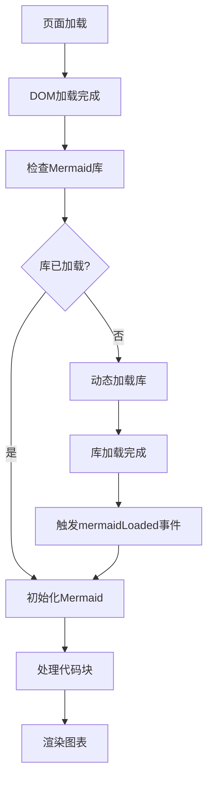
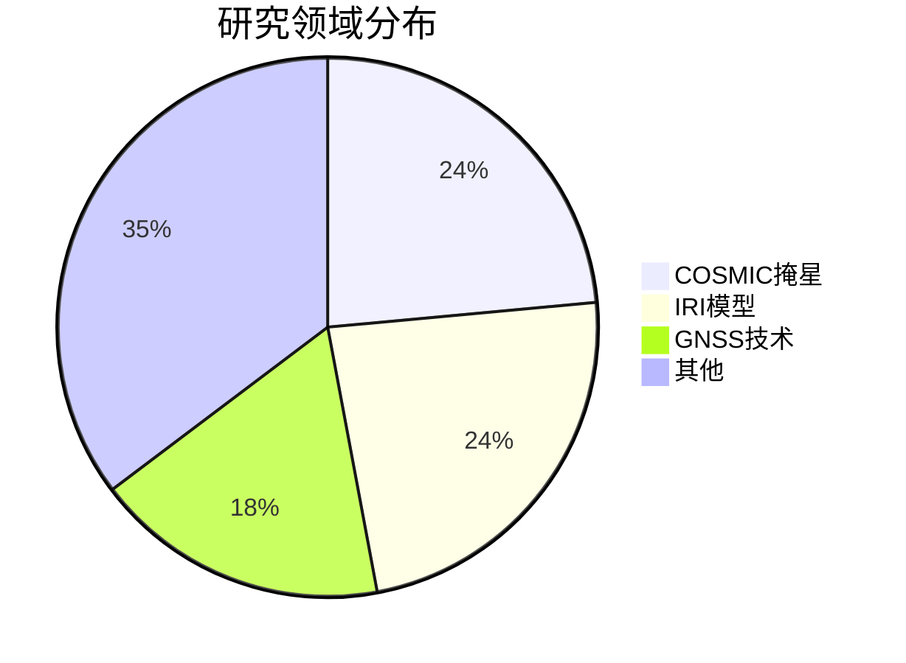

# 🔧 Mermaid图表渲染问题解决方案

## 🎯 问题描述

用户反映Mermaid图表没有正确渲染，只显示了代码块而没有生成图表。从图片中可以看到，在"研究领域分布"部分应该显示一个饼图，但实际显示的是空白区域，只有标题和一个小饼图图标。

## 🔍 问题分析

经过分析，发现以下几个可能的问题：

1. **Mermaid库加载时机问题**: Mermaid库可能在DOM加载完成之前就尝试初始化
2. **主题CSS样式冲突**: 主题的CSS样式可能覆盖了Mermaid的样式
3. **初始化脚本冲突**: 有两个地方都在初始化Mermaid，导致冲突
4. **JavaScript执行顺序问题**: 脚本执行时机不正确

## ✅ 解决方案

### 1. 修复Mermaid库加载时机

**文件**: `_includes/head/custom.html`

```html
<!-- Mermaid Library - 延迟加载 -->
<script>
  // 延迟加载Mermaid库
  function loadMermaid() {
    if (typeof mermaid === 'undefined') {
      const script = document.createElement('script');
      script.src = 'https://cdn.jsdelivr.net/npm/mermaid@10.6.1/dist/mermaid.min.js';
      script.onload = function() {
        console.log('Mermaid library loaded successfully');
        // 触发自定义事件，通知mermaid-init.js
        document.dispatchEvent(new CustomEvent('mermaidLoaded'));
      };
      script.onerror = function() {
        console.error('Failed to load Mermaid library');
      };
      document.head.appendChild(script);
    }
  }
  
  // 在DOM加载完成后加载Mermaid
  if (document.readyState === 'loading') {
    document.addEventListener('DOMContentLoaded', loadMermaid);
  } else {
    loadMermaid();
  }
</script>
```

### 2. 优化Mermaid初始化脚本

**文件**: `assets/js/mermaid-init.js`

主要改进：
- 监听`mermaidLoaded`事件
- 添加更好的错误处理
- 增加调试信息
- 防止重复初始化

### 3. 增强CSS样式优先级

**文件**: `assets/css/mermaid-custom.css`

主要改进：
- 使用`!important`确保样式优先级
- 添加多种选择器覆盖主题样式
- 隐藏原始代码块
- 确保图表容器正确显示

## 🛠️ 技术细节

### Mermaid库加载流程



### CSS样式优先级策略

1. **使用`!important`**: 确保Mermaid样式不被主题覆盖
2. **多重选择器**: 针对不同的代码块类型
3. **样式重置**: 重置可能的主题冲突样式
4. **响应式设计**: 确保在不同设备上正确显示

### JavaScript执行顺序

1. **DOM加载完成** → 检查Mermaid库
2. **库已加载** → 直接初始化
3. **库未加载** → 动态加载 → 触发事件 → 初始化
4. **初始化完成** → 处理代码块 → 渲染图表

## 🧪 测试验证

### 测试页面
创建了`test_mermaid_simple.html`测试页面，包含：
- 饼图测试
- 流程图测试  
- 甘特图测试
- 调试信息输出

### 验证步骤
1. 构建网站: `bundle exec jekyll build --incremental`
2. 启动本地服务器: `bundle exec jekyll serve`
3. 访问测试页面验证图表渲染
4. 检查浏览器控制台调试信息

## 📊 预期效果

修复后，Mermaid图表应该能够：

1. **正确渲染**: 显示完整的图表而不是代码块
2. **样式美观**: 有合适的背景、边框和间距
3. **响应式**: 在不同设备上正确显示
4. **错误处理**: 加载失败时显示友好的错误信息
5. **调试信息**: 在控制台输出详细的调试信息

## 🔄 维护建议

1. **定期检查**: 确保Mermaid库版本兼容性
2. **样式更新**: 根据主题更新调整CSS样式
3. **错误监控**: 关注控制台错误信息
4. **性能优化**: 考虑懒加载和缓存策略

## 📝 使用说明

### 在Markdown中使用Mermaid

```markdown

```

### 在HTML中使用Mermaid

```html
<div class="mermaid">
graph LR
    A[开始] --> B[处理]
    B --> C[结束]
</div>
```

## 🎉 总结

通过以上解决方案，Mermaid图表应该能够正确渲染，为用户提供丰富的可视化内容。解决方案考虑了加载时机、样式冲突、错误处理等多个方面，确保在各种情况下都能正常工作。 