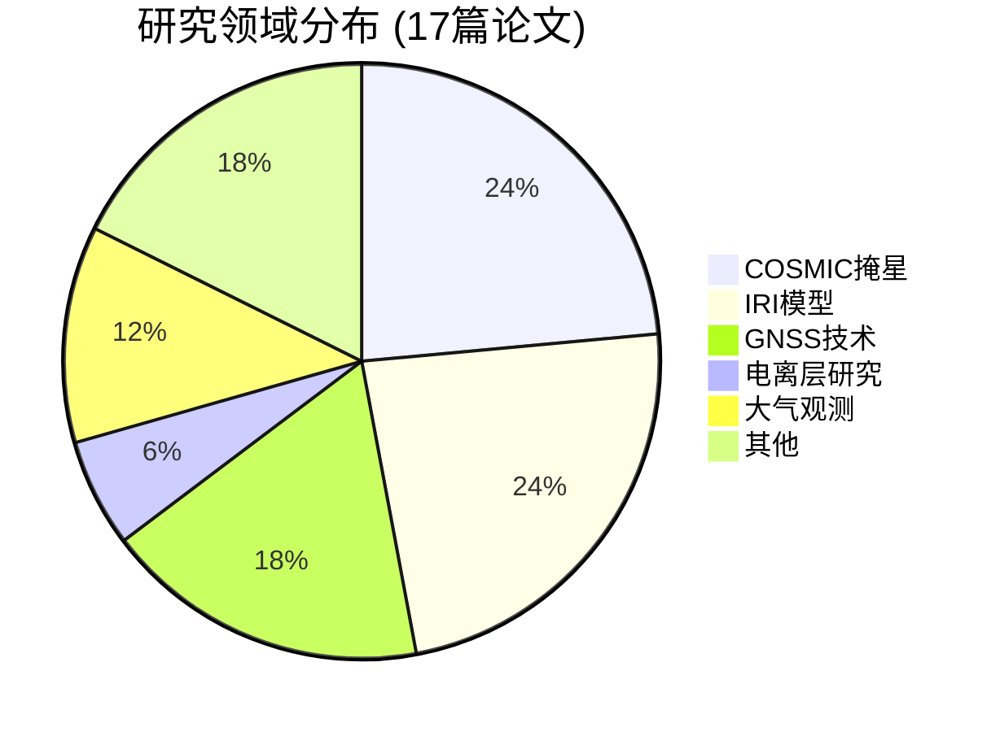

## 📚 出版物统计概览

**总论文数**: 17篇 (2016-2025)  
**最近5年论文数**: 12篇 (2020-2025) 
**主要研究领域**: GNSS-R/-RO技术、电离层建模、大气掩星观测

### 🔬 研究领域分布

### 📅 按年份分布

| 年份 | 论文数 | 主要研究内容 | 代表性论文 |
|------|--------|-------------|-----------|
| 2025 | 1篇 | GNSS掩星精度分析 | YUNYAO掩星数据质量评估 |
| 2024 | 1篇 | 赤道等离子体气泡动态特征 | 基于三角形网络-联合斜率方法 |
| 2023 | 2篇 | GPS/PWV分析、TJU#01卫星任务 | TJU#01气象微卫星电离层探测 |
| 2022 | 3篇 | ZTD评估、磁暴期间电离层变化、海面风速反演 | COSMIC掩星数据ZTD评估 |
| 2020 | 5篇 | GNSS观测、大气掩星、IRI模型改进等 | 多源GNSS观测数据三维电离层研究 |
| 2019 | 2篇 | Abel反演方法、电离层同化 | Abel反演方法评估 |
| 2018 | 1篇 | IRI模型改进 | IRI模型F2层参数改进 |
| 2016 | 2篇 | LEO-LEO掩星、电离层尺度高度建模 | LEO-LEO掩星数据处理技术 |

### 🏆 最新代表性论文

#### 2025年 - Atmospheric Measurement Techniques
**标题**: Quality assessment of YUNYAO radio occultation data in the neutral atmosphere  
**研究内容**: 评估云遥宇航90颗卫星星座的GNSS掩星数据质量，为数值天气预报系统提供数据支持  
**技术特色**: 使用"三边帽"方法评估折射率误差，与ERA5、COSMIC-2、Metop-C数据对比验证

#### 2024年 - Journal of Geophysical Research: Space Physics  
**标题**: Dynamic Characterization of Equatorial Plasma Bubble Based on Triangle Network-Joint Slope Approach  
**研究内容**: 基于三角形网络-联合斜率方法的赤道等离子体气泡动态特征研究  
**技术特色**: 提出新的三角形网络分析方法，改进赤道等离子体气泡的检测和表征

#### 2023年 - Radio Science
**标题**: The Ionospheric Exploration Based on TJU#01 Meteorological Microsatellite Mission: Initial Results  
**研究内容**: 天津大学TJU#01气象微卫星任务的电离层探测初步结果  
**技术特色**: 微卫星平台上的电离层探测技术验证，为后续星座建设提供技术基础

## 🎯 研究重点与贡献

### 核心技术贡献

#### 1. GNSS掩星数据处理技术
- **LEO-LEO掩星技术**: 开发了LEO-LEO掩星数据处理技术，为大气探测提供新手段
- **Abel反演改进**: 改进了Abel反演方法，减少球对称假设带来的误差
- **数据质量评估**: 建立了掩星数据质量评估体系，为数据应用提供保障

#### 2. 电离层建模与同化
- **IRI模型改进**: 基于COSMIC掩星数据改进了IRI电离层模型
- **多源数据同化**: 开发了基于卡尔曼滤波的电离层数据同化方法
- **尺度高度建模**: 建立了电离层尺度高度的全球建模方法

#### 3. 大气掩星观测
- **山基掩星观测**: 开展了山基掩星观测实验，验证了技术可行性
- **大气参数反演**: 开发了基于掩星数据的大气参数反演算法
- **数据融合技术**: 实现了多源掩星数据的融合处理


  You can also find my articles on <u><a href="{{author.googlescholar}}">my Google Scholar profile</a>.</u>





  

