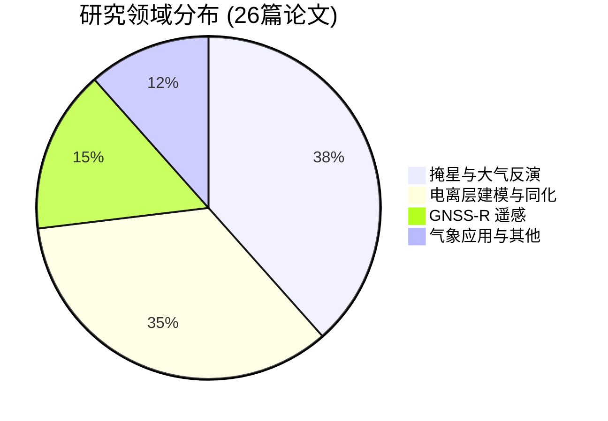

## 📚 出版物统计概览

**总论文数**: 26篇 (2015–2026)  
**最近5年论文数**: 15篇 (2021–2026)  
**主要研究领域**: GNSS 掩星/反演、电离层建模与同化、GNSS-R 遥感、大气与气象应用

### 🔬 研究领域分布

（按论文主题归类，一篇论文仅计入一类）

```mermaid
pie title 研究领域分布 (26篇论文)
    "掩星与大气反演" : 10
    "电离层建模与同化" : 9
    "GNSS-R 遥感" : 4
    "气象应用与其他" : 3
```

### 📅 按年份分布

| 年份 | 论文数 | 主要研究内容 | 代表性论文 |
|------|--------|-------------|-----------|
| 2026 | 1篇 | 电离层混合数据同化 | GNSS VTEC 与掩星混合同化（JGR） |
| 2025 | 3篇 | 云遥掩星星座与在轨定标 | 极化掩星定标、中性大气掩星反演、YUNYAO 数据质量评估 |
| 2024 | 2篇 | 赤道等离子体气泡、多系统掩星 | EPB 动态特征、云遥多系统 GNSS 掩星反演 |
| 2023 | 2篇 | GPS/PWV 分析、TJU#01 卫星任务 | 短时强降水分析、气象微卫星电离层探测 |
| 2022 | 2篇 | ZTD 评估、CYGNSS 海面风速 | COSMIC 掩星 ZTD 评估、GNSS-R 风速反演 |
| 2021 | 5篇 | 等离子层尺度高度、GNSS-R、磁暴电离层 | 尺度高度建模、EOF 高风速反演、三维电离层综述 |
| 2020 | 4篇 | 山基掩星、同化假设、GNSS-R | 山基大气掩星、BDS GEO 反射测高、Vary-Chap 尺度高度 |
| 2019 | 3篇 | Abel 反演、电离层分步同化 | Abel 反演评估、同化方法及勘误说明 |
| 2018 | 1篇 | IRI 模型改进 | IRI F2 层参数改进 |
| 2016 | 2篇 | LEO-LEO 掩星、IRI 顶侧修正 | LEO-LEO 掩星数据处理、电离层尺度高度全球建模 |
| 2015 | 1篇 | 等离子层同化 | COSMIC/GPS 斜路径 TEC 同化 |

## 🎯 研究重点与贡献

### 核心技术贡献

#### 1. GNSS 掩星数据处理与应用
- **LEO-LEO 掩星技术**: 开发了 LEO-LEO 掩星数据处理与误差分析方法
- **Abel 反演改进**: 改进了 Abel 反演方法，减少球对称假设带来的误差
- **星座级应用**: 参与云遥 LEO 星座多系统掩星反演、在轨定标与数据质量评估

#### 2. 电离层建模与同化
- **IRI 模型改进**: 基于 COSMIC 掩星数据改进了 IRI 电离层模型
- **多源数据同化**: 开发了分步同化与卡尔曼滤波方法，并拓展至 VTEC 与掩星联合同化
- **尺度高度建模**: 建立了电离层与等离子层尺度高度的全球建模方法

#### 3. GNSS-R 与大气观测
- **海面遥感**: CYGNSS 风速反演、BDS GEO 反射测高等 GNSS-R 应用
- **山基掩星观测**: 开展了山基掩星观测实验，验证了开/闭环跟踪可行性
- **气象参数分析**: GPS/PWV 与再分析资料在短时强降水等场景中的应用


  You can also find my articles on <u><a href="{{author.googlescholar}}">my Google Scholar profile</a>.</u>





  

