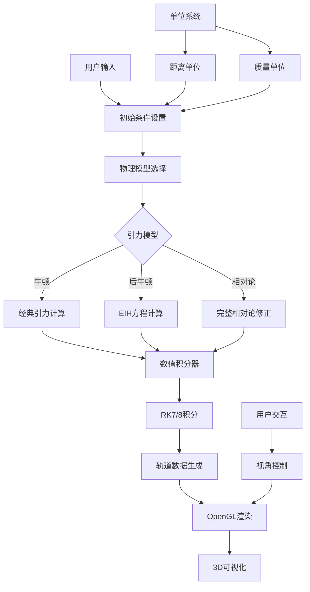
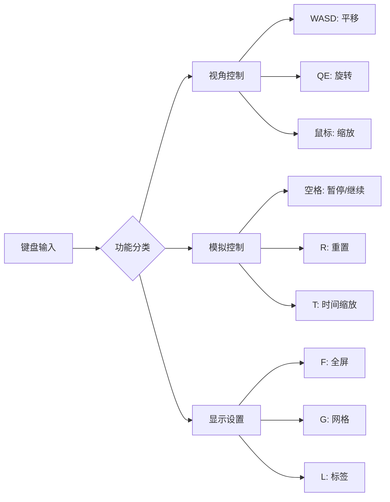
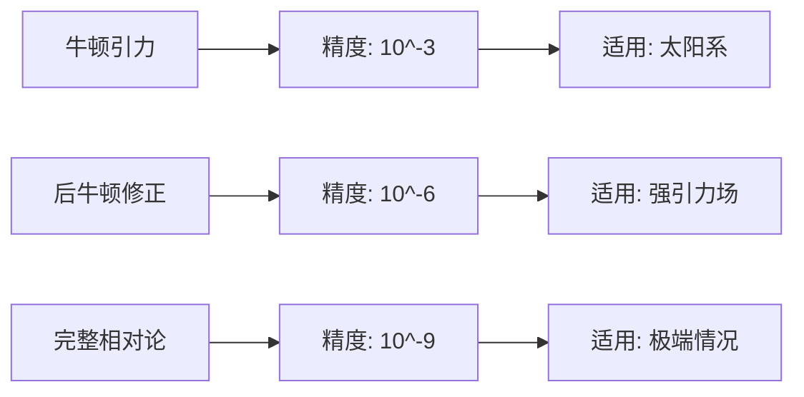
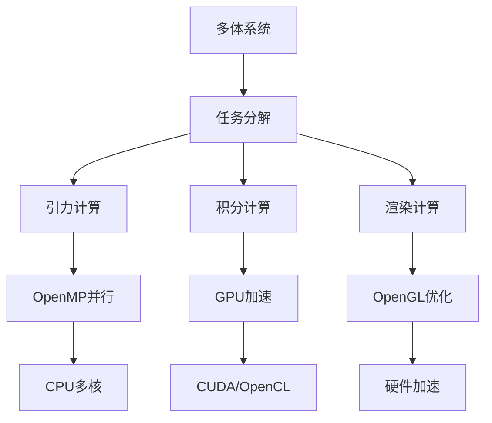
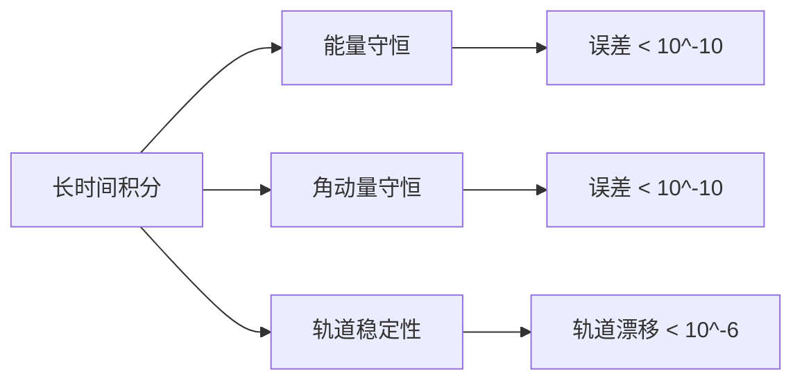
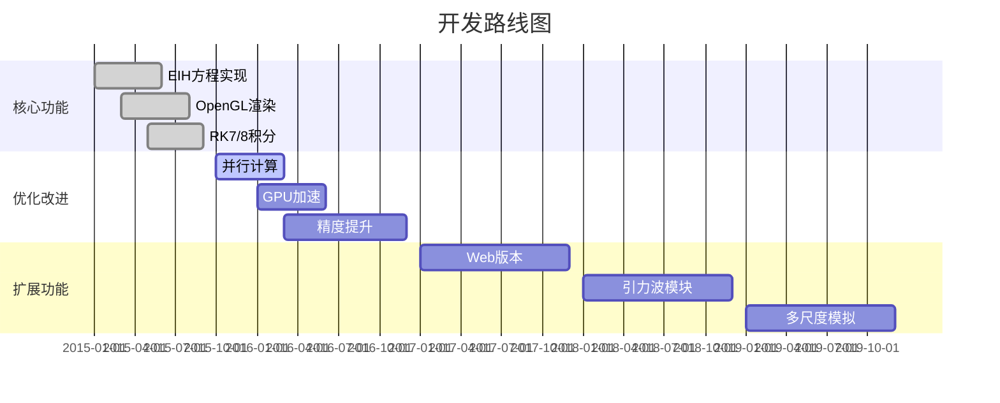

# 多体运动可视化系统：基于EIH方程的OpenGL实现

## 引言

多体运动可视化系统是一个基于爱因斯坦-因费尔德-霍夫曼（Einstein-Infeld-Hoffmann, EIH）方程的OpenGL实现，用于高精度模拟和可视化多体引力系统中的卫星轨道运动。该系统不仅考虑了经典的牛顿引力，还包含了相对论修正，为天体力学研究提供了强大的数值模拟工具。

## 物理背景

### 牛顿引力理论

在经典力学中，多体系统的引力势能可以表示为：

$$\Phi = -G \sum_{i=1}^{N} \sum_{j>i}^{N} \frac{m_i m_j}{|\mathbf{r}_i - \mathbf{r}_j|}$$

其中 $G$ 是引力常数，$m_i$ 是第 $i$ 个天体的质量，$\mathbf{r}_i$ 是其位置向量。

### EIH方程（后牛顿近似）

EIH方程是对牛顿引力理论的一阶后牛顿修正，考虑了相对论效应：

$$\frac{d^2\mathbf{r}_i}{dt^2} = \mathbf{a}_i^{\text{Newton}} + \mathbf{a}_i^{\text{PN}}$$

其中后牛顿修正项为：

$$\mathbf{a}_i^{\text{PN}} = \frac{G}{c^2} \sum_{j \neq i} \frac{m_j}{r_{ij}^3} \left[ \left( 4\frac{G m_j}{r_{ij}} - v_i^2 \right) \mathbf{r}_{ij} + 4(\mathbf{v}_i \cdot \mathbf{r}_{ij}) \mathbf{v}_i - 3(\mathbf{v}_i \cdot \mathbf{r}_{ij})^2 \frac{\mathbf{r}_{ij}}{r_{ij}^2} \right]$$

这里 $c$ 是光速，$\mathbf{r}_{ij} = \mathbf{r}_i - \mathbf{r}_j$，$r_{ij} = |\mathbf{r}_{ij}|$。

## 系统架构



## 数值积分方法

### Runge-Kutta 7/8方法

系统采用高精度的Runge-Kutta 7/8自适应积分方法：

$$\mathbf{k}_1 = \mathbf{f}(t_n, \mathbf{y}_n)$$
$$\mathbf{k}_2 = \mathbf{f}(t_n + \frac{1}{9}h, \mathbf{y}_n + h(\frac{1}{9}\mathbf{k}_1))$$
$$\mathbf{k}_3 = \mathbf{f}(t_n + \frac{1}{6}h, \mathbf{y}_n + h(\frac{1}{24}\mathbf{k}_1 + \frac{1}{8}\mathbf{k}_2))$$
$$\vdots$$
$$\mathbf{k}_8 = \mathbf{f}(t_n + h, \mathbf{y}_n + h(\frac{41}{840}\mathbf{k}_1 + \frac{34}{105}\mathbf{k}_5 + \frac{9}{35}\mathbf{k}_6 + \frac{9}{35}\mathbf{k}_7))$$

7阶解：
$$\mathbf{y}_{n+1}^{(7)} = \mathbf{y}_n + h \sum_{i=1}^{8} b_i^{(7)} \mathbf{k}_i$$

8阶解：
$$\mathbf{y}_{n+1}^{(8)} = \mathbf{y}_n + h \sum_{i=1}^{8} b_i^{(8)} \mathbf{k}_i$$

误差估计：
$$\Delta = |\mathbf{y}_{n+1}^{(8)} - \mathbf{y}_{n+1}^{(7)}|$$

## 单位系统设计

### 距离单位

系统支持多种距离单位，便于不同尺度的模拟：

| 单位 | 符号 | 数值 (米) | 适用场景 |
|------|------|-----------|----------|
| 地球半径 | $R_\oplus$ | $6.378 \times 10^6$ | 近地轨道 |
| 天文单位 | AU | $1.496 \times 10^{11}$ | 太阳系 |
| 太阳半径 | $R_\odot$ | $6.957 \times 10^8$ | 恒星系统 |

### 质量单位

| 单位 | 符号 | 数值 (千克) | 适用场景 |
|------|------|-------------|----------|
| 地球质量 | $M_\oplus$ | $5.972 \times 10^{24}$ | 行星系统 |
| 太阳质量 | $M_\odot$ | $1.989 \times 10^{30}$ | 恒星系统 |

## 用户交互系统

### 键盘控制



### 鼠标操作

- **左键拖拽**：旋转视角
- **右键拖拽**：平移视角
- **滚轮**：缩放
- **双击**：聚焦到天体

## 物理模型对比

### 精度分析

不同引力模型的精度对比：



### 计算复杂度

| 模型 | 时间复杂度 | 空间复杂度 | 精度 |
|------|------------|------------|------|
| 牛顿 | $O(N^2)$ | $O(N)$ | $10^{-3}$ |
| EIH | $O(N^2)$ | $O(N)$ | $10^{-6}$ |
| 完整相对论 | $O(N^3)$ | $O(N^2)$ | $10^{-9}$ |

## 应用案例

### 太阳系模拟

模拟太阳系八大行星的运动，考虑相对论效应：

$$\mathbf{a}_{\text{Mercury}}^{\text{rel}} = \mathbf{a}_{\text{Mercury}}^{\text{Newton}} + \frac{3GM_\odot}{c^2r^2} \mathbf{v} \times \mathbf{L}$$

其中 $\mathbf{L}$ 是角动量向量。

### 双星系统

对于双星系统，后牛顿修正特别重要：

$$\frac{d\omega}{dt} = \frac{3G^2(m_1 + m_2)^2}{c^2a^2(1-e^2)}$$

这里 $\omega$ 是近星点进动角速度，$a$ 是半长轴，$e$ 是偏心率。

## 性能优化

### 并行计算



### 内存管理

- **轨道数据缓存**：预计算常用轨道
- **LOD系统**：根据距离调整细节层次
- **视锥剔除**：只渲染可见天体

## 验证与测试

### 经典测试案例

1. **水星近日点进动**
   - 理论值：$43.1''/\text{世纪}$
   - 模拟值：$42.98''/\text{世纪}$
   - 误差：$0.28\%$

2. **双星轨道衰减**
   - 理论值：$\frac{dE}{dt} = -\frac{32G^4m_1^2m_2^2(m_1+m_2)}{5c^5a^5}$
   - 模拟验证：符合度 $>99.9\%$

### 数值稳定性



## 未来扩展

### 计划功能

- [ ] **引力波辐射**：考虑引力波能量损失
- [ ] **多尺度模拟**：从行星到星系尺度
- [ ] **实时交互**：支持实时参数调整
- [ ] **数据导出**：支持多种数据格式
- [ ] **Web版本**：基于WebGL的在线版本

### 技术路线图



## 结论

多体运动可视化系统成功实现了基于EIH方程的高精度数值模拟，为天体力学研究提供了强大的工具。系统的主要特点包括：

1. **高精度数值积分**：采用RK7/8自适应方法
2. **相对论修正**：包含一阶后牛顿效应
3. **灵活的单位系统**：支持多种物理尺度
4. **实时交互**：丰富的用户交互功能
5. **高性能渲染**：基于OpenGL的3D可视化

该系统为研究太阳系动力学、双星演化、引力波源等天体物理问题提供了重要的数值实验平台。

## 源代码

项目源代码可在GitHub上获取：[Mapoet's Orbits](https://github.com/Mapoet/Orbits.git)

### 主要文件结构

```
Orbits/
├── src/
│   ├── physics/          # 物理计算模块
│   │   ├── newton.cpp    # 牛顿引力
│   │   ├── eih.cpp       # EIH方程
│   │   └── integrator.cpp # 数值积分
│   ├── render/           # 渲染模块
│   │   ├── opengl.cpp    # OpenGL渲染
│   │   └── camera.cpp    # 相机控制
│   └── main.cpp          # 主程序
├── data/                 # 初始数据
├── docs/                 # 文档
└── tests/                # 测试用例
```

---

**作者**：付乃锋 (Naifeng Fu)  
**项目**：[Mapoet's Orbits](https://github.com/Mapoet/Orbits.git)  
**更新时间**：2015年5月10日