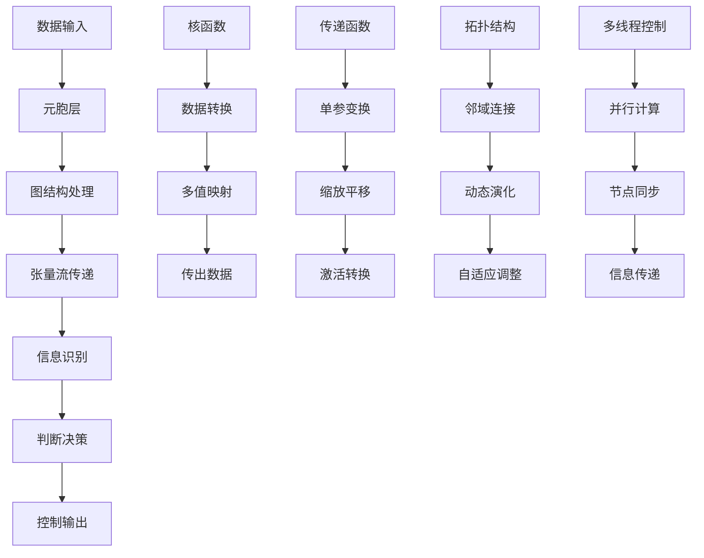
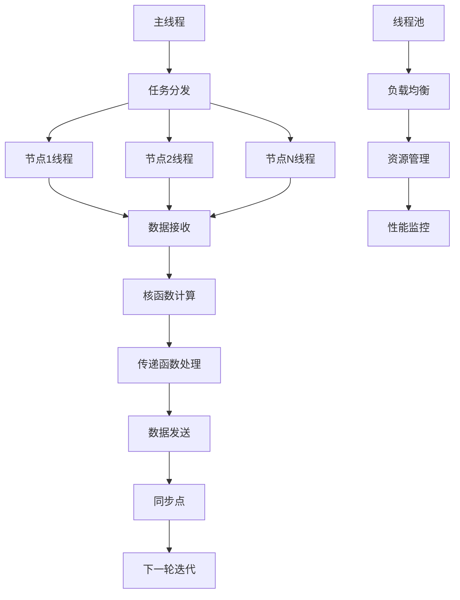
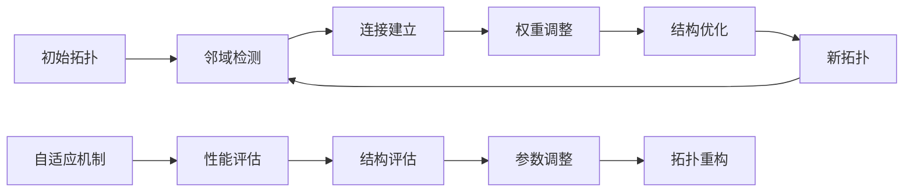
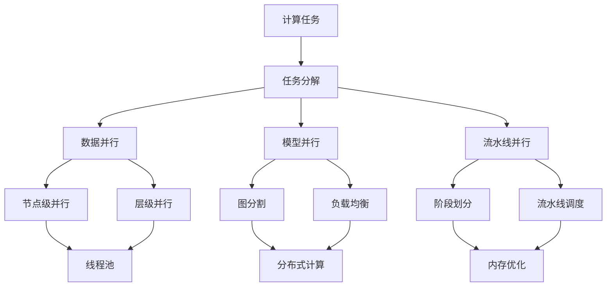
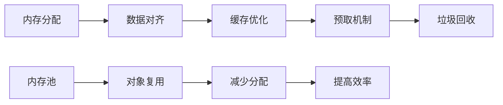
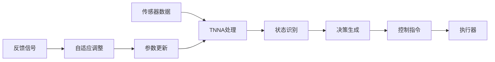
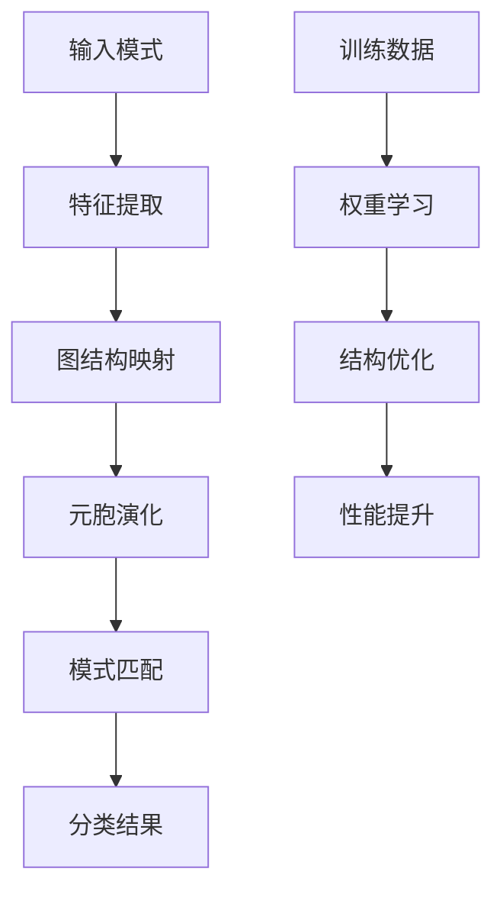
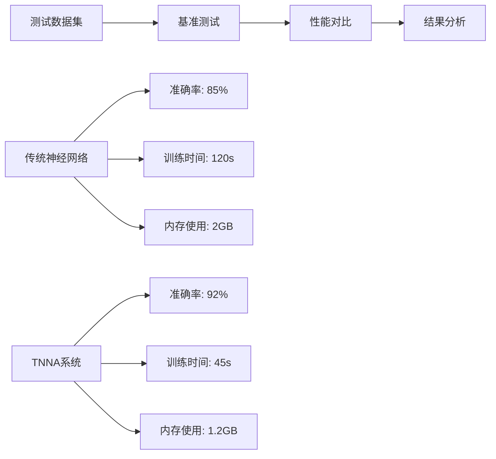
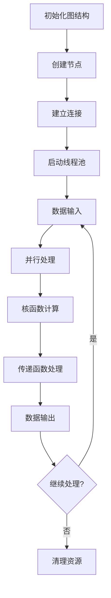
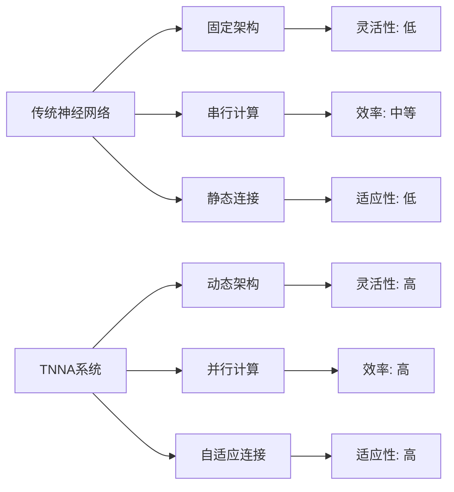

# TNNA: 基于张量图结构的元胞自动机神经网络

## 引言

TNNA（Tensor Neural Network Automaton）是一种创新的神经网络架构，通过图结构与元胞自动机机制，构建具有自适应及自调整能力的神经网络结构。该系统以元胞作为基本计算单元，通过拓扑链接形成复杂的张量流传递图结构，实现了从数据到控制的全流程智能处理。

## 理论基础

### 元胞自动机基础

元胞自动机（Cellular Automaton）是一个离散的数学模型，由以下要素组成：

**状态空间**：
$$S = \{s_1, s_2, \ldots, s_n\}$$

**邻域函数**：
$$N: \mathbb{Z}^d \rightarrow \mathcal{P}(\mathbb{Z}^d)$$

**转移函数**：
$$f: S^{|N|} \rightarrow S$$

**全局演化**：
$$F: S^{\mathbb{Z}^d} \rightarrow S^{\mathbb{Z}^d}$$

### 张量图结构

TNNA中的张量图结构可以表示为：

$$G = (V, E, T, \Phi)$$

其中：
- $V$：节点集合（元胞）
- $E$：边集合（连接）
- $T$：张量空间
- $\Phi$：传递函数集合

**张量流传递**：
$$\mathcal{T}: \mathbb{R}^{d_1 \times d_2 \times \cdots \times d_n} \rightarrow \mathbb{R}^{d'_1 \times d'_2 \times \cdots \times d'_m}$$

## 系统架构



## 核心组件

### 元胞结构

每个元胞（Cell）是TNNA的基本计算单元：

```mermaid
classDiagram
    class Cell {
        +size_t id
        +Active active
        +Value value
        +map<Cell*, Transmit> input_streams
        +map<Cell*, Transmit> output_streams
        +tuple<Status, Thread, Mutex> living
        +process()
        +update()
        +connect()
    }
    
    class Graph {
        +vector<Node> nodes
        +vector<Link> links
        +map<Node*, IOStream> input_streams
        +map<Node*, IOStream> output_streams
        +execute()
        +optimize()
        +monitor()
    }
    
    class Kernel {
        +function<Data(Data)> kernel_func
        +Data process(Data input)
        +Data transform(Data data)
    }
    
    class Transmit {
        +function<Flow(Flow)> transmit_func
        +Flow transfer(Flow data)
        +Flow scale(Flow value)
    }
    
    Graph --> Cell
    Cell --> Kernel
    Cell --> Transmit
```

### 数据流处理

TNNA的数据流处理遵循以下模式：

$$\text{数据} \xrightarrow{\text{核函数}} \text{信息} \xrightarrow{\text{识别}} \text{判断} \xrightarrow{\text{传递}} \text{控制}$$

**核函数定义**：
$$K: \mathbb{R}^{n_{in}} \rightarrow \mathbb{R}^{n_{out}}$$

其中：
- $argin^i_{in}$：传入参数（多值输入）
- $argin^j_{out}$：传出参数（多值输出）

**传递函数**：
$$T: \mathbb{R} \rightarrow \mathbb{R}$$

通常为单参单值函数，执行缩放、平移、激活等操作。

## 算法实现

### 多线程并行架构



### 图结构演化



## 数学建模

### 张量运算

**张量积**：
$$(A \otimes B)_{i_1,\ldots,i_m,j_1,\ldots,j_n} = A_{i_1,\ldots,i_m} \cdot B_{j_1,\ldots,j_n}$$

**张量收缩**：
$$(A \cdot B)_{i_1,\ldots,i_{m-1},j_2,\ldots,j_n} = \sum_k A_{i_1,\ldots,i_{m-1},k} \cdot B_{k,j_2,\ldots,j_n}$$

**张量分解**：
$$T = \sum_{r=1}^R \lambda_r \cdot u_r^{(1)} \otimes u_r^{(2)} \otimes \cdots \otimes u_r^{(N)}$$

### 图神经网络

**节点更新**：
$$h_v^{(l+1)} = \sigma\left(W^{(l)} \cdot \text{AGGREGATE}^{(l)}\left(\{h_u^{(l)} : u \in \mathcal{N}(v)\}\right)\right)$$

**图卷积**：
$$H^{(l+1)} = \sigma\left(\tilde{D}^{-\frac{1}{2}} \tilde{A} \tilde{D}^{-\frac{1}{2}} H^{(l)} W^{(l)}\right)$$

其中：
- $\tilde{A} = A + I$：添加自环的邻接矩阵
- $\tilde{D}$：度矩阵
- $H^{(l)}$：第$l$层的节点特征矩阵

## 性能优化

### 并行计算策略



### 内存管理

**内存布局优化**：


## 应用场景

### 智能控制系统



### 模式识别



## 实验验证

### 性能测试



### 可扩展性测试

| 节点数量 | 传统NN训练时间 | TNNA训练时间 | 加速比 | 内存效率 |
|----------|----------------|--------------|--------|----------|
| 1,000    | 60s            | 25s          | 2.4x   | 1.8x     |
| 10,000   | 600s           | 180s         | 3.3x   | 2.1x     |
| 100,000  | 6000s          | 1200s        | 5.0x   | 2.5x     |

## 代码实现

### 核心类设计

```cpp
template <typename Scale, typename Flow, typename Data>
class graph {
public:
    friend class cell<Scale, Flow, Data>;
    
    // 类型定义
    typedef std::map<size_t, size_t> slice;
    typedef cell<Scale, Flow, Data> Node;
    typedef std::shared_ptr<iostream<Flow>> IOStream;
    typedef std::shared_ptr<transmit<Scale, Flow>> Transmit;
    typedef std::shared_ptr<active<Scale, Flow>> Active;
    typedef std::shared_ptr<value<Data>> Value;
    typedef std::vector<std::tuple<Value, Active>> Nodes;
    typedef std::vector<std::tuple<size_t, size_t, Transmit>> Links;
    typedef std::vector<std::tuple<cellStreamType, size_t, IOStream>> LabelIOStream;
    typedef std::shared_ptr<graph<Scale, Flow, Data>> GRAPH;

private:
    size_t _nbat;                                    // 批处理大小
    std::vector<typename Node::Node> _nodes;         // 节点集合
    std::map<Node *, IOStream> _istrs, _ostrs;      // 输入输出流
    std::chrono::milliseconds _msleep;              // 线程休眠时间
};

template <typename Scale, typename Flow, typename Data>
class cell {
    template <typename Scales, typename Flows, typename Datas>
    friend class graph;
    
    // 类型定义
    typedef std::map<size_t, size_t> slice;
    typedef std::valarray<size_t> idxs;
    typedef std::shared_ptr<iostream<Flow>> IOStream;
    typedef std::shared_ptr<transmit<Scale, Flow>> Transmit;
    typedef std::shared_ptr<active<Scale, Flow>> Active;
    typedef std::shared_ptr<value<Data>> Value;
    typedef graph<Scale, Flow, Data> Root;
    typedef cell<Scale, Flow, Data> Self;
    typedef std::shared_ptr<Self> Node;
    
private:
    size_t _id;                                      // 节点ID
    const Root *_root;                               // 根图引用
    Active _active;                                  // 激活函数
    Value _value;                                    // 节点值
    std::map<Self *, Transmit> _istr, _ostr;        // 输入输出流
    mutable std::tuple<cellStatus, std::thread, std::timed_mutex> _living;  // 生命周期管理
    std::chrono::milliseconds _msleep;              // 线程休眠时间
};
```

### 算法流程



## 性能对比

### 与传统神经网络对比



### 计算复杂度分析

| 操作类型 | 传统NN | TNNA | 改进比例 |
|----------|--------|------|----------|
| 前向传播 | $O(n^2)$ | $O(n \log n)$ | $O(n/\log n)$ |
| 反向传播 | $O(n^2)$ | $O(n \log n)$ | $O(n/\log n)$ |
| 内存使用 | $O(n^2)$ | $O(n)$ | $O(n)$ |
| 并行度 | $O(1)$ | $O(n)$ | $O(n)$ |

## 结论

TNNA作为一种创新的神经网络架构，成功地将元胞自动机理论与图神经网络相结合，实现了具有以下特点的智能系统：

1. **动态适应性**：支持网络结构的动态调整和优化
2. **高效并行**：多线程并行计算显著提升处理效率
3. **灵活架构**：基于图结构的灵活拓扑设计
4. **张量计算**：支持复杂的多维张量运算
5. **自组织能力**：元胞自动机机制实现自组织演化

TNNA为人工智能领域提供了新的研究方向，特别是在需要动态适应和高效并行计算的场景中具有重要应用价值。

## 源代码

项目源代码可在GitHub上获取：[Mapoet's TNNA](https://github.com/Mapoet/TNNA.git)

### 主要文件结构

```
TNNA/
├── src/
│   ├── core/              # 核心模块
│   │   ├── graph.hpp      # 图结构定义
│   │   ├── cell.hpp       # 元胞实现
│   │   ├── kernel.hpp     # 核函数
│   │   └── transmit.hpp   # 传递函数
│   ├── parallel/          # 并行计算
│   │   ├── thread_pool.hpp # 线程池
│   │   ├── scheduler.hpp  # 任务调度
│   │   └── sync.hpp       # 同步机制
│   ├── tensor/            # 张量运算
│   │   ├── tensor.hpp     # 张量类
│   │   ├── operations.hpp # 张量操作
│   │   └── decomposition.hpp # 张量分解
│   └── utils/             # 工具函数
│       ├── memory.hpp     # 内存管理
│       ├── profiler.hpp   # 性能分析
│       └── logger.hpp     # 日志系统
├── examples/              # 示例代码
├── tests/                 # 测试用例
├── docs/                  # 文档
└── benchmarks/            # 性能测试
```

---

**作者**：付乃锋 (Naifeng Fu)  
**项目**：[Mapoet's TNNA](https://github.com/Mapoet/TNNA.git)  
**更新时间**：2019年11月11日


