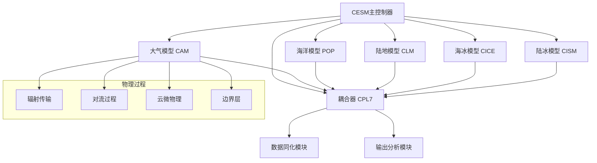
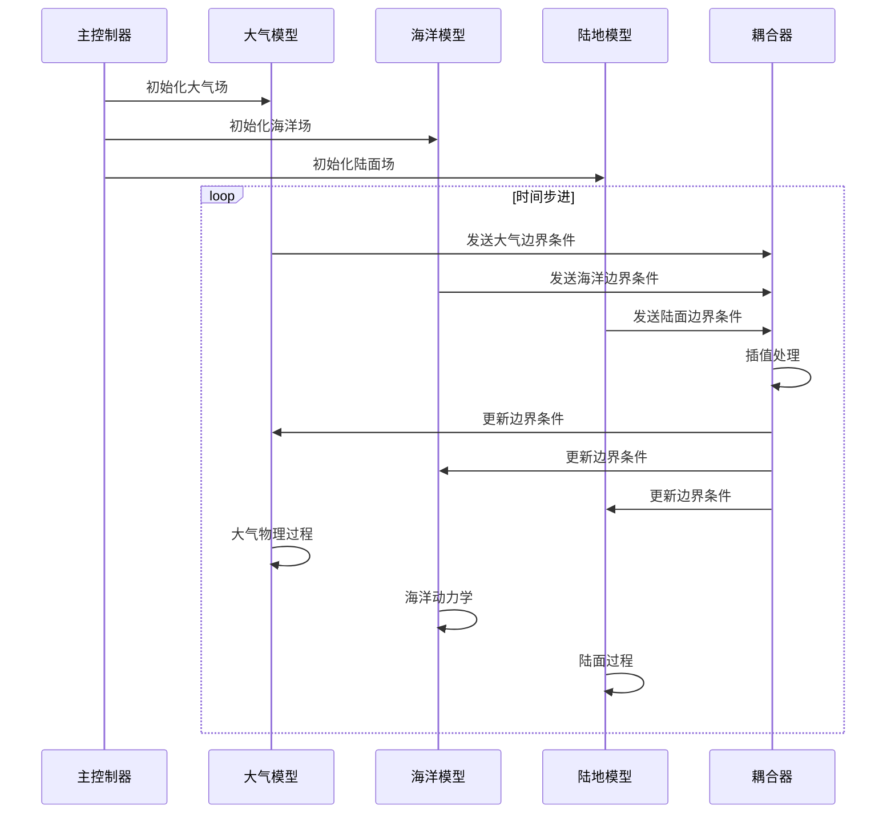
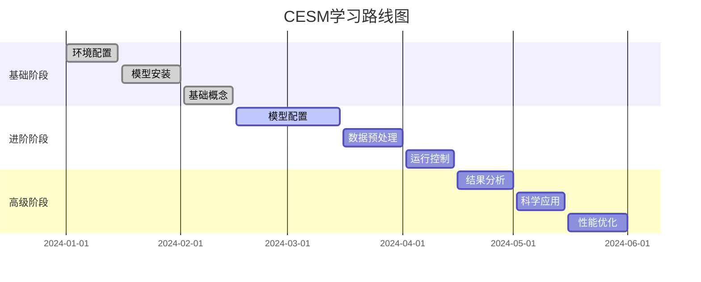
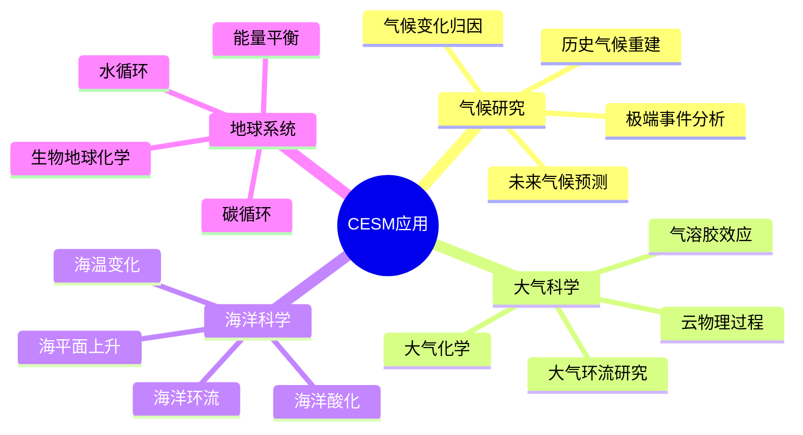
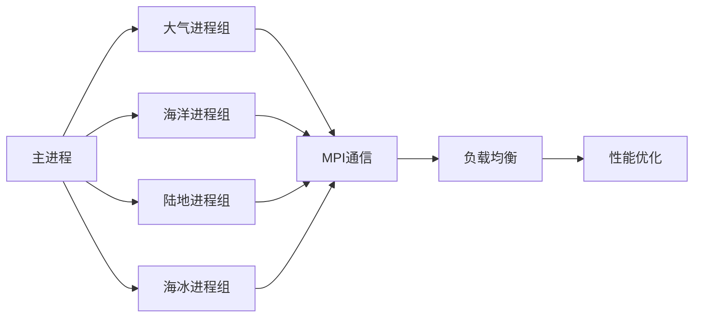
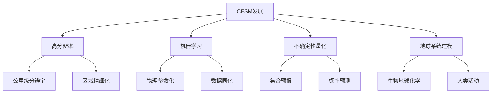

# CESM学习教材与地址

## 概述

**CESM (Community Earth System Model)** 是由美国国家大气研究中心 (NCAR) 开发的全球气候系统模型，是世界上最先进的地球系统模型之一。CESM融合了大气、海洋、陆地、海冰、陆冰等多个分量模型，能够模拟地球系统的复杂相互作用。

## CESM模型架构

### 核心组件结构

### 模型耦合架构

## CESM核心组件详解

### 1. 大气模型 (CAM - Community Atmosphere Model)

CAM是CESM的大气分量，负责模拟大气环流、云物理、辐射传输等过程。

#### 主要物理过程

**辐射传输方程**：
$$\frac{dI_\nu}{ds} = -\kappa_\nu I_\nu + j_\nu$$

其中：
- $I_\nu$ 是频率为 $\nu$ 的辐射强度
- $\kappa_\nu$ 是吸收系数
- $j_\nu$ 是发射系数
- $s$ 是传播路径

**对流参数化**：
$$\frac{\partial \theta}{\partial t} = -\nabla \cdot (\mathbf{v}\theta) + \frac{\partial}{\partial z}\left(K_h \frac{\partial \theta}{\partial z}\right) + Q_{conv}$$

其中：
- $\theta$ 是位温
- $\mathbf{v}$ 是风速
- $K_h$ 是湍流扩散系数
- $Q_{conv}$ 是对流加热率

### 2. 海洋模型 (POP - Parallel Ocean Program)

POP模拟海洋环流、温度、盐度分布等海洋物理过程。

#### 海洋动力学方程

**动量方程**：
$$\frac{\partial \mathbf{u}}{\partial t} + (\mathbf{u} \cdot \nabla)\mathbf{u} + f\mathbf{k} \times \mathbf{u} = -\frac{1}{\rho_0}\nabla p + \mathbf{F}_v + \mathbf{F}_h$$

**连续方程**：
$$\nabla \cdot \mathbf{u} = 0$$

**温度方程**：
$$\frac{\partial T}{\partial t} + \mathbf{u} \cdot \nabla T = \kappa_h \nabla_h^2 T + \kappa_v \frac{\partial^2 T}{\partial z^2}$$

其中：
- $\mathbf{u}$ 是流速
- $f$ 是科里奥利参数
- $\rho_0$ 是参考密度
- $p$ 是压力
- $\mathbf{F}_v, \mathbf{F}_h$ 是垂直和水平摩擦力

### 3. 陆地模型 (CLM - Community Land Model)

CLM模拟陆面过程，包括植被、土壤、水文等。

#### 陆面能量平衡

**地表能量平衡方程**：
$$R_n = H + LE + G$$

其中：
- $R_n$ 是净辐射
- $H$ 是感热通量
- $LE$ 是潜热通量
- $G$ 是土壤热通量

**感热通量**：
$$H = \rho_a c_p C_h U(T_s - T_a)$$

**潜热通量**：
$$LE = \rho_a L_v C_e U(q_s - q_a)$$

其中：
- $\rho_a$ 是空气密度
- $c_p$ 是定压比热
- $C_h, C_e$ 是传输系数
- $U$ 是风速
- $T_s, T_a$ 是地表和大气温度
- $q_s, q_a$ 是地表和大气比湿

### 4. 海冰模型 (CICE - Los Alamos Sea Ice Model)

CICE模拟海冰的形成、融化、漂移等过程。

#### 海冰热力学

**海冰厚度变化**：
$$\frac{\partial h}{\partial t} = \frac{1}{\rho_i L_f}(F_{bot} - F_{top})$$

其中：
- $h$ 是海冰厚度
- $\rho_i$ 是海冰密度
- $L_f$ 是融解潜热
- $F_{bot}, F_{top}$ 是底部和顶部热通量

### 5. 耦合器 (CPL7)

CPL7负责各分量模型之间的数据交换和插值。

## CESM学习资源

### 官方教程网站

#### 1. NCAR CESM官方网站
- **网址**: https://www.cesm.ucar.edu/
- **特点**: 官方文档、最新版本信息、技术支持
- **内容**: 
  - 模型下载和安装指南
  - 用户手册和教程
  - 科学应用案例
  - 技术支持论坛

#### 2. CESM Tutorial网站
- **网址**: https://ncar.github.io/CESM/
- **特点**: 交互式教程、代码示例
- **内容**:
  - 基础概念介绍
  - 模型配置教程
  - 数据处理方法
  - 可视化技术

### 学习路径规划

### 推荐学习资源

#### 在线课程
1. **NCAR Summer School**: 每年夏季举办的CESM暑期学校
2. **CESM Workshop**: 定期举办的用户研讨会
3. **YouTube频道**: NCAR官方YouTube频道有大量教程视频

#### 书籍推荐
1. **"CESM User's Guide"** - 官方用户指南
2. **"Climate Modeling"** - 气候建模基础理论
3. **"Earth System Modeling"** - 地球系统建模方法

#### 实践项目
1. **CESM Test Cases**: 官方提供的测试案例
2. **Community Experiments**: 社区实验项目
3. **Research Applications**: 实际科研应用案例

## CESM应用领域

### 气候研究

### 具体应用案例

#### 1. 历史气候重建
- **目标**: 重建过去几百年到几千年的气候状态
- **方法**: 使用古气候数据作为边界条件
- **输出**: 温度、降水、环流等气候要素的重建结果

#### 2. 未来气候预测
- **目标**: 预测21世纪及以后的气候变化
- **方法**: 使用不同排放情景作为输入
- **输出**: 温度、降水、海平面等预测结果

#### 3. 极端事件分析
- **目标**: 研究极端天气气候事件的成因和变化
- **方法**: 高分辨率模拟和统计分析
- **输出**: 极端事件频率、强度、空间分布

## CESM技术特点

### 并行计算架构

### 数据同化能力

CESM支持多种数据同化方法：

**集合卡尔曼滤波 (EnKF)**：
$$x_a = x_f + K(y - Hx_f)$$

其中：
- $x_a$ 是分析场
- $x_f$ 是预报场
- $K$ 是卡尔曼增益
- $y$ 是观测值
- $H$ 是观测算子

**变分同化**：
$$J(x) = \frac{1}{2}(x - x_b)^T B^{-1}(x - x_b) + \frac{1}{2}(y - H(x))^T R^{-1}(y - H(x))$$

其中：
- $J(x)$ 是代价函数
- $x_b$ 是背景场
- $B$ 是背景误差协方差
- $R$ 是观测误差协方差

## 性能优化策略

### 计算优化

1. **并行化策略**
   - 水平并行：空间分解
   - 垂直并行：层次分解
   - 时间并行：时间分解

2. **内存优化**
   - 数据压缩
   - 缓存优化
   - 内存池管理

3. **I/O优化**
   - 异步I/O
   - 数据压缩
   - 并行I/O

### 科学优化

1. **物理参数化**
   - 对流参数化改进
   - 云微物理优化
   - 边界层参数化

2. **数值方法**
   - 时间积分方案
   - 空间离散化
   - 数值稳定性

## 常见问题与解决方案

### 安装问题

1. **依赖库缺失**
   - 解决方案：使用conda或spack管理依赖
   - 推荐：使用CESM提供的环境脚本

2. **编译错误**
   - 检查编译器版本兼容性
   - 确认库路径设置正确
   - 查看错误日志定位问题

### 运行问题

1. **内存不足**
   - 减少并行进程数
   - 优化内存使用
   - 使用更大内存节点

2. **计算缓慢**
   - 检查负载均衡
   - 优化I/O频率
   - 调整时间步长

### 结果问题

1. **物理不合理**
   - 检查初始条件
   - 验证边界条件
   - 调整物理参数

2. **数值不稳定**
   - 减小时间步长
   - 调整数值方案
   - 检查CFL条件

## 未来发展方向

### 技术发展趋势

### 科学前沿

1. **高分辨率模拟**
   - 公里级分辨率
   - 区域精细化
   - 极端事件模拟

2. **机器学习集成**
   - 物理参数化
   - 数据同化
   - 模型校准

3. **不确定性量化**
   - 参数不确定性
   - 结构不确定性
   - 预测不确定性

## 总结

CESM作为世界领先的地球系统模型，为气候科学研究提供了强大的工具。通过系统学习CESM的理论基础、技术方法和应用实践，可以深入理解地球系统的复杂性和气候变化机制。

### 学习建议

1. **循序渐进**: 从基础概念开始，逐步深入
2. **实践为主**: 多动手操作，积累经验
3. **社区参与**: 积极参与用户社区讨论
4. **持续更新**: 关注模型最新发展和应用

### 关键资源汇总

- **官方网站**: https://www.cesm.ucar.edu/
- **用户论坛**: https://bb.cgd.ucar.edu/
- **代码仓库**: https://github.com/ESCOMP/CESM
- **文档中心**: https://ncar.github.io/CESM/
- **教程视频**: NCAR YouTube频道

通过系统学习和实践，您将能够熟练使用CESM进行气候科学研究，为理解地球系统变化和应对气候变化挑战做出贡献。
