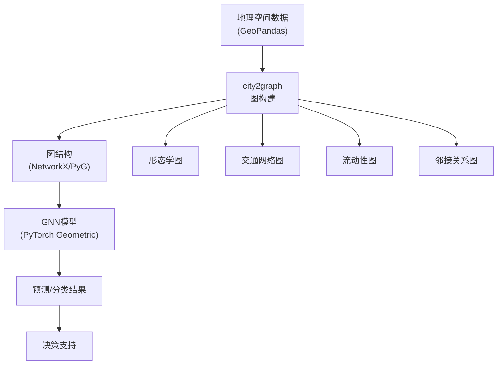

在地理空间数据分析领域中，如何有效地将复杂的地理信息转化为可供机器学习模型处理的结构化数据，一直是研究者和从业者面临的核心挑战。传统的地理信息系统（GIS）工具虽然能够处理空间数据，但在捕捉空间实体之间的复杂关系、支持深度学习模型训练方面存在明显局限。**city2graph**正是在这一背景下应运而生的Python库，它专为将地理空间数据转换为图结构而设计，为图神经网络（GNN）在空间分析领域的应用提供了桥梁。

从数据驱动的视角看，地理空间数据本质上反映了空间实体之间的拓扑关系、距离关系和功能关系。这些关系天然适合用图结构表示——节点代表空间实体（如建筑物、道路交叉口、兴趣点），边代表实体之间的关系（如连接、邻近、功能关联）。然而，从原始地理数据到图表示的转换过程涉及复杂的空间计算、拓扑推理和关系建模，这正是city2graph所要解决的核心问题。

### 技术发展现状

| 技术类别 | 传统GIS工具 | 网络分析工具 | city2graph | GNN增强分析 |
|---------|------------|------------|-----------|------------|
| **数据表示** | 矢量/栅格 | 网络图 | **多源图结构** | **图张量** |
| **关系建模** | 空间查询 | 拓扑连接 | **多层次关系** | **学习表示** |
| **分析能力** | 空间统计 | 路径分析 | **图结构分析** | **模式识别** |
| **机器学习支持** | 有限 | 有限 | **PyTorch Geometric** | **端到端训练** |
| **应用场景** | 制图、查询 | 交通网络 | **多领域GeoAI** | **智能预测** |

传统的地理空间分析工具主要关注空间查询和统计，而网络分析工具（如NetworkX）虽然支持图结构，但缺乏对地理空间数据格式的原生支持。city2graph的独特价值在于**无缝集成GeoPandas、NetworkX和PyTorch Geometric**，实现了从地理数据到图表示再到深度学习模型的完整链路。

## city2graph的核心功能与技术原理

### 多源数据图构建能力

city2graph支持从多种地理空间数据源构建图结构，主要包括以下四类：

**形态学数据图构建**

从建筑物、街道、土地利用等形态学数据（如OpenStreetMap、Overture Maps）构建图结构。这类图能够捕捉城市形态的空间组织模式，节点代表建筑物或街道段，边代表空间邻接或功能关联关系。

**交通网络图构建**

从公共交通数据（如GTFS格式的公交、轻轨、火车数据）构建交通网络图。节点代表交通站点，边代表线路连接，边权重可包含时间、距离、客流量等信息。

**邻接关系图构建**

基于土地利用、土地覆盖、行政边界等数据构建邻接关系图。这类图常用于区域分析，节点代表行政单元或功能区，边代表空间邻接关系（如Queen邻接、Rook邻接）。

**流动性数据图构建**

从自行车共享、迁移、行人流量等流动性数据构建图结构。这类图能够反映空间实体之间的流动模式，节点代表起点或终点区域，边代表流动关系，边权重可包含流量、频率等信息。

### 图构建的数学原理

city2graph的图构建过程本质上是一个**空间关系提取与图结构生成**的过程。对于给定的地理空间数据集，工具需要：

1. **空间实体识别**：从点、线、面要素中提取节点候选
2. **关系计算**：基于空间距离、拓扑关系或功能关联计算边
3. **图结构生成**：将节点和边组织成标准图数据结构

以固定半径图（Fixed Radius Graph）为例，对于点要素集合，工具计算每对点之间的欧氏距离，若距离小于给定半径，则在两点间建立边。这一过程可形式化为：

$$E = \{(v_i, v_j) | d(v_i, v_j) \leq r, v_i, v_j \in V\}$$

其中，V为节点集合，d(v_i, v_j)为节点v_i和v_j之间的空间距离，r为固定半径阈值。

对于Waxman图（Waxman Graph），边的建立不仅考虑距离，还引入概率机制，使得距离较近的节点更可能建立连接：

$$P(e_{ij}) = \beta e^{-\frac{d(v_i, v_j)}{r_0}}$$

其中，beta和r_0为模型参数，控制连接概率的衰减速率。

### 异构图与元路径支持

city2graph支持构建异构图（Heterogeneous Graph），即包含多种类型节点和边的图结构。例如，可以同时包含"建筑物"、"街道段"、"兴趣点"等不同类型的节点，以及"位于"、"连接"、"邻近"等不同类型的边。

元路径（Metapath）是异构图分析中的重要概念，它定义了节点类型之间的复合关系路径。city2graph支持通过元路径在异构图中的不同节点类型之间建立间接连接，从而捕捉更复杂的空间关系模式。

### 与PyTorch Geometric的集成

city2graph的核心优势之一是将地理空间图转换为PyTorch Geometric的Data或HeteroData对象，这使得研究者可以直接使用PyTorch Geometric中丰富的GNN模型进行图表示学习和预测任务。

转换过程包括：
- 节点特征提取：从地理要素的属性中提取节点特征向量
- 边特征提取：从空间关系或流动数据中提取边特征
- 图结构编码：将节点、边和全局图属性编码为张量格式

## 应用场景与应用形式

### 城市形态学分析

通过构建城市形态学图，分析城市空间结构的组织模式。例如，可以识别城市中心、识别功能分区、分析城市扩张模式。结合GNN模型，可以学习城市形态的潜在表示，用于城市相似性分析、城市分类等任务。

### 交通网络优化

利用交通网络图分析交通流量、识别拥堵瓶颈、优化线路规划。结合时空GNN模型（如T-GCN），可以预测交通流量，支持智能交通管理系统的决策。

### 流动性模式研究

通过构建流动性图，分析居民出行模式、识别热点区域、预测人流分布。这类分析对于公共交通规划、商业选址、应急管理具有重要意义。

### 环境与公共安全分析

整合环境监测数据、犯罪数据等，构建环境-社会关系图，分析环境因素与公共安全事件之间的关联。结合GNN模型，可以识别高风险区域，支持预防性管理。

### 应用形式的技术架构

## 最新研究进展与技术展望

### 图神经网络在空间分析中的进展

近年来，图神经网络在地理空间分析领域取得了显著进展。T-GCN模型将图卷积网络（GCN）与门控循环单元（GRU）结合，成功捕捉了交通数据的时空依赖性，在交通流量预测任务中取得了优于传统方法的性能。RiskOracle框架通过差分时变图神经网络，实现了分钟级别的城市交通事故预测，展示了GNN在处理高动态性和稀疏数据方面的优势。

### 地理空间基础模型的发展趋势

随着大语言模型和基础模型概念的兴起，地理空间领域也开始探索构建地理空间基础模型（Geospatial Foundation Models）。这类模型能够从大规模地理空间数据中学习通用表示，支持多种下游任务。city2graph作为数据预处理工具，为构建这类基础模型提供了重要的数据准备能力。

### 数字孪生城市中的应用

数字孪生城市（Digital Twin City）概念要求构建城市的虚拟副本，实时反映城市状态并支持仿真预测。city2graph的图构建能力为数字孪生城市提供了空间关系建模的基础，结合GNN模型可以实现城市状态的实时更新和未来状态的预测。

### 技术挑战与未来方向

尽管city2graph为地理空间图分析提供了强大支持，但仍面临一些技术挑战：

**计算效率**

大规模地理空间数据的图构建涉及大量空间计算，计算复杂度可能达到O(n²)。未来需要优化算法，引入空间索引、并行计算等技术提升效率。

**多尺度关系建模**

地理空间关系具有多尺度特征，从局部邻接到全局模式，如何在不同尺度上建模关系仍是一个开放问题。

**动态图支持**

许多地理空间现象具有时变特征，如何构建动态图并支持时序GNN模型是未来需要加强的方向。

**领域知识融合**

地理空间分析往往需要融合领域知识（如城市规划理论、交通工程原理），如何将领域知识融入图结构和GNN模型设计是值得探索的方向。

## 结论与展望

city2graph作为地理空间数据与图神经网络之间的桥梁，为GeoAI领域的发展提供了重要的工具支持。它通过统一的数据转换接口，降低了地理空间数据应用于深度学习的门槛，使得研究者能够更专注于模型设计和应用创新。

从技术发展的角度看，city2graph代表了地理空间分析从传统GIS工具向智能分析工具的转变。这种转变不仅体现在工具的功能上，更体现在分析范式的转变——从基于规则的空间分析转向基于学习的模式识别，从静态的空间查询转向动态的预测与决策支持。

展望未来，随着地理空间数据的不断丰富、图神经网络技术的持续发展，以及智慧城市建设的深入推进，city2graph有望在以下方面发挥更大作用：

**多模态数据融合**

整合遥感影像、社交媒体数据、物联网传感器数据等多源信息，构建更全面的城市图谱，支持多模态GNN模型的应用。

**实时分析与决策支持**

支持实时数据流的图构建和分析，满足智能交通、应急响应等领域的实时决策需求。

**自动化与智能化**

结合自动机器学习（AutoML）技术，简化图构建参数的选择和GNN模型的调优过程，提高分析效率。

**跨领域应用拓展**

从城市分析拓展到环境监测、公共安全、公共卫生等领域，推动GeoAI技术在更广泛领域的应用。

正如一位研究者所言："地理空间数据中蕴含着城市运行的密码，而图结构是解读这些密码的钥匙。"city2graph正是这样一把钥匙，它帮助我们打开地理空间数据的大门，揭示其中隐藏的模式和规律，为智慧城市建设和可持续发展提供科学支撑。

---

**作者**：Mapoet  
**原文链接**：[https://city2graph.net/](https://city2graph.net/)  
**GitHub仓库**：[https://github.com/c2g-dev/city2graph](https://github.com/c2g-dev/city2graph)  
**版权声明**：本文基于city2graph官方文档和最新研究成果撰写，旨在促进GeoAI领域的技术交流与应用发展。

