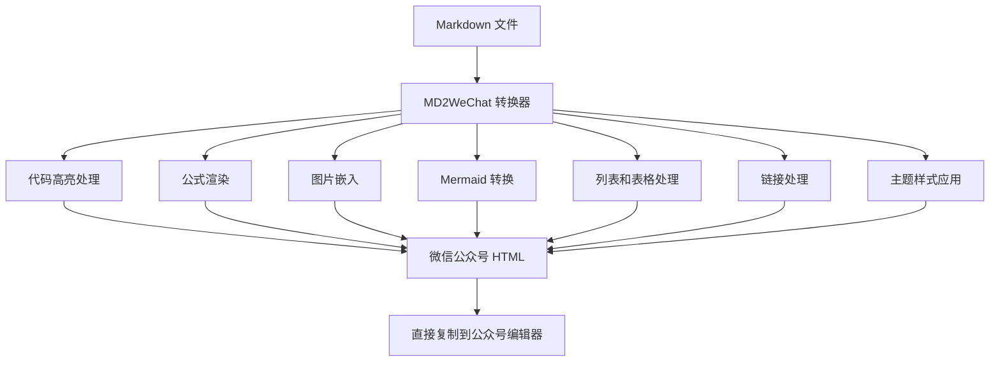

MD2WeChat 是一款专为微信公众号内容创作设计的 Markdown 转 HTML 转换工具。它能够将标准 Markdown 文件转换为微信公众号编辑器兼容的 HTML 格式，支持多种主题风格、代码语法高亮、数学公式渲染、Mermaid 图表、列表、表格、链接、水平分割线等丰富功能，让您的技术文章、产品介绍、节日祝福等内容在微信公众号中完美呈现。

## 核心特性



### 多主题风格支持

MD2WeChat 提供四种精心设计的主题风格，满足不同场景的需求：

- **学术灰风格** (`academic_gray`)：经典的灰色标题条配白色卡片设计，适合学术论文、技术文档等专业内容
- **节日快乐色彩系** (`festival`)：温暖的红色/金色主题，适合节日祝福、庆祝活动等喜庆内容
- **科技产品介绍色彩系** (`tech`)：现代的蓝色/青色主题，适合产品介绍、科技文章等商业内容
- **重大事情告知色彩系** (`announcement`)：醒目的红色/橙色主题，适合重要通知、公告等需要引起注意的内容

### 代码处理能力

MD2WeChat 对代码块的处理非常出色：

```python
# 示例：基本使用
from src.md2wechat import WeChatHTMLConverter

# 创建转换器实例
converter = WeChatHTMLConverter(style="academic_gray", base_dir=".")
# 转换 Markdown 文件
html_content = converter.convert("example.md")
```

**代码块特性**：
- ✅ 自动保留原始缩进（使用 `<br>` + `&nbsp;` 方法）
- ✅ 支持语法高亮（基于 Pygments，支持多种编程语言）
- ✅ 长代码自动横向滚动（`overflow-x:auto`）
- ✅ 代码块颜色随主题自动调整

### 数学公式支持

MD2WeChat 支持完整的 LaTeX 数学公式渲染：

**行内公式**：$E=mc^2$ 和 $x = \frac{-b \pm \sqrt{b^2-4ac}}{2a}$

**块级公式**：

$$
\frac{\partial f(x)}{\partial v_i}=\sum_{j=1}^n \frac{\partial f(x)}{\partial u_j} \frac{\partial u_j}{\partial v_i}
$$

**复杂公式示例**：

$$
reLU(x,k,a)=\begin{cases}0,x\lt a,\\k(x-a),x \ge a\end{cases}
$$

**公式渲染策略**：
1. **优先使用 CodeCogs**：在线服务渲染，质量高，支持复杂公式
2. **自动回退**：CodeCogs 失败时自动使用 sympy + matplotlib 本地渲染
3. **Base64 嵌入**：所有公式图片以 base64 形式嵌入，无需外部依赖
4. **透明背景**：公式图片使用透明背景，适配各种主题

### Mermaid 图表支持

MD2WeChat 支持将 Mermaid 图表转换为 PNG 图片并嵌入：


**Mermaid 特性**：
- 自动转换为 PNG 格式（使用 `mmdc` 工具）
- 透明背景，适配各种主题
- 支持横向布局图表自动设置 2.35:1 宽高比
- Base64 嵌入，无需外部图片链接

### 图片处理

MD2WeChat 智能处理图片资源：

- ✅ **本地图片**：自动读取并转换为 Base64 嵌入
- ✅ **网络图片**：自动下载并转换为 Base64 嵌入
- ✅ **自动识别**：支持常见图片格式（PNG、JPG、GIF、WebP 等）
- ✅ **无需外部链接**：所有图片嵌入 HTML，确保在微信公众号中稳定显示

### 列表支持

MD2WeChat 完整支持 Markdown 列表功能：

- ✅ **无序列表**：支持 `-`、`*`、`+` 三种标记符号
- ✅ **有序列表**：支持数字编号列表（`1.`、`2.` 等）
- ✅ **嵌套列表**：支持多层级嵌套列表，自动识别缩进级别
- ✅ **微信兼容**：使用标准的 `<ul>` 和 `<ol>` 标签，确保在微信中正确显示

**示例**：
```markdown
- 第一项
- 第二项
  - 嵌套项1
  - 嵌套项2
- 第三项

1. 第一步
2. 第二步
   1. 子步骤1
   2. 子步骤2
3. 第三步
```

### 表格支持

MD2WeChat 完整支持 Markdown 表格语法：

- ✅ **标准表格语法**：支持 `|` 分隔符的表格格式
- ✅ **对齐方式**：支持左对齐（`:---`）、居中（`:---:`）、右对齐（`---:`）
- ✅ **表头高亮**：自动识别表头并应用特殊样式
- ✅ **微信兼容**：使用 `<span>` 和 `<p>` 标签模拟表格（微信不支持 `<table>` 标签）

**示例**：
```markdown
| 列1 | 列2 | 列3 |
|:---|:---:|---:|
| 左对齐 | 居中 | 右对齐 |
| 数据1 | 数据2 | 数据3 |
```

### 链接支持

MD2WeChat 支持完整的链接功能：

- ✅ **基本链接**：支持 `[链接文本](URL)` 格式
- ✅ **带标题链接**：支持 `[链接文本](URL "标题")` 格式
- ✅ **URL 编码**：自动处理 URL 中的特殊字符
- ✅ **微信样式**：自动添加蓝色链接样式和下划线，符合微信风格
- ✅ **任意位置**：链接可以在段落、列表、表格等任何地方使用

**示例**：
```markdown
[普通链接](https://www.example.com)
[带标题的链接](https://www.example.com "示例网站")
```

### 水平分割线支持

MD2WeChat 支持 Markdown 标准水平分割线语法：

- ✅ **三种格式**：支持 `---`（连字符）、`***`（星号）、`___`（下划线）
- ✅ **自动识别**：至少需要3个相同字符，前后可以有空格
- ✅ **主题适配**：分割线颜色自动适配主题风格
- ✅ **微信兼容**：使用标准的 `<hr>` 标签，确保在微信中正确显示

**示例**：
```markdown
这是一段文字。

---

这是分割线后的内容。

***

也可以使用星号。

___

或者使用下划线。
```

## 安装与使用

### 快速安装

```bash
# 1. 克隆仓库
git clone <repository-url>
cd MD2WeChat

# 2. 安装 Python 依赖
pip install -r requirements.txt

# 3. 安装 Mermaid CLI（可选，用于 Mermaid 图表转换）
npm install -g @mermaid-js/mermaid-cli
```

### 基本使用

```bash
# 最简单的使用方式
python md2wechat.py input.md

# 指定输出文件
python md2wechat.py input.md -o output.html

# 指定主题风格
python md2wechat.py input.md -s festival      # 节日快乐色彩系
python md2wechat.py input.md -s tech          # 科技产品介绍色彩系
python md2wechat.py input.md -s announcement # 重大事情告知色彩系
```

### 依赖说明

**必需依赖**：
- `requests` (>=2.25.0)：用于网络请求和图片下载

**推荐依赖**：
- `pygments` (>=2.7.0)：用于代码语法高亮，强烈推荐安装

**可选依赖**：
- `matplotlib` (>=3.3.0)：用于本地渲染数学公式（当 CodeCogs 不可用时）
- `sympy` (>=1.7.0)：用于优化和渲染复杂的 LaTeX 公式

**外部工具**：
- `@mermaid-js/mermaid-cli`：用于将 Mermaid 图表转换为 PNG 图片
  - 安装方式：`npm install -g @mermaid-js/mermaid-cli`
  - 需要先安装 Node.js

## 项目架构

MD2WeChat 采用模块化设计，代码结构清晰：

```
MD2WeChat/
├── md2wechat.py          # 命令行入口脚本
├── requirements.txt       # Python 依赖
├── README.md             # 项目说明
├── INSTALL.md            # 详细安装指南
├── src/                  # 源代码目录
│   ├── __init__.py       # 包初始化文件
│   ├── md2wechat.py      # 主程序模块
│   └── inline_formatter.py  # Pygments 内联样式格式化器
├── docs/                 # 文档目录
│   ├── USAGE.md          # 使用文档
│   └── type.md           # 微信支持的 HTML 标签说明
├── examples/             # 示例文件
└── tests/                # 测试目录
```

### 核心组件

1. **WeChatHTMLConverter**：主转换器类，协调各个组件，支持列表、表格、链接处理
2. **MarkdownParser**：Markdown 解析器，处理 Front Matter 和正文内容，识别各种 Markdown 元素
3. **CodeBlockFormatter**：代码块格式化器，支持语法高亮和缩进保留
4. **FormulaProcessor**：公式处理器，支持多种渲染方式（CodeCogs/本地）
5. **MermaidProcessor**：Mermaid 图表处理器，转换为 PNG 并嵌入
6. **ImageProcessor**：图片处理器，支持本地和网络图片的 Base64 转换

## 使用场景

### 学术论文与技术文档

使用 `academic_gray` 主题，适合：
- 学术论文和技术文档
- 科研报告和实验总结
- 技术博客和教程文章

### 产品介绍与科技文章

使用 `tech` 主题，适合：
- 产品发表和功能介绍
- 科技新闻和行业分析
- 技术产品评测

### 节日祝福与庆祝内容

使用 `festival` 主题，适合：
- 节日祝福和问候
- 生日庆祝和纪念活动
- 喜庆活动和欢乐内容

### 重要通知与公告

使用 `announcement` 主题，适合：
- 重要通知和公告
- 紧急消息和警示信息
- 需要引起注意的官方声明

## 技术亮点

### 微信兼容性

MD2WeChat 严格遵循微信公众号编辑器的 HTML 标签白名单：

- ✅ 仅使用微信支持的标签：`<p>`, `<span>`, ``, `<br>`, `<strong>`, `<em>`, `<div>`, `<ul>`, `<ol>`, `<li>`, `<a>` 等
- ✅ 使用内联样式（`style` 属性），避免 `class` 和 `id` 被过滤
- ✅ 代码高亮使用内联 CSS，不依赖外部样式表
- ✅ 表格使用 `<span>` 和 `<p>` 模拟（微信不支持 `<table>` 标签）
- ✅ 所有资源（图片、公式、图表）以 Base64 嵌入，无需外部链接

### 代码块缩进处理

MD2WeChat 使用创新的 `<br>` + `&nbsp;` 方法保留代码缩进：

1. 计算所有非空行的最小前导空格数
2. 每行相对最小缩进的空格数转换为 2 倍数量的 `&nbsp;`
3. 使用 `<br>` 实现换行，确保在微信编辑器中正确显示

### 公式渲染策略

MD2WeChat 采用多层次的公式渲染策略：

1. **CodeCogs 优先**：使用 CodeCogs 在线服务，支持复杂 LaTeX 语法
2. **本地渲染备选**：CodeCogs 失败时使用 sympy + matplotlib 本地渲染
3. **自动转换**：将 `\begin{cases}` 转换为 `\left\{\begin{array}{ll}...\end{array}\right.` 以兼容 CodeCogs
4. **Base64 嵌入**：所有公式图片以 base64 形式嵌入，确保在微信中稳定显示

## 使用示例

### 示例 1：基础转换

```bash
# 转换 Markdown 文件
python md2wechat.py examples/2020-05-22-blog-post-13.md

# 输出文件：examples/2020-05-22-blog-post-13.html
```

### 示例 2：使用不同主题

```bash
# 学术灰风格（默认）
python md2wechat.py article.md -s academic_gray

# 节日快乐色彩系
python md2wechat.py article.md -s festival -o festival_output.html

# 科技产品介绍色彩系
python md2wechat.py article.md -s tech -o tech_output.html

# 重大事情告知色彩系
python md2wechat.py article.md -s announcement -o announcement_output.html
```

### 示例 3：在 Python 代码中使用

```python
from src.md2wechat import WeChatHTMLConverter

# 创建转换器，指定主题和基础目录
converter = WeChatHTMLConverter(
    style="tech",  # 使用科技产品介绍色彩系
    base_dir="."  # 图片路径的基础目录
)

# 转换 Markdown 文件
html_content = converter.convert("my_article.md")

# 保存 HTML 文件
with open("my_article.html", "w", encoding="utf-8") as f:
    f.write(html_content)
```

## 项目优势

### 1. 完全兼容微信公众号

- 严格遵循微信 HTML 标签白名单
- 所有资源内嵌，无需外部依赖
- 经过实际测试，确保在微信中完美显示

### 2. 功能丰富

- 支持多种主题风格（学术灰、节日、科技、公告）
- 代码语法高亮（支持多种编程语言）
- 数学公式渲染（LaTeX 支持）
- Mermaid 图表支持（自动转换为 PNG）
- 图片自动处理（Base64 嵌入）
- 列表支持（有序/无序，支持嵌套）
- 表格支持（支持对齐方式）
- 链接支持（支持带标题的链接）
- 水平分割线支持（`---`, `***`, `___`）

### 3. 易于使用

- 简单的命令行接口
- 清晰的文档和示例
- 完善的错误处理

### 4. 可扩展性强

- 模块化设计
- 易于添加新主题
- 支持自定义样式配置

## 总结

MD2WeChat 是一款专为微信公众号内容创作设计的 Markdown 转 HTML 转换工具，它解决了技术文章在微信公众号中格式丢失、代码缩进错误、公式显示异常等问题。通过多主题支持、代码高亮、公式渲染、Mermaid 图表、列表、表格、链接、水平分割线等完整功能，让您的技术内容在微信公众号中完美呈现。


无论您是技术博主、产品经理、学术研究者还是内容创作者，MD2WeChat 都能帮助您快速将 Markdown 内容转换为微信公众号兼容的 HTML 格式，让您专注于内容创作，而不是格式调整。

---

**作者**：Mapoet  
**项目地址**：[https://github.com/Mapoet/MD2WeChat](https://github.com/Mapoet/MD2WeChat)  
**许可证**：MIT License  
**贡献**：欢迎提交 Issue 和 Pull Request

