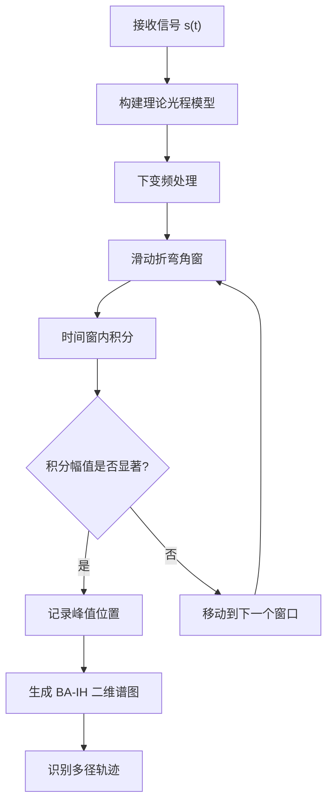
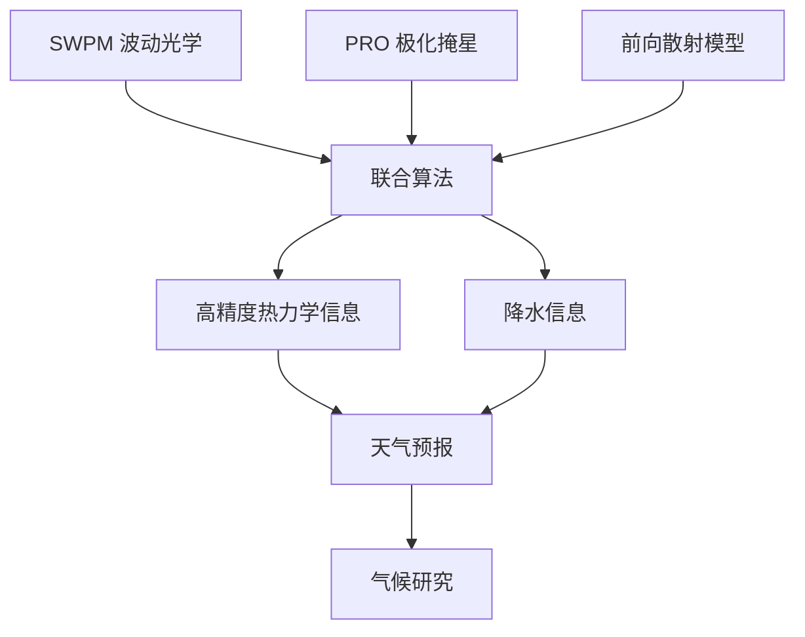

全球导航卫星系统 (GNSS) 掩星 (**RO**) 通过接收低轨卫星信号，反演折弯角并推算大气折射率、温湿度剖面。传统几何光学在**低层大气或多径条件**下失效，需利用波动光学方法分析信号相位与干涉模式[1]。

**极化掩星 (PRO)** 采用双线极化天线同时接收 H/V 极化载波，通过相位差观测水云/冰粒子等降水信息，补充传统热力学产品。

### 技术发展现状

| 技术 | 传统 RO | 波动光学 RO | 极化掩星 PRO | SWPM-PRO |
|------|---------|------------|--------------|----------|
| **观测能力** | 热力学参数 | 多径处理 | 热力学+降水 | **热力学+降水+高分辨率** |
| **适用场景** | 高层大气 | 多径环境 | 降水区域 | **强多径+降水** |
| **技术成熟度** | ✅ 成熟 | ✅ 成熟 | 🔄 发展中 | 🔄 **发展中** |

**本综述**以近三年（2023‑2025）文献为主，梳理 **RO 波动光学 + 极化 + 滑窗谱方法**的关键成果、算法和实现流程。

## 滑窗相位匹配 (SWPM) 方法与数学原理

**SWPM 是对相位匹配 (Phase Matching, PM) 算法的拓展。**Sievert 等人在 2021 年提出 **滑窗相位匹配 (Sliding‑Window Phase Matching)**[2]，为波动光学处理提供了更灵活的计算框架。

### SWPM vs 传统方法对比

| 特性 | 传统几何光学 | 相位匹配 (PM) | 滑窗相位匹配 (SWPM) |
|------|------------|-------------|------------------|
| **多径处理** | ❌ 失效 | ✅ 可处理 | ✅ 可处理 |
| **计算复杂度** | 低 | 高 | 中等 |
| **折弯角分辨率** | 固定 | 固定 | **可自由设定** |
| **BA‑IH 网格** | 固定采样 | 固定采样 | **灵活可调** |
| **适用场景** | 高层大气 | 多径环境 | **强多径、低层大气** |

### SWPM 核心原理

SWPM 方法的核心在于**下变频信号与幅度积分**。为某个固定碰撞参数构建理论光程模型，将接收信号下变频后在时间窗内积分[3]：

$$S(a_0) = \int_{t_1}^{t_2} s(t) \cdot e^{-j\phi(a,t)} \, dt$$

**关键机制**：仅当信号频率与光程模型一致时，积分幅值显著增大，峰值对应真实折弯角[3]。

### SWPM 算法流程

**滑动窗口策略**：在折弯角域定义有限宽度窗口，对每个位置执行积分，得到完整的**折弯角-影响高度 (BA--IH)** 二维谱图[4]。窗口移动等价于在不同折弯角上进行匹配搜索，可自由设定网格密度和范围。

### 分辨率权衡

| 参数 | 窄窗 | 宽窗 |
|------|------|------|
| **折弯角分辨率** | ⬆️ 高 | ⬇️ 低 |
| **影响高度分辨率** | ⬇️ 低 | ⬆️ 高 |
| **计算量** | ⬆️ 大 | ⬇️ 小 |

**优化策略**：根据观测目标和信号特性动态调整窗宽[6]。

### SWPM 优势与局限

**✅ 优势**：
- 直接处理多径和信号干涉
- 灵活的 BA‑IH 网格设定
- 与 STFT 结果一致但更高效[5]

**⚠️ 局限**：
- 计算量大（每个折弯角窗需长积分）
- 分辨率存在权衡

**应用价值**：由于极化掩星信号在降水区常出现多径和反射，SWPM 方法具备**显著的应用潜力**。

## 近三年文献综述

下表列出 2023‑2025 年涉及 **RO 波动光学、极化及滑窗处理**的代表性研究。

| 年份/文献 | 关键贡献 | 可借鉴算法 | 应用价值 |
|---------|---------|-----------|---------|
| **2024** -- Padullés et al. (Earth System Science Data) | **PAZ 数据集 (resPrf)**：PRO 可观测量 + RO 反演[7] **滑动窗口**标准差检测（50点）[9] | **PRO 处理流程**：预处理、H/V 差分相位、滑窗噪声检测[10] **自适应窗宽调整** | 射线轨迹 + 降水产品共定位[11] **波动光学检索**消除多值问题[12] |
| **2024** -- Hotta et al. (Atmospheric Measurement Techniques) | **PRO 前向算子**：数据同化框架[13] **极化差分相位**处理 | **数值前向模型**：云水含量/冰粒形态 → 差分相位 与 SWPM 结合反演水粒参数 | PRO 观测感知水凝物[13] |
| **2024** -- Nguyen et al. (AMS Meeting abstract) | **Spire 纳星**：3颗 PRO 纳星，9个月校准[14] **每日约 2000 次掩星事件** | **实时 PRO 波动处理**数据源 H/V 信号组合增强信噪比[15][16] | 与 IMERG 降水产品关联 降水监测 + 数值预报 |
| **2024** -- Padullés et al. (Geophysical Research Letters) | **散射敏感性**：离散偶极子近似 板状冰 vs 软聚合体：**相位差超一个数量级**[17] | **模块化前向计算器**：结合 SWPM 反演 识别降水类型，指导滑窗选择 | 差分相位区分水凝物形态[17] |
| **2025** -- Chen et al. (Atmospheric Measurement Techniques) | **台风案例**：PRO vs WRF 对比[18] **差分相位**获取云水垂直结构 | **模式检验**：SWPM 结果 vs 模式模拟 改进云微物理参数 | 验证模式微物理方案[18] |
| **2025** -- Katona et al. (Atmospheric Measurement Techniques) | **聚类算法**：PRO 相位差剖面分类[19] 结合 GPM 分析温湿分布 | **机器学习/聚类**：自动分类谱图 识别云类型/降水强度 | 探索温湿分布关系[19] |
| **2019-2021** -- Wang et al. (ROM SAF Poster) | **MPS 模拟 + PM**：强降水影响研究[20] 低层湿区多径明显 | **相位匹配算法**（SWPM 前身） 去偏、去趋势、滤波、差分[21] | 同时探测水汽 + 降水结构[22] 与 GPM 协同验证[20] |

## 数学物理原理与算法实现分析

### 极化掩星观测原理

传统 RO 任务使用右手圆极化（RHCP）天线接收信号，获得单一的 excess phase。**极化掩星**在 PAZ 卫星等平台上采用两副正交线极化天线以获取水平 (H) 与垂直 (V) 极化分量[23]。差分相位与降水中的水汽和冰粒散射有关，可以探测云和降水的垂直结构[24]：

$$\Delta\Phi(t) = \Phi_{H}(t) - \Phi_{V}(t)$$

在处理链中，首先需校正轨道和钟差，将 H/V 信号插值到同一时间戳，然后进行半周期/全周期滑移校正和噪声平滑[8]。波动光学的 MPS 模拟表明 PRO 信号在强降水下会出现明显多径，多径影响折弯角和相位，因此需采用波动光学算法进行反演[20]。

### 波动光学与 SWPM 的数学框架

#### 波动传播建模

**多相屏 (Multiple Phase Screen, MPS)** 方法将大气折射率和降水粒子散射抽象为相位屏，按分段傅里叶传播计算电磁场[20]。

**核心优势**：捕捉传统几何光学无法处理的**多径和干涉现象**。

#### 相位匹配原理

SWPM 利用理论光程模型进行下变频和积分运算[2]：

$$\phi(a,t) = \int_0^t \frac{2\pi f_0}{c} n(r(s)) \, ds$$

$$S(a_0) = \left| \int_{t_1}^{t_2} s(t) e^{-j\phi(a_0,t)} dt \right|$$

**匹配条件**：当信号频率与光程模型完全匹配时，积分达到最大值，对应真实折弯角。

**极化应用**：可分别对 H/V 极化信号匹配，或直接匹配差分，识别降水引起的相位偏移。

#### SWPM 算法流程

**1. 预处理阶段**

- 输入：H/V 极化信号或组合信号
- 处理步骤：
  - 去除趋势项
  - 相位解缠校正（消除周期跳变）
  - 时间序列插值（统一时间步长）
  - 滑窗检测（去除低信噪比/跳变段）[9]

**2. 射线路径建模**

- 确定折弯角与时间的映射关系
- 计算光程差[17]
- **极化数据**：需考虑水/冰粒子散射相位
  - 板状冰 vs 软聚合体：散射相位差可超**一个数量级**[17]

**3. 滑窗积分**

对每个中心折弯角，在对应时间区间内积分[25]：

$$S(a_i) = \int_{t_i - \Delta t/2}^{t_i + \Delta t/2} s(t) e^{-j\phi(a_i,t)} dt$$

**极化应用**：分别对 H/V 分量积分，计算差分获得极化差分相位。

**4. 谱图重采样与峰值识别**

- 将结果放置在 BA--IH 网格
- 识别峰值获取多径轨迹
- 比较 H/V 差谱定位降水层高度

**5. 结果融合**

- **前向散射模型**：结合 Hotta et al. 前向算子[13]，反演水凝物形态/含量
- **机器学习聚类**：自动分类谱图，识别降水类型和微物理特征[19]

### 系统集成与技术难点

#### 技术难点对比表

| 难点 | 问题描述 | 解决方案 | 关键指标 |
|------|---------|---------|---------|
| **数据预处理** | 信噪比低、H/V 功率不均、周期跳变 | 天线校准、时间同步、滑移校正[8][9] | 信号质量阈值 |
| **光程模型** | 粒子形态影响散射相位 | 引入形态参数、前向散射算子[17] | 相位差精度 |
| **计算资源** | 计算复杂度 O(n²) | 并行化/GPU、自适应网格[9] | 计算时间 |
| **多径识别** | 多个谱峰难以区分 | H/V 信噪比比较、标准差检测[16][9] | 峰值置信度 |
| **反演同化** | 相位谱→模型变量转换 | 前向算子、机器学习[13][26] | 反演精度 |

#### 关键技术细节

**1. 数据预处理**

- **信噪比低**：降水区域信号受强烈散射和衰减
- **H/V 功率不均**：源于天线特性差异、传播路径不同、极化选择性散射
- **周期跳变**：需区分真实物理现象 vs 数据处理伪影
- **解决方案**：半/全周期滑移校正 + 滑窗标准差检验[9]

**2. 光程模型与散射效应**

**关键发现**：板状冰与软聚合体的散射相位差可超**一个数量级**[17]

**建模要求**：
- 引入粒子形态参数
- 利用前向散射算子计算理论相位
- 提高反演精度，识别不同降水类型

## 结论与展望

近三年中，极化掩星技术经历了**快速发展**。PAZ 卫星公开了完整的 PRO 数据集[7]，前向算子、聚类分析和散射敏感性研究不断扩展应用范围[13][19][17]。尽管 **SWPM** 自 2021 年提出后尚未与 PRO 结合发表，但其波动光学优势显著，能在折弯角域直接识别多径和反射现象[2]。

### 技术融合路径

**核心价值**：通过将 **滑窗相位匹配** 与 **极化掩星** 数据结合，利用前向散射模型和机器学习分析，未来掩星技术有望同时提供高精度的热力学和降水信息，为天气预报和气候研究带来**重要价值**。

## 参考文献

[1][2][3][4][5][6][25] Sievert, P. R., et al. (2021). Using A Sliding Window Phase Matching Method for Imaging of GNSS Radio Occultation Signals. *Remote Sensing*, 13(5), 970. https://www.mdpi.com/2072-4292/13/5/970

[7][8][9][10][11][12][23][24][26] Padullés, R., et al. (2024). The PAZ polarimetric radio occultation research dataset for scientific applications. *Earth System Science Data*. https://opensky.ucar.edu/node/42552/ocr

[13] Hotta, D., Lonitz, K., & Healy, S. B. (2024). Forward operator for polarimetric radio occultation measurements. *Atmospheric Measurement Techniques*. https://www.semanticscholar.org/paper/Forward-operator-for-polarimetric-radio-occultation-Hotta-Lonitz/af9425960de267ff60ceecf3846d1d1bb323b640

[14][15][16] Nguyen, V., et al. (2024). Initial Polarimetric Radio Occultation Results from Spire's Nanosatellite Constellation. *AMS Meeting abstract*. https://ui.adsabs.harvard.edu/abs/2024AMS...10429554N/abstract

[17] Padullés, R., Cardellach, E., & de la Torre-Juárez, M. (2024). Polarimetric Radio Occultation Forward Scattering Sensitivity to Hydrometeor Habit. *Geophysical Research Letters*. https://www.semanticscholar.org/paper/Polarimetric-Radio-Occultation-Forward-Scattering-Padull%C3%A9s-Cardellach/c2605e7f3bffb298103b91a69df2350922dd0d25

[18] Chen, S.-Y., et al. (2025). Comparisons of polarimetric radio occultation measurements with WRF model simulation for tropical cyclones. *Atmospheric Measurement Techniques*. https://www.semanticscholar.org/paper/Comparisons-of-polarimetric-radio-occultation-with-Chen-Kuo/475bc38e6c81caa6aa82da0b142cfdee6d210349

[19] Katona, B., et al. (2025). Cluster analysis of vertical polarimetric radio occultation profiles and corresponding liquid and ice water paths from Global Precipitation Measurement (GPM) microwave data. *Atmospheric Measurement Techniques*. https://www.semanticscholar.org/paper/Cluster-analysis-of-vertical-polarimetric-radio-and-Katona-la/db014793024e6ca6a0dcccd257cf0f56f4e9185d

[20][21][22] Wang, K.-N., et al. (2019-2021). A study on the effects of heavy precipitation on Polarimetric RO bending angle observations. *ROM SAF Poster*. https://rom-saf.eumetsat.int/romsaf-irowg-2019/en/open/1570393617.f7002d09a38af82005fc7e1cddcc53b4.pdf/P07_Wang__KNW_v1.pdf

