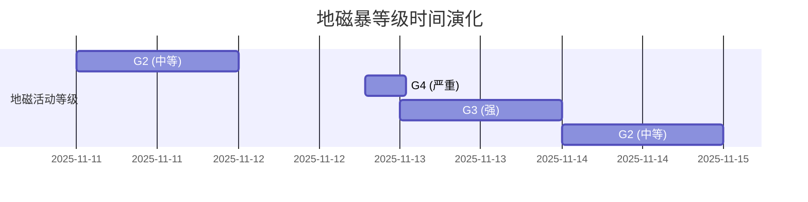
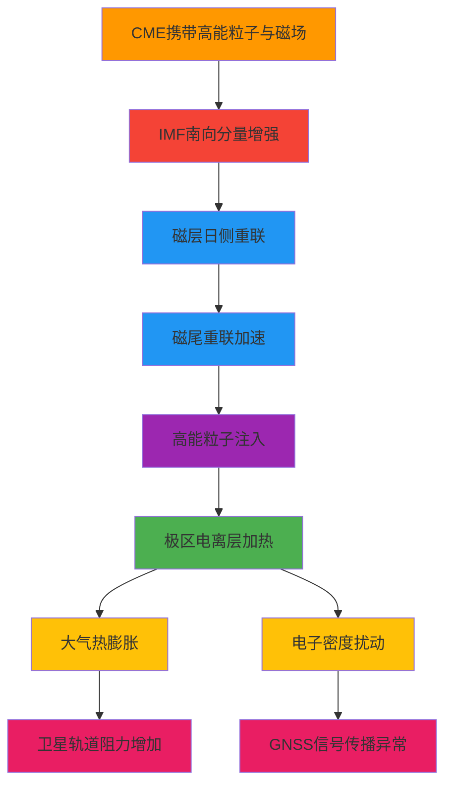

2025年11月12日18:50 UTC，一次高速日冕物质抛射（CME）抵达地球，引发G4级严重地磁暴。此次事件源于11月10日太阳活动区AR4274爆发的X5.1级耀斑，CME初始速度约1500 km/s，与前期多个CME形成"吞噬"效应，使得扰动强度进一步增强。全球地磁活动指数Kp值一度达到9，极光活动扩展至北纬40度以南地区，标志着近二十年来最强烈的地磁暴事件之一。

地磁暴作为太阳活动与地球空间环境相互作用的极端表现，其影响远不止于绚丽的极光。从低轨卫星的轨道衰减到GNSS导航精度的下降，从高频通信的中断到遥感数据的质量受损，地磁暴通过改变电离层和热层大气的物理状态，深刻影响着现代空间技术系统的运行。理解这一复杂物理过程，不仅关乎空间天气预报的准确性，更关乎人类对空间资产的有效管理与保护。

## 事件概况与时间演化

### 太阳活动源与CME传播

根据欧洲空间局（ESA）和NOAA空间天气预报中心（SWPC）的观测数据，此次事件的演化过程如下：

| 时间 | 事件 | 关键参数 | 数据来源 |
|------|------|---------|---------|
| 11月10日 10:04 UTC | X5.1级太阳耀斑爆发 | 峰值通量：5.1×10⁻⁴ W/m² | ESA, SWPC |
| 11月10日 10:30 UTC | 全晕CME观测 | 初始速度：~1500 km/s | ESA |
| 11月12日 18:50 UTC | CME抵达地球 | 太阳风速度：~1000 km/s | SWPC |
| 11月12日 20:00 UTC | G4级地磁暴确认 | Kp指数：9 | SWPC |
| 11月13日 00:00-06:00 UTC | 强烈风暴持续 | Kp指数：7-8 | SWPC |

**CME"吞噬"效应**：此次事件的一个显著特征是多个CME的相互作用。11月9日至10日期间，太阳表面连续发生多次CME事件，后续的高速CME（1500 km/s）追赶上并"吞噬"了前期较慢的CME，形成复合扰动波前。这种"cannibal CME"现象导致到达地球的扰动强度显著增强，磁场南向分量（Bz）可能达到更负值，从而驱动更强的磁层能量输入。

### 地磁活动等级演化

根据SWPC的监测数据，地磁活动等级从11月11日的G2（中等）迅速升级至12日的G4（严重），13日维持在G3（强）级别，随后逐渐衰减。这种快速升级反映了CME携带的高能量与地球磁层相互作用的剧烈程度。

## 物理过程：从太阳爆发到电离层响应

### 磁层-电离层耦合机制

地磁暴的物理本质是太阳风-磁层-电离层系统的能量传输与转换过程。当高速CME携带的磁场与地球磁场相互作用时，若IMF（行星际磁场）南向分量（Bz < 0）增强，将触发磁层重联过程，大量能量通过磁层-电离层耦合系统注入地球空间环境。

**能量传输路径**：

### 电离层扰动特征

地磁暴期间，电离层响应表现为多尺度、多层次的复杂变化，这种变化不仅体现在电子密度的空间分布上，更体现在时间演化的剧烈程度上。从极区到赤道，从D层到F2层，电离层的各个区域都经历着不同程度的扰动，这种扰动既是对太阳活动输入的响应，也是地球空间环境自我调节的体现。

在极区，电子密度的增加最为显著。F2层临界频率（foF2）可能增加50%以上，这种增加不仅反映了高能粒子沉降的直接作用，更反映了磁层-电离层耦合系统的能量传输效率。与此同时，极区电离层中出现强烈的电子密度不规则结构，这些不规则结构尺度从数米到数百公里不等，形成了复杂的等离子体湍流场。受极区扰动扩展的影响，中纬度地区的电子密度出现剧烈波动，TEC变化率（dTEC/dt）可达正常值的5-10倍，这种快速变化对依赖电离层传播的无线电系统构成了严峻挑战。在低纬度地区，赤道异常区（EIA）的结构可能发生畸变，电离层气泡活动显著增强，这种增强不仅改变了信号的传播路径，也增加了信号传播的不确定性。

地磁暴期间形成的等离子体不规则结构，是电离层扰动最直接的表现。这些不规则结构导致GNSS信号相位和幅度出现快速波动，S4指数（幅度闪烁指数）和σΦ（相位闪烁指数）显著增大，从正常条件下的小于0.3增加至磁暴期间的0.5-2.0。信号传播路径发生散射和反射，多径效应显著增强，导致信号延迟和功率衰减。在极端情况下，GNSS接收机可能出现信号失锁，可用卫星数减少，定位精度大幅下降。这种信号传播异常不仅影响导航定位，也对依赖GNSS信号的掩星观测、时间同步等应用产生严重影响。

地磁暴期间，极区焦耳加热和粒子沉降导致热层大气温度升高，大气密度显著增加。在200-400公里高度范围内，温度可能增加200-500 K，密度增加50-200%，这种变化具有全球性影响。在400-600公里高度，温度增加100-300 K，密度增加30-100%，主要影响中高纬度地区。在600-800公里高度，温度增加50-150 K，密度增加20-50%，主要影响极区。这种大气膨胀直接导致低轨卫星（LEO，< 600 km）所受大气阻力显著增加，轨道衰减加速。对于商业卫星星座而言，这种轨道衰减不仅影响单颗卫星的寿命，更可能影响整个星座的构型和性能。

## 对空间技术系统的影响分析

### 卫星轨道：大气阻力与轨道衰减

地磁暴对卫星轨道的影响主要通过改变高层大气密度实现。根据Baruah（2025）的研究，不同强度的地磁暴对卫星轨道寿命的影响存在显著差异。

**物理机制**：

大气阻力公式为：

$$F_d = \frac{1}{2} \rho v^2 C_D A$$

其中，ρ表示大气密度，v表示卫星速度，C_D表示阻力系数，A表示有效截面积。

地磁暴期间，大气密度ρ的增加导致大气阻力F_d显著增大，卫星轨道能量损失加速。LEO卫星（400-600 km）在强磁暴期间，轨道高度下降速率可能增加2-5倍，这种加速衰减不仅影响卫星的轨道高度，更影响卫星的轨道周期和位置预报精度。轨道周期缩短导致卫星位置预报误差累积，这种误差累积对于需要精确轨道控制的卫星任务而言，可能带来严重后果。对于商业卫星星座（如Starlink），强磁暴可能导致部分卫星提前再入大气层，这不仅造成经济损失，更可能影响整个星座的服务能力。

2024年10月的一次强磁暴事件中，一颗Starlink卫星可能因大气阻力突增而提前再入，这一案例凸显了极端空间天气事件对低轨卫星星座的威胁。这一事件不仅提醒我们空间天气对空间资产的重要性，更提醒我们需要建立完善的监测预警和应对机制。

应对地磁暴对卫星轨道的影响，需要从监测、预报、应对等多个层面入手。在监测层面，需要增加TLE（两行轨道要素）更新频率，从常规的每日更新提升至每6-12小时更新，以便及时发现轨道异常。在预报层面，需要在磁暴预警期间，提前进行轨道提升机动，增加轨道高度储备，以应对可能的大气阻力突增。在模型层面，需要在卫星寿命预测模型中纳入地磁活动指数（Ap、Kp），动态调整大气密度模型参数，以提高轨道预报的准确性。这种多层次的应对策略，不仅能够减轻地磁暴对卫星轨道的影响，更能够提高空间资产管理的科学性和有效性。

### GNSS导航系统：信号传播异常与定位精度下降

电离层扰动对GNSS导航的影响是多方面的，这种影响不仅体现在信号传播延迟的变化上，更体现在信号传播路径的复杂化和信号质量的下降上。这种影响涉及信号传播延迟、相位闪烁、多径效应等多个物理过程，这些过程的相互作用使得GNSS导航在极端空间天气条件下面临严峻挑战。GNSS信号在电离层中的传播延迟与TEC成正比，地磁暴期间TEC的剧烈变化导致单频接收机的电离层延迟误差可能从正常情况下的数米增加至数十米。这种延迟误差的增大不仅影响定位精度，更影响定位解算过程中的时间相关性假设，dTEC/dt的增大导致滤波算法性能下降，定位解算的收敛性和稳定性受到严重影响。

电离层不规则结构导致信号幅度和相位快速波动，S4指数从正常条件下的小于0.3增加至G4级磁暴期间的0.5-1.0，σΦ从正常条件下的小于0.3增加至0.5-2.0。这种信号闪烁不仅导致信号质量下降，更导致GNSS接收机的失锁率从正常条件下的小于1%增加至5-20%，可用卫星数减少，定位精度大幅下降。在极端情况下，GNSS接收机可能出现完全失锁，定位服务中断。

根据Bagheri等（2025）的研究，在强磁暴期间，低成本GNSS接收机的PPP（精密单点定位）RMS误差从正常情况下的约0.8米增加至最大超过3米，三维定位误差从约1.7米增加至约3.1米。这种误差的增大不仅影响定位精度，更影响定位解算的收敛时间，PPP收敛时间从正常情况下的20-30分钟延长至1-2小时。这种性能下降对于依赖高精度定位的应用而言，可能带来严重后果。

此次G4级磁暴的影响范围扩展至中低纬度地区，不仅极区用户受影响，中纬甚至低纬地区的GNSS用户也可能遇到性能下降。这种全球性影响特征反映了强磁暴对地球空间环境的系统性扰动，这种扰动不仅影响高纬度地区，更通过磁层-电离层耦合系统向中低纬度地区扩展，形成全球性的电离层扰动。

对于GNSS掩星（RO）反演而言，地磁暴期间的电离层扰动带来了额外的挑战。电离层不规则结构导致GNSS信号在RO事件中的折射路径发生畸变，这种畸变不仅影响折弯角测量精度，更影响大气参数的反演精度。电离层不规则引起的信号多径效应可能被误判为地表反射或真实掩星路径，这种误判不仅影响多径数据判别模块的性能，更可能导致反演结果出现系统性偏差。在强扰动期间，RO反演的大气参数（温度、湿度、压力）误差可能显著增大，特别是低层大气的反演精度受到严重影响。这种误差的增大不仅影响大气参数的反演质量，更可能影响基于RO数据的天气预报和气候研究。

应对地磁暴对GNSS导航的影响，需要从观测、校正、算法等多个层面入手。在观测层面，需要充分利用多频GNSS观测，通过多频组合消除电离层一阶项影响，提高定位精度。在校正层面，需要基于全球GNSS网络实时计算并发布电离层TEC校正参数，为用户提供实时电离层校正服务。在算法层面，需要在定位解算算法中引入电离层扰动自适应机制，根据实时电离层状态动态调整滤波参数和观测权重，提高算法在极端条件下的鲁棒性。对于RO反演而言，需要在反演流程中加入电离层扰动指标（S4、σΦ、dTEC/dt）作为数据质量标志，对高扰动时段的数据进行标记或剔除，以确保反演结果的可靠性。

### 通信系统：高频传播异常与卫星链路干扰

地磁暴对通信系统的影响主要体现在高频（HF）无线电通信和卫星通信链路两个方面。

高频（HF）无线电通信依赖电离层反射实现超视距传播，这种传播方式使得HF通信对电离层状态的变化极为敏感。地磁暴期间，D层（60-90 km）电子密度显著增加，对HF信号的吸收增强，这种吸收增强不仅导致信号功率衰减，更可能导致信号完全被吸收，通信链路中断。E层（90-150 km）临界频率（foE）的快速变化导致HF信号反射条件不稳定，这种不稳定不仅影响信号的反射效率，更影响信号的传播路径和到达角。在极端情况下，HF通信链路可能出现完全中断，这种中断对于依赖HF通信的航空、海事和军事应用而言，可能带来严重后果。

F层（150-400 km）高度和电子密度分布发生剧烈变化，导致HF信号反射点位置不稳定，这种不稳定不仅影响信号的传播路径，更影响信号的到达时间和相位。F层不规则结构导致信号发生多径传播，接收信号质量下降，这种质量下降不仅影响通信的可靠性，更影响通信的实时性。传统的最佳工作频率（OWF）预测模型在磁暴期间失效，频率选择困难，这种困难不仅影响通信系统的性能，更影响通信系统的可用性。

对于卫星通信而言，地磁暴的影响主要体现在电离层闪烁和群延迟变化上。卫星通信链路穿越电离层时，信号幅度和相位出现快速波动，这种波动导致误码率（BER）升高，通信质量下降。电离层TEC变化导致信号群延迟不稳定，这种不稳定影响时分多址（TDMA）和码分多址（CDMA）系统的同步，可能导致系统性能下降甚至系统失效。跨极轨道或高倾角卫星的通信链路受极区电离层扰动影响最为严重，这种影响不仅体现在信号质量的下降上，更体现在通信链路的稳定性上。

应对地磁暴对通信系统的影响，需要从频率选择、路径优化、系统设计等多个层面入手。在频率选择层面，需要根据实时电离层状态自动调整通信频率，以适应电离层状态的变化。在路径优化层面，需要基于电离层电子密度分布优化信号传播路径，以减少信号传播过程中的损耗和畸变。在系统设计层面，需要在关键通信系统中设计多路径冗余，以降低单一路径失效风险，提高系统的可靠性和可用性。这种多层次的应对策略，不仅能够减轻地磁暴对通信系统的影响，更能够提高通信系统的抗干扰能力和适应性。

### 遥感观测：信号质量下降与数据偏差

地磁暴对遥感观测的影响主要体现在信号传播路径变化、传感器性能下降和数据质量受损等方面。这种影响不仅体现在观测数据的精度上，更体现在观测数据的可用性上。这种影响不仅影响单次观测的质量，更可能影响长期观测数据的连续性和一致性。

对于GNSS掩星（RO）观测而言，电离层不规则结构导致GNSS信号在RO事件中的传播路径发生畸变，这种畸变不仅影响折弯角测量精度，更影响大气参数的反演精度。电离层不规则引起的信号多径效应可能被误判为真实掩星路径，这种误判不仅影响数据质量控制，更可能导致反演结果出现系统性偏差。在强扰动期间，RO反演的大气参数误差可能显著增大，特别是低层大气的反演精度受到严重影响。这种误差的增大不仅影响大气参数的反演质量，更可能影响基于RO数据的天气预报和气候研究。

对于合成孔径雷达（SAR）而言，SAR信号在电离层中的传播延迟和相位误差导致图像定位精度下降，这种精度下降不仅影响图像的几何精度，更影响图像的解释和应用。电离层不规则结构可能导致SAR图像出现几何畸变和相位误差，这种畸变和误差不仅影响图像的质量，更可能影响图像的可用性。在极端情况下，SAR数据可能出现严重质量下降，需要重新获取，这种重新获取不仅增加成本，更可能影响观测任务的完成。

对于其他遥感载荷而言，光学遥感受地磁暴影响相对较小，但卫星姿态控制系统可能受到影响，这种影响可能导致图像定位精度下降。微波遥感受电离层影响较大，特别是低频段（L波段、S波段）的观测，这种影响不仅体现在信号传播的延迟和衰减上，更体现在信号传播路径的复杂化上。

应对地磁暴对遥感观测的影响，需要从数据质量控制、后处理校正、任务规划等多个层面入手。在数据质量控制层面，需要在遥感数据处理流程中加入电离层扰动指标，对高扰动时段的数据进行标记，以便后续处理和分析。在数据剔除层面，需要设定数据质量阈值，对严重受扰的数据进行自动剔除，以确保观测数据的可靠性。在后处理校正层面，需要利用电离层模型对受扰数据进行后处理校正，尽可能恢复数据质量，以提高观测数据的可用性。这种多层次的应对策略，不仅能够减轻地磁暴对遥感观测的影响，更能够提高遥感观测数据的质量和可靠性。

## 技术挑战与应对策略

### 监测与预警能力

当前空间天气监测与预警系统在应对极端事件时仍面临挑战：

| 挑战 | 现状 | 改进方向 |
|------|------|---------|
| **CME到达时间预测** | 误差±6-12小时 | 多卫星立体观测，提高CME速度测量精度 |
| **地磁暴强度预测** | G4级事件预测准确率~60% | 改进IMF南向分量预测模型 |
| **电离层扰动预报** | 提前1-2小时 | 发展基于机器学习的实时预报模型 |
| **全球覆盖** | 观测站分布不均 | 利用LEO星座增强全球监测能力 |

### 模型与算法改进

传统的大气模型在极端空间天气条件下表现不佳，这种不佳不仅体现在预测精度的下降上，更体现在预测能力的局限性上。需要发展实时数据同化技术，将多源观测数据（GNSS TEC、RO、测高仪）实时同化到物理模型中，以提高模型的实时性和准确性。需要利用机器学习方法对物理模型进行实时校正，通过数据驱动的方式提高极端条件下的预测精度。需要考虑从太阳活动到电离层响应的多尺度物理过程，建立多尺度耦合模型，以提高模型的物理一致性和预测能力。

对于GNSS定位算法而言，需要在定位解算算法中引入电离层扰动自适应机制，根据实时电离层状态动态调整滤波参数和观测权重，以提高算法在极端条件下的鲁棒性。需要充分利用多频GNSS观测，通过多频组合消除电离层高阶项影响，提高定位精度。需要基于全球GNSS网络实时计算并发布电离层校正参数，为用户提供实时电离层校正服务，以提高定位精度和服务质量。

对于卫星轨道预报而言，需要在轨道预报模型中纳入实时地磁活动指数，以反映地磁活动对大气密度的影响。需要利用机器学习方法对传统大气密度模型进行实时校正，通过数据驱动的方式提高轨道预报的准确性。需要提供轨道预报的不确定性估计，为任务规划提供决策支持，以提高空间资产管理的科学性和有效性。这种多层次的模型改进，不仅能够提高预测精度，更能够提高预测的可靠性和可用性。

### 系统级应对策略

对于卫星星座管理而言，需要在磁暴预警期间，提前进行轨道提升机动，增加轨道高度储备，以应对可能的大气阻力突增。需要在关键任务中设计轨道高度冗余，应对突发轨道衰减，以提高系统的可靠性和可用性。需要建立实时轨道监测系统，及时发现异常轨道变化，以便及时采取应对措施。这种多层次的卫星星座管理策略，不仅能够减轻地磁暴对卫星轨道的影响，更能够提高空间资产管理的科学性和有效性。

对于导航服务保障而言，需要充分利用GPS、GLONASS、Galileo、BDS等多系统融合，通过多系统组合提高服务可用性和定位精度。需要利用SBAS（星基增强系统）和GBAS（地基增强系统）提供实时电离层校正，以提高定位精度和服务质量。需要向用户发布空间天气预警信息，提醒可能出现的导航性能下降，以便用户及时调整应用策略。这种多层次的导航服务保障策略，不仅能够减轻地磁暴对导航系统的影响，更能够提高导航服务的可靠性和可用性。

对于通信系统优化而言，需要根据实时电离层状态自动调整通信频率，以适应电离层状态的变化。需要基于电离层电子密度分布优化信号传播路径，以减少信号传播过程中的损耗和畸变。需要在关键通信系统中设计多路径冗余，以降低单一路径失效风险，提高系统的可靠性和可用性。这种多层次的通信系统优化策略，不仅能够减轻地磁暴对通信系统的影响，更能够提高通信系统的抗干扰能力和适应性。

## 结论与展望

2025年11月中旬的G4级地磁暴事件，再次凸显了太阳活动对地球空间环境和技术系统的深远影响。从低轨卫星的轨道衰减到GNSS导航精度的下降，从高频通信的中断到遥感数据的质量受损，地磁暴通过改变电离层和热层大气的物理状态，深刻影响着现代空间技术系统的运行。

**物理过程认知**：此次事件揭示了CME"吞噬"效应、磁层-电离层强耦合、全球性电离层扰动等复杂物理过程。深入理解这些过程，对于提高空间天气预报能力和减轻极端事件影响至关重要。

**技术系统影响**：地磁暴对卫星轨道、GNSS导航、通信系统、遥感观测等空间技术系统产生了显著影响。这些影响不仅体现在性能下降，更体现在系统可靠性和服务可用性的降低。

**应对策略**：通过加强监测预警、改进模型算法、优化系统设计等多方面努力，可以显著提升空间技术系统应对极端空间天气事件的能力。未来，随着低轨卫星星座的部署、多源数据融合技术的发展、机器学习方法的引入，空间天气预报和应对能力将得到进一步提升。

**未来展望**：随着太阳活动进入新的活跃周期，类似的地磁暴事件可能更加频繁。加强空间天气监测与研究，提升技术系统的抗干扰能力，建立完善的预警与应对机制，对于保障空间资产安全和关键基础设施稳定运行具有重要意义。正如我们一直试图使用几何将世间繁复的信息抽象与压缩，然后复现整个宇宙并期待创造新的宇宙，对地磁暴这一复杂物理过程的深入理解，也是人类试图理解并预测空间环境变化的一次重要尝试。

---

**作者**：Mapoet  
**原文链接**：[https://gnss-x.ac.cn/posts/2025/11/geomagnetic-storm-analysis](https://gnss-x.ac.cn/posts/2025/11/geomagnetic-storm-analysis)  
**版权声明**：Copyright @ 2025 GNSS-X. All Rights Reserved. Mapoet 版权所有.

## 参考文献

[1] European Space Agency. (2025). ESA actively monitoring severe space weather event. Retrieved from https://www.esa.int/Space_Safety/Space_weather/ESA_actively_monitoring_severe_space_weather_event

[2] NOAA Space Weather Prediction Center. (2025). G3 (Strong) geomagnetic storming continues, G4 (Severe) still expected. Retrieved from https://www.swpc.noaa.gov/news/g3-strong-geomagnetic-storming-continues-g4-severe-still-expected

[3] British Geological Survey. (2025). UK braced for what could be the largest solar storm in over two decades. Retrieved from https://www.bgs.ac.uk/news/uk-braced-for-what-could-be-the-largest-solar-storm-in-over-two-decades/

[4] Bagheri, M., et al. (2025). Assessing the Impact of Geomagnetic Disturbances on GNSS Positioning Accuracy. *Remote Sensing*, 17(17), 2933. https://www.mdpi.com/2072-4292/17/17/2933

[5] Baruah, R. (2025). Geomagnetic Storms and Satellite Orbital Decay. *arXiv preprint* arXiv:2506.03305. https://arxiv.org/abs/2506.03305

[6] Imtiaz, N., et al. (2025). The 10 October 2024 geomagnetic storm may have caused the premature reentry of a Starlink satellite. *arXiv preprint* arXiv:2411.01654. https://arxiv.org/abs/2411.01654

