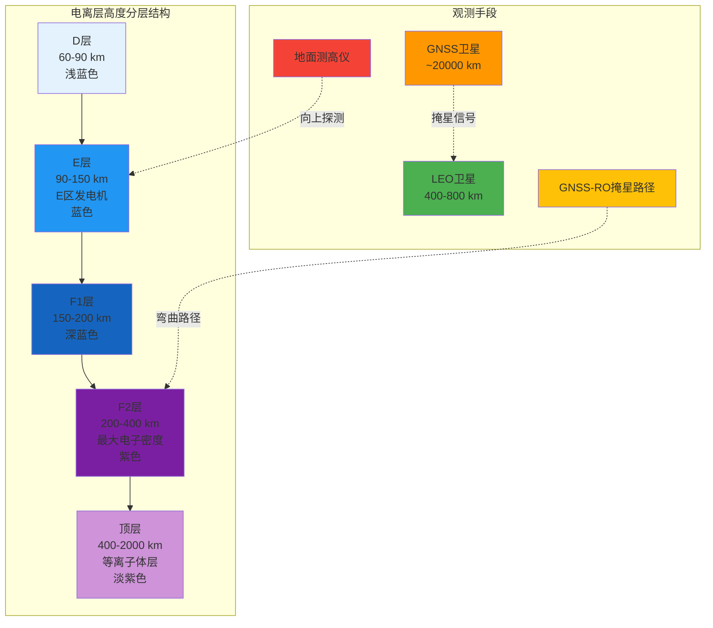
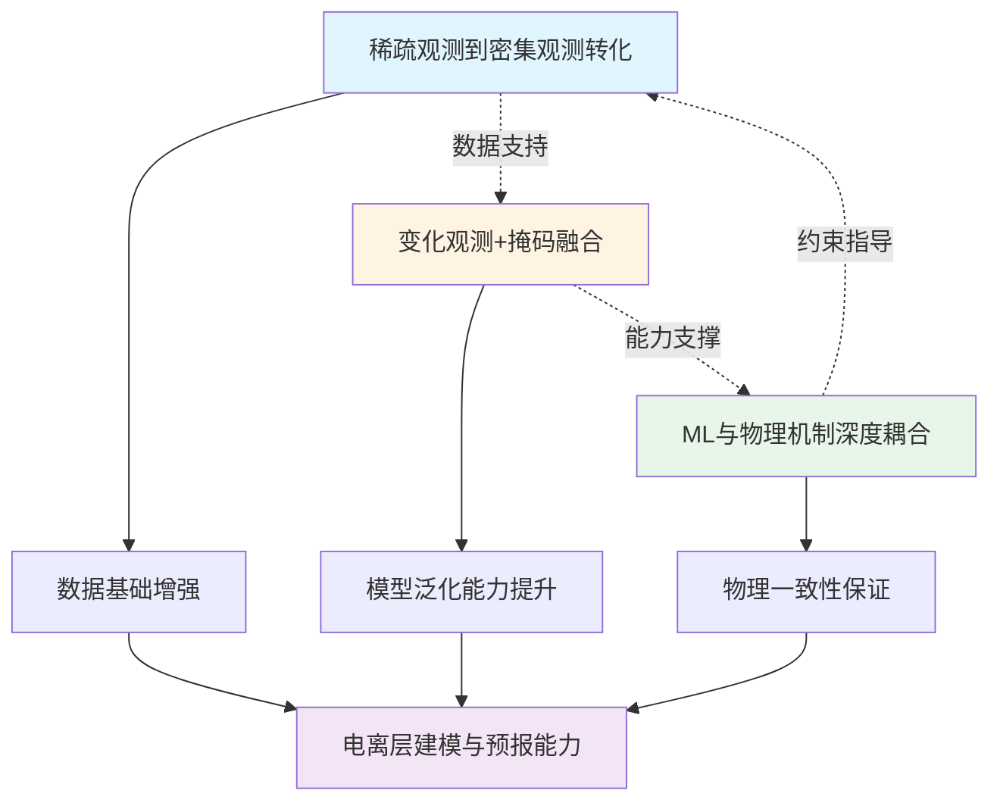
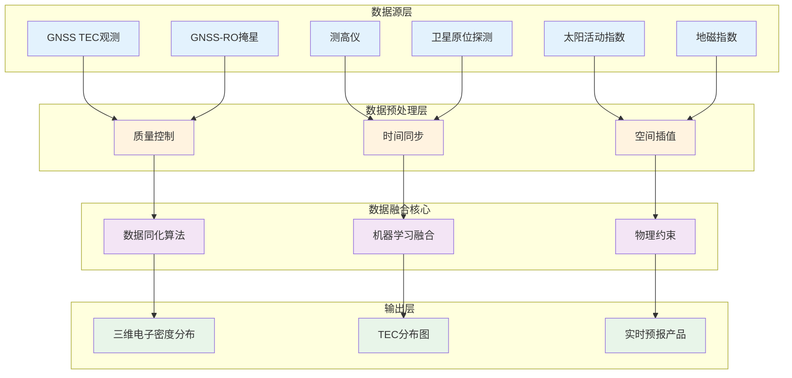
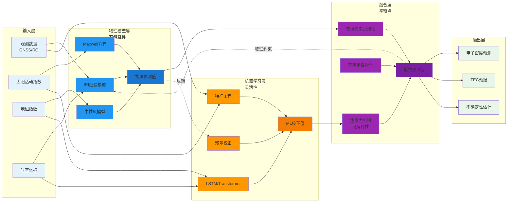
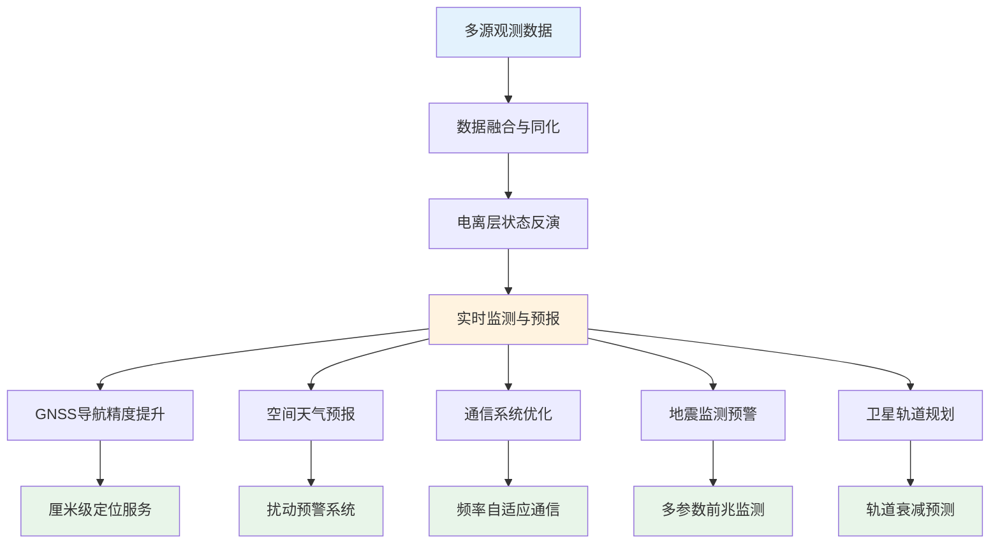

电离层，位于地球大气层60至2000公里高度范围内，作为太阳辐射与地球大气相互作用的产物，其电子密度分布直接影响无线电波传播、卫星导航精度与空间通信质量。这一薄薄的电离层，如同地球与外层空间的边界，承载着太阳活动与地球环境的复杂耦合，也承载着人类对空间天气认知与预测的期望。

随着全球导航卫星系统（GNSS）技术的普及、低轨卫星星座的部署以及机器学习方法的引入，电离层研究正从传统的经验模型向物理-数据混合模型转变，从静态描述向动态预报演进，从单一观测向多源融合跨越。这一转变不仅体现在理论模型的精细化与预测能力的提升，更反映在观测手段的多样化与实时监测系统的建立。从国际参考电离层模型（IRI）的持续更新，到基于神经网络的顶层电离层模型（NET）的提出，再到GNSS掩星技术的广泛应用，电离层研究正在经历一场深刻的技术革命。

然而，这场革命的意义远不止于技术进步。它折射出科学认知从经验归纳到理论演绎，再到数据驱动的范式演进；它体现了人类试图理解并预测复杂系统行为的努力；它也揭示了在物理约束与数据驱动之间寻找平衡点的哲学思辨。正如我们一直试图使用几何将世间繁复的信息抽象与压缩，然后复现整个宇宙并期待创造新的宇宙，电离层研究的发展，也是这一宏大叙事的一部分。

## 技术发展现状

电离层研究的技术发展可概括为观测手段的多样化、建模方法的智能化与应用场景的多元化。下表总结了当前主要技术方向的发展状态：

| 技术方向 | 传统方法 | 当前主流 | 新兴趋势 | 技术成熟度 |
|---------|---------|---------|---------|-----------|
| **观测手段** | 测高仪、GNSS TEC | GNSS-RO、多源融合 | PRO、LEO星座 | ✅ 成熟 |
| **建模方法** | IRI经验模型 | 物理-经验混合 | ML校正模型、NET | 🔄 发展中 |
| **预报能力** | 数小时至数天 | 实时-近实时 | 高分辨率时空预报 | 🔄 发展中 |
| **数据融合** | 单一数据源 | 多源数据同化 | 深度学习融合 | 🔄 发展中 |
| **应用场景** | 导航误差校正 | 空间天气预报 | 智能预警系统 | ✅ 成熟 |

### 观测技术的跨越式发展

传统电离层观测主要依赖地基测高仪与GNSS总电子含量（TEC）观测，空间分辨率有限，难以捕捉电离层的三维精细结构。近年来，GNSS掩星（RO）技术的广泛应用为电离层监测提供了全球覆盖、高垂直分辨率的观测数据。特别是极化掩星（PRO）技术的发展，不仅能够反演热力学参数，还能探测降水信息，为电离层-大气耦合研究提供了新的观测窗口。

低轨卫星星座的部署进一步增强了观测能力。Spire公司的纳星星座每日可提供约2000次掩星事件，PAZ卫星公开了完整的PRO数据集，这些数据为电离层建模与预报提供了前所未有的数据基础。

### 建模方法的范式转变

国际参考电离层模型（IRI）作为标准经验模型，在多数环境下仍存在局限，特别是在半球差异、高层低层覆盖、暴扰条件下表现欠佳。基于神经网络构建的新模型NET在顶层电离层（150-200公里以上）建模方面显示出显著优于IRI的能力，偏差降至仅数千电子每立方厘米，季节、纬度、本地时间的偏差大幅减少。

机器学习在电离层建模中的应用正从传统MLP向LSTM、ConvLSTM、Transformer等深度学习架构转变，尤其在时间序列预测方向。混合模型（物理模型加ML校正模型）越来越受关注，通过物理约束与数据驱动的结合，在保持物理可解释性的同时提升预测精度。

## 当前研究热点：低层大气耦合与极端事件监测

近期的研究热点反映了电离层研究的多学科交叉特征，从低层大气-电离层耦合到极端事件响应，从日常监测预报到扰动机制理解。

### 赤道电离异常与潮汐耦合

赤道电离异常（EIA）的X型结构同时出现在美洲和亚洲扇区的研究，揭示了电离层与低层大气潮汐的耦合机制。通过ICON卫星观测与全大气社区气候模型（WACCMX）的模拟，研究人员发现EIA-X交叉点与纬向中性风日潮振幅峰值重合，主要由E区发电机受这些纬向风调制产生的向下离子漂移驱动。这一发现强调了低层大气-电离层耦合在电离层建模中的重要性。

### 极端事件响应与监测

2022年10月9日的强伽马射线暴（GRB221009A）对低层电离层的扰动研究，展示了极低频（ELF）遥感技术在电离层扰动监测中的应用潜力。通过分析ELF闪电脉冲传播速度的降低，研究人员发现GRB在50至90公里高度范围内均匀增加了日间电子密度，这与太阳耀斑显著增加电子密度垂直梯度的特征存在明显差异。这一研究不仅验证了ELF传播速度作为识别电离层扰动高度范围的技术手段，也为空间天气事件的监测提供了新的观测窗口。

## 关键技术突破：三个核心方向的相互促进

多源数据融合是提升电离层建模精度的关键途径。通过融合GNSS TEC、GNSS-RO、测高仪、卫星原位探测等多种观测数据，可以构建更精确的电离层三维电子密度分布。

数据同化技术的发展使得实时更新电离层状态成为可能。通过将观测数据与物理模型结合，数据同化系统能够不断吸收与原系统完全独立的成分，实现信息完备性的提升。这对于实时或近实时应用至关重要。

电离层研究的未来发展将围绕三个核心方向展开，这三个方向相互促进、相互支撑，共同推动电离层建模与预报能力的跨越式提升。

### 从稀疏观测到密集观测的转化

传统电离层观测存在明显的空间和时间稀疏性，特别是在海洋、夜间、极区、高纬低纬边界等区域。随着低轨卫星星座的部署和观测技术的进步，稀疏观测正在向密集观测转化。

**技术路径**：

- 低轨卫星星座部署：Spire、Planet等公司的纳星星座每日可提供数千次掩星事件，大幅提升全球覆盖密度
- 多源数据融合：通过融合GNSS TEC、GNSS-RO、测高仪、卫星原位探测等多种观测数据，弥补单一数据源的不足
- 智能插值与外推：利用机器学习方法，基于稀疏观测数据推断密集网格的电离层状态，实现从稀疏到密集的转化

### 变化观测结合掩码形式的机器学习融合

电离层状态的变化信息往往比绝对状态值更具物理意义。通过引入掩码机制，可以更好地处理观测数据的不完整性和时空分布不均问题。

**技术路径**：

- 变化观测建模：关注电离层参数的相对变化而非绝对值，如TEC变化率、电子密度梯度等，这些变化量对物理过程更敏感
- 掩码机制设计：利用掩码标记观测缺失区域，引导模型学习在稀疏数据条件下的外推能力
- 时空掩码融合：结合时间掩码（缺失时段）和空间掩码（缺失区域），构建能够处理不完整观测数据的融合框架

### 机器学习与物理机制的深度耦合

纯数据驱动模型虽能捕捉复杂非线性关系，但可能脱离物理可解释性；纯物理模型在非典型条件下也有欠缺。深度耦合物理机制与机器学习，是未来研究的重要方向。

**技术路径**：

- 物理先验约束：将Maxwell方程、等离子体物理规律作为神经网络的正则化项，确保模型输出符合物理定律
- 可解释性增强：通过注意力机制识别关键物理过程，如E区发电机效应、中性风调制、重力波传播等
- 混合架构设计：物理模型作为基础层，ML模型作为残差校正层，形成层次化建模框架，在保持物理一致性的同时提升预测精度

## 应用场景与应用形式

电离层研究的价值不仅体现在理论认知的深化，更体现在实际应用的广泛性。从GNSS导航到空间天气预报，从通信系统优化到地震监测预警，电离层研究成果正在多个领域发挥越来越重要的作用。

### GNSS导航与定位精度提升

电离层延迟是GNSS导航误差的主要来源之一，特别是在低纬度地区和地磁扰动期间。通过实时电离层TEC监测与预报，可以显著提升GNSS定位精度。高分辨率TEC预报（如2.5度乘5度每小时）为精密单点定位（PPP）和实时动态定位（RTK）提供了重要支撑。

**应用形式**：

- 实时TEC校正服务：通过GNSS网络实时计算并发布电离层延迟校正参数，为导航用户提供厘米级定位精度
- 高精度定位增强：为自动驾驶、精密农业、无人机导航等应用提供高精度定位服务，满足厘米级甚至毫米级定位需求
- 多频GNSS优化：利用多频观测消除电离层一阶项，结合模型校正高阶项，进一步提升定位精度

### 空间天气预报与灾害预警

电离层扰动是空间天气的重要组成部分，直接影响卫星通信、导航系统与电力网络。建立完善的电离层监测与预报系统，有助于提前预警空间天气事件，保障空间资产与地面基础设施的安全运行。正如封闭系统未来的可预知性在于突破技巧与全信息的认识，空间天气预报的准确性也依赖于观测信息的完备性与模型技巧的提升。

**应用形式**：

- 实时空间天气监测平台：整合多源观测数据，提供全球电离层状态实时监测，为空间天气预警提供数据基础
- 扰动预警系统：基于地磁指数、太阳活动指数与历史数据，提前数小时至数天预警电离层扰动，为卫星任务规划与地面基础设施防护提供决策支持
- 极端事件响应：针对地磁暴、太阳耀斑等极端事件，提供专项预报与影响评估，帮助相关部门及时采取应对措施

### 无线通信系统优化

电离层对高频无线电波的传播具有重要影响，特别是在短波通信与天波超视距雷达应用中。通过实时监测电离层状态，可以优化通信频率选择与信号路径，提高通信质量与可靠性。这种优化不仅依赖于对电离层状态的准确认知，更依赖于对信号传播物理过程的深入理解。

**应用形式**：

- 频率自适应系统：根据实时电离层状态自动调整通信频率，避免信号衰减与多径干扰，提升通信链路稳定性
- 路径优化算法：基于电离层电子密度分布，优化信号传播路径，为短波通信与天波超视距雷达提供最佳传播条件
- 通信效能评估：为天波超视距雷达与甚低频远程通信提供电离层传播条件评估，指导通信系统设计与运行

### 地震监测与预警辅助

研究表明，地震震级五级以上的地震发生前，震中上空的电离层常出现电子密度的异常变化。虽然该领域仍存在争议，但电离层异常作为地震前兆的研究正逐步深入。这种跨圈层的关联，揭示了地球系统各组成部分之间的复杂耦合关系，也为地震预警提供了新的观测窗口。

**应用形式**：

- 多参数地震前兆监测：结合电离层异常、地磁场变化、大气扰动等多参数，构建综合地震前兆监测系统，提升地震预警能力
- 区域异常检测算法：通过机器学习方法识别电离层异常模式，区分地震前兆与其他扰动源，提高预警准确性
- 综合预警系统：将电离层监测纳入地震立体观测体系，为地震灾害防范提供新的技术手段，如中国"张衡一号"电磁监测试验卫星的应用

### 卫星轨道规划与信号传播分析预警

电离层及热层大气密度的实时监测与预报对于卫星轨道规划以及星上信号传播（到地面或星间）的分析、预测、预警具有关键作用。通过实时监测电离层和热层状态，可以预测大气阻力对卫星轨道的影响，分析信号传播路径上的电离层延迟与衰减，为卫星任务规划与运行提供决策支持。

**应用形式**：

- 轨道衰减预测：基于电离层和热层大气密度实时监测与预报，预测低轨卫星的大气阻力影响，评估轨道衰减速率，为轨道维持和任务规划提供决策依据
- 信号传播路径分析：分析卫星到地面或星间信号传播路径上的电离层电子密度分布，预测信号延迟、衰减、多径效应等，为通信链路设计提供支撑
- 实时预警系统：建立电离层和热层扰动实时预警系统，当预测到可能影响卫星轨道或信号传播的极端事件时，提前发出预警，指导卫星任务调整和应急响应
- 决策支持平台：整合电离层、热层监测数据与预报模型，构建卫星任务规划决策支持平台，为不同轨道高度、倾角、任务类型的卫星提供定制化的环境分析与预警服务

## 未来发展趋势与挑战

### 三个核心方向的协同发展

上述三个核心方向——从稀疏观测到密集观测的转化、变化观测结合掩码形式的机器学习融合、机器学习与物理机制的深度耦合——并非孤立发展，而是相互促进、相互支撑。稀疏观测到密集观测的转化为机器学习提供了更丰富的数据基础；变化观测与掩码机制提升了模型在数据稀疏条件下的泛化能力；物理机制的深度耦合则确保了模型的可解释性与物理一致性。这三个方向的协同发展，将共同推动电离层建模与预报能力的跨越式提升。

**技术挑战**：

- 数据稀疏性与覆盖不平衡：海洋、夜间、极区、高纬低纬边界等区域观测数据有限，需要从稀疏观测到密集观测的转化技术
- 计算复杂度：高分辨率模型的计算量呈指数增长，需要并行化与GPU加速，同时结合掩码机制优化计算效率
- 模型泛化能力：高分辨率模型在数据稀疏区域的泛化能力仍需提升，变化观测与掩码机制的结合为解决这一问题提供了路径
- 物理一致性保证：在提升模型预测精度的同时，确保模型输出符合物理定律，需要物理机制与机器学习的深度耦合

### 多尺度耦合与时空建模

电离层变化受日周期、季节、太阳活动、地磁扰动影响，同时还受下层大气、地形影响。捕捉这些多尺度变化（小时级、日级、月年级）并在模型中体现，对于精细应用（如高分辨率GNSS掩星反演）至关重要。

**技术路径**：
- 多尺度特征提取：利用小波变换、经验模态分解等方法分离不同时间尺度的信号
- 时空耦合建模：ConvLSTM、Transformer等架构同时捕捉空间相关性与时间依赖性
- 耦合机制建模：将低层大气重力波、地形扰动、海洋陆地差异等因子纳入特征空间

### 实时系统与计算效率优化

对于GNSS导航、实时监控或军事预警等应用，模型不仅要准确，还要具备快速响应能力。大规模ML模型、高分辨率物理模型在运算资源、延迟、模型更新频率方面都面临挑战。

**优化方案**：
- 模型压缩：知识蒸馏、量化、剪枝等技术减少模型参数量
- 并行计算：GPU加速、分布式训练与推理
- 增量学习：在线学习机制，无需重新训练即可适应新数据

## 近三年关键文献综述

下表总结了2023-2025年电离层研究领域的关键文献，涵盖建模方法、观测技术、应用场景等多个维度：

| 年份/文献 | 研究主题 | 关键贡献 | 技术方法 | 应用价值 |
|---------|---------|---------|---------|---------|
| **2025-11** -- He et al. (GRL) | 赤道电离异常X型结构 | **低层大气耦合**：EIA-X与纬向中性风日潮振幅峰值重合，E区发电机驱动机制 | ICON卫星观测 + WACCMX模型模拟，数据同化 | 揭示低层大气-电离层耦合机制，提升建模精度 |
| **2025-11** -- Gołkowski et al. (GRL) | 伽马射线暴对电离层扰动 | **ELF遥感技术**：GRB在50-90公里均匀增加电子密度，与太阳耀斑特征差异显著 | ELF闪电脉冲传播速度分析，数值模拟 | 验证ELF技术识别扰动高度范围，为空间天气监测提供新手段 |
| **2024** -- Padullés et al. (ESSD) | 极化掩星数据集 | **PRO观测能力**：PAZ卫星公开完整PRO数据集，滑动窗口标准差检测 | 预处理、H/V差分相位、滑窗噪声检测 | 为电离层-降水耦合研究提供数据基础 |
| **2023** -- NET模型 (Nature) | 顶层电离层建模 | **神经网络优势**：150-200公里以上偏差降至数千电子每立方厘米 | 深度神经网络，多源数据融合 | 显著优于IRI模型，为高精度建模提供新范式 |

## 哲学思辨：从数据到知识的跨越

电离层研究的发展轨迹，折射出科学认知从经验归纳到理论演绎，再到数据驱动的范式演进。传统经验模型如IRI，基于大量观测数据的统计归纳，试图用有限的参数描述复杂的物理过程。这种方法的局限性在于，它假设了某种"平均态"的存在，而电离层的本质却是动态的、非线性的、多尺度的。

物理模型试图从第一性原理出发，通过求解Maxwell方程、等离子体动力学方程来预测电离层行为。然而，正如计算流体力学面临的困境，完全从底层复现上层物理过程，不仅需要底层信息的全面性，还需要磅礴的算力与超高的精度。电离层作为太阳-地球耦合系统的产物，其变化受太阳活动、地磁场、低层大气、地形等多重因素影响，这种复杂性使得纯物理建模面临巨大挑战。

机器学习方法的引入，为这一困境提供了新的解决路径。数据驱动的模型能够捕捉复杂的非线性关系，在特定条件下展现出超越传统模型的预测能力。然而有效的人工，才有智能。"纯数据驱动模型虽然能够拟合历史数据，但在面对极端事件、数据稀疏区域时，其泛化能力仍显不足。混合模型的出现，体现了科学认知的螺旋式上升。它不是简单的物理模型与数据模型的叠加，而是试图在物理约束与数据驱动之间找到平衡点。物理模型提供可解释性、物理一致性，数据模型提供灵活性、适应性。

对于电离层研究而言，这种混合建模不仅是一种技术手段，更是一种认识论的选择。它承认了我们对电离层物理过程理解的局限性，同时也承认了数据中蕴含的丰富信息。通过物理约束与数据驱动的结合，我们既保持了科学理论的可解释性，又获得了对复杂系统的预测能力。

然而，这种混合模型也面临着新的挑战。如何确定物理约束的强度？如何在保持物理一致性的同时允许足够的灵活性？如何评估模型的不确定性？这些问题不仅涉及技术实现，更涉及我们对"科学"本质的理解。正如对于宇宙规律，我们期待简单但是不希望死寂；对于真实存在，也远不是欧几里德公设可以完全描述。

## 结论与展望

电离层研究正经历从经验模型到物理-数据混合模型的范式转变，从静态描述到动态预报的认知跨越，从单一观测到多源融合的技术革命。这一转变不仅体现在理论模型的精细化与预测能力的提升，更反映在观测手段的多样化与实时监测系统的建立。

**技术层面**，未来研究将朝着更高时空分辨率、更强物理约束、更优计算效率的方向发展。从当前的2.5度乘5度每小时，向1度乘1度每30分钟甚至更高分辨率迈进；从简单的数据拟合，向物理约束的智能模型转变；从离线批处理，向实时在线学习演进。

**应用层面**，电离层研究成果将在GNSS导航、空间天气预报、通信系统优化、地震监测预警、卫星任务规划等领域发挥越来越重要的作用。通过实时监测与预报，可以显著提升导航定位精度，提前预警空间天气事件，优化通信频率选择，为地震灾害防范提供新的技术手段。

**认知层面**，电离层研究的发展轨迹，反映了科学认知从经验归纳到理论演绎，再到数据驱动的范式演进。混合模型的出现，体现了在物理约束与数据驱动之间寻找平衡点的努力。这种努力不仅是一种技术手段，更是一种认识论的选择，它承认了我们对复杂系统理解的局限性，同时也承认了数据中蕴含的丰富信息。

正如我们一直试图使用几何将世间繁复的信息抽象与压缩，然后复现整个宇宙并期待创造新的宇宙，电离层研究的发展，也是人类试图理解并预测复杂系统行为的一次尝试。这一尝试不仅关乎技术进步，更关乎我们对宇宙规律与真实存在的理解。在数据驱动与物理约束的融合中，在经验归纳与理论演绎的结合中，我们或许能够更接近那个既简单又不死寂的宇宙真相。

---

**作者**：Mapoet  
**原文链接**：[https://gnss-x.ac.cn/posts/2025/11/ionosphere-research-trends](https://gnss-x.ac.cn/posts/2025/11/ionosphere-research-trends)  
**版权声明**：Copyright @ 2025 GNSS-X. All Rights Reserved. Mapoet 版权所有.