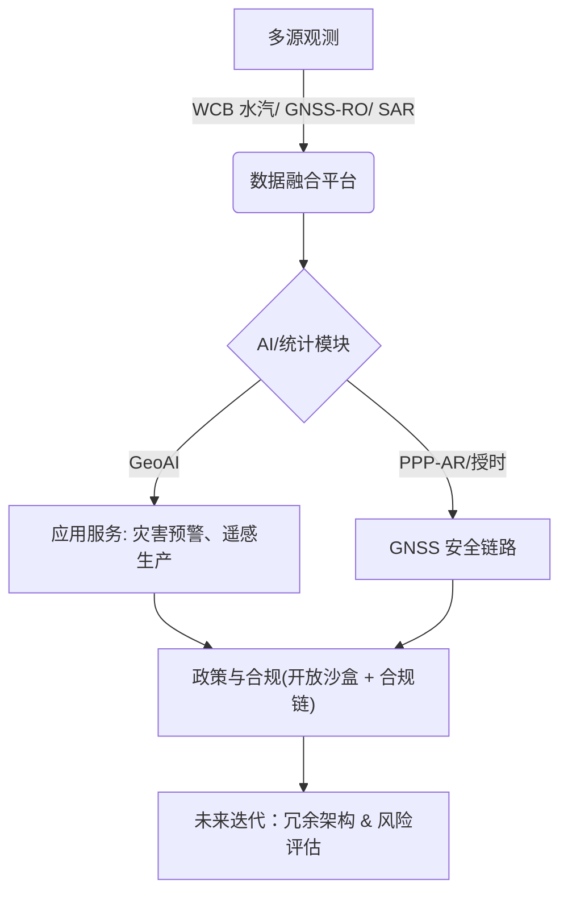

随着 17 年轨道资料的积累、CMIP6-HighResMIP 对极端事件的刻画能力增强，以及遥感影像处理进入扩散模型时代，地学研究正从“被动诊断”转向“智能驱动决策”。本期基于 Nature、Science、Journal of Geophysical Research: Atmospheres、Journal of Climate、Remote Sensing、International Journal of Digital Earth 等期刊 798 篇论文，并参考地理信息智能化与遥感自动化的权威解读（ebiotrade，2025；csgpc，2025），梳理气候系统科学、智能遥感、水生态监测与地学 AI 工程的最新突破，并提出未来一季的技术观察要点。

| 研究链路 | 主导数据 | 关键 AI 与模型 | 能力跃迁 |
| --- | --- | --- | --- |
| 热带对流层顶动力学（[Fagan & Homeyer, 2025](https://doi.org/10.1029/2025jd044717)） | Aura MLS 17 年廓线 + TC 轨迹 | 统计-动力联合诊断 | 将 TC 对 UTLS 组成的影响量化到 100 km 尺度 |
| 近暴雨风险模拟（[Chen *et al.*, 2025](https://doi.org/10.1029/2025jd044655)） | CMIP6 HighResMIP | 高分辨率全球模式 + 极值统计 | 揭示 SSP5-8.5 下近风暴降水波动性陡增 |
| 全球火险投影（[Gallo *et al.*, 2025](https://doi.org/10.1175/jcli-d-24-0540.1)) | 26 个 CMIP6 ESM | 统计加权多模式集成 | 将 FWI 偏差降低并锁定 68%–91% 火险区增幅 |
| 暖输送带水汽输送（[Guo & Miltenberger, 2025](https://doi.org/10.1175/jcli-d-25-0020.1)) | ERA5 轨迹 + WCB 检测 | 快速爬升气团统计 | 量化 DJF 中 13.8% 的 UTLS 水汽输送 |
| MJO 海表盐度同化（[Du *et al.*, 2025](https://doi.org/10.1175/jcli-d-24-0579.1)) | GEOS-S2S-2 预报 | SSS 同化 + OHC 初始化 | 提升跨海陆传播预测，减弱海温冷却偏差 |
| 深层土壤墒情（[Yin *et al.*, 2025](https://doi.org/10.3390/rs17223714)) | 1982–2020 卫星 LAI + SM 反演 | 气候-植被耦合诊断 | 揭示根区湿润转折与 LAI 主导反馈 |
| 全球水体浊度（[Chowdhury *et al.*, 2025](https://doi.org/10.3390/rs17223716)） | Sentinel-2 + GLORIA/MAGEST | 梯度提升回归 + SHAP | r = 0.95，支持近实时水质监测 |
| 云覆盖抑制（[Han *et al.*, 2025](https://doi.org/10.3390/rs17223721)） | Sentinel-1/2 多模态 | SAR 条件一致性扩散 | 40× 推理加速 + SOTA 云去除 |
| GeoAI–UAV 解译（[Li *et al.*, 2025](https://doi.org/10.3390/rs17223704)） | 六个 UAV 数据集 | CLIP × DINOv2 对齐 + 文本约束 | 长尾类别、遮挡和视角漂移显著缓解 |
| Shapefile 自动治理（Lin *et al.*, 2025） | 多源矢量数据 | 多智能体 LLM 框架 | 端到端质检、修补与语义增强 |
| 极地/行星过程（[Leger *et al.*, 2025](https://doi.org/10.5194/tc-19-5719-2025)；[Smirnova *et al.*, 2025](https://doi.org/10.1029/2025gl116804)) | Parallel Ice Sheet Model + Juno 掩星 | 集合建模 + 多源交叉校准 | 还原格陵兰 24 ka 演化，延伸木星热结构剖面 |
| 海冰-气旋耦合（[Liang *et al.*, 2025](https://doi.org/10.1175/jcli-d-24-0765.1)) | MOSAiC 观测 + ERA5 | 热/动力分解 | 动力变形贡献 0.05–28.54 cm·day⁻¹ 厚度变化 |
| 陆面 RCE 理论（[Tang & McColl, 2025](https://doi.org/10.1175/jcli-d-24-0438.1)) | 理论 + 云分辨模拟 | 灰气体解析模型 | 揭示干地表 8% K⁻¹ 的降水敏感度与 PET 主控因子 |
| 分布式授时链（[Wang *et al.*, 2025](https://doi.org/10.3390/rs17223715)；[Widczisk *et al.*, 2025](https://doi.org/10.1007/s10291-025-01986-7)) | UWB 场景 + 全球 H-maser | DSTS + 时频稳定度基准 | NLOS ToF 方差降 51.6%，提供子纳秒授时和钟稳评估 |
| 抗欺骗 + 精密定位（[Zarrinnegar *et al.*, 2025](https://doi.org/10.1007/s10291-025-01985-8)；[Brack & He, 2025](https://doi.org/10.1007/s10291-025-01991-w)；[Forero *et al.*, 2025](https://doi.org/10.3390/rs17223691)) | 嵌入式 ML + 多频 PPP + SDR 编队 | 轻量反欺骗 + 不等式约束 + 条件数分析 | 构建“检测–校验–协同”链，TTFF 降 17.5%，编队定位米级 |
| GNSS 地球系统反演（[Li *et al.*, 2025](https://doi.org/10.1007/s10291-025-01987-6)；[Almowafy *et al.*, 2025](https://doi.org/10.5194/amt-18-6393-2025)；[Bogusz *et al.*, 2025](https://doi.org/10.1007/s00190-025-02009-6)；[Kobayashi *et al.*, 2025](https://doi.org/10.1007/s10291-025-01981-y)) | ROTI 监测 + GNSS-RO + GNSS 站网 + GNSS-IR | 组合分析 + 垂向平滑 + 参考框架优化 + Fresnel 反演 | 统一 TEC 诊断、延续 QBO 重力波记录、降低别名并实现低成本土壤含水率反演 |

## 一、气候系统再分析：极端事件的多尺度机制

### 1.1 热带气旋对 UTLS 组成的扰动

**多源对流层顶诊断**　根据 17 年 Aura MLS 观测与热带气旋轨迹匹配（[Fagan & Homeyer, 2025](https://doi.org/10.1029/2025jd044717)），热带气旋造成的上对流层臭氧亏损和水汽增湿，对辐射强迫敏感层的能量收支影响可达 10% 量级。研究指出：

- **垂直层结敏感度**　必须按流域和可变对流层顶高度校正背景态，才能稳定评估水汽与臭氧异常。
- **环境剪切调制**　在低剪切背景下，水汽上输更剧烈，提示对暖海区快速爆发风暴需强化 UTLS 水汽监测。

### 1.2 近风暴降水波动性攀升

利用 25 km 分辨率的 CMIP6 HighResMIP 集成（[Chen *et al.*, 2025](https://doi.org/10.1029/2025jd044655)），团队发现 SSP5-8.5 情景下近风暴降水的标准差增幅与平均值同步增长。对沿海城市的含义：

- **灾情准备窗口缩短**　降水突增/突减节奏加快，传统以累积总量为主的应急触发阈值将失效。
- **内涝-山洪复合风险**　高频降水振荡叠加城市硬化面，会提升小流域响应的不确定性。

### 1.3 东亚冬季温度年代际跃迁

基于 1880 以来的再分析资料（[Ge *et al.*, 2025](https://doi.org/10.1175/jcli-d-25-0043.1)），研究揭示 AMO 位相通过调制东亚槽西部的背景风场，驱动冬季温度年际方差的增强或抑制。对能源调度的启示：

- **跨洋遥相关信号**　AMO 正位相将加强寒潮频率，应纳入季节性负荷预测。
- **瞬变涡动能反馈**　提示数值模式需显式约束中纬度能量转换过程，避免暖冬预测偏差。

### 1.4 全球火天气的权重集成投影

Journal of Climate 刊发的 26 模型权重集成（[Gallo *et al.*, 2025](https://doi.org/10.1175/jcli-d-24-0540.1)）将 FWI 偏差与模型相依性纳入同一统计框架，带来两点关键影响：

- **模型不确定度压缩**　与传统算术平均相比，加权方案在 1980–2014 回溯检验中显著降低区域火险偏差，证明在森林资源规划中可量化“可信等级”。
- **空间响应更精细**　在 SSP 情景下，全球 68%–91% 的火险区将在本世纪末经历 FWI 的显著上升，且 2040 年前已有逾半区域出现统计显著增强，适合提前布局高风险带的防火隔离带与人力储备。

### 1.5 深层土壤墒情与植被反馈

Nature Climate Change 对人为增强深层干旱的归因（[Guan *et al.*, 2025](https://doi.org/10.1038/s41558-025-02458-z)）与 Remote Sensing 的卫星 LAI-土壤湿度分析（[Yin *et al.*, 2025](https://doi.org/10.3390/rs17223714)）相互呼应，强调：

- **根区湿润“拐点”**　多源观测显示 2000 年后根区与表层湿度从干化转为湿润，植被增绿贡献度在冬春季超过单一气象因子。
- **气候驱动季节性差异**　夏秋季由太阳辐射控制的蒸散更易导致表层干化，说明干旱预警需按季节切换主控指标。
- **政策启示**　当 LAI 与土壤墒情存在正反馈时，退化植被恢复项目应匹配辐射压力较小的季节窗口，以降低灌溉需求。

### 1.6 暖输送带对 UTLS 水汽的定量贡献

利用 ERA5 轨迹统计（[Guo & Miltenberger, 2025](https://doi.org/10.1175/jcli-d-25-0020.1)），首次将快速爬升暖输送带对北半球 UTLS 水汽的贡献量化为 DJF 季节总输送的 13.8%，关键发现包括：

- **凝结水异常持续 6 小时**　暖输送带结束后，上对流层的正水汽异常可维持至 6 小时，要求模式显式解析快速爬升事件。
- **10 小时爬升阈值**　上升时间短于 10 小时的气团贡献最大，提示深对流与急流入口的耦合是关键。
- **模式评估基准**　该统计可作为大气化学传输与再分析比对的量化基准，缩小 UTLS 光学厚度预报不确定性。

### 1.7 海表盐度同化突破 MJO “海陆障碍”

NASA GEOS-S2S-2 的八个代表性事件实验（[Du *et al.*, 2025](https://doi.org/10.1175/jcli-d-24-0579.1)）显示，同化海表盐度（SSS）后：

- **更深混合层**　初始化产生更深的混合层（MLD）与更高的上层海洋热含量（OHC），降低 MJO 对流引发的表面冷却。
- **潜热通量增强**　更高的 SST 与风场收敛共同提升潜热通量异常，支撑 MJO 在海陆过渡区的东移。
- **预报技巧提升**　大尺度降水追踪结果表明 SSS 方案在海陆过境阶段的位相误差显著减小，为跨季节业务化提供新路径。

### 1.8 AMV 与外强迫共塑东亚夏季降水

多套强迫-控温混合试验（[Si *et al.*, 2025](https://doi.org/10.1175/jcli-d-24-0695.1)）证明：

- **负 AMV 触发 1960s 转折**　北大西洋冷却通过罗斯贝与开尔文波双路径削弱东亚夏季风，引发 60 年代的南涝北旱。
- **外强迫驱动河谷干化**　自 1960s 起的黄淮干化与正 AMV 的 1990s 北抬共同塑造最新的雨带分布。
- **长记忆预估**　区分海温内部变率与外强迫，有助于制定十年尺度的水资源配置策略。

### 1.9 高分辨率 CMIP6 对高山降水的改进

对六对高低分辨率模型的比较（[Li *et al.*, 2025](https://doi.org/10.1175/jcli-d-25-0099.1)）显示：

- **南部湿偏减少 65%**　高分辨率模拟在南缘喜马拉雅显著减小湿偏，改善 1951–2014 的干湿分布。
- **远程强迫机制**　改进源于对印度洋中部暖 SST 模式的更好刻画，诱发孟加拉湾上空的反气旋并输送干空气。
- **山地水资源管理**　提示在高山地形区，提升外海强迫模拟比改善局地地形参数更关键。

### 1.10 陆面辐射-对流平衡的理论更新

理想化陆面 RCE 模型（[Tang & McColl, 2025](https://doi.org/10.1175/jcli-d-24-0438.1)）给出：

- **干地表高敏感度**　固定干土条件下的降水率随升温按 Clausius–Clapeyron 近 8% K⁻¹ 增长，远高于海洋背景。
- **PET 受净辐射控制**　潜在蒸散主要随地表净辐射而非气温变化，意味着全球平均干旱度不会爆炸式提升。
- **管理启示**　灌溉或地下水支撑的区域可用该理论评估能量限制，从而调整节水策略。

## 二、遥感观测智能化：从水质到云去除

### 2.1 全球水体浊度的智能反演

Remote Sensing 期刊报道的梯度提升模型（[Chowdhury *et al.*, 2025](https://doi.org/10.3390/rs17223716)）通过 GLORIA 与 MAGEST 两个全球开放数据库统一特征空间，覆盖 17 国 83 个水体类型。其贡献：

- **跨水体泛化**　Rrs865/Rrs560 成为主判别指标，精度在河口与高浑浊湖泊中仍保持 1.32 FNU 偏差。
- **自动化管线**　结合科学云平台部署，实现近实时预警，适配风暴后泥沙暴增场景。

### 2.2 SAR 条件云去除迈入扩散时代

CM-CR 模型（[Han *et al.*, 2025](https://doi.org/10.3390/rs17223721)）以 SAR 条件得分网络为教师，经一致性蒸馏得到单步学生模型，并以多步重采样细化纹理：

- **精度与速度兼得**　对 SEN12MS-CR 基准取得 SOTA，同时推理提速 40×，足以支持编队卫星级别的批处理。
- **可解释性提升**　借助 SAR-Optical 互补，模型可在厚云区恢复道路和农田纹理，利于地表过程模拟。

### 2.3 大气校正与高光谱推理的工程优化

Accelerated Optimal Estimation（[Susiluoto *et al.*, 2025](https://doi.org/10.3390/rs17223719)）将贝叶斯最优估计加速两个数量级，并验证高光谱反演的高斯不确定性假设仍成立。这意味着：

- **星载即席处理可行**　AVIRIS-NG 场景验证显示，AOE 可在资源受限的机载/星载端执行。
- **误差传播透明**　结合 MCMC 对比，可为反演产品提供更可信的置信区间。

## 三、GeoAI 工程化：大模型落地与矢量数据治理

### 3.1 UAV 场景的开放词汇解译

HOSU 框架（[Li *et al.*, 2025](https://doi.org/10.3390/rs17223704)）通过 DINOv2 的几何感知能力引导 CLIP，配合文本多层约束与遮挡鲁棒策略，使无人机影像的长尾类得以解译：

- **跨数据集一致性**　六个 UAV 数据集的实验证明分布感知微调可显著降低语义漂移。
- **遮挡感知推理**　Mask-based 一致性训练改进视角突然变化下的小目标召回。

### 3.2 ShapefileGPT 推动矢量数据链自动化

来自 International Journal of Digital Earth 的 ShapefileGPT（Lin *et al.*, 2025）构建多智能体 LLM 协同体系，完成投影一致性检查、拓扑修复与语义增强。结合 ebiotrade 对“智能地理学”框架的阐述，该成果意味着：

- **数据上游治理前置**　实现从矢量采集到知识图谱映射的闭环，降低人工修复成本。
- **可扩展工作流**　借助 Agent 化调度，可在地学数据生产线上集成自动 QA/QC。

### 3.3 安全与治理并行

Nature 对 AI 安全的专访强调，恶意使用已出现（Castelvecchi & Thompson, 2025），csgpc 则提示 GeoAI 面临标注稀缺与可解释性缺口。结合本周论文，可归纳三条工程要务：

- **模型内审**　对 SAR-Optical 融合与 UAV OVSS 模型开展输入敏感度与对抗测试，防止应用于关键基础设施时被篡改。
- **技能闭环**　引入多模态 Agent 体系，让知识引擎与感知模型共享一致的审计日志。
- **法规适配**　对 CCUS 监测（[Karoff *et al.*, 2025](https://doi.org/10.3390/rs17223707)）等高合规领域，优先落地浓度基监测与多平台数据融合。

## 四、极地与行星过程再认识

### 4.1 格陵兰 2.4 万年演化的拼图

The Cryosphere 最新 5 km 分辨率集合（[Leger *et al.*, 2025](https://doi.org/10.5194/tc-19-5719-2025)）借助 PaleoGrIS 1.0 边界条件与 Parallel Ice Sheet Model，从 24 ka 模拟到 1850 年，获得：

- **海洋驱动的快速退缩**　16–14 ka 期间，海洋增暖触发大陆架冰盖快速消融，质量损失速率可达现代的七倍，为改进海洋-冰盖耦合提供定量约束。
- **区域异质性评估**　集合评分揭示北部与中东部仍存在系统性偏差，可作为下一代再分析调参的重点。
- **未来初始化价值**　数据一致的古气候演化有助于减少投影初值误差，特别是在 ISMIP6 等多模式框架中。

### 4.2 木星大气的电台掩星复苏

Juno 扩展任务首次在 Voyager 时代后提供高分辨率电台掩星（[Smirnova *et al.*, 2025](https://doi.org/10.1029/2025gl116804)），并与 Cassini/CIRS 及地基光谱资料互证：

- **纬向热结构反转**　赤道区呈现冷平流层与暖对流层的组合，对应北赤道带在数月尺度的热异常摆动。
- **多源一致性**　与 Voyager、Galileo 历史结果高度吻合，证明多任务交叉校准可支撑木星深大气的长期监测。
- **潜在借鉴**　电台掩星分析流程可迁移至地球再入任务与深空天气监测，强调频谱级噪声控制的重要性。

### 4.3 MOSAiC 观测揭示海冰-气旋耦合

借助 2019–2020 MOSAiC 漂流站的 39 个气旋事件（[Liang *et al.*, 2025](https://doi.org/10.1175/jcli-d-24-0765.1)），团队量化：

- **动力主导厚度变化**　风致变形贡献 0.05–28.54 cm·day⁻¹ 的厚度增减，显著高于 0.02–1.44 cm·day⁻¹ 的热传导项。
- **气旋期大气-冰差异**　气旋期的近地面温湿与冰面状态与非气旋期截然不同，为模式提供条件依赖参数。
- **再分析校准**　热/动力分解结果可用于校准再分析中的冰厚参数化，提升对极端风暴期间海冰损益的评估。

## 五、环境治理与空间安全

### 5.1 CCUS 设施的温室气体核证

Remote Sensing 的综述（[Karoff *et al.*, 2025](https://doi.org/10.3390/rs17223707)）指出，CCUS 场站监测亟需：

- **多平台协同**　将无人机、地基传感器与卫星浓度反演纳入统一数据同化框架，才能满足法规要求的检测阈值。
- **基于浓度的核证链**　相较单点通量观测，浓度驱动的反演更易与数据同化耦合，便于跨司法辖区的透明审计。
- **长期可信度**　评估不同技术的成本与时间跨度，为 CCUS 资产提供“监测即服务”的可行路线。

### 5.2 火山岩脉停滞的快速判据

Geophysical Research Letters 提出的反张型震源指标（[Bonaccorso *et al.*, 2025](https://doi.org/10.1029/2025gl116302)）在埃特纳火山四次侧向侵入案例中证明：

- **可操作指标**　当震源反演出现逆冲解，意味着岩脉接近停滞，可在前期就触发预警。
- **历史案例复现**　1989、2002、2008、2018 的岩脉停止时间均被该方法成功刻画，提升现场决策效率。

### 5.3 农业管理区的遥感分区

多年度 NDVI 组合（[Ramirez-Gonzalez *et al.*, 2025](https://doi.org/10.3390/rs17223709)）为土豆生产划分三类潜力管理区提供新范式：

- **跨年稳定性**　Sentinel-2 与 Landsat 8 的 230 景观测让管理区兼顾空间差异与时序波动。
- **产量与土壤指标映射**　NDVI 统计量与碳氮含量、块茎产量呈显著相关，验证了遥感指标在精细农业中的代理价值。
- **成本优势**　相较密集传感器布设，影像复用更适合大田企业快速部署。

## 六、空间物理与电磁实验

### 6.1 Whistler 波的实验室复现

Geophysical Research Letters 报道的磁镜实验（[Ma *et al.*, 2025](https://doi.org/10.1029/2025gl118392)）首次在可控环境中再现实地观测到的周期性 whistler 激发：

- **能量来源**　垂直传播微波在磁镜赤道处激发的各向异性电子提供自由能，与辐射带机制一致。
- **自调节周期**　粒子模拟揭示 whistler 散射会快速削弱各向异性，随后在持续能量注入下重建，形成周期性放电。
- **应用价值**　为辐射带建模提供可实测参数，也为空间天气任务提供地面验证手段。

## 七、GNSS 安全与地球系统观测

### 7.1 授时网络与分布式遥感节点

两个 Remote Sensing / GPS Solutions 研究共同描绘了“端到端授时链路”的演进方向：

- **分布式时间同步**　DSTS 架构把贝叶斯滤波与 DDPG 结合，NLOS 场景下可将 ToF 方差压缩 51.6%，路径状态预测准确率保持在 85%–95%。在多节点网络中，每个传感器端通过自适应权重放大全局稳定的钟源，使最终频率与相位同步精度达到 4×10⁻¹⁰ / 5×10⁻¹⁰ s，适合海事、油气或机场等 GNSS 退化区的遥感阵列（见[Wang *et al.*, 2025](https://doi.org/10.3390/rs17223715)）。
- **H-maser 网络评估**　对全球 80 座氢钟站及 GPS/Galileo/GLONASS 卫星钟进行 5 分与 30 秒采样回归，发现 60 座地面站日标准差 <75 ps，新一代卫星钟可在 2–8 小时窗口内保持 10 mm 级拟合误差。该方法可做授时服务的例行体检，与 DSTS 的节点加权策略形成标准化接口（见[Widczisk *et al.*, 2025](https://doi.org/10.1007/s10291-025-01986-7)）。

### 7.2 抗欺骗与高精度定位链条

从信号可信到厘米级定位，最新文献提供了一条连续的“安全—精度”路径：

- **嵌入式反欺骗**　论文虽未释出摘要，但“optimized ML on embedded platforms” 指向轻量模型在车载/无人平台实时防护的趋势，可与 DSTS 形成“检测 + 授时”协同（见[Zarrinnegar *et al.*, 2025](https://doi.org/10.1007/s10291-025-01985-8)）。
- **受限 PPP**　在首历元给 ZWD 加 0–30 cm 不等式约束，GPS 高程 RMS 可下降 75%，TTFF 缩短 10%–17.5%；加入 Galileo 后仍保持 65% 改善。应急通信或灾害监测可把它作为反欺骗后的可信基准解（见[Brack & He, 2025](https://doi.org/10.1007/s10291-025-01991-w)）。
- **低成本编队**　以 SDR 仿真 + 条件数分析为主体，指出独立三边测量在遥感编队中的数值稳定性最佳，而差分/双差虽然能抵消共性偏差，却易被高阶矩阵放大噪声，需配合降阶或权重设计。优化后可实现米级相对定位，支撑低成本星座的联合成像或安保巡检（见[Forero *et al.*, 2025](https://doi.org/10.3390/rs17223691)）。
- **ROTI 双频组合**　该研究以地磁扰动期的 ROTI 指标筛选最适合的双频组合，既量化噪声又评估对电离层扰动的灵敏度，为中低成本监测网提供“一张表”式配置建议（见[Li *et al.*, 2025](https://doi.org/10.1007/s10291-025-01987-6)）。

### 7.3 PPP-AR 的可靠性强化

上述不等式约束 PPP 研究本质上也在提高模糊度固定（PPP-AR）的成功率：

- **约束 ILS 的成功率**　[Brack & He, 2025](https://doi.org/10.1007/s10291-025-01991-w) 表明，当 ZWD 约束宽度设置为 5–20 cm 时，约束 ILS 模式的模糊度首次固定时间可缩短 17.5%，且成功率显著高于未约束方案。
- **运维指引**　在 PPP-AR 业务流程中，建议先使用 ROTI 指标确认电离层扰动，再根据实时气象给出 ZWD 可行区间，最后通过约束 ILS 输出“可信度标签”，可直接写入应急通信或电网授时 SOP。

### 7.4 GNSS 反演气候与地表过程

GNSS 信号不仅保障安全，还支撑多个地球系统应用：

- **GNSS-RO × SABER**　借助 GEOS 模拟对比，明确垂直分辨率是 GNSS-RO 与 SABER 在重力波势能和波长上的主要差异源。对 GNSS-RO 做简单垂向平滑后，两者的 QBO 驱动记录可近乎无缝拼接，延长 2002 年以来的平流层档案（见[Almowafy *et al.*, 2025](https://doi.org/10.5194/amt-18-6393-2025)）。
- **平流层化学拓展**　在 QBO 周期内，重力波驱动直接影响臭氧、氯活性等化学物质的垂向输送。GNSS-RO 提供的 3D 分布可作为化学传输模式（CTM）同化的约束，解决 SABER 在 2000 年代初与 2010 年代末的观测缺口，保持氯循环、HOx 通量的连续性。
- **参考框架别名控制**　IGS 与 NGL 在对齐策略不同导致年周期位移差可达 1 mm（水平）/3 mm（垂向）。该工作建议各数据中心公开对齐流程、减少真实加载信号被“别名”成系统误差，为潮汐与加载研究提供可信时间序列（见[Bogusz *et al.*, 2025](https://doi.org/10.1007/s00190-025-02009-6)）。
- **GNSS-IR 土壤介电常数**　通过解析 SNR 幅度与 Fresnel 反射系数的关系，并在 20° 以上仰角区间插值，低成本接收机即可在多种土壤纹理中估得介电常数；降低天线高度还能提高准确度。适合精准农业、滑坡预警，与传统遥感水分产品形成互补（见 [Kobayashi *et al.*, 2025](https://doi.org/10.1007/s10291-025-01981-y)）。

## 八、空间政策与合作治理

### 8.1 全球合作框架的潜在收紧

Science 报道的政策提案（[Mervis, 2025](https://doi.org/10.1126/science.aed8419)）拟对与中国科研机构的大部分合作施加全面限制，业界发出以下关切：

- **遥感与 GNSS 供应链风险**　若跨国数据与组件流通受限，国际 GNSS 基准站、成像星座的联合校准将更难维持，增加定位/遥感安保成本。
- **人才与数据共享**　对共同编制气候 Dataset、联合任务（如 MOSAiC、GEOS-S2S）有直接影响，可能迫使机构建立平行的数据政策与脱敏管线。
- **行动建议**　短期内需评估关键任务的跨境依赖度，建立双轨合作（开放版 + 合规版）与透明的科研尽职调查流程，以降低政策不确定性冲击。

### 8.2 GNSS 项目的合规流程建议

- **物料与算法分类**　依据 [Mervis, 2025](https://doi.org/10.1126/science.aed8419) 提到的提案范围，GNSS 接收机、抗欺骗算法、精密钟差数据均需提前定义出口分类（如 EAR99、ITAR）。建议在招投标阶段就把硬件/软件依赖链映射成 BOM，并标注原产国。
- **双管控数据链**　参考 CCUS 浓度监测的多平台融合经验，可建立“开放数据沙盒 + 合规生产链”两套流程：前者用于研究验证，后者仅在合规节点间流转，并记录全链路审计日志。
- **合作模板化**　对外合作合同加入数据去标识、算法可追溯以及“同源公开”条款，确保 GNSS-RO、PPP-AR 等成果在政策收紧时仍可延续（例如转为多国联合实验或开放档案镜像）。

| 场景 | 关键动作 | 预期收益 |
| --- | --- | --- |
| 硬件/算法出口 | 构建 BOM + 原产地映射；预设替代件 | 降低突发出口管制导致的停供风险 |
| 数据流通 | 开放沙盒与合规链分流；记录审计日志 | 在合规前提下维持国际科研协作 |
| 合同协作 | 去标识/追溯条款；同步公开策略 | 缩短合规评审周期，保证成果可持续 |

未来发展趋势与风险提示
----------------

- **多源异构协同**　水体浊度、云去除与 UAV 解译均展示 SAR 与光学、光谱与几何互补的重要性，建议加速建设多模态在轨编队。
- **实时化与边缘计算**　AOE 与一致性蒸馏证明星载近实时处理可行，但需解决能耗与容错。
- **可解释 GeoAI**　SHAP、文本引导正则等手段开始内建于模型训练，下一阶段应与政策型可信评估结合，形成统一指标。
- **风险与不确定性**　近风暴降水波动性增强会放大预测误差，需在产品中明确概率置信区间；Shapefile Agent 在开放环境可能引入语义幻觉，须配置人工复核阈值。
- **跨尺度气候指标联动**　火险权重集成与根区墒情响应表明，极端事件管理要同时关注地面植被、土壤与高空动力的耦合，避免割裂监测。

## 九、未来发展趋势展望

### 9.1 技术融合与架构演进

- **观测-模型闭环**　WCB 水汽、GNSS-RO 重力波与 GEOS-S2S 盐度同化共同指向“观测驱动的物理-统计混合模式”。未来需在 NWP/CTM 中引入动态权重，使 GNSS、卫星、地面传感器形成实时反馈。
- **边缘智能与安全**　DSTS、嵌入式反欺骗与约束 PPP-AR 给出“检测-授时-定位”链路雏形，下一阶段需在边缘硬件上集成可信执行环境（TEE）与安全引导，实现从硬件根到应用的闭环防护。
- **GeoAI 工程体系化**　ShapefileGPT 与 HOSU 表明多模态 Agent 可支撑生产级遥感流程，建议构建统一的“数据产品 BOM”与 Agent 治理规范，确保模型更迭时可回溯且可复现。

### 9.2 业务和政策协同

- **多行业共构的合规框架**　CCUS 核证与 GNSS 合规条款显示，未来项目需在工程初期就嵌入出口管制、数据脱敏与审计策略。可通过“开放数据沙盒 + 合规生产链”模式降低政策波动。
- **极地/行星任务的互鉴**　MOSAiC 的极地耦合经验与木星掩星校准流程，提示未来地外任务可与地球观测共享算法、数据与校准设施，提升任务复用度。

### 9.3 风险与研发优先级

- **极端事件放大的不确定性**　HighResMIP、火险加权集成与根区土壤湿度均表明极端波动加大。需要在业务产品中显式附带概率指标与情景区间（例如 5/50/95 分位），并开展“模型多样性”研究以量化方案间差异。
- **基础设施冗余**　GNSS 授时/定位和多平台遥感链路需设计冗余：从氢钟网络、边缘授时到低成本编队，均应具备“单点故障可切换”能力，并在政策侧获得持续投资。

## 参考文献

1. Fagan, H. E., & Homeyer, C. R. (2025). *J. Geophys. Res.: Atmospheres*, 130, e2025JD044717. https://doi.org/10.1029/2025JD044717  
2. Chen, J., Kang, Y., Toumi, R., *et al.* (2025). *J. Geophys. Res.: Atmospheres*, 130, e2025JD044655. https://doi.org/10.1029/2025JD044655  
3. Ge, Y., Miao, J., Si, D., & Jiang, D. (2025). *J. Climate*, 38, e2025JCLI0043. https://doi.org/10.1175/JCLI-D-25-0043.1  
4. Chowdhury, M., de la Calle, I., Laiz, I., & Ruescas, A. B. (2025). *Remote Sensing*, 17(22), 3716. https://doi.org/10.3390/rs17223716  
5. Han, Q., Huang, B., & Li, Y. (2025). *Remote Sensing*, 17(22), 3721. https://doi.org/10.3390/rs17223721  
6. Susiluoto, J., Bohn, N., Braverman, A., *et al.* (2025). *Remote Sensing*, 17(22), 3719. https://doi.org/10.3390/rs17223719  
7. Li, F., Zhang, Z., Wang, X., Wang, X., & Xu, Y. (2025). *Remote Sensing*, 17(22), 3704. https://doi.org/10.3390/rs17223704  
8. Karoff, C., Vara-Vela, A. L., Zink Eikeland, A., *et al.* (2025). *Remote Sensing*, 17(22), 3707. https://doi.org/10.3390/rs17223707  
9. Lin, Q., Hu, R., Li, H., *et al.* (2025). *Int. J. Digital Earth*. https://doi.org/10.1080/17538947.2025.2577884  
10. ebiotrade. (2025). 智能地理学专题报道. https://www.ebiotrade.com/newsf/2025-9/20250921083022124.htm  
11. csgpc. (2025). GeoAI 预测与遥感变化检测综述. https://www.csgpc.org/detail/26031.html
12. Gallo, C., Dieppois, B., Quilcaille, Y., *et al.* (2025). *J. Climate*, 38, e2024JCLI0540. https://doi.org/10.1175/JCLI-D-24-0540.1  
13. Guan, Y., Gu, X., Dai, A., *et al.* (2025). *Nat. Clim. Change*, 15, 2458. https://doi.org/10.1038/s41558-025-02458-z  
14. Yin, H., Liao, X., Ye, H., *et al.* (2025). *Remote Sensing*, 17(22), 3714. https://doi.org/10.3390/rs17223714  
15. Leger, T. P. M., Ely, J. C., Clark, C. D., *et al.* (2025). *The Cryosphere*, 19, 5719. https://doi.org/10.5194/tc-19-5719-2025  
16. Smirnova, M., Galanti, E., Caruso, A., *et al.* (2025). *Geophys. Res. Lett.*, 52, e2025GL116804. https://doi.org/10.1029/2025GL116804  
17. Bonaccorso, A., Giampiccolo, E., & Musumeci, C. (2025). *Geophys. Res. Lett.*, 52, e2025GL116302. https://doi.org/10.1029/2025GL116302  
18. Ramirez-Gonzalez, D. A., Chokmani, K., Cambouris, A. N., & D’Souza, M. L. (2025). *Remote Sensing*, 17(22), 3709. https://doi.org/10.3390/rs17223709
19. Guo, Z., & Miltenberger, A. (2025). *J. Climate*, 38, e2025JCLI0020. https://doi.org/10.1175/JCLI-D-25-0020.1  
20. Du, D., Subramanian, A. C., Han, W., *et al.* (2025). *J. Climate*, 38, e2024JCLI0579. https://doi.org/10.1175/JCLI-D-24-0579.1  
21. Si, D., Hu, A., Meehl, G. A., *et al.* (2025). *J. Climate*, 38, e2024JCLI0695. https://doi.org/10.1175/JCLI-D-24-0695.1  
22. Li, L., Zhou, T., Jiang, J., *et al.* (2025). *J. Climate*, 38, e2025JCLI0099. https://doi.org/10.1175/JCLI-D-25-0099.1  
23. Tang, L. I., & McColl, K. A. (2025). *J. Climate*, 38, e2024JCLI0438. https://doi.org/10.1175/JCLI-D-24-0438.1  
24. Liang, Y., Lei, R., Bi, H., & Chen, X. (2025). *J. Climate*, 38, e2024JCLI0765. https://doi.org/10.1175/JCLI-D-24-0765.1  
25. Ma, D., An, X., Han, J., *et al.* (2025). *Geophys. Res. Lett.*, 52, e2025GL118392. https://doi.org/10.1029/2025GL118392
26. Wang, Z., Lyu, D., Zhou, P., *et al.* (2025). *Remote Sensing*, 17(22), 3715. https://doi.org/10.3390/rs17223715  
27. Zarrinnegar, K., Sormayli, J., & Mosavi, M. R. (2025). *GPS Solutions*, 29, 1985. https://doi.org/10.1007/s10291-025-01985-8  
28. Brack, A., & He, S. (2025). *GPS Solutions*, 29, 1991. https://doi.org/10.1007/s10291-025-01991-w  
29. Forero, D., Esteban, S., & Polo, O. R. (2025). *Remote Sensing*, 17(22), 3691. https://doi.org/10.3390/rs17223691  
30. Mervis, J. (2025). *Science*, 370(6660), aed8419. https://doi.org/10.1126/science.aed8419
31. Li, Z., Zhong, J., Wang, N., *et al.* (2025). *GPS Solutions*, 29, 1987. https://doi.org/10.1007/s10291-025-01987-6  
32. Almowafy, M., Wright, C. J., & Hindley, N. P. (2025). *Atmos. Meas. Tech.*, 18, 6393. https://doi.org/10.5194/amt-18-6393-2025  
33. Bogusz, J., Rebischung, P., & Klos, A. (2025). *J. Geod.*, 99, 2009. https://doi.org/10.1007/s00190-025-02009-6  
34. Kobayashi, D., Kodaira, S., Maruo, Y., *et al.* (2025). *GPS Solutions*, 29, 1981. https://doi.org/10.1007/s10291-025-01981-y  
35. Widczisk, J. S., Männel, B., & Wickert, J. (2025). *GPS Solutions*, 29, 1986. https://doi.org/10.1007/s10291-025-01986-7

