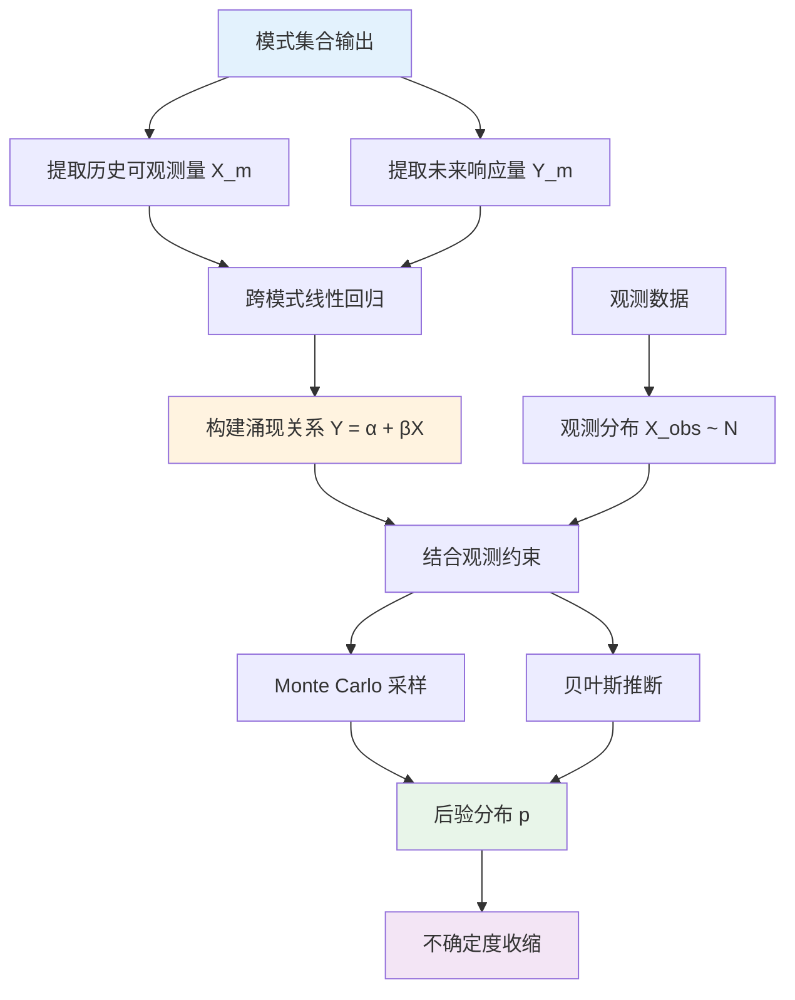
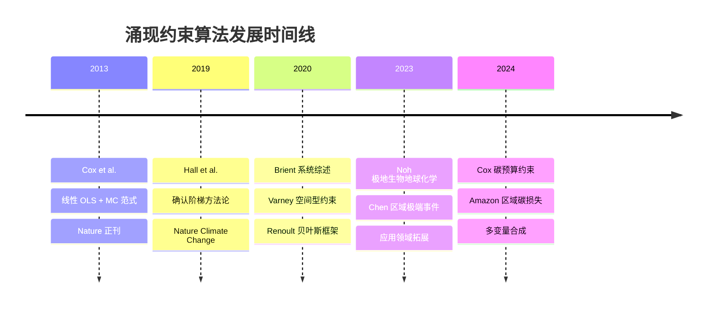
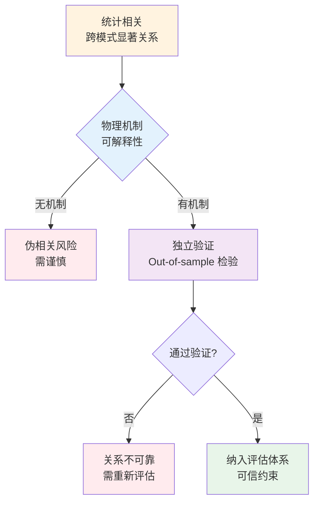
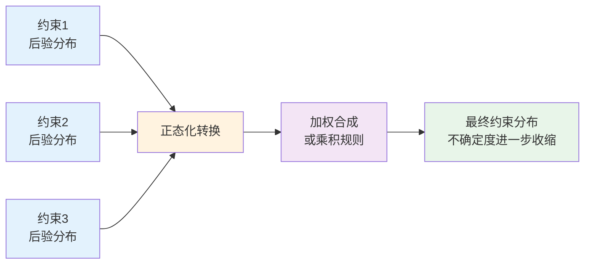
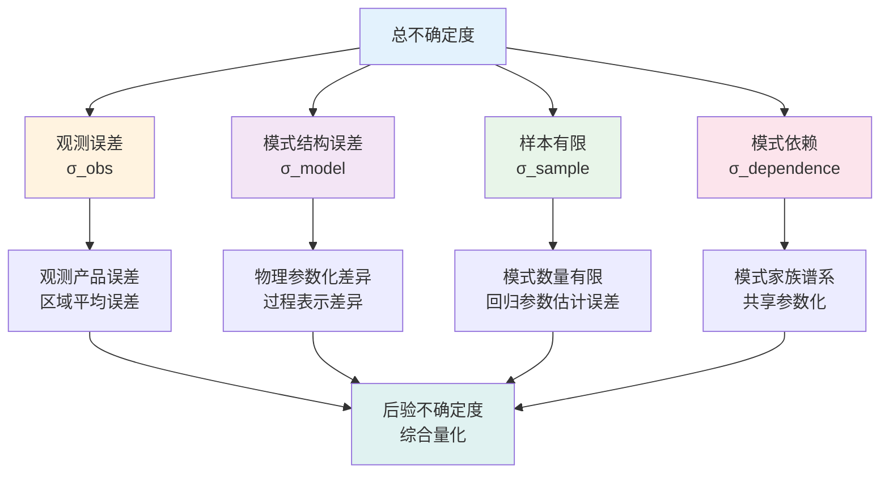
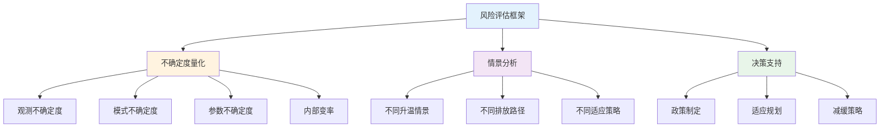
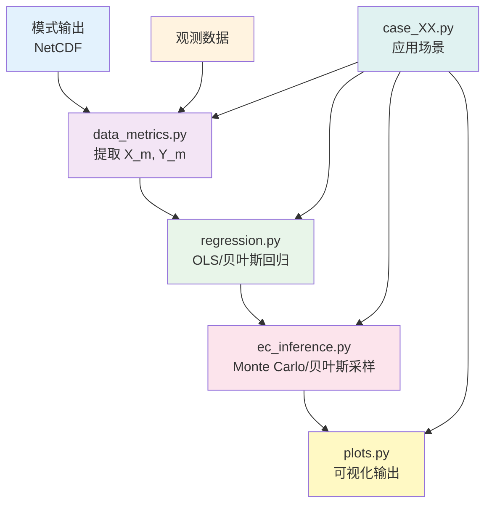
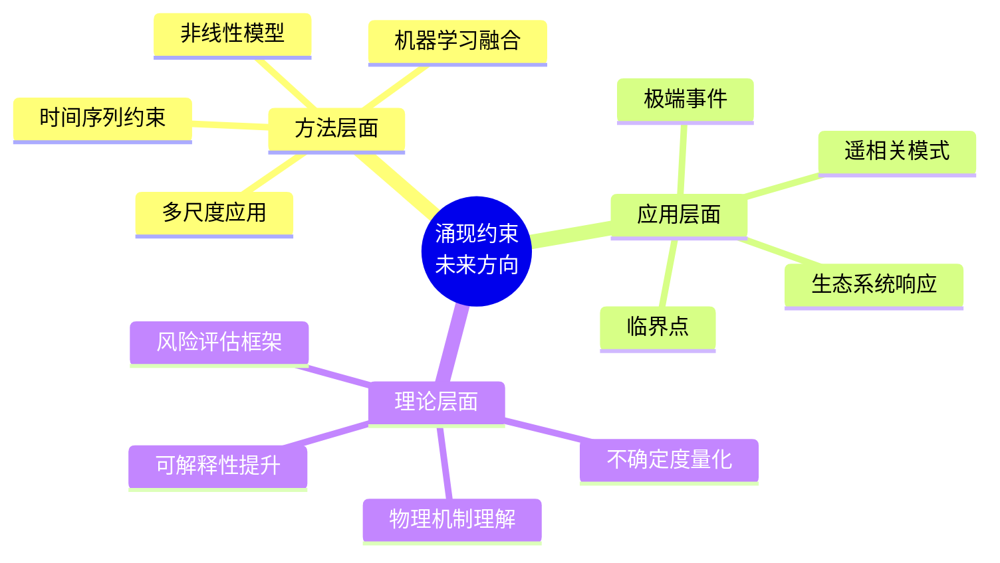

涌现约束（Emergent Constraint）作为气候科学中减少地球系统模式（ESM）预测不确定性的核心统计方法，自 Cox et al. (2013) 在 Nature 上首次系统应用以来，已从简单的"跨模式线性回归 + Monte Carlo 传播"范式，演进为包含贝叶斯层次模型、空间型约束、多变量合成、模式依赖性处理的系统方法论。从 Hall et al. (2019) 提出的"确认阶梯"到 Brient (2020) 的系统综述，从 Noh et al. (2023) 的极地生物地球化学应用到 Varney et al. (2020) 的空间型约束，涌现约束方法不仅在算法层面不断精进，更在应用领域持续拓展，成为连接观测数据与未来气候预估的重要桥梁。

## 核心概念与数学框架

涌现约束方法的核心思想在于：在多个地球系统模式的集合中，识别可观测的历史指标（预测量 X）与未来气候响应（被约束量 Y）之间的跨模式统计关系，再结合观测对 X 的约束，通过贝叶斯更新或 Monte Carlo 传播得到 Y 的后验分布，实现不确定度的显著收缩。



### 统一数学框架

在 M 个 ESM 模式或成员的集合中，定义：

- **X_m** 模式 m 的"历史可观测量"（如气候态、变率、空间型等）
- **Y_m** 模式 m 的"未来响应"（如平衡气候敏感度 ECS、海冰面积变化、碳损失、叶绿素变化等）

观测对 X 的估计通常假设为高斯分布：

$$
X_{\text{obs}} \sim \mathcal{N}(\mu_X, \sigma_X^2)
$$

其中均值 μ_X 和标准差 σ_X 来自观测产品及其误差估计。

跨模式回归构建"涌现关系"通常从线性回归起步：

$$
Y_m = \alpha + \beta X_m + \varepsilon_m, \quad \varepsilon_m \sim \mathcal{N}(0, \sigma_\varepsilon^2)
$$

得到回归参数估计值（截距 α、斜率 β、残差标准差 σ_ε）后，通过观测分布与回归参数的联合采样，得到未来响应 Y 的后验分布，实现不确定度收缩。

### 典型实现流程

涌现约束的典型实现流程包括六个核心步骤：


1. **构造指标**：从模式输出中计算 X_m 和 Y_m（如区域平均值、季节平均、趋势等）
2. **线性回归与诊断**：拟合回归参数，绘制散点图与拟合线，进行 leave-one-out 或 jackknife 稳健性检验
3. **观测分布建模**：对观测产品进行区域或时间平均，估计均值 μ_X 和标准差 σ_X，必要时合并多套观测
4. **后验采样**：通过 Monte Carlo 或贝叶斯采样得到 Y 的后验样本
5. **对比不确定度收缩**：比较未约束模式集合的 Y_m 分布与约束后后验分布的方差或区间宽度
6. **物理与统计一致性检查**：验证结果是否与物理机制、其他独立证据一致，避免"过度收缩"

## 算法发展脉络：从 Cox 2013 到 Noh 2023



### 第一代范式：Cox et al. (2013) 的线性 OLS + MC 方法

Cox et al. (2013) 在 Nature 上发表的工作确立了涌现约束的基本范式。他们约束的目标是热带陆地碳对变暖的敏感度 γ_T，即每升高 1K 热带陆地损失多少碳。

**核心做法**：

- 在 HadCM3C 的参数扰动集合与其他模式中，计算 X_m（热带气温异常与大气 CO₂ 年增长率的敏感度）和 Y_m（热带陆地碳对气温的敏感度）
- 在 (X_m, Y_m) 上做线性回归，得到强相关
- 将观测推得的 X_obs 带入回归直线，用 Monte Carlo 考虑观测和回归参数不确定度
- 得到敏感度 γ_T 为 53 ± 17 GtC K⁻¹，显著缩小了模式集合的原始散布

算法上，Cox 2013 确立了"跨模式线性关系 + 观测权重 + MC 传播"这一基本流程，被后续大量工作沿用。

### 发展阶段对比

涌现约束算法的发展经历了从简单统计技巧到系统方法论的演进过程：

| 发展阶段 | 时间 | 核心特征 | 统计方法 | 主要贡献 | 局限性 |
|:---|:---|:---|:---|:---|:---|
| **第一代：基础范式** | 2013-2018 | 线性 OLS + MC | 普通最小二乘回归 | 建立基本框架 | 可能低估不确定度 |
| **第二代：方法论提升** | 2019-2020 | 确认阶梯、系统总结 | 贝叶斯框架引入 | 建立评估标准 | 计算复杂度增加 |
| **第三代：应用拓展** | 2021-2023 | 空间型、多变量 | 层次模型、多约束合成 | 应用领域扩展 | 需要更多先验知识 |
| **第四代：深度整合** | 2024-至今 | 非线性、机器学习 | 深度学习、强化学习 | 方法创新 | 可解释性挑战 |

### 方法论转向：Hall et al. (2019) 的确认阶梯

Hall et al. (2019) 在 Nature Climate Change 上将涌现约束提升为一种**模型评估技术**，专门讨论"哪些涌现关系是可信约束，哪些只是漂亮的相关图"。

**关键贡献**：

1. **确认过程（confirmation process）**：从"有统计相关" → "有物理机制" → "通过独立数据或实验或时期的 out-of-sample 检验" → "纳入评估体系"的多级阶梯
2. **伪相关风险警示**：Caldwell 等通过数据挖掘在 ESM 集合里轻易找到"看似显著但物理无意义"的关系，提醒必须引入先验物理理解与严格统计检验
3. **伪现实实验**：呼吁使用单模式大集合、理想化实验等"伪现实（pseudo-reality）"去测试涌现约束算法本身的稳健性



这篇文章将"涌现约束"从**简单统计技巧**推向了一个**系统方法论**，促使后续在算法上引入更多贝叶斯、层次模型和依赖性处理。

### 系统总结：Brient (2020) 的最佳实践

Brient (2020) 对当前所有主要涌现约束做了系统盘点，并从统计角度总结出一套"最佳实践"：

**分类体系**：

| 类型 | 特征 | 典型应用 | 代表工作 |
|:---|:---|:---|:---|
| **均值型** | 基于气候态均值 | 低云浅薄度、雪反照率季节循环 | 云反馈约束 |
| **趋势或变率型** | 基于时间变率或趋势 | 温度变率、CO₂ 年增长率变率 | Cox 2013 热带碳敏感度 |
| **空间型** | 基于空间分布模式 | 土壤碳空间梯度、区域响应型 | Varney 2020 土壤碳约束 |

**统计流程规范化**：

- 明确区分观测误差与模式结构误差
- 区分回归残差与模式间独立性不足
- 提倡显式传播这些不确定度，而不是只给一条"细窄的回归线"

**多约束合成**：对 ECS 等量，可以用多个独立涌现约束合成后验分布，将多个 EC 转成正态分布再进行合成。



### 应用拓展：Noh et al. (2023) 的极地生物地球化学

Noh et al. (2023) 将涌现约束扩展到极地生物地球化学领域：

- 在 26 个 CMIP5/6 ESM 中，提取预测量 X_m（历史期北冰洋背景硝酸盐浓度）和被约束的响应量 Y_m（本世纪末北冰洋表层叶绿素浓度变化或初级生产力变化）
- 在模式集合上找到显著线性关系，再用观测硝酸盐气候态（含不确定度）去约束未来叶绿素变化
- 结果发现约束后未来叶绿素下降幅度更大，且不确定度显著收缩，三倍强于简单多模式均值的下降幅度

算法上沿用了 Cox 2013 的范式，但在数据处理与诊断上更加精细（多模式、多期、多指标测试）。

## 研究现状：从简单 OLS 到贝叶斯层次模型

涌现约束算法的发展可以从统计方法和应用领域两个维度进行分类：

| 统计方法 | 特点 | 优势 | 局限性 | 代表工作 |
|:---|:---|:---|:---|:---|
| **线性 OLS** | 简单线性回归 + Monte Carlo | 计算快速，易于实现 | 可能低估不确定度 | Cox 2013, Noh 2023 |
| **贝叶斯层次模型** | MCMC 采样，显式先验 | 严谨的不确定度量化 | 计算复杂，需要先验知识 | Renoult 2020, Simpson 2021 |
| **多约束合成** | 多个独立约束合并 | 提高稳健性 | 需要独立约束 | Brient 2020 |

### 更严谨的贝叶斯推断框架

Renoult et al. (2020) 在 Climate of the Past 上提出了一个**贝叶斯线性回归框架**，把"跨模式回归"当作一个似然模型，而对被约束量（如 ECS）的先验可以独立于模式集合设置，然后用贝叶斯公式更新为后验。

**优势**：

- 可以显式指定 ECS 等的先验（例如来自 paleoclimate、能量平衡研究等）
- 回归系数（截距 α、斜率 β、残差标准差 σ）用 MCMC 采样，避免低样本量下的过度自信
- 易于在同一框架下结合多个 EC

类似的贝叶斯或层次模型也已被用在大尺度环流涌现约束里（如 Simpson 2021 的大尺度环流 EC）。

### 处理模式相关性与结构误差

Hall 2019、Brient 2020 及后续工作不断强调：CMIP 模式并不是独立样本，存在**家族谱系（genealogy）**，共享物理参数化与调参策略，会导致有效样本数远小于模式数。

**算法处理思路**：

- 对模式进行聚类或重新加权（如"representative democracy"的权重方案），降低过度依赖某一家族模型的影响
- 在贝叶斯框架中引入"模式层"，显式建模模式间相关结构
- 用单模式大集合（含内部变率）来测试涌现关系是否仍成立，以区分内部噪声与模式间差异

| 处理方法 | 核心思想 | 优势 | 局限性 | 适用场景 |
|:---|:---|:---|:---|:---|
| **模式聚类** | 识别模式家族，按家族加权 | 直观，易于理解 | 需要先验知识 | 模式谱系清晰 |
| **Representative Democracy** | 每个家族等权重 | 避免家族偏差 | 可能忽略家族内差异 | 家族结构明确 |
| **贝叶斯层次模型** | 显式建模模式间相关 | 统计严谨 | 计算复杂 | 需要精确量化 |
| **单模式大集合** | 区分内部变率与模式差异 | 物理意义清晰 | 计算成本高 | 有单模式集合 |
| **Bootstrap 重采样** | 非参数估计不确定度 | 无需分布假设 | 可能高估不确定度 | 样本量较大 |

### 空间型、多变量与非线性涌现约束

涌现约束方法的应用领域正在从单一指标向多维度扩展：

| 应用类型 | 预测量特征 | 被约束量 | 不确定度收缩 | 代表工作 |
|:---|:---|:---|:---|:---|
| **空间型约束** | 空间分布模式 | 全球土壤碳敏感度 | 约 50% | Varney 2020 |
| **区域极端事件** | 区域响应关系 | 中国区域平均变暖与极端高温 | 显著收缩 | Chen 2023 |
| **碳预算约束** | 函数形式关系 | 1.5°C/2°C 剩余碳预算 | 更窄范围 | Cox 2024 |
| **区域碳循环** | 历史增暖趋势 | Amazon 区域碳通量变化 | 约 33% | Parry 2024 |

**空间涌现约束**：

Varney et al. (2020) 在 Nature Communications 上使用"空间型"预测量：土壤碳对温度敏感度的空间分布，用当前空间梯度去约束未来全球土壤碳对变暖的敏感度，显著把不确定度压到原来的一半。

**极端和区域气候**：

Chen et al. (2023) 在 GRL 上用 EC 框架同时约束中国区域的平均变暖和极端高温 TXx，以观测的全球增暖和区域响应关系为基础，说明 EC 已从"全球均值量"拓展到"区域极端指标"。

**碳预算与区域碳循环**：

- Cox et al. (2024) 利用 CMIP 模式的历史与未来模拟，构建了碳预算随升温的函数形式的涌现约束，对 1.5°C 或 2°C 目标下的剩余碳预算给出更窄的范围
- Amazon 区域碳损失最近也出现 Nature 系列的 EC 工作，用历史增暖趋势与未来区域碳通量变化之间的关系减少约三分之一的不确定度

这类工作都在推动算法从"单一线性、一维指标"向"空间、多指标、甚至非线性模型"扩展。

### 统计推断本身的反思与修正

Cox 和 Williamson 等人专门写过"Statistical Inference with Emergent Constraints"的评论，指出：很多早期 EC 只做简单 OLS + plug-in，很容易**低估不确定度**，甚至在存在模型依赖、不准确观测误差时给出"过于乐观"的窄区间。

**主流趋势**：

- 显式分解不确定度来源（观测误差、模式结构误差、样本有限、模式依赖）
- 使用贝叶斯或 bootstrap 估计完整后验，而不是只报一个"点估计 + 经验误差条"
- 强调留一法或交叉验证和"伪现实"实验来测试 EC 的可重复性



### 代码与工具化生态

涌现约束分析已经从单篇论文里的 ad-hoc 脚本，演变为可复用或可组合的统计模块：

| 工具名称 | 主要功能 | 应用领域 | 技术特点 | GitHub 链接 |
|:---|:---|:---|:---|:---|
| **Emergent_Constraints** | 通用涌现约束分析 | Arctic 生物地球化学 | 接口通用化，文档完善 | [blackcata/Emergent_Constraints](https://github.com/blackcata/Emergent_Constraints) |
| **emergent_constraint** | 多约束合成 | ECS 约束 | 正态分布转换与合成 | [florentbrient/emergent_constraint](https://github.com/florentbrient/emergent_constraint) |
| **ecpaper2020** | 完整分析流程 | 大尺度环流 | 预处理到后验估计全流程 | [islasimpson/ecpaper2020](https://github.com/islasimpson/ecpaper2020) |
| **Bolin 代码库** | 贝叶斯 EC 实现 | 气候敏感度 | PyMC/Stan 贝叶斯框架 | Renoult 2020 配套代码 |

## 未来发展趋势

### 方法改进与扩展

**多尺度应用**：

当前的涌现约束方法主要适用于全球或大区域尺度，未来的研究将致力于将该方法应用于更小尺度的区域气候和水文预估，以提高预测的精度和适用性。Varney 2020 的空间型约束已经展示了这一方向的潜力。

**时间序列约束**：

现有的涌现约束方法无法对时间序列进行约束，未来的研究将探索如何将涌现约束方法扩展到时间序列分析中，以更好地捕捉气候和水文变量的动态变化。这可能涉及将涌现约束与时间序列模型（如 ARIMA、状态空间模型）相结合。

**非线性与机器学习融合**：

随着机器学习方法在气候科学中的广泛应用，未来的涌现约束方法可能会：

- 引入非线性回归模型（如神经网络、支持向量机）来捕捉复杂的跨模式关系
- 使用深度学习进行特征提取，识别更高维的涌现关系
- 结合强化学习优化约束策略，自动选择最优的预测量

### 跨学科融合与应用拓展

涌现约束方法的应用领域正在从气候科学向更广泛的领域扩展：

| 应用领域 | 预测量类型 | 被约束量 | 技术挑战 | 研究进展 |
|:---|:---|:---|:---|:---|
| **极端事件** | 历史极端频率、强度 | 未来极端事件概率 | 非平稳性、阈值行为 | Chen 2023 区域极端高温 |
| **临界点** | 系统状态指标 | 临界点触发阈值 | 非线性、突变行为 | 初步探索阶段 |
| **遥相关模式** | ENSO、NAO 指数 | 区域气候响应 | 时间滞后、非线性 | Simpson 2021 大尺度环流 |
| **生态系统** | 生物地球化学指标 | 生态系统响应 | 多过程耦合 | Noh 2023 极地生物地球化学 |
| **工程系统** | 系统状态观测 | 系统行为预测 | 物理约束融合 | 概念验证阶段 |
| **水文系统** | 历史径流、蒸散发 | 未来水资源变化 | 多尺度耦合 | 初步应用 |

**极端事件与临界点**：

涌现约束方法在极端事件和临界点（tipping points）上的应用是未来研究的重要方向。这需要：

- 识别与极端事件相关的可观测指标
- 建立极端事件特征与未来气候响应的统计关系
- 量化临界点触发的不确定性

**遥相关与复杂系统**：
涌现约束方法可以扩展到研究遥相关模式（如 ENSO、NAO）对区域气候的影响，以及复杂系统中多个子系统之间的相互作用。

**工程与技术领域**：
在电力系统、流体力学等工程领域，利用涌现约束方法对系统行为进行预测和优化，将统计约束与物理模型相结合，提高工程设计的可靠性。

### 物理机制的深入理解

涌现约束方法虽然具有一定的物理机制，但其本质上仍是一种统计方法。未来的研究将致力于：

- **机制解释** 深入理解涌现约束关系背后的物理机制，建立从统计关系到物理过程的桥梁
- **过程模型** 将涌现约束与过程模型相结合，不仅约束结果，还约束过程
- **多物理约束** 结合多个物理过程的约束，形成更全面的约束体系

### 不确定度量化与风险评估

未来的研究将更加关注模型预测中的不确定度量化和风险评估：

- **分层不确定度分解** 显式区分观测不确定度、模式结构不确定度、参数不确定度、内部变率等不同来源
- **风险评估框架** 将涌现约束结果纳入风险评估框架，为政策制定提供科学依据
- **敏感性分析** 系统分析不同假设和参数选择对约束结果的影响



## 技术亮点与实现范式

### 通用涌现约束流水线

基于 Noh et al. (2023) 的实现，可以抽象出一套通用的涌现约束流水线：



**模块划分**：

1. **data_metrics.py**：从模式输出和观测数据中提取 X_m、Y_m 和观测分布参数
2. **regression.py**：完成 OLS 或贝叶斯回归，返回回归参数和诊断信息
3. **ec_inference.py**：进行 Monte Carlo 或贝叶斯采样，得到后验分布
4. **plots.py**：生成散点图、回归线、观测带和约束前后分布对比图
5. **case_XX.py**：针对不同应用场景（如 Arctic chlorophyll、海冰、云反馈、碳预算）的具体实现

**核心算法示例**：

```python
import numpy as np

def fit_ols(x, y):
    """在模式集合上拟合 Y = a + b X"""
    x = np.asarray(x)
    y = np.asarray(y)
    n = len(x)
    A = np.vstack([np.ones(n), x]).T
    params, _, _, _ = np.linalg.lstsq(A, y, rcond=None)
    a_hat, b_hat = params
    y_fit = a_hat + b_hat * x
    sigma_eps = np.sqrt(np.sum((y - y_fit)**2) / (n - 2))
    XtX_inv = np.linalg.inv(A.T @ A)
    cov_params = sigma_eps**2 * XtX_inv
    return a_hat, b_hat, sigma_eps, cov_params

def emergent_constraint(x_models, y_models, x_obs_mean, x_obs_std, n_mc=100000):
    """简单版涌现约束 Monte Carlo 实现"""
    a_hat, b_hat, sigma_eps, cov_params = fit_ols(x_models, y_models)
    
    # 抽样回归参数 (a, b)
    params_mc = np.random.multivariate_normal(
        mean=[a_hat, b_hat], cov=cov_params, size=n_mc
    )
    a_s, b_s = params_mc[:, 0], params_mc[:, 1]
    
    # 抽样观测预测量 X_obs
    x_s = np.random.normal(loc=x_obs_mean, scale=x_obs_std, size=n_mc)
    
    # 抽样残差
    eps_s = np.random.normal(loc=0.0, scale=sigma_eps, size=n_mc)
    
    # 得到未来响应样本 Y
    y_s = a_s + b_s * x_s + eps_s
    
    return {
        "samples": y_s,
        "mean": float(np.mean(y_s)),
        "ci5": float(np.percentile(y_s, 5)),
        "ci95": float(np.percentile(y_s, 95)),
    }
```

这一框架可以进一步扩展为贝叶斯层次模型，加入模式权重、多变量支持等功能。在实际应用中，可以替换为 PyMC 或 Stan 做真正的贝叶斯层次模型，在回归层上增加模式层和观测层，支持模式依赖权重，并支持多变量预测量（多元线性回归或降维后的主成分）。

## 总结与展望

涌现约束方法从 Cox 2013 的简单线性回归范式，经过 Hall 2019 的方法论提升、Brient 2020 的最佳实践总结，到 Noh 2023 的应用拓展，已发展成为气候科学中减少模式预测不确定性的重要工具。当前研究正从简单 OLS 向贝叶斯层次模型演进，从单一线性关系向空间型、多变量、非线性约束扩展，从临时脚本向标准化工具转变。

### 核心成就

涌现约束方法在过去十余年的发展历程中取得了显著成就：

- **方法论成熟** 从简单的统计技巧演进为系统的方法论，建立了从统计相关到物理机制、从独立验证到评估体系的完整框架

- **算法精进** 从线性 OLS 发展到贝叶斯层次模型，从单一指标扩展到空间型、多变量、非线性约束

- **应用拓展** 从全球气候敏感度到区域极端事件，从碳循环到生物地球化学循环，应用领域不断扩展

- **工具化发展** 从单篇论文的临时脚本发展为可复用、可组合的统计模块，形成了活跃的开源生态

### 未来方向

未来，涌现约束方法将在多个方向迎来新的发展机遇：



**方法层面**：多尺度应用、时间序列约束、非线性与机器学习融合将进一步提升方法的适用性和预测精度。特别是与深度学习的结合，可能带来自动特征提取和关系识别的突破。

**应用层面**：极端事件、临界点、遥相关模式、生态系统响应等领域的应用将拓展方法的边界。这些应用需要处理非线性、非平稳性和阈值行为，对算法提出了更高要求。

**理论层面**：物理机制理解、不确定度量化、风险评估框架的建立将提高方法的科学性和可信度。只有深入理解涌现关系背后的物理本质，才能真正发挥统计约束的作用。

### 哲学思考

正如 Hall 等人所强调的，涌现约束不应仅仅是"漂亮的相关图"，而应建立在坚实的物理机制和严格的统计检验基础上。涌现约束方法通过统计关系揭示物理过程的本质，但统计关系本身需要物理机制的支持和独立数据的验证。在数据驱动与物理理解的双重约束下，涌现约束方法正在帮助我们更准确地认识未来气候变化的边界，为人类社会的适应和减缓策略提供科学支撑。

## 参考文献

1. Cox, P. M., Pearson, D., Booth, B. B., Friedlingstein, P., Huntingford, C., Jones, C. D., & Luke, C. M. (2013). Sensitivity of tropical carbon to climate change constrained by carbon dioxide variability. *Nature*, 494(7437), 341-344. https://doi.org/10.1038/nature11882
2. Hall, A., Cox, P., Huntingford, C., & Klein, S. (2019). Progressing emergent constraints on future climate change. *Nature Climate Change*, 9(4), 269-278. https://doi.org/10.1038/s41558-019-0436-6
3. Brient, F. (2020). Reducing uncertainties in climate projections with emergent constraints: Concepts, examples and prospects. *Advances in Atmospheric Sciences*, 37(1), 1-15. https://doi.org/10.1007/s00376-019-9140-8
4. Noh, K. M., Kwon, Y. E., Kim, T. W., Park, K. T., Lee, K., & Kim, I. N. (2023). Emergent constraint for future decline in Arctic Ocean primary production. *Earth's Future*, 11(3), e2022EF003427. https://doi.org/10.1029/2022EF003427
5. Varney, R. M., Chadburn, S. E., Burke, E. J., Friedlingstein, P., Koven, C. D., Hugelius, G., & Cox, P. M. (2020). A spatial emergent constraint on the sensitivity of soil carbon to warming. *Nature Communications*, 11(1), 5544. https://doi.org/10.1038/s41467-020-19208-8
6. Renoult, M., Annan, J. D., Hargreaves, J. C., & Edwards, N. R. (2020). An efficient statistical method for generating an ensemble of perturbed physics climate model simulations from a multi-model ensemble. *Climate of the Past*, 16(5), 1715-1735. https://doi.org/10.5194/cp-16-1715-2020
7. Simpson, I. R., Deser, C., McKinnon, K. A., & Barnes, E. A. (2021). Modeled and observed multidecadal variability in the North Atlantic jet stream and its connection to the Arctic. *Journal of Climate*, 34(15), 6283-6301. https://doi.org/10.1175/JCLI-D-21-0055.1
8. Chen, X., Zhou, T., Wu, P., Wang, B., Dong, B., & Li, C. (2023). Emergent constrained projections of mean and extreme warming in China. *Geophysical Research Letters*, 50(3), e2022GL102124. https://doi.org/10.1029/2022GL102124
9. Cox, P. M., Huntingford, C., & Williamson, M. S. (2024). Emergent constraints on carbon budgets as a function of global warming. *Nature Climate Change*, 14(2), 127-133. https://doi.org/10.1038/s41558-023-01914-4
10. Parry, I. M., Ritchie, P. D. L., & Cox, P. M. (2024). Emergent constraints on future Amazon climate change from observed temperature-rainfall relationships. *Nature Communications*, 15(1), 1-11. https://doi.org/10.1038/s41467-024-51474-8
11. Caldwell, P. M., Zelinka, M. D., & Klein, S. A. (2018). Evaluating emergent constraints on equilibrium climate sensitivity. *Journal of Climate*, 31(10), 3921-3942. https://doi.org/10.1175/JCLI-D-17-0631.1
12. Cox, P. M., & Williamson, M. S. (2021). Statistical inference with emergent constraints. *Climate Dynamics*, 57(9-10), 2425-2438. https://doi.org/10.1007/s00382-021-05819-4
13. Noh, K. M., et al. (2023). Emergent_Constraints: A Python package for emergent constraint analysis. GitHub repository. https://github.com/blackcata/Emergent_Constraints
14. Brient, F. (2020). emergent_constraint: Inference for emergent constraints. GitHub repository. https://github.com/florentbrient/emergent_constraint
15. Simpson, I. R. (2021). ecpaper2020: Scripts to perform emergent constraint analysis. GitHub repository. https://github.com/islasimpson/ecpaper2020

---

**作者**：Mapoet  
**原文链接**：[https://mp.weixin.qq.com/s/NjWJP-yIQsG36gYOhsJe8w](https://mp.weixin.qq.com/s/NjWJP-yIQsG36gYOhsJe8w)  
**版权声明**：Copyright @ 2025 GNSS-X. All Rights Reserved. Mapoet 版权所有.