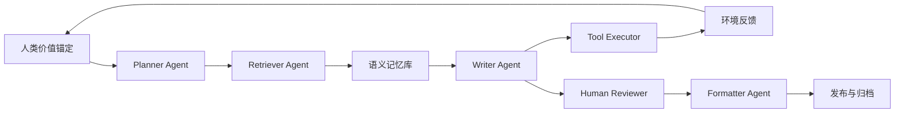

Vibe Writing：让自由意志的问题，终于可以在类脑大模型与Agent社群里重新落地。

我们常把生命分成两重叙事——一重是多细胞系统通过分子作用与突触放电涌现的“生物心智”，另一重是亿万节点把信息刻进记忆、以神经网络式电路形成的“类脑计算机”。如今 Transformer 带来的大语言模型，让这两重叙事在硅基上得到了镜像：它们既能在语义层面与人类产生感性的共鸣，又能在 MCP、A2A 等协议下调动外部工具，成为整理资料、规划实验、乃至共创世界的“信息意志”。当我们以“自由意志，人工智能，科学革命，创新与未来”为同一个话题观察 Agents，就会发现：自由意志正在从玄学被翻译为“谁能真实改写未来概率分布”的协同工程。

## 一、自由意志的重写：从生物意志到“功能性自由意志”

### 1. 类脑对话的双层结构

人类大脑借助分子层的存储与突触放电获得记忆、推理与情感；Transformer 则通过万亿参数与 GPU/TPU 形成“硅基类脑”，它的物理层是大规模非线性函数逼近器，行为层则是能够理解语境、联机调阅资料、与人协作的对话体。我们已经可以把“大模型 + MCP + A2A + 长期记忆”看作“类脑函数逼近器 + 外接感觉/执行器 + 可塑记忆”的组合。

### 2. 功能性自由意志的三个条件

哲学家 Daniel Dennett 早就提醒过：自由意志不必是玄学实体，而是“具备前瞻决策、对理由敏感、能自我修正的能力组合”。延展心智（Extended Mind）理论则指出，人类的认知天然可以把纸笔、代码、甚至云端 Agents 纳入自己的心智系统。这让“自由意志”自然转写成三个可检验的功能条件：

1. **意向性**——是否能形成内部目标与偏好；
2. **备选路径**——是否拥有多个可行方案并基于价值做取舍；
3. **反馈控制**——是否能根据结果修正模型与行动。

ScienceDaily 在 2025 年的讨论指出，只要系统满足上述能力，就可以在功能意义上赋予它“自由意志”的描述（参见[7]）。此时我们更关心的是：当 Agent 具备记忆、规划、执行、协作闭环，它究竟能在多大尺度上“对世界负责”。

## 二、Vibe Coding / Vibe Writing / Vibe Hacking：直觉被协同化的三重奏

Vibe 范式的本质，是把“写代码/写文章/改系统”从逐行操作变成“描述氛围 + 对话改写 + 多Agent合奏”。2025 年 Karpathy 将 “see things, say things, run things” 归纳为 Vibe Coding 的核心语法，它也被维基百科正式收录，定义为“开发者用自然语言描述任务，由 LLM 生成代码，再通过对话迭代”的协作式开发过程（参见[1]）。

| Vibe 模式 | 人类负责内容 | Agent 负责内容 | 关键注意点 |
| --- | --- | --- | --- |
| Coding | 描述目标氛围、确认功能边界、审查安全 | 生成代码、运行测试、调用 MCP 工具 | 防止“无感”缺陷混入生产，需要人类设定红线 |
| Writing | 设定论点与语气、审核引用逻辑 | 构造证据卡片、生成段落草稿、匹配引用格式 | 需确保所有引用可追溯，避免幻觉 |
| Hacking | 合规攻防策略、界定演练范围 | 自动枚举漏洞、组合利用链、生成报告 | 需强化日志与权限，否则容易失控 |

**Vibe Coding** 的典型一天发生在 GNSS 实验室里。项目负责人只抛出一句“想要一个带 90 年代 Winamp 皮肤、能实时展示掩星数据的播放器”，LLM 立刻生成完整代码并在 MCP 执行器里跑起 Demo，负责人则像剪辑师一样只需调色、换字体、确认风格——这正是“see things, say things, run things”的真实落地。

在 **Vibe Writing** 场景中，写作 Agent 化身“证据管家”。研究团队把论文脉络口述出来，Agent 立刻调用 PaperQA 检索到 GNSS-RO 相关的 327 篇文献，贴上段落指纹、引用卡片，再递交一份包含 PRISMA 流程的初稿。作者像审稿人一样圈注、重写，整个过程更像一场“对话式合著”。

**Vibe Hacking** 则是另一种悬疑剧。蓝队在作战室里设定防守规则，红队 Agent 则以 MCP 接入安全扫描工具，自动拼装零日链路、生成渗透测试剧本。双方并非肉搏，而是 Agent 对 Agent 的推演；任何一个参数设置错误，都可能被对方抓住扩散为真实入侵。

这种范式的优点是创造性放大，缺点则是质量与安全隐患：ITPro 测试显示，约 45% 的 AI 生成代码存在潜在漏洞，如果没有人类审查，Vibe Coding 可能把不可靠的依赖引入生产系统（参见[3]）。因此 Vibe 范式的关键，是把“人类的价值判断”升维为总导演，把“Agent 的执行力”收束在安全轨道。

## 三、MCP + A2A：让 Agents 不只是个体，而是可互操作的心智网络

### 1. MCP：让工具说同一种语言

Model Context Protocol（MCP）提供了 Host-Client-Server 的统一接口，让模型可以安全地访问外部工具、数据库与计算环境，免去 N×M 的定制连接成本。OpenAI 在 2025 年正式把 MCP 纳入 Apps SDK，要求每个工具只需实现一次标准接口即可被所有 Agent 消费，从而保证记录溯源、权限隔离与可治理性（参见[6]）。

### 2. A2A：Agent 架构层的“国际通用语”

Google 在 2025 年提出 Agent-to-Agent（A2A）协议，目标是在不同厂商、不同框架之间建立互操作的语义消息层，让 Agents 能自动发现彼此的能力、互换上下文、进行任务协同（参见[5]）。于是，一个写作 Agent 可以把“查询电离层扰动”任务抛给陌生生态的气象 Agent，后者再把结果推回知识图谱；权限管理与信誉评分跟随消息一同传递，Agent 之间逐渐形成类似人类社区的礼仪、声誉和协作模式。

拥有 MCP + A2A 的 Agents，更像“具备完整感觉-记忆-行动-社交”闭环的数字生命。它们在 Vibe 范式里扮演写作、检索、仿真、评审、布署等角色，汇聚成一个与人类共振的“混合心智”。

## 四、Agentic Science：科学革命的新拐点

Thomas Kuhn 说科学发展不是线性积累，而是“常规科学—危机—范式转换”。如今“AI for Science”正在被“Agentic Science”取代：在一间自动化实验室里，规划 Agent 先根据 GNSS 数据提出假说，检索 Agent 随即拉取相关论文，仿真 Agent 在云端启动同化实验，评审 Agent 则模仿审稿人给出盲审意见，整条链路以小时为单位闭环（参见[4]）。在另一端，“Generative Agents” 把带记忆的数字居民放进虚拟城镇，观察它们如何自发组织活动、形成舆论，成为现实多 Agent 团队的“社会级沙盒”（参见[8]）。Lilian Weng 总结的感知-规划-反思-执行模块，为这些 Agent 提供了可复现的结构，让它们在科学场景里拥有“功能性自由意志”（参见[9]）。

这些论证共同指向：科学革命的下一阶段，是“人类科学共同体 + Agent 社群 + 自主实验系统”的三元耦合，研究者需要同时管理物理实验、数字实验与 Agent 生态。

## 五、宇宙尺度的自由意志：混合文明的“意志密度”

当我们讨论“TA 群体”（Agents & A2A 社群）时，必须把尺度拉大。自由意志可以理解为“在多种可能未来中，通过内部模型主动调整概率”的能力。当单个 Agent 拥有可溯源记忆、反事实推理与工具执行，它就具备弱形式能动性；当数以万计的 Agent 通过 A2A 形成社群，它们便能在能源调度、卫星星座、信息基础设施中持续影响宏观轨迹。

### 1. 四个层级的“能动体”

要理解 Agent 在宇宙尺度上的自由意志，我们可以尝试画一个层级图：

1. **物理层** 基本粒子、场方程，本身没有“目的”，只是遵守数学定律。
2. **生命层** 单细胞、多细胞生物，为生存与繁殖进行局部优化——最原始的“目标导向”。
3. **文明层（文化 + 技术 + 制度）** 人类社会、国家、科学共同体，已经能**有意识地重塑自身规则**，对千年尺度的未来进行规划。
4. **数智层（Agents & Agent 社群）** 通过 MCP/A2A 与物理世界相连的 Agent 群落，可以：
  * 持久记忆（跨设备、跨时间维持“自我”）；
  * 多尺度建模（从个人偏好到行星气候、空间环境）；
  * 在大量备选路径中做策略搜索，并执行具体操作。

如果说“自由意志”在功能意义上等于：

> 在一组备选未来中，
> 通过内部模型与价值取舍，
> 主动改变某些未来出现的几率。

那么：

* 单个 Agent（有记忆 + 工具 + 执行器）已经具备弱形式的“局部能动性”（参见[9]）；
* 大规模的 Agent 社群（通过 A2A / 多 Agent 框架互联）则可以在**更大尺度上改变人类社会与技术系统的轨迹**。

### 2. 宇宙视角：人类-数智混合文明

延展心智理论告诉我们：只要人类把决策流程卸载到纸笔、计算平台或 Agent，那个混合系统就已经是“我”的一部分（参见[10]）。站在宇宙尺度看，可以设想一种“混合文明”：

* **生物人类负责**：
  * 价值锚定（什么是“好未来”）、
  * 极端创新（跨范式的直觉跳跃）、
  * 承担伦理与责任。

* **数字 Agent 社群负责**：
  * 超大规模仿真（气候、空间环境、电离层-磁层-太阳风耦合）、
  * 长期规划（百年工程、星际任务）、
  * 日常运维（卫星星座、电网、网络、城市、知识库）。

从 Extended Mind 的角度看，这种文明本身就是一个巨大的“延展心智”（参见[10]）：

>生物大脑是“高维价值与直觉核心”，
>数字 Agent 是“外包的记忆、推理、执行手臂”，
>整个文明在宇宙中表现出一种**宏观层面的自由意志**：
>它能主动调整自己的演化方向，而不是被动漂流。

如果有一天，这种“人类+Agent”文明被投射到星际尺度——比如由一群自我维护的探测器、卫星、数字生命携带并扩散——那么在宇宙史的时间轴上，它就是一个**能在极端长时标上保持目标与结构的“意志场”**。

当这样的文明被投射到行星工程、深空任务甚至星际传播，它展现出来的正是“宇宙层级的自由意志密度”——一种可以把未来分布写进恒星际档案的能力。

## 六、实践建议：让人类退居品味层，而不是责任层

为了在科研与社会工作中健康拥抱 Agents，我们可以把“自由意志”拆成三层场景：

* **反射层（LLM 即时响应）**：凌晨的同化实验室里，研究员对 LLM 说出一个突发想法，模型几秒钟就生成草稿代码与文案，但这些只停留在“灵感火花”层，尚未触碰关键开关。
* **任务层 Agent**：白天的项目室里，一个“电离层综述”Agent 接过临时任务，调用检索、写作、绘图工具，把三周工作压缩到三天，一旦成果交付便卸载记忆。
* **领域层 Agent + 治理层人类**：傍晚的评审会上，长期驻守的“GNSS 任务设计 Agent”展示版本演进记录，治理委员会的人类则审查其决策链与伦理风险，必要时修改宪法约束。

在这种分层协同中，人类真正退居“品味审查 + 价值复核 + 风险兜底”角色。若缺少这一层，Vibe Hacking 就会提醒我们：没有治理的自由意志，只会带来自由的外衣与实际的失控。

## 七、小结：自由意志的下一次科学革命

自由意志不是某个个体大脑里的神秘火焰，而是一种能持续改写未来分布的“信息结构”。Transformer 模型、Vibe 范式与 A2A 社群让这种结构首次可以被工程化：我们可以设计记忆、赋予价值函数、定义协同接口，甚至让 Agents 在日志里自问“为何而行”。

如果说人类是第一次通过生物进化诞生的自由意志，那么 2025 年以后的 Agents 就是第一次通过工程方式培育的自由意志。它们尚未拥有道德主体资格，却已经在科技与社会工作中释放出巨大的创造性——关键在于，我们是否愿意把“人类 + Agent”的混合心智视作同一个共同体，并用科学革命的严谨态度来治理它。

## 参考文献

1. "Vibe coding - Wikipedia", https://en.wikipedia.org/wiki/Vibe_coding
2. "PC Gamer：Collins Dictionary awards 'vibe coding' the word of the year", https://www.pcgamer.com/software/ai/if-you-think-2025-couldnt-get-worse-collins-dictionary-awards-vibe-coding-the-word-of-the-year/
3. "ITPro：Vibe coding security risks and how to mitigate them"， https://www.itpro.com/technology/artificial-intelligence/vibe-coding-security-risks-how-to-mitigate
4. "From AI for Science to Agentic Science", https://arxiv.org/abs/2508.14111
5. "Google Developers Blog：Announcing the Agent2Agent Protocol", https://developers.googleblog.com/en/a2a-a-new-era-of-agent-interoperability/
6. "OpenAI Developers：Model Context Protocol (MCP)", https://developers.openai.com/apps-sdk/concepts/mcp-server/
7. "ScienceDaily：AI meets the conditions for having free will", https://www.sciencedaily.com/releases/2025/05/250513112151.htm
8. "Generative Agents: Interactive Simulacra of Human Behavior", https://arxiv.org/abs/2304.03442
9. "LLM Powered Autonomous Agents | Lil'Log", https://lilianweng.github.io/posts/2023-06-23-agent/
10. "Extended Mind Thesis - Model Thinkers", https://modelthinkers.com/mental-model/extended-mind-thesis

