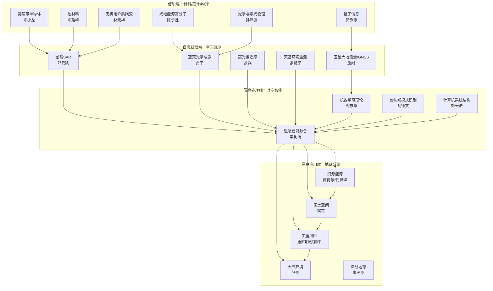
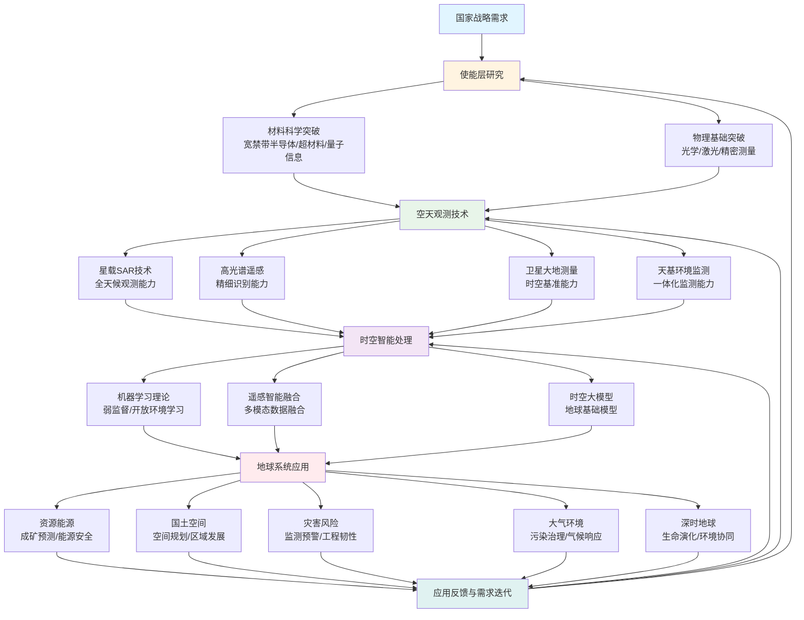

2025年11月21日，中国科学院与中国工程院分别公布了新当选院士名单：**中国科学院院士73人**、**中国工程院院士71人**，合计144人。这次增选结果不仅反映了我国科技发展的最新态势，更清晰地勾勒出**地学、遥感与人工智能（AI）** 三大领域深度融合的创新图谱。

从学科交叉的视角审视这次增选，我们可以发现一条从"底层硬科技 → 空天观测 → 时空智能 → 地球系统应用"的完整创新链条。新当选院士在不同学部里形成了清晰的交叉网络，共同指向"看得清、看得全、看得快"的对地观测能力，"把地球数据变成地球智慧"的时空智能算法，以及"理解地球、服务治理"的地球系统应用。

本文旨在通过系统梳理新当选院士的学术贡献，构建交叉学科网络图与创新链流程图，深入分析2025年这些学科的国家战略需求与发展重点，为理解我国空天信息、地球系统科学与智能计算的发展脉络提供全景视角。

## 一、地学、遥感、AI方向新当选院士的完整专题画像

### 1.1 空天信息与遥感观测链："看得清、看得全、看得快"

对地观测的"信息获取端"构成了空天信息基础设施的核心。2025年增选中，多位院士在这一链条上形成了系统性的突破。

#### （1）星载SAR与全天候观测方向

**邓云凯（中国科学院院士，信息技术科学部）**：长期从事**星载合成孔径雷达（SAR）成像技术**，重点攻关高分辨率、超大宽幅SAR与新体制SAR，是我国星载雷达遥感持续升级的关键推动者。([1])

SAR技术作为全天候、全天时的对地观测手段，在灾害应急、海洋权益、农情林情、冰冻圈与地下结构探测等领域具有不可替代的作用。邓云凯院士的工作为我国构建自主可控的SAR观测能力奠定了技术基础。

#### （2）空天光学成像、立体测绘与精密测量方向

**贾平（中国科学院院士，信息技术科学部）**：研究方向为**空天光学成像与测量**，所在长春光机所长期承担我国天绘/高分等系列的对地光学载荷研制任务；贾平作为该所所长与方向带头人，其研究面向高精度立体成像与测绘能力建设。([2])

光学遥感载荷是获取高分辨率对地观测数据的主要手段，在国土测绘、资源调查、环境监测等领域发挥着核心作用。贾平院士的工作推动了我国光学遥感从"有"到"强"的跨越。

#### （3）高光谱遥感与成像光谱机理方向

**张兵（中国科学院院士，地学部）**：我国高光谱遥感领军者之一，构建了全谱段、全链路高光谱遥感信息机理与应用模型，主持研发高光谱图像数字模拟与实时处理系统，推动高光谱从"科研载荷"走向"业务化能力"。([3])

**李树涛（中国科学院院士，信息技术科学部）**：聚焦**遥感/多模态图像处理与信息融合**，带领团队突破多模图像融合与高分辨率高光谱成像关键技术，为遥感成像"又清又准又快"提供核心算法与系统方案。([4])

高光谱遥感能够同时获取地物的空间和光谱信息，在精准农业、环境监测、矿产勘查等领域具有独特优势。张兵院士与李树涛院士的工作形成了"机理研究+算法创新"的完整链条，共同推动我国高光谱遥感技术的跨越式发展。

#### （4）卫星大地测量/北斗PNT与时空基准方向

**施闯（中国科学院院士，地学部）**：长期从事**高精度卫星导航与卫星大地测量**，提出北斗广域实时精密定位/授时理论和方法，支撑北斗地基增强系统与行业应用重大工程。([5])

卫星大地测量与导航定位是遥感反演、数据同化、灾害监测、精密测绘乃至未来"数字地球"的时空基石。施闯院士的工作为我国构建自主可控的高精度时空基准体系提供了关键支撑，对GNSS-RO、反射测量、电离层-大气耦合等同化与反演体系具有基础设施级意义。

#### （5）光学/激光、天基环境监测等观测物理方向

**孙洪波（中国科学院院士，信息技术科学部）**：方向为**光学与激光物理**，对应新型遥感载荷（激光雷达、量子/光学精密测量）的底层突破。([2])

**张艳宁（中国科学院院士，信息技术科学部）**：方向为**天基空间环境监测处理**，为"空间—地球环境一体化监测"提供数据处理链路。([2])

**彭承志（中国科学院院士，数学物理学部）**：量子信息与量子光学实验方向，为未来的量子精密测量、量子遥感/量子传感提供物理基础。([2])

这些院士的工作代表了从基础物理到应用技术的完整链条，为下一代精密测量、光子遥感与智能计算提供了物理底座。

### 1.2 时空智能与GeoAI链："把地球数据变成地球智慧"

对地观测的"信息处理端"正在经历从数据到智能的深刻变革。机器学习理论与遥感智能处理技术的融合，正在推动地球观测从"传感器驱动"走向"智能感知系统驱动"。

#### （1）机器学习理论与通用智能底座

**周志华（中国科学院院士，信息技术科学部）**：国际公认的机器学习理论与方法专家，在集成学习、弱监督学习、多标签学习等方向做出开创性贡献，提出"深度森林/learnware"等新范式；其《机器学习》（"西瓜书"）在国内外广泛使用。([6])

周志华院士所代表的"弱监督/开放环境学习"路线，正是遥感解译、GNSS与地学观测中"样本稀缺、类别开放、噪声强"的核心算法底座。其理论突破为地学与遥感的时空大模型、物理—数据混合学习、可信AI等提供了理论源头。

#### （2）遥感智能处理/多模态融合/时空大模型雏形

**李树涛、张兵**两位院士在"高光谱+多源融合+智能识别"上形成强耦合：前者偏"智能融合感知与算法体系"，后者偏"高光谱机理+业务化系统"，共同指向**遥感大模型/时空基础模型**路线。([3])

**胡德文（中国科学院院士，信息技术科学部）**：脑认知模式识别方向，与类脑/认知智能交叉，有望在多模态地球观测理解与智能体决策上延展。([2])

**刘云浩（中国科学院院士，信息技术科学部）**：计算机系统结构方向，对"空天—地面—云端"一体化算力与数据基础设施建设至关重要。([2])

这类"成像物理 + AI融合反演"的路线，标志我国遥感正在从"传感器驱动"走向"**智能感知系统驱动**"，对高分/商业遥感与地学反演具有范式价值。

### 1.3 地球系统科学、资源环境与风险治理链："理解地球、服务治理"

对地观测的"信息应用端"直接服务于国家重大需求，从资源能源到灾害风险，从生态环境到国土空间治理，形成了完整的地球系统应用链条。

#### （1）资源能源与关键矿产

**陈衍景（中国科学院院士，地学部）**：矿床形成规律与找矿预测方向，是我国成矿理论与找矿方法的重要领军人物之一。([2])

**代世峰（中国科学院院士，地学部）**：煤地质学方向，对能源安全与煤炭清洁利用基础研究关键。([2])

#### （2）国土空间、区域发展与人地关系

**樊杰（中国科学院院士，地学部）**：国土空间与综合人文地理学方向，长期服务国家区域协调发展、主体功能区与国土空间治理等重大决策。([2])

#### （3）灾害风险与地质工程安全

**唐辉明（中国科学院院士，地学部）**：滑坡地质灾害方向，为山地灾害监测预警、工程防灾减灾提供理论与技术支撑。([2])

**姚仰平（中国科学院院士，技术科学部）**：岩土力学与工程方向，与地质灾害链条直接耦合，是"灾害机理—工程韧性"的关键交叉。([2])

地学与遥感/AI的结合热点之一就是"灾害链动态监测-预报-应急决策"，唐辉明院士与姚仰平院士的工作将在"遥感-地面-数值-AI"耦合中继续放大影响。

#### （4）大气环境、气候过程与碳循环

**张强（中国科学院院士，地学部）**：大气成分变化与大气环境效应方向，研究聚焦空气污染、气候耦合以及火灾烟羽等复杂过程，对我国大气环境治理与气候风险评估至关重要。([2])

#### （5）地层—生命—环境共演化（深时地球）

**朱茂炎（中国科学院院士，地学部）**：早期生命演化与地层学方向，长期开展"深时地球—生命—环境"协同研究，对理解地球系统长期演化与宜居性具有基础性意义。([2])

### 1.4 使能层：材料/器件/物理支撑遥感与AI

这次增选里有一批**非地学/遥感/AI学部**的院士，与空天观测和智能计算高度交叉，为整个创新链条提供了底层支撑：

* **陈小龙（中国科学院院士，技术科学部）**：宽禁带半导体材料方向，是高功率微波器件、空间/雷达电子学、AI算力芯片的重要材料底座之一。([2])
* **陈延峰（中国科学院院士，技术科学部）**：超材料及其应用方向，可支撑新体制天线、微波/太赫兹遥感与隐身/探测等前沿需求。([2])
* **林元华（中国科学院院士，技术科学部）**：无机电介质陶瓷及器件方向，对高频通信/遥感载荷的低损耗材料与器件至关重要。([2])
* **陈永胜（中国科学院院士，化学部）**：光电能源高分子材料方向，为柔性/轻量化光电探测与能源供给提供材料创新可能。([2])

**小结**：2025增选把"空天观测能力、时空智能算法、地球系统应用、底层硬科技"四块拼成了一个完整闭环。

## 二、交叉学科网络图与创新链流程图

基于上述专题画像，我们可以构建地学、遥感、AI三个方向及其交叉领域的网络图与创新链流程图。这些图表不仅展示了学科之间的关联关系，更揭示了从基础研究到应用创新的完整路径。

### 2.1 交叉学科网络图

上述网络图展示了从使能层到信息获取端、信息处理端，再到信息应用端的完整交叉学科网络。每个层次之间通过技术依赖和应用需求形成紧密耦合，共同构成了"空天信息×地球系统×AI"的创新生态。

### 2.2 创新链流程图

创新链流程图揭示了从基础研究到应用转化的完整路径：

创新链流程图清晰地展示了从国家战略需求出发，经过使能层、空天观测、时空智能处理，最终到达地球系统应用的完整路径。同时，应用反馈形成闭环，推动整个创新链条的持续优化和迭代。

## 三、2025年国家战略需求与发展重点的深度分析

结合政策文件、现实需求与本次院士增选结果，2025年地学、遥感、AI三大领域的国家战略重点可以概括为"五个必须"。这五个战略方向不仅反映了当前国家发展的迫切需求，更指明了未来科技创新的主攻方向。

### 3.1 必须形成更强的自主空天信息基础设施与对地观测体系

国家空间基础设施规划强调构建**遥感—导航—通信一体化的天地系统**与长期连续稳定运行能力。这是保障国家空间信息主权、提升对地观测自主可控能力的战略基石。([7])

**核心要求**：

* **更高分辨率**："高分专项"十余年推动我国遥感从"有"到"强"，目前正向更高分辨率、更高重访、更强多模态协同升级。([8])
* **多模态协同**：生态环境遥感规划明确"天—空—地—车"五基协同、温室气体监测、小卫星星座与高光谱/SAR/激光雷达等载荷发展路径。([9])
* **业务化能力**：从科研载荷向业务化能力转变，实现从"看得见"到"看得清、看得全、看得快"的跨越。

**对应学科增长点**：
高光谱（张兵/李树涛）、SAR（邓云凯）、光学测绘（贾平）、天基环境监测（张艳宁）、PNT与时空基准（施闯）。

**战略意义**：自主可控的空天信息基础设施不仅是技术能力的体现，更是国家安全的保障。在复杂多变的国际环境下，只有掌握核心技术，才能确保关键信息不被"卡脖子"。

### 3.2 必须服务资源安全与"深地—深海—深空"探测

自然资源与地学科技布局强调以**地球系统科学为核心**，牵引深地深海探测与原创技术攻关，直接对应能源资源、生态保护、地质灾害等国家需求。([10])

**核心要求**：

* **深地探测**：面向深部矿产资源、地热资源、地下空间利用等需求，发展深地探测理论与技术。
* **深海探测**：面向海洋资源开发、海洋权益维护、深海科学研究等需求，提升深海探测能力。
* **深空探测**：面向月球、火星等深空探测任务，发展深空导航、通信、遥感技术。

**对应学科增长点**：
成矿与关键矿产（陈衍景）、煤/能源地质（代世峰）、灾害机理与工程韧性（唐辉明+姚仰平）、深时地球（朱茂炎）。

**战略意义**：资源安全是国家安全的基石。随着浅层资源的逐步枯竭，向深地、深海、深空拓展成为必然选择。这不仅需要技术突破，更需要理论创新和系统集成。

### 3.3 必须支撑"双碳"与生态文明的精细化监测和治理

2025处于"双碳任务从目标走向硬考核"的窗口期。碳源汇监测、生态环境评估、污染治理等都需要高精度的对地观测数据和智能化的分析处理能力。

**核心要求**：

* **碳源汇监测**：需要**高光谱/红外/SAR/激光雷达+时空模型**的联合反演，生态环境卫星规划已明确星座化与业务化路线。([9])
* **大气环境治理**：大气成分、污染与极端复合事件（野火烟羽—气候—健康）已成为气候安全与公共安全的交汇点。([11])
* **生态保护修复**：生物多样性保护、生态系统修复、生态红线监管等都需要精准的监测评估能力。

**对应学科增长点**：
大气环境与气候响应（张强）、生态与生物多样性（马克平等生命科学方向院士与生态遥感交叉）。

**战略意义**："双碳"目标不仅是环境问题，更是发展方式的根本转变。精细化监测和治理能力是实现"双碳"目标的技术保障，也是生态文明建设的必然要求。

### 3.4 必须落实"人工智能+"国家行动：从大模型走向行业智能体与可信安全

国务院2025年《"人工智能+"行动意见》提出强化模型基础能力、数据供给、算力统筹、开源生态与人才，推进"AI+科学研究、AI+产业、AI+治理、AI+民生"等六大重点行动，把**安全、透明、可解释与治理体系**作为刚性要求。([12])

**对地学/遥感的直接映射**：

* **时空基础模型/地球大模型/数字孪生地球**：构建能够理解和预测地球系统行为的智能模型。
* **AI+同化**：将AI技术融入数据同化过程，提高同化效率和精度。
* **AI+物理约束**：在AI模型中融入物理约束，确保模型的可解释性和物理一致性。
* **AI+灾害链智能预警**：构建从监测到预警到决策的智能灾害预警系统。
* **星座运营与任务规划智能体**：实现卫星星座的智能化运营和任务规划。

周志华的机器学习理论突破、李树涛/张兵的遥感智能链路，正好踩在这一战略主线上。([6])

**战略意义**：AI不仅是工具，更是范式革命。在地学与遥感领域，AI正在从"辅助工具"走向"核心引擎"，推动整个领域从"数据驱动"向"智能驱动"转变。

### 3.5 必须围绕新质生产力打造"空天信息×地球系统×AI"的国家级场景

综合来看，2025的"主战场应用"高度集中在：

* **灾害应急与韧性国土**（洪涝、滑坡、地震链、海洋灾害）；
* **区域高质量发展与国土空间治理**（主体功能区、城市群、生态红线）；
* **海洋与边疆权益**（极地/海域环境、航道安全、资源评估）；
* **农业林草与生态修复**（碳汇/生物多样性/自然资源调查）。([10])

樊杰的国土空间与人地关系、张强的大气环境、唐辉明/姚仰平的灾害韧性链条，都是这些场景的"国家智库+硬科技"组合。([13])

**战略意义**：新质生产力的核心是科技创新与产业升级的深度融合。在空天信息、地球系统科学和AI的交叉领域，正在孕育新的产业形态和发展模式，这些国家级应用场景既是技术创新的试验田，也是产业发展的主战场。

## 四、附表：2025年新当选两院院士完整名单

### 4.1 2025年新当选中国科学院院士完整名单（73人）

> 按中国科学院公告分学部、按姓氏拼音排序。([2])

#### 数学物理学部（14人）

| 序号 | 姓名  | 年龄 | 工作单位            | 研究方向          |
| -- | --- | -: | --------------- | ------------- |
| 1  | 戴彧虹 | 53 | 中国科学院数学与系统科学研究院 | 运筹学           |
| 2  | 戴子高 | 60 | 中国科学技术大学        | 高能天体物理        |
| 3  | 梁作堂 | 60 | 山东大学            | 粒子物理与原子核物理理论  |
| 4  | 刘建亚 | 60 | 山东大学            | 数论            |
| 5  | 刘若川 | 44 | 北京大学            | 数论            |
| 6  | 刘正猷 | 59 | 武汉大学            | 人工结构物理        |
| 7  | 柳卫平 | 62 | 中国原子能科学研究院      | 核天体物理、不稳定核束物理 |
| 8  | 彭承志 | 48 | 中国科学技术大学        | 量子信息和量子光学实验研究 |
| 9  | 王海斌 | 50 | 中国科学院声学研究所      | 水声学           |
| 10 | 王晋军 | 61 | 北京航空航天大学        | 飞行器复杂流动的机理与控制 |
| 11 | 杨坤德 | 50 | 西北工业大学          | 水声学与信息技术      |
| 12 | 姚裕贵 | 53 | 北京理工大学          | 凝聚态计算和理论      |
| 13 | 张靖  | 50 | 山西大学            | 超冷原子分子物理      |
| 14 | 周兴江 | 58 | 中国科学院物理研究所      | 凝聚态物理实验       |

#### 化学部（11人）

| 序号 | 姓名  | 年龄 | 工作单位     | 研究方向        |
| -- | --- | -: | -------- | ----------- |
| 1  | 陈永胜 | 61 | 南开大学     | 光电能源高分子材料   |
| 2  | 郭林  | 60 | 北京航空航天大学 | 无机固体化学与材料化学 |
| 3  | 胡文平 | 54 | 天津大学     | 有机半导体物理化学   |
| 4  | 李隽  | 62 | 清华大学     | 稀土元素理论无机化学  |
| 5  | 骆广生 | 60 | 清华大学     | 微化工科学与技术    |
| 6  | 马丁  | 50 | 北京大学     | 催化化学        |
| 7  | 申有青 | 56 | 浙江大学     | 高分子材料       |
| 8  | 唐波  | 60 | 崂山实验室    | 化学传感与成像     |
| 9  | 夏海平 | 60 | 南方科技大学   | 元素与金属有机化学   |
| 10 | 徐铜文 | 57 | 中国科学技术大学 | 膜化工         |
| 11 | 张万斌 | 60 | 上海交通大学   | 有机合成方法      |

#### 生命科学和医学学部（13人）

| 序号 | 姓名     | 年龄 | 工作单位             | 研究方向             |
| -- | ------ | -: | ---------------- | ---------------- |
| 1  | 蔡秀军    | 61 | 浙江大学医学院附属邵逸夫医院   | 微创医学、智慧医学        |
| 2  | 邓宏魁    | 61 | 北京大学             | 干细胞生物学与再生医学      |
| 3  | 房静远    | 63 | 上海交通大学医学院附属仁济医院  | 胃肠癌的防治           |
| 4  | 傅向东    | 55 | 中国科学院遗传与发育生物学研究所 | 植物遗传学            |
| 5  | 何舜平    | 62 | 中国科学院水生生物研究所     | 鱼类分类学与系统演化       |
| 6  | 胡海岚（女） | 51 | 浙江大学             | 情绪和社会行为的脑机制      |
| 7  | 马克平    | 66 | 中国科学院植物研究所       | 生物多样性保护和生态系统修复机理 |
| 8  | 瞿礼嘉    | 57 | 北京大学             | 植物生殖生物学          |
| 9  | 王拥军    | 62 | 首都医科大学附属北京天坛医院   | 脑血管病             |
| 10 | 曾木圣    | 57 | 中山大学肿瘤防治中心       | EB病毒感染与致癌机制      |
| 11 | 周俭     | 57 | 复旦大学附属中山医院       | 肝胆肿瘤临床和基础研究      |
| 12 | 朱冰     | 53 | 中国科学院生物物理研究所     | 表观遗传学            |
| 13 | 朱兰（女）  | 60 | 中国医学科学院北京协和医院    | 妇科疾病临床医学研究       |

#### 地学部（9人）

| 序号 | 姓名     | 年龄 | 工作单位            | 研究方向          |
| -- | ------ | -: | --------------- | ------------- |
| 1  | 陈衍景    | 62 | 北京大学            | 矿床形成规律和找矿预测   |
| 2  | 代世峰    | 54 | 中国矿业大学（北京）      | 煤地质学          |
| 3  | 樊杰     | 63 | 中国科学院地理科学与资源研究所 | 国土空间与综合人文地理学  |
| 4  | 施闯     | 56 | 北京航空航天大学        | 卫星大地测量学       |
| 5  | 唐辉明    | 62 | 中国地质大学（武汉）      | 滑坡地质灾害        |
| 6  | 王艳芬（女） | 55 | 中国科学院大学         | 土壤生态学         |
| 7  | 张兵     | 55 | 中国科学院空天信息创新研究院  | 高光谱遥感         |
| 8  | 张强     | 47 | 清华大学            | 大气成分变化与大气环境效应 |
| 9  | 朱茂炎    | 61 | 中国科学院南京地质古生物研究所 | 早期生命演化与地层学    |

#### 信息技术科学部（11人）

| 序号 | 姓名     | 年龄 | 工作单位                | 研究方向       |
| -- | ------ | -: | ------------------- | ---------- |
| 1  | 邓云凯    | 62 | 中国科学院空天信息创新研究院      | 星载合成孔径雷达   |
| 2  | 何元智（女） | 50 | 中国人民解放军信息支援部队       | 卫星通信系统科学   |
| 3  | 洪伟     | 62 | 东南大学                | 电磁场与微波技术   |
| 4  | 胡德文    | 61 | 中国人民解放军国防科技大学       | 脑认知模式识别    |
| 5  | 贾平     | 60 | 中国科学院长春光学精密机械与物理研究所 | 空天光学成像与测量  |
| 6  | 李树涛    | 52 | 湖南大学                | 信号与信息处理    |
| 7  | 刘云浩    | 53 | 清华大学                | 计算机系统结构    |
| 8  | 施毅     | 62 | 南京大学                | 微电子学与固体电子学 |
| 9  | 孙洪波    | 55 | 清华大学                | 光学与激光物理    |
| 10 | 张艳宁（女） | 57 | 西北工业大学              | 天基空间环境监测处理 |
| 11 | 周志华    | 51 | 南京大学                | 机器学习理论与方法  |

#### 技术科学部（15人）

| 序号 | 姓名  | 年龄 | 工作单位            | 研究方向         |
| -- | --- | -: | --------------- | ------------ |
| 1  | 陈小龙 | 60 | 中国科学院物理研究所      | 宽禁带半导体材料     |
| 2  | 陈延峰 | 61 | 南京大学            | 超材料及其应用      |
| 3  | 方秦  | 62 | 中国人民解放军陆军工程大学   | 地下结构抗冲击爆炸    |
| 4  | 冯西桥 | 56 | 清华大学            | 生物力学         |
| 5  | 林元华 | 53 | 清华大学            | 无机电介质陶瓷及器件   |
| 6  | 刘小勇 | 56 | 中国航天科工集团三十一研究所  | 吸气式发动机技术     |
| 7  | 鲁军勇 | 46 | 中国人民解放军海军工程大学   | 电磁发射理论与技术    |
| 8  | 吕昭平 | 54 | 北京科技大学          | 金属材料         |
| 9  | 马骋  | 61 | 中国人民解放军海军研究院    | 舰艇推进理论与设计    |
| 10 | 钱林方 | 63 | 中国兵器工业集团第二〇二研究所 | 兵器科学与技术      |
| 11 | 舒歌群 | 60 | 中国科学技术大学        | 能源动力系统复合循环理论 |
| 12 | 孙宏斌 | 55 | 清华大学            | 能源互联网        |
| 13 | 王珏  | 63 | 中国运载火箭技术研究院     | 宇航推进理论与工程    |
| 14 | 姚仰平 | 64 | 北京航空航天大学        | 岩土力学与工程      |
| 15 | 尹周平 | 52 | 华中科技大学          | 先进电子制造装备与技术  |

### 4.2 2025年新当选中国工程院院士完整名单（71人）

> 按中国工程院公告分学部、按姓氏拼音排序。([14])

#### 机械与运载工程学部（11人）

| 姓名     | 出生年月    | 工作单位                |
| ------ | ------- | ------------------- |
| 陈新     | 1960.02 | 广东工业大学              |
| 陈勇     | 1967.08 | 中国商用飞机有限责任公司        |
| 冯江华    | 1964.11 | 中车株洲电力机车研究所有限公司     |
| 高仕斌    | 1964.11 | 西南交通大学              |
| 黄维娜（女） | 1968.10 | 中国航发贵阳发动机设计研究所      |
| 廉玉波    | 1964.04 | 比亚迪股份有限公司           |
| 齐润东    | 1962.10 | 中国航天科工集团第二研究院       |
| 王永庆    | 1965.02 | 中国航空工业集团公司沈阳飞机设计研究所 |
| 王增全    | 1962.02 | 中国兵器工业集团第七〇研究所      |
| 苑世剑    | 1963.01 | 哈尔滨工业大学             |
| 张锦岚    | 1963.12 | 中国船舶集团有限公司第七一九研究所   |

#### 信息与电子工程学部（9人）

| 姓名     | 出生年月    | 工作单位             |
| ------ | ------- | ---------------- |
| 邓中亮    | 1965.09 | 北京邮电大学           |
| 樊仲维    | 1965.07 | 中国科学院大学          |
| 陆铭华    | 1963.03 | 中国人民解放军海军潜艇学院    |
| 王建华    | 1962.12 | 中国人民解放军 93114 部队 |
| 王晓云（女） | 1968.06 | 中国移动通信集团有限公司     |
| 吴枫     | 1969.07 | 中国科学技术大学         |
| 云晓春    | 1971.02 | 国家计算机网络与信息安全管理中心 |
| 张文军    | 1963.10 | 上海交通大学           |
| 周建华（女） | 1962.12 | 中国人民解放军 61081 部队 |

#### 化工、冶金与材料工程学部（10人）

| 姓名     | 出生年月    | 工作单位             |
| ------ | ------- | ---------------- |
| 戴圣龙    | 1966.09 | 中国航发北京航空材料研究院    |
| 黄险波    | 1965.03 | 金发科技股份有限公司       |
| 黄玉东    | 1965.11 | 哈尔滨工业大学          |
| 李红霞（女） | 1965.10 | 中国宝武钢铁集团有限公司     |
| 聂红（女）  | 1962.12 | 中石化石油化工科学研究院有限公司 |
| 孙宝德    | 1963.04 | 上海交通大学           |
| 杨斌     | 1965.05 | 昆明理工大学           |
| 杨超     | 1971.08 | 中国科学院过程工程研究所     |
| 杨中民    | 1971.11 | 华南师范大学           |
| 朱荣     | 1962.12 | 北京科技大学           |

#### 能源与矿业工程学部（12人）

| 姓名  | 出生年月    | 工作单位              |
| --- | ------- | ----------------- |
| 胡振琪 | 1963.05 | 中国矿业大学            |
| 雷增光 | 1961.04 | 中国核工业集团有限公司       |
| 李夕兵 | 1962.09 | 中南大学              |
| 林枫  | 1966.03 | 中国船舶集团有限公司第七〇三研究所 |
| 刘泉声 | 1962.08 | 武汉大学              |
| 陆佳政 | 1969.02 | 国网湖南省电力有限公司       |
| 苏光辉 | 1966.02 | 西安交通大学            |
| 苏学斌 | 1968.12 | 中国铀业股份有限公司        |
| 王香增 | 1968.12 | 陕西延长石油（集团）有限责任公司  |
| 吴凯  | 1968.11 | 宁德时代新能源科技股份有限公司   |
| 熊盛青 | 1963.06 | 中国自然资源航空物探遥感中心    |
| 郑玉平 | 1964.08 | 国网电力科学研究院有限公司     |

#### 土木、水利与建筑工程学部（7人）

| 姓名  | 出生年月    | 工作单位            |
| --- | ------- | --------------- |
| 贾金生 | 1963.01 | 中国水利水电科学研究院     |
| 姜卫平 | 1972.06 | 武汉大学            |
| 李国强 | 1963.02 | 同济大学            |
| 汪双杰 | 1962.04 | 中国交通建设集团有限公司    |
| 肖明清 | 1970.12 | 中铁第四勘察设计院集团有限公司 |
| 余志武 | 1955.05 | 中南大学            |
| 张鹏举 | 1963.04 | 内蒙古工业大学         |

#### 环境与轻纺工程学部（6人）

| 姓名  | 出生年月    | 工作单位           |
| --- | ------- | -------------- |
| 曹宏斌 | 1971.10 | 中国科学院过程工程研究所   |
| 程博闻 | 1963.01 | 天津科技大学         |
| 李俊华 | 1970.09 | 清华大学           |
| 席北斗 | 1969.10 | 中国环境科学研究院      |
| 俞志明 | 1959.05 | 中国科学院海洋研究所     |
| 张强  | 1965.09 | 中国气象局兰州干旱气象研究所 |

#### 农业学部（8人）

| 姓名     | 出生年月    | 工作单位                   |
| ------ | ------- | ---------------------- |
| 范国强    | 1964.06 | 河南农业大学                 |
| 何中虎    | 1963.07 | 中国农业科学院作物科学研究所         |
| 李洪文    | 1968.03 | 中国农业大学                 |
| 路战远    | 1964.07 | 内蒙古自治区农牧业科学院           |
| 王红宁（女） | 1963.08 | 四川大学                   |
| 王立春    | 1960.11 | 吉林省农业科学院（中国农业科技东北创新中心） |
| 张友军    | 1968.07 | 中国农业科学院蔬菜花卉研究所         |
| 赵书红（女） | 1967.11 | 崖州湾国家实验室               |

#### 医药卫生学部（8人）

| 姓名        | 出生年月    | 工作单位                        |
| --------- | ------- | --------------------------- |
| 阿吉艾克拜尔·艾萨 | 1966.09 | 新疆医科大学                      |
| 程涛        | 1963.08 | 中国医学科学院血液病医院（中国医学科学院血液学研究所） |
| 高月（女）     | 1963.12 | 中国人民解放军军事科学院军事医学研究院         |
| 季加孚       | 1959.12 | 北京大学肿瘤医院                    |
| 王健伟       | 1968.12 | 中国疾病预防控制中心                  |
| 王宁利       | 1957.05 | 首都医科大学附属北京同仁医院              |
| 徐瑞华       | 1967.02 | 中山大学附属肿瘤医院                  |
| 庾石山       | 1962.08 | 中国医学科学院药物研究所                |

## 五、结论与展望

2025年两院院士增选结果清晰地展现了地学、遥感与AI三大领域的深度融合趋势。从"底层硬科技 → 空天观测 → 时空智能 → 地球系统应用"的完整创新链条，到"五个必须"的国家战略需求，再到144位新当选院士的专业分布，都指向一个共同的方向：**构建自主可控的空天信息基础设施，发展智能化的地球系统科学，服务国家重大战略需求**。

### 核心发现

1. **学科交叉成为创新主旋律**：地学、遥感、AI不再是独立的学科领域，而是形成了紧密耦合的创新网络。从材料器件到观测技术，从智能算法到应用场景，每个环节都体现了跨学科融合的特征。

2. **国家战略需求驱动学科发展**：空天信息基础设施、资源安全、"双碳"目标、人工智能+、新质生产力等国家战略，直接映射到学科发展方向和院士增选结果，体现了"四个面向"的科技发展导向。

3. **从"看得见"到"看得清、看得全、看得快"**：对地观测能力正在经历从量到质的跨越，高光谱、SAR、GNSS等技术的突破，为精细化监测和智能决策提供了技术基础。

4. **从"数据驱动"到"智能驱动"**：机器学习理论、遥感智能融合、时空大模型等技术的发展，正在推动地球观测从"传感器驱动"走向"智能感知系统驱动"。

### 未来展望

随着计算能力的提升、观测技术的进步和AI算法的突破，我们有理由相信：

- **更精细的观测能力**：更高分辨率、更高重访、更强多模态协同的对地观测体系将逐步建成，实现从"看得见"到"看得清、看得全、看得快"的跨越。

- **更智能的处理能力**：时空大模型、地球基础模型、数字孪生地球等智能系统将逐步成熟，实现从"数据驱动"到"智能驱动"的转变。

- **更精准的应用能力**：基于精细化观测和智能化处理，资源勘查、灾害预警、环境监测、国土空间治理等应用将更加精准和高效。

- **更深入的学科融合**：地学、遥感、AI的边界将进一步模糊，形成统一的"地球系统智能科学"学科体系。

科学问题与工程问题、机制研究与技术研究的边界正在变得模糊，但它们共同的目标——深化对自然界的理解并服务于人类需求——将始终指引着我们的探索方向。通过从工程问题反向溯源到科学问题、再到数学问题、最终触及数学研究盲点，我们不仅解决了实际问题，更重要的是推动了科学认知和数学理论的进步，实现了从"知其然"到"知其所以然"的认知跃迁。

在这个过程中，我们认识到数学工具的局限性是应用科学的终极瓶颈，而应用需求又是推动数学发展的强大动力。这种"应用需求推动数学发展，数学突破照亮应用前路"的循环，正是科学进步的根本动力。

## 参考文献

1. 中国科学院空天信息创新研究院. 邓云凯研究员简介[EB/OL]. (2018-11-06)[2025-11-21]. https://aircas.ac.cn/sourcedb/cn/expert/yjy/201811/t20181106_5165757.html.
2. 中国科学院. 中国科学院公布2025年院士增选当选院士名单[EB/OL]. (2025-11-20)[2025-11-21]. https://www.scholat.com/orgPost.html?id=4079.
3. 中国科学院空天信息创新研究院. 空天院张兵研究员获中国航天基金会钱学森杰出贡献奖[EB/OL]. (2025-04-24)[2025-11-21]. https://www.aircas.cas.cn/dtxw/kydt/202504/t20250424_7611693.html.
4. 人民日报. 炼就遥感成像的"火眼金睛"（讲述·弘扬科学家精神）[N/OL]. 人民日报, 2025-01-21[2025-11-21]. https://paper.people.com.cn/rmrb/pc/content/202501/21/content_30053191.html.
5. 中国卫星导航定位协会. 施闯教授：GSTAR：新一代大地测量时空数据分析软件平台[EB/OL]. [2025-11-21]. https://www.csgpc.org/detail/20470.html.
6. 腾讯云. 南大周志华获IEEE计算机学会2019年Edward J.McCluskey技术成就奖[EB/OL]. (2019)[2025-11-21]. https://cloud.tencent.com/developer/article/1416974.
7. 国家发展和改革委员会, 财政部, 国防科工局. 国家民用空间基础设施中长期发展规划（2015-2025年）[R/OL]. 北京: 国家发展和改革委员会, 2015[2025-11-21]. https://www.ndrc.gov.cn/xxgk/zcfb/ghwb/201510/W020190905497791202653.pdf.
8. 新华网. 新华鲜报丨国家最高科学技术奖获得者李德仁：巡天问地助力高质量发展[EB/OL]. (2024-06-24)[2025-11-21]. https://www.xinhuanet.com/politics/20240624/78ad4789985647659f69b05da0a777e9/c.html.
9. 生态环境部. 生态环境卫星中长期发展规划[R/OL]. 北京: 生态环境部, 2022-11[2025-11-21]. https://www.mee.gov.cn/xxgk2018/xxgk/xxgk05/202211/W020221101532451619548.pdf.
10. 上海市规划和自然资源局. 2025年高层次科技创新人才工程推荐工作开始了[EB/OL]. (2025-03-27)[2025-11-21]. https://ghzyj.sh.gov.cn/hyxw/20250327/78ce3e253c9540dd9c10692404207906.html.
11. 中华网. 气象领域两位专家当选两院院士张强等获殊荣[EB/OL]. (2025-11-21)[2025-11-21]. https://news.china.com/socialgd/10000169/20251121/49010889.html.
12. 国务院. 国务院关于深入实施"人工智能+"行动的意见[EB/OL]. (2025-08)[2025-11-21]. https://www.gov.cn/zhengce/content/202508/content_7037861.htm.
13. 成都理工大学. 第二届全国信息地理学大会在成都顺利召开[EB/OL]. [2025-11-21]. https://www.cdut.edu.cn/info/1061/21725.htm.
14. 中国工程院. 关于公布中国工程院2025年院士增选当选院士名单的公告[EB/OL]. (2025-11-21)[2025-11-21]. https://www.cae.cn/cae/html/main/col1/2025-11/21/20251121085534713797145_1.html.

**作者** - Mapoet  
**原文链接** - [https://gnss-x.ac.cn/posts/2025/11/fellow-academician-analysis.html](https://gnss-x.ac.cn/posts/2025/11/fellow-academician-analysis.html)  
**版权声明** - Copyright @ 2025 GNSS-X. All Rights Reserved. Mapoet 版权所有.