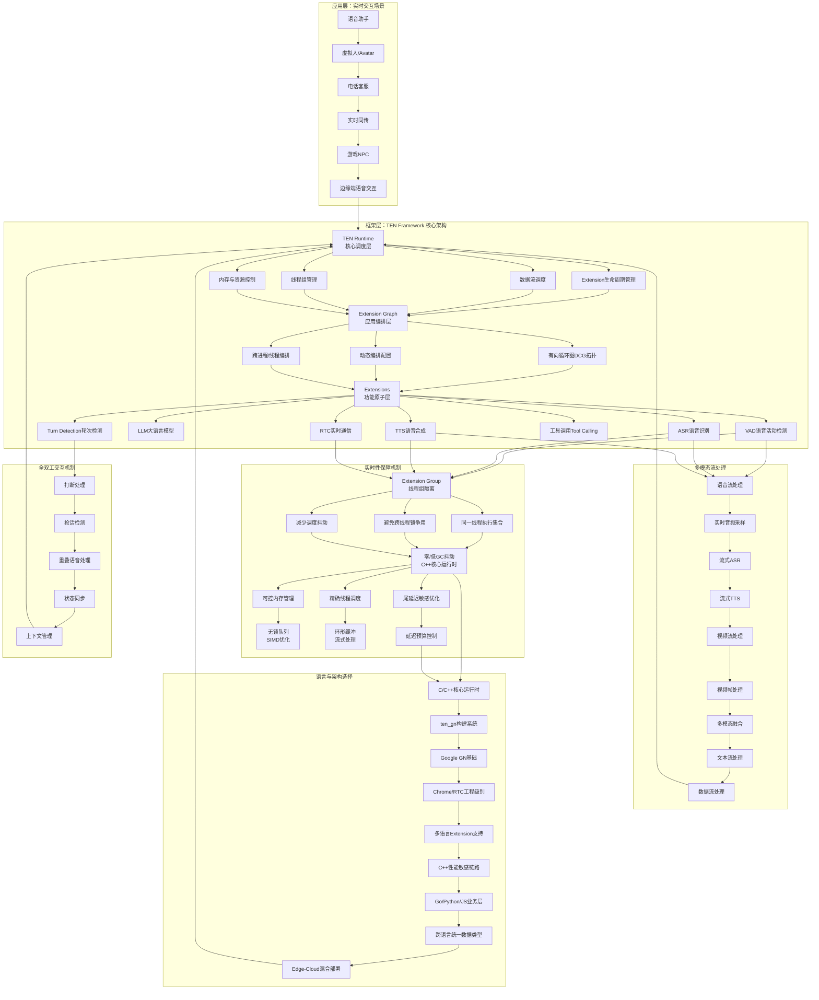
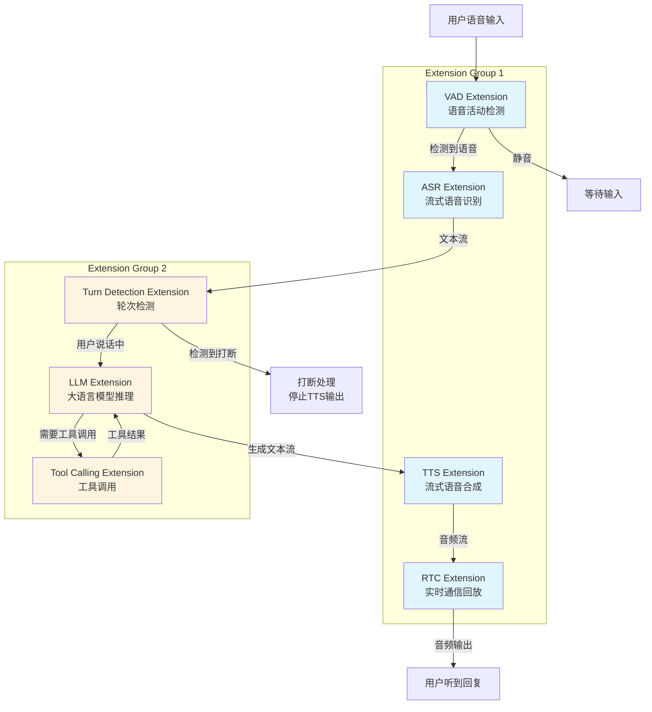
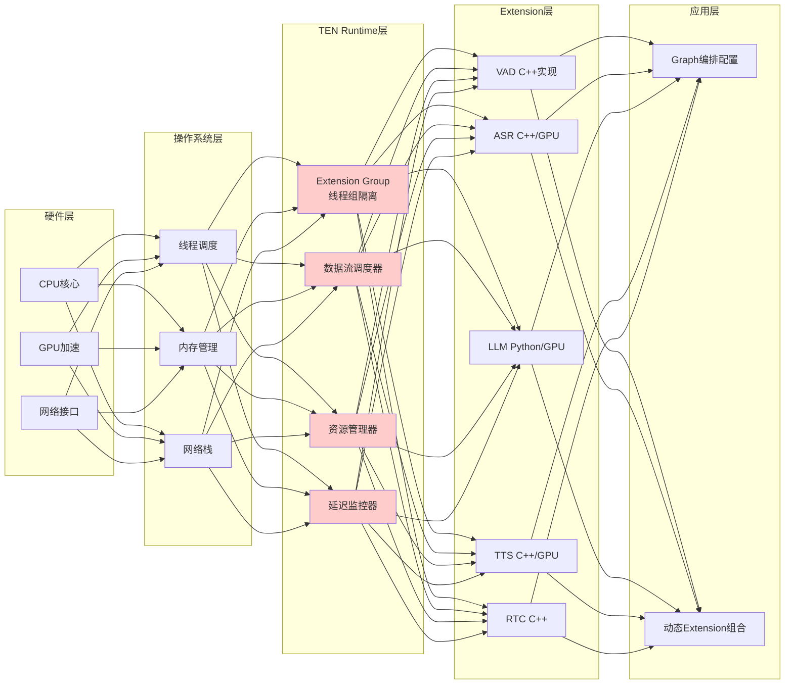

在人工智能快速发展的今天，Agent 框架已成为构建智能交互系统的核心基础设施。从传统的文本对话到实时语音交互，从单模态处理到多模态融合，Agent 框架正在经历从"工具链"到"运行时"的范式转变。TEN Framework（Transformative Extensions Network）作为 Agora 支持的开源实时多模态语音 Agent 框架，代表了这一转变的前沿实践。本文旨在深入探讨实时 Agent 框架的技术现状、TEN Framework 的架构设计与工程化突破，以及实时语音 Agent 技术的未来发展方向。

## Agent 框架现状：从工具链到运行时的范式转变

### 传统 Agent 框架的局限性

当前主流的 Agent 框架（如 LangChain、LangGraph 等）主要面向**文本交互**和**异步任务编排**场景，其设计哲学强调模块化和可组合性，但在实时性、低延迟和强交互场景中面临根本性挑战。

**传统框架的核心特征：**

- **异步批处理模型** - 采用请求-响应模式，适合"一问一答"的对话流程，但无法支持"边听边想边说"的实时交互
- **文本优先架构** - 以文本为第一类对象，语音/视频作为事后转换的输入输出，缺乏原生的多模态流处理能力
- **胶水代码依赖** - 框架提供编排能力，但 ASR/LLM/TTS/RTC 等组件的集成需要大量手工代码，难以实现统一的实时调度
- **延迟敏感性不足** - 缺乏对尾延迟（tail latency）和抖动（jitter）的严格控制，无法满足实时音视频交互的硬实时要求

### 实时语音 Agent 的技术挑战

实时语音 Agent 面临的技术挑战可以概括为三个维度：

**1. 实时性挑战**

- **端到端延迟** - 从用户说话到 Agent 响应，理想情况下应控制在 200-300ms 以内，这要求整个链路（VAD→ASR→LLM→TTS→RTC 回放）的延迟预算极其严格
- **尾延迟控制** - 99 分位延迟（P99 latency）必须可控，避免偶发的高延迟破坏交互体验
- **抖动消除** - 网络波动、系统调度等因素导致的延迟抖动需要通过框架层进行平滑处理

**2. 全双工交互挑战**

- **打断与抢话** - 支持用户随时打断 Agent 的回复，需要实时状态同步和上下文管理
- **重叠语音处理** - 用户说话与 Agent 回复可能重叠，需要智能的 turn-taking 机制
- **状态一致性** - 多个组件（ASR、LLM、TTS）的状态必须实时同步，避免"说错话"或"重复回复"

**3. 多模态融合挑战**

- **流式处理** - 语音、视频、文本、数据流需要统一进入 Runtime，而不是事后拼接
- **资源调度** - CPU、GPU、网络带宽等资源需要在多个模态间动态分配
- **同步机制** - 不同模态的时间戳对齐和同步播放

### 学术与产业的收敛方向

根据近期学术研究，全双工/低时延语音对话系统（full-duplex / synchronous dialogue）正在成为学术与产业快速收敛的方向。相关研究指出，模块化低时延语音 agent pipeline 的核心思路是：**先把链路拆成可流式的模块，然后并行/重叠执行以压缩时延**。这一思路与 TEN Framework 的设计理念高度一致。

## 知识网络图：实时语音 Agent 框架的技术体系

为了更直观地理解实时语音 Agent 框架的技术体系，特别是 TEN Framework 的架构设计，我们构建了以下知识网络图，展示从概念到实现的完整技术链条。

### 实时语音 Agent 框架技术体系知识网络

### TEN Framework 执行流程与数据流

### 实时性保障的架构层次

## TEN Framework 的来历、特点及优势

### 项目背景与设计理念

TEN Framework（Transformative Extensions Network）是 Agora 支持的开源实时多模态语音 Agent 框架，其核心目标不是"再造一个 LangChain"，而是解决**语音/视频/文本/数据流在低时延强交互场景里的工程编排**问题。

**设计哲学：**

TEN Framework 的设计哲学可以概括为"**实时音视频交互 + Agent 编排**"的结合，而非单纯的 LLM 工具链。这一设计理念源于对实时语音交互场景的深入理解：传统的 Agent 框架将实时性"寄托给模型"，而 TEN Framework 将**媒体流处理的实时性问题**放在框架层解决。

### 核心架构：Runtime + Graph + Extensions

TEN Framework 的执行模型可以概括为三个核心层次：

#### 1. TEN Runtime：线程与流的"硬调度层"

**Runtime 的核心职责：**

- **Extension 生命周期管理** - 负责 Extension 的创建、初始化、运行和销毁
- **数据流调度** - 管理 Extension 之间的数据流传递，支持流式处理和批处理两种模式
- **线程组管理** - 通过 Extension Group 机制，将需要严格时序/低延迟的链路放到同一线程/同一调度域
- **资源控制** - 精确控制内存分配、CPU 调度和网络带宽，避免资源竞争导致的延迟抖动

**Extension Group 机制：**

Extension Group 是指定同一线程的执行集合。例如，音频流上的 VAD→ASR→LLM→TTS→RTC 回放链路可以放到同一个 Extension Group，从而：

- **避免跨线程锁争用** - 同一线程内的 Extension 之间通过无锁队列通信，消除锁竞争带来的延迟
- **减少调度抖动** - 同一线程内的 Extension 由同一调度器管理，避免线程切换带来的上下文切换开销
- **保证时序一致性** - 同一线程内的数据流处理顺序严格可控，满足实时音视频的时序要求

这一点体现了"RTC 工程味"：TEN 并不是把实时性"寄托给模型"，而是把**媒体流处理的实时性问题**放在框架层解决。

#### 2. Graph 编排：把 Agent 当成数据流拓扑

TEN Agent 用图配置把 ASR/LLM/TTS/RTC/工具等 Extension 连接成拓扑，不改代码只换图就能换能力组合。这种设计理念与学术界的"模块化低时延语音 agent pipeline"思路一致：**先把链路拆成可流式的模块，然后并行/重叠执行以压缩时延**。

**Graph 编排的优势：**

- **声明式配置** - 通过 YAML 或 JSON 配置文件定义 Extension 之间的连接关系，无需编写胶水代码
- **动态重组** - 运行时可以根据场景动态调整 Graph 拓扑，实现灵活的能力组合
- **可视化调试** - TMAN Designer 提供可视化工具，支持拖拽式编排和实时调试

#### 3. Extensions：功能原子

Extensions 是 TEN Framework 的功能原子，每个 Extension 实现一个独立的功能模块（如 VAD、ASR、LLM、TTS、RTC 等）。Extensions 的设计遵循以下原则：

- **插件化** - Extension 可以独立开发、测试和发布，支持二进制和源码两种发布形式
- **多语言支持** - 支持 C++、Go、Python、JavaScript/TypeScript 等多种语言开发 Extension
- **统一接口** - 所有 Extension 遵循统一的接口规范，确保跨语言 Extension 之间的无缝协作
- **控制平面与数据平面分离** - 支持控制平面（命令调用）和数据平面（数据传输）的清晰分离，便于离线工具检查和后处理

### 代码架构与语言选择：实时性的工程保障

TEN Framework 的代码架构选择体现了对实时性的极致追求。其核心设计理念是：**性能敏感链路用 C/C++，业务逻辑层用高级语言，通过分层优化实现实时性与开发效率的平衡**。

#### 核心 Runtime 与关键 Extension：C/C++ 主导

TEN Framework 的主仓库主体语言是 C/C++，并使用 ten_gn 构建系统（基于 Google GN）编译核心与 C++ 扩展。这一选择的工程意义在于：

**1. 零/低 GC 抖动**

- **可控内存管理** - C++ 的手动内存管理避免了垃圾回收（GC）带来的不可预测延迟，这对于"对尾延迟敏感"的音视频/流式推理场景至关重要
- **精确资源控制** - 开发者可以精确控制内存分配时机和大小，避免 GC 暂停导致的延迟抖动
- **实时性保障** - 在实时音视频处理中，即使是几十毫秒的 GC 暂停也可能导致音频卡顿或视频掉帧

**2. 成熟的 RTC 优化手段复用**

- **SIMD 优化** - 可以直接使用 SIMD（单指令多数据）指令集进行向量化计算，大幅提升音频处理效率
- **环形缓冲** - 复用 RTC 世界成熟的环形缓冲（ring buffer）技术，实现高效的流式数据处理
- **无锁队列** - 使用无锁数据结构（lock-free queue）实现 Extension 之间的高效数据传递，消除锁竞争带来的延迟

**3. Chrome/RTC 工程级别的构建系统**

ten_gn/GN 这套构建系统本质上是"Chrome/RTC 工程级别"的大规模构建与跨平台编译方案，具有以下优势：

- **跨平台一致性** - 确保在不同平台（Linux、Windows、macOS、移动端）上构建的一致性
- **增量编译优化** - 支持高效的增量编译，加快开发迭代速度
- **依赖管理** - 精确的依赖管理确保构建的可重复性和可靠性

#### 多语言 Extension 支持：分层优化的实践

TEN Framework 支持用多语言开发 Extension，并在同一 App 内协作。这种设计体现了"分层优化"的思路：

**性能敏感链路：C++ 实现**

- **VAD（语音活动检测）** - 需要实时处理音频流，对延迟极其敏感
- **Turn Detection（轮次检测）** - 需要实时分析语音特征，判断用户是否在说话
- **RTC（实时通信）** - 需要处理网络数据包，保证低延迟传输
- **媒体预处理** - 音频/视频的编解码、格式转换等操作

**业务/工具/集成层：高级语言快速迭代**

- **RAG（检索增强生成）** - 使用 Python/Go 快速集成向量数据库和检索逻辑
- **数据库操作** - 使用 Go/Python 连接各种数据库，处理业务数据
- **Web API 集成** - 使用 JavaScript/TypeScript 快速对接各种 Web 服务
- **MCP 工具调用** - 使用 Python 集成各种工具和外部服务

**跨语言统一数据类型**

TEN Framework 提供了跨语言的统一数据类型系统，确保不同语言开发的 Extension 之间可以无缝交换数据，避免了序列化/反序列化的性能开销。

#### Edge-Cloud 混合部署：隐私与性能的平衡

TEN Framework 官方定位强调边缘-云组合部署策略：

- **边缘端** - 隐私/低时延小模型放边缘，实现本地快速响应和数据隐私保护
- **云端** - 重推理任务放云，利用云端强大的计算资源处理复杂任务

这种部署策略与最近很多低时延语音 Agent 论文的"分级/并行推理"方向一致，既保证了实时性，又充分利用了云端资源。

### 项目特点与技术特点总结

TEN Framework 的特征可以浓缩为六个关键词：

**1. 实时多模态原生**

语音/视频/文本/数据流统一进入 Runtime，而不是事后拼接。这种原生支持确保了多模态数据的实时同步和统一调度。

**2. Extension + Group + Graph 的三层模块化**

- **Extension** - 功能原子，实现单一职责
- **Group** - 线程组隔离，保证实时链路
- **Graph** - 应用编排，灵活组合能力

这种三层模块化设计既能实现功能复用，又能严格控制实时链路。

**3. 全双工/打断友好**

配套 TEN VAD、Turn Detection 等 Extension，目标是实现"自然对话行为学"，对齐 full-duplex 研究趋势。支持用户打断、抢话、重叠语音等自然交互行为。

**4. Vendor-neutral LLM/ASR/TTS**

示例中集成了 OpenAI、Gemini、DeepSeek、Llama 等多种 LLM，以及各种 ASR 和 TTS 服务，避免了厂商锁定。

**5. 可视化低/无码编排（TMAN Designer）**

提供可视化工具 TMAN Designer，支持拖拽式编排和实时调试，面向应用开发者加速落地。

**6. RTC 级分发网络背书**

如果使用 Agora SD-RTN/RTC，TEN 能直接利用全球低时延媒体通道，实现真正的实时通信。

### 与同类框架的对比分析

近期有开发者将 TEN、LiveKit Agents、Pipecat 等框架进行对比。结合这些对比和学术研究，我们可以从以下维度分析：

#### TEN 相对 LiveKit Agents / Pipecat 的优势

**1. 更"图-插件化"的架构**

Graph + Extension 的一体化设计更像"实时应用操作系统"，而不是单纯 pipeline 代码。这种设计使得系统更加模块化和可扩展。

**2. 多语言/跨端更完整**

核心 C++ 执行，业务层多语言；示例/工具链齐全。这种分层设计既保证了性能，又提供了开发灵活性。

**3. 针对 full-duplex/turn-taking 的工程下沉更深**

VAD/Turn Detection 作为生态的一等公民，提供了完整的全双工交互支持，而不仅仅是框架层面的支持。

#### TEN 相对它们的潜在劣势

**1. 学习曲线偏"RTC 工程风格"**

线程组、数据流、Extension 生命周期这些概念对纯 LLM 开发者不算友好，需要一定的系统编程背景。

**2. 生态体量还在成长**

LiveKit 在 WebRTC 生态与插件社区更大；Pipecat 在 Python 研究/快速实验友好。TEN 的生态还在快速发展中。

**3. 偏语音/多模态，通用 agent（纯文本工具链）不是主战场**

如果只做文本 RAG/工具调用，TEN 的"实时媒体层"会显得过重，不如使用 LangGraph / Pipecat 等轻量框架。

**总结对比：**

LiveKit/Pipecat 更像"语音 Agent 的可编程胶水层"，TEN 更像"为实时多模态 Agent 设计的运行时+插件操作系统"。

## 这类技术的未来设想

### 技术发展趋势

基于对实时语音 Agent 框架的深入分析，我们可以预见以下几个发展方向：

#### 1. 更智能的自适应编排

未来的 Agent 框架可能会引入机器学习技术，根据实时性能指标（延迟、吞吐量、错误率）自动调整 Graph 拓扑和 Extension 组合，实现自适应的性能优化。

**技术路径：**

- **强化学习优化** - 使用强化学习算法优化 Extension 的调度策略和资源分配
- **在线学习** - 根据实际运行数据持续优化系统参数
- **预测性调度** - 基于历史数据预测负载变化，提前调整资源分配

#### 2. 更细粒度的实时性保障

随着硬件性能的提升和算法的优化，未来的框架可能会提供更细粒度的实时性保障机制：

**技术路径：**

- **微秒级延迟控制** - 通过硬件加速和专用指令集实现微秒级的延迟控制
- **确定性调度** - 提供确定性的任务调度，保证延迟的上界
- **硬件协同** - 与专用 AI 芯片（如 NPU）深度集成，实现硬件级的实时性保障

#### 3. 更自然的多模态融合

未来的框架可能会支持更自然的多模态融合，不仅仅是语音、视频、文本的简单组合，而是实现真正的多模态理解和生成：

**技术路径：**

- **统一的多模态表示** - 将不同模态的数据映射到统一的多模态表示空间
- **跨模态注意力机制** - 实现不同模态之间的深度交互和理解
- **多模态生成** - 支持同时生成语音、视频、文本等多种模态的内容

#### 4. 更强大的边缘计算能力

随着边缘计算硬件的发展，未来的框架可能会在边缘端实现更强大的能力：

**技术路径：**

- **边缘大模型** - 在边缘设备上运行更大规模的模型，减少对云端的依赖
- **模型压缩与量化** - 通过模型压缩和量化技术，在保持性能的同时降低计算和存储需求
- **异构计算优化** - 充分利用 CPU、GPU、NPU 等异构计算资源

#### 5. 更完善的开发者生态

未来的框架可能会提供更完善的开发者工具和生态支持：

**技术路径：**

- **更丰富的 Extension 市场** - 建立完善的 Extension 市场，提供丰富的预构建 Extension
- **更好的调试工具** - 提供可视化的性能分析工具，帮助开发者定位性能瓶颈
- **更友好的开发体验** - 提供更简洁的 API 和更完善的文档，降低开发门槛

### 应用场景的拓展

随着技术的不断发展，实时语音 Agent 框架可能会在更多场景中发挥作用：

**1. 智能家居与物联网**

实时语音 Agent 可以作为智能家居的控制中心，实现自然的人机交互。通过边缘部署，可以在保护隐私的同时提供快速响应。

**2. 工业自动化**

在工业场景中，实时语音 Agent 可以帮助工人通过语音指令控制设备，提高工作效率和安全性。

**3. 医疗健康**

实时语音 Agent 可以用于远程医疗、健康咨询等场景，通过自然对话提供医疗建议和健康指导。

**4. 教育培训**

实时语音 Agent 可以作为智能导师，通过自然对话提供个性化的教学和辅导。

### 技术挑战与研究方向

尽管实时语音 Agent 框架已经取得了显著进展，但仍面临一些技术挑战：

**1. 延迟与质量的平衡**

如何在保证低延迟的同时，确保语音识别、理解和生成的准确性，仍是一个需要持续优化的方向。

**2. 资源效率**

如何在有限的边缘计算资源上实现强大的 AI 能力，需要更高效的模型和算法。

**3. 可解释性与可控性**

随着系统复杂度的增加，如何保证系统的可解释性和可控性，避免"黑箱"问题，是一个重要的研究方向。

**4. 安全与隐私**

在实时交互中，如何保护用户隐私和数据安全，同时提供个性化服务，需要更完善的隐私保护机制。

## 结论

TEN Framework 代表了实时多模态语音 Agent 框架的前沿实践，其核心价值在于将"实时音视频交互"与"Agent 编排"有机结合，通过 C/C++ 核心运行时、Extension 插件化架构和图编排机制，实现了"边听边想边说"的全双工语音交互能力。

**TEN Framework 的定位非常清晰：**

它不是传统 LLM Agent 框架的竞争者，而是**实时语音/多模态 Agent 的"底座级运行时"**。

**强项：**

- C/C++ Runtime + Extension Group 的硬实时调度
- 图编排减少胶水代码
- 全双工/打断友好生态
- Agora RTC 网络加持

**适用场景：**

语音助手、虚拟人/Avatar、电话客服、实时同传、游戏 NPC、边缘端语音交互等对实时性要求高的场景。

**不那么适合：**

纯文本、弱实时、快速 demo 的轻量 agent（使用 LangGraph / Pipecat 可能更快）。

**未来展望：**

如果目标是"**以语音/多模态为主入口的智能化服务底座**"，TEN Framework 很可能是目前开源里**工程化程度最高、最贴合 full-duplex 未来方向的一条路线**。

随着人工智能技术的不断发展，实时语音 Agent 框架将在更多场景中发挥重要作用。通过持续的技术创新和工程实践，我们有理由相信，未来的实时语音 Agent 框架将更加智能、高效、易用，为人类提供更自然、更便捷的交互体验。

---

**作者** - Mapoet  
**原文链接** - [https://gnss-x.ac.cn/posts/2025/11/ten-framework-agent.html](https://gnss-x.ac.cn/posts/2025/11/ten-framework-agent.html)  
**版权声明** - Copyright @ 2025 GNSS-X. All Rights Reserved. Mapoet 版权所有.