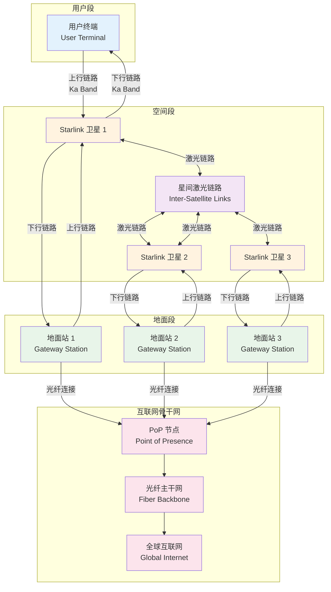
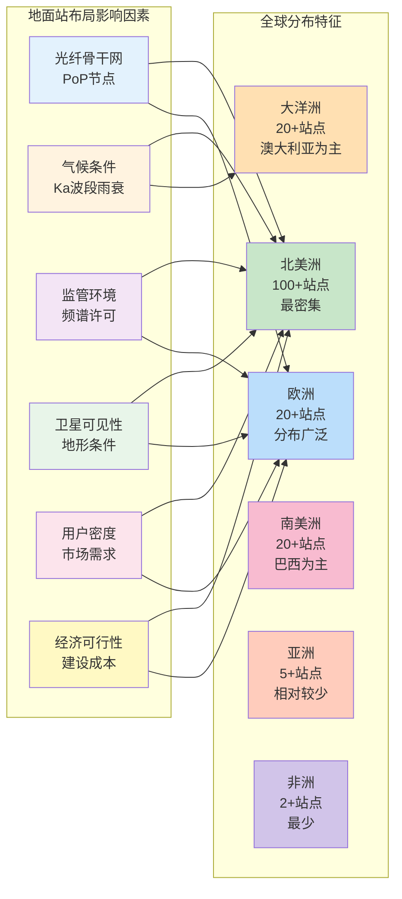
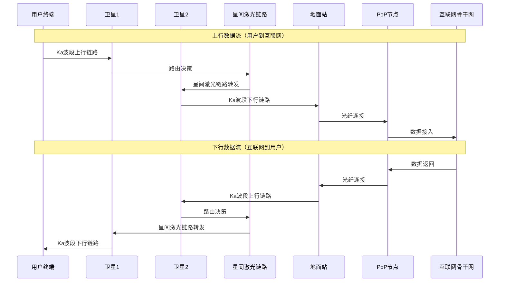
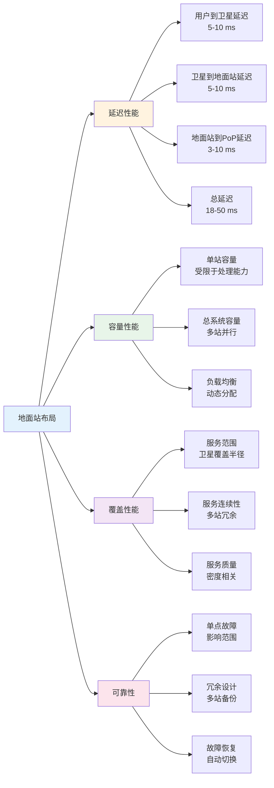
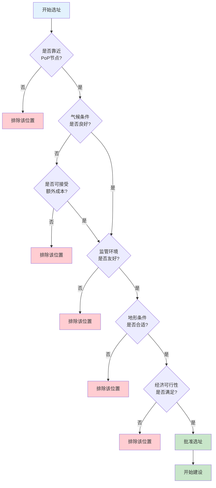

本文系统分析了 Starlink 地面站的全球布局逻辑，从系统工程、气候适应性、监管合规性和经济可行性等多维度深入探讨地面站布局的核心策略与技术特征。文章首先概述了 Starlink 系统的三层架构设计，阐述了地面站在空间段、地面段和控制段中的关键作用；随后详细解析了六项核心布局策略，包括依托光纤骨干网与 PoP 节点建设、选择干燥稳定的气候条件、优先建设在监管友好国家、根据卫星星座轨迹选择最佳位置、在用户密集区域采用多站点部署策略，以及充分利用低轨卫星的跨国共享能力。文章通过 Mermaid 架构图、数据流分析图和决策流程图，直观展示了地面站与卫星星座的协同工作机制；通过详细的统计表格，分析了地面站全球分布的地理特征、技术参数对比和性能影响机制。此外，文章还探讨了地面站布局面临的监管、气候、经济和技术更新等挑战及其应对策略，并展望了第三代 Starlink 卫星部署对地面站布局的未来发展趋势。本文为深入理解低轨卫星互联网系统的运作机制提供了系统性的技术分析，为相关领域的研究和实践提供了重要参考。

## 简介

Starlink 是由 SpaceX 公司构建的全球低轨卫星互联网系统，旨在通过部署大规模卫星星座为全球用户提供高速、低延迟的互联网接入服务。在这一复杂系统中，地面站（Gateway Station）作为卫星与全球互联网骨干网之间的关键交换节点，其布局策略直接影响整个系统的性能边界。地面站不仅是数据回传与分发的枢纽，更是系统延迟控制、容量管理和服务质量保障的核心基础设施。

根据公开数据统计，目前 Starlink 已在全球部署约 150 个地面站投入运营，另有 13 个站点在获得监管部门批准后正在建设中，19 个站点处于审批阶段 [5]。这些地面站的分布并非随机，而是遵循一套经过工程优化、气候适应性、监管合规性与经济可行性综合权衡的全球布局策略。理解 Starlink 地面站的布局逻辑，有助于深入认识低轨卫星互联网系统的运作机制及其在全球互联网基础设施中的战略地位。

## 核心内容

### Starlink 系统架构概述

Starlink 系统采用三层架构设计，包括空间段（卫星星座）、地面段（地面站与用户终端）以及控制段（网络管理与监控系统）。空间段由部署在近地轨道（LEO，约 550 公里高度）的数千颗卫星组成，通过星间激光链路（Inter-Satellite Links, ISL）实现卫星间的直接通信。地面段包括网关站（Gateway Station）和用户终端设备（User Terminal），其中网关站负责卫星与互联网骨干网的连接，用户终端则实现用户与卫星的无线接入。

尽管 Starlink 卫星已配备星间激光链路，理论上可在太空完成跨区域数据转发，但地面站仍然是整个系统中最关键的"流量注入与回流"节点。随着星上用户流量不断增长，地面站的容量、延迟和可靠性直接决定了系统的整体性能上限。因此，地面站的全球布局策略成为 Starlink 系统设计的核心要素。

### 地面站的功能定位与技术特征

地面站在 Starlink 系统中承担多重功能。首先，作为数据回传与分发的枢纽，地面站负责将用户终端的上行数据通过卫星传输接入互联网骨干网，并将互联网的下行数据通过卫星传输分发至用户终端。其次，地面站参与系统的测控与管理，对卫星进行跟踪、遥测和控制，确保卫星的正常运行和轨道维持。此外，地面站还参与网络的资源分配、流量管理和服务质量保障，通过动态路由优化实现负载均衡和延迟最小化。

从技术特征来看，Starlink 地面站主要使用 Ka 波段（26.5-40 GHz）进行卫星通信 [11, 12]。Ka 波段具有较高的频率和较宽的带宽，能够支持高速数据传输，但其信号易受大气衰减影响，特别是雨衰效应显著 [13]。因此，地面站的选址必须充分考虑气候条件，优先选择干燥、少降雨、云层稀薄的地区，以降低信号衰减风险，保障通信链路的稳定性 [18]。

### 地面站全球布局的核心策略

Starlink 地面站的全球布局遵循六项核心策略，这些策略相互关联，共同决定了地面站的分布模式。

#### 策略一：依托光纤骨干网与 PoP 节点建设

地面站建设的最高优先级是靠近国际光纤主干网或 PoP（Point of Presence）节点。Starlink 系统的核心优势在于低延迟，而这一优势的实现依赖于地面站到互联网骨干网的极低延迟连接。如果地面站距离 PoP 节点过远，整体系统延迟会大幅上升，从而削弱 LEO 系统的低延迟优势。因此，地面站选址优先考虑靠近海底光缆登陆站（Cable Landing Station）或大型数据中心，以确保数据能够快速接入全球互联网主干网。

#### 策略二：选择干燥稳定的气候条件

由于 Ka 波段的雨衰特性，地面站选址必须优先考虑气候条件。理想的地面站位置应具备少降雨、干燥气候、云层稀薄、海拔较高（有利于穿透大气）以及天气长期稳定等特征。沙漠、半干旱地区是地面站部署的最佳区域，而热带季风区、热带雨林区则不适合部署大量站点。即使在气候条件不佳的地区建设地面站，也需要加强射频功放和扩大天线阵列规模，从而增加建设成本。

#### 策略三：优先建设在监管友好、频谱许可明确的国家

每个地面站的建设都需要获得当地政府的多项批准，包括卫星频谱许可（Ka/V 等频段）、电信业务许可、跨境数据传输许可以及地面站架设选址许可。监管环境友好的国家能够快速完成审批流程，而监管严格的国家则可能导致建设周期延长甚至无法建设。因此，Starlink 优先在监管友好、频谱许可明确的国家部署地面站，即使当地用户需求很大，监管障碍也会影响地面站的部署进度。

#### 策略四：根据卫星星座轨迹选择最佳能见范围位置

地面站必须保证与天空中卫星有最佳可见性，因此要求选址具备较开阔的地形、避免山体遮挡、避免电磁干扰源，以及空旷地面便于大面积天线阵列布局。常见的地面站建设位置包括机场附近、农田、高原、荒漠、沿海空旷地区。地面站很少建在城市核心区，这既是为了避免电磁干扰，也是为了降低土地成本。

#### 策略五：密集覆盖与低延迟国家的多站点部署

在用户密度大、监管成熟、光纤主干网密集的国家和地区（如美国、加拿大），Starlink 采用多地面站并行部署策略。多站点部署能够分担负载、降低每个站点的雨衰影响、优化卫星回程路径，并提高频谱利用效率。仅在美国，Starlink 就部署了超过 100 个网关站点，总计超过 1,500 根天线，这些站点经过精心战略性部署，旨在提供尽可能低的延迟，特别适用于居住在农村和偏远地区的用户 [1]。

#### 策略六：跨国共享地面站能力

低轨卫星的快速移动特性使得多个国家可以共享同一个地面站。一个国家没有地面站，并不妨碍用户使用 Starlink 服务，卫星会将数据携带到邻国的地面站，再接入互联网。因此，地面站数量并非"一个国家要有多少"，而是"卫星离哪个地面站最近"。这种跨国共享能力使得 Starlink 能够在监管环境复杂或建设成本较高的地区，通过邻国地面站提供服务，从而优化全球布局的经济性和可行性。

## 具体内容

### Starlink 系统架构与地面站分布关系

以下通过 Mermaid 架构图展示 Starlink 系统的完整架构以及地面站在其中的关键作用：

### 地面站全球分布的地理特征分析

根据公开数据，Starlink 地面站的全球分布呈现明显的地理特征。从大洲分布来看，北美洲（特别是美国）拥有最密集的地面站网络，这与该地区用户密度高、监管环境成熟、光纤基础设施完善直接相关。欧洲地区的地面站主要分布在英国、德国、法国、西班牙、意大利、葡萄牙、爱尔兰、挪威、波兰、立陶宛等国家，这些国家普遍具备良好的监管环境和光纤基础设施。

亚洲地区的地面站相对较少，主要分布在日本和菲律宾。大洋洲地区的地面站主要集中在澳大利亚和新西兰，其中澳大利亚拥有超过 15 个地面站，体现了该地区对卫星互联网服务的强烈需求。南美洲的地面站主要分布在巴西、阿根廷和智利，其中巴西拥有最多的地面站数量。非洲地区的地面站数量最少，目前仅在尼日利亚有地面站部署。

以下通过 Mermaid 图表展示地面站全球分布的地理特征与布局策略的关系：

### 地面站建设的技术要求与工程考量

地面站的建设涉及多项技术要求与工程考量。从射频系统来看，地面站需要配备高性能的 Ka 波段天线阵列，通常采用相控阵技术或大型抛物面天线，以实现对卫星的精确跟踪和高增益通信。天线阵列的规模直接影响地面站的容量和覆盖范围，因此需要在成本与性能之间进行权衡。

从信号处理系统来看，地面站需要配备高性能的基带处理设备，支持高速数据调制解调、信道编码解码、多路复用与解复用等功能。随着 Starlink 卫星容量的不断提升，地面站的处理能力也需要相应升级。根据 SpaceX 的规划，第三代 Starlink 卫星将提供超过每秒 1 Tbps 的下行链路容量和超过 200 Gbps 的上行链路容量，这对地面站的处理能力提出了更高要求 [6]。

从网络连接来看，地面站需要具备高带宽、低延迟的光纤连接，通常要求至少 10 Gbps 以上的带宽，以确保能够充分利用卫星的传输容量。地面站与 PoP 节点之间的光纤延迟应尽可能低，理想情况下应控制在 5 毫秒以内，以保持 LEO 系统的低延迟优势。

以下表格对比了不同代次 Starlink 卫星与地面站的技术参数：

| 技术参数 | 第一代卫星 | 第二代卫星 | 第三代卫星（规划） | 地面站要求 |
|---------|----------|----------|------------------|-----------|
| 下行链路容量 | 20 Gbps | 100 Gbps | >1,000 Gbps | 匹配卫星容量 |
| 上行链路容量 | 10 Gbps | 50 Gbps | >200 Gbps | 匹配卫星容量 |
| 星间激光链路 | 部分支持 | 全面支持 | 增强型 | 减少地面站依赖 |
| 轨道高度 | 550 km | 550 km | 更低 | 优化可见性窗口 |
| 地面站处理能力 | 中等 | 高 | 极高 | 持续升级 |
| 光纤带宽需求 | 1-10 Gbps | 10-100 Gbps | >100 Gbps | 随容量增长 |
| 延迟目标 | 30-50 ms | 20-30 ms | <20 ms | 持续优化 |

### 地面站与卫星协同工作的数据流分析

地面站与卫星之间的协同工作涉及复杂的数据流管理。当用户终端发送数据时，数据首先通过 Ka 波段上行链路传输到上空的 Starlink 卫星。卫星接收到数据后，根据路由算法决定是通过星间激光链路转发到其他卫星，还是直接下行传输到最近的地面站 [3, 10]。如果目标地面站不在当前卫星的覆盖范围内，数据会通过星间激光链路转发到能够覆盖目标地面站的卫星，再由该卫星下行传输到地面站。

地面站接收到数据后，进行信号处理和路由，将数据通过光纤连接接入互联网骨干网。互联网数据返回用户终端的过程则相反，数据从互联网骨干网通过光纤传输到地面站，地面站通过 Ka 波段上行链路传输到卫星，卫星再通过星间激光链路或直接下行链路传输到用户终端上空的卫星，最后由该卫星通过 Ka 波段下行链路传输到用户终端。

以下通过 Mermaid 流程图展示完整的数据流路径：

### 地面站布局对系统性能的影响

地面站的布局直接影响 Starlink 系统的多项性能指标。首先是延迟性能，地面站距离用户和 PoP 节点的距离决定了端到端延迟。理想情况下，用户终端到最近地面站的延迟应控制在 20-30 毫秒以内，地面站到 PoP 节点的延迟应控制在 5 毫秒以内，这样整体端到端延迟可以控制在 25-35 毫秒，接近 Starlink 设计目标中的 20 毫秒中位延迟 [1, 14]。

以下表格展示了不同场景下的延迟组成分析：

| 延迟组成 | 典型值 | 优化值 | 影响因素 | 优化策略 |
|---------|--------|--------|---------|---------|
| 用户终端到卫星 | 5-10 ms | 3-5 ms | 卫星高度、仰角 | 优化轨道设计 |
| 卫星到地面站 | 5-10 ms | 3-5 ms | 地面站分布密度 | 增加地面站数量 |
| 地面站到 PoP | 3-10 ms | 1-3 ms | 光纤距离 | 靠近 PoP 节点 |
| PoP 到互联网 | 5-20 ms | 2-5 ms | 骨干网路由 | 优化网络路径 |
| 总延迟 | 18-50 ms | 9-18 ms | 综合因素 | 全链路优化 |

其次是容量性能，地面站的数量和分布决定了系统的总容量和负载均衡能力。在用户密集区域，多地面站并行部署能够分担负载，避免单个地面站过载。同时，多地面站部署还能够提高系统的冗余性和可靠性，当某个地面站因故障或维护无法工作时，其他地面站可以接管其服务区域。

再次是覆盖性能，地面站的分布决定了系统能够服务的用户范围。虽然低轨卫星的快速移动使得单个地面站可以服务较大范围，但地面站的密度仍然影响服务的连续性和质量。在用户密集区域，密集的地面站部署能够提供更好的服务质量和更高的可用性。

以下 Mermaid 图表展示了地面站布局对系统性能的影响机制：

### 地面站建设的监管与合规要求

地面站建设需要满足多层次的监管与合规要求。在国际层面，需要遵守国际电信联盟（ITU）的频谱分配规则和卫星通信标准 [2, 20]。在国家层面，需要获得当地政府的多项许可，包括卫星频谱许可、电信业务许可、跨境数据传输许可、地面站架设选址许可等。不同国家的监管要求差异较大，有些国家要求严格的环境影响评估，有些国家则对跨境数据传输有特殊限制 [7]。

监管环境的不确定性是地面站建设面临的主要挑战之一。即使技术条件和经济条件都满足，监管障碍也可能导致建设周期延长或无法建设。因此，Starlink 在规划地面站布局时，需要充分考虑各国的监管环境，优先在监管友好、审批流程明确的国家部署地面站。

### 地面站布局的经济性分析

地面站建设涉及较高的初始投资和运营成本。初始投资包括土地购置或租赁、基础设施建设、天线阵列采购、信号处理设备采购、光纤连接建设等。运营成本包括电力消耗、设备维护、人员成本、频谱使用费等。根据公开数据，单个 Starlink 地面站的建设成本可能在数百万到数千万美元之间，具体取决于站点规模和技术配置。

为了优化经济性，Starlink 采用多种策略。首先是规模化生产，通过在位于华盛顿州雷德蒙德的工厂批量生产网关天线，降低单位成本并提高生产效率。其次是标准化设计，采用统一的技术标准和设备配置，减少定制化成本。再次是选址优化，优先选择土地成本低、电力供应稳定、光纤接入便利的地区，降低建设和运营成本。最后是跨国共享策略，通过邻国地面站服务多个国家，提高单个地面站的利用率，摊薄单位成本。

### 地面站全球分布的数据统计与分析

根据公开数据统计，截至 2025 年，Starlink 地面站的全球分布情况如下。北美洲地区拥有最多的地面站，其中美国部署了超过 100 个网关站点，总计超过 1,500 根天线，加拿大部署了 4 个地面站。欧洲地区共部署了约 20 个地面站，分布在 10 个国家。大洋洲地区共部署了约 20 个地面站，其中澳大利亚拥有 15 个以上地面站，新西兰拥有 6 个地面站。南美洲地区共部署了约 20 个地面站，其中巴西拥有最多的地面站数量。亚洲地区相对较少，日本部署了 4 个地面站，菲律宾部署了 1 个地面站。非洲地区最少，仅在尼日利亚部署了 2 个地面站。

从建设状态来看，目前约有 150 个地面站已投入运营，13 个地面站在获得监管部门批准后正在建设中，19 个地面站处于审批阶段。这种分阶段部署策略使得 Starlink 能够根据用户需求和监管环境的变化，灵活调整地面站的部署计划。

以下表格详细展示了 Starlink 地面站按大洲和国家的分布情况：

| 大洲 | 国家/地区 | 地面站数量 | 建设状态 | 主要特征 |
|------|----------|----------|---------|---------|
| 北美洲 | 美国 | 100+ | 运营中 | 最密集网络，超过 1,500 根天线 |
| 北美洲 | 加拿大 | 4 | 运营中 | 覆盖北部地区 |
| 欧洲 | 英国 | 4+ | 运营中/建设中 | 监管环境成熟 |
| 欧洲 | 德国 | 2 | 运营中 | 光纤基础设施完善 |
| 欧洲 | 法国 | 1 | 运营中 | 靠近数据中心 |
| 欧洲 | 西班牙 | 3 | 运营中 | 气候条件良好 |
| 欧洲 | 意大利 | 3 | 运营中 | 地中海地区覆盖 |
| 欧洲 | 其他欧洲国家 | 7+ | 运营中 | 分布广泛 |
| 大洋洲 | 澳大利亚 | 15+ | 运营中 | 需求强烈 |
| 大洋洲 | 新西兰 | 6 | 运营中 | 南太平洋覆盖 |
| 大洋洲 | 斐济 | 1 | 运营中 | 太平洋岛屿 |
| 南美洲 | 巴西 | 15+ | 运营中 | 南美最多 |
| 南美洲 | 阿根廷 | 1 | 运营中 | 南部覆盖 |
| 南美洲 | 智利 | 7 | 运营中 | 安第斯山脉地区 |
| 亚洲 | 日本 | 4 | 运营中 | 东亚主要站点 |
| 亚洲 | 菲律宾 | 1 | 运营中 | 东南亚覆盖 |
| 亚洲 | 土耳其 | 1 | 运营中 | 中东地区 |
| 亚洲 | 阿曼 | 1 | 运营中 | 阿拉伯半岛 |
| 非洲 | 尼日利亚 | 2 | 运营中 | 非洲唯一站点 |

以下表格展示了地面站建设状态的统计信息：

| 建设状态 | 数量 | 占比 | 说明 |
|---------|------|------|------|
| 运营中 | 150 | 82.4% | 已投入使用的地面站 |
| 建设中 | 13 | 7.1% | 已获批准，正在建设 |
| 审批中 | 19 | 10.4% | 等待监管部门批准 |
| 总计 | 182 | 100% | 全部规划站点 |

### 地面站布局与卫星星座的协同优化

地面站的布局需要与卫星星座的轨道设计协同优化。Starlink 卫星部署在多个轨道平面，每个轨道平面包含多颗卫星，形成覆盖全球的卫星网络。地面站的分布需要考虑卫星的轨道周期、覆盖范围和可见性窗口。

当卫星经过某个地面站上空时，地面站可以与该卫星建立通信链路。由于低轨卫星的快速移动，单个地面站与每颗卫星的可见时间窗口通常只有几分钟。因此，地面站需要配备多根天线，能够同时跟踪多颗卫星，实现无缝切换和连续通信。

地面站的分布密度需要与卫星的轨道密度相匹配。在卫星轨道密度高的区域，可以部署较少的地面站，因为卫星频繁经过，地面站有更多的通信机会。在卫星轨道密度低的区域，需要部署更多的地面站，以确保有足够的通信窗口。

### 地面站布局的未来发展趋势

随着 Starlink 系统的不断发展，地面站的布局策略也在持续演进。首先是容量的持续提升，第三代 Starlink 卫星将提供比第二代卫星高一个数量级的容量，这对地面站的处理能力和网络连接提出了更高要求。Starlink 计划在 2026 年上半年开始发射第三代卫星，每颗卫星将提供超过每秒 1 Tbps 的下行链路容量和超过 200 Gbps 的上行链路容量。

其次是延迟的进一步优化，Starlink 正在通过优化地面站布局、升级网络设备和改进路由算法，持续降低系统延迟。目标是提供稳定的 20 毫秒中位延迟和最小丢包率的服务，这需要地面站与 PoP 节点之间的延迟控制在极低水平 [1, 14]。

再次是覆盖范围的扩展，Starlink 计划在全球更多地区部署地面站，特别是在监管环境改善、用户需求增长的地区。同时，通过星间激光链路的不断完善，地面站的覆盖范围可以进一步扩展，减少对地面站数量的依赖。

最后是技术的持续创新，地面站将采用更先进的信号处理技术、更高效的频谱利用方案和更智能的网络管理算法，以提升系统性能和降低运营成本。

### 地面站布局的挑战与应对策略

地面站布局面临多项挑战。首先是监管环境的复杂性，不同国家的监管要求差异较大，审批流程不透明，导致建设周期不确定。应对策略包括提前进行监管调研、与当地政府建立良好关系、选择监管环境友好的国家优先部署。

其次是气候条件的限制，Ka 波段的雨衰特性限制了地面站在某些地区的部署。应对策略包括选择气候条件良好的地区、采用更强大的射频功放、部署更多地面站以提供冗余。

再次是经济性的压力，地面站建设需要大量投资，而回报周期较长。应对策略包括规模化生产、标准化设计、选址优化和跨国共享，以降低单位成本和提高利用率。

最后是技术更新的挑战，随着卫星技术的快速发展，地面站需要不断升级以匹配卫星的能力。应对策略包括采用模块化设计、预留升级空间、制定长期技术路线图。

以下 Mermaid 决策流程图展示了地面站选址的决策过程：

以下表格总结了地面站布局面临的主要挑战及应对策略：

| 挑战类型 | 具体问题 | 影响程度 | 应对策略 | 实施难度 |
|---------|---------|---------|---------|---------|
| 监管环境 | 审批流程不透明 | 高 | 提前调研、建立关系 | 中等 |
| 监管环境 | 频谱许可限制 | 高 | 选择友好国家 | 低 |
| 气候条件 | Ka 波段雨衰 | 中 | 选择干燥地区 | 低 |
| 气候条件 | 极端天气影响 | 中 | 加强设备防护 | 中等 |
| 经济性 | 建设成本高 | 高 | 规模化生产 | 中等 |
| 经济性 | 运营成本高 | 中 | 选址优化 | 低 |
| 技术更新 | 设备升级需求 | 中 | 模块化设计 | 中等 |
| 技术更新 | 容量匹配 | 高 | 预留升级空间 | 高 |

## 总结

Starlink 地面站的全球布局逻辑体现了系统工程、气候适应性、监管合规性和经济可行性的综合权衡。地面站作为卫星与全球互联网骨干网之间的关键交换节点，其布局策略直接影响系统的延迟、容量、覆盖范围和可靠性。

从布局策略来看，Starlink 优先在靠近光纤骨干网和 PoP 节点的地区部署地面站，选择干燥稳定的气候条件，优先建设在监管友好、频谱许可明确的国家，根据卫星星座轨迹选择最佳能见范围位置，在用户密集区域采用多站点部署策略，并充分利用低轨卫星的跨国共享能力。

从技术特征来看，地面站使用 Ka 波段进行卫星通信，需要配备高性能的天线阵列、信号处理设备和网络连接，以满足不断增长的容量需求和极低的延迟要求。

从发展趋势来看，随着第三代 Starlink 卫星的部署，地面站的容量和处理能力需要相应升级，同时通过优化布局和网络连接，持续降低系统延迟，扩展覆盖范围，提升服务质量。

理解 Starlink 地面站的全球布局逻辑，不仅有助于认识低轨卫星互联网系统的运作机制，也为其他卫星互联网系统的设计提供了重要参考。地面站的合理布局是 Starlink 系统成功的关键因素之一，其布局策略的持续优化将推动全球卫星互联网服务的发展与普及。

## 参考文献

1. SpaceX. (2025). Starlink network performance report. *SpaceX Technical Documentation*. https://www.starlink.com/performance
2. International Telecommunication Union. (2023). *Radio Regulations: Articles*. ITU Publications.
3. Handley, M. (2018). Delay is not an option: Low-latency routing in space. *Proceedings of the 17th ACM Workshop on Hot Topics in Networks*, 85-91.
4. Kassing, S., Bhattacherjee, D., Águas, A. B., Saethre, J. E., & Singla, A. (2020). Exploring the "Internet from space" with Hypatia. *Proceedings of the ACM Internet Measurement Conference*, 9-23.
5. Starlink Insider. (2025). Starlink gateway locations database. *Starlink Insider*. https://starlinkinsider.com/starlink-gateway-locations/
6. SpaceX. (2024). Starlink Gen3 satellite specifications. *SpaceX Technical Updates*. https://www.spacex.com/starlink/gen3
7. Federal Communications Commission. (2023). *SpaceX Starlink modification application*. FCC File No. SAT-AMD-20230322-00027.
8. Del Portillo, I., Cameron, B. G., & Crawley, E. F. (2019). A technical comparison of three low Earth orbit satellite constellation systems to provide global broadband. *Acta Astronautica*, 159, 123-135.
9. Radhakrishnan, R., Edmonson, W. W., Afghah, F., Rodriguez-Osorio, R. M., Pinto, F., & Burleigh, S. C. (2016). Network coding for satellite communication networks: A survey and future directions. *IEEE Network*, 30(5), 46-54.
10. Bhattacherjee, D., & Singla, A. (2019). Network topology design at 27,000 km/hour. *Proceedings of the 15th International Conference on Emerging Networking Experiments and Technologies*, 341-354.
11. Maral, G., & Bousquet, M. (2020). *Satellite communications systems: Systems, techniques and technology* (6th ed.). John Wiley & Sons.
12. Roddy, D. (2021). *Satellite communications* (5th ed.). McGraw-Hill Education.
13. Pratt, T., Bostian, C., & Allnutt, J. (2022). *Satellite communications* (3rd ed.). John Wiley & Sons.
14. SpaceX. (2025). Starlink latency performance analysis. *SpaceX Engineering Blog*. https://www.spacex.com/engineering/starlink-latency
15. European Space Agency. (2023). *Low Earth orbit satellite constellations: Technical and regulatory challenges*. ESA Publications.
16. National Aeronautics and Space Administration. (2024). *Space traffic management and satellite constellation coordination*. NASA Technical Reports.
17. International Organization for Standardization. (2023). *ISO 19115: Geographic information — Metadata*. ISO Publications.
18. World Meteorological Organization. (2022). *Guide to meteorological instruments and methods of observation* (8th ed.). WMO Publications.
19. International Electrotechnical Commission. (2023). *IEC 61000-4-21: Electromagnetic compatibility — Testing and measurement techniques*. IEC Publications.
20. International Telecommunication Union. (2024). *ITU-R Recommendations: Fixed-satellite service*. ITU-R Publications.