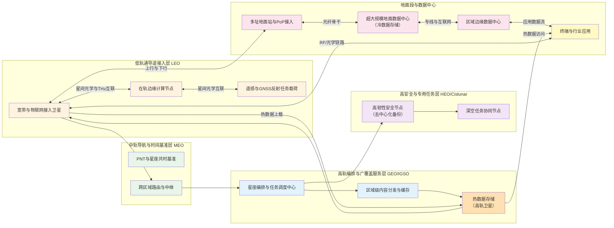
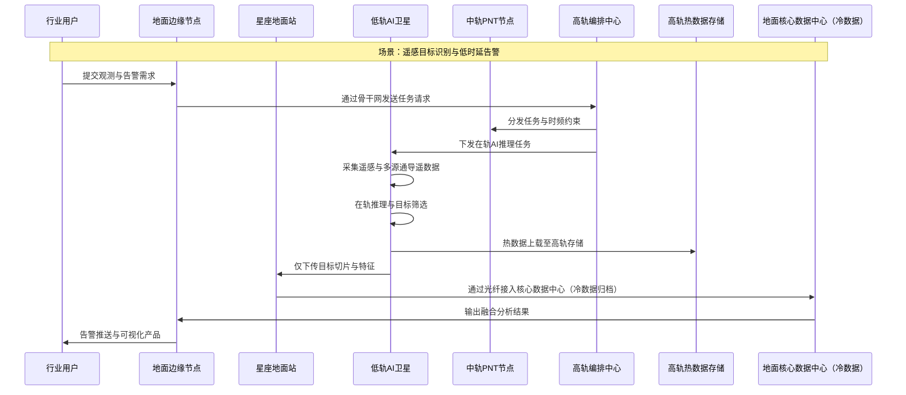
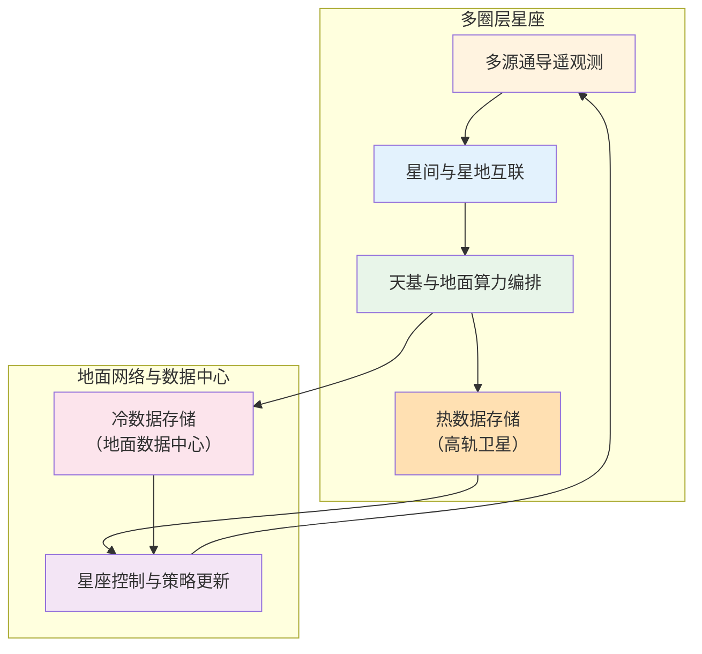

随着全球航天与信息技术的深度融合，卫星星座的功能已从传统的"通导遥"（通信、导航、遥感）一体化，演进至"通导遥算"（增加天基算力），并进一步迈向"通导遥算数"（通信、导航、遥感、算力、数据及存储）一体化阶段。本文在系统工程视角下，系统梳理了全球太空计算与空间数据中心的发展趋势，提出了一种基于轨道圈层功能分工的多圈层通导遥算数星座总体方案。核心设计理念包括：轨道最高段卫星承担数据存储功能，轨道中段卫星承担计算功能，轨道低段卫星承担与地面站通信功能，形成分层分圈的功能分配策略。考虑到人类活动主要集中在地面，信号衰减与传播时延成为关键约束，该设计优先确保低轨卫星与地面站的可靠连接。同时，本文分析了美国与中国在地面站需求与满足能力方面采取的不同战略思路，指出地面站布局、光纤接入与监管环境等"看得见的工程"是决定天基算力能否真正嵌入全球互联网与国家数字基础设施的关键因素。文章展示了星地一体的系统架构与数据路径，并围绕链路、算力、数据、调度与安全等方面总结了该体系的关键技术与核心计算需求。

## 一、简介

在"通导遥"一体化已经成为共识的基础上，全球航天与信息产业正在快速迈向"通导遥算"乃至"通导遥算数"阶段。这里的"数"不仅指数据本身，也涵盖数据存储、分发、治理与可信运行环境，将通信、导航、遥感、算力与数据视为同等重要的基础设施资源（窦成龙等，2024）。

过去五年内，太空计算与空间数据中心的概念从设想走向实证。美国初创公司 StarCloud 于 2025 年 11 月发射搭载英伟达 H100 GPU 与谷歌 Gemini 大模型的试验卫星 Starcloud-1，目标是在太空构建吉瓦（GW）级分布式数据中心，用于在轨 AI 计算（NVIDIA，2025）。欧盟在 ASCEND 等项目下，将"太空数据中心"纳入"地平线"绿色转型战略，研究利用近真空、低温环境实现高能效计算与就近处理空间数据，目前已完成可行性论证（ASCEND，2025）。阿联酋的 Madari Space 规划在 2026 年前发射首个轨道数据中心，并在 2028 年前部署 8000 个太空节点，以满足直接在轨处理原始卫星数据的需求（Madari Space，2025）。

中国方面，国星宇航等企业已发射首批"天基算力星座"。根据公开报道，国星宇航于 2024 年 11 月启动"星算计划"，并于 2025 年 5 月成功发射全球首个太空计算星座，在轨集群算力达到 5 POPS（Peta Operations Per Second），星间激光通信速率最大可达 100 Gbps，服务遥感计算、低空经济与在轨 AI 推理等应用（国星宇航，2025）。与之并行，美国太空发展局正在建设以光学互联为基础的扩散低轨作战架构（PWSA），将数百颗低轨卫星组成"空间数据网"（SDN）骨干，通过统一的光通信终端标准（OCT）实现多厂商、多轨道的互操作网状网（SDA，2024）。

另一方面，以 Starlink 为代表的宽带星座实践已经清晰表明，地面站仍然是端到端时延与吞吐量的"性能天花板"。要想实现支持在线游戏等对时延极为敏感的应用，必须把天基链路牢牢"插"进各国互联网骨干网与 PoP（Point of Presence）节点。空间算力和存储如果与地面骨干网解耦，往往只能服务空间场景本身，而难以直接改善地面互联网体验。

在这种现实约束下，简单的"把数据中心搬到太空"并不能自动带来算力主权或 AI 军备优势。更合理的路径是围绕通导遥基础能力，在多圈层星座架构中精细分配通信、导航、遥感、算力与数据功能，通过星地一体化的系统设计，在可信可控的前提下逐步实现"通导遥算数"一体化。本文在统一架构视角下，提出一种面向中长期的多圈层星座功能展望与设计框架，并结合当前国际工程实践，讨论其关键技术与核心计算问题。

## 二、核心架构

### 2.1 从通导遥到通导遥算数的功能演进

可以将通导遥通算数的演进理解为五个层次的逐级叠加。

- 通  
  卫星与地面之间的宽带、窄带与专用通信能力，涵盖全球互联网接入、专用政企链路、星间与星地链路等。

- 导  
  以 PNT 能力为核心的导航与授时服务，包括类 GNSS 星座、区域增强系统以及面向星座内部控制的高精度时间与轨道信息。

- 遥  
  各类遥感与在轨探测能力，包括光学、红外、微波、GNSS 掩星与反射、空间环境监测等，构成“感知即服务”的基础。

- 算  
  将原本集中在地面的计算任务一部分前移至轨道，实现在轨 AI 推理、遥感预处理、星间协同控制与任务规划等。当前全球多家企业与机构已经开展以 GPU 和专用 AI 加速器为核心的在轨计算实验与星座部署（王家耀等，2024）。

- 数  
  将数据视为与算力同等重要的基础资源，包含数据采集、融合、存储、分发、索引与可信治理。这里的“数”既包括轨道上的缓存与短期存储，也包括地面超大规模数据中心、分布式存储网络以及面向多方的可信协同框架。

在这一演进中，真正的范式变化并非单纯增加某一功能，而是把通、导、遥、算、数统一纳入一个按轨道圈层分工协同、按安全域分层管理、按业务场景动态编排的整体架构之中。

### 2.2 多圈层通导遥算数星座总体方案

从轨道与功能的耦合角度，可以将未来的通导遥算数星座划分为四个主要圈层，并通过星地一体网络实现协同。

- 低轨通导遥接入层  
  高度约数百公里，采用大规模星座形态，承担宽带互联网接入、物联网回传、遥感观测与在轨边缘计算等功能。典型代表包括 Starlink、OneWeb 以及各类商业遥感与 AI 星座。该圈层通过高密度星间光链路与未来可能的太赫兹（THz）互联构成空间网状网，是"太空数据网"的主干。考虑到人类活动主要集中在地面，该圈层需要优先考虑信号衰减与传播时延，确保与地面站的可靠连接。

- 中轨导航与时间基准层  
  高度约两万公里量级，承担精密 PNT 与星座共同时频的作用，类似当前的 GPS、北斗、Galileo 等全球导航系统。该圈层还可以挂载部分中继与路由功能，为低轨星座提供跨区域的时延受控通道与空间参考框架。

- 高轨编排与广覆盖服务层  
  包括地球同步轨道与倾斜同步轨道，主要承担广域广播、多播、关键控制信令下发、区域级缓存以及热数据存储等功能。该圈层可作为多星座、多营运商之间的"星际交换机"，同时为偏远地区提供下行增强服务。热数据（频繁访问、需要快速响应的数据）存储在该圈层，利用高轨卫星的广域覆盖能力实现全球服务，特别适用于地面站主要在境内、全球互联网根节点少、受到数据跨国境限制的场景。

- 高安全冗余与专用任务层  
  可以包括高椭圆轨道、月球轨道甚至地月空间的专用节点，更多承担战略冗余、深空探测协同与特殊用途计算任务。考虑到维护成本与安全边界，这一层的长期大容量存储并不一定比地面更优，但可作为极端场景下的数据与算力备份。在存储去中心化设计中，该层可承担部分关键数据的冗余存储，以应对卫星通算存功能完备带来的不可控风险。特别地，该层需要采用去中心化或区块链存储技术，以应对卫星可能受到太阳活动或极端空间环境（如太阳风暴、高能粒子辐射、空间碎片撞击等）影响而导致的单点失效风险。

在星地一体视角下，地面仍然是数据重心与算力主战场，特别是大规模模型训练、长期归档存储与各国互联网骨干网深度耦合的业务。核心是海量数据在地面，算力再强也无法脱离数据发挥作用。轨道资源应重点承接那些"在轨处理更划算"的任务，例如遥感数据预筛与特征提取、低空与海洋场景的就近决策，以及对地面网络强依赖但又对时延极为敏感的边缘推理等。

从设计理念上，存储、计算、通信一体化星座特别需要在设计星座中采用存储去中心化设计。具体而言，轨道最高段卫星承担存储功能，轨道中段卫星承担计算功能，轨道低段卫星承担与地面站通信功能，形成分层分圈的功能分配策略。这种设计的核心考虑是：因为人类几乎都在地面，需要优先考虑信号衰减以及传播时间，低轨卫星与地面站的可靠连接是系统性能的基础。然而，这一功能分配策略需要时间过渡，将地面数据逐步转移到星上，而非一蹴而就。从长期演进角度看，如果人类能够在近地空间活动，通信功能卫星应该可以在更高高度部署，而为了数据持久储存与数据安全，可以将数据及储存移到地面，形成"高轨通信、地面存储"的优化配置。

下面给出一个简化的多圈层通导遥算数星座总体结构示意图。

这一结构隐含的设计思想是，通信、导航、遥感、算力与数据并非均匀铺在所有轨道，而是根据物理环境、时延约束、能源与散热条件以及任务特性在不同圈层“各得其所”，再通过标准化的星间与星地接口实现整体协同。

### 2.3 星地一体通导遥算数系统架构与数据路径

在通导遥算数一体架构中，最具代表性的场景之一是遥感数据在轨预处理加 AI 推理，然后纳入地面大模型与业务系统的闭环。下图给出一个典型业务的数据与算力流向示意。

相比传统“全量数据下传再集中处理”的流程，这一架构在多个环节引入在轨算力与多圈层协同。

* 在低轨利用通导遥一体传感与在轨推理，大幅削减无效数据下传。
* 通过中轨 PNT 与共时时统，保证多源观测在时间与空间上的精确对齐。
* 通过高轨编排中心进行任务调度、资源编排与策略下发，而不直接承载高通量数据流。
* 最终仍以地面核心数据中心为“真相源”与“历史库”，承接长期存储、模型训练与跨行业融合。

Starlink 地面站全球布局经验表明，大规模宽带星座的时延与吞吐瓶颈高度依赖于地面站与互联网骨干网节点的耦合质量，以及地面站在气候、监管和光纤接入等维度的综合优化。通导遥算数一体化星座必须在此基础上进一步考虑算力位置与数据重心的位置关系，而不是简单"把所有东西都推到天上"。

### 2.4 中美地面站战略思路对比与数据上星路径

美国与中国在地面站需求与满足能力方面采取了不同的战略思路，这种差异深刻影响了各自通导遥算数星座的设计与部署路径，特别是数据存储与分发的策略选择。

**美国的地面站战略：依托全球光纤骨干网快速融合**

美国以 Starlink 为代表，采取"全球布局、市场驱动"的地面站战略。根据公开数据，Starlink 已在全球部署约 150 个地面站投入运营，另有 13 个站点在建设中，19 个站点处于审批阶段。其核心优势在于：

* 依托全球光纤骨干网与 PoP 节点形成与全球互联网快速融合  
  Starlink 地面站优先建设在国际光纤主干网或 PoP 节点附近，确保数据能够快速接入全球互联网主干网。仅在美国就部署了超过 100 个网关站点，总计超过 1,500 根天线，这些站点经过精心战略性部署，旨在提供尽可能低的延迟。美国拥有全球互联网根节点（DNS 根服务器）的绝对优势，13 个根服务器中 10 个位于美国，这使得美国能够通过地面站直接接入全球互联网核心基础设施，实现与全球互联网的快速融合。

* 优先选择监管友好国家  
  地面站建设需要获得当地政府的多项批准，包括卫星频谱许可、电信业务许可、跨境数据传输许可等。Starlink 优先在监管友好、频谱许可明确的国家部署地面站，充分利用市场机制和监管友好环境，实现全球覆盖。

* 充分利用跨国共享能力  
  低轨卫星的快速移动特性使得多个国家可以共享同一个地面站。一个国家没有地面站，并不妨碍用户使用 Starlink 服务，卫星会将数据携带到邻国的地面站，再接入互联网。这种跨国共享能力使得 Starlink 能够在监管环境复杂或建设成本较高的地区，通过邻国地面站提供服务。

**中国的地面站战略：数据上星突破地面站限制**

中国在通导遥算数一体化星座建设中，面临地面站布局的独特挑战：地面站主要在境内，全球互联网根节点少（中国没有根服务器），并受到数据跨国境限制。这些约束使得中国无法像美国那样通过全球地面站网络直接接入全球互联网核心基础设施。

在这种现实约束下，中国采取了"数据上星、逐步建站"的战略思路：

* 数据先上高轨道段卫星来服务全球  
  由于地面站主要在境内，且受到数据跨国境传输限制，中国无法像美国那样通过全球地面站网络实现全球服务。因此，中国通导遥算数星座的设计策略是：将数据先上高轨道段卫星（如地球同步轨道或高椭圆轨道），利用高轨卫星的广域覆盖能力，绕过地面站的地域限制，直接为全球用户提供服务。高轨卫星可以作为"空中数据中心"，存储热数据并提供全球访问能力，而不需要依赖境外地面站。

* 逐步解决在其他国家建站问题  
  在数据上星的基础上，中国可以逐步解决在其他国家建设地面站的问题。这一过程需要时间，涉及监管审批、频谱许可、跨境数据传输协议等多个环节。但通过高轨卫星先行提供服务，中国可以在建站过程中保持服务的连续性，避免因地面站建设滞后而影响全球服务能力。

* 数据主权与安全优先  
  考虑到数据主权与安全需求，中国更倾向于在国内建设地面站，确保敏感数据不经过境外节点。这要求在国内关键区域部署足够的地面站，以支撑大规模低轨卫星星座的数据回传需求。

* 与"星网"等国家项目的协同  
  中国正在推进"星网"等国家级低轨卫星互联网项目，地面站布局需要与这些项目协同规划，避免重复建设，实现资源共享。

**战略差异对数据存储设计的影响**

两种战略思路的差异直接影响了各自通导遥算数星座的数据存储设计：

* 美国模式的优势在于能够快速在全球范围内部署地面站，依托全球光纤骨干网与 PoP 节点形成与全球互联网快速融合，数据可以在地面数据中心之间快速流转。因此，美国更倾向于将数据存储在地面数据中心，通过全球地面站网络实现数据分发。

* 中国模式受限于地面站主要在境内、全球互联网根节点少、数据跨国境限制等约束，必须采用"数据上星"的策略。具体而言，热数据（频繁访问、需要快速响应的数据）存储在高轨道段卫星上，利用高轨卫星的广域覆盖能力实现全球服务；冷数据（长期归档、访问频率低的数据）存储在地面数据中心，确保数据持久性与安全性。这种"热数据上星、冷数据落地"的设计，既解决了全球服务能力问题，又保证了数据的安全性与持久性。

对于通导遥算数一体化星座而言，地面站仍然是端到端时延与吞吐量的"性能天花板"。但在地面站布局受限的情况下，通过高轨卫星存储热数据并提供全球服务，是一条可行的技术路径。中国需要在数据上星的基础上，逐步解决在其他国家建站的问题，最终形成"高轨热数据、地面冷数据、全球地面站"的完整体系。

## 三、关键技术与核心计算需求

### 3.1 高通量星间与星地互联

要支撑通导遥算数一体化，多圈层星座首先需要构建高通量、标准化、可互操作的星间与星地链路。

当前的技术路径主要包括两类。

* 光学通信  
  以激光星间链路为基础，提供数十到数百吉比特每秒量级的链路能力。美国太空发展局的 OCT 标准已从 3.1.0 版本演进到 4.0.0 版本，覆盖星间（S2S）、星地（S2G）、星空（S2A）与星海（S2M）多种链路形态，给出了波长（1553.33 nm 和 1536.61 nm）、调制方式（OOK 和曼彻斯特编码）、误码性能、指向捕获与跟踪（PAT）、时间传递与测距等详细要求，目标是在不同厂商与任务之间实现互操作，并通过第三方测试台验证互联兼容性（SDA，2024）。PWSA 的网状网结构已经在实飞中展示出以光学互联为基础的战术数据网能力。OCT 4.0.0 版本进一步增强了互操作性、优化了 PAT 捕获过程，并新增了非对称通信能力与远距离通信要求（SDA，2024）。

* 太赫兹通信  
  太赫兹（THz）频段可在百千兆赫到若干太赫兹范围提供极宽带宽，被视为未来空天地一体网络与空间互联的重要补充。大量研究表明，利用百吉赫兹以上频段可以在相对短距离内实现数十吉比特甚至更高的数据速率，特别适合高空平台与低轨卫星之间的馈电链路，以及部分星间短程互联（Atlantis Press，2024）。在未来通导遥算数星座中，THz 可与光学链路形成互补，高可靠条件下以光学为主，在云雨遮挡严重或指向控制受限情况下由 THz 提供兜底。太赫兹技术是通导遥算数一体化的核心技术之一。

在架构层面，星间与星地链路的设计不仅要满足物理层与链路层要求，更要兼顾上层网络抽象，给路由、时间同步、安全与业务编排留出统一的接口与度量。OCT 以及后续开放标准在这一方向上提供了可借鉴的规范框架（SDA，2024）。

### 3.2 天基算力与在轨边缘计算

天基算力已经从概念阶段进入在轨实证与小规模商业应用阶段。

* StarCloud 通过 Starcloud-1 将 H100 级别的 GPU 带入轨道，验证在轨 AI 推理与容器化任务调度能力，并规划在未来构建吉瓦级分布式太空数据中心（NVIDIA，2025）。
* 国星宇航与相关科研机构联合部署的天基算力星座，通过十二颗卫星构建约 5 POPS 集群，并利用百吉比特星间激光链路实现在轨遥感处理、三维重建与多源融合（国星宇航，2025）。根据中国科学院上海技术物理研究所科技委主任王建宇的观点，天基算力的战略意义体现在四个方面：星间协同与实时控制的刚需、主权与安全延伸、灾害监测等场景的分钟级响应、以及遥感数据爆炸与带宽受限问题的解决（王建宇，2025）。
* 欧盟与多家机构在 ASCEND 等项目下研究将空间数据中心用于就近处理空间资产产生的数据，减少回传延迟与地面能耗（ASCEND，2025）。

然而，从系统工程角度看，天基算力受到多重约束。

* 能源与散热空间有限，单星功耗与热流密度受到严格限制。
* 抗辐照器件成本高，商业芯片需要通过冗余、纠删编码与故障检测等手段弥补可靠性。
* 星载软件体系需要支持容器化、多租户隔离与在轨升级，同时保证安全边界可验证。

因此，更合理的定位是将轨道视为“超大规模星地一体算力图”中的若干边缘节点，重点承担以下类型任务。

* 遥感数据在轨预处理与目标筛选，降低下传带宽消耗。
* 面向低空经济、无人系统与海上编队的就近推理与协同决策。
* 面向星座自身的在轨规划、避碰决策与自适应编队控制。
* 对安全与主权敏感的数据，通过在轨脱敏、匿名化或聚合方式处理后再下传。

真正的大规模模型训练与跨域数据融合，短期内仍将以地面数据中心为主战场，轨道主要起到“前移一部分推理与预处理”的作用。

### 3.3 “数”的基础设施  数据管理、可信存储与去中心化

“通导遥算数”的实质，是承认数据与存储在整个星地一体系统中的中心地位，并围绕数据“重心在地面”的事实进行合理设计。

从物理与经济层面看，绝大多数数据产生于地面，消费也发生在地面，将大规模原始数据整体搬到轨道既不经济，也不安全。因此更合理的模式是多级数据与存储体系。

* 地面核心数据中心（冷数据存储）
  承担全量数据归档、跨行业融合、模型训练与长周期治理，是"真相源"与"最后一致性"的锚点。冷数据（长期归档、访问频率低的数据）存储在地面数据中心，确保数据持久性与安全性。

* 区域边缘与行业数据中心
  面向特定区域或行业，提供较低时延的访问与定制化算力，对轨道节点提供任务与模型下发，对核心中心上报汇总信息与统计特征。

* 高轨卫星热数据存储
  热数据（频繁访问、需要快速响应的数据）存储在高轨道段卫星（如地球同步轨道或高椭圆轨道）上，利用高轨卫星的广域覆盖能力实现全球服务。这种设计特别适用于地面站主要在境内、全球互联网根节点少、受到数据跨国境限制的场景，可以绕过地面站的地域限制，直接为全球用户提供服务。

* 低轨与中轨节点短期缓存
  在低轨与中轨节点上保留若干轨道周期内的观测数据、特征与模型版本，服务在轨决策与短时重构需求，必要时可快速回滚或切换。

* 高安全冗余存储（去中心化备份）
  少量关键数据可以在高安全轨道节点或月球轨道等位置进行多副本冗余，用于极端场景的恢复。由于卫星可能受到太阳活动或极端空间环境（如太阳风暴、高能粒子辐射、空间碎片撞击等）影响，必须采用去中心化或区块链存储技术，实现跨轨道、跨圈层的分布式备份，以应对单点失效风险。

从长期来看，新型存储技术为"数"的基础设施提供了新的维度。DNA 存储（基因存储技术）被广泛认为具有极高密度与极长寿命，一克 DNA 理论上可存储数量级为拍字节的数据，适合构建百年尺度的冷存档体系（imec，2025）。在轨场景下，DNA 存储面临辐射、温控与读写速度等挑战，但可以作为面向深空探测与文明档案的长期方向。基因存储技术是通导遥算数一体化的核心技术之一。

在数据可信与去中心化方面，区块链与分布式账本可以用于记录关键配置、访问控制与审计日志，而不适合承载高吞吐业务数据。区块链技术是通导遥算数一体化的核心技术之一。更现实的技术路径是采用类似 IPFS 与对象存储的分布式体系，将元数据与访问控制映射到链上，而将大部分数据保留在地面和轨道节点的分布式存储系统中。采用去中心化或区块链存储的核心原因是：卫星可能受到太阳活动或极端空间环境（如太阳风暴、高能粒子辐射、空间碎片撞击等）影响，导致单点失效风险。通过去中心化备份，即使部分卫星因空间环境异常而失效，系统仍能通过其他节点的冗余数据恢复服务，确保数据的可靠性与系统的韧性。存储去中心化设计是应对卫星通算存功能完备带来的不可控风险以及极端空间环境影响的重要策略。

总体原则是，热数据存储在高轨道段卫星上，利用高轨卫星的广域覆盖能力实现全球服务；冷数据存储在地面数据中心，确保数据持久性与安全性。轨道可以承载一部分"热数据与热算力"，增强系统韧性与业务实时性，但数据主权、长期存储与根本治理仍应以地面可控的数据中心为核心。由于卫星可能受到太阳活动或极端空间环境影响，必须采用去中心化或区块链存储技术，实现跨轨道、跨圈层的分布式备份，以应对单点失效风险。

### 3.4 星座与网络编排的核心计算问题

要让通导遥算数星座成为可运营的基础设施，而不是概念堆叠，需要在体系层面解决一系列核心计算问题。这些问题大多具有强烈的多尺度、多目标特征，适合采用优化理论与机器学习结合的方式。

* 多层路由与流量工程  
  在低轨网状网、中轨中继与地面骨干之间建立统一的流量工程模型，兼顾时延、带宽、可靠性与监管边界。空间网状网在万级卫星规模下的拓扑设计与动态路由问题已经被证明极具挑战，需要在线解耦近似与离线全局优化协同（SDA，2024）。美国太空系统司令部联合国家侦察局启动的 pLEO 网状网项目，旨在构建多厂商参与、集成化的低轨太空通信网状网，推动技术协同与互操作能力提升（SSC/SZW，2025）。

* 任务调度与算力编排  
  将遥感处理、AI 推理、导航增强与星座控制等异构任务映射到星地一体算力图上，在时延与能耗约束下优化任务的放置与迁移。轨道节点需要更强的自治能力，以在链路中断或地面控制受限时保持基本服务。根据王建宇的观点，巨型星座的组网管理、星间协同和自主任务调度已进入 AI 驱动阶段，星上算力不是可选项，而是基础设施（王建宇，2025）。

* 数据放置与副本策略  
  确定哪些数据保留在地面核心中心（冷数据），哪些需要推送到高轨卫星（热数据），以及副本数量与位置。需要综合考虑访问模式、时延要求、带宽成本与安全等级，类似大规模对象存储与内容分发网络的多维优化问题。考虑到数据重心在地面的现实，需要设计合理的多级存储体系：热数据存储在高轨道段卫星上，利用高轨卫星的广域覆盖能力实现全球服务；冷数据存储在地面数据中心，确保数据持久性与安全性。同时，由于卫星可能受到太阳活动或极端空间环境影响，必须采用去中心化或区块链存储技术，实现跨轨道、跨圈层的分布式备份。

* 时频同步与 PNT 完整性  
  通导遥算数一体化对时频的要求显著高于传统通导遥系统。以 OCT 标准中提出的双向时间传递（TWTT）与纳秒级时间戳为例，这类机制不仅为导航与授时服务提供基础，也对分布式计算与协同观测的正确性至关重要（SDA，2024）。OCT 4.0.0 版本进一步增强了时间戳处理，支持增强型双向时间传递（eTWTT），提升时间同步精度（SDA，2024）。

* 星座控制与安全运行
  包括碰撞预警与避碰、轨道维持、多星编队与能源管理等，需要在不增加地面管控负担的前提下，逐步引入在轨智能。天基算力本身可以反哺这一控制闭环，但必须在架构上明确“安全壳”，避免自主演化带来不可解释风险。

下面给出一个从感知到控制的核心计算闭环示意图。

在实现层面，可以将这一闭环具体化为一组可计算的子问题，例如以多商品流模型刻画跨圈层流量分配，以强化学习或模型预测控制优化星座控制策略，以因果推断与知识图谱提升数据治理与模型可信度。

### 3.5 体系安全、算力主权与治理框架

通导遥算数一体化放大了空间基础设施的战略属性，也放大了失控风险。安全与治理需要在架构阶段就作为一等公民。

* 安全域与信任域分层
  按照轨道圈层与数据敏感度划分安全域，对不同区域采用不同加密、访问控制与审计机制。跨域访问必须通过明确的网关与策略。

* 零信任与抗量子安全
  在星地一体网络中构建零信任架构，对每次访问进行动态验证，并逐步引入抗量子密码算法，以应对长生命周期卫星系统面临的未来威胁。

* 多主体协同与算力主权  
  通导遥算数星座往往涉及国家、企业与国际组织多方主体，需要在标准、接口与共享规则上形成可执行的治理框架。例如通过开放光通信标准与互操作测试平台形成"最小互信集"，既避免供应商锁定，又能在关键安全域保持自主可控（SDA，2024）。

* 失效模式设计
  必须显式设计“降级运行模式”，包括轨道算力部分失效、地面站局部中断与空间数据中心不可用等场景下的业务连续性。去中心化不是让所有节点都同权，而是设计在部分节点失控时系统仍然可控可管。

在这一意义上，通导遥算数一体化并不等同于把所有算力与存储推向太空，而是通过仔细划分责任边界与安全域，在星地之间构建既高效又可控的“算力与数据联邦”。

## 四、总结与展望

从通导遥到通导遥算，再到通导遥算数，是一次从“功能叠加”走向“体系重构”的演进。真正的关键不在于哪一层更“酷”，而在于如何在物理约束、经济现实与安全需求之间，找到星与地、算与数最合适的分工。

* 在架构上，多圈层星座应围绕低轨接入、中轨导航、高轨编排与高安全冗余形成清晰分工，通过标准化光学与 THz 互联构建“太空数据网”骨干，结合地面骨干与数据中心形成星地一体网络。
* 在功能上，天基算力应重点服务遥感预处理、边缘推理与星座控制，而非简单复制地面数据中心的全部功能。数据则以地面为重心，通过多级缓存与冗余补充轨道能力，未来可探索 DNA（基因存储）等新型存储技术在深空与长期档案中的应用（imec，2025）。
* 在工程上，通导遥算数星座需要解决多层路由与流量工程、任务调度与算力编排、数据放置与副本策略、时频同步与星座控制等一系列核心计算问题，这些问题天然适合物理模型、优化算法与机器学习的深度结合。
* 在安全与治理上，必须在设计阶段就明确安全域、信任域与失效模式，防止“通算存一体化”演变为新的单点风险源，通过开放标准与有限去中心化构建可验证的算力主权体系。

对中国星网与未来国家级通导遥算数体系而言，Starlink 地面站实践已经给出重要启示  只有在地面站布局、光纤接入与监管环境等“看得见的工程”上补齐短板，天基算力与空间数据中心才有可能真正嵌入全球互联网与国家数字基础设施，而不是停留在象征性的“上星”层面。

在这样的现实与愿景之间，多圈层通导遥算数星座提供了一条可操作的中长期路线图。它强调的是逐步迁移与协同进化：先在低轨与地面之间打通真正低时延、高可靠的通导遥链路，再在此基础上按需引入算力与数据能力，最终形成一个既能支撑新一代 AI 与数字经济，又能服务空间安全与深空探索的综合性空间基础设施系统。

## 参考文献

1. ASCEND. (2025). *Advanced Space Cloud for European Net zero emission and Data sovereignty*. ASCEND Horizon Europe Project. https://ascend-horizon.eu/
2. Atlantis Press. (2024). Analysis of inter-satellite terahertz communication link. *Proceedings of the International Conference on Communication and Information Systems*. https://www.atlantis-press.com/article/25870943.pdf
3. 窦成龙, 吴远, 钱丽萍, & Quek, T. Q. S. (2024). 通感算融合赋能的低轨卫星星座网络架构与关键技术. *中兴通讯技术*, 30(5), 12-19. https://www.zte.com.cn/china/about/magazine/zte-communications/2024/cn202405/specialtopic/cn202405003.html
4. 国星宇航. (2025). 零碳太空计算中心获评 2025 年世界互联网大会年度十大精品首发成果. *国星宇航官方发布*.
5. imec. (2025). DNA storage: The power of biology to archive data. *imec*. https://www.imec-int.com/en/expertise/health-technologies/dna-storage
6. Madari Space. (2025). *Low Earth orbit computing network*. Madari Space Official Announcement.
7. NVIDIA. (2025). How Starcloud is bringing data centers to outer space. *NVIDIA Blog*. https://blogs.nvidia.com/blog/starcloud/
8. 王家耀, 颜军, 吴佳奇, 等. (2024). AI 技术赋能遥感卫星数据在轨处理. *测绘科学技术学报*, 40(6), 571-590. https://www.csgpc.org/detail/24696.html
9. 王建宇. (2025). 天基算力星座的战略意义与技术挑战. *中国科学院上海技术物理研究所科技委主任、国科大杭州高等研究院院长访谈*.
10. SDA. (2024). *SDA Optical Communications Terminal (OCT) Standard Version 4.0.0*. Space Development Agency. https://www.sda.mil/wp-content/uploads/2024/07/SDA_OCT_Standard_4.0.0_final-20240701.pdf
11. SDA. (2024). SDA layered network of military satellites now known as proliferated warfighter space architecture. *Space Development Agency*. https://www.sda.mil/sda-layered-network-of-military-satellites-now-known-as-proliferated-warfighter-space-architecture/
12. SSC/SZW. (2025). 美国太空军扩散低地球轨道（pLEO）网状网概念项目征集公告. *美国太空系统司令部频谱战分部联合国家侦察局*. https://mp.weixin.qq.com/s/LxcK-bYbFySQVFmseRX61Q
