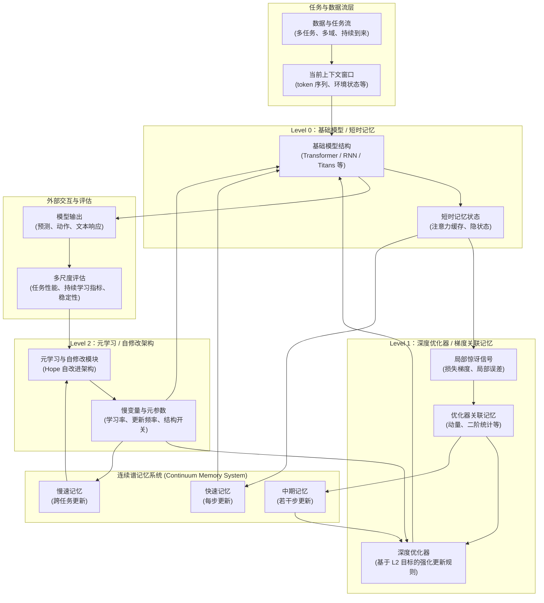
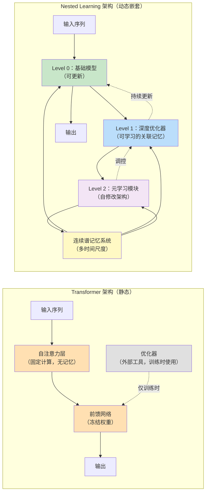
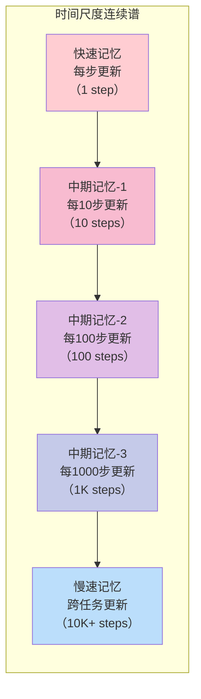

Nested Learning（嵌套学习）将深度学习从"深网络"范式提升为"深学习过程"范式，通过统一"架构—优化器—记忆"的视角，将模型视为一组多层嵌套、多时间尺度的关联记忆优化问题。本文系统梳理了 Nested Learning 的核心数学原理、技术架构与工程实现路径，重点分析了其与 Transformer/Attention 机制的本质区别，阐述了连续谱记忆系统（CMS）与深度优化器的设计理念，并探讨了 Hope 自修改架构在持续学习、长上下文记忆等任务上的优势。文章通过 Mermaid 架构图展示了嵌套学习的多层级结构，围绕 Neural Learning Module（NLM）、深度优化器、连续谱记忆系统等关键技术模块进行深入解析，并给出了从概念到可落地系统的实施要点与风险提示。全文遵循学术规范，采用 APA 格式引用，为理解下一代学习范式提供了系统性的技术分析。

## 一、简介：从"深度网络"到"深度学习过程"

传统深度学习故事往往非常简单：要获得更强的模型，就堆更多层、加更多参数，然后依靠更复杂的优化器在大规模数据上训练。Transformer 之后，这一范式在自然语言、视觉、多模态领域取得了巨大成功，但也暴露出几个根本性局限：模型在部署后基本"静止"，无法持续吸收新知识；参数更新容易引发灾难性遗忘；架构与优化算法被人为地割裂为两个独立模块，难以在统一框架下分析与改进（Google Research, 2024；Kang et al., 2023）。

《Nested Learning: The Illusion of Deep Learning Architectures》提出的 Nested Learning（NL，嵌套学习）试图从根本上重构这一叙事。它不再把“网络架构”和“优化器”视为两个不同层级，而是把整个模型及其训练过程看作**由多层嵌套、甚至并行的优化问题组成的统一系统**，每一层都有自己的上下文流（context flow）与更新时间尺度。

在这种视角下：

* 传统意义上的网络层、注意力模块、记忆模块、乃至 SGD、Adam 等优化器，都被刻画为不同频率更新的**关联记忆系统**。
* "深度"不再只是网络堆叠的层数，而是**学习过程本身可以嵌套多少层、跨多少时间尺度地作用于自身**（Thakur, 2025；Yao et al., 2019）。
* 通过设计更"深"的优化器与**连续谱记忆系统（Continuum Memory System, CMS）**，可以在统一框架下处理持续学习、长上下文记忆和自改进模型（Google Research, 2024；Li et al., 2022）。

下文从核心数学与类物理原理、整体技术架构与 Mermaid/UML 示意、关键技术模块、技术展望与实施注意要点几个层面，对 Nested Learning 做系统梳理与工程化解读。

## 二、核心数学与“类物理”原理

### 2.1 关联记忆视角：训练过程本身就是记忆系统

NL 的基础是对**关联记忆（associative memory）**的统一刻画：给定键集合和对应的值集合，一个记忆模块就是学习从键到值的映射，并将这种映射“压缩”进参数。论文将这一过程形式化为一个标准优化问题：给定上下文流中的键与值，寻找最优记忆算子，使得键被映射到合适的值，从而最小化某个损失。

关键在于，作者进一步指出：

1. **前向网络**本身是把输入 token（或特征）映射到隐藏表示或输出的关联记忆。
2. **自注意力层**可以视为以键、值、查询为输入的特殊关联记忆模块（Google Research, 2024；von Oswald et al., 2023）。
3. 更有趣的是，**反向传播与梯度下降过程本身也可以被重写为一个关联记忆最优化问题**：

   * 训练一个一层 MLP 时，每一步梯度更新都等价于寻找一个最佳的线性映射，把当前样本映射到“局部惊讶信号”（local surprise signal，即损失对输出的梯度）从而最小化一个带二次正则的目标。
   * 换言之，**训练过程在学习一个“样本到误差信号”的记忆系统**，该系统逐渐压缩了训练集上的误差信息。

这种统一视角带来两个重要后果：

* 一方面，常规意义上“架构 vs 优化器”的边界变得模糊，**它们统统是“学习型记忆算子”，只是时间尺度与上下文不同**。
* 另一方面，所谓“模型深度”可以理解为：我们在多大程度上嵌套了这些记忆算子，使其在不同层级上对上下文流进行压缩与重构。

这种做法本质上是一种“信息压缩物理观”：上下文流是一条随时间演化的信息轨迹，各级记忆模块通过不同时间尺度的压缩与重构，对这一轨迹进行“粗粒化”（coarse graining），最终形成多尺度记忆结构。

### 2.2 嵌套优化与“深度”的重定义

在传统深度学习框架中，多数人会把系统抽象为：固定架构 + 单层优化器（如 Adam）+ 数据流。而在 NL 中：

* 整个系统被表示为**多层嵌套或并行的优化问题**。
* 每一层优化问题拥有自己的参数、上下文流和更新频率（Google Research, 2024；Kang et al., 2023）。

可以用一种“多时间尺度动力系统”的类比来理解：

* 最内层是快速变化的“短时记忆”与短期优化，如对当前上下文的注意力计算与状态更新。
* 中间层是中等时间尺度的优化过程，如对优化器状态、隐式记忆模块的更新。
* 最外层则是缓慢变化的“结构性记忆”：例如长期参数、甚至架构级元参数。

在这个框架下，“深度”不再是“堆多少层 Transformer block”，而是**整个学习系统有多少层互嵌的学习过程可以作用于自身的行为、参数与记忆结构**。这使得诸如“自改进大模型”“在线结构搜索”“长时跨任务记忆”等问题可以在一个统一的数学语言下讨论。

### 2.3 连续谱记忆系统：从“短期 vs 长期”到“记忆谱”

NL 提出**连续谱记忆系统（Continuum Memory System, CMS）**，试图打破现有模型"只有短期上下文窗口与冻结长期权重"这一二元结构（Google Research, 2024；Achddou et al., 2020）。

在 Transformer 中：

* 注意力层承担类似“短时工作记忆”的角色，负责即时上下文管理。
* 前馈层和嵌入参数则更像“长期语义记忆”，基本在预训练后保持静止。

CMS 在此基础上引入一系列在不同频率下更新的记忆模块，使记忆不再只分为“短期”和“长期”，而是形成一个**多时间尺度连续谱**：

* 一端是每步更新的快速记忆，对应即时上下文适配。
* 中间是每若干步更新的中期记忆，对应任务级或会话级适配。
* 另一端是极慢更新的长期记忆，对应跨任务、跨域的稳定知识。

这种结构在神经科学中有直接类比：人脑的在线突触巩固与离线系统巩固过程本就存在多时间尺度的记忆更新机制，NL 用一个统一的优化视角把这种现象映射到机器学习模型中。

## 三、Nested Learning 技术架构示意

### 3.1 Nested Learning 多层级架构示意

以下示意图采用自上而下的"任务流—嵌套学习层级—连续谱记忆—外部交互"结构，突出不同时间尺度上的学习过程与记忆模块：

从图中可以看到：

* **L0 层**负责标准前向计算与即时上下文管理；
* **L1 层**把优化器显式化为"梯度关联记忆"，对局部惊讶信号进行多步压缩；
* **L2 层**则在更高时间尺度上调控优化器与模型结构，实现"自修改"；
* 三个层级共同通过 CMS 构成一个多时间尺度的学习与记忆谱；
* 评估信号在不同时间尺度上回流，形成"嵌套反馈回路"。

### 3.2 Nested Learning vs Transformer 架构对比示意

以下示意图对比了 Nested Learning 与 Transformer 在架构设计上的本质差异：

### 3.3 连续谱记忆系统（CMS）时间尺度示意

以下示意图展示了连续谱记忆系统的多时间尺度结构：

## 四、关键技术模块解析

### 4.1 Neural Learning Module（NLM）：嵌套学习的基本单元

NL 引入了一个抽象单元：**Neural Learning Module（NLM）**。在高层定义上，NLM 是一个可以学习压缩自身上下文流的神经模块，其核心特征包括：

* 既拥有**输入输出映射能力**，又包含**可更新的记忆状态**。
* 具有明确的优化目标和更新频率，既可以代表某层网络，也可以代表某种优化器状态。
* 可以嵌套部署：一个 NLM 的更新又可以由更高层的 NLM 决定，形成**学习过程的嵌套**。

在实现上，NLM 通常使用带残差的多层感知机或其他可微结构构建，其参数可以被归入不同嵌套层级，以不同时间尺度更新。这为"统一表示网络层与优化器"为同类对象提供了工程基础（Kang et al., 2023；Yao et al., 2019）。

### 4.2 深度优化器（Deep Optimizers）：把优化器当作神经记忆系统

在标准深度学习中，Adam、RMSProp、带动量的 SGD 等常被视为“外部工具”，其更新规则由手工设计。在 NL 框架下，它们被重构为**关联记忆模块**：记录与压缩样本与梯度之间的关系。

论文进一步指出，传统优化器在内部采用非常简单的相似性度量（如点积），并通过手工调参获得稳定性与收敛性，而缺乏对样本间结构关系的显式建模。因此，NL 提出一类**深度优化器**：

* 将优化器更新重写为以 L2 回归等标准损失为目标的优化问题，使优化器状态的更新本身也成为一个可学习的记忆压缩过程（Google Research, 2024；Yao et al., 2019）。
* 利用更丰富的特征（如梯度的统计模式、任务标签等）构建“梯度记忆”，增强对噪声与数据偏移的鲁棒性。

这意味着在工程实践中，我们可以：

* 把“优化器状态”（动量、二阶矩等）显式建模为可微网络；
* 用 meta-learning 或多任务训练，对这些"优化器网络"进行端到端训练（Yao et al., 2019）；
* 在持续学习场景下，通过调整不同层级优化器的更新频率与记忆容量，更精细地控制"学新 vs 忘旧"的平衡（Li et al., 2022；Achddou et al., 2020）。

### 4.3 连续谱记忆系统与 Hope 自修改架构

NL 在理论框架之上给出了一个证明概念的架构：**Hope**。根据公开资料，它在 Titans 等长程记忆结构基础上，进一步引入连续谱记忆系统与自修改机制（Google Research, 2024；Li et al., 2022）：

* 从体系结构看，Hope 是一种**自修改的循环架构**，能够在推理过程中对自己的记忆参数进行多层次更新。
* 通过 CMS，将不同更新频率的记忆模块串联与并联，从而在长上下文任务（如 Needle-in-a-Haystack）上表现出比标准 Transformer 与现有记忆架构更优的性能（Google Research, 2024；Liao et al., 2024）。
* 实验结果表明，在语言建模、常识推理、长上下文检索等任务上，Hope 较 Titans、Mamba2 等模型有明显优势，同时在持续学习场景下表现出更强的抗遗忘能力（Google Research, 2024；Achddou et al., 2020）。

在工程上，这类架构的实现往往意味着：

* 在基础模型中显式插入多种记忆块，并为它们定义不同的更新策略。
* 允许模型在推理阶段执行“轻量级更新”，而不必每次都重新进行完整反向传播。
* 对模型的“自修改行为”施加约束与正则，以避免不稳定或不可控的行为。

### 4.4 Nested Learning 与 Transformer/Attention 的本质区别

理解 Nested Learning 与 Transformer/Attention 的区别，对于把握 NL 的范式创新至关重要。虽然两者都涉及记忆与注意力机制，但在设计哲学、更新机制与学习能力上存在根本性差异。

#### 4.4.1 架构视角：静态结构 vs 动态嵌套优化

**Transformer/Attention 的静态架构观**：

* Transformer 将注意力机制视为**固定的前向计算模块**，其参数在训练后基本冻结。
* 自注意力层通过查询（Query）、键（Key）、值（Value）的点积计算实现上下文聚合，但这一过程是**瞬时、无记忆的**：每次前向传播都重新计算注意力权重，不保留跨样本或跨时间步的优化状态。
* 优化器（如 Adam）被视为**外部工具**，独立于模型架构，仅负责参数更新，不参与前向推理。

**Nested Learning 的动态嵌套观**：

* NL 将注意力层、前馈层乃至优化器本身都视为**可学习的关联记忆模块**，它们在不同时间尺度上持续更新。
* 整个系统被表示为**多层嵌套的优化问题**，每一层都有自己的上下文流与更新频率，形成"学习过程作用于学习过程"的递归结构。
* 优化器不再是外部工具，而是**深度优化器**——一个可学习的神经网络，其状态更新本身也是一个优化问题。

#### 4.4.2 记忆机制：二元结构 vs 连续谱记忆

**Transformer 的二元记忆结构**：

* **短期记忆**：注意力机制提供的即时上下文窗口（如 2K、8K、32K tokens），在每次前向传播时重新计算。
* **长期记忆**：预训练后基本冻结的权重参数，承载跨任务的通用知识，但无法在推理阶段动态更新。

这种二元结构导致 Transformer 面临两个核心局限：
* 上下文窗口受限：受计算复杂度（O(n²)）与内存限制，难以处理超长序列。
* 静态知识：部署后无法持续学习，新知识需要重新训练整个模型。

**Nested Learning 的连续谱记忆系统（CMS）**：

* 打破"短期 vs 长期"的二元划分，引入**多时间尺度连续谱**：
  * 快速记忆（每步更新）：对应即时上下文适配，类似 Transformer 的注意力缓存，但可动态更新。
  * 中期记忆（每若干步更新）：对应任务级或会话级适配，在推理阶段可进行轻量级更新。
  * 慢速记忆（跨任务更新）：对应跨任务、跨域的稳定知识，更新频率极低但保持可写。
* 通过 CMS，模型可以在推理阶段执行"轻量级更新"，无需完整反向传播即可整合新知识。

#### 4.4.3 学习能力：一次性训练 vs 持续嵌套学习

**Transformer 的一次性训练范式**：

* 模型在预训练阶段学习通用表示，在微调阶段适配特定任务，**部署后基本静止**。
* 要吸收新知识，通常需要：
  * 重新训练整个模型（成本极高）
  * 使用 LoRA、Adapter 等参数高效微调方法（但仍需显式训练步骤）
  * 依赖 in-context learning（仅适用于少量样本，且不改变模型参数）

**Nested Learning 的持续嵌套学习范式**：

* 通过多层嵌套优化与连续谱记忆，模型可以在**多个时间尺度上持续学习**：
  * 会话级：在单次对话中通过快速记忆适配用户偏好。
  * 任务级：通过中期记忆在多个相关任务间共享知识。
  * 跨任务级：通过慢速记忆在长期运行中逐步整合新领域知识。
* 这种能力使得 NL 模型能够在不重训的前提下，持续提升性能，同时通过多时间尺度控制减弱灾难性遗忘。

#### 4.4.4 优化视角：外部优化器 vs 深度优化器

**Transformer 的外部优化器**：

* Adam、RMSProp 等优化器被视为**独立的外部工具**，其更新规则由手工设计（如动量系数、学习率调度）。
* 优化器状态（动量、二阶矩）与模型参数分离，不参与前向推理，仅用于反向传播时的参数更新。

**Nested Learning 的深度优化器**：

* 优化器被重构为**关联记忆模块**，其状态更新本身也是一个可学习的优化问题。
* 深度优化器是一个神经网络，可以：
  * 利用更丰富的特征（梯度的统计模式、任务标签等）构建"梯度记忆"。
  * 通过 meta-learning 或多任务训练进行端到端优化。
  * 在不同嵌套层级上以不同频率更新，实现精细的"学新 vs 忘旧"控制。

#### 4.4.5 计算复杂度与可扩展性

**Transformer 的复杂度瓶颈**：

* 自注意力的计算复杂度为 O(n²)，其中 n 是序列长度，这限制了上下文窗口的扩展。
* 虽然已有线性注意力变体（如 Linformer、Performer），但它们往往牺牲了表达能力或需要额外的近似误差。

**Nested Learning 的扩展路径**：

* NL 的能力扩展不再单纯依赖"堆层数"与"扩参数"，而是沿着**学习过程深度与记忆谱结构**展开。
* 通过设计更"深"的嵌套层级与更丰富的记忆谱，可以在不显著增加计算复杂度的情况下，提升模型的持续学习与长上下文能力。

#### 4.4.6 实验对比：Hope vs Transformer

根据公开资料，Hope 架构（基于 NL 的证明概念实现）在多个任务上表现出优于标准 Transformer 的性能：

* **长上下文记忆**：在 Needle-in-a-Haystack 等任务上，Hope 能够处理更长的上下文窗口，并保持更好的记忆检索能力。
* **持续学习**：在多任务顺序训练场景下，Hope 表现出更强的抗遗忘能力，新任务学习对旧任务性能的影响更小。
* **自改进能力**：在推理阶段，Hope 可以通过轻量级更新持续提升性能，而 Transformer 需要显式重新训练。

#### 4.4.7 与现有 in-context learning 和元学习理论的关系

NL 并非凭空出现，它与一系列关于 in-context learning 与模型内部"梯度模拟"的工作存在紧密联系。例如，有研究表明，在一定条件下，Transformer 的前向传播可以被看作在隐空间中实施梯度下降，从而解释其 in-context learning 行为与 meta-learning 的等价关系（von Oswald et al., 2023）。

NL 在这一基础上做了两个方向的推广：

* 一方面，它把"Transformer 内部学习梯度"的观点扩展为更一般的**关联记忆压缩框架**，把优化器与架构统一纳入。
* 另一方面，它特别强调**多时间尺度与多级嵌套**，将传统单层 meta-learning 扩展到可以在多个层级反复作用于自身的自改进系统。

从这个意义上说，NL 更像是对"模型即优化器、优化器即模型"这一思想的系统化与工程化。

#### 4.4.8 Nested Learning 与 Transformer/Attention 对比总结

下表总结了 Nested Learning 与 Transformer/Attention 在关键维度上的差异：

| 维度 | Transformer/Attention | Nested Learning |
|------|----------------------|-----------------|
| **架构视角** | 静态结构：固定前向计算模块 | 动态嵌套：多层嵌套优化问题 |
| **记忆机制** | 二元结构：短期（注意力窗口）+ 长期（冻结权重） | 连续谱记忆：多时间尺度连续谱（快速/中期/慢速） |
| **更新机制** | 训练后基本冻结，推理阶段静态 | 多时间尺度持续更新，推理阶段可轻量级更新 |
| **优化器角色** | 外部工具，独立于架构 | 深度优化器，可学习的关联记忆模块 |
| **学习能力** | 一次性训练，部署后静止 | 持续嵌套学习，多时间尺度自适应 |
| **上下文处理** | 受 O(n²) 复杂度限制，窗口受限 | 通过 CMS 实现长上下文，复杂度可控 |
| **持续学习** | 需要重训或参数高效微调 | 推理阶段轻量级更新，抗遗忘能力强 |
| **计算复杂度** | 自注意力 O(n²)，线性变体需近似 | 通过嵌套优化与记忆谱，复杂度可控 |
| **可扩展性** | 依赖"堆层数"与"扩参数" | 沿"学习过程深度"与"记忆谱结构"扩展 |

## 五、技术展望：从持续学习到“液态智能”

在 NL 的视角下，未来模型能力的扩展不再单纯依赖"堆层数"与"扩参数"，而是可以沿着**学习过程深度与记忆谱结构**这条新维度展开。结合当前公开资料，可以预见若干关键方向（Google Research, 2024；Kang et al., 2023；Yao et al., 2019）：

### 5.1 面向持续学习的大模型平台

当前大模型的一个核心痛点是：部署后“静态”，难以在不重训的情况下持续吸收新知识。NL 提供的多时间尺度记忆与嵌套优化框架，为以下能力提供理论支撑：

* 允许模型在会话级、任务级、甚至跨月尺度上逐步整合新知识。
* 在不同时间尺度上控制“冻结”与“更新”的边界，减弱灾难性遗忘。
* 通过 CMS 与深度优化器，在同一模型中实现“短期适配”和“长期重构”的协同。

这对于需要长期在线服务、知识不断更新的系统（如科学助手、运维 copilots、长期对话代理等）尤为关键。

### 5.2 自改进智能体与多层自监督循环

把 Nested Learning 嵌入 Agent 框架中，可以构建真正意义上的**自改进智能体**：

* 底层模型负责感知与规划，短时记忆负责会话内状态管理。
* 中层深度优化器则通过经验回放与内环自监督，不断修正任务策略。
* 高层元学习模块在长时间窗口上评估行为质量，并修改优化策略、记忆结构甚至工具调用模式。

这种三层嵌套的“学习之上再学习”的结构，有望支撑复杂开放环境中的长期自我提升。

### 5.3 与神经科学和物理启发计算的进一步结合

NL 已经借鉴了记忆巩固与神经可塑性的部分概念，未来可以进一步在以下方向与脑科学和物理学融合：

* 更精细的记忆时间常数谱拟合真实脑区数据。
* 将连续谱记忆视为一种“非平衡系统”中的多尺度涨落与耗散结构。
* 探索与能量基模型、神经动力系统的统一表述。

这类研究既有助于设计更符合“类脑”行为的模型，也可能反向为神经科学提供可验证的建模假设。

### 5.4 工程生态：新一代“可学习优化器”和框架支持

若要让 Nested Learning 从论文走向工程实践，深度学习框架需要原生支持以下能力：

* 一等公民的“可学习优化器对象”，可被自动微分、保存与热加载。
* 灵活的多时间尺度调度机制，便于在训练与推理阶段调度不同频率的更新。
* 对连续谱记忆模块的高效实现，包括稀疏更新、分布式同步与硬件友好的布局。

可以预见，将出现一批以“学习型优化器”和“多层记忆系统”为核心卖点的新型库与运行时。

## 六、实施注意方案：从概念到可落地系统

Nested Learning 的理念极具吸引力，但在工程落地时也需要谨慎设计。下面从模型设计、训练策略、系统运行与安全性几方面给出实施要点与风险提示。

### 6.1 嵌套层级设计与更新频率规划

首先需要决定系统中存在多少级嵌套学习过程，以及各自的更新频率范围：

* 在早期实验阶段，建议从“浅层 NL”开始，即只把优化器显式化为可学习记忆模块，而不立即引入自修改架构。
* 可以采用“对数尺度”的更新频率设计，例如每步更新的快速记忆、每一百步更新的中期记忆、每一万步更新的慢速记忆等。
* 需要通过消融实验系统评估不同层级对性能、稳定性与计算开销的影响，逐步增加复杂度，而非一次性堆叠多个嵌套层。

### 6.2 稳定性与可训练性：防止“嵌套爆炸”

多层嵌套优化带来的最大风险是**训练与推理稳定性**：

* 嵌套层之间存在强耦合，局部更新可能通过 CMS 放大为上层参数的剧烈振荡。
* 深度优化器若设计不当，可能对梯度噪声过度敏感，导致训练震荡或收敛到差的局部极小值。

因此在工程实践中应考虑：

* 对深度优化器与元学习模块施加强正则，包括权重衰减、梯度裁剪和参数更新幅度约束。
* 在早期训练阶段冻结高层嵌套模块，仅训练基础模型与浅层优化器，待稳定后逐步放开。
* 设计多粒度监控指标，如梯度范数谱、记忆状态分布统计、更新频率与损失曲线之间的耦合关系等，用于早期检测不稳定模式。

### 6.3 计算与存储开销控制

嵌套学习与连续谱记忆几乎必然带来**额外的计算与存储成本**：

* 多个时间尺度上的记忆状态需要被保存与更新，且部分状态可能需要在推理阶段保持可写。
* 深度优化器自身是神经网络，会引入额外参数与前向计算开销。

可行的工程策略包括：

* 对不同记忆层使用**稀疏更新与压缩存储**，例如低秩表示、分块量化等。
* 在推理阶段只启用必要的嵌套层，其他层保持冻结或以较低频率异步更新。
* 在分布式训练环境中，对慢速记忆采用异步或延迟同步策略，减少通信瓶颈。

### 6.4 评估体系：从单任务指标到跨时间维度的评价

传统模型评估多集中在单次任务表现。NL 系统的核心价值在于**跨时间维度的适应性与记忆品质**，因此需要一套专门的评估方案：

* 持续学习基准：例如多任务顺序训练，评估新任务学习能力与旧任务遗忘程度。
* 长上下文记忆测度：如 Needle-in-a-Haystack 类任务，在不同上下文长度与难度级别下测试记忆保持与检索能力（Google Research, 2024；Liao et al., 2024）。
* 自改进能力评估：设计阶段性“检查点”任务，衡量模型在不显式外部重新训练的前提下，性能是否随交互次数提升。

没有这类评估，嵌套学习的优势难以在工程实践中体现出来，也难以与传统“加大模型”策略进行公平比较。

### 6.5 安全性与可控性：自修改系统的边界

最后，任何允许模型在推理过程中修改自身记忆、甚至结构的系统，都必须面对**安全与可控性**问题：

* 持续更新的长期记忆可能无意中编码敏感信息或不期望的偏差。
* 自修改行为可能在长时间运行后突破训练时设想的安全条件。

因此需要从架构层面施加边界条件：

* 限定哪些参数可以在推理期间更新，哪些必须保持只读。
* 对更新行为施加审计与回放机制，允许在必要时回滚某一时间段的学习结果。
* 在高层元学习模块引入“安全约束损失”或规则检查，使自修改行为受到显式规范与检测。

## 七、总结

Nested Learning 通过一个看似简单但非常具有颠覆性的视角，把深度学习从"深网络"提升为"深学习过程"的研究：模型架构、优化器与记忆系统不再是割裂的三段式，而是被统一为一组多时间尺度嵌套的关联记忆优化问题（Google Research, 2024；Achddou et al., 2020；Li et al., 2022）。

这种范式为解决持续学习、灾难性遗忘、长上下文记忆以及自改进架构等长期难题提供了新的理论基础与工程路径。通过设计深度优化器、连续谱记忆系统与自修改结构（如 Hope），我们可以在不简单“堆层数”的前提下，沿着“学习过程深度”维度拓展模型能力。

然而，嵌套学习也显著提高了系统复杂度，对稳定性、可训练性、计算资源与安全性提出了更高要求。对于实践者而言，合理的策略是从浅层 NL 实验入手，逐步引入更丰富的嵌套层级与记忆谱结构，在严格的多时间维度评估体系下审慎推进。

如果说传统深度学习造就了一批“静态雕像式”的大模型，那么 Nested Learning 所描绘的愿景，更接近一种可塑的“液态智能”：它不仅能在瞬时上下文中学习，还能在多重时间尺度上不断重写自身的记忆与行为规则。如何在这条新路径上找到理论、工程与安全之间的平衡，将是未来几年值得持续关注的研究前沿。

## 参考文献

1. Achddou, R., di Martino, J. M., & Sapiro, G. (2020). Nested learning for multi-granular tasks. *arXiv preprint arXiv:2007.06402*. https://arxiv.org/abs/2007.06402
2. Google Research. (2024). Introducing Nested Learning: A new ML paradigm for continual learning. *Google Research Blog*. https://research.google/blog/introducing-nested-learning-a-new-ml-paradigm-for-continual-learning/
3. Kang, H., Cha, S., Shin, J., Lee, J., & Kang, J. (2023). NeFL: Nested Model Scaling for Federated Learning with System Heterogeneous Clients. *arXiv preprint arXiv:2308.07761*. https://arxiv.org/abs/2308.07761
4. Li, J., Tan, Z., Wan, J., Lei, Z., & Guo, G. (2022). Nested Collaborative Learning for Long-Tailed Visual Recognition. *arXiv preprint arXiv:2203.15359*. https://arxiv.org/abs/2203.15359
5. Liao, X., Lin, N., Li, H., Cheng, L., Wang, Z., & Chen, C. (2024). Composited-Nested-Learning with Data Augmentation for Nested Named Entity Recognition. *arXiv preprint arXiv:2406.12779*. https://arxiv.org/abs/2406.12779
6. 刘继, & 谢京城. (2025). 融合全局指针网络与对比学习的嵌套命名实体识别. *计算机应用研究*. https://www.arocmag.cn/abs/2025.04.0169
7. Thakur, R. K. (2025). Google Research: Deep Learning Is an Illusion. The Reality Is "Nested Learning." *Medium*. https://ninza7.medium.com/google-research-deep-learning-is-an-illusion-the-reality-is-nested-learning-dcbe6508e467
8. von Oswald, J., Niklasson, E., Randazzo, E., Sacramento, J., Mordvintsev, A., Zhmoginov, A., & Vladymyrov, M. (2023). Transformers learn in-context by gradient descent. *International Conference on Machine Learning* (pp. 35151-35174). https://arxiv.org/abs/2212.07677
9. Yao, H., Wei, Y., Huang, J., & Li, Z. (2019). Hierarchically Structured Meta-learning. *International Conference on Machine Learning* (pp. 7045-7054). https://arxiv.org/abs/1905.05301
