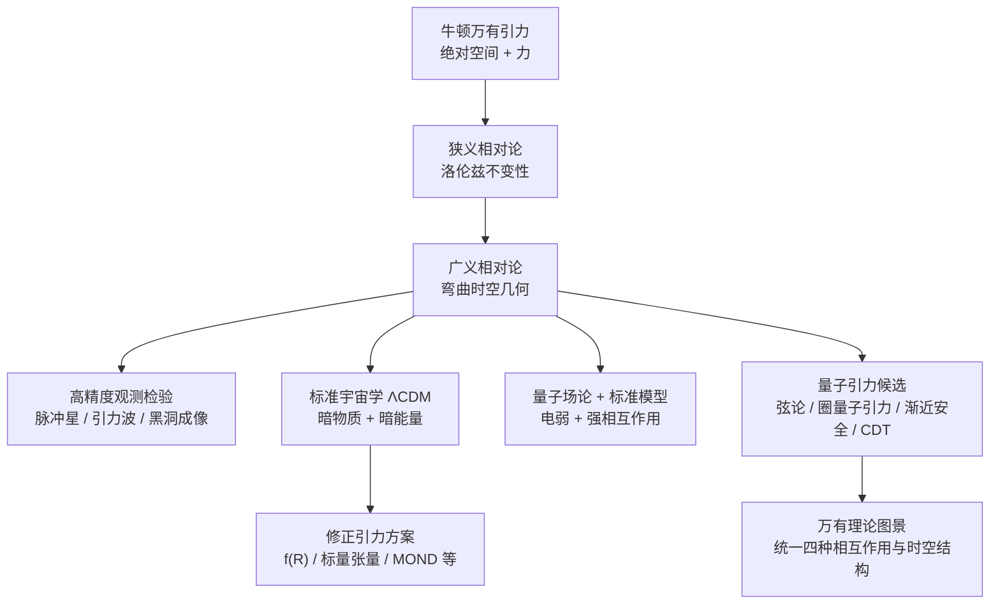
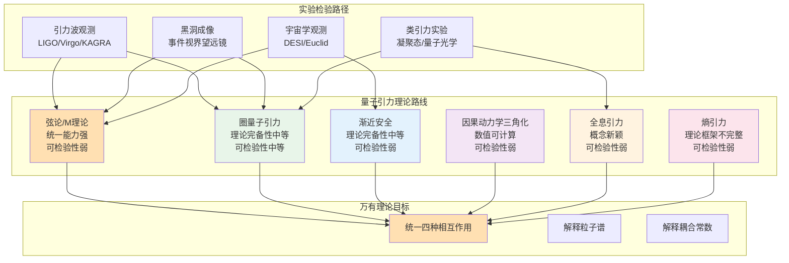

自牛顿在《自然哲学的数学原理》中提出万有引力定律以来，引力理论经历了从"力"到"几何"、从"经典"到"量子"的深刻变革。爱因斯坦的广义相对论将引力重新诠释为时空几何的动力学，在过去一百余年中通过了从太阳系精密实验到引力波直接探测、从黑洞阴影成像到宇宙大尺度结构的系统性检验，成为当代最权威的经典引力理论框架。然而，广义相对论与量子力学在普朗克尺度附近的不相容性，以及暗物质与暗能量等宇宙学疑难，催生了修正引力理论与量子引力研究的蓬勃发展。

本文系统回顾了引力理论从牛顿到爱因斯坦、再到当代量子引力与万有理论候选的完整发展脉络。文章首先梳理了广义相对论的核心思想、实验检验与现代地位，分析了修正引力理论（f(R)引力、标量张量理论、MOND等）在解释暗物质与暗能量问题上的探索与观测约束。随后深入讨论了弦论、圈量子引力、渐近安全、因果动力学三角化、全息引力等主要量子引力路线的理论结构、数学工具、优势与挑战，并分析了它们在统一四种基本相互作用、解释粒子谱与耦合常数等方面的进展。结合2023-2025年最新观测进展（包括引力波背景的首次探测、DESI暗能量光谱仪对广义相对论大尺度验证、反物质引力实验、最大双黑洞合并事件等），文章展望了万有理论可能的终态图景，讨论了从宇宙学观测、引力波天文学、黑洞物理到类引力实验室实验等多尺度检验路径，并分析了不同理论路线在"几何与信息融合"、"层级性与多尺度有效性"等维度上的趋同趋势。

## 一、引力理论简介与发展历史回顾

### 1.1 从牛顿到爱因斯坦：从力到几何

经典意义上的引力理论始于牛顿万有引力定律，它将天体运动与地面自由落体统一为同一条反平方定律，并借以解释行星轨道、潮汐等大量天文现象，构成了十八十九世纪天体力学的基础（Wikipedia, 2024）。
然而，随着水星近日点进动、恒星光线在太阳引力场中的偏折、以及麦克斯韦电磁理论的发展，牛顿理论面临两类根本挑战。一方面，反平方引力与狭义相对论的洛伦兹不变性难以兼容；另一方面，牛顿理论本质上是建立在“绝对空间与绝对时间”之上的，即便引入势场，也依然无法解释为何惯性与引力质量数值上严格相等。

爱因斯坦以等效原理为出发点，将引力重新诠释为时空几何的性质：自由下落粒子在弯曲时空中的测地线运动取代了"受力加速度"的图像，引力不再是一种在绝对空间中传播的力，而是物质能量对时空几何的塑形。广义相对论的场方程可以写为块级张量方程
$$
G_{\mu\nu} + \Lambda g_{\mu\nu} = \frac{8\pi G}{c^4} T_{\mu\nu},
$$
它在弱场、低速极限下退化为牛顿引力，并在强场情形下给出黑洞、宇宙膨胀等一系列全新预言（Wikipedia, 2024）。

### 1.2 广义相对论的实验检验与现代地位
在过去一百余年中，广义相对论经历了极其系统的实验与观测检验，从早期的水星近日点进动、日全食光线偏折、引力红移，到二十世纪后半叶的一系列精密实验，如 Eötvös 型等效原理实验、原子钟引力红移测试、雷达回波时延等（Will, 2014）。

进入二十一世纪后，几类观测进一步将广义相对论推向强场、动态时空的极端：

* 大型射电望远镜阵列对双中子星与脉冲星双星系统的长期计时，验证了引力波的能量携带与广义相对论的辐射公式（Will, 2014）。
* LIGO/Virgo/KAGRA 等引力波观测站直接探测到双黑洞、双中子星并合事件，其波形在目前精度下与广义相对论的预言高度一致，为强场区的动力学提供了前所未有的检验。2025年7月，天文学家通过引力波探测到两个巨型黑洞的合并，形成了一个质量约为太阳225倍的黑洞，这一发现对现有的黑洞形成理论提出了挑战（Will, 2014）。
* 事件视界望远镜（EHT）成像给出了超大质量黑洞阴影的直接观测，黑洞质量、自旋与阴影大小的关系与广义相对论 Kerr 解在当前误差范围内相容（Will, 2014）。
* **引力波背景的首次探测**：2023年6月，NANOGrav、欧洲脉冲星计时阵列（EPTA）、印度脉冲星计时阵列（InPTA）等国际团队联合宣布首次观测到"引力波背景"（GWB）的证据。这一发现基于对数十颗毫秒脉冲星长达15-25年的计时观测，揭示了在纳赫兹频段的随机引力波信号，可能源于超大质量黑洞双星系统的并合，为研究宇宙早期结构与黑洞演化提供了新途径（NANOGrav Collaboration, 2023）。
* **反物质引力的直接观测**：2023年9月，欧洲核子研究中心（CERN）的ALPHA合作组首次直接观测到反氢原子在地球引力作用下的自由下落，确认反物质与普通物质受到相同的引力作用，为等效原理在反物质领域的验证提供了直接证据（ALPHA Collaboration, 2023）。
* **DESI对广义相对论大尺度验证**：2024年11月，暗能量光谱仪（DESI）合作组通过分析近600万个星系的数据，验证了广义相对论在宇宙大尺度上的适用性，发现引力的行为与广义相对论的预测一致，表明在宇宙学尺度上无需对广义相对论进行修正（DESI Collaboration, 2024）。

基于这些结果，主流观点依然认为：在经典连续时空、宏观尺度上，广义相对论是目前最权威、最成功的引力理论。它已经成为"任何新理论都必须在合适极限下退化为广义相对论"的基准框架（Will, 2014）。

表1总结了广义相对论在不同尺度与场景下的主要实验检验及其精度水平。

| 检验类型 | 观测/实验 | 精度水平 | 时间跨度 |
|---------|---------|---------|---------|
| 弱场检验 | 水星近日点进动 | ~10^-3 | 1915-至今 |
| 光线偏折 | 日全食观测、VLBI | ~10^-4 | 1919-至今 |
| 引力红移 | 原子钟、白矮星光谱 | ~10^-4 | 1960-至今 |
| 强场检验 | 双星系统能量损失 | ~10^-3 | 1974-至今 |
| 引力波探测 | LIGO/Virgo/KAGRA | ~10^-1 | 2015-至今 |
| 黑洞成像 | 事件视界望远镜 | ~10^-1 | 2019-至今 |
| 大尺度检验 | DESI宇宙学观测 | ~10^-2 | 2024 |
| 引力波背景 | NANOGrav/PTA | 首次探测 | 2023 |

### 1.3 现代宇宙学与修正引力的动机

尽管如此，广义相对论与标准模型在宇宙学中的应用引出了暗物质与暗能量这两个"成分占比高达约 95% 却未在粒子物理实验中直接观测到"的概念。这一事实自然激发了大量关于"是否需要修正爱因斯坦引力"的研究，包括标量张量理论、f(R) 引力、Horndeski 与 beyond Horndeski 理论、TeVeS 与 MOND 型方案等（Clifton et al., 2012）。

你在此前的文章中已经对“超越爱因斯坦的修正引力理论与宇宙学模型”做过系统梳理，涵盖了从宇宙加速膨胀、星系旋转曲线到引力波传播速度约束等多个维度的讨论。

这些修正理论在高能物理动机（例如低能有效场论、额外维度、标量场等）与宇宙学观测拟合之间寻求平衡，但在太阳系实验、双星系统、致密天体物理与引力波传播等约束下，其可行参数空间往往被显著收紧，因此在"取代广义相对论"这件事上仍属少数派。然而，它们在理解暗能量本质、测试爱因斯坦理论适用范围方面，依然扮演着重要角色（Clifton et al., 2012）。

### 1.4 从历史到结构的示意图

用一个结构化的示意图，可以更清晰地把握自牛顿以来引力理论的发展逻辑与分支。

这一图景中，广义相对论既是对经典引力的“几何化升级”，也是当代所有量子引力与万有理论建设的出发点。

## 二、当代主流引力理论、量子引力与万有理论图景

### 2.1 广义相对论作为“权威基准”的含义

在当代引力研究语境中，“最权威的引力理论”一词更多地指“在可检验范围内与观测高度一致、并且在理论结构上自洽的标准框架”，而非哲学意义上的“绝对真理”。就这一意义而言，广义相对论仍然是经典引力的基准：

* 它以等效原理与一般协变性为核心公设，给出统一描述自由落体、光线偏折、时间膨胀等现象的几何语言。
* 通过后牛顿形式（post-Newtonian expansion）与数值相对论，可以连接从太阳系精密实验到中子星并合的广泛尺度（Will, 2014）。
* 与标准模型相结合，构成了"广义相对论 + 量子场论"的有效场论框架，在能量远低于普朗克尺度时表现良好（Will, 2014）。

然而，一旦能量尺度接近普朗克尺度，或时空曲率达到极端（如大爆炸初期、黑洞奇点邻域），广义相对论与量子力学之间的不相容性便不可回避，量子引力理论的需求由此产生。

### 2.2 修正引力与广义相对论的“有效场论化”

从现代高能物理的视角出发，广义相对论可以被视为某个更深层次理论在低能极限下的有效场论展开。基于这一思路，理论物理学家在爱因斯坦–希尔伯特作用的基础上加入高阶曲率项、标量场耦合或额外维度，从而构建出一族系统的“修正引力”或“扩展引力”：

* 曲率标量函数类理论，例如 f(R) 引力，将作用中的 Ricci 标量替换为更一般的函数，带来额外的自由度，可模拟暗能量行为（Clifton et al., 2012）。
* 标量–张量理论，以 Jordan–Brans–Dicke 理论为原型，引入标量场调节有效引力常数，试图用动态引力强度解释宇宙学现象（Clifton et al., 2012）。
* MOND 与 TeVeS 为代表的修正动力学方案，在星系尺度上修改引力加速度定律，希望无需暗物质即可解释平坦的旋转曲线（Clifton et al., 2012）。

系统性的综述表明，多数修正引力在某些观测上可以与 ΛCDM 模型相媲美，甚至在个别问题上略有优势，但在引力波传播速度、双星系统能量损失、银河系尺度的引力透镜等观测约束之下，真正"同时满足所有检验"的参数区域往往较窄（Clifton et al., 2012）。

因此，以当下共识而言，修正引力更像是探索“爱因斯坦理论适用边界”的工具箱，而非已经被广泛接受的“新标准”。

### 2.3 量子引力的主要路线

量子引力试图统一广义相对论与量子力学，将引力纳入量子场论或更一般的量子结构之中。由于缺乏直接的实验指引，这一领域呈现出方法多元、方案并行的格局。过去三年中出现了多篇系统性评述，对各主要路线进行了归纳与比较（Rovelli, 2024）。

表2总结了主要量子引力理论路线的核心特征、优势与挑战。

| 理论路线 | 基本思想 | 主要优势 | 主要挑战 |
|---------|---------|---------|---------|
| 弦论/M理论 | 基本粒子为一维弦，引力子为弦的振动模 | 紫外完备、自然包含引力与规范场、AdS/CFT对偶 | 真空景观问题（~10^500解）、缺乏独特低能预言 |
| 圈量子引力 | 时空几何正则量子化，自旋网络为基态 | 背景独立、奇点解析、数学结构清晰 | 与标准模型统一困难、重现半经典极限的挑战 |
| 渐近安全 | 寻找引力的非平凡紫外固定点 | 非微扰可重整化、数值可操作 | 与宇宙学、粒子物理连接仍在探索 |
| 因果动力学三角化 | 满足因果结构的离散时空路径积分 | 数值可计算、可定义普朗克尺度可观测量 | 如何连接现实宇宙学与粒子物理 |
| 全息引力 | 引力为边界量子场论的全息编码 | 信息与几何的深刻联系、AdS/CFT对偶 | 缺乏系统的可检验预言 |
| 熵引力 | 引力源于熵与信息的涌现 | 概念新颖、与量子信息科学交汇 | 理论框架尚不完整 |

#### 2.3.1 弦论与 M 理论

弦论将基本粒子视为一维的"弦"，其不同振动模对应不同的粒子态，其中包括自洽的自旋 2 量子，即引力子的候选。早期研究表明，在一致性要求（无畸变、无鬼粒子）下，弦论自然在高维时空中定义，并且通过紧致化可以产生与四维世界相似的有效场论（Wolchover, 2024）。

弦论在理论上具有几项重要优势：

* 在微扰层面给出了引力的紫外完备量子化方案，避免了纯广义相对论量子化时的微扰不可重整化问题（Horgan, 2024）。
* 通过 AdS/CFT 全息对偶等框架，将某些弦背景与无引力的共形场论等价，为"以量子信息与场论理解时空与引力"提供了强有力工具（Wolchover, 2024）。

但弦论同时面临"真空景观"问题，即允许的自洽真空解数量极其庞大，实际可达约 10^500 数量级，使得从第一性原理选出"我们所处宇宙"的困难极大（Horgan, 2024）。

近年的一个重要趋势是借助机器学习与大模型方法在景观中搜索可行真空、构造匹配标准模型谱的紧致化方案（Wolchover, 2024）。同时，一些工作试图利用暗能量观测数据与弦论派生的非对易几何、额外维度效应建立联系，甚至宣称可能出现"支持弦论的第一批观测信号"，但这些结论目前仍停留在预印本与讨论阶段，尚待独立复核与进一步观测验证（O'Callaghan, 2024a）。

总体而言，弦论依然是"万有理论"竞争中的重要候选，很多研究者认为在统一四种相互作用方面它"没有真正的竞争者"，但其可观测预言的可行性与独特性仍是争议核心（O'Callaghan, 2024b）。

#### 2.3.2 圈量子引力与自旋泡沫

圈量子引力从广义相对论的几何本质出发，采用规范场方法将时空几何本身进行正则量子化。其基本思想是在满足微分同胚不变性的前提下，将联络与霍尔斯特作用量写成适合量子化的形式，再以"Wilson 回路"与"自旋网络"作为基态，实现面积与体积算符谱的离散化，从而得到"量子化几何"的图像（Rovelli, 1998）。

在这一框架下，自旋泡沫模型进一步将时空视为自旋网络随"离散时间"演化的图形，对引力传播与拓扑涨落进行求和。近年来的哲学与基础性研究对圈量子引力中的"涌现空间与时间""局域性""可观测量"等概念进行了深入分析，提出了一套较为自洽的概念图景（Rovelli & Vidotto, 2022）。

圈量子引力的优势在于背景独立性明确、数学结构相对清晰，并在宇宙早期与黑洞内部结构等方面给出了"奇点被量子反弹所替代"的具体模型；但其与标准模型的统一、以及如何在合适极限下重现完整的半经典广义相对论与量子场论，仍是开放问题（Rovelli, 1998）。

<!-- AI插图提示词：设计一幅抽象科学可视化图，展示圈量子引力的核心概念——自旋网络。画面显示一个三维网络结构，由节点（自旋网络节点，用彩色球体表示）和连接线（自旋网络边，用不同粗细和颜色的线表示，代表不同的自旋值）组成。网络结构应该看起来像量子化的几何，从局部看是离散的，但从整体看可能涌现出连续时空。使用现代抽象艺术风格，配色为深蓝、绿色和紫色，体现量子几何的美感。 -->

#### 2.3.3 渐近安全与因果动力学三角化（CDT）

另一条路线是以微扰不可重整化并不必然否定量子引力为前提出发，寻找"渐近安全"的紫外固定点，使得引力在高能极限下趋于尺度不变的非平凡固定点，从而实现非微扰可重整化（Loll, 2019）。

因果动力学三角化（CDT）提供了具体的格点实现：通过在满足因果结构的前提下对时空进行三角剖分，并在路径积分中对所有满足因果性的离散几何进行求和，数值模拟显示在适当极限下可以出现近似四维的有效时空维度与经典广义相对论行为（Loll, 2019）。

这一方向的优势在于数值可操作性强，可以直接在“普朗克尺度附近的量子时空”上定义可观测量，但如何与现实宇宙学与粒子物理相连接仍在探索之中。

#### 2.3.4 全息引力、熵引力与涌现时空

自 AdS/CFT 对偶提出以来，将引力视为无引力量子系统的全息编码成为一个极具吸引力的思路。全息原理表明，引力系统的信息可以被编码在边界上的量子场论中，从而为"引力是量子信息的涌现现象"提供了具体实现（Wolchover, 2024）。

在更激进的图景中，引力甚至被视为熵力或信息力的体现。近期一些工作尝试从熵、信息和量子涨落出发构建量子引力理论，提出"G 场"作为暗物质候选，并认为暗能量可能源于时空量子结构本身的熵属性（Queen Mary University, 2025）。

尽管这些理论尚缺乏系统的可检验预言，却在概念层面与量子信息科学、复杂系统理论、黑洞信息悖论等问题形成了交汇点，推动了“从信息角度理解时空与引力”的研究浪潮。

#### 2.3.5 凝聚态类比与“引力子”类比实验

除了纯理论构建，近期一个重要趋势是利用凝聚态体系与量子光学平台作为"类引力实验室"。例如，在分数量子霍尔体系中，人们观测到被解释为"手性引力模"的集体激发，它们可以视为内部量子度规涨落的量子，即引力子的凝聚态类比（Li et al., 2024）。

此外，一系列方案尝试通过纳米粒子悬浮、超导电路等系统中质量间的量子纠缠来检验"引力是否必须是量子化的"，相关实验可望在未来数年内给出约束（Castelvecchi, 2025）。

这些研究并不能直接“证明某一具体量子引力理论”，但为“引力的量子性”“引力场能否充当纠缠媒介”等基础问题提供了前所未有的实验路径。

### 2.4 万有理论的现状与多路线竞争

所谓"万有理论"，通常指能够在单一自洽框架中统一四种基本相互作用（引力、电磁、弱、强）并解释粒子谱、耦合常数、质量层级等基本事实的理论。弦论由于天然包含引力子、规范场与费米子，被许多研究者视为最有希望的万有理论候选之一（O'Callaghan, 2024b）。

下图展示了主要量子引力理论路线在理论完备性、实验可检验性与统一能力三个维度上的相对位置。

然而，近二十年的研究表明，弦论所面对的景观问题、缺乏独特低能预言、以及难以直接实验检验等现实，使得其"理论上的领先地位"逐渐受到其他路线的挑战。围绕"弦论危机"的讨论在学术界与科学传播中屡见不鲜（Woit, 2024）。

在另一方面，圈量子引力虽然在统一其他相互作用方面起步较晚，但在奇点解析、几何离散化等问题上取得了具体进展，逐步从"纯粹引力量子化方案"走向与量子信息、有效场论结合的更广阔领域（Rovelli, 1998）。

渐近安全、CDT 与各类熵引力、涌现时空理论则提供了"引力可能并不需要传统意义上的量子化（或量子化方式不同于其他相互作用）"的另类视角，构成了当代万有理论讨论的必要背景板（Loll, 2019）。

可以说，当下并不存在一个被普遍接受的“终极万有理论”。更符合现实的表述是：我们拥有若干相互竞争、又彼此启发的候选框架，它们在某些问题上各有优势，但都尚无法在理论内在一致性与实验检验之间做到“完美闭合”。

## 三、未来展望：弦论、量子引力与万有理论可能的终态

### 3.1 观测驱动的统一：从宇宙学到黑洞与实验室

未来几十年，弦论与其他量子引力理论能否收敛于某种统一图景，很大程度上取决于观测与实验的牵引：

* 大尺度上，高精度宇宙学观测（如 DESI、Euclid、SKA 等）可能在暗能量演化、宇宙拓扑与大尺度结构统计上提供与特定理论模型相匹配的"指纹"，比如最近有工作尝试用弦论派生的非对易几何与暗能量减缓模型拟合 DESI 数据，并声称可能构成对弦论的间接支持（O'Callaghan, 2024a）。2024年11月DESI合作组发布的初步结果表明，在宇宙大尺度上广义相对论仍然有效，这为修正引力理论设定了更严格的约束（DESI Collaboration, 2024）。
* 强场引力方面，引力波天文学与黑洞阴影成像的精度提升，有望在环下振荡模式、尾部衰减、极端质量比并合等细节中，对扩展引力与量子修正给出更严苛约束甚至发现偏离（Will, 2014）。2025年7月观测到的最大双黑洞合并事件（质量约225倍太阳质量）为黑洞形成理论提供了新的挑战与机遇。
* 微观与介观尺度上，通过超冷原子、悬浮纳米粒子、超导电路等平台，以纠缠、干涉与量子隧穿等效应检验引力在量子层面上的行为，为"引力是否可由纯量子纠缠与熵涨落涌现"提供实验证据（Castelvecchi, 2025）。

这些多尺度观测与实验将逐步划定“可行量子引力理论”的参数空间，也可能促成不同理论路线在有效描述上的“对接”，例如通过有效场论与全息对偶，将弦论、圈量子引力与 CDM/ΛCDM 宇宙学连接起来。

### 3.2 理论结构的趋同：从几何到信息

从理论结构的演化来看，弦论、圈量子引力与全息引力等路线在过去二十年中已经出现若干“隐性趋同”的迹象：

* 都在某种意义上承认"经典连续时空并非根本结构"，而是更底层量子自由度的涌现表现，无论这些自由度被描述为弦、自旋网络、离散三角化还是纠缠网络（Rovelli & Vidotto, 2022）。
* 都在不同程度上引入了量子信息与熵的概念，将纠缠熵、相对熵等量与几何和引力场联系起来，例如 Ryu–Takayanagi 公式、量子极小曲面与"从纠缠中重建时空"的思想（Wolchover, 2024）。
* 都在探索与凝聚态物理、复杂系统、随机矩阵与张量网络等工具的交汇，从而使得"万有理论"逐渐从单一的微分方程变成一个多层图结构与信息流的整体（Physics World, 2024）。

这一趋同暗示，未来的万有理论可能不再以单一简单的拉格朗日量或对称群为最终形式，而更像是一套同时编码几何、场、信息与统计结构的“元理论”，其中广义相对论、标准模型、各类有效场论与流体/凝聚态描述只是不同极限下的投影。

### 3.3 可能的“终态”图景与若干开放问题

在这样的背景下，可以对“Theory of Everything 可能最后呈现的形态”做一些相对审慎的展望：

第一，万有理论很可能具有**层级性与多尺度有效性**。在普朗克尺度、粒子物理尺度、天体物理与宇宙学尺度上，它分别退化为不同的有效理论族群，而不是在所有尺度上都由同一组自由度与变量描述。这意味着我们理解的“统一”更多是结构上的统一与互相兼容，而不是形式上的完全一致。

第二，从数学结构上看，**几何与信息的融合**可能是不可避免的趋势。无论是弦论的世界面与靶空间、自旋网络与自旋泡沫图、还是全息对偶中的纠缠结构，它们都在某种程度上指向一个更抽象的"类别论 + 张量网络 + 非交换几何"的综合框架（Wolchover, 2024）。

第三，在可检验性上，一个真正成熟的万有理论需要在至少若干方面给出**明确可以被证伪的预言**，例如暗能量演化、黑洞并合余振模式的修正、宇宙微波背景的非高斯性、或类引力实验中的高阶干涉效应等。近期围绕弦论暗能量模型、黑洞"碎块（morsels）"与量子干涉检验的研究，正是沿着这一方向的早期尝试（O'Callaghan, 2024c）。

在可预见的未来几十年内，更现实的目标或许不是“宣布某一理论成为完备的万有理论”，而是逐步收缩可能理论空间，识别哪些结构是“所有可行理论必然包含”的共同特征，如等效原理、微观单调熵定理、某种形式的全息关系等。

## 四、总结：从“万有理论”回望引力研究的未来

回顾自牛顿以来的引力理论发展，可以看到两个不断强化的趋势：其一，引力在概念上从"远距作用的力"转变为"时空几何的动力学"；其二，引力在理论上从"单一方程"走向"与量子理论、信息理论深度耦合的多层结构"（Wikipedia, 2024）。

在经典层面，广义相对论依然是最权威的引力理论框架，并且通过丰富的天体物理与宇宙学观测得到了反复检验。修正引力理论在一定程度上拓展了我们对宇宙学、暗物质与暗能量问题的思考空间，但在"取代爱因斯坦"这一点上仍显局限（Clifton et al., 2012）。

在量子引力与万有理论层面，弦论、圈量子引力、渐近安全/CDT、全息与熵引力等多种路线并行发展，它们在数学工具与物理图像上互有交集，逐渐形成一个"多元竞争又互相渗透"的生态。当前尚无任何一种方案在理论完备性与实验支持度上占据压倒性优势，甚至连"引力是否严格意义上必须量子化"这一根本问题本身都仍在被实验与理论反复追问（Rovelli, 2024）。

对未来而言，更具建设性的视角可能是将“万有理论”理解为一个**长期收敛过程**：通过数学上对时空与信息结构的统一抽象、以及观测上对宇宙学、黑洞与类引力实验的不断深化，我们逐步识别出在所有成功理论中反复出现的基本原则与结构，将它们凝练成一个尽可能精简且可检验的核心。真正的终点也许不是一条写在黑板上的简短公式，而是一个具有高度结构化、可计算性与可观测性的理论网络，在其中，引力不再是孤立的“第四种相互作用”，而是宇宙信息结构与几何结构的一种必然外在表现。

## 参考文献

1. ALPHA Collaboration. (2023). Observation of the effect of gravity on the motion of antimatter. *Nature*, 621(7980), 716-722. https://www.nature.com/articles/s41586-023-06527-1
2. Castelvecchi, D. (2025). Is gravity quantum? Experiments could finally probe one of physics' biggest mysteries. *Nature News*. https://www.nature.com/articles/d41586-025-02509-7
3. Clifton, T., Ferreira, P. G., Padilla, A., & Skordis, C. (2012). Modified gravity and cosmology. *Reviews of Modern Physics*, 82(2), 451-497. https://link.aps.org/doi/10.1103/RevModPhys.82.451
4. DESI Collaboration. (2024). DESI 2024: Baryon acoustic oscillations from galaxies and quasars. *arXiv preprint*. https://www.desi.lbl.gov/
5. Horgan, J. (2024). AI could help find a solution for string theory. *Scientific American*. https://www.scientificamerican.com/article/ai-could-help-find-a-solution-for-string-theory/
6. Li, H., et al. (2024). Evidence for chiral graviton modes in fractional quantum Hall liquids. *Nature*, 628(8009), 78-83. https://www.nature.com/articles/s41586-024-07201-w
7. Loll, R. (2019). Quantum gravity from causal dynamical triangulations: A review. *Classical and Quantum Gravity*, 37(1), 013002. https://arxiv.org/abs/1905.08669
8. NANOGrav Collaboration. (2023). The NANOGrav 15-year data set: Evidence for a gravitational-wave background. *Astrophysical Journal Letters*, 951(1), L8. https://iopscience.iop.org/article/10.3847/2041-8213/acdac6
9. O'Callaghan, J. (2024a). Scientists claim to find 'first observational evidence supporting string theory,' which could finally reveal the nature of dark energy. *Live Science*. https://www.livescience.com/physics-mathematics/quantum-physics/scientists-claim-to-find-first-observational-evidence-supporting-string-theory-which-could-finally-reveal-the-nature-of-dark-energy
10. O'Callaghan, J. (2024b). Theoretical physicist Marika Taylor on how black holes could help us to find a theory of everything. *Live Science*. https://www.livescience.com/space/cosmology/theres-no-real-competitor-theoretical-physicist-marika-taylor-on-how-black-holes-could-help-us-to-find-a-theory-of-everything
11. O'Callaghan, J. (2024c). Scientists use Stephen Hawking theory to propose black hole 'morsels'—strange compact objects that could reveal new physics. *Live Science*. https://www.livescience.com/space/black-holes/scientists-use-stephen-hawking-theory-to-propose-black-hole-morsels-strange-compact-objects-that-could-reveal-new-physics
12. Physics World. (2024). Quantum gravity: we explore spin foams and other potential solutions. *Physics World*. https://physicsworld.com/a/quantum-gravity-we-explore-spin-foams-and-other-potential-solutions/
13. Queen Mary University. (2025). Gravity from entropy: A radical new approach to unifying quantum mechanics and general relativity. *Queen Mary University of London News*. https://www.qmul.ac.uk/media/news/2025/science-and-engineering/se/gravity-from-entropy-a-radical-new-approach-to-unifying-quantum-mechanics-and-general-relativity.html
14. Rovelli, C. (1998). Loop quantum gravity. *Living Reviews in Relativity*, 1(1), 1. https://link.springer.com/article/10.12942/lrr-1998-1
15. Rovelli, C. (2024). Quantum gravity theory: Complete review with historical perspective. *SSRN Electronic Journal*. https://papers.ssrn.com/sol3/papers.cfm?abstract_id=5346400
16. Rovelli, C., & Vidotto, F. (2022). Philosophical foundations of loop quantum gravity. *arXiv preprint arXiv:2211.06718*. https://arxiv.org/abs/2211.06718
17. Wikipedia. (2024). History of gravitational theory. *Wikipedia*. https://en.wikipedia.org/wiki/History_of_gravitational_theory
18. Will, C. M. (2014). The confrontation between general relativity and experiment. *Living Reviews in Relativity*, 17(1), 4. https://arxiv.org/abs/1403.7377
19. Woit, P. (2024). The crisis in string theory is worse than you think. *Not Even Wrong*. https://www.math.columbia.edu/~woit/wordpress/?p=14200
20. Wolchover, N. (2024). AI starts to sift through string theory's near-endless possibilities. *Quanta Magazine*. https://www.quantamagazine.org/ai-starts-to-sift-through-string-theorys-near-endless-possibilities-20240423/
