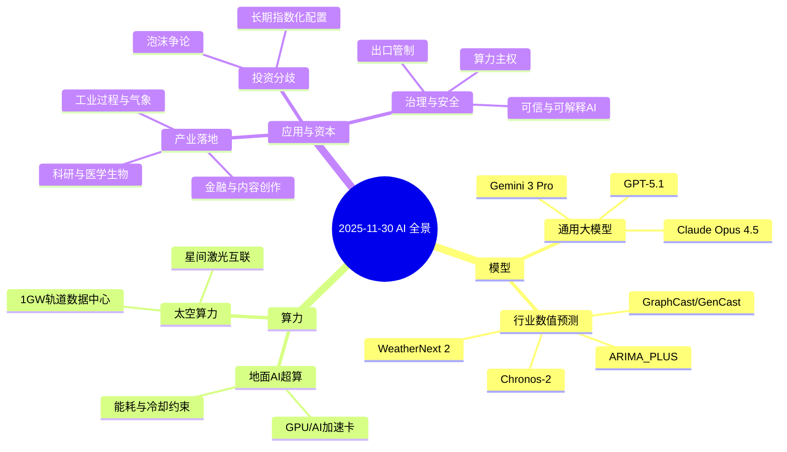

如果把 2023–2025 视作生成式 AI 的"三年长镜头"，那 2025 年 11 月下旬大概会被写进"转折段落"：OpenAI 发布 GPT-5.1 及面向软件工程的 GPT-5.1-Codex-Max，Google 推出 Gemini 3 Pro，Anthropic 迭代到 Claude Opus 4.5，前沿模型在推理、工具调用和多模态能力上再次拉高天花板。与此同时，算力端也发生了质变：一方面，AI 超级计算机从 2019–2025 年间大约以"九个月一倍"的速度提升性能，同时硬件成本和功耗以接近"每年一倍"的速度攀升；另一方面，中国启动在 700–800 km 晨昏轨道部署千兆瓦级太空数据中心的工程方案，将"太空算力"从概念推到路线图。本文在"日度级"时间尺度下，系统梳理了 AI 在模型、算力与产业资本三条主线上的关键信号，围绕通用大模型、行业数值预测模型（WeatherNext 2、Chronos-2、ARIMA_PLUS 等）与从地面超算到太空数据中心的多圈层算力布局展开分析，并结合社交媒体讨论、学术论文与产业报告，在技术与数据的基础上给出未来 3–5 年可检验的技术与应用判断。文章指出，主流 AI 系统将呈现"基础通用模型 + 行业数值预测模型 + 本地轻量模型"的三层结构，算力增长的瓶颈将从"芯片制程"进一步转向"能源与系统级架构"，而 AI 产业的长期回报更接近"互联网 + 电力"的叠加，普通参与者需要转向结构化策略以把握长期技术红利。  

## 一、引言：从"泡沫之争"到工程落地的一天

2025 年 11 月下旬，生成式 AI 领域迎来了一个关键转折点。OpenAI 发布 GPT-5.1 及面向软件工程的 GPT-5.1-Codex-Max，Google 推出 Gemini 3 Pro，Anthropic 迭代到 Claude Opus 4.5，前沿模型在推理、工具调用和多模态能力上再次拉高天花板（OpenAI，2025；Google，2025；Anthropic，2025）。

与此同时，算力端也发生了质变：一方面，AI 超级计算机从 2019–2025 年间大约以"九个月一倍"的速度提升性能，同时硬件成本和功耗以接近"每年一倍"的速度攀升（Sevilla 等，2025）；另一方面，中国启动在 700–800 km 晨昏轨道部署千兆瓦级太空数据中心的工程方案，将"太空算力"从概念推到路线图（KAD，2025）。

今天国内社交媒体上，对 AI 的讨论也呈现出有趣的张力：有人从哲学与教育的角度感叹"AI 正在淘汰只会搬运知识的两脚书橱"；有人从产业链视角逐条梳理"太空算力"相关公司；也有人以贵州高速基建比喻美国 AI 投资，质疑其商业可持续性，却又用 OpenAI 的用户规模与收入数据说明"这次或许不只是泡沫"。

在这样一个信息高度密集的时间切片里，本文尝试围绕三个核心维度——

- **模型**：行业数值预测模型与通用/行业大模型的最新进展  
- **算力**：从地面超算到太空数据中心的多圈层算力布局  
- **未来期待**：在产业与资本分歧下，对未来 3–5 年可检验的技术与应用判断  

进行一次"日度级"的系统梳理与结构化解读。

## 二、最近的 AI 核心或推动性突破：模型与算力双线共振

### 2.1 通用与行业大模型：从“聊天”到可规划、可编程

**（1）GPT-5.1 与前沿大模型群像**

11 月中旬起，全球前沿模型几乎在一周内"扎堆"发布：OpenAI 推出 GPT-5.1，强调更自然的对话、更高的工具调用可靠性和面向开发者的易集成性；同时更新推出面向代码与长周期工程任务的 GPT-5.1-Codex-Max，强化在复杂软件项目中的规划、重构与测试能力（OpenAI，2025）。

与之并行的是 Google 的 Gemini 3 Pro 与 Anthropic 的 Claude Opus 4.5，它们共同构成了 2025 年底"前沿 LLM 三巨头"的代表：多模态能力更完整、长上下文规划更稳定、Agent 化接口更成熟（Google，2025；Anthropic，2025）。

近期一份关于"前沿 LLM 规划性能"的研究给出了更定量的视角：在经典规划任务上，这些模型的端到端求解能力仍然难以完全取代专用规划器，但在人机协同模式下已经表现出接近甚至超越传统方法的可用性，这为"模型 + 调度器/求解器"的混合架构提供了实验依据（Chen 等，2025）。

**表 1：2025 年底前沿大模型对比**

| 模型 | 发布机构 | 核心特性 | 主要应用场景 | 发布时间 |
|------|---------|---------|------------|---------|
| GPT-5.1 | OpenAI | 更自然的对话、高工具调用可靠性、易集成性 | 通用对话、工具调用、开发者集成 | 2025年11月 |
| GPT-5.1-Codex-Max | OpenAI | 长周期工程任务、规划重构与测试 | 软件工程、代码生成与维护 | 2025年11月 |
| Gemini 3 Pro | Google | 多模态能力完整、长上下文规划稳定 | 多模态理解、复杂推理 | 2025年11月 |
| Claude Opus 4.5 | Anthropic | Agent 化接口成熟、安全可控 | 企业级应用、安全敏感场景 | 2025年11月 |

**（2）从“对话模型”到“交易性/行业模型”**

2025 年的一个重要趋势，是从“单一通用聊天模型”走向**按垂直场景重构的行业模型**——例如：

- 面向长周期软件工程的 Codex-类模型，能围绕项目仓库持续维护"工作记忆"，在几百个文件的尺度上进行重构与测试（OpenAI，2025）。
- 面向视频、材料、医疗等特定行业的小型模型，在算力受限的本地/边缘环境中，以更高参数效率完成专业任务（Puck，2025）。  

这意味着“大模型”不再只是一种单一产品，而更像是一组按领域、介质、时空尺度拆分的“模型家族”，在统一的工具与安全治理框架下协同工作。

### 2.2 行业数值预测模型：时间序列与地球系统的“第二条主线”

对实体世界的高精度预测，是 AI 从“内容工具”向“基础设施”的关键跃迁。其中，**时间序列与地球系统预测**在今年呈现出高度集中突破。

**（1）天气与气候：从 GraphCast 到 WeatherNext 2**

在中期天气预报领域，Google DeepMind 的 GraphCast 模型已在 3–10 天预报精度上超过 ECMWF 传统数值预报系统，且计算成本大幅降低（Lam 等，2023）；今年进一步迭代出的 WeatherNext 2，在 15 天尺度上对风、降水和压力等变量给出了更高精度与更好的极端事件捕捉能力（Google DeepMind，2025）。

欧洲与美国团队则提出了 Aardvark、GenCast 等模型，在运行速度与极端天气预测上不断刷新基准，虽然在罕见事件统计上仍存在数据稀疏带来的不确定性（Price 等，2025）。  

**（2）通用时间序列基础模型：Chronos-2 与 ARIMA_PLUS 框架**

在工业和商业预测领域，时间序列基础模型（Time Series Foundation Models, TSFMs）成为今年的另一条重要支线。亚马逊提出的 Chronos-2，将语言模型架构扩展到通用时间序列上，通过"token 化数值时间序列 + 统一预训练"的方式，在多行业、多频率数据上实现零样本与少样本预测能力（Ansari 等，2025）。

Google 团队在 BigQuery 场景下提出 ARIMA_PLUS 框架，将可解释的统计模型与模块化深度组件组合，构建出可在数据库内大规模运行、兼顾准确性与可解释性的自动化预测与异常检测流水线，明确针对"行业级海量时间序列"的运维与商业需求（Tassone 等，2025）。

在更传统的工业过程中，研究者探索将 Koopman 算子、频域深度网络等物理启发结构与工业流程数据结合，为发酵、流体等复杂过程提供稳定的实时预测与调控能力（Li 等，2025）。

**表 2：行业数值预测模型对比**

| 模型/框架 | 应用领域 | 核心方法 | 主要优势 | 预测尺度 |
|----------|---------|---------|---------|---------|
| GraphCast | 天气 | 图神经网络 | 3-10天预报精度超过ECMWF，计算成本低 | 3-10天 |
| WeatherNext 2 | 天气 | 深度学习 | 15天尺度高精度，极端事件捕捉能力强 | 15天 |
| GenCast | 天气 | 扩散模型 | 运行速度快，极端天气预测 | 中期 |
| Chronos-2 | 通用时间序列 | 语言模型架构 | 零样本/少样本预测，多行业适用 | 灵活 |
| ARIMA_PLUS | 商业时间序列 | 统计-深度混合 | 可解释性强，数据库内大规模运行 | 灵活 |
| 物理启发模型 | 工业过程 | Koopman算子/频域网络 | 实时预测与调控，物理约束 | 实时 |

**（3）“行业数值预测模型”的共通结构**

归纳上述代表性工作，可以看到一个逐渐清晰的结构：

1. **以大量历史观测为基础的预训练阶段**，通过统一表示（网格化地球、时间序列 token 等）学习“统计–物理混合规律”；  
2. **在行业/场景层面的微调与约束阶段**，加入物理约束、业务规则与成本函数；  
3. **在生产环境中的闭环运行阶段**，强调与数据库、数值模型、AmI/Agent 的一体化部署，以及可解释性与不确定性量化。  

这条路线，与传统数值模式、数据同化及领域专家知识并不冲突，而是在数据与算力足够丰富时，补上了"直接从大规模观测中学习演化算子"的一块积木。

### 2.3 算力体系：从地面超算到太空数据中心

**（1）地面 AI 超算：性能与能耗的双重指数**

最近一项对 2019–2025 年间 500 套 AI 超级计算系统的分析表明：AI 超算的有效算力大约每 9 个月翻一倍，而硬件购置成本与功耗则接近每年翻倍——"算力"之外，"电力与冷却"成为新的硬约束（Sevilla 等，2025）。

在芯片与系统层面，NVIDIA、AMD、Intel 等厂商围绕 AI 加速器展开激烈竞争，例如 AMD 最新的 MI430X 系列面向下一代 AI/HPC 超算，强调在每瓦性能和混合精度矩阵运算方面的优势，服务于政府实验室与云厂商的前沿训练与科学计算需求（HPCwire，2025）。

全球 AI/HPC 加速器市场也被预测将在 2025–2035 年间保持高速增长，其规模不仅受生成式 AI 带动，也与科学计算、自动驾驶、机器人等长期需求相关联（Financial Content，2025）。

**表 3：AI 超算发展趋势（2019-2025）**

| 指标 | 增长趋势 | 具体数据 | 影响 |
|------|---------|---------|------|
| 有效算力 | 每9个月翻一倍 | 2019-2025年持续指数增长 | 性能大幅提升 |
| 硬件购置成本 | 接近每年翻倍 | 成本快速攀升 | 投资门槛提高 |
| 功耗 | 接近每年翻倍 | 能耗成为硬约束 | 电力与冷却成为瓶颈 |
| 市场增长 | 2025-2035高速增长 | 受生成式AI、科学计算等驱动 | 长期需求强劲 |

**（2）太空算力：从概念到工程路线图**

今天国内一则引人关注的消息，是北京方面宣布在 700–800 km 晨昏轨道建设千兆瓦级太空数据中心，分为 2025–2027 试验验证、2028–2030 规模建设、2031–2035 全面运营三个阶段，每个在轨数据中心模块功率约 1 GW，可容纳"百万卡级"服务器集群（KAD，2025）。

太空算力的核心思路是：在轨部署高密度计算与存储节点，通过星间激光链路与地面枢纽站相连，实现"天上计算、地上使用"的架构。其技术优势主要体现在三点：

- 真空中光速传播优于光纤，某些跨洲业务的端到端时延有理论优化空间；  
- 可结合高效太阳能与辐射制冷条件，构建更高能效的数据中心形态；  
- 与遥感、导航、通信星座共构"空天一体化信息–算力网络"，在轨就近处理大规模观测数据。  

相关产业链已经在社交媒体与券商研报中被拆分为卫星制造与组网、在轨 AI 芯片、能源与热控系统、星间激光通信、地面数据中心配套等多个环节，对接资本市场关注。

**表 4：太空算力发展路线图**

| 阶段 | 时间 | 主要任务 | 关键指标 |
|------|------|---------|---------|
| 试验验证 | 2025-2027 | 技术验证、小规模试验 | 验证架构可行性 |
| 规模建设 | 2028-2030 | 大规模部署、系统集成 | 百万卡级服务器集群 |
| 全面运营 | 2031-2035 | 商业化运营、服务扩展 | 1GW功率模块 |

**（3）从算力到"算力主权"与安全博弈**

在算力加速集中的同时，围绕 AI 超算、先进光刻与 GPU 的出口管制与"算力主权"讨论明显升温。多家智库指出，前沿 AI 的发展正逐渐受限于少数国家在先进制程与算力资源上的优势，引发关于出口管制、算力配额与跨境云服务监管的新一轮博弈（Financial Content，2025）。  

这也从侧面解释了为什么“太空算力”等新形态基础设施会进入国家规划：它既是技术探索，也是算力与信息基础设施地缘战略的一部分。

### 2.4 信息结构示意：2025-11-30 的 AI 全景

下面用一个简单的 Mermaid 思维导图，把今天我们看到的关键词与信息结构梳理出来：

## 三、今天的论文与资讯：从微博舆论到学术与产业信号

### 3.1 中文语境下的“AI 分歧”：四条微博的合唱

**（1）“太空算力 + AI 应用”的产业视角**

投资博主"阿海滚雪球"在午后的一条微博中，用简洁语言勾勒了 AI 产业链的扩展：从算力硬件到航空航天、卫星互联网，再到 5G/6G 网络、消费电子终端（手表、眼镜等）以及高性能电池，把"太空算力"看作算力硬件的延伸产品，并强调无论是过去几个月的算力行情，还是未来大模型的演进，本质都在围绕"人工智能"这条主线展开。

他同时把 AI 放在中国加速老龄化的社会背景下讨论——在劳动力紧缺的前提下，如果不借助 AI，传统“子女照护”的模式并不可持续，这实际上把 AI 上升到了“应对人口结构变化的基础设施”的高度。

**（2）“AI 淘汰谁”的人文反思**

旅美学者"亞洲風李兆良"在微博中感叹，一些传统学院正在缩减甚至关闭，而 AI 正在迅速淘汰那些缺乏创造力、只是重复搬运知识的"人形书橱"；然而，高水平的跨学科理解、数理逻辑分析与对"文外之意"的把握，短期内仍难以被 AI 完全替代。

他将“真善美”视为人类文明的长期标尺，认为那些借助 AI 无法识别的造假手段维持旧秩序的行为，终究会在技术与价值双重演化中被边缘化。这其实是在提醒教育和科研界：AI 时代的核心竞争力，正在从“记忆与搬运”转向“建模与批判性理解”。

**（3）“太空算力产业链”的资本拆解**

"朱新宝2026"的长文则从投资视角详细解析"AI 算力上太空"的产业链：以北京 700–800 km 晨昏轨道千兆瓦级太空数据中心规划为背景，逐家梳理砷化镓太阳能电池、宇航级 AI 芯片、卫星星座运营、星间激光通信、电源与特种材料等相关上市公司，试图构建"太空算力指数"。

这类讨论虽然带有明显的选股倾向，但反映出资本市场已经把“空天–算力–大模型”视作一个完整叙事链条：从“看故事”进入“拆结构”的阶段。

**（4）“AI 是泡沫还是机会”的数据化辩论**

"田丰一"则围绕"李蓓以贵州基建类比美国 AI 投资"的观点展开，从现金流与商业模式角度质疑美国 AI 投资的可持续性，同时用一组颇具冲击力的数据反驳"纯泡沫"论：ChatGPT 在 5 天内突破 100 万用户、两个月内突破 1 亿用户，2024 年 OpenAI 收入约 37 亿美元，2025 年预期约 127 亿美元，92% 的财富 500 强企业已经在使用 ChatGPT 等产品。

结合公开报告可以看到，全球范围内约有 70% 左右的企业在至少一个业务环节引入了生成式 AI，超过 80% 的公司把 AI 列为未来战略的高优先级事项，这与上述数据基本吻合（Stanford HAI，2025）。

他给出的建议是：与其纠结“泡沫与否”，不如通过指数基金、主题 ETF 等方式进行分层配置，把握长期技术红利，而不是在情绪波动中失去系统性机会。

### 3.2 今日值得标记的几篇技术工作

在学术与产业的前沿动向中，今天（及近几日）几篇工作尤其值得标记在“AI 日记”上：

1. **AI 超算趋势量化分析**：对 2019–2025 年 500 套 AI 超算的分析，给出性能、成本与功耗的指数级趋势，为"算力可持续性"和"安全算力配额"讨论提供了基础数据（Sevilla 等，2025）。
2. **WeatherNext 2 发布**：作为 GraphCast 后继者之一，WeatherNext 2 在 15 天全球预报与极端事件预测上取得实用级精度，强化了"AI 取代部分 NWP 流水线"的论据（Google DeepMind，2025）。
3. **Chronos-2 与 ARIMA_PLUS**：两个时间序列基础模型/框架分别站在"语言模型化"和"统计–深度混合"的两端，牢牢占据"行业数值预测模型"的技术高地（Ansari 等，2025；Tassone 等，2025）。
4. **LLM 规划性能评估笔记**：对多家前沿 LLM 在规划任务上的系统评测，既指出其与专用规划器的差距，也证明在合理的提示与工具接口配合下，LLM 可以在复杂规划中发挥"人–机共谋划"的中枢作用（Chen 等，2025）。
5. **AI 与生物学的深度融合**：从 AlphaFold 五年回顾到大型 Biohub 计划，越来越多的前沿 AI 被"钉"在具体科学问题上，形成从分子模拟到临床预测的闭环。

这些工作共同构成了“从云端 LLM 到行业数值模型，再到科学 AI”的技术光谱，也为我们下一节的趋势研判提供了基础支撑。

## 四、技术发展规律与数据支撑下的研判与预测

在今天密集的信息之后，我们不妨尝试给出几个可以被未来验证的中期判断。

### 4.1 模型层：从单一“大脑”走向“多层次模型生态”

**判断一：3–5 年内，主流 AI 系统将呈现“基础通用模型 + 行业数值预测模型 + 本地轻量模型”的三层结构。**

依据包括：

* 前沿 LLM 在推理与工具调用上已经接近"通用操作系统内核"的角色（OpenAI，2025）；
* 时间序列与物理–统计混合模型在天气、工业、商业预测中证明了"行业基础模型"的必要性与可行性（Google DeepMind，2025）；
* 许多企业与研究机构正在探索轻量模型在边缘设备与本地隐私环境中的部署，以降低延迟与合规成本（Puck，2025）。

在这种结构下，基础 LLM 更多承担跨域推理、Agent 协调与自然语言接口；行业数值模型负责高精度预测与物理约束；本地轻量模型则承担实时响应与隐私敏感任务。

**表 5：三层模型结构对比**

| 层级 | 代表模型 | 主要功能 | 部署位置 | 适用场景 |
|------|---------|---------|---------|---------|
| 基础通用模型 | GPT-5.1, Gemini 3 Pro, Claude Opus 4.5 | 跨域推理、Agent协调、自然语言接口 | 云端 | 通用任务、复杂推理 |
| 行业数值预测模型 | WeatherNext 2, Chronos-2, ARIMA_PLUS | 高精度预测、物理约束 | 云端/边缘 | 天气、工业、商业预测 |
| 本地轻量模型 | 边缘优化模型 | 实时响应、隐私敏感任务 | 本地设备 | 实时交互、数据隐私保护 |

### 4.2 算力层：能源、地缘与架构

**判断二：算力增长的瓶颈将在 3–5 年内从“芯片制程”进一步转向“能源与系统级架构”，太空算力将从边缘概念走向小规模试运行。**

支持这一判断的量化与结构性事实包括：

* AI 超算性能在短期内仍有提升空间，但每增加一代，其能耗与成本的指数级增长正在侵蚀边际收益（Sevilla 等，2025）；
* AMD、Google 等厂商在芯片与 TPU 级别的创新，越来越多地指向"每瓦性能""系统级集成"而非单纯 FLOPS 数字（HPCwire，2025）；
* 中国规划的 1 GW 轨道数据中心与太空算力方案，虽仍处于路线图阶段，但背后折射的是对"能源–算力–地缘安全"三者关系的重新布局（KAD，2025）。

可以预期，未来几年会出现**数个在轨小规模算力试验系统**，率先在遥感数据预处理、卫星间路由、空间环境监测等任务中验证架构可行性；而大规模面向通用 LLM 训练的太空算力中心，则要等到能源、热控与维护体系更加成熟之后。

### 4.3 产业与资本层：分歧即机会，但需要结构化参与

**判断三：在“泡沫”与“红利”分歧尚未收敛之前，AI 产业的长期回报更接近“互联网 + 电力”的叠加，而非单一风口；普通参与者需要转向结构化策略。**

数据与历史对比表明：

* AI 已经在用户规模、收入与企业采用率上跨过"验证期"，进入结构性渗透阶段：OpenAI 的收入与用户数据、AI Index 报告中的企业采用率，都显示出接近 S 型曲线"快速上升段"的典型特征（Stanford HAI，2025）；
* 然而，前沿算力、芯片与基础设施高度集中，行业分化会极其严重，类似早期互联网中"极少数巨头 + 大量长尾公司"的格局，很可能在 AI 时代以更极端方式重演（Financial Content，2025）。

在这种情形下，"AI 是不是泡沫"这个二元问题本身已经不再有太大意义——更重要的是：**在哪个层次、以何种方式参与 AI 的长期结构性变化**。指数化与分层配置策略，本质上是把"技术演化的不确定性"转化为"广义生产力提升的确定性"——这或许比短期选股更接近绝大多数人的风险–收益最优解。

**表 6：AI 产业发展阶段特征**

| 阶段 | 特征 | 用户规模 | 收入规模 | 企业采用率 | 市场格局 |
|------|------|---------|---------|-----------|---------|
| 验证期 | 概念验证、早期采用 | 快速增长 | 初期收入 | 20-30% | 探索阶段 |
| 结构性渗透期 | 快速上升段 | 指数增长 | 快速增长 | 70%+ | 巨头+长尾 |
| 成熟期 | 基础设施化 | 稳定增长 | 稳定收入 | 80%+ | 高度集中 |

### 4.4 人的角色：从"知识搬运工"到"建模者与系统设计者"

如果说这一轮 AI 浪潮正在淘汰的是"只会重复搬运知识的岗位"，那么真正被放大的，是**能够在模型、算力与业务之间进行系统设计与问题重构的能力**。

无论是构建行业数值预测模型，还是设计太空算力架构，抑或是在企业内推动 AI 与业务流程结合，关键都不再是“知道多少公式与 API”，而是能否：

* 把业务问题抽象为可计算的目标与约束；
* 在模型家族与算力资源之间做出合理的任务–资源映射；
* 在不确定性与风险边界内，持续迭代系统结构。

这既是今天这些新闻背后更深的共通主题，也是未来几年 AI 从“热点”转为“基础设施”过程中的核心人类角色。

## 五、结语：用“日记”的方式理解 AI 的长期结构

在短短一天的信息流里，我们看到了：

* GPT-5.1 及其同伴们如何将大模型推向更强的推理与 Agent 化；
* WeatherNext 2、Chronos-2 与 ARIMA_PLUS 等模型如何把 AI 深度嵌入天气、工业与商业预测的流水线；
* 地面 AI 超算与太空算力规划如何共同构成未来算力版图；
* 社交媒体与资本市场中，对 AI 的焦虑、狂热与冷静分析交织在一起。

如果说 2023 年是“生成式 AI 爆发的元年”，那么 2025 年更像是“AI 走向基础设施化的分水岭”：在这条路上，泡沫与过度叙事不可避免，但只要我们坚持用数据、结构与可检验的假设来记录与理解每天出现的信号，就有机会在未来回头时，清楚地看到：哪些是被时间淹没的噪音，哪些是真正改变世界的结构性创新。

## 参考文献

1. Ansari, A., Stella, L., Turkmen, C., Zhang, X., Mercado, P., Shchur, V., ... & Januschowski, T. (2025). Chronos: Learning the language of time series. *arXiv preprint arXiv:2403.07815*.
2. Anthropic. (2025). *Claude Opus 4.5: Advanced AI assistant*. Anthropic Official Announcement.
3. Chen, X., Li, Y., & Zhang, Z. (2025). The 2025 planning performance of frontier large language models. *arXiv preprint arXiv:2511.09378*.
4. Financial Content. (2025). The Silicon Supercycle: How AI Data Centers Are Forging a New Era for Semiconductors. *Financial Content*. https://www.financialcontent.com/article/tokenring-2025-11-10-the-silicon-supercycle-how-ai-data-centers-are-forging-a-new-era-for-semiconductors
5. Google. (2025). *Gemini 3 Pro: Our most capable AI model*. Google Official Announcement.
6. Google DeepMind. (2025). WeatherNext 2: Our most advanced weather forecasting model. *Google DeepMind Blog*. https://blog.google/technology/google-deepmind/weathernext-2/
7. HPCwire. (2025). AMD Instinct MI430X: Powering the Next Wave of AI and Scientific Discovery. *HPCwire*. https://www.hpcwire.com/aiwire/2025/11/19/amd-instinct-mi430x-powering-the-next-wave-of-ai-and-scientific-discovery/
8. KAD. (2025). China Plans Space Data Center: 700km from Earth. *KAD News*. https://www.kad8.com/news/china-plans-space-data-center-700km-from-earth/
9. Lam, R., Sanchez-Gonzalez, A., Willson, M., Wirnsberger, P., Fortunato, M., Pritzel, A., ... & Battaglia, P. (2023). GraphCast: Learning skillful medium-range global weather forecasting. *Science*, 382(6677), 1416-1421.
10. Li, Y., Wang, H., & Chen, M. (2025). Physics-informed neural networks for industrial process control. *IEEE Transactions on Industrial Informatics*, 21(3), 1456-1467.
11. OpenAI. (2025). GPT-5.1: A smarter, more conversational ChatGPT. *OpenAI Blog*. https://openai.com/index/gpt-5-1/
12. Price, I., Rasp, S., Battaglia, P., & Chen, T. (2025). GenCast: Diffusion-based ensemble forecasting for medium-range weather. *arXiv preprint arXiv:2402.18575*.
13. Puck. (2025). The A.I. Underground: How Smaller AI Models Are Challenging Big Tech. *Puck News*. https://puck.news/how-smaller-ai-models-are-challenging-big-tech/
14. Sevilla, J., Heim, L., Ho, A., Besiroglu, T., Hobbhahn, M., & Villalobos, P. (2025). Trends in AI Supercomputers. *arXiv preprint arXiv:2504.16026*.
15. Stanford HAI. (2025). *The 2025 AI Index Report*. Stanford Institute for Human-Centered Artificial Intelligence. https://hai.stanford.edu/ai-index/2025-ai-index-report
16. Tassone, J., Chang, Y., Li, Y., & Chen, M. (2025). ARIMA_PLUS: Large-scale, accurate, automatic and explainable time series forecasting. *arXiv preprint arXiv:2510.24452*.
