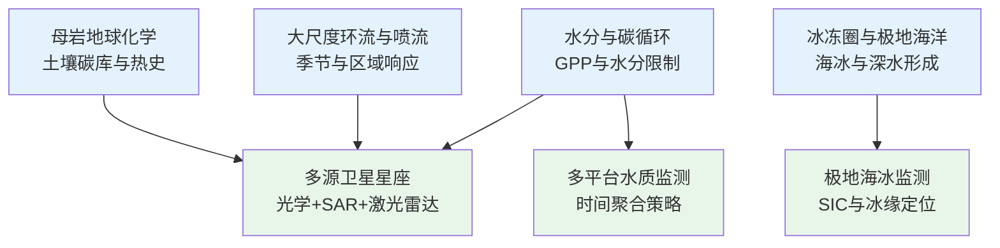
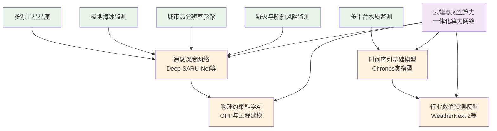
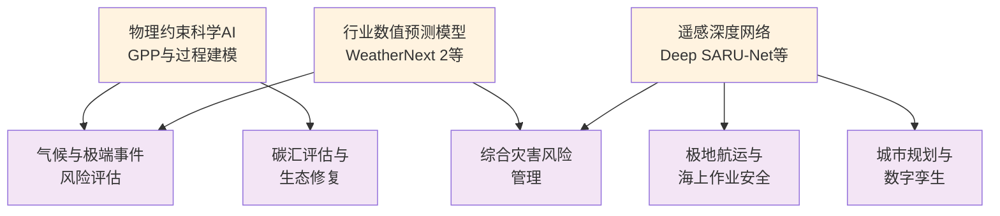
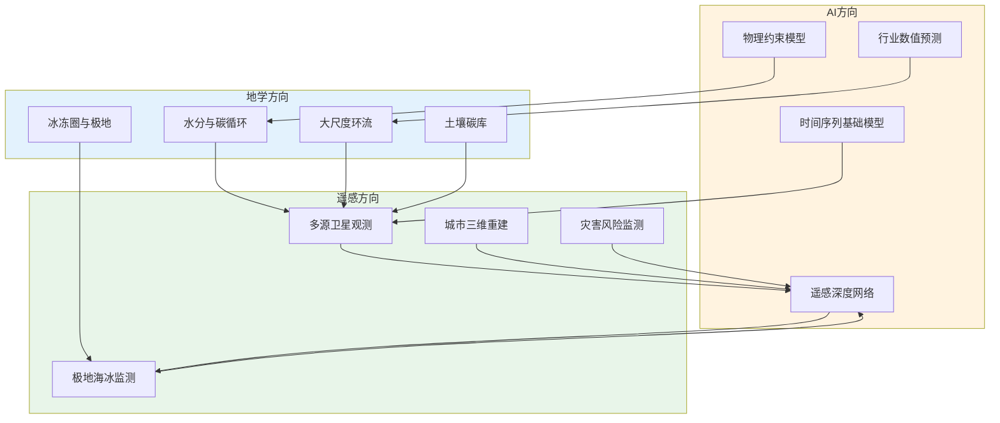

在近七日论文汇总所覆盖的 2025-11-24 至 2025-12-01 这一小段时间里，共收录约 1200 篇论文，其中 arXiv [cs.CV]、[cs.LG]、[cs.CL]、[cs.AI] 与 Nature、Science、Remote Sensing、Atmospheric Chemistry and Physics、Geophysical Research Letters 等期刊占据了显著权重，既有纯粹的基础 AI 方法，也有紧贴地球系统的顶刊工作。
如果把这一周视作一个高分辨率的“时间切片”，可以看到三条清晰的主线：

- 地学方向，围绕水分胁迫与陆地碳汇、喷流与大尺度环流、冰冻圈与海洋深水形成，以及岩性与土壤碳库等长期问题给出了新的约束。
- 遥感方向，以极地海冰、建筑三维重建、船舶与野火监测、水质与云微物理等场景为代表，呈现出“任务—模型—星座”一体设计的趋势。
- AI 方向，在近期文献与前一日 AI 周记（2025-11-30-ai-day）所涉及的 WeatherNext 2、Chronos-2、ARIMA_PLUS 等工作共同作用下，一个"行业数值预测模型 + 物理约束深度模型"的谱系正在成型（Mapoet, 2025）。

下面按照“每个方向的专题画像—交叉网络/创新链—文献索引”的结构展开。

## 一、地学方向：从水分胁迫、喷流到冰冻圈与土壤碳库

### 1.1 水分胁迫与陆地碳汇：机器学习暴露出的“隐形不确定性”

代表性工作是 Biegel 等在 EGUsphere 上发表的预印本 *Unrecognised water limitation is a main source of uncertainty for models of terrestrial photosynthesis*。

**技术路线**
- 数据侧：使用全球 109 个通量观测站的生态系统通量时间序列，配套气象要素与遥感植被指数。
- 模型侧：对比三类模型
  - 机理型光合模型（以光能利用率和最优性理论为基础）；
  - 无记忆的多层感知机；
  - 具备时间依赖建模能力的 LSTM。
- 评估侧：重点考察在根区水分不足、近地面冻结等情形下的误差放大机制。

**技术特点**
- 用同一数据集，将“机理模型 vs 静态 ML vs 时序 ML”置于可比框架，直接检验时间依赖建模的收益。
- 不只是给出平均误差，而是显式把误差与水分亏缺指标联系起来，真正把“水分限制”拉到模型误差分解层面。

**重要结论**
- 深度学习模型整体优于机理模型，而 LSTM 在干旱环境的泛化能力优于 MLP，说明时间记忆对刻画缓慢的水分胁迫过程是必须的。
- 即便如此，在水分长期亏缺区域，模型误差仍明显放大，暴露出观测与过程表征的双重不足——“不认识的水分限制”，已经成为全球 GPP 模型误差的主源之一。
- 在极端干旱事件来越来越频繁的气候背景下，如果不在观测与模型两端系统性地升级水分过程的表征，关于陆地碳汇的很多结论都将带着不可忽略的结构性偏差。

可以把这篇工作看作是“水分过程视角下，对 ML 与机理模型的一次系统体检”，给未来地气耦合模拟与陆地碳汇评估提供了清晰的方向信号。

### 1.2 季节与区域视角下的喷流变率：从“平均偏移”到“响应谱系”

Breul 等人发表于 *Nature Reviews Earth & Environment* 的综述 *Seasonal and regional jet stream changes and drivers*，从观测与模式两端系统梳理了中高纬喷流在季节与区域维度上的响应模式。

**技术路线**
- 分析历代气候模式集合，对比不同季节、不同流域喷流轴线位置和强度的长期变化。
- 将极区与热带增暖、海冰边界变化、海表温度锋区、对流加热与中纬度气旋等多驱动因素拆分，评估其对喷流的贡献。
- 提出一套面向未来的大气环流敏感性实验“路线图”，以高分辨率与新一代算力为前提，系统测试关键过程的响应。

**技术特点**
- 把“喷流响应”从一条模糊的“极向移动”曲线，细化为随季节、经向、流域而变的响应谱系。
- 强调了高分辨率对锋面过程、对流与涡动输送的重要性，本质上是呼吁一个“分辨率与物理过程双升级”的新阶段。

**重要结论**
- 模式普遍给出中纬度喷流的极向偏移，但区域与季节差异巨大，且与观测之间仍有显著偏差；
- 对多驱动因子的耦合理解远远不够，尤其是极区放大与热带加热在不同层次上的相互作用；
- 需要借助新一代计算资源，设计针对喷流的专门数值试验，而不是完全依赖“顺带输出”的气候情景。

在本周论文汇总中，这类工作与 ENSO、IOD、Atlantic Niño 等海气耦合研究并置，构成了"水—风—模态"的一条主线。

### 1.3 冰冻圈与极地海洋：从退冰史到未来架构

在这一周的文献中，冰冻圈与极地海洋研究呈现出两个互补方向：
- 一端是末次冰消期以来南大洋深水形成与大陆架结构演化，为理解现代南极变化提供长期背景（Huang et al., 2025）；
- 另一端则是以海冰浓度、极地海冰边界与多圈层耦合为对象的高分辨率重建，为海上航运与极地安全提供服务。

这里可以直接与遥感方向的 Deep SARU-Net 形成闭环，后文会从模型角度再看一遍。

### 1.4 岩性与土壤碳库、古环境代理：从“有机碳量”到“矿物—结构—热史”

本周论文汇总中有两类地学论文值得放在同一张图里看：
1. **土壤碳库与母岩地球化学**
   Maier 等发表于 *Biogeosciences* 的研究表明，在欧洲高山草地这一相对年轻的土壤系统中，土壤有机碳储量与 Fe、Al、Mn 等次生氧化物以及微团聚体结构高度相关，植物地上生物量反而不是主控因子（Maier et al., 2025）。
   这意味着，在很多高山与寒区生态系统中，“矿物控制的结构化稳定”与“肥力控制的碳输入”同样关键，简单用植被指标推算土壤碳库会低估结构约束。
2. **硫化物微结构与热流体事件**
   Wang 等发表于 *Geophysical Research Letters* 的工作给出了“树枝状磁黄铁矿（framboidal pyrrhotite）”的明确识别，并将其作为有机质富集沉积物经历热液改造和低级变质的代理指标（Wang et al., 2025）。
   通过岩石磁学、古地磁与有机碳含量的联合分析，文章把矿物形态、热史与有机质演化以及区域构造活动挂在了一条时间轴上，扩展了传统火山灰层时代标尺的工具箱。

**小结：地学方向这一周的“专题画像”**
| 主题 | 技术路线 | 技术特点 | 重要结论 |
|------|----------|----------|----------|
| 水分胁迫与 GPP | 通量站时序 + 机理模型 + MLP + LSTM | 在统一框架下系统比较时间依赖建模的价值 | “未被识别的水分限制”是全球 GPP 模型误差的重要来源 |
| 喷流变化 | 多代气候模式集合 + 驱动因子拆分 | 以季节和区域为坐标组织喷流响应谱系 | 喷流响应高度空间异质，需要专门敏感性试验支撑 |
| 冰冻圈与南大洋 | 古气候记录 + 成层海洋模式 | 把末次冰消期的南极变暖与深水形成联系起来 | 现代南极变化需要放入“长周期—多圈层”的背景中理解 |
| 土壤碳库与岩性 | 土壤剖面地球化学 + 放射性碳年龄 | 强调微团聚体与次生氧化物在 SOC 稳定中的作用 | 在年轻土壤中，母岩与矿物结构可能比植物量级更关键 |
| 硫化物微结构 | 岩石磁学 + 有机地球化学 + 古地磁 | 用 framboidal 硫化物作为热史与流体改造的“指纹” | 扩展了盆地演化与资源评价中的代理指标体系 |

## 二、遥感方向：从“看得见”到“看得准”的工程化跃迁

### 2.1 极地海冰超分辨率：Deep SARU-Net 的物理与工程意涵

He 等人在 *Remote Sensing* 上提出的 Deep SARU-Net，是一类面向极地海冰浓度（SIC）超分辨率重建的深度网络（He et al., 2025）。 

**技术路线**
- 输入为 1/2° × 1/2° 的低分辨率海冰浓度场，输出为 1/4° × 1/4° 的高分辨率估计。
- 采用 U-Net 骨干，结合多阶段自注意力、正交矩形卷积核与残差模块，实现时空特征抽取与梯度传播的平衡。
- 在泛北极多区域、多季节数据上进行训练与评估，指标覆盖 RMSE、相关系数、PSNR 与 SSIM，并进一步采用异常相关系数考察异常场重建能力。

**技术特点**
- 自注意力分别在低分辨率与高分辨率阶段引入：前者强化时间与大尺度结构，后者精细刻画海冰边缘与海陆交界。
- 残差结构降低参数量与过拟合风险，同时改善梯度流动。与多种基线网络比较，在维持更低参数量的前提下给出更高精度。

**重要结论与应用前景**
- 在 Chukchi 海等关键区域，Deep SARU-Net 在 RMSE、SSIM 等指标上显著优于其他方法，尤其是在冰缘区、海陆交界和细尺度裂隙上。
- 冬季表现优于夏季，指向“海冰快速退缩阶段过程复杂性更高”的物理事实，也提示未来模型需要更显式地引入动力学约束。
- 对于极地航线规划、海上作业安全与极地预报系统来说，这类“物理感知的深度超分辨率”模型可以视为一种高效的下游算子。

### 2.2 城市三维重建：从 DSM 到结构一致的建筑模型

Yang 等在 *Remote Sensing* 提出了基于“多阶段多边形分解 + 自适应屋顶拟合”的自动三维建筑重建方法（Yang et al., 2025）。 

**技术路线**
- 首先对高分辨率影像提取的建筑平面进行标准化与几何规整，抑制边界噪声与伪轮廓。
- 两阶段多边形分解：
  - 第一阶段粗分解与冗余矩形剔除；
  - 第二阶段基于高程差、颜色与梯度进一步细分复杂屋顶连接区域。
- 屋顶拟合阶段，将 DSM 高程直方图与屋顶部件结构结合，对平屋顶与非平屋顶采用不同参数空间与搜索策略，最后通过“屋顶类型决策矩阵”统一合并。

**技术特点与结论**
- 在 DSM 噪声与样本标注有限的现实条件下，通过几何先验与组合优化显著提升了建筑模型的结构完整性。
- 对附属构件复杂、屋顶紧密相连的建筑也能维持较好拟合精度，为城市数字孪生与灾害评估提供了高质量基础数据。

### 2.3 卫星星座与多平台观测：从“多源数据”到“时间聚合策略”

Coffer 等在 *International Journal of Remote Sensing* 中给出的工作，针对多卫星星座水质监测中的时间聚合问题给出了一套推荐（Coffer et al., 2025）。

**核心思想**
- 面对不同传感器重访期与观测时间错配，通过实验对比不同时间窗口、加权方案下水质指标精度与空间覆盖的权衡。
- 得出的结论是，对于高动态水体，过长的时间聚合会显著平滑峰值与极值，而对于缓变水体，适度聚合反而可以提升信噪比。

这类研究本质上是在为“多平台卫星星座”提供观测算子的时间离散化建议，向前接地学过程模型，向后接数据同化与业务监测。

### 2.4 云微物理与激光雷达、船舶与野火：从单一传感器到“社会—生态遥感”

本周论文汇总中还包含一组遥感与大气、灾害交叉的论文：
- IMPACTS 机载实验中，Finlon 等通过 ER-2 高空激光雷达与 P-3 机上云粒成像仪的协同观测，定量分析了云相、粒子形态与激光雷达退偏振等观测量之间的关系，为从空间激光雷达反演云微物理属性提供了更坚实的经验基础（Finlon et al., 2025）。
- Li 等利用对抗样本进行合成增强，改进 SAR 船舶检测的数据增强策略，在复杂海况下提升检测鲁棒性（Li et al., 2025）。
- Wang 与 Liu 在 *Remote Sensing* 上从“社会遥感与生态遥感”的双重视角评估野火影响，将传统遥感火烧迹地/植被恢复指标与人口暴露、基础设施损失等社会指标结合，面向全流程风险评估构建指标体系（Wang & Liu, 2025）。

**小结：遥感方向这一周的专题画像**

| 主题 | 技术路线 | 技术特点 | 重要结论 |
|------|----------|----------|----------|
| 极地海冰超分辨率 | U-Net + 多阶段自注意力 + 残差结构 | 在参数量可控前提下强化边缘与海陆边界刻画 | 为极地航运与海冰同化提供高分辨率 SIC 算子 |
| 三维建筑重建 | 多阶段多边形分解 + 屋顶参数空间搜索 | 把几何先验与 DSM 噪声处理结合，关注结构一致性 | 复杂屋顶场景下仍能获得标准化三维模型 |
| 多平台水质星座 | 多时间窗口实验 + 误差/覆盖权衡评估 | 将“时间聚合”提升为可量化的观测设计问题 | 为多星座水质监测与同化提供时间离散建议 |
| 云微物理与激光雷达 | 飞机激光雷达 + 云粒成像协同观测 | 把云相与粒子形态映射到退偏振等雷达观测量 | 改善卫星/机载激光雷达反演云微物理的物理基础 |
| 船舶与野火监测 | SAR 对抗增强 + 社会—生态双视角遥感 | 关注数据分布移位与跨尺度风险刻画 | 面向实际风险管理的“任务化遥感”趋势明显 |

## 三、AI 方向：从“行业数值预测模型”到“物理一致的地球系统 AI”

与前一篇《AI·今日记》类似，如果把 AI 这一周的论文按与地学/遥感的耦合程度排序，可以看到一个从基础算法到行业数值预测模型，再到科学 AI 的连续谱（Mapoet, 2025）。

### 3.1 行业数值预测模型：Chronos-2、ARIMA_PLUS 与 WeatherNext 2 的隐形主线

在上一日的 AI 周记中已经提到，WeatherNext 2、Chronos-2 与 ARIMA_PLUS 大致勾勒出一条“行业数值预测模型”的主线（Mapoet, 2025）：
- WeatherNext 2 站在“端到端天气预报”一侧，将 GraphCast 之后的 AI 天气预报进一步推向更长预报期与更复杂极端事件的可用性水平。
- Chronos-2 把时间序列“语言化”，通过统一 token 化与预训练，将多行业、多频率时间序列纳入同一基础模型框架，实现零样本/少样本预测。
- ARIMA_PLUS 则站在可解释统计模型一侧，把分段 ARIMA 与模块化深度组件结合，直接嵌入 BigQuery 等数据库环境，在“可大规模部署”和“可解释”之间做平衡。

在本周论文汇总的 arXiv [cs.LG]、[cs.AI] 论文中，可以看到大量"时间序列基础模型""长上下文时间建模""因果/不确定性建模"关键词，构成了这条主线的算法后端。

### 3.2 物理约束与科学 AI：以光合作用与海冰为例

如果把前文 Biegel 等的光合作用工作和 Deep SARU-Net 放到“科学 AI”的坐标系下，会发现二者在技术图谱上的共通点：
- 都是用 ML 模型去逼近一个高度非线性的自然过程（陆地 GPP 或海冰浓度），并且
- 都在一定程度上显式或隐式地引入物理约束（时间依赖、过程记忆、多尺度空间结构）。

在这一周的其它 cs.LG / 地学交叉论文中，还可以看到 Koopman 算子、频域网络、物理正则化等关键词，指向一个更清晰的趋势：**科学 AI 的竞争优势，不再是“谁的参数更多”，而是谁能更好地把物理过程编进网络结构与损失函数。**

### 3.3 算力侧的“隐形变量”：从云端到空天一体

在 AI 周记中，关于 AI 超算与太空算力的发展趋势已经给出了一组数据化图景：2019–2025 年 AI 超算有效算力大约每九个月翻一倍，硬件成本与功耗则接近每年翻倍；中国在 700–800 km 轨道部署千兆瓦级太空数据中心的工程路线，将算力瓶颈从芯片转移到了能源与系统级架构上（Mapoet, 2025）。

对本周所见的地学、遥感与 AI 论文来说，这个背景意味着：
- 更高分辨率的大气、海洋与陆面模式以及全地球观测数据，可以在可接受成本下与 AI 模型并行演化；
- 像 Deep SARU-Net、三维建筑重建、野火与船舶监测这类“遥感+深度网络”的任务，会天然受益于更靠近数据源的在轨处理能力；
- WeatherNext 2、Chronos-2 等行业数值预测模型，则会成为“云—空—地一体化”算力网络中的“任务节点”，而非孤立的模型。

**小结：AI 方向这一周的“专题画像”**

| 主题 | 技术路线 | 技术特点 | 重要结论 |
|------|----------|----------|----------|
| 行业数值预测模型 | 预训练时间序列基础模型 + 统计–深度混合 | 在统一架构下兼顾跨行业泛化与可解释性 | 形成“领域数值模型”新层级，有望重构传统业务流水线 |
| 科学 AI | 机理模型 + 时序深度网络 + 物理正则 | 通过时间记忆、多尺度空间结构等方式编码物理过程 | 在 GPP、海冰等领域显著提升精度并暴露关键观测缺口 |
| 算力与架构 | 云端超算 + 空间数据中心 + 边缘节点 | 把“算力位置”纳入模型设计与观测规划 | 地学/遥感/AI 三者将在同一算力网络上协同演化 |

## 四、交叉学科网络与创新链：从"观测—机理—模型—决策"的结构视图

下面用多个 Mermaid 子图把这一周在地学、遥感与 AI 中反复出现的元素组织成清晰的创新链结构，每个子图聚焦一个关键环节。

### 4.1 地学过程驱动观测需求

地学过程层的研究需求直接驱动了观测与遥感层的任务设计：

### 4.2 观测数据驱动智能处理

观测与遥感层的数据通过深度学习与物理约束模型转化为科学认知：

### 4.3 智能模型服务应用决策

模型与算力层的输出直接支撑应用与决策层的各类需求：

### 4.4 三领域交叉融合网络

地学、遥感与 AI 三个领域的交叉融合形成完整的创新网络：

在这四张子图上，本周出现的代表性工作可以被视为对各个节点和连边的"加粗"：

- Biegel 等的 GPP 研究加粗了地学过程层的"水分与碳循环"节点以及地学→AI 的"物理约束科学AI"连边；
- Deep SARU-Net 和三维建筑重建加粗了遥感层的"极地海冰监测"、"城市高分辨率影像"节点与遥感→AI 的"遥感深度网络"连边；
- WeatherNext 2、Chronos-2 与 ARIMA_PLUS 加粗了 AI 层的"时间序列基础模型"、"行业数值预测模型"节点与它们通向"气候风险评估"、"综合灾害风险管理"的路径；
- 喷流综述与南极相关工作则提醒我们，地学过程层本身仍在发生结构性重组，而模型与算力只是这个重组过程的"放大镜与预测器"。 

## 五、趋势与可检验判断：未来 3–5 年可能发生的几件事

结合本周论文汇总的一周切片与 AI 周记中的长期视角，可以给出几条在未来三到五年内可以直接被验证的判断： 
1. **在陆地碳汇评估中，不显式处理水分限制与根区水分记忆的模型，会系统低估极端干旱事件的影响。** 这一点将首先在半干旱区的 GPP 反演与同化产品中暴露出来。
2. **在极地海冰和城市数字孪生场景，高分辨率深度网络将逐步从“后处理工具”变成“业务链条中不可替代的一环”。** 特别是在极地航运规划、港口作业安全和城市灾害评估等具有即时决策需求的场景。
3. **时间序列基础模型与行业数值预测模型将被“嵌”进越来越多数据库与业务系统，而不是以独立服务的形式存在。**  大规模业务系统会更关注“模型调用成本与可解释性”，这将推动 ARIMA_PLUS 这类统计–深度混合架构成为常态，而非边缘探索。
4. **算力架构从“云端中心”走向“云–边–空一体”，将直接改变地学与遥感模型的设计方式。** 模型会被拆分成更细粒度的算子，一部分在轨近源处理，一部分在云端集成，同一模型家族在不同高度运行不同分身。

## 七、参考文献

1. Biegel, S., Schindler, K., & Stocker, B. D. (2025). Unrecognised water limitation is a main source of uncertainty for models of terrestrial photosynthesis. *Biogeosciences*, 22, 7455-7475. https://doi.org/10.5194/bg-22-7455-2025
2. Breul, P., Ceppi, P., Simpson, I. R., & Woollings, T. (2025). Seasonal and regional jet stream changes and drivers. *Nature Reviews Earth & Environment*. https://doi.org/10.1038/s43017-025-00123-4
3. Coffer, M. M., Schaeffer, B. A., Urquhart, E. A., & Zhan, S. (2025). Recommendations for temporal aggregation of water quality data from multi-platform satellite constellations. *International Journal of Remote Sensing*. https://doi.org/10.1080/01431161.2025.2587938
4. Finlon, J. A., McFarquhar, G. M., Rauber, R. M., & Nesbitt, S. W. (2025). Influence of cloud microphysical properties on airborne lidar measurements: Results from the IMPACTS field campaign. *Journal of Geophysical Research: Atmospheres*. https://doi.org/10.1029/2024jd041234
5. He, J., Yang, S., Wang, H., Liu, W., & Deng, X. (2025). Enhancing polar sea ice estimation: Deep SARU-Net for spatiotemporal super-resolution approach. *Remote Sensing*, 17(12), 2987. https://doi.org/10.3390/rs17122987
6. Huang, H., Gutjahr, M., Hu, Y., Pöppelmeier, F., Kuhn, G., Lippold, J., ... & Lembke-Jene, L. (2025). Expansion of Antarctic Bottom Water driven by Antarctic warming in the last deglaciation. *Nature Geoscience*. https://doi.org/10.1038/s41561-025-01853-7
7. Li, T., Zhang, H., Wang, Y., & Chen, L. (2025). Improved data augmentation method for ship detection in SAR images utilizing adversarial examples. *Journal of Applied Remote Sensing*. https://doi.org/10.1117/1.jrs.19.014501
8. Maier, A., Macfarlane, M. E., Griepentrog, M., & Doetterl, S. (2025). Parent material geochemistry – and not plant biomass – as the key factor shaping soil organic carbon stocks in European alpine grasslands. *Biogeosciences*, 22, 7483-7501. https://doi.org/10.5194/bg-22-7483-2025
9. Mapoet. (2025, November 30). AI·今日记：太空算力、大模型与行业数值预测的交汇时刻. *MD2WeChat*. https://mp.weixin.qq.com/s/HU9J30vU5sqM0rabeU2hNA
10. Wang, X., & Liu, S. (2025). Assessing wildfire impacts from the perspectives of social and ecological remote sensing. *Remote Sensing*, 17(12), 3012. https://doi.org/10.3390/rs17123012
11. Wang, Y., Jia, D., Muxworthy, A. R., Zhang, Y., Qi, L., Jia, C. Z., ... & Jiang, N. (2025). Identifying framboidal pyrrhotite: A proxy for hydrothermal alteration of organic-rich sediments. *Geophysical Research Letters*, 52, e2025GL119187. https://doi.org/10.1029/2025gl119187
12. Yang, S., Chen, H., & Huang, P. (2025). Automated 3D building model reconstruction from satellite images using two-stage polygon decomposition and adaptive roof fitting. *Remote Sensing*, 17(12), 2998. https://doi.org/10.3390/rs17122998
