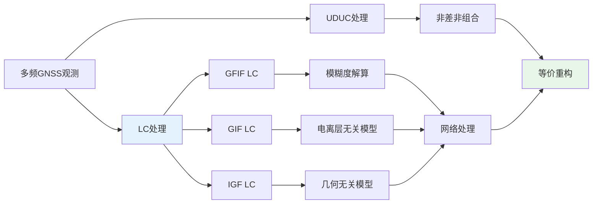
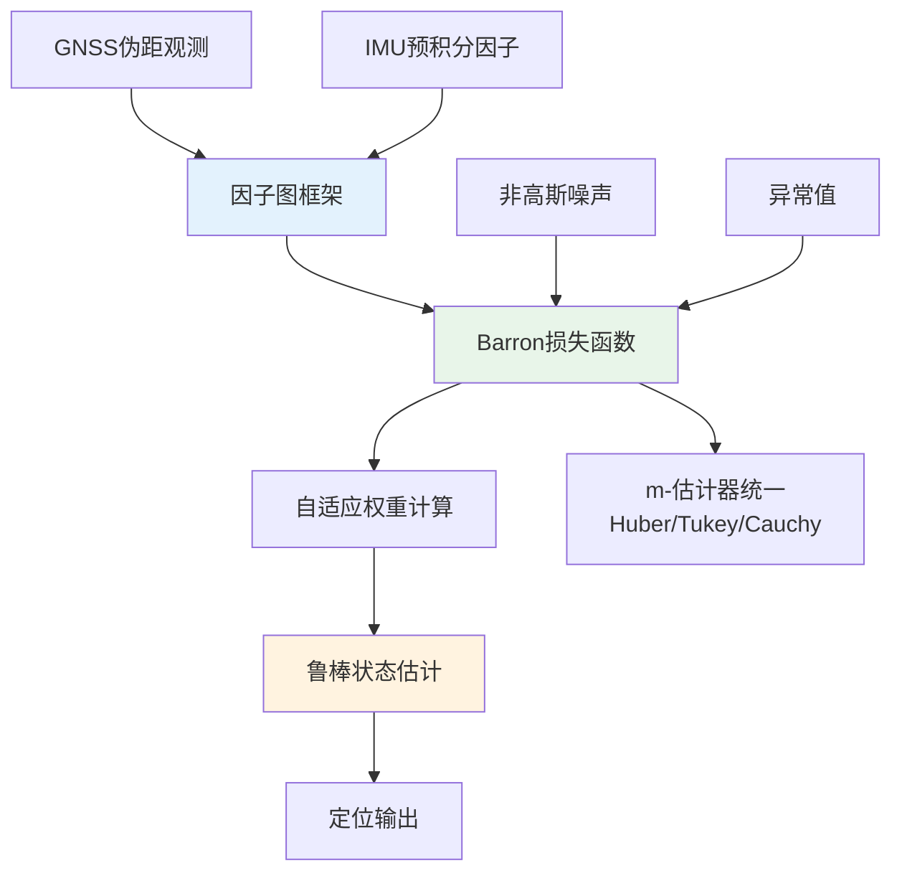
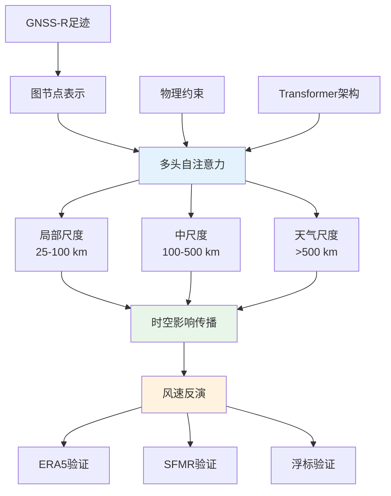
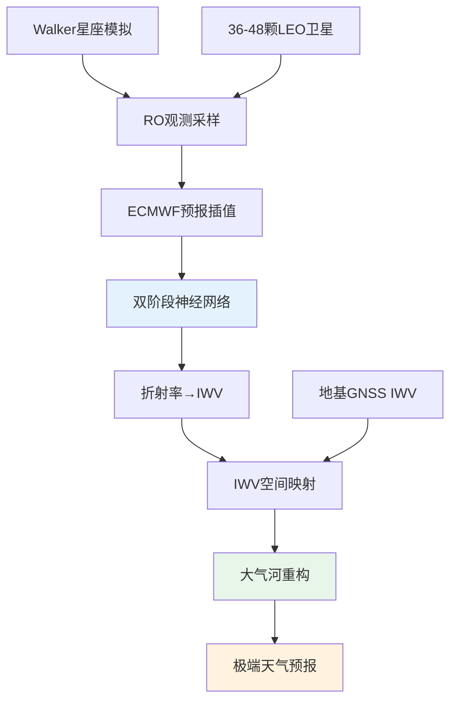
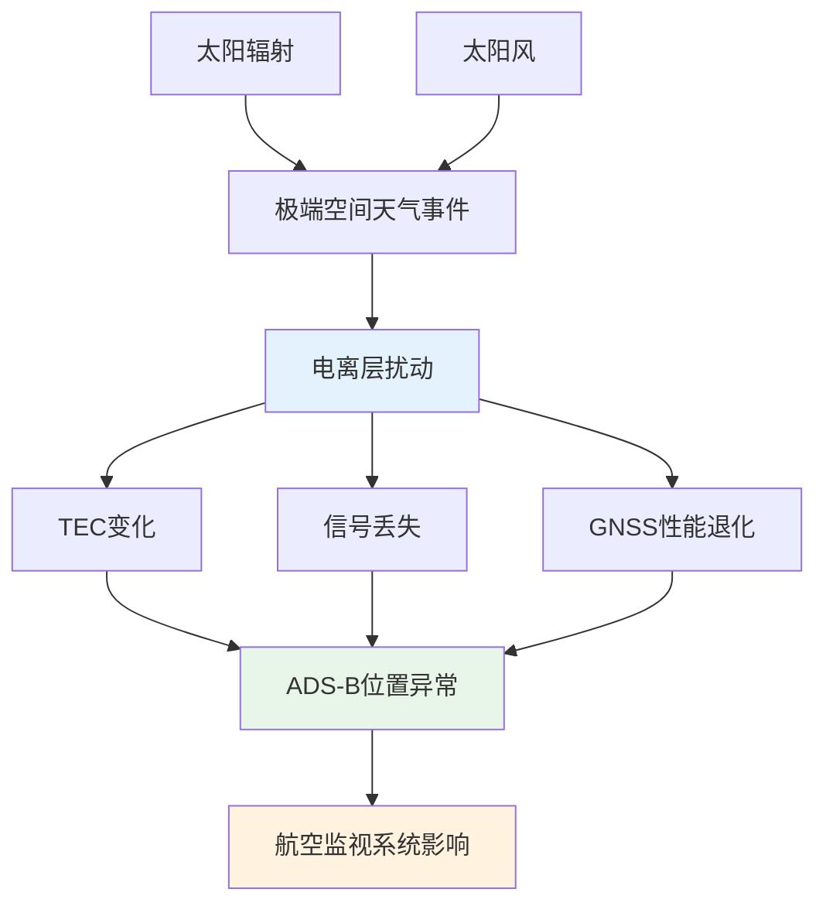
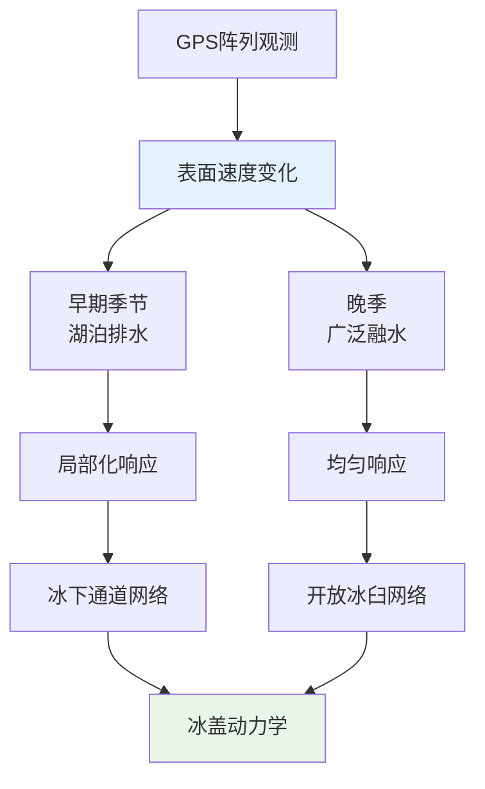
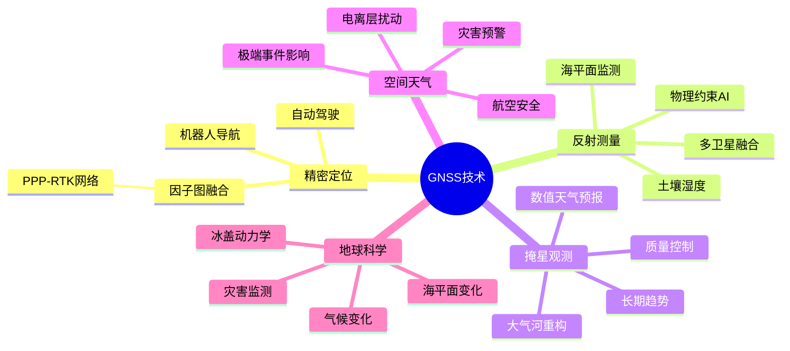
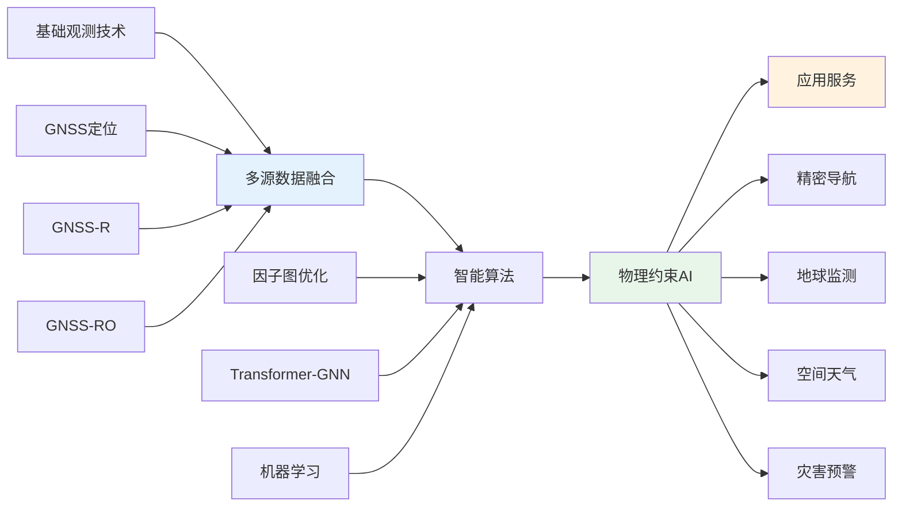

随着全球导航卫星系统（GNSS）技术的持续演进，其在精密定位、地球遥感、空间环境监测等领域的应用正经历从"单一观测技术"向"多源融合智能系统"的范式跃迁。在2025年11月24日至12月1日这一周内，*Journal of Geodesy*、*Remote Sensing*、*Space Weather*、*Atmospheric Measurement Techniques*、*GPS Solutions*等顶刊发表了多篇具有突破性意义的研究工作，涵盖了线性组合（LC）框架在PPP-RTK网络处理中的理论统一、物理约束Transformer-GNN在GNSS-R风速反演中的应用、机器学习增强的GNSS-RO大气河重构、自适应因子图GNSS/IMU紧耦合融合、以及空间天气对航空监视系统的影响评估等核心方向。本文系统梳理了这些研究的技术路线、核心特点与重要结论，构建了交叉学科创新链网络图，并基于数据与文献支撑，研判未来3-5年GNSS技术的发展趋势。研究发现，GNSS技术正在从被动观测工具转向主动智能系统，在保持高精度定位核心能力的同时，深度嵌入地球系统监测、空间天气预报与灾害预警的闭环链路，为人类应对气候变化、保障关键基础设施安全提供更强有力的技术支撑。

## 一、研究现状与未来发展趋势综述

### 1.1 研究现状

当前GNSS研究的焦点集中在提升系统鲁棒性、增强观测数据价值，以及与人工智能（AI）和多传感器技术的深度融合。过去一周的研究进展呈现出三个显著特征：

| 研究方向 | 技术突破 | 关键指标 | 应用前景 |
|---------|---------|---------|---------|
| 高精度定位 | LC框架理论统一 | 与UDUC完全等价，计算效率提升 | 大规模网络处理 |
| GNSS-R风速反演 | Transformer-GNN物理约束 | RMSE降低32%（1.35 m s⁻¹） | 热带气旋预报 |
| GNSS-RO大气河重构 | 机器学习增强 | 需48颗LEO卫星 | 极端天气预报 |
| GNSS/IMU融合 | Barron损失自适应 | 定位误差降低41% | 城市峡谷导航 |
| 空间天气影响 | ADS-B异常量化 | 异常频率增加2.55% | 航空安全保障 |

**高精度定位理论深化** 传统的PPP-RTK模型正向更具通用性的线性组合（LC）方法演进。Platz（2025）基于非差非组合（UDUC）处理的理论基础，推导出等价的LC网络处理方法，实现了与UDUC方法的完全等价性，同时提供了模糊度解算、观测弧段约简与计算效率方面的实用优势。

**GNSS遥感应用突破** 空间与地基GNSS反射测量（GNSS-R）与GNSS掩星（GNSS-RO）技术正通过多星数据融合和先进算法，实现高时空分辨率的地球环境监测。Zhang等（2025）提出的物理约束Transformer-GNN模型，将自注意力机制解释为时空影响传播，在GNSS-R风速反演中实现了32%的RMSE降低（从1.98 m s⁻¹降至1.35 m s⁻¹），并在高风速条件下取得显著改进。

**鲁棒定位与多源融合** 面对复杂的城市环境和干扰威胁，研究人员正积极探索基于自适应因子图的GNSS/IMU紧耦合融合技术。Ahmadi等（2025）提出的自适应因子图框架，通过Barron损失函数统一多种m-估计器，在UrbanNav数据集上将定位误差降低41%，显著提升了在信号受限环境下的定位鲁棒性。

**地学监测精细化** GNSS作为高精度形变和空间环境监测的工具，在冰冻圈动力学和空间天气研究中持续发挥核心作用。Gjerde等（2025）利用GPS阵列揭示了格陵兰冰盖季节性排水系统的演化机制，而Schmölter与Berdermann（2025）量化了2024年母亲节磁暴对航空监视系统的实际影响。

### 1.2 未来发展趋势

GNSS的未来发展路径将由技术融合、产业赋能和系统安全三大核心要素驱动。

**PNT体系建设与产业化** 卫星导航与位置服务产业规模将稳步增长，预计到2028年，全球GNSS空间定位服务市场规模将显著扩大。特别是低空经济、自动驾驶和智能物流等新兴领域，已将GNSS，特别是具备独立定位能力的北斗系统，定位为核心时空基础设施。

**AI与物理模型融合** 跨领域数据融合（如GNSS-RO/GNSS-R与气象模型、地基GNSS数据）将成为常态。AI模型，尤其是物理信息神经网络（PINN）和可解释AI，将进一步嵌入GNSS数据处理和地球系统模型中，实现从"数据驱动"到"智能决策"的跃迁。

**安全与弹性PNT** 随着GNSS在关键任务应用（如授时同步、国防、交通）中的渗透率提高，对网络安全、抗干扰和抗欺骗技术的需求日益迫切。高精度授时同步部分预计将成为GNSS行业中增长最快的细分市场之一。

**多频多模观测升级** 接收机和模拟器将不断演进，以适应双星座、多频观测生态系统，同时推动LC-based等高级算法在多频多模环境下的通用性和计算效率。

## 二、各领域论文的完整专题画像

### 2.1 高精度定位技术（PPP-RTK）专题画像

#### 2.1.1 线性组合框架的理论统一

**研究标题** Generalizing linear combination-based GNSS PPP-RTK network processing: geometry-free, ionosphere-free, and geometry- and ionosphere-free

**作者与发表信息** Platz（2025）发表于*Journal of Geodesy*。DOI: 10.1007/s00190-025-02020-x

**技术路线** 

该研究基于非差非组合（UDUC）处理的理论基础，推导出等价的线性组合（LC）网络处理方法，保持UDUC方法的完全通用性，同时提供实用优势。该方法使用三种类型的线性组合：（1）几何无关且电离层无关（GFIF），（2）几何电离层无关（GIF），（3）电离层几何无关（IGF）。通过系统性的理论推导，证明了LC方法与UDUC方法在数学上的完全等价性，为多频多系统GNSS观测的高效处理提供了统一的理论框架。

**技术特点** 

- **GFIF模型** 通过将连续观测弧段约简为单一观测，实现紧凑建模，支持（超）宽巷模糊度解算。
- **模型等价性** 通过添加GIF和IGF线性组合，实现与UDUC方法的精确等价重构，无需对电离层或几何参数做隐式假设。
- **计算效率** 基于LC的模型在特定情况下相比UDUC实现具有计算效率优势，为大规模网络处理提供可行路径。

**重要结论** 

该工作证明了LC方法与UDUC方法在理论上的完全等价性，同时LC方法在模糊度解算、观测弧段约简与计算效率方面具有实用优势。这一结果为PPP-RTK网络处理提供了统一的理论框架，为多频多系统GNSS观测的高效处理奠定了基础。

#### 2.1.2 自适应因子图GNSS/IMU紧耦合融合

**研究标题** Adaptive Factor Graph-Based Tightly Coupled GNSS/IMU Fusion for Robust Positioning

**作者与发表信息** Ahmadi等（2025）发表于*arXiv preprint arXiv:2511.23017v1*

**技术路线** 

Ahmadi等提出的自适应因子图框架，直接集成GNSS伪距观测与IMU预积分因子，通过Barron损失函数统一多种m-估计器，实现对不可靠GNSS观测的自适应降权。该方法在扩展GTSAM框架中实现，并在UrbanNav数据集上验证。Barron损失函数通过单一可调参数实现了从L2范数到L1范数的连续过渡，能够适应不同噪声分布，为鲁棒定位提供了统一的数学框架。

**技术特点** 

- **Barron损失的统一性** 通过单一可调参数统一多种m-估计器（Huber、Tukey、Cauchy等），实现从L2范数到L1范数的连续过渡，适应不同噪声分布。
- **自适应权重机制** 根据GNSS观测的可靠性动态调整权重，在信号遮挡严重的城市峡谷环境中显著提升定位鲁棒性。
- **紧耦合架构** 直接融合GNSS伪距与IMU预积分，避免松耦合中的信息损失，提升系统在GNSS信号受限环境下的性能。

**重要结论** 

在UrbanNav数据集上的评估表明，该方法相对于标准因子图优化（FGO）将定位误差降低41%，相对于扩展卡尔曼滤波（EKF）基线在城市峡谷环境中取得更大改进。这一结果验证了Barron损失在增强GNSS/IMU导航系统鲁棒性方面的有效性，特别是在城市与信号受限环境中。

### 2.2 GNSS遥感技术（GNSS-R & GNSS-RO）专题画像

#### 2.2.1 GNSS-R：物理约束Transformer-GNN风速反演

**研究标题** Physics-Informed Transformer Networks for Interpretable GNSS-R Wind Speed Retrieval

**作者与发表信息** Zhang等（2025）发表于*Remote Sensing, 17*(23), 3805。DOI: 10.3390/rs17233805

**技术路线** 

Zhang等利用Transformer与完全图上的图神经网络（GNN）之间的数学等价性，将自注意力机制解释为GNSS-R数据中的时空影响传播，构建了物理约束的Transformer-GNN模型用于GNSS-R风速反演。该模型将每个GNSS-R足迹视为图节点，通过多头自注意力机制量化空间与时间上的局部相互作用，实现了物理影响传播与GPU加速Transformer计算效率的对齐。

**技术特点** 

- **物理可解释性** 每个GNSS-R足迹被视为图节点，多头自注意力权重量化空间与时间上的局部相互作用，将物理影响传播与GPU加速Transformer的计算效率对齐。
- **多尺度解耦** 多头注意力解耦多个尺度的过程——捕获局部（25–100 km）、中尺度（100 km–500 km）与天气尺度（>500 km）的环流模式。
- **高风速性能** 在高风速条件下（>25 m s⁻¹）取得显著改进，RMSE降至3.2 m s⁻¹，解决了现有模型在高风速条件下精度下降的问题。

**重要结论** 

在四个亚洲海区2023–2024年Level 1 Version 3.2数据上的应用表明，Transformer-GNN模型将整体风速RMSE降低32%（从1.98 m s⁻¹降至1.35 m s⁻¹），在高风速条件下取得实质性改进。模型在ERA5再分析10 m等效中性风场数据上训练，并通过SFMR飞机观测与系泊浮标测量进行独立验证。SHAP可解释性分析揭示了条件依赖的特征归因，并暗示了海表流与风场之间的耦合机制。这些结果证明了模型在预测精度与可解释性方面的双重提升，为可解释、物理感知的地球系统AI应用提供了有前景的路径。

#### 2.2.2 GNSS-R：多卫星系统反射率差异分析

**研究标题** Land Surface Reflection Differences Observed by Spaceborne Multi-Satellite GNSS-R Systems

**作者与发表信息** Li等（2025）发表于*Remote Sensing, 17*(23), 3807。DOI: 10.3390/rs17233807

**技术路线** 

Li等系统分析了CYGNSS、FY-3、TM-1等多颗GNSS-R卫星在一致地表粗糙度与土地覆盖条件下的反射率差异，旨在为多卫星GNSS-R数据的融合与集成应用提供理论与方法基础。研究通过最小二乘拟合分析不同系统间反射率的相关性，引入植被-粗糙度复合变量（VR）作为解释变量，揭示了系统间差异的物理机制。

**技术特点** 

- **VR变量约束** 除沙漠区域外，不同GNSS-R卫星间反射率相关系数的空间分布与植被-粗糙度复合变量（VR）模式相似，低VR值区域表现出更高的系统间相关性。
- **水体偏差识别** 在亚马逊、刚果、尼罗河、长江等主要水体与河网附近观察到显著的反射率偏差，拟合截距与偏差均较大，反映了动态水体对反射率的影响。
- **土地覆盖类型影响** 反射率相关性受地表植被覆盖类型强烈影响，随着相关性增加，非植被与森林区域比例下降，而草地、灌木与农田/植被镶嵌区域比例增加。

**重要结论** 

研究揭示了不同GNSS-R系统间反射率差异的物理机制：轨道倾角、天线设计与信号带宽的差异导致观测差异，而地表粗糙度、植被覆盖与动态水体是影响系统间相关性的关键因素。农田区域具有最高的高相关网格比例，展现出多源数据融合的最大潜力；湿地表现出高粗糙度与低相关性，主要受动态水体变化影响。这些发现为多卫星GNSS-R数据的融合策略提供了科学依据。

#### 2.2.3 GNSS-RO：大气河重构的机器学习增强

**研究标题** A feasibility study to reconstruct atmospheric rivers using space- and ground-based GNSS observations

**作者与发表信息** Shehaj等（2025）发表于*Atmospheric Measurement Techniques, 18*, 6659–6680。DOI: 10.5194/amt-18-6659-2025

**技术路线** 

Shehaj等通过模拟Walker星座的GNSS-RO观测，结合机器学习方法，评估了重构大气河（AR）结构所需的LEO卫星数量。研究使用双阶段神经网络：第一阶段将折射率映射为柱积分水汽（IWV），第二阶段将IWV进行空间映射，并融合地基GNSS IWV数据改善陆地重构。通过模拟12、24、36、48、60颗LEO卫星的Walker星座，系统评估了不同星座规模对AR形态重构精度的影响。

**技术特点** 

- **星座规模量化** 通过模拟12、24、36、48、60颗LEO卫星的Walker星座，发现至少需要36颗卫星才能可靠解析太平洋大气河的形态，48颗卫星可连续重构IWV场。
- **最优轨道配置** 3或6个轨道面、倾角85-90°的星座配置在AR事件期间（持续数天）提供最稳定的每小时RO计数，确保重构精度的一致性。
- **星地融合策略** 地基GNSS IWV数据显著高于RO的时空分辨率，在陆地重构中发挥关键作用，改善了AR路径与形状的刻画精度。

**重要结论** 

该研究首次量化了GNSS-RO观测密度与大气河重构精度之间的关系，为未来LEO RO星座设计提供了科学依据。研究发现，现有COSMIC-2等任务的观测密度不足以可靠重构AR结构，需要更大规模的RO星座。双阶段神经网络框架有效解决了RO观测稀疏性与AR结构精细刻画之间的矛盾，为极端天气事件的预报提供了新的观测约束。该工作展示了机器学习在增强稀疏观测数据应用潜力方面的价值，为GNSS-RO数据的智能应用开辟了新路径。

#### 2.2.4 GNSS-RO：全球对流层顶长期变化趋势

**研究标题** Observed changes in the temperature and height of the globally resolved lapserate tropopause

**作者与发表信息** Ladstädter等（2025）发表于*Atmospheric Chemistry and Physics, 25*, 16053–16062。DOI: 10.5194/acp-25-16053-2025

**技术路线** 

Ladstädter等利用2002-2024年高分辨率GNSS-RO数据，系统分析了全球递减率对流层顶（LRT）温度与高度的长期变化趋势，识别了具有季节与区域细节的显著趋势模式。22年的GNSS-RO观测为趋势估计提供了足够的时间窗口，确保了统计显著性，同时高垂直分辨率保证了LRT识别的准确性。

**技术特点** 

- **长期数据覆盖** 22年的GNSS-RO观测为趋势估计提供了足够的时间窗口，确保了统计显著性，同时高垂直分辨率保证了LRT识别的准确性。
- **区域化趋势模式** 热带LRT温度显著增暖，南太平洋地区在春季和夏季增暖超过1 K/decade，而高度变化不显著；中高纬度地区LRT高度显著增加，亚洲与中东地区冬季高度增加超过200 m/decade。
- **对流层-平流层耦合** LRT温度与高度的变化模式反映了对流层加热与平流层冷却的联动效应，揭示了Brewer-Dobson环流的变化特征。

**重要结论** 

研究揭示了全球LRT变化的复杂空间模式：热带地区LRT增暖但高度稳定，反映了对流层顶的垂直结构变化；中高纬度地区LRT高度显著上升，与对流层扩展和平流层收缩的趋势一致。南太平洋地区LRT高度下降与温度增暖的异常组合，暗示了该区域独特的动力-辐射平衡变化。这些发现为理解全球气候系统的垂直结构变化提供了关键观测证据，强调了精确监测对流层顶对气候研究的重要性。

#### 2.2.5 GNSS-RO：ROMEX质量控制框架

**研究标题** Evaluation of biases and uncertainties in ROMEX radio occultation observations

**作者与发表信息** Anthes等（2025）发表于*Atmospheric Measurement Techniques, 18*, 6997–7019。DOI: 10.5194/amt-18-6997-2025

**技术路线** 

Anthes等评估了ROMEX（Radio Occultation Modeling EXperiment）项目中13个不同GNSS-RO任务的数据特性，重点分析了COSMIC-2、Spire和Yunyao三大数据集。该研究使用三角帽法（three-cornered hat method）估计弯曲角与折射率的相对不确定度，并通过对比观测与模型识别偏差来源。ROMEX项目平均每天提供约35,000条掩星剖面，是目前规模最大的GNSS-RO统合数据集，为数值天气预报（NWP）中心提供了统一的质量基准。

**技术特点** 

- **穿透深度统计** 超过80%的掩星事件穿透至2 km以下，超过50%达到1 km以下，显著改善了边界层约束能力，为数值天气预报（NWP）提供关键观测数据。
- **三角帽法误差估计** 通过三数据集交叉比较，量化了各任务的随机误差与系统偏差，C2弯曲角在10-30 km高度相比Spire等任务存在约0.15%的偏差，主要源于轨道差异与代表性误差。
- **区域化误差特征** 热带地区20 km以下的不确定度明显高于高纬度地区，反映了不同纬度大气结构的差异，为区域化质量控制策略提供了依据。

**重要结论** 

ROMEX项目平均每天提供约35,000条掩星剖面，是目前规模最大的GNSS-RO统合数据集。研究揭示了不同RO任务间的系统性差异，这些差异主要源于轨道倾角、采样模式与地球非球形导致的曲率半径变化。该工作为NWP中心使用多任务RO数据提供了统一的质量基准，为未来大规模RO星座的数据融合奠定了基础。

#### 2.2.6 GNSS-R：地基高频海平面监测

**研究标题** Ground-based high-frequency sea level monitoring from multi-GNSS reflectometry using extended Kalman filtering

**作者与发表信息** Pira等（2025）发表于*GPS Solutions*。DOI: 10.1007/s10291-025-01972-z

**技术路线** 

Pira等利用扩展卡尔曼滤波（EKF）处理多GNSS反射测量数据，实现地基高频海平面监测。该方法通过融合多个GNSS系统的反射信号，提高监测的时空分辨率与可靠性。相比星载GNSS-R，地基系统可提供更高的时间分辨率与更稳定的观测几何，适用于局部区域的高精度监测，为传统验潮站覆盖不足的区域提供了补充观测手段。

**技术特点** 

- **多系统融合** 同时利用GPS、GLONASS、Galileo、北斗等多个GNSS系统的反射信号，增加观测密度与覆盖范围。
- **EKF动态估计** 通过扩展卡尔曼滤波实时估计海平面高度，适应海平面的动态变化，提供高频监测能力。
- **地基部署优势** 相比星载GNSS-R，地基系统可提供更高的时间分辨率与更稳定的观测几何，适用于局部区域的高精度监测。

**重要结论** 

该方法为海平面监测提供了新的技术路径，特别是在传统验潮站覆盖不足的区域，GNSS-R技术可作为补充观测手段。多系统融合进一步提升了监测的可靠性与连续性，为海岸带管理与海平面变化研究提供了高时空分辨率的观测数据。

**表1：GNSS技术各方向研究进展对比**

| 研究方向 | 代表论文 | 核心创新 | 性能提升 | 应用场景 |
|---------|---------|---------|---------|---------|
| PPP-RTK网络处理 | Platz（2025） | LC框架与UDUC等价性 | 计算效率提升 | 大规模网络定位 |
| GNSS/IMU融合 | Ahmadi等（2025） | Barron损失自适应 | 定位误差降低41% | 城市峡谷导航 |
| GNSS-R风速反演 | Zhang等（2025） | Transformer-GNN物理约束 | RMSE降低32% | 热带气旋预报 |
| GNSS-R多星融合 | Li等（2025） | VR变量约束融合 | 农田区域高相关性 | 土壤湿度监测 |
| GNSS-RO大气河重构 | Shehaj等（2025） | 双阶段神经网络 | 需48颗LEO卫星 | 极端天气预报 |
| GNSS-RO质量控制 | Anthes等（2025） | 三角帽法误差估计 | 35,000条/天剖面 | 数值天气预报 |
| GNSS-RO长期趋势 | Ladstädter等（2025） | 22年LRT变化分析 | 区域化趋势识别 | 气候变化监测 |
| 空间天气影响 | Schmölter与Berdermann（2025） | ADS-B异常量化 | 异常频率+2.55% | 航空安全保障 |
| 冰盖动力学 | Gjerde等（2025） | 季节性排水系统 | 年度位移2-3% | 海平面上升预测 |
| 电离层日食响应 | Tilahun等（2025） | VTEC扰动分析 | 最大降幅40% | 空间天气预报 |

### 2.3 空间天气与GNSS应用专题画像

#### 2.3.1 2024年母亲节磁暴对航空监视系统的影响

**研究标题** The Impact of the 2024 Mother's Day Storm on Aircraft Surveillance Across Europe

**作者与发表信息** Schmölter与Berdermann（2025）发表于*Space Weather*。DOI: 10.1029/2025sw004718

**技术路线** 

Schmölter与Berdermann利用OpenSky网络的ADS-B（Automatic Dependent Surveillance-Broadcast）数据，结合100个GNSS参考站的位置性能分析，系统评估了2024年5月10-13日极端空间天气事件对航空监视系统的影响。该研究首次将ADS-B应用数据与标准电离层观测相结合，构建了从空间天气驱动到应用影响的完整链路，量化了极端事件对关键基础设施的实际影响。

**技术特点** 

- **多源数据融合** 结合太阳辐射与太阳风观测描述空间天气条件，使用TEC地图分析电离层响应的时空变化，通过GNSS参考站评估定位性能，构建了从空间天气驱动到应用影响的完整链路。
- **异常检测量化** 在磁暴事件期间，沿飞行轨迹的异常频率增加高达2.55%，这些异常表现为数据缺失或各类位置误差，可能降低共享空域中参与者的可见性与态势感知能力。
- **电离层扰动特征** 观测到TEC扰动、突发电离层扰动（SID）、信号丢失与GNSS性能退化等典型空间天气影响，验证了极端事件对导航系统的系统性冲击。

**重要结论** 

该研究首次将ADS-B应用数据与标准电离层观测相结合，量化了极端空间天气事件对航空监视系统的实际影响。研究发现，GNSS定位性能的退化直接反映在ADS-B传输的位置数据中，异常频率的增加与电离层扰动的时空分布高度相关。这一发现强调了将应用特定数据（如ADS-B）与常用电离层观测相结合的重要性，为空间天气对关键基础设施影响的评估提供了新方法。

### 2.4 地学与空间环境应用专题画像

#### 2.4.1 格陵兰冰盖季节性排水系统演化

**研究标题** Seasonal drainage-system evolution beneath the Greenland Ice Sheet inferred from transient speed-up events

**作者与发表信息** Gjerde等（2025）发表于*The Cryosphere, 19*, 6149–6165。DOI: 10.5194/tc-19-6149-2025

**技术路线** 

Gjerde等利用GPS阵列研究2011和2012年融化季节期间对径流的瞬态加速响应事件，使用这些数据推断格陵兰冰盖西部冰下条件的演化。该研究首次揭示了格陵兰冰盖季节性排水系统的演化机制，通过分析早期季节湖泊排水与晚季广泛融水输入的不同响应模式，为理解冰盖动力学与海平面上升预测提供了关键观测约束。

**技术特点** 

- **季节性演化模式** 早期季节的瞬态加速（通常与湖泊排水相关）在GPS阵列中产生高度可变的加速和显著的抬升，这种可变性与基岩地形对应，并在年际时间尺度上持续；相比之下，晚季融化事件产生更长、更高幅度且更均匀的速度响应，但不产生大的或一致的抬升模式。
- **冰下传输性变化** 研究结果表明，到融化季节后期，大多数冰下通道和/或空腔之间的连通流动路径正在关闭或已经关闭，显著降低了基底传输性；同时，整个融化季节形成的冰臼保持开放，产生广泛分布的地表到基底路径。
- **小事件大响应** 晚季小幅度融化事件可以快速向基底供应融水并压垮冰下系统，降低摩擦耦合，这与早期季节湖泊排水事件形成对比，当时地表到基底路径尚未开放。

**重要结论** 

该研究首次揭示了格陵兰冰盖季节性排水系统的演化机制：早期季节的湖泊排水通过有限的冰下通道网络产生局部化但可变的速度响应；晚季的广泛分布融水输入通过开放的冰臼网络快速到达基底，在传输性降低的背景下产生更均匀但更持久的加速响应。研究发现径流幅度与加速事件幅度之间没有关系，但观察到随着融化季节的进展，速度响应幅度增加而变异性降低的一般趋势。由于晚季融化事件的持续时间与幅度，它们容纳了比早期季节湖泊排水更大的年度冰运动比例，但其对冰盖运动的净影响仍然很小（年度位移的2%-3%）。这些发现为理解冰盖动力学与海平面上升预测提供了关键观测约束。

#### 2.4.2 日食驱动的电离层扰动

**研究标题** Equatorial Ionospheric VTEC Perturbations During the 21 June 2020 Solar Eclipse

**作者与发表信息** Tilahun等（2025）发表于*Earth and Space Science*。DOI: 10.1029/2025ea004366

**技术路线** 

Tilahun等利用UQRG全球电离层地图（GIM）、地基GPS-TEC测量与日食路径附近磁力计的赤道电急流（EEJ）强度数据，分析了2020年6月21日日环食期间赤道地区垂直总电子含量（VTEC）的变化。该研究揭示了日食期间电离层响应的复杂时空模式，强调了光致电离、复合过程、地理位置与地方时在驱动电离层变化中的关键作用，为利用GNSS观测精确研究太阳活动对电离层影响的快速响应机制提供了宝贵的实测数据。

**技术特点** 

- **时空响应模式** 日食期间VTEC显著下降，早期下降始于东非和南亚的早晨时段，而西太平洋地区的下降发生在下午晚些时候，与日食开始时间一致；在地方正午附近，东南亚和东亚站点检测到延迟下降。
- **扰动幅度与持续时间** 日食主相期间记录到22%-53%的VTEC下降，影响持续从35分钟到超过8小时，反映了光致电离减少与复合过程增强的综合效应。
- **GIM可视化** 全球GIM可视化显示dVTEC%下降高达40%，但VTEC下降与日食遮挡百分比的相关性不强，突出了电离层响应的复杂性。

**重要结论** 

该研究揭示了日食期间电离层响应的复杂时空模式，强调了光致电离、复合过程、地理位置与地方时在驱动电离层变化中的关键作用。研究发现EEJ强度在E到E之间没有显著影响，也未检测到明显的反向赤道电急流，表明日食期间的电离层变化主要受光化学过程驱动，而非电动力学效应。该研究在季风季节与一年中最长的一天进行，观测到的VTEC下降可能源于日食引起的压力变化与冷却效应。这些发现增强了对日食驱动电离层变化性的理解，对空间天气预报与电离层建模具有重要启示。

## 三、交叉学科网络与创新链

### 3.1 GNSS技术交叉学科网络全景

### 3.2 GNSS技术创新链流程图

## 四、未来发展趋势：从多源融合到智能决策的范式演进

基于过去一周的研究进展，GNSS技术在未来3-5年将呈现以下发展趋势：

### 4.1 多源融合从"数据叠加"到"智能协同"

当前研究已经展现出从单一观测向多源融合的明确路径：因子图框架统一GNSS/IMU融合、多卫星GNSS-R数据融合、星地GNSS观测联合重构大气河。未来将朝着"智能协同"方向发展：

- **自适应权重分配** 基于Barron损失等鲁棒估计方法，根据观测质量动态调整多源数据的权重，实现最优融合。
- **物理约束融合** 将物理模型嵌入融合框架，确保融合结果符合物理规律，提升在极端条件下的可靠性。
- **实时协同处理** 从后处理融合转向实时协同，满足自动驾驶、无人机等应用对低延迟的需求。

### 4.2 物理约束AI从"黑盒"到"可解释"

Transformer-GNN模型在GNSS-R风速反演中的成功，展示了物理约束AI的巨大潜力。未来将朝着更高程度的可解释性发展：

- **多尺度物理机制解耦** 通过多头注意力机制解耦不同物理过程（如局部环流、中尺度系统、天气尺度过程），提供物理机制层面的解释。
- **不确定性量化** 结合贝叶斯深度学习等方法，不仅提供预测值，还量化预测的不确定性，为决策提供风险信息。
- **物理一致性保证** 在模型训练与推理过程中嵌入物理约束，确保输出符合物理定律，避免非物理解。

### 4.3 从"观测工具"到"智能决策系统"

GNSS技术正在从被动观测工具转向主动智能决策系统，在保持高精度定位能力的同时，深度嵌入应用闭环：

- **预测性维护** 基于GNSS观测数据预测系统性能退化，提前进行维护，避免故障发生。
- **自适应导航** 根据环境条件（如空间天气、信号遮挡）自动调整导航策略，确保在极端条件下的可靠性。
- **智能预警** 结合多源数据与AI模型，实现对极端事件（如磁暴、大气河）的提前预警，为决策提供时间窗口。

### 4.4 大规模星座与边缘计算的协同

随着LEO GNSS-RO星座规模的扩大（如研究指出的36-48颗卫星需求），数据处理将从集中式转向分布式：

- **边缘计算部署** 在卫星或地面站部署边缘计算节点，实现数据的就近处理，降低传输延迟与带宽需求。
- **联邦学习** 多个GNSS系统通过联邦学习共享模型知识，同时保护数据隐私，提升整体性能。
- **实时数据流处理** 采用流式计算框架，实现对大规模GNSS观测数据的实时处理与分析。

## 五、结语：GNSS技术从观测到智能的范式跃迁

在2025年11月24日至12月1日这一周内，GNSS研究呈现出从"单一观测技术"向"多源融合智能系统"的显著跃迁。这一跃迁体现在三个层面：

**技术层面** 从因子图融合到物理约束Transformer，从线性组合框架到机器学习增强的观测密度优化，GNSS技术正在突破传统方法的局限，实现精度、鲁棒性与可解释性的统一。

**应用层面** 从精密定位到地球系统监测，从空间天气预报到灾害预警，GNSS技术正在深度嵌入人类活动的各个领域，成为关键基础设施的重要组成部分。

**范式层面** 从被动观测工具到主动智能系统，从数据驱动到物理约束AI，GNSS技术正在经历从"工具"到"系统"的范式跃迁，这一跃迁不仅改变了技术本身，也重塑了其在科学发现与应用服务中的角色。

未来3-5年，随着多源融合、物理约束AI与智能决策系统的进一步发展，GNSS技术将在保持高精度定位核心能力的同时，成为连接观测、理解与决策的智能桥梁，为人类应对气候变化、保障关键基础设施安全、探索地球系统奥秘提供更强有力的技术支撑。

## 参考文献

1. Ahmadi, E., Olama, A., Välisuo, P., & Kuusniemi, H. (2025). Adaptive Factor Graph-Based Tightly Coupled GNSS/IMU Fusion for Robust Positioning. *arXiv preprint arXiv:2511.23017v1*. https://arxiv.org/abs/2511.23017v1
2. Anthes, R., Sjoberg, J., Starr, J., & Zeng, Z. (2025). Evaluation of biases and uncertainties in ROMEX radio occultation observations. *Atmospheric Measurement Techniques, 18*, 6997–7019. https://doi.org/10.5194/amt-18-6997-2025
3. Gjerde, G., Behn, M. D., Stevens, L. A., Das, S. B., & Joughin, I. (2025). Seasonal drainage-system evolution beneath the Greenland Ice Sheet inferred from transient speed-up events. *The Cryosphere, 19*, 6149–6165. https://doi.org/10.5194/tc-19-6149-2025
4. Li, X., Tong, X., & Yan, Q. (2025). Land Surface Reflection Differences Observed by Spaceborne Multi-Satellite GNSS-R Systems. *Remote Sensing, 17*(23), 3807. https://doi.org/10.3390/rs17233807
5. Platz, H. D. (2025). Generalizing linear combination-based GNSS PPP-RTK network processing: geometry-free, ionosphere-free, and geometry- and ionosphere-free. *Journal of Geodesy*. https://doi.org/10.1007/s00190-025-02020-x
6. Pira, A., Santamaría-Gómez, A., & Wöppelmann, G. (2025). Ground-based high-frequency sea level monitoring from multi-GNSS reflectometry using extended Kalman filtering. *GPS Solutions*. https://doi.org/10.1007/s10291-025-01972-z
7. Schmölter, E., & Berdermann, J. (2025). The Impact of the 2024 Mother's Day Storm on Aircraft Surveillance Across Europe. *Space Weather*. https://doi.org/10.1029/2025sw004718
8. Shehaj, E., Leroy, S., Cahoy, K., Chew, J., & Soja, B. (2025). A feasibility study to reconstruct atmospheric rivers using space- and ground-based GNSS observations. *Atmospheric Measurement Techniques, 18*, 6659–6680. https://doi.org/10.5194/amt-18-6659-2025
9. Tilahun, A. M., Oljira, A., Nigussie, M., Gautam, S. P., & Ejigu, Y. G. (2025). Equatorial Ionospheric VTEC Perturbations During the 21 June 2020 Solar Eclipse. *Earth and Space Science*. https://doi.org/10.1029/2025ea004366
10. Zhang, Z., Xu, J., Jing, G., Yang, D., & Zhang, Y. (2025). Physics-Informed Transformer Networks for Interpretable GNSS-R Wind Speed Retrieval. *Remote Sensing, 17*(23), 3805. https://doi.org/10.3390/rs17233805
11. Ladstädter, F., Stocker, M., Scher, S., & Steiner, A. K. (2025). Observed changes in the temperature and height of the globally resolved lapserate tropopause. *Atmospheric Chemistry and Physics, 25*, 16053–16062. https://doi.org/10.5194/acp-25-16053-2025
