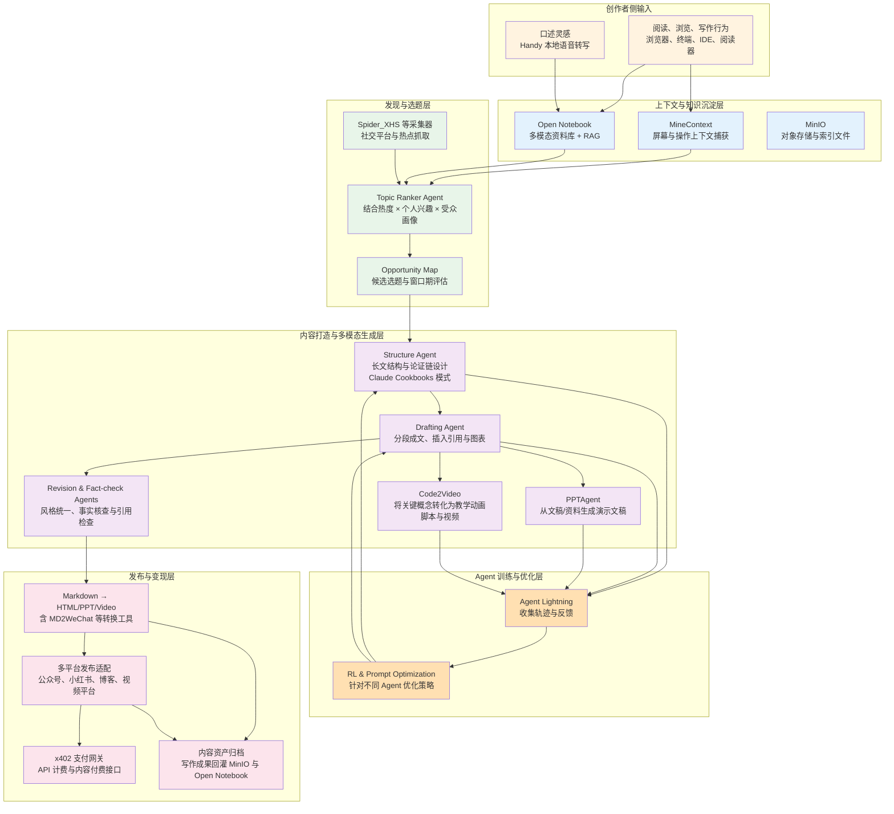
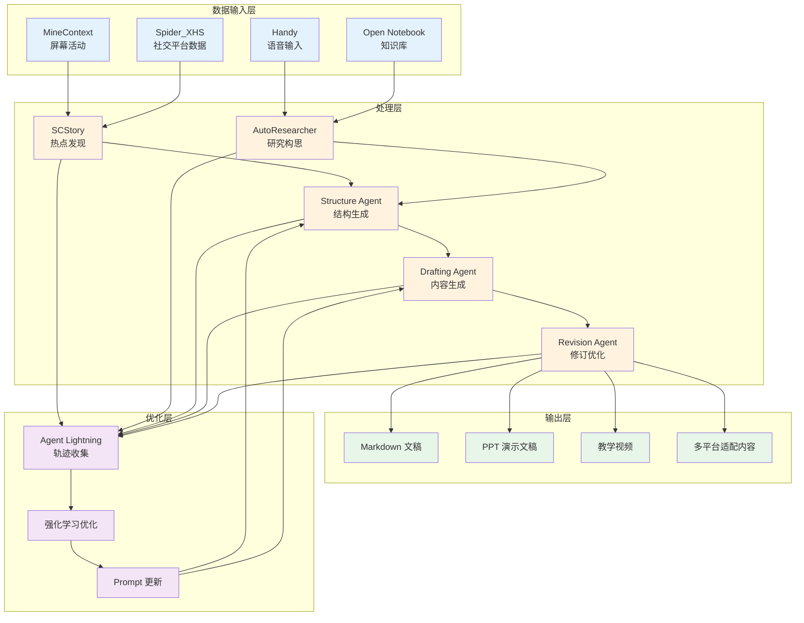
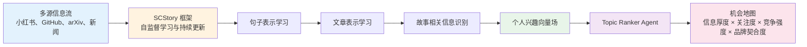
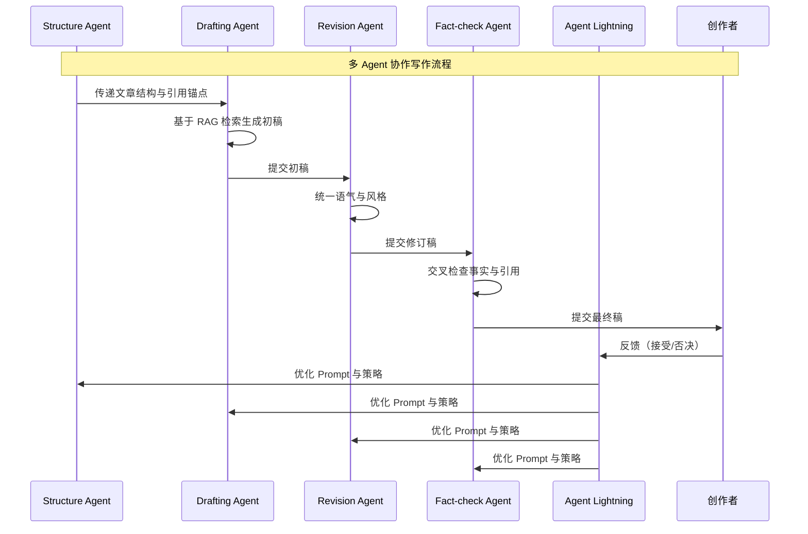
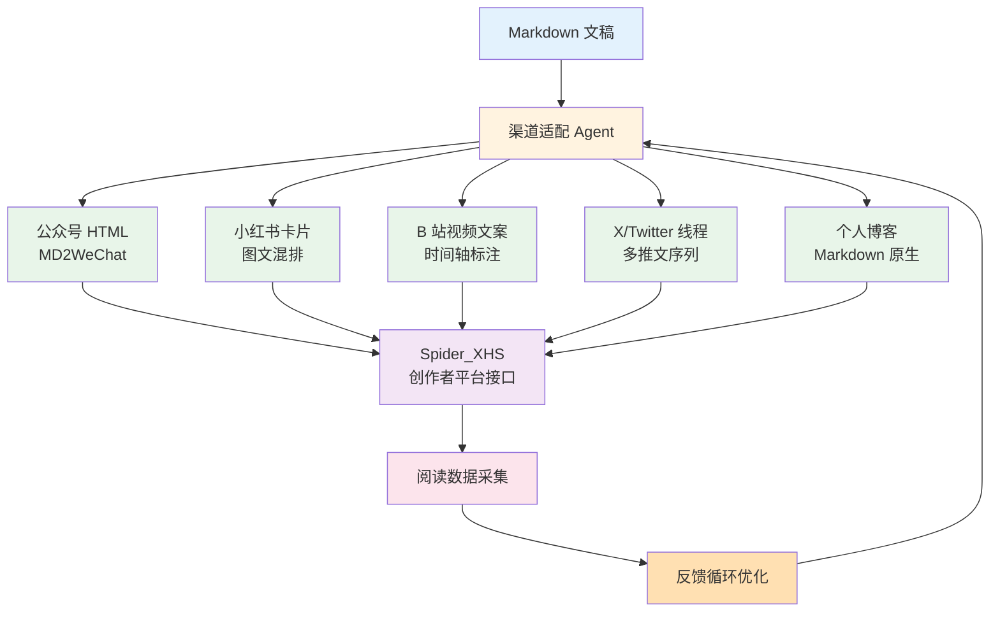
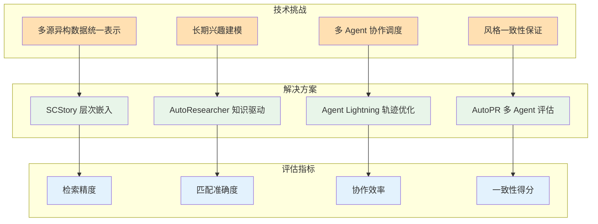

在信息爆炸与人工智能深度融合的时代背景下，内容创作者面临着从"信息过载"到"创作效率"再到"多模态分发"的多重挑战。传统的单次 Prompt 生成模式难以捕捉创作者长期积累的审美偏好、知识谱系与写作风格，而"从灵感到成稿再到多平台发布"的完整链路往往需要多轮手工搬运与格式转换。Vibe Writing 作为一种新兴的写作范式，强调通过长期、多模态、弱显式的"意图与风格场"来实现自动化知识生产与分发。本文基于 Spider_XHS、PPTAgent、Code2Video、Open Notebook、MineContext、Agent Lightning、Claude Cookbooks、x402、MinIO 等开源项目，提出了一种覆盖"信息发现—兴趣建模—内容打造—多渠道发布"全流程的轻量级 Auto Vibe Writing 平台架构。该平台通过上下文工程、多 Agent 协作与强化学习优化，将创作者的长期兴趣与当下世界的短期波动同时显性化，实现从选题发现到多模态内容生成再到自动化发布的端到端流水线。文章系统梳理了各开源项目的技术特性与智能化评价，给出了平台的技术架构与关键流程设计，并展望了未来 Vibe Writing 形态的演进方向。

## 一、作者们自动化兴趣发现、意图表达的需求

在数字化内容创作领域，作者们正面临从"信息采集"到"内容生成"再到"多平台分发"的全链路效率瓶颈。传统的写作工具多采用"单次 Prompt—单次生成"的交互模式，难以适应高频创作场景下的复杂需求。本节系统分析作者们在自动化兴趣发现与意图表达方面的核心需求。

### 1.1 信息流指数级膨胀与注意力碎片化

当前内容创作者面临的首要挑战是信息流的指数级膨胀。小红书、微博、X（原 Twitter）、GitHub Trending、arXiv 预印本、行业报告、播客与视频课程等多源异构信息同时涌入，创作者真正关心的是：哪些信息值得写、值得现在写、值得我来写。然而，传统的信息采集工具往往缺乏对创作者个人兴趣与知识背景的深度理解，导致大量无效信息干扰创作决策。

从认知科学视角看，人类注意力资源有限，信息过载会导致决策疲劳与创作质量下降。研究表明，多任务切换成本会显著降低创作效率（Ophir et al., 2009）。因此，作者们需要一个能够自动过滤、聚类与优先级排序的信息发现系统，该系统应能够理解创作者的长期兴趣向量场，并将外部热点与个人知识谱系进行智能匹配。

### 1.2 兴趣与"Vibe"的弱显式表达需求

所谓 Vibe Writing，本质上是长期、多模态、弱显式的"意图与风格场"。创作者收藏了哪些链接、常读哪些论文、在哪些网页长时间停留、与哪些关键词共振——这些行为数据都应沉淀为写作时的"隐形输入"。然而，传统写作工具往往以"单次 Prompt—单次生成"的模式工作，很难捕捉创作者长时间积累的审美、价值取向与知识谱系。

从知识管理理论看，显性知识与隐性知识的转化是知识创造的核心过程（Nonaka & Takeuchi, 1995）。创作者的写作风格、引用习惯、论证逻辑等隐性知识需要通过长期行为数据挖掘与模式识别才能显性化。因此，作者们需要一个能够持续、低侵入地采集多源信息与个人数字行为的系统，该系统应能够自动建模创作者兴趣与风格，将"vibe"显性化。

### 1.3 从灵感到成稿的链路过长且割裂

将一个 idea 变成"公众号长文 + PPT 演讲稿 + 教学视频 + 笔记知识库条目"通常需要多轮手工搬运。创作者需要的是一种端到端的写作流水线：信息被自动采集、整理、聚类 → 根据个人兴趣和受众热度，生成选题建议 → 一键拉起长文结构、PPT 大纲、例子与引用 → 自动生成配图与教学动画 → 一键发布到公众号、小红书、视频平台，并完成版本管理与归档。

从系统工程视角看，内容创作是一个多阶段、多模态的复杂流程，各阶段之间的数据格式转换与上下文传递往往成为效率瓶颈。因此，作者们需要一个能够统一管理多模态内容资产、支持格式自动转换与多平台适配的发布系统。

### 1.4 人–Agent 团队协作的写作范式

未来写作更像"主编 + 多个专职助理"：有人负责找料，有人负责拆论文，有人负责写脚本，有人负责审核事实，有人负责多平台排版与发布。这恰好对应当下 AI Agent 技术的趋势：GitHub、微软、Anthropic 等公司正在将"可训练、可协作的 Agent"变成开发新常态（The Verge, 2024）。

从多 Agent 系统理论看，不同 Agent 可以承担不同的子任务，通过协作与协调实现复杂目标的达成（Wooldridge, 2009）。因此，作者们需要一个能够将写作拆解为结构设计、素材检索、段落生成、修订与事实核查等可训练子任务的多 Agent 协作系统，该系统应能够随着使用自动对写作风格、引用习惯、目标受众进行拟合。

**Auto Vibe Writing 平台要解决的，就是在不压垮创作者心智负担的前提下，把这些环节串成一条"轻量但高度自动化"的流水线：**

- 持续、低侵入地采集多源信息与个人数字行为
- 自动建模创作者兴趣与风格，将"vibe"显性化
- 将"热点 × 个人偏好 × 结构性知识"映射为可执行的写作计划
- 协助生成图文、PPT、讲稿、视频脚本等多模态作品
- 完成多平台合规发布与长期资产化存储（含付费墙、微支付等机制）

## 二、可利用的已有 GitHub 项目列表与详细介绍

本节系统梳理可用于构建 Auto Vibe Writing 平台的开源项目，按照"信息采集与上下文沉淀层"、"意图表达与内容打造层"、"系统基础设施与安全、支付支撑层"三个维度进行分类，并给出每个项目的技术特性、自动化与智能化评价以及 GitHub 地址。

### 2.1 信息采集与上下文沉淀层

#### 2.1.1 Spider_XHS：社交平台数据采集与运营联动

**项目名称** Spider_XHS

**GitHub 地址** https://github.com/cv-cat/Spider_XHS

**特性与特色功能** 

Spider_XHS 是一个面向小红书的专业数据采集方案，已在 GitHub 上获得超过 3000 个 Star。该项目不仅是一个爬虫工具，更是一套小红书全域运营的解决方案。核心功能包括：

- **多维度数据抓取** 支持通过 Web 端接口抓取笔记内容、互动数据（点赞、收藏、评论等），并以 Excel 表格或媒体文件方式保存。能够自动提取并下载高清无水印图片，保存笔记链接、标题、点赞/收藏数据等元信息。
- **创作者平台接口集成** 部分分支集成了创作者平台的接口，可以执行自动化上传，形成"采集–改写–回推"的闭环。这使得 Spider_XHS 不仅能够采集数据，还能够实现内容的自动化发布。
- **技术架构** 基于 Python 和 Node.js 构建，使用 Node.js 进行加密参数生成，确保采集过程的稳定性和合规性。

**自动化与智能化评价** 

- **自动化程度** 高。项目提供了完整的命令行接口与配置文件，支持批量采集与定时任务，无需人工干预即可完成大规模数据采集。
- **智能化程度** 中等。项目主要聚焦于数据采集与格式转换，缺乏对内容语义的理解与热点分析能力。但通过采集的互动数据（点赞、收藏等），可以间接评估话题热度与内容形式。
- **在 Auto Vibe Writing 中的角色** 作为"热点与受众反馈探针"，持续抓取某些主题、账号或话题下的小红书内容；通过互动数据评估话题热度与内容形式；在合规前提下，为 Vibe Writing 平台提供真实用户语言风格与素材。

#### 2.1.2 Open Notebook：文献与多模态知识库

**项目名称** Open Notebook

**GitHub 地址** https://github.com/lfnovo/open-notebook

**特性与特色功能** 

Open Notebook 是 Google NotebookLM 的开源替代品，已在 GitHub 上获得超过 11.4K 个 Star。该项目强调隐私优先与多模态资料管理，核心功能包括：

- **多模态资料管理** 支持 PDF、视频、音频、网页等多种格式的资料，能够自动提取文本、图像与元数据，构建统一的知识库。
- **RAG 问答系统** 内置基于检索增强生成（Retrieval-Augmented Generation, RAG）的问答系统，能够基于上传的文档进行智能问答，确保生成内容的准确性与可追溯性。
- **全文与向量搜索** 支持全文搜索与向量相似度搜索，能够快速定位相关文档与段落，为写作提供有源可溯的证据与引用。
- **播客生成功能** 能够将资料自动生成为播客脚本，实现内容的多模态再利用。
- **REST API 接口** 提供完整的 REST API 以供扩展，支持与其他系统的集成。

**自动化与智能化评价** 

- **自动化程度** 高。项目支持批量导入、自动提取元数据、自动构建向量索引，能够自动化地管理大规模知识库。
- **智能化程度** 高。通过 RAG 技术与向量搜索，能够理解文档语义，进行智能问答与相关性检索，为写作提供精准的素材支持。
- **在 Auto Vibe Writing 中的角色** 作为"个人知识宇宙"的承载者，将论文、技术报告、播客等结构化管理；为长文写作提供有源可溯的证据与引用；也为 Agent 生成脚本与大纲提供检索接口。

#### 2.1.3 MineContext：桌面级主动上下文捕获

**项目名称** MineContext

**GitHub 地址** https://github.com/volcengine/MineContext

**特性与特色功能** 

MineContext 是火山引擎开源的"主动上下文感知 AI 助手"，已在 GitHub 上获得超过 4.2K 个 Star。该项目专注于多模态和多源信息的整合，核心功能包括：

- **屏幕活动捕获** 通过截图与内容理解自动记录用户的屏幕行为，包括浏览的网页、打开的文档、运行的命令行等，构建事件时间线。
- **OCR 与视觉理解** 利用 OCR 和视觉理解技术，将用户的屏幕活动转化为结构化的上下文数据，能够识别窗口标题、文档内容、代码片段等。
- **主动洞察生成** 不仅能被动回答问题，还能主动生成每日/每周摘要、待办事项列表和活动记录，成为真正懂用户的"第二大脑"。
- **隐私优先设计** 强调隐私与本地优先，所有数据处理在本地完成，确保敏感信息不出域。

**自动化与智能化评价** 

- **自动化程度** 极高。项目能够自动截屏、解析窗口内容并构建事件时间线，无需用户主动操作即可持续采集上下文信息。
- **智能化程度** 高。通过 OCR 与视觉理解技术，能够理解屏幕内容的语义，识别用户的关注焦点与工作模式，为兴趣建模提供丰富的输入数据。
- **在 Auto Vibe Writing 中的角色** 是构建"创作者数字生活镜像"的核心底座：哪些网页停留时间长、哪些 PDF 被多次打开、哪些命令行项目在活跃，都可以沉淀成长期兴趣与当前任务的隐含特征，成为 Vibe 建模的关键输入。

### 2.2 意图表达与内容打造层

#### 2.2.1 Handy：低摩擦意图输入

**项目名称** Handy

**GitHub 地址** https://github.com/cjpais/Handy

**特性与特色功能** 

Handy 是一款完全离线、免费且开源的语音转文本（Speech-to-Text）桌面应用程序，已在 GitHub 上获得超过 7.4K 个 Star。核心功能包括：

- **完全离线运行** 基于 Tauri（Rust + React/TypeScript）框架构建，所有处理都在用户本地电脑上完成，确保语音数据不出域。
- **多模型支持** 集成了 OpenAI 的 Whisper 模型以及 CPU 优化的 Parakeet 模型，能够在 Windows、macOS 和 Linux 上流畅运行。
- **全局快捷键功能** 用户按下快捷键说话，文字即可直接输入到当前的文本框中，实现无缝的语音输入体验。
- **轻量级设计** 基于 Tauri 框架保证了软件的轻量级和高性能，启动迅速，资源占用低。

**自动化与智能化评价** 

- **自动化程度** 高。支持全局快捷键一键启动，自动转写语音为文本并输入到当前焦点窗口，无需手动复制粘贴。
- **智能化程度** 中等。主要聚焦于语音识别，缺乏对语音内容的理解与意图提取能力。但通过将语音转写为文本，可以为后续的 NLP 处理提供输入。
- **在 Auto Vibe Writing 中的角色** 帮助创作者在通勤、散步或走路时以"口述"的方式捕获瞬时灵感，将碎片语音转写为文本，直接送入 Open Notebook 或 Vibe 写作队列。

#### 2.2.2 PPTAgent：文档到演示文稿的结构生成

**项目名称** PPTAgent

**GitHub 地址** https://github.com/icip-cas/PPTAgent

**特性与特色功能** 

PPTAgent 是中科院计算所提出的"Beyond Text-to-Slides"系统，采用多智能体（Multi-Agent）流程，模拟人类制作幻灯片的完整思考过程。核心功能包括：

- **多 Agent 协作流程** 采用多 Agent 流程，包括文档分析 Agent、大纲生成 Agent、内容生成 Agent、版式设计 Agent 等，模拟人类制作幻灯片的完整思考过程。
- **RAG 技术集成** 利用 RAG 技术，从长文中提取关键信息，确保生成的 PPT 内容准确、详实，而不是一本正经地胡说八道。

- **多风格适配** 生成的 PPT 会适配不同的商务或学术风格，可以根据每页的内容，自动搜索并插入相关的图片。
- **原生 PPTx 输出** 直接输出原生的 .pptx 文件，在 PowerPoint 软件里打开就能随意修改、拖拽、美化，完全没有兼容性问题。
- **评估框架** 配套 PPTEval 评价框架，从内容、设计与连贯性多维度评估生成结果。

**自动化与智能化评价** 

- **自动化程度** 极高。能够自动分析文档、生成大纲、按页制作内容与版式，完全自动化地生成完整的 PPT 文件。
- **智能化程度** 高。通过多 Agent 协作与 RAG 技术，能够理解文档结构、提取关键信息、生成逻辑连贯的演示文稿，体现了较高的智能化水平。
- **在 Auto Vibe Writing 中的角色** 在 Vibe 平台中，一方面可作为"结构化检查器"（将长文反向生成 PPT，看逻辑链是否清晰），另一方面作为产出的一部分，自动为文章生成汇报用 PPT。

#### 2.2.3 Code2Video：知识点到教学视频

**项目名称** Code2Video

**GitHub 地址** https://github.com/showlab/Code2Video

**特性与特色功能** 

Code2Video 是一个由 AI 智能体驱动的框架，灵感来自于数学科普大神 3Blue1Brown 背后的动画引擎 Manim。该项目由新国立大学团队开发，已在 GitHub 上获得超过 1K 个 Star。核心功能包括：

- **代码生成视频** 不直接生成像素，而是通过写代码（Manim）来生成视频，这意味着生成的视频逻辑严密、清晰度满分，而且每一帧都可以精准修改。
- **AI 智能体驱动** 相当于给用户配了一个 24 小时待命的 Python 程序员，专门帮助写 Manim 代码来做动画。
- **高质量输出** 相比纯扩散文本到视频模型（如 Sora、Veo3），Code2Video 生成的视频在逻辑严密性、清晰度与可控性方面具有明显优势。

**自动化与智能化评价** 

- **自动化程度** 高。能够自动将知识点转化为可执行 Python 代码，再渲染为高质量教学视频，无需用户手动编写 Manim 代码。
- **智能化程度** 中等。主要聚焦于代码生成，缺乏对视频内容创意与叙事结构的深度理解。但通过 Manim 的数学可视化能力，能够生成高质量的教学动画。
- **在 Auto Vibe Writing 中的角色** 承担"内容多模态再利用"的任务：对某篇长文或专题，将其关键公式、示意图与推演过程转化为动画讲解，用于 B 站、课程平台等场景，实现"一次写作，多次变现"。

#### 2.2.4 Agent Lightning：Agent 训练与工作流优化

**项目名称** Agent Lightning

**GitHub 地址** https://github.com/microsoft/agent-lightning

**特性与特色功能** 

Agent Lightning 是微软研究院推出的一个框架，被誉为"点亮 AI 智能体的终极训练师"。核心功能包括：

- **几乎零代码修改** 采用几乎零代码修改的设计理念，兼容 LangChain、AutoGen、CrewAI、OpenAI Agent SDK 等主流 Agent 框架。
- **轨迹收集与分析** 通过 LightningStore 收集 Agent 的运行轨迹，并利用强化学习、自动提示词优化等算法来分析这些轨迹，进而更新 Agent 的资源。
- **闭环优化流** 构建了一个从推理到反馈再到更新的闭环优化流，能够系统性地优化 Agent 的提示词（Prompt）、工具使用策略和决策流程。
- **多算法支持** 支持强化学习、自动提示词优化、监督微调等多种优化算法，实现对 Agent 的系统性性能提升。

**自动化与智能化评价** 

- **自动化程度** 极高。能够自动收集轨迹、分析性能、优化策略，完全自动化地提升 Agent 的表现，无需大规模重写代码。
- **智能化程度** 高。通过强化学习与自动优化算法，能够理解 Agent 的行为模式，找出性能瓶颈，自动调整策略，体现了较高的智能化水平。
- **在 Auto Vibe Writing 中的角色** 将 Auto Vibe Writing 平台中的"选题 Agent"、"结构 Agent"、"改写 Agent"、"事实核查 Agent"等统一接入训练闭环，让系统随着使用自动对写作风格、引用习惯、目标受众进行拟合。

#### 2.2.5 Claude Cookbooks：Prompt 与工具调用最佳实践

**项目名称** Claude Cookbooks

**GitHub 地址** https://github.com/anthropics/claude-cookbooks

**特性与特色功能** 

Claude Cookbooks 是 Anthropic 官方维护的，汇集了大量使用 Claude 大模型的实战案例、Jupyter Notebooks 和最佳实践指南，已在 GitHub 上获得接近 30K 个 Star。核心内容涵盖：

- **基础 API 调用** 从基础的 API 调用到复杂的 Agent 构建，提供完整的代码示例。
- **高级特性** 包括图像视觉处理、工具使用、长文本处理、RAG、扩展思维等高级特性。
- **评估与 Prompt 工程** 提供评估方法与 Prompt 工程的最佳实践，帮助开发者优化模型表现。
- **可直接使用** 代码主要使用 Python 编写，结构清晰，方便开发者直接复制粘贴或进行微调。

**自动化与智能化评价** 

- **自动化程度** 中等。主要提供代码示例与最佳实践，需要开发者根据具体场景进行适配与集成。
- **智能化程度** 中等。作为知识库与最佳实践集合，本身不包含智能化功能，但提供了构建智能化系统的技术路径。
- **在 Auto Vibe Writing 中的角色** 可作为 Vibe 平台内部"技能库"：定义写作 Agent 如何读论文、如何做多源对比、如何写结构化摘要、如何生成带引用的段落等，避免从零设计复杂 Prompt。

### 2.3 系统基础设施与安全、支付支撑层

#### 2.3.1 MinIO：高性能对象存储

**项目名称** MinIO

**GitHub 地址** https://github.com/minio/minio

**特性与特色功能** 

MinIO 是全球领先的高性能、S3 兼容的对象存储系统，已在 GitHub 上获得超过 58.7K 个 Star。核心功能包括：

- **S3 完全兼容** 完全兼容 Amazon S3 API，意味着现有的 S3 生态工具和应用可以无缝迁移。
- **高性能设计** 专门为大规模 AI/ML、数据分析和应用数据工作负载而设计，能够充分压榨硬件潜力，提供极高的读写吞吐量。
- **云原生支持** 原生支持 Kubernetes，非常适合在容器化环境中部署。
- **数据保护** 支持纠删码（Erasure Coding）和比特罗特（Bitrot）保护，确保数据的高可用性和持久性。

**自动化与智能化评价** 

- **自动化程度** 高。支持自动备份、自动扩展、自动故障恢复，能够自动化地管理大规模存储系统。
- **智能化程度** 低。主要聚焦于存储功能，缺乏对存储内容的语义理解与智能管理能力。
- **在 Auto Vibe Writing 中的角色** 存放采集到的原始数据、向量索引、版本化的 Markdown 文稿、渲染后的 PPT 与视频等，构成写作资产的"数据湖"。

#### 2.3.2 x402：互联网原生支付协议

**项目名称** x402

**GitHub 地址** https://github.com/coinbase/x402

**特性与特色功能** 

x402 是由 Coinbase 开源的一个基于 HTTP 构建的互联网支付协议，已在 GitHub 上获得超过 4.7K 个 Star。命名灵感来源于 HTTP 状态码 "402 Payment Required"。核心功能包括：

- **开放支付标准** 建立一个开放、原生的互联网支付标准，让数字货币支付像数据传输一样简单和普遍。
- **低门槛低手续费** 消除传统信用卡支付的高门槛和高手续费，特别适合需要极低成本、高频次交易的场景。
- **M2M 经济网络** 非常适合 API 调用计费、AI Agent 之间的自动付费、内容付费墙等场景，极大地促进了机器对机器（M2M）经济网络的发展。
- **极简集成** 开发者可以用极少的代码，号称仅需一行让自己的服务具备接收数字美元或其他加密资产的能力。

**自动化与智能化评价** 

- **自动化程度** 高。支持自动计费、自动结算、自动支付，能够自动化地处理微支付与 API 计费。
- **智能化程度** 低。主要聚焦于支付协议，缺乏对支付场景的智能分析与优化能力。
- **在 Auto Vibe Writing 中的角色** 支撑 Auto Vibe Writing 平台的"Agent 付费生态"：对接外部 LLM 或检索 API 时可以按调用量自动结算；对读者侧可实现按篇、按段落、按主题的内容付费或 API 访问付费，为创作者带来更精细的变现机制。

#### 2.3.3 Yaak：API 调试与多源集成客户端

**项目名称** Yaak

**GitHub 地址** https://github.com/mountain-loop/yaak

**特性与特色功能** 

Yaak 是一款极其直观、现代化的桌面 API 客户端，被视为 Postman 或 Insomnia 的有力竞争者，已在 GitHub 上获得超过 16K 个 Star。核心功能包括：

- **隐私和离线优先** 基于 Tauri、Rust 和 React 构建，体积小巧且启动迅速，所有数据存储在本地，且易于通过 Git 进行版本控制。
- **多协议支持** 支持 REST、GraphQL、WebSocket、Server Sent Events (SSE) 和 gRPC 等多种协议。
- **功能丰富** 支持导入 Postman/OpenAPI 集合、环境与变量管理、Cookie 管理以及通过插件系统进行扩展。
- **无强制登录** 没有强制登录和遥测，强调隐私保护。

**自动化与智能化评价** 

- **自动化程度** 中等。支持自动化测试与批量请求，但需要用户配置测试脚本与工作流。
- **智能化程度** 低。主要聚焦于 API 调试，缺乏对 API 调用的智能分析与优化能力。
- **在 Auto Vibe Writing 中的角色** 在平台开发阶段用于快速集成各类第三方接口（LLM 服务、舆情 API、支付网关等），也可向高阶用户暴露，作为"创作者级扩展控制台"。

#### 2.3.4 gpui-component：桌面 UI 组件基础设施

**项目名称** gpui-component

**GitHub 地址** https://github.com/longbridge/gpui-component

**特性与特色功能** 

gpui-component 是一个基于 Rust 语言的 GUI 组件库，已在 GitHub 上获得超过 8.7K 个 Star。它是建立在 Zed 编辑器开源的高性能 UI 框架 GPUI 之上的。核心功能包括：

- **现代 UI 组件** 提供了 60 多个现成的 UI 组件，设计风格灵感来源于 shadcn/ui，支持亮色/暗色主题切换和自定义主题。
- **高性能特性** 继承了 GPUI 的高性能特性，包含虚拟列表、Dock 布局系统、Markdown 渲染、图表以及高性能的代码编辑器组件。
- **跨平台支持** 旨在提供类似 Web 开发的便捷体验，同时保持原生应用的速度。

**自动化与智能化评价** 

- **自动化程度** 低。主要提供 UI 组件，需要开发者手动集成与配置。
- **智能化程度** 低。主要聚焦于 UI 渲染，缺乏对用户行为的智能分析与自适应能力。
- **在 Auto Vibe Writing 中的角色** 如果希望将 Auto Vibe Writing 做成本地桌面客户端，这一栈可以与 MineContext、Handy、Yaak 协同，构建一个高性能的"创作者工作台"。

#### 2.3.5 Strix：安全与合规测试

**项目名称** Strix

**GitHub 地址** https://github.com/usestrix/strix

**特性与特色功能** 

Strix 是一个面向渗透测试的 AI Agent 框架，模拟真实黑客的行为，已在 GitHub 上获得超过 15K 个 Star。核心功能包括：
- **动态安全扫描** 采用动态的、智能体驱动（Agentic）的方法，能够自动化地对应用程序进行安全扫描、漏洞发现和验证。
- **减少误报** 与传统的静态扫描工具不同，Strix 通过实际攻击验证（PoC）提供漏洞报告，显著减少误报。
- **智能漏洞发现** 能够模拟真实黑客的行为，发现传统工具难以检测的复杂漏洞。

**自动化与智能化评价** 
- **自动化程度** 高。能够自动化地执行安全扫描、漏洞发现和验证，无需人工干预。
- **智能化程度** 高。通过 AI Agent 技术，能够理解应用程序的行为模式，智能地发现漏洞，体现了较高的智能化水平。
- **在 Auto Vibe Writing 中的角色** 可用于定期扫描 Auto Vibe Writing 平台的 Webhook、爬虫模块与 Agent 执行环境，避免数据泄露、越权访问与不合规操作。

> **合规性声明** 由于部分爬虫与支付组件涉及平台合规与用户隐私，真实部署时必须严格遵守各内容平台服务条款与所在地法律法规，上述项目更多是提供技术思路，而非鼓励任何形式的违规使用。

## 三、如何结合这些项目组合出一个"发现、打造、发布"高质量信息的 Vibe Writing 平台

本节系统阐述如何将上述离散的开源项目有机组合成一个完整的 Auto Vibe Writing 平台。平台架构分为四个核心层级：**感知与采集层**、**认知与处理层**、**生成与优化层**、**发布与资产化层**，并通过统一的 Agent 训练与优化闭环实现系统的自适应进化。

### 3.1 平台总体架构设计

这一架构体现了 Auto Vibe Writing 平台的几个核心设计思想：

- **上下文优先而非 Prompt 优先** MineContext 与 Open Notebook 让"创作者最近在看什么"自然成为写作的输入，而不是每次都手写长 Prompt。
- **选题是优化目标，而不是偶然事件** Spider_XHS 等采集器提供"全球注意力的热度场"，Topic Ranker 将其与个人兴趣向量场相乘，生成"机会地图"。
- **Agent 并非一次性脚本，而是可训练的长期合作者** Agent Lightning 负责将写作 Agent 的表现纳入强化学习闭环。
- **成果多模态复用** 同一套内容在文本、PPT、视频三个通道自动展开，以 MinIO 为中心做长期资产化。
- **支付与安全内建而非事后加挂** x402 为 Agent 调用与内容消费提供统一计费机制，Strix 等工具对平台接口做自动化安全扫描。

### 3.2 "发现"阶段：从数字生活与外部热点中抽取写作机会

#### 3.2.1 上下文采集与兴趣建模

在桌面端常驻 MineContext 和 Handy，前者自动截屏、解析窗口内容并构建事件时间线，后者负责捕获语音灵感并直接转成可检索文本。对 MineContext 时间线做聚类与主题建模，得到"最近 n 天创作者在密集关注的主题簇"，例如"太阳风暴空间天气"、"GNSS 反演与多源耦合模型"等。将这些主题簇与 Open Notebook 中已有的长期文献集合做交集，判断哪些主题是"已有厚度但尚未写成系统文章"的。

#### 3.2.2 外部热点与竞品分析

利用 Spider_XHS 针对小红书相关话题、KOL 账号做周期性采集，获取各类内容的发布频率、互动分布与内容风格。同步接入 GitHub Trending、arXiv RSS、主流新闻 API（可通过 Yaak 快速调试与集成），构建外部"领域热点图"。

在热点追踪技术层面，可借鉴 SCStory 框架的自监督与持续学习方法（Yoon et al., 2023）。SCStory 采用轻量级的层次嵌入模块，首先学习句子表示，然后学习文章表示，从而识别新闻文章中的故事相关信息。该嵌入模块通过对比学习目标进行持续更新，以适应不断演变的新闻流。在 Auto Vibe Writing 平台中，可以将这一方法应用于多源信息流的实时组织与故事发现，帮助创作者从海量信息中识别出值得深入挖掘的主题线索。

Topic Ranker Agent 将"个人兴趣向量 + 外部热点向量 + 受众画像（例如公众号后台的数据）"综合，生成一组候选选题，并对其给出"窗口期评分"（例如近期有新闻事件但深度解读稀缺）。

#### 3.2.3 候选选题的"机会地图"表达

对每个候选选题，给出如下指标：信息厚度（创作者已有的笔记量与文献数）、外部关注度、平台竞争强度、与个人品牌契合度。根据这些指标自动生成一幅"机会地图"，可视化哪些选题适合做深度长文，哪些适合做系列短文或视频脚本。

这一阶段的关键，是**用上下文工程与热点建模，把"我今天写点什么"从直觉变成一个可解释的决策问题**。

### 3.3 "打造"阶段：从结构到多模态内容的流水线

#### 3.3.1 结构先行：Structure Agent + Claude Cookbooks

选定一个机会较大的主题后，Structure Agent 调用 Claude Cookbooks 中的长文结构模板，对 Open Notebook 与 MineContext 中的相关资料进行检索，生成一个"论文式 + 专栏式混合"的段落结构，包括引言、背景、核心论点、案例、对比与展望。在这一过程中，Agent 会显式列出每个小节对应的资料来源与引用锚点，保证后续写作有据可查。

在结构生成方面，可借鉴 AutoResearcher 系统的多 Agent 协作框架（Zhou et al., 2025）。AutoResearcher 通过四个阶段实现知识驱动且透明的研究构思：结构化知识整理、多样化想法生成、多阶段想法筛选和专家小组评审与综合。在 Auto Vibe Writing 平台中，Structure Agent 可以借鉴这一框架，通过多 Agent 协作生成多样且有依据的文章结构，确保生成的内容既符合创作者的个人风格，又具备足够的深度和广度。

#### 3.3.2 Drafting Agent：分段成文与局部高亮

Drafting Agent 在结构骨架基础上，按段落从 RAG 检索具体资料，生成初稿。这一 Agent 需要进行精细的 Prompt 设计，例如：明确"严谨科学口径 + 适度类比 + 避免过度营销"的风格；对每个段落限定"只引用列出的资料，不凭空发明事实"。Claude Cookbooks 中针对工具调用、长文本编排、引用插入的示例，可以直接转化为 Drafting Agent 的 Prompt 模板与控制代码。

#### 3.3.3 PPTAgent 与 Code2Video：结构一致的多模态再表达

文章初稿完成后，将结构与核心结论传递给 PPTAgent，由其根据已有文稿与参考资料生成 PPT 草案。同时提取若干"适合动画呈现的段落"，转化为 Code2Video 知识点脚本，由 Agent 自动编写 Manim 代码并渲染为教学动画。这一过程让文本、PPT 与视频在逻辑上保持高度一致，而不需要创作者手工在多个介质之间复制粘贴。

#### 3.3.4 修订与事实核查：多 Agent 协作

Revision Agent 负责统一全文语气与风格，将草稿调整为接近创作者既有公众号文章的写作"vibe"。Fact-check Agent 针对具体事实、数值与引用链接进行交叉检查，与 Open Notebook 中的原始文献进行比对；必要时调用外部检索 API 做二次验证。通过 Agent Lightning，将 Revision 与 Fact-check Agent 的表现纳入训练循环：哪些修改被创作者接受、哪些被否决、创作者倾向于保留怎样的句式，这些都会在后续写作中被"记住"。

在内容质量保证方面，可以参考 AutoPR 系统的多 Agent 框架（Chen et al., 2025）。AutoPR 通过内容提取与多模态准备、协作综合生成精炼输出，以及平台特定的适配，将研究论文转化为准确、引人入胜且及时的公共内容。在 Auto Vibe Writing 平台中，Revision Agent 和 Fact-check Agent 可以借鉴这一框架，确保生成的内容在忠实度、参与度和一致性等方面达到高质量标准。

### 3.4 "发布"阶段：多平台适配、支付与资产化

#### 3.4.1 内容格式转换与排版

将最终定稿的 Markdown 文档通过既有的 MD2WeChat 工具转为适配公众号的 HTML，同时生成适配博客或独立站点的版本。PPTAgent 生成的 PPTx 文件与 Code2Video 生成的视频均被同步上传到 MinIO，对应文章的唯一内容 ID，便于后续在其它平台引用与追踪。

#### 3.4.2 多平台发布与运营联动

对公众号、小红书、B 站、个人网站等不同渠道，定义统一的"发布描述对象"（包含标题、摘要、封面、标签、渠道特定字段）。由渠道适配 Agent 将长文自动切分为适合小红书的卡片、适合 B 站的视频文案、适合 X 的多条线程等。通过 Spider_XHS 的创作者平台接口等实现半自动回推，形成"阅读数据 → 采集 → 选题 → 写作 → 发布 → 再采集"的闭环。

在平台特定适配方面，可以参考 AutoPR 系统的平台特定适配策略（Chen et al., 2025）。AutoPR 通过分析不同平台的用户特征与内容偏好，自动调整内容的长度、风格与格式，优化发布渠道和时机。在 Auto Vibe Writing 平台中，渠道适配 Agent 可以借鉴这一策略，确保同一内容在不同平台上都能获得最佳的传播效果。

#### 3.4.3 支付与变现：x402 + Agent 经济网络

对需要付费访问的内容，例如深度行业报告、长周期系列课程等，可在 API 层集成 x402 协议，将"内容访问"与"Agent 调用"统一纳入链上计费。对创作者而言，这意味着可以为不同读者或下游 Agent 调用内容时收取细粒度费用，例如"按段落计费"或"按摘要调用计费"。

#### 3.4.4 安全与合规控制

借助 Strix 对整个平台的 Web 接口与 Agent 执行环境进行动态安全测试，确保不会出现容易被滥用的开放端点或注入漏洞。对于所有采集与发布操作，平台应内置权限与合规模块，确保遵守各内容平台与数据保护法规。

### 3.5 关键技术方案对比

下表对比了 Auto Vibe Writing 平台中采用的不同技术方案及其特点：

| 技术领域 | 开源项目/框架 | 核心方法 | 优势 | 局限性 | 适用场景 |
|---------|------------|---------|------|--------|---------|
| 热点追踪 | SCStory | 自监督学习、层次嵌入、持续更新 | 无需人工标注、适应新闻流变化 | 主要针对新闻流，需适配其他信息源 | 实时新闻热点发现 |
| 研究构思 | AutoResearcher | 多 Agent 协作、知识驱动、透明化 | 生成多样且有依据的假设 | 计算资源需求较高 | 学术写作、深度研究 |
| 内容推广 | AutoPR | 多 Agent 框架、平台特定适配 | 忠实度、参与度、一致性评估 | 主要针对学术论文推广 | 学术内容多平台发布 |
| Agent 训练 | Agent Lightning | 轨迹收集、强化学习、Prompt 优化 | 几乎零代码修改、兼容主流框架 | 需要足够的训练数据 | 所有 Agent 的持续优化 |
| 知识管理 | Open Notebook | RAG、向量搜索、多模态支持 | 隐私优先、多模态资料管理 | 需要手动导入资料 | 个人知识库构建 |

### 3.6 核心计算需求与技术挑战

构建 Auto Vibe Writing 平台面临的核心计算问题包括：

- **多源异构数据的统一表示与检索** 需要将文本、图像、视频、语音等不同模态的数据统一表示为向量空间中的点，支持跨模态检索与相似度计算。SCStory 框架的层次嵌入方法为解决这一问题提供了参考（Yoon et al., 2023）。
- **长期兴趣建模与短期热点匹配** 需要构建创作者的兴趣向量场，并将其与外部热点进行智能匹配，生成候选选题。AutoResearcher 系统的知识驱动方法为这一挑战提供了解决思路（Zhou et al., 2025）。
- **多 Agent 协作的调度与优化** 需要设计合理的任务分配策略，确保不同 Agent 之间的协作效率与一致性。Agent Lightning 框架的轨迹收集与优化机制为这一需求提供了技术支撑。
- **风格一致性保证** 需要确保生成的内容在风格、语调、引用习惯等方面保持一致，符合创作者的"vibe"。AutoPR 系统的多 Agent 协作框架在忠实度、参与度和一致性方面的评估方法值得借鉴（Chen et al., 2025）。

## 四、总结与展望这一形态写作的未来形式

### 4.1 平台的核心价值与市场空间

Auto Vibe Writing 平台通过整合 GitHub 上现有的高质量开源项目，构建了一个覆盖"信息发现—兴趣建模—内容打造—多渠道发布"全流程的轻量级系统。该平台的核心价值在于：

- **对于个人创作者** 将内容生产效率从"小时级"提升至"分钟级"，且无需掌握复杂的视频剪辑或设计技能。通过自动化信息采集与热点追踪，创作者可以专注于内容创意与价值判断，而非机械性的资料整理与格式转换。
- **对于企业运营** 实现了品牌风格的标准化自动化输出，利用 Spider_XHS 的数据反哺内容策略，实现了真正的"数据驱动创作"。企业可以通过平台快速响应热点事件，生成符合品牌调性的多模态内容。
- **对于知识工作者** 通过 Open Notebook 与 MineContext 的协同，实现了个人知识库的自动构建与智能检索，为学术写作、技术文档等场景提供了强有力的支撑。

从市场空间看，AI Agent 生态正从"单一助手"走向"可训练、多 Agent 系统"。GitHub、微软等正在将 AI Agent 深度嵌入开发工具链，面向的是把重复性知识工作大规模交给 Agent。在这种趋势下，一个围绕写作场景的 Auto Vibe Writing 平台，本质上是"面向内容创作者的 Agent 操作系统"，其价值与 GitHub 之于开发者具有类比性。

### 4.2 未来写作形态的演进方向

如果把写作视作一条"从世界到文字再到世界"的映射链路，传统工具侧重在"编辑"这一局部环节，而 Auto Vibe Writing 平台试图做的是：

- 用 **MineContext + Open Notebook + 外部爬虫**，把创作者的长期兴趣与当下世界的短期波动同时显性化。
- 用 **Claude Cookbooks + 各类 Agent**，把写作拆解为结构设计、素材检索、段落生成、修订与事实核查等可训练子任务。
- 用 **PPTAgent 与 Code2Video**，让文本天然拥有 PPT 与视频形态，在不同媒介间保持逻辑一致。
- 用 **MinIO 与 x402**，把创作成果变成长期可检索、可计费、可在 Agent 之间流通的"内容资产"。

未来的 Vibe Writing，很可能呈现出以下形态：

#### 4.2.1 写作不再从空白页面开始，而是从"机会地图"与"语境快照"开始

每次写作启动时，平台主动给出"创作者最近在思考什么"、"世界正在发生什么"、"读者的关注焦点是什么"三张图，而创作者只需在其中做选择与微调。这种"机会地图"式的选题方式，将写作从偶然事件转变为可解释的优化问题。

#### 4.2.2 "我想写一篇什么样的文章"逐渐变成对 Agent 团队的"任务委托"

创作者不再需要在每个细节上亲自下笔，而是像指导一个研究生团队：指定问题、定下论证风格、标出不能犯错的事实约束，剩下交给 Agent 流水线。创作者的角色从"写作者"转变为"主编"与"系统架构师"。

#### 4.2.3 内容天然是多模态的，并且为再次生产预留接口

一篇文章写出之后，几乎可以自动派生出 PPT、系列短视频、播客脚本与英文版本，它们共享同一套"知识骨架"，在不同渠道发挥不同影响力。这种"一次写作，多次变现"的模式，将大幅提升内容资产的价值密度。

#### 4.2.4 创作者与 Agent 的边界更像是"主编 – 编辑组"的分工

人类保留对选题、价值判断与最终审稿的权力，Agent 承担绝大多数机械性、结构性与部分创造性工作。通过 Agent Lightning 等工具，Agent 会随着使用自动对创作者的写作风格、引用习惯、目标受众进行拟合，形成真正的"个性化写作助手"。

#### 4.2.5 从 Prompt Engineering 到 Vibe Engineering

未来的写作不再是逐字逐句的推敲，而是对"Vibe"的调教。创作者不再直接编写文章，而是编写和优化能够生成文章的 Agent。这种"元创作"的模式，将写作从技能转变为系统设计能力。

### 4.3 技术发展趋势与挑战

从技术发展趋势看，Auto Vibe Writing 平台的发展将受到以下因素的推动：

- **多模态大模型的成熟** 随着 GPT-4V、Claude 3 Opus 等多模态模型的成熟，平台可以更好地理解图像、视频等非文本内容，实现更精准的素材检索与风格匹配。
- **Agent 框架的标准化** 随着 LangChain、AutoGen、CrewAI 等 Agent 框架的成熟，多 Agent 协作的标准化程度将不断提升，降低平台开发成本。
- **向量数据库与 RAG 技术的优化** 随着 Milvus、Pinecone 等向量数据库的成熟，RAG 技术的检索精度与响应速度将不断提升，为平台提供更强大的知识检索能力。

同时，平台也面临一些技术挑战：

- **数据隐私与合规性** 采集用户行为数据与外部平台内容时，需要严格遵守数据保护法规与平台服务条款，避免法律风险。
- **风格一致性的保证** 如何确保生成的内容在风格、语调等方面保持一致，是一个需要持续优化的技术难题。
- **多 Agent 协作的效率** 随着 Agent 数量的增加，如何设计合理的调度策略，确保协作效率，是一个需要深入研究的问题。

### 4.4 结语

Auto Vibe Writing 平台通过整合 GitHub 上现有的高质量开源项目，构建了一个覆盖"信息发现—兴趣建模—内容打造—多渠道发布"全流程的轻量级系统。该平台不仅提升了内容创作的效率，更重要的是，它重新定义了写作的范式：从"单次 Prompt 生成"到"长期上下文感知"，从"人工格式转换"到"多模态自动生成"，从"静态工具"到"自适应 Agent 系统"。

未来的写作，将不再是创作者独自面对空白页面的孤独过程，而是创作者与一群可训练、可协作的 Agent 共同完成的知识生产活动。在这个活动中，创作者的角色从"写作者"转变为"主编"与"系统架构师"，专注于价值判断与创意设计，而将机械性、结构性的工作交给 Agent 完成。这种"人–Agent 协作"的写作范式，将大幅提升内容创作的效率与质量，推动知识生产领域的深刻变革。

## 参考文献

1. Nonaka, I., & Takeuchi, H. (1995). *The Knowledge-Creating Company: How Japanese Companies Create the Dynamics of Innovation*. Oxford University Press.
2. Ophir, E., Nass, C., & Wagner, A. D. (2009). Cognitive control in media multitaskers. *Proceedings of the National Academy of Sciences*, 106(37), 15583-15587. https://doi.org/10.1073/pnas.0903620106
3. Wooldridge, M. (2009). *An Introduction to MultiAgent Systems* (2nd ed.). John Wiley & Sons.
4. The Verge. (2024). GitHub's new AI coding agent can fix bugs for you. *The Verge*. https://www.theverge.com/news/669339/github-ai-coding-agent-fix-bugs
5. Yoon, S., Meng, Y., Lee, D., & Han, J. (2023). SCStory: Self-supervised and Continual Online Story Discovery. *arXiv preprint arXiv:2312.03725*. https://arxiv.org/abs/2312.03725
6. Zhou, J., Zhu, R., Chen, M., Wang, J., & Wang, K. (2025). AutoResearcher: Automating Knowledge-Grounded and Transparent Research Ideation with Multi-Agent Collaboration. *arXiv preprint arXiv:2510.20844*. https://arxiv.org/abs/2510.20844
7. Chen, Q., Yan, Z., Yang, M., Qin, L., Yuan, Y., Li, H., Liu, J., Ji, Y., Peng, D., Guan, J., Hu, M., & Du, Y. (2025). AutoPR: Let's Automate Your Academic Promotion! *arXiv preprint arXiv:2510.09558*. https://arxiv.org/abs/2510.09558
8. Pimenova, V., Fakhoury, S., Bird, C., Storey, M.-A., & Endres, M. (2025). Good Vibrations? A Qualitative Study of Co-Creation, Communication, Flow, and Trust in Vibe Coding. *arXiv preprint arXiv:2509.12491*. https://arxiv.org/abs/2509.12491
9. cv-cat. (2024). *Spider_XHS: 小红书爬虫数据采集*. GitHub. https://github.com/cv-cat/Spider_XHS
10. lfnovo. (2024). *open-notebook: Open NotebookLM*. GitHub. https://github.com/lfnovo/open-notebook
11. volcengine. (2024). *MineContext: Your proactive context-aware AI companion*. GitHub. https://github.com/volcengine/MineContext
12. cjpais. (2024). *Handy: A free, open source, and extensible speech-to-text desktop application*. GitHub. https://github.com/cjpais/Handy
13. icip-cas. (2024). *PPTAgent: Generating and Evaluating Presentations with Multi-Agent Systems*. GitHub. https://github.com/icip-cas/PPTAgent
14. showlab. (2024). *Code2Video: Video generation via code*. GitHub. https://github.com/showlab/Code2Video
15. microsoft. (2024). *agent-lightning: The absolute trainer to light up AI agents*. GitHub. https://github.com/microsoft/agent-lightning
16. anthropics. (2024). *claude-cookbooks: Official examples and notebooks for using Claude*. GitHub. https://github.com/anthropics/claude-cookbooks
17. minio. (2024). *MinIO: High Performance Object Storage*. GitHub. https://github.com/minio/minio
18. coinbase. (2024). *x402: A payments protocol for the internet*. GitHub. https://github.com/coinbase/x402
19. mountain-loop. (2024). *yaak: The most intuitive desktop API client*. GitHub. https://github.com/mountain-loop/yaak
20. longbridge. (2024). *gpui-component: Modern UI components for GPUI*. GitHub. https://github.com/longbridge/gpui-component
21. usestrix. (2024). *strix: Open-source AI agents for penetration testing*. GitHub. https://github.com/usestrix/strix
