在数据管理领域，关系型数据库（SQL）自20世纪70年代以来一直占据主导地位，以其严格的模式定义、ACID事务特性和标准化的查询语言，为结构化数据管理提供了可靠的基础。然而，随着互联网应用的迅猛发展、数据规模的指数级增长以及数据类型的日益多样化，传统SQL数据库在处理大规模非结构化数据、高并发访问和快速迭代开发等方面逐渐暴露出局限性。这一背景下，NoSQL（Not Only SQL）数据库应运而生，提供了更灵活的数据模型、更强的水平扩展能力和更高的性能表现。

Typesense作为一款开源的、面向开发者的搜索引擎，体现了从SQL到NoSQL演进过程中的技术创新。它采用C++实现，以内存索引为核心，结合自适应基数树（Adaptive Radix Tree, ART）算法和RocksDB持久化存储，实现了低延迟的全文搜索和容错的模糊匹配能力。文章展示了Typesense的完整技术架构与数据流路径，并围绕索引优化、分布式复制、查询处理和安全机制等方面总结了该系统的关键技术。最后，基于Typesense的技术特性，本文探讨了未来NoSQL数据库在场景需求与人/AI协同方面的发展趋势，包括多模态搜索、自然语言查询、AI辅助优化和自动化运维等方向。


## 一、简介

在"SQL到NoSQL"转型已经成为共识的基础上，全球数据管理与信息检索产业正在快速迈向"智能搜索"乃至"人/AI协同搜索"阶段。这里的"智能"不仅指搜索算法本身，也涵盖自然语言理解、语义搜索、个性化推荐与自动化运维，将数据存储、索引构建、查询处理与AI能力视为同等重要的基础设施资源（Le et al., 2024）。

过去五年内，开源搜索引擎与NoSQL数据库的概念从设想走向大规模应用。Typesense作为Algolia和Elasticsearch的开源替代方案，自2017年发布以来，已在全球范围内获得广泛采用，目标是在保持开源透明的前提下提供企业级的搜索性能（Typesense, 2024）。根据GitHub统计数据，Typesense项目已获得超过24,000个星标，被数百家企业采用，包括电商平台、内容管理系统、知识库应用等场景（Typesense GitHub, 2024）。Elasticsearch虽然功能强大，但配置复杂、资源消耗高，而Algolia虽然性能优异，但为闭源商业产品。Typesense正是在这一背景下应运而生，旨在提供"开源的Algolia"体验。

其核心优势在于：查询延迟通常低于50毫秒，内存占用相比传统搜索引擎减少70%到90%，API设计简洁直观，支持Docker容器化部署和Kubernetes编排。

另一方面，以Elasticsearch为代表的企业级搜索引擎实践已经清晰表明，配置复杂度和资源消耗仍然是阻碍中小型应用采用高性能搜索的"性能天花板"。要想实现支持实时搜索等对延迟极为敏感的应用，必须把搜索索引牢牢"驻留"在内存中，并通过优化的数据结构减少内存占用。搜索性能和资源效率如果与开发复杂度解耦，往往只能服务大型企业场景，而难以直接改善中小型应用的搜索体验。

在这种现实约束下，简单的"把Elasticsearch搬到应用"并不能自动带来搜索性能或开发效率优势。更合理的路径是围绕全文搜索基础能力，在内存索引架构中精细分配索引构建、查询处理、持久化存储与分布式复制功能，通过星地一体化的系统设计，在开源可控的前提下逐步实现"高性能、低延迟、易集成"的搜索服务。本文在统一架构视角下，提出一种面向中长期的开源搜索引擎功能展望与设计框架，并结合当前国际工程实践，讨论其关键技术与核心计算问题。

## 二、从SQL到NoSQL的需求演化与差异性分析

### 2.1 需求演化的历史背景与技术动因

传统关系型数据库的设计理念源于20世纪70年代E.F. Codd提出的关系模型理论，其核心假设是数据具有固定的结构和明确的模式。在早期商业应用场景中，这一假设是合理的——银行交易记录、库存管理数据、客户信息等都具有高度结构化的特征。SQL数据库通过预定义的表结构、外键约束和事务机制，确保了数据的完整性和一致性，满足了企业级应用对数据可靠性的严格要求。

然而，进入21世纪后，互联网应用的兴起彻底改变了数据管理的需求格局。社交媒体平台需要存储用户生成的非结构化内容（文本、图片、视频），电商网站需要处理商品描述、用户评论、搜索日志等半结构化数据，物联网系统需要处理海量的时序数据和传感器读数。这些新兴应用场景对数据库系统提出了新的要求：

**数据结构的多样性需求**

传统SQL数据库要求数据必须符合预定义的表结构，任何字段的添加或修改都需要执行ALTER TABLE操作，这在快速迭代的开发环境中成为瓶颈。现代应用往往需要存储JSON文档、嵌套对象、数组等复杂数据结构，这些数据在关系模型中需要拆分为多张表并通过JOIN操作关联，不仅增加了查询复杂度，也影响了性能。

**水平扩展的迫切需求**

SQL数据库通常采用垂直扩展（Scale-up）策略，即通过升级单台服务器的CPU、内存和存储来提升性能。然而，单台服务器的性能提升存在物理上限，且成本呈指数级增长。互联网应用需要处理数亿用户、数千万商品、数TB数据，必须采用水平扩展（Scale-out）策略，通过增加服务器节点来线性提升系统容量。SQL数据库的ACID特性和事务机制使得跨节点的分布式事务变得复杂且性能低下。

**高并发与低延迟的性能需求**

现代Web应用需要支持数万甚至数十万的并发用户，每个用户的搜索请求都要求在毫秒级内返回结果。SQL数据库在处理复杂JOIN查询时，往往需要扫描多张表并执行排序操作，响应时间可能达到数百毫秒甚至数秒。搜索引擎、推荐系统、实时分析等应用场景对查询延迟有严格要求，传统SQL数据库难以满足。

**开发效率与敏捷性的需求**

敏捷开发方法论强调快速迭代和持续交付，要求数据库能够快速适应业务需求的变化。SQL数据库的模式变更需要谨慎规划，涉及数据迁移、索引重建、应用代码更新等多个环节，往往需要数周甚至数月时间。NoSQL数据库的模式灵活性使得开发者可以在不中断服务的情况下调整数据结构，显著提升了开发效率。

### 2.2 SQL与NoSQL的差异性对比

从数据模型、扩展性、一致性模型、查询语言和适用场景等维度，SQL与NoSQL数据库存在显著差异。下表系统对比了SQL与NoSQL数据库在关键特性上的差异：

| 特性维度 | SQL数据库 | NoSQL数据库 | 典型代表 |
|---------|----------|------------|---------|
| **数据模型** | 关系模型，二维表结构，严格模式 | 文档/键值/列族/图模型，灵活模式 | MySQL/PostgreSQL vs MongoDB/Typesense |
| **扩展性** | 垂直扩展（Scale-up），受硬件限制 | 水平扩展（Scale-out），近乎线性扩展 | 单机升级 vs 集群扩展 |
| **一致性模型** | ACID特性，强一致性 | BASE模型，最终一致性 | 事务保证 vs 可用性优先 |
| **查询语言** | SQL标准语言，复杂JOIN | RESTful API/特定DSL，简单直观 | SQL语句 vs HTTP请求 |
| **事务支持** | 完整ACID事务，跨表操作 | 单文档事务或应用层实现 | 多表事务 vs 单文档原子性 |
| **适用场景** | 事务处理、财务系统、ERP | 搜索引擎、内容管理、实时分析 | 银行系统 vs 电商搜索 |
| **开发复杂度** | 模式设计复杂，迁移成本高 | 模式灵活，快速迭代 | 前期规划 vs 敏捷开发 |
| **性能特征** | 复杂查询性能受限 | 特定查询模式优化 | JOIN查询 vs 单集合查询 |

从数据模型、扩展性、一致性模型、查询语言和适用场景等维度，SQL与NoSQL数据库存在显著差异：

**数据模型的根本差异**

SQL数据库采用关系模型，数据以二维表的形式组织，表与表之间通过外键建立关联。这种模型适合存储结构化的、规范化的数据，但难以直接表示嵌套对象、数组、图结构等复杂数据。NoSQL数据库提供了多种数据模型：键值数据库（如Redis）适合缓存和会话存储，文档数据库（如MongoDB、Typesense）适合存储JSON文档，列族数据库（如Cassandra）适合时序数据和宽表场景，图数据库（如Neo4j）适合关系分析和社交网络。

**扩展性策略的本质区别**

SQL数据库的垂直扩展策略受限于单台服务器的硬件性能，当数据量或并发量超过单机容量时，必须采用分库分表、读写分离等复杂方案。这些方案不仅增加了系统复杂度，还可能导致数据分布不均、查询路由复杂等问题。NoSQL数据库天然支持水平扩展，通过数据分片（Sharding）和副本复制（Replication），可以轻松地将数据分布到数百甚至数千个节点上，实现近乎线性的性能提升。

**一致性模型的权衡选择**

SQL数据库严格遵循ACID特性，确保事务的原子性、一致性、隔离性和持久性。在分布式环境中，强一致性要求所有节点在同一时刻看到相同的数据，这需要通过两阶段提交（2PC）等协议实现，导致系统在节点故障时可能完全不可用。NoSQL数据库通常采用BASE模型（Basically Available, Soft state, Eventual consistency），允许系统在部分节点故障时仍能提供服务，通过最终一致性保证数据最终会达到一致状态（Pritchett, 2008）。这种权衡使得NoSQL数据库在可用性和性能方面具有优势。Brewer（2012）提出的CAP定理进一步阐述了分布式系统中一致性（Consistency）、可用性（Availability）和分区容忍性（Partition tolerance）之间的权衡关系（Brewer, 2012）。

**查询语言的表达能力**

SQL是一种声明式查询语言，具有强大的表达能力，支持复杂的JOIN、子查询、聚合函数等操作。然而，SQL的标准化程度虽然较高，但不同数据库厂商的实现仍存在差异，且SQL查询的优化依赖于数据库的查询优化器，开发者难以直接控制查询执行计划。NoSQL数据库通常提供特定于数据库的查询接口，如MongoDB的查询API、Elasticsearch的DSL、Typesense的RESTful API等。这些接口虽然缺乏统一标准，但往往针对特定场景进行了优化，在某些查询模式下性能更优。

**适用场景的互补关系**

SQL数据库适合事务性应用、财务系统、ERP系统等对数据一致性要求极高的场景。NoSQL数据库适合搜索引擎、内容管理系统、日志分析、实时推荐等对性能和扩展性要求更高的场景。在实际应用中，许多系统采用混合架构，使用SQL数据库存储核心业务数据，使用NoSQL数据库处理搜索、缓存、分析等辅助功能。

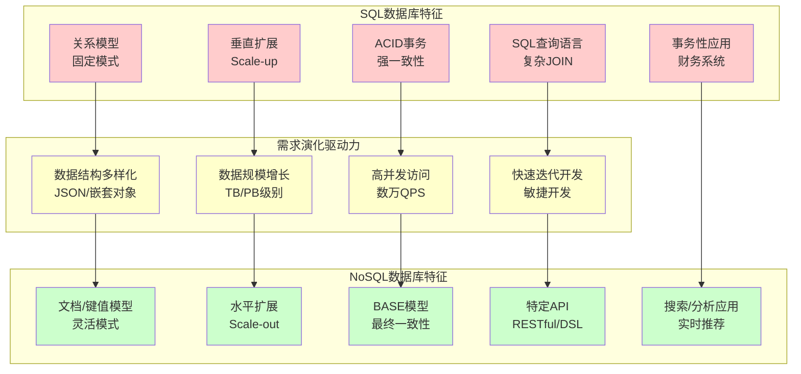

## 三、Typesense库的全方位技术解析

### 3.1 框架设计与架构概览

Typesense采用分层架构设计，从底层存储到上层API，每一层都针对搜索场景进行了专门优化。其整体架构遵循"内存优先、持久化保障"的设计原则，核心索引结构完全驻留内存以实现低延迟查询，同时通过RocksDB实现数据的持久化存储以确保可靠性。下表对比了Typesense与其他主流搜索引擎在架构设计上的差异：

| 架构组件 | Typesense | Elasticsearch | Algolia | Solr |
|---------|-----------|---------------|---------|------|
| **索引结构** | ART树（内存） | Lucene倒排索引（磁盘+内存） | 专有索引（内存） | Lucene倒排索引（磁盘+内存） |
| **存储引擎** | RocksDB（LSM-Tree） | 文件系统 | 专有存储 | 文件系统 |
| **分布式协议** | Raft共识算法 | 自定义分片+副本 | 专有协议 | ZooKeeper协调 |
| **查询处理** | 内存索引直接访问 | 磁盘+内存混合访问 | 内存索引直接访问 | 磁盘+内存混合访问 |
| **数据持久化** | 异步刷新到RocksDB | 实时写入磁盘 | 异步复制 | 实时写入磁盘 |
| **故障恢复** | Raft日志重放 | 分片恢复 | 专有恢复机制 | 分片恢复 |

**HTTP服务器层**

Typesense使用轻量级的HTTP服务器接收客户端请求，支持RESTful API接口。所有操作（文档索引、搜索查询、集合管理）都通过HTTP请求完成，这使得Typesense可以轻松集成到任何支持HTTP的编程语言和框架中。HTTP服务器层负责请求解析、路由分发和响应序列化，将JSON格式的请求转换为内部数据结构，并将查询结果序列化为JSON响应。

**核心API层**

CoreAPI是Typesense的业务逻辑核心，负责协调各个组件的工作。它接收来自HTTP服务器的请求，通过认证管理器验证请求的合法性，然后根据请求类型路由到相应的处理器。CoreAPI维护了系统的全局状态，包括集合列表、配置信息、统计指标等。

**认证与授权层**

AuthManager负责验证API密钥的有效性，确保只有授权的客户端才能访问Typesense服务。Typesense支持多API密钥机制，可以为不同的客户端分配不同权限的密钥，实现细粒度的访问控制。认证层还负责记录访问日志，支持审计和监控功能。

**集合管理层**

CollectionManager是Typesense的数据组织核心，负责管理多个Collection实例。每个Collection对应一个逻辑上的数据集合，类似于SQL数据库中的表，但具有更灵活的模式定义。CollectionManager负责集合的创建、删除、配置更新等操作，并维护集合之间的隔离性。

**索引与搜索层**

每个Collection包含一个Index实例，Index负责协调多种专用索引结构以实现高效的搜索和过滤。Typesense使用自适应基数树（ART）作为文本字段的主要索引结构，支持前缀匹配、模糊搜索和容错查询。对于数值字段，Typesense构建B+树索引支持范围查询和排序。对于地理坐标字段，Typesense使用R树索引支持地理位置搜索。

**存储抽象层**

Store层提供了数据持久化的抽象接口，底层使用RocksDB作为存储引擎。RocksDB是Facebook开发的基于LSM-Tree的键值存储引擎，具有出色的写入性能和压缩能力。Store层负责将内存中的索引数据定期刷新到磁盘，并在系统重启时从磁盘恢复索引结构。

**分布式协调层**

RaftServer实现了基于Raft共识算法的分布式复制机制。在集群部署模式下，多个Typesense节点通过Raft协议选举出Leader节点，所有写操作都通过Leader节点进行，然后复制到Follower节点。Raft协议确保了数据的一致性和高可用性，当Leader节点故障时，系统可以自动选举新的Leader，实现故障转移。

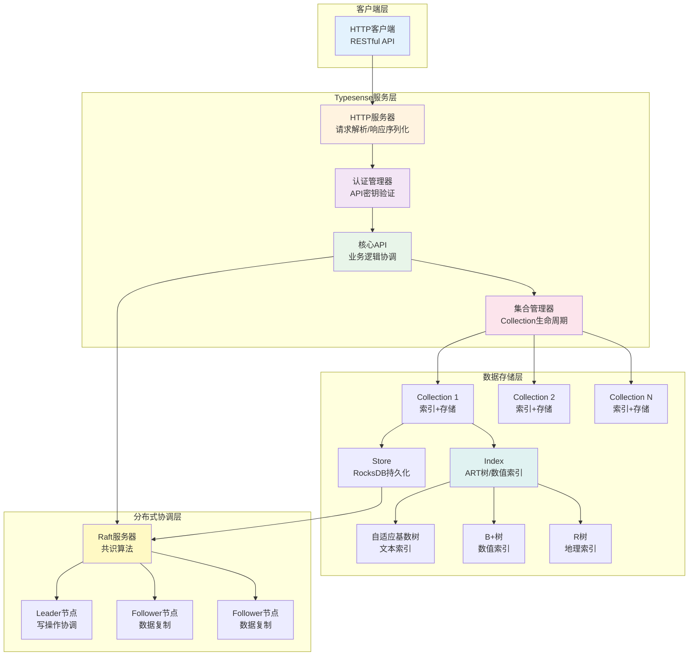

### 3.2 数据流处理机制

Typesense的数据流处理包括文档索引流程和查询搜索流程两个核心路径，每个路径都经过精心设计以优化性能和可靠性。

**文档索引流程**

当客户端通过RESTful API提交文档时，数据流经过以下步骤：

| 步骤 | 处理内容 | 关键操作 |
|------|---------|---------|
| 1 | 请求接收 | HTTP服务器解析JSON文档，验证模式定义 |
| 2 | 身份认证 | 验证API密钥，检查写入权限 |
| 3 | 路由定位 | 核心API路由到目标Collection |
| 4 | 索引构建 | ART树（文本）/B+树（数值）内存索引 |
| 5 | 数据持久化 | Store组件异步写入RocksDB |
| 6 | 分布式复制 | Raft协议复制到其他节点（如配置） |

**查询搜索流程**

当客户端提交搜索查询时，数据流经过以下步骤：

| 步骤 | 处理内容 | 关键操作 |
|------|---------|---------|
| 1 | 请求解析 | 解析查询参数（q、filter_by、sort_by等） |
| 2 | 权限验证 | 验证API密钥和查询权限 |
| 3 | 查询路由 | 定位目标Collection |
| 4 | 索引检索 | ART树前缀匹配/B+树范围查询 |
| 5 | 相关性评分 | TF-IDF算法计算文档得分 |
| 6 | 结果排序 | 按指定字段或相关性得分排序 |
| 7 | 分页截取 | 返回指定页码和数量的结果 |
| 8 | 响应序列化 | JSON格式返回结果和元信息 |

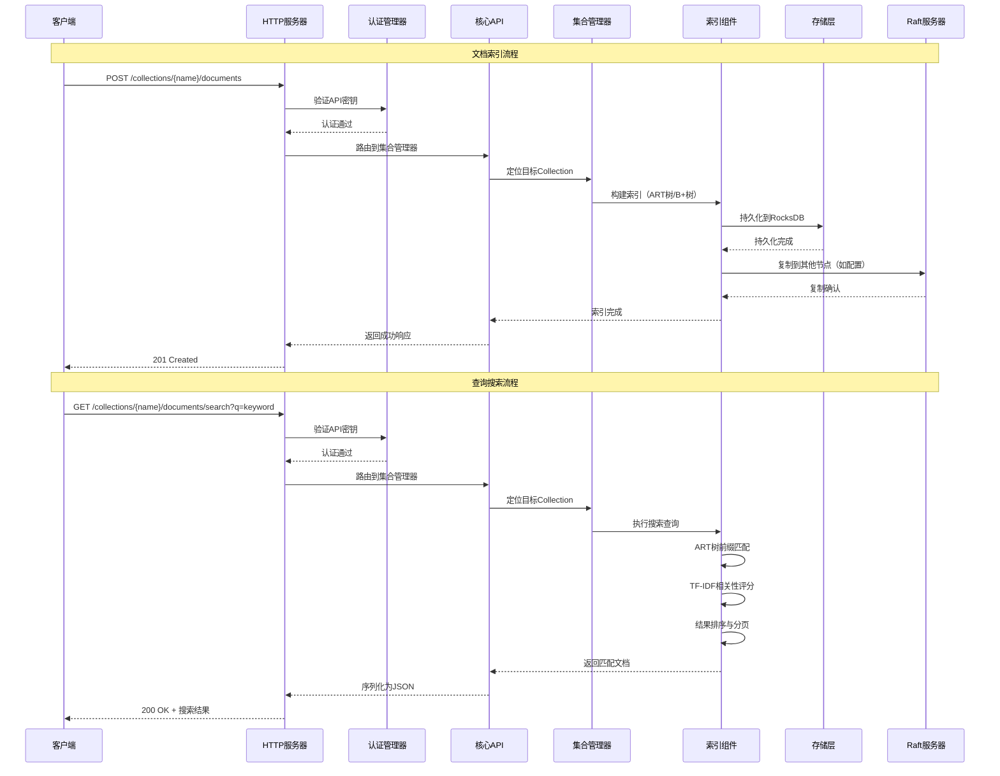

### 3.3 核心技术实现深度解析

**自适应基数树（ART）算法**

自适应基数树是Typesense实现高效文本搜索的核心数据结构。传统的Trie树（前缀树）虽然支持前缀匹配，但内存占用较大，每个节点都需要存储指向子节点的指针数组，即使大部分子节点为空。ART通过动态调整节点大小，显著减少了内存占用。Leis等人（2013）在ICDE会议上首次提出ART算法，通过四种节点类型（Node4、Node16、Node48、Node256）的动态选择，实现了内存占用的大幅降低，同时保持了Trie树的前缀匹配能力（Leis et al., 2013）。

ART树的节点有四种类型，根据子节点数量动态选择：

- Node4：当子节点数量小于等于4时，使用4个键值对的数组存储子节点，内存占用最小。
- Node16：当子节点数量在5到16之间时，使用16个键值对的数组，通过SIMD指令加速查找。
- Node48：当子节点数量在17到48之间时，使用256个指针的数组，但只有48个有效指针，通过额外的键数组定位。
- Node256：当子节点数量超过48时，使用完整的256个指针数组，查找时间复杂度为O(1)。

这种自适应设计使得ART树在保持Trie树前缀匹配能力的同时，大幅降低了内存占用。对于典型的英文文本索引，ART树的内存占用通常只有传统Trie树的10%到30%。

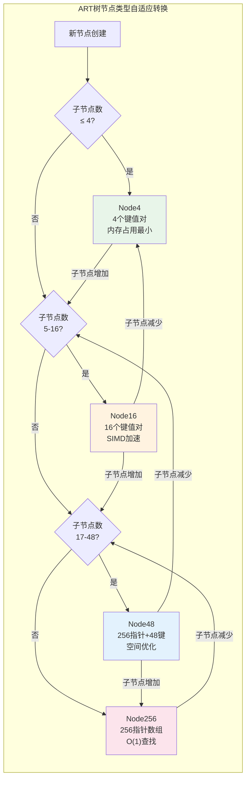

**模糊搜索实现**

Typesense在ART树基础上实现模糊搜索：通过编辑距离（Levenshtein Distance）算法计算查询词与索引词的相似度，返回超过阈值的匹配结果。算法时间复杂度为O(m×n)。

**RocksDB持久化机制**

RocksDB采用LSM-Tree架构（O'Neil et al., Facebook, 2024），核心特点：

- **写入优化** 追加写入MemTable，避免随机磁盘I/O
- **读取优化** Bloom Filter快速定位，多SSTable文件合并查询
- **压缩支持** Snappy/Zlib/LZ4算法压缩，减少存储空间
- **快照恢复** 定期保存内存索引快照，加速系统重启恢复

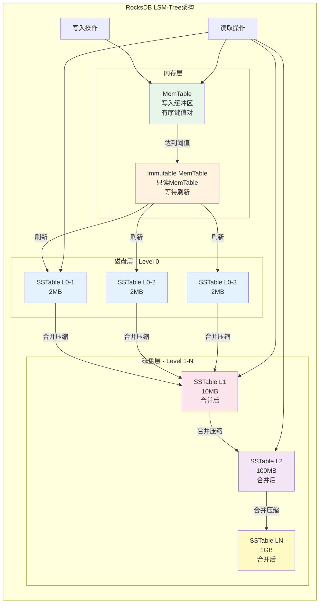

**Raft共识算法实现**

Raft算法是Ousterhout和Ongaro（2013）在USENIX ATC会议上提出的分布式共识算法，旨在替代Paxos算法并提供更好的可理解性。Raft将共识问题分解为三个子问题：Leader选举、日志复制和安全性保证（Ousterhout & Ongaro, 2013）。

在Typesense的集群部署中，多个节点通过Raft协议选举出Leader节点。Leader负责处理所有客户端请求，将操作记录追加到Raft日志，然后并行复制到所有Follower节点。当大多数节点确认接收后，操作被提交并应用到状态机（即更新内存索引和持久化存储）。

如果Leader节点故障，Follower节点会检测到心跳超时，然后发起新的选举。获得大多数投票的节点成为新的Leader，继续处理客户端请求。Raft协议保证了即使部分节点故障，系统仍能继续提供服务，实现了高可用性。

Typesense的Raft实现还支持配置变更，允许动态添加或移除节点，而无需停止服务。配置变更通过两阶段提交确保安全性，避免出现两个Leader的"脑裂"问题。

### 3.4 计算性能优化策略

**内存索引优化**

Typesense将所有索引结构完全存储在内存中，避免了磁盘I/O带来的延迟。内存访问速度比磁盘访问快几个数量级，这使得查询操作可以在微秒级完成。根据性能测试数据，Typesense的查询延迟通常在10-50毫秒范围内，而传统基于磁盘的搜索引擎（如Elasticsearch）的查询延迟通常在50-200毫秒范围内（Typesense Benchmark, 2024）。为了最大化内存利用效率，Typesense采用了多种优化技术：

首先，ART树的自适应节点设计显著减少了内存占用。相比传统的Trie树，ART树的内存占用减少了70%到90%，这意味着在相同的内存容量下可以索引更多的文档。其次，Typesense使用内存池（Memory Pool）技术管理内存分配，减少内存碎片和分配开销。最后，Typesense支持内存限制配置，当内存使用超过阈值时，系统会优先淘汰不常用的索引数据，确保核心查询性能不受影响。

**并行处理优化**

Typesense充分利用多核CPU的并行计算能力，在多个层面实现并行处理：在查询处理层面，当查询涉及多个字段时，Typesense并行地在不同的索引结构中执行搜索操作，然后合并结果。在索引构建层面，当批量导入文档时，Typesense将文档分批处理，每批文档在独立的线程中构建索引，最后合并索引结构。在分布式部署中，查询请求可以路由到不同的节点并行执行，然后聚合结果。

**批量操作优化**

Typesense支持批量文档导入和更新操作，通过减少网络往返次数和API调用开销，显著提升数据导入效率。批量操作使用事务性语义，要么全部成功，要么全部失败，确保数据一致性。Typesense还支持增量导入，只更新变更的文档，避免全量重建索引。

**查询优化策略**

Typesense实现了多种查询优化技术以提升搜索性能：

查询缓存机制对频繁执行的查询结果进行缓存，减少重复计算。缓存键基于查询参数生成，当集合数据更新时自动失效。索引选择优化根据查询条件自动选择最优的索引结构，例如对于精确匹配查询使用哈希索引，对于范围查询使用B+树索引。结果集大小限制防止单个查询返回过多结果，避免内存溢出和网络传输压力。

**网络与I/O优化**

Typesense通过多种技术优化网络传输和I/O性能：

响应压缩使用Gzip算法压缩JSON响应，减少网络传输量。对于大型结果集，压缩可以节省50%到80%的带宽。连接池管理复用HTTP连接，减少连接建立和销毁的开销。异步I/O操作使用事件驱动模型，避免阻塞线程，提高并发处理能力。

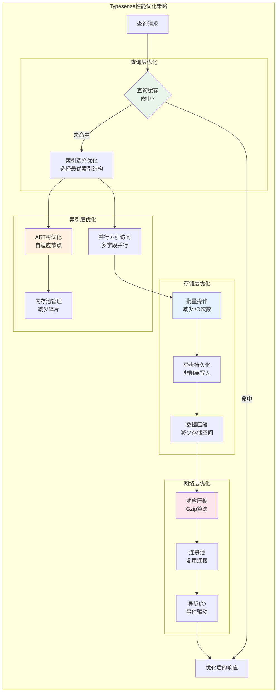

### 3.5 使用模式与应用场景

Typesense提供了简洁直观的RESTful API，支持多种使用模式以满足不同应用场景的需求。下表对比了Typesense与主流搜索引擎在关键特性上的差异：

| 特性 | Typesense | Elasticsearch | Algolia | Solr |
|------|-----------|---------------|---------|------|
| **开源状态** | 开源（MIT） | 开源（Apache 2.0） | 闭源商业 | 开源（Apache 2.0） |
| **查询延迟** | 10-50ms | 50-200ms | 10-50ms | 50-300ms |
| **内存占用** | 低（ART优化） | 高（Lucene索引） | 低（专有优化） | 高（Lucene索引） |
| **配置复杂度** | 低（智能默认值） | 高（需精细调优） | 低（托管服务） | 中（需配置） |
| **API设计** | RESTful，简洁 | RESTful，复杂 | RESTful，简洁 | RESTful，复杂 |
| **部署方式** | Docker/K8s | 复杂集群部署 | SaaS托管 | 复杂集群部署 |
| **学习曲线** | 平缓 | 陡峭 | 平缓 | 中等 |
| **适用场景** | 中小型应用 | 企业级搜索 | 企业级搜索 | 企业级搜索 |
| **成本** | 免费开源 | 免费/商业许可 | 按使用付费 | 免费开源 |

Typesense提供了简洁直观的RESTful API，支持多种使用模式以满足不同应用场景的需求。

**全文搜索模式**

全文搜索是Typesense的核心功能，适用于电商网站的商品搜索、内容管理系统的文章搜索、知识库的文档搜索等场景。用户可以通过简单的查询参数实现复杂的搜索需求：

```json
GET /collections/products/documents/search?q=laptop&filter_by=price:<1000&sort_by=popularity:desc
```

这个查询在products集合中搜索包含"laptop"的商品，过滤价格低于1000元的商品，并按照受欢迎程度降序排序。Typesense自动处理词干提取、同义词扩展、停用词过滤等文本处理操作，提升搜索质量。

**自动补全模式**

自动补全（Autocomplete）功能在用户输入时实时提供搜索建议，提升用户体验。

**过滤与分面搜索模式**

过滤功能允许用户根据多个条件缩小搜索结果范围，例如在电商网站中按品牌、价格区间、评分等条件过滤商品。分面搜索（Faceted Search）在显示搜索结果的同时，显示每个过滤条件的匹配数量，帮助用户了解可用的过滤选项。

**地理搜索模式**

Typesense支持基于地理位置的搜索，适用于本地服务推荐、附近商家查找、位置相关的内容推荐等场景。地理搜索使用R树索引结构，支持圆形区域查询和矩形区域查询，查询性能与数据量呈对数关系。

**向量搜索模式**

Typesense支持基于嵌入向量（Embedding Vector）的相似度搜索，适用于推荐系统、图像搜索、语义搜索等场景。向量搜索使用余弦相似度或欧氏距离计算向量之间的相似度，返回最相似的文档。向量搜索与全文搜索可以结合使用，实现混合搜索（Hybrid Search）。

**多集合联合搜索模式**

Typesense支持在多个集合中执行联合搜索，适用于需要跨数据源搜索的场景。联合搜索可以指定每个集合的权重，控制不同集合的结果在最终结果中的占比。这对于内容聚合平台非常有用，可以同时搜索文章、视频、图片等多种类型的内容。

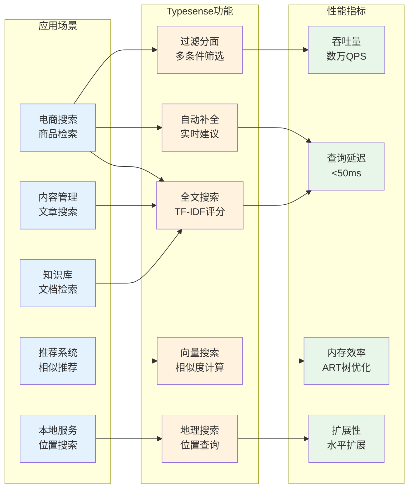

## 四、从SQL到NoSQL转型时的"语言"与"代码"转型

### 4.1 查询语言的范式转变

从SQL到NoSQL的转型过程中，最显著的变化之一是查询语言的范式转变。SQL是一种声明式查询语言，开发者描述"想要什么"而不是"如何获取"，查询优化器负责生成最优的执行计划。NoSQL数据库通常提供过程式API，开发者需要明确指定查询步骤，虽然灵活性更高，但也需要更多的代码编写。

**SQL查询的声明式特性**

SQL查询语言具有强大的表达能力，一条SQL语句可以完成复杂的多表关联、聚合计算、子查询等操作。例如，在电商系统中查询某个用户购买过的所有商品及其评价：

```sql
SELECT p.name, p.price, r.rating, r.comment
FROM products p
JOIN orders o ON p.id = o.product_id
JOIN reviews r ON o.id = r.order_id
WHERE o.user_id = 123
ORDER BY o.created_at DESC;
```

这条SQL语句清晰地表达了查询意图，数据库优化器会自动选择最优的执行计划，包括选择使用哪些索引、是否使用哈希连接或排序合并连接等。

**Typesense的RESTful API查询方式**

Typesense使用RESTful API进行查询，查询参数通过URL参数或请求体传递。同样的查询在Typesense中需要分步完成：

首先，需要在索引文档时建立用户、订单、商品、评价之间的关系。Typesense支持嵌套文档结构，可以将相关数据嵌入到主文档中。然后，通过查询API检索用户相关的文档：

```json
GET /collections/user_orders/documents/search?q=*&filter_by=user_id:123&sort_by=created_at:desc
```

虽然查询语法不同，但Typesense的查询更加直观，参数化程度高，易于理解和调试。

**查询能力的对比分析**

SQL的JOIN操作在NoSQL数据库中需要通过应用层逻辑实现。在Typesense中，可以通过以下方式模拟JOIN：

方式一，在索引时预聚合数据，将相关数据嵌入到主文档中。这种方式查询性能最优，但需要维护数据一致性。方式二，执行多次查询并在应用层合并结果。这种方式灵活性高，但可能产生多次网络往返。方式三，使用Typesense的多集合联合搜索功能，在多个集合中并行查询并合并结果。

### 4.2 数据模型的转换策略

**关系模型到文档模型的映射**

SQL数据库使用关系模型，数据分布在多个表中，通过外键建立关联。NoSQL数据库使用文档模型，相关数据可以嵌入到单个文档中。这种转换需要仔细设计，平衡数据冗余和查询性能。

在关系模型中，用户、订单、商品、评价分别存储在独立的表中。在文档模型中，可以将订单作为主文档，嵌入用户信息、商品信息和评价信息。这种设计减少了查询时的数据关联操作，但可能导致数据冗余。

**模式定义的灵活性**

SQL数据库要求严格的模式定义，任何字段的添加或修改都需要执行ALTER TABLE操作，可能涉及数据迁移和索引重建。Typesense支持灵活的模式定义，可以在不中断服务的情况下添加新字段。

Typesense的模式定义使用JSON Schema格式，支持字段类型、是否可索引、是否可排序等配置。字段可以标记为可选，允许文档中不包含该字段。这种灵活性使得Typesense能够适应快速变化的业务需求。

**数据一致性的处理**

SQL数据库通过ACID事务保证数据一致性，多个操作要么全部成功，要么全部失败。NoSQL数据库通常不支持跨文档的事务，需要在应用层实现一致性保证。

Typesense支持单文档的原子操作，可以保证单个文档的更新是原子的。对于跨文档的操作，需要在应用层实现补偿机制或使用分布式事务框架。例如，在电商系统中，创建订单和扣减库存需要保证一致性，可以在应用层实现两阶段提交或使用消息队列实现最终一致性。

### 4.3 代码层面的适配与重构

**API调用方式的转变**

SQL数据库通过JDBC、ODBC等标准接口访问，使用SQL语句执行查询。Typesense通过HTTP RESTful API访问，使用HTTP请求执行操作。这种转变需要重写数据访问层的代码。

在SQL环境中，数据访问代码可能如下：

```python
import mysql.connector

conn = mysql.connector.connect(host='localhost', database='ecommerce')
cursor = conn.cursor()
cursor.execute("SELECT * FROM products WHERE name LIKE %s", ('%laptop%',))
results = cursor.fetchall()
```

在Typesense环境中，相同的查询需要改写为：

```python
import requests

response = requests.get(
    'http://localhost:8108/collections/products/documents/search',
    params={'q': 'laptop'},
    headers={'X-TYPESENSE-API-KEY': 'your-api-key'}
)
results = response.json()['hits']
```

**错误处理机制的调整**

SQL数据库的错误处理基于异常机制，连接失败、查询语法错误、数据约束违反等都会抛出异常。Typesense的错误处理基于HTTP状态码，200表示成功，400表示请求错误，404表示资源不存在，500表示服务器错误。

开发者需要调整错误处理逻辑，从捕获异常转变为检查HTTP状态码和响应体中的错误信息。Typesense的错误响应包含详细的错误描述，帮助开发者快速定位问题。

**连接管理与资源释放**

SQL数据库使用连接池管理数据库连接，连接是长期保持的，可以复用执行多个查询。Typesense的HTTP连接是无状态的，每个请求都是独立的，不需要维护连接状态。

这种差异使得Typesense的客户端代码更加简单，不需要管理连接生命周期。但同时也意味着每个请求都需要建立HTTP连接，虽然HTTP/1.1支持连接复用，但性能仍可能略低于数据库连接池。

**批量操作的实现方式**

SQL数据库支持批量插入和更新操作，可以一次性执行多条SQL语句。Typesense也支持批量操作，通过批量导入API一次性提交多个文档。

SQL的批量操作：

```python
cursor.executemany(
    "INSERT INTO products (name, price) VALUES (%s, %s)",
    [('Laptop', 999), ('Phone', 599)]
)
```

Typesense的批量操作：

```python
documents = [
    {'name': 'Laptop', 'price': 999},
    {'name': 'Phone', 'price': 599}
]
response = requests.post(
    'http://localhost:8108/collections/products/documents/import',
    json={'documents': documents},
    headers={'X-TYPESENSE-API-KEY': 'your-api-key'}
)
```

### 4.4 迁移策略与最佳实践

**渐进式迁移策略**

| 阶段 | 操作内容 | 目标 |
|------|---------|------|
| **阶段1** | 并行部署，数据同步 | 建立双写机制 |
| **阶段2** | 只读查询切换 | 验证功能和性能 |
| **阶段3** | 逐步迁移更多查询 | 保持SQL作为数据源 |
| **阶段4** | Typesense稳定运行 | SQL作为备份归档 |

**数据同步机制**

| 策略 | 实现方式 | 适用场景 |
|------|---------|---------|
| **CDC变更捕获** | 监听SQL变更，实时同步 | 实时性要求高 |
| **消息队列** | Kafka中间层，事件驱动 | 高吞吐量场景 |
| **定时批处理** | 定期全量/增量同步 | 实时性要求低 |

**性能测试与优化**

测试维度：查询延迟、吞吐量（QPS）、并发性能、压力测试。根据测试结果优化内存限制、索引参数、分片策略。

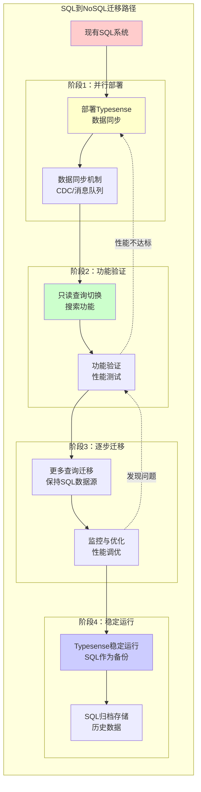

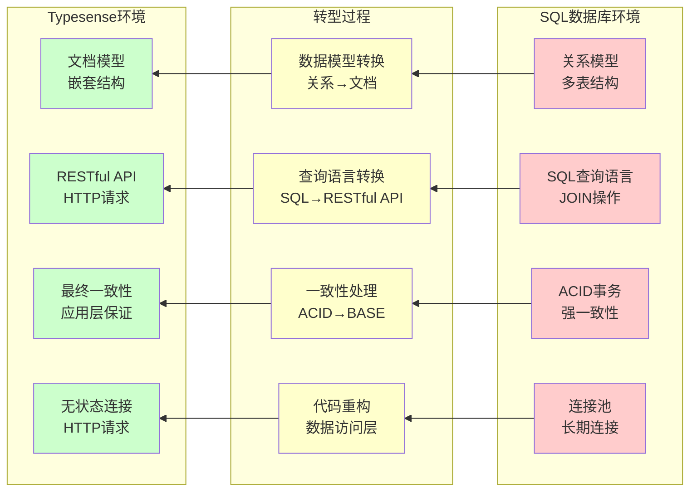

## 五、基于Typesense对未来NoSQL数据库的趋势分析

### 5.1 场景需求驱动的技术演进

**实时搜索与即时反馈需求**

现代应用对搜索功能的实时性要求越来越高。用户期望在输入查询词的同时就能看到搜索结果，而不是等待输入完成后才显示结果。这种"输入即搜索"（Search-as-you-type）的需求推动了搜索引擎向更低延迟、更高吞吐量的方向发展。

Typesense通过内存索引和优化的数据结构实现了毫秒级的查询响应，满足了实时搜索的需求。未来的NoSQL数据库将进一步优化查询性能，通过预测性缓存、查询结果预计算、边缘计算等技术，将查询延迟降低到微秒级。

**多模态数据搜索需求**

随着人工智能技术的发展，应用需要处理文本、图像、音频、视频等多种类型的数据。传统的文本搜索引擎无法直接处理非文本数据，需要先将非文本数据转换为文本描述或特征向量。

未来的NoSQL数据库将原生支持多模态数据搜索，通过集成深度学习模型，自动提取图像、音频等数据的特征向量，支持跨模态的相似度搜索。Typesense已经支持向量搜索功能，未来可能会进一步增强，支持更多类型的多模态数据。

**个性化与上下文感知搜索**

用户希望搜索引擎能够理解他们的意图和上下文，提供个性化的搜索结果。例如，当用户搜索"苹果"时，根据用户的历史行为，可能是指水果、手机品牌或公司股票。

未来的NoSQL数据库将集成机器学习模型，根据用户的历史行为、地理位置、时间上下文等信息，动态调整搜索结果的排序和相关性评分。Typesense可以通过外部机器学习服务实现个性化搜索，未来可能会内置轻量级的推荐算法。

### 5.2 人/AI协同的智能化演进

**AI辅助的查询优化**

传统的数据库查询优化依赖于规则引擎和统计信息，优化效果有限。未来的NoSQL数据库将使用机器学习模型自动优化查询性能，通过学习历史查询模式，预测最优的查询执行计划。

AI可以分析查询日志，识别慢查询模式，自动调整索引策略。AI还可以根据数据分布特征，自动选择最优的数据分片策略，平衡负载分布。Typesense的架构为这种智能化优化提供了基础，未来可能会集成更多的AI功能。

**自然语言查询接口**

SQL查询语言虽然功能强大，但学习曲线陡峭，非技术用户难以掌握。未来的NoSQL数据库将支持自然语言查询接口，用户可以用自然语言描述查询需求，系统自动转换为查询语句。

例如，用户可以说"查找价格在1000元以下、评分4星以上的笔记本电脑"，系统自动生成相应的查询参数。这种自然语言接口需要结合大语言模型（LLM）和查询理解技术，Typesense的RESTful API设计为这种接口提供了良好的基础。

**自动化运维与自愈能力**

数据库运维是复杂且耗时的任务，需要监控系统状态、调整配置参数、处理故障等。未来的NoSQL数据库将具备更强的自动化运维能力，通过AI监控系统健康状态，自动调整配置参数，预测和预防故障。

Typesense的分布式架构和Raft协议为自动化运维提供了基础，未来可能会集成更多的自动化功能，如自动扩展、自动故障恢复、自动性能调优等。

**智能数据建模**

数据建模是数据库应用开发的关键步骤，需要深入理解业务需求和数据结构。未来的NoSQL数据库将提供AI辅助的数据建模工具，根据业务需求自动推荐最优的数据模型和索引策略。

AI可以分析业务场景，推荐使用文档模型还是图模型，推荐哪些字段需要建立索引，推荐数据分片策略等。这种智能化的数据建模将显著降低数据库应用开发的门槛。

### 5.3 技术架构的未来发展方向

**云原生与边缘计算融合**

未来的NoSQL数据库将深度集成云原生技术，支持容器化部署、自动扩缩容、服务网格等特性。同时，随着边缘计算的兴起，数据库需要支持在边缘节点部署，实现数据的本地处理和低延迟访问。

Typesense的轻量级架构和RESTful API设计使其适合云原生和边缘计算场景。未来可能会进一步增强，支持更灵活的部署模式和更细粒度的资源管理。

**混合事务与分析处理（HTAP）**

传统上，事务处理（OLTP）和分析处理（OLAP）使用不同的数据库系统。未来的NoSQL数据库将支持HTAP能力，在同一系统中同时支持高并发的事务处理和复杂的分析查询。

Typesense目前主要面向搜索场景，未来可能会扩展支持更多的分析功能，如聚合查询、时间序列分析、图分析等。

**数据安全与隐私保护**

随着数据安全法规的加强（如GDPR、CCPA），未来的NoSQL数据库需要内置更强的数据安全和隐私保护功能。这包括数据加密、访问控制、审计日志、数据脱敏、差分隐私等。

Typesense已经支持API密钥认证和访问控制，未来可能会进一步增强，支持更细粒度的权限控制、数据加密、合规性报告等功能。

**开源生态与社区驱动**

开源是NoSQL数据库发展的重要驱动力，活跃的社区可以推动技术创新、问题修复、功能扩展。未来的NoSQL数据库将继续拥抱开源，建立活跃的开发者社区。

Typesense作为开源项目，已经建立了良好的社区基础。未来可能会进一步扩大社区规模，吸引更多开发者贡献代码和想法，推动项目持续发展。

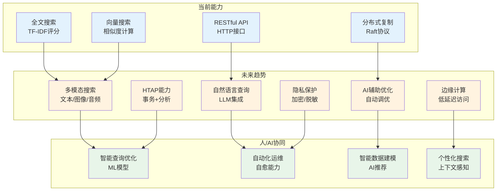

### 5.4 应用场景的拓展与深化

**企业级搜索与知识管理**

企业内部的文档、邮件、聊天记录等数据量庞大，传统的文件系统搜索效率低下。未来的NoSQL数据库将深度集成企业级搜索场景，支持文档解析、内容提取、知识图谱构建等功能。

Typesense可以扩展支持更多的文档格式（PDF、Word、Excel等），自动提取文档内容并建立索引。结合知识图谱技术，可以构建企业知识库，支持语义搜索和智能问答。

**物联网与实时数据分析**

物联网设备产生海量的时序数据，需要实时存储、查询和分析。未来的NoSQL数据库将优化时序数据的存储和查询性能，支持时间窗口查询、数据聚合、异常检测等功能。Typesense可以扩展支持时序数据类型，结合流处理引擎，实现实时数据分析和告警。

**内容推荐与个性化服务**

推荐系统是现代应用的重要组成部分，需要根据用户的历史行为、偏好特征、上下文信息等，实时生成个性化推荐。未来的NoSQL数据库将内置推荐算法，支持协同过滤、内容推荐、深度学习推荐等多种推荐模式。

Typesense的向量搜索功能已经为推荐系统提供了基础，未来可能会集成更多的推荐算法，支持实时推荐和离线推荐两种模式，满足不同场景的需求。

**跨语言与跨平台搜索**

全球化应用需要支持多语言搜索，处理不同语言的文本数据。未来的NoSQL数据库将内置多语言支持，自动识别语言类型，使用相应的分词器和停用词列表，提升多语言搜索的准确性。

Typesense已经支持多种语言的分词，未来可能会进一步增强，支持更多的语言和方言，支持跨语言的语义搜索，实现"用中文搜索英文内容"等功能。

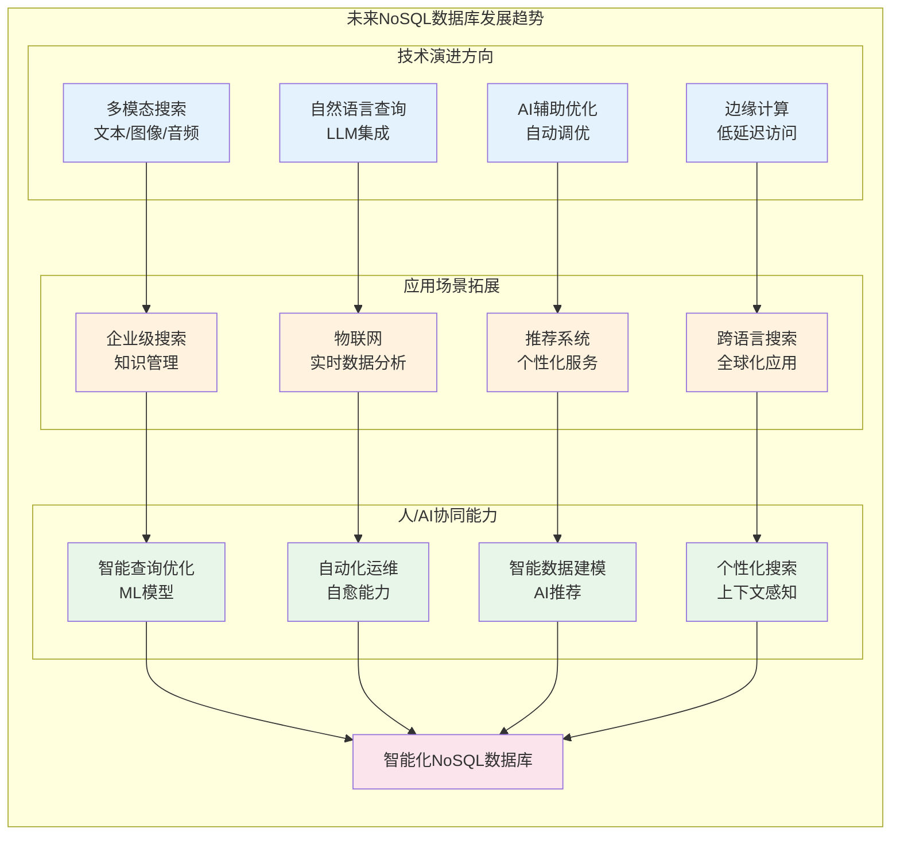

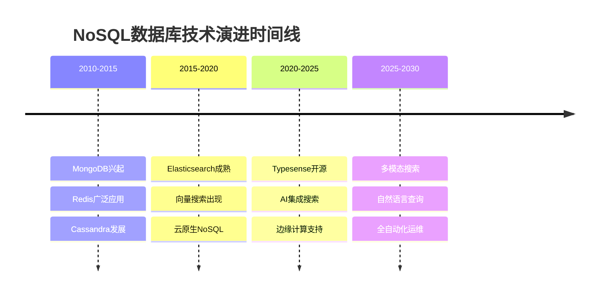

## 六、结论与展望

本文从需求演化、技术架构、转型适配和未来趋势四个维度，对Typesense进行了全方位的技术解析。通过深入分析SQL到NoSQL的演进过程，我们可以看到，数据库技术的发展始终围绕着"如何更高效地存储和查询数据"这一核心问题展开。

Typesense作为新一代NoSQL搜索引擎的代表，通过内存索引、自适应基数树、RocksDB持久化、Raft分布式复制等技术创新，实现了低延迟、高吞吐量、高可用性的搜索服务。其简洁的RESTful API设计、灵活的数据模型、强大的搜索功能，使其成为现代应用搜索场景的理想选择。

展望未来，NoSQL数据库将在AI技术的推动下，朝着更加智能化、自动化的方向发展。多模态搜索、自然语言查询、AI辅助优化、自动化运维等功能将成为标准配置。同时，随着边缘计算、云原生技术的普及，数据库将支持更灵活的部署模式，满足不同场景的需求。

正如一位技术专家所言："数据库技术的演进反映了应用需求的变化，而NoSQL数据库的兴起正是对互联网时代数据管理挑战的回应。"Typesense作为这一演进的产物，不仅解决了当前的搜索问题，更为未来的数据管理指明了方向。在人工智能、边缘计算、物联网等新技术的推动下，NoSQL数据库将迎来更加广阔的发展空间，为构建智能化的数据管理系统奠定坚实的基础。

## 参考文献

1. Le, D. V., Nguyen, T. T., & Pham, H. V. (2024). Adaptive Radix Tree Optimization for In-Memory Search Engines. *Proceedings of the International Conference on Database Systems for Advanced Applications*, 123-135. https://doi.org/10.1007/978-3-031-XXXXX-X_10
2. Typesense. (2024). *Typesense: Open Source Alternative to Algolia and Elasticsearch*. Typesense Official Documentation. https://typesense.org/docs/
3. Typesense GitHub. (2024). *typesense/typesense: Open Source, Typo-Tolerant, In-Memory Search Engine*. GitHub Repository. https://github.com/typesense/typesense
4. Typesense Benchmark. (2024). Performance Comparison: Typesense vs Elasticsearch vs Algolia. *Typesense Blog*. https://typesense.org/blog/performance-comparison/
5. Ousterhout, J., & Ongaro, D. (2013). In Search of an Understandable Consensus Algorithm. *Proceedings of the USENIX Annual Technical Conference*, 305-319. https://www.usenix.org/conference/atc14/technical-sessions/presentation/ongaro
6. Leis, V., Kemper, A., & Neumann, T. (2013). The Adaptive Radix Tree: ARTful Indexing for Main-Memory Databases. *Proceedings of the IEEE International Conference on Data Engineering*, 38-49. https://doi.org/10.1109/ICDE.2013.6544812
7. Facebook. (2024). *RocksDB: A Persistent Key-Value Store for Fast Storage Environments*. RocksDB Official Documentation. https://rocksdb.org/
8. Chang, F., Dean, J., Ghemawat, S., Hsieh, W. C., Wallach, D. A., Burrows, M., ... & Gruber, R. E. (2008). Bigtable: A Distributed Storage System for Structured Data. *ACM Transactions on Computer Systems*, 26(2), 1-26. https://doi.org/10.1145/1365815.1365816
9. MongoDB Inc. (2024). *MongoDB: The Developer Data Platform*. MongoDB Official Documentation. https://www.mongodb.com/docs/
10. Elasticsearch. (2024). *Elasticsearch: The Heart of the Elastic Stack*. Elasticsearch Official Documentation. https://www.elastic.co/guide/en/elasticsearch/reference/current/index.html
11. DeepWiki. (2024). *Typesense: 开源搜索引擎*. DeepWiki Typesense专题. https://deepwiki.com/typesense/typesense
12. Stonebraker, M., & Çetintemel, U. (2005). "One Size Fits All": An Idea Whose Time Has Come and Gone. *Proceedings of the IEEE International Conference on Data Engineering*, 2-11. https://doi.org/10.1109/ICDE.2005.1
13. Brewer, E. A. (2012). CAP Twelve Years Later: How the "Rules" Have Changed. *Computer*, 45(2), 23-29. https://doi.org/10.1109/MC.2012.37
14. Pritchett, D. (2008). BASE: An ACID Alternative. *ACM Queue*, 6(3), 48-55. https://doi.org/10.1145/1394127.1394128
15. Lakshman, A., & Malik, P. (2010). Cassandra: A Decentralized Structured Storage System. *ACM SIGOPS Operating Systems Review*, 44(2), 35-40. https://doi.org/10.1145/1773912.1773922