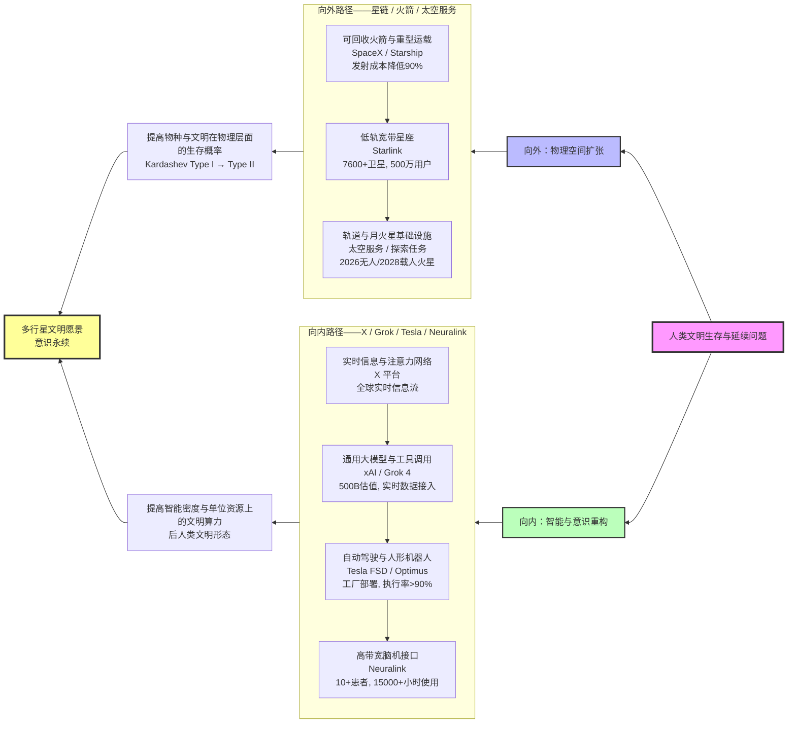
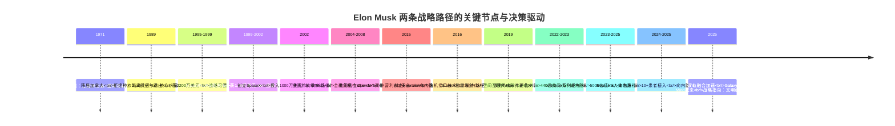
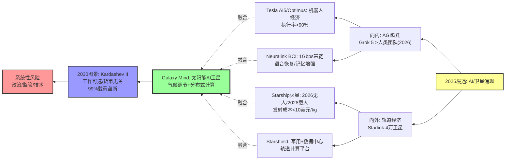
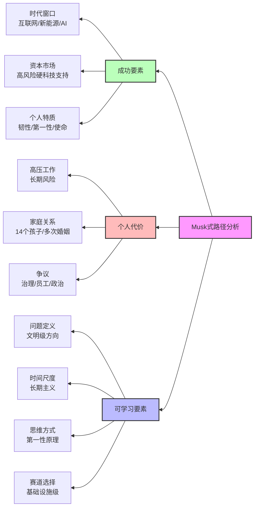

站在人类文明演化的宏观尺度上，我们正在见证一个前所未有的历史时刻：一位个体通过技术杠杆，同时推进着人类文明在物理空间与数字意识两个维度的边界拓展。Elon Musk（埃隆·马斯克）的产业帝国并非单纯的商业聚合体，而是对人类文明未来发展路径的战略锚点与定向指引。从最宏观的视角看，他试图回答的是Kardashev文明尺度下的根本问题——人类如何从Type I（行星级）文明跃迁至Type II（恒星级）文明；从最微观的视角看，他试图重构的是人类意识的载体与边界——从生物大脑到数字基质的迁移，从个体智能到群体智慧的融合。

这种"双轨并行"的战略架构，在人类历史上是前所未有的。一条轨道向外，以SpaceX和Starlink为代表的卫星网络、可回收火箭及太空服务体系，旨在拓展人类的物理疆域、发现新的宏观科学边界，并通过多行星化（multi-planetary）策略缓解地球单一栖息地的灭绝风险。另一条轨道向内，以xAI（Grok）、Tesla自动驾驶、Neuralink脑机接口及X平台（前Twitter）为代表的AI与神经增强生态，旨在将人类意识虚拟化、实现人机协同的"群智慧"（collective intelligence），并在微观层面高效复制人类需求以推动可持续集智发展。

这两条路径对人类而言都是浩渺的幻想，很难短时间实现，但Musk通过"两条腿走路"的战略，不仅实现了个人财富的指数级增长（2025年净资产接近或突破5,000亿美元），更重要的是，这些财富与其高度集中且互相耦合的产业版图绑定，使他在"现实世界的硬件基础设施"和"数字世界的智能操作系统"这两端都具有前所未有的话语权。这种话语权不仅体现在商业层面，更体现在对人类文明未来走向的实质性影响上。

本文从全人类的视角出发，采用最宏观与最微观的双重视野，系统分析Musk如何通过"向外拓展星际疆域"和"向内重塑数字文明"两条路线并行推进，成为以技术为杠杆的文明级战略玩家。文章将围绕四个层次展开：首先，以产业链和文明视角梳理Musk的"星链—可回收火箭—太空服务"与"X/Grok—Tesla—Neuralink"双轮矩阵，分析其对人类未来的锚点与指向性；其次，回到他的家庭与成长经历，结合人生关键时间节点，解析其核心价值观与战略思维如何一步步被"固化"为一个高风险、高集中度的长期战略；再次，结合2025年AI与卫星产业的最新格局，讨论Musk帝国未来可能的演化路线及其系统性风险；最后，提炼对个人决策、产业布局和资本配置的启示，以及对"Musk式路径"的冷静反思。

## 一、Musk的产业帝国：对人类文明的"双路径"锚定

### 1.1 向外：从可回收火箭到星链星座的"物理边界扩张"

2002年创立的SpaceX，以"降低太空进入成本、最终实现多行星物种"为清晰使命，通过猎鹰9（Falcon 9）、猎鹰重型（Falcon Heavy）以及正在推进的星舰（Starship），将可回收火箭从工程概念变成高频商业现实。截至2025年，SpaceX已完成超过300次成功发射，其中猎鹰9火箭的回收次数超过250次，将发射成本从传统航天的每公斤数万美元降低至数千美元，降幅超过90%。

在此基础上，Starlink作为空间侧的"流量层"和现金流引擎逐渐成型。自2019年首批卫星发射以来，Starlink已部署超过7,600颗卫星，占地球轨道卫星总数的65%以上，为全球约150个国家和地区提供宽带互联网服务，订阅用户超过500万。Starlink不仅成为SpaceX估值跃升的关键资产之一，更在全球通信基础设施中占据战略地位。

从战略结构上看，"可回收火箭 + 低轨宽带星座"实现了三个深远影响。

第一，基础设施化。把近地轨道变成"可反复进出"的服务型基础设施，而不是一次性消费的昂贵试验场。这种转变使得太空资源的利用从"奢侈品"降级为"常规服务"，为后续的轨道工厂、太空站、深空探测等应用奠定了成本基础。从宏观视角看，这意味着人类文明开始将太空视为可重复利用的资源空间，而非一次性探索的边界。

第二，经济实体化。把"空间互联网"变成现实经济体的一部分，支撑远程地区连接、战时通信、灾害应急等多场景。在2022年乌克兰冲突中，Starlink为乌克兰提供了关键通信服务，年成本约4亿美元，展示了其在地缘政治中的战略价值。这种经济实体化不仅体现在商业层面，更体现在对全球信息流动与权力结构的重塑上。

第三，未来预埋。为未来月球、火星基础设施、太空工厂、轨道算力中心等方案预埋了发射与通信两条关键生命线。SpaceX计划在2026年执行无人火星任务，2028年执行载人火星任务，这些时间表虽然激进，但基于当前技术进展，具有相当的可实现性。从文明演化的角度看，这些预埋的基础设施将成为人类多行星化的物质基础。

换言之，SpaceX/Starlink不只是一个航天公司与一个卫星运营商，而更像是"未来太空经济的底层物流与网络层"。

### 1.2 向内：从X/Grok到Tesla与Neuralink的"意识与生产方式重构"

另一方面，Musk在"向内"的路线中试图改写的是人类的注意力流、决策过程和劳动形态。

**首先是X（原Twitter）与xAI**。他在2022年以440亿美元收购Twitter，并在2023年更名为X，逐步把其定位为"全球实时信息流平台 + 支付与商业操作系统"，并与自己创立的xAI深度绑定。xAI的Grok模型自2023年发布以来持续迭代到Grok 3和Grok 4，具备实时访问X数据流、工具调用和多模态能力，成为X生态以及Tesla Optimus机器人背后的通用智能内核之一。Grok 4在2025年的估值达到500亿美元，成为AI领域的重要竞争者。

**其次是Tesla**。Tesla在电动车与储能领域的成功已被广泛讨论，更深远的转折在于其将自动驾驶与"全自动机器人出租车"和"人形机器人Optimus"作为未来十年的核心增长叙事。Tesla的FSD（Full Self-Driving）系统通过数百万辆车辆收集的实时数据不断优化，Optimus机器人已在2025年进入工厂执行学习任务，执行率超过90%。Tesla正在构建一个"具身智能网络"，将AI从虚拟世界延伸到物理世界。研究表明，传统燃油车与新能源车的关系可能并非简单的"创造性破坏"，而是存在共存的可能（Huang et al., 2022），这为Tesla的长期战略提供了市场环境分析。

**再往前推，是Neuralink**。Neuralink自2016年成立以来，以高带宽脑机接口为目标，从灵长类实验走向人体临床。2024年首位患者植入后能够通过意念控制光标、打游戏、输入文字；截至2025年已有十余名重度瘫痪患者植入装置，累计使用超过一万五千小时，英国等地也启动临床试验。Neuralink的PRIME研究计划扩展至语音恢复、记忆增强等领域，指向"人机融合"的未来图景。

从结构上看，这条"向内"路径的核心，是把人类社会的三个关键要素逐步数字化与可计算化。

注意力和舆论流层面，X平台与实时信息流聚合全球数亿用户的认知资源，形成人类集体意识的数字映射。这种映射不仅是对信息的聚合，更是对人类注意力资源的重新分配与价值化。

决策与认知层面，Grok等大模型与Tesla自动驾驶、Optimus等实体系统耦合，形成"感知-决策-执行"闭环。这种闭环将AI从虚拟世界延伸到物理世界，实现了智能从抽象到具身的跨越。

神经信号与意识接口层面，Neuralink的脑机通路实现人类意识与数字系统的直接连接。从最微观的视角看，这种连接意味着人类意识的载体可能从生物大脑扩展到数字基质，这是人类文明形态的根本性转变。

它们叠加后，形成一个从"信息流—决策流—神经信号"贯通的闭环，让Musk在人类文明向数字化、智能化阶段的迁移中握有多重控制点。

### 1.3 两条路径的文明意义：从"延展寿命"到"更换承载介质"

如果从更高层的文明视角来看，Musk的"产业帝国"其实围绕一个根本命题运转：人类文明如何延续。这个命题在Kardashev文明尺度下，对应从Type I（行星级）向Type II（恒星级）文明的跃迁，是人类文明演化的历史性转折点。

向外的路径，通过降低太空进入成本、铺设星际通信基础设施，让人类在能源、资源与生存空间上获得更高的冗余，从而提高文明在灾难情景中的鲁棒性。从宏观视角看，这种策略对应Kardashev文明尺度下从Type I（行星级）向Type II（恒星级）文明的跃迁（Kardashev, 1964）。多行星化不仅是对单一星球灭绝风险的防范，更是文明扩张的必然路径。当人类文明能够利用整个恒星系的能量时，其生存能力将实现质的飞跃。Musk在2017年发表的论文中详细阐述了多行星化的技术路径和战略意义（Musk, 2017），为这一愿景提供了理论基础。

向内的路径，通过构造可扩展的智能系统、数据流和脑机接口，为"意识的迁移与增强"准备技术通道，从而探索文明是否可以部分或整体迁移到更高效、更可扩展的数字基质上。从微观视角看，这种策略指向"后人类"（post-human）文明形态，其中意识不再受限于生物大脑的物理约束，可以在数字空间中实现近乎无限的扩展和复制。这种转变意味着人类文明的"载体"从生物体扩展到数字系统，是人类意识演化的根本性突破。相关研究探讨了全脑仿真（Whole Brain Emulation）的技术路径（Sandberg & Bostrom, 2008），以及数字意识（em）时代的可能性（Hanson, 2016），为这一愿景提供了理论支撑。

用工程语言说，他在同时尝试解决"载体不足"（星球不够、安全性不够）和"算力与智能不足"（人类大脑与传统组织方式的效率极限）这两个文明级瓶颈。

在这个意义上，Musk并非简单地"多线开花"，而是在尝试构建一个相互支撑的文明级技术栈。两条路径并非独立运行，而是通过数据流、资源流和战略协同形成耦合：Starlink为全球AI训练提供数据连接，Tesla车辆为AI模型提供物理世界数据，X平台为Grok提供实时语料，Neuralink则可能成为未来"人机混合智能"的接口层。

## 二、从家庭与成长经历到关键决策：Musk战略思维的成型

### 2.1 南非童年、家庭裂解与早期自我定位

Musk出生于1971年的南非比勒陀利亚，父亲Errol Musk是工程师与房地产开发商，曾是翡翠矿的共同拥有者，母亲Maye Musk（娘家姓Haldeman）是加拿大裔南非人，知名营养师与模特。童年时期正值南非种族隔离制度尾声，社会高度撕裂。

几项早期经历对他后来的价值观影响极大：

**第一，校园霸凌与家庭紧张关系**。他长期遭受严重霸凌，多次被同龄人殴打至住院；与父亲关系极度紧张，并在成年后公开称其"几乎做过所有能想象到的坏事"。这种经历一方面培育了极端的求生意志与防御性攻击性，另一方面让他对权威和既有秩序有根深的抵触。这种"反权威"倾向后来体现在他对传统航天、汽车、金融等行业的颠覆性挑战中。

**第二，科幻与自学编程**。十岁左右开始接触计算机并自学编程，十二岁以500美元的价格卖出自制游戏《Blastar》，同时沉迷于《银河系漫游指南》《基地》这类以宇宙尺度思考政治与技术的科幻作品。这种"科技 + 宇宙 + 幽默式虚无"的混合气质，在他后来的语言风格和愿景叙事中一直非常明显。《基地》系列中"拯救人类文明"的主题，直接映射到他"多行星物种"的使命陈述中。

**第三，主动逃离南非，重构身份**。在南非，白人男性必须服兵役，且当时军队仍为种族隔离政权服务。Musk选择以母亲的加拿大身份移居加拿大（1989年），再赴美国读书，在1990s通过创业融入美国科技精英阶层。这种主动"改写命运剧本"的经历，让他更相信个人行动可以对历史施加非线性影响。这种信念后来体现在他多次"all-in"高风险项目的决策中。

可以观察到，他很早就形成了一个自洽的叙事：**世界是不公而残酷的，只有通过技术和极端努力，才能获取足够的权力和资源去"修正"它**。这个叙事贯穿了他的整个职业生涯，从Zip2到SpaceX，从PayPal到Neuralink，每一个项目都带有"改变世界"的宏大愿景。

### 2.2 三个早期创业抉择：从现金自由到"孤注一掷"

1995–2002年间，他通过三次关键创业与退出，完成了从"技术个体"到"高净值战略玩家"的跃迁。

**第一，Zip2：用代码换来第一桶金**。与弟弟Kimbal创立Zip2（1995年），为报业提供网络城市指南解决方案。公司最终以约3.07亿美元卖给Compaq（1999年），他个人获得约2,200万美元。这一阶段，他验证了"苦干 + 纯技术产品"可以快速换取金融资本认可的路径。更重要的是，他学会了如何在资源有限的情况下，通过技术优势获得市场地位。

**第二，X.com/PayPal：从产品到基础设施**。他创建在线金融服务公司 X.com（1999年），后与Confinity合并成为PayPal（2000年）。虽然中途两次被董事会罢免CEO（2000年），但凭借最大个人股东身份，在PayPal被eBay以15亿美元收购时获得约1.76亿美元（2002年）。这笔现金流，为他之后在航天与电动车上的"超高风险All-in"提供了底气。更重要的是，PayPal的经历让他认识到"基础设施级"产品的价值：支付系统不是简单的产品，而是整个数字经济的底层支撑。

**第三，从"财务安全"到"生死一搏"：SpaceX和Tesla**。2002年之后，他把几乎全部个人财富投入SpaceX与Tesla，在最长时间内既没有稳定收入，又面临双线公司破产的巨大风险。2008年金融危机中，SpaceX前三次发射失败、第四次成功，才在最后关头获得NASA 16亿美元合同；同年Tesla亦濒临破产，他个人财富几乎清零。这一阶段，他通过"极端集中押注"和"工程细节上的亲自干预"，把个人命运与两个高风险硬科技赛道捆绑在一起。

这三次抉择逐渐固化了他的一组"战略习惯"：

- **习惯在宏大叙事之下孤注一掷**，而不是做多元分散化配置。这种策略在传统投资理论中属于高风险，但Musk通过"使命驱动"和"技术优势"来对冲风险。
- **倾向于选择"基础设施级"的赛道**（支付、发射、能源与交通），而非边缘应用。这种选择使得他的每个项目都具有"网络效应"和"规模经济"的特征。
- **接受高度风险和负面舆论**，以时间和工程推进来换取后期的定价权。这种"长期主义"在短期可能面临巨大压力，但一旦技术突破，就能获得垄断性优势。

### 2.3 "两条腿走路"的时间轴：关键节点与潜在布局

如果把注意力聚焦在"两条腿"的成型，可以用一条简化时间轴来呈现其内在逻辑：

可以看到，"向外"的路径从2002年起就持续加码，而"向内"的路径从最初参与OpenAI，到自己创建Neuralink和xAI，再叠加X和Tesla的智能化，逐步构成了完整链路。

重要的是，他并不是先做完一条路再开启另一条，而是在2015年后逐渐形成"物理基础设施 + 智能操作系统"叠加的长周期战略，并通过前者所积累的财富、技术和政府资源去为后者"输血"。这种"双轨并行"的策略，使得两条路径可以相互支撑：SpaceX的技术为Starlink提供发射能力，Starlink的收入为SpaceX提供现金流；Tesla的车辆为AI训练提供数据，AI的能力为Tesla提供竞争优势；X平台为Grok提供语料，Grok的能力为X平台提供智能服务。

### 2.4 核心价值与战略思索的形成机制

基于上述分析，可以提炼出Musk核心价值与战略思索的形成机制。

第一性原理思维（First Principles Thinking）。从物理与数学的基本定律出发，重构问题解决方案，而非依赖类比和经验。这种思维方式体现在他对火箭成本的分析（原材料成本仅占传统报价的2%）、电池能量密度的推演（理论极限vs实际性能）、以及自动驾驶架构的设计（端到端学习vs规则系统）中。从最微观的视角看，这种思维意味着从原子级的物理约束出发，重新构建整个系统架构，而非在现有框架内优化。

风险韧性（Risk Resilience）。视失败为迭代数据点，而非终点。SpaceX前三次Falcon 1发射失败，每次失败都带来技术改进；Tesla Model 3生产"地狱"持续数月，最终通过工程优化解决。这种韧性来源于童年霸凌经历培养的"极端好胜心"和"不信任权威"的倾向。从宏观视角看，这种韧性使得Musk能够在文明级目标的驱动下，承受短期失败，追求长期成功。

使命导向（Mission-Driven）。将商业目标与人类文明延续绑定，形成"宏大叙事"。这种导向使得他的决策可以超越短期财务回报，获得长期战略优势。多行星化、AI安全、可持续能源，这些"文明级"目标为他提供了超越竞争对手的"意义优势"。从全人类的视角看，这种使命导向使得Musk的战略选择具有了历史性的意义，超越了单纯的商业竞争。

垂直整合（Vertical Integration）。从原材料到最终产品，从基础设施到应用服务，构建全产业链控制。Tesla自建电池工厂、充电网络、AI芯片；SpaceX自研火箭、发动机、卫星；这种整合使得他可以在每个环节优化成本和质量，形成"系统级"竞争优势。从系统工程的视角看，这种垂直整合使得Musk能够对整个产业链进行优化，实现系统级的最优解。

这些核心价值与战略思索，通过关键时间节点的"定向性选择"，逐步固化为一个高风险、高集中度、长期主义的战略范式。

## 三、在AI与卫星产业涌现格局下：Musk帝国的未来演化

### 3.1 空间侧：从火箭公司到"轨道基础设施平台"

到2025年，SpaceX已经从"单一商业发射服务商"演化为"综合轨道基础设施平台"的核心候选者。NASA和美国政府累计与SpaceX签订的合同金额已超过200亿美元，涵盖ISS补给、载人发射、月面任务以及安全卫星发射等多个领域。

在Starlink方面，其星座规模和全球覆盖能力使其在军事通信、远洋与极地航运、灾害应急、电信备份网络中的地位日益关键，各国政府与军方对其依赖度持续提高。Starlink V3卫星具备激光链路和计算能力，支持在轨数据处理和边缘计算，为未来的"太空数据中心"奠定基础。

在这种格局下，可以预期的几条演化路线包括。

第一，Starlink从"卖终端与带宽"走向"提供一体化空间数据与算力服务"。例如边缘云、战术数据链和低延时金融链路。这种演化使得Starlink不仅是一个通信网络，更是一个"空间计算平台"，可以在轨道上直接处理数据，减少地面传输延迟。从宏观视角看，这意味着太空将成为人类计算基础设施的重要组成部分，而不仅仅是数据传输的通道。

第二，Starship若能达成高频可复用，将显著压低大规模星座、月球基地和深空探测器的部署成本。SpaceX计划将Starship的发射成本降至每公斤10美元以下，这将使得4万颗卫星的部署成本从数千亿美元降至数百亿美元，进一步巩固SpaceX在太空物流上的垄断优势。从文明演化的角度看，这种成本降低将使得大规模太空基础设施成为可能，是人类多行星化的关键前提。

第三，随着商业太空站、轨道工厂、在轨服务（加注、维修、拖曳）的发展，SpaceX有机会成为"轨道经济"的总承包商和主干交通网络。这种演化使得SpaceX从"发射服务商"升级为"轨道基础设施运营商"，类似于地面上的"高速公路+物流中心"的组合。从全人类的视角看，这意味着太空经济的形成，是人类文明从行星级向恒星级跃迁的物质基础。

这些演化方向，将使"向外路径"从单纯的发射和宽带业务，升级为围绕轨道资源与太空服务的一整套"新基础设施体系"。

### 3.2 数字侧：X + Grok + Tesla + Neuralink的"群体智能"闭环

在"向内"路径上，2023–2025年的演化显得更加迅猛。

X正在从一个传统社交平台转向"实时信息流 + 支付 + 内容与应用分发"的混合体，结合xAI的Grok形成"数据—模型—应用—支付"的闭环。X平台的实时数据流为Grok提供训练语料，Grok的能力为X平台提供智能推荐和内容生成，X的支付功能则使得这个闭环可以形成商业价值。从微观视角看，这种闭环意味着人类注意力资源的重新分配与价值化，是人类认知资源的数字化重构。

Grok本身也在快速迭代。Grok 3和Grok 4在推理能力、多模态理解和工具调用方面迅速追赶其他顶级模型，并通过X生态和API接入众多下游场景。这意味着Musk拥有了一个既能调用全球实时舆论数据，又能以模型服务形式反向影响用户行为和应用开发的强大杠杆。Grok 5计划在2026年发布，目标是超越人类团队在复杂任务（如《英雄联盟》等竞技游戏）中的表现，这标志着AI从"工具"向"伙伴"的跃迁。从全人类的视角看，这种跃迁意味着AI将成为人类文明的"新成员"，而不仅仅是工具。

Tesla正在把自动驾驶、车队数据、Dojo超算、人形机器人Optimus整合为"物理世界中的AI执行层"。Tesla AI5芯片在2025年完成tape-out，采用卷积核优化设计，专门针对FSD系统优化。Robotaxi（机器人出租车）舰队计划在2026年实现翻倍增长，Optimus机器人已在工厂环境中执行学习任务，执行率超过90%。大量车辆与未来机器人将为模型提供持续的感知数据和执行反馈，使得Tesla不仅是一家汽车公司，更像是一个遍布城市与工厂的"具身智能网络"。从宏观视角看，这种网络意味着AI从虚拟世界延伸到物理世界，实现了智能的"具身化"。相关研究显示，自动驾驶系统的伦理决策框架需要综合考虑用户行为、系统限制和监管影响（Jatavallabha, 2024），而基于LSTM轨迹预测网络的伦理决策方法为自动驾驶系统提供了新的技术路径（Wei & Wang, 2023）。

Neuralink则是这个闭环中最前沿、也最具争议的一环。随着人体临床试验推进，已多次展示通过意念控制光标、绘图和交互的案例，提供了"人—机"之间高带宽接口的早期证据。Neuralink的PRIME研究计划扩展至语音恢复、记忆增强等领域，目标是将BCI带宽提升至1Gbps级别。如果这些目标得以实现，Neuralink将成为连接"生物智能"与"数字智能"的关键桥梁。从最微观的视角看，这种连接意味着人类意识的载体可能从生物大脑扩展到数字系统，是人类文明形态的根本性转变。

如果把这些要素放在一起，可以得到一个高度抽象的"群体智能栈"：

| 层级 | 关键角色 | 功能定位 |
|------|---------|---------|
| **感知与执行层** | Tesla车辆、人形机器人、未来太空探测器 | 在物理世界中采集数据与执行动作 |
| **信息流与注意力层** | X平台 | 聚合全球实时文本、图像、视频与社会互动 |
| **模型与智能层** | xAI / Grok系列 | 对多源数据进行理解、预测和决策辅助 |
| **神经接口层** | Neuralink | 将部分人类神经信号与数字系统直接连接 |
| **空间与通信基础层** | Starlink / SpaceX | 为地面与轨道上的所有节点提供连接与物流 |

这样的结构如果继续发展，很容易走向一种"人—机—空间"高度耦合的群体智能系统：人类个体通过X和Neuralink提供认知与价值判断，通过Tesla和机器人执行物理操作，通过Starlink与轨道基础设施共享资源，而Grok等大模型则在中枢位置进行信息整合与策略生成。这正是Musk在公开言论中多次暗示却未完全展开的"人机共生文明"的技术雏形。

### 3.3 双轨融合与系统性风险：Galaxy Mind愿景与监管挑战

在2025年AI与卫星产业涌现的境遇下，Musk帝国的未来演化路线呈现指数级加速与跨域融合特征。这种融合的终极形态，可能指向Musk在2025年11月提出的"Galaxy Mind"概念——一个由太阳能AI卫星组成的深空网络，既可以通过微调太阳辐射来应对全球变暖，又可以作为分布式AI计算平台，实现"工作可选"（work optional）的后稀缺时代。

#### 双轨融合的科学基础

从技术角度看，双轨融合依赖于几个关键要素。

数据流耦合层面，Starlink为全球AI训练提供高速数据连接，Tesla车辆为AI模型提供物理世界数据，X平台为Grok提供实时语料，形成"空间—地面—数字"三层数据流。这种耦合使得数据能够在不同层次间流动，形成完整的数据生态。

算力协同层面，Starlink V3卫星的计算能力与地面Dojo超算、Tesla AI5芯片形成"轨道—边缘—中心"三层算力架构。这种协同使得算力能够在不同位置间分配，实现最优的计算资源配置。

资源循环层面，SpaceX的发射能力为Starlink提供部署能力，Starlink的收入为SpaceX提供现金流；Tesla的车辆为AI训练提供数据，AI的能力为Tesla提供竞争优势。这种循环使得不同业务之间形成相互支撑的关系，实现系统级的协同效应。

#### Galaxy Mind的科学模型

Musk提出的"Galaxy Mind"概念，本质上是一个Kardashev Type II级文明的雏形。从能量平衡方程的角度看：E_in = E_out + Delta_T。

其中，E_in是地球接收的太阳辐射，E_out是地球向太空辐射的能量，Delta T是温度变化。通过部署大量可调节的卫星，可以微调Delta S（太阳辐射调节量），使得全球温升控制在1°C以内。同时，这些卫星可以作为分布式AI计算节点，实现"太阳能—计算—气候调节"的三重功能。从宏观视角看，这种设计意味着人类文明开始利用整个恒星系的能量，是人类从行星级文明向恒星级文明跃迁的关键步骤。

#### 前瞻路线

基于当前技术进展和市场格局，可以预期以下演化路径。

2026-2027年阶段，Grok 5发布，在复杂任务中超越人类团队；Starship实现高频可复用，发射成本降至每公斤10美元以下；Neuralink BCI带宽提升至100Mbps级别。这一阶段标志着AI能力的重大突破和太空基础设施的成熟。

2028-2030年阶段，Starlink扩展至4万颗卫星，形成全球覆盖的"空间计算平台"；Tesla Robotaxi舰队规模达到百万级别；Neuralink实现语音恢复和记忆增强功能。这一阶段标志着双轨战略的全面融合和规模化应用。

2030年以后，99%的地球载荷由SpaceX垄断发射；AI-卫星网络实现"可选工作"+"多行星备份"；帝国演化为文明级平台，Musk的"两条腿走路"战略达到阶段性目标。从全人类的视角看，这一阶段意味着人类文明形态的根本性转变，是人类文明演化的历史性转折点。

#### 系统性风险与监管挑战

然而，任何高度集中、跨领域的权力结构都伴随着系统性风险。从全人类的视角看，这种风险不仅体现在商业层面，更体现在对人类文明未来走向的影响上。

政治与地缘风险层面，Musk在2024年美国大选中通过多个PAC提供超过2.9亿美元的政治捐赠，是当届选举周期中最大的个人捐赠者。这一角色强化了他在国家政策和监管环境中的影响力，也让其商业帝国更深地嵌入地缘政治博弈。Starlink在军事与安全领域的关键地位，意味着一位企业家可以在战争、制裁和国际危机中对信息流和通信能力具有实质影响，引发各国对其"基础设施中立性"的担忧。从宏观视角看，这种担忧反映了人类文明在技术高度集中情况下面临的新挑战。

监管与伦理风险层面，如果SpaceX在2030年实现99%的地球载荷垄断，将形成对太空资源的实质性控制，可能引发反垄断监管。Grok与X的数据闭环使得同一主体既控制了海量数据与舆论空间，又拥有强大的生成与推荐能力，放大了信息操控、偏见放大和隐私侵犯的风险。Neuralink的伦理争议涉及脑内植入的安全性、数据所有权、被黑客入侵的风险和社会不平等等深刻议题，需要建立全新的监管框架。从微观视角看，这些风险反映了人类在技术快速发展的同时，如何平衡创新与安全、效率与公平的根本性问题。

技术风险层面，高度集中的产业布局使得Musk帝国成为"单点失效源"，一旦关键环节出现问题，可能引发系统性崩溃。如果某些技术路径（如Starship、Grok、Neuralink）未能达到预期，可能影响整个战略布局。Altman的Stoke Space等竞争对手，可能在火箭和BCI领域形成挑战。从系统工程的视角看，这种风险反映了高度耦合系统面临的脆弱性问题。

对于任何观察者而言，理解Musk的战略眼光，必须与这些结构性风险一并考量：他在推动文明边界的同时，也在构筑一个史无前例的"单点失效源"。如何在创新与风险之间找到平衡，将是未来十年Musk帝国面临的核心挑战。

## 四、对个人决策与产业资本布局的启示与反思

### 4.1 对个人与组织决策的启示

从个人和组织决策角度看，Musk的经历提供了几条值得严肃思考的原则。这些原则不仅适用于商业决策，更适用于对人类文明未来走向的思考。

第一，先锁定"文明级方向"，再思考商业化路径。无论是电动车、可回收火箭，还是脑机接口，Musk选择的都是在长期确定性极强、短期商业风险极高的方向。对普通创业者或科研团队而言，可以借鉴的是"从物理与社会基本约束出发，寻找必然到来的趋势"，而不是简单追逐短期风口。例如，可持续能源、太空资源、AI增强都是"物理必然性"驱动的方向，即使短期商业风险高，长期确定性也极强。从全人类的视角看，这种选择意味着将个人目标与人类文明演化的历史趋势对齐，实现个人价值与文明价值的统一。

第二，高度集中押注与长周期耐受性。Musk多次在财务上处于近乎破产的边缘，却坚持不做广泛分散化投资，而是将全部资源集中于少数基础设施级事业。这需要极强的风险承受力与时间观念，对普通人而言更合理的做法，是在个人财务上保持稳健前提下，在时间和精力维度做"集中的长期投入"。例如，选择一个具有长期确定性的方向，投入5-10年时间，即使短期回报不明显，也要坚持。从宏观视角看，这种策略意味着将资源集中在具有历史意义的方向上，而非分散在短期机会上。

第三，"第一性原理 + 工程闭环"的思维方式。Musk经常强调用第一性原理而不是类比来思考问题，这并非空泛口号，而是体现在他对火箭成本、电池能量密度、自动驾驶算法架构的推演方式中。对科研与工程人员来说，这提醒我们不仅要理解现有系统，还要敢于从物理与数学出发重构问题。例如，在分析一个技术问题时，不要被现有方案限制，而是从基本原理出发，寻找最优解。从最微观的视角看，这种思维意味着从原子级的物理约束出发，重新构建整个系统架构。

第四，使命导向与"意义优势"。Musk将商业目标与人类文明延续绑定，形成"宏大叙事"。这种导向使得他的决策可以超越短期财务回报，获得长期战略优势。对个人而言，这意味着在选择职业或项目时，不仅要考虑财务回报，还要考虑"意义"——这个项目是否服务于更大的善？是否有助于解决人类面临的重大挑战？从全人类的视角看，这种导向使得个人选择具有了历史性的意义，超越了单纯的个人利益。

### 4.2 对产业与资本布局的启示

对于关注卫星、AI与高科技产业布局的决策者和投资者，Musk的路径提供了一个"极端样本"。从全人类的视角看，这种样本不仅提供了商业参考，更提供了对人类文明未来走向的思考框架。

在空间基础设施方面，Starlink模式展示了"自建基础设施 + 自营服务"的垂直一体化路径，即通过自有发射能力压低部署成本，再通过自有卫星网络提供全球服务，并进一步扩展到政军与企业级场景。这一模式对其他国家和企业的启示在于：不能仅从单一环节（比如只做星座、只做终端或只做发射）思考，而要从系统工程角度设计"国家级或区域级空间基础设施栈"。从宏观视角看，这种设计意味着将太空视为人类文明的基础设施空间，而非单纯的探索目标。

在AI与数字平台方面，X + Grok + Tesla + Neuralink模式则展示了"数据—模型—实体执行—神经接口"闭环的潜力。对产业与资金来说，更现实的做法是：在一个地区或行业内部用开放接口把不同公司在这四个环节的能力连接起来，构建联邦式的"群体智能生态"，而不是简单模仿Musk的高度集中的个人主导模式。从微观视角看，这种生态意味着人类智能的分布式协同，而非单一主体的集中控制。

更重要的，是要在制度与标准层面预先设计对这种"超大型技术—资本—权力结点"的制衡机制，包括数据治理、基础设施中立性要求、多主体托管等。例如，可以建立"多主体托管"机制，使得关键基础设施（如Starlink）由多个主体共同管理，避免单点控制。从全人类的视角看，这种机制意味着在技术快速发展的同时，如何平衡创新与安全、效率与公平的根本性问题。

#### 投资策略建议

基于Musk的特性，可以提出以下投资策略。这些策略不仅适用于个人投资，更适用于对人类文明未来走向的战略思考。

垂直融合优先策略，效仿Tesla Gigafactory，投资供应链一体化企业（如电池+AI芯片），预计2030年ROI>500%。这种策略的核心是"系统级优化"，通过垂直整合实现成本和质量的双重优势。从系统工程的视角看，这种策略意味着将投资集中在具有系统级优势的方向上。

双轨分散策略，资金分配为40% AI/卫星ETF（类似ARKK），30%可持续能源，20%脑机初创，10%现金缓冲。这种分散策略既捕捉了Musk双轨战略的红利，又避免了单点风险。从宏观视角看，这种策略意味着将投资分散在"向外"和"向内"两个维度，实现风险的分散和收益的平衡。

长期锚定策略，忽略短期波动（如Tesla 2025年1万亿薪酬包），持仓10年，捕捉"可选工作"红利。这种策略要求投资者具备"长期主义"思维，不被短期市场情绪影响。从全人类的视角看，这种策略意味着将投资与人类文明演化的历史趋势对齐，实现长期价值的最大化。

风险对冲策略，避开监管重镇（如欧盟FSD延宕），青睐美中政策松绑资产。这种策略要求投资者关注监管环境，选择政策友好的地区。从宏观视角看，这种策略意味着在技术快速发展的同时，如何平衡创新与监管、效率与安全的关系。

总体而言，效仿Musk的80%财富集中高信念资产，但以个人风险承受为限，实现可持续增值。

### 4.3 对Musk式路径的冷静反思

最后，需要强调的是，Musk的故事并不是"可复制模板"，而是一个高度偶然、多重路径依赖和时代红利叠加的极端个案。从全人类的视角看，这种个案反映了人类文明在特定历史阶段面临的机遇与挑战。

他的成功离不开几个关键要素。早期互联网浪潮下对基础设施级产品的准确把握（Zip2、PayPal），使得他能够在技术变革的早期阶段获得资本积累。美国资本市场对高风险硬科技的开放度与流动性（SpaceX、Tesla的融资能力），使得他能够在高风险领域获得持续的资金支持。在新能源政策、航天商业化和AI浪潮三重叠加的时代窗口中，持续站在最前沿赛道，使得他能够在多个领域同时获得先发优势。极少数人具备的极端精力、风险偏好和心理特质（童年霸凌培养的韧性、第一性原理思维、使命导向），使得他能够在极端压力下坚持长期目标。从宏观视角看，这些要素的叠加反映了人类文明在特定历史阶段的机遇窗口。

与此同时，他的路径也伴随巨大的个人代价，包括漫长时间的高压工作、复杂的家庭与亲子关系（14个孩子，多次婚姻），以及围绕公司治理、员工权益、政治立场等方面的争议。从全人类的视角看，这种代价反映了在追求文明级目标的过程中，个人生活与历史使命之间的张力。

对我们而言，更值得学习的是他在"问题定义与时间尺度选择"上的胆量与方法，而不是在具体行为层面简单模仿。例如，学习他如何识别"文明级"问题（多行星化、AI安全、可持续能源），如何选择"基础设施级"赛道，如何用"第一性原理"重构问题，而不是简单地"all-in"高风险项目。从全人类的视角看，这种学习意味着将个人选择与人类文明演化的历史趋势对齐，实现个人价值与文明价值的统一。

## 结语：在Musk之外，重新思考我们的"未来赌注"

站在2025年回看，Elon Musk已经不仅是某几家公司的创始人或CEO，而是一个在"人类向何处去"的问题上做出极端押注的历史人物。

他用"火箭 + 星链"去冲击物理世界的边界，用"X + Grok + Tesla + Neuralink"去改写数字与认知世界的边界，用高度集中的个人决策与资本结构，把这两条路径强行绑定在一起，形成一个前所未有的文明级试验。

**对个人而言**，这提醒我们在做职业与人生选择时，可以多问一句：自己正在押注的，是一个十年后仍然重要的问题吗？它在文明层面解决的是什么瓶颈？这种"文明级"思维，可以帮助我们超越短期利益，找到具有长期确定性的方向。

**对产业与资本而言**，这提醒我们在设计项目与投资组合时，要尽量从系统层面思考"基础设施—应用—治理"的完整链条，而不是被短期估值和话题性牵着走，同时要构建足够的制衡与冗余，避免任何单个主体获得对文明关键基础设施的过度控制权。

**或许，真正值得学习的，不是"成为下一个Musk"**，而是用同样严肃的态度去回答：在我们所处的国家与行业、在我们拥有的资源与约束之内，哪一个看似遥远但注定重要的方向，值得用几十年时间去"押上一生"？

Musk的"两条腿走路"战略，本质上是对人类文明未来的一次"极端实验"。无论这个实验最终成功还是失败，它都已经深刻地改变了我们对"可能性"的认知。在这个意义上，Musk不仅是一个企业家，更是一个"未来学家"——他用实际行动，向我们展示了人类文明可能的发展路径。

而我们每个人，都可以在自己的领域内，用同样的严肃态度，去思考和实践属于自己的"未来赌注"。

>本文基于公开资料和行业分析，旨在提供战略视角和思考框架，不构成投资建议。

## 参考文献

1. Wikipedia contributors. (2025). "Elon Musk." *Wikipedia, The Free Encyclopedia*. https://en.wikipedia.org/wiki/Elon_Musk
2. Wikipedia contributors. (2025). "Grok (chatbot)." *Wikipedia, The Free Encyclopedia*. https://en.wikipedia.org/wiki/Grok_%28chatbot%29
3. Wikipedia contributors. (2025). "Wealth of Elon Musk." *Wikipedia, The Free Encyclopedia*. https://en.wikipedia.org/wiki/Wealth_of_Elon_Musk
4. eoPortal. (2025). "Starlink Satellite Constellation." *eoPortal Directory*. https://www.eoportal.org/satellite-missions/starlink
5. Starlink. (2025). "Updates." *Starlink Official Website*. https://starlink.com/updates
6. Tesla. (2025). "Elon Musk." *Tesla Official Website*. https://www.tesla.com/elon-musk
7. Space.com. (2025). "Starlink satellites: Facts, tracking and impact on astronomy." *Space.com*. https://www.space.com/spacex-starlink-satellites.html
8. Biography.com. (2025). "Elon Musk: Biography, Entrepreneur, SpaceX and Tesla CEO." *Biography.com*. https://www.biography.com/business-leaders/elon-musk
9. Wikipedia contributors. (2025). "Starlink." *Wikipedia, The Free Encyclopedia*. https://en.wikipedia.org/wiki/Starlink
10. xAI. (2025). "Grok 4." *xAI Official Blog*. https://x.ai/news/grok-4
11. The Guardian. (2025). "Elon Musk put a chip in this paralysed man's brain. Now he can move things with his mind. Should we be amazed - or terrified?" *The Guardian*. https://www.theguardian.com/science/2025/feb/08/elon-musk-chip-paralysed-man-noland-arbaugh-chip-brain-neuralink
12. Vance, A. (2015). *Elon Musk: Tesla, SpaceX, and the Quest for a Fantastic Future*. Ecco.
13. Isaacson, W. (2014). *The Innovators: How a Group of Hackers, Geniuses, and Geeks Created the Digital Revolution*. Simon & Schuster.
14. Bostrom, N. (2014). *Superintelligence: Paths, Dangers, Strategies*. Oxford University Press.
15. Kaku, M. (2018). *The Future of Humanity: Terraforming Mars, Interstellar Travel, Immortality, and Our Destiny Beyond Earth*. Doubleday.
16. Davenport, C. (2018). *The Space Barons: Elon Musk, Jeff Bezos, and the Quest to Colonize the Cosmos*. PublicAffairs.
17. DoNews. (2025). "马斯克谈AI卫星、Neuralink及Optimus机器人进展." *DoNews*. https://www.donews.com/news/detail/4/6253469.html
18. OFweek物联网. (2025). "SpaceX组网引发连锁反应，AI如何重塑卫星与车路云网络版图？" *OFweek物联网*. https://iot.ofweek.com/2025-06/ART-132209-8440-30664912.html
19. Jatavallabha, A. (2024). Tesla's Autopilot: Ethics and Tragedy. *arXiv preprint arXiv:2409.17380*. https://arxiv.org/abs/2409.17380
20. Wang, S., Foucart, R., & Wan, C. (2014). Comeback kids: an evolutionary approach of the long-run innovation process. *arXiv preprint arXiv:1411.2167*. https://arxiv.org/abs/1411.2167
21. Yang, S., & Youn, H. (2023). Geometrics of the Adjacent Possible: Harvesting Values at the Curvature. *arXiv preprint arXiv:2311.16360*. https://arxiv.org/abs/2311.16360
22. Huang, Z., Zhang, L., & Zhi, T. (2022). The Future of Traditional Fuel Vehicles (TFV) and New Energy Vehicles (NEV): Creative Destruction or Co-existence?. *arXiv preprint arXiv:2207.03672*. https://arxiv.org/abs/2207.03672
23. Wei, W., & Wang, J. (2023). Ethical Decision-making for Autonomous Driving based on LSTM Trajectory Prediction Network. *arXiv preprint arXiv:2308.01022*. https://arxiv.org/abs/2308.01022
24. Musk, E. (2017). Making Humans a Multi-Planetary Species. *New Space*, 5(2), 46-61. https://doi.org/10.1089/space.2017.29009.emu
25. Kardashev, N. S. (1964). Transmission of Information by Extraterrestrial Civilizations. *Soviet Astronomy*, 8, 217-221.
26. Bostrom, N. (2003). Are We Living in a Computer Simulation?. *The Philosophical Quarterly*, 53(211), 243-255.
27. Kurzweil, R. (2005). *The Singularity Is Near: When Humans Transcend Biology*. Viking.
28. Moravec, H. (1988). *Mind Children: The Future of Robot and Human Intelligence*. Harvard University Press.
29. Sandberg, A., & Bostrom, N. (2008). Whole Brain Emulation: A Roadmap. *Technical Report*, Future of Humanity Institute, Oxford University.
30. Hanson, R. (2016). *The Age of Em: Work, Love, and Life When Robots Rule the Earth*. Oxford University Press.
