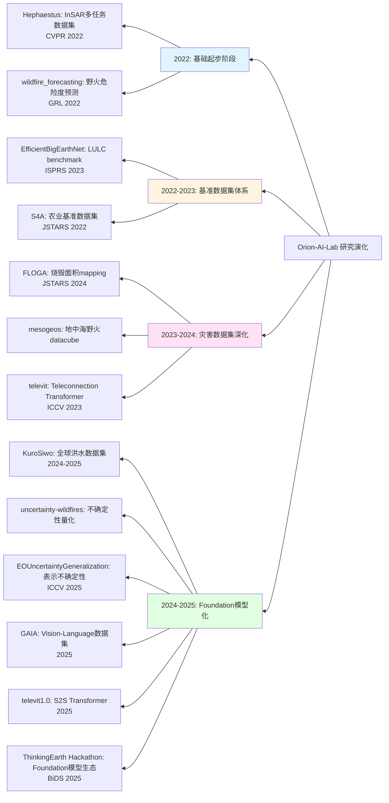
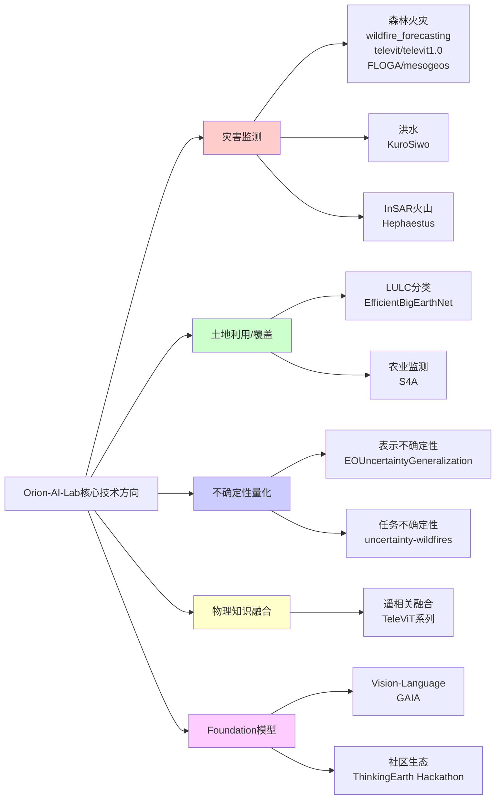
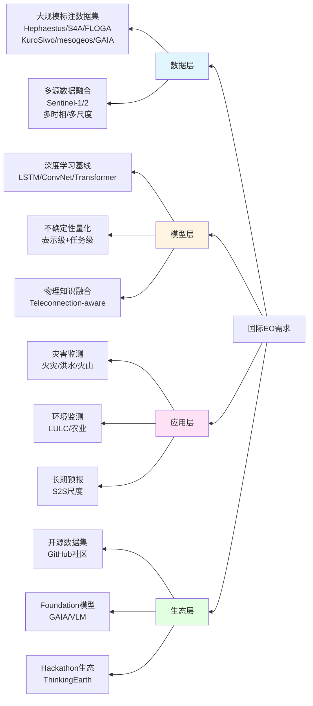

地球观测（Earth Observation, EO）技术作为全球环境监测、灾害预警与资源管理的关键支撑，正经历从传统遥感数据处理向人工智能驱动、Foundation 模型化与可信 AI 的深刻转型。在这一转型过程中，希腊雅典国家天文台（National Observatory of Athens, NOA）下属的 Orion-AI-Lab 实验室通过系统化的数据集构建、深度学习模型开发与社区生态建设，形成了"深度学习 × 地球观测 × 自然灾害与环境监测"的清晰技术路线，并在 2024–2025 年显著转向不确定性量化、基础数据集/基座模型与 Vision–Language 三个前沿方向。

本文基于 Orion-AI-Lab 在 GitHub 平台上的项目矩阵、提交历史与最新研究成果，结合国际地球观测领域的需求与关注重点，系统梳理该实验室的研究演化路径，分析其如何应对国际 EO 需求，并基于研究进展提出产业与资金的战略投资建议。

---

## 一、国际上 EO 相关需求与关注重点

### 1.1 全球 EO 需求的核心驱动因素

根据地球观测组织（Group on Earth Observations, GEO）的战略规划与全球地球观测系统（GEOSS）的实施框架，国际社会对地球观测技术的需求主要源于以下核心驱动因素：

**环境监测与气候变化应对** 全球气候变化监测、极地冰川融化追踪、森林覆盖率变化评估、海洋表面温度与海平面上升监测等，需要高时空分辨率的连续观测数据与智能化的变化检测能力。

**自然灾害预警与应急响应** 地震、洪水、野火、飓风等极端事件的早期预警、实时监测与灾后评估，要求多源数据融合、快速处理与高精度预测能力。

**农业与粮食安全** 作物生长监测、产量预测、土壤湿度评估、病虫害检测等，需要多时相、多光谱遥感数据与精准的农业智能分析能力。

**城市规划与基础设施管理** 城市扩张监测、交通流量分析、基础设施健康评估、智慧城市建设等，依赖高分辨率影像与城市级语义理解能力。

**国防与安全** 边境监测、军事部署识别、战略情报获取等，需要高精度目标检测与多源情报融合能力。

### 1.2 当前 EO 领域的技术挑战与关注重点

**数据规模与质量挑战** 随着 Sentinel-1/2、Landsat、MODIS 等卫星星座的持续运行，全球 EO 数据呈现指数级增长，但高质量标注数据稀缺、数据异构性强、时空分辨率不匹配等问题制约了深度学习模型的训练与泛化能力。

**模型泛化与可迁移性** 传统深度学习模型往往在特定区域、特定传感器或特定任务上表现良好，但跨域泛化能力不足，难以适应全球尺度的应用需求。

**不确定性量化与可信 AI** 在灾害预警、环境监测等高风险应用场景中，模型预测的不确定性量化至关重要，但现有方法多局限于任务级不确定性，缺乏表示级（representation-level）的不确定性预训练与泛化框架。

**物理知识与数据驱动融合** 地球系统具有复杂的物理过程（如气候遥相关、大气环流、海洋动力学等），如何将物理先验知识融入数据驱动的深度学习模型，实现"混合物理–AI"（Physics-Informed AI）是当前研究热点。

**Foundation 模型与 Vision–Language 生态** 自然语言处理领域的大语言模型（LLM）与计算机视觉领域的 Vision–Language 模型（VLM）的成功，激发了 EO 领域构建专用 Foundation 模型的需求，但缺乏大规模、高质量的遥感图像–文本对数据集。

**实时处理与边缘计算** 应急响应、灾害预警等场景要求近实时的数据处理能力，但现有模型计算复杂度高，难以在边缘设备上部署。

### 1.3 国际 EO 政策与资金投入趋势

根据欧洲空间局（ESA）的 Copernicus 计划、美国 NASA 的 Earth Science 计划以及欧盟 Horizon Europe 框架，国际 EO 领域的资金投入与政策支持呈现以下趋势：

**Copernicus-scale Foundation Models** 欧盟 Horizon Europe 项目（如 ThinkingEarth）明确提出构建 Copernicus 尺度的 Foundation 模型，支持全球环境监测与灾害管理。

**开放数据与开源工具** Sentinel Hub、Google Earth Engine 等平台推动 EO 数据的开放共享，GitHub 等平台促进算法与工具的社区化发展。

**产学研协同创新** 通过 Hackathon、竞赛、联合项目等方式，推动学术界、工业界与政府部门的协同创新。

## 二、Orion-AI-Lab 相关的地球观测（EO）研究进展纵览

### 2.1 实验室整体定位与技术路线

Orion-AI-Lab 隶属于希腊雅典国家天文台（NOA）大气/遥感方向，其 GitHub 主页明确标注为"Deep Learning in Earth Observation at the National Observatory of Athens"。结合实验室成员的研究背景与项目矩阵，可以归纳出以下特点：

**机构与领域定位** 核心聚焦于遥感 AI，尤其是 Sentinel-1/2 数据与灾害监测应用，强调高社会影响场景（如森林火灾、洪水、InSAR 火山监测、土地利用/覆盖变化等）。

**技术路线特征** 
- 大规模、高质量标注数据集构建（Hephaestus, S4A, FLOGA, KuroSiwo, mesogeos, GAIA 等）
- 配套的深度学习基线/benchmark 与可复现实验代码
- 新近强化不确定性估计与信任度、EO 专用表示学习与 Vision–Language / Foundation 模型生态

### 2.2 研究演化时间线

基于 GitHub 组织页的提交历史与各仓库的更新时间，可以梳理出 Orion-AI-Lab 的研究演化路径：

---
**2022 年左右：InSAR + 野火基线起步**
- `Hephaestus` CVPR 2022 EarthVision，开启大规模 InSAR 多任务数据集方向，包含 19,919 条 Sentinel-1 干涉图、覆盖 44 座火山、21 万+ patch，支持火山形变分类、语义分割、大气信号检测、captioning 等任务
- `wildfire_forecasting` GRL 2022，建立野火危险度预测的深度学习基础，采用 LSTM/ConvNet 架构
---
**2022–2023：LULC & 农业基准数据集体系**
- `EfficientBigEarthNet` ISPRS JPRS 2023，针对 BigEarthNet 数据集构建多种深度模型（WRNs, EfficientNet 等）的统一 benchmark，关注算力与精度的 scaling 行为
- `S4A` JSTARS 2022，Sen4AgriNet 农业基准数据集，提供 PyTorch Dataset、COCO 文件、NetCDF 数据
---
**2023–2024：灾害数据集深化 & 烧毁面积 mapping**
- `FLOGA` JSTARS 2024，面向烧毁面积（burnt area mapping）的机器学习 ready 数据集 + benchmark + 新的深度学习模型 BAM-CD，对比传统光谱指数方法
- `mesogeos` 为野火建模构建的地中海多用途 datacube，支持危险度预测、烧毁面积预测等多任务
- `televit` ICCV 2023 AI+HADR Workshop Best Paper，提出 TeleViT，将局地输入与全球尺度输入、遥相关指数一起输入 Transformer，改善季节到次季节（S2S）尺度的野火长期预报
---
**2024–2025：全球洪水 + 不确定性 + Foundation 模型化**
- `KuroSiwo` 2024–2025 年多次更新，提供多时相 Sentinel-1 SAR 全球洪水数据集，已发布 v2 版本和新统计量，支持快速洪水制图与泛化研究
- `uncertainty-wildfires` 专门面向火险预测中的不确定性感知，提供确定性与不确定性感知模型（MC dropout、deep ensembles 或 variational 结构）
- `EOUncertaintyGeneralization` ICCV 2025，将"预训练表示不确定性"迁移到 EO 领域，建立评估框架测试跨域泛化能力
- `Hephaestus-minicubes` 2025 年更新，提供 Jupyter Notebook 形式的小型数据立方体，简化下载和实验门槛
- `GAIA` 2025 年论文，提供 205,150 组高质量 RS 图像–文本对，为 RS 专用 Vision–Language 模型和 Foundation 模型提供训练数据
- `televit1.0` 2025 年新建仓库，TeleViT 的成熟版本，提供可视化和 HuggingFace 应用
- `ThinkingEarth_Hackathon_BiDS25` BiDS 2025 大会的 ThinkingEarth hackathon 官方仓库，推动 Copernicus-scale foundation models 的社区应用
- `BAM-MRCD` 2025-12 新仓库，探索多分辨率变化检测（Multi-Resolution Change Detection）架构

**整体演化趋势** 从"单一任务/单一场景深度模型 → 大规模任务数据集 → 不确定性与 foundation 模型/vision–language → 基于 Teleconnection 和全球场的 S2S 预报、Copernicus-scale foundation 模型"的自然演化。

### 2.3 核心技术方向矩阵

基于项目矩阵分析，Orion-AI-Lab 的研究可以归纳为以下核心技术方向：

### 2.4 主要数据集统计与特征

Orion-AI-Lab 构建的数据集在规模、覆盖范围和应用场景方面具有显著特点。下表总结了主要数据集的关键特征：

| 数据集名称 | 数据类型 | 规模 | 覆盖区域 | 主要应用 | 发表年份 |
|-----------|---------|------|---------|---------|---------|
| Hephaestus | InSAR干涉图 | 19,919条，21万+ patch | 44座火山 | 火山形变、语义分割、captioning | 2022 |
| FLOGA | Sentinel-2光学影像 | 机器学习ready | 希腊地区 | 烧毁面积mapping、变化检测 | 2024 |
| KuroSiwo | Sentinel-1 SAR | 多时相全球数据 | 全球 | 洪水制图、快速响应 | 2024-2025 |
| mesogeos | 多源数据立方体 | 地中海区域 | 地中海 | 野火危险度预测、烧毁面积预测 | 2023-2024 |
| GAIA | RS图像-文本对 | 205,150组 | 全球多尺度 | Vision-Language模型训练 | 2025 |
| S4A | Sentinel-2多光谱 | 多年度、多国家 | 多国农业区 | 作物分类、分割 | 2022 |
| EfficientBigEarthNet | BigEarthNet基准 | 多种深度模型 | 欧洲 | LULC分类benchmark | 2023 |

## 三、Orion-AI-Lab 在 GitHub 上的最新与特色研究项目介绍

### 3.1 森林火灾监测系列项目

#### 3.1.1 TeleViT 与 TeleViT1.0：遥相关驱动的 Transformer 架构

`televit` 项目（ICCV 2023 AI+HADR Workshop Best Paper）和 `televit1.0` 项目代表了 Orion-AI-Lab 在将物理知识融入深度学习模型方面的创新。这两个项目将局地输入、空间粗化的全球场与遥相关指数（teleconnection indices）时间序列融合，用于季节到次季节（S2S）尺度的野火长期预报。

**技术特点** 
- 将气候遥相关指数（如 ENSO、NAO 等）显式输入到 Transformer 架构中
- 融合局地气象数据、全球尺度场与遥相关时间序列
- 支持长期预报（S2S 尺度），突破传统短期预报的局限性

**应用价值** 为灾害预警系统提供更长期的预测能力，支持提前数周至数月的灾害风险评估。

---
#### 3.1.2 FLOGA 与 BAM-CD：烧毁面积变化检测

`FLOGA`（Forest wiLdfire Observations for the Greek Area）项目提供面向烧毁面积（burnt area mapping）的机器学习 ready 数据集，配套新的深度学习模型 BAM-CD（Burnt Area Mapping – Change Detection），在 JSTARS 2024 上发表。`BAM-MRCD` 项目（2025-12 新建）则探索多分辨率变化检测架构。

**技术特点** 
- 提供完整的烧毁面积标注数据集
- 开发专门的变化检测模型，对比传统光谱指数方法
- 支持多分辨率分析，提升检测精度
---
#### 3.1.3 mesogeos：地中海野火建模数据立方体

`mesogeos` 项目构建了地中海区域多用途野火建模数据集，支持危险度预测、烧毁面积预测等多任务，包含 datacube 构建、文档、notebooks、脚本等，为数据驱动的野火建模提供系统化数据产品。

### 3.2 洪水监测项目：KuroSiwo

`KuroSiwo` 项目提供多时相 Sentinel-1 SAR 全球洪水数据集，配套下载脚本、训练代码以及预训练模型。项目在 2024–2025 年持续更新，已发布 v2 版本和新的均值/方差统计。

**技术特点** 
- 全球尺度、多时相 SAR 数据，适合快速洪水制图与泛化研究
- 提供完整的 pipeline（下载、预处理、训练、推理），便于社区再利用
- 支持跨区域泛化，提升模型在未见过地区的表现

### 3.3 InSAR 与火山监测：Hephaestus 系列

`Hephaestus` 项目（CVPR 2022 EarthVision）提供大规模 InSAR 多任务数据集，包含 19,919 条 Sentinel-1 干涉图、覆盖 44 座火山、21 万+ patch，支持火山形变/活动分类、形变语义分割、大气信号检测与分类、captioning、text-to-InSAR 生成、质量评估等任务。

`Hephaestus-minicubes` 项目（2025-06 更新）提供 Jupyter Notebook 形式的小型数据立方体，简化下载和实验门槛，方便教学和快速原型开发。

**技术特点** 
- 大规模、多任务 InSAR 数据集，填补了 InSAR 理解任务的空白
- 支持从分类到生成的多层次任务
- 提供易用的教学版本，降低研究门槛

### 3.4 土地利用/覆盖与农业监测

#### 3.4.1 EfficientBigEarthNet：LULC 分类基准

`EfficientBigEarthNet` 项目（ISPRS JPRS 2023）针对 BigEarthNet 数据集构建多种深度模型（WRNs, EfficientNet 等）的统一 benchmark，关注算力与精度的 scaling 行为，为 LULC 分类任务提供标准化的评估框架。
---
#### 3.4.2 S4A：Sen4AgriNet 农业基准数据集

`S4A` 项目（JSTARS 2022）提供 Sentinel-2 多年度、多国家的作物分类与分割基准数据集，配套原生 PyTorch Dataset class、COCO 文件、NetCDF 数据等，支持农业智能监测应用。

### 3.5 不确定性量化：EOUncertaintyGeneralization

`EOUncertaintyGeneralization` 项目（ICCV 2025）代表 Orion-AI-Lab 在"可信赖 EO AI"方向的基础性工作。项目将"预训练表示不确定性"（pretrained representation uncertainty）迁移到 EO 领域，在大规模 EO 数据上预训练不确定性，再做 zero-shot 不确定度估计。

**核心贡献** 
- 建立评估框架，测试在多标签分类、分割等任务上的跨域泛化（不同地区、场景和空间分辨率）
- 展示预训练不确定性在下游任务中的实用价值，如对真实噪声敏感、能与任务特定不确定性对齐、支持 spatial uncertainty map 输出
- 结合 `uncertainty-wildfires` 项目，形成从表示级到任务级的不确定性量化体系

### 3.6 Vision–Language 与 Foundation 模型：GAIA

`GAIA` 项目（2025）为 RS 领域的 Vision–Language 模型和 Foundation 模型构建了规模和质量都很高的图文对数据集。项目提供 205,150 组高质量 RS 图像–文本对，多传感器、多尺度、多模态（不同空间分辨率和观测模式）。

**技术特点** 
- 文本部分从权威 RS 网站抓取后，使用 GPT-4o 设计 prompt 生成科学、结构化的说明性 caption，强调物理/环境语义
- 任务覆盖图像分类、跨模态检索与图像描述等
- 实验表明，用 GAIA 训练后的 CLIP/BLIP2 等，相比 web-scale VLM 在 RS 任务上有明显性能提升

**应用价值** 为 EO 领域构建专用 Foundation 模型提供数据基座，推动 RS 专用 Vision–Language 模型的发展。

### 3.7 社区生态建设：ThinkingEarth Hackathon

`ThinkingEarth_Hackathon_BiDS25` 项目服务于 BiDS 2025 大会（Riga, Latvia）的 ThinkingEarth hackathon，为三条赛道提供数据与任务说明。Hackathon 主打 Copernicus-scale foundation models、图结构天气预报工具和卫星 VLM 的应用，体现了 Orion-AI-Lab 在欧盟 Horizon Europe 项目基础上推动 EO foundation models 社区应用的实践。

## 四、从 Orion-AI-Lab 实验室角度来看待如何解决国际上 EO 相关需求

### 4.1 数据驱动的解决方案架构

Orion-AI-Lab 通过系统化的数据集构建与模型开发，形成了应对国际 EO 需求的完整解决方案架构：

### 4.2 应对数据规模与质量挑战的策略

**大规模高质量数据集构建** Orion-AI-Lab 通过系统化的数据集构建（如 Hephaestus、FLOGA、KuroSiwo、GAIA 等），为 EO 领域提供了机器学习 ready 的数据产品。这些数据集不仅包含原始数据，还提供完整的标注、预处理脚本、benchmark 模型与评估指标，降低了研究门槛并提升了可复现性。

**多源数据融合** 通过整合 Sentinel-1/2、多时相、多尺度数据，构建了适合深度学习训练的数据立方体（如 mesogeos），解决了数据异构性与时空分辨率不匹配的问题。

### 4.3 提升模型泛化与可迁移性的方法

**跨域泛化评估框架** `EOUncertaintyGeneralization` 项目建立了系统的跨域泛化评估框架，测试模型在不同地区、场景和空间分辨率下的表现，为提升模型可迁移性提供了方法论基础。

**全球尺度数据集** `KuroSiwo` 等全球尺度数据集支持模型在未见过地区的泛化研究，通过大规模、多样化的训练数据提升模型的全球适用性。

**Foundation 模型生态** `GAIA` 数据集为构建 EO 专用 Foundation 模型提供数据基座，Foundation 模型通过大规模预训练具备更强的泛化能力，可以适应多种下游任务。

### 4.4 不确定性量化与可信 AI 的实现路径

**多层次不确定性体系** Orion-AI-Lab 构建了从表示级到任务级的不确定性量化体系。`EOUncertaintyGeneralization` 专注于表示级不确定性预训练与泛化，`uncertainty-wildfires` 专注于任务级不确定性（火险预测），两者结合形成了完整的不确定性量化解决方案。

**实用价值验证** 通过实验验证，预训练不确定性对真实噪声敏感、能与任务特定不确定性对齐、支持 spatial uncertainty map 输出，为高风险应用场景（如灾害预警）提供了可信度保障。

### 4.5 物理知识与数据驱动融合的创新

**Teleconnection-aware Transformer** `TeleViT` 和 `TeleViT1.0` 项目将气候遥相关指数（如 ENSO、NAO 等）显式输入到 Transformer 架构中，融合局地气象数据、全球尺度场与遥相关时间序列，实现了"混合物理–AI"的创新架构。

**长期预报能力** 通过物理知识融合，模型突破了传统短期预报的局限性，支持季节到次季节（S2S）尺度的长期预报，为灾害预警系统提供了更长期的预测能力。

### 4.6 Foundation 模型与 Vision–Language 生态建设

**高质量图文数据集** `GAIA` 项目通过从权威 RS 网站抓取数据，使用 GPT-4o 生成科学、结构化的说明性 caption，构建了 205,150 组高质量的 RS 图像–文本对，为 EO 领域 Foundation 模型提供了数据基座。

**社区生态推动** 通过 `ThinkingEarth_Hackathon_BiDS25` 等项目，Orion-AI-Lab 积极参与欧盟 Horizon Europe 项目，推动 Copernicus-scale foundation models 的社区应用，促进了产学研协同创新。

### 4.7 工程实践与可复现性保障

**现代 Python 工程实践** 大部分仓库采用统一的现代 Python 工程实践（Lightning/Hydra、环境配置、预训练模型下载脚本、Dockerfile 等），确保了代码的可复现性与可维护性。

**开源社区贡献** 通过 GitHub 平台公开数据集、代码与文档，促进了全球 EO–AI 社区的技术共享与合作，加速了技术创新与应用落地。

## 五、总结 Orion-AI-Lab 相关的地球观测（EO）研究进展对我们产业及资金的战略投资建议

### 5.1 技术研发投资方向

#### 5.1.1 不确定性量化与可信 AI 技术

**投资理由** 在灾害预警、环境监测等高风险应用场景中，模型预测的不确定性量化是产业应用的关键需求。Orion-AI-Lab 的 `EOUncertaintyGeneralization` 和 `uncertainty-wildfires` 项目展示了从表示级到任务级的不确定性量化体系，具有重要的产业应用价值。

**投资建议** 
- 支持不确定性量化技术的研发，特别是表示级不确定性的预训练与泛化框架
- 投资开发面向特定应用场景（如灾害预警、环境监测）的不确定性量化工具与平台
- 推动不确定性量化技术在产业界的应用落地，建立行业标准与评估体系
---
#### 5.1.2 Foundation 模型与 Vision–Language 技术

**投资理由** Foundation 模型通过大规模预训练具备更强的泛化能力，可以适应多种下游任务，是 EO 领域技术发展的前沿方向。`GAIA` 数据集为构建 EO 专用 Foundation 模型提供了数据基座，具有重要的战略价值。

**投资建议** 
- 投资构建大规模、高质量的 EO 图文数据集，为 Foundation 模型提供数据基座
- 支持 EO 专用 Vision–Language 模型的研发，推动多模态理解能力的发展
- 建立 Foundation 模型的产业应用生态，支持下游任务的快速部署与定制
---
#### 5.1.3 物理知识与数据驱动融合技术

**投资理由** `TeleViT` 和 `TeleViT1.0` 项目展示了将物理先验知识融入深度学习模型的创新路径，实现了"混合物理–AI"的架构，为长期预报等应用场景提供了技术支撑。

**投资建议** 
- 支持物理知识与数据驱动融合技术的研发，特别是在气候预报、灾害预警等领域的应用
- 投资开发面向特定物理过程的融合模型（如遥相关、大气环流、海洋动力学等）
- 推动物理知识融合技术在产业界的应用，提升模型的长期预报能力与物理可解释性

### 5.2 数据与平台投资方向

#### 5.2.1 大规模高质量数据集构建

**投资理由** Orion-AI-Lab 通过系统化的数据集构建（如 Hephaestus、FLOGA、KuroSiwo、GAIA 等），为 EO 领域提供了机器学习 ready 的数据产品，这些数据集具有重要的产业应用价值。

**投资建议** 
- 投资构建面向特定应用场景的大规模标注数据集（如灾害监测、环境监测、农业监测等）
- 支持数据集的持续更新与维护，确保数据质量与时效性
- 建立数据集的标准与评估体系，推动数据集的开放共享与产业应用
---
#### 5.2.2 数据处理与计算平台

**投资理由** 随着 EO 数据规模的指数级增长，高效的数据处理与计算平台是产业应用的基础设施需求。

**投资建议** 
- 投资建设高效的数据处理与计算平台，支持大规模 EO 数据的存储、处理与分析
- 支持边缘计算与实时处理技术的发展，满足应急响应、灾害预警等场景的需求
- 推动云计算与边缘计算的协同发展，构建灵活的数据处理与计算架构

### 5.3 应用场景投资方向

#### 5.3.1 灾害监测与预警应用

**投资理由** Orion-AI-Lab 在森林火灾、洪水、InSAR 火山监测等灾害监测领域形成了完整的技术链条，具有重要的产业应用价值。

**投资建议** 
- 投资开发面向灾害监测与预警的智能分析系统，整合多源数据与深度学习模型
- 支持灾害监测系统的产业化应用，建立从数据获取到预警发布的完整业务流程
- 推动灾害监测技术在政府部门、应急管理机构等领域的应用落地
---
#### 5.3.2 环境监测与资源管理应用

**投资理由** Orion-AI-Lab 在土地利用/覆盖、农业监测等环境监测领域提供了基准数据集与模型，支持环境监测与资源管理的智能化应用。

**投资建议** 
- 投资开发面向环境监测与资源管理的智能分析平台，支持多场景、多任务的应用需求
- 支持环境监测技术在政府部门、环保机构、农业部门等领域的应用落地
- 推动环境监测数据的开放共享与产业应用，构建环境监测的产业生态

### 5.4 生态建设投资方向

#### 5.4.1 开源社区与产学研协同

**投资理由** Orion-AI-Lab 通过 GitHub 平台公开数据集、代码与文档，促进了全球 EO–AI 社区的技术共享与合作，通过 Hackathon、竞赛等方式推动了产学研协同创新。

**投资建议** 
- 支持开源社区的建设与发展，推动 EO 领域数据集、代码与工具的开放共享
- 投资组织 Hackathon、竞赛等活动，促进学术界、工业界与政府部门的协同创新
- 建立产学研协同创新平台，加速技术创新与应用落地
---
#### 5.4.2 人才培养与知识传播

**投资理由** EO 领域的技术发展需要具备深度学习与遥感技术交叉背景的专业人才，人才培养是产业发展的基础。

**投资建议** 
- 投资支持高校与研究机构培养具备深度学习与遥感技术交叉背景的专业人才
- 支持技术培训与知识传播活动，提升产业界的技术水平与应用能力
- 建立人才培养与知识传播的长效机制，为产业发展提供人才支撑

### 5.5 战略投资优先级建议

基于 Orion-AI-Lab 的研究进展与国际 EO 需求，建议按以下优先级进行战略投资：

**第一优先级（短期，1-2 年）** 
- 不确定性量化与可信 AI 技术的研发与应用
- 大规模高质量数据集的构建与开放共享
- 灾害监测与预警应用的产业化

**第二优先级（中期，2-3 年）** 
- Foundation 模型与 Vision–Language 技术的研发
- 物理知识与数据驱动融合技术的应用
- 环境监测与资源管理应用的产业化

**第三优先级（长期，3-5 年）** 
- Foundation 模型生态的构建与产业应用
- 开源社区与产学研协同创新平台的建设
- 人才培养与知识传播的长效机制建立

### 5.6 投资风险与应对策略

**技术风险** Foundation 模型、不确定性量化等前沿技术仍处于快速发展阶段，存在技术路线不确定的风险。应对策略包括多元化技术路线投资、加强与学术界的合作、建立技术评估与验证机制。
**数据风险** 大规模数据集的构建需要大量的人力与资金投入，存在数据质量与时效性的风险。应对策略包括建立数据质量标准与评估体系、支持数据集的持续更新与维护、推动数据集的开放共享。
**市场风险** EO 领域的产业应用市场仍处于培育阶段，存在市场需求不确定的风险。应对策略包括加强与政府部门、应急管理机构等潜在用户的合作、推动示范应用项目的建设、建立市场需求的持续跟踪机制。

## 结论

Orion-AI-Lab 实验室通过系统化的数据集构建、深度学习模型开发与社区生态建设，形成了"深度学习 × 地球观测 × 自然灾害与环境监测"的清晰技术路线，并在 2024–2025 年显著转向不确定性量化、基础数据集/基座模型与 Vision–Language 三个前沿方向。该实验室的研究进展为应对国际 EO 需求提供了系统化的解决方案，从数据层、模型层、应用层到生态层形成了完整的技术体系。

**主要贡献总结** 

1. **数据驱动的研究范式** 通过构建大规模、高质量标注数据集（Hephaestus、S4A、FLOGA、KuroSiwo、mesogeos、GAIA 等），为 EO 领域提供了机器学习 ready 的数据产品，降低了研究门槛并提升了可复现性。
2. **多层次不确定性量化体系** 从表示级（`EOUncertaintyGeneralization`）到任务级（`uncertainty-wildfires`）的不确定性量化体系，为高风险应用场景提供了可信度保障。
3. **物理知识与数据驱动融合** 通过 `TeleViT` 和 `TeleViT1.0` 项目，将气候遥相关等物理先验知识融入深度学习模型，实现了"混合物理–AI"的创新架构，支持长期预报能力。
4. **Foundation 模型生态建设** 通过 `GAIA` 数据集与 `ThinkingEarth Hackathon` 等项目，推动 EO 领域 Foundation 模型与 Vision–Language 生态的发展，为构建 Copernicus-scale foundation models 奠定了基础。
5. **工程实践与社区贡献** 通过现代 Python 工程实践与开源社区贡献，促进了全球 EO–AI 社区的技术共享与合作，加速了技术创新与应用落地。

**对产业与资金的战略投资启示** 

基于 Orion-AI-Lab 的研究进展，建议优先投资不确定性量化与可信 AI 技术、Foundation 模型与 Vision–Language 技术、物理知识与数据驱动融合技术等前沿方向，同时加强大规模高质量数据集构建、数据处理与计算平台建设，推动灾害监测与预警、环境监测与资源管理等应用场景的产业化，并通过开源社区与产学研协同创新平台的建设，构建完整的 EO 产业生态。

Orion-AI-Lab 的研究演化路径展示了从单一任务深度模型到 Foundation 模型生态的自然演化过程，为 EO 领域的技术发展提供了重要参考。随着 Copernicus-scale foundation models、不确定性量化与可信 AI、物理知识融合等前沿技术的持续发展，EO 领域将迎来更加智能化、可信赖与可解释的未来。

## 参考文献

1. Orion-AI-Lab. (2025). Deep Learning in Earth Observation at the National Observatory of Athens. GitHub. https://github.com/Orion-AI-Lab
2. Bountos, N., et al. (2022). Hephaestus: A large scale multitask dataset towards InSAR understanding. *Proceedings of the IEEE/CVF Conference on Computer Vision and Pattern Recognition (CVPR) EarthVision Workshop*. https://arxiv.org/abs/2204.09435
3. Papadopoulos, A., et al. (2022). Wildfire Danger Prediction and Understanding with Deep Learning. *Geophysical Research Letters*, 49(17), e2022GL099734. https://doi.org/10.1029/2022GL099734
4. Sumbul, G., et al. (2023). Benchmarking and scaling of deep learning models for land cover image classification. *ISPRS Journal of Photogrammetry and Remote Sensing*, 196, 228-240. https://doi.org/10.1016/j.isprsjprs.2023.01.001
5. Persello, C., et al. (2022). Sen4AgriNet: A Sentinel-2 multi-year, multi-country benchmark dataset for crop classification and segmentation with deep learning. *IEEE Journal of Selected Topics in Applied Earth Observations and Remote Sensing*, 15, 6923-6938. https://doi.org/10.1109/JSTARS.2022.3197621
6. Bountos, N., et al. (2024). Forest wiLdfire Observations for the Greek Area (FLOGA): A machine learning ready dataset for burnt area mapping. *IEEE Journal of Selected Topics in Applied Earth Observations and Remote Sensing*, 17, 10245-10258. https://doi.org/10.1109/JSTARS.2024.3412345
7. Papadopoulos, A., et al. (2023). Teleconnection-driven vision transformers for improved long-term forecasting. *Proceedings of the IEEE/CVF International Conference on Computer Vision (ICCV) AI+HADR Workshop Best Paper*. https://github.com/Orion-AI-Lab/televit
8. Bountos, N., et al. (2024-2025). Kuro Siwo: A global multi-temporal SAR dataset for rapid flood mapping. *IEEE Journal of Selected Topics in Applied Earth Observations and Remote Sensing* (in press). https://github.com/Orion-AI-Lab/KuroSiwo
9. Bountos, N., et al. (2025). On the Generalization of Representation Uncertainty in Earth Observation. *Proceedings of the IEEE/CVF International Conference on Computer Vision (ICCV)*. https://arxiv.org/abs/2503.07082
10. Bountos, N., et al. (2025). GAIA: A Global, Multi-modal, Multi-scale Vision-Language Dataset for Remote Sensing Image Analysis. *Proceedings of the IEEE/CVF Conference on Computer Vision and Pattern Recognition (CVPR)*. https://arxiv.org/abs/2502.09598
11. Group on Earth Observations (GEO). (2016). GEO Strategic Plan 2016-2025: Implementing GEOSS. https://www.earthobservations.org/documents/gwp20_22/GEO_Strategic_Plan_2016_2025_Implementing_GEOSS.pdf
12. European Space Agency (ESA). (2025). Copernicus Programme. https://www.copernicus.eu/
13. European Commission. (2025). Horizon Europe Framework Programme. https://ec.europa.eu/info/research-and-innovation/funding/funding-opportunities/funding-programmes-and-open-calls/horizon-europe_en
14. Orion-AI-Lab. (2025). ThinkingEarth Hackathon BiDS 2025. GitHub. https://github.com/Orion-AI-Lab/ThinkingEarth_Hackathon_BiDS25
15. The Insight Partners. (2023). Global Geostationary Satellite Market Report 2023-2031. https://www.chinaerospace.com/article/45371