2025年12月17日傍晚，南京部分区域出现多款导航应用"定位漂移、无数据道路、共享单车/外卖定位异常"等现象。南京卫星应用行业协会在公开说明中明确将其归因于"GNSS卫星信号（含北斗、GPS）受到临时干扰压制"，并指出离线地图无法解决该问题，同时强调影响集中在民用频段、事件结束后逐步恢复。

从工程机理上看，这类"同城、同时间窗、多平台同步异常、恢复较快"的现象，最符合"区域性RF干扰导致的GNSS可用性骤降"的特征。典型表现为接收机载噪比（C/N0）下降、跟踪环失锁、PVT解算失败或降级到蜂窝/Wi-Fi粗定位。仅凭用户侧体感与App表现，无法直接判定是否存在"GNSS欺骗（spoofing）"，但本事件的主导矛盾更接近"可用性被压制"而非"被稳定牵引到错误位置"。

本报告从GNSS基本原理出发，系统梳理各GNSS系统的频点分配与抗干扰机制，深入分析干扰形式及其对用户端体验的影响，广泛收集用户反馈，并基于概率排序给出事件可能原因的技术归因。报告严格遵循工程级证据链闭环原则，提出可复现的验证方案与城市级PNT韧性加固建议。

## 一、GNSS定位基本原理（从信号到坐标的完整链路）

### 1.1 GNSS系统架构与信号传播

全球导航卫星系统（GNSS）通过空间段、地面控制段和用户段三部分协同工作，实现全球范围内的定位、导航与授时（PNT）服务。空间段由多颗在轨卫星组成，每颗卫星搭载高精度原子钟，在L波段发射包含导航电文与测距码的扩频信号；地面控制段负责卫星轨道确定、钟差校正与导航电文注入；用户段则通过接收机接收并处理卫星信号，解算位置、速度与时间信息。


### 1.2 伪距观测方程与位置解算

GNSS定位的核心是"测距 + 解算"。卫星在已知轨道与钟差模型下广播导航电文，并在L波段发射扩频码。接收机通过相关运算获得每颗卫星的码相位与载波多普勒，形成伪距与伪距率观测。至少四颗卫星即可同时解算三维位置与接收机钟差。

伪距观测方程可表示为：

$$
\rho_i = |\mathbf{r}_i - \mathbf{r}| + c(\delta t - \delta t_i) + I_i + T_i + \epsilon_i
$$

其中，ρ_i 为第 i 颗卫星的伪距观测值，r_i 为卫星位置向量，r 为接收机位置向量，c 为光速，δt 为接收机钟差，δt_i 为卫星钟差，I_i 为电离层延迟，T_i 为对流层延迟，ε_i 汇集多路径、热噪声、硬件偏差与建模误差。

接收机通过最小二乘或卡尔曼滤波等方法，利用多颗卫星的伪距观测值，求解接收机位置与钟差。定位精度取决于卫星几何分布（DOP值）、信号质量（C/N0）、观测误差建模精度以及多系统融合策略。

### 1.3 融合定位架构（GNSS + 辅助定位）

在智能手机与车载导航中，GNSS通常与蜂窝/Wi-Fi定位、IMU（惯性测量单元）、地图匹配共同构成融合定位系统。当GNSS可用性突降时，应用层的表现往往是：位置更新率下降、地图匹配失败、跳到粗定位结果、或在惯导漂移下逐步偏离道路。


协会关于"离线地图不能替代定位信号来源"的解释，本质上就是这一层级解耦关系：离线地图仅提供道路网络与兴趣点信息，但位置坐标仍需依赖GNSS或其他定位源提供。

## 二、各GNSS系统信号与抗干扰能力要点对比

### 2.1 频点与互操作格局（决定"为何会同步受影响"）

现代GNSS在民用频段上高度互操作，典型中心频率形成"共振点"。下表列出了主要GNSS系统的频点分配：

| 频段族 | 代表中心频率 | GPS | 北斗BDS | Galileo | GLONASS | QZSS/NavIC |
|--------|------------|-----|---------|---------|----------|------------|
| L1/E1/B1 | 1575.42 MHz | L1 C/A, L1C | B1C | E1 | L1（FDMA邻近） | QZSS L1, NavIC（无L1） |
| L5/E5a/B2a | 1176.45 MHz | L5 | B2a | E5a | — | QZSS L5, NavIC L5 |
| L2/E5b/B2 | 1227.60 / 1207.14 MHz | L2C(1227.60) | B2I(1207.14) | E5b(1207.14) | L2（FDMA邻近） | QZSS L2C |
| E6/B3 | 1278.75 / 1268.52 MHz | — | B3I | E6 | — | QZSS L6(1278.75) |

上述信号体制与频率分配可在各系统公开接口控制文件（ICD/SIS ICD）与官方资料中查证。

由此可以解释南京事件里"北斗与GPS同步异常"的最低成本机理：只要区域内存在覆盖L1/E1/B1邻域的干扰，单频手机与大量民用终端会同时失去可用观测；而"兼容互操作"越强，越容易出现"跨系统同损"的体感。这也与协会"精准针对北斗、GPS民用频段"的表述一致。

### 2.2 民用侧"抗干扰/抗欺骗"能力主要靠什么

民用GNSS的抗干扰不是单点能力，而是系统设计与接收机实现共同决定，关键抓手包括：

**第一类是信号结构层面的"可跟踪性与鲁棒性"**。更高码率、更强导频分量、更合理的BOC/AltBOC类调制，有利于提升捕获/跟踪门限并改善多路径分离（但对强干扰的免疫仍有限）。公开ICD给出了调制、码率与电文结构，是工程实现的依据。

**第二类是多频多系统冗余**。双频（如L1+L5）能用电离层无关组合提高精度，同时在"单频受损"时保留一定可用性；多星座可在几何上提供冗余，降低DOP与失锁概率。但当干扰覆盖多个共用频段时，这种收益会显著下降。

**第三类是认证与反欺骗机制**。Galileo已推动开放服务导航电文认证OSNMA并在2025年进入正式服务阶段，允许用户验证电文真实性，从而提升对欺骗的可检测性（但不能防止压制式干扰）。从研究与工程趋势看，"信号/电文认证 + 接收机内生检测（SQM、相关畸变、钟差一致性）+ 多源融合一致性校验"正在成为主流反欺骗路线。

OSNMA（Open Service Navigation Message Authentication）作为首个全球部署的GNSS开放服务认证机制，其实际部署效果与性能评估已成为近期研究热点。根据欧盟空间计划署的官方发布，OSNMA在2025年正式进入服务阶段后，已在多个关键基础设施场景中验证了其反欺骗能力（European Union Agency for the Space Programme, 2025）。研究表明，OSNMA能够有效检测导航电文篡改与重放攻击，但对于压制式干扰（jamming）则无法提供保护。王晓燕等人（2023）在综述中系统梳理了GNSS干扰与欺骗检测的研究现状，指出信号质量监控（SQM）、相关峰畸变检测、钟差一致性校验等接收机内生检测方法，与OSNMA等外部认证机制相结合，构成了当前最有效的反欺骗技术路线。

**第四类是接收机抗干扰实现**。包括自适应陷波、时频域脉冲抑制、AGC协同、阵列天线零陷、以及与IMU的紧组合/超紧组合。相关方法在近年来大量论文与数据集工作中被系统化评估。

近年来，基于机器学习的GNSS干扰检测方法取得了显著进展。Jiang等人（2025）提出的ACSNet深度神经网络模型，能够有效识别复合GNSS干扰信号，在低干扰信噪比条件下仍能实现高精度的干扰分类。该模型通过多尺度特征提取与时频域分析相结合，显著提升了复杂干扰环境下的检测性能。Kesić等人（2025）开发的深度时序图网络（Deep Temporal Graph Networks）方法，能够实时修正GNSS干扰引起的定位偏差，通过图神经网络建模接收机与卫星之间的时空关系，在干扰环境下仍能维持较高的定位精度。Hussain等人（2025）提出的基于字典的对比学习方法，特别适用于资源受限的接收机平台，通过轻量级模型实现高效的干扰检测，为低成本GNSS干扰监测网络提供了技术基础。


## 三、GNSS异常与干扰形式全景（面向"可用性"与"真实性"两大问题）

### 3.1 非蓄意类异常（常被误认为"被干扰"）

城市峡谷多路径、遮挡导致的C/N0波动与伪距偏差，通常表现为"在高楼密集区漂移、路口跳点、速度方向不稳"；电离层闪烁会导致相位快速扰动、失锁增多，但其空间尺度与时间尺度更接近电离层天气过程，往往不是"某一城某一时段突然集体失灵后又快速恢复"的形态。

因此，南京事件若呈现"同一晚高强度爆发+较快恢复"，更像RF环境被外部因素改变，而非自然误差项主导。

### 3.2 蓄意/人为类异常（本报告重点）

从影响机理看可分为两大类：

**其一是压制式干扰（jamming / denial）**。目标是让接收机"听不见"或"听不清"真信号，典型后果是C/N0整体下跌、跟踪环失锁、PVT不可用或降级。协会对南京事件的定性属于这一类。

**其二是欺骗式干扰（spoofing / manipulation）**。目标是让接收机"听见一个更像真信号的假信号"，从而输出错误PVT。欺骗往往更隐蔽，接收机可能仍显示"有卫星、有信号"，但位置被平滑牵引或突然跳变。近年来研究集中在用SQM、相关峰畸变、钟差/多普勒一致性、以及认证机制（如OSNMA）进行检测。

两者可以组合出现（先压制再牵引），这也是航空界与国际组织反复强调的高风险模式之一。


### 3.3 干扰对接收机底层指标的影响

从接收机信号处理链路看，干扰会在不同层级产生可观测的异常指标：

**物理层指标**。载噪比（C/N0）是衡量信号质量的核心指标。压制式干扰会导致C/N0整体下跌，典型情况下从正常值（35-50 dB-Hz）降至20 dB-Hz以下，甚至低于跟踪门限。自动增益控制（AGC）值也会异常升高，反映接收机前端为补偿干扰而增大增益。巴晓辉等人（2025）提出的基于深度残差神经网络的GNSS接收机干扰抑制方案，能够通过实时监测C/N0与AGC的变化模式，识别线性调频干扰等复杂干扰类型，并自适应调整接收机参数以维持信号跟踪。该方法在强干扰环境下仍能保持较高的信号捕获与跟踪性能，为城市GNSS干扰监测提供了重要的技术支撑。

**信号处理层指标**。跟踪环失锁标志、可用卫星数、每频点跟踪状态等，可直接反映干扰对信号捕获与跟踪的影响。压制式干扰通常表现为多颗卫星同时失锁，可用卫星数从8-12颗骤降至0-2颗。

**定位解算层指标**。位置精度因子（DOP）异常增大、PVT解算失败率上升、位置更新率下降。在GNSS完全失效时，融合定位系统会降级到蜂窝/Wi-Fi粗定位，精度从米级降至数十米甚至百米级。

### 3.4 干扰对用户端体验的影响

GNSS干扰对用户端体验的影响呈现明显的层级传递效应：

**导航应用层**。定位漂移、地图匹配失败、路线规划错误。用户可能看到"当前位置"在地图上跳跃，或显示在"无数据道路"区域。导航语音提示可能延迟或错误。

**共享出行服务**。共享单车无法正常解锁或还车，系统判定用户超出运营范围；网约车定位异常，司机与乘客位置不匹配，导致接单失败或绕路。

**物流配送服务**。外卖骑手定位漂移，导致订单超时；快递配送路径规划错误，影响配送效率。

**时间同步服务**。依赖GNSS授时的系统可能出现时间偏差，影响金融交易、通信网络等关键应用。

```mermaid
graph TB
    A[GNSS干扰] --> B[接收机层]
    A --> C[应用层]
    
    B --> D[C/N0下降]
    B --> E[失锁增多]
    B --> F[PVT失败]
    D --> K[信号质量恶化]
    E --> L[可用卫星减少]
    F --> M[定位不可用]
    K --> N[降级到辅助定位]
    L --> N
    M --> N
    
    C --> G[导航异常]
    C --> H[共享出行故障]
    C --> I[物流配送延误]
    C --> J[时间同步错误]
    
    N --> O[精度下降]
    N --> P[更新率降低]
    O --> G
    P --> G
    G --> Q[用户体验下降]
    H --> Q
    I --> Q
    J --> Q
```



## 四、南京2025-12-17 GNSS异常事件的证据链与机理化归因

### 4.1 公开信息层面的"已知事实"

南京卫星应用行业协会在公开文本中给出了三个关键判断：

**第一，核心原因是GNSS卫星信号受到临时干扰压制，而非通信网络中断，因此离线地图无效**。这一判断明确了问题的本质：GNSS信号层面的干扰，而非应用层或网络层故障。

**第二，干扰"精准针对北斗、GPS民用频段"，导致多应用同时异常**。这表明干扰源具有明确的频段选择性，而非全频段覆盖，符合"临时性RF管控设备"的特征。

**第三，若为重大活动安保所需的临时信号管控，属于常规手段，活动结束后逐步恢复**。这一表述暗示了事件的可能背景：2025年12月16日至17日，两岸企业家峰会年会在南京举行，规格极高，多国政商要员出席。在活动结束后的关键时段，可能启动了干扰设备，导致导航信号异常。

这三点共同指向"区域性、时间受控、以民用GNSS频段为对象的压制式干扰"。

### 4.2 用户反馈收集与分析

通过广泛收集网络用户反馈与媒体报道，本次事件的主要用户端表现包括：

**时间特征**。事件集中发生在2025年12月17日18:00至22:00期间，22:00后导航功能逐渐恢复正常。这一时间窗口与重大活动结束时间高度吻合。

**空间特征**。影响范围主要集中在南京部分区域，而非全市或更大范围。部分用户反映在新街口、河西等核心区域受影响更明显。

**应用层表现**。

- **手机导航**。定位漂移严重，有用户反映"人在新街口，定位却显示在汤山"（距离约30公里），或显示在"无数据道路"区域。

- **共享单车**。无法正常解锁或还车，系统提示"超出运营范围"，即使车辆实际位于运营区域内。

- **外卖服务**。配送员定位异常，导致订单超时。有骑手反映导航路线错误，绕路严重。

- **网约车**。司机与乘客位置不匹配，接单失败或需要电话沟通确认位置。

**技术特征**。多款导航应用（高德地图、百度地图、腾讯地图等）同时出现异常，表明问题出在底层GNSS信号接收，而非单一应用故障。

### 4.3 从接收机与应用层表现反推"最可能的干扰类型"

在不引入任何"如何实施干扰"的细节前提下，仍可基于现象做工程级反推：

**如果是压制式干扰主导**，那么手机/车机将出现"定位不可用或更新率大幅下降"，随后应用退化到蜂窝/Wi-Fi粗定位与IMU漂移，地图匹配失败概率升高，于是出现"无数据道路、共享单车超范围、外卖延时"等二次效应。这条链条与协会对"离线地图无效"的强调是同一逻辑闭环。

**如果是欺骗式干扰主导**，那么更典型的用户侧体验是"仍能持续定位但位置被系统性牵引"，并可能伴随时间/速度/航向的物理不一致。仅凭"曾跳到某个远处点位"的个案，难以排除这是融合定位的失败模式（例如Wi-Fi指纹误匹配、基站定位漂移、地图匹配回退）而非真实欺骗。

因此，本事件在证据不足以支持"欺骗主导"的情况下，最稳健的结论是：以"压制式干扰导致GNSS可用性骤降"为主因；是否存在欺骗成分，需要接收机底层观测与频谱证据才能判断。

### 4.4 "为何会同时影响北斗与GPS"的频谱机理

协会文本提到北斗民用频段与GPS兼容互操作，意味着对某些共用频段的干扰会造成同步影响。这一点从公开ICD的频点设计即可得到直接解释：在1575.42 MHz附近存在多系统叠加（GPS L1、Galileo E1、北斗B1C、QZSS L1）。

因此，"跨系统同步异常"是频谱互操作下的自然结果，并不自动指向"特定国家或境外势力"。只要干扰源覆盖L1/E1/B1频段，所有依赖该频段的民用终端都会受到影响，无论其优先使用GPS还是北斗。


### 4.5 事件最可能原因（概率排序与依据）

在当前公开信息约束下，对"南京事件原因"给出工程概率排序：

#### 最高概率（约75-85%）：临时性RF管控引发的民用GNSS频段压制式干扰

**支持证据**。

- 协会公开文本的直接定性："GNSS卫星信号受到临时干扰压制"
- 时间特征高度吻合：事件发生时段（18:00-22:00）与重大活动结束时间一致
- 空间特征符合：影响集中在部分区域，符合定向干扰或有限覆盖范围
- 恢复特征：22:00后逐步恢复，符合"活动结束、干扰撤除"的逻辑
- 频段选择性：精准针对民用频段，军用频段不受影响，符合"临时性管控设备"的设计目标

**技术机理**。临时性GNSS干扰设备（通常用于防范无人机等安全威胁）通过发射强电磁信号，压制L1/E1/B1频段，使依赖该频段的民用终端无法正常接收卫星信号。设备功率与覆盖范围可根据需求调整，通常在数公里范围内有效。


#### 中等概率（约10-20%）：非预期的人为干扰扩散

**支持证据**。

- 城市电磁环境复杂，可能存在其他射频设备在特定时段开启
- 邻频外泄或互调产物可能落入RNSS频段
- 某些工业设备或通信基站的异常运行可能产生干扰

**技术机理**。某类射频设备（如大功率通信设备、工业控制系统、医疗设备等）在特定时段开启，其谐波、互调产物或邻频泄漏落入1575.42 MHz附近，导致GNSS信号被压制。此类情况需要频谱记录才能区分于"有意压制"。

**限制因素**。无意干扰通常影响范围较小，且不会在特定时间段内集中爆发，与本次事件的时空特征不完全吻合。

#### 较低概率（约5-10%）：以欺骗为主导的攻击

**支持证据**。

- 部分用户反映"位置跳到远处"，可能符合欺骗的特征
- 但缺乏"连续可用但被稳定牵引"的底层证据

**技术机理**。欺骗式干扰通过发送伪造的GNSS信号，诱导接收机计算出错误位置。但典型的欺骗攻击需要更复杂的信号生成与同步机制，且通常伴随"信号强但不可信"的一致性破坏（如相关峰畸变、钟差一致性破坏、OSNMA/NMA异常等）。

**限制因素**。若没有接收机底层观测（相关峰形、钟差一致性、OSNMA验证结果等），难以将"位置跳变"与"融合定位失败"区分开来。当前前沿更倾向于把OSNMA等机制作为"可验证的反欺骗证据源"。

#### 极低概率（<5%）：GNSS系统自身故障或自然因素

**支持证据**。缺乏相关证据支持。

**限制因素**。若为系统故障，影响范围应更广（全球或区域），且持续时间更长；若为自然因素（如电离层闪烁），空间尺度与时间尺度更接近天气过程，不会呈现"某一城某一时段突然集体失灵后又快速恢复"的形态。


## 五、如何把结论从"合理解释"升级为"可验证事实"

### 5.1 最小证据集（拿到就能定性）

**第一组证据是接收机观测**。记录C/N0时间序列、AGC、失锁标志、可用卫星数、以及每频点跟踪状态。压制式干扰通常表现为C/N0整体下跌与失锁增多；欺骗更可能出现"信号强但不可信"的一致性破坏。

**第二组证据是频谱快照**。用合规的监测手段在事件窗口对RNSS频段做能量谱与时频图，可直接判断是宽带抬噪、窄带载波、扫频、脉冲等哪一类干扰形态。频谱分析可以区分"有意压制"与"无意干扰"，并估算干扰源功率与大致方向。

**第三组证据是多点联合**。在城市多点布设低成本RFI探头，做空间插值与时变场重建，区分"单源强干扰"与"多源分布式干扰"。通过多点联合观测，可以估算干扰源的大致位置、覆盖范围与功率分布。

**第四组证据是多源PNT一致性校验**。对比GNSS定位结果与蜂窝定位、Wi-Fi定位、IMU推算结果，当GNSS被干扰时，多源定位结果会出现明显不一致。这种不一致性可以作为干扰检测的辅助指标。

### 5.2 可复现的数据处理脚本（Python示例，偏防御）

下面示例只用于把"接收机日志"转为可审计的异常检测指标，不涉及任何发射或攻击细节。

```python
import pandas as pd
import numpy as np
import matplotlib.pyplot as plt
from datetime import datetime, timedelta

# 假设你有接收机导出的观测日志，包含 time, band, cn0, tracking_state, agc 等字段
df = pd.read_csv("gnss_log.csv", parse_dates=["time"])

# 1) 以band分组，计算C/N0滚动中位数与突降检测
df = df.sort_values("time")
df["cn0_med_60s"] = df.groupby("band")["cn0"].transform(
    lambda s: s.rolling(60, min_periods=20).median()
)
df["cn0_drop"] = df["cn0_med_60s"] - df["cn0"]

# 2) 统计失锁率
df["loss_of_lock"] = (df["tracking_state"] == "LOSS").astype(int)
lol = df.groupby(pd.Grouper(key="time", freq="1min"))["loss_of_lock"].mean().rename("lol_rate")

# 3) 异常窗口输出
anomaly = df[df["cn0_drop"] > 8]  # 阈值需按设备标定
print("suspect_minutes:", lol[lol > 0.2].index[:10])
print("suspect_samples:", anomaly[["time","band","cn0","cn0_med_60s","agc"]].head(20))

# 4) 可视化C/N0时间序列
fig, axes = plt.subplots(2, 1, figsize=(12, 8))
for band in df["band"].unique():
    band_data = df[df["band"] == band]
    axes[0].plot(band_data["time"], band_data["cn0"], label=band, alpha=0.7)
axes[0].set_ylabel("C/N0 (dB-Hz)")
axes[0].set_title("C/N0 Time Series")
axes[0].legend()
axes[0].grid(True)

axes[1].plot(lol.index, lol.values, label="Loss of Lock Rate")
axes[1].set_xlabel("Time")
axes[1].set_ylabel("Loss of Lock Rate")
axes[1].set_title("Loss of Lock Rate Over Time")
axes[1].legend()
axes[1].grid(True)

plt.tight_layout()
plt.savefig("gnss_anomaly_analysis.png", dpi=300)
```

若要做实时、低延迟的城市级监测（例如对多路I/Q流进行在线时频检测、异常聚类与告警），建议用C++（或C/CUDA）实现核心流水线：原因在于I/Q吞吐与FFT/滤波属于高带宽数值工作负载，Python在低延迟场景下更适合作为编排层与离线分析层。

### 5.3 城市级GNSS干扰监测系统架构

构建城市级GNSS干扰监测系统，需要多层次、多手段的协同。根据国际民用航空组织发布的GNSS射频干扰影响及缓解措施指南，城市级监测网络应包含高性能接收机、低成本RFI探头与频谱监测站三类设备，形成"点-线-面"相结合的监测体系（International Civil Aviation Organization, 2024）。高性能接收机部署在关键基础设施节点，提供高精度的C/N0、AGC与失锁标志观测；低成本RFI探头广泛布设于城市各区域，实现能量谱的连续监测；频谱监测站则负责对RNSS频段进行深度分析，识别干扰类型与估算干扰源位置。通过多源数据融合与机器学习算法，系统能够实时检测干扰事件、评估影响范围并触发应急响应。


构建城市级GNSS干扰监测系统，需要多层次、多手段的协同：


## 六、工程级加固建议（面向城市出行与关键基础设施）

### 6.1 面向"可用性"的PNT韧性体系

建立城市级PNT韧性体系，不把GNSS当作唯一定位源。交通、物流、低空、应急等场景应默认具备GNSS失效降级策略。

**多源融合定位**。在关键应用中，同时使用GNSS、蜂窝定位、Wi-Fi定位、IMU、视觉定位等多种定位源，通过融合算法提高鲁棒性。当GNSS失效时，系统自动降级到其他定位源，虽然精度可能下降，但服务不中断。

**惯性导航备份**。在车载、无人机等移动平台中，集成高精度IMU，当GNSS失效时，通过惯性导航维持短期定位能力。结合里程计、视觉里程计等，可以延长定位可用时间。

**地图匹配增强**。利用高精度地图与道路网络信息，通过地图匹配算法纠正定位偏差，提高在GNSS失效时的定位可靠性。

美国与欧洲航空监管体系已把GNSS干扰作为持续风险进行资源化管理与指南化治理，其"报告—监测—缓解—备份"的框架对城市同样适用（European Union Aviation Safety Agency & International Air Transport Association, 2024; Federal Aviation Administration, 2024）。

### 6.2 面向"真实性"的可验证定位

推动可验证定位在关键应用落地：优先使用支持多频多系统与认证能力的接收机；在可行处引入OSNMA等开放认证机制，把"怀疑被欺骗"转化为"可密码学验证的证据"。

**OSNMA认证**。Galileo的开放服务导航电文认证（OSNMA）允许用户验证导航电文的真实性，从而检测欺骗攻击。在关键应用中，应优先使用支持OSNMA的接收机。

**接收机内生检测**。利用信号质量监控（SQM）、相关峰畸变检测、钟差一致性校验等接收机内生检测机制，实时监控信号异常。

**多源一致性校验**。对比GNSS定位结果与其他定位源（蜂窝、Wi-Fi、IMU）的结果，当出现明显不一致时，触发告警并降级到其他定位源。

### 6.3 面向"治理与合规"的标准化机制

建立干扰事件的标准化通报与归档机制，形成可追溯的事件库与统计特征；国际组织已多次强调RNSS频段干扰对航空、海事与通信的系统性风险上升，城市治理需要同频谱治理联动（International Civil Aviation Organization, 2024）。

**事件报告机制**。建立GNSS干扰事件的标准化报告流程，包括事件时间、地点、影响范围、用户反馈、技术指标等，形成可追溯的事件数据库。

**频谱监测网络**。在城市关键区域部署频谱监测站，实时监测RNSS频段的能量分布，及时发现异常干扰。

**应急响应预案**。制定GNSS干扰事件的应急响应预案，包括干扰源定位、影响评估、服务降级、用户通知等流程。

**国际合作与信息共享**。参与国际GNSS干扰监测与信息共享机制，学习先进经验，提高应对能力。

### 6.4 技术路线图建议


## 结论

以现有公开信息为边界，本次南京GNSS异常事件最稳健、最符合工程机理的解释是：在特定时间窗内（2025年12月17日18:00-22:00），南京部分区域民用GNSS频段遭遇了临时压制式干扰，导致大量单频/民用终端的GNSS可用性骤降，从而触发导航、共享出行与配送平台的级联异常；这一结论与南京卫星应用行业协会公开说明一致。

**主要发现**。

1. **干扰类型**。以压制式干扰（jamming）为主，概率约75-85%，最可能源于重大活动安保所需的临时性RF管控设备。
2. **影响机理**。干扰覆盖L1/E1/B1频段（1575.42 MHz），导致依赖该频段的GPS、北斗、Galileo等系统同时受影响，体现了现代GNSS在民用频段上的高度互操作性。
3. **用户端表现**。从接收机底层（C/N0下降、失锁增多）到应用层（定位漂移、服务中断）的完整因果链，符合"GNSS失效→降级到辅助定位→精度下降→用户体验恶化"的典型模式。
4. **验证需求**。是否存在欺骗成分，必须依赖接收机底层观测（C/N0、AGC、相关峰形、OSNMA验证结果）与频谱证据才能进一步定性。

**建议**。

1. **短期**。建立城市级GNSS干扰监测网络，部署低成本RFI探头与高性能接收机，形成实时监测与告警能力。
2. **中期**。在关键应用中部署多源融合定位系统，引入OSNMA认证机制，提高PNT服务的鲁棒性与可验证性。
3. **长期**。构建城市级PNT韧性体系，将GNSS干扰风险纳入城市治理框架，制定标准化的事件报告、监测、缓解与备份机制。

建议用"最小证据集"在下一次类似事件中实现事实闭环，把争论从舆情层推进到可审计的技术层。同时，加强公众对GNSS干扰的认知，提高应对能力，减少对日常生活的负面影响。

## 参考文献

1. 巴晓辉, 温雯霏, 蔡伯根, 王剑, 姜维, & 柴琳果. (2025). GNSS信号的线性调频干扰抑制方法. *系统工程与电子技术*, 47(7), 2339-2348. https://www.sys-ele.com/CN/10.12305/j.issn.1001-506X.2025.07.26
2. European Union Agency for the Space Programme. (2025). Galileo to be the first GNSS to offer authentication service worldwide with launch of OSNMA. *EUSPA Press Release*. https://www.euspa.europa.eu/pressroom/press-releases/galileo-be-first-gnss-offer-authentication-service-worldwide-launch-osnma
3. European Union Aviation Safety Agency, & International Air Transport Association. (2024). EASA and IATA outline comprehensive plan to mitigate GNSS interference risks. *EASA Press Release*. https://www.easa.europa.eu/en/newsroom-and-events/press-releases/easa-and-iata-outline-comprehensive-plan-mitigate-gnss
4. Federal Aviation Administration. (2024). *GNSS Interference Resource Guide*. U.S. Department of Transportation. https://www.faa.gov/about/office_org/headquarters_offices/avs/offices/afx/afs/afs400/afs410/GNSS/GPS_GNSS_Interference_Resource_Guide.pdf
5. GPS.gov. (2024). *Interface Control Documents (ICDs) & Interface Specifications (ISs)*. U.S. Government. https://www.gps.gov/technical/icwg/
6. Hussain, Z., Majal, A., Chughtai, A. H., & Nadeem, T. (2025). Dictionary-Based Contrastive Learning for GNSS Jamming Detection. *arXiv preprint arXiv:2512.07512*. https://arxiv.org/abs/2512.0751
7. International Civil Aviation Organization. (2024). Protect satellite navigation from interference, UN agencies urge. *ICAO News*. https://www.icao.int/news/protect-satellite-navigation-interference-un-agencies-urge
8. Jiang, M., Ye, Z., Xiao, Y., Gao, Y., Xiao, M., & Niyato, D. (2025). ACSNet: A Deep Neural Network for Compound GNSS Jamming Signal Classification. *arXiv preprint arXiv:2504.10806*. https://arxiv.org/abs/2504.1080
9. Kesić, I., Blatnik, A., Fortuna, C., & Bertalanič, B. (2025). Deep Temporal Graph Networks for Real-Time Correction of GNSS Jamming-Induced Deviations. *arXiv preprint arXiv:2509.14000*. https://arxiv.org/abs/2509.14000
10. 南京卫星应用行业协会. (2025年12月19日). 关于12月17日南京区域导航信号异常情况的技术性探讨分析. *每日经济新闻*. https://www.nbd.com.cn/articles/2025-12-19/4188357.html
11. 王晓燕, 杨晶晶, 黄铭, 吴季达, & 彭子箫. (2023). GNSS干扰和欺骗检测研究现状与展望. *信号处理*, 39(12), 2131-2152. https://signal.ejournal.org.cn/cn/article/pdf/preview/10.16798/j.issn.1003-0530.2023.12.003.pdf

---

**报告完成日期**。2025年12月24日

**报告性质**。技术分析报告，基于公开信息与工程机理分析，不构成司法级结论