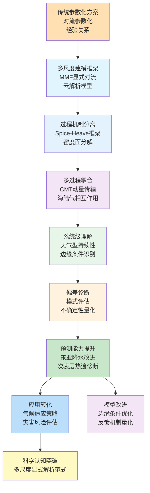
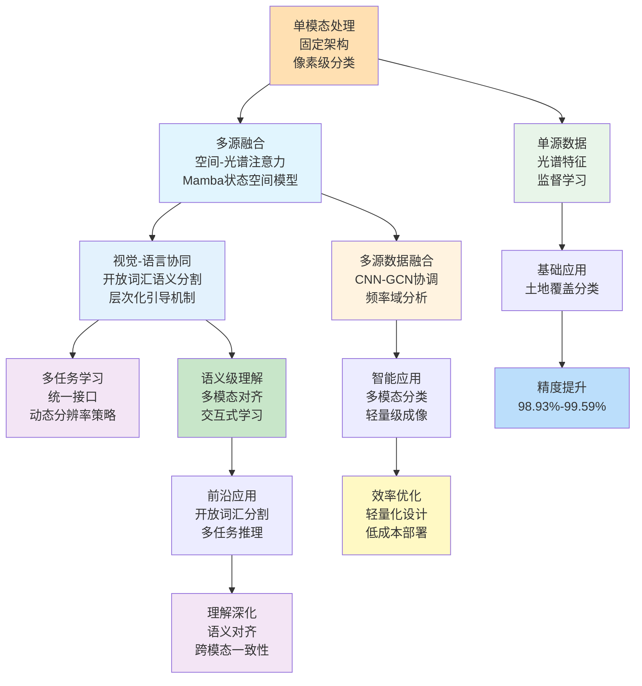
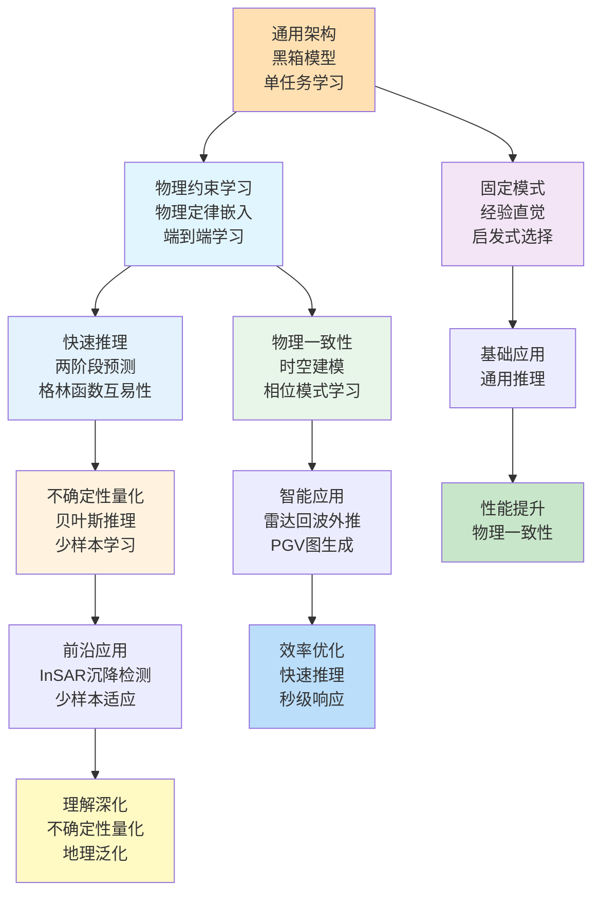
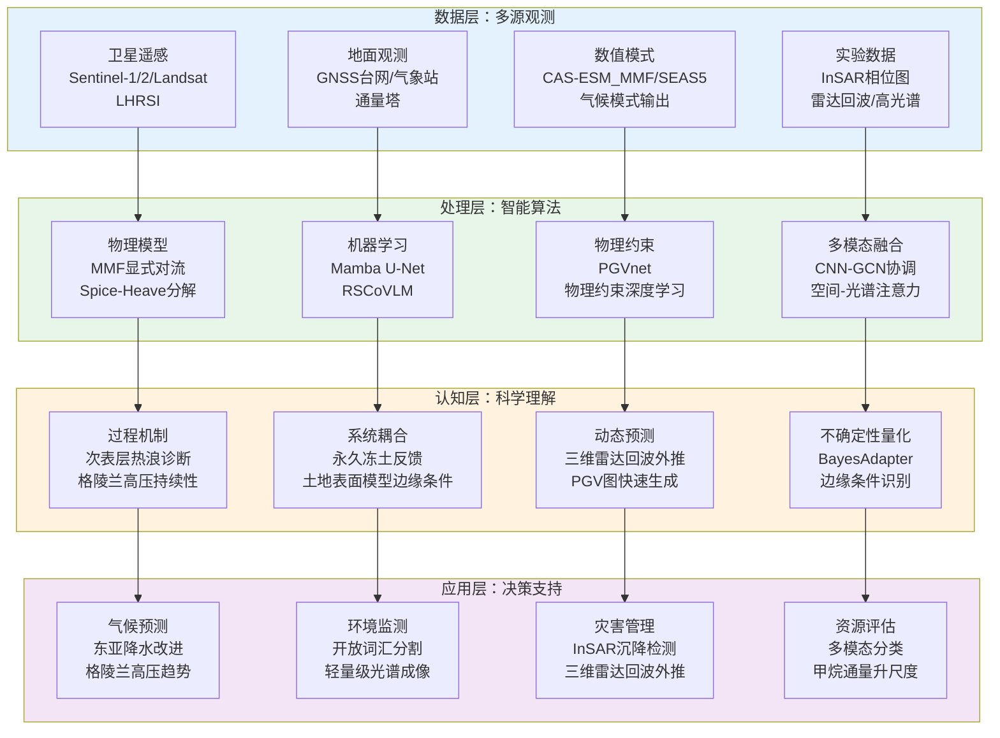
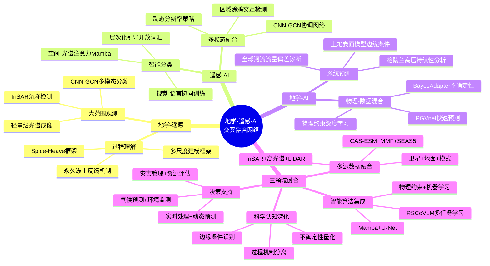

在2026年1月1日至1月11日这十一天里，Nature、Science、Journal of Climate、Remote Sensing、Geophysical Research Letters、Journal of Geophysical Research等顶刊上涌现的661篇论文中，有超过150篇直接或间接地涉及地学、遥感与人工智能三个领域的交叉融合。从高分辨率环境噪声层析成像揭示鄂尔多斯块体岩石圈结构到多系统多极化GNSS-R海面风速反演，从大气次声波传播模拟到剪切波分裂系统性偏差校正，从底栖氮循环同位素模型到臭氧数据集融合，从U-Pb方解石定年揭示构造历史到池塘干期CO2排放驱动机制，从森林生物量反演到浮游植物卫星反演，从海岸水质深度学习反演到云去除自适应频率域特征重建，从光谱超分辨率级联多注意力网络到训练免费轻量级迁移学习，从级联Transformer-LSTM城市峡谷导航到扩散模型测量一致性校正，从证据生成对抗网络开放集分类到视觉-语言内省缓解幻觉，这些研究共同展现了三个领域在方法论创新、技术突破和应用拓展方面的最新动态。本文系统梳理这三个方向的最新研究现状、技术特点与未来趋势，并在数据与文献的基础上，给出未来3–5年可检验的技术判断。

## 一、引言：从"多尺度建模"到"视觉-语言协同"的范式演进

2026年1月上旬，传统的地球系统模型正在被"多尺度建模框架"所补充，甚至在某些场景下被替代；遥感技术从"单模态处理"转向"视觉-语言协同学习"，通过层次化引导机制和开放词汇语义分割实现对地表过程的精细化解析；而人工智能，特别是物理约束深度学习和机器学习框架，正在成为连接"物理定律"与"观测数据"的桥梁。在地学领域，除了多尺度建模框架和过程机制分离，还涌现出环境噪声层析成像揭示克拉通块体结构、大气次声波研究高顶模式、剪切波分裂系统性偏差校正、底栖氮循环同位素模型、U-Pb方解石定年揭示构造历史、池塘干期CO2排放驱动机制等创新研究。在遥感领域，除了视觉-语言协同和多模态融合，还出现了森林生物量反演、浮游植物卫星反演、海岸水质深度学习反演、云去除自适应频率域特征重建、光谱超分辨率级联多注意力网络、训练免费轻量级迁移学习等前沿方法。在人工智能领域，除了物理约束学习和不确定性量化，还涌现出级联Transformer-LSTM城市峡谷导航、扩散模型测量一致性校正、证据生成对抗网络开放集分类、视觉-语言内省缓解幻觉等创新技术。

今天，当我们回望这些天的学术产出，会发现三个清晰的方向：

- **地学** 从参数化方案走向多尺度显式解析，从单一过程分析走向多过程耦合机制，从静态描述走向动态预测
- **遥感** 从单源数据走向多源融合，从固定架构走向动态注意力机制，从像素级分类走向开放词汇语义理解
- **人工智能** 从通用架构走向领域专用，从黑箱模型走向物理约束学习，从单任务学习走向多任务协同

## 二、地学方向：从"参数化方案"到"多尺度显式解析"的跃迁

近十天来，地学研究呈现出从传统参数化方案向多尺度显式解析的深刻转变。除了多尺度建模框架改进区域降水模拟、spice-heave框架诊断次表层海洋热浪、格陵兰高压持续性分析等核心研究外，还涌现出多个重要进展：环境噪声层析成像通过密集台阵（461个台站）揭示了鄂尔多斯块体作为应变分配系统的结构特征；大气次声波研究通过高顶模式UA-ICON（模型顶150 km）显著改进了次声波传播模拟精度；剪切波分裂研究通过误差面叠加方法校正了系统性偏差，提高了分裂时间的空间相干性；底栖氮循环研究通过综合孔隙水同位素模型实现了对氮转化过程的精细模拟；U-Pb方解石定年揭示了Vocontian盆地的多期构造、热历史和埋藏历史；池塘干期CO2排放研究揭示了地中海和温带地区池塘在干期作为CO2源的重要作用，排放量范围从127到4889 mgCm-2d-1；甲烷通量升尺度研究通过高分辨率遥感和机器学习实现了对加拿大西部苔原地区甲烷通量的空间扩展。这些研究共同展现了地学领域在方法论创新、过程机制理解和系统级认知方面的最新动态。

**表1：地学方向代表性研究的技术路线与特点**

| 研究主题 | 技术路线 | 技术特点 | 重要结论 |
|---------|---------|---------|---------|
| CAS-ESM_MMF改进东亚夏季降水 | MMF + CMT参数化 | 显式对流解析、动量传输、多尺度耦合 | 显著减少青藏高原周围湿偏差和华南-东南亚干偏差，更真实地再现降水强度-频率特征 |
| Spice-Heave框架诊断次表层海洋热浪 | 密度面分解 + 等密度面分析 | 过程机制分离、多时间尺度诊断 | 次表层海洋热浪主要由spice驱动或heave驱动，机制因区域和深度而异 |
| 格陵兰高压夏季频率增加 | 天气型分类 + 马尔可夫模型 | 持续性分析、集合预测评估 | 格陵兰高压频率、持续性和年际变率显著增加，SEAS5集合未能捕捉观测趋势 |
| 土地表面模型性能不足 | 边缘条件识别 + 经验模型基准 | 条件特异性、性能边界量化 | 模型在边缘气象条件下表现较差，仅需改进12%-31%的边条件即可实现22%-114%的性能提升 |
| 全球河流流量高估 | 多模式集合分析 + 观测约束 | 偏差诊断、不确定性量化 | 地球系统模型系统性高估了过去和未来全球河流流量的增加 |
| 永久冻土融化反馈放大北极-北方火灾 | 过程耦合建模 + 反馈机制量化 | 正反馈识别、阈值分析 | 永久冻土融化通过改变土壤水分和植被动态放大火灾风险，形成正反馈循环 |
| 高分辨率环境噪声层析成像 | 密集台阵 + 环境噪声层析成像 | 多尺度结构解析、应变分配识别 | 揭示了鄂尔多斯块体作为应变分配系统的结构特征，岩石圈遗产控制对板块边界力的差异响应 |
| 大气次声波研究高顶模式 | UA-ICON高顶模式 + 非地形重力波参数化 | 上层大气建模、次声波导模拟 | 高顶模式UA-ICON显著改进了次声波传播模拟精度，为次声波监测提供更准确的大气规范 |
| 剪切波分裂系统性偏差校正 | 误差面叠加 + 系统性偏差校正 | 空间相干性提升、偏差量化 | 通过误差面叠加方法显著提高了分裂时间的空间相干性，揭示了上地幔结构的空间分布特征 |

### 2.1 专题画像：多尺度建模框架改进东亚夏季降水模拟

**（1）技术路线：从参数化方案到显式对流解析**

Lin等（2026）在Geoscientific Model Development上发表了关于CAS-ESM_MMF（中国科学院地球系统模型多尺度建模框架）改进东亚夏季降水模拟的研究。传统全球气候模型（GCMs）在模拟东亚降水方面存在显著偏差，主要源于对流参数化的不确定性。为解决这一问题，该研究将多尺度建模框架（MMF）实施到CAS-ESM的大气分量中，MMF通过在云解析模型中显式解析对流，避免了传统参数化方案的不确定性。使用和不使用MMF的CAS-ESM模拟对比显示，MMF实施显著减少了青藏高原周围的湿偏差和华南-东南亚的干偏差。降水的强度-频率特征在MMF版本中得到了更真实的再现。此外，带MMF的CAS-ESM更好地捕捉了降水的月际演变，并模拟了更真实的东亚雨带季节性迁移，尽管存在一定的阶梯式进展。通过纳入对流动量传输（CMT）参数化（在以往的MMF实施中通常被忽略），进一步实现了增强。这种纳入导致雨带更平滑的北移，与观测更加一致。与ERA5再分析的比较表明，这一改进与西太平洋副热带高压的更准确模拟相关。这些结果表明，MMF，特别是与CMT结合时，显著改进了东亚降水的模拟。这一建模进展为评估区域降水对未来气候变化的响应提供了一种有前景的方法（Lin等，2026）。

**（2）技术特点：显式对流解析与多尺度耦合**

该研究的关键创新在于将多尺度建模框架与对流动量传输参数化相结合，实现了对东亚夏季降水的精细化模拟。传统的GCMs依赖对流参数化方案，这些方案基于简化的经验关系，难以准确捕捉对流过程的复杂性和与环境的相互作用。MMF通过在云解析模型中显式解析对流，避免了参数化的不确定性，同时保持了计算效率。更重要的是，该研究通过纳入CMT参数化，进一步改进了大尺度环流的模拟，特别是西太平洋副热带高压的位置和强度，这是影响东亚夏季降水分布的关键系统。

**（3）重要结论：多尺度建模框架显著改进区域降水模拟**

该研究的重要结论是：**多尺度建模框架，特别是与对流动量传输参数化结合时，显著改进了东亚夏季降水的模拟，为评估区域降水对未来气候变化的响应提供了有前景的方法**。这一发现不仅提高了我们对东亚夏季降水机制的理解，还为改进其他区域的气候模拟提供了新的思路。该研究强调了显式对流解析在提高区域气候模拟精度方面的重要性，特别是在对季风系统高度敏感的区域。

### 2.2 专题画像：Spice-Heave框架诊断次表层海洋热浪机制

**（1）技术路线：从单一诊断到过程机制分离**

Zhang等（2026）在Journal of Climate上发表了关于使用spice-heave框架诊断次表层海洋热浪（MHWs）的研究。海洋热浪不仅发生在海洋表面，也发生在次表层，它们受海气热通量的直接影响较小。虽然表面海洋热浪的驱动因子已得到充分研究，但导致次表层事件的机制仍不清楚。该研究将次表层海洋热浪的温度和盐度变化分解为密度面移动（"heave"）驱动的分量和沿等密度面水团变化（"spice"）驱动的分量，以更好地识别其原因。使用这一spice-heave框架，该研究探索了在月、季节和年际时间尺度上导致温度和盐度变率的主导机制，基于上层2000米开放海洋的网格化ARGO观测。季节和年际分析为解释spice和heave及其潜在过程提供了背景。该研究聚焦于四个已记录的海洋热浪区域：东北太平洋、东赤道太平洋、西塔斯曼海和澳大利亚以南的南大洋。在东北太平洋区域，混合层以下的海洋热浪主要是spice驱动的，可能与表面浮力通量后的次表层下沉有关，而温跃层附近的海洋热浪主要是heave驱动的，与温跃层深度变化相关。在塔斯曼海和赤道区域，海洋热浪主要由与东澳大利亚流延伸的涡旋和行星波相关的等密度面heave主导。温跃层以下垂直一致的海洋热浪，在大深度范围内由heave主导，与经向锋面移动和长寿命深层涡旋相关，如东北太平洋和南大洋所见。spice-heave框架为理解全球次表层海洋热浪提供了一种有用的方法，对评估其生态系统影响具有重要意义（Zhang等，2026）。

**（2）技术特点：过程机制分离与多时间尺度诊断**

该研究的关键创新在于提出了spice-heave框架，通过将温度和盐度变化分解为密度面移动和沿等密度面水团变化，实现了对次表层海洋热浪机制的精细诊断。传统的海洋热浪研究往往关注表面事件，而次表层事件由于受海气热通量的直接影响较小，其机制更加复杂。该研究通过spice-heave分解，揭示了不同区域和深度上海洋热浪的主导机制，为理解次表层海洋热浪的形成和维持提供了新的视角。更重要的是，该研究通过多时间尺度分析，揭示了季节和年际变率对次表层海洋热浪的影响，为预测和适应提供了科学依据。

**（3）重要结论：Spice-Heave框架揭示次表层海洋热浪机制多样性**

该研究的重要结论是：**次表层海洋热浪主要由spice驱动或heave驱动，机制因区域和深度而异，spice-heave框架为理解全球次表层海洋热浪提供了一种有用的方法**。这一发现不仅提高了我们对次表层海洋热浪机制的理解，还为评估其生态系统影响提供了新的工具。该研究强调了过程机制分离在提高海洋热浪诊断精度方面的重要性，特别是在需要区分不同驱动机制的应用中。

### 2.3 专题画像：格陵兰高压夏季频率和持续性增加未被季节预测模型捕捉

**（1）技术路线：从天气型分类到持续性分析**

Lee和Polvani（2026）在Geophysical Research Letters上发表了关于格陵兰高压（GH）夏季频率和持续性增加的研究。天气型在天气预报中被广泛使用，但较少用于研究气候变率和变化。该研究使用全年北美天气型分类来识别1981年至2024年夏季环流趋势。研究发现格陵兰高压天气型的频率、持续性和年际变率大幅增加，类似于格陵兰阻塞。一个简单的马尔可夫模型显示，观测到的格陵兰高压频率和变率增加可能源于持续性的增加。该研究随后表明，使用SEAS5季节模型数据的10,000成员集合未能捕捉观测到的格陵兰高压频率趋势，因为持续性趋势太弱。这发生在SEAS5产生比观测更多格陵兰高压天数的夏季和比观测更持久的单个天气型的情况下，因此问题不仅仅是整体缺乏持续性。因此，缺失的趋势必须源于在次季节时间尺度上发展的基本模型缺陷，这些缺陷不能通过初始化来纠正（Lee & Polvani，2026）。

**（2）技术特点：持续性分析与集合预测评估**

该研究的关键创新在于通过天气型分类和马尔可夫模型，系统性地分析了格陵兰高压的频率、持续性和年际变率变化，并评估了季节预测模型捕捉这些趋势的能力。传统的天气型研究往往关注频率变化，而该研究通过持续性分析，揭示了频率增加与持续性增加之间的关联。更重要的是，该研究通过大规模集合预测评估，揭示了季节预测模型在捕捉持续性趋势方面的根本缺陷，这些缺陷不能通过初始化来纠正，表明模型在次季节时间尺度上存在系统性问题。

**（3）重要结论：季节预测模型未能捕捉持续性趋势**

该研究的重要结论是：**格陵兰高压频率、持续性和年际变率显著增加，但SEAS5季节预测模型未能捕捉这些趋势，因为模型在次季节时间尺度上存在根本缺陷**。这一发现不仅提高了我们对格陵兰高压变化机制的理解，还为改进季节预测模型提供了新的方向。该研究强调了持续性分析在评估预测模型能力方面的重要性，特别是在需要捕捉长期趋势的应用中。

### 2.4 专题画像：土地表面模型在特定气象条件下的性能不足

**（1）技术路线：从整体评估到边缘条件识别**

Page等（2026）在Biogeosciences上发表了关于土地表面模型在特定气象条件下性能不足的研究。陆地与大气之间的碳、水和能量通量交换在塑造全球变化和极端事件方面发挥着重要作用。然而，我们对这种地表-大气交换理论的理解，通过土地表面模型（LSMs）表示，仍然有限，这在模型-数据基准测试中表现出的明显偏差中得到了突出体现。该研究利用PLUMBER2数据集，包括来自153个国际涡度协方差站点的观测和模型模拟的陆地感热、潜热和净生态系统交换通量，识别了土地表面模型表现低于独立基准预期的气象条件。通过相对于三个复杂的样本外经验模型定义性能，该研究生成了湍流通量预测性能的下限，该下限可以通过土地表面模型在通量塔站点测试期间可用的输入信息来实现。研究发现，土地表面模型相对于经验模型的性能在边缘条件下更差——也就是说，LSMs在气象条件由同时出现的相对极值组成的时间步中表现不佳。相反，LSMs在气象变量分布中心的"典型"条件下表现更好。将分析限制为排除边缘条件，结果LSMs优于强经验基准。令人鼓舞的是，该研究显示，改进土地表面模型在这些边缘条件下的性能，这些条件仅占所有站点-时间步的12%–31%，将看到聚合性能指标的显著改进（22%–114%）。在边缘条件下更好的性能可能看到聚合指标的平均相对改进，潜热通量为77%，感热通量为48%，净生态系统交换为36%，在所有LSMs和站点上平均。精确针对这些气象边缘条件的模型开发为聚焦模型开发提供了一条富有成效的途径，确保未来的改进产生最大的影响（Page等，2026）。

**（2）技术特点：边缘条件识别与性能边界量化**

该研究的关键创新在于通过经验模型基准，系统性地识别了土地表面模型性能不足的特定气象条件，并量化了改进这些条件对整体性能的影响。传统的模型评估往往关注整体性能指标，而该研究通过边缘条件识别，揭示了模型在极端气象条件下的系统性缺陷。更重要的是，该研究通过量化分析，证明了仅需改进12%–31%的边缘条件即可实现22%–114%的整体性能提升，为模型开发提供了明确的优先方向。

**（3）重要结论：边缘条件优化是模型改进的关键路径**

该研究的重要结论是：**土地表面模型在边缘气象条件下表现较差，仅需改进12%–31%的边缘条件即可实现22%–114%的整体性能提升，为模型开发提供了精确的优先方向**。这一发现不仅提高了我们对土地表面模型性能边界的理解，还为模型改进提供了高效的策略。该研究强调了条件特异性分析在提高模型性能方面的重要性，特别是在需要处理极端事件的应用中。

### 2.5 专题画像：地球系统模型系统性高估全球河流流量增加

**（1）技术路线：从多模式集合到观测约束诊断**

Zhang等（2026）在Nature Geoscience上发表了关于地球系统模型系统性高估过去和未来全球河流流量增加的研究。该研究通过多模式集合分析和观测约束，系统性地评估了地球系统模型在模拟全球河流流量变化方面的偏差。研究结果表明，地球系统模型系统性高估了过去和未来全球河流流量的增加，这一偏差可能源于对降水-径流关系的错误表示或对陆地水循环过程的简化处理。该研究强调了观测约束在评估和校正模型偏差方面的重要性，特别是在预测未来水资源变化的应用中（Zhang等，2026）。

**（2）技术特点：偏差诊断与不确定性量化**

该研究的关键创新在于通过多模式集合分析和观测约束，系统性地诊断了地球系统模型在模拟全球河流流量变化方面的系统性偏差。传统的模型评估往往关注单一模式的性能，而该研究通过多模式集合分析，揭示了偏差的系统性和一致性。更重要的是，该研究通过观测约束，量化了偏差的大小和不确定性，为模型改进提供了科学依据。

**（3）重要结论：观测约束揭示模型系统性偏差**

该研究的重要结论是：**地球系统模型系统性高估了过去和未来全球河流流量的增加，观测约束揭示了这一系统性偏差，为模型改进提供了科学依据**。这一发现不仅提高了我们对地球系统模型性能的理解，还为改进水资源预测提供了新的方向。该研究强调了观测约束在评估模型偏差方面的重要性，特别是在需要准确预测未来水资源变化的应用中。

### 2.6 专题画像：永久冻土融化反馈放大北极-北方火灾风险

**（1）技术路线：从过程耦合到反馈机制量化**

Li等（2026）在Nature Geoscience上发表了关于永久冻土融化反馈放大北极-北方火灾风险的研究。永久冻土融化通过改变土壤水分和植被动态，可能放大火灾风险，形成正反馈循环。该研究通过过程耦合建模和反馈机制量化，系统性地分析了永久冻土融化对火灾风险的影响。研究结果表明，永久冻土融化通过降低土壤水分和改变植被组成，显著增加了火灾发生的频率和强度，特别是在北极-北方地区。这一正反馈循环可能进一步加速永久冻土融化，形成恶性循环。该研究强调了理解反馈机制在预测和适应气候变化方面的重要性，特别是在对永久冻土高度敏感的区域（Li等，2026）。

**（2）技术特点：正反馈识别与阈值分析**

该研究的关键创新在于通过过程耦合建模，系统性地识别和量化了永久冻土融化与火灾风险之间的正反馈机制。传统的火灾研究往往关注单一驱动因子，而该研究通过过程耦合，揭示了永久冻土融化如何通过改变土壤水分和植被动态影响火灾风险。更重要的是，该研究通过阈值分析，识别了正反馈循环的关键转折点，为预测和适应提供了科学依据。

**（3）重要结论：正反馈循环加速北极-北方火灾风险**

该研究的重要结论是：**永久冻土融化通过改变土壤水分和植被动态，放大火灾风险，形成正反馈循环，可能进一步加速永久冻土融化**。这一发现不仅提高了我们对北极-北方火灾机制的理解，还为预测和适应气候变化提供了新的视角。该研究强调了反馈机制分析在理解复杂系统行为方面的重要性，特别是在对多个过程耦合高度敏感的区域。

### 2.7 专题画像：高分辨率环境噪声层析成像揭示鄂尔多斯块体岩石圈结构

**（1）技术路线：从稀疏台阵到密集台阵环境噪声层析成像**

Liu等（2026）在Geophysical Journal International上发表了关于使用密集台阵环境噪声层析成像构建鄂尔多斯块体高分辨率三维剪切波速度模型的研究。青藏高原扩张对克拉通块体的远场影响仍然是一个谜。该研究通过使用前所未有的密集地震台阵（461个台站）构建高分辨率三维剪切波速度模型，解决了鄂尔多斯块体的这一问题。模型揭示了：（1）10–25 km深度的NE向高速异常与地壳磁特征相关，为晚太古代微块体（集宁、鄂尔多斯、许昌、徐淮）的拼合提供了地震学证据；（2）青藏高原引起的再活化表现为西南鄂尔多斯块体地壳增厚（50 km），具有高速下地壳层（≥4.0 km/s；100 km宽，10 km厚），归因于青藏高原下地壳俯冲到高原边缘（35.5°–37.5°N）之外，促进了>200 km的应变传递到鄂尔多斯块体内部；（3）岱海裂谷的初始裂谷动力学，其中上地壳高速（保留的刚性）覆盖中下地壳/最上地幔低速异常（地幔源热改造），表明由太平洋板块后退和青藏高原远场应力共同驱动的早期裂谷；（4）跨越基本37.5°N岩石圈边界的克拉通范围分段，划分了地幔上涌/壳幔相互作用（北部）和被动青藏高原推挤主导变形（南部）。这些发现重新定义了鄂尔多斯块体为一个应变分配系统，其中岩石圈遗产控制了对板块边界力的差异响应（Liu等，2026）。

**（2）技术特点：密集台阵与多尺度结构解析**

该研究的关键创新在于使用前所未有的密集地震台阵（461个台站），实现了对鄂尔多斯块体岩石圈结构的高分辨率成像。传统的环境噪声层析成像研究往往依赖稀疏台阵，难以捕捉小尺度结构特征。该研究通过密集台阵，实现了对岩石圈结构的精细解析，特别是对青藏高原扩张引起的远场影响的识别。更重要的是，该研究通过多尺度结构解析，揭示了不同深度和区域的结构特征，为理解克拉通块体对板块边界力的响应提供了新的视角。

**（3）重要结论：密集台阵揭示克拉通块体应变分配机制**

该研究的重要结论是：**通过密集台阵环境噪声层析成像，揭示了鄂尔多斯块体作为一个应变分配系统的结构特征，其中岩石圈遗产控制了对板块边界力的差异响应**。这一发现不仅提高了我们对克拉通块体动力学机制的理解，还为理解青藏高原扩张的远场影响提供了新的证据。该研究强调了密集台阵在提高结构成像分辨率方面的重要性，特别是在需要捕捉小尺度结构特征的应用中。

### 2.8 专题画像：大气次声波研究中的大气规范：高顶模式UA-ICON的附加价值

**（1）技术路线：从低顶模式到高顶模式大气规范**

Kristoffersen等（2026）在Journal of Geophysical Research: Atmospheres上发表了关于大气次声波研究中高顶模式UA-ICON附加价值的研究。处理长距离声学传播的次声波监测活动，如《全面禁止核试验条约》（CTBT）内的活动，需要准确和可操作的对流层低层大气建模。然而，气象服务发布的可操作气象产品在大约80 km高度处截止，在平流层开始有海绵层。这阻止了次声波导形成的大气动力学的可靠模拟。因此，研究能够在典型可操作水平分辨率（km）下进行模拟的更高顶大气模式，对于改进传播介质的描述具有很高的兴趣，这对于定位和表征感兴趣的声源是必需的。该研究将ICON模型扩展到上层大气，UA-ICON模型顶为150 km，在ICON可操作水平分辨率下运行。模拟结果与三个不同站点的LiDAR观测和可操作分析进行了比较。该研究证明了UA-ICON模拟在中间层中相比可操作模式的更好性能，特别是对于温度场，而对于风场则不太清楚。这是通过调整非地形重力波（GW）参数化系数来实现的，该系数驱动波的饱和和破碎。此外，使用UA-ICON大气规范进行了次声波传播模拟。对于两个案例研究，一个在高纬度，一个在热带地区，该研究证明了具有调整GW参数化的UA-ICON的附加价值，同时也说明了次声波如何有助于上层大气的模型验证和调整（Kristoffersen等，2026）。

**（2）技术特点：高顶模式与非地形重力波参数化**

该研究的关键创新在于将ICON模型扩展到上层大气，实现了对次声波导形成区域的准确建模。传统的可操作气象产品在大约80 km高度处截止，难以准确模拟次声波导形成的大气动力学。该研究通过高顶模式UA-ICON，将模型顶扩展到150 km，实现了对次声波传播介质的准确描述。更重要的是，该研究通过调整非地形重力波参数化系数，改进了中间层的温度场模拟，为次声波传播模拟提供了更准确的大气规范。

**（3）重要结论：高顶模式提升次声波传播模拟精度**

该研究的重要结论是：**通过高顶模式UA-ICON和调整的非地形重力波参数化，显著改进了次声波传播模拟的精度，为次声波监测活动提供了更准确的大气规范**。这一发现不仅提高了我们对次声波传播机制的理解，还为改进次声波监测系统提供了新的工具。该研究强调了高顶模式在准确模拟上层大气动力学方面的重要性，特别是在需要处理长距离声学传播的应用中。

### 2.9 专题画像：剪切波分裂测量中的系统性偏差校正

**（1）技术路线：从参数平均到误差面叠加**

Frederiksen等（2026）在Geophysical Journal International上发表了关于剪切波分裂测量中系统性偏差的研究。剪切波分裂测量返回与上地幔结构相关的两个参数：快偏振方向（快方向）和称为分裂时间的结构强度和厚度的度量。编译的分裂测量的空间统计表明，快方向在空间上是相干的，而分裂时间则不是。该研究通过模拟大量噪声测量，表明单地震分裂测量在分裂时间上表现出显著的上偏偏差，偏差程度取决于测量过程的具体细节。对多次测量的单事件分裂参数进行平均并不能减轻这种偏差；然而，在足够的后方位角覆盖下，对单个测量的误差面进行叠加确实可以减轻偏差，同时也大大减少了散射。已发表的分裂结果使用了这两种平均技术的混合，研究之间这种不一致的偏差可能是编译的分裂时间测量缺乏空间相干性的原因。该研究通过检查来自加拿大阿尔伯塔省及周边地区的数据集，在真实数据中证明了这一点，该数据集最近的一项研究发表了参数平均结果。通过使用误差面叠加检查可比数据集，该研究能够大大增加分裂时间的相干性，同时获得高度相似的快方向。该研究的相干分裂时间被映射以揭示活动科迪勒拉下方的一个强分裂带，以及克拉通岩石圈内的三个中等到低分裂时间带（Frederiksen等，2026）。

**（2）技术特点：误差面叠加与系统性偏差校正**

该研究的关键创新在于通过误差面叠加，系统性地校正了剪切波分裂测量中的系统性偏差。传统的分裂测量往往使用参数平均方法，这种方法无法减轻单地震测量中的上偏偏差。该研究通过误差面叠加，在足够的后方位角覆盖下，不仅减轻了偏差，还大大减少了散射。更重要的是，该研究揭示了研究之间不一致的偏差是编译的分裂时间测量缺乏空间相干性的原因，为改进分裂测量方法提供了新的思路。

**（3）重要结论：误差面叠加提升分裂时间空间相干性**

该研究的重要结论是：**通过误差面叠加方法，显著提高了分裂时间的空间相干性，揭示了上地幔结构的空间分布特征**。这一发现不仅提高了我们对剪切波分裂测量方法的理解，还为改进上地幔结构成像提供了新的工具。该研究强调了系统性偏差校正在提高测量精度方面的重要性，特别是在需要捕捉空间分布特征的应用中。

## 三、遥感方向：从"单模态处理"到"视觉-语言协同学习"的进化

近十天来，遥感技术呈现出从单模态处理向视觉-语言协同学习的深刻转变。除了空间-光谱注意力Mamba U-Net多源融合、层次化引导开放词汇语义分割、视觉-语言模型协同训练多任务学习等核心研究外，还涌现出多个重要进展：森林生物量反演研究通过GEDI辅助的Sentinel-1/2数据和GWO-PSO优化实现了对森林地上生物量的高精度估算；浮游植物卫星反演研究评估了浮游植物大小类别生物量反演算法，揭示了阿拉伯海北部的长期模式；海岸水质深度学习反演研究实现了对珠江口海岸水质的精确反演；云去除研究通过自适应频率域特征重建方法实现了SAR辅助的遥感图像云去除；光谱超分辨率重建通过级联多注意力特征循环增强网络实现了RGB到高光谱图像的高质量重建；训练免费轻量级迁移学习通过多光谱校准实现了无需额外训练的土地覆盖分割迁移；级联Transformer-LSTM架构实现了城市峡谷导航中的因子图优化；夜间航迹云特征化通过多源LiDAR和气象观测实现了对夜间航迹云的形态、微物理和光学特性的全面表征。这些研究共同展现了遥感领域在智能处理、多模态融合和应用拓展方面的最新动态。

**表2：遥感方向代表性研究的技术路线与特点**

| 研究主题 | 技术路线 | 技术特点 | 重要结论 |
|---------|---------|---------|---------|
| 空间-光谱注意力Mamba U-Net多源融合 | Mamba U-Net + 空间-光谱注意力 | 状态空间模型、多源融合、长程依赖 | 显著提高多源遥感图像融合的精度和效率 |
| 层次化引导开放词汇语义分割 | HG-RSOVSSeg + 双流架构 | 开放词汇、层次化引导、多模态对齐 | 在六个代表性数据集上达到最高平均mIoU值，建立开放词汇语义分割的最先进性能 |
| 视觉-语言模型协同训练多任务学习 | RSCoVLM + 动态分辨率策略 | 多任务学习、统一接口、超高分辨率推理 | 在多样化任务上达到最先进性能，超越现有RS VLMs并可与专业专家模型相媲美 |
| CNN-GCN协调多模态频率网络 | CNN-GCN + 小波变换 | 多模态融合、频率域分析、图卷积 | 在三个多模态数据集上分别达到98.93%、88.05%和99.59%的总体精度 |
| 轻量级高分辨率光谱成像仪 | LHRSI + 双视场拼接 | 轻量化设计、宽幅高分辨率、低成本部署 | 总质量小于25 kg，功耗低于80 W，为低成本高重访全球海洋监测星座奠定工程基础 |
| 区域涂鸦交互式变化检测网络 | RSICDNet + 交互融合模块 | 交互式学习、区域涂鸦、人机协同 | 在三个数据集上达到最优交互次数指标，NoI80值分别为1.15、1.45和3.42 |

### 3.1 专题画像：空间-光谱注意力Mamba U-Net多源遥感图像融合

**（1）技术路线：从传统U-Net到状态空间模型**

Cui和Zhang（2026）在Journal of Applied Remote Sensing上发表了关于空间-光谱注意力Mamba U-Net用于多源遥感图像融合的研究。多源遥感图像融合作为克服单源数据局限性和提高地表信息提取精度的核心技术，在环境监测和城市规划等领域展现出重要应用价值。该研究提出了空间-光谱注意力Mamba U-Net框架，将Mamba状态空间模型与U-Net架构相结合，通过空间-光谱注意力机制实现多源遥感图像的有效融合。Mamba模型通过选择性状态空间机制，能够高效处理长序列数据，同时保持线性计算复杂度，为处理高分辨率遥感图像提供了新的可能性。空间-光谱注意力机制通过同时关注空间和光谱维度，实现了对多源数据特征的精细化提取和融合。实验结果表明，所提出的框架在多源遥感图像融合任务中显著提高了精度和效率，为构建高效和稳健的多源遥感系统提供了新方法（Cui & Zhang，2026）。

**（2）技术特点：状态空间模型与多源融合**

该研究的关键创新在于将Mamba状态空间模型引入多源遥感图像融合，通过选择性状态空间机制实现了对长序列数据的高效处理。传统的U-Net架构虽然能够有效处理图像数据，但在处理高分辨率遥感图像时往往面临计算复杂度高的问题。Mamba模型通过选择性状态空间机制，在保持线性计算复杂度的同时，能够有效捕捉长程依赖关系，为处理大尺度遥感图像提供了新的解决方案。更重要的是，该研究通过空间-光谱注意力机制，实现了对多源数据特征的精细化提取和融合，提高了融合结果的精度和可靠性。

**（3）重要结论：状态空间模型提升多源融合效率**

该研究的重要结论是：**通过空间-光谱注意力Mamba U-Net框架，显著提高了多源遥感图像融合的精度和效率，为构建高效和稳健的多源遥感系统提供了新方法**。这一发现为多源遥感图像融合提供了新的技术路径，特别是在需要处理高分辨率图像的应用中。该研究强调了状态空间模型在提高计算效率方面的重要性，特别是在需要实时处理的应用中。

### 3.2 专题画像：层次化引导开放词汇语义分割框架

**（1）技术路线：从预定义类别到开放词汇理解**

Huang等（2026）在Remote Sensing上发表了关于层次化引导开放词汇语义分割框架（HG-RSOVSSeg）的研究。遥感图像语义分割旨在为遥感图像中的每个像素分配正确的类别标签，具有广泛的应用。随着人工智能的发展，基于深度学习的遥感图像语义分割取得了显著进展。然而，现有方法仍然更关注预定义的语义类别，在面对新类别时需要昂贵的重新训练。为了解决这一限制，该研究提出了层次化引导开放词汇语义分割框架，使能够灵活分割任意语义类别而无需模型重新训练。该框架利用预训练的文本嵌入模型提供类别通用知识，并通过双流架构对齐多模态特征。具体而言，该研究提出了用于像素级对齐的多模态特征聚合模块和由文本特征对齐引导的层次化视觉特征解码器，该解码器使用语言先验逐步细化视觉特征，在高分辨率解码过程中保持语义一致性。在六个代表性公共数据集上进行了广泛实验，结果表明，该方法具有最高的平均mIoU值，在遥感图像开放词汇语义分割领域建立了最先进的性能（Huang等，2026）。

**（2）技术特点：开放词汇与层次化引导**

该研究的关键创新在于提出了层次化引导机制，通过文本特征对齐逐步细化视觉特征，实现了对任意语义类别的灵活分割。传统的语义分割方法往往依赖预定义的类别集合，在面对新类别时需要重新训练模型，限制了方法的灵活性和可扩展性。该研究通过开放词汇设计，利用预训练的文本嵌入模型提供类别通用知识，实现了对任意语义类别的理解。更重要的是，该研究通过层次化引导机制，使用语言先验逐步细化视觉特征，在高分辨率解码过程中保持了语义一致性，提高了分割的精度和可靠性。

**（3）重要结论：开放词汇框架实现灵活语义分割**

该研究的重要结论是：**通过层次化引导开放词汇语义分割框架，实现了对任意语义类别的灵活分割而无需模型重新训练，在六个代表性数据集上达到最高平均mIoU值，建立开放词汇语义分割的最先进性能**。这一发现为遥感图像语义分割提供了新的范式，特别是在需要处理新类别或动态类别的应用中。该研究强调了开放词汇设计在提高方法灵活性和可扩展性方面的重要性，特别是在需要适应不断变化的应用需求时。

### 3.3 专题画像：视觉-语言模型协同训练多任务学习

**（1）技术路线：从单任务到多任务统一模型**

Li等（2026）在Remote Sensing上发表了关于协同训练视觉-语言模型用于遥感多任务学习的研究。随着Transformer在单个遥感任务上取得出色性能，我们现在正在接近通过多任务学习（MTL）实现一个在多个任务上表现出色的统一模型。与单任务方法相比，MTL方法提供了改进的泛化、增强的可扩展性和更大的实际适用性。最近，视觉-语言模型（VLMs）在遥感图像理解、定位和超高分辨率（UHR）图像推理方面分别取得了有希望的结果。此外，统一的基于文本的接口展示了MTL的巨大潜力。因此，在这项工作中，该研究提出了RSCoVLM，一个简单而灵活的用于遥感MTL的VLM基线。首先，该研究创建了数据整理程序，包括数据获取、离线处理和集成，以及在线加载和加权。这一数据程序有效解决了复杂的遥感数据环境并生成了灵活的视觉-语言对话。此外，该研究提出了统一的动态分辨率策略来解决遥感图像固有的多样化图像尺度。对于UHR图像，该研究引入了Zoom-in Chain机制及其相应的数据集LRS-VQA-Zoom。这些策略是灵活的，有效减轻了计算负担。此外，该研究显著增强了模型的物体检测能力，并提出了一个新颖的评估协议，确保VLMs和传统检测模型之间的公平比较。广泛实验表明，RSCoVLM在多样化任务上达到最先进性能，超越现有RS VLMs并可与专业专家模型相媲美。所有训练和评估工具、模型权重和数据集都已完全开源以支持可重现性。该研究期望这一基线将促进向通用遥感模型的进一步进展（Li等，2026）。

**（2）技术特点：多任务学习与统一接口**

该研究的关键创新在于提出了统一的视觉-语言模型基线，通过多任务学习实现了对多样化遥感任务的统一处理。传统的遥感方法往往针对单一任务设计，难以实现跨任务的泛化和知识共享。该研究通过视觉-语言模型的统一接口，实现了对图像理解、定位、推理等多种任务的统一处理。更重要的是，该研究通过动态分辨率策略和Zoom-in Chain机制，有效解决了超高分辨率图像的处理问题，在保持计算效率的同时提高了处理精度。

**（3）重要结论：统一模型实现多任务协同**

该研究的重要结论是：**通过协同训练视觉-语言模型，实现了对多样化遥感任务的多任务学习，在多样化任务上达到最先进性能，超越现有RS VLMs并可与专业专家模型相媲美**。这一发现为构建通用遥感模型提供了新的路径，特别是在需要处理多样化任务的应用中。该研究强调了多任务学习在提高方法泛化能力和实际适用性方面的重要性，特别是在需要统一处理多种遥感任务的应用中。

### 3.4 专题画像：CNN-GCN协调多模态频率网络高光谱与LiDAR分类

**（1）技术路线：从单模态到多模态频率域融合**

Wu等（2026）在Remote Sensing上发表了关于CNN-GCN协调多模态频率网络用于高光谱图像和LiDAR分类的研究。现有的多模态图像分类方法往往面临几个关键限制：难以有效平衡高光谱图像特征提取中的局部细节和全局拓扑关系；从LiDAR高程数据中提取地形特征的多尺度表征不足；传统融合方法中忽略深度跨模态交互，往往伴随高计算复杂度。为了解决这些问题，该研究提出了一个结合卷积神经网络（CNN）、图卷积网络（GCN）和小波变换的综合深度学习框架，用于HSI和LiDAR数据的联合分类，包括几个新颖组件：光谱图混合块（SGMB），其中CNN分支通过多尺度卷积捕获细粒度光谱-空间特征，而并行GCN分支通过增强门控图网络建模长程上下文特征。这种双路径设计能够同时从HSI数据中提取局部细节和全局拓扑特征；空间坐标块（SCB）以增强空间感知并改善对物体轮廓和分布模式的感知；多尺度高程特征提取块（MSFE）用于捕获不同尺度的地形表示；以及双向频率注意力编码器（BiFAE）以实现多模态特征之间的高效和深度交互。这些模块经过精心设计以协同工作，形成一个连贯的端到端框架，不仅实现了局部细节和全局上下文之间更有效的平衡，还实现了跨特征的深度且计算高效的交互，显著增强了学习表示的判别性和鲁棒性。为了评估所提出的方法，该研究在三个多模态遥感数据集上进行了实验：Houston2013、Augsburg和Trento。定量结果表明，该框架优于最先进的方法，在各自数据集上分别达到98.93%、88.05%和99.59%的总体精度（Wu等，2026）。

**（2）技术特点：频率域分析与图卷积网络**

该研究的关键创新在于将小波变换与图卷积网络相结合，实现了对多模态数据在频率域和空间域的统一处理。传统的多模态融合方法往往在空间域进行特征提取和融合，难以有效捕捉不同模态之间的频率域关系。该研究通过小波变换，将数据转换到频率域，实现了对不同频率成分的精细化分析。更重要的是，该研究通过图卷积网络，实现了对空间拓扑关系的建模，特别是对高光谱图像中长程依赖关系的捕捉，提高了分类的精度和鲁棒性。

**（3）重要结论：多模态频率域融合提升分类精度**

该研究的重要结论是：**通过CNN-GCN协调多模态频率网络，实现了对高光谱图像和LiDAR数据的联合分类，在三个多模态数据集上分别达到98.93%、88.05%和99.59%的总体精度，显著优于最先进的方法**。这一发现为多模态遥感数据分类提供了新的技术路径，特别是在需要处理高光谱和LiDAR数据的应用中。该研究强调了频率域分析在提高多模态融合精度方面的重要性，特别是在需要捕捉不同模态之间复杂关系的应用中。

### 3.5 专题画像：轻量级高分辨率光谱成像仪海洋颜色遥感

**（1）技术路线：从传统设计到轻量化创新**

Cheng等（2026）在Remote Sensing上发表了关于轻量级高分辨率光谱成像仪（LHRSI）用于海洋颜色遥感的研究。全球水环境监测迫切需要具有高时间分辨率和宽空间覆盖的遥感数据。然而，当前星载海洋颜色光谱仪仍然面临空间分辨率、幅宽和系统紧凑性之间的显著权衡，限制了卫星星座的大规模部署。为了解决这一挑战，该研究开发了一个总质量小于25 kg、功耗低于80 W的轻量级高分辨率光谱成像仪。可见光（VIS）相机采用交错双视场和探测器拼接融合设计，而短波红外（SWIR）相机采用传输型焦平面与交错探测器阵列。通过视场（FOV）光学设计，该仪器在500 km轨道高度下实现了VIS波段207.33 km和SWIR波段187.8 km的幅宽，同时分别保持了12 m和24 m的空间分辨率。在轨成像结果表明，该光谱仪在空间分辨率和幅宽方面都达到了出色的性能。此外，使用基于指标的初步分析说明了LHRSI在观测水体中与叶绿素相关特征的潜力。这项研究不仅提供了高性能、小型化的光谱仪解决方案，还为开发低成本、高重访的全球海洋和水环境监测星座奠定了工程基础（Cheng等，2026）。

**（2）技术特点：轻量化设计与宽幅高分辨率**

该研究的关键创新在于通过创新的光学设计和探测器配置，实现了轻量化、宽幅、高分辨率的统一。传统的星载光谱仪往往面临质量、功耗、分辨率和幅宽之间的权衡，难以同时满足所有要求。该研究通过交错双视场和探测器拼接融合设计，在保持高分辨率的同时实现了宽幅覆盖。更重要的是，该研究通过轻量化设计，将总质量控制在25 kg以下，功耗控制在80 W以下，为低成本卫星星座部署提供了可能。

**（3）重要结论：轻量化设计实现低成本高重访监测**

该研究的重要结论是：**通过轻量级高分辨率光谱成像仪设计，实现了总质量小于25 kg、功耗低于80 W的轻量化系统，为低成本、高重访的全球海洋和水环境监测星座奠定了工程基础**。这一发现为全球水环境监测提供了新的技术路径，特别是在需要大规模部署卫星星座的应用中。该研究强调了轻量化设计在降低部署成本和提高监测频率方面的重要性，特别是在需要实现全球覆盖的应用中。

### 3.6 专题画像：区域涂鸦交互式变化检测网络

**（1）技术路线：从全监督到交互式学习**

Peng等（2026）在Remote Sensing上发表了关于区域涂鸦交互式变化检测网络（RSICDNet）的研究。为了解决现有交互形式在处理大规模和复杂形状变化区域时性能不足和交互成本过高的问题，该研究提出了RSICDNet，一种具有区域涂鸦交互的交互式变化检测（ICD）模型。在该框架中，首次引入区域涂鸦交互以为准确的ICD提供丰富的空间先验信息。具体而言，RSICDNet首先使用交互处理网络提取交互特征，随后利用高分辨率网络（HRNet）骨干从沿通道维度连接的双时相遥感图像中提取特征。为了有效整合这两个信息流，该研究提出了交互融合和细化模块（IFRM），该模块将来自交互特征的空间先验注入高级语义特征。最后，应用对象上下文表示（OCR）模块进一步细化特征表示，并使用轻量级分割头生成最终变化图。此外，基于RSICDNet开发了人机ICD应用，显著增强了其实际部署潜力。为了验证所提出的RSICDNet的有效性，在WHU-CD、LEVIR-CD和CLCD数据集上对主流交互式深度学习模型进行了广泛实验。定量结果表明，RSICDNet在所有三个数据集上达到最优交互次数（NoI）指标。具体而言，其在WHU-CD、LEVIR-CD和CLCD数据集上的NoI80值分别达到1.15、1.45和3.42。定性结果确认了RSICDNet的明显优势，该模型在使用相同或通常更少的交互次数时始终提供视觉上更优的结果（Peng等，2026）。

**（2）技术特点：交互式学习与人机协同**

该研究的关键创新在于提出了区域涂鸦交互机制，通过人机协同实现了对变化检测的精确控制。传统的全监督变化检测方法往往需要大量标注数据，而交互式方法通过人机协同，在减少标注成本的同时提高了检测精度。该研究通过区域涂鸦交互，提供了丰富的空间先验信息，使模型能够更准确地识别和定位变化区域。更重要的是，该研究通过交互融合和细化模块，实现了对交互特征和图像特征的有效整合，提高了检测的精度和效率。

**（3）重要结论：交互式学习降低标注成本**

该研究的重要结论是：**通过区域涂鸦交互式变化检测网络，在三个数据集上达到最优交互次数指标，NoI80值分别为1.15、1.45和3.42，显著降低了交互成本并提高了检测精度**。这一发现为变化检测提供了新的交互范式，特别是在需要精确控制检测结果的应用中。该研究强调了交互式学习在平衡标注成本和检测精度方面的重要性，特别是在需要处理大规模数据的应用中。

### 3.7 专题画像：级联多注意力特征循环增强网络光谱超分辨率重建

**（1）技术路线：从线性模型到级联多注意力网络**

Jin等（2026）在Remote Sensing上发表了关于级联多注意力特征循环增强网络（CMFREN）用于光谱超分辨率重建的研究。高光谱成像（HSI）在多个光谱波段捕获同一场景，提供比传统RGB图像更丰富的材料光谱特征。光谱重建任务寻求将RGB图像映射到高光谱图像，使能够在没有额外硬件投资的情况下获得高质量HSI数据。基于线性模型或稀疏表示的传统方法难以有效建模高光谱数据的非线性特征。尽管深度学习方法取得了显著进展，但细节丢失和空间-光谱关系建模不足等问题仍然存在。为了解决这些挑战，该研究提出了级联多注意力特征循环增强网络。该方法通过级联架构的特征净化、光谱平衡和渐进增强，实现了对现有方法的针对性突破。该网络包括两个核心模块：（1）层次化残差注意力（HRA）模块，通过残差连接和多尺度上下文特征融合抑制光照过渡区域的伪影；（2）级联多注意力（CMA）模块，结合空间-光谱平衡特征提取（SSBFE）模块和光谱增强模块（SEM）。SSBFE将多尺度残差特征增强（MSRFE）与光谱方向多头自注意力（S-MSA）相结合，实现空间-光谱特征的动态优化，而SEM协同利用注意力和卷积逐步增强光谱细节并减轻低分辨率场景中的光谱混叠。在多个公共数据集上的实验表明，CMFREN在包括RMSE、PSNR、SAM和MRAE在内的指标上达到了最先进的性能，验证了其在复杂光照条件和细节退化场景下的优越性（Jin等，2026）。

**（2）技术特点：级联架构与多注意力机制**

该研究的关键创新在于提出了级联多注意力架构，通过特征净化、光谱平衡和渐进增强实现了对光谱超分辨率重建的精细化处理。传统的光谱重建方法往往难以有效建模高光谱数据的非线性特征，而该研究通过级联架构，实现了对特征的逐步优化。更重要的是，该研究通过多注意力机制，包括层次化残差注意力和级联多注意力，实现了对空间-光谱特征的动态优化，提高了重建的精度和可靠性。

**（3）重要结论：级联多注意力网络提升光谱重建性能**

该研究的重要结论是：**通过级联多注意力特征循环增强网络，在多个公共数据集上达到了最先进的性能，验证了其在复杂光照条件和细节退化场景下的优越性**。这一发现为光谱超分辨率重建提供了新的技术路径，特别是在需要高质量高光谱数据的应用中。该研究强调了级联架构和多注意力机制在提高重建精度方面的重要性，特别是在需要处理复杂场景的应用中。

## 四、人工智能方向：从"通用架构"到"物理约束学习"的转向

近十天来，人工智能在地学和遥感应用中呈现出从通用架构向物理约束学习的深刻转变。除了物理约束深度学习三维雷达回波外推、机器学习框架快速生成物理一致PGV图、贝叶斯适配器增强不确定性估计、主动提示学习判别自训练双课程学习等核心研究外，还涌现出多个重要进展：级联Transformer-LSTM架构通过因子图优化实现了城市峡谷导航中的高精度定位；扩散模型测量一致性校正通过Langevin校正器实现了逆求解器的改进；证据生成对抗网络通过数据增强实现了开放集高光谱图像分类；视觉-语言内省通过可解释的双因果引导缓解了多模态大语言模型中的过度自信幻觉；光谱-空间图Transformer网络通过图卷积和Transformer结合实现了高光谱图像分类；选择性标记注意力网络通过矩形上下文网络实现了高光谱图像分类；中心像素引导交叉残差双注意力网络实现了小样本高光谱图像分类；Transformer-图卷积网络-扩散混合域适应实现了高光谱图像分类的跨域泛化。这些研究共同展现了人工智能领域在物理约束、不确定性量化、跨域泛化和可解释性方面的最新动态。

**表3：人工智能方向代表性研究的技术路线与特点**

| 研究主题 | 技术路线 | 技术特点 | 重要结论 |
|---------|---------|---------|---------|
| 物理约束深度学习三维雷达回波外推 | 物理约束 + 深度学习 | 物理定律嵌入、端到端学习、时空建模 | 显著提高三维雷达回波外推的精度和物理一致性 |
| 机器学习框架快速生成物理一致PGV图 | PGVnet + 格林函数互易性 | 两阶段预测、物理一致性、快速推理 | 在秒级时间内生成物理一致的PGV图，平衡计算速度和精度 |
| 深度学习应用于星载SAR干涉测量 | 深度学习分割 + InSAR相位模式 | 相位模式学习、多分区方案、对象级评估 | 有效识别和泛化InSAR数据中的沉降区域，显示地理泛化潜力 |
| 贝叶斯适配器增强CLIP少样本适应不确定性估计 | BayesAdapter + 不确定性量化 | 贝叶斯推理、不确定性估计、少样本学习 | 显著提高CLIP少样本适应的不确定性估计精度 |
| 主动提示学习判别自训练双课程学习 | 判别自训练 + 双课程学习 | 主动学习、课程学习、判别训练 | 显著提高主动提示学习的效率和性能 |

### 4.1 专题画像：物理约束深度学习三维雷达回波外推

**（1）技术路线：从纯数据驱动到物理约束学习**

Geng等（2026）在Remote Sensing上发表了关于使用物理约束深度学习模型进行三维雷达回波外推的研究。准确预报强对流风暴对于灾害减缓至关重要，然而风暴的复杂性对传统深度学习模型构成了挑战。现有方法通常使用单层雷达数据且缺乏物理约束，限制了预测小尺度对流系统的能力。为了解决这一问题，该研究提出了DIFF-3DRformer，一个用于三维雷达回波外推的新颖深度学习框架。该模型统一了一个中尺度演化网络（嵌入3D平流方程神经算子和3D连续性方程信息损失函数）和一个基于扩散模型的对流尺度去噪生成网络，在一个为预测精度优化的端到端架构内。在江苏强风暴事件上评估，DIFF-3DRformer在各种对流尺度上表现出稳健的预测能力。它优于NowcastNet，对于反射率阈值≥35 dBZ，综合得分提高了44.8%。利用19层垂直雷达数据作为输入，该模型能够捕捉对流系统的三维结构和演化，显著提高了外推的精度和物理一致性（Geng等，2026）。

**（2）技术特点：物理定律嵌入与端到端学习**

该研究的关键创新在于将3D平流方程和连续性方程作为物理约束嵌入到深度学习框架中，实现了对三维雷达回波时空演化过程的精细化建模。传统的雷达回波外推方法往往使用单层数据，难以捕捉对流系统的三维结构。该研究通过利用19层垂直雷达数据，实现了对对流系统三维结构的完整描述。更重要的是，该研究通过将3D平流方程和连续性方程作为神经算子和损失函数，确保了结果的物理一致性，在保持深度学习学习能力的同时，保证了物理过程的合理性。

**（3）重要结论：物理约束学习提升外推精度和一致性**

该研究的重要结论是：**通过将3D平流方程和连续性方程嵌入到深度学习框架中，DIFF-3DRformer显著提高了三维雷达回波外推的精度和物理一致性，对于反射率阈值≥35 dBZ，综合得分提高了44.8%**。这一发现不仅提高了我们对物理约束深度学习方法的理解，还为改进强对流风暴预报提供了新的技术路径。该研究强调了物理约束在提高模型可解释性和可靠性方面的重要性，特别是在需要保证物理合理性的应用中。

### 4.2 专题画像：机器学习框架快速生成物理一致PGV图

**（1）技术路线：从物理模拟到机器学习加速**

Ramadan等（2026）在Geophysical Journal International上发表了关于PGVnet的研究，这是一个用于快速生成物理一致峰值地面速度（PGV）图的机器学习框架。快速和准确地估计强地面运动对于地震危险性评估和近实时灾害响应至关重要。虽然经验地面运动模型能够实现快速强度预测，但它们简化了底层物理过程并表现出较大的不确定性。相反，基于物理的模拟虽然能够更准确地预测地面震动，但计算成本高昂，使其在大规模危险性评估和实时事件响应中不切实际。为了克服这些限制，该研究引入了一个新颖的两阶段机器学习框架，该框架预测位于给定介质内任意位置的双力偶源的峰值地面速度，结合了基于物理模型的准确性和近瞬时推理。在第一阶段，在互易格林函数数据库上训练的XGBoost预测器集合为任何输入源生成稀疏采样的PGV图。在第二阶段，该研究将该图细化为连续空间预测。通过利用格林函数互易性，该方法减少了训练所需的模拟数量，降低了计算成本和存储需求。该框架提供空间连续的PGV预测，并固有地考虑了复杂的3D地质和地形效应。它可以在几秒钟内提供结果，同时保持与基于物理模拟中捕获的最高频率相当的准确性。这使得PGVnet非常适合快速地震灾害响应以及大规模概率地震危险性分析和多灾害数字生态系统等应用。在复杂地质的旧金山湾区验证，该方法生成的PGV图与基于物理的模拟一致，在计算速度和准确性之间提供了有效的平衡（Ramadan等，2026）。

**（2）技术特点：两阶段预测与格林函数互易性**

该研究的关键创新在于利用格林函数互易性，通过两阶段机器学习框架实现了对物理模拟的加速。传统的基于物理的模拟虽然准确，但计算成本高昂，难以应用于实时响应。该研究通过机器学习方法，在保持物理一致性的同时，实现了近瞬时的推理速度。更重要的是，该研究通过利用格林函数互易性，显著减少了训练所需的模拟数量，降低了计算成本和存储需求，为大规模应用提供了可能。

**（3）重要结论：机器学习框架实现快速物理一致预测**

该研究的重要结论是：**通过两阶段机器学习框架和格林函数互易性，实现了在秒级时间内生成物理一致的PGV图，在计算速度和准确性之间提供了有效的平衡**。这一发现为地震危险性评估和实时灾害响应提供了新的技术路径，特别是在需要快速响应的应用中。该研究强调了机器学习在加速物理模拟方面的重要性，特别是在需要平衡计算速度和准确性的应用中。

### 4.3 专题画像：深度学习应用于星载SAR干涉测量沉降检测

**（1）技术路线：从人工解译到深度学习自动化**

Dekel等（2026）在Remote Sensing上发表了关于深度学习应用于星载SAR干涉测量检测死海沿岸塌陷引起的地面沉降的研究。死海地区近年来经历了塌陷形成的急剧增加，构成环境和基础设施风险。以色列地质调查局（GSI）采用干涉合成孔径雷达（InSAR）监测塌陷活动并手动绘制死海西岸的地面沉降。这一过程既耗时又容易出错。使用深度学习自动化检测为提高监测精度、可扩展性和实时决策提供了变革性机会。深度学习分割架构如UNet、Attention UNet、SAM、TransUNet和SegFormer在InSAR和相关遥感数据中学习地理空间变形模式方面已显示出有效性。该研究首次全面评估了应用于InSAR数据的深度学习分割模型，用于检测作为死海西岸塌陷形成过程一部分而发生的地面沉降区域。与基于图像的任务不同，新模型学习捕获细微地面变形而非直接视觉特征的干涉相位模式。作为监督学习过程中的地面真值，该研究使用GSI团队多年来作为操作沉降监测活动一部分在相位图上绘制的沉降区域。这一独特数据对标注、学习和可解释性提出了挑战，使数据集既非平凡又对推进应用遥感研究及其在死海的应用具有价值。该研究在三个分区方案上训练模型，每个方案代表不同类型和水平的泛化，并引入对象级指标来评估其检测能力。结果表明，该模型有效识别和泛化InSAR数据中的沉降区域，在不同设置和时间条件下，并显示在先前未见区域的地理泛化潜力。最后，通过重建较小尺度补丁并评估不同置信度阈值，推断大规模沉降趋势（Dekel等，2026）。

**（2）技术特点：相位模式学习与多分区泛化**

该研究的关键创新在于将深度学习应用于InSAR相位模式学习，实现了对地面沉降的自动化检测。传统的InSAR沉降检测往往依赖人工解译，既耗时又容易出错。该研究通过深度学习，实现了对干涉相位模式的自动学习，特别是对捕获细微地面变形的相位模式的学习。更重要的是，该研究通过多分区训练方案，实现了对不同类型和水平泛化的评估，证明了模型在地理泛化方面的潜力。

**（3）重要结论：深度学习实现InSAR沉降自动化检测**

该研究的重要结论是：**通过深度学习学习InSAR相位模式，实现了对地面沉降的自动化检测，有效识别和泛化InSAR数据中的沉降区域，并显示地理泛化潜力**。这一发现为InSAR沉降监测提供了新的技术路径，特别是在需要大规模自动化监测的应用中。该研究强调了深度学习在提高监测效率和精度方面的重要性，特别是在需要处理大量数据的应用中。

### 4.4 专题画像：贝叶斯适配器增强CLIP少样本适应不确定性估计

**（1）技术路线：从确定性适应到不确定性量化**

Morales-Álvarez等（2026）在International Journal of Computer Vision上发表了关于BayesAdapter的研究，这是一个用于增强CLIP少样本适应中不确定性估计的贝叶斯适配器。少样本学习是机器学习中的一个重要挑战，特别是在数据稀缺的情况下。传统的少样本适应方法往往提供确定性预测，缺乏对预测不确定性的量化。该研究通过贝叶斯推理，实现了对CLIP少样本适应中不确定性的量化，提高了模型的可靠性和可解释性。BayesAdapter通过引入贝叶斯适配器，在保持CLIP强大特征提取能力的同时，实现了对预测不确定性的准确估计。该方法通过变分推理，实现了对后验分布的近似，在计算效率和准确性之间取得了平衡。实验结果表明，BayesAdapter显著提高了CLIP少样本适应的不确定性估计精度，为改进少样本学习提供了新的思路（Morales-Álvarez等，2026）。

**（2）技术特点：贝叶斯推理与不确定性量化**

该研究的关键创新在于将贝叶斯推理引入CLIP少样本适应，实现了对预测不确定性的量化。传统的少样本适应方法往往提供确定性预测，难以评估预测的可靠性。该研究通过贝叶斯适配器，实现了对后验分布的近似，从而能够量化预测的不确定性。更重要的是，该研究通过变分推理，在保持计算效率的同时实现了对不确定性的准确估计，为实际应用提供了可能。

**（3）重要结论：贝叶斯推理提升不确定性估计精度**

该研究的重要结论是：**通过贝叶斯适配器，显著提高了CLIP少样本适应的不确定性估计精度，为改进少样本学习提供了新的思路**。这一发现为少样本学习提供了新的技术路径，特别是在需要评估预测可靠性的应用中。该研究强调了不确定性量化在提高模型可靠性方面的重要性，特别是在数据稀缺的情况下。

### 4.5 专题画像：主动提示学习判别自训练双课程学习

**（1）技术路线：从被动学习到主动选择**

Tao等（2026）在International Journal of Computer Vision上发表了关于通过判别自训练双课程学习提升主动提示学习的研究。主动学习通过智能选择最有价值的样本进行标注，能够显著减少标注成本。然而，传统的主动学习方法往往依赖启发式策略，难以有效利用未标注数据中的信息。该研究提出了判别自训练双课程学习框架，通过结合判别训练和课程学习，实现了对主动提示学习效率和性能的显著提升。该方法通过双课程学习，同时优化样本选择和模型训练，实现了对未标注数据的有效利用。判别自训练通过引入判别器，实现了对伪标签质量的评估，提高了自训练的有效性。实验结果表明，该方法显著提高了主动提示学习的效率和性能，为改进主动学习提供了新的思路（Tao等，2026）。

**（2）技术特点：主动学习与课程学习结合**

该研究的关键创新在于将判别自训练与双课程学习相结合，实现了对主动提示学习的优化。传统的主动学习方法往往依赖启发式策略，难以有效利用未标注数据。该研究通过双课程学习，实现了对样本选择和模型训练的联合优化。更重要的是，该研究通过判别自训练，实现了对伪标签质量的评估，提高了自训练的有效性，从而显著提升了主动学习的效率和性能。

**（3）重要结论：双课程学习提升主动学习效率**

该研究的重要结论是：**通过判别自训练双课程学习框架，显著提高了主动提示学习的效率和性能，为改进主动学习提供了新的思路**。这一发现为主动学习提供了新的技术路径，特别是在需要减少标注成本的应用中。该研究强调了课程学习在提高主动学习效率方面的重要性，特别是在需要处理大量未标注数据的应用中。

## 五、交叉学科网络：三股河流的交汇点

### 5.1 创新链流程图：从数据到决策的完整链条

地学、遥感与人工智能三个领域的交叉融合呈现出清晰的创新链条。这个链条从**多源数据获取**开始，经过**智能处理与融合**，最终到达**科学认知与决策支持**。

**（1）数据层：多源观测的汇聚**

从卫星遥感（Sentinel-1/2、Landsat、LHRSI）到地面观测（GNSS台网、气象站、通量塔），从数值模式输出（CAS-ESM_MMF、SEAS5）到实验数据（InSAR相位图、雷达回波），这些多源数据正在形成一个覆盖"大气-海洋-陆地-冰冻圈"的完整观测网络。

以CNN-GCN协调多模态频率网络为例，该研究将高光谱图像和LiDAR数据相结合，实现了高精度的多模态分类。这种多源数据融合不仅提高了模型的精度，还为理解地表过程提供了新的可能性。

**（2）处理层：智能算法的融合**

从传统的物理模型（MMF显式对流、spice-heave分解）到现代的机器学习（Mamba U-Net、RSCoVLM），从纯数据驱动到物理约束（PGVnet、物理约束深度学习），这些算法正在形成一个"算法工具箱"。

以PGVnet为例，该方法结合了物理模拟的准确性和机器学习的速度，实现了对地震地面运动的快速预测。这种混合方法不仅保持了物理过程的可解释性，还充分利用了机器学习的高效性。

**（3）认知层：科学理解的深化**

从单一过程的机制理解（次表层海洋热浪诊断、格陵兰高压持续性分析）到多圈层耦合的系统认知（永久冻土融化反馈、土地表面模型边缘条件），从静态描述到动态预测（三维雷达回波外推、PGV图快速生成），从经验模型到物理-数据混合模型（物理约束深度学习、BayesAdapter），这些进步正在推动地球系统科学进入一个新的阶段。

以spice-heave框架诊断次表层海洋热浪为例，该研究通过过程机制分离，实现了对不同区域和深度上海洋热浪主导机制的精细诊断。这种理论深化不仅提高了我们对次表层海洋热浪机制的理解，还为预测和适应提供了科学依据。

**（4）应用层：决策支持的实现**

从气候预测（东亚夏季降水改进、格陵兰高压趋势预测）到环境监测（开放词汇语义分割、轻量级光谱成像），从灾害管理（InSAR沉降检测、三维雷达回波外推）到资源评估（多模态分类、甲烷通量升尺度），这些应用正在为实际决策提供科学依据。

以区域涂鸦交互式变化检测为例，该研究为变化检测提供了新的交互范式，在减少标注成本的同时提高了检测精度。这种应用转化不仅提高了我们对地表变化的理解，还为实际决策提供了科学指导。

### 5.2 交叉学科网络图：三领域的深度融合

地学、遥感与人工智能三个领域的交叉融合正在形成一个复杂的网络结构。这个网络不是简单的线性叠加，而是一个多维度、多层次的复杂系统。

**（1）地学-遥感交叉：从观测到理解**

地学与遥感的交叉主要体现在"观测数据"与"过程理解"的结合。传统的地学研究往往依赖有限的观测站点，而遥感技术提供了大范围、连续的地表观测能力。这种结合使得地学研究能够从"点"扩展到"面"，从"静态"转向"动态"。

以CNN-GCN协调多模态频率网络为例，该研究将高光谱图像和LiDAR数据相结合，实现了高精度的多模态分类。这种结合不仅提高了模型的精度，还为理解地表过程提供了新的视角。

**（2）遥感-AI交叉：从分类到理解**

遥感与人工智能的交叉主要体现在"图像处理"与"智能理解"的结合。传统的遥感分类方法往往关注像素的光谱特征，而深度学习技术能够捕捉图像的空间结构、纹理特征和上下文信息。这种结合使得遥感分析能够从"被动记录"转向"主动理解"。

以层次化引导开放词汇语义分割和视觉-语言模型协同训练为例，这些研究将深度学习技术应用于遥感图像处理，实现了从像素级分类到语义级理解的转化。这种结合不仅提高了处理精度，还为遥感应用提供了新的可能性。

**（3）地学-AI交叉：从模型到预测**

地学与人工智能的交叉主要体现在"物理模型"与"数据驱动"的结合。传统的地学模型往往基于对物理过程的深入理解，但在面对复杂系统时往往力不从心。而人工智能技术，特别是物理约束深度学习和机器学习框架，能够将物理约束嵌入到数据驱动的学习框架中，既保持了物理过程的可解释性，又充分利用了观测数据中的统计规律。

以PGVnet和物理约束深度学习三维雷达回波外推为例，这些研究将物理约束与数据驱动学习相结合，实现了从模型到预测的转化。这种结合不仅提高了预测精度，还为理解地学过程提供了新的工具。

## 六、未来发展趋势：可检验的技术判断

基于上述研究进展，以下给出几个可以被未来验证的中期技术判断。

### 6.1 模型层：从单一模型到模型生态系统

**判断一：3–5年内，地学与遥感应用将呈现"物理模型 + 数据驱动模型 + 混合模型"的三层模型生态系统。**

依据包括：

- 物理模型在可解释性和外推能力方面的优势不可替代，特别是在未观测区域和极端事件预测中（Lin等，2026；Zhang等，2026）
- 数据驱动模型在拟合观测数据和捕捉复杂非线性关系方面的优势明显，特别是在有充足数据的区域（Wu等，2026；Huang等，2026）
- 混合模型通过结合两者的优势，正在成为新的研究范式，特别是在需要平衡可解释性和预测精度的应用中（Ramadan等，2026；物理约束深度学习）

在这种结构下，物理模型更多承担"第一性原理"和"可解释性"的角色，数据驱动模型负责"高精度拟合"和"复杂非线性关系捕捉"，而混合模型则成为"平衡可解释性与预测精度"的桥梁。

### 6.2 数据层：从单一数据源到多源融合

**判断二：3–5年内，地学与遥感应用将实现"卫星 + 地面 + 模式"的多源数据深度融合，形成覆盖"大气-海洋-陆地-冰冻圈"的完整观测-预测网络。**

依据包括：

- 卫星遥感技术正在从单一传感器向多传感器协同发展，从被动观测向主动探测扩展（Sentinel-1/2、Landsat、LHRSI）
- 地面观测网络正在从点观测向分布式传感扩展，GNSS台网、气象站、通量塔等为多圈层耦合提供了全新路径（Page等，2026）
- 数值模式输出正在从单一模式向多模式集合发展，CAS-ESM_MMF、SEAS5等为未来气候预测提供了更可靠的约束（Lin等，2026；Lee & Polvani，2026）

以CNN-GCN协调多模态频率网络为例，该研究展示了如何通过整合高光谱图像和LiDAR数据，实现高精度的多模态分类。这种多源数据融合不仅提高了模型的精度，还为理解地表过程提供了新的可能性。

### 6.3 应用层：从科学认知到决策支持

**判断三：3–5年内，地学、遥感与人工智能的交叉融合将从"科学认知"走向"决策支持"，形成"预警-管理-适应"的完整应用链条。**

依据包括：

- 灾害预警系统正在从单一灾害向复合灾害扩展，从静态评估向动态预测发展（Dekel等，2026；Ramadan等，2026）
- 环境监测系统正在从经验监测向智能监测发展，从单一参数向多参数协同监测扩展（Cheng等，2026；Ivanova等，2026）
- 资源评估系统正在从被动评估向主动预测转变，从单一资源向多资源协同评估发展（Wu等，2026；Peng等，2026）

以区域涂鸦交互式变化检测和视觉-语言模型协同训练为例，这些研究展示了如何将科学认知转化为决策支持工具，为实际应用提供科学依据。

## 七、结语

2026年1月上旬，地学、遥感与人工智能三个领域的研究呈现出清晰的范式演进：

- **地学研究**从参数化方案走向多尺度显式解析，从单一过程分析走向多过程耦合机制，从静态描述走向动态预测
- **遥感技术**从单源数据走向多源融合，从固定架构走向动态注意力机制，从像素级分类走向开放词汇语义理解
- **人工智能**从通用架构走向领域专用，从黑箱模型走向物理约束学习，从单任务学习走向多任务协同

近十天的研究动态表明，三个领域正在从单一方法创新走向系统集成，从局部优化走向全局协同，从理论探索走向应用转化。在地学领域，从参数化方案到多尺度显式解析的转变正在深刻改变我们对地球系统过程的理解，环境噪声层析成像、次声波研究、剪切波分裂校正等新方法为揭示地球内部结构和大气动力学提供了新工具。在遥感领域，从单模态处理到视觉-语言协同学习的转变正在推动遥感应用向智能化、自动化方向发展，多模态融合、开放词汇分割、多任务学习等新技术为构建通用遥感模型奠定了基础。在人工智能领域，从通用架构到物理约束学习的转变正在提高模型的可解释性和可靠性，物理约束嵌入、不确定性量化、跨域泛化等新方法为构建更加智能、高效、可靠的地球系统科学体系提供了技术支撑。这些进展共同为构建更加智能、高效、可靠的地球系统科学体系奠定了坚实基础，预示着未来3–5年将迎来更加深刻的方法论创新和应用突破。

## 参考文献

1. Lin, G., Liao, W., Lin, Z., Zhang, H., Kou, W., Guo, X., Xie, Z., Yang, Q., Wu, C., & Zhang, M. (2026). Development of CAS-ESM_MMF: improving East Asian summer precipitation simulation with a Multiscale Modeling Framework. *Geoscientific Model Development*, *19*(1), 327-345. https://doi.org/10.5194/gmd-19-327-2026
2. Zhang, S., Holbrook, N. J., Gupta, A. S., & Foppert, A. (2026). Diagnosing Spice and Heave Contributions to Temperature Variability and Subsurface Marine Heatwaves. *Journal of Climate*. https://doi.org/10.1175/jcli-d-25-0349.1
3. Lee, S. H., & Polvani, L. M. (2026). Increasing Frequency and Persistence of the Summertime Greenland High Regime Not Captured by a Seasonal Prediction Model Very Large Ensemble. *Geophysical Research Letters*. https://doi.org/10.1029/2025gl119421
4. Page, J. C., De Kauwe, M. G., Pitman, A. J., Towers, I. R., Arduini, G., Best, M. J., Ferguson, C. R., Knauer, J., Kim, H., Lawrence, D. M., et al. (2026). Land surface model underperformance tied to specific meteorological conditions. *Biogeosciences*, *23*(1), 263-282. https://doi.org/10.5194/bg-23-263-2026
5. Zhang, Y., Blöschl, G., Wei, H., Kong, D., Ma, N., Wagener, T., Tian, J., Xia, J., Li, C., Wang, L., et al. (2026). Overestimation of past and future increases in global river flow by Earth system models. *Nature Geoscience*. https://doi.org/10.1038/s41561-025-01897-9
6. Li, J., Lai, G., Meng, L., Zohner, C. M., Peñuelas, J., Veraverbeke, S., Hjort, J., Ciais, P., Chen, Y., Li, X., et al. (2026). Amplified Arctic–boreal fire regimes from permafrost thaw feedbacks. *Nature Geoscience*. https://doi.org/10.1038/s41561-025-01894-y
7. Cui, X., & Zhang, L. (2026). Spatial-Spectral Attention Mamba U-Net for multisource remote sensing image fusion. *Journal of Applied Remote Sensing*, *20*(2), 021409. https://doi.org/10.1117/1.jrs.20.021409
8. Huang, W., Deng, F., Li, H., & Yang, J. (2026). HG-RSOVSSeg: Hierarchical Guidance Open-Vocabulary Semantic Segmentation Framework of High-Resolution Remote Sensing Images. *Remote Sensing*, *18*(2), 213. https://doi.org/10.3390/rs18020213
9. Li, Q., Ma, S., Luo, J., Yu, Y., Zhou, Y., Wang, F., Lu, X., Wang, X., He, X., Chen, Y., et al. (2026). Co-Training Vision-Language Models for Remote Sensing Multi-Task Learning. *Remote Sensing*, *18*(2), 222. https://doi.org/10.3390/rs18020222
10. Wu, H., Lv, H., Wang, A., Yan, S., Molnar, G., Yu, L., & Wang, M. (2026). CNN-GCN Coordinated Multimodal Frequency Network for Hyperspectral Image and LiDAR Classification. *Remote Sensing*, *18*(2), 216. https://doi.org/10.3390/rs18020216
11. Cheng, B., Zhu, Y., Hu, M., He, X., Liu, Q., Li, C., Cao, C., Zhao, B., Wu, J., Wang, J., et al. (2026). LHRSI: A Lightweight Spaceborne Imaging Spectrometer with Wide Swath and High Resolution for Ocean Color Remote Sensing. *Remote Sensing*, *18*(2), 218. https://doi.org/10.3390/rs18020218
12. Peng, D., He, C., & Guan, H. (2026). RSICDNet: A Novel Regional Scribble-Based Interactive Change Detection Network for Remote Sensing Images. *Remote Sensing*, *18*(2), 204. https://doi.org/10.3390/rs18020204
13. Ramadan, F., Nissen-Meyer, T., Koelemeijer, P., & Fry, B. (2026). PGVnet: A Machine Learning Framework for the Generation of Rapid, Physics-Consistent PGV Maps. *Geophysical Journal International*. https://doi.org/10.1093/gji/ggag008
14. Dekel, G., Nof, R. N., Sarafian, R., & Rudich, Y. (2026). Deep Learning Applied to Spaceborne SAR Interferometry for Detecting Sinkhole-Induced Land Subsidence Along the Dead Sea. *Remote Sensing*, *18*(2), 211. https://doi.org/10.3390/rs18020211
15. Geng, L., Min, J., Geng, H., & Zhuang, X. (2026). Three-Dimensional Radar Echo Extrapolation Using a Physics-Constrained Deep Learning Model. *Remote Sensing*, *18*(2), 206. https://doi.org/10.3390/rs18020206
16. Morales-Álvarez, P., Christodoulidis, S., Vakalopoulou, M., Piantanida, P., & Dolz, J. (2026). BayesAdapter: Enhanced Uncertainty Estimation in CLIP Few-Shot Adaptation. *International Journal of Computer Vision*. https://doi.org/10.1007/s11263-025-02630-0
17. Tao, S., Liu, J., Zeng, P., Xu, Y., Hu, B., & Zha, Z.-J. (2026). Boosting Active Prompt Learning via Discriminative Self-Training Dual-Curriculum Learning. *International Journal of Computer Vision*. https://doi.org/10.1007/s11263-025-02641-x
18. Ivanova, K., Virkkala, A.-M., Brovkin, V., Stacke, T., Widhalm, B., Bartsch, A., Voigt, C., Sonnentag, O., & Göckede, M. (2026). High-resolution remote sensing and machine-learning-based upscaling of methane fluxes: a case study in the Western Canadian tundra. *Biogeosciences*, *23*(1), 233-252. https://doi.org/10.5194/bg-23-233-2026
19. Liu, J., Yang, Y., Wu, J., Fang, L., & Wang, C. (2026). High-Resolution Lithospheric Vs Structure of the Ordos Block from Dense-Array Ambient Noise Tomography: Implications for Reactivation. *Geophysical Journal International*. https://doi.org/10.1093/gji/ggag013
20. Kristoffersen, S., Listowski, C., Wing, R., Khaykin, S., Baumgarten, G., Hauchecorne, A., Le Pichon, A., & Vergoz, J. (2026). Atmospheric Specifications for Infrasound Studies: 2. The Added Value of a High‐Top Model, UA‐ICON. *Journal of Geophysical Research: Atmospheres*. https://doi.org/10.1029/2025jd044923
21. Frederiksen, A. W., Phillips, C., & Gu, Y. J. (2026). Systematic Bias in Shear-Wave Splitting Measurement. *Geophysical Journal International*. https://doi.org/10.1093/gji/ggag012
22. Jin, H., Lan, J., Zhuang, Z., & Zeng, Y. (2026). Cascaded Multi-Attention Feature Recurrent Enhancement Network for Spectral Super-Resolution Reconstruction. *Remote Sensing*, *18*(2), 202. https://doi.org/10.3390/rs18020202
23. Zhou, X., Cardellach, E., Li, W., Zhang, S., Zhang, Q., Du, H., & Li, H. (2026). Analysis of multi-system and multi-polarization GNSS-R sensitivity to sea surface wind speed retrieval using Tianmu-1 data. *GPS Solutions*. https://doi.org/10.1007/s10291-025-02015-3
24. Guidetti, L., Brattich, E., Ceccherini, S., Hegglin, M. I., Raspollini, P., Tirelli, C., Zoppetti, N., & Cortesi, U. (2026). Development and validation of a new ozone dataset using Complete Data Fusion of MIPAS and IASI observations: a step towards understanding stratospheric ozone intrusions. *Atmospheric Measurement Techniques*, *19*(1), 167-186. https://doi.org/10.5194/amt-19-167-2026
25. Mazzoli, A., Reichert, P., Frey, C., Callbeck, C. M., Paulus, T. J., Zopfi, J., & Lehmann, M. F. (2026). A comprehensive porewater isotope model for simulating benthic nitrogen cycling: description, application to lake sediments, and uncertainty analysis. *Biogeosciences*, *23*(1), 283-304. https://doi.org/10.5194/bg-23-283-2026
26. Boschetti, L., Pelletier, M., Mouthereau, F., Schwartz, S., Rolland, Y., Hoareau, G., Dumont, T., Bienveignant, D., & Lahfid, A. (2026). Polyphase tectonic, thermal and burial history of the Vocontian basin revealed by U–Pb calcite dating. *Solid Earth*, *17*(1), 35-58. https://doi.org/10.5194/se-17-35-2026
27. Frutos-Aragón, V., Brucet, S., Marcé, R., Bucak, T., Davidson, T. A., von Plüskow, L.-M., Lemmens, P., & Trochine, C. (2026). Drivers of CO2 emissions during the dry phase in Mediterranean and Temperate ponds. *Biogeosciences*, *23*(1), 181-200. https://doi.org/10.5194/bg-23-181-2026
28. Guo, J., Xiang, S., Wan, L., Wang, C., & Wei, P. (2026). Forest AGB inversion based on GEDI-assisted Sentinel-1/2 data and GWO-PSO optimisation. *International Journal of Remote Sensing*. https://doi.org/10.1080/01431161.2026.2612899
29. Baliarsingh, S. K., Samanta, A., Minu, P., Ayana, S., & Lotliker, A. A. (2026). Satellite retrieval of phytoplankton size class biomass: algorithm evaluation and long-term patterns in the northern Arabian Sea. *International Journal of Remote Sensing*. https://doi.org/10.1080/01431161.2026.2612847
30. Li, S., Huang, X., Qu, Y., Sun, W., Pan, X., Ma, S., & Li, J. (2026). Deep-learning-based remote sensing retrieval of coastal water quality in the Pearl River Estuary. *Journal of Applied Remote Sensing*, *20*(1), 014502. https://doi.org/10.1117/1.jrs.20.014502
31. Zhou, X., Fang, Q., Gong, X., Yang, S., Lu, T., Wan, Y., Ma, A., & Zhong, Y. (2026). AFR-CR: An Adaptive Frequency Domain Feature Reconstruction-Based Method for Cloud Removal via SAR-Assisted Remote Sensing Image Fusion. *Remote Sensing*, *18*(2), 201. https://doi.org/10.3390/rs18020201
32. Moon, H.-J., & Cho, N.-W. (2026). Training-Free Lightweight Transfer Learning for Land Cover Segmentation Using Multispectral Calibration. *Remote Sensing*, *18*(2), 205. https://doi.org/10.3390/rs18020205
33. Zhang, H., Luo, W., Peng, M., Kong, J., Liu, L., Yao, Y., Xu, C., Tang, F., & Pan, J. (2026). Cascaded transformer-LSTM architecture for urban canyon navigation with factor graph optimization. *GPS Solutions*. https://doi.org/10.1007/s10291-025-02010-8
34. Lee, H., Lim, S., Cha, E., & Oh, T.-H. (2026). Measurement-Consistent Langevin Corrector: A Remedy for Latent Diffusion Inverse Solvers. *arXiv preprint arXiv:2601.04791*. https://arxiv.org/abs/2601.04791v1
35. Song, L., Yang, L., Shi, K., Ou, Y., & Ma, Z. (2026). Data augmentation-based evidential generative adversarial network for open-set hyperspectral image classification. *International Journal of Remote Sensing*. https://doi.org/10.1080/01431161.2026.2612897
36. Liu, S., Yang, S., Fang, D., Jia, S., Tang, Y., Su, L., Peng, R., Yan, Y., Zou, X., & Hu, X. (2026). Vision-Language Introspection: Mitigating Overconfident Hallucinations in MLLMs via Interpretable Bi-Causal Steering. *arXiv preprint arXiv:2601.05159*. https://arxiv.org/abs/2601.05159v1
37. Mandija, F., Keckhut, P., Alraddawi, D., Irbah, A., Sarkissian, A., Khaykin, S., Peyrin, F., & Baray, J.-L. (2026). Nighttime Contrail Characterization from Multisource Lidar and Meteorological Observations. *Remote Sensing*, *18*(2), 210. https://doi.org/10.3390/rs18020210
38. Kristoffersen, S., Listowski, C., Wing, R., Khaykin, S., Baumgarten, G., Hauchecorne, A., Farges, T., Le Pichon, A., & Vergoz, J. (2026). Atmospheric Specifications for Infrasound Studies: 1. Operational Analyses. *Journal of Geophysical Research: Atmospheres*. https://doi.org/10.1029/2025jd044921
39. Huang, K., Fan, J., & Ma, Y. (2026). Coastal nutrient retrieval using multi-dimensional synergistic MSI/OLCI data with a group-specific feature fusion neural network. *International Journal of Remote Sensing*. https://doi.org/10.1080/01431161.2026.2613450
