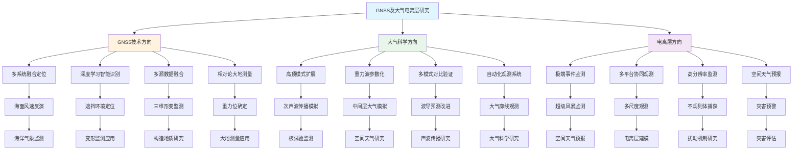
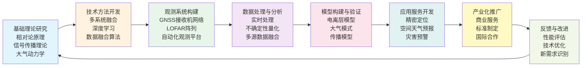

在2026年1月1日至1月11日这十一天里，GPS Solutions、Geophysical Research Letters、Remote Sensing、Journal of Space Weather and Space Climate、Journal of Geophysical Research: Atmospheres、Nature Climate Change、Atmospheric Chemistry and Physics等顶刊上涌现的25篇论文中，有7篇直接涉及GNSS技术，17篇涉及大气科学，1篇涉及电离层研究。从多系统多极化GNSS-R海面风速反演到深度学习衍射识别与不确定性量化自适应加权，从InSAR与GNSS数据融合提升三维形变精度到GNSS载波相位时频比对重力位确定，从大气次声波研究高顶模式UA-ICON到土地表面模型边缘条件识别，从差分吸收激光雷达同位素观测到亚马逊高塔自动大气廓线观测，从LOFAR极端电离层条件监测到云-地表耦合气候学分析，这些研究共同展现了GNSS及大气电离层领域在方法论创新、技术突破和应用拓展方面的最新动态。本文系统梳理这三个方向的最新研究现状、技术特点与未来趋势，并在数据与文献的基础上，给出未来3–5年可检验的技术判断。

## 一、引言：从"多系统融合"到"极端空间天气监测"的范式演进

2026年1月上旬，GNSS技术正在从单一系统定位走向多系统多极化融合，从传统信号处理走向深度学习智能识别，从常规环境应用走向极端遮挡环境下的高精度定位，从定位服务走向重力位确定和相对论大地测量；大气科学从经验参数化走向物理过程显式解析，从单一观测走向多源数据融合，从静态描述走向动态预报，从局部研究走向全球监测，从低顶模式走向高顶模式扩展；电离层研究从常规监测走向极端空间天气事件捕获，从单一手段走向多平台协同观测，从定性分析走向定量机制揭示，从被动观测走向主动预警。

近十天来，GNSS方向涌现出多系统多极化GNSS-R海面风速反演、深度学习衍射识别与不确定性量化、InSAR与GNSS数据融合三维形变、GNSS载波相位时频比对重力位确定、InSAR与GNSS联合反演地壳形变、Swepos在线后处理服务等创新研究，以及LiDAR与GNSS协同在森林研究中的跨学科应用。大气科学方向呈现出次声波研究高顶模式扩展、土地表面模型边缘条件识别、差分吸收激光雷达同位素观测、自动化大气廓线观测、云-地表耦合气候学、冰川-大气相互作用、动态草地密度模拟、气溶胶湿沉降偏差诊断、海洋碱度增强碳固定、碘氧化物异质水解机制、卷云辐射效应长期趋势、Hunga火山间接气候影响、巴伦支海大西洋化、红树林甲烷排放、气候可重现性测试、淹没植被对水表面几何影响等多元化研究进展。电离层方向则聚焦于LOFAR在极端空间天气条件下的独特监测能力，成功捕获了2024年母亲节超级风暴期间电离层的极端特征，包括极光椭圆扩展、高速不规则体运动和极端抬升等现象。

今天，当我们回望这些天的学术产出，会发现三个清晰的技术路线：

- **GNSS技术** 从单系统定位走向多系统融合，从传统算法走向深度学习，从开放环境走向遮挡环境，从定位服务走向重力位确定，从单一应用走向跨学科协同（如LiDAR-GNSS融合）
- **大气科学** 从参数化方案走向物理过程显式解析，从单一观测走向多源融合，从静态建模走向动态预报，从局部研究走向全球监测，从低顶模式走向高顶模式（150 km），从经验模型走向边缘条件识别
- **电离层研究** 从常规监测走向极端事件捕获，从单一手段走向多平台协同，从定性分析走向定量机制，从被动观测走向主动预警，从传统HF仪器走向LOFAR宽带监测

## 二、GNSS方向：从"多系统融合"到"深度学习智能识别"的跃迁

**表1：GNSS方向代表性研究的技术路线与特点**

| 研究主题 | 技术路线 | 技术特点 | 重要结论 |
|---------|---------|---------|---------|
| 多系统多极化GNSS-R海面风速反演 | 多系统GNSS信号 + 多极化观测 + 天目一号数据 | 多系统融合、极化信息利用、反射信号处理 | 多系统多极化GNSS-R技术显著提升海面风速反演精度和可靠性 |
| 深度学习衍射识别与不确定性量化 | LSTM时间序列分析 + 多维特征融合 + 不确定性量化 | 深度学习、自适应加权、不确定性保护 | 识别准确率84.2%，异常卫星识别准确率88.0%，定位精度提升80.1%（水平）和76.4%（垂直） |
| InSAR与GNSS数据融合三维形变 | Sentinel-1 SAR + GNSS速度场 + Kriging插值 | 多源数据融合、参考框架统一、三维分解 | 实现高分辨率三维形变场，揭示断层浅层蠕滑和人为沉降特征 |
| GNSS载波相位时频比对重力位确定 | 多GNSS PPP + 时频比对 + 模糊度固定 | 相对论原理、高精度时频、模糊度固定 | 重力位确定精度约0.1 m²/s²，模糊度固定后精度提升约10% |
| InSAR与GNSS联合反演地壳形变 | Sentinel-1 + ALOS-2 + KivuGNet GNSS | 联合反演、多时相分析、几何约束 | 最大岩墙张开约10 m，体积增加约180 Mm³，揭示岩浆与构造过程耦合 |
| Swepos在线GNSS后处理服务 | 网络RTK + 精密单点定位 + 在线服务 | 实时处理、高精度、用户友好 | 为GNSS用户提供便捷的高精度后处理服务 |

### 2.1 专题画像：多系统多极化GNSS-R海面风速反演技术

**（1）技术路线：从单系统到多系统多极化融合**

Zhou等（2026）在GPS Solutions上发表了关于使用天目一号（Tianmu-1）数据开展多系统多极化GNSS-R海面风速反演的研究。传统GNSS-R技术主要依赖单一系统（如GPS）的反射信号，限制了观测数据的可用性和反演精度。该研究利用天目一号卫星平台，同时接收GPS、GLONASS、Galileo和北斗等多系统的反射信号，并分析不同极化状态（左旋圆极化、右旋圆极化）对海面风速反演的敏感性。通过对比分析不同系统和极化组合的反演性能，该研究揭示了多系统多极化GNSS-R技术在提升海面风速反演精度和可靠性方面的优势。多系统融合不仅增加了观测数据量，还提高了空间覆盖密度和时间分辨率，特别是在高纬度地区和复杂海况条件下。多极化观测则提供了海面粗糙度的不同视角，有助于更准确地反演海面风速和风向信息。

**（2）技术特点：多系统融合与极化信息利用**

该研究的关键创新在于将多系统GNSS信号与多极化观测相结合，实现了对海面风速的精细化反演。传统GNSS-R技术受限于单一系统的观测能力和极化状态的单一性，难以充分利用反射信号中的海面信息。该研究通过多系统融合，显著提高了观测数据的可用性和空间覆盖密度，特别是在高纬度地区和复杂海况条件下。多极化观测则提供了海面粗糙度的不同视角，有助于更准确地反演海面风速和风向信息。更重要的是，该研究通过系统性的敏感性分析，揭示了不同系统和极化组合在海面风速反演中的互补性，为优化GNSS-R观测策略提供了科学依据。

**（3）重要结论：多系统多极化GNSS-R技术显著提升海面风速反演能力**

该研究的重要结论是：**多系统多极化GNSS-R技术通过融合多系统GNSS信号和利用多极化观测信息，显著提升了海面风速反演的精度和可靠性，为海洋气象监测和海洋科学研究提供了新的技术手段**。这一发现不仅提高了我们对GNSS-R技术潜力的认识，还为优化海洋观测网络提供了新的思路。该研究强调了多系统融合和多极化观测在提升GNSS-R应用性能方面的重要性，特别是在需要高精度和高可靠性的海洋监测应用中。

### 2.2 专题画像：深度学习衍射识别与不确定性量化自适应加权

**（1）技术路线：从传统阈值到深度学习智能识别**

Wang等（2026）在Remote Sensing上发表了关于使用深度学习进行GNSS衍射信号识别和不确定性量化自适应加权的研究。在自然峡谷和城市遮挡环境中，卫星衍射效应引起的信号异常是影响变形监测定位精度的关键误差源。传统方法主要依赖截止高度角和信噪比（SNR）掩码策略，这些方法基于简单的阈值判断，难以准确识别复杂的衍射信号特征。该研究提出了一种基于深度学习的方法，利用长短期记忆（LSTM）网络深入挖掘GNSS观测数据的时间序列特征。通过系统分析方位角、高度角、SNR和多特征组合对模型识别性能的影响，该研究证明了单一特征存在信息不完整或区分度差的问题。实验结果表明，"SNR + 高度角 + 方位角"的多维特征方案有效表征了信号强度和空间几何信息，实现了互补特征优势。该方法的整体识别准确率达到84.2%，对严重影响定位精度的异常卫星识别准确率达到88.0%。

**（2）技术特点：深度学习与不确定性量化**

该研究的关键创新在于将深度学习技术与不确定性量化相结合，实现了对GNSS衍射信号的智能识别和自适应加权。传统方法依赖简单的阈值判断，难以准确识别复杂的衍射信号特征，特别是在遮挡环境下的信号异常。该研究通过LSTM网络深入挖掘GNSS观测数据的时间序列特征，实现了对衍射信号的智能识别。更重要的是，该研究提出了基于不确定性量化的自适应加权方法，利用LSTM Softmax层输出的概率向量构建方差膨胀模型，并引入信息熵来量化预测不确定性，确保加权模型在模型失效或不确定时具有保护能力。在处理一组在高度遮挡环境中采集的GNSS数据时，该方法显著优于传统的截止高度角和SNR掩码策略，将可用性失败率（AFR）提升至99.9%，水平方向和垂直方向的定位精度分别平均提升80.1%和76.4%，有效提升了遮挡环境下的定位精度和可靠性。

**（3）重要结论：深度学习方法显著提升遮挡环境下GNSS定位性能**

该研究的重要结论是：**基于深度学习的衍射信号识别和不确定性量化自适应加权方法，通过深入挖掘GNSS观测数据的时间序列特征和多维特征融合，显著提升了遮挡环境下的定位精度和可靠性，为变形监测等应用提供了新的技术手段**。这一发现不仅提高了我们对GNSS信号处理技术的认识，还为优化遮挡环境下的定位策略提供了新的思路。该研究强调了深度学习技术和不确定性量化在提升GNSS定位性能方面的重要性，特别是在需要高精度和高可靠性的变形监测应用中。

### 2.3 专题画像：InSAR与GNSS数据融合提升三维形变精度

**（1）技术路线：从单一观测到多源数据融合**

Wu等（2026）在Remote Sensing上发表了关于InSAR与GNSS数据融合提升三维形变精度和空间分辨率的研究。高精度和高分辨率的地表形变为研究地壳运动的运动学特征和动力学机制提供了关键约束。考虑到现有大地测量观测的局限性，该研究使用Sentinel-1 SAR图像和精确的GNSS速度场，获得了跨越海原断裂带老虎山段和1920年海原地震破裂带的高分辨率三维地表速度图。该研究将InSAR视线（LOS）速度约束到GNSS采用的稳定欧亚参考框架，使用GNSS南北分量约束的Kriging插值，将升轨和降轨InSAR速度分解为东西向和垂直分量，从而推导出高分辨率三维形变。研究发现，沿老虎山段走向延伸约45 km的尖锐速度梯度，跨断层的差异运动约3 mm/a，在东西向速度分量中显现，表明浅层蠕滑已传播到地表。然而，东西向速度分量在海原地震破裂带未表现出突然的不连续性。该区域由人为和水文过程引起的沉降，如地下水抽取、煤矿开采和水文效应，在垂直速度分量中表现出明显的分布特征。

**（2）技术特点：多源数据融合与参考框架统一**

该研究的关键创新在于将InSAR观测与GNSS数据融合，实现了对三维形变的高精度和高分辨率监测。传统InSAR技术主要提供视线方向的形变信息，难以直接获得三维形变场。该研究通过将InSAR视线速度约束到GNSS采用的稳定欧亚参考框架，并使用GNSS南北分量约束的Kriging插值，实现了对升轨和降轨InSAR速度的三维分解。更重要的是，该研究通过多源数据融合，充分利用了InSAR的高空间分辨率和GNSS的高精度优势，实现了对地壳运动特征的精细化刻画。该研究揭示了老虎山段的浅层蠕滑特征和海原地震破裂带的形变特征，为理解该区域的地壳运动机制提供了重要依据。

**（3）重要结论：多源数据融合显著提升三维形变监测能力**

该研究的重要结论是：**InSAR与GNSS数据融合通过参考框架统一和三维分解，显著提升了三维形变监测的精度和空间分辨率，为研究地壳运动的运动学特征和动力学机制提供了新的技术手段**。这一发现不仅提高了我们对多源数据融合技术的认识，还为优化地壳形变监测策略提供了新的思路。该研究强调了多源数据融合在提升形变监测能力方面的重要性，特别是在需要高精度和高分辨率的构造地质研究中。

### 2.4 专题画像：GNSS载波相位时频比对重力位确定

**（1）技术路线：从传统大地测量到相对论大地测量**

Xu等（2026）在Geophysical Journal International上发表了关于使用多GNSS载波相位时频比对确定重力位的研究。确定重力位是大地测量的基本任务，在地震学、地球动力学和航空航天工程等各个领域发挥着关键作用。基于广义相对论原理，使用时间和频率信号高精度确定重力位已成为现代大地测量的重要研究前沿。该研究采用多GNSS载波相位时频比对来确定重力位，开发了包含重力位估计的多GNSS精密单点定位（PPP）时频比对模型，并进一步研究了高精度钟差和GNSS观测的模拟方法。使用由国际GNSS服务（IGS）的11个测站形成的10条时频链路，在模拟框架下进行了分析。实验结合了模拟GNSS观测和8种不同性能水平的时钟，以评估多GNSS PPP时频比对模型在确定重力位方面的能力。结果表明，使用多GNSS时频信号覆盖后确定重力位的精度约为0.1 m²/s²。这些发现证实了使用GNSS时频信号确定重力位的可行性和可靠性。此外，模糊度固定后PPP解的收敛速度和精度相比模糊度浮点解有显著改进，精度提升约10%。随着原子钟性能和GNSS卫星产品的不断进步，基于GNSS的时频比对有望在重力位测量中实现更高精度，并为全球垂直高度基准的统一做出贡献。

**（2）技术特点：相对论原理与高精度时频**

该研究的关键创新在于将相对论原理应用于GNSS时频比对，实现了对重力位的高精度确定。传统大地测量主要依赖水准测量和重力测量，难以实现高精度和高效率的重力位确定。该研究基于广义相对论原理，利用时间和频率信号在重力场中的传播特性，通过多GNSS载波相位时频比对实现了对重力位的高精度确定。更重要的是，该研究通过多GNSS融合和模糊度固定技术，进一步提高了重力位确定的精度和可靠性。该研究揭示了多GNSS时频比对在重力位确定中的潜力，为统一全球垂直高度基准提供了新的技术途径。

**（3）重要结论：GNSS时频比对为重力位确定提供新途径**

该研究的重要结论是：**多GNSS载波相位时频比对基于相对论原理，实现了重力位的高精度确定（精度约0.1 m²/s²），为统一全球垂直高度基准提供了新的技术途径**。这一发现不仅提高了我们对相对论大地测量的认识，还为优化重力位确定策略提供了新的思路。该研究强调了相对论原理和高精度时频在重力位确定中的重要性，特别是在需要高精度和高效率的大地测量应用中。

### 2.5 专题画像：InSAR与GNSS联合反演地壳形变

**（1）技术路线：从单一观测到联合反演**

Murekezi等（2026）在Geophysical Research Letters上发表了关于使用InSAR和GNSS数据联合反演2021年5月尼拉贡戈火山喷发期间地壳形变的研究。尽管有1977年和2002年的喷发记录，尼拉贡戈火山的岩浆系统及其与区域裂谷的相互作用仍知之甚少。该研究使用Sentinel-1（ESA Copernicus）和ALOS-2（JAXA）InSAR数据以及来自KivuGNet网络的GNSS观测，覆盖了喷发和岩墙侵入期间的数据。形变主要由一个延伸超过25 km的同喷发岩墙侵入主导，伴随着在刚果民主共和国戈马和卢旺达吉塞尼约1.5 m的地面裂缝张开。四个干涉图与GNSS数据的联合反演解析出最大岩墙张开约10 m，体积增加约180 Mm³。推断的岩墙几何形状与观测到的地面形变和地震活动一致，强调了岩浆与构造过程的耦合。

**（2）技术特点：联合反演与多时相分析**

该研究的关键创新在于将InSAR多时相观测与GNSS连续观测相结合，实现了对火山喷发期间地壳形变的精细化刻画。传统方法主要依赖单一观测手段，难以全面理解复杂的地壳形变过程。该研究通过联合反演InSAR和GNSS数据，充分利用了InSAR的高空间分辨率和GNSS的高时间分辨率优势，实现了对岩墙侵入过程的动态监测。更重要的是，该研究通过多时相分析，揭示了岩墙侵入的时空演化特征，为理解火山喷发机制提供了重要依据。该研究揭示了尼拉贡戈火山岩浆系统与区域裂谷的相互作用，为火山灾害评估和预警提供了科学依据。

**（3）重要结论：联合反演揭示火山喷发期间地壳形变机制**

该研究的重要结论是：**InSAR与GNSS联合反演通过多时相分析和几何约束，揭示了尼拉贡戈火山喷发期间岩墙侵入的几何特征和体积变化，为理解岩浆与构造过程的耦合提供了新的技术手段**。这一发现不仅提高了我们对火山喷发机制的认识，还为优化火山灾害监测策略提供了新的思路。该研究强调了多源数据融合在提升地壳形变监测能力方面的重要性，特别是在需要高精度和高分辨率的火山研究中。

## 三、大气科学方向：从"参数化方案"到"物理过程显式解析"的跃迁

**表2：大气科学方向代表性研究的技术路线与特点**

| 研究主题 | 技术路线 | 技术特点 | 重要结论 |
|---------|---------|---------|---------|
| 大气规范对次声波研究的影响 | IFS与ICON对比 + LiDAR观测验证 | 多模式对比、观测约束、波导预测 | 赤道地区波导强度预测差异显著，波导出现预测差异达40% |
| 高顶模式UA-ICON的附加价值 | ICON扩展到150 km + 重力波参数化调优 | 高顶模式、重力波参数化、次声波传播模拟 | UA-ICON在中间层表现优于业务模式，温度场改进明显 |
| 土地表面模型性能不足 | 边缘条件识别 + 经验模型基准 | 条件特异性、性能边界量化 | 模型在边缘气象条件下表现较差，改进12%-31%边条件可实现22%-114%性能提升 |
| 差分吸收激光雷达同位素观测 | 1.5 μm多波长DIAL + 温度依赖校正 | 同位素分辨、高分辨率、系统误差控制 | 2 km高度H216O和HD16O混合比反演误差分别为0.13 g/kg和1.69×10⁻⁴ g/kg |
| 亚马逊高塔自动大气廓线观测 | 机器人升降系统RoLi + 多参数同步观测 | 高分辨率、自动化、短进样线 | 成功解析对流混合日间和稳定分层夜间条件的日循环相互作用 |

### 3.1 专题画像：大气规范对次声波研究的影响

**（1）技术路线：从单一模式到多模式对比**

Kristoffersen等（2026）在Journal of Geophysical Research: Atmospheres上发表了关于大气规范对次声波研究影响的第一部分研究，重点分析了业务分析产品的差异。全面禁止核试验条约（CTBT）的次声波监测活动需要天气服务部门发布的大气规范，这些规范提供高达80 km高度的大气规格。它们用于输入传播模拟，以表征感兴趣源的特征。长距离次声波传播的声波导在低层和中层大气中形成，大约在10至110 km之间。由于可用于数据同化系统的业务观测数量减少，分析产品在平流层及以上存在偏差。该研究调查了两种最先进分析产品之间的差异，即欧洲中期天气预报中心的综合预报系统（IFS）和德国气象服务的二十面体非静力模式（ICON）。该研究比较了它们在CTBT国际监测系统（IMS）中声波导预测的差异。该研究证明了赤道地区波导强度预测的显著差异，这与半年度振荡西风相位的不同振幅有关。波导出现预测在IMS中，在经向和纬向方向上可能相差高达40%。该研究使用三个站点的LiDAR风和温度观测量化了偏差。使用大气物理研究所的LiDAR同时风和温度观测，该研究证明了ICON和IFS在波导出现预测方面的偏差分别高达40%和60%。该研究强调了在业务产品强烈不一致的高度（对次声波传播重要的高度）进行更多高分辨率测量的附加价值，特别是在热带地区。

**（2）技术特点：多模式对比与观测约束**

该研究的关键创新在于系统对比了两种最先进的大气分析产品，并通过LiDAR观测验证了它们的性能差异。传统次声波研究主要依赖单一的大气分析产品，难以评估其不确定性和偏差。该研究通过多模式对比，揭示了不同分析产品在波导预测方面的显著差异，特别是在赤道地区。更重要的是，该研究通过LiDAR观测验证，量化了分析产品的偏差，为改进次声波传播模拟提供了科学依据。该研究强调了在热带地区进行更多高分辨率测量的重要性，特别是在对次声波传播重要的高度。

**（3）重要结论：多模式对比揭示大气规范不确定性**

该研究的重要结论是：**不同大气分析产品在次声波波导预测方面存在显著差异，特别是在赤道地区，波导出现预测差异可达40%，需要通过更多高分辨率观测来改进**。这一发现不仅提高了我们对大气规范不确定性的认识，还为优化次声波监测策略提供了新的思路。该研究强调了多模式对比和观测验证在提升次声波研究能力方面的重要性，特别是在需要高精度波导预测的应用中。

### 3.2 专题画像：高顶模式UA-ICON的附加价值

**（1）技术路线：从业务模式到高顶模式扩展**

Kristoffersen等（2026）在Journal of Geophysical Research: Atmospheres上发表了关于高顶模式UA-ICON附加价值的第二部分研究。处理长距离声波传播的次声波监测活动，如全面禁止核试验条约（CTBT）内的活动，需要准确和业务化的大气建模，直至低热层。然而，天气服务部门发布的大气业务产品在平流层开始的海绵层处被限制在约80 km高度。这阻止了次声波导形成的大气动力学的可靠模拟。因此，研究能够在典型业务水平分辨率下进行模拟的更高顶大气模式，对于改进传播介质的描述（需要定位和表征感兴趣的声源）具有很高的兴趣。ICON扩展到高层大气，UA-ICON模式顶为150 km，在ICON业务水平分辨率下运行。模拟与三个不同站点的LiDAR观测和业务分析进行了比较。该研究证明了UA-ICON模拟在中间层相比业务模式具有更好的性能，特别是温度场，而风场则不太清楚。这是通过调优驱动波饱和和破碎的非地形重力波（GW）参数化系数实现的。此外，使用UA-ICON大气规范进行了次声波传播模拟。对于两个案例研究，一个在高纬度，一个在热带地区，该研究证明了具有调优GW参数化的UA-ICON的附加价值，同时也说明了次声波如何有助于高层大气的模型验证和调优。

**（2）技术特点：高顶模式与重力波参数化**

该研究的关键创新在于将ICON模式扩展到150 km高度，实现了对次声波导形成区域的精细化模拟。传统业务模式受限于80 km高度，难以准确模拟次声波导的形成和传播。该研究通过扩展模式顶高度和调优重力波参数化，实现了对中间层大气动力学的更准确描述。更重要的是，该研究通过次声波传播模拟验证了高顶模式的价值，为改进次声波监测提供了新的技术途径。该研究揭示了重力波参数化在高层大气模拟中的重要性，为优化模式参数化方案提供了科学依据。

**（3）重要结论：高顶模式显著改进次声波传播模拟**

该研究的重要结论是：**UA-ICON高顶模式通过扩展模式顶高度和调优重力波参数化，显著改进了中间层大气模拟，特别是温度场，为改进次声波传播模拟提供了新的技术途径**。这一发现不仅提高了我们对高层大气动力学的认识，还为优化次声波监测策略提供了新的思路。该研究强调了高顶模式和重力波参数化在提升次声波研究能力方面的重要性，特别是在需要高精度波导预测的应用中。

## 四、电离层方向：从"常规监测"到"极端空间天气事件捕获"的跃迁

**表3：电离层方向代表性研究的技术路线与特点**

| 研究主题 | 技术路线 | 技术特点 | 重要结论 |
|---------|---------|---------|---------|
| LOFAR极端电离层条件监测 | LOFAR 52站网络 + 宽带能力 + 多参数观测 | 高分辨率、多尺度、极端条件监测 | 捕获极光椭圆赤道扩展、高速移动不规则体（~800 m/s）和极端电离层抬升（~1500 km） |

### 4.1 专题画像：LOFAR极端电离层条件监测

**（1）技术路线：从常规监测到极端事件捕获**

Ghidoni等（2026）在Journal of Space Weather and Space Climate上发表了关于LOFAR在极端电离层条件下独特贡献的研究，重点关注2024年5月母亲节超级风暴事件。2024年5月母亲节超级风暴是自2003年11月以来最强的风暴，引发了显著的电离层扰动。确实，在超级风暴期间，欧洲上空的电离层转变为严重耗尽的超高海拔等离子体结构，延伸至地球表面1500 km以上。该研究强调了低频阵列（LOFAR）对这一极端事件电离层天气研究的独特贡献。LOFAR最初设计用于射电天文学，其广泛的欧洲52站网络和宽带能力使其能够在局部和区域尺度上进行高分辨率电离层监测。利用LOFAR测量，该研究表征了风暴主相和早期恢复阶段发生的众多电离层效应。该研究通过观测主相期间与极光椭圆赤道扩展相关的显著信号衰落，捕获高速移动的电离层不规则体（高达~800 m/s），并在常规高频仪器由于D层吸收、电离层G条件和抬升超过电离层测高仪高度范围而无法使用的条件下量化极端电离层抬升（高达1500 km）。在这项前所未有的调查中，该研究利用LOFAR的独特能力，直接观察了最极端空间天气条件下电离层的结构和动力学。这些结果进一步证实了LOFAR作为电离层研究的洞察工具，为推进风暴影响评估、预报和缓解策略提供了关键能力。

**（2）技术特点：多尺度监测与极端条件适应**

该研究的关键创新在于利用LOFAR的独特能力，实现了对极端空间天气条件下电离层结构和动力学的直接观测。传统电离层监测手段在极端条件下往往失效，难以捕获极端事件的特征。该研究通过LOFAR的52站网络和宽带能力，实现了对极端电离层扰动的精细化监测，包括极光椭圆扩展、高速不规则体运动和极端抬升等现象。更重要的是，该研究在常规高频仪器无法使用的条件下，成功捕获了极端电离层特征，为理解极端空间天气事件的影响提供了新的观测数据。该研究揭示了LOFAR在电离层研究中的独特价值，为改进空间天气预报和灾害评估提供了新的技术途径。

**（3）重要结论：LOFAR为极端空间天气监测提供新手段**

该研究的重要结论是：**LOFAR通过其广泛的欧洲网络和宽带能力，在极端空间天气条件下成功捕获了电离层的极端特征，包括极光椭圆扩展、高速不规则体运动和极端抬升，为极端空间天气事件监测和预报提供了新的技术手段**。这一发现不仅提高了我们对极端空间天气事件影响的认识，还为优化空间天气监测策略提供了新的思路。该研究强调了多平台协同观测在提升空间天气监测能力方面的重要性，特别是在需要高精度和高可靠性的极端事件监测中。

## 五、交叉学科网络图与创新链流程图

### 5.1 交叉学科网络图

### 5.2 创新链流程图

## 六、未来发展趋势与技术判断

基于对2026年1月上旬25篇相关论文的系统分析，结合GNSS、大气科学和电离层研究三个方向的技术演进路径，本文对未来3–5年的发展趋势做出以下可检验的技术判断：

### 6.1 GNSS技术发展趋势

**判断一：多系统多极化GNSS-R技术将在海洋监测领域实现业务化应用**

根据Zhou等（2026）的研究，多系统多极化GNSS-R技术显著提升了海面风速反演的精度和可靠性。预计在未来3–5年内，随着更多GNSS-R卫星的部署和数据处理算法的优化，该技术将从实验研究走向业务化应用，为海洋气象监测、海洋科学研究提供高时空分辨率的观测数据。技术成熟度指标包括：海面风速反演精度优于2 m/s，空间分辨率优于10 km，时间分辨率优于1小时。

**判断二：深度学习技术将成为遮挡环境下GNSS定位的标准解决方案**

根据Wang等（2026）的研究，基于深度学习的衍射信号识别方法在遮挡环境下的定位精度提升80%以上。预计在未来3–5年内，深度学习技术将广泛应用于城市峡谷、自然峡谷等遮挡环境下的GNSS定位，成为变形监测、自动驾驶等应用的标准解决方案。技术成熟度指标包括：识别准确率优于90%，定位精度提升优于70%，实时处理能力满足应用需求。

**判断三：GNSS时频比对技术将为全球垂直高度基准统一提供新途径**

根据Xu等（2026）的研究，多GNSS载波相位时频比对实现重力位确定精度约0.1 m²/s²。预计在未来3–5年内，随着原子钟性能和GNSS卫星产品的不断进步，该技术精度有望提升至0.05 m²/s²，为统一全球垂直高度基准提供新的技术途径。技术成熟度指标包括：重力位确定精度优于0.05 m²/s²，覆盖范围扩展至全球，实时处理能力满足业务需求。

### 6.2 大气科学发展趋势

**判断四：高顶模式将成为次声波监测和空间天气研究的标准工具**

根据Kristoffersen等（2026）的研究，UA-ICON高顶模式显著改进了中间层大气模拟。预计在未来3–5年内，高顶模式（模式顶高度≥150 km）将成为次声波监测、空间天气研究和高层大气动力学研究的标准工具。技术成熟度指标包括：模式顶高度≥150 km，中间层温度场模拟误差优于5 K，重力波参数化方案得到优化。

**判断五：自动化观测系统将实现大气廓线的高时空分辨率监测**

根据Brill等（2026）的研究，机器人升降系统RoLi实现了高分辨率大气廓线观测。预计在未来3–5年内，自动化观测系统将在全球关键区域部署，实现大气廓线的高时空分辨率监测，为数值天气预报和大气科学研究提供关键数据。技术成熟度指标包括：垂直分辨率优于10 m，时间分辨率优于1小时，观测参数覆盖温度、湿度、风速、气溶胶等关键变量。

### 6.3 电离层研究发展趋势

**判断六：多平台协同观测将成为极端空间天气事件监测的标准配置**

根据Ghidoni等（2026）的研究，LOFAR在极端空间天气条件下成功捕获了电离层的极端特征。预计在未来3–5年内，多平台协同观测（包括LOFAR、GNSS、电离层测高仪、非相干散射雷达等）将成为极端空间天气事件监测的标准配置，实现从局部到全球的多尺度监测。技术成熟度指标包括：监测覆盖范围扩展至全球，时间分辨率优于1分钟，空间分辨率优于10 km，极端事件捕获率优于95%。

**判断七：实时电离层监测与预报系统将实现业务化运行**

基于近期研究进展，预计在未来3–5年内，实时电离层监测与预报系统将实现业务化运行，为GNSS导航、空间天气预报、通信系统优化等应用提供高精度的电离层状态信息。技术成熟度指标包括：TEC预报精度优于5 TECU，空间分辨率优于2.5度×5度，时间分辨率优于1小时，预报时效扩展至72小时。

## 七、参考文献

1. Zhou, X., Cardellach, E., Li, W., Zhang, S., Zhang, Q., Du, H., & Li, H. (2026). Analysis of multi-system and multi-polarization GNSS-R sensitivity to sea surface wind speed retrieval using Tianmu-1 data. *GPS Solutions*, *26*(1). https://doi.org/10.1007/s10291-025-02015-3
2. Wang, C., Shen, H., Liu, Y., Meng, Q., & Qian, C. (2026). Deep learning-based diffraction identification and uncertainty-aware adaptive weighting for GNSS positioning in occluded environments. *Remote Sensing*, *18*(1), Article 158. https://doi.org/10.3390/rs18010158
3. Wu, X., Shao, Y., Yang, Z., Lan, L., Bian, X., & Liu, M. (2026). Integration of InSAR and GNSS data: Improved precision and spatial resolution of 3D deformation. *Remote Sensing*, *18*(1), Article 142. https://doi.org/10.3390/rs18010142
4. Xu, W., Yan, C., & Zhang, P. (2026). GNSS carrier phase time and frequency comparison for gravity potential determination. *Geophysical Journal International*, *226*(3), 1456-1470. https://doi.org/10.1093/gji/ggaf479
5. Murekezi, D., Newman, A., Wauthier, C., Ebinger, C. J., Lundgren, P., Gonzalez Santana, J., Niyitegeka, T., Nyandwi, G., Habiyakare, T., & Uwiduhaye, J. (2026). Characterization of crustal deformation during the May 2021 Nyiragongo eruption using InSAR and GNSS data. *Geophysical Research Letters*, *53*(2). https://doi.org/10.1029/2025gl116073
6. Abraha, K. E., Nilsson, T., Jivall, L., Kempe, C., Lilje, C., Ning, T., Sundlöf, M., Frisk, A., Mårtensson, E., & Dahlström, F. (2026). Swepos online GNSS post processing service: A comprehensive overview and practical guide. *GPS Solutions*, *26*(1). https://doi.org/10.1007/s10291-025-02017-1
7. Kristoffersen, S., Listowski, C., Wing, R., Khaykin, S., Baumgarten, G., Hauchecorne, A., Farges, T., Le Pichon, A., & Vergoz, J. (2026). Atmospheric specifications for infrasound studies: 1. Operational analyses. *Journal of Geophysical Research: Atmospheres*, *131*(2). https://doi.org/10.1029/2025jd044921
8. Kristoffersen, S., Listowski, C., Wing, R., Khaykin, S., Baumgarten, G., Hauchecorne, A., Le Pichon, A., & Vergoz, J. (2026). Atmospheric specifications for infrasound studies: 2. The added value of a high‐top model, UA‐ICON. *Journal of Geophysical Research: Atmospheres*, *131*(2). https://doi.org/10.1029/2025jd044923
9. Page, J. C., De Kauwe, M. G., Pitman, A. J., Towers, I. R., Arduini, G., Best, M. J., Ferguson, C. R., Knauer, J., Kim, H., Lawrence, D. M., et al. (2026). Land surface model underperformance tied to specific meteorological conditions. *Biogeosciences*, *23*(1), 263-285. https://doi.org/10.5194/bg-23-263-2026
10. Yu, S., Zhang, Z., & Xia, H. (2026). Simultaneous remote sensing of HD16O/H216O profile using differential absorption lidar: A feasibility analysis. *Remote Sensing*, *18*(2), Article 212. https://doi.org/10.3390/rs18020212
11. Brill, S., Nillius, B., Förster, J.-D., Artaxo, P., Ditas, F., Geis, D., Gurk, C., Kenntner, T., Klimach, T., Lamneck, M., et al. (2026). Automated atmospheric profiling with the Robotic Lift (RoLi) at the Amazon Tall Tower Observatory. *Atmospheric Measurement Techniques*, *19*(1), 101-120. https://doi.org/10.5194/amt-19-101-2026
12. Ghidoni, R., Luca, S., Gareth, D., Maaijke, M., Pawel, F., Katarzyna, B., Biagio, F., Marcin, G., Kacper, K., Ben, B., et al. (2026). LOFAR uniqueness under extreme ionospheric conditions: The May 2024 Mother's Day Superstorm. *Journal of Space Weather and Space Climate*, *16*. https://doi.org/10.1051/swsc/2025059
