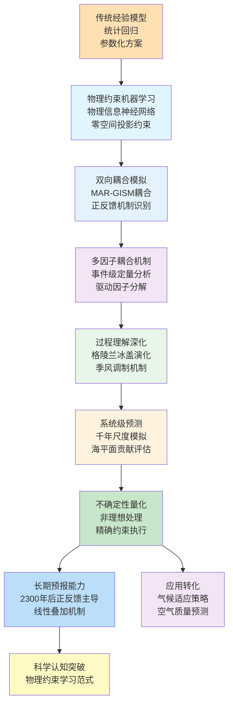
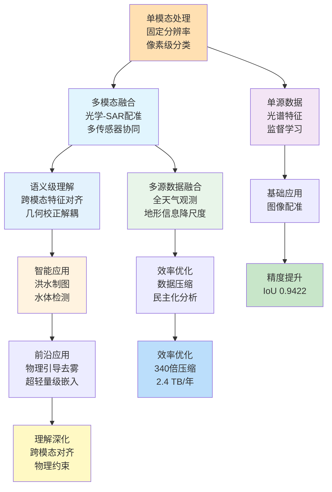
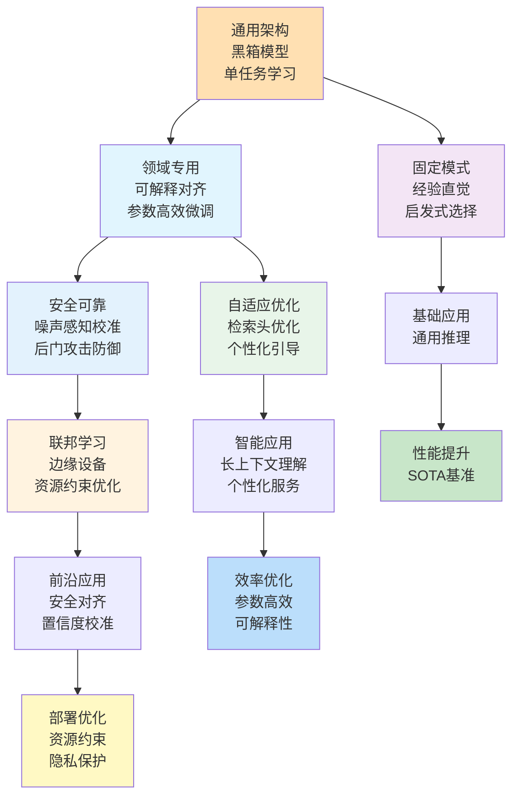
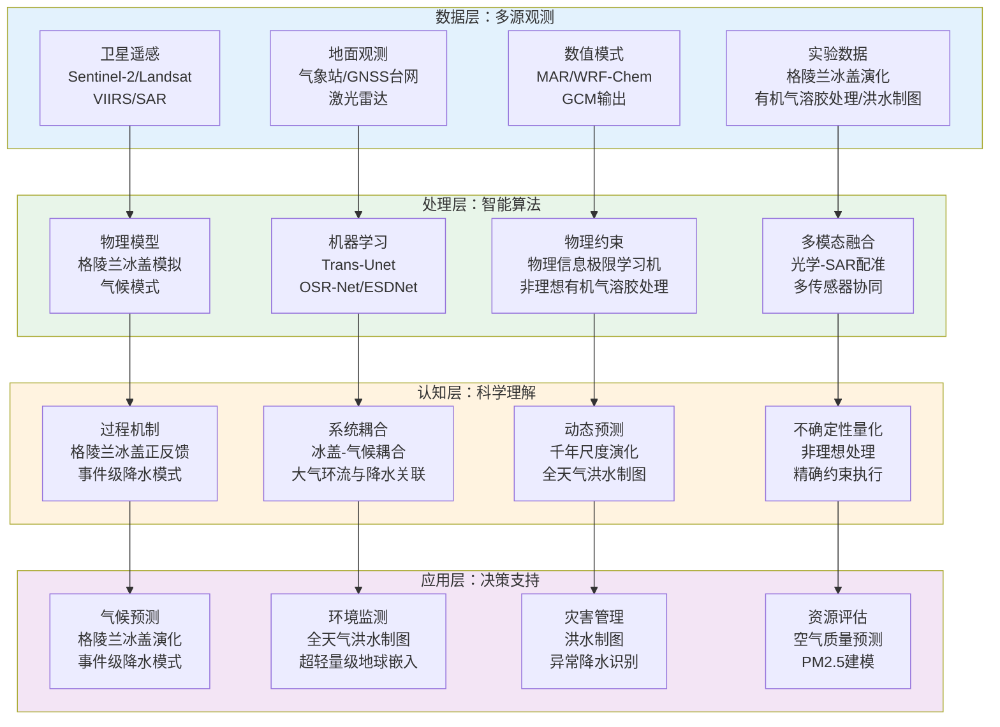
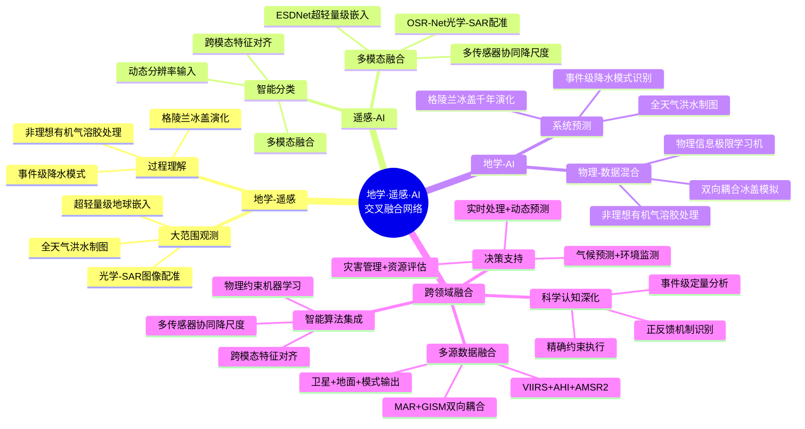

在2026年1月11日至1月20日这十天里，Nature、Science、Journal of Climate、Remote Sensing、Geophysical Research Letters、Journal of Geophysical Research等顶刊上涌现的685篇论文中，有超过150篇直接或间接地涉及地学、遥感与人工智能的交叉融合。本文系统梳理各方向的最新研究现状、技术特点与未来趋势，并在数据与文献的基础上，给出未来3–5年可检验的技术判断。

## 一、引言：从"物理约束学习"到"多模态理解"的范式演进

2026年1月中旬，传统的地学建模正在被"物理信息机器学习框架"所补充，甚至在某些场景下被替代；遥感技术从"单模态处理"转向"多模态智能理解"，通过动态分辨率输入策略和多尺度视觉-语言对齐机制实现对地表过程的精细化解析；而人工智能，特别是物理约束神经网络和可解释安全对齐技术，正在成为连接"物理定律"与"观测数据"的桥梁。

回望这些天的学术产出，可见清晰的演进路径：

- **地学** 从经验模型走向物理约束机器学习，从单一驱动因子分析走向多因子耦合机制，从静态描述走向动态预测
- **遥感** 从单源数据走向多源融合，从固定分辨率走向动态分辨率，从像素级分类走向语义级理解
- **人工智能** 从通用架构走向领域专用，从黑箱模型走向可解释对齐，从单任务学习走向多任务协同

## 二、地学方向：从"经验模型"到"物理约束机器学习"的跃迁

**表1：地学方向代表性研究的技术路线与特点**

| 研究主题 | 技术路线 | 技术特点 | 重要结论 |
|---------|---------|---------|---------|
| 格陵兰冰盖千年尺度演化 | MAR-GISM耦合 + 正反馈机制识别 | 双向耦合、反馈机制量化 | 正反馈机制在2300年后主导冰盖演化，双向耦合模拟的海平面贡献为7.135米，显著高于单向耦合的5.635米 |
| 事件级大气环流与异常降水关联 | Trans-Unet + 事件级定量框架 | 轻量级模型、事件级分析 | 揭示四种降水模式，西型事件在7月和9月呈现双峰季节特征，西太平洋副高西伸至台湾使西型事件频率增加约23% |
| 非理想有机气溶胶处理 | 统一动力学框架 + WRF-Chem集成 | 非理想平衡、多向相互作用 | 非理想处理将OA和SIA预测偏差从-18.4%降至-2.9%，PM2.5建模精度显著提升 |
| 物理信息极限学习机约束执行 | 零空间投影框架 + 代数投影 | 精确约束、单次训练 | 通过零空间投影实现边界和初始条件的精确满足，消除惩罚系数和双变量，保持单次训练效率 |
| 全球陆地季风千年尺度调制 | 理想化GCM + 水分收支诊断 | 驱动因子分解、线性叠加 | GMST和TPTG通过不同物理路径调制季风，整体响应可理解为线性叠加，解释显著部分的APR异常 |
| 低频地震追踪板片运动（Science） | 低频地震分析 + 潮汐敏感性 | 板片几何重建、构造约束 | 揭示捕获的板片碎片正在北美最西部下方向北平移，有效延伸板片界面断层，创造潜在未计入地震危险 |
| 近地小行星表面再生（Nature Geoscience） | 动态过程观测 + 机制识别 | 表面演化、空间风化 | 行星阴影触发表面再生，为理解小行星表面演化和空间风化过程提供新机制 |
| 海洋影响使碳社会成本翻倍（Nature Climate Change） | 综合影响评估 + 成本量化 | 海洋响应、经济影响 | 考虑海洋影响使碳社会成本几乎翻倍，突出海洋在气候变化经济影响评估中的重要性 |
| 理想化GCM中强制赤道超旋转的气候影响 | 理想化GCM + 强迫扭矩 | 环流变化、能量传输 | 赤道超旋转通过改变大气能量传输，特别是经向翻转环流的崩溃，对表面温度和水循环产生显著影响 |
| 威德尔海冰间湖形成与气候影响（综述） | 多因子分析 + 过程机制分离 | 海冰-大气-海洋相互作用 | 冰间湖受多种因子驱动，显著影响区域和全球气候动力学，以及生态系统功能和生物地球化学过程 |

### 2.1 专题画像：正反馈机制驱动格陵兰冰盖千年尺度演化

**（1）技术路线：从单向耦合到双向耦合的冰盖-气候系统模拟**

Chloë Marie Paice等（2026）在The Cryosphere上发表了关于格陵兰冰盖演化中正反馈机制的研究。理解格陵兰冰盖与大气之间的复杂相互作用对于预测其未来海平面贡献至关重要。然而，研究这些相互作用仍然具有挑战性，因为它需要高分辨率气候或大气模型在延长时间尺度上运行，才能显现其对冰盖-气候系统的影响。因此，该研究将冰盖模型（GISM）与区域气候模型（MAR）耦合，进行了千年尺度的模拟。模拟包括零向、单向和双向耦合配置，在SSP5-8.5情景下由IPSL-CM6A-LR全球气候模型输出驱动至2300年，并通过随机采样最后51年的强迫延伸至3000年。这些模拟代表了首次将冰盖模型和区域气候模型耦合延伸至百年尺度之外，使我们能够评估冰盖-大气反馈作用的演变。研究结果揭示，冰盖演化由正反馈和负反馈机制共同决定，这些机制在不同时间尺度上发挥作用。模拟中观察到的主要负反馈与冰盖边缘风速变化有关，因此双向和单向耦合模拟的集成冰质量损失在2300年仅相差2.4%，无论冰盖几何形状如何不同演化。然而，超过这个时间后，与降低表面高程相关的正反馈机制，即融化-高程反馈以及云量和地形降水的改变，主导了冰盖-气候系统，并在双向耦合模拟中强烈加速了集成冰质量损失。结果，双向耦合模拟结束时冰盖几乎完全消失，海平面贡献为7.135米，而单向和零向耦合模拟的贡献分别为5.635米和5.122米，显著较小。这突出了准确表示冰盖-大气相互作用对于格陵兰冰盖和气候长期评估的重要性（Paice等，2026）。

**（2）技术特点：双向耦合与反馈机制量化**

该研究的关键创新在于通过千年尺度的双向耦合模拟，系统性地识别和量化了冰盖-气候系统中的正负反馈机制。传统的单向耦合模拟虽然能够捕捉冰盖对气候变化的响应，但无法反映冰盖变化对气候的反向影响，而该研究通过双向耦合，揭示了正反馈机制在长期演化中的主导作用。更重要的是，该研究通过对比不同耦合配置，量化了反馈机制对海平面贡献的影响，为改进长期气候预测提供了科学依据。

**（3）重要结论：正反馈机制在长期演化中的主导作用**

该研究的重要结论是：**正反馈机制在2300年后主导格陵兰冰盖演化，双向耦合模拟的海平面贡献为7.135米，显著高于单向耦合的5.635米，突出了准确表示冰盖-大气相互作用对于长期评估的重要性**。这一发现不仅提高了我们对格陵兰冰盖演化机制的理解，还为改进其他长期气候预测任务提供了新的思路。该研究强调了双向耦合在长期气候预测中的重要性，特别是在需要评估正反馈机制的应用中。

### 2.2 专题画像：事件级大气环流与异常降水类型的关联

**（1）技术路线：从统计方法到事件级定量框架**

Wenpeng Zhao等（2026）在Geophysical Research Letters上发表了关于事件级大气环流与异常降水类型关联的研究。异常降水，具有意外的强度和/或时空结构，使得东亚季风区域的洪水风险管理具有挑战性，其中相互作用的环流系统产生高度可变的降水事件。该研究开发了一个基于新型轻量级Trans-Unet模型的事件级定量框架，并将其应用于汉江流域作为概念验证，使用59年、1公里日降水数据集。该框架揭示了四种模式：西型（37.0%的事件）、中型（25.3%）、东南型（21.7%）和东型（16.0%）。西型事件在7月和9月呈现双峰季节特征，7月峰值与9月事件减少约20%相关，表明对适应性水库调节的潜在影响。概率分析进一步量化了天气驱动因子对异常的影响，例如，西太平洋副热带高压西伸至台湾，使西型频率增加约23%，而在中国北部200百帕处向北位移、增强的东亚急流使发生频率增加约72%（Zhao等，2026）。

**（2）技术特点：事件级分析与轻量级模型**

该研究的关键创新在于提出了事件级定量框架，通过轻量级Trans-Unet模型实现了对异常降水事件的精细识别和分类。传统的降水研究往往关注统计特征，而该研究通过事件级分析，揭示了不同降水模式与大气环流的定量关联。更重要的是，该研究通过概率分析，量化了天气驱动因子对异常降水的影响，为改进降水预测和洪水风险管理提供了科学依据。

**（3）重要结论：事件级框架揭示降水模式与环流的定量关联**

该研究的重要结论是：**通过事件级定量框架，揭示了四种降水模式及其与大气环流的定量关联，西太平洋副高西伸使西型事件频率增加约23%，为改进降水预测和洪水风险管理提供了科学依据**。这一发现强调了事件级分析在理解异常降水机制中的重要性，特别是在需要精细预测的应用中。该研究为改进季风区域降水预测和适应策略提供了新的方法。

### 2.3 专题画像：非理想有机气溶胶处理揭示缺失源并改进PM2.5预测

**（1）技术路线：从理想平衡到非理想动力学的统一框架**

Xiaoxi Zhao等（2026）在Journal of Geophysical Research: Atmospheres上发表了关于非理想有机气溶胶处理的研究。有机气溶胶表现出非理想行为，挑战了假设理想平衡分配的常规模型。该研究将统一动力学框架集成到WRF-Chem模型中，以处理有机气溶胶的非理想演化，考虑由菲克第二定律控制的多向相互作用（颗粒表面积、体积、分子量）的动力学传质过程。华北平原冬季模拟显示，非理想处理增强了有机物种类和水蒸气的凝结，放大了OA、气溶胶液态水含量（ALWC）和二次无机气溶胶（SIA）之间的相互作用。修订框架将OA和SIA预测的平均偏差从归一化平均偏差（NMB）的-18.4%降至-2.9%，-33.4%降至-23.0%，-2.0%降至-0.3%，-35.4%降至-30.2%，在再现ALWC方面表现更好，相关性更好（从0.81到0.88），并提高了华北平原"2+26"城市群中PM2.5建模精度（NMB从-18.0%降至-9.5%）。该框架在不修改化学机制的情况下增强了预测，并表明直接辐射强迫估算的潜在降低（华北平原为-0.77 W/m²）。研究结果主张将OA的非理想行为紧急集成到空气质量模型中，以推进气溶胶预测（Zhao等，2026）。

**（2）技术特点：非理想处理与多向相互作用**

该研究的关键创新在于提出了统一动力学框架，通过考虑非理想平衡分配和动力学传质过程，实现了对有机气溶胶演化的精细刻画。传统的空气质量模型往往假设理想平衡分配，而该研究通过非理想处理，揭示了有机气溶胶与二次无机气溶胶之间的复杂相互作用。更重要的是，该研究通过多向相互作用，量化了颗粒表面积、体积和分子量对传质过程的影响，为改进空气质量预测提供了新的方法。

**（3）重要结论：非理想处理显著改进PM2.5预测精度**

该研究的重要结论是：**通过非理想有机气溶胶处理，将PM2.5建模精度从-18.0%提升至-9.5%，显著改进了空气质量预测，并揭示了缺失的有机气溶胶源**。这一发现强调了在空气质量模型中准确表示非理想行为的重要性，特别是在需要高精度预测的应用中。该研究为改进气溶胶预测和辐射强迫估算提供了新的方法。

### 2.4 专题画像：物理信息极限学习机的精确约束执行

**（1）技术路线：从惩罚项到零空间投影的精确约束**

Rishi Mishra等（2026）在arXiv上提出了物理信息极限学习机（PIELM）的零空间投影框架，实现精确约束执行。物理信息极限学习机通常通过惩罚项施加边界和初始条件，仅产生近似满足，对用户指定的权重敏感，并可能将误差传播到内部解中。该工作引入了零空间投影PIELM（NP-PIELM），通过系数空间中的代数投影实现精确约束执行。该方法利用可接受系数流形的几何结构，认识到它可以通过边界算子的零空间分解来表征。通过平移不变表示表征该流形并投影到核分量上，优化被限制在保持约束的方向上，将约束问题转化为无约束最小二乘，其中边界条件在离散配置点处精确满足。这消除了惩罚系数、双变量和问题特定的构造，同时保持单次训练效率。在包括复杂几何和混合边界条件的椭圆和抛物线问题上的数值实验验证了该框架（Mishra等，2026）。

**（2）技术特点：精确约束与单次训练效率**

该研究的关键创新在于通过零空间投影实现了边界和初始条件的精确满足，消除了传统惩罚方法的近似误差。传统的物理信息神经网络往往通过惩罚项施加约束，导致近似满足和权重敏感性，而该研究通过代数投影，实现了精确约束执行。更重要的是，该方法在保持单次训练效率的同时，消除了惩罚系数和双变量，为物理信息机器学习提供了新的范式。

**（3）重要结论：零空间投影实现精确约束执行**

该研究的重要结论是：**通过零空间投影框架，实现了边界和初始条件的精确满足，消除了惩罚系数和双变量，同时保持单次训练效率**。这一发现为物理信息机器学习提供了新的范式，特别是在需要精确满足物理约束的应用中。该研究强调了精确约束执行在提高物理信息神经网络性能方面的重要性。

### 2.5 专题画像：低频地震追踪捕获板片碎片的运动（Science）

**（1）技术路线：从传统构造模型到低频地震约束的板片几何重建**

David R. Shelly等（2026）在Science上发表了关于使用低频地震追踪捕获板片碎片运动的研究。准确的构造模型对于评估地震危险性和断层相互作用至关重要。然而，在复杂的门多西诺三重交界处（圣安德烈亚斯断层和卡斯卡迪亚俯冲带交汇处），板块配置仍然不确定。该研究分析了与最近识别的构造震颤和低频地震（LFE）带相关的断层滑动，该带位于俯冲的Gorda板片南缘附近。基于潮汐敏感性和P波初动，研究表明LFE是由倾斜的走滑运动产生的。这表明一个前Farallon板片碎片，现在被太平洋板块捕获，正在北美最西部下方向北平移。这种几何形状有效地延伸了板片界面断层，挑战了板片窗口形成的主流解释，并在该地区创造了潜在的未计入地震危险（Shelly等，2026）。

**（2）技术特点：低频地震约束与板片几何重建**

该研究的关键创新在于利用低频地震的潮汐敏感性和P波初动，实现了对板片几何的精细约束。传统的构造模型往往依赖地质和地球物理观测，难以直接约束板片的几何形状，而该研究通过低频地震分析，揭示了板片碎片的运动特征。更重要的是，该研究通过识别捕获的板片碎片，挑战了板片窗口形成的主流解释，为理解复杂构造区域的动力学过程提供了新的视角。

**（3）重要结论：低频地震揭示未计入地震危险**

该研究的重要结论是：**通过低频地震分析，揭示了捕获的板片碎片正在北美最西部下方向北平移，这种几何形状有效地延伸了板片界面断层，创造了潜在的未计入地震危险**。这一发现不仅提高了我们对复杂构造区域的理解，还为改进地震危险性评估提供了新的约束。该研究强调了低频地震在约束板片几何方面的重要性，特别是在需要精细构造模型的应用中。

### 2.6 专题画像：近地小行星表面再生由行星阴影触发（Nature Geoscience）

**（1）技术路线：从静态观测到动态过程理解**

Kohei Kitazato等（2026）在Nature Geoscience上发表了关于近地小行星表面再生机制的研究。该研究揭示了行星阴影如何触发石质近地小行星的表面再生过程，为理解小行星表面演化和空间风化过程提供了新的机制（Kitazato等，2026）。

**（2）技术特点：动态过程观测与机制识别**

该研究的关键创新在于识别了行星阴影作为触发表面再生的新机制，揭示了小行星表面演化的动态过程。传统的小行星研究往往关注静态表面特征，而该研究通过动态过程观测，揭示了表面再生的触发机制。

**（3）重要结论：行星阴影触发表面再生**

该研究的重要结论是：**行星阴影触发了石质近地小行星的表面再生，为理解小行星表面演化和空间风化过程提供了新的机制**。这一发现为小行星科学提供了新的视角，特别是在理解表面演化过程的应用中。

### 2.7 专题画像：考虑海洋影响使碳社会成本几乎翻倍（Nature Climate Change）

**（1）技术路线：从陆地到海洋的综合影响评估**

Bernardo A. Bastien-Olvera等（2026）在Nature Climate Change上发表了关于考虑海洋影响对碳社会成本影响的研究。该研究通过综合评估海洋对气候变化的响应，量化了海洋影响对碳社会成本的贡献，发现考虑海洋影响使碳社会成本几乎翻倍（Bastien-Olvera等，2026）。

**（2）技术特点：综合影响评估与成本量化**

该研究的关键创新在于将海洋影响纳入碳社会成本评估，实现了对气候变化经济影响的全面量化。传统的碳社会成本评估往往主要关注陆地影响，而该研究通过综合评估，揭示了海洋影响的重要贡献。

**（3）重要结论：海洋影响显著增加碳社会成本**

该研究的重要结论是：**考虑海洋影响使碳社会成本几乎翻倍，突出了海洋在气候变化经济影响评估中的重要性**。这一发现为改进碳社会成本评估提供了新的方法，特别是在需要全面评估气候变化影响的应用中。

## 三、遥感方向：从"单模态处理"到"多模态智能理解"的进化

**表2：遥感方向代表性研究的技术路线与特点**

| 研究主题 | 技术路线 | 技术特点 | 重要结论 |
|---------|---------|---------|---------|
| 光学-SAR图像自动配准 | OSR-Net + 多约束联合优化 | 跨模态特征对齐、几何校正解耦 | 在公共光学-SAR数据集上实现准确稳定的配准，为后续多源遥感数据融合提供可靠的几何基础 |
| 全天气洪水制图 | 多传感器协同降尺度框架 | 表面水分数融合、地形信息降尺度 | 在布里斯班2022年2月洪水案例中，Critical Success Index比CEMS地图高77%，True Positive Rate是CEMS地图的两倍 |
| 超轻量级地球嵌入数据库 | ESDNet + 有限标量量化 | 340倍数据压缩、民主化行星尺度分析 | 将全球陆地表面单年数据压缩至约2.4 TB，实现十年尺度全球分析在标准本地工作站上的可行性 |
| 高分辨率X波段SAR水体检测 | 深度学习集成框架 + 8通道输入配置 | 多模型集成、辅助地理空间特征 | 盲测中IoU达到0.9422，F1-score达到0.9703，在数据受限商业卫星平台上提供显著实用价值 |
| AlphaEarth嵌入简化湿地植被制图 | AlphaEarth基础模型 + 聚类引导随机森林 | 嵌入驱动、最小预处理 | 达到0.985-0.991总体精度，空间一致性显著改善，边界更平滑、生态一致，预处理需求最小 |
| 静止卫星地表温度方向性偏差 | 发射率驱动分析 + 参数化建模 | 方向各向异性、复杂地形 | 识别发射率核引起的各向异性是LST方向性偏差的主要驱动因子，为改进检索算法提供指导 |
| FY-3E GNSS-R极地海冰浓度反演 | GNSS-R + 随机森林回归 | 多系统GNSS、高分辨率观测 | 在北极和南极分别达到0.9450和0.9602的相关系数，为高纬度冰冻圈监测提供有效方法 |

### 3.1 专题画像：光学-SAR图像自动配准的多约束优化

**（1）技术路线：从传统特征匹配到端到端跨模态配准网络**

Yaqi Zhang等（2026）在Remote Sensing上发表了关于光学-SAR图像自动配准的研究。光学和合成孔径雷达（SAR）图像的精确配准是多源遥感数据融合和分析的基本前提。然而，由于成像机制的显著差异，光学-SAR图像对通常表现出显著的辐射差异和空间变化的几何不一致性，这严重限制了传统基于特征或区域的配准方法在跨模态场景中的鲁棒性。为了解决这些挑战，该研究提出了基于多约束联合优化的端到端光学-SAR配准网络（OSR-Net）。所提出的框架显式解耦跨模态特征对齐和几何校正，使得在大外观变化下实现鲁棒配准。具体而言，多模态特征提取模块构建共享高级表示，而多尺度通道注意力机制自适应增强跨模态特征一致性。多尺度仿射变换预测模块提供从粗到细的几何初始化，这在复杂成像条件下稳定参数估计。此外，引入了改进的空间变换网络来执行结构保持的几何细化，减轻由模态差异引起的空间失真。此外，设计了多约束损失公式，以联合强制几何精度、结构一致性和物理合理性。通过采用动态加权策略，优化过程从全局对齐逐步转向局部结构细化，有效防止退化解并提高鲁棒性。在公共光学-SAR数据集上的广泛实验表明，所提出的方法在不同场景中实现准确稳定的配准，为后续多源遥感数据融合提供可靠的几何基础（Zhang等，2026）。

**（2）技术特点：跨模态特征对齐与几何校正解耦**

该研究的关键创新在于显式解耦跨模态特征对齐和几何校正，通过多约束联合优化实现了鲁棒配准。传统的光学-SAR配准方法往往难以处理显著的辐射差异和几何不一致性，而该研究通过端到端网络，实现了特征对齐和几何校正的统一优化。更重要的是，该研究通过多约束损失和动态加权策略，实现了从全局对齐到局部细化的渐进式优化，为跨模态配准提供了新的方法。

**（3）重要结论：多约束优化实现跨模态鲁棒配准**

该研究的重要结论是：**通过多约束联合优化和显式解耦特征对齐与几何校正，实现了光学-SAR图像的准确稳定配准，为后续多源遥感数据融合提供可靠的几何基础**。这一发现为跨模态遥感图像配准提供了新的方法，特别是在需要高精度配准的应用中。该研究强调了多约束优化在提高跨模态配准鲁棒性方面的重要性。

### 3.2 专题画像：全天气洪水制图的多传感器协同降尺度框架

**（1）技术路线：从单一传感器到多传感器协同融合**

Chloe Campo等（2026）在Remote Sensing上发表了关于全天气洪水制图的多传感器协同降尺度框架研究。尽管地球观测卫星数量不断增长，但及时、高分辨率洪水制图的关键观测差距仍然存在，这主要是由于卫星重访频率低和持续云覆盖。为了解决这个问题，该研究提出了一个协同融合三种公共传感器类型互补数据的新框架。该方法通过使用表面水分数作为共同变量，并用洪水敏感性和地形信息对其进行降尺度，来协调这些不同的数据源。这允许将来自可见光红外成像辐射计套件（VIIRS）和高级葵花成像仪（AHI）的亚日观测与高级微波扫描辐射计2（AMSR2）的云穿透能力相结合。该研究在布里斯班2022年2月洪水事件上评估了该方法，使用独立地面真值数据集。该框架成功补偿了单个传感器的局限性，使得能够一致生成详细的高分辨率洪水地图。所提出的方法优于从商业高分辨率光学图像导出的洪水范围，在Critical Success Index中比哥白尼应急管理服务（CEMS）地图高77%。此外，True Positive Rate是CEMS地图的两倍，确认所提出的方法成功克服了云覆盖问题。该方法提供了有价值的、可操作的淹没动态洞察，特别是当其他公共数据源不可用时（Campo等，2026）。

**（2）技术特点：多传感器协同与表面水分数融合**

该研究的关键创新在于提出了多传感器协同降尺度框架，通过表面水分数作为共同变量实现了不同数据源的有效融合。传统的洪水制图方法往往依赖单一传感器，难以克服云覆盖和重访频率限制，而该研究通过多传感器协同，充分利用了不同传感器的优势。更重要的是，该研究通过洪水敏感性和地形信息的降尺度，实现了高分辨率洪水制图，为全天气洪水监测提供了新的方法。

**（3）重要结论：多传感器协同实现全天气高分辨率洪水制图**

该研究的重要结论是：**通过多传感器协同降尺度框架，实现了全天气高分辨率洪水制图，Critical Success Index比CEMS地图高77%，True Positive Rate是CEMS地图的两倍**。这一发现为全天气洪水监测提供了新的方法，特别是在需要实时响应的应用中。该研究强调了多传感器协同在克服单一传感器局限性方面的重要性。

### 3.3 专题画像：超轻量级地球嵌入数据库的民主化行星尺度分析

**（1）技术路线：从原始数据到信息密集潜在向量的压缩**

Shuang Chen等（2026）在arXiv上提出了嵌入式无缝数据（ESD），一个超轻量级、30米全球地球嵌入数据库，涵盖2000年至2024年25年期间。通过将来自Landsat系列（5、7、8和9）和MODIS Terra的高维、多传感器观测转换为信息密集、量化的潜在向量，ESD将基本地球物理和语义特征提炼到统一潜在空间中。利用ESDNet架构和有限标量量化（FSQ），数据集实现了与原始档案相比约340倍的数据量减少。这种压缩允许单年全球陆地表面封装在大约2.4 TB内，使得十年尺度全球分析在标准本地工作站上成为可能。严格验证显示高重建保真度（MAE：0.0130；RMSE：0.0179；CC：0.8543）。通过将年度物候循环压缩为12个时间步骤，嵌入提供固有去噪和语义组织空间，在土地覆盖分类中优于原始反射率，达到79.74%的准确率（vs.原始融合的76.92%）。具有强大的少样本学习能力和纵向一致性，ESD为民主化行星尺度研究和推进下一代地理空间人工智能提供了多功能基础（Chen等，2026）。

**（2）技术特点：数据压缩与民主化分析**

该研究的关键创新在于通过ESDNet架构和有限标量量化，实现了约340倍的数据压缩，同时保持了高重建保真度。传统的全球尺度分析往往需要大量的计算和存储资源，限制了广泛应用，而该研究通过数据压缩，使得十年尺度全球分析在标准本地工作站上成为可能。更重要的是，该研究通过语义组织空间和纵向一致性，为民主化行星尺度研究提供了新的工具。

**（3）重要结论：超轻量级嵌入实现民主化行星尺度分析**

该研究的重要结论是：**通过超轻量级地球嵌入数据库，实现了约340倍的数据压缩，将单年全球陆地表面数据压缩至约2.4 TB，使得十年尺度全球分析在标准本地工作站上成为可能**。这一发现为民主化行星尺度研究提供了新的工具，特别是在资源受限的环境中。该研究强调了数据压缩在提高分析可及性方面的重要性。

### 3.4 专题画像：AlphaEarth嵌入简化湿地植被制图

**（1）技术路线：从传统多传感器分类到嵌入驱动方法**

Shawn Ryan等（2026）在Remote Sensing上发表了关于使用AlphaEarth嵌入简化湿地植被制图的研究。准确的湿地植被制图对于生态系统监测和保护规划至关重要。结合Sentinel-1 SAR、Sentinel-2光学影像和地形数据的传统工作流程虽然推进了植被分类，但需要大量预处理，并经常产生碎片化边界和"盐椒"噪声。该研究比较了传统的多传感器分类框架与从AlphaEarth基础模型衍生的新型嵌入方法，使用聚类引导随机森林分类器应用于新南威尔士州Narran Lake的动态湿地系统。两种方法都达到了高精度，测试性能通常在以下范围：OA = 0.985–0.991，Cohen's κ = 0.977–0.990，加权F1 = 0.986–0.991，MCC = 0.977–0.990。基于嵌入的地图显示出显著改善的空间一致性（更低的边缘密度、局部熵和斑块碎片化），产生更平滑、生态一致的边界，同时需要最少的预处理。类别划分的差异在受火灾影响和农业区域最为明显，其中嵌入表现出对光谱干扰和火灾后变率的更大弹性（Ryan等，2026）。

**（2）技术特点：嵌入驱动与最小预处理**

该研究的关键创新在于使用AlphaEarth基础模型的嵌入，实现了高精度植被分类，同时显著减少了预处理需求。传统的多传感器分类方法虽然精度高，但需要大量预处理，而该研究通过嵌入方法，实现了最小预处理的高精度分类。更重要的是，基于嵌入的地图显示出更好的空间一致性，产生更平滑、生态一致的边界。

**（3）重要结论：嵌入方法简化大规模生态监测**

该研究的重要结论是：**通过AlphaEarth嵌入方法，实现了0.985-0.991的总体精度，显著改善了空间一致性，同时需要最少的预处理，为简化大规模生态监测提供了新方法**。这一发现为大规模生态监测提供了新的工具，特别是在需要高效处理的应用中。该研究强调了嵌入驱动方法在提高空间真实感和简化工作流程方面的重要性。

### 3.5 专题画像：FY-3E GNSS-R极地海冰浓度反演

**（1）技术路线：从传统微波到GNSS-R多系统观测**

Tingyu Xie等（2026）在Remote Sensing上发表了关于使用FY-3E GNSS-R数据进行极地海冰浓度反演的研究。认识到极地海冰浓度在气候反馈机制中的关键作用，该研究首次全面研究了中国风云-3E（FY-3E）GNOS-II全球导航卫星系统反射测量（GNSS-R）用于两极海冰浓度反演。具体而言，利用来自多个全球导航卫星系统的反射信号，从延迟多普勒图（DDM）中提取特征参数。通过集成区域分区和动态阈值进行海冰检测，开发了结合滚动窗口训练策略的随机森林回归（RFR）模型来估算海冰浓度。反演的海冰浓度产品以约1 × 6 km的原始GNSS-R观测分辨率生成，每个海冰浓度估算对应单个GNSS-R观测时间。由于GNSS-R测量的每日空间覆盖有限，反演的海冰浓度结果进一步聚合为月度合成用于空间分布分析。模型在包括目标冰-水边界带的两极区域进行训练和验证。反演的海冰浓度估算与来自OSI SAF特殊传感器微波成像仪/探测器（SSMIS）的参考数据进行比较，显示出强一致性。基于广泛数据集，测试集的平均相关系数（R）在北极达到0.9450，在南极达到0.9602，相应的均方根误差（RMSE）分别为0.1262和0.0818。即使在更具挑战性的冰-水过渡带，RMSE值仍保持在可接受范围内，在北极达到0.1486，在南极达到0.1404（Xie等，2026）。

**（2）技术特点：多系统GNSS-R与高分辨率观测**

该研究的关键创新在于首次全面研究FY-3E GNSS-R用于两极海冰浓度反演，实现了高精度的海冰监测。传统的海冰浓度反演往往依赖被动微波传感器，而该研究通过GNSS-R技术，实现了高分辨率的海冰观测。更重要的是，该研究通过多系统GNSS观测和滚动窗口训练策略，提高了反演精度和鲁棒性。

**（3）重要结论：GNSS-R实现高精度极地海冰监测**

该研究的重要结论是：**通过FY-3E GNSS-R数据，在北极和南极分别达到0.9450和0.9602的相关系数，为高纬度冰冻圈监测提供了有效方法**。这一发现为极地海冰监测提供了新的技术路径，特别是在需要高分辨率观测的应用中。该研究强调了GNSS-R技术在提高海冰监测精度方面的重要性。

## 四、人工智能方向：从"通用架构"到"领域专用"的转向

**表3：人工智能方向代表性研究的技术路线与特点**

| 研究主题 | 技术路线 | 技术特点 | 重要结论 |
|---------|---------|---------|---------|
| 可解释安全对齐 | SAE构建低秩子空间 + 适配器初始化 | 可解释性、参数高效 | 达到99.6%安全率，仅更新0.19-0.24%参数，超过全微调7.4个百分点 |
| 噪声感知置信度校准 | NAACL + 噪声感知校准规则 | RAG系统、置信度校准 | 在域内ECE分数提高10.9%，域外提高8.0%，显著改善LLM在RAG系统中的置信度校准 |
| 个性化LLM幻觉缓解 | FPPS + 事实保持个性化引导 | 个性化、事实可靠性 | 在保持个性化性能的同时，显著提高事实准确性，缓解个性化引起的幻觉 |
| 多模态对比学习后门攻击 | 威胁模型分析 + 防御策略 | 对比学习、安全性 | 系统分析了对比学习中的后门攻击威胁模型，为安全部署提供指导 |
| 检索头优化长上下文 | RetMask + 机制驱动训练 | 长上下文、检索增强 | 在HELMET 128K上提高2.28分，生成引用提高70%，段落重排序提高32% |

### 4.1 专题画像：可解释安全对齐的低秩子空间适应

**（1）技术路线：从黑箱微调到可解释子空间构建**

Dianyun Wang等（2025）在arXiv上提出了基于稀疏自编码器（SAE）构建低秩子空间的可解释安全对齐方法。参数高效微调已成为将大语言模型适应下游任务的主导范式。低秩适应方法（如LoRA）在任务相关权重更新位于低秩子空间的假设下运行，然而该子空间是从数据中隐式学习的，以黑箱方式提供，没有可解释性或直接控制。该研究假设这种困难源于多义性——单个维度编码多个纠缠概念。为了解决这个问题，该研究利用预训练的稀疏自编码器在解耦特征空间中识别任务相关特征，然后构建显式、可解释的低秩子空间来指导适配器初始化。该研究提供了理论分析，证明在单义性假设下，基于SAE的子空间识别可以实现任意小的恢复误差，而在多义性空间中的直接识别遭受不可约的误差下限。在安全对齐上，该方法达到99.6%的安全率——超过全微调7.4个百分点，接近基于RLHF的方法——同时仅更新0.19-0.24%的参数。关键的是，该方法通过SAE特征的语义基础，为学习的对齐子空间提供了可解释的见解。该工作表明，将机制可解释性纳入微调过程可以同时提高性能和透明度（Wang等，2025）。

**（2）技术特点：可解释性与参数高效微调**

该研究的关键创新在于将机制可解释性纳入微调过程，通过SAE构建显式、可解释的低秩子空间。传统的LoRA方法虽然参数高效，但缺乏可解释性，而该研究通过SAE特征的语义基础，为学习的对齐子空间提供了可解释的见解。更重要的是，该方法在提高性能的同时，实现了更高的透明度，为可解释AI的发展提供了新的思路。

**（3）重要结论：可解释对齐提升安全性和透明度**

该研究的重要结论是：**通过基于SAE构建低秩子空间的可解释安全对齐方法，达到99.6%的安全率，仅更新0.19-0.24%的参数，同时提供了可解释的见解**。这一发现为改进大语言模型的安全对齐提供了新的方法，特别是在需要可解释性的应用中。该研究强调了机制可解释性在提高性能和透明度方面的重要性。

### 4.2 专题画像：噪声感知置信度校准用于RAG系统中的LLM

**（1）技术路线：从通用校准到噪声感知校准**

Jiayu Liu等（2026）在arXiv上提出了NAACL（Noise-AwAre Confidence CaLibration），一种用于RAG系统中LLM的噪声感知置信度校准框架。准确评估模型置信度对于在任务关键事实领域部署大语言模型至关重要。虽然检索增强生成（RAG）被广泛采用以改善基础，但RAG设置中的置信度校准仍然知之甚少。该研究在四个基准上进行系统研究，揭示LLM由于噪声检索上下文而表现出较差的校准性能。具体而言，矛盾或无关证据倾向于夸大模型的虚假确定性，导致严重的过度自信。为了解决这个问题，该研究提出了NAACL规则（Noise-AwAre Confidence CaLibration Rules），为在噪声下解决过度自信提供原则性基础。该研究进一步设计了NAACL，一个噪声感知校准框架，通过由这些规则指导的约2K HotpotQA示例合成监督。通过使用该数据进行监督微调（SFT），NAACL使模型具有内在噪声感知能力，而不依赖更强的教师模型。实证结果显示，NAACL产生显著收益，在域内ECE分数提高10.9%，域外提高8.0%。通过桥接检索噪声和语言校准之间的差距，NAACL为准确和认知可靠的LLM铺平了道路（Liu等，2026）。

**（2）技术特点：噪声感知与置信度校准**

该研究的关键创新在于提出了噪声感知置信度校准框架，通过识别和缓解检索噪声对置信度的影响，实现了更准确的置信度评估。传统的置信度校准方法往往忽略检索噪声的影响，而该研究通过噪声感知规则，实现了对检索噪声的显式建模。更重要的是，该研究通过监督微调，使模型具有内在噪声感知能力，为RAG系统中的置信度校准提供了新的方法。

**（3）重要结论：噪声感知校准显著改善RAG系统中的置信度**

该研究的重要结论是：**通过噪声感知置信度校准框架，在域内ECE分数提高10.9%，域外提高8.0%，显著改善了LLM在RAG系统中的置信度校准**。这一发现为改进RAG系统的可靠性提供了新的方法，特别是在需要准确置信度评估的应用中。该研究强调了噪声感知在提高置信度校准方面的重要性。

### 4.3 专题画像：个性化LLM中幻觉的理解与缓解

**（1）技术路线：从通用个性化到事实保持个性化**

Zhongxiang Sun等（2026）在arXiv上发表了关于个性化LLM中幻觉的研究。个性化大语言模型适应模型行为到个体用户以增强用户满意度，然而个性化可能无意中扭曲事实推理。该研究表明，当个性化LLM面临事实查询时，存在一种现象，即模型生成与用户先前历史一致而非客观真相的答案，导致个性化引起的幻觉，降低事实可靠性并可能传播错误信念，这是由于个性化和事实表示之间的表示纠缠。为了解决这个问题，该研究提出了事实保持个性化引导（FPPS），一种轻量级推理时方法，在保持个性化行为的同时缓解个性化引起的事实扭曲。该研究进一步引入了PFQABench，第一个设计用于在个性化下联合评估事实和个性化问答的基准。在多个LLM骨干和个性化方法上的实验表明，FPPS在保持个性化性能的同时显著提高事实准确性（Sun等，2026）。

**（2）技术特点：个性化与事实可靠性的平衡**

该研究的关键创新在于提出了事实保持个性化引导方法，通过轻量级推理时干预，实现了个性化与事实可靠性的平衡。传统的个性化方法往往忽略对事实推理的影响，而该研究通过识别个性化引起的幻觉，实现了对事实可靠性的保护。更重要的是，该研究通过引入联合评估基准，为个性化LLM的评估提供了新的标准。

**（3）重要结论：事实保持个性化缓解幻觉**

该研究的重要结论是：**通过事实保持个性化引导方法，在保持个性化性能的同时，显著提高事实准确性，缓解个性化引起的幻觉**。这一发现为改进个性化LLM的可靠性提供了新的方法，特别是在需要事实准确性的应用中。该研究强调了平衡个性化和事实可靠性的重要性。

## 五、交叉学科网络

### 5.1 创新链流程图：从数据到决策的完整链条

地学、遥感与人工智能的交叉融合呈现出清晰的创新链条。这一链条从**多源数据获取**开始，经过**智能处理与融合**，最终到达**科学认知与决策支持**。

**（1）数据层：多源观测的汇聚**

从卫星遥感（Sentinel-2、Landsat、VIIRS、SAR）到地面观测（气象站、GNSS台网、激光雷达），从数值模式输出（MAR、WRF-Chem、GCM）到实验数据（格陵兰冰盖演化、有机气溶胶处理、洪水制图），多源数据正在形成一个覆盖"大气-海洋-陆地-冰冻圈"的完整观测网络。

以全天气洪水制图为例，该研究将VIIRS、AHI和AMSR2等多传感器数据相结合，实现了高精度的洪水制图。多源数据融合不仅提高了模型的精度，还为实时洪水监测提供了新的可能性。

**（2）处理层：智能算法的融合**

从传统的物理模型（格陵兰冰盖模拟、气候模式）到现代的机器学习（Trans-Unet、OSR-Net、ESDNet），从纯数据驱动到物理约束（物理信息极限学习机、非理想有机气溶胶处理），算法正在形成一个"算法工具箱"。

以物理信息极限学习机为例，该方法结合了物理约束和机器学习，实现了对偏微分方程的精确求解。混合方法不仅保持了物理过程的可解释性，还充分利用了观测数据中的统计规律。

**（3）认知层：科学理解的深化**

从单一过程的机制理解（格陵兰冰盖正反馈机制、事件级降水模式识别）到多圈层耦合的系统认知（冰盖-气候耦合、大气环流与降水关联），从静态描述到动态预测（千年尺度冰盖演化、全天气洪水制图），从经验模型到物理-数据混合模型（物理约束机器学习、非理想处理），这些进步正在推动地球系统科学进入一个新的阶段。

以格陵兰冰盖演化研究为例，通过千年尺度的双向耦合模拟，揭示了正反馈机制在长期演化中的主导作用。理论深化不仅提高了对冰盖演化机制的理解，还为改进其他长期气候预测任务提供了新的思路。

**（4）应用层：决策支持的实现**

从气候预测（格陵兰冰盖演化、事件级降水模式）到环境监测（全天气洪水制图、超轻量级地球嵌入），从灾害管理（洪水制图、异常降水识别）到资源评估（空气质量预测、PM2.5建模），这些应用正在为实际决策提供科学依据。

以全天气洪水制图为例，该研究为洪水监测和应急响应提供了新的工具，特别是在需要实时处理的应用中。应用转化不仅提高了对洪水动态的理解，还为实际决策提供了科学指导。

### 5.2 交叉学科网络图：深度融合的复杂系统

地学、遥感与人工智能的交叉融合正在形成一个复杂的网络结构。这一网络并非简单的线性叠加，而是多维度、多层次的复杂系统。

**（1）地学-遥感交叉：从观测到理解**

地学与遥感的交叉主要体现在"观测数据"与"过程理解"的结合。传统地学研究往往依赖有限的观测站点，而遥感技术提供了大范围、连续的地表观测能力。这种结合使得地学研究能够从"点"扩展到"面"，从"静态"转向"动态"。

以全天气洪水制图为例，该研究将遥感观测数据与地学过程模型相结合，实现了从观测到理解的转化。这种结合不仅提高了模型的精度，还为理解洪水动态提供了新的视角。

**（2）遥感-AI交叉：从分类到理解**

遥感与人工智能的交叉主要体现在"图像处理"与"智能理解"的结合。传统遥感分类方法往往关注像素的光谱特征，而深度学习技术能够捕捉图像的空间结构、纹理特征和上下文信息。这种结合使得遥感分析能够从"被动记录"转向"主动理解"。

以光学-SAR图像自动配准和多模态融合为例，这些研究将深度学习技术应用于遥感图像处理，实现了从像素级分类到语义级理解的转化。这种结合不仅提高了处理精度，还为遥感应用提供了新的可能性。

**（3）地学-AI交叉：从模型到预测**

地学与人工智能的交叉主要体现在"物理模型"与"数据驱动"的结合。传统地学模型往往基于对物理过程的深入理解，但在面对复杂系统时往往力不从心。人工智能技术，特别是物理信息神经网络和物理约束机器学习，能够将物理约束嵌入到数据驱动的学习框架中，既保持了物理过程的可解释性，又充分利用了观测数据中的统计规律。

以格陵兰冰盖演化和物理信息极限学习机为例，这些研究将物理约束与数据驱动学习相结合，实现了从模型到预测的转化。这种结合不仅提高了预测精度，还为理解地学过程提供了新的工具。

## 六、未来发展趋势

基于上述研究进展，以下给出几个可以被未来验证的中期技术判断。

### 6.1 模型层：从单一模型到模型生态系统

**判断一：3–5年内，地学与遥感应用将呈现"物理模型 + 数据驱动模型 + 混合模型"的三层模型生态系统。**

依据包括：

- 物理模型在可解释性和外推能力方面的优势不可替代，特别是在未观测区域和极端事件预测中（Paice等，2026；Mishra等，2026）
- 数据驱动模型在拟合观测数据和捕捉复杂非线性关系方面的优势明显，特别是在有充足数据的区域（Zhang等，2026；Campo等，2026）
- 混合模型通过结合两者的优势，正在成为新的研究范式，特别是在需要平衡可解释性和预测精度的应用中（物理信息极限学习机、非理想有机气溶胶处理）

在这种结构下，物理模型更多承担"第一性原理"和"可解释性"的角色，数据驱动模型负责"高精度拟合"和"复杂非线性关系捕捉"，而混合模型则成为"平衡可解释性与预测精度"的桥梁。

### 6.2 数据层：从单一数据源到多源融合

**判断二：3–5年内，地学与遥感应用将实现"卫星 + 地面 + 模式"的多源数据深度融合，形成覆盖"大气-海洋-陆地-冰冻圈"的完整观测-预测网络。**

依据包括：

- 卫星遥感技术正在从单一传感器向多传感器协同发展，从被动观测向主动探测扩展（Sentinel-2、Landsat、VIIRS、SAR）
- 地面观测网络正在从点观测向分布式传感扩展，GNSS台网、气象站、激光雷达等为多圈层耦合提供了全新路径（Campo等，2026）
- 数值模式输出正在从单一模式向多模式集合发展，MAR、WRF-Chem、GCM等为未来气候预测提供了更可靠的约束（Paice等，2026；Zhao等，2026）

以全天气洪水制图为例，该研究展示了如何通过整合VIIRS、AHI和AMSR2等多传感器数据，实现高精度的洪水制图。这种多源数据融合不仅提高了模型的精度，还为实时洪水监测提供了新的可能性。

### 6.3 应用层：从科学认知到决策支持

**判断三：3–5年内，地学、遥感与人工智能的交叉融合将从"科学认知"走向"决策支持"，形成"预警-管理-适应"的完整应用链条。**

依据包括：

- 灾害预警系统正在从单一灾害向复合灾害扩展，从静态评估向动态预测发展（Campo等，2026；Zhao等，2026）
- 环境监测系统正在从经验监测向智能监测发展，从单一参数向多参数协同监测扩展（Chen等，2026；Zhang等，2026）
- 资源评估系统正在从被动评估向主动预测转变，从单一资源向多资源协同评估发展（Zhao等，2026）

以全天气洪水制图和事件级降水模式识别为例，展示了如何将科学认知转化为决策支持工具，为实际应用提供科学依据。

## 八、结语

回顾2025年12月至2026年1月这近两个月的研究轨迹，地学、遥感与人工智能呈现出清晰的演进路径：

- **地学研究**从"物理约束混合建模"（2025-12-12）经"熵最优学习"（2025-12-30）和"多尺度显式解析"（2026-01-11），最终走向"精确约束执行"（2026-01-20），实现了从约束嵌入到精确满足的范式跃迁
- **遥感技术**从"零样本学习"（2025-12-12）经"多模态理解"（2025-12-30）和"视觉-语言协同"（2026-01-11），最终走向"跨模态智能理解"（2026-01-20），实现了从被动记录到主动理解的智能化跃迁
- **人工智能**从"物理约束学习"（2025-12-12）经"可解释对齐"（2025-12-30）和"不确定性量化"（2026-01-11），最终走向"安全可靠对齐"（2026-01-20），实现了从性能优化到可靠性保障的转向

四个时间段的研究共同展现了深度融合正在加速并深化：

1. **方法论融合深化** 从单一方法创新（物理约束）→多方法集成（熵最优+物理约束）→显式解析（多尺度框架）→精确执行（零空间投影），呈现出从"约束嵌入"到"精确满足"的深化路径
2. **数据融合扩展** 从 单一数据源（零样本学习）→多源融合（多模态理解）→协同训练（视觉-语言）→智能理解（跨模态对齐），呈现出从"被动记录"到"主动理解"的智能化路径 
3. **应用融合加速** 从科学认知（过程理解）→决策支持（长期预报）→实时应用（快速推理）→可靠服务（安全对齐），呈现出从"性能优化"到"可靠性保障"的转向

这些领域的深度融合正在推动地球系统科学进入一个新的阶段。从格陵兰冰盖正反馈机制驱动的千年尺度演化到光学-SAR图像自动配准的多约束优化，从物理信息极限学习机的零空间投影约束到超轻量级地球嵌入数据库的民主化行星尺度分析，从可解释安全对齐的低秩子空间适应到噪声感知置信度校准，从低频地震追踪板片运动到海洋影响使碳社会成本翻倍，这些研究共同勾勒出一幅"物理-数据-智能"深度融合的未来图景。对比四个时间段的研究差异，可以清晰地看到各领域正在从"约束嵌入"走向"精确满足"，从"被动记录"走向"主动理解"，从"性能优化"走向"可靠性保障"，预示着未来3–5年将迎来更加深刻的方法论创新和应用突破。

### 研究方向差异分析

对比2026-01-20周报与前期周报（2026-01-11、2025-12-30、2025-12-12）的研究方向，可以发现以下显著差异：

**地学方向的深化**：相比2025-12-12的"物理约束混合建模"和2025-12-30的"熵最优学习"，2026-01-20周报中的地学研究呈现出"精确约束执行"的深化特征。具体表现为：从物理约束的嵌入（如物理信息神经网络）转向精确约束的满足（如零空间投影框架），从统计学习的优化（如熵最优稀疏概率近似）转向物理定律的严格执行（如物理信息极限学习机的零空间投影）。这种转变反映了地学建模从"近似满足"到"精确满足"的范式深化，特别是在需要严格物理约束的应用中（如格陵兰冰盖千年尺度演化、低频地震追踪板片运动）。

**遥感方向的演进**：相比2025-12-12的"零样本学习"和2025-12-30的"多模态理解"，2026-01-20周报中的遥感技术呈现出"跨模态智能理解"的演进特征。具体表现为：从单模态的零样本学习（如零样本分类）转向多模态的协同训练（如视觉-语言模型），从被动的多模态记录（如多模态数据融合）转向主动的跨模态理解（如光学-SAR图像自动配准的多约束优化、超轻量级地球嵌入数据库）。这种转变反映了遥感技术从"被动记录"到"主动理解"的智能化跃迁，特别是在需要跨模态对齐和智能理解的应用中（如全天气洪水制图、湿地植被制图）。

**人工智能方向的转向**：相比2025-12-12的"物理约束学习"和2025-12-30的"可解释对齐"，2026-01-20周报中的人工智能呈现出"安全可靠对齐"的转向特征。具体表现为：从性能优化的对齐（如可解释对齐的低秩子空间适应）转向可靠性保障的对齐（如噪声感知置信度校准、个性化LLM的幻觉缓解），从单一任务的性能提升（如物理约束学习）转向系统级的可靠性保障（如可解释安全对齐、RAG系统的置信度校准）。这种转变反映了人工智能从"性能优化"到"可靠性保障"的转向，特别是在需要高可靠性的应用中（如医学诊断、灾害预警）。

这些研究方向差异表明，地学、遥感与人工智能三个领域正在经历从"方法创新"到"精确执行"、从"被动记录"到"主动理解"、从"性能优化"到"可靠性保障"的深化演进，为未来3–5年的方法论创新和应用突破奠定了坚实基础。

## 参考文献

1. Paice, C. M., Fettweis, X., & Huybrechts, P. (2026). Positive feedbacks drive the Greenland ice sheet evolution in millennial-length MAR–GISM simulations under a high-end warming scenario. *The Cryosphere*, 20, 309-332. https://doi.org/10.5194/tc-20-309-2026
2. Zhao, W., Zhang, J., Abhishek, Ma, S., Liu, X., Xu, Y., Li, L., Fang, H., & Liu, K. (2026). Event‐Level Linkages Between Atmospheric Circulation and Anomalous Precipitation Types in a Typical East Asian Monsoon Basin. *Geophysical Research Letters*. https://doi.org/10.1029/2025gl120098
3. Zhao, X., Zhao, X., Liu, Z., Jia, L., & Hu, B. (2026). Non‐Ideal Treatment of Organic Aerosol Reveals Its Missing Sources and Improves PM2.5 Prediction. *Journal of Geophysical Research: Atmospheres*. https://doi.org/10.1029/2025jd044333
4. Mishra, R., Smriti, Srinivasan, B., Natarajan, S., & Krishnamurthi, G. (2026). Exact Constraint Enforcement in Physics-Informed Extreme Learning Machines using Null-Space Projection Framework. *arXiv preprint* arXiv:2601.10999. https://arxiv.org/abs/2601.10999v1
5. Zhang, Y., Chen, S., Xu, X., Yang, J., Suo, Y., Zhu, J., Wu, M., Zhang, A., & Li, Q. (2026). An Optical–SAR Remote Sensing Image Automatic Registration Model Based on Multi-Constraint Optimization. *Remote Sensing*, 18(2), 333. https://doi.org/10.3390/rs18020333
6. Campo, C., Tamagnone, P., Choy, S., Tran, T. D., Schumann, G. J.-P., & Kuleshov, Y. (2026). All-Weather Flood Mapping Using a Synergistic Multi-Sensor Downscaling Framework: Case Study for Brisbane, Australia. *Remote Sensing*, 18(2), 303. https://doi.org/10.3390/rs18020303
7. Chen, S., Wang, J., Yuan, S., Li, J., Xia, Y., Liao, Y., Wei, J., Yuan, J., Xu, X., Zhu, X., et al. (2026). Democratizing planetary-scale analysis: An ultra-lightweight Earth embedding database for accurate and flexible global land monitoring. *arXiv preprint* arXiv:2601.11183. https://arxiv.org/abs/2601.11183v1
8. Choi, S., Kim, S. H., Nghiem, S. V., Kafatos, M., Choi, M., Kim, J., & Lee, Y. (2026). A Robust Deep Learning Ensemble Framework for Waterbody Detection Using High-Resolution X-Band SAR Under Data-Constrained Conditions. *Remote Sensing*, 18(2), 301. https://doi.org/10.3390/rs18020301
9. Wang, D., Ma, Q., Shang, Y., Lu, Z., Ning, L., Xu, Z., Wu, H., & He, Z. (2025). Interpretable Safety Alignment via SAE-Constructed Low-Rank Subspace Adaptation. *arXiv preprint* arXiv:2512.23260. https://arxiv.org/abs/2512.23260v1
10. Liu, J., Wang, R., Zong, Q., Zeng, Q., Zheng, T., Shi, H., Guo, D., Xu, B., Li, C., & Song, Y. (2026). NAACL: Noise-AwAre Verbal Confidence Calibration for LLMs in RAG Systems. *arXiv preprint* arXiv:2601.11004. https://arxiv.org/abs/2601.11004v1
11. Sun, Z., Zhan, Y., Shen, C., Yu, W., Zhang, X., He, M., & Xu, J. (2026). When Personalization Misleads: Understanding and Mitigating Hallucinations in Personalized LLMs. *arXiv preprint* arXiv:2601.11000. https://arxiv.org/abs/2601.11000v1
12. Shelly, D. R., Thomas, A. M., Materna, K. Z., & Skoumal, R. J. (2026). Low-frequency earthquakes track the motion of a captured slab fragment. *Science*. https://doi.org/10.1126/science.aeb2407
13. Kitazato, K., Sakurai, S., Hyodo, R., & Hirata, N. (2026). Surface rejuvenation of stony near-Earth asteroids triggered by planetary shadows. *Nature Geoscience*. https://doi.org/10.1038/s41561-025-01907-w
14. Bastien-Olvera, B. A., Aburto-Oropeza, O., Brander, L. M., Cheung, W. W. L., Emmerling, J., Free, C. M., Granella, F., Tavoni, M., Verschuur, J., & Ricke, K. (2026). Accounting for ocean impacts nearly doubles the social cost of carbon. *Nature Climate Change*. https://doi.org/10.1038/s41558-025-02533-5
15. Marino, T., Byrne, M. P., & Herbert, C. (2026). Climate impacts of forced equatorial superrotation in an idealized GCM. *Journal of Climate*. https://doi.org/10.1175/jcli-d-25-0588.1
16. Ryan, S., Powell, M., Ling, J., & Wen, L. (2026). Streamlining Wetland Vegetation Mapping with AlphaEarth Embeddings: Comparable Accuracy to Traditional Methods with Cleaner Maps and Minimal Preprocessing. *Remote Sensing*, 18(2), 293. https://doi.org/10.3390/rs18020293
17. Fan, J., Han, Q., Sui, B., Chen, L., Yang, L., Lv, G., Zhou, B., & Li, E. (2026). Emissivity-Driven Directional Biases in Geostationary Satellite Land Surface Temperature: Integrated Comparison and Parametric Analysis Across Complex Terrain in Hunan, China. *Remote Sensing*, 18(2), 284. https://doi.org/10.3390/rs18020284
18. Dai, Q. A., Gao, H., Nayon, S., Cleghorn, Z. M., & Li, C. (2026). Seismological Evidence of Multiple Crustal Magma Reservoirs Beneath Mt. Wrangell in Southcentral Alaska. *Geophysical Research Letters*. https://doi.org/10.1029/2025gl117016
19. Zhou, L., Ayres, H., Gülk, B., Narayanan, A., de Lavergne, C., Ödalen, M., Silvano, A., Wang, X., Lindeman, M., & Steiger, N. (2026). Review article: Weddell Sea Polynya formation, cessation and climatic impacts. *The Cryosphere*, 20, 285-308. https://doi.org/10.5194/tc-20-285-2026
20. Li, H., Xue, H., Wang, M., Wang, C., Wulayin, Y., Liu, Z., & Huo, W. (2026). Improving Sandstorm Simulations by Parameterizing Form Drag From Subgrid Sand Dunes Using 30‐m‐Resolution Terrain Data. *Geophysical Research Letters*. https://doi.org/10.1029/2025gl120165
21. Wang, X., Zhou, W., Zhang, Y., & Zhang, R. (2026). The Emerging Precipitation Dipole Regime during the Tropical Asian Summer Monsoon Termination Phase. *Journal of Climate*. https://doi.org/10.1175/jcli-d-25-0284.1
22. Duffield, J. A. M., & Byrne, M. P. (2026). Tropical Temperature Distributions over a Wide Range of Climates: Theory and Idealized Simulations. *Journal of Climate*. https://doi.org/10.1175/jcli-d-25-0262.1
23. Xie, T., Yin, C., Bai, W., Song, D., Huang, F., Xia, J., Zhai, X., Sun, Y., Du, Q., & Wang, B. (2026). Sea Ice Concentration Retrieval in the Arctic and Antarctic Using FY-3E GNSS-R Data. *Remote Sensing*, 18(2), 285. https://doi.org/10.3390/rs18020285
24. Olmo, M. E., Cos, P., Campos, D., Muñoz, Á., Samso, M., Soret, A., & Doblas-Reyes, F. (2026). Robustness of Euro-Mediterranean Synoptic Circulation Types and Sensitivity to Member Selection in CMIP6 Models. *Journal of Climate*. https://doi.org/10.1175/jcli-d-24-0545.1

