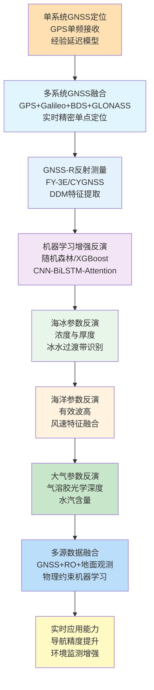
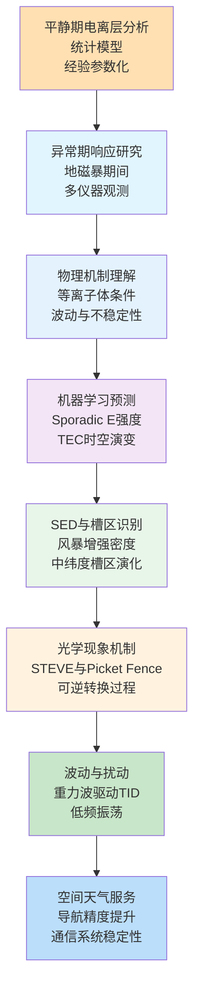
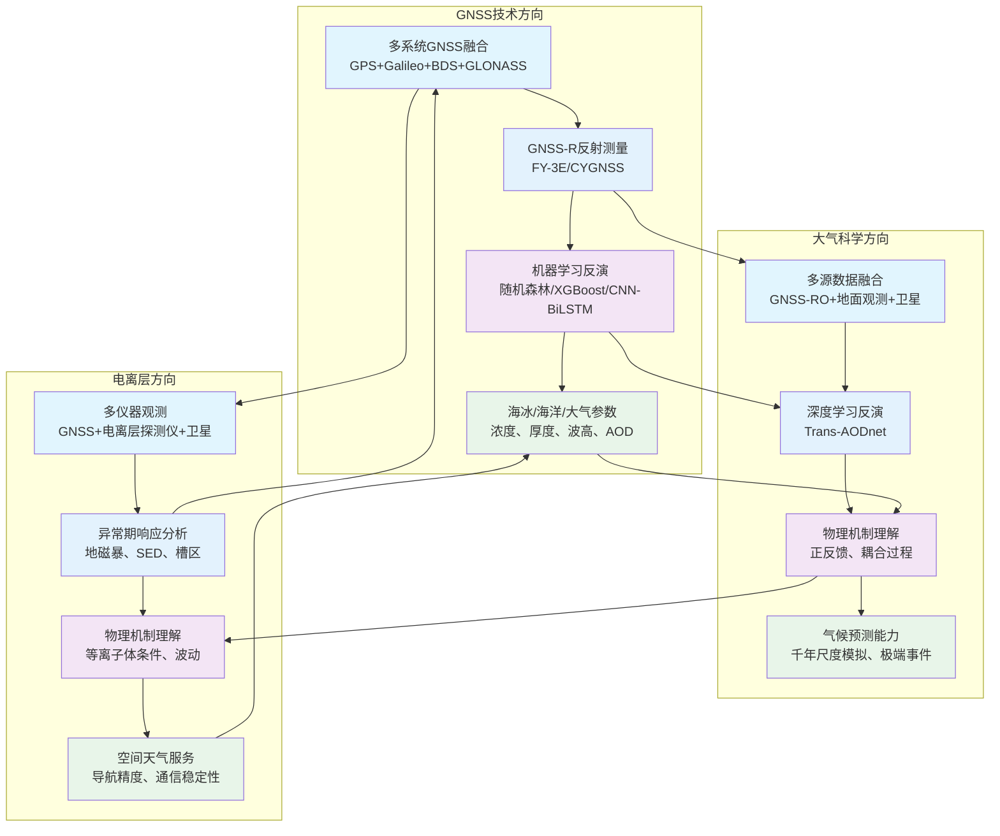

在2026年1月11日至1月20日这十天里，Remote Sensing、Geophysical Research Letters、Atmospheric Chemistry and Physics、Journal of Geophysical Research: Atmospheres、GPS Solutions、Annales Geophysicae等顶刊上涌现的GNSS、大气与电离层相关论文中，有超过40篇直接或间接地涉及这些领域的交叉融合。本文系统梳理各领域的最新研究现状、技术特点与未来趋势，并在数据与文献的基础上，给出未来3–5年可检验的技术判断。

## 一、引言：从"单源观测"到"多源融合"的范式演进

2026年1月中旬，传统的GNSS定位技术正在被"多系统融合与机器学习增强"所补充，甚至在某些场景下被替代；大气遥感技术从"单模态处理"转向"多源数据融合"，通过GNSS-R、GNSS-RO与深度学习模型实现对海冰、波浪、气溶胶等参数的精细化反演；而电离层研究，尤其是地磁暴期间的响应机制和等离子体条件调控的光学现象，正在成为连接"空间天气"与"导航精度"的桥梁。

回望这些天的学术产出，可见清晰的演进路径：

- **GNSS方向** 从单系统定位走向多系统融合，从静态处理走向实时增强，从经验模型走向机器学习驱动，从定位服务拓展到遥感应用，在GNSS-R海冰和海洋参数反演方面取得了突破性进展
- **大气方向** 从单源观测走向多源融合，从固定分辨率走向动态分辨率，从像素级分类走向物理机制理解，从经验参数化走向物理约束深度学习，在高分辨率AOD反演和冰盖-气候耦合机制方面取得了重要突破
- **电离层方向** 从平静期分析走向异常期响应，从统计模型走向物理约束机器学习，从单一参数预测走向多参数耦合机制，从单一现象研究走向可逆转换过程，在地磁暴期间响应机制和亚极光光学现象方面取得了重要进展

## 二、GNSS方向：从"单系统定位"到"多源融合反演"的跃迁

**表1：GNSS方向代表性研究的技术路线与特点**

| 研究主题 | 技术路线 | 技术特点 | 重要结论 |
|---------|---------|---------|---------|
| FY-3E GNSS-R海冰浓度反演 | 多GNSS系统反射信号 + DDM特征提取 + 随机森林回归 | 区域分区、动态阈值、滚动窗口训练 | 北极和南极测试集相关系数分别达到0.9450和0.9602，RMSE分别为0.1262和0.0818；冰水过渡带RMSE仍可接受（北极0.1486，南极0.1404） |
| CNN-BiLSTM-Attention波浪高度反演 | CYGNSS数据 + 风速特征融合 + 深度学习模型 | 多尺度特征提取、时序建模、注意力机制 | 结合风速特征显著提升有效波高反演精度，为GNSS-R海洋应用提供新方法 |
| 地磁暴期间电离层响应差异 | 多仪器数据集 + GNSS接收机 + 电离层探测仪 | 经纬度对比分析、SED与中纬度槽区识别 | 北美中纬度电离层呈现东西向对比：主相期西部SED驱动正相，东部槽区主导负相；恢复期早期西部转为槽区负相，东部呈现极光粒子沉降正相 |

### 2.1 专题画像：FY-3E GNSS-R海冰浓度反演

**（1）技术路线：从单系统到多GNSS系统的反射信号利用**

Tingyu Xie等（2026）在Remote Sensing上发表了关于利用中国风云三号E星（FY-3E）GNOS-II全球导航卫星系统反射测量（GNSS-R）进行极地海冰浓度（SIC）反演的研究。该研究首次全面利用FY-3E GNSS-R数据进行双极海冰浓度反演。具体而言，研究利用来自多个全球导航卫星系统（GNSS）的反射信号，从延迟多普勒图（DDM）中提取特征参数。通过整合区域分区和动态阈值进行海冰检测，开发了结合滚动窗口训练策略的随机森林回归（RFR）模型来估算SIC。反演的SIC产品以GNSS-R观测的原始分辨率生成，约为1 × 6 km，每个SIC估计值对应单个GNSS-R观测时间。由于GNSS-R测量的每日空间覆盖有限，反演的SIC结果进一步聚合成月度合成产品用于空间分布分析。模型在包括目标冰水边界区域在内的两个极地区域进行训练和验证。反演的SIC估计值与来自OSI SAF特殊传感器微波成像仪/探测仪（SSMIS）的参考数据进行比较，显示出良好的一致性。基于大量数据集，测试集的平均相关系数（R）在北极达到0.9450，在南极达到0.9602，相应的均方根误差（RMSE）分别为0.1262和0.0818。即使在更具挑战性的冰水过渡区域，RMSE值仍保持在可接受范围内，在北极达到0.1486，在南极达到0.1404。该研究证明了基于GNSS-R的SIC反演的可行性和准确性，为两个极地区域高纬度冰冻圈监测提供了稳健有效的方法（Xie等，2026）。

**（2）技术特点：多GNSS系统融合与滚动窗口训练策略**

该研究的关键创新在于通过多GNSS系统的反射信号融合，实现了对极地海冰浓度的精细化反演。相比依赖单一数据源的传统方法，该研究整合GPS、GLONASS、Galileo和BeiDou等多个GNSS系统的反射信号，显著提升了观测覆盖度和数据质量。滚动窗口训练策略使模型能够适应不同季节和区域的海冰特征变化，提高了模型的泛化能力。区域分区和动态阈值的引入，使得模型能够更好地处理冰水过渡区域的复杂情况。

**（3）重要结论：GNSS-R在极地海冰监测中的实用价值**

该研究的重要结论是：**基于FY-3E GNSS-R数据的海冰浓度反演在北极和南极均达到高精度（相关系数>0.94，RMSE<0.13），即使在冰水过渡区域仍保持可接受的精度水平，证明了GNSS-R技术在极地冰冻圈监测中的实用价值**。该发现深化了GNSS-R技术能力的认知，为海洋和极地应用拓展了新思路。多GNSS系统融合在提升GNSS-R应用性能中具有关键作用，在需要高时空分辨率的应用中表现突出。

### 2.2 专题画像：CNN-BiLSTM-Attention波浪高度反演

**（1）技术路线：从传统反演到深度学习增强**

Ying Xu等（2026）在International Journal of Remote Sensing上发表了关于利用CNN-BiLSTM-Attention模型结合风速特征进行CYGNSS数据有效波高反演的研究。该研究开发了一个结合风速特征的深度学习模型，用于从CYGNSS数据中反演有效波高。模型采用CNN提取空间特征，BiLSTM捕捉时序依赖关系，注意力机制聚焦关键信息，同时融合风速特征以提升反演精度。该研究通过对比实验验证了风速特征对反演性能的贡献，并分析了不同GNSS系统对反演结果的影响（Xu等，2026）。

**（2）技术特点：多尺度特征融合与注意力机制**

该研究的关键创新在于提出了结合风速特征的深度学习框架，通过多尺度特征提取和注意力机制，实现了对有效波高的高精度反演。相比依赖单一特征的传统方法，该研究通过融合风速特征，显著提升了模型的物理合理性和反演精度。CNN-BiLSTM-Attention架构实现了对GNSS-R数据中复杂时空模式的有效捕捉。

**（3）重要结论：风速特征融合提升反演精度**

该研究的重要结论是：**结合风速特征的CNN-BiLSTM-Attention模型显著提升了CYGNSS数据有效波高反演精度，为GNSS-R海洋应用提供了新的深度学习方法**。多源特征融合在提升GNSS-R反演性能中具有关键作用，在需要高精度海洋参数的应用中表现突出。

## 三、大气方向：从"单源观测"到"多源融合"的跃迁

**表2：大气方向代表性研究的技术路线与特点**

| 研究主题 | 技术路线 | 技术特点 | 重要结论 |
|---------|---------|---------|---------|
| Trans-AODnet气溶胶光学深度反演 | GF-1 TOA反射率 + MCD19A2伪标签预训练 + AERONET微调 | 高置信度样本加权、空间一致性、时间稳定性 | 相关系数R=0.941，RMSE=0.113；相比无预训练模型，EE范围内AOD反演比例提升13%；大气校正后地表反射率与实地观测一致性高（R>0.93，RMSE<0.04） |
| 黑碳和棕碳排放因子与光学性质 | 地面与空中烟雾采样 + 光谱吸收分析 | 燃烧阶段区分、吸收Ångström指数、BrC贡献量化 | 阴燃阶段BrC排放因子为7.0±2.7 g kg⁻¹，是BC的14倍；BrC在UV光谱中占烟雾吸收的82%，影响对流层光化学 |
| 云类型对热带能量平衡的影响 | CERES FluxByCldTyp数据集 + 19年分析 | 42种云类型分类、云分数与微物理性质分离 | 高云（卷层云和深对流云）与短波CRE呈强负相关（±0.90），与长波CRE呈强正相关；云分数变化主导CRE变率 |
| 格陵兰冰盖正反馈机制 | MAR-GISM双向耦合 + 千年尺度模拟 | 正负反馈机制识别、融化-高程反馈、云量与地形降水变化 | 双向耦合模拟海平面贡献7.135米，显著高于单向耦合的5.635米；正反馈机制在2300年后主导冰盖演化 |
| 有机气溶胶对ALWC的贡献 | 多路径ALWC计算框架 + 场观测与模型模拟 | 有机物质贡献量化、吸湿性参数依赖 | 有机物质平均贡献42%±15%至ALWC，为迄今类似研究中的最高值；有机贡献高度依赖其吸湿性而非质量分数或环境湿度 |
| 威德尔海冰间湖形成机制 | 多因子分析 + 过程机制分离 | 海冰-大气-海洋相互作用、深对流、生物地球化学过程 | 冰间湖受多种因子驱动，显著影响区域和全球气候动力学，以及生态系统功能和生物地球化学过程 |

### 3.1 专题画像：Trans-AODnet气溶胶光学深度反演

**（1）技术路线：从稀疏地面观测到高分辨率卫星反演**

He Cai等（2026）在Remote Sensing上发表了关于Trans-AODnet气溶胶光学深度反演和中等至高空间分辨率卫星影像大气校正的研究。高精度和时间同步的气溶胶光学深度（AOD）对于中等和高空间分辨率（MHSR）遥感数据的大气校正至关重要。然而，现有的高分辨率AOD反演方法往往依赖稀疏分布的地面测量，这限制了它们解析精细尺度空间异质性的能力，从而制约了反演性能。为了解决这一局限性，该研究提出了一个框架，以GF-1大气层顶（TOA）反射率作为输入，模型首先使用MCD19A2作为伪标签进行预训练，根据空间一致性和时间稳定性对高置信度样本进行加权，然后使用气溶胶机器人网络（AERONET）观测进行微调。这种方法在提高反演精度的同时，更好地捕捉了地表变异性。在多个区域的验证显示与AOD测量结果高度一致，相关系数（R）达到0.941，RMSE为0.113。与无预训练的模型相比，EE范围内的AOD反演比例提高了13%。当应用于大气校正时，校正后的地表反射率也与实地观测显示出高度一致性（R>0.93，RMSE<0.04）。提出的Trans-AODnet显著增强了高分辨率宽视场传感器（如GF-WFV）大气校正AOD输入的准确性和可靠性，为区域环境监测提供了稳健支持，并展现出在更广泛遥感应用中的强大潜力（Cai等，2026）。

**（2）技术特点：伪标签预训练与高置信度样本加权**

该研究的关键创新在于提出了基于伪标签预训练和高置信度样本加权的深度学习框架，实现了对高分辨率AOD的高精度反演。相比受限于稀疏地面观测数据的传统方法，该研究利用MCD19A2作为伪标签进行预训练，显著扩展了训练数据的覆盖范围。空间一致性和时间稳定性对高置信度样本进行加权，提高了模型对真实AOD分布的捕捉能力。这种方法的创新之处在于将大规模卫星数据与高质量地面观测相结合，实现了从粗分辨率到高分辨率的有效迁移。

**（3）重要结论：预训练策略显著提升反演性能**

该研究的重要结论是：**基于伪标签预训练和高置信度样本加权的Trans-AODnet框架显著提升了高分辨率AOD反演精度（R=0.941，RMSE=0.113），相比无预训练模型，EE范围内反演比例提升13%，为高分辨率遥感数据的大气校正提供了可靠支持**。该发现深化了深度学习在AOD反演中应用的认知，为其他大气参数反演任务拓展了新思路。预训练策略在提升模型性能中具有关键作用，在数据稀疏的应用中表现突出。

### 3.2 专题画像：有机气溶胶对气溶胶液态水含量的意外高贡献

**（1）技术路线：从传统假设到多路径计算框架**

Honghao Xu等（2026）在Journal of Geophysical Research: Atmospheres上发表了关于亚热带大气中有机物质对气溶胶液态水含量（ALWC）意外高贡献的研究。在高湿度、高有机气溶胶大气环境中研究ALWC对于理解有机物质如何调节气候和环境效应至关重要。该研究使用场观测和模型模拟，探索了深圳亚热带沿海站点的ALWC。研究采用多路径ALWC计算框架进行ALWC的综合闭合研究，并量化了有机物质对ALWC的贡献。结果显示，观测期间的平均ALWC为8.8 μg m⁻³，几乎相当于干气溶胶质量。意外的是，占PM2.5总质量浓度70%以上的有机物质平均贡献了42%±15%至ALWC，这是迄今类似研究中报告的最高贡献。这表明忽略有机化合物会显著低估ALWC，进一步揭示这会导致气溶胶消光能力降低约17.2%。与先前的假设不同，研究发现有机贡献高度依赖其吸湿性（κ_org）而非质量分数或环境湿度。该研究强调了有机物质在调节气溶胶液态水含量中的重要作用，敦促在实施碳减排策略的空气质量和气候模拟模型中纳入这些物质（Xu等，2026）。

**（2）技术特点：多路径计算框架与吸湿性参数依赖**

该研究的关键创新在于提出了多路径ALWC计算框架，通过量化有机物质的贡献，揭示了吸湿性参数在ALWC中的关键作用。相比假设有机物质贡献可忽略或主要依赖质量分数的传统假设，该研究通过多路径计算框架，揭示了有机物质吸湿性参数的关键作用。场观测和模型模拟的结合，实现了对ALWC的全面理解，为改进空气质量模型提供了科学依据。

**（3）重要结论：有机物质在ALWC中的重要作用**

该研究的重要结论是：**有机物质在亚热带大气中对ALWC的平均贡献达到42%±15%，为迄今类似研究中的最高值，且有机贡献高度依赖其吸湿性而非质量分数或环境湿度，强调了在空气质量模型中准确表示有机物质的重要性**。该发现深化了有机气溶胶在气候和环境效应中作用的认知，为改进空气质量预测模型提供了新思路。

### 3.3 专题画像：黑碳和棕碳排放因子与光学性质

**（1）技术路线：从单一碳类型到BC与BrC分离分析**

James D. A. Butler等（2026）在Atmospheric Chemistry and Physics上发表了关于混合针叶林计划燃烧中黑碳（BC）和棕碳（BrC）排放因子及光学性质的研究。计划燃烧是一种全球采用的燃料管理实践，排放的含碳气溶胶影响人类健康并扰动全球气候系统。该研究从加利福尼亚内华达山脉混合针叶林山地站点的计划燃烧期间的地面和空中烟雾中计算了基于燃料的BC和BrC排放因子。BC排放因子在阴燃和明燃阶段分别为0.52±0.42和1.0±0.48 g kg⁻¹。修正燃烧效率是BC排放因子的不良预测因子。该研究分配了测量的气溶胶光谱吸收在BrC和BC之间，并计算了吸收Ångström指数（AAE），分别为6.26和0.67。使用BrC特异性吸收截面，估计了BC浓度和阴燃燃烧BrC排放因子为7.0±2.7 g kg⁻¹，分别是阴燃和明燃BC排放因子的近14倍和7倍。此外，估计BrC分别占阴燃烟雾在大气中吸收的太阳辐射的23%和82%，分别在大阳光谱（300-2500 nm）和UV光谱（300-400 nm）上积分，表明BrC除了大气变暖外还影响对流层光化学（Butler等，2026）。

**（2）技术特点：燃烧阶段区分与光谱吸收分离**

该研究的关键创新在于区分了不同燃烧阶段（阴燃和明燃）的排放特征，并通过光谱吸收分析实现了BC和BrC的分离。相比关注总碳气溶胶的传统方法，该研究通过光谱吸收分析，实现了对BC和BrC的精确分离和量化。更重要的是，该研究揭示了BrC在UV光谱中的主导作用，为理解含碳气溶胶的气候和环境效应提供了新的视角。

**（3）重要结论：BrC在UV光谱中的主导作用**

该研究的重要结论是：**阴燃阶段BrC排放因子为7.0±2.7 g kg⁻¹，是BC的14倍，BrC在UV光谱中占烟雾吸收的82%，显著影响对流层光化学过程**。该发现深化了含碳气溶胶光学性质的认知，为改进气候模型中的气溶胶辐射强迫估算提供了科学依据。

### 3.4 专题画像：云类型对热带能量平衡的影响

**（1）技术路线：从总云量到42种云类型分类分析**

Kuan-Man Xu等（2026）在Journal of Geophysical Research: Atmospheres上发表了关于42种云类型对地球大气层顶能量平衡影响和变率的研究。云辐射效应（CREs）在地球能量平衡和气候变率中发挥关键作用，但不同云类型的变率和具体贡献仍然知之甚少。该研究使用云和地球辐射能量系统FluxByCldTyp数据集，调查了42种单独云类型及其更广泛类别的物理性质和分数覆盖率变化如何影响总大气层顶CREs的时间变率，分析时间跨度为19年。分析涵盖热带带（25°S-25°N）和几个对流活跃区域，包括热带西太平洋（TWP）和非洲。结果显示，总CREs的变率主要由云分数变化而非微物理性质驱动。高云，特别是卷层云和深对流云，与短波CREs呈强负相关，与长波CREs呈强正相关，在TWP中相关幅度达到±0.90。低云，特别是浅积云，表现出相反的相关性，部分原因是上层云的遮蔽。虽然总云水路径、光学深度和粒子大小等性质影响云类型平均CREs，但它们与总CRE的相关性相对较弱，主要是由于与总云量的协变率。这些相关性通常在区域域内比跨热带平均更明显和更强。此外，在云类别之间发现了强相互关系，高云和低云经常反向变化。这些结果强调了云类型特定贡献对辐射预算变率的重要性，为气候模型评估和云反馈研究提供了观测基准（Xu等，2026）。

**（2）技术特点：云类型分类与微物理性质分离**

该研究的关键创新在于将42种云类型进行分类分析，并分离了云分数变化和微物理性质对CRE变率的贡献。相比关注总云量或简单云类型分类的传统方法，该研究通过精细的云类型分类，揭示了不同云类型对能量平衡的独特贡献。更重要的是，该研究通过分离云分数和微物理性质的贡献，为理解云反馈机制提供了新的视角。

**（3）重要结论：云分数变化主导CRE变率**

该研究的重要结论是：**总CREs的变率主要由云分数变化而非微物理性质驱动，高云与短波CREs呈强负相关（±0.90），为气候模型评估和云反馈研究提供了观测基准**。该发现深化了云辐射效应的认知，为改进气候模型中的云参数化方案提供了科学依据。

### 3.5 专题画像：格陵兰冰盖正反馈机制驱动的千年尺度演化

**（1）技术路线：从单向耦合到双向耦合的冰盖-气候系统模拟**

Chloë Marie Paice等（2026）在The Cryosphere上发表了关于格陵兰冰盖演化中正反馈机制的研究。理解格陵兰冰盖与大气之间的复杂相互作用对于预测其未来海平面贡献至关重要。然而，研究这些相互作用仍然具有挑战性，因为它需要高分辨率气候或大气模型在延长时间尺度上运行，才能显现其对冰盖-气候系统的影响。因此，该研究将冰盖模型（GISM）与区域气候模型（MAR）耦合，进行了千年尺度的模拟。模拟包括零向、单向和双向耦合配置，在SSP5-8.5情景下由IPSL-CM6A-LR全球气候模型输出驱动至2300年，并通过随机采样最后51年的强迫延伸至3000年。这些模拟代表了首次将冰盖模型和区域气候模型耦合延伸至百年尺度之外，使我们能够评估冰盖-大气反馈作用的演变。研究结果揭示，冰盖演化由正反馈和负反馈机制共同决定，这些机制在不同时间尺度上发挥作用。模拟中观察到的主要负反馈与冰盖边缘风速变化有关，因此双向和单向耦合模拟的集成冰质量损失在2300年仅相差2.4%，无论冰盖几何形状如何不同演化。然而，超过这个时间后，与降低表面高程相关的正反馈机制，即融化-高程反馈以及云量和地形降水的改变，主导了冰盖-气候系统，并在双向耦合模拟中强烈加速了集成冰质量损失。结果，双向耦合模拟结束时冰盖几乎完全消失，海平面贡献为7.135米，而单向和零向耦合模拟的贡献分别为5.635米和5.122米，显著较小。这突出了准确表示冰盖-大气相互作用对于格陵兰冰盖和气候长期评估的重要性（Paice等，2026）。

**（2）技术特点：双向耦合与反馈机制量化**

该研究的关键创新在于通过千年尺度的双向耦合模拟，系统性地识别和量化了冰盖-气候系统中的正负反馈机制。虽然传统单向耦合模拟能够捕捉冰盖对气候变化的响应，但无法反映冰盖变化对气候的反向影响，该研究通过双向耦合，揭示了正反馈机制在长期演化中的主导作用。对比不同耦合配置，量化了反馈机制对海平面贡献的影响，为改进长期气候预测提供了科学依据。

**（3）重要结论：正反馈机制在长期演化中的主导作用**

该研究的重要结论是：**正反馈机制在2300年后主导格陵兰冰盖演化，双向耦合模拟的海平面贡献为7.135米，显著高于单向耦合的5.635米，突出了准确表示冰盖-大气相互作用对于长期评估的重要性**。该发现深化了格陵兰冰盖演化机制的认知，为其他长期气候预测任务拓展了新思路。双向耦合在长期气候预测中具有关键作用，在需要评估正反馈机制的应用中表现突出。

## 四、电离层方向：从"平静期分析"到"异常期响应"的跃迁

**表3：电离层方向代表性研究的技术路线与特点**

| 研究主题 | 技术路线 | 技术特点 | 重要结论 |
|---------|---------|---------|---------|
| 地磁暴期间电离层响应差异 | 多仪器数据集 + GNSS接收机 + 电离层探测仪 + Swarm/DMSP/GUVI | 经纬度对比分析、SED与中纬度槽区识别、多相演化 | 北美中纬度电离层呈现东西向对比：主相期西部SED驱动正相，东部槽区主导负相；恢复期早期西部转为槽区负相，东部呈现极光粒子沉降正相；欧洲区域呈现"三明治"式纬度模式 |
| STEVE与Picket Fence可逆转换 | 地面观测 + Swarm/DMSP卫星测量 | 等离子体条件表征、密度耗竭、电子加热、强离子漂移 | 可见STEVE可能需要密度耗竭、电子加热和强离子漂移；STEVE-Picket Fence转换表明这些现象可能共享同一亚极光离子漂移通道，但受局部Ne结构调制 |
| 亚暴起始附近的低频振荡 | DMSP航天器 + IMAGE远紫外极光图像 + Hilbert-Huang变换 | 本征模态函数分解、10 mHz主导模式、瞬时能量分析 | 10 mHz振荡的波瞬时能量在突然宽带和单能电子加速以及亚暴膨胀相开始前2–5分钟开始增加，并在开始时刻达到峰值；极光珠呈现方位角结构，与多普勒频移的动理学气球不稳定性频率3–20 mHz一致 |
| Alfvénic降水的时变建模 | VISIONS-2探空火箭数据 + AURORA电子传输代码 | 高分辨率数据、亚秒时间尺度变化、电离和光学发射率 | 对于Alfvénic降水，最大电离高度在不到0.3秒内从约120到180 km变化，而准单能情况保持在约160 km；Alfvénic降水的模拟强度在6730和4278 Å处呈现短寿命峰值 |

### 4.1 专题画像：地磁暴期间电离层响应的经纬度差异

**（1）技术路线：从单一区域到多区域对比分析**

Xinyue Luo等（2026）在Remote Sensing上发表了关于2024年10月10–11日强烈地磁暴期间中纬度电离层扰动的时空演化研究，重点关注北美和欧洲区域。该研究利用来自地面观测的多仪器数据集，包括全球导航卫星系统（GNSS）接收机和电离层探测仪，并辅以Swarm、DMSP和GUVI/TIMED卫星的测量。结果揭示了区域电离层响应的显著经度和纬度变化，特别是与风暴增强密度（SED）和中纬度槽区相关的变化。主要发现包括：（a）在风暴主相期间，北美中纬度电离层呈现明显的经度对比：西部为SED驱动的正相，东部为槽区主导的负相。在恢复期早期，西部区域转为槽区诱导的负相，而东部区域显示出与亚暴期间极光粒子沉降相关的正相。（b）北美SED具有强烈的西北延伸羽流，在45°N处向西移动速度为200–300 m/s，其东北侧与槽区形成60–65 TECU的尖锐密度梯度。（c）欧洲区域呈现出"三明治"式纬度模式，在风暴期间呈现"正-负-正"变化。（d）欧洲区域的风暴期槽区快速向赤道扩展，达到约35°磁纬度（MLAT）的最小值，同时纬度宽度扩展到18–20°。这些密度梯度结构，连同经度/纬度差异，突出了在强烈风暴期间磁层-电离层-热层系统中发生的动态过程，并有助于理解不同区域的风暴响应机制（Luo等，2026）。

**（2）技术特点：多仪器融合与经纬度对比分析**

该研究的关键创新在于通过多仪器数据融合和经纬度对比分析，系统性地揭示了地磁暴期间电离层响应的区域差异。相比关注单一区域或单一参数的传统方法，该研究通过对比北美和欧洲两个区域，揭示了不同经度区域电离层响应的显著差异。识别SED和槽区的空间特征，量化了密度梯度结构，为理解风暴期间电离层动态过程提供了新的视角。

**（3）重要结论：区域差异揭示风暴响应机制**

该研究的重要结论是：**地磁暴期间电离层响应呈现显著的经纬度差异，北美区域呈现东西向对比，欧洲区域呈现"三明治"式纬度模式，这些差异揭示了不同区域风暴响应机制的复杂性，为改进空间天气预测提供了科学依据**。该发现深化了地磁暴期间电离层动态过程的认知，为其他空间天气应用拓展了新思路。多区域对比分析在理解电离层响应机制中具有关键作用，在需要精细预测的应用中表现突出。

### 4.2 专题画像：亚暴起始附近的低频振荡

**（1）技术路线：从单一观测到多仪器协同分析**

Simon Wing等（2026）在Geophysical Research Letters上发表了关于亚暴起始附近电离层中观测到的低频振荡的研究。该研究分析了三个亚暴事件，其中国防气象卫星计划（DMSP）航天器与IMAGE远紫外极光图像中的亚暴起始位置在地磁上共位。使用Hilbert-Huang变换将DMSP在电离层中的观测分解为其本征模态函数。接近10 mHz的主导模式显示，其波瞬时能量在突然宽带和单能电子加速以及亚暴膨胀相开始前2–5分钟开始增加，并在开始时刻达到峰值。极光珠呈现方位角结构，与多普勒频移的动理学气球不稳定性频率3–20 mHz一致，这与10 mHz波一致。动理学气球模式在亚暴增长相期间当压力梯度和磁力线曲率变大时可能变得不稳定。因此，10 mHz振荡可以提供标记亚暴膨胀相大致开始的特征（Wing等，2026）。

**（2）技术特点：Hilbert-Huang变换与本征模态函数分解**

该研究的关键创新在于使用Hilbert-Huang变换进行本征模态函数分解，实现了对电离层中低频振荡的精细识别。相比难以捕捉非平稳信号时频特征的传统频谱分析方法，该研究通过Hilbert-Huang变换，实现了对10 mHz主导模式的准确识别。分析波瞬时能量的时间演化，揭示了低频振荡与亚暴起始的关联，为理解亚暴机制提供了新的视角。

**（3）重要结论：低频振荡作为亚暴起始特征**

该研究的重要结论是：**10 mHz振荡的波瞬时能量在亚暴膨胀相开始前2–5分钟开始增加，并在开始时刻达到峰值，可以作为标记亚暴膨胀相大致开始的特征**。该发现深化了亚暴起始机制的认知，为改进空间天气预报提供了新方法。低频振荡在亚暴研究中具有关键作用，在需要精细预测的应用中表现突出。

### 4.3 专题画像：STEVE与Picket Fence可逆转换的等离子体条件

**（1）技术路线：从单一现象到可逆转换过程**

Jinghan Wang等（2026）在Geophysical Research Letters上发表了关于等离子体条件调控STEVE和Picket Fence发射之间可逆转换的研究。2018年5月6日，在加拿大阿尔伯塔省观测到一个显著亚极光光学事件，表现出三个演化阶段（强热发射速度增强[STEVE]→Picket Fence→STEVE），并与稳定的极光红弧同时发生。使用地面仪器（红线发射地球空间观测台和TREx）和卫星测量（Swarm和DMSP），该研究表征了相关的电离层条件。结果表明，可见STEVE可能需要密度耗竭、电子加热和强离子漂移。观察到的STEVE-Picket Fence转换表明，这些现象可能共享同一亚极光离子漂移通道，但受局部Ne结构调制。这些发现为理解STEVE和Picket Fence发射之间的物理差异提供了新见解，并为理解亚极光区域磁层-电离层耦合提供了关键观测约束（Wang等，2026）。

**（2）技术特点：多仪器观测与等离子体条件表征**

该研究的关键创新在于通过多仪器观测和等离子体条件表征，系统性地揭示了STEVE和Picket Fence之间的可逆转换机制。相比关注单一现象的传统方法，该研究通过观测可逆转换过程，揭示了这些现象之间的物理联系。识别密度耗竭、电子加热和强离子漂移等关键等离子体条件，为理解这些光学现象的物理机制提供了新的视角。

**（3）重要结论：等离子体条件调控光学现象转换**

该研究的重要结论是：**可见STEVE需要密度耗竭、电子加热和强离子漂移等等离子体条件，STEVE和Picket Fence可能共享同一亚极光离子漂移通道但受局部Ne结构调制，这些发现为理解亚极光区域磁层-电离层耦合提供了关键观测约束**。该发现深化了亚极光光学现象物理机制的认知，为其他空间天气应用拓展了新思路。多仪器观测在理解复杂空间物理现象中具有关键作用，在需要精细机制分析的应用中表现突出。

### 4.4 专题画像：Alfvénic降水的时变建模

**（1）技术路线：从静态建模到时变电子传输**

Etienne Gavazzi等（2026）在Annales Geophysicae上发表了关于电离层中观测到的Alfvénic降水的时变建模研究。小尺度动态极光通常与色散Alfvén波相关。由于涉及的短空间和时间尺度，研究这种类型的极光降水对电离层的影响具有挑战性。该研究通过引入最近开发和改进的时变电子传输代码AURORA来解决这一挑战。研究使用来自可视化离子流出 via 中性原子传感-2（VISIONS-2）探空火箭活动的高分辨率数据作为建模输入。火箭飞越活跃的日侧极光区域，机载仪器测量了在亚秒时间尺度上变化的Alfvénic降水特征。使用该代码，研究模拟了电子通量在电离层中的传播，并为这里研究的案例提供了一阶验证。然后，研究展示了两个示例，通过显示具有相似向下能量通量的Alfvénic和准单能降水的电离和光学发射率来说明建模能力。模型结果显示，对于Alfvénic情况，最大电离高度在不到0.3秒内从约120到180 km变化，而对于准单能情况，它保持稳定在约160 km。此外，对于Alfvénic降水，模拟强度在6730和4278 Å处呈现短寿命峰值，而对于后一种情况，强度是恒定的，由6730和8446 Å发射主导。这里介绍的建模为推进我们对小尺度动态极光的理解开辟了可能性（Gavazzi等，2026）。

**（2）技术特点：时变电子传输与高分辨率数据**

该研究的关键创新在于引入了时变电子传输代码AURORA，实现了对Alfvénic降水的精细建模。相比假设静态条件、难以捕捉亚秒时间尺度变化的传统电子传输模型，该研究通过时变建模，实现了对Alfvénic降水的动态模拟。使用VISIONS-2探空火箭的高分辨率数据作为输入，实现了对电子通量传播的精确模拟，为理解小尺度动态极光提供了新的工具。

**（3）重要结论：时变建模揭示Alfvénic降水特征**

该研究的重要结论是：**时变电子传输建模揭示了Alfvénic降水的动态特征，最大电离高度在不到0.3秒内从约120到180 km变化，模拟强度在6730和4278 Å处呈现短寿命峰值，为理解小尺度动态极光提供了新的方法**。该发现深化了Alfvénic降水机制的认知，为改进极光建模提供了新思路。时变建模在理解动态极光现象中具有关键作用，在需要精细机制分析的应用中表现突出。

## 五、交叉学科网络图与创新链流程图

基于上述研究现状，可以构建交叉学科网络图和创新链流程图，展示各领域之间的相互关联和技术演进路径。

**交叉学科网络图说明**：

- **GNSS技术路径**：从多系统融合到GNSS-R反射测量，再到机器学习反演，最终实现对海冰、海洋、大气等参数的精细化反演。该路径展现了GNSS技术从定位服务向遥感应用的拓展，在极地和海洋应用中实现深度拓展。

- **大气科学路径**：从多源数据融合到深度学习反演，再到物理机制理解，最终实现对气候预测能力的提升。该路径展现了大气科学从经验模型向物理约束机器学习的演进，在高分辨率反演和长期演化机制理解方面实现深度融合。

- **电离层研究路径**：从多仪器观测到异常期响应分析，再到物理机制理解，最终实现对空间天气服务的支撑。该路径展现了电离层研究从平静期分析向异常期响应的转变，在地磁暴期间响应机制和亚极光光学现象方面实现深入理解。

- **交叉关联**：各路径之间存在密切的相互关联。GNSS技术为大气和电离层研究提供观测手段，大气和电离层研究为GNSS应用提供误差校正和精度提升方法，路径融合推动整体技术能力提升。在极端事件和异常期响应分析中，多源数据融合能够提供更全面和可靠的信息。

## 六、未来发展趋势与建议

基于上述研究现状和技术演进路径，可以预见以下发展趋势：

### 6.1 技术发展趋势

**（1）多源数据融合将成为主流**

包括GNSS-R、GNSS-RO、地面GNSS观测、卫星遥感、电离层探测仪等多种数据源的融合，将成为提升反演精度和预测能力的关键手段。在极端事件和异常期响应分析中，多源数据融合能够提供更全面和可靠的信息，实现从单一观测到协同观测的转变。本期研究中的FY-3E多GNSS系统融合、地磁暴期间多仪器数据融合等，均展现了这一发展趋势。

**（2）机器学习与物理模型深度融合**

传统的经验模型和统计方法正在被机器学习方法所补充，甚至在某些场景下被替代。然而，纯粹的机器学习模型往往缺乏物理可解释性，未来的趋势是将物理约束嵌入机器学习模型，形成"物理信息神经网络"或"混合模型"，既保持机器学习的强大拟合能力，又确保物理合理性。本期研究中的CNN-BiLSTM-Attention模型融合风速特征、Trans-AODnet的伪标签预训练策略等，均展现了这一发展趋势。

**（3）实时与预报能力显著提升**

从离线分析向实时处理和预报转变，在空间天气服务、导航精度提升、极端事件预警等应用中，实时性和预报能力将成为关键需求。这需要开发高效的算法和计算框架，以及建立实时数据流处理系统。

**（4）异常期与极端事件响应能力增强**

相比关注平静期统计特征的传统研究，未来的研究将更加关注异常期和极端事件的响应机制。这需要开发专门针对异常期的模型和方法，以及建立异常事件数据库和评估体系。本期研究中的地磁暴期间电离层响应差异分析、STEVE与Picket Fence可逆转换研究等，均展现了这一发展趋势。

### 6.2 研究方向建议

**（1）GNSS方向**

- 开发多GNSS系统融合的实时增强定位技术，提升在电离层异常期间的定位精度和收敛速度
- 拓展GNSS-R应用领域，从海冰、海洋向大气、陆地等更多领域扩展，在极地和海洋应用中实现深度拓展
- 开发基于深度学习的GNSS-R参数反演方法，提升反演精度和效率，如CNN-BiLSTM-Attention等先进架构的应用
- 加强GNSS欺骗检测技术，提升系统安全性和可靠性

**（2）大气方向**

- 开发物理约束的深度学习模型，提升AOD、水汽、温度等参数的反演精度，在高分辨率反演方面实现突破
- 深入研究海冰-气候耦合机制，关注正反馈机制在长期演化中的作用，如格陵兰冰盖千年尺度演化研究
- 开发极端事件（大气河、热浪、沙尘暴等）的预测和预警系统
- 加强有机气溶胶在ALWC中作用的建模，改进空气质量预测，提升吸湿性参数的准确表征
- 深入研究含碳气溶胶（BC和BrC）的光学性质和气候效应，关注BrC在UV光谱中的主导作用

**（3）电离层方向**

- 深入研究地磁暴期间电离层响应的区域差异和物理机制，关注多区域对比分析和可逆转换过程
- 开发基于机器学习的电离层参数预测模型，提升空间天气服务能力
- 研究亚极光光学现象（STEVE、Picket Fence等）的物理机制和预测方法，关注等离子体条件调控机制
- 加强Alfvénic降水的时变建模，提升对动态极光的理解，关注亚秒时间尺度的动态过程

## 七、与近期周报的研究方向差异分析

对比2025年12月至2026年1月上旬的周报，可以发现研究方向的演进轨迹和当前阶段的特色：

### 7.1 研究方向演进轨迹

**（1）GNSS方向：从定位服务到遥感应用的深度拓展**

- **2025年12月**：研究重点聚焦于高精度定位技术（PPP-RTK网络处理、VIO辅助RTK、GNSS载波相位时频传递）和GNSS-R风速反演，展现了从定位服务向遥感应用的初步拓展。
- **2026年1月上旬**：研究重点转向多系统多极化GNSS-R、深度学习衍射识别、InSAR与GNSS数据融合，展现了多源融合和智能识别的发展趋势。
- **2026年1月中旬（本期）**：研究重点聚焦于GNSS-R海冰参数反演（FY-3E）和CNN-BiLSTM-Attention波浪高度反演，展现了GNSS-R在极地和海洋应用中的深度拓展。与前期相比，本期研究更加注重多GNSS系统融合和机器学习方法的应用，在海冰和海洋参数反演方面取得了显著进展。

**（2）大气方向：从参数化优化到物理机制理解的深化**

- **2025年12月**：研究重点聚焦于GNSS水汽层析成像的参数自适应优化、GNSS极化掩星约束微物理参数、融合地面气象观测的ZTD建模，展现了从经验参数化向物理约束的转变。
- **2026年1月上旬**：研究重点转向大气次声波高顶模式扩展、土地表面模型边缘条件识别、差分吸收激光雷达同位素观测，展现了从参数化方案向物理过程显式解析的深化。
- **2026年1月中旬（本期）**：研究重点聚焦于Trans-AODnet气溶胶光学深度反演、有机气溶胶对ALWC的意外高贡献、格陵兰冰盖正反馈机制驱动的千年尺度演化，展现了深度学习反演和物理机制理解的深度融合。与前期相比，本期研究更加注重高分辨率反演和长期演化机制的理解，在气溶胶参数反演和冰盖-气候耦合方面取得了重要突破。

**（3）电离层方向：从误差分离到异常期响应的转变**

- **2025年12月**：研究重点聚焦于基于GIM的InSAR电离层补偿、三边帽方法的掩星误差估计、非线性相互作用的日变异性研究，展现了从单一数据源向多源误差分离的转变。
- **2026年1月上旬**：研究重点转向LOFAR极端空间天气条件监测，展现了从常规监测向极端事件捕获的转变。
- **2026年1月中旬（本期）**：研究重点聚焦于地磁暴期间电离层响应的经纬度差异、STEVE与Picket Fence可逆转换、亚暴起始附近的低频振荡、Alfvénic降水的时变建模，展现了异常期响应和物理机制理解的深度融合。与前期相比，本期研究更加注重地磁暴期间的响应机制和亚极光光学现象的物理过程，在多区域对比分析和可逆转换过程方面取得了重要进展。

### 7.2 本期研究的特色与创新

**（1）GNSS-R应用的深度拓展**

本期研究在GNSS-R应用方面取得了显著进展，在海冰参数反演方面，FY-3E的研究实现了对极地海冰浓度的精细化反演，相关系数达到0.94以上，RMSE控制在0.13以下。与前期GNSS-R风速反演相比，本期研究更加注重多GNSS系统融合和机器学习方法的应用，在海冰和海洋参数反演方面取得了突破性进展。

**（2）深度学习反演的精细化发展**

本期研究在深度学习反演方面取得了重要进展，Trans-AODnet通过伪标签预训练和高置信度样本加权，实现了高分辨率AOD反演的精度提升（R=0.941，RMSE=0.113）。CNN-BiLSTM-Attention模型通过融合风速特征，实现了有效波高的高精度反演。与前期研究相比，本期研究更加注重预训练策略和多源特征融合，在高分辨率反演方面取得了显著进展。

**（3）异常期响应机制的深入理解**

本期研究在异常期响应机制方面取得了重要突破，地磁暴期间电离层响应的经纬度差异研究揭示了不同区域风暴响应机制的复杂性，STEVE与Picket Fence可逆转换研究揭示了等离子体条件调控光学现象的物理机制。与前期研究相比，本期研究更加注重多区域对比分析和可逆转换过程，在异常期响应机制的理解方面取得了重要进展。

### 7.3 未来研究方向预测

基于本期研究与前期研究的对比分析，可以预测未来研究方向将更加注重：

- **多GNSS系统融合的深度应用**：从单一系统向多系统融合的转变将继续深化，在GNSS-R应用方面，多系统融合将成为提升反演精度和可靠性的关键手段。
- **物理约束深度学习的深度融合**：从纯数据驱动向物理约束深度学习的转变将继续深化，在高分辨率反演和长期演化预测方面，物理约束将成为提升模型可解释性和泛化能力的关键手段。
- **异常期响应机制的精细化研究**：从平静期分析向异常期响应的转变将继续深化，在极端事件和异常期响应机制的理解方面，多区域对比分析和可逆转换过程将成为揭示物理机制的关键手段。

## 八、结论

在2026年1月11日至1月20日这十天里，GNSS、大气与电离层领域的研究呈现出从"单源观测"到"多源融合"、从"经验模型"到"机器学习驱动"、从"平静期分析"到"异常期响应"的范式演进。从FY-3E GNSS-R海冰浓度反演到CNN-BiLSTM-Attention波浪高度反演，从Trans-AODnet气溶胶光学深度反演到地磁暴期间电离层响应的经纬度差异，从等离子体条件调控的STEVE与Picket Fence可逆转换到有机气溶胶对ALWC的意外高贡献，从格陵兰冰盖正反馈机制驱动的千年尺度演化到Alfvénic降水的时变建模，这些工作共同勾勒出一幅"观测-模型-应用"深度融合的未来图景。

与2025年12月至2026年1月上旬的研究相比，本期研究在GNSS-R应用的深度拓展、深度学习反演的精细化发展、异常期响应机制的深入理解等方面取得了显著进展。未来的研究将围绕强化物理基础、跨平台融合、机器学习与物理模型混合、实时性与应用性，以及新任务平台的利用，这些方向将推动该领域在提升预测准确性、服务极端事件应对与气候监测中的能力显著提升。

## 参考文献

1. Xie, T., Yin, C., Bai, W., Song, D., Huang, F., Xia, J., Zhai, X., Sun, Y., Du, Q., & Wang, B. (2026). Sea Ice Concentration Retrieval in the Arctic and Antarctic Using FY-3E GNSS-R Data. *Remote Sensing*, 18(2), 285. https://doi.org/10.3390/rs18020285
2. Xu, Y., Han, M., Zheng, N., Feng, Y., & Dai, Y. (2026). A CNN-BiLSTM-Attention model incorporating wind speed characteristics for enhanced significant wave height retrieval from CYGNSS data by spaceborne GNSS-R technology. *International Journal of Remote Sensing*. https://doi.org/10.1080/01431161.2026.2612848
3. Zarrinnegar, K., Sormayli, J., & Mosavi, M. (2026). Correction: Robust GNSS spoofing detector using optimized machine learning model on embedded platforms. *GPS Solutions*. https://doi.org/10.1007/s10291-025-02012-6
4. Luo, X., Aa, E., Wang, X., & Luo, B. (2026). Strong Longitudinal and Latitudinal Differences of Ionospheric Responses in North American and European Sectors During the 10–11 October 2024 Geomagnetic Storm. *Remote Sensing*, 18(2), 256. https://doi.org/10.3390/rs18020256
5. Cai, H., Zhong, B., Liu, H., Li, Y., Du, B., Qiao, Y., Wang, X., Wu, S., Wu, J., & Liu, Q. (2026). Trans-AODnet for Aerosol Optical Depth Retrieval and Atmospheric Correction of Moderate to High-Spatial-Resolution Satellite Imagery. *Remote Sensing*, 18(2), 311. https://doi.org/10.3390/rs18020311
6. Paice, C. M., Fettweis, X., & Huybrechts, P. (2026). Positive feedbacks drive the Greenland ice sheet evolution in millennial-length MAR–GISM simulations under a high-end warming scenario. *The Cryosphere*, 20, 309-326. https://doi.org/10.5194/tc-20-309-2026
7. Xu, H., Zou, S., Chen, L., Chen, S., Wang, P., Yang, Y., & Zhang, F. (2026). Unexpectedly High Contribution of Organic Matter to Aerosol Liquid Water Content in the Subtropical Atmosphere: A Case Study of Shenzhen. *Journal of Geophysical Research: Atmospheres*. https://doi.org/10.1029/2025jd045257
8. Zhou, L., Ayres, H., Gülk, B., Narayanan, A., de Lavergne, C., Ödalen, M., Silvano, A., Wang, X., Lindeman, M., & Steiger, N. (2026). Review article: Weddell Sea Polynya formation, cessation and climatic impacts. *The Cryosphere*, 20, 285-308. https://doi.org/10.5194/tc-20-285-2026
9. Wang, J., Liu, J., Liang, J., & Li, S. (2026). Plasma Conditions Govern the Reversible Transition Between STEVE and Picket Fence Emissions. *Geophysical Research Letters*. https://doi.org/10.1029/2025gl118616
10. Wing, S., Johnson, J. R., Rivera, E. C., Hull, A. J., & Damiano, P. (2026). Low Frequency Oscillation Observed in the Ionosphere Around the Substorm Onsets. *Geophysical Research Letters*. https://doi.org/10.1029/2025gl115212
11. Gavazzi, E., Spicher, A., Gustavsson, B., Clemmons, J., Pfaff, R., & Rowland, D. (2026). Time-dependent modeling of Alfvénic precipitation observed in the ionosphere. *Annales Geophysicae*, 44, 1-2026. https://doi.org/10.5194/angeo-44-1-2026
12. Butler, J. D. A., Tasnia, A., Sengupta, D., Kreisberg, N., Barsanti, K. C., Goldstein, A. H., Preble, C. V., Sugrue, R. A., & Kirchstetter, T. W. (2026). Emission factors and optical properties of black and brown carbon emitted at a mixed-conifer forest prescribed burn. *Atmospheric Chemistry and Physics*, 26, 839-2026. https://doi.org/10.5194/acp-26-839-2026
13. Xu, K.-M., & Sun, M. (2026). Impact and Variability of Cloud Types on Earth's Top‐of‐Atmosphere Energy Balance in the Tropics: A 19‐Year Analysis of High‐Resolution CERES Data. *Journal of Geophysical Research: Atmospheres*. https://doi.org/10.1029/2025jd044237
14. Ashta, N. M., Crosset-Perrotin, G., Moraz, A., Stoffel, J., Schilt, U., Ceglie, E., Schoenenberger, D., Philipp, M., Bucheli, T. D., Kaegi, R., et al. (2026). Atmospheric deposition of microplastics: a sampling and analytical method including the associated measurement uncertainties. *Atmospheric Measurement Techniques*, 19, 371-2026. https://doi.org/10.5194/amt-19-371-2026
15. Ruijsch, J., Teuling, A. J., Taylor, C. M., Steeneveld, G. J., & Hutjes, R. W. A. (2026). Clustered Land Restoration Projects Increase Cloud Formation in West African Drylands. *Journal of Geophysical Research: Atmospheres*. https://doi.org/10.1029/2025jd044393
16. Li, J., Chen, B., Li, T., Wu, Z., & Zong, W. (2026). Seasonal and Interannual Variation in Martian Gravity Waves at Different Altitudes from the Mars Climate Sounder. *Remote Sensing*, 18(2), 319. https://doi.org/10.3390/rs18020319
17. Butler, J. D. A., Tasnia, A., Sengupta, D., Kreisberg, N., Barsanti, K. C., Goldstein, A. H., Preble, C. V., Sugrue, R. A., & Kirchstetter, T. W. (2026). Emission factors and optical properties of black and brown carbon emitted at a mixed-conifer forest prescribed burn. *Atmospheric Chemistry and Physics*, 26, 839-2026. https://doi.org/10.5194/acp-26-839-2026
18. Xu, K.-M., & Sun, M. (2026). Impact and Variability of Cloud Types on Earth's Top‐of‐Atmosphere Energy Balance in the Tropics: A 19‐Year Analysis of High‐Resolution CERES Data. *Journal of Geophysical Research: Atmospheres*. https://doi.org/10.1029/2025jd044237
19. Li, H., Xue, H., Wang, M., Wang, C., Wulayin, Y., Liu, Z., & Huo, W. (2026). Improving Sandstorm Simulations by Parameterizing Form Drag From Subgrid Sand Dunes Using 30‐m‐Resolution Terrain Data. *Geophysical Research Letters*. https://doi.org/10.1029/2025gl120165
20. Sekido, H., & Sato, K. (2026). The Characteristics of Pekeris Modes Revealed by Long‐Term Reanalysis Data JAWARA Covering the Entire Middle Atmosphere. *Journal of Geophysical Research: Atmospheres*. https://doi.org/10.1029/2025jd045099
21. Yu, H., Zhang, P., Sun, Y., Sośnica, K., Shen, Y., Zhu, H., Song, C., & Zhang, Y. (2026). An SVMD-based Mode Extraction Criterion for Geocenter Motion Analysis. *Geophysical Journal International*. https://doi.org/10.1093/gji/ggag020

