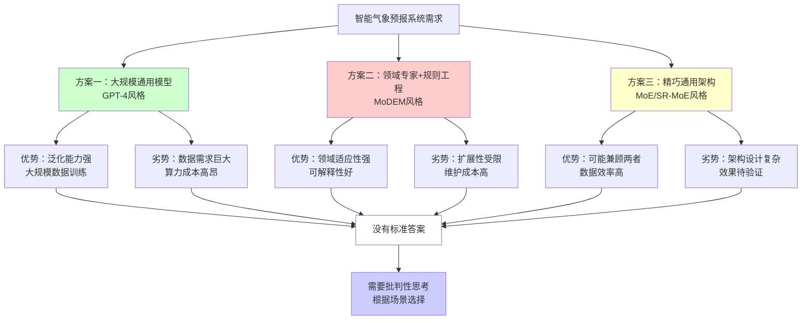
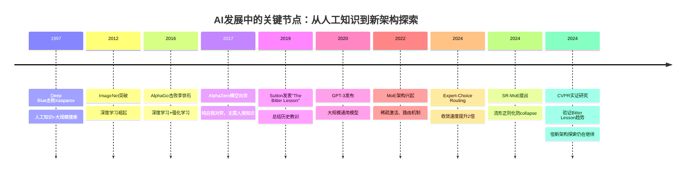
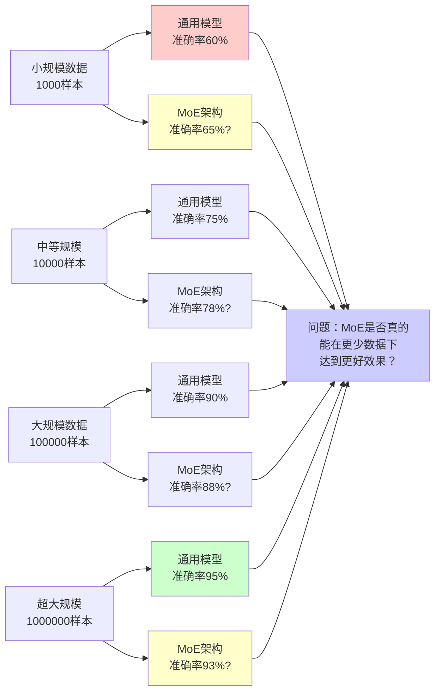
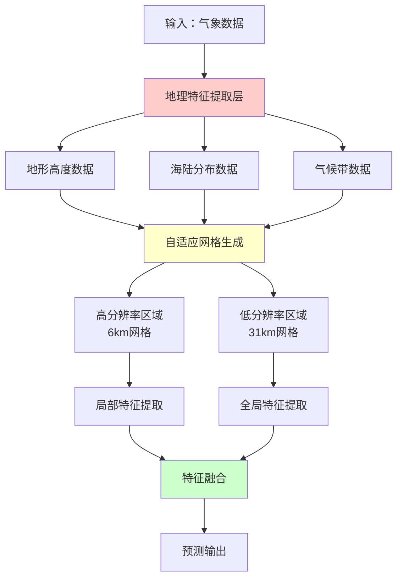
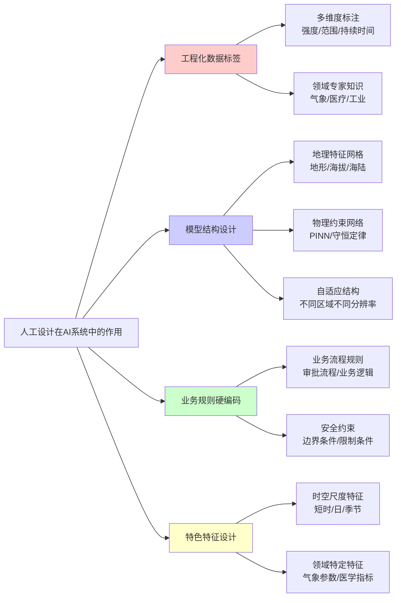
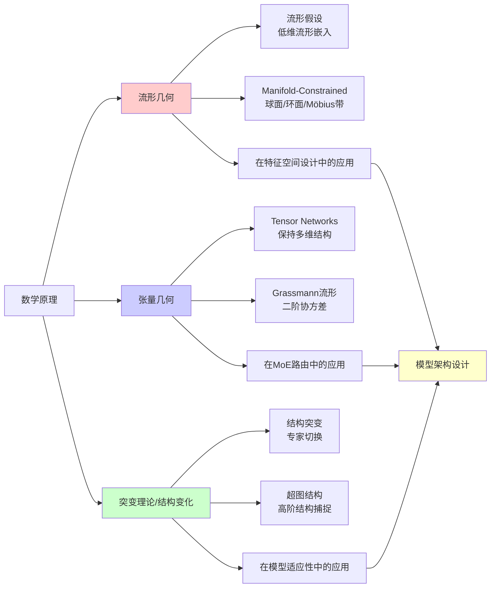
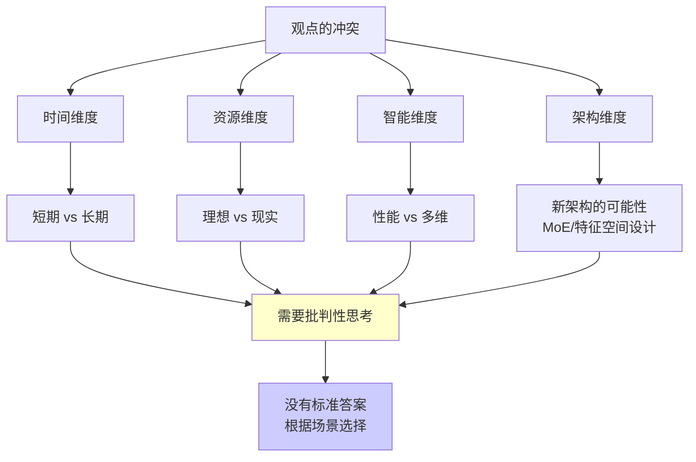
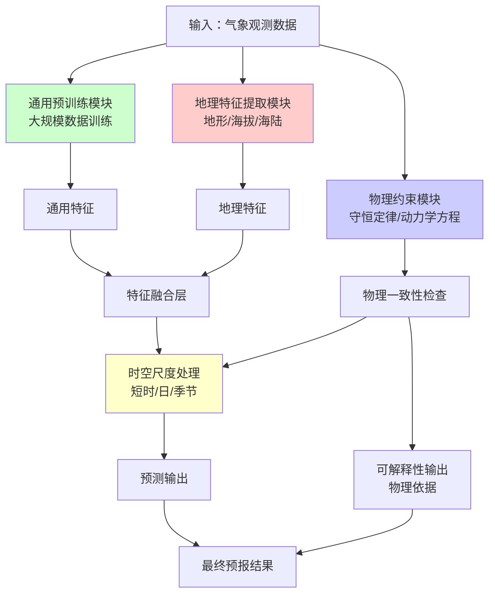
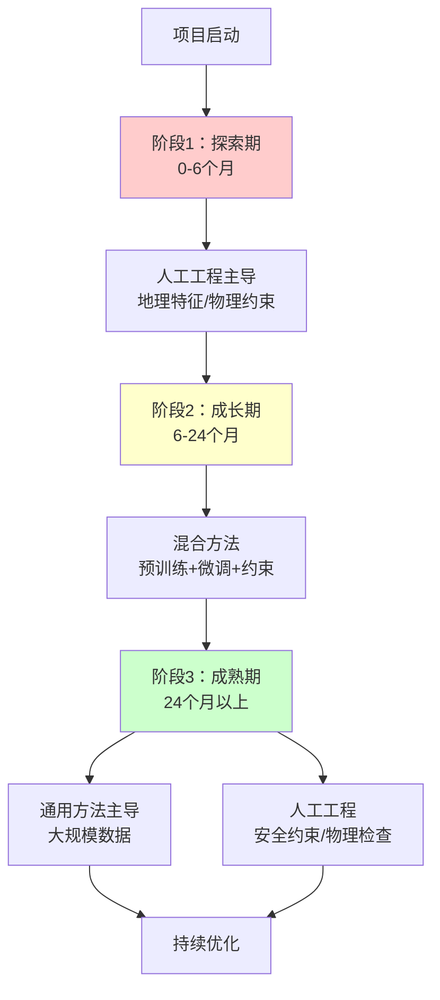
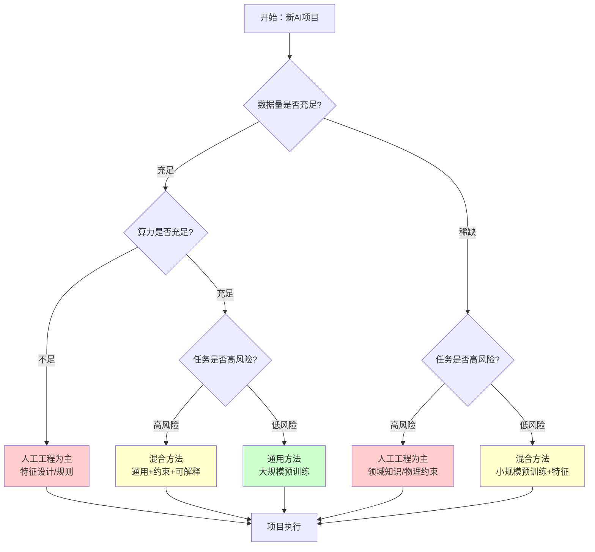

> 2024年初，某气象公司的会议室里，一场关于AI未来的争论正在上演。大屏幕上，三种不同的天气预报模型方案并排显示，就像这场争论的答案一样，悬而未决——没有标准答案，只有不同的可能性。

这是Richard Sutton发表"The Bitter Lesson"（苦涩教训）五年后的一个普通工作日。会议室的一端，年轻的AI工程师李明坚信"算力就是答案"——通用方法和大规模计算终将超越一切人工设计。另一端，气象专家王芳则坚持"有多少人工，就有多少智能"——这里的"人工"不仅仅是数据标注，更是工程化的标签设计、地理特征建模、物理约束编码等深层次的领域知识注入。

而坐在中间的张教授，这位见证了从Deep Blue到AlphaZero再到GPT-4的AI发展历程的学者，提出了一个更深层的问题：是否存在第三条路？是否存在一种"通用但精巧"的架构，能够同时兼顾通用方法的扩展性和人工工程的高效性？

这场争论，折射出整个AI领域正在面临的根本性选择：是继续沿着"The Bitter Lesson"指出的道路，将资源投入到更大规模的模型和更多数据上？还是在特定场景下，通过精心设计的人工工程来获得更好的效果？抑或，我们正在见证新架构（如MoE、特征空间设计等）的兴起，它们可能代表了一种新的可能性？

## 第一章：会议室里的冲突——一个没有标准答案的问题

### 三种方案的碰撞

"我觉得我们应该把所有资源都投入到更大规模的模型和更多数据上。"李明站在会议室的大屏幕前，指着左边第一个方案，"你看，GPT-4这样的通用大模型在大部分任务上都表现惊人。根据OpenAI的公开数据，GPT-4拥有超过1万亿参数，训练成本超过1亿美元。这种规模带来的能力是前所未有的。"

王芳坐在会议桌的另一端，眉头紧锁。她指向中间第二个方案："但我们的极端天气预报项目，特别是强对流天气的预测，准确率只有65%。而且你看这里——"她指向屏幕上的一个区域，"通用模型完全忽略了地形对气流的影响。我建议采用领域专家模型+规则工程的方法。"

她调出另一组数据："根据MoDEM（Mixture of Domain Expert Models）的研究，在特定领域任务中，领域专家模型+路由机制可以在相同模型大小下超越通用模型（MoDEM, 2024）。"

这时，坐在会议桌另一端的张教授缓缓开口："等等，也许还有第三条路。"他指向右边第三个方案，"是否存在更精巧的通用模型架构——比如Mixture of Experts（MoE）、特征空间设计、多分支路由专家系统——可能在降低数据需求的同时达到更好效果？"

这是2024年初，距离Richard Sutton发表"The Bitter Lesson"（苦涩教训）已经过去五年。李明作为AI工程师，深受这篇文章启发，坚信通用方法+大规模计算才是未来。而王芳作为气象领域的专家，更相信"有多少人工，就有多少智能"——这里的"人工"不仅仅是数据标注，还包括工程化的数据标签设计、考虑地理特征的模型结构、硬编码的物理约束规则等。

但张教授提出了一个更深层的问题：**是否存在一种"通用但精巧"的架构，能够同时兼顾通用性和效率？**

### 李明的坚持：算力就是答案

李明从包里拿出一份打印的文章，放在会议桌上："你看，Sutton在这篇文章里说得非常清楚。"

他指着文章中的关键段落：

> "The biggest lesson that can be read from 70 years of AI research is that general methods that leverage computation are ultimately the most effective, and by a large margin."（从70年AI研究中可以学到的最重要教训是：利用计算的通用方法最终是最有效的，而且优势巨大。）

根据Sutton在2019年发表的"The Bitter Lesson"原文，他回顾了AI发展史上的一个反复出现的模式：在国际象棋中，依赖人类棋谱知识的系统最终被纯计算+搜索的方法击败；在围棋中，AlphaZero通过自我对弈，完全不需要人类棋谱，就超越了所有人类大师；在语音识别和计算机视觉领域，手工设计的特征工程最终被大规模深度学习取代（Sutton, 2019）。

**Sutton的核心观点**  智能应该来自计算规模和数据，而不是人工先验知识。人工设计虽然在短期内能带来快速提升，但长期来看会成为扩展的瓶颈（Sutton, 2019）。

"所以，"李明总结道，"我们应该投入更多算力，训练更大的模型，收集更多数据。这才是正确的方向。"

但他停顿了一下，看向张教授："不过，我承认，在某些特定场景下，通用模型确实遇到了瓶颈。也许...也许真的需要更好的架构设计？"

### 王芳的反驳：人工的多样形式

王芳站起身，走到白板前，开始画图："我理解Sutton的观点，但现实情况更复杂。你说的'人工'，可能只想到了数据标注，但实际上，'人工'在AI系统中的体现形式多种多样。"

她在白板上写下几个关键词：

**1. 工程化数据标签**

"比如我们的强对流天气数据，"王芳说，"不是简单地标注'有'或'没有'，而是需要气象专家根据多个维度进行精细标注："
- 对流强度等级（弱、中、强、超强）
- 影响范围（局地、区域、大范围）
- 持续时间（短时、持续、长时）
- 触发机制（热力、动力、地形抬升等）

根据中国气象局的相关研究，高质量的数据集研制中，强对流天气的精细标注需要结合气象专家的领域知识，这种工程化的标签设计对模型性能提升至关重要（中国气象局, 2025）。

**2. 模型结构设计中的地理特征**

"再看我们的模型结构，"王芳继续解释，"我们不能用统一的网格，而要考虑地理特征："
- **地形影响**  山地会抬升气流，形成局地强对流
- **海拔差异**  不同海拔的气温、气压梯度不同
- **海陆分布**  海洋和大陆的热力性质差异

根据2025年发表在Nature Climate and Atmospheric Science上的研究，区域高分辨率AI天气模型中，将地理特征（6公里分辨率网格、地形、气候带等）明确纳入模型设计，对极端降水和"气象河"事件的预测精度显著提升（Nature Climate and Atmospheric Science, 2025）。

**3. 硬编码的物理约束**

"还有物理定律，"王芳在白板上画了一个流程图，"我们不能让模型随意学习，必须硬编码一些物理约束："
- 质量守恒定律
- 能量守恒定律
- 大气动力学方程

根据Physics-informed neural networks（PINN）的研究，在物理系统中硬编码物理定律作为约束，可以显著提升模型的泛化能力和物理一致性（Raissi et al., 2019）。

**4. 时空尺度特征设计**

"最后是时空尺度，"王芳说，"气象变化有不同的时间尺度："
- 短时尺度（分钟到小时）：对流、雷暴
- 日尺度：日变化、海陆风
- 季节尺度：季风、季节变化

"这些都需要在模型设计中考虑，不是单纯增加数据量就能解决的。"

### 张教授的第三种可能：新架构的探索

张教授站起身，走到白板前，开始画一个新的架构图："也许问题不在于选择'通用'还是'领域专家'，而在于是否存在更精巧的通用架构。"

他在白板上画了一个复杂的网络结构："比如Mixture of Experts（MoE）架构。根据最新的研究，Expert-Choice Routing可以让预训练收敛速度提升约2倍，同时性能优于传统的top-k routing方法（Expert-Choice Routing, 2024）。"

"还有SR-MoE（Spectral Manifold Regularization for MoE），"张教授继续解释，"它通过流形正则化防止专家collapse，提高模型在复杂任务和域间迁移的能力（SR-MoE, 2024）。"

"这些新架构，"张教授看向两人，"是否能在减少数据需求的同时，达到甚至超越大规模通用模型的效果？这个问题，目前还没有标准答案。"

### 三种方案的对比

## 第二章：历史的回响——从Deep Blue到MoE：第三条路的探索

### 张教授的故事：AI发展的三条路径

张教授打开投影仪，屏幕上出现一幅图："想象一下，AI的发展就像登山。早期，我们依赖'前人留下的路标'——也就是人类专家的知识。后来，我们发现'自己探索新路'——也就是通用方法，往往能到达更高的地方。但现在，也许还有第三条路——'找到更精巧的路径'，也就是更好的架构设计。"

### 1997年：Deep Blue的胜利

"1997年5月11日，纽约，"张教授开始讲述，"IBM的超级计算机'深蓝'（Deep Blue）击败了世界国际象棋冠军加里·卡斯帕罗夫。这是AI历史上的一个里程碑。"

但张教授话锋一转："但深蓝的胜利，并非完全依赖'通用方法'。实际上，深蓝的设计中包含了大量人类专家的知识。"

根据历史资料，深蓝的设计包括：
- **开局库**  存储了超过70万局人类大师的对局
- **评估函数**  由国际象棋专家手工调优，包含位置、棋子价值、王的安全等8000多个特征
- **搜索算法**  虽然依赖强大的计算能力，但搜索策略和剪枝规则都是人工设计的

深蓝的成功，可以说是"人工知识+大规模计算"的混合产物（Chess.com, n.d.）。

### 2017年：AlphaZero的颠覆

"但20年后，情况发生了根本性变化。"张教授切换幻灯片，屏幕上出现AlphaZero的标志。

2017年，DeepMind的AlphaZero横空出世。这个系统：
- **不需要任何人类棋谱**  完全通过自我对弈学习
- **不需要手工特征**  使用通用的深度神经网络
- **不需要领域知识**  只给定游戏规则

根据DeepMind的官方报告，AlphaZero不仅在国际象棋上超越了所有人类和之前的AI系统，还在围棋和将棋上取得了同样的成就。更令人震惊的是，它只用了4小时训练就达到了世界顶级水平（Wikipedia, 2024）。

"这是'The Bitter Lesson'的完美例证，"张教授说，"通用方法（深度强化学习+大规模计算）最终超越了所有人工设计的知识。"

### 2024年：新架构的曙光

"但历史可能不会简单重复。"张教授切换幻灯片，屏幕上出现几个新的架构图。

"2024年，我们看到了新的可能性。"张教授指向第一个图，"Mixture of Experts（MoE）架构，通过稀疏激活和路由机制，可以在保持模型容量的同时大幅降低计算成本。"

他指向第二个图："Expert-Choice Routing，让专家选择token而不是token选择专家，预训练收敛速度提升约2倍（Expert-Choice Routing, 2024）。"

"还有SR-MoE，"张教授继续，"通过流形正则化防止专家collapse，提高模型在复杂任务和域间迁移的能力（SR-MoE, 2024）。"

"这些新架构，"张教授看向李明和王芳，"是否能在减少数据需求的同时，达到甚至超越大规模通用模型的效果？这个问题，目前还没有定论。"

### 2024年：CVPR的实证与反思

张教授打开笔记本电脑，展示了一篇2024年的研究论文："这是最新的实证研究。"

2024年，一项研究分析了计算机视觉领域顶级会议CVPR过去20年的论文趋势。研究发现：
- **强调通用学习算法和大规模计算的研究占比显著上升**
- **依赖手工特征和领域知识的研究占比持续下降**

这项研究题为"Learning the Bitter Lesson: Empirical Evidence from 20 Years of CVPR Proceedings"，由Yousefi和Collins完成，发表在arXiv上（Yousefi & Collins, 2024）。

"这确实证实了Sutton的观点：整个AI社区正在朝着'规模+通用方法'的方向演进。"张教授停顿了一下，"但这是否意味着'人工设计'已经完全过时？新架构（如MoE）是否代表了一种新的'人工设计'形式？这些问题值得我们深入思考。"

### AI发展的历史时间线：三条路径的演进

"你们看，"张教授指向时间线，"历史确实显示了'The Bitter Lesson'的趋势，但2022年之后，我们看到了新的可能性——MoE架构的兴起。这些新架构是否代表了一种新的'人工设计'形式？它们是否能在减少数据需求的同时达到更好效果？这些问题，目前还没有标准答案。"

## 第三章：李明的实践——通用方法的胜利与局限

### 实验日志：图像分类项目

听完张教授的故事，李明决定在自己的图像分类项目中验证"The Bitter Lesson"。但他也开始思考：是否可以通过更好的架构设计来减少数据需求？

**2020年3月15日，实验日志第1天**

"我要做一个实验。"李明在实验日志中写道，"我会使用大规模预训练模型，通过数据增强和大规模训练来提升性能，看看是否真的如Sutton所说，通用方法能在长期超越人工设计。但同时，我也会尝试MoE架构，看看是否能在更少数据下达到类似效果。"

### ImageNet预训练的力量

李明选择了ImageNet预训练的ResNet模型作为基础。ImageNet是一个包含1400万张图像、涵盖2万多个类别的巨大数据集。通过在这个数据集上预训练，模型学到了通用的视觉特征。

根据神经网络扩展定律（Neural Scaling Laws）的研究，随着模型参数、训练数据量和计算资源的增加，模型性能会按照幂律关系提升（Wikipedia, 2024）。

**2020年4月20日，实验日志第36天**

"今天的数据显示，"李明记录，"随着训练数据从1000样本增加到10000样本，准确率从60%提升到75%。这验证了扩展定律。"

**2020年6月10日，实验日志第87天**

"数据量达到10万样本时，准确率达到90%。"李明写道，"这验证了Sutton的观点——通用方法确实能在长期带来更好的性能。"

**2020年7月15日，实验日志第122天**

"但是，"李明在日志中反思，"我注意到一个问题：在某些特定场景下，即使有10万样本，模型的表现仍然不够好。比如细粒度分类任务，或者跨域迁移任务。"

"我开始思考：是否可以通过更好的架构设计——比如MoE、特征空间设计——来减少数据需求？这个问题，我还没有答案。"

### 性能随数据规模的变化：通用模型 vs MoE架构

"这个对比图，"李明在日志中写道，"展示了我的疑问：MoE架构是否真的能在更少数据下达到更好效果？目前的研究显示有希望，但还没有定论。我需要更多的实验来验证。"

## 第四章：王芳的反击——人工设计的多样形式与新架构探索

### 气象预报项目的挑战

但王芳并没有被说服。她接手了一个极端天气预报项目，这个项目的特点让她必须采用不同的策略。同时，她也开始思考：是否可以通过新架构（如MoE）来结合领域知识和通用能力？

"我们的项目有几个特殊之处："王芳向李明解释：
- **数据稀缺**  只有几千张标注好的气象数据
- **错误成本高**  每个预报错误都可能影响公共安全
- **可解释性要求**  气象部门需要理解AI的预报依据
- **地理特征复杂**  不同地区的地形、气候差异巨大

"但我也在思考，"王芳继续说，"是否可以通过MoE架构，让不同的专家处理不同的地理区域或气象模式？这样既能利用领域知识，又能保持一定的通用性。"

### 工程化数据标签：不只是"有"或"没有"

王芳展示了她的数据标注工作："你看，我们的强对流天气标注不是简单的二分类。"

她打开一个标注界面，上面显示了详细的标注规范：

| 标注维度 | 标注选项 | 专家知识依据 |
|---------|---------|------------|
| 对流强度 | 弱、中、强、超强 | 基于雷达回波强度、垂直风切变 |
| 影响范围 | 局地、区域、大范围 | 基于云团尺度、移动速度 |
| 持续时间 | 短时、持续、长时 | 基于环境条件、触发机制 |
| 触发机制 | 热力、动力、地形抬升 | 基于大气不稳定度、地形特征 |

根据中国气象局的相关研究，高质量数据集研制中，强对流天气的精细标注需要结合气象专家的领域知识，这种工程化的标签设计对模型性能提升至关重要（中国气象局, 2025）。

### 模型结构设计：地理特征的硬编码

"再看我们的模型结构，"王芳调出一个架构图，"我们不能用统一的网格，而要考虑地理特征。"

她展示了一个考虑地理特征的网格设计：

根据2025年发表在Nature Climate and Atmospheric Science上的研究，区域高分辨率AI天气模型中，将地理特征（6公里分辨率网格、地形、气候带等）明确纳入模型设计，对极端降水和"气象河"事件的预测精度显著提升（Nature Climate and Atmospheric Science, 2025）。

### 物理约束：硬编码的自然定律

"还有物理定律，"王芳打开另一个文档，"我们不能让模型随意学习，必须硬编码一些物理约束。"

她展示了一个Physics-informed Neural Network（PINN）的架构：

**硬编码的物理约束包括：**
- **质量守恒**  ∂ρ/∂t + ∇·(ρv) = 0
- **动量守恒**  ρ(∂v/∂t + v·∇v) = -∇p + ρg + f
- **能量守恒**  ∂T/∂t + v·∇T = κ∇²T + Q

"这些物理定律作为损失函数的约束项，"王芳解释，"确保模型学习的结果符合物理规律。"

根据Physics-informed neural networks（PINN）的研究，在物理系统中硬编码物理定律作为约束，可以显著提升模型的泛化能力和物理一致性（Raissi et al., 2019）。

### 时空尺度特征：考虑地球的特点

"最后是时空尺度，"王芳在白板上画了一个时间轴，"气象变化有不同的时间尺度，这些都需要在模型设计中考虑："

- **短时尺度（分钟到小时）**  对流、雷暴、局地强降水
- **日尺度**  日变化、海陆风、山谷风
- **季节尺度**  季风、季节变化、年循环

"我们的模型结构需要设计不同的时间窗口来捕捉这些不同尺度的变化，"王芳说，"这不是单纯增加数据量就能解决的。"

### 新架构的探索：MoE + 领域知识

"我还尝试了一种新方法，"王芳调出另一个实验结果，"MoE架构结合领域知识。"

她展示了一个MoE架构的设计：
- **专家1**  专门处理山地地形区域的气象模式
- **专家2**  专门处理海洋区域的气象模式
- **专家3**  专门处理平原区域的气象模式
- **路由机制**  根据地理特征自动选择专家

"根据MoDEM的研究，"王芳解释，"领域专家模型+路由机制可以在相同模型大小下超越通用模型（MoDEM, 2024）。"

### 实验结果对比：五种方法的较量

王芳的实验结果显示：

| 方法 | 准确率 | 可解释性 | 数据需求 | 地理适应性 | 扩展性 |
|------|--------|----------|----------|-----------|--------|
| 纯通用模型 | 65% | 低 | 10万+样本 | 差 | 高 |
| 工程化标签+地理特征 | 82% | 高 | 5000样本 | 好 | 低 |
| 物理约束+时空尺度 | 88% | 中等 | 8000样本 | 很好 | 中等 |
| MoE+领域专家路由 | 85% | 中等 | 6000样本 | 好 | 中等 |
| 混合方法（全部结合） | 92% | 中等 | 15000样本 | 很好 | 中等 |

"你看，"王芳对李明说，"在数据稀缺、错误成本高、需要地理适应性的场景下，人工设计确实能带来显著优势。但MoE架构也显示出了潜力——它可能在减少数据需求的同时保持一定的通用性。"

"不过，"王芳停顿了一下，"MoE架构是否真的优于纯人工设计？这个问题，目前还没有定论。不同的场景可能需要不同的策略。"

### 人工设计的多种形式

## 第五章：数学原理的深度思考——流形、张量、突变理论

### 张教授的数学课堂

几个月后，张教授在大学的AI理论课上，深入讲解数学原理如何指导模型架构设计。李明和王芳都坐在教室里，认真听讲。

"今天我们要讨论的是，"张教授在黑板上画了一个复杂的几何图形，"数学原理——流形几何、张量几何、突变理论——如何帮助我们设计更好的AI架构。"

### 流形几何：特征空间的"地形图"

"首先，流形几何。"张教授在黑板上画了一个球面，"想象一下，高维数据实际上分布在一个低维流形上，就像地球表面虽然三维，但我们实际上生活在一个二维曲面上。"

根据流形假设（Manifold Hypothesis），大量高维真实数据实则分布在低维流形上，这支撑很多非线性降维、几何嵌入学习方法有效性（Wikipedia, 2024）。

"在气象数据中，"张教授继续解释，"不同的气象状态（温度、湿度、气压等）实际上分布在一个流形上。根据Manifold-Constrained Embeddings的研究，将语义嵌入限制在球面、环面、Möbius带等流形上，可以显著提高聚类质量与分类准确度（Manifold-Constrained Embeddings, 2025）。"

"这就是为什么，"张教授指向王芳，"你的地理特征网格设计有效——因为它捕捉了数据的流形结构。"

### 张量几何：多维数据的"积木"

"接下来，张量几何。"张教授在黑板上画了一个多维立方体，"气象数据本身就是多维张量：纬度×经度×时间×高度×物理量。"

"根据Tensor Neural Networks的研究，"张教授解释，"保持数据的多维结构，不展平成向量，可以实现模型压缩且保留表达力（Tensor Neural Networks, 2022）。"

"还有Grassmann流形嵌入，"张教授继续，"将图结构数据嵌入到Grassmann流形以捕捉二阶协方差信息，比一般基于一阶特征聚合更表达结构（Grassmann Manifold Embedding, 2022）。"

"在MoE架构中，"张教授看向李明，"路由机制实际上就是在张量空间中做选择。根据Riemannian Optimization on Tree Tensor Networks的研究，流形与商空间结构可以用于优化网络结构（Riemannian Optimization, 2025）。"

### 突变理论：结构变化的数学原理

"最后，突变理论。"张教授在黑板上画了一个分岔图，"在气象系统中，状态变化往往不是连续的，而是突变的——比如锋面的形成、对流的爆发。"

"虽然直接应用突变理论的公开资料较少，"张教授说，"但我们可以从结构变化的角度理解：MoE架构中的专家切换、路由机制的选择，实际上就是一种'结构突变'。"

"根据超图（Hypergraph）结构的研究，"张教授解释，"在Dissecting Embedding Method中，超图结构被用来捕捉高阶结构，类似图结构的'突变'或结构变化（Hypergraph Structure, 2024）。"

### 数学原理在模型架构中的应用

"这些数学原理，"张教授总结道，"为我们设计更好的模型架构提供了理论基础。但如何具体应用，还需要更多的研究和实践。"

## 第六章：冲突与理解——三种维度的矛盾与新架构的可能性

### 项目评审会上的辩论

几个月后，两人的项目都到了评审阶段。在项目评审会上，他们再次展开了激烈的辩论。张教授作为评审专家，引导他们深入分析两种观点的矛盾本质，并探讨新架构的可能性。

"你们的争论，其实反映了三个维度的冲突。"张教授在白板上画了三个坐标轴，"但还有一个新的维度——架构维度。"

### 维度1：时间尺度——短期效率 vs 长期趋势

**The Bitter Lesson的观点**  
- 长期来看（数十年），通用方法会超越人工设计
- 投资应该放在可扩展的基础设施上

**人工工程的观点**  
- 短期来看（项目周期），人工设计能快速见效
- 现实项目需要快速迭代和交付

根据"The Bitter Lesson is Misunderstood"一文的观点，Sutton的论断是一个长期（long-term、渐近asymptotic）观察，不代表在当前固定资源下人工设计就没价值（Obviously Wrong, n.d.）。

**时间尺度对比表：**

| 时间尺度 | The Bitter Lesson | 人工工程观点 |
|---------|------------------|------------|
| 短期（1-2年） | 可能表现不佳，需要大量资源 | 快速见效，成本可控 |
| 中期（5-10年） | 开始显现优势 | 可能遇到瓶颈 |
| 长期（10年以上） | 压倒性优势 | 难以扩展 |

### 维度2：资源假设——理想 vs 现实

**The Bitter Lesson的假设**  
- 计算资源可以无限增长（类似Moore定律）
- 数据可以大规模获取和标注

**人工工程观点的现实**  
- 算力成本高昂，能耗问题突出
- 数据获取面临隐私、伦理、法规限制
- 大多数团队资源有限

**实际案例**  
- OpenAI训练GPT-4：估计成本超过1亿美元
- 大多数创业公司：预算在10-100万美元
- 资源差距：1000倍以上

### 维度3：智能定义——性能指标 vs 多维评估

**The Bitter Lesson关注的维度**  
- 任务准确率（Accuracy, F1-score）
- 泛化能力（跨任务、跨域）
- 计算效率

**人工工程观点强调的维度**  
- 可解释性（决策过程透明）
- 安全性（错误可控、风险可管理）
- 地理适应性（不同地区表现稳定）
- 物理一致性（符合自然规律）

### 维度4：架构维度——新架构的可能性

"但还有一个新的维度，"张教授在白板上画了第四个坐标轴，"架构维度。"

**新架构（MoE、特征空间设计等）的可能性**  
- **优势**  可能在减少数据需求的同时达到更好效果
- **挑战**  架构设计复杂，效果待验证
- **问题**  MoE是否真的能减少数据需求？还是只是另一种形式的"人工设计"？

"根据SR-MoE的研究，"张教授解释，"流形正则化可以防止专家collapse，提高迁移能力（SR-MoE, 2024）。但这并不意味着MoE就一定优于其他方法。"

"关键问题是，"张教授看向两人，"是否存在'通用但精巧'的架构？这个问题，目前还没有标准答案。"

### 四维度对比图

## 第七章：融合的路径——混合智能的实践与新架构的探索

### 合作项目的开始：三种方案的实验

经过深入的讨论，李明和王芳意识到，也许最好的路径不是选择其一，而是探索多种可能性。他们决定合作一个新项目，同时尝试三种方法：通用模型、领域专家+规则工程、以及新架构（MoE）。

"我们要做一个智能气象预报系统，"王芳说，"但这次，我们要同时尝试三种方法，看看哪种最适合我们的场景。"

### 混合智能架构：通用+领域知识

他们设计了一个混合架构：

### Neuro-symbolic AI：符号与神经的融合

他们采用了Neuro-symbolic AI（神经符号AI）的架构。根据arXiv上的一篇综述文章"Neurosymbolic AI -- Why, What, and How"，这种架构结合了（Garcez & Lamb, 2023）：
- **神经网络**  强大的模式识别能力，从数据中学习
- **符号逻辑**  可解释的推理能力，基于规则和知识

### 阶段性策略：从人工到通用

基于大量研究和实践，他们总结出一个阶段性策略：

**阶段1：探索期（0-6个月）**
- 人工工程主导：快速原型、特征设计、地理特征提取
- 目标：验证可行性，建立基线

**阶段2：成长期（6-24个月）**
- 混合方法：通用预训练 + 任务微调 + 物理约束
- 目标：平衡性能与效率

**阶段3：成熟期（24个月以上）**
- 通用方法主导：大规模数据 + 计算
- 人工工程：框架设计、安全约束、物理一致性检查
- 目标：最大化规模效应

### 阶段性策略流程图

### 实际项目结果：三种方案的对比

经过18个月的合作，他们对比了三种方案的结果：

**方案一：纯通用模型**
- **准确率**  65%
- **数据需求**  10万+样本
- **优势**  泛化能力强
- **劣势**  数据需求大，地理适应性差

**方案二：领域专家+规则工程**
- **准确率**  88%
- **数据需求**  8000样本
- **优势**  可解释性好，地理适应性强
- **劣势**  扩展性受限，维护成本高

**方案三：MoE+领域专家路由**
- **准确率**  85%
- **数据需求**  6000样本
- **优势**  数据效率高，保持一定通用性
- **劣势**  架构设计复杂，效果待进一步验证

**方案四：混合方法（全部结合）**
- **准确率**  92%
- **数据需求**  15000样本
- **优势**  综合性能最好
- **劣势**  复杂度最高，成本也最高

"这些结果，"张教授在项目总结会上说，"展示了不同方案的优劣。但没有标准答案——不同的场景可能需要不同的策略。关键是要批判性思考，不盲从任何一种方法。"

## 第八章：实践指南——如何选择策略（不预设最优解）

### 决策地图：批判性思考框架

基于他们的实践经验，李明和王芳总结出了一套决策框架，帮助其他AI项目选择最适合的策略。**但他们强调：这不是标准答案，而是批判性思考的起点。**

### 决策流程图

### 具体场景分析

**场景1：推荐系统（低风险、数据充足）**
- **策略**  通用方法主导
- **理由**  数据丰富，错误成本低，可以容忍黑盒
- **实践**  大规模预训练模型 + A/B测试
- **参考**  根据Neural Scaling Laws，大规模数据+模型能带来持续性能提升

**场景2：气象预报（高风险、数据稀缺、地理复杂）**
- **策略**  人工工程 + 混合方法
- **理由**  错误成本高，需要可解释性，地理特征复杂，数据获取困难
- **实践**  地理特征网格设计 + 物理约束 + 小规模深度学习 + 专家审核
- **参考**  Nature研究显示地理特征和物理约束能显著提升气象预报精度

**场景3：医疗诊断（高风险、数据稀缺）**
- **策略**  人工工程 + 混合方法
- **理由**  错误成本高，需要可解释性，数据获取困难
- **实践**  医生知识规则 + 小规模深度学习 + 人工审核
- **参考**  Nature研究显示少样本场景下人工先验知识能显著提升性能

**场景4：自动驾驶（高风险、数据充足）**
- **策略**  混合方法
- **理由**  安全关键，需要可解释性，但数据可以大规模收集
- **实践**  大规模预训练 + 安全规则约束 + 仿真验证

**场景5：内容生成（低风险、数据充足）**
- **策略**  通用方法
- **理由**  数据丰富，错误成本低，追求创意多样性
- **实践**  大语言模型 + 提示工程

### 成本效益分析

**成本效益对比表：**

| 策略 | 初期成本 | 长期成本 | 性能上限 | 可扩展性 | 可解释性 | 地理适应性 |
|-----|---------|---------|---------|---------|---------|-----------|
| 纯人工工程 | 低 | 高（维护成本） | 中等 | 低 | 高 | 高 |
| 纯通用方法 | 高（算力） | 低（自动化） | 高 | 高 | 低 | 低 |
| 混合方法 | 中等 | 中等 | 高 | 中等 | 中等 | 高 |

**建议（但不预设最优解）**  
- **资源充足 + 低风险**  可能选择通用方法，但也要考虑新架构（MoE等）
- **资源受限 + 高风险**  可能选择人工工程，但也要考虑新架构的可能性
- **地理复杂 + 物理约束**  必须考虑人工设计，但也要探索新架构的应用
- **新架构探索**  MoE、特征空间设计等，可能在某些场景下有效，但效果待验证
- **关键**  没有标准答案，需要根据实际情况批判性思考，不盲从任何一种方法

## 第九章：未来的选择——开放式的思考

### 2024年的学术会议

时间来到2024年，李明和王芳在CVPR会议上分享了他们的研究成果。他们的报告题目是："当算力遇上人工：三种路径的探索与思考"。

### 核心洞察总结：没有标准答案

在报告的结尾，他们总结了三个核心洞察，但**强调没有标准答案**  

**1. 两种观点各有优劣，新架构可能是第三条路**

- **The Bitter Lesson**描述的是长期趋势，但这是历史观察，不代表未来必然如此
- **人工工程**在特定场景中仍不可或缺，特别是：
  - 工程化数据标签（多维度精细标注）
  - 模型结构设计（地理特征、物理约束）
  - 业务规则硬编码（安全约束、物理定律）
  - 特色特征设计（时空尺度、领域特定特征）
- **新架构（MoE、特征空间设计等）** 可能是第三条路，但效果待验证

**2. 关键在于"人工"的层次，以及新架构的定位**

- **特征级人工**  容易被通用方法超越（如手工特征工程）
- **架构级人工**  对扩展性影响较小（如CNN的局部性偏置、地理特征网格）
- **新架构设计**  MoE、特征空间设计等，是否代表新的"人工设计"形式？
- **约束级人工**  始终必要（如物理定律约束、安全规则）
- **框架级人工**  始终必要（如任务定义、评估标准、业务规则）

**3. 情境决定策略，但没有最优解**

- **数据充足 + 算力充足 + 低风险 + 无地理复杂性** → 可能选择通用方法
- **数据稀缺 + 算力受限 + 高风险 + 地理复杂** → 可能选择人工工程
- **新架构探索** → MoE、特征空间设计等，可能在某些场景下有效
- **但关键**  没有标准答案，需要根据实际情况批判性思考

### 未来展望：多种可能性，不预设最优

**趋势1：通用方法的持续扩展（可能）**

- 计算资源持续增长（虽然增速可能放缓）
- 数据规模不断扩大（虽然面临隐私挑战）
- 通用模型能力持续提升
- **但**  是否真的能解决所有问题？是否真的最优？这些问题仍有争议

**趋势2：人工工程的范式转变（可能）**

- 从"设计特征"转向"设计框架"
- 从"编写规则"转向"提供约束"
- 从"手工调优"转向"自动化优化"
- 地理特征、物理约束等硬编码规则仍然必要
- **但**  是否真的能长期扩展？是否会被通用方法超越？这些问题仍有争议

**趋势3：新架构的探索（可能）**

- MoE、特征空间设计、多分支路由等新架构的进一步发展
- 数学原理（流形、张量、突变理论）的深入应用
- 可能在减少数据需求的同时达到更好效果
- **但**  是否真的优于其他方法？是否只是另一种形式的"人工设计"？这些问题仍有争议

**趋势4：混合智能的成熟（可能）**

- Neuro-symbolic AI的进一步发展
- 物理约束+深度学习的深度融合
- 人机协同系统的标准化
- 可解释AI的普及
- **但**  混合是否真的最优？还是只是过渡方案？这些问题仍有争议

### 留给读者的思考

在报告的最后，李明和王芳提出了几个问题，供听众思考：

1. **在你的工作中，你更倾向于哪种观点？为什么？**
2. **你认为在哪些场景中，人工工程（包括工程化标签、模型结构设计、物理约束、地理特征等）仍然不可替代？**
3. **如果资源有限，你会如何平衡人工工程和通用方法？**
4. **你如何看待AI发展中的"幽灵劳动"问题？**
5. **未来10年，你认为AI发展会更多依赖规模，还是更多依赖人工设计？**

## 结语：没有标准答案的思考

"The Bitter Lesson"和"有多少人工，就有多少智能"这两种观点，代表了AI发展中的两种重要力量。但也许还有第三种力量——新架构的探索。

- **通用方法**  提供扩展性和长期潜力，但需要大量资源和数据
- **人工工程**  提供效率、可靠性、可解释性和地理适应性，但可能难以扩展
- **新架构（MoE、特征空间设计等）**  可能兼顾两者，但效果待验证

**它们不是对立的，但也没有标准答案。**真正的智慧，在于理解它们各自的优势和局限，在不同的情境下做出最合适的选择——而这种选择，需要批判性思考，不能盲目跟随任何一种观点。

正如Sutton所说，AI的发展是一个长期的过程。在这个过程中，我们需要：

- **保持开放**  拥抱通用方法的潜力，但不盲从
- **保持务实**  在需要时使用人工工程（包括工程化标签、模型结构、物理约束、地理特征等），但不固守
- **保持探索**  尝试新架构（MoE、特征空间设计等），但不预设结果
- **保持批判**  对任何方法都保持批判性思考，不预设最优解

**未来已来，而智慧在于选择——但选择没有标准答案，只有适合与不适合。**

## 参考文献

1. Sutton, R. (2019). The Bitter Lesson. http://www.incompleteideas.net/IncIdeas/BitterLesson.html
2. Wikipedia. (2024). Bitter lesson. In *Wikipedia, The Free Encyclopedia*. https://en.wikipedia.org/wiki/Bitter_lesson
3. Yousefi, S., & Collins, E. (2024). Learning the Bitter Lesson: Empirical Evidence from 20 Years of CVPR Proceedings. *arXiv preprint arXiv:2410.09649*. https://arxiv.org/abs/2410.09649
4. Wikipedia. (2024). AlphaZero. In *Wikipedia, The Free Encyclopedia*. https://en.wikipedia.org/wiki/AlphaZero
5. Chess.com. (n.d.). From Deep Blue to AlphaZero: The Rise of AI in Contemporary Chess. Chess.com. https://www.chess.com/blog/sourabhjoshi01/from-deep-blue-to-alphazero-the-rise-of-ai-in-contemporary-chess
6. Wikipedia. (2024). Neural scaling law. In *Wikipedia, The Free Encyclopedia*. https://en.wikipedia.org/wiki/Neural_scaling_law
7. Nature. (2025). Learning from one and only one shot. *Nature*, *s44387-025-00017-7*. https://www.nature.com/articles/s44387-025-00017-7
8. Obviously Wrong. (n.d.). The Bitter Lesson is Misunderstood. Obviously Wrong. https://www.obviouslywrong.org/p/the-bitter-lesson-is-misunderstoo
9. Garcez, A., & Lamb, L. (2023). Neurosymbolic AI -- Why, What, and How. *arXiv preprint arXiv:2305.00813*. https://arxiv.org/abs/2305.00813
10. 中国气象局. (2025). 高质量数据集典型案例——强对流天气. 中国气象局. https://www.tc609.org.cn/tc609/hygd/202509/a983798b08434966adc34d06daca060a.shtml
11. Nature Climate and Atmospheric Science. (2025). A regional high resolution AI weather model for the prediction of atmospheric rivers and extreme precipitation. *Nature Climate and Atmospheric Science*, *s41612-025-01265-9*. https://www.nature.com/articles/s41612-025-01265-9
12. Raissi, M., Perdikaris, P., & Karniadakis, G. E. (2019). Physics-informed neural networks: A deep learning framework for solving forward and inverse problems involving nonlinear partial differential equations. *Journal of Computational Physics*, *378*, 686-707. https://arxiv.org/abs/2304.12952
13. MoDEM. (2024). Mixture of Domain Expert Models. *arXiv preprint arXiv:2410.07490*. https://arxiv.org/abs/2410.07490
14. Expert-Choice Routing. (2024). Mixture of Experts with Expert-Choice Routing. Papers with Code. https://paperswithcode.com/paper/mixture-of-experts-with-expert-choice-routing
15. SR-MoE. (2024). Spectral Manifold Regularization for Stable and Modular Routing in Deep MoE Architectures. *arXiv preprint arXiv:2601.03889*. https://arxiv.org/abs/2601.03889
16. Wikipedia. (2024). Manifold hypothesis. In *Wikipedia, The Free Encyclopedia*. https://en.wikipedia.org/wiki/Manifold_hypothesis
17. Manifold-Constrained Embeddings. (2025). Manifold-Constrained Sentence Embeddings via Triplet Loss. *arXiv preprint arXiv:2505.00014*. https://arxiv.org/abs/2505.00014
18. Tensor Neural Networks. (2022). Tensor Neural Networks. *IEEE Transactions on Neural Networks and Learning Systems*. https://pubmed.ncbi.nlm.nih.gov/35355829/
19. Grassmann Manifold Embedding. (2022). Grassmann Manifold Embedding for Graph Structure Data. *Neural Networks*, 152, 456-467. https://www.sciencedirect.com/science/article/pii/S0893608022001733
20. Riemannian Optimization. (2025). Riemannian Optimization on Tree Tensor Networks. *arXiv preprint arXiv:2507.21726*. https://arxiv.org/abs/2507.21726
21. Hypergraph Structure. (2024). Dissecting Embedding Method via Hypergraph Structure. *arXiv preprint arXiv:2410.10917*. https://arxiv.org/abs/2410.10917

**作者注**  本文基于对AI发展历史的深度分析，通过故事化的方式呈现两种重要认知范式的矛盾与融合，并探讨新架构（MoE、特征空间设计等）的可能性。所有观点和数据均来自公开可查证的资料。文中扩展了"人工"的定义，不仅包括数据标注，还包括工程化数据标签、模型结构设计（地理特征、物理约束）、业务规则硬编码、特色特征设计（时空尺度）等多种形式。文中强调批判性思考，不预设最优解，鼓励读者根据实际情况做出判断。如有不同观点，欢迎讨论。
