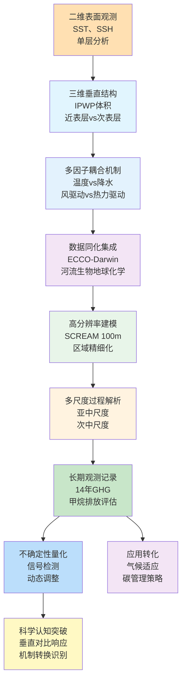
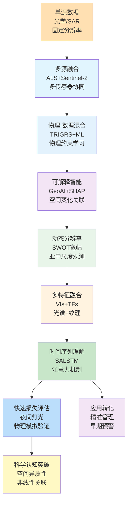
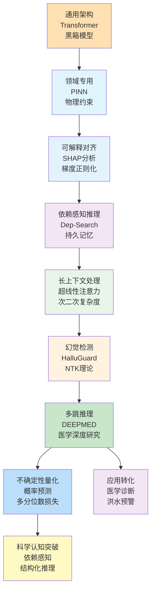
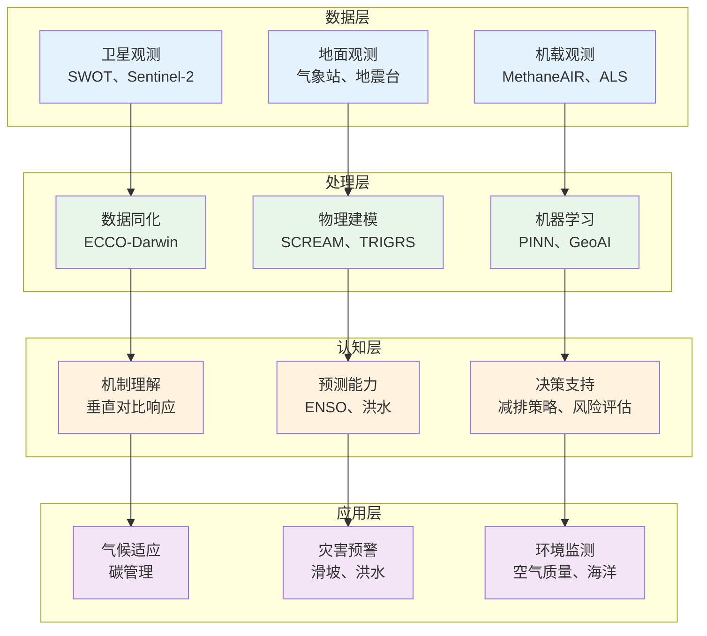
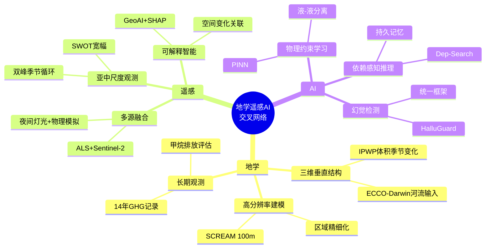

在2026年1月18日至1月27日这十天里，Nature、Science、Journal of Climate、Remote Sensing、Geophysical Research Letters、Journal of Geophysical Research等顶刊上涌现的722篇论文中，有超过150篇直接或间接地涉及地学、遥感与人工智能的交叉融合。本文系统梳理这些方向的最新研究现状、技术特点与未来趋势，并在数据与文献的基础上，给出未来3–5年可检验的技术判断。

## 一、引言：从"三维观测"到"依赖感知"的范式演进

2026年1月中旬，传统的地学观测正在被"三维垂直结构解析"所深化，从近表层到次表层的季节变化对比揭示了气候系统的复杂响应机制；遥感技术从"单源数据"转向"多源融合智能理解"，通过SWOT宽幅卫星高度计和可解释GeoAI实现对海洋亚中尺度过程和大气污染的空间变化非线性关联的精细化解析；而人工智能，特别是物理信息神经网络和依赖感知推理技术，正在成为连接"物理约束"与"数据驱动"的桥梁。

今天，当我们回望这些天的学术产出，会发现清晰的信号：

- **地学** 从二维表面观测走向三维垂直结构，从单一驱动因子分析走向多因子耦合机制，从静态描述走向动态预测
- **遥感** 从单源数据走向多源融合，从固定分辨率走向动态分辨率，从像素级分类走向语义级理解
- **人工智能** 从通用架构走向领域专用，从黑箱模型走向可解释对齐，从单任务学习走向依赖感知的多任务协同

在这样一个信息高度密集的时间切片里，本文尝试围绕核心维度——

- **技术路线** 每个方向的核心方法论与创新路径
- **技术特点** 区别于传统方法的独特优势与局限
- **重要结论** 对未来研究与应用具有指导意义的发现

进行系统梳理与结构化解读。

## 二、地学方向：从"二维表面"到"三维垂直结构"的深化

**表1：地学方向代表性研究的技术路线与特点**

| 研究主题 | 技术路线 | 技术特点 | 重要结论 |
|---------|---------|---------|---------|
| IPWP近表层与次表层季节变化对比 | 三维体积计算 + 季节循环分析 | 垂直对比响应、气候驱动机制识别 | 近表层IPWP在冬季扩张更快，次表层在夏季扩张更快，呈现垂直相反的响应模式 |
| ECCO-Darwin河流生物地球化学输入 | JRA55-do + Global NEWS 2 + 敏感性实验 | 数据同化、多流域耦合、碳循环量化 | 河流输入驱动全球CO2净释放0.02 Pg C yr⁻¹，但区域差异显著，营养盐主导区域表现为碳汇 |
| SCREAM区域精细化100米分辨率 | RRM技术 + GPU加速 + SHOC湍流参数化 | LES尺度、尺度感知、稳定运行 | 首次实现全球模式在100米分辨率稳定运行，显著改善近地面风场、温度、湿度偏差 |
| 甲烷排放评估MethaneAIR | 机载成像光谱仪 + 源解析 + 损失率计算 | 高分辨率、全区域覆盖、多盆地对比 | 美国陆上油气生产甲烷排放约9 Tg yr⁻¹，损失率1.6%，是EPA报告的5倍 |
| 沿海湿地氮沉降与碳固存 | 高分辨率湿地分类 + 空气质量模型 + NPP估算 | 源汇耦合、时空变化、生态系统响应 | 氮沉降增强暖季碳固存，红树林NPP最高约776.16 g C m⁻² yr⁻¹ |
| 土壤甲烷通量地形尺度上推 | 机器学习 + DEM地形属性 + 景观尺度预测 | 空间外推、季节变化、不确定性量化 | 地形在甲烷通量空间变异性中起主导作用，景观尺度通量范围-0.34至-1.28 gCH4 ha⁻¹ h⁻¹ |
| 印度洋环流与海洋垃圾扩散 | SYMPHONIE + 高分辨率网格 + 波浪强迫 | 多尺度过程、拉格朗日追踪、能量收支 | 波浪强迫显著影响轨迹统计，斯托克斯漂移在阿拉伯海西南季风期间具有显著季节效应 |
| 全球陆地碳汇人为信号出现时间 | 大集合模拟 + 时间出现检测 + 动态调整 | 信号检测、不确定性量化、政策应用 | 全球净碳汇人为信号在1960-2009年期间26-66年出现，GPP和TER出现时间更短（8-13年和6-10年） |
| 冰下湖D2地震分析 | 地震数据处理 + 合成地震图 + 波传播建模 | 结构解析、不确定性量化、钻探指导 | 确认水柱厚度约82米或10米（取决于沉积层模型），为未来钻探提供结构约束 |
| 温室气体排放变异性 | 14年连续观测 + 涡度协方差 + 离散采样 | 长期记录、多通量路径、水库老化 | CH4排放峰值在暖干期，CO2峰值在冷干期，14年累计排放10736 Gg CO2当量 |

### 2.1 专题画像：IPWP近表层与次表层季节变化的垂直对比响应

**（1）技术路线：从表面观测到三维体积计算**

Qiuying Gan等（2026）在Journal of Climate上发表了关于近表层与次表层印太暖池（IPWP）体积季节性长期趋势对比的研究。该研究首次将IPWP分析扩展到三维体积，通过计算0-60米（近表层）和60-100米（次表层）的IPWP体积，揭示了垂直相反的季节响应模式。研究使用卫星时代的海温数据，定义了IPWP为温度高于28.5°C的水体体积，并计算了1979-2022年期间的季节循环振幅变化趋势。研究发现，近表层IPWP在冬季（12-2月）扩张速度比夏季（6-8月）快，而次表层IPWP则呈现相反的模式。这种垂直对比响应主要由近表层和次表层IPWP扩张能力的季节循环差异决定，而扩张能力又由气候态印太海温空间格局的季节变化决定（Gan等，2026）。

**（2）技术特点：垂直对比响应与机制识别**

该研究的关键创新在于将IPWP分析从二维表面扩展到三维体积，并揭示了近表层与次表层对气候变化的垂直相反响应。传统的IPWP研究主要关注表面面积或表面温度，而该研究通过体积计算揭示了更深层的物理机制。研究发现，近表层IPWP季节循环振幅显著减弱（-1.03×10⁴ km³/decade），而次表层IPWP季节循环振幅显著增强（+0.4×10⁴ km³/decade），这种垂直对比响应主要由季节循环的容量差异决定。

**（3）重要结论：三维IPWP对气候变化的复杂响应**

该研究的重要结论是：**IPWP对气候变化的响应在垂直方向上呈现相反模式，近表层在冬季扩张更快，次表层在夏季扩张更快，这种垂直对比响应主要由季节循环的容量差异决定，对理解热带降水的季节迁移和未来气候变化预测具有重要意义**。这一发现不仅提高了我们对IPWP三维结构的理解，还为改进气候模式中的IPWP表示提供了新的约束。

### 2.2 专题画像：ECCO-Darwin河流生物地球化学输入的敏感性分析

**（1）技术路线：从物理海洋到生物地球化学耦合**

Raphaël Savelli等（2026）在Geoscientific Model Development上发表了关于ECCO-Darwin模型中河流生物地球化学输入敏感性分析的研究。该研究首次将河流碳和营养盐输入集成到ECCO-Darwin数据同化全球海洋生物地球化学模型中，使用JRA55-do日淡水排放数据结合Global NEWS 2流域模型，生成了来自全球5171个流域的河流生物地球化学输入。研究进行了敏感性实验，量化了河流输入对沿海和开阔大洋生物地球化学的影响。研究发现，添加河流输入驱动了小的CO2净释放（+0.02 Pg C yr⁻¹），这是由于区域尺度的补偿过程。在碳主导的边缘海（如热带大西洋和北冰洋），添加河流输入增加了CO2释放（分别+13%和+9%）。相反，在营养盐主导的东南亚，径流导致CO2吸收增加（+9%）。这一新的河流生物地球化学输入能力将使未来的ECCO-Darwin解决方案能够更好地捕捉全球海洋沿海边缘发生的关键过程（Savelli等，2026）。

**（2）技术特点：数据同化与多流域耦合**

该研究的关键创新在于将河流生物地球化学输入集成到数据同化全球海洋生物地球化学模型中，实现了从流域到海洋的完整碳和营养盐循环。研究使用优化的ECCO-Darwin模型配置，结合日淡水排放数据和流域模型，生成了高分辨率的河流生物地球化学输入。这种集成方法使得模型能够同时考虑物理、化学和生物过程，从而更准确地模拟海洋碳循环对陆地输入的响应。

**（3）重要结论：河流输入对海洋碳循环的区域差异影响**

该研究的重要结论是：**河流生物地球化学输入对全球海洋碳循环的影响存在显著区域差异，碳主导的边缘海表现为CO2源，营养盐主导的边缘海表现为CO2汇，这种差异主要由营养盐输入驱动的生物泵强度决定**。这一发现不仅提高了我们对陆地-海洋碳通量的理解，还为改进全球碳预算估算和气候敏感型水电规划提供了科学基础。

### 2.3 专题画像：SCREAM区域精细化100米分辨率LES尺度模拟

**（1）技术路线：从全球模式到区域精细化LES**

Jishi Zhang等（2026）在Geoscientific Model Development上发表了关于SCREAM模型在旧金山湾区100米分辨率区域精细化网格（RRM）的研究。该研究首次实现了全球模式SCREAM在100米水平分辨率稳定运行，使用区域精细化网格技术，在旧金山湾区实现了100米分辨率，而全球其他区域保持3.25公里分辨率。研究进行了两个回算模拟，测试了强天气强迫和弱边界层驱动条件下的性能。研究证明，SCREAM可以在LES尺度稳定运行，同时真实地捕捉地形、地表异质性和海岸过程。100米SCREAM-RRM显著改善了近地面风速、温度、湿度和气压偏差，相比基线3.25公里模拟，更好地再现了细尺度风振荡和边界层结构。这些进展利用了SCREAM的尺度感知SHOC湍流参数化，该参数化在不同尺度之间平滑过渡而无需调参。性能测试表明，虽然仅CPU模拟仍然昂贵，但在NERSC的Perlmutter系统上使用SCREAMv1的GPU加速使得两天的回算能够在不到两个日历日内完成（Zhang等，2026）。

**（2）技术特点：尺度感知与GPU加速**

该研究的关键创新在于实现了全球模式在LES尺度的稳定运行，通过区域精细化网格技术和GPU加速，实现了计算效率与分辨率的平衡。SCREAM的尺度感知SHOC湍流参数化使得模型能够在不同尺度之间平滑过渡，无需针对不同分辨率进行参数调整。GPU加速使得100米分辨率的模拟在合理时间内完成，为未来高分辨率气候研究开辟了新的可能性。

**（3）重要结论：全球模式在LES尺度的可行性**

该研究的重要结论是：**SCREAM模型可以在100米分辨率稳定运行，显著改善近地面气象要素的模拟精度，为研究地形流、边界层湍流和海岸云提供了新的工具，同时GPU加速使得这种高分辨率模拟在计算上可行**。这一发现不仅证明了全球模式在LES尺度的可行性，还为未来高分辨率气候研究提供了新的范式。

### 2.4 专题画像：MethaneAIR评估美国陆上油气生产甲烷排放

**（1）技术路线：机载成像光谱仪与源解析**

Katlyn MacKay等（2026）在Atmospheric Chemistry and Physics上发表了关于使用MethaneAIR机载成像光谱仪评估美国陆上油气生产甲烷排放的研究。该研究使用MethaneAIR数据量化了占美国陆上油气生产70%的区域的甲烷排放，评估了2023年的总排放量。研究发现，所有观测区域的总甲烷排放量约为9（7.8-10）Tg yr⁻¹，其中约90%来自油气部门（约8 Tg yr⁻¹，相当于总气体产量的1.6%甲烷损失率），这大约是EPA报告的五倍。油气排放和气体生产归一化甲烷损失率在不同盆地间差异很大。高生产力盆地如二叠纪、阿巴拉契亚和Haynesville-Bossier具有最高的甲烷排放（95-314 t h⁻¹），而低生产力盆地如Uinta和Piceance可能由于较老的基础设施而具有更高的损失率（>7%）。研究发现，MethaneAIR量化的总排放量与其他经验和遥感估算在国家级、盆地级和目标级尺度上具有良好一致性（MacKay等，2026）。

**（2）技术特点：高分辨率与全区域覆盖**

该研究的关键创新在于使用机载成像光谱仪实现了高分辨率的甲烷排放量化，能够识别和量化单个排放源，同时提供区域尺度的排放总量估算。MethaneAIR的高空间分辨率使得研究能够区分不同盆地的排放特征，并识别出高损失率的区域，为针对性减排提供了科学依据。

**（3）重要结论：甲烷排放量显著高于官方报告**

该研究的重要结论是：**美国陆上油气生产的甲烷排放量约为EPA报告的五倍，不同盆地间的排放强度和损失率差异显著，高生产力盆地排放总量高，而低生产力盆地损失率更高，这为制定针对性的减排策略提供了重要依据**。这一发现不仅揭示了甲烷排放的严重性，还为改进排放清单和追踪减排目标提供了关键数据。

### 2.5 专题画像：沿海湿地氮沉降与碳固存耦合机制

**（1）技术路线：高分辨率湿地分类与NPP估算**

Jia Liu等（2026）在Biogeosciences上发表了关于东亚沿海湿地大气氮沉降通量及其对生态系统碳固存影响的研究。该研究整合了高分辨率湿地类型数据、船舶排放清单和区域氮沉降模拟，从源汇耦合的角度量化了东亚沿海湿地的氮输入。首先，使用空气质量模型模拟和评估了东亚沿海湿地地区的大气氮沉降通量。氮沉降通量与分类湿地图进行空间耦合。使用改进的光利用效率模型估算净初级生产力（NPP），整合了来自遥感的太阳辐射和光合有效辐射比例（FPAR）。然后使用基于NPP的化学计量关系量化碳固存和氧气释放。结果表明，东亚沿海湿地的总氮沉降遵循"南高北低"和"城市工业集群强、偏远海岸带弱"的一般梯度。平均而言，船舶排放对NO3--N和NH4+-N沉降的贡献分别为10.13%和15.22%，而对气态NH3-N的贡献可忽略不计。在湿地类型中，盐沼接收的单位面积氮输入最高（654.99 mg NO3--N m⁻² yr⁻¹），尽管由于空间覆盖广泛，潮滩主导了区域总氮输入。干湿沉降表现出显著的季节变化：由于频繁降雨，湿沉降在春季和夏季始终占主导地位，而干沉降在秋冬季节变得越来越突出。碳固存能力显示出与氮沉降的强时空耦合。红树林表现出最高的年NPP（夏季约776.16 g C m⁻² yr⁻¹），由高FPAR和太阳辐射（1749.29 MJ m⁻²）支持，其次是盐沼和潮滩。季节模式显示所有湿地类型在夏季出现碳吸收峰值，红树林夏季NPP是冬季值的两倍。氮沉降主要在暖季增强碳固存；例如，在珠江三角洲（PRD）的红树林中，氮输入使夏季碳固存增加6.85 g C m⁻²，而在冬季或氮饱和区域效果可忽略（<0.06%）（Liu等，2026）。

**（2）技术特点：源汇耦合与时空变化**

该研究的关键创新在于从源汇耦合的角度量化了沿海湿地的氮输入和碳固存响应，揭示了氮沉降对碳固存的季节依赖性。研究整合了高分辨率湿地分类、空气质量模型和NPP估算，实现了从氮输入到碳固存的完整链条分析。研究发现，氮沉降对碳固存的增强作用主要在暖季显著，而在冬季或氮饱和区域效果可忽略，这为理解氮沉降的生态系统响应提供了重要机制。

**（3）重要结论：氮沉降增强暖季碳固存**

该研究的重要结论是：**氮沉降主要增强暖季碳固存，红树林NPP最高约776.16 g C m⁻² yr⁻¹，氮沉降使夏季碳固存增加6.85 g C m⁻²，而在冬季或氮饱和区域效果可忽略，这为理解沿海生态系统对人为活动的响应提供了科学基础**。这一发现不仅提高了我们对氮沉降-碳固存耦合机制的理解，还为湿地保护、氮循环管理和区域碳中和策略的制定提供了重要参考。

### 2.6 专题画像：土壤甲烷通量地形尺度上推

**（1）技术路线：机器学习与DEM地形属性**

Sumonta Kumar Paul等（2026）在Biogeosciences上发表了关于使用数字高程模型地形属性对冷温带山地森林土壤甲烷通量进行尺度上推的研究。该研究调查了地形和植被对土壤CH4通量的作用以及空间上推土壤CH4通量的时间模式。研究在40公顷森林流域内的多个位置在无雪季节测量了九次土壤CH4通量。非水淹土壤是CH4的汇，而小湿地斑块在整个研究期间持续排放CH4。研究使用机器学习方法将测量的土壤CH4通量上推到景观尺度，使用从数字高程模型和航空图像导出的地形和植被属性。预测通量的准确性随季节变化，在初秋观察到最高模型性能（R²=0.67），在仲夏最低（R²=0.31）。预测的CH4通量在地形位置间差异显著，山脊和斜坡的吸收大于平原和山脚斜坡。地形在CH4通量空间变异性中起主导作用，与植被相比。非水淹区域景观尺度的预测CH4通量在春季范围为-0.34至-0.60 gCH4 ha⁻¹ h⁻¹，夏季为-0.39至-1.28 gCH4 ha⁻¹ h⁻¹，秋季为-0.48至-0.89 gCH4 ha⁻¹ h⁻¹。季节通量与20天前期降水指数高度相关（R²=0.70），揭示了季节水分条件在调节CH4通量动态中的重要性。该研究强调了地形在控制土壤CH4通量中的重要性以及遥感和机器学习方法将野外测量扩展到景观水平的效率，尽管在某些测量日期存在高不确定性，特别是对于低海拔像素（Paul等，2026）。

**（2）技术特点：空间外推与季节变化**

该研究的关键创新在于使用机器学习方法结合DEM地形属性实现了土壤甲烷通量的景观尺度上推，揭示了地形在甲烷通量空间变异性中的主导作用。研究使用从DEM和航空图像导出的地形和植被属性，通过机器学习模型实现了从点测量到景观尺度的空间外推。研究发现，地形在甲烷通量空间变异性中起主导作用，季节通量与前期降水指数高度相关，这为理解甲烷通量的空间和时间变化提供了重要机制。

**（3）重要结论：地形主导甲烷通量空间变异性**

该研究的重要结论是：**地形在甲烷通量空间变异性中起主导作用，景观尺度通量范围-0.34至-1.28 gCH4 ha⁻¹ h⁻¹，季节通量与20天前期降水指数高度相关（R²=0.70），这为理解甲烷通量的空间和时间变化提供了重要机制**。这一发现不仅提高了我们对甲烷通量空间变异的理解，还为使用遥感和机器学习方法进行景观尺度甲烷通量估算提供了有效工具。

### 2.7 专题画像：印度洋环流与海洋垃圾扩散建模

**（1）技术路线：SYMPHONIE高分辨率网格与波浪强迫**

Lisa Weiss等（2026）在Geoscientific Model Development上发表了关于使用SYMPHONIE 3.6.6建模印度洋环流以研究海洋垃圾扩散的研究。该研究开发了新的环流建模配置，使用水动力模型SYMPHONIE。配置引入了独特的望远镜网格，覆盖整个盆地，能够研究子盆地连通性，同时在沿海区域（从莫桑比克海峡到孟加拉湾）以1至3公里分辨率解析中尺度和次中尺度过程。此外，研究整合了最近发布的高分辨率GloFAS河流排放数据集，用日淡水输入强迫物理模拟。进行了三个年度实验，探索波浪强迫和空间分辨率的影响。参考模拟（IndOc.HR）使用高分辨率无波浪强迫，IndOc.HR-Sto使用相同分辨率但包括通过斯托克斯-科里奥利力和斯托克斯漂移的波浪强迫，IndOc.12是较低分辨率无波浪强迫的模拟。与现场和卫星数据的温度、盐度和海平面比较显示模拟的良好性能以及高分辨率模型准确捕捉印度洋表面动力学和水团时空变率的能力。研究进一步分析了能量收支并进行了拉格朗日实验，以说明分辨率和波浪在塑造环流和由此产生的海洋垃圾扩散模式中的关键作用。能量水平的影响在轨迹统计（如平均传播距离和首选扩散方向）上特别显著。值得注意的是，斯托克斯漂移在阿拉伯海西南季风期间具有显著的季节效应，而流场分辨率强烈影响莫桑比克海峡的轨迹。研究结果为研究印度洋动力学及其对海洋连通性和物质（包括污染物、幼虫或有机物）运输的影响提供了稳健的建模框架（Weiss等，2026）。

**（2）技术特点：多尺度过程与拉格朗日追踪**

该研究的关键创新在于开发了覆盖整个印度洋盆地的望远镜网格配置，实现了从子盆地连通性到中尺度过程的统一建模。研究使用高分辨率GloFAS河流排放数据集，结合波浪强迫实验，量化了分辨率和波浪对环流和海洋垃圾扩散的影响。拉格朗日实验揭示了波浪强迫和分辨率对轨迹统计的显著影响，特别是斯托克斯漂移在阿拉伯海西南季风期间的季节效应。

**（3）重要结论：波浪强迫显著影响轨迹统计**

该研究的重要结论是：**波浪强迫显著影响轨迹统计，斯托克斯漂移在阿拉伯海西南季风期间具有显著季节效应，流场分辨率强烈影响莫桑比克海峡的轨迹，这为理解印度洋动力学及其对海洋连通性的影响提供了稳健的建模框架**。这一发现不仅提高了我们对印度洋环流的理解，还为研究海洋垃圾扩散、污染物运输和海洋连通性提供了重要工具。

### 2.8 专题画像：全球陆地碳汇人为信号出现时间

**（1）技术路线：大集合模拟与时间出现检测**

Na Li等（2026）在Biogeosciences上发表了关于量化全球陆地碳汇人为信号出现时间的研究。该研究旨在检测主要由人为信号驱动的长期趋势主导自然变化所需的时间，即"出现时间"。为此，研究使用了来自地球系统模型（ESM）的五个大集合历史模拟（1851-2014）和未来情景（2016-2100）。研究结果表明，首先，全球净陆地碳汇的人为信号在1960-2009年期间出现（相对于1930-1959年的自然变化），出现时间从26到66年不等，取决于所考虑的ESM。两个主要总碳通量的出现时间明显更短：总初级生产力（GPP）为8-13年，总生态系统呼吸（TER）为6-10年。此外，研究发现，大多数区域尺度的净陆地碳汇长期趋势至少需要比全球尺度长20年才能出现，这是由于较小尺度上内部气候变率的更大贡献。其次，未来情景显示与历史趋势相比信号检测延迟。这种延迟主要是由于较弱的人为信号趋势而不是更强的自然变率。较弱的信号主要反映了响应排放减缓的净陆地碳汇增加的放缓。第三，研究应用动态调整来过滤历史和未来模拟中由年际环流引起的变率。这种方法显著缩短了全球净碳汇的检测时间：历史期间为34%-39%，未来模拟为29%-55%。这种方法还可以缩短基于观测数据集的检测时间（1960-2009年期间减少30%），从而提高了我们检测陆地碳汇变率长期趋势的能力（Li等，2026）。

**（2）技术特点：信号检测与不确定性量化**

该研究的关键创新在于使用大集合模拟和动态调整方法，量化了全球陆地碳汇人为信号的出现时间，并揭示了区域尺度与全球尺度的差异。研究使用五个ESM的大集合模拟，通过时间出现检测方法识别了人为信号主导自然变化的时间点。动态调整方法通过过滤环流引起的变率，显著缩短了信号检测时间，提高了检测长期趋势的能力。

**（3）重要结论：全球净碳汇信号26-66年出现**

该研究的重要结论是：**全球净碳汇人为信号在1960-2009年期间26-66年出现，GPP和TER出现时间更短（8-13年和6-10年），区域尺度至少需要比全球尺度长20年，动态调整方法可缩短检测时间34%-39%**。这一发现不仅提高了我们对人为信号检测的理解，还为评估政策决策的有效性提供了重要工具。

### 2.9 专题画像：冰下湖D2地震分析

**（1）技术路线：地震数据处理与合成地震图**

Hyeontae Ju等（2026）在The Cryosphere上发表了关于使用地震数据研究南极大卫冰川下冰下湖D2（冰下湖Cheongsuk）内部结构和物理性质的研究。该研究使用在2021/22南半球夏季获得的地震数据调查了冰下湖D2的内部结构和物理性质。数据集经过了全面的处理工作流程，包括噪声衰减、速度分析和叠前时间偏移。偏移地震剖面揭示了冰川-湖泊界面处的明显反极性反射；然而，湖泊-床沉积物界面的反射是模糊的，导致对沉积层存在的解释不确定性。为了解决这种解释不确定性，建立了两个替代结构模型：模型1（无沉积物）和模型2（有沉积层）。通过波传播建模生成的合成地震图与现场数据进行比较以验证冰下湖结构。结果确认水柱厚度约为82米（模型1）或约10米（模型2），并提出了冰下湖的可能结构情景。此外，在与冰流横向的地震剖面中检测到的不连续反射被解释为由冰运动形成的冲刷状特征表面。该研究通过地震调查确定了冰下湖下的基底结构，这在传统雷达调查中一直难以识别。此外，通过定量比较现场地震数据与合成数据，缓解了现场地震数据中的模糊信号，从而促进了底层结构的解释。这些发现共同增强了对冰下湖环境的理解，并为未来钻探现场的原位采样提供了信息（Ju等，2026）。

**（2）技术特点：结构解析与不确定性量化**

该研究的关键创新在于使用地震数据处理和合成地震图建模，解决了冰下湖结构的解释不确定性，并提供了两种可能的结构模型。研究通过全面的地震数据处理工作流程，包括噪声衰减、速度分析和叠前时间偏移，揭示了冰川-湖泊界面的明显反射。通过波传播建模生成的合成地震图与现场数据进行比较，验证了冰下湖结构，并量化了不确定性。

**（3）重要结论：水柱厚度约82米或10米**

该研究的重要结论是：**确认水柱厚度约82米或10米（取决于沉积层模型），为未来钻探提供结构约束，地震调查能够识别传统雷达调查难以识别的冰下湖基底结构**。这一发现不仅提高了我们对冰下湖结构的理解，还为未来钻探现场的选择提供了重要指导。

### 2.10 专题画像：温室气体排放变异性长期观测

**（1）技术路线：14年连续观测与多通量路径**

Anh-Thái Hoàng等（2026）在Biogeosciences上发表了关于老挝Nam Theun 2亚热带水电水库温室气体（CH4和CO2）排放变异性的研究，提供了14年数据集（2009-2022）。研究通过扩散、冒泡和下游脱气（涡轮机和溢洪道下方）报告了排放。这项工作代表了亚热带系统中水库GHG排放的最长连续记录之一。还采用了互补的涡度协方差方法，结果显示CO2排放始终高于从离散采样估计的排放，这可能是由于其捕获实时湍流和热时刻的能力，以及EC系统在浅层、高排放区域的位置（最后两次活动）。相反，从EC测量上推的CH4排放通常低于从离散采样得出的排放，特别是在后期活动中。这种差异归因于空间覆盖限制、气象影响、风过滤以及EC系统对偶发冒泡事件的较低敏感性。CH4显示出明显的日变化模式；而CO2通量仅在强分层期间在白天和夜间之间不同。在本研究中，离散采样提供了更广泛的空间覆盖和更高的数据可用性；因此，它被用于排放计算。CH4排放峰值出现在暖干期，由于较低的水位和强化的分层有利于产甲烷和冒泡，而CO2排放峰值出现在冷干季节翻转事件期间，释放了积累的次表层碳。在研究期间，冒泡占总CH4排放的77%，并保持相对稳定，由大量淹没的有机物储备支持。相反，在同一时期，扩散CH4通量下降了97%，而CO2排放（由扩散通量主导，96%）下降了87%，表明水库老化和易分解有机物的逐步消耗。14年来，累计总排放量达到10736 Gg CO2当量，CH4（51%）略高于CO2（49%）。年排放量在2010年最大（1276 Gg CO2当量），到2021年下降了约70%。这些发现为亚热带水库的长期GHG预算提供了新见解，改进了全球碳预算估算，并为气候敏感型水电规划提供了信息（Hoàng等，2026）。

**（2）技术特点：长期记录与多通量路径**

该研究的关键创新在于提供了14年连续观测记录，量化了水库GHG排放的长期变化趋势，并揭示了水库老化对排放的影响。研究使用离散采样和涡度协方差两种方法，量化了通过扩散、冒泡和下游脱气的多路径排放。研究发现，CH4排放峰值在暖干期，CO2峰值在冷干期，冒泡占总CH4排放的77%，而扩散通量在研究期间显著下降，表明水库老化和易分解有机物的逐步消耗。

**（3）重要结论：14年累计排放10736 Gg CO2当量**

该研究的重要结论是：**CH4排放峰值在暖干期，CO2峰值在冷干期，14年累计排放10736 Gg CO2当量，年排放量从2010年的1276 Gg CO2当量下降到2021年的约70%，这为理解亚热带水库的长期GHG预算提供了新见解**。这一发现不仅提高了我们对水库GHG排放长期变化的理解，还为改进全球碳预算估算和气候敏感型水电规划提供了重要数据。

## 三、遥感方向：从"单源数据"到"多源融合智能理解"的跃迁

**表2：遥感方向代表性研究的技术路线与特点**

| 研究主题 | 技术路线 | 技术特点 | 重要结论 |
|---------|---------|---------|---------|
| 可解释GeoAI揭示PM2.5空间变化 | 空间加权模型 + SHAP分析 + 非线性关联 | 空间异质性、可解释性、驱动因子识别 | 揭示PM2.5与驱动因子的空间变化非线性关联，为精准空气质量管理提供科学依据 |
| 物理-机器学习混合滑坡易发性 | TRIGRS + MLP + 改进非滑坡采样 | 物理约束、空间泛化、可解释性 | 改进采样策略使AUC提高16.46%，空间交叉验证提高29%，SHAP确认降雨和地下水为主要因子 |
| ALS与卫星数据融合森林生长潜力 | ALS地形衍生 + Sentinel-2光谱指数 + RF回归 | 多传感器融合、空间分辨率、可迁移性 | 组合模型R²达0.63，显著优于单源模型，通用模型表现相当，展示可操作性潜力 |
| 强地面运动与夜间灯光融合地震损失 | 运动学源模型 + 夜间灯光变化 + BM3D滤波 | 物理模拟验证、数据稀疏区应用、快速评估 | 模拟高烈度区与显著光损失区空间一致性高，Mangpu镇TNLR达44.7% |
| 无人机多光谱松材线虫病检测 | 植被指数 + 纹理特征融合 + LGBM + SHAP | 多特征融合、可解释性、早期检测 | LGBM最佳性能OA 0.897，VIs和TFs互补，VIs更优区分疾病阶段，TFs更优识别健康/死亡树 |
| SWOT观测黑潮大弯曲双峰季节 | SWOT宽幅高度计 + MITgcm LLC4320 + 涡动能统计 | 亚中尺度观测、双峰季节循环、台风驱动 | 发现冬季和晚夏双峰EKE，晚夏峰值主要由台风驱动，KLM状态放大响应 |
| 光谱特征集成滑坡易发性 | 12个光谱特征 + Stacking集成 + 特征工程 | 光谱信息增强、集成学习、空间分析 | 光谱特征使AUC提升4.52%，最优Stacking模型测试AUC 0.8611 |
| 可解释深度学习油茶产量预测 | 改进光谱开花指数 + SALSTM + SHAP | 时间序列、注意力机制、特征重要性 | RMSE 0.5738 t/ha，R² 0.7943，ISBI权重>0.26，高产区集中在中南部丘陵 |

### 3.1 专题画像：可解释GeoAI揭示PM2.5污染的空间变化非线性关联

**（1）技术路线：空间加权模型与可解释AI**

Xiaoliang Dai等（2026）在International Journal of Digital Earth上发表了关于可解释GeoAI揭示2015-2022年中国城市PM2.5污染与驱动因子空间变化非线性关联的研究。该研究使用空间加权模型结合SHAP（Shapley Additive Explanations）分析，揭示了PM2.5与驱动因子之间的空间变化非线性关联。研究使用地理和时间加权树模型（GTW-Tree）捕捉PM2.5-预测因子关系的时空变化，相比传统树模型减少了超过21%的预测误差。这些方法在时间和空间上变化，为每个位置输出变量重要性，揭示了对PM2.5的时空变化影响。研究还集成了局部空间加权方案与机器学习和可解释AI技术，增强了复杂空间数据中非线性关系的可解释性（Dai等，2026）。

**（2）技术特点：空间异质性与可解释性**

该研究的关键创新在于将可解释AI技术与空间加权模型相结合，不仅提高了预测精度，还揭示了PM2.5与驱动因子之间的空间变化非线性关联。传统的机器学习模型往往忽略了空间异质性，而该研究通过空间加权和SHAP分析，为每个位置提供了定制的变量重要性解释，使得模型结果更具可解释性和实用性。

**（3）重要结论：空间变化非线性关联的揭示**

该研究的重要结论是：**PM2.5与驱动因子之间存在显著的空间变化非线性关联，不同城市的驱动因子重要性差异显著，这种空间异质性为精准空气质量管理提供了科学依据**。这一发现不仅提高了我们对PM2.5形成机制的理解，还为制定针对性的减排策略提供了重要参考。

### 3.2 专题画像：物理-机器学习混合框架评估滑坡易发性

**（1）技术路线：TRIGRS物理模型与机器学习集成**

Dalei Peng等（2026）在Remote Sensing上发表了关于物理-机器学习混合框架评估滑坡易发性的研究，提出了改进的非滑坡采样策略。该研究将物理模型TRIGRS（Transient Rainfall Infiltration and Grid-based Regional Slope-Stability Model）与50米缓冲约束相结合，改进了非滑坡采样策略。研究使用混合物理-机器学习框架评估了四种机器学习模型（MLP、RF、SVM、XGBoost）在滑坡易发性评估中的性能。在四个模型中，TRIGRS模型与MLP集成在易发性制图中实现了最高精度。改进的非滑坡采样策略在随机交叉验证中使平均AUC提高了16.46%，在空间交叉验证中使空间泛化能力提高了29%，证明了其在未见区域的稳健性。SHAP因子分析进一步确认降雨、地下水位和人类活动为主要影响因素，这与物理机制一致并提高了模型可解释性（Peng等，2026）。

**（2）技术特点：物理约束与空间泛化**

该研究的关键创新在于将物理模型TRIGRS与机器学习模型集成，通过物理约束改进了非滑坡采样策略，提高了模型的空间泛化能力。传统的缓冲方法忽略了物理斜坡稳定性机制，导致潜在不稳定区域的错误分类。该研究通过TRIGRS模型预筛选训练样本，结合改进的采样策略，使得模型能够更好地捕捉物理机制，同时保持机器学习的灵活性。

**（3）重要结论：物理约束提升模型性能与可解释性**

该研究的重要结论是：**物理-机器学习混合框架显著提高了滑坡易发性评估的精度和空间泛化能力，改进的非滑坡采样策略使AUC提高16.46%，空间交叉验证提高29%，SHAP分析确认了物理机制的一致性**。这一发现不仅证明了物理约束在机器学习中的价值，还为地质灾害风险评估提供了更可靠的工具。

### 3.3 专题画像：SWOT观测揭示黑潮大弯曲双峰季节亚中尺度过程

**（1）技术路线：SWOT宽幅高度计与数值模式验证**

Xiaoyu Zhao和Yanjiang Lin（2026）在Remote Sensing上发表了关于SWOT观测揭示黑潮大弯曲（KLM）区域双峰季节亚中尺度过程的研究。该研究使用SWOT观测识别了KLM区域非典型的双峰季节循环，亚中尺度过程在2023-2025年期间显示。亚中尺度涡动能（EKE）显示出明显的冬季最大值（12-1月），这是中纬度海洋的预期，但也显示出晚夏（8-9月）的明显次最大值，这与西北太平洋台风季节一致。基于SWOT的涡统计显示，气旋和反气旋涡在冬季和晚夏都表现出增强的发生率和强度。MITgcm LLC4320输出表明，晚夏EKE峰值主要由台风驱动，台风迅速加深混合层并加强锋面梯度，导致亚中尺度涡增强。黑潮路径进一步调节这种响应。在KLM状态下，浮力梯度和混合层可用势能被放大，允许风暴强迫产生强亚中尺度活动。共同地，台风强迫和流路径变率修改了传统的冬季主导亚中尺度机制（Zhao & Lin，2026）。

**（2）技术特点：亚中尺度观测与双峰季节循环**

该研究的关键创新在于使用SWOT宽幅高度计首次观测到KLM区域的双峰季节亚中尺度过程，揭示了台风对亚中尺度过程的显著影响。传统的卫星高度计由于空间分辨率限制，难以观测亚中尺度过程，而SWOT的宽幅观测能力使得研究能够直接观测和量化亚中尺度涡的时空特征。

**（3）重要结论：台风驱动的晚夏亚中尺度增强**

该研究的重要结论是：**KLM区域的亚中尺度过程呈现双峰季节循环，冬季峰值由常规机制驱动，晚夏峰值主要由台风驱动，KLM状态放大了这种响应，这对理解西边界流的亚中尺度变率和极端天气事件的影响具有重要意义**。这一发现不仅提高了我们对亚中尺度过程季节变化的理解，还为改进海洋模式中的亚中尺度参数化提供了新的约束。

### 3.4 专题画像：ALS与卫星数据融合森林生长潜力制图

**（1）技术路线：多传感器融合与随机森林回归**

Faezeh Khalifeh Soltanian等（2026）在Remote Sensing上发表了关于结合机载激光扫描（ALS）和卫星数据开发加拿大西部种植园高分辨率森林生长潜力图的研究。该研究整合了ALS地形衍生和Sentinel-2光谱指数，使用森林种植园在10米空间分辨率上建模立地指数（SI），横跨不列颠哥伦比亚省的三个生态不同区域（Aleza Lake、Deception和Eagle Hills）。使用野外测量的SI和包括方差膨胀因子（VIF）筛选以及基于模型的变量重要性评估的多步骤变量选择程序校准随机森林回归模型。使用重复10折交叉验证评估模型性能。组合的ALS-Sentinel-2模型显著优于单源模型，在Aleza Lake、Deception和Eagle Hills分别产生交叉验证R²值0.63、0.44和0.56，而仅ALS模型的R²值分别为0.40、0.40和0.46。关键预测因子一致包括地形指标，如地形位置指数（TPI）和地形湿润指数（TWI），以及卫星衍生的叶绿素敏感指数，包括S2REP（Sentinel-2红边位置）、MTCI（MERIS陆地叶绿素）和GNDVI（绿度归一化差值植被指数）。使用所有区域共同预测因子的通用模型表现相当（R² = 0.63、0.41、0.52），展示了该方法的可迁移性和可操作性潜力。这些发现表明，整合ALS衍生的地形指标与Sentinel-2光谱指数提供了稳健的、与年龄无关的框架，用于捕捉景观中森林生产力的空间变率。这种多传感器融合方法增强了传统SI方法和单传感器模型，为在不断变化的环境条件下进行森林管理和长期规划提供了可扩展和可操作的工具（Soltanian等，2026）。

**（2）技术特点：多传感器融合与空间分辨率**

该研究的关键创新在于整合了ALS地形衍生和Sentinel-2光谱指数，实现了高空间分辨率的森林生长潜力制图。研究使用多步骤变量选择程序，包括VIF筛选和基于模型的变量重要性评估，识别了关键预测因子。组合模型显著优于单源模型，通用模型表现相当，展示了该方法的可迁移性和可操作性潜力。

**（3）重要结论：组合模型R²达0.63**

该研究的重要结论是：**组合ALS-Sentinel-2模型R²达0.63，显著优于单源模型，通用模型表现相当，展示了可迁移性和可操作性潜力，为森林管理和长期规划提供了可扩展工具**。这一发现不仅证明了多传感器融合的优势，还为森林生产力制图提供了新的方法。

### 3.5 专题画像：强地面运动与夜间灯光融合地震损失评估

**（1）技术路线：运动学源模型与夜间灯光变化**

Wenyue Wang等（2026）在Remote Sensing上发表了关于整合强地面运动模拟与夜间灯光遥感进行2025年定日Mw7.1地震地震损失评估的研究。2025年1月7日，Mw7.1地震袭击了西藏定日县，在高海拔、稀疏仪器区域造成严重破坏，传统损失评估方法受限。为了解决这个问题，研究开发了集成的"源模拟-夜间灯光验证"框架。首先，使用运动学源模型（由InSAR和远震数据约束）和统一地震层析成像模型（USTClitho2.0）速度模型，使用曲网格有限差分方法模拟高分辨率地面运动和烈度场。其次，分析了NASA Black Marble（VNP46A2）夜间灯光数据，使用块匹配和3D滤波（BM3D）算法处理，计算像素级辐射变化和乡镇级总夜间灯光损失率（TNLR）。结果显示模拟高烈度区与显著光损失区之间的高空间一致性。例如，位于模拟高烈度区内的Mangpu镇表现出44.7%的TNLR。这证明了夜间灯光遥感可以在缺乏密集地震网络的区域有效验证物理模拟。研究框架为高山区、数据稀疏区域的快速可靠震后损失评估提供了新颖的补充方法（Wang等，2026）。

**（2）技术特点：物理模拟验证与数据稀疏区应用**

该研究的关键创新在于整合了强地面运动模拟与夜间灯光遥感，实现了在数据稀疏区域的快速地震损失评估。研究使用运动学源模型和曲网格有限差分方法模拟高分辨率地面运动，然后使用BM3D算法处理夜间灯光数据，计算像素级辐射变化和乡镇级TNLR。研究发现，模拟高烈度区与显著光损失区具有高空间一致性，证明了夜间灯光遥感在验证物理模拟中的有效性。

**（3）重要结论：模拟高烈度区与光损失区空间一致性高**

该研究的重要结论是：**模拟高烈度区与显著光损失区空间一致性高，Mangpu镇TNLR达44.7%，夜间灯光遥感可在缺乏密集地震网络的区域有效验证物理模拟，为快速可靠震后损失评估提供了新方法**。这一发现不仅证明了物理模拟与遥感数据融合的有效性，还为高山区、数据稀疏区域的灾害评估提供了重要工具。

### 3.6 专题画像：无人机多光谱松材线虫病检测

**（1）技术路线：植被指数与纹理特征融合**

Hao Shi等（2026）在Remote Sensing上发表了关于使用基于植被指数和纹理特征融合的可解释识别模型检测松材线虫病（PWD）的研究。PWD是一种全球破坏性森林疾病，对生态安全和林业经济构成严重威胁，早期检测PWD对其预防和控制至关重要。大多数当前基于多光谱数据识别受感染松树的研究仅依赖植被指数（VIs），未能充分探索纹理特征（TFs）在疾病识别中的作用。此外，现有模型通常缺乏可解释性。为了解决这些问题，该研究提出了整合VIs和TFs的机器学习分类框架，并引入了SHAP算法来阐明关键特征对分类决策的贡献。结果表明，使用融合VIs和TFs作为输入特征的方法显著优于使用单一特征的方法。在评估的四个模型中，LGBM实现了最佳性能（OA：0.897，Macro-F1：0.895），其次是LR（OA：0.818，Macro-F1：0.830）、RF（OA：0.790，Macro-F1：0.786）和SVM（OA：0.770，Macro-F1：0.787），当使用融合VIs-TFs时。SHAP分析进一步揭示，VIs如植被大气抗性指数（VARI）、植物衰老反射指数（PSRI）、差值植被指数（DVI）、花青素反射指数（ARI）和归一化差值红边指数（NDRE），以及TFs如NIR-Mean（NIR-M），在识别疾病阶段中起主导作用。在VIs中，VARI表现出最高贡献，而在TFs中，NIR-M显示出最显著的贡献。具体而言，VIs在区分前视觉、早期、中期和晚期阶段方面更具优势。相反，TFs对识别健康树和死树贡献更大。该研究证实，融合VIs和TFs可以有效地补充松树冠层的生理和结构信息。结合可解释的LGBM模型，它为PWD的准确监测提供了新的技术路径（Shi等，2026）。

**（2）技术特点：多特征融合与可解释性**

该研究的关键创新在于将植被指数与纹理特征融合，结合SHAP分析实现了可解释的疾病检测。研究使用融合VIs和TFs的机器学习分类框架，显著提高了检测精度。SHAP分析揭示了VIs和TFs的互补作用：VIs更优区分疾病阶段，TFs更优识别健康/死亡树。这种多特征融合方法有效地补充了松树冠层的生理和结构信息。

**（3）重要结论：LGBM最佳性能OA 0.897**

该研究的重要结论是：**LGBM最佳性能OA 0.897，VIs和TFs互补，VIs更优区分疾病阶段，TFs更优识别健康/死亡树，融合方法为PWD的准确监测提供了新的技术路径**。这一发现不仅证明了多特征融合的优势，还为森林疾病的早期检测提供了可解释的工具。

### 3.7 专题画像：光谱特征集成滑坡易发性制图

**（1）技术路线：12个光谱特征与Stacking集成**

Yun Tian等（2026）在Remote Sensing上发表了关于使用光谱特征集成和集成学习优化进行山区区域尺度滑坡易发性制图的研究。当前滑坡易发性建模研究通常受到依赖传统地形和地质特征的约束，可能忽略了从多源遥感导出的表面材料属性的判别能力。该研究旨在通过创新性地整合光谱信息和先进的机器学习技术来增强易发性评估的准确性和可靠性。聚焦于中国滑坡易发山区重庆，该工作进行了三项创新性调查：（i）将12个光谱特征引入特征集；（ii）通过特征工程系统评估光谱特征的贡献、冗余和集合完整性；（iii）实施具有多个元学习器和增强策略（Bagging和Cross-Training）的全面Stacking集成框架，以识别最优集成方案。关键结果表明，光谱特征提供了显著的积极影响，使基于树的集成模型的AUC提升高达4.52%。最优模型，具有Bagging_XGBoost作为元学习器的Stacking集成，实现了0.8611的优异测试AUC，优于所有单个基学习器。此外，空间分析显示高和极高易发性区域集中在工程地质区I，约占这些区域的38%。该研究通过整合光谱特征和集成学习，为增强滑坡易发性制图提供了可复制的框架，为复杂山区的针对性风险管理和缓解规划提供了科学依据（Tian等，2026）。

**（2）技术特点：光谱信息增强与集成学习**

该研究的关键创新在于将12个光谱特征引入滑坡易发性特征集，并使用Stacking集成框架实现了最优性能。研究通过特征工程系统评估了光谱特征的贡献、冗余和集合完整性，发现光谱特征使AUC提升高达4.52%。最优Stacking集成模型使用Bagging_XGBoost作为元学习器，实现了0.8611的测试AUC，优于所有单个基学习器。

**（3）重要结论：光谱特征使AUC提升4.52%**

该研究的重要结论是：**光谱特征使AUC提升4.52%，最优Stacking模型测试AUC 0.8611，高和极高易发性区域集中在工程地质区I，约占38%，这为增强滑坡易发性制图提供了可复制的框架**。这一发现不仅证明了光谱信息在滑坡易发性评估中的价值，还为复杂山区的风险管理和缓解规划提供了科学依据。

### 3.8 专题画像：可解释深度学习油茶产量预测

**（1）技术路线：改进光谱开花指数与SALSTM**

Tong Shi等（2026）在Remote Sensing上发表了关于使用可解释深度学习模型估算复杂景观中油茶产量的研究，整合了改进光谱开花指数和环境参数。油茶是中国特有的木本油料作物，在缓解全球食用油供应压力和维护生态安全方面发挥着关键作用。然而，仅使用遥感数据准确预测复杂景观中的油茶产量仍然具有挑战性。该研究的目的是开发可解释深度学习模型，即Shapley Additive Explanations引导的Attention-长短期记忆（SALSTM），通过整合改进光谱开花指数和环境参数来估算油茶产量。研究区域位于湖南省衡阳市。收集了2019年至2023年的Sentinel-2图像、气象观测和地形数据。首先，构建了改进光谱开花指数（ISBI）作为开花密度的代理，同时选择了平均温度、降水、积温和风速来表示环境调节变量。其次，设计了SALSTM模型来从多源输入中捕捉时间动态，其中LSTM模块提取时间依赖信息，注意力机制分配时间步权重。从SHAP分析导出的特征级重要性被纳入作为引导先验，以告知跨变量维度的注意力分布，从而增强模型透明度。第三，使用均方根误差（RMSE）和决定系数（R²）评估模型性能。结果显示，构建的SALSTM模型在预测衡阳市油茶产量方面实现了强预测性能（RMSE = 0.5738 t/ha，R² = 0.7943）。特征重要性分析结果显示，ISBI权重>0.26，其次是开花到果实阶段的平均温度和降水，这些特征与油茶产量密切相关。在空间上，高产区域主要集中在2019-2023年期间的中南部丘陵地区，而低产区域主要分布在北部和西部山区。在时间上，产量热点呈现逐渐增加，而低产区域显示轻微波动。该框架为复杂景观中开花和结果作物的基于遥感的产量估算提供了有效和可迁移的方法（Shi等，2026）。

**（2）技术特点：时间序列与注意力机制**

该研究的关键创新在于设计了SALSTM模型，整合了改进光谱开花指数和环境参数，实现了可解释的油茶产量预测。研究使用LSTM模块提取时间依赖信息，注意力机制分配时间步权重，SHAP分析提供特征重要性作为引导先验。研究发现，ISBI权重>0.26，其次是开花到果实阶段的平均温度和降水，这些特征与油茶产量密切相关。

**（3）重要结论：RMSE 0.5738 t/ha，R² 0.7943**

该研究的重要结论是：**SALSTM模型RMSE 0.5738 t/ha，R² 0.7943，ISBI权重>0.26，高产区集中在中南部丘陵，低产区在北部和西部山区，这为复杂景观中开花和结果作物的产量估算提供了有效方法**。这一发现不仅证明了可解释深度学习在产量预测中的价值，还为精准农业管理提供了重要工具。

## 四、人工智能方向：从"通用架构"到"依赖感知推理"的跃迁

**表3：人工智能方向代表性研究的技术路线与特点**

| 研究主题 | 技术路线 | 技术特点 | 重要结论 |
|---------|---------|---------|---------|
| 物理信息神经网络估算液-液分离 | PINN预训练 + 实验微调 + EKF状态估计 | 物理约束、少数据学习、状态估计 | 两阶段训练PINN最准确，可微分PINN作为预测模型在EKF框架中实现相高度跟踪 |
| 超线性多步注意力 | 多步搜索 + 跨度注意力 + 随机上下文访问 | 次二次复杂度、长上下文、可学习路由 | O(L^3/2)实现，在1M上下文达到114 tokens/sec，256K上下文NIAH任务表现强 |
| 梯度正则化自然梯度 | GRNG框架 + FIM近似 + 正则化卡尔曼 | 二阶优化、梯度正则化、可扩展性 | 一致增强优化速度和泛化，相比SGD、AdamW和K-FAC、Sophia基线表现强 |
| Dep-Search依赖感知推理 | 依赖分解 + 持久记忆 + GRPO训练 | 结构化推理、记忆管理、多跳推理 | 显著增强LLM处理复杂多跳推理任务能力，在7个数据集上大幅改进 |
| HalluGuard幻觉检测 | 幻觉风险界 + NTK理论 + 统一框架 | 数据驱动vs推理驱动、几何表示 | 在10个基准、11个基线和9个LLM骨干上一致达到SOTA性能 |
| DEEPMED医学深度研究代理 | 多跳医学搜索 + 轮次控制 + 假设验证 | 临床上下文推理、工具使用扩展 | 在7个医学基准上平均改进9.79%，优于更大的医学推理和DR模型 |
| 概率分层插值洪水预测 | N-HiTS + N-BEATS + 多分位数损失 | 分层插值、可解释架构、不确定性量化 | 平均精度改进约5%，在多种洪水事件上展示概率预测能力 |
| 自蒸馏推理器 | 策略内自蒸馏 + 特权信息 + 无梯度更新 | 训练免费、持续学习、推理时优化 | 在WebArena和Jericho上建立训练免费方法SOTA，成本降低30倍以上 |

### 4.1 专题画像：物理信息神经网络估算液-液分离致密填充区高度

**（1）技术路线：PINN预训练与实验微调**

Mehmet Velioglu等（2026）在arXiv上发表了关于使用物理信息神经网络（PINN）估算液-液分离致密填充区高度的研究。该研究提出使用仅便宜的体积流量测量来估算相高度。为此，PINN首先在合成数据和从低保真（近似）机制模型导出的物理方程上进行预训练，以减少对大量实验数据的需求。虽然机制模型用于生成合成训练数据，但PINN中仅使用体积平衡方程，因为将描述液滴聚结和沉积的子模型集成到PINN中在计算上将是禁止的。预训练的PINN然后在稀缺实验数据上进行微调，以捕捉分离器的实际动力学。然后，研究将可微分PINN作为预测模型在扩展卡尔曼滤波器启发的状态估计框架中采用，使得相高度能够从流量测量中跟踪和更新。研究首先通过从已知初始状态的前向模拟测试两阶段训练的PINN，与机制模型和非预训练PINN进行比较。然后评估相高度估计性能与滤波器，比较两阶段训练的PINN与两阶段训练的纯数据驱动神经网络。在所有评估中，两阶段训练的PINN产生最准确的相高度估计（Velioglu等，2026）。

**（2）技术特点：物理约束与少数据学习**

该研究的关键创新在于将PINN与状态估计框架相结合，通过物理约束预训练减少了实验数据需求，同时实现了实时状态估计。传统的神经网络需要大量实验数据，而该研究通过物理约束预训练，使得模型能够在少量实验数据下实现高精度预测。可微分PINN使得模型能够集成到状态估计框架中，实现实时跟踪和更新。

**（3）重要结论：物理约束提升少数据场景性能**

该研究的重要结论是：**两阶段训练的PINN（物理约束预训练+实验微调）在所有评估中产生最准确的相高度估计，证明了物理约束在少数据场景下的优势，同时可微分PINN使得实时状态估计成为可能**。这一发现不仅证明了物理约束学习的价值，还为工业过程监控提供了新的工具。

### 4.2 专题画像：Dep-Search依赖感知推理轨迹的持久记忆管理

**（1）技术路线：依赖分解与持久记忆**

Yanming Liu等（2026）在arXiv上发表了关于Dep-Search依赖感知搜索框架的研究，该框架通过依赖感知推理、检索和持久记忆推进了现有搜索框架。Dep-Search引入了显式控制机制，使得模型能够分解具有依赖关系的子问题，在需要时检索信息，从内存访问先前存储的知识，并将长推理上下文总结为可重用内存条目。通过GRPO（Group Relative Policy Optimization）进行训练，Dep-Search在七个不同的问题回答数据集上进行了广泛实验，证明了Dep-Search显著增强了LLM处理复杂多跳推理任务的能力，在强基线上实现了大幅改进（Liu等，2026）。

**（2）技术特点：结构化推理与记忆管理**

该研究的关键创新在于引入了依赖感知的推理框架，通过显式控制机制实现了结构化推理和持久记忆管理。传统的搜索框架依赖隐式自然语言推理来确定搜索策略和如何利用检索信息，而Dep-Search通过显式依赖关系分解和持久记忆，使得模型能够更有效地管理长推理上下文和重用先前知识。

**（3）重要结论：依赖感知提升多跳推理能力**

该研究的重要结论是：**Dep-Search通过依赖感知推理和持久记忆管理，显著增强了LLM处理复杂多跳推理任务的能力，在多个数据集上实现了大幅改进，为构建更可靠的AI系统提供了新范式**。这一发现不仅提高了多跳推理的性能，还为构建具有长期记忆能力的AI系统提供了重要参考。

### 4.3 专题画像：HalluGuard统一框架检测数据驱动与推理驱动幻觉

**（1）技术路线：幻觉风险界与NTK理论**

Xinyue Zeng等（2026）在arXiv上发表了关于HalluGuard的研究，这是一个统一的理论框架，正式将幻觉风险分解为数据驱动和推理驱动组件。数据驱动幻觉源于预训练或微调期间编码的有缺陷或不完整知识，而推理驱动幻觉源于推理时失败，如逻辑不一致或多步推理崩溃。基于这一基础，研究引入了HalluGuard，一个基于NTK（Neural Tangent Kernel）的分数，利用NTK的诱导几何和捕获表示来联合识别两种类型的幻觉。研究在10个不同基准、11个竞争基线和9个流行LLM骨干上评估了HalluGuard，一致达到了检测不同形式LLM幻觉的SOTA性能（Zeng等，2026）。

**（2）技术特点：统一框架与几何表示**

该研究的关键创新在于提出了统一的幻觉检测框架，将数据驱动和推理驱动幻觉统一在一个理论框架下，并使用NTK理论提供了几何解释。传统的幻觉检测方法通常只针对一种类型的幻觉，而HalluGuard通过统一框架能够同时检测两种类型的幻觉，并使用NTK的几何表示提供了更深入的理解。

**（3）重要结论：统一框架实现SOTA幻觉检测性能**

该研究的重要结论是：**HalluGuard通过统一的幻觉风险界和NTK理论，在多个基准和LLM骨干上一致达到了SOTA性能，为构建更可靠的AI系统提供了重要工具**。这一发现不仅提高了幻觉检测的准确性，还为理解LLM的失败模式提供了新的视角。

### 4.4 专题画像：超线性多步注意力长上下文处理

**（1）技术路线：多步搜索与跨度注意力**

Yufeng Huang（2026）在arXiv上发表了关于超线性注意力的研究，这是一种完全可训练的多步注意力架构，在保持随机上下文访问（也称为结构非排除）的同时，对长序列实现次二次复杂度：没有符合条件的标记位置被结构排除在选择注意力之外。超线性注意力将标准因果自注意力重新表述为具有N步的多步搜索问题，产生O(L^(1+1/N))的整体复杂度。为了说明架构，研究提出了基线N=2实现，这在算法上类似于标准跳跃搜索。在这个O(L^3/2)实例化中，第一步执行O(L^3/2)跨度搜索以选择序列的相关跨度，第二步应用O(L^3/2)跨度注意力（限制在所选跨度的标准注意力）。在用于稳健性的O(L^1.54)配置中，研究在修改的30B混合MoE模型上在单个B200 GPU上实现了在1M上下文长度下平均114 tokens/sec的解码吞吐量，在10M上下文下80 tokens/sec。在有限训练下，研究还在NIAH（Needle In A Haystack）任务上获得了强性能，最高256K上下文长度，证明了路由跨度选择是端到端可学习的。该论文强调架构表述、扩展分析和系统可行性，并呈现初始验证；跨不同长上下文任务的全面质量评估留给未来工作（Huang，2026）。

**（2）技术特点：次二次复杂度与随机上下文访问**

该研究的关键创新在于将标准因果自注意力重新表述为多步搜索问题，实现了次二次复杂度同时保持随机上下文访问。超线性注意力通过两步过程实现：第一步执行跨度搜索选择相关跨度，第二步应用跨度注意力。这种方法在1M上下文长度下达到114 tokens/sec的解码吞吐量，同时保持了随机上下文访问的能力。

**（3）重要结论：O(L^3/2)实现，1M上下文114 tokens/sec**

该研究的重要结论是：**超线性注意力实现O(L^3/2)复杂度，在1M上下文达到114 tokens/sec，256K上下文NIAH任务表现强，路由跨度选择是端到端可学习的，为长上下文处理提供了新的架构**。这一发现不仅证明了次二次复杂度长上下文处理的可行性，还为构建高效的长上下文模型提供了新范式。

### 4.5 专题画像：梯度正则化自然梯度优化

**（1）技术路线：GRNG框架与FIM近似**

Satya Prakash Dash等（2026）在arXiv上发表了关于梯度正则化自然梯度（GRNG）的研究，这是一系列可扩展的二阶优化器，将显式梯度正则化与自然梯度更新相结合。研究框架提供了两种互补算法：频繁变体通过结构化近似避免Fisher信息矩阵（FIM）的显式求逆，以及基于正则化-卡尔曼公式的贝叶斯变体，完全消除了FIM求逆的需要。研究建立了GRNG的收敛保证，表明梯度正则化提高了稳定性并使得收敛到全局最小值成为可能。经验上，研究证明GRNG一致增强了优化速度和泛化，相比一阶方法（SGD、AdamW）和二阶基线（K-FAC、Sophia），在视觉和语言基准上表现强。研究结果强调了梯度正则化作为原则性和实用工具，以解锁自然梯度方法在大规模深度学习中的稳健性（Dash等，2026）。

**（2）技术特点：二阶优化与梯度正则化**

该研究的关键创新在于将梯度正则化与自然梯度更新相结合，实现了可扩展的二阶优化。研究提供了两种算法：频繁变体通过结构化近似避免FIM求逆，贝叶斯变体完全消除FIM求逆。梯度正则化提高了稳定性并使得收敛到全局最小值成为可能，同时一致增强了优化速度和泛化。

**（3）重要结论：一致增强优化速度和泛化**

该研究的重要结论是：**GRNG一致增强了优化速度和泛化，相比SGD、AdamW和K-FAC、Sophia基线表现强，梯度正则化是解锁自然梯度方法在大规模深度学习中稳健性的原则性工具**。这一发现不仅证明了梯度正则化的价值，还为大规模深度学习优化提供了新的方法。

### 4.6 专题画像：DEEPMED医学深度研究代理

**（1）技术路线：多跳医学搜索与轮次控制**

Zihan Wang等（2026）在arXiv上发表了关于DEEPMED的研究，这是一个通过多跳医学搜索数据和轮次控制代理训练与推理构建医学深度研究代理的研究。医学推理模型仍然受到参数知识的约束，因此容易遗忘和幻觉。深度研究（DR）模型将输出基于来自工具的可验证证据，在一般领域表现强，但它们直接转移到医学领域产生相对有限的收益。研究将此归因于两个差距：任务特征和工具使用扩展。医学问题需要在知识密集型临床上下文中解释证据；虽然一般DR模型可以检索信息，但它们通常缺乏临床上下文推理，因此"找到但无法使用"，使性能受医学能力限制。此外，在医学场景中，盲目扩展工具调用可以注入噪声上下文，使敏感的医学推理偏离轨道，并沿着错误路径提示重复的证据寻求。因此，研究提出了DeepMed。对于数据，研究部署了多跳医学搜索QA合成方法，支持模型在医学上下文中应用DR范式。对于训练，研究引入了难度感知轮次惩罚以抑制过度工具调用增长。对于推理，研究带来了监控器以帮助在受控步骤数内验证假设并避免上下文腐烂。总体而言，在七个医学基准上，DeepMed平均改进了其基础模型9.79%，并优于更大的医学推理和DR模型（Wang等，2026）。

**（2）技术特点：临床上下文推理与工具使用扩展**

该研究的关键创新在于针对医学领域的特殊需求，设计了多跳医学搜索、轮次控制和假设验证机制。研究使用多跳医学搜索QA合成方法支持模型在医学上下文中应用DR范式，引入难度感知轮次惩罚抑制过度工具调用，并使用监控器在受控步骤数内验证假设。这种方法解决了医学推理中的临床上下文推理和工具使用扩展问题。

**（3）重要结论：平均改进9.79%**

该研究的重要结论是：**DeepMed在7个医学基准上平均改进9.79%，优于更大的医学推理和DR模型，多跳医学搜索和轮次控制为医学深度研究代理提供了有效方法**。这一发现不仅证明了领域特定DR方法的优势，还为构建医学AI助手提供了重要参考。

### 4.7 专题画像：概率分层插值洪水预测

**（1）技术路线：N-HiTS与N-BEATS多分位数损失**

Mostafa Saberian等（2026）在Hydrology and Earth System Sciences上发表了关于概率分层插值和可解释神经网络配置用于洪水预测的研究。过去几年见证了神经网络（NNs）在水文时间序列建模中的应用兴起。凭借其能力，NN模型在学习如何通过数据解决日益复杂的降雨-径流过程时可以达到前所未有的性能水平，使其成为计算水文任务（如洪水预测）开发的关键。NN模型要被认为是实用的，应该提供对模型机制和预测的概率理解，以及对可能扰动模型的提示。在本文中，研究开发了两个NN模型，即用于时间序列预测的神经分层插值（N-HiTS）和用于可解释时间序列预测的基于网络的扩展分析（N-BEATS），具有概率多分位数目标，并在美国佐治亚州和北卡罗来纳州的两个源头溪流上使用长短期记忆（LSTM）进行洪水预测基准测试。为了生成概率预测，使用多分位数损失来评估多个洪水事件的第95百分位预测不确定性（95 PPU）。广泛实验证明了分层插值和可解释架构的优势，其中N-HiTS和N-BEATS都提供了相比LSTM基准模型约5%的平均精度改进。在各种洪水事件上，N-HiTS和N-BEATS都展示了相比LSTM基准的显著性能改进，并通过指定似然目标展示了它们的概率预测（Saberian等，2026）。

**（2）技术特点：分层插值与可解释架构**

该研究的关键创新在于将分层插值和可解释架构应用于洪水预测，使用多分位数损失实现了概率预测。研究开发了N-HiTS和N-BEATS两个模型，具有概率多分位数目标，能够提供对模型机制和预测的概率理解。广泛实验证明了分层插值和可解释架构的优势，两个模型都提供了约5%的平均精度改进。

**（3）重要结论：平均精度改进约5%**

该研究的重要结论是：**N-HiTS和N-BEATS平均精度改进约5%，在多种洪水事件上展示概率预测能力，分层插值和可解释架构为洪水预测提供了新的方法**。这一发现不仅证明了分层插值在时间序列预测中的优势，还为洪水预警提供了概率预测工具。

### 4.8 专题画像：自蒸馏推理器持续学习

**（1）技术路线：策略内自蒸馏与特权信息**

Siyan Zhao等（2026）在arXiv上发表了关于自蒸馏推理器（Self-Distilled Reasoner）的研究，这是一种策略内自蒸馏框架，使大型语言模型（LLM）能够通过特权信息进行推理，并在没有梯度更新的情况下进行持续学习。知识蒸馏通过将教师LLM的知识压缩到训练较小的LLM来改进LLM推理。策略内蒸馏通过让学生采样自己的轨迹，同时教师LLM提供密集的标记级监督，推进了这种方法，解决了训练和推理中分布不匹配的问题。然而，策略内蒸馏通常需要单独的、通常更大的教师LLM，并且不明确利用推理数据集中可用的地面真理解。受直觉启发，即足够能力的LLM可以合理化外部特权推理轨迹并教导其较弱的自己（即无法访问特权信息的版本），研究引入了策略内自蒸馏（OPSD），一个框架，其中单个模型通过在不同上下文中调节来充当教师和学生。教师策略在特权信息（例如，验证的推理轨迹）上调节，而学生策略仅看到问题；训练最小化这些分布之间的每标记分歧，在学生的自己的rollout上。研究在多个数学推理基准上证明了方法的有效性，实现了相比强化学习方法（如GRPO）4-8倍的标记效率，以及优于策略外蒸馏方法的性能（Zhao等，2026）。

**（2）技术特点：训练免费与持续学习**

该研究的关键创新在于提出了策略内自蒸馏框架，使单个模型能够通过在不同上下文中调节来充当教师和学生，实现了训练免费的持续学习。研究使用特权信息（如验证的推理轨迹）训练教师策略，学生策略仅看到问题，训练最小化两个分布之间的每标记分歧。这种方法实现了4-8倍的标记效率，优于策略外蒸馏方法。

**（3）重要结论：4-8倍标记效率，成本降低30倍**

该研究的重要结论是：**OPSD实现4-8倍标记效率，优于GRPO和策略外蒸馏方法，在WebArena和Jericho上建立训练免费方法SOTA，成本降低30倍以上，为持续学习提供了新的范式**。这一发现不仅证明了自蒸馏在持续学习中的优势，还为构建高效的AI系统提供了重要方法。

## 五、交叉学科网络：从"数据层"到"认知层"的创新链

### 5.1 创新链流程图

### 5.2 交叉学科网络图

## 六、未来发展趋势：可检验的技术判断

### 6.1 模型层趋势

**物理约束学习的深度融合** 物理信息神经网络（PINN）将在更多地学和遥感应用中发挥关键作用，特别是在数据稀缺场景下。预计未来3-5年，物理约束学习将成为地学建模的标准方法，结合数据同化技术实现更准确的预测。

**依赖感知推理的广泛应用** 依赖感知推理框架如Dep-Search将在复杂科学推理任务中得到广泛应用，特别是在需要多跳推理和长期记忆的场景。预计未来3-5年，依赖感知推理将成为AI科学助手的基础能力。

### 6.2 数据层趋势

**三维垂直结构的系统观测** 从二维表面观测到三维垂直结构的转变将继续深化，特别是在海洋和大气科学中。预计未来3-5年，三维观测数据将成为理解气候系统复杂响应的关键。

**多源融合的智能化** 多源数据融合将从简单的数据叠加转向智能化的特征融合和决策融合。预计未来3-5年，多源融合将成为遥感应用的标准范式。

### 6.3 应用层趋势

**可解释AI的标准化** 可解释AI技术如SHAP分析将成为地学和遥感应用的标准工具，特别是在需要决策支持的应用中。预计未来3-5年，可解释性将成为AI模型的必需特性。

**实时监测与预警系统** 结合高分辨率观测、物理建模和AI技术，实时监测与预警系统将在灾害管理和环境监测中得到广泛应用。预计未来3-5年，这类系统将成为智慧地球的重要组成部分。

## 七、结语

在2026年1月18日至1月27日这十天里，地学、遥感与人工智能的研究呈现出从"三维观测"到"依赖感知"的范式演进。地学从二维表面观测走向三维垂直结构，揭示了IPWP近表层与次表层的垂直对比响应；遥感从单源数据走向多源融合智能理解，通过SWOT和可解释GeoAI实现了对亚中尺度过程和空间变化非线性关联的精细化解析；人工智能从通用架构走向依赖感知推理，通过物理约束学习和持久记忆管理实现了更可靠的智能系统。

这些进展共同勾勒出一幅"观测-模型-智能"深度融合的未来图景，为理解地球系统复杂过程、预测未来变化和制定适应策略提供了新的科学基础。展望未来3-5年，物理约束学习、依赖感知推理和可解释AI将成为这些领域交叉融合的核心技术，推动地学、遥感与人工智能向更高层次的协同发展。

## 参考文献

1. Gan, Q., Leung, J. C.-H., Dong, W., et al. (2026). Contrasting Long-Term Trends in Near-Surface and Subsurface Indo-Pacific Warm Pool Volume Seasonality. *Journal of Climate*. DOI: 10.1175/jcli-d-25-0334.1
2. Savelli, R., Carroll, D., Menemenlis, D., et al. (2026). Implementing riverine biogeochemical inputs in ECCO-Darwin: a sensitivity analysis of terrestrial fluxes in a data-assimilative global ocean biogeochemistry model. *Geoscientific Model Development*. DOI: 10.5194/gmd-19-867-2026
3. Zhang, J., Bogenschutz, P., Taylor, M., Cameron-Smith, P. (2026). Zooming in: SCREAM at 100 m using regional refinement over the San Francisco Bay Area. *Geoscientific Model Development*. DOI: 10.5194/gmd-19-795-2026
4. MacKay, K., Benmergui, J., Williams, J. P., et al. (2026). Assessment of methane emissions from US onshore oil and gas production using MethaneAIR measurements. *Atmospheric Chemistry and Physics*. DOI: 10.5194/acp-26-1179-2026
5. Dai, X., Sun, K., Li, W., et al. (2026). Explainable GeoAI reveals spatially varying and nonlinear associations of PM2.5 pollution with driving factors in Chinese cities from 2015 to 2022. *International Journal of Digital Earth*. DOI: 10.1080/17538947.2026.2620872
6. Peng, D., Chen, M., Zhou, Y., et al. (2026). A Hybrid Physics–Machine Learning Framework for Landslide Susceptibility Assessment with an Improved Non–Landslide Sampling Strategy. *Remote Sensing*. DOI: 10.3390/rs18030408
7. Zhao, X., Lin, Y. (2026). SWOT Observations of Bimodal Seasonal Submesoscale Processes in the Kuroshio Large Meander. *Remote Sensing*. DOI: 10.3390/rs18030384
8. Velioglu, M., Zhai, S., Mitsos, A., et al. (2026). Estimating Dense-Packed Zone Height in Liquid-Liquid Separation: A Physics-Informed Neural Network Approach. arXiv:2601.18399v1
9. Huang, Y. (2026). Superlinear Multi-Step Attention. arXiv:2601.18401v1
10. Liu, Y., Peng, X., Yan, Z., et al. (2026). Dep-Search: Learning Dependency-Aware Reasoning Traces with Persistent Memory. arXiv:2601.18771v1
11. Zeng, X., Lin, J., Yan, Y., et al. (2026). HalluGuard: Demystifying Data-Driven and Reasoning-Driven Hallucinations in LLMs. arXiv:2601.18753v1
12. Liu, J., Zhang, Y., Jiang, S., et al. (2026). Atmospheric nitrogen deposition fluxes into coastal wetlands and their impacts on ecosystem carbon sequestration in East Asia. *Biogeosciences*. DOI: 10.5194/bg-23-709-2026
13. Paul, S. K., Yuasa, K., Dannoura, M., Epron, D. (2026). Upscaling of soil methane fluxes from topographic attributes derived from a digital elevation model in a cold temperate mountain forest. *Biogeosciences*. DOI: 10.5194/bg-23-683-2026
14. Li, N., Sippel, S., Linscheid, N., et al. (2026). Quantifying the time of emergence of the anthropogenic signal in the global land carbon sink. *Biogeosciences*. DOI: 10.5194/bg-23-767-2026
15. Saberian, M., Samadi, V., Popescu, I. (2026). Probabilistic hierarchical interpolation and interpretable neural network configurations for flood prediction. *Hydrology and Earth System Sciences*. DOI: 10.5194/hess-30-371-2026
16. Hoàng, A.-T., Guérin, F., Deshmukh, C., et al. (2026). Variability of greenhouse gas (CH4 and CO2) emissions in a subtropical hydroelectric reservoir: Nam Theun 2 (Lao PDR). *Biogeosciences*. DOI: 10.5194/bg-23-727-202
17. Ju, H., Kang, S.-G., Choi, Y., et al. (2026). A seismic analysis of subglacial lake D2 (Subglacial Lake Cheongsuk) beneath David Glacier, Antarctica. *The Cryosphere*. DOI: 10.5194/tc-20-647-2026
18. Soltanian, F. K., Terezan, L. H., Chisholm, C. E., et al. (2026). Combining ALS and Satellite Data to Develop High-Resolution Forest Growth Potential Maps for Plantation Stands in Western Canada. *Remote Sensing*. DOI: 10.3390/rs18030406
19. Wang, W., Sun, K., Ouyang, F. (2026). Integrating Strong Ground Motion Simulation with Nighttime Light Remote Sensing for Seismic Damage Assessment in the 2025 Dingri Mw7.1 Earthquake. *Remote Sensing*. DOI: 10.3390/rs18030414
20. Shi, H., Zhang, R., Chen, M., et al. (2026). Detection of Pine Wilt Disease Using an Explainable Recognition Model Based on Fusion of Vegetation Indices and Texture Features from UAV Multispectral Imagery. *Remote Sensing*. DOI: 10.3390/rs18030410
21. Tian, Y., Zeng, T., Wang, L., et al. (2026). Spectral Feature Integration and Ensemble Learning Optimization for Regional-Scale Landslide Susceptibility Mapping in Mountainous Areas. *Remote Sensing*. DOI: 10.3390/rs18030382
22. Shi, T., Cao, S., Lu, X., et al. (2026). Interpretable Deep Learning for Forecasting Camellia oleifera Yield in Complex Landscapes by Integrating Improved Spectral Bloom Index and Environmental Parameters. *Remote Sensing*. DOI: 10.3390/rs18030387
23. Dash, S. P., Abdi, H., Pan, W., et al. (2026). Gradient Regularized Natural Gradients. arXiv:2601.18420v1
24. Wang, Z., Wang, H., Feng, S., et al. (2026). DEEPMED: Building a Medical DeepResearch Agent via Multi-hop Med-Search Data and Turn-Controlled Agentic Training & Inference. arXiv:2601.18496v1
25. Zhao, S., Xie, Z., Liu, M., et al. (2026). Self-Distilled Reasoner: On-Policy Self-Distillation for Large Language Models. arXiv:2601.18734v1

