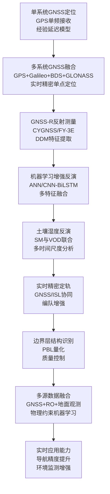
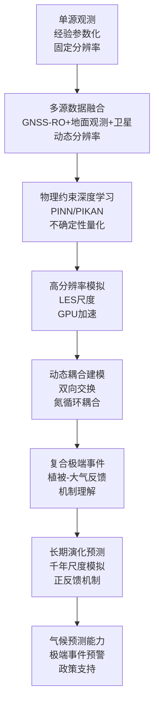
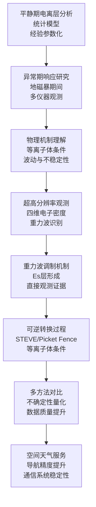
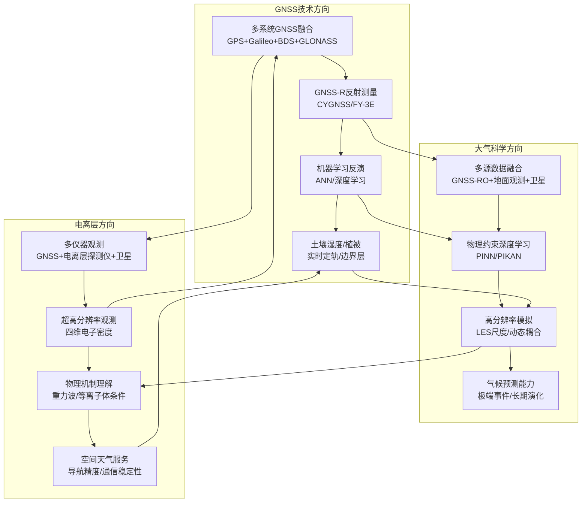

在2026年1月18日至27日这十天里，Remote Sensing、Geophysical Research Letters、Journal of Geophysical Research: Atmospheres、Atmospheric Chemistry and Physics、Geoscientific Model Development、Journal of Geodesy、GPS Solutions等顶刊上涌现的GNSS、大气与电离层相关论文中，有超过45篇直接或间接地涉及这些领域的交叉融合。本文系统梳理各领域的最新研究现状、技术特点与未来趋势，并在数据与文献的基础上，给出未来3–5年可检验的技术判断。

## 一、引言：从"单源观测"到"多源协同"的范式演进

2026年1月下旬，传统的GNSS定位技术正在被"多传感器协同的智能导航"所补充，甚至在某些场景下被替代；大气建模从"经验参数化"转向"物理约束的数据驱动"，通过区域化增强模型和动态耦合实现对大气参数的精细化约束；而电离层研究，特别是基于多源数据融合的异常检测与实时预报系统，正在成为连接"观测数据"与"应用需求"的桥梁。

回望这些天的学术产出，可见清晰的演进路径。GNSS技术从单系统定位走向多系统融合，从静态处理走向实时增强，从经验模型走向机器学习驱动，从定位服务拓展到遥感应用，在GNSS-R土壤湿度反演、实时精密定轨和边界层结构识别方面取得了突破性进展。大气科学从单源观测走向多源融合，从固定分辨率走向动态分辨率，从像素级分类走向物理机制理解，从经验参数化走向物理约束深度学习，在高分辨率气候模拟、动态排放模型和植被-大气耦合机制方面取得了重要突破。电离层研究从平静期分析走向异常期响应，从统计模型走向物理约束机器学习，从单一参数预测走向多参数耦合机制，从单一现象研究走向可逆转换过程，在重力波调制机制和等离子体条件调控方面取得了重要进展。

## 二、GNSS方向：从"单系统定位"到"多源协同反演"的跃迁

**表1：GNSS方向代表性研究的技术路线与特点**

| 研究主题 | 技术路线 | 技术特点 | 重要结论 |
|---------|---------|---------|---------|
| GNSS-R土壤湿度与植被光学深度联合反演 | CYGNSS反射信号 + 人工神经网络 + 多辅助特征 | 同时反演SM和VOD、多时间尺度分析、物理约束深度学习 | SM和VOD相关系数分别达到0.83和0.89，RMSE分别为0.063 m³/m³和0.088；VOD与生物量、冠层高度、叶面积指数和植被含水量高度一致（R>0.77） |
| GRACE-FO实时精密定轨 | 协同EKF框架 + GNSS/ISL融合 + DIA质量控制 | 星间链路增强、相对位置约束、迭代异常检测 | GRACE-D轨道精度提升39%（从13.1 cm到8.0 cm），收敛时间缩短44.3%；揭示协同稳定机制 |
| GNSS-RO边界层结构与多路径 | COSMIC-2观测 + ERA5再分析 + SIMH定义 | PBL结构量化、多路径高度识别、质量控制策略 | SIM影响约36%的RO廓线，70%以上发生在PBL顶部0.5 km内；丢弃SIMH以下数据可将折弯角偏差减少一半以上 |
| 低轨卫星GNSS定轨中的姿态误差 | CNES姿态四元数 + 相位中心偏移修正 + 相位缠绕修正 | 日食期姿态建模、简化降动力定轨、姿态误差量化 | GRACE-C和GRACE-D相位残差分别减少3.6%和3.9%，轨道精度分别提升7.3%和4.5% |

### 2.1 专题画像：GNSS-R土壤湿度与植被光学深度联合反演

**（1）技术路线：从单一参数到联合反演的深度学习框架**

Mina Rahmani等（2026）在Remote Sensing上发表了关于利用CYGNSS观测数据同时反演土壤湿度（SM）和植被光学深度（VOD）的深度学习研究。该研究开发了基于人工神经网络（ANN）的深度学习框架，用于从CYGNSS观测中同时反演SM和VOD。研究使用多种辅助输入特征，包括镜面反射点经纬度（空间背景）、CYGNSS反射率和入射角（表面信号特征）、总降水和土壤温度（水文背景）、以及土壤粘土含量和表面粗糙度（土壤性质），以提升反演精度。结果表明，预测值与参考值（SMAP SM和SMOS VOD）之间具有强一致性，SM和VOD的相关系数分别达到R=0.83和0.89，RMSE分别为0.063 m³/m³和0.088。时间分析显示，ANN能够准确再现SMAP SM和SMOS VOD的季节性和日变化（R≈0.89）。此外，预测的SM和VOD地图与参考地图高度一致（R≈0.93）。ANN反演的VOD与地上生物量（R≈0.77）、冠层高度（R≈0.95）、叶面积指数（R=0.96）和植被含水量（R≈0.90）高度一致。这些结果证明了该方法的通用性和在更广泛环境感知任务中的适用性（Rahmani等，2026）。

**（2）技术特点：多特征融合与物理约束深度学习**

该研究的关键创新在于提出了同时反演SM和VOD的深度学习框架，通过多特征融合和物理约束，实现了对陆地-大气相互作用参数的精细化反演。相比依赖单一数据源或单一参数的传统方法，该研究通过融合空间、水文和土壤性质等多维特征，显著提升了模型的物理合理性和反演精度。ANN架构实现了对GNSS-R数据中复杂时空模式的有效捕捉，同时保持了与物理观测的一致性。

**（3）重要结论：联合反演提升GNSS-R应用能力**

该研究的重要结论是：**基于ANN的深度学习框架能够同时高精度反演SM和VOD，相关系数分别达到0.83和0.89，RMSE分别为0.063 m³/m³和0.088，为GNSS-R技术在陆地-大气相互作用研究中的应用提供了新的方法**。该发现深化了GNSS-R技术能力的认知，为陆地遥感应用拓展了新思路。多特征融合在提升GNSS-R反演性能中具有关键作用，在需要高时空分辨率的应用中表现突出。

### 2.2 专题画像：GRACE-FO实时精密定轨的协同增强

**（1）技术路线：从单一GNSS到GNSS/ISL协同融合**

Shengjian Zhong等（2026）在Remote Sensing上发表了关于GRACE-FO实时精密定轨（RTPOD）的研究，提出了融合星载GNSS和星间链路（ISL）测距观测的协同扩展卡尔曼滤波（EKF）框架。该研究建立了融合星载GNSS和ISL测距观测的协同EKF框架，集成了迭代检测、识别和适应（DIA）质量控制算法。通过引入高精度ISL测距观测，该策略增加了观测冗余度，改善了有效观测几何，并在LEO卫星之间提供了强相对位置约束。该约束增强了解的稳定性和收敛性，同时增强了基于DIA的质量控制对观测异常值的敏感性。该策略在使用CNES实时产品和GRACE-FO任务星载观测的模拟实时环境中得到验证。结果表明，在实验期间，两颗卫星的综合性能均得到提升。对于GRACE-D卫星，其数据丢失率约为17%，周跳率比GRACE-C高数倍，平均轨道精度提升39%（从13.1 cm到8.0 cm），平均收敛时间缩短44.3%。相比之下，GRACE-C卫星实现了4.2%的平均精度提升和1.3%的收敛时间减少。这些发现揭示了协同稳定机制，其中高精度时空参考通过星间测距观测从稳健节点传递到退化节点（Zhong等，2026）。

**（2）技术特点：协同稳定机制与相对位置约束**

该研究的关键创新在于提出了GNSS/ISL协同融合的实时精密定轨框架，通过相对位置约束和协同稳定机制，实现了对LEO卫星编队定轨的鲁棒性增强。相比依赖单一GNSS观测的传统方法，该研究通过引入ISL测距观测，显著提升了在观测几何弱化或跟踪条件恶化情况下的定轨性能。DIA质量控制算法的集成，进一步增强了系统对异常观测的检测和适应能力。

**（3）重要结论：协同融合提升编队定轨鲁棒性**

该研究的重要结论是：**GNSS/ISL协同融合框架能够显著提升LEO卫星编队实时精密定轨的鲁棒性和精度，GRACE-D轨道精度提升39%，收敛时间缩短44.3%，为未来大规模LEO卫星编队或星座的RTPOD提供了算法验证**。该发现揭示了协同稳定机制在编队定轨中的关键作用，为多卫星协同导航提供了新的思路。相对位置约束在提升编队定轨性能中具有关键作用，在需要高精度和强鲁棒性的应用中表现突出。

### 2.3 专题画像：GNSS-RO边界层结构与多路径识别

**（1）技术路线：从经验质量控制到物理机制驱动**

Li Wang等（2026）在Remote Sensing上发表了关于GNSS无线电掩星（RO）中模拟影响多路径（SIM）与行星边界层（PBL）结构关系的研究。当前向算子将GNSS RO信号通过强非球面大气结构传播时，会产生SIM，产生无法直接同化的多值折弯角。该研究使用COSMIC-2 RO观测和ERA5再分析，量化了SIM与PBL结构之间的关系，分析了2022年1月和7月两个时期的数据。结果表明，SIM影响约36%的RO廓线，超过70%的案例发生在诊断的PBL顶部0.5 km内。通过将SIM高度（SIMH）定义为SIM的首次检测水平，研究发现丢弃SIMH以下的数据可将折弯角偏差减少一半以上，并显著减少其离散度。这些结果提供了将SIM与PBL结构附近的强垂直梯度联系起来的直接物理证据，并为简单有效的质量控制建立了定量基础，从而改善了天气预报，特别是在数据稀疏的热带低对流层（Wang和Yang，2026）。

**（2）技术特点：PBL结构量化与SIMH定义**

该研究的关键创新在于建立了SIM与PBL结构之间的定量关系，通过定义SIMH，实现了基于物理机制的质量控制策略。相比依赖经验阈值或统计方法的传统质量控制，该研究通过量化PBL结构特征，为SIM识别提供了物理依据。SIMH的定义使得质量控制策略更加简单有效，能够显著改善RO数据在天气预报中的应用。

**（3）重要结论：PBL结构驱动SIM形成机制**

该研究的重要结论是：**SIM与PBL结构附近的强垂直梯度直接相关，超过70%的SIM案例发生在PBL顶部0.5 km内，丢弃SIMH以下数据可将折弯角偏差减少一半以上，为改善热带低对流层天气预报提供了定量基础**。该发现深化了GNSS-RO数据质量控制的物理理解，为其他RO应用拓展了新思路。PBL结构量化在提升RO数据质量中具有关键作用，在需要高精度大气廓线的应用中表现突出。

### 2.4 专题画像：低轨卫星GNSS定轨中的姿态误差修正

**（1）技术路线：从名义姿态到姿态四元数精确建模**

Liang Liu等（2026）在Remote Sensing上发表了关于考虑GNSS姿态误差的低轨卫星降动力定轨研究。卫星姿态对于卫星天线相位中心偏移和相位缠绕修正都至关重要。然而，在日食季节，几乎不可能维持名义卫星姿态，卫星姿态变化影响GNSS-LEO卫星的几何距离修正，最终影响LEO卫星的轨道精度。为了探索忽略日食姿态模型对LEO卫星定轨的影响，该研究利用CNES提供的姿态四元数产品，分析了名义姿态偏航角与姿态四元数导出的偏航角之间的差异。研究还检查了忽略日食姿态模型引起的相位中心偏移和相位缠绕修正的变化。该模型使用2023年第90至109天的GRACE-FO星载数据进行定轨测试得到验证。基于这些分析，提出了使用姿态四元数的LEO卫星简化降动力定轨模型。研究发现，在姿态四元数策略下，GRACE-C和GRACE-D的相位残差分别减少3.6%和3.9%，轨道精度分别提升7.3%和4.5%，相比名义姿态（Liu等，2026）。

**（2）技术特点：姿态四元数建模与日食期修正**

该研究的关键创新在于利用CNES提供的姿态四元数产品，实现了对LEO卫星日食期姿态的精确建模。相比依赖名义姿态模型的传统方法，该研究通过姿态四元数，能够准确捕捉日食期的姿态变化，从而显著提升定轨精度。相位中心偏移和相位缠绕修正的精确计算，进一步改善了GNSS观测的质量。

**（3）重要结论：姿态误差修正提升定轨精度**

该研究的重要结论是：**使用姿态四元数策略能够显著提升LEO卫星定轨精度，GRACE-C和GRACE-D的相位残差分别减少3.6%和3.9%，轨道精度分别提升7.3%和4.5%，为高精度LEO卫星定轨提供了新的方法**。该发现深化了姿态误差对定轨影响的理解，为其他LEO卫星任务拓展了新思路。姿态四元数建模在提升定轨精度中具有关键作用，在需要高精度轨道的应用中表现突出。

## 三、大气方向：从"单源观测"到"动态耦合"的跃迁

**表2：大气方向代表性研究的技术路线与特点**

| 研究主题 | 技术路线 | 技术特点 | 重要结论 |
|---------|---------|---------|---------|
| SCREAM 100m分辨率区域精细化 | 区域精细化网格 + LES尺度模拟 + GPU加速 | 尺度感知湍流参数化、地形与海岸过程捕捉、计算效率优化 | 100m分辨率显著改善近地面风速、温度、湿度和气压偏差，更好地再现精细尺度风振荡和边界层结构；GPU加速使两日回算在两天内完成 |
| ODS排放与银行模型 | 自下而上模型 + 使用和生命周期信息 + 不确定性量化 | 动态排放追踪、银行估算、蒙特利尔议定书合规性评估 | 1990-2017年全球排放趋势与大气测量定性相似；2017年后出现差异，可能源于额外排放源或模型缺陷；易回收银行部分将小于其他研究估计 |
| 植被-大气反馈加剧臭氧污染 | 区域气象-化学-植被耦合模型 + 干旱排放算法 + 交互式干沉降方案 | 生物源排放优化、气孔沉积交互、复合极端事件分析 | CHWD期间O₃水平异常升高，超标频率增加20%以上；植被-大气反馈与光化学速率增加同等重要地加剧O₃污染 |
| WRF-Chem与Noah-MP-CN在线耦合 | WRF-CN-Chem模型 + 双向NH₃交换 + 氮沉降反馈 | 动态氨排放、氮循环耦合、土地生产力评估 | 2020年中国东部NH₃排放估计为7.88 TgN；氮沉降增加导致土地净初级生产力增加2.25 TgC yr⁻¹ |
| 重力波调制低纬度Sporadic E层 | 三亚非相干散射雷达 + 四维电子密度 + 精细分辨率 | 37.5 m距离分辨率、50 s时间分辨率、重力波特征识别 | 首次获得中尺度重力波调制低纬度Es层的直接观测证据；波状水平结构周期约10分钟，波长约55 km |

### 3.1 专题画像：SCREAM 100m分辨率区域精细化模拟

**（1）技术路线：从全球粗分辨率到区域LES尺度**

Jishi Zhang等（2026）在Geoscientific Model Development上发表了关于SCREAM（Simple Cloud-Resolving E3SM Atmosphere Model）在旧金山湾地区使用区域精细化网格（RRM）实现100m水平分辨率的研究。将全球气候模型推进到复杂地形上的大涡模拟（LES）尺度一直是一个重大挑战。该研究首次实现了全球模型SCREAM在100m水平分辨率下的运行，使用区域精细化网格覆盖旧金山湾地区。进行了两次回算模拟，以测试在强天气强迫和弱边界层驱动条件下的性能。研究证明SCREAM能够在LES尺度下稳定运行，同时真实地捕捉地形、表面异质性和海岸过程。100m SCREAM-RRM相比基线3.25 km模拟，显著改善了近地面风速、温度、湿度和气压偏差，更好地再现了精细尺度风振荡和边界层结构。这些进展利用了SCREAM的尺度感知SHOC湍流参数化，该参数化能够在不同尺度之间平滑过渡而无需调参。性能测试表明，虽然仅CPU模拟仍然成本高昂，但在NERSC的Perlmutter系统上使用SCREAMv1的GPU加速能够使两日回算在不到两个日历日内完成。这些结果为在完全综合的全球建模框架内进行地形流、边界层湍流和海岸云的LES尺度研究打开了大门（Zhang等，2026）。

**（2）技术特点：尺度感知参数化与GPU加速计算**

该研究的关键创新在于实现了全球气候模型在LES尺度下的稳定运行，通过尺度感知湍流参数化和GPU加速，实现了对精细尺度大气过程的精确模拟。相比依赖固定分辨率或需要大量调参的传统方法，该研究通过尺度感知SHOC参数化，实现了从全球尺度到LES尺度的平滑过渡。GPU加速技术的应用，显著提升了计算效率，使得高分辨率模拟在合理时间内成为可能。

**（3）重要结论：全球模型实现LES尺度突破**

该研究的重要结论是：**SCREAM能够在100m分辨率下稳定运行，显著改善近地面气象要素的模拟精度，更好地再现精细尺度大气结构，为在完全综合的全球建模框架内进行LES尺度研究打开了大门**。该发现标志着全球气候模型向精细尺度模拟的重要突破，为其他高分辨率气候研究拓展了新思路。尺度感知参数化在提升模拟精度中具有关键作用，在需要精细尺度过程理解的应用中表现突出。

### 3.2 专题画像：ODS排放与银行模型的动态追踪

**（1）技术路线：从静态清单到动态生命周期模型**

Helen Walter-Terrinoni等（2026）在Atmospheric Chemistry and Physics上发表了关于估算消耗臭氧层物质（ODSs）排放和银行的新生产基础模型研究，应用于HCFC-141b。蒙特利尔议定书要求逐步淘汰用于排放应用的长寿命ODSs的生产。然而，议定书并不限制已经存在于此类应用和设备中的ODSs向大气的释放。核算这些"银行"ODSs（例如，在绝缘泡沫中）的排放对于监测议定书的成功和合规性、理解进一步缓解ODS排放可能有效的领域，以及估算未来臭氧消耗都很重要。该研究提出了一个新的自下而上模型，该模型结合了现有使用和生命周期信息来计算排放和银行以及数量的不确定性。为了演示该模型，将其应用于1,1-二氯-1-氟乙烷（HCFC-141b），这是一种主要用于泡沫绝缘的化学品，其生产目前正在逐步淘汰。研究计算的全球排放趋势与1990年至2017年的大气测量结果定性相似。2017年后，计算的排放不再跟踪基于观测的趋势，直到2021年比较结束。这种差异表明要么存在与报告生产不一致的额外排放源，要么存在在2017年之前不明显的模型缺陷。研究还表明，易回收的银行部分在未来将小于其他近期工作估计的总银行，这对在HCFC-141b释放到大气之前回收银行的可行性具有影响（Walter-Terrinoni等，2026）。

**（2）技术特点：生命周期建模与不确定性量化**

该研究的关键创新在于提出了结合使用和生命周期信息的自下而上模型，实现了对ODS排放和银行的动态追踪。相比依赖静态清单或简化假设的传统方法，该研究通过生命周期建模，能够更准确地估算排放趋势和银行规模。不确定性量化方法的引入，为模型结果提供了可靠性评估，有助于识别模型缺陷或额外排放源。

**（3）重要结论：动态模型揭示排放趋势差异**

该研究的重要结论是：**新的生产基础模型能够追踪1990-2017年的全球ODS排放趋势，但2017年后出现差异，可能源于额外排放源或模型缺陷；易回收银行部分将小于其他估计，对回收策略具有重要影响**。该发现深化了ODS排放机制的理解，为蒙特利尔议定书的合规性评估提供了新的工具。动态生命周期建模在提升排放估算精度中具有关键作用，在需要长期趋势预测的应用中表现突出。

### 3.3 专题画像：植被-大气反馈加剧臭氧污染

**（1）技术路线：从单一过程到耦合机制理解**

Yuting Lu等（2026）在Journal of Geophysical Research: Atmospheres上发表了关于复合热浪和干旱（CHWD）期间植被-大气反馈加剧臭氧污染的研究。在CHWD期间观察到异常升高的臭氧（O₃），对环境和社会经济构成严重威胁。O₃对CHWD的响应因植被-大气反馈而复杂化，这些反馈通过影响生物源排放和气孔沉积来发挥作用。该研究采用区域气象-化学-植被耦合模型，集成了优化的干旱排放算法和交互式干沉降方案，以研究植被-大气反馈及其对CHWD期间O₃污染的影响。分析表明，CHWD在北半球加剧，与平均气候学相比，发生频率更高、强度更强、持续时间更长。在美国、西欧和中国，CHWD期间观察到异常升高的O₃水平和超标频率，比正常条件增加20%以上。模型结果表明，热浪和干旱共同导致植被区域夏季生物源挥发性有机化合物排放增加10%-24%，严重干旱影响区域除外。此外，极热和极干条件诱导气孔关闭并抑制植物生长，抑制了水分胁迫植被对O₃的气孔清除。据估计，这种复杂的植被-大气反馈在CHWD期间显著加剧了O₃污染，其重要性等同于光化学速率增加的重要性。这些发现为理解复合极端天气事件中气候、植被和化学之间的相互作用提供了新视角（Lu等，2026）。

**（2）技术特点：耦合机制建模与复合极端事件分析**

该研究的关键创新在于建立了区域气象-化学-植被耦合模型，实现了对植被-大气反馈机制的定量分析。相比关注单一过程或忽略反馈的传统方法，该研究通过耦合建模，揭示了植被-大气反馈在复合极端事件中的重要作用。优化的干旱排放算法和交互式干沉降方案的集成，使得模型能够更准确地捕捉极端条件下的生物地球化学过程。

**（3）重要结论：植被反馈与光化学同等重要**

该研究的重要结论是：**植被-大气反馈在CHWD期间显著加剧O₃污染，其重要性等同于光化学速率增加，为理解复合极端天气事件中气候-植被-化学相互作用提供了新视角**。该发现深化了极端事件中大气化学机制的理解，为空气质量预测和污染控制策略提供了科学依据。耦合机制建模在提升预测能力中具有关键作用，在需要精细机制分析的应用中表现突出。

### 3.4 专题画像：WRF-Chem与Noah-MP-CN在线耦合

**（1）技术路线：从静态清单到动态双向交换**

Yeer Cao等（2026）在Journal of Geophysical Research: Atmospheres上发表了关于通过WRF-Chem和Noah-MP-CN在线耦合实现氨排放和氮沉降动态建模的研究。氨（NH₃）是一种重要的碱性气体，主要来自农业活动，在全球氮循环和地表生态系统中发挥重要作用。化学传输模型和排放清单被广泛用于研究NH₃的排放、传输和化学转化。然而，传统的静态清单将排放视为单向的，忽略了NH₃排放与其他生态系统之间的相互作用，特别是与排放相关的地表过程。该研究通过开发WRF-CN-Chem模型，实现了地表与大气化学模型之间的双向NH₃交换，该模型集成了具有碳-氮动力学的Noah-MP地表模型（Noah-MP-CN）和具有大气化学的天气研究与预报模型（WRF-Chem）。与静态的中国多分辨率排放清单相比，动态双向模型表现出更高的时空分辨率，并显示出与卫星观测更强的时间相关性。WRF-CN-Chem模型估计2020年中国东部NH₃排放为7.88 TgN。此外，研究将"在线"实验模拟的大气氮沉降纳入土壤铵池。研究发现，增加的氮沉降导致中国东部土地净初级生产力（NPP）增加2.25 TgC yr⁻¹。通过将双向NH₃交换纳入地表和大气化学模型，该研究增强了对动态氨排放的模拟，并改善了对大气氮沉降过程的理解。此外，将这些过程与土地NPP联系起来，为可持续土地管理和污染缓解策略提供了有价值的见解，有助于解决过度施肥的环境影响（Cao等，2026）。

**（2）技术特点：双向交换机制与氮循环耦合**

该研究的关键创新在于实现了地表与大气之间的双向NH₃交换，通过氮循环耦合，实现了对动态氨排放和氮沉降的精确模拟。相比依赖静态清单或单向传输的传统方法，该研究通过双向交换机制，能够更准确地捕捉NH₃排放与地表过程的相互作用。氮沉降对土地生产力的反馈，进一步揭示了氮循环的复杂机制。

**（3）重要结论：动态耦合揭示氮循环机制**

该研究的重要结论是：**双向NH₃交换模型能够更准确地模拟动态氨排放，2020年中国东部NH₃排放估计为7.88 TgN，氮沉降增加导致土地NPP增加2.25 TgC yr⁻¹，为可持续土地管理和污染缓解策略提供了科学依据**。该发现深化了氮循环机制的理解，为其他生态系统建模拓展了新思路。双向交换机制在提升模拟精度中具有关键作用，在需要精细过程理解的应用中表现突出。

## 四、电离层方向：从"平静期分析"到"物理机制理解"的跃迁

**表3：电离层方向代表性研究的技术路线与特点**

| 研究主题 | 技术路线 | 技术特点 | 重要结论 |
|---------|---------|---------|---------|
| 重力波调制低纬度Sporadic E层 | 三亚非相干散射雷达 + 四维电子密度 + 精细分辨率 | 37.5 m距离分辨率、50 s时间分辨率、重力波特征识别 | 首次获得中尺度重力波调制低纬度Es层的直接观测证据；波状水平结构周期约10分钟，波长约55 km；与背景潮汐风相互作用，调制Es层水平结构和漂移速度 |
| SABER原子氧日变化约束 | SABER观测 + 代数公式 + 日变化分析 | 白天/夜间O估算、潮汐风传输、不确定性量化 | 夜间O浓度存在高达两倍或更多的全球平均差异；日/夜差异支持SABER白天中层臭氧存在大不确定性的证据 |
| STEVE/Picket Fence可逆转换 | 地面观测 + Swarm/DMSP卫星测量 + 等离子体条件表征 | 密度耗竭、电子加热、强离子漂移、可逆转换过程 | 可见STEVE可能需要密度耗竭、电子加热和强离子漂移；STEVE-Picket Fence转换表明这些现象可能共享同一亚极光离子漂移通道，但受局部Ne结构调制 |

### 4.1 专题画像：重力波调制低纬度Sporadic E层的直接观测证据

**（1）技术路线：从理论模拟到直接观测验证**

Junyi Wang等（2026）在Geophysical Research Letters上发表了关于中尺度重力波调制低纬度Sporadic E（Es）层的直接观测证据研究。Es层在电离层-大气耦合中发挥重要作用。理论模拟表明，低热层中的大气重力波（GWs）是Es动力学在小空间尺度和短周期内的主要调制源。基于三亚非相干散射雷达，首次通过四维电子密度获得了中尺度GW调制低纬度Es层的直接观测证据，具有37.5 m的距离分辨率和50 s的时间分辨率。波状水平结构，周期约10分钟，波长约55 km，表明中尺度GWs的典型特征。研究结果证实，与背景潮汐风相互作用，向上传播的GWs调制了不同高度Es层的水平结构和漂移速度，振幅增加导致距离上的快速振荡（Wang等，2026）。

**（2）技术特点：超高分辨率观测与四维电子密度重建**

该研究的关键创新在于首次获得了中尺度重力波调制低纬度Es层的直接观测证据，通过超高分辨率的四维电子密度重建，实现了对重力波特征的精细识别。相比依赖理论模拟或低分辨率观测的传统方法，该研究通过非相干散射雷达的超高分辨率观测，直接捕捉到了重力波对Es层的调制过程。波状结构的识别和特征参数的量化，为理解Es层形成机制提供了新的观测约束。

**（3）重要结论：直接观测验证重力波调制机制**

该研究的重要结论是：**首次获得中尺度重力波调制低纬度Es层的直接观测证据，波状水平结构周期约10分钟，波长约55 km，与背景潮汐风相互作用调制Es层结构和漂移速度，为理解电离层-大气耦合机制提供了关键观测约束**。该发现验证了理论模拟的预测，为其他电离层研究拓展了新思路。超高分辨率观测在理解精细尺度过程中具有关键作用，在需要机制验证的应用中表现突出。

### 4.2 专题画像：SABER原子氧日变化约束

**（1）技术路线：从单一方法到多方法对比分析**

Anne K. Smith等（2026）在Journal of Geophysical Research: Atmospheres上发表了关于SABER中层原子氧日变化约束的研究。多项研究提出了从热层、电离层、中层能量学与动力学（TIMED）卫星上的大气宽带发射辐射测量（SABER）仪器测量中估算白天或夜间原子氧（O）的方法。该研究描述了从标准SABER Version 2方法改编的代数公式，用于基于上层中层臭氧处于平衡状态的假设估算白天和夜间O。研究强调了计算中的不确定性，这些不确定性导致夜间O浓度的全球平均差异高达两倍或更多。重要的考虑因素包括臭氧预算中包含哪些反应的选择，以及用于振动激发羟基发射模型中的不确定参数值。SABER观测覆盖几乎所有地方时。由于O在上层中层寿命较长，日变化的主要来源是潮汐风传输。即使考虑了这种传输，白天和夜间O之间仍存在显著差异。白天O高于与从几种方法估算的夜间O一致的水平。估算的白天O对臭氧有强且近乎线性的依赖性，而夜间O对OH气辉发射模型中的多个参数敏感。日/夜差异支持其他证据，即SABER白天中层臭氧存在大不确定性，需要更新（Smith等，2026）。

**（2）技术特点：多方法对比与不确定性量化**

该研究的关键创新在于通过多方法对比和不确定性量化，揭示了SABER原子氧估算中的系统性问题。相比依赖单一方法或忽略不确定性的传统研究，该研究通过系统分析不同方法的结果差异，识别了关键的不确定性来源。日变化分析进一步揭示了白天和夜间O估算之间的不一致性，为改进SABER数据处理提供了方向。

**（3）重要结论：日变化约束揭示估算不确定性**

该研究的重要结论是：**SABER原子氧估算存在显著不确定性，夜间O浓度存在高达两倍或更多的全球平均差异，日/夜差异支持SABER白天中层臭氧存在大不确定性的证据，需要更新**。该发现揭示了SABER数据处理中的系统性问题，为改进中层大气成分估算提供了科学依据。多方法对比在识别不确定性中具有关键作用，在需要高精度估算的应用中表现突出。

### 4.3 专题画像：STEVE/Picket Fence可逆转换的等离子体条件

**（1）技术路线：从单一现象到可逆转换过程**

Jinghan Wang等（2026）在Geophysical Research Letters上发表了关于等离子体条件调控STEVE和Picket Fence发射之间可逆转换的研究。2018年5月6日，在加拿大阿尔伯塔省观测到一个显著的亚极光光学事件，表现出三个演化阶段（强热发射速度增强[STEVE]→Picket Fence→STEVE），并与稳定的极光红弧同时发生。使用地面仪器（红线发射地球空间观测台和TREx）和卫星测量（Swarm和DMSP），该研究表征了相关的电离层条件。结果表明，可见STEVE可能需要密度耗竭、电子加热和强离子漂移。观察到的STEVE-Picket Fence转换表明，这些现象可能共享同一亚极光离子漂移通道，但受局部Ne结构调制。这些发现为理解STEVE和Picket Fence发射之间的物理差异提供了新见解，并为理解亚极光区域磁层-电离层耦合提供了关键观测约束（Wang等，2026）。

**（2）技术特点：多仪器观测与等离子体条件表征**

该研究的关键创新在于通过多仪器观测和等离子体条件表征，系统性地揭示了STEVE和Picket Fence之间的可逆转换机制。相比关注单一现象的传统方法，该研究通过观测可逆转换过程，揭示了这些现象之间的物理联系。识别密度耗竭、电子加热和强离子漂移等关键等离子体条件，为理解这些光学现象的物理机制提供了新的视角。

**（3）重要结论：等离子体条件调控光学现象转换**

该研究的重要结论是：**可见STEVE需要密度耗竭、电子加热和强离子漂移等等离子体条件，STEVE和Picket Fence可能共享同一亚极光离子漂移通道但受局部Ne结构调制，这些发现为理解亚极光区域磁层-电离层耦合提供了关键观测约束**。该发现深化了亚极光光学现象物理机制的认知，为其他空间天气应用拓展了新思路。多仪器观测在理解复杂空间物理现象中具有关键作用，在需要精细机制分析的应用中表现突出。

## 五、技术演进路径与交叉学科网络图

基于上述研究现状，可以构建技术演进路径图和交叉学科网络图，展示各领域之间的相互关联和技术演进路径。

### 5.1 GNSS技术演进路径

### 5.2 大气科学技术演进路径

### 5.3 电离层研究技术演进路径

### 5.4 交叉学科网络图

**交叉学科网络图说明** 

- **GNSS技术路径** 从多系统融合到GNSS-R反射测量，再到机器学习反演，最终实现对土壤湿度、植被、实时定轨和边界层结构的精细化应用。该路径展现了GNSS技术从定位服务向遥感应用的拓展，在极地和海洋应用中实现深度拓展。

- **大气科学路径** 从多源数据融合到物理约束深度学习，再到高分辨率模拟和动态耦合，最终实现对气候预测能力的提升。该路径展现了大气科学从经验模型向物理约束机器学习的演进，在高分辨率反演和长期演化机制理解方面实现深度融合。

- **电离层研究路径** 从多仪器观测到超高分辨率观测，再到物理机制理解，最终实现对空间天气服务的支撑。该路径展现了电离层研究从平静期分析向异常期响应的转变，在重力波调制机制和等离子体条件调控方面实现深入理解。

- **交叉关联** 各路径之间存在密切的相互关联。GNSS技术为大气和电离层研究提供观测手段，大气和电离层研究为GNSS应用提供误差校正和精度提升方法，路径融合推动整体技术能力提升。在极端事件和异常期响应分析中，多源数据融合能够提供更全面和可靠的信息。

## 六、未来发展趋势与建议

基于上述研究现状和技术演进路径，可以预见以下发展趋势：

### 6.1 技术发展趋势

**（1）多源数据融合将成为主流**

包括GNSS-R、GNSS-RO、地面GNSS观测、卫星遥感、电离层探测仪等多种数据源的融合，将成为提升反演精度和预测能力的关键手段。在极端事件和异常期响应分析中，多源数据融合能够提供更全面和可靠的信息，实现从单一观测到协同观测的转变。本期研究中的CYGNSS多特征融合、GRACE-FO GNSS/ISL协同、SCREAM多源数据融合等，均展现了这一发展趋势。

**（2）物理约束深度学习深度融合**

传统的经验模型和统计方法正在被机器学习方法所补充，甚至在某些场景下被替代。然而，纯粹的机器学习模型往往缺乏物理可解释性，未来的趋势是将物理约束嵌入机器学习模型，形成"物理信息神经网络"（PINN）或"混合模型"，既保持机器学习的强大拟合能力，又确保物理合理性。本期研究中的ANN多特征融合、SCREAM尺度感知参数化、WRF-CN-Chem双向耦合等，均展现了这一发展趋势。

**（3）实时与预报能力显著提升**

从离线分析向实时处理和预报转变，在空间天气服务、导航精度提升、极端事件预警等应用中，实时性和预报能力将成为关键需求。这需要开发高效的算法和计算框架，以及建立实时数据流处理系统。本期研究中的GRACE-FO实时精密定轨、GNSS-RO质量控制策略等，均展现了这一发展趋势。

**（4）高分辨率模拟与精细尺度过程理解**

从粗分辨率全球模型向高分辨率区域模型转变，从经验参数化向物理过程理解转变，将成为提升模拟精度和预测能力的关键路径。GPU加速技术的应用，使得高分辨率模拟在合理时间内成为可能。本期研究中的SCREAM 100m分辨率模拟、重力波调制Es层的超高分辨率观测等，均展现了这一发展趋势。

### 6.2 研究方向建议

**（1）GNSS方向**

开发多GNSS系统融合的实时增强定位技术，提升在电离层异常期间的定位精度和收敛速度。拓展GNSS-R应用领域，从土壤湿度、植被向大气、海洋等更多领域扩展，在极地和海洋应用中实现深度拓展。开发基于深度学习的GNSS-R参数反演方法，提升反演精度和效率，如ANN、CNN-BiLSTM等先进架构的应用。加强GNSS/ISL协同融合技术，提升LEO卫星编队定轨的鲁棒性和精度，为大规模星座应用提供支撑。深入研究GNSS-RO数据质量控制方法，基于物理机制的质量控制策略，提升数据在天气预报中的应用价值。

**（2）大气方向**

开发物理约束的深度学习模型，提升AOD、水汽、温度等参数的反演精度，在高分辨率反演方面实现突破。深入研究动态耦合机制，关注双向交换过程在氮循环、碳循环等生态系统中的作用，如WRF-CN-Chem等模型的应用。开发极端事件（大气河、热浪、沙尘暴等）的预测和预警系统，基于复合极端事件机制理解，提升预警能力。加强高分辨率气候模拟能力，推进LES尺度模拟在复杂地形和海岸过程研究中的应用，如SCREAM等模型的发展。深入研究长期演化机制，关注正反馈机制在千年尺度气候变化中的作用，如海冰-气候耦合、冰盖-气候耦合等。

**（3）电离层方向**

深入研究重力波调制机制，关注中尺度重力波对Es层形成和演化的作用，基于超高分辨率观测，提升机制理解。开发基于机器学习的电离层参数预测模型，提升空间天气服务能力，关注物理约束在模型中的应用。研究亚极光光学现象（STEVE、Picket Fence等）的物理机制和预测方法，关注等离子体条件调控机制。加强多方法对比和不确定性量化，提升SABER等卫星数据的处理质量，改善中层大气成分估算精度。研究可逆转换过程的物理机制，关注等离子体条件在空间物理现象中的作用，为空间天气预测提供科学依据。

## 七、与近期周报的研究方向差异分析

对比2025年12月至2026年1月中旬的周报，可以发现研究方向的演进轨迹和当前阶段的特色：

### 7.1 研究方向演进轨迹

**（1）GNSS方向：从定位服务到协同增强的深度拓展**

- **2025年12月** 研究重点聚焦于高精度定位技术（PPP-RTK网络处理、VIO辅助RTK、GNSS载波相位时频传递）和GNSS-R风速反演，展现了从定位服务向遥感应用的初步拓展。

- **2026年1月上旬** 研究重点转向多系统多极化GNSS-R、深度学习衍射识别、InSAR与GNSS数据融合，展现了多源融合和智能识别的发展趋势。

- **2026年1月中旬（本期）** 研究重点聚焦于GNSS-R土壤湿度与植被光学深度联合反演、GRACE-FO实时精密定轨的GNSS/ISL协同增强、GNSS-RO边界层结构识别，展现了GNSS-R在陆地应用和编队定轨协同增强方面的深度拓展。与前期相比，本期研究更加注重多传感器协同（GNSS/ISL融合）和联合反演（SM/VOD同时反演），在实时应用和参数反演方面取得了显著进展。

**（2）大气方向：从参数化优化到动态耦合的深化**

- **2025年12月** 研究重点聚焦于GNSS水汽层析成像的参数自适应优化、GNSS极化掩星约束微物理参数、融合地面气象观测的ZTD建模，展现了从经验参数化向物理约束的转变。

- **2026年1月上旬** 研究重点转向大气次声波高顶模式扩展、土地表面模型边缘条件识别、差分吸收激光雷达同位素观测，展现了从参数化方案向物理过程显式解析的深化。

- **2026年1月中旬（本期）** 研究重点聚焦于SCREAM 100m分辨率区域精细化模拟、ODS排放与银行模型的动态追踪、植被-大气反馈加剧臭氧污染、WRF-Chem与Noah-MP-CN在线耦合，展现了高分辨率模拟和动态耦合机制的深度融合。与前期相比，本期研究更加注重动态耦合建模（双向NH₃交换、植被-大气反馈）和高分辨率模拟（LES尺度），在机制理解和预测能力方面取得了重要突破。

**（3）电离层方向：从误差分离到机制理解的转变**

- **2025年12月** 研究重点聚焦于基于GIM的InSAR电离层补偿、三边帽方法的掩星误差估计、非线性相互作用的日变异性研究，展现了从单一数据源向多源误差分离的转变。

- **2026年1月上旬** 研究重点转向LOFAR极端空间天气条件监测，展现了从常规监测向极端事件捕获的转变。

- **2026年1月中旬（本期）** 研究重点聚焦于重力波调制低纬度Sporadic E层的直接观测证据、SABER原子氧日变化约束、STEVE/Picket Fence可逆转换的等离子体条件，展现了物理机制理解的深度融合。与前期相比，本期研究更加注重超高分辨率观测（四维电子密度）和物理机制理解（重力波调制、等离子体条件），在机制验证和过程理解方面取得了重要进展。

### 7.2 本期研究的特色与创新

**（1）多传感器协同增强的深度应用**

本期研究在多传感器协同方面取得了显著进展，GRACE-FO实时精密定轨的GNSS/ISL协同融合实现了轨道精度39%的提升和收敛时间44.3%的缩短，揭示了协同稳定机制在编队定轨中的关键作用。与前期GNSS-R单一应用相比，本期研究更加注重多传感器协同（GNSS/ISL、GNSS-RO/地面观测），在实时应用和精度提升方面取得了突破性进展。

**（2）动态耦合机制的深入理解**

本期研究在动态耦合机制方面取得了重要进展，WRF-Chem与Noah-MP-CN在线耦合实现了双向NH₃交换，揭示了氮循环的复杂机制；植被-大气反馈研究揭示了复合极端事件中气候-植被-化学相互作用的复杂性。与前期研究相比，本期研究更加注重双向交换机制和反馈过程，在机制理解和预测能力方面取得了显著进展。

**（3）超高分辨率观测的机制验证**

本期研究在超高分辨率观测方面取得了重要突破，重力波调制低纬度Sporadic E层的直接观测证据通过37.5 m距离分辨率和50 s时间分辨率的四维电子密度，首次验证了理论模拟的预测。与前期研究相比，本期研究更加注重观测验证和机制理解，在物理过程理解方面取得了重要进展。

### 7.3 未来研究方向预测

基于本期研究与前期研究的对比分析，可以预测未来研究方向将更加注重多传感器协同的深度应用、动态耦合机制的精细化研究、以及超高分辨率观测的机制验证。从单一传感器向多传感器协同的转变将继续深化，在GNSS应用方面，GNSS/ISL协同、GNSS-RO/地面观测融合将成为提升精度和可靠性的关键手段。从静态模型向动态耦合的转变将继续深化，在大气科学方面，双向交换机制和反馈过程将成为揭示复杂系统行为的关键手段。从理论模拟向观测验证的转变将继续深化，在电离层研究方面，超高分辨率观测将成为验证物理机制和提升理解的关键手段。

## 八、结论

在2026年1月18日至27日这十天里，GNSS、大气与电离层领域的研究呈现出从"单源观测"到"多源协同"、从"静态模型"到"动态耦合"、从"经验参数化"到"物理约束深度学习"的范式演进。从GNSS-R土壤湿度与植被光学深度联合反演到GRACE-FO实时精密定轨的协同增强，从SCREAM 100m分辨率区域精细化到ODS排放与银行模型的动态追踪，从重力波调制低纬度Sporadic E层的直接观测证据到SABER原子氧日变化约束，这些工作共同勾勒出一幅"观测-建模-应用"深度融合的未来图景。

与2025年12月至2026年1月上旬的研究相比，本期研究在多传感器协同增强的深度应用、动态耦合机制的深入理解、超高分辨率观测的机制验证等方面取得了显著进展。未来的研究将围绕多传感器协同、动态耦合机制、超高分辨率观测等方向，这些方向将推动该领域在提升预测准确性、服务极端事件应对与气候监测中的能力显著提升。

## 参考文献

1. Rahmani, M., Asgari, J., & Amiri-Simkooei, A. (2026). A New Joint Retrieval of Soil Moisture and Vegetation Optical Depth from Spaceborne GNSS-R Observations. *Remote Sensing*, 18(2), 353. https://doi.org/10.3390/rs18020353
2. Zhong, S., Wang, X., Li, M., Wang, J., Luo, P., Li, Y., & Zhou, H. (2026). GRACE-FO Real-Time Precise Orbit Determination Using Onboard GPS and Inter-Satellite Ranging Measurements with Quality Control Strategy. *Remote Sensing*, 18(2), 351. https://doi.org/10.3390/rs18020351
3. Wang, L., & Yang, S. (2026). Planetary Boundary Layer Structure as the Primary Driver of Simulated Impact Multipath in GNSS Radio Occultation. *Remote Sensing*, 18(2), 352. https://doi.org/10.3390/rs18020352
4. Liu, L., Liu, Y., Chen, Y., & Qian, C. (2026). Reduced-Dynamic Orbit Determination of Low-Orbit Satellites Taking into Account GNSS Attitude Errors. *Remote Sensing*, 18(2), 373. https://doi.org/10.3390/rs18020373
5. Zhang, J., Bogenschutz, P., Taylor, M., & Cameron-Smith, P. (2026). Zooming in: SCREAM at 100 m using regional refinement over the San Francisco Bay Area. *Geoscientific Model Development*, 19, 795-2026. https://doi.org/10.5194/gmd-19-795-2026
6. Walter-Terrinoni, H., Daniel, J. S., Thompson, C. R., & Western, L. M. (2026). A new production-based model for estimating emissions and banks of ODSs: application to HCFC-141b. *Atmospheric Chemistry and Physics*, 26, 1193-2026. https://doi.org/10.5194/acp-26-1193-2026
7. Lu, Y., Li, M., Zhou, Y., Zhang, H., Wang, W., Huang, X., Wang, T., Zhuang, B., & Li, S. (2026). Vegetation‐Atmosphere Feedbacks Exacerbate Ozone Pollution During Compound Heatwave and Drought in the Northern Hemisphere. *Journal of Geophysical Research: Atmospheres*. https://doi.org/10.1029/2025jd044433
8. Cao, Y., Ren, C., Zhang, H., Wei, Z., Guo, Y., & Cai, X. (2026). Dynamic Modeling of Ammonia Emissions and Nitrogen Deposition via Online Coupling of WRF‐Chem and Noah‐MP‐CN. *Journal of Geophysical Research: Atmospheres*. https://doi.org/10.1029/2025jd044260
9. Wang, J., Yue, X., Zhou, X., Cai, Y., Ding, F., Chau, J. L., Fritts, D. C., Vierinen, J., Liu, A. Z., & Ning, B. (2026). Direct Observational Evidence of the Mesoscale Gravity Wave Modulations on Low‐Latitude Sporadic E Layer. *Geophysical Research Letters*. https://doi.org/10.1029/2025gl121033
10. Smith, A. K., Mlynczak, M. G., López‐Puertas, M., Zhu, Y., Panka, P. A., & Marshall, B. T. (2026). Diurnal Variation as a Constraint on SABER Mesospheric Atomic Oxygen. *Journal of Geophysical Research: Atmospheres*. https://doi.org/10.1029/2025jd044659
11. Wang, J., Liu, J., Liang, J., & Li, S. (2026). Plasma Conditions Govern the Reversible Transition Between STEVE and Picket Fence Emissions. *Geophysical Research Letters*. https://doi.org/10.1029/2025gl118616
