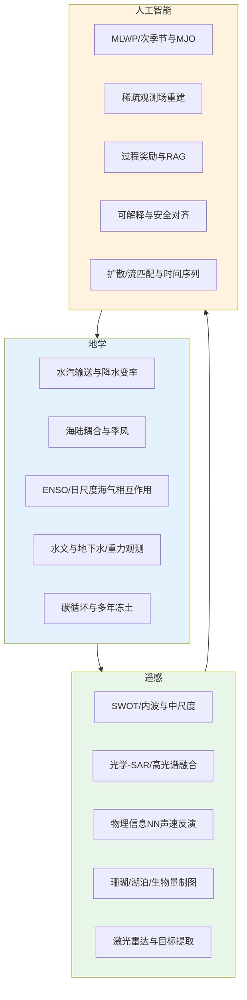
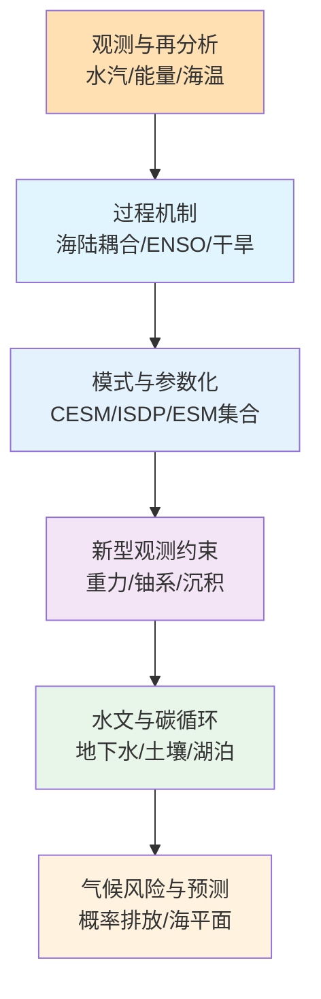
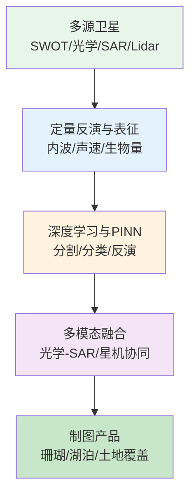
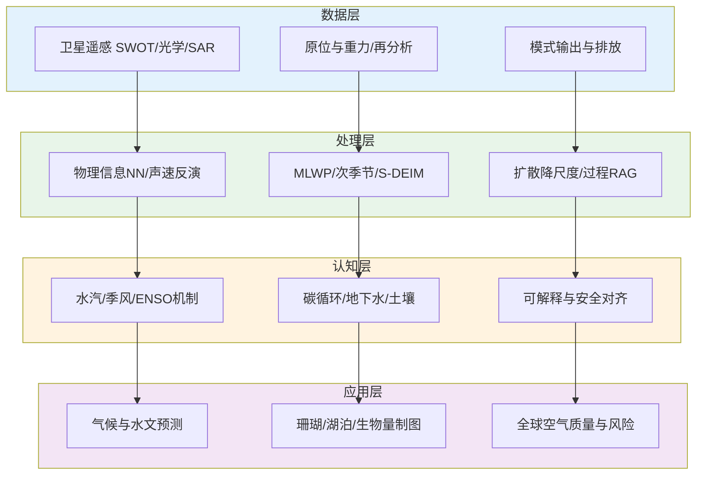

本期汇总了 2026-01-27 至 2026-02-01 期间收录的 652 篇论文，其中 CNS（Cell/Nature/Science）156 篇、地学与遥感顶刊及特色期刊 161 篇。下文围绕地学、遥感与人工智能的近期研究现状与趋势，以专题画像、技术路线表与结构图形式进行归纳，并给出交叉学科网络与创新链流程图及参考文献。

## 一、本期研究印记图

近期文献与权威综述表明，地球系统模式正朝更细空间分辨率与更显式过程表示发展，水文与气候预测中机器学习与物理约束的结合日益加深；遥感领域以多模态地基模型与跨模态推理为热点，光学—雷达—激光雷达与文本—地理信息的融合成为主流；人工智能在地学与遥感中的应用则集中在物理信息神经网络、稀疏观测下的场重建、以及大模型驱动的检索增强与过程奖励建模。本期论文在气候—水文耦合、海气相互作用、遥感智能解译与 AI 可解释性等方面形成清晰聚类。

下图概括了本期论文在地学、遥感与人工智能三个板块中的热点分布与彼此关联。

## 二、地学方向

近期地学工作侧重气候—水文耦合、海气相互作用、陆地水与碳循环以及新型观测约束下的过程量化。热带海洋水汽输送、陆—气耦合对季风降水的影响、日尺度海气相互作用对ENSO振幅的调制、以及重力与地下水观测在水文中的应用构成主要技术路线。

**表1：地学方向代表性研究的技术路线与特点**

| 研究主题 | 技术路线 | 技术特点 | 重要结论 |
|---------|---------|---------|---------|
| 热带海洋水汽输送与北美西南夏季降水 | 拉格朗日—欧拉水汽追踪 + 水汽收支 | 源区量化、动力/热力分量分解 | 热带大西洋在6–8月为区域2主导水汽源，水汽平流对异常增长关键 |
| 海陆耦合与季风环流、降水变化 | CESM 耦合/非耦合对比 + MSE 廓线 | 季风指数与水分收支结合 | 耦合增强季风区降水，中对流层水分与稳定性变化驱动垂直运动增强 |
| 日尺度海气相互作用对ENSO振幅的抑制 | CESM + ISDP +  recharge oscillator | 热力阻尼增强、混合层变浅 | ISDP 使ENSO振幅更接近观测，热力阻尼是主要调制因子 |
| 水文与人工智能：从碎片化到陆圈一致科学 | 综述与框架 | 陆圈多过程与AI方法融合 | 水文正在从碎片化走向以AI为纽带的陆圈一致科学 |
| 人为强迫对干旱的加剧：干旱区更甚 | 多模型与归因 | 干湿区差异、强迫响应 | 人为强迫在干旱区对干旱的加剧强于湿润区 |
| 大气在地球能量失衡年际变率中的重要作用 | 观测与再分析 | 能量收支、大气储热与输运 | 大气储热与经向输运对EEI年际变率贡献显著 |
| 地球系统模式概率排放强迫与气候风险 | 概率排放强迫的ESM集合 | 气候风险评估、不确定性 | 概率排放强迫的ESM集合可用于气候风险演示与展望 |
| 美国墨西哥湾沿岸次年至年代际海平面变率强迫 | 观测与归因 | 海平面、年代际、沿岸 | 次年至年代际海平面变率及其沿岸快速上升的强迫因子得以量化 |
| 铀粉碎年龄作为土壤形成速率新时计 | 铀系活动比 + 一维质量迁移模型 | 不依赖气候与岩性的SPR估算 | 花岗岩风化剖面SPR约2.4±0.4 m/Ma，与U系和10Be一致 |
| 水文重力与高山地下水动态量化 | 时移重力 + 高山流域 | 地下水储量变化直接约束 | TLG可量化无井区高山地下水季节与融雪期动态 |
| 多年冻土融化梯度上的碳循环演替 | δ13C 多池 + 地球化学模型 | 湖泊碳循环演替、甲烷氧化 | 融化梯度上碳循环从陆源输入到甲烷产生与氧化的演替模式 |
| 南极绕极流过去百万年纬向不对称变化 | 南印度洋沉积芯 + 流速重建 | 轨道尺度、纬向不对称 | 冰期/低倾角期南印度洋ACC加强、南太平洋减弱，间冰期反之 |

### 2.1 专题画像：热带海洋水汽输送驱动北美西南夏季降水变率

**（1）技术路线**

Zhao 等（Journal of Climate）采用拉格朗日水汽追踪与欧拉水汽收支相结合的方法，识别北美西南（SWNA）夏季大气水汽变率的主要源区与物理过程。将 SWNA 分为地中海型气候的西区与季风型气候的东区，在湿/干极端下量化热带大洋（副热带太平洋、热带大西洋等）对水汽变率的贡献，并分解动力与热力分量。结果表明，5–6 月副热带太平洋对区域 1 水汽变率贡献约 74%（湿）/58%（干）；6–8 月热带大西洋成为区域 2 的主导源（约 83%/70%）。水汽输送变化主要由风异常驱动，海温异常在某些时段也重要；欧拉分析表明水汽平流对 SWNA 上空水汽异常增长至关重要。

**（2）技术特点**

结合拉格朗日追踪与欧拉水汽收支，同时给出源区贡献与局地动力/热力机制；按气候子区与季节区分源区，适合理解 SWNA 夏季降水可预报性。

**（3）重要结论**

**该研究的重要结论是：热带海洋水汽输送是北美西南夏季大气水汽变率的主要来源，其中热带大西洋在 6–8 月对东区贡献最大，动力平流对水汽异常增长起关键作用，对改进该区季节降水预测具有明确指示意义。**

### 2.2 专题画像：海陆耦合对降水变化与季风环流的影响

**（1）技术路线**

Lan 等（Journal of Climate）利用社区地球系统模型（CESM）进行耦合与非耦合试验对比，分析陆—气耦合对降水与季风环流的影响。通过水分收支与湿静力能（MSE）廓线识别机制，并将 MSE 廓线与 Webster–Yang 季风指数结合，评估季风动力学调制。耦合情形下多数陆地升温、降水减少，而季风区因垂直运动与季风环流增强降水增加；印度次大陆上水平水汽平流与动力分量加强，中对流层水分增加与大气稳定性变化是垂直运动与降水增强的关键因素。

**（2）技术特点**

耦合/非耦合对比清晰分离陆—气反馈；MSE 与季风指数结合提供可操作的季风动力学评估框架。

**（3）重要结论**

**该研究的重要结论是：海陆耦合通过增强垂直运动与季风环流使季风区降水增加，中对流层水分与大气稳定性变化是核心机制，为改进对季风变率敏感区域的气候模拟提供了过程依据。**

### 2.3 专题画像：日尺度海气相互作用减少ENSO振幅

**（1）技术路线**

Pang 等（Journal of Climate）在 CESM 中引入集成次日内参数化（ISDP）描述日尺度海气相互作用，对比有/无 ISDP 下 ENSO 振幅与观测的一致性，并用 recharge oscillator 框架分析 Bjerknes 反馈与热力阻尼。ISDP 抑制了虚假的垂直混合，使东热带太平洋混合层变浅、平均海温升高、热力阻尼增强，从而减小 ENSO 振幅，使其更接近观测。

**（2）技术特点**

将日尺度过程参数化与 ENSO 动力学框架结合，明确热力阻尼为振幅调制的关键因子。

**（3）重要结论**

**该研究的重要结论是：日尺度海气相互作用通过增强热力阻尼显著减小模式ENSO振幅，使其与观测更为一致，突出了次日内过程在气候模式ENSO模拟中的重要性。**

### 2.4 专题画像：水文与人工智能——从碎片化到陆圈一致科学

**（1）技术路线**

相关综述（Hydrology in the Age of Artificial Intelligence）梳理了水文研究从单过程、单站点向陆圈多过程、多尺度一致科学的演进，以及人工智能在数据融合、降尺度、不确定性量化与决策支持中的应用角色，提出从碎片化到一致陆地水圈科学的框架。

**（2）技术特点**

将 AI 视为连接水文多子领域与多数据源的纽带，强调可解释性、物理约束与跨尺度一致性。

**（3）重要结论**

**该研究的重要结论是：人工智能正在推动水文从碎片化走向以陆圈一致为目标的系统性科学，数据、模型与决策的融合是未来发展的核心方向。**

### 2.5 专题画像：人为强迫在干旱区更严重地加剧干旱

**（1）技术路线**

基于多模式与归因分析，比较人为强迫对干旱区与湿润区干旱强度的影响差异，量化强迫在干湿区的不对称效应。

**（2）技术特点**

区分干湿区响应，突出干旱区对人为强迫的敏感性与适应紧迫性。

**（3）重要结论**

**该研究的重要结论是：人为强迫在干旱区对干旱加剧的贡献显著大于湿润区，对干旱区适应与水资源规划具有直接政策含义。**

### 2.6 专题画像：大气在地球能量失衡年际变率中的重要作用

**（1）技术路线**

利用观测与再分析资料分析地球能量失衡（EEI）的年际变率，分解大气储热、经向能量输运与海洋等分量，评估大气过程对 EEI 年际变率的贡献。

**（2）技术特点**

将 EEI 年际变率明确归因于大气储热与输运，弥补以往侧重海洋的视角。

**（3）重要结论**

**该研究的重要结论是：大气储热与经向能量输运对地球能量失衡的年际变率有重要贡献，对理解年代际以下尺度气候变率与能量收支闭合至关重要。**

### 2.7 专题画像：铀粉碎年龄作为土壤形成速率新时计

**（1）技术路线**

Ouyang 等（Geophysical Research Letters）在华南深层花岗岩风化剖面中测量随深度变化的铀活动比，结合一维质量迁移模型反演土壤形成速率（SPR）。铀粉碎年龄由 α 反冲过程设定，不依赖岩性、土层厚度等环境条件，所得 SPR（2.4±0.4 m/Ma）与 U 系和 10Be 估计一致。

**（2）技术特点**

提供不依赖 10Be 等环境敏感指标的新 SPR 工具，适用于缺乏传统定年条件的景观。

**（3）重要结论**

**该研究的重要结论是：铀粉碎年龄可稳健估算土壤形成速率，与独立方法一致，为扩展地球表层系统 SPR 测量提供了新手段。**

### 2.8 专题画像：水文重力量化高山地下水动态

**（1）技术路线**

Halloran 等（Geophysical Research Letters）在无井高山流域利用陆地时移重力（TLG）观测地下水储量变化，对比绝对参考与相对参考测量，并评估融雪与无雪期的季节动态。结果表明 TLG 能直接约束高山地下水季节变化，高海拔区幅度更大。

**（2）技术特点**

TLG 与地下水储量变化直接对应，适用于缺乏钻孔的高山与偏远区。

**（3）重要结论**

**该研究的重要结论是：时移重力可在高山流域量化地下水季节动态，为高山水文与气候变化的水资源效应提供观测约束。**

## 三、遥感方向

近期遥感研究集中在 SWOT 等新型卫星对海洋内波与中尺度的定量表征、光学—SAR/高光谱融合、物理信息神经网络在海洋声速反演中的应用、以及珊瑚/湖泊/生物量的深度学习制图与激光雷达目标提取。

**表2：遥感方向代表性研究的技术路线与特点**

| 研究主题 | 技术路线 | 技术特点 | 重要结论 |
|---------|---------|---------|---------|
| SWOT 海洋内波表面表征与上层位移 | SWOT 观测 + 定量表征算法 | 内波表面表现与上层位移 | SWOT 可定量揭示内波表面形态与上层海洋层位移 |
| 轻量级蓝图引导视觉状态空间网络遥感分割 | Lite-BSSNet + 蓝图引导 | 轻量、高分辨率分割 | 在遥感影像分割上兼顾精度与效率 |
| 卫星嵌入特征用于亚热带森林生物量预测 | 卫星嵌入 + 机器学习 | 生物量预测、嵌入表征 | 卫星嵌入特征可有效支持生物量预测 |
| 长基线单站—双站 SAR 人造目标分类 | 重复轨道 CSG 图像 + 算法训练 | 人造目标分类、双站SAR | 在长基线双站 SAR 下实现人造目标分类 |
| 物理信息神经网络全深度声速剖面反演 | PINN + 遥感参数输入 | 全深度声速、遥感驱动 | 由遥感参数驱动全深度声速反演 |
| 星载与机载成像光谱仪活珊瑚制图对比 | Tanager-1 与 GAO 协同 + 建模 | 活珊瑚覆盖、30 m 一致性 | 星载高保真成像光谱可在 30 m 与机载模式一致制图活珊瑚 |
| 青藏高原高分辨率湖泊清单与深度学习 | Sentinel-2 + 深度学习 | 湖泊清单、异质地表 | 2020 年 Sentinel-2 与深度学习得到高原湖泊高分辨率清单 |
| 光学—SAR 无配对图像翻译与坐标注意力 | 坐标注意力 + 可微直方图损失 | 光学—SAR、无配对 | 无配对光学—SAR 翻译在保持几何与辐射一致性上有效 |

### 3.1 专题画像：SWOT 定量揭示海洋内波表面表征与上层位移

**（1）技术路线**

基于 Surface Water and Ocean Topography（SWOT）宽幅高度计观测，发展内波表面表现与上层海洋层位移的定量提取与表征方法，将高空间分辨率海面高度异常与内波动力学联系起来。

**（2）技术特点**

首次系统利用 SWOT 宽幅观测定量刻画内波表面形态与上层位移，为亚中尺度与混合过程研究提供新数据源。

**（3）重要结论**

**该研究的重要结论是：SWOT 观测可定量揭示海洋内波的表面表征与上层海洋层位移，为理解海洋垂直结构与混合过程提供新的卫星观测约束。**

### 3.2 专题画像：轻量级蓝图引导视觉状态空间网络遥感分割

**（1）技术路线**

Lite-BSSNet 采用蓝图引导的视觉状态空间结构，在保持轻量化的前提下完成高分辨率遥感影像分割，适用于资源受限或实时场景。

**（2）技术特点**

将状态空间模型与蓝图先验结合，在参数量与推理速度上优于常规 CNN/Transformer 方案。

**（3）重要结论**

**该研究的重要结论是：蓝图引导的视觉状态空间网络可在遥感分割任务上实现轻量化与精度的平衡，适合边缘与实时部署。**

### 3.3 专题画像：卫星嵌入特征用于亚热带森林生物量预测

**（1）技术路线**

利用预训练或任务相关模型从卫星影像中提取嵌入特征，结合地面生物量观测与机器学习回归，评估嵌入特征对亚热带森林生物量预测的效用。

**（2）技术特点**

将表征学习与生物量建模结合，避免依赖单一植被指数，提升跨站点泛化潜力。

**（3）重要结论**

**该研究的重要结论是：卫星嵌入特征对亚热带森林生物量预测具有明显增益，为区域碳储量估算提供了可推广的遥感—机器学习流程。**

### 3.4 专题画像：长基线单站—双站 SAR 人造目标分类

**（1）技术路线**

在长基线、重复轨道单站—双站 SAR（如 CSG）图像对上设计并训练分类算法，实现人造目标的稳健识别与分类。

**（2）技术特点**

利用双站几何与时间基线提升目标散射与几何信息利用，适用于稀疏目标与复杂场景。

**（3）重要结论**

**该研究的重要结论是：在长基线单站—双站 SAR 配置下可实现人造目标的可靠分类，为双站 SAR 应用提供了算法与实验依据。**

### 3.5 专题画像：物理信息神经网络全深度声速剖面反演

**（1）技术路线**

以遥感参数（如海表温度、叶绿素等）为输入，采用物理信息神经网络（PINN）将声速剖面反演扩展到全深度，满足水声与海洋观测需求。

**（2）技术特点**

PINN 嵌入声传播或经验关系约束，在稀疏观测下保持物理一致性并实现全深度反演。

**（3）重要结论**

**该研究的重要结论是：基于遥感参数与 PINN 可实现全深度声速剖面反演，为海洋声学与遥感交叉应用提供了新方法。**

### 3.6 专题画像：星载与机载成像光谱仪活珊瑚制图对比

**（1）技术路线**

Asner 等（Remote Sensing）协调 Tanager-1 与 Global Airborne Observatory（GAO）对夏威夷珊瑚礁的同步过境，将 GAO 高空间分辨率数据聚合至 30 m 以与 Tanager-1 对比，并开展现场验证。在 30 m 尺度上，两者在活珊瑚、大型藻类与沙盖度的空间分布及精度上表现一致。

**（2）技术特点**

星—机协同与尺度匹配建模，首次系统验证星载高保真成像光谱仪对活珊瑚的制图能力。

**（3）重要结论**

**该研究的重要结论是：Tanager-1 星载成像光谱可在 30 m 尺度上实现与机载一致的活珊瑚制图，为全球珊瑚礁重复监测奠定了基础。**

### 3.7 专题画像：青藏高原高分辨率湖泊清单与深度学习

**（1）技术路线**

基于 2020 年 Sentinel-2 影像与深度学习语义分割，在高度异质的青藏高原生成高分辨率湖泊清单，并评估不同地貌与气候子区的精度与完整性。

**（2）技术特点**

针对高原小湖、冰缘与云雪等难点设计样本与后处理，实现大范围高分辨率湖泊制图。

**（3）重要结论**

**该研究的重要结论是：结合 Sentinel-2 与深度学习可在青藏高原获得高分辨率、高异质性下的湖泊清单，支持水资源与冰冻圈研究。**

### 3.8 专题画像：无配对光学—SAR 图像翻译与坐标注意力

**（1）技术路线**

采用坐标注意力与可微直方图损失，在无配对条件下实现光学到 SAR（或反向）的图像翻译，保持几何结构与辐射统计的合理性。

**（2）技术特点**

无需成对样本即可实现跨模态映射，坐标注意力增强空间与通道建模，直方图损失约束分布一致。

**（3）重要结论**

**该研究的重要结论是：坐标注意力与可微直方图损失可在无配对条件下有效实现光学—SAR 翻译，为多源遥感融合与数据增强提供实用方案。**

## 四、人工智能方向

近期人工智能在地学与遥感中的应用集中在：机器学习天气预测（MLWP）中的次季节预报与MJO遥相关、稀疏流式观测下的场重建（如海表温度）、过程奖励模型与检索增强生成（RAG）、可解释与安全对齐、以及扩散/流匹配与时间序列预测。

**表3：人工智能方向代表性研究的技术路线与特点**

| 研究主题 | 技术路线 | 技术特点 | 重要结论 |
|---------|---------|---------|---------|
| MLWP 次季节预报与MJO遥相关 | 机器学习天气预测模型 + MJO 分析 | 次季节、MJO 传播与遥相关 | MLWP 可刻画次季节尺度与MJO遥相关，但仍有偏差 |
| 稀疏流式观测下全球海表温度快速估计 | S-DEIM + RNN 历史项 | 稀疏观测、无模式重建 | 约 0.2% 格点观测即可快速重建全球SST，误差较DEIM/Q-DEIM 降低约40% |
| 扩散后验采样的零样本统计降尺度 | 扩散后验采样 + 降尺度 | 零样本、空间降尺度 | 零样本扩散后验采样可用于统计降尺度 |
| 过程监督强化学习用于RAG | ProRAG + 过程奖励 + 双粒度优势 | 检索增强、过程奖励 | 过程监督RL显著提升多跳推理与RAG性能 |
| 认知对齐的后训练与LLM推理 | CoMT + CCRL | 元思维与执行分离、置信度校准 | 认知对齐后训练提升分布外泛化与推理可靠性 |
| 涡度协方差异质环境分析工具箱 | Reddy R 包 + 后处理与可视化 | 涡度协方差、异质下垫面 | Reddy 支持异质与非理想条件下的涡度协方差分析 |
| 全球空气质量预测打破区域壁垒 | OmniAir + 语义拓扑 + WorldAir | 全球站点、归纳、物理属性编码 | 归纳语义拓扑学习实现全球站点级预测并填补数据稀疏区 |
| 路径级干预与大模型安全 | TraceRouter + SAE + 因果路径 | 路径级干预、可解释安全 | 路径级干预在保持效用下提升对抗鲁棒性 |

### 4.1 专题画像：机器学习天气预测中的次季节预报与MJO遥相关

**（1）技术路线**

在机器学习天气预测（MLWP）模型中评估次季节预报技巧及MJO传播与遥相关的再现能力，与动力模式或观测对比，分析偏差与可预报性来源。

**（2）技术特点**

将 MLWP 的应用从中期扩展到次季节，并系统评估其对MJO及其遥相关的刻画，为混合预报系统提供依据。

**（3）重要结论**

**该研究的重要结论是：MLWP 在次季节尺度与MJO遥相关上具备一定技巧，但存在系统性偏差，改进MJO与次季节可预报性是下一步重点。**

### 4.2 专题画像：稀疏流式观测下全球海表温度快速估计

**（1）技术路线**

All 等（arXiv physics.ao-ph）提出 Sparse Discrete Empirical Interpolation Method（S-DEIM）：由瞬时稀疏原位观测的经验插值项与由历史序列训练的循环神经网络（RNN）项组成，无需数值模式即可从稀疏流式观测重建高分辨率海表温度（SST）。在 2022 年 1 月至 2023 年 1 月测试期内，仅用约 100 个原位观测（约占高分辨率格点的 0.2%）即可重建全球 SST；相对 DEIM/Q-DEIM 误差降低约 40%，约 91% 格点误差在 ±1°C 内，且对传感器位置不敏感，在线计算亚秒级。

**（2）技术特点**

无模式、仅依赖稀疏流式观测与历史统计，适合实时与再分析场景；RNN 与经验插值结合兼顾瞬态与气候态。

**（3）重要结论**

**该研究的重要结论是：S-DEIM 可从极少稀疏流式原位观测快速、稳健地重建全球SST，为无模式实时SST估计与数据同化提供了新途径。**

### 4.3 专题画像：零样本扩散后验采样用于统计降尺度

**（1）技术路线**

将扩散模型的采样过程表述为后验采样，在零样本（无针对目标尺度的专门训练）条件下实现从粗分辨率场到细分辨率的统计降尺度，并评估空间结构与极值统计。

**（2）技术特点**

零样本避免对每个区域/尺度重新训练，扩散后验提供不确定性信息，适用于气候与水文降尺度。

**（3）重要结论**

**该研究的重要结论是：扩散后验采样可作为零样本统计降尺度的有效工具，在保持空间统计与极值特性方面具有潜力。**

### 4.4 专题画像：过程监督强化学习用于检索增强生成

**（1）技术路线**

ProRAG 采用过程监督强化学习：先进行监督策略预热与结构化推理格式，再构建基于 MCTS 的过程奖励模型（PRM）对中间推理步骤打分，最后用 PRM 引导的推理细化与双粒度优势的过程监督 RL 优化策略，使每步动作获得细粒度反馈。

**（2）技术特点**

将 RAG 优化从结果级奖励扩展到过程级奖励，缓解长轨迹中的信用分配与“过程幻觉”问题。

**（3）重要结论**

**该研究的重要结论是：过程监督 RL 可显著提升多跳推理与 RAG 在复杂任务上的表现，过程奖励与双粒度优势是关键设计。**

### 4.5 专题画像：认知对齐的后训练与LLM推理泛化

**（1）技术路线**

将人类问题解决分解为“元思维”（抽象策略）与“执行”（具体步骤），对应地设计 Chain-of-Meta-Thought（CoMT）与 Confidence-Calibrated Reinforcement Learning（CCRL）：CoMT 在监督阶段只学习抽象推理模式，CCRL 用置信度感知的奖励优化任务适配与中间步骤，减少过度自信错误的级联。

**（2）技术特点**

认知对齐的后训练在保持或减少训练成本的前提下提升分布外泛化与推理可靠性。

**（3）重要结论**

**该研究的重要结论是：将后训练与人类认知的两阶段（元思维—执行）对齐，可提高 LLM 推理的泛化性与可靠性。**

### 4.6 专题画像：涡度协方差异质环境分析工具箱 Reddy

**（1）技术路线**

Reddy 为 R 语言开源工具箱，面向非理想、异质下垫面（如高山苔原、 boreal 湖泊冰盖过渡、多年冻土泥炭地）的涡度协方差后处理，提供频谱、相干结构、各向异性、足迹与能量平衡闭合等模块及 Jupyter 教程。

**（2）技术特点**

模块化设计适应异质地表与非平稳湍流，填补复杂环境下涡度协方差标准化工具的不足。

**（3）重要结论**

**该研究的重要结论是：Reddy 支持异质与非理想条件下的涡度协方差分析与可视化，有助于陆—气交换与碳通量研究的标准化与可比性。**

### 4.7 专题画像：全球空气质量预测打破区域壁垒

**（1）技术路线**

OmniAir 通过将站点编码为具有不变物理环境属性的可泛化身份，并学习归纳的语义拓扑与自适应稀疏图，捕捉全球站点间的长程与非欧关联与扩散结构；使用 WorldAir 等大规模全球站点数据训练与评估，在未见区域与数据稀疏区仍保持性能。

**（2）技术特点**

归纳式设计使模型可迁移到新区域；语义拓扑与物理属性编码兼顾数据驱动与物理一致性。

**（3）重要结论**

**该研究的重要结论是：归纳语义拓扑学习可在全球站点级空气质量预测上取得先进性能，并有效填补数据稀疏区的监测空白。**

### 4.8 专题画像：路径级干预与大模型安全

**（1）技术路线**

TraceRouter 不依赖“局部性假设”，而是追踪有害语义的因果传播路径：通过注意力发散定位敏感层，用稀疏自编码器与微分激活分离恶意特征，再用特征影响分数（FIS）将特征映射到下游因果路径，并对这些路径进行选择性抑制，从而在保持正常能力的同时阻断有害输出。

**（2）技术特点**

路径级干预针对分布式、跨层的有害电路，比单神经元或单层干预更稳健，并与可解释性分析结合。

**（3）重要结论**

**该研究的重要结论是：路径级因果干预可在保持模型效用的前提下显著提升大模型对抗鲁棒性与安全性。**

## 五、交叉学科网络与创新链

地学、遥感与人工智能在本期论文中形成清晰的“数据—处理—认知—应用”链条：多源观测（卫星、原位、重力、再分析）经物理约束与数据驱动方法（PINN、MLWP、S-DEIM、扩散降尺度）产生场与参数产品，支撑过程理解（水汽、季风、ENSO、碳循环）与风险评估（干旱、海平面、气候风险）；遥感提供空间一致的地表与海洋状态，AI 提供快速反演、降尺度与决策支持；地学则提供机制约束与验证场景。下图概括该创新链与方向间关联。

## 六、近期研究特色变化

与前期相比，本期地学工作更突出**陆—气与海—气耦合的机制分解**（水汽源区、MSE、recharge oscillator）与**新型观测约束**（时移重力、铀粉碎年龄、沉积重建）；遥感更强调**星载高保真成像光谱**（如 Tanager-1）与**光学—SAR/多模态融合**及**PINN 在海洋反演中的落地**；人工智能则明显加强**过程级监督**（过程奖励、元思维—执行分离）、**稀疏观测下的场重建**（S-DEIM）与**可解释安全**（路径级干预、认知对齐）。整体上，数据—模型—智能的闭环在气候水文、海洋与遥感制图、以及大模型推理与安全方面均有所强化。

## 参考文献

1. Zhao, S., Zhang, H., & He, J. (2026). Moisture Transport from Tropical Oceans Drives Summertime Rainfall Variability over Southwest North America. *Journal of Climate*. https://doi.org/10.1175/jcli-d-24-0664.1  
2. Lan, C.-W., Kumar, S., & Lo, M.-H. (2026). The GLACE-Hydrology Experiment: Effects of Land–Atmosphere Coupling on Precipitation Change and Monsoonal Circulations. *Journal of Climate*. https://doi.org/10.1175/jcli-d-25-0275.1  
3. Pang, Y., Jin, Y., Wang, K., Lu, L., & Lin, X. (2026). Reduced ENSO Amplitude via Diurnal Air–Sea Interaction: A Modeling Study in CESM. *Journal of Climate*. https://doi.org/10.1175/jcli-d-25-0292.1  
4. Ouyang, S., Li, L., Li, G., & Li, G. K. (2026). A Novel Soil Chronometer: Uranium Comminution Ages Measure Soil Production Rates in a Deep Granitic Weathering Profile. *Geophysical Research Letters*. https://doi.org/10.1029/2025gl119252  
5. Halloran, L. J. S., Carron, A., Mohammadi, N., Figueroa, R., & Arnoux, M. (2026). Hydrogravimetry Enables Quantification of Alpine Groundwater Dynamics. *Geophysical Research Letters*. https://doi.org/10.1029/2025gl120173  
6. Wu, S., Mazaud, A., Michel, E., Erb, M. P., Stocker, T. F., Amsler, H. E., et al. (2026). Zonally asymmetric changes in the Antarctic Circumpolar Current strength over the past million years. *Nature Geoscience*. https://doi.org/10.1038/s41561-025-01901-2  
7. Asner, G. P., Vaughn, N. R., Heckler, J., Roth, K. L., & Rosenthal, A. (2026). Mapping Live Coral: Comparing Spaceborne to Airborne Imaging Spectroscopy. *Remote Sensing*. https://doi.org/10.3390/rs18030435  
8. All, C., Ho, K., Magnuski, M., Nicolaides, C., Ebby, L. B., & Farazmand, M. (2026). Rapid estimation of global sea surface temperatures from sparse streaming in situ observations. *arXiv* [physics.ao-ph].  
9. Wang, Z., Zhao, Z., & Dou, Z. (2026). ProRAG: Process-Supervised Reinforcement Learning for Retrieval-Augmented Generation. *arXiv* [cs.AI].  
10. Wang, S., & Zhang, L. (2026). From Meta-Thought to Execution: Cognitively Aligned Post-Training for Generalizable and Reliable LLM Reasoning. *arXiv* [cs.AI].  
11. Cui, Z., Zhong, S., Jin, M., Pan, S., Wen, Q., & Liang, Y. (2026). Breaking the Regional Barrier: Inductive Semantic Topology Learning for Worldwide Air Quality Forecasting. *arXiv* [cs.LG].  
12. Shi, C., Li, S., Lu, W., Wu, W., Wang, C., Cheng, Z., Shen, F., & Chua, T.-S. (2026). TraceRouter: Robust Safety for Large Foundation Models via Path-Level Intervention. *arXiv* [cs.CV].  
13. Mack, L., & Pirk, N. (2026). Reddy: An open-source toolbox for analyzing eddy-covariance measurements in heterogeneous environments. *arXiv* [physics.ao-ph].  
14. Gibson, J. J., Eby, P., & Jaggi, A. (2026). Carbon Cycle Succession Across a Permafrost Thaw Gradient in Northeastern Alberta as Revealed by δ13C in Dissolved Solids, Gases, and Particulates in Lakes. *Journal of Geophysical Research: Biogeosciences*. https://doi.org/10.1029/2025jg009260  
