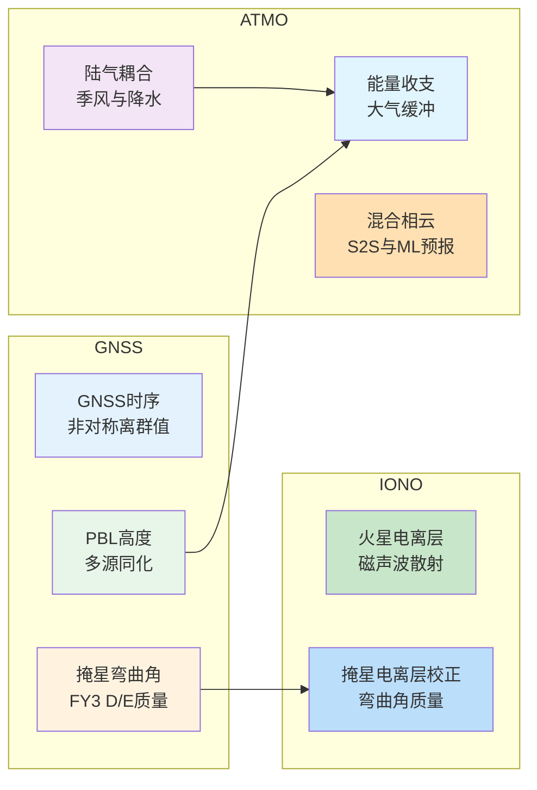
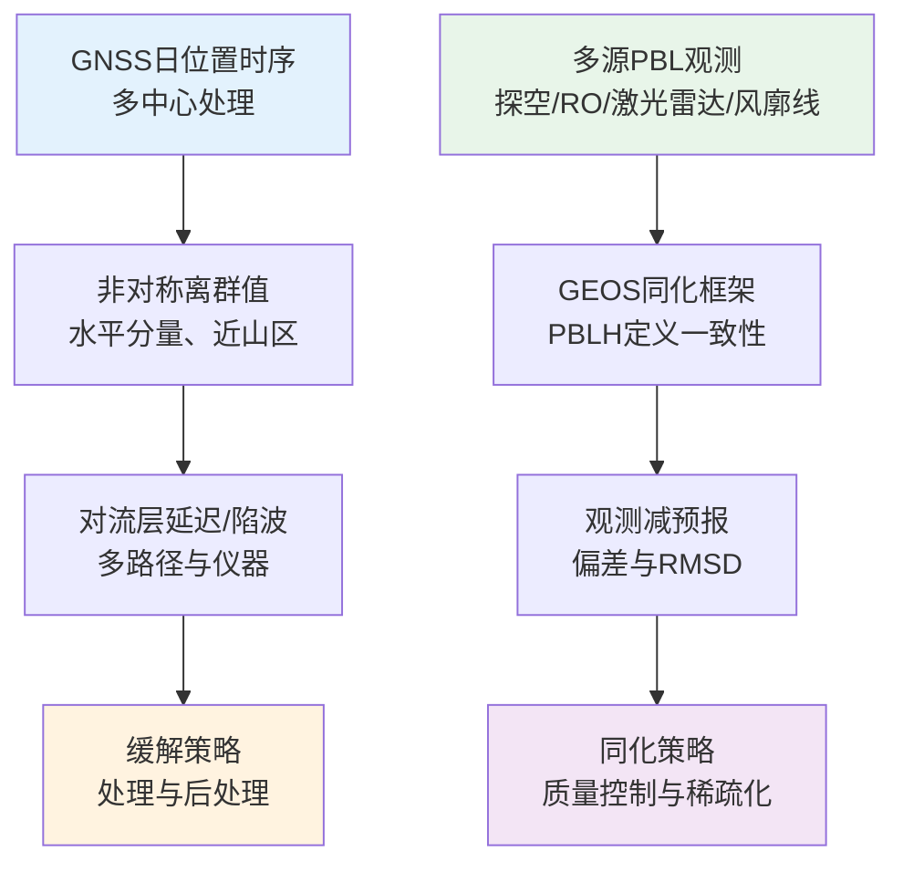
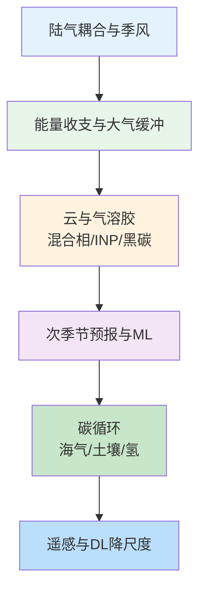
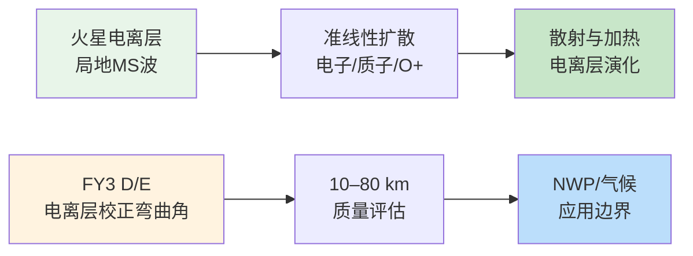
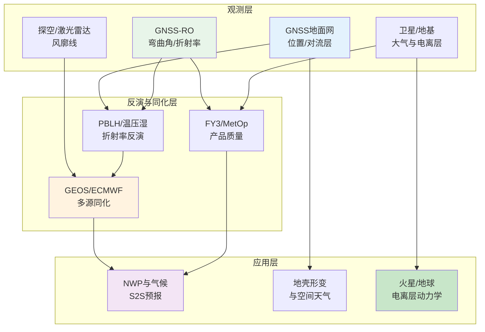

2026年1月底，GNSS、大气与电离层领域的学术产出呈现出观测与模型深度融合、多源同化与产品质量并重的特征。全球导航卫星系统在监测地壳形变与对流层延迟的同时，其无线电掩星观测被广泛应用于行星边界层高度反演与同化；大气科学在陆气耦合、地球能量收支、混合相云参数化与次季节至季节尺度预报等方面持续深化；电离层与空间天气研究则从地球延伸至火星，局地磁声波与粒子散射机制、以及风云三号D/E掩星产品的系统质量评估成为近期亮点。下文先给出本期研究印记图，再按GNSS、大气、电离层分方向综述并给出代表性研究的技术路线表与结构图，随后给出各方向顶刊与特色论文的专题画像、交叉学科网络图与创新链流程图，最后简述近期研究特色变化并附参考文献。

## 一、本期研究印记图

近七日收录的论文覆盖GNSS定位与时间序列、GNSS无线电掩星（RO）在同化与产品质量中的应用、陆气耦合与季风、中层大气逆温、地球能量收支、混合相云与北极冷空气爆发、机器学习天气预测与MJO遥相关、冰核粒子与气溶胶、平流层惰性气体动力学、极端降水聚类、涡度协方差与湍流、海冰与深度学习、海气碳通量、黑碳与氢化学、土壤呼吸与碳循环、以及遥感与深度学习温度降尺度等主题。数据表明，GNSS方向本期侧重非对称离群值表征与多源PBL高度同化评估；大气方向以气候模式、云物理、次季节预报与碳循环为主；电离层方向则涵盖火星电离层波粒相互作用与FY3 D/E掩星弯曲角质量。下图概括了本期各方向热点与结构关系。

## 二、GNSS 方向

本期GNSS相关研究集中在日位置时序中的非对称离群值成因与缓解、以及多观测系统行星边界层高度（PBLH）在GEOS同化框架中的评估两方面；掩星产品质量与GNSS/GPS在生态与大地测量中的应用亦有涉及。非对称离群值多出现在水平分量、且多见于山区，方向大致与地形正交，与未充分校正的对流层延迟（如地形诱发的陷波等）及多路径、天线积雪或遮挡等因素相关；多源PBLH评估则强调观测与模式在PBLH定义上的一致性，以及针对不同观测类型的质量控制与稀疏化策略对同化效果的影响。

**表1：GNSS方向代表性研究的技术路线与特点**

| 研究主题 | 技术路线 | 技术特点 | 重要结论 |
|---------|---------|---------|---------|
| GNSS时序非对称离群值 | 多区域多中心时序分析 + 离群值方向与地形关系 | 水平分量为主、近山区、方向正交地形 | 离群值具物理成因，高分辨率对流层建模与后处理可缓解 |
| GEOS多源PBLH评估 | 探空/GNSS-RO/星载与地基激光雷达/风廓线雷达 + 27天评估 | 定义一致性、观测减预报偏差与RMSD量化 | 物理与仪器一致的定义及分类型质量控制对同化至关重要 |
| FY3 D/E掩星弯曲角质量 | 电离层校正弯曲角 + ERA5/MetOp对比 + 10–80 km异常与偏差噪声 | GPS/BDS双系统、FY3E-GPS 35–50 km大离群 | 40 km以下与MetOp一致，40 km以上偏差与噪声更大，需改进以利平流层应用 |
| 高精度GPS追踪人类觅食 | GPS与视频 + 认知建模与多智能体模拟 | 社会信息与觅食决策、斑块离开时间 | 社会情境驱动觅食动态，高分辨率追踪可支撑现实认知研究 |
| 藏南上地幔运动学 | 直达S波分裂 + 参考台站法 + 大地测量与板块运动 | FPD与KKF走向差异、壳幔解耦 | FPD近东西向，与KKF走向显著差异，指示壳内断层与上地幔东向流动 |

### 2.1 专题画像：GNSS时序非对称离群值的区域特征与物理成因

**（1）技术路线**

Silverii等（2026）在Geophysical Journal International上发表了针对意大利中南部、新西兰与美国西部数千条GNSS日位置时序中非对称离群值的多中心分析。研究使用多家处理中心的数据，识别具有主导方向的离群值（即主要出现在序列均值一侧的离群），并统计其幅度、分量与站点地形关系。离群值检测与方向估计在站点尺度完成，并结合地形与气象条件进行局部对比分析，以区分对流层延迟、多路径、天线积雪或天空遮挡等可能来源。

**（2）技术特点**

该工作的创新在于系统刻画了非对称离群值的跨区域、跨数据集共性：水平分量离群数量多、幅度可达10–50 mm，远超典型位置不确定度（约1–6 mm）；离群高发站点多位于山区，主导方向大致与当地地形正交。结果在不同数据集与仪器配置下一致，支持物理成因（如未校正对流层延迟与地形—大气耦合导致的陷波）而非单一处理策略或仪器配置。文中还探讨了在处理与后处理阶段的缓解策略，并指出高分辨率对流层建模与更精细的观测筛选有助于改进。

**（3）重要结论**

该研究的重要结论是：**GNSS日位置时序中的非对称离群值在水平分量上突出、且多见于山区、方向大致正交于地形，跨数据集一致性支持其物理成因（与未充分校正的对流层延迟及地形—大气耦合一致）；需在高分辨率对流层建模与后处理方面加强，以改善速度与瞬变形变估计的可靠性**。这一发现对地震与构造GNSS解算中的误差控制与同化应用具有直接意义。

### 2.2 专题画像：GEOS系统中多源PBL高度数据的评估框架

**（1）技术路线**

Yang等（2026）在Journal of Geophysical Research: Atmospheres上发表了GEOS系统中多源行星边界层高度（PBLH）数据评估的第二部分。框架纳入的观测包括探空、GNSS无线电掩星（GNSS-RO）、星载激光雷达（CALIPSO、CATS）、地基微脉冲激光雷达（MPLNET）与风廓线雷达网（GRWP）；PBLH既可与GEOS模式定义一致、也可在定义不一致时进行比较。研究选取27天（2015年8月23日至9月18日）进行综合评估，量化各观测类型的观测减预报偏差与均方根偏差，并讨论定义一致性与质量控制、稀疏化对同化策略的影响。

**（2）技术特点**

该研究的价值在于将探空、GNSS-RO与GRWP的PBLH在一致的模式定义下评估，而激光雷达类PBLH因当前模式限制仍采用不一致定义进行比较；结果凸显了物理与仪器一致的定义对同化的重要性，以及针对不同观测类型的质量控制与稀疏化对减少偏差、提升同化效果的关键作用。文中还指出两种星载激光雷达PBLH数据集在洋面上存在明显差异，并预期通过引入相应的激光雷达PBLH定义与先进反演算法可减小此类差异。

**（3）重要结论**

该研究的重要结论是：**多源PBLH同化评估中，与模式在物理与仪器上一致的定义及分类型质量控制与稀疏化至关重要；当前激光雷达PBLH与模式定义不一致，星载激光雷达间在洋面上差异显著，发展相应的模式PBLH定义与反演算法将有助于提升PBLH同化与预报**。该框架为当前与未来PBLH数据集评估及同化策略设计提供了可操作基础。

### 2.3 专题画像：风云三号D/E掩星弯曲角产品质量评估

**（1）技术路线**

Li等（2026）在Atmospheric Measurement Techniques上对风云三号（FY3）D/E卫星的无线电掩星电离层校正弯曲角产品进行了系统质量评估。以ERA5为参考、MetOp产品为对比，在10–80 km高度范围内进行异常检测与偏差、噪声量化；并进一步分析由此得到的优化弯曲角、折射率与温度的质量。FY3D与FY3E均配备GPS与BDS接收机，评估分别针对电离层校正弯曲角及下游反演量。

**（2）技术特点**

评估表明，FY3电离层校正弯曲角在40 km以下与MetOp一致性较好；40 km以上FY3偏差与噪声均大于MetOp。异常剖面比例上，MetOp劣质剖面少于5%，FY3D少于10%，FY3E（GPS/BDS）约20%；FY3E-GPS在35–50 km高度易出现大离群。日平均偏差与噪声方面，FY3系列整体高于MetOp，其中FY3E-GPS日平均偏差约−0.4 µrad且多出现在setting事件。由于高空偏差与噪声较大，FY3优化弯曲角在高空受背景弯曲角校正较强，折射率与温度也随之受到影响。

**（3）重要结论**

该研究的重要结论是：**FY3 D/E电离层校正弯曲角在40 km以下质量与MetOp相当，适于业务同化与气候研究；40 km以上偏差与噪声较大，FY3E-GPS在35–50 km离群较多，需改进反演与质量控制以提升平流层及以上的数值预报与气候应用价值**。该结果为FY3掩星产品在NWP与气候中的使用边界与改进方向提供了定量依据。

### 2.4 专题画像：高精度GPS追踪揭示野外人类觅食中的社会信息使用

**（1）技术路线**

Schakowski等（2026）在Science上结合高精度GPS追踪与视频数据、认知—计算模型与多智能体模拟，研究人类在真实觅食任务中如何整合个人、社会与生态信息以指导空间搜索与斑块离开决策。数据来自大规模觅食竞赛；模型用于量化社会情境对觅食动态的驱动作用，包括在社会信息上的依赖程度与在场他人对停留时间的影响。

**（2）技术特点**

该工作的创新在于在自然环境中获取高时空分辨率行为数据，并用量化模型检验社会信息与觅食决策的关系。结果表明，觅食者在搜寻失败时更依赖社会信息定位资源，在他人在场时延长放弃时间，从而在高社会密度下表现出更强的区域限制搜索。这些发现突出了社会性对人类觅食决策的重要性，并为利用高分辨率追踪数据研究现实世界认知提供了可复制的模板。

**（3）重要结论**

该研究的重要结论是：**社会情境是觅食动态的关键驱动因素；觅食者在不成功时更依赖社会信息定位资源，在他人在场时延长放弃时间并增强区域限制搜索；高分辨率GPS与视频追踪结合认知建模可有效用于现实世界认知与行为研究**。该成果对行为生态学与空间认知研究具有广泛参考价值。

### 2.5 专题画像：藏南上地幔运动学与直达S波分裂

**（1）技术路线**

Dubey等（2026）在Geophysical Journal International上利用远震直达S波与参考台站法，反演藏南卡拉昆仑断裂带附近的上地幔各向异性参数（快波偏振方向FPD与分裂延迟STD）。参考台站法对源侧各向异性不敏感，便于使用远震直达S波进行分裂测量。研究使用Y2台网31个台站记录、145个地震（M≥5.5、震中距30°–90°），获得1624个高质量分裂测量，并结合大地测量（含全球定位系统数据）与印欧板块运动矢量进行解释。

**（2）技术特点**

STD约1.1–1.8 s，表明研究区上地幔各向异性显著。FPD以西向为主，向东段略转为ENE–WSW；与先前SKS结果在多数台站一致，并为先前缺乏SKS各向异性的台站（WT04、WT05、WT11、WT18）提供了新的分裂测量。FPD与卡拉昆仑断裂东南段走向斜交，可解释为上地幔物质东向流动；FPD与断裂走向的显著差异暗示该断裂可能未穿透岩石圈，而限于地壳深度。结合地表形变与板块运动，推断变形来自岩石圈变形与岩石圈下地幔动力学的共同贡献；FPD与GPS揭示的地壳变形方向不一致，支持壳幔解耦。

**（3）重要结论**

该研究的重要结论是：**藏南卡拉昆仑断裂附近上地幔FPD近东西向、与断裂走向斜交，结合STD与大地测量支持上地幔东向流动与壳幔解耦；断裂可能为地壳尺度而非岩石圈尺度，上地幔变形由岩石圈变形与岩石圈下动力学共同塑造**。该结果为高原动力学与断裂性质提供了新的地震学约束。

## 三、大气方向

本期大气科学论文涵盖陆气耦合与季风、中层大气逆温、地球能量收支、混合相云、次季节预报与MJO、古气候与同位素、冰核粒子、平流层惰性气体、极端降水聚类、涡度协方差、海冰与深度学习、海气碳通量、黑碳与氢化学、土壤呼吸与碳循环、以及遥感与深度学习温度降尺度等。共性包括：陆气耦合与能量收支在气候尺度上的机制量化、云与气溶胶参数化的改进、机器学习在天气与气候预测中的应用、以及碳循环与大气成分的观测与模拟。

**表2：大气方向代表性研究的技术路线与特点**

| 研究主题 | 技术路线 | 技术特点 | 重要结论 |
|---------|---------|---------|---------|
| 陆气耦合与季风 | CESM耦合/非耦合 + 水汽收支与MSE + Webster–Yang指数 | 季风区降水增强、印度次大陆动力分量 | 陆气耦合通过中对流层水汽与稳定性增强垂直运动与降水 |
| 中层逆温层MIL | TIMED/SABER 22年 + 多元回归(ENSO/QBO/F10.7) | 半球不对称、分点高、11年周期显著 | 近全球MIL发生比约+0.055%/年，太阳周期控制显著 |
| 大气在地球能量收支年际变率中的作用 | TOA净辐射与海洋储热 + 大气储热 | 大气缓冲、ENSO相位延迟 | 考虑大气储热可改善TOA与海洋储热年际一致性与约2个月相位差 |
| E3SM混合相云偏差 | SCREAM与LES/卫星/地基对比 + WBF与冰核方案改进 | 亚网格云重叠、过冷液水与云顶相态 | 亚网格重叠改进显著增加过冷液水、改善云顶相态 |
| 次季节预报与MJO | SFNO-HENS/NeuralGCM vs ECMWF、2004–2023 hindcasts | MJO传播与遥相关、S2S技能 | ML模式在S2S尺度与ECMWF相当，MJO传播与遥相关合理 |
| 落基山冰核粒子 | SAIL/浸没冻结INP + 气溶胶类型与ns参数化 | 粗粒尘与有机/生物、季节差异 | 首次上科罗拉多流域长期INP表征，ns参数化可复现浓度 |
| 平流层惰性气体动力学分馏 | 气球低温采样(日本) + Kr/Xe/Ne垂直变化 | 质量与扩散率、动力学分馏 | 动力学分馏可诊断平流层输送，冰芯中元素比或受冰期—间冰期环流影响 |
| 摩洛哥极端降水聚类 | MSWEP/ERA5 + 非参数聚类与HighResMIP | TCEP与AR/NAO、海洋耦合偏差 | HighResMIP再现事件数但低估雨量，海洋耦合为偏差重要来源 |
| 地中海中部海气CO2通量 | 兰佩杜萨观测 + ICOS + 2022–2023海洋热浪 | 冬吸收/夏释放、热浪期风减弱 | 热浪期间强风事件减少导致2023年初冬吸收较2022年初低约30% |
| 大西洋黑碳浓度与混合态 | S/Y Eugen Seibold 船载 + 海岸至远海 | 核壳与非核壳、凝结与吸湿 | 近岸非核壳比例高，远海降低；凝结与吸湿过程主导混合态演化 |
| 全球大气H2化学与收支 | EMAC v2.55 + NOAA/GML 56站 + 土壤吸收 | 源汇与季节、OH与CH4寿命 | EMAC再现H2幅度与季节，偏远站相关高；H2收支与文献底向上估计一致 |
| 土壤呼吸速率与年龄表征碳循环路径 | 16站呼吸速率与14C/13C + 自养/异养分离 | 高周转/温度限制/输入限制/碳耗竭/泥炭热点 | 速率与年龄可区分土地利用下的碳循环类型 |
| TAUT温度降尺度 | U-Net + Swin + 3D卷积 + MBTA地形 + 西南中国 | 0.1°→0.01°、3 h→1 h | 48 h内优于双线性/SRCNN/U-Net/EDVR，地形模块提升复杂地形表现 |

### 3.1 专题画像：陆气耦合对降水与季风环流的影响（GLACE-Hydrology）

**（1）技术路线**

Lan等（2026）在Journal of Climate上使用社区地球系统模型（CESM）的耦合与非耦合模拟，研究陆气耦合对降水变化与季风环流的影响。通过水汽收支与湿静力能（MSE）剖面分析，识别驱动降水与环流变化的机制，并将MSE剖面与Webster–Yang季风指数结合，形成评估陆气耦合调制季风动力学的框架。对比区域包括北美中部、南欧、萨赫勒与印度。

**（2）技术特点**

耦合模拟在多数陆地区域给出更高温度与更少降水，而在季风区因垂直运动加强与季风环流增强导致降水增加。印度次大陆上，加强的水平水汽平流与更强的动力分量是主要机制；中对流层水汽增加与大气稳定度变化是增强垂直运动与降水的重要因素。该研究将MSE剖面与Webster–Yang指数整合，为理解陆气反馈对季风变率的贡献提供了可操作框架。

**（3）重要结论**

该研究的重要结论是：**陆气耦合在季风区通过增强垂直运动与季风环流使降水增加，其中中对流层水汽与大气稳定度变化是关键；MSE剖面与Webster–Yang指数的结合可为季风敏感区气候模拟改进与水资源评估提供依据**。该结论对季风区气候预测与农业水资源管理具有重要参考价值。

### 3.2 专题画像：大气在地球能量收支年际变率中的重要作用

**（1）技术路线**

Mayer等（2026）在Geophysical Research Letters中利用观测数据量化大气储热对地球能量收支（EEI）年际变率的贡献。尽管大气在EEI长期均值中仅占1%–2%，但分析表明大气能量含量的变化在年际尺度上作用显著。研究将大气能量吸收纳入后，检验了2005–2024年全球大气顶净辐射与海洋储热年际变化的一致性，并解释了二者之间约2个月的相位差。

**（2）技术特点**

考虑大气储热后，大气顶净辐射与海洋储热年际变化的吻合度提高，且二者之间的延迟（海洋储热变率领先净辐射异常约2个月）得到合理解释：大气在厄尔尼诺—南方涛动（ENSO）等模态下对能量的缓冲与再分配导致该相位差。结果凸显了持续监测与改进EEI各分量估计对稳健诊断这些关系的重要性。

**（3）重要结论**

该研究的重要结论是：**大气能量含量的年际变化在地球能量收支年际变率中扮演重要角色；纳入大气储热可改善大气顶净辐射与海洋储热年际一致性，并解释约2个月的相位差，这与大气在ENSO期间的缓冲与再分配作用一致**。该发现对气候监测与能量收支闭合检验具有直接意义。

### 3.3 专题画像：对流许可E3SM中混合相云偏差的揭示与改进

**（1）技术路线**

Lin等（2026）在Journal of Geophysical Research: Atmospheres上评估了简单对流解析E3SM大气模式（SCREAM）对北极混合相云的模拟，并与大涡模拟、卫星及地基观测（含北极冷空气爆发海洋边界层实验）对比。研究将云中液态—冰相分配偏差归因于Wegener–Bergeron–Findeisen（WBF）过程过强与温度决定的沉积冰核方案在冷端的过早冰产生；提出了基于亚网格云重叠的物理改进，并检验了水平分辨率对过冷液水含量的影响。

**（2）技术特点**

SCREAM原方案中WBF在亚网格上无变化，与凝结方案中瞬时饱和调整所隐含的亚网格变率不一致，导致WBF速率被高估。改进的亚网格云重叠处理使过冷液水含量显著增加、云顶相态分配更接近观测；过冷液水随分辨率提高而收敛。沉积冰核方案在高空产生观测中未见的冰云，影响云辐射效应与大气顶辐射通量。研究指出了对流许可模式在云参数化方面仍存在的关键不足。

**（3）重要结论**

该研究的重要结论是：**SCREAM中混合相云偏差主要来自WBF过程过强与沉积冰核方案在冷端的过早冰产生；亚网格云重叠的物理改进可显著增加过冷液水并改善云顶相态，沉积冰核方案导致虚假高空冰云并影响辐射；这些缺陷仍是对流许可模式的共性挑战**。该结论为高纬度云与辐射的模拟改进指明了具体路径。

### 3.4 专题画像：机器学习天气预测模式中的次季节预报与MJO遥相关

**（1）技术路线**

Peings等（2026）在Journal of Geophysical Research: Atmospheres上对两种机器学习天气预测模式——SFNO-HENS（Nvidia，纯ML）与NeuralGCM（Google Research，混合）——在次季节至季节（S2S，第3–8周）尺度进行了2004–2023年大量回报检验，以欧洲中期天气预报中心（ECMWF）回报为物理基准。重点评估对北美西岸10–3月水汽输送有重要影响的MJO及其在北太平洋遥相关的预报技巧。

**（2）技术特点**

两种ML模式在S2S尺度与ECMWF整体相当，在北太平洋大尺度环流与MJO的预报技巧上具有可比性；尽管中纬度次季节技巧总体仍低，ML模式在MJO穿越海洋大陆的传播及遥相关结构上表现出合理行为。SFNO-HENS在热带初始条件扰动下的敏感性实验表明模式稳定，并说明ML模式在S2S尺度上能够表征重要大气过程。

**（3）重要结论**

该研究的重要结论是：**SFNO-HENS与NeuralGCM在次季节尺度上与ECMWF竞争，在北太平洋环流与MJO预报上技巧相当，且能合理刻画MJO传播与遥相关；ML模式在S2S尺度上具备表征关键大气过程的能力，为业务次季节预报提供了新的技术路线**。该结论对S2S预报与ML在气象中的应用具有重要参考价值。

### 3.5 专题画像：落基山地区冰核粒子的季节变率、来源与参数化

**（1）技术路线**

Zhou等（2026）在Atmospheric Chemistry and Physics上报告了在落基山Crested Butte（地表大气综合野外实验室SAIL，2021年9月至2023年6月）开展的浸没冻结冰核粒子（INP）综合观测。测定−20 °C活化INP数浓度、结合气溶胶类型与INP活性表面位点密度（ns），建立与粗粒尘、有机与生物组分相关的参数化，并评估季节差异（夏季高、冬季低）及热不稳定（生物）INP的贡献。

**（2）技术特点**

−20 °C下平均INP数浓度约2 L⁻¹，季节变率明显。INP与粗粒尘气溶胶（该区PM10主导类型）相关，ns计算支持粗粒尘对INP的主要贡献；H2O2处理表明有机INP贡献大（平均约91%），超米级含有机物的土壤尘主导该区INP。热不稳定INP在高于−15 °C时占优，冬季贡献大幅下降（约96%）。基于ns的参数化能较好复现观测浓度，尤其在考虑季节差异时。该研究首次给出上科罗拉多河流域长期、综合的INP表征，并为其他大陆偏远地区的INP预测提供了可用的参数化思路。

**（3）重要结论**

该研究的重要结论是：**落基山Crested Butte地区INP以粗粒尘与有机/生物成分为主，季节变率显著，热不稳定INP在较高温度占优且冬季大幅减少；基于ns的参数化可复现观测浓度，首次为上科罗拉多河流域提供长期INP表征，并可用于其他大陆偏远地区**。该结论对云与降水过程及气溶胶—云相互作用参数化具有直接应用价值。

### 3.6 专题画像：日本上空平流层惰性气体的动力学分馏

**（1）技术路线**

Sugawara等（2026）在Atmospheric Chemistry and Physics上利用气球携带的低温空气采样器在日本上空采集平流层空气，对惰性气体Kr、Xe与Ne进行高精度分析，获得同位素与元素比的垂直变化。以往研究多关注主要大气成分的垂直变化与质量数的关系；该研究首次报道Kr、Xe、Ne在平流层的垂直变化，并通过归一化质量数差异的分布推断动力学分馏（由分子扩散率差异引起），并与模拟结果对比。

**（2）技术特点**

所有惰性气体的同位素与元素比随高度呈现重同位素/重元素降低、轻者升高的规律；按质量数差异归一化后，质量数越大、分离越小，表明除重力分馏外还存在动力学分馏。模拟可复现较重惰性气体的动力学分馏。结果支持惰性气体动力学分馏可作为诊断平流层输送的新手段；现代大气中除对流层Ar/N2比外，用惰性气体直接检测平流层环流长期变化较难，但冰期—间冰期环流变化可能影响冰芯中惰性气体元素比。

**（3）重要结论**

该研究的重要结论是：**平流层Kr、Xe、Ne的垂直变化显示动力学分馏由分子扩散率差异引起，可作为诊断平流层输送的新工具；模拟可复现较重惰性气体的动力学分馏；冰期—间冰期环流变化可能影响冰芯惰性气体元素比**。该结论对平流层动力学与古气候示踪具有重要科学意义。

### 3.7 专题画像：全球大气H2化学与源汇收支的EMAC模拟

**（1）技术路线**

Surawski等（2026）在Geoscientific Model Development上使用具有详细大气化学的EMAC v2.55模式，在全球1.9°分辨率下进行氢（H2）的平衡模拟，引入H2源汇（含土壤吸收的细菌消耗方案）及详细的H2与甲烷（CH4）通量边界条件，并与NOAA全球监测实验室碳循环合作全球空气采样网56站观测对比。

**（2）技术特点**

EMAC在多数站点再现了H2的幅度、振幅与半球间季节差异；时间序列相关系数在8个偏远站（极区与中纬岛屿）超过0.9，另有23站介于0.7–0.9，多位于偏远海洋与极区。在东亚与地中海污染站及印尼泥炭火影响站，模式表现较差（r<0.5），局地与突发排放难以刻画。H2收支与文献底向上估计在源汇强度与大气负荷上一致；通过OH模拟使CH4寿命与观测约束估计一致，表明EMAC具备全球高精度H2模拟能力。研究指出未来可关注自然与人为H2源对空气质量与气候的影响、土壤汇的不确定性、以及H2释放对大气氧化能力的潜在影响。

**（3）重要结论**

该研究的重要结论是：**EMAC v2.55能准确再现全球H2的幅度、季节与半球差异，在偏远站相关高，H2收支与底向上估计一致，CH4寿命与观测约束一致；污染与火灾影响站偏差大，未来需改进局地排放与土壤汇表征**。该结论对H2循环与大气化学—气候相互作用研究具有重要参考价值。

### 3.8 专题画像：TAUT地形自适应U-Net Transformer与西南中国温度降尺度

**（1）技术路线**

Cheng等（2026）在Remote Sensing上提出TAUT（Terrain-Adaptive U-Net Transformer），用于西南中国复杂地形区2 m温度的高分辨率时空降尺度。模型以U-Net编码—解码为骨架，融合Swin Transformer的全局注意力与三维卷积的局部时空特征，并引入多分支地形自适应模块（MBTA）将地形遥感数据与温度场、风场等气象场自适应融合，实现空间从0.1°到0.01°、时间从3 h到1 h的降尺度。

**（2）技术特点**

在48 h降尺度窗口内，TAUT在MAE、RMSE、COR、ACC、PSNR、SSIM等指标上均优于双线性插值、SRCNN、U-Net与EDVR；消融实验验证了Swin、3D卷积与MBTA模块的独立与协同贡献。不同地形类型（山地、高原、盆地）下模型表现稳定，在高温极端天气下能更好恢复受地形影响的温度细节与空间纹理，体现了地形遥感数据对降尺度精度的显著影响。研究成功构建了CNN局部特征与Transformer全局上下文相结合的混合架构，并通过专用模块有效融合地形与气象数据。

**（3）重要结论**

该研究的重要结论是：**TAUT在西南中国复杂地形区实现了2 m温度的高分辨率时空降尺度，48 h内各项指标优于对比模型，地形自适应模块与Swin/3D卷积协同提升表现，尤其在高温极端与不同地形类型下；该架构为遥感与数值模式数据在深度学习中的融合提供了可借鉴框架**。该结论对区域气象与气候应用及遥感—NWP融合具有直接应用价值。

## 四、电离层方向

本期电离层相关研究包括火星电离层中局地快磁声波对电子与离子的散射效应、以及风云三号D/E掩星电离层校正弯曲角产品质量（与GNSS方向重叠，侧重电离层校正与中高层大气应用）。火星工作拓展了地球以外电离层中波—粒相互作用的理解；FY3 D/E评估则直接支撑掩星产品在数值预报与气候研究中的使用边界。

**表3：电离层方向代表性研究的技术路线与特点**

| 研究主题 | 技术路线 | 技术特点 | 重要结论 |
|---------|---------|---------|---------|
| 火星电离层局地磁声波粒子散射 | 局地MS波动力学色散 + 准线性扩散系数 | 电子Landau共振、质子回旋共振、O+高次回旋共振 | 局地MS波可有效散射电子与离子，参与火星电离层演化 |
| FY3 D/E掩星弯曲角质量 | 电离层校正弯曲角 + ERA5/MetOp + 异常与偏差噪声 | 40 km以下与MetOp一致、以上偏差噪声大 | 同表1/2.3，改进高空反演可扩展至平流层应用 |

### 4.1 专题画像：火星电离层局地快磁声波引起的粒子散射

**（1）技术路线**

Yao等（2026）在Geophysical Research Letters上首次定量评估火星电离层中局地产生的快磁声波（local MS）对电子、质子与氧离子的散射作用。局地MS波不同于太阳风驱动的磁声波，近年才有观测报道，其粒子效应尚未被系统研究。研究使用局地MS波的动力学色散关系计算准线性扩散系数，分别讨论电子通过Landau共振、热质子通过回旋共振、以及数十eV的O+通过高次回旋共振的散射，并阐释其对火星电离层演化的潜在作用。

**（2）技术特点**

局地MS波可有效散射超热电子（尤以大 pitch 角热电子为著） via Landau共振；热质子在小pitch角下通过回旋共振被有效散射，而数十eV的O+则通过高次回旋共振被散射。这些结果揭示了局地MS波在火星电离层加热、散射与可能的质量流失中的角色，与地球电离层及太阳风—火星相互作用研究形成互补，拓展了无全球磁层行星电离层中波—粒相互作用的理解。

**（3）重要结论**

该研究的重要结论是：**火星电离层中局地快磁声波可通过Landau共振有效散射电子、通过回旋共振散射热质子、通过高次回旋共振散射数十eV的O+，从而参与电离层加热与演化；该发现揭示了局地MS波在火星电离层动力学中的潜在作用**。该结论对火星空间环境与电离层—磁层耦合研究具有重要科学价值。

### 4.2 专题画像：风云三号D/E掩星弯曲角产品质量（电离层与中高层大气应用）

**（1）技术路线**  
Li等（2026）在Atmospheric Measurement Techniques上对FY3 D/E电离层校正弯曲角进行了系统评估（技术路线详见2.3节）。从电离层与中高层大气应用角度，重点在于电离层校正方案对弯曲角残余误差的影响、以及这些误差在10–80 km高度内对折射率与温度反演的传递；评估以ERA5为参考、MetOp为对比，分别统计异常剖面比例与日平均偏差、噪声。

**（2）技术特点**  
电离层校正弯曲角在40 km以下与MetOp一致，满足对流层与低平流层NWP与气候应用；40 km以上FY3偏差与噪声增大，FY3E-GPS在35–50 km大离群比例高，优化弯曲角在高空受背景校正较强，折射率与温度随之受影响。该结果界定了FY3掩星产品在电离层校正与平流层应用中的适用高度与改进需求。

**（3）重要结论**  
**FY3 D/E电离层校正弯曲角在40 km以下质量与MetOp相当，适于业务同化与气候研究；40 km以上需改进反演与质量控制以提升平流层及电离层相关应用的可靠性**（与2.3节结论一致）。该评估为掩星产品在电离层与中高层大气链条中的应用边界提供了定量依据。

## 五、交叉学科网络图与创新链流程图

GNSS、大气与电离层在本期论文中通过观测、反演与同化形成紧密交叉：GNSS掩星提供全球折射率/温度与PBLH，支撑大气同化与气候监测；掩星电离层校正与弯曲角质量直接关系平流层—电离层应用；大气对流层延迟与地形—大气耦合影响GNSS定位质量；火星电离层波—粒过程与地球电离层/掩星在物理与方法上相互呼应。下图概括了从观测到应用创新链及方向间关联。

## 六、近期研究特色变化

与近期周报相比，本期GNSS、大气与电离层方向呈现以下特点。（1）**GNSS**：非对称离群值的跨区域、多中心系统分析将物理成因（对流层与地形耦合）与仪器/多路径因素区分开来，为高分辨率对流层建模与形变解算提供了明确需求；多源PBLH同化评估框架将GNSS-RO与探空、激光雷达、风廓线雷达置于统一定义与质量控制下，有利于PBLH同化策略的优化；FY3 D/E掩星质量评估给出了40 km上下不同的应用边界，对业务同化与气候应用具有直接指导意义。（2）**大气**：陆气耦合与地球能量收支在气候尺度上的机制量化、混合相云与冰核粒子的参数化改进、以及机器学习在次季节预报中的表现继续成为热点；碳循环（海气通量、土壤呼吸、H2）与大气成分（黑碳、惰性气体）的观测与模拟并重；遥感与深度学习在温度降尺度中的应用展示了地形与多源数据融合的潜力。（3）**电离层**：火星电离层局地磁声波粒子散射的首次定量研究拓展了波—粒相互作用到无全球磁层行星；FY3掩星电离层校正与弯曲角质量将电离层与中高层大气应用串联，与GNSS方向形成自然交叉。整体上，观测—反演—同化—应用的链条更加清晰，多源一致性与产品质量受到普遍重视，机器学习与物理模型的结合在天气与气候尺度上持续深化。

## 参考文献

1. Silverii, F., Klein, E., Devoti, R., Szeliga, W., Michel, S., Gualandi, A., & Trasatti, E. (2026). Asymmetric positioning errors in GNSS time series: a study from different world regions. *Geophysical Journal International*. https://doi.org/10.1093/gji/ggag046
2. Yang, E.-G., Zhu, Y., Arnold, N. P., Ganeshan, M., Salmun, H., McGrath-Spangler, E. L., Palm, S., Lewis, J., Santanello, J., Wu, D., et al. (2026). Utilizing PBL Height Data From Multiple Observing Systems in the GEOS System. Part II: Assessment of PBL Height Data. *Journal of Geophysical Research: Atmospheres*. https://doi.org/10.1029/2025jd044701
3. Li, Y., Liu, Y., Ding, W., Liao, M., Huo, X., & Ye, J. (2026). Quality aspects of Fengyun3 D∕E radio occultation bending angle products. *Atmospheric Measurement Techniques*, 19, 659–680. https://doi.org/10.5194/amt-19-659-2026
4. Schakowski, A., Deffner, D., Kortet, R., Niemelä, P. T., Kavelaars, M. M., Monk, C. T., Pykälä, M., & Kurvers, R. H. J. M. (2026). High-precision tracking of human foragers reveals adaptive social information use in the wild. *Science*. https://doi.org/10.1126/science.ady1055
5. Dubey, A. K., Tiwari, A. K., & Eken, T. (2026). Mantle kinematics beneath Southwestern Tibet inferred from direct S-wave splitting measurements. *Geophysical Journal International*. https://doi.org/10.1093/gji/ggag035
6. Lan, C.-W., Kumar, S., & Lo, M.-H. (2026). The GLACE-Hydrology Experiment: Effects of Land–Atmosphere Coupling on Precipitation Change and Monsoonal Circulations. *Journal of Climate*. https://doi.org/10.1175/jcli-d-25-0275.1
7. Mayer, M., Loeb, N. G., Lyman, J. M., Johnson, G. C., & Winkelbauer, S. (2026). The Atmosphere's Substantial Role in Interannual Variability of Earth's Energy Imbalance. *Geophysical Research Letters*. https://doi.org/10.1029/2025gl119833
8. Lin, L., Zhang, Y., Beydoun, H., Zheng, X., Zhang, M., Bogenschutz, P., Wu, P., & Caldwell, P. M. (2026). Exposing and Reducing Biases of Simulating Mixed‐Phase Clouds in the Convection‐Permitting E3SM Atmosphere Model: Lessons From an Arctic Cold‐Air Outbreak. *Journal of Geophysical Research: Atmospheres*. https://doi.org/10.1029/2025jd044660
9. Peings, Y., Dong, C., Mahesh, A., Pritchard, M., Collins, W., & Magnusdottir, G. (2026). Subseasonal Forecasting and MJO Teleconnections in Machine Learning Weather Prediction Models. *Journal of Geophysical Research: Atmospheres*. https://doi.org/10.1029/2025jd044910
10. Zhou, R., Perkins, R., Juergensen, D., Barry, K., Ayars, K., Dutton, O., DeMott, P., & Kreidenweis, S. (2026). Seasonal variability, sources, and parameterization of ice-nucleating particles in the Rocky Mountain region: importance of soil dust and biological contributions. *Atmospheric Chemistry and Physics*, 26, 1515–1536. https://doi.org/10.5194/acp-26-1515-2026
11. Sugawara, S., Oyabu, I., Kawamura, K., Ishidoya, S., Morimoto, S., Aoki, S., Nakazawa, T., Toyoda, S., & Honda, H. (2026). Kinetic fractionation of noble gases in the stratosphere over Japan. *Atmospheric Chemistry and Physics*, 26, 1537–1556. https://doi.org/10.5194/acp-26-1537-2026
12. Surawski, N., Steil, B., Brühl, C., Gromov, S., Klingmüller, K., Martin, A., Pozzer, A., & Lelieveld, J. (2026). Global atmospheric hydrogen chemistry and source-sink budget equilibrium simulation with the EMAC v2.55 model. *Geoscientific Model Development*, 19, 911–930. https://doi.org/10.5194/gmd-19-911-2026
13. Cheng, Z., Guan, J., Xiang, L., Wang, J., & Xiang, J. (2026). TAUT: A Remote Sensing-Based Terrain-Adaptive U-Net Transformer for High-Resolution Spatiotemporal Downscaling of Temperature over Southwest China. *Remote Sensing*, 18(3), 416. https://doi.org/10.3390/rs18030416
14. Yao, F., Yu, X., Yuan, Z., & Liu, K. (2026). Evaluation of Particle Scattering by Locally Generated Fast Magnetosonic Waves in the Martian Ionosphere. *Geophysical Research Letters*. https://doi.org/10.1029/2025gl118734
