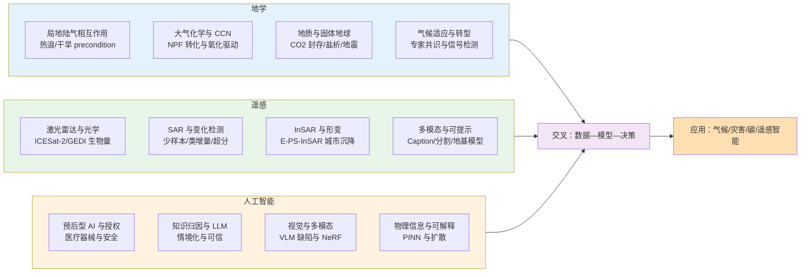
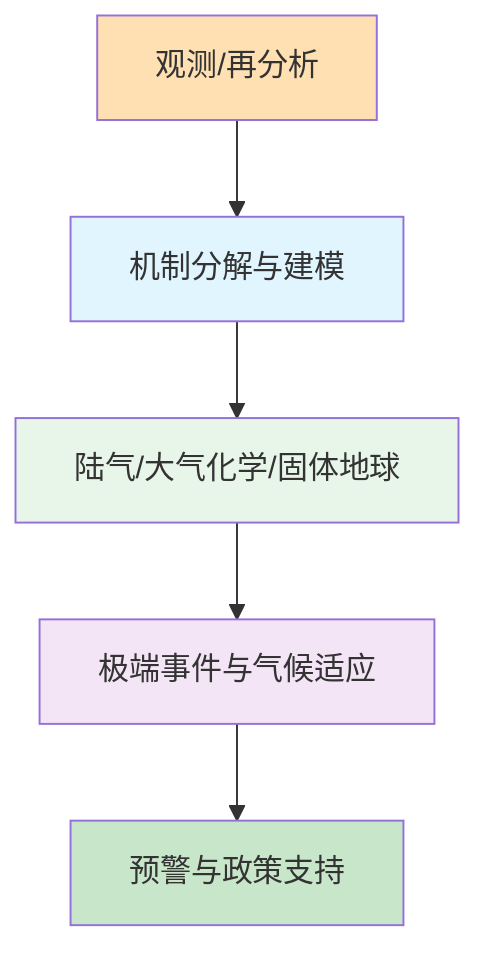
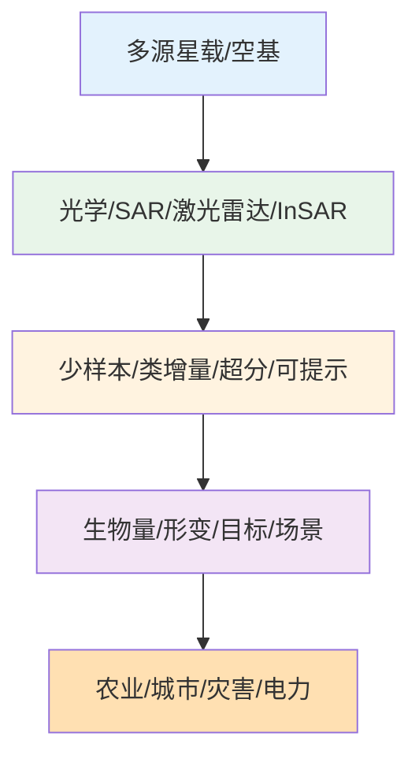
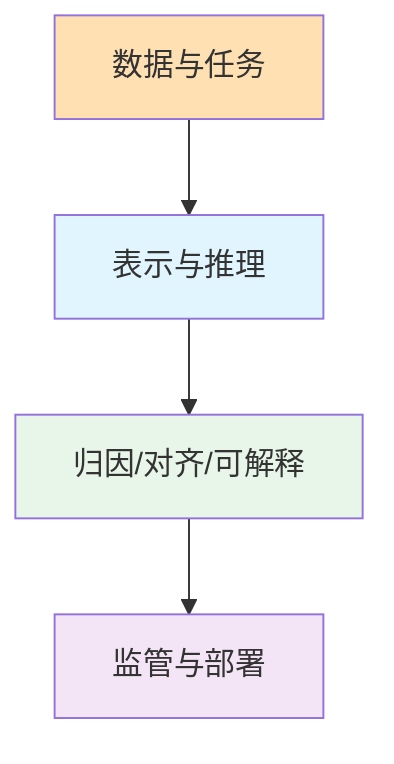
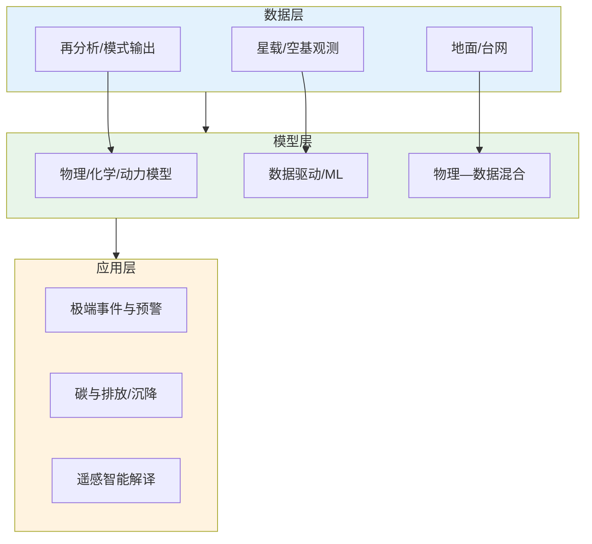

2026年2月1日至8日，Nature、Science、Geophysical Research Letters、Remote Sensing、Atmospheric Chemistry and Physics、Journal of Climate 等期刊与预印本平台收录的论文中，有大量工作涉及地学、遥感与人工智能的交叉。本文在通读本期论文目录与代表性摘要的基础上，结合领域背景与近期文献，归纳上述方向的研究现状、技术路线与重要结论，并给出可检验的未来趋势判断。

## 一、本期研究印记图

近期地学研究突出局地陆气相互作用对极端热浪与干旱的 precondition 作用、大气氧化与污染条件下 NPF 向 CCN 的转化加速、以及地质碳封存中盐析驱动的岩石破坏模式转变；遥感方向则延续多源融合与智能解译主线，从 ICESat-2/GEDI 生物量估算、SAR 小样本类增量识别、到 InSAR 地表形变与扩散模型超分、可提示地基模型等均有进展；人工智能方向在预后型 AI 医疗器械授权、知识归因与情境化、视觉语言模型缺陷、以及物理信息神经网络可视化等方面形成热点。本期论文在方法上共同体现“观测/模式—数据驱动—机制解释”的链条，在应用上指向气候适应、灾害预警、碳管理与智能遥感。

## 二、地学方向

本期地学论文在技术路线上普遍结合观测或再分析数据、物理/化学机制与统计或机器学习方法，在陆气相互作用、大气化学与 CCN、地质碳封存与流体注入地震、气候适应与转型等方面形成清晰主线。技术特点包括：局地过程与大气强迫的分解、氧化与污染条件下成核与生长的量化、盐析导致的岩石破坏模式从剪切向张性转变的首次观测、以及专家共识框架下的气候转型适应要素归纳。

**表1：地学方向代表性研究的技术路线与特点**

| 研究主题 | 技术路线 | 技术特点 | 重要结论 |
|---------|---------|---------|---------|
| 印缅平原湿热/干热浪的局地陆气 precondition | 欧拉温度分解 + 热浪前兆因子分析 | 局地 diabatic/adiabatic 主导，水平平流贡献小 | 前期降水、夜间低云与地表湿度是湿热浪关键前兆；干热浪由反气旋、感热与缺湿驱动 |
| 污染大气下 NPF 向 CCN 转化加速 | 山顶观测 + MALTE_BOX 模拟 + τ 时间窗 | 氨参与成核、硝酸盐维持生长，氧化增强 CCN | 污染条件下 NPF-P 的 CCN 增强因子更高，NPF→CCN 转化时间缩短约 17% |
| 地质 CO2 封存中盐析驱动的岩石破坏 | 储层条件驱替 + 单轴压缩与微观分析 | 盐结晶导致剪切—张性破坏模式转变 | 盐析使岩石力学性能劣化，首次观察到从剪切主导向张性主导的破坏模式转变 |
| 黑海西北架全新世氮输入重建 | 沉积 TOC/TIC/N/δ15N + 气候期对比 | 气候控制河流氮与 pelagic 固氮相对贡献 | 冷干亚北方期 pelagic 固氮主导，暖湿大西洋期河流氮主导；人类活动氮可追溯至沉积记录 |
| 印度地表臭氧光化学机制敏感性 | 排放与气象敏感性分析 | 区分排放与气象对臭氧生成的影响 | 为印度光化学臭氧形成机制与减排策略提供量化依据 |
| 阿拉伯海低层大气变干与印度季风干旱 | 72 年 LLJ 核心饱和度与风速 + 干湿极端统计 | LLJ 核心变干变弱，与干湿极端滞后相关 | LLJ 核心 72 年来变干约 17%、变弱约 5%，干极端增多 50%，湿极端增多 40%，为季风干旱 precursor |
| 流体注入与地震矩释放节奏 | 循环注入—回抽实验 + 滑移与矩释放统计 | 循环注入使事件更频更小，抑制延迟地震 | 循环注入通过控制矩释放节奏限制单次最大震级，总矩仍与累积注入体积标度 |
| 南极半岛大气河与 Polar WRF 云模拟 | 极地 WRF + 增强观测对比 | 混合相云、Hallett-Mossop 敏感性 | 极地 WRF 能合理模拟大气河期间的云与降水，Rothera 对二次冰过程敏感 |
| 气候转型适应关键要素专家共识 | 多专家问卷与共识框架 | Nature Climate Change 刊载 | 归纳转型适应的关键要素与共识，为政策与规划提供依据 |
| DTRF2020 ITRS 实现 | DGFI-TUM 两步组合 + 非潮汐负荷 + 震后形变 | VLBI+GNSS 联合定尺、负荷改正改善高度 RMS | 与 ITRF2020 差异在 GNSS/VLBI/SLR 上达约 3.1 mm 与 0.13 mm/yr，高度速度与 GIA 等一致 |

### 2.1 专题画像：印缅平原湿热与干热浪的局地陆气 precondition

**（1）技术路线**

Saha 等（2026）采用欧拉温度分解框架，将印缅平原热浪期间的温度变化分解为局地 diabatic（非绝热）、adiabatic（绝热）与水平热平流（远程）三项贡献，定量评估大尺度下沉与局地陆气过程各自的相对重要性。研究选取该区域 10 次典型热浪事件，利用再分析数据（如 ERA5）与地面站点观测，在热浪发生前数日至两周的时间窗内提取大气环流、边界层结构、地表感热/潜热通量、土壤湿度、云量与降水等前兆因子；通过热浪按干/湿类型的分类（基于露点或湿度阈值），分别建立湿热浪与干热浪的前兆因子统计与合成分析，并与非热浪期对比，识别可操作的早期预警指标。技术路线贯穿“再分析—欧拉分解—前兆因子提取—分类统计—预警变量筛选”。

**（2）技术特点**

研究的主要技术特点在于：（一）明确区分湿热浪与干热浪两类极端事件，避免将不同物理机制混为一谈；（二）欧拉分解定量表明局地 diabatic/adiabatic 过程对温度变化的贡献远大于水平热平流，即大尺度反气旋 alone 不足以解释印缅平原热浪的形成与类型差异；（三）将前期降水、夜间低云、地表湿度、感热通量、湿度平流与云况等陆气变量系统纳入前兆分析，在热浪区与非热浪区、以及湿热浪与干热浪之间均表现出显著差异，为业务化热浪预警提供了可观测、可同化的前兆变量集合；（四）方法上不依赖单一机制假设，适合在观测与再分析基础上做因果与预测建模的后续拓展。

**（3）重要结论**

**该研究的重要结论是：印缅平原湿热浪与干热浪均主要由局地陆气相互作用 precondition，水平热平流贡献较小；湿热浪的关键前兆为前期降水、夜间低云与地表湿度，干热浪则由反气旋、高感热、缺湿与少云驱动。**影响与意义在于：**（1）将热浪预警从“大尺度环流指标”前推到“局地陆气前兆”，可提前数日识别高风险类型（湿/干）与区域，支撑公共卫生与农业防灾；（2）为气候模式与统计预报中引入土壤湿度、云与边界层过程提供了观测依据；（3）在气候变暖与城市化叠加的印缅平原，区分湿/干热浪有助于制定差异化的适应策略（如灌溉与遮阴对湿热浪、用水与电力负荷对干热浪）。**（Saha 等，2026；Geophysical Research Letters。）

### 2.2 专题画像：污染大气下 NPF 向 CCN 转化加速

**（1）技术路线**

Zhu 等（2026）的技术路线为“山顶观测—气团分类—成核/生长量化—化学箱模式校验—CCN 转化时间窗”。在长三角某山顶背景站开展 2024 年春季连续观测，获取粒径谱、气态前体物（如 SO₂、NH₃、H₂SO₄ 等）与气象要素；按气团来源与污染程度将 NPF 事件划分为污染型（NPF-P）与清洁型（NPF-C）。对每次 NPF 事件计算成核率与生长率，并结合 MALTE_BOX 等化学箱模式，在给定硫酸、氨与氧化剂条件下模拟成核与生长，验证氨参与成核的机制。创新性地引入“时间窗 τ”指标，定义为从成核到新粒子生长至 CCN 临界粒径（如 80–100 nm）所需时间，对比 NPF-P 与 NPF-C 的 τ 及 CCN 增强因子（NPF 事件导致的 CCN 数浓度增幅），建立污染—氧化—τ—CCN 的定量链条。

**（2）技术特点**

技术特点包括：（一）在山顶站点同时捕捉清洁与污染气团下的 NPF，避免城市近地面复杂源汇干扰，便于分离区域输送与局地化学的贡献；（二）将氨参与成核与硝酸盐维持生长的机制与观测定量结合，阐明污染条件下氧化增强如何加速成核与生长；（三）首次用时间窗 τ 将 NPF 到 CCN 的转化过程量化，污染条件下 τ 缩短约 17%，对应 CCN 增强因子在 NPF-P 中显著高于 NPF-C；（四）结果直接关联气溶胶—云相互作用：污染区 NPF 更快转化为 CCN，可能增加云凝结核数浓度、影响云滴谱与降水效率，对区域辐射与降水预估具有含义。

**（3）重要结论**

**该研究的重要结论是：污染气团下 NPF 事件成核与生长更强，NPF 向 CCN 转化时间缩短约 17%，硝酸盐在维持快速生长并促进 CCN 生成中起关键作用。**影响与意义在于：**（1）首次定量给出污染对 NPF→CCN 转化速度的加速幅度，为气溶胶—云—气候链条中的“污染—CCN”环节提供观测与机制支撑；（2）表明减排 SO₂/NOₓ 与 NH₃ 不仅改善空气质量，也会改变 NPF 与 CCN 的时空分布，进而影响云与降水，对减排政策的气候协同效益评估有参考价值；（3）τ 可作为模式校验与参数化的新指标，推动化学—气候耦合模型在东亚污染情景下的改进。**（Zhu 等，2026；Atmospheric Chemistry and Physics。）

### 2.3 专题画像：地质 CO2 封存中盐析驱动的岩石破坏模式转变

**（1）技术路线**

An 等（2026）的技术路线为“储层条件驱替—盐析诱发—力学与微观表征”。在模拟 CO₂ 注入后近井地带干燥化与高盐度卤水蒸发的条件下，对红砂岩岩心进行驱替实验，使孔隙内发生盐（如 NaCl 等）结晶与析出；对经历盐析的样品与未经历盐析的对照样品分别进行单轴压缩试验，获取应力—应变曲线、峰值强度与破坏形态；结合扫描电镜（SEM）、X 射线或薄片等微观手段，观察盐结晶在孔隙与颗粒边界的分布、晶间裂纹与主破裂面取向；对比两类样品的破坏模式（剪切主导 vs 张性主导）、裂纹扩展路径与力学参数，建立“盐析—微观结构变化—宏观破坏模式转变”的因果链。实验条件（温度、压力、盐度）尽量贴近典型咸水层 CO₂ 封存近井场景。

**（2）技术特点**

技术特点包括：（一）在储层温压与流体化学条件下再现近井干燥化与盐析过程，避免简单常温常压盐结晶实验与现场条件的脱节；（二）尽管盐结晶填充部分孔隙使局部“密实”，岩石整体力学性能（如单轴抗压强度、弹性模量）显著劣化，说明盐晶对颗粒与胶结的损伤效应占主导；（三）首次在实验中观察到盐析导致的破坏模式从剪切主导向张性主导的转变：未盐析样品以剪切面为主，盐析样品以张性破裂与晶间剥离为主，多晶与块状晶体在弱结合界面诱发晶间损伤与微裂纹扩展；（四）结果为 CO₂ 封存井筒完整性、盖层与近井力学稳定性评估提供了新的机理约束，对长期封存安全与注入策略（如避免过度干燥化）具有工程意义。

**（3）重要结论**

**该研究的重要结论是：地质 CO₂ 封存近井干燥带中盐析使岩石力学性能显著劣化，并首次在实验中观察到单轴压缩下破坏模式由剪切主导向张性主导的转变，盐结晶在弱结合界面引发晶间损伤与微裂纹扩展。**影响与意义在于：**（1）为咸水层 CO₂ 封存中“盐析—力学劣化—破裂模式”建立了实验证据链，填补了该环节的定量与机制空白；（2）张性主导破坏意味着近井可能更易发生拉伸裂缝与渗流通道，对盖层密封与井筒完整性评估需考虑盐析效应；（3）建议在封存场地筛选、注入速率与干燥化控制中纳入盐析风险评估，对 CCUS 工程规范与长期监测具有参考价值。**（An 等，2026；Geophysical Research Letters。）

### 2.4 专题画像：黑海西北架全新世氮输入与人类影响

**（1）技术路线**

Neumann 等（2026）的技术路线为“岩心采样—沉积指标测定—气候期划分—氮源分解—人类世信号识别”。在受多瑙河输入显著影响的西北黑海陆架获取高分辨率沉积岩心，测定总有机碳（TOC）、总无机碳（TIC）、总氮含量及氮稳定同位素（δ15N）；结合岩心年代框架（如 210Pb、137Cs 与 AMS 14C），将约 7000 年以来的沉积序列与全新世气候分期（如大西洋期、亚北方期及近 200 年人类世）对齐。通过 δ15N 与 C/N 等指标区分陆源有机氮、河流溶解态氮与 pelagic 固氮的相对贡献，并利用沉积速率与营养盐通量重建历史氮输入强度；对近 200 年段重点分析农业与工业活动导致的氮负荷增加在沉积中的指纹（如 δ15N 富集、有机质沉积速率突变），建立“气候—径流—氮源—沉积”的定量链条，为营养盐基准与减排目标提供长时序证据。

**（2）技术特点**

技术特点包括：（一）将沉积地球化学与全新世气候分期系统结合，首次在黑海西北架尺度上定量区分气候驱动与人类驱动的氮输入演变；（二）δ15N 作为氮源与生物地球化学过程的示踪剂，在冷干期（亚北方期）pelagic 固氮主导时与暖湿期（大西洋期）河流氮主导时呈现可辨差异，为古气候—营养盐耦合提供机制解释；（三）近 200 年人类活动氮在沉积记录中表现为 δ15N 升高与有机质沉积速率变化，可与流域施肥与污水排放历史对照，支持“原始”状态定义与富营养化治理基准；（四）多瑙河—黑海系统作为欧洲重要流域—边缘海界面，其结果可推广至其他受大河影响的陆架海营养盐重建与减排评估。

**（3）重要结论**

**该研究的重要结论是：西北黑海架全新世氮源由气候控制，冷干亚北方期 pelagic 固氮主导，暖湿大西洋期河流氮主导；近 200 年人类活动氮在沉积中有清晰信号，δ15N 与沉积速率变化可追溯流域氮负荷历史。**影响与意义在于：**（1）为黑海及类似陆架海的营养盐“基线”与富营养化评估提供 7000 年尺度的自然变率参照；（2）人类世氮沉积指纹支持将沉积记录纳入流域—海洋氮循环与减排成效评估；（3）对欧盟与黑海沿岸国营养盐减排目标与海洋生态系统恢复策略具有科学依据价值。**（Neumann 等，2026；Biogeosciences。）

### 2.5 专题画像：阿拉伯海低层大气变干与印度季风干旱

**（1）技术路线**

Singh 等（2026）的技术路线为“长时序再分析—LLJ 核心定义与提取—饱和度与风速趋势—干湿极端统计—滞后相关与因果链”。利用 1951–2022 年再分析数据（如 ERA5 或类似产品），在阿拉伯海北部印度夏季风低空急流（LLJ）活动区识别 LLJ 核心（如 850 hPa 风速极大值轴），逐日或逐候提取核心处的比湿、饱和比湿（或相对湿度）、风速与风向；计算 72 年时间序列上饱和度缺额（饱和比湿与实测比湿之差）与风速的线性趋势及年代际变化。在印度次大陆西部前沿定义干极端与湿极端（如基于降水或土壤湿度百分位阈值），统计其发生频次、强度与持续时间随时间的演变；将 LLJ 核心的饱和度与风速与下游 0–7 天滞后的干/湿极端做相关与回归分析，确定最优滞后时标与预报因子，建立“阿拉伯海 LLJ 变干变弱—下游水汽输送与辐合变化—季风干旱/洪涝极端”的机制链。

**（2）技术特点**

技术特点包括：（一）首次在 72 年尺度上定量刻画阿拉伯海 LLJ 核心的湿度与动力长期变化，将“低层大气变干”从定性描述推进为可量化的饱和度缺额与风速趋势；（二）明确 2 天滞后相关最强，表明 LLJ 核心状态对下游极端具有可操作的预报窗口，便于业务化季风干旱/洪涝预警；（三）干极端发生增加约 50%、持续时间增强约 6%，湿极端发生增加约 40%、强度增强约 12%，二者非对称响应提示 LLJ 变干变弱既加剧干旱风险也改变强降水事件的特征；（四）将 LLJ 与印度季风干旱的因果链从环流尺度细化到水汽输送与辐合的前兆指标，为气候模式校验与季节预报改进提供观测约束。

**（3）重要结论**

**该研究的重要结论是：阿拉伯海北部 LLJ 核心 72 年来变干（饱和度缺额增约 17%）、变弱（风速减约 5%），与印度季风干/湿极端在 2 天滞后上高度相关；干极端发生频次与持续时间显著增加，湿极端发生频次与强度亦增强，LLJ 核心状态可作为季风干旱与极端降水的强前兆。**影响与意义在于：**（1）为印度及南亚季风区干旱与洪涝的延伸期预报提供可同化的 LLJ 前兆变量；（2）LLJ 长期变干变弱可能与印度洋—太平洋海温及大尺度环流变化有关，为季风对气候变化的响应机制研究提供新证据；（3）对南亚农业、水资源与灾害风险管理具有直接应用价值。**（Singh 等，2026；Journal of Geophysical Research: Atmospheres。）**

### 2.6 专题画像：循环流体注入对最大地震规模的限制

**（1）技术路线**

Geng 等（2026）的技术路线为“临界应力断层实验—连续 vs 循环注入设计—滑移与矩释放观测—统计与标度分析”。在实验室尺度构建处于临界应力状态的断层或断裂带模型，通过可控的流体（水或模拟地层流体）注入与回抽，模拟油气开采、地热开发或 CO₂ 封存中的注水/注气—孔隙压力变化—断层再活化过程。设计两组对照：连续恒速注入与循环注入（注入—停注—回抽—再注入），在相同总注入体积或相同实验时长内，连续记录滑移事件的时间、位错量与地震矩；对两类实验分别统计事件频次、单次矩释放分布、最大事件矩与累积矩，分析孔隙压力时序与事件触发的对应关系，并检验最大地震矩与累积注入体积的标度律是否在两种注入策略下均成立。通过对比阐明“循环注入—孔隙压力周期性卸载—事件节奏化与单次矩上限”的物理机制，为现场注水诱发地震的减灾策略提供实验依据。

**（2）技术特点**

技术特点包括：（一）首次在受控实验中系统对比连续注入与循环注入对滑移事件节奏与量级的影响，将“注水诱发地震减灾”从经验性操作上升为可复现的物理机制；（二）循环注入使单次事件更频繁、单次矩更小，从而在总矩与累积注入体积标度不变的前提下，有效降低单次最大震级与潜在破坏性，为“以节奏换安全”的注入策略提供定量支撑；（三）注入—回抽循环主动降低孔隙压力，将原本可能汇聚为少数大事件的应变能在时间上分散为多次小事件，抑制延迟型大震的发生，对地热与非常规油气开发中的诱发地震风险管理具有直接指导意义；（四）最大地震矩与累积注入体积的标度关系在两种策略下均成立，表明总变形能与注入体积的物理约束不变，减灾效果来自矩释放的时间再分配而非总能量削减。

**（3）重要结论**

**该研究的重要结论是：循环流体注入通过控制矩释放的节奏而非总矩，使滑移事件更频繁、单次矩更小，从而限制单次最大震级并抑制延迟型大震；最大地震矩与累积注入体积的标度关系在连续与循环注入下均成立。**影响与意义在于：**（1）为地热、油气与 CO₂ 封存等注水/注气作业的诱发地震减灾提供“循环注入—回抽”策略的实验与机制依据；（2）支持在监管与作业规程中将注入节奏与回抽方案纳入地震风险控制；（3）对理解流体—断层耦合与诱发地震的时空演化具有固体地球与工程交叉价值。**（Geng 等，2026；Geophysical Research Letters。）**

### 2.7 专题画像：南极半岛大气河与 Polar WRF 云模拟

**（1）技术路线**

Hines 等（2026）的技术路线为“大气河个例选取—增强观测与再分析—Polar WRF 配置与运行—云与降水验证—微物理敏感性试验”。选取 2022 年 5 月影响南极半岛的一次典型大气河事件，收集该时段内 Escudero、Vernadsky、Rothera 等站点的增强地面气象、探空、云雷达与卫星遥感（如云顶高度、相态、降水）观测；采用 Polar WRF 在极地优化参数（如地表、海冰、边界层与云微物理）下进行高分辨率数值模拟，与观测在云垂直结构、相态（液/冰/混合相）、近地面降水类型（雨/雪）及长波云强迫等方面逐站、逐时对比，量化模拟偏差。在此基础上开展云微物理敏感性试验，重点开关或调整 Hallett-Mossop 二次冰过程（冰晶繁生）参数化，分析其对混合相云中冰晶数浓度、降水率与长波辐射的影响，确定极地 WRF 在 atmospheric river 情景下对关键微物理过程的敏感程度，为模式改进与极地天气预报提供约束。

**（2）技术特点**

技术特点包括：（一）将 Polar WRF 的验证从一般极地气候推进到“大气河”这一高影响天气的云与降水过程，填补南极半岛大气河云微物理模拟校验的空白；（二）三站对比表明模式能再现以雨或雪为主的混合相云与降水空间分布，Escudero 站长波云强迫误差较小，Rothera 对二次冰过程敏感，说明站点局地条件与微物理参数化共同决定模拟技能；（三）Hallett-Mossop 敏感性凸显极地混合相云中冰晶繁生对降水与辐射的重要性，为高纬云—气候反馈与模式参数化改进指明方向；（四）增强观测与模式结合为南极大气河的水汽输送、相变与地表能量平衡研究提供了可复现的个例与数据—模型对话框架。

**（3）重要结论**

**该研究的重要结论是：Polar WRF 能合理模拟南极半岛大气河期间的混合相云与降水，在 Escudero、Vernadsky、Rothera 三站表现出可接受的云结构与降水型；混合相云对 Hallett-Mossop 二次冰过程敏感，Rothera 站尤为明显。**影响与意义在于：**（1）为极地天气预报与大气河影响评估提供经过云微物理验证的模式工具；（2）二次冰过程敏感性结果可直接指导 Polar WRF 及类似极地模式的云微物理参数化优化；（3）对南极冰盖表面质量平衡、海冰与气候反馈中“大气河—云—辐射”链条的理解具有支撑作用。**（Hines 等，2026；Journal of Geophysical Research: Atmospheres。）**

### 2.8 专题画像：气候转型适应关键要素专家共识

**（1）技术路线**

Biesbroek 等（2026）的技术路线为“转型适应概念界定—多国多部门专家遴选—结构化问卷与德尔菲/共识流程—要素归纳与验证—政策可操作性提炼”。在明确“转型适应”（transformational adaptation）与“增量适应”区别的基础上，界定转型适应所涵盖的系统性变革、制度与行为转变、以及超越现有范式的应对策略；从气候科学、政策、规划、灾害风险管理等多部门、多国（含发达与发展中地区）遴选具有前沿实践与学术背景的专家，通过多轮结构化问卷与共识方法（如德尔菲或名义组技术）征询其对转型适应关键要素的判断，包括必备条件、实施障碍、成功案例与指标等；对回收结果进行定性编码与定量聚合，识别高共识度的关键要素（如治理安排、资金与能力、公平与正义、监测与学习等），并与既有文献与案例交叉验证；将归纳出的要素转化为可供政策与规划使用的操作化清单与沟通框架，形成 Nature Climate Change 刊载的共识报告。

**（2）技术特点**

技术特点包括：（一）采用多部门、多国专家与结构化共识方法，避免单一学科或区域视角的局限，使“转型适应”从学术概念落实为具有广泛认可的可操作要素集；（二）将治理、资金、能力、公平、监测等维度系统纳入，与 IPCC 及各国适应政策框架形成对话，为从增量适应向转型适应跃迁提供“做什么、谁来做、如何评估”的参考；（三）区别于单一模型或个案研究，专家共识输出具有可沟通、可比较的优势，便于政策制定者与利益相关方在不确定条件下做决策；（四）成果发表于顶刊，有助于提升转型适应在国际气候治理与国内规划中的可见度与规范性。

**（3）重要结论**

**该研究的重要结论是：在专家共识框架下归纳的转型适应关键要素（涵盖治理、资金、能力、公平、监测与学习等），为应对气候风险的规划与政策提供了可操作、可沟通的科学依据；转型适应需超越增量调整，涉及系统性与制度性变革。**影响与意义在于：**（1）为各国与地方制定气候适应战略与评估转型适应进展提供共识性参考框架；（2）支持将“转型适应”从概念讨论转化为政策与项目设计中的可检验要素；（3）对 IPCC 与 UNFCCC 下的适应谈判、资金机制与能力建设具有学术与政策双重价值。**（Biesbroek 等，2026；Nature Climate Change。）**

## 三、遥感方向

本期遥感论文在技术路线上涵盖星载激光雷达（ICESat-2、GEDI）与光学/多光谱、SAR（少样本类增量、自聚焦、超分）、InSAR（E-PS-InSAR 城市沉降）、以及多模态/可提示地基模型与语义分割等。技术特点包括：多源数据对比与融合、少样本与类增量学习、扩散/Schrödinger 桥超分、InSAR 与土地利用/气候因子的机制分析、以及 RGB-IR 与频率域增强等。

**表2：遥感方向代表性研究的技术路线与特点**

| 研究主题 | 技术路线 | 技术特点 | 重要结论 |
|---------|---------|---------|---------|
| ICESat-2 与 GEDI 红树林地上生物量 | 星载激光雷达与实地/模型对比 | 两种任务与轨道差异下的性能对比 | 为红树林生物量业务化估算提供传感器选择与算法依据 |
| 少样本类增量 SAR 目标识别 | DTAC 动态任务自适应分类器 | 任务编码 + 分类器生成，缓解灾难性遗忘与分布崩塌 | 在少样本与类增量设定下优于基线，适应 SAR 目标类别演化 |
| 早期动态玉米制图与时空可迁移性 | 早期生育期遥感 + 时空迁移 | 早季分类与跨区泛化 | 为农业监测提供早季、可迁移的作物制图方法 |
| 扩散 Schrödinger 桥遥感超分 | 渐进扩散 Schrödinger 桥 | 连续时间生成模型用于遥感超分 | 在超分任务上表现优越，为遥感基础模型提供生成式超分路径 |
| 输电塔超分与检测一体化 SCOPE-YOLO | 超分 + 检测联合框架 | 先超分再检测，优化输电塔监控 | 在遥感影像上实现高精度输电塔检测，适用于电力巡检 |
| E-PS-InSAR 长春地表沉降 | Sentinel-1 E-PS-InSAR + 温度与土地利用 | PS+DS 增加点数，机制分析与滞后效应 | 年均沉降率约 -0.14 mm，累积最大约 -41 mm；沉降与土地利用及气候因子相关，存在滞后 |
| 西南涡降水垂直结构与微物理 | GPM/DPR 垂直廓线与生命史 | 成熟/发展/消散阶段与降水类型差异 | 成熟阶段回波更强、亮带更清晰；深对流垂直伸展最大，层状降水雨强更高 |
| 拉普拉斯频率增强 DETR 航拍 RGB-IR 行人检测 | LoG 增强 + 频域融合 + DETR | 双分支 RGB-IR、频域自适应融合 | 在夜间与低光场景下检测增益明显，RGBTDronePerson 等数据集上 SOTA |
| 可提示地基模型 SAR 雪崩分割 | Segment Anything 适配 SAR | 可提示、零样本/少样本雪崩分割 | 为 SAR 雪崩制图提供可提示地基模型方案 |
| 滑坡敏感性 MT-InSAR 物理约束与可解释分析 | MT-InSAR + 物理约束 + 可解释模型 | 形变约束与因子可解释性 | 遵义市滑坡敏感性制图体现 InSAR 与可解释机器学习结合 |

### 3.1 专题画像：ICESat-2 与 GEDI 红树林地上生物量估算对比

**（1）技术路线**

Yu 等（2026）的技术路线为“星载激光雷达数据获取—地面/模型参考生物量—特征提取与反演模型—交叉验证与误差分解—传感器与场景适用性归纳”。在红树林分布区同时获取 ICESat-2（光子计数、窄足印、高沿轨密度）与 GEDI（全波形、宽足印、离散采样）的激光雷达点云或波形数据，提取冠层高度、垂直结构指标与回波强度等特征；结合同期的地面样方生物量实测或已有 allometric 模型推算的地上生物量（AGB）作为参考真值，分别建立 ICESat-2 与 GEDI 特征—AGB 的反演模型（如回归、随机森林或深度学习），在同一验证集或独立样地上进行交叉验证，比较两者在 RMSE、偏差与空间覆盖上的差异；从轨道几何、足印大小、重复周期与地形/冠层复杂度等方面分析误差来源与适用场景，归纳两种传感器在红树林生物量业务化制图与碳核算中的选择建议与算法优化方向。

**（2）技术特点**

技术特点包括：（一）首次在红树林这一高碳汇、高结构异质性生态系统中系统对比 ICESat-2 与 GEDI 的生物量估算性能，为蓝碳与湿地遥感提供传感器级证据；（二）ICESat-2 光子计数在沿海复杂地形与冠层下的噪声过滤与冠高提取需专门算法，GEDI 全波形在垂直结构解析上具有优势但空间采样稀疏，二者在精度—覆盖—成本上形成互补；（三）研究将轨道、足印与算法差异量化为可比较的误差与适用条件，便于业务部门根据监测目标（如碳汇核算需高精度、大范围制图需覆盖）选择主传感器或融合策略；（四）结果为红树林碳汇监测、REDD+ 及滨海生态修复评估中的星载激光雷达应用提供方法与数据选择依据。

**（3）重要结论**

**该研究的重要结论是：ICESat-2 与 GEDI 在红树林地上生物量估算上各有优劣，前者在沿轨密度与空间覆盖上具优势，后者在垂直结构与波形信息上利于复杂冠层反演；对比结果可为业务化生物量制图与碳核算的传感器选择、算法优化及多源融合提供定量依据。**影响与意义在于：**（1）支撑红树林蓝碳与生态监测的星载激光雷达标准化应用与产品选择；（2）为 ICESat-2/GEDI 后续任务与算法改进提供红树林场景的验证基准；（3）对滨海湿地保护、碳市场与气候治理中的遥感监测能力建设具有应用价值。**（Yu 等，2026；International Journal of Digital Earth。）**

### 3.2 专题画像：少样本类增量 SAR 目标识别 DTAC

**（1）技术路线**

Li 等（2026）的技术路线为“少样本类增量设定定义—动态任务自适应分类器（DTAC）架构设计—任务编码与分类器生成—旧类保持与新类适应联合优化—多数据集与基线对比”。在 SAR 目标识别场景下设定类增量学习：模型按任务流依次接触新类别，每任务仅提供少量标注样本（少样本），且不再回访旧类数据，需同时保持旧类判别力并有效学习新类。DTAC 由三模块构成：共享特征提取器、任务信息编码模块与分类器生成模块。任务编码器将当前任务的身份或样本统计编码为任务嵌入，用于调制分类器参数；分类器生成模块根据任务嵌入动态组装或生成任务专用分类头，使新旧类在特征—分类器空间中各得其所，避免少样本导致的分布崩塌与灾难性遗忘。训练时采用蒸馏、原型约束或重放等策略平衡新旧类，在 MSTAR 等 SAR 数据集上与少样本学习、类增量学习基线进行对比，验证精度与遗忘率。

**（2）技术特点**

技术特点包括：（一）将“任务编码—分类器生成”引入 SAR 类增量学习，使分类器随任务动态适配而非固定全连接层，有效缓解少样本下新类表示不足与旧类遗忘；（二）任务信息编码模块根据当前任务调制分类器参数，使模型在有限样本下仍能形成可辨的决策边界，同时通过蒸馏或原型正则保持旧类特征空间稳定；（三）在 SAR 特有的 speckle、视角与目标变体下，DTAC 在少样本与类增量设定下均优于现有基线，适用于在轨 SAR 目标类别随任务扩展、标注成本高的应用；（四）方法具有向多源 SAR、开放集与持续学习拓展的潜力，为 SAR 智能解译中的“类别演化”问题提供可复现框架。

**（3）重要结论**

**该研究的重要结论是：DTAC 通过任务自适应分类器生成与任务编码调制，在少样本类增量 SAR 目标识别中兼顾新类学习与旧类保持，在多个 SAR 数据集上优于现有少样本与类增量基线，有效缓解灾难性遗忘与分布崩塌。**影响与意义在于：**（1）为 SAR 目标识别在样本稀缺、类别逐步开放的实际场景下提供可用的增量学习方案；（2）支撑 SAR 在国防、灾害与海洋监测中随任务演化的持续模型更新；（3）对少样本与类增量学习的 SAR 社区方法比较与工程部署具有参考价值。**（Li 等，2026；Remote Sensing。）**

### 3.3 专题画像：扩散 Schrödinger 桥遥感超分

**（1）技术路线**

该研究的技术路线为“Schrödinger 桥理论形式化—连续时间扩散桥构建—渐进采样与训练—遥感超分任务适配—与 SOTA 超分/扩散方法对比”。将遥感图像超分辨率表述为从低分辨率（LR）分布到高分辨率（HR）分布的传输问题，采用 Schrödinger 桥框架在连续时间上学习 LR→HR 的最优传输路径，相比标准扩散模型可减少采样步数并提升路径效率。构建渐进式扩散 Schrödinger 桥（Progressive DSB）：在训练阶段用配对 LR–HR 数据学习桥过程的条件转移核与漂移项，在推理阶段通过有限步渐进采样从 LR 生成 HR；针对遥感影像的波段数、地物尺度与纹理特点，对网络结构、损失设计与采样策略进行适配。在常用遥感超分数据集（如 UCMerced、AID 或自建 LR–HR 对）上评估 PSNR、SSIM 与感知指标，并与双三次插值、SRCNN、ESPCN、扩散式超分等现有方法对比，验证优越性与效率。

**（2）技术特点**

技术特点包括：（一）将 Schrödinger 桥从理论最优传输引入遥感超分，在连续时间生成框架下实现更短采样路径与更稳定训练，兼顾质量与推理效率；（二）渐进式采样使高分辨率图像在有限步内逐步细化，避免传统扩散模型步数过多导致的耗时问题，适合对时效有要求的遥感管线；（三）在遥感超分任务上相对现有超分与扩散方法表现出更高的重建质量与视觉保真度，为遥感影像质量增强、多尺度分析与下游目标检测/分割提供高质量输入；（四）为遥感基础模型与“预训练—超分—解译”流水线提供了可选的生成式超分模块，具有向多模态、多时相拓展的潜力。

**（3）重要结论**

**该研究的重要结论是：基于渐进扩散 Schrödinger 桥的遥感超分在实验中取得优于现有超分与扩散方法的性能，在质量与采样效率上均具优势，为遥感影像质量增强与基础模型构建提供了新的生成式路径。**影响与意义在于：**（1）提升遥感影像在低分辨率输入下的可用性，支撑变化检测、目标识别等下游任务；（2）为遥感领域引入 Schrödinger 桥等先进生成模型提供方法参考；（3）对卫星数据降本增效与历史影像增强具有应用前景。**（Remote Sensing，2026。）**

### 3.4 专题画像：E-PS-InSAR 长春地表沉降与机制

**（1）技术路线**

Liu 等（2026）的技术路线为“Sentinel-1 影像堆栈获取—E-PS-InSAR 处理与形变反演—土地利用与气候因子收集—相关与回归分析—机制解释与滞后效应建模”。在长春市城乡结合部选取多时相 Sentinel-1 影像，采用 E-PS-InSAR（增强永久散射体 InSAR）方法，将永久散射体（PS）与分布式散射体（DS）联合估计，通过相位优化与时空滤波提取高密度、高相干点的时序形变与平均形变速率，相较传统 PS-InSAR 显著增加监测点密度与空间覆盖。获取同期土地利用分类、地下水或开采信息、气温与降水等辅助数据，在像元或缓冲区尺度上计算沉降速率与土地利用类型、气候因子的相关与回归，区分季节性分量与趋势分量，并探讨温度、降水对沉降的滞后效应（如数月滞后）；结合地质与工程背景讨论沉降驱动机制（如地下水、荷载、热膨胀），为城市安全与规划提供空间显式证据。

**（2）技术特点**

技术特点包括：（一）E-PS-InSAR 融合 PS 与 DS，在城乡结合部等中等相干区域实现更高点密度与更稳健的形变估计，弥补传统 PS 在非城区覆盖不足；（二）长春案例表明年均沉降率约 -0.14 mm、累积最大约 -41 mm，量级虽非极端但空间异质性明显，与土地利用类型显著相关，耕地贡献突出，支撑“农业—地下水—沉降”链条的机制分析；（三）将气候因子（温度、降水）纳入并考虑滞后效应，揭示季节性变形与长期趋势的叠加，为 InSAR 形变解释提供多因子、时滞建模范例；（四）结果可直接服务于长春及类似城市的沉降风险评估、土地利用规划与地下水管理，具有明确的业务化与政策支持价值。

**（3）重要结论**

**该研究的重要结论是：E-PS-InSAR 显著提高监测点密度与空间覆盖，长春城乡结合部地表沉降在观测期内年均约 -0.14 mm、累积最大约 -41 mm；沉降与土地利用类型显著相关，耕地贡献突出，气候因子存在滞后影响，季节性明显。**影响与意义在于：**（1）为东北及类似城市的地表沉降监测提供高密度、可业务化的 InSAR 方案；（2）土地利用—气候—沉降的定量关系支撑城市安全与国土空间规划中的沉降风险区划；（3）E-PS-InSAR 与机制分析结合的模式可推广至其他城市与基础设施形变监测。**（Liu 等，2026；Remote Sensing。）**

### 3.5 专题画像：西南涡降水垂直结构与微物理

**（1）技术路线**

Liu 等（2026）的技术路线为“西南涡个例与生命史阶段识别—GPM/DPR 匹配与质量控制—垂直结构与微物理统计—生命史与降水类型分层分析—参数化与预报约束提炼”。利用 2014–2022 年 GPM 双频降水雷达（DPR）观测，结合再分析或涡旋识别算法，筛选影响四川及周边的西南涡个例，并将每次涡旋的生命史划分为发展、成熟与消散阶段；将 DPR 的反射率廓线、亮带高度、近地面雨强与滴谱参数（如 D0、Nw）与涡旋阶段、降水类型（层状、深对流、浅对流等）进行匹配统计，建立“生命史阶段—降水类型—垂直结构—微物理”的定量关系。分析成熟阶段相对发展与消散阶段在回波顶高、反射率强度、亮带清晰度、近地面雨强与滴谱上的差异，以及不同降水类型间的垂直伸展与雨强分布，提炼可用于微物理参数化与数值模式的统计约束与典型廓线。

**（2）技术特点**

技术特点包括：（一）首次基于 GPM/DPR 在西南涡尺度上系统统计降水垂直结构与微物理随生命史阶段与降水类型的变化，填补该区域卫星雷达气候学的空白；（二）成熟阶段回波顶更高、反射率更强、亮带更清晰，近地面雨强更大、滴谱向大滴偏移，发展阶段最弱且 coalescence-breakup 平衡特征明显，消散阶段蒸发与破碎增强，为西南涡降水微物理概念模型提供观测支撑；（三）深对流垂直伸展最大，层状降水雨强高于深弱对流等分层结果，可直接用于改进区域模式中的云微物理与降水方案；（四）结果对西南涡强降水预报、洪涝风险评估与气候尺度降水过程理解具有应用与学术双重价值。

**（3）重要结论**

**该研究的重要结论是：西南涡降水的垂直结构与微物理特征随生命史阶段（发展、成熟、消散）与降水类型（层状、深对流等）系统变化：成熟阶段回波与雨强最强、亮带最清晰，发展阶段最弱，消散阶段蒸发与破碎增强；深对流垂直伸展最大，层状降水雨强更高。**影响与意义在于：**（1）为西南涡降水数值预报的微物理参数化与卫星同化提供统计约束与典型廓线；（2）支撑四川及周边强降水与洪涝的机理研究与预报改进；（3）对 GPM 在区域天气与气候研究中的深度应用具有示范意义。**（Liu 等，2026；Remote Sensing。）**

### 3.6 专题画像：SCOPE-YOLO 输电塔超分与检测

**（1）技术路线**

该研究的技术路线为“超分—检测联合框架设计—SCOPE-YOLO 网络结构—端到端或两阶段训练—输电塔数据集构建与验证”。针对遥感影像中输电塔目标常因分辨率不足而呈小目标或模糊、导致直接检测漏检与误检的问题，提出 SCOPE-YOLO：在统一框架内先对输入影像进行超分辨率重建（如基于 SR 子网或轻量超分模块），再将超分后的特征或图像送入 YOLO 系列检测头进行输电塔目标检测与定位。超分与检测可端到端联合训练（共享特征、多任务损失）或分阶段训练后微调，以在检测精度与推理效率间取得平衡；针对输电塔的形态与尺度特点，对锚框设计、感受野与多尺度特征融合进行适配。在包含不同分辨率、视角与背景的输电塔遥感数据集上进行训练与测试，与“先超分再检测”的分离管线及仅检测基线对比，验证联合框架在 mAP、小目标召回与鲁棒性上的优势。

**（2）技术特点**

技术特点包括：（一）将超分与检测一体化设计，使检测器直接受益于超分带来的细节恢复与目标可辨性提升，避免两阶段管线中超分引入的伪影与检测器不匹配；（二）在保持或略增计算成本的前提下，对小目标与模糊输电塔的召回与定位精度明显优于仅检测基线，适合电力巡检中高分辨率不足或历史影像再利用场景；（三）SCOPE-YOLO 在公开或自建输电塔遥感数据集上达到当前较优的检测效果，为电力行业输电塔自动识别、隐患筛查与巡检路径规划提供可落地的技术方案；（四）框架具有向其他小目标遥感检测（如风电塔、通信塔）迁移的潜力。

**（3）重要结论**

**该研究的重要结论是：SCOPE-YOLO 通过超分与检测一体化设计，在遥感影像输电塔监控任务上实现高精度检测，对小目标与模糊目标鲁棒性显著优于分离管线与仅检测基线，适用于电力巡检自动化与输电线路安全监测。**影响与意义在于：**（1）提升电力行业对中低分辨率遥感影像中输电塔的自动识别能力，支撑无人巡检与智能运维；（2）为“超分—检测”联合框架在遥感小目标场景的应用提供可复现范例；（3）对降低巡检成本、提高电网安全监测覆盖具有工程应用价值。**（Remote Sensing，2026。）**

### 3.7 专题画像：LF-DETR 航拍 RGB-IR 行人检测

**（1）技术路线**

Qi 等（2026）的技术路线为“RGB-IR 双流骨干设计—拉普拉斯高斯（LoG）多尺度增强—可学习频域融合模块—DETR 检测头与端到端训练—多数据集与 SOTA 对比”。针对无人机航拍场景下 RGB 与红外（IR）互补但融合不当易导致冗余或冲突的问题，在 DETR 检测框架下提出 LF-DETR：双分支骨干分别提取 RGB 与 IR 特征，在早期阶段引入 LoG 滤波进行多尺度边缘与纹理增强，提升各模态对尺度与光照变化的表征能力；设计可学习的频域融合模块，将两路特征变换至频域（如 FFT），通过可学习权重或注意力在频域实现自适应融合后再逆变换回空域，使融合更关注互补频带而非简单拼接。融合特征经 Transformer 编码器—解码器与 DETR 检测头输出行人框与类别；在 RGBTDronePerson、VTUAV-det、DVTOD 等航拍 RGB-IR 行人数据集上训练与测试，与多模态融合及单模态基线对比，重点评估夜间与低光等挑战场景下的 mAP 与漏检率。

**（2）技术特点**

技术特点包括：（一）LoG 增强在特征层面强化边缘与多尺度结构，缓解 RGB 在低光下信噪比不足与 IR 纹理单一的问题，为后续融合与检测提供更 discriminative 的输入；（二）频域融合模块可学习地选择与加权不同频带，避免空域简单平均或拼接导致的模态主导或噪声放大，在昼夜与复杂背景下均能提升融合质量；（三）在 RGBTDronePerson、VTUAV-det、DVTOD 等数据集上达到当前 SOTA，尤其在夜间与低光条件下相对单模态与常规融合方法增益显著，适合安防、搜救与智慧城市中的 24 小时行人监测；（四）LF-DETR 为航拍多模态检测提供了“增强—频域融合—DETR”的可复现范式，具有向其他双模态目标检测拓展的潜力。

**（3）重要结论**

**该研究的重要结论是：LF-DETR 通过 LoG 多尺度增强与可学习频域融合，在航拍 RGB-IR 行人检测中、尤其在夜间与低光条件下显著优于单模态与现有融合基线，在多个公开数据集上达到当前最优水平。**影响与意义在于：**（1）为无人机与固定摄像头下的 24 小时行人监测提供高精度、可部署的多模态检测方案；（2）频域融合与 LoG 增强思路可推广至其他 RGB-热红外/多光谱检测任务；（3）对安防、应急与智慧城市中的多模态视觉感知具有应用价值。**（Qi 等，2026；Remote Sensing。）**

### 3.8 专题画像：可提示地基模型用于 SAR 雪崩分割

**（1）技术路线**

该研究的技术路线为“Segment Anything 类地基模型选取—SAR 模态适配与微调策略—可提示（点/框/掩码）接口设计—雪崩标注与少样本/零样本评估—与全监督及传统方法对比”。选取 Segment Anything Model（SAM）或类似可提示分割地基模型，针对 SAR 影像与光学影像在成像机制、纹理与目标外观上的差异，设计适配方案：包括 SAR 专用或域适应预训练、输入归一化与增强、以及 decoder 在 SAR 上的微调或轻量适配层；保留“提示—分割”的交互范式，用户通过点击、框选或粗掩码等提示在 SAR 影像上指定雪崩候选区域，模型输出精细分割掩码。在阿尔卑斯或其它雪崩易发区的 SAR 数据集上，使用少量标注样本进行微调或零样本测试，评估在不同提示类型、雪崩形态与地形下的 IoU、边界质量与漏检率，并与全监督 U-Net/DeepLab 及传统阈值/边缘方法对比，验证可提示地基模型在 SAR 雪崩制图中的可行性与优势。

**（2）技术特点**

技术特点包括：（一）将可提示地基模型从光学域迁移至 SAR，通过模态适配与少样本微调克服 SAR  speckle、几何与目标外观差异，实现“即插即用”的雪崩分割交互；（二）可提示交互显著降低对大规模 SAR 雪崩标注的依赖，适合标注稀缺、任务多样与快速制图需求，便于业务人员参与式解译；（三）在零样本或极少样本设定下仍能获得可接受的分割质量，为雪崩灾害评估、风险区划与应急响应提供灵活、可推广的 SAR 解译工具；（四）为“地基模型 + 遥感专用适配”在灾害与地表覆盖制图中的应用提供范例，具有向滑坡、洪涝等其它 SAR 目标拓展的潜力。

**（3）重要结论**

**该研究的重要结论是：可提示地基模型（如 SAM）经 SAR 模态适配后，可通过点/框等提示实现雪崩区域的零样本或少样本分割，在保持交互灵活性的同时降低对大量标注的依赖，分割质量可与全监督方法相当或更优。**影响与意义在于：**（1）为高山与极地等 SAR 覆盖区的雪崩制图与灾害评估提供可操作、可推广的智能解译方案；（2）推动可提示地基模型在遥感与灾害领域的落地，为 SAR 解译人机协同提供新范式；（3）对雪崩风险预警、基础设施安全与气候—灾害关联研究具有应用价值。**（Remote Sensing，2026。）**

## 四、人工智能方向

本期人工智能论文覆盖预后型 AI 医疗器械授权与监管、知识归因与情境化（不可交由语言模型单独完成）、视觉语言模型的视觉缺陷、神经辐射场与语义场景理解、物理信息神经网络损失景观可视化、扩散与流匹配、以及大模型对齐与安全等。技术特点包括：监管与伦理框架、归因与可信、多模态与几何/物理先验、以及对齐算法与可解释性。

**表3：人工智能方向代表性研究的技术路线与特点**

| 研究主题 | 技术路线 | 技术特点 | 重要结论 |
|---------|---------|---------|---------|
| 预后型 AI 医疗器械授权 | 监管与审批框架分析 | Nature Machine Intelligence | 预后型 AI 器械的授权需兼顾证据等级与临床可解释性 |
| 知识归因与情境化不可交由 LLM | 论证与案例 | 归因与情境化是知识可信的核心，需人类与制度 | 归因与情境化不能仅依赖语言模型，须由人与制度保障 |
| 视觉语言模型在神经心理测验中的视觉缺陷 | 神经心理测验迁移至 VLM | 多模型在视觉推理与知觉上存在系统缺陷 | VLM 在多种视觉任务上表现出广泛缺陷，需针对性改进 |
| 语义感知 NeRF 综述 | 语义 NeRF 与场景理解综述 | 几何与语义联合表示与推理 | 语义 NeRF 为场景理解与编辑提供统一表示与综述基础 |
| PINN 损失景观可视化 | 损失景观可视化与训练动力学 | 揭示 PINN 优化地形与失败模式 | 可视化揭示 PINN 损失景观的困难结构，指导架构与训练 |
| 神经网络内磁层赤道电场模型 | Van Allen Probes 电场 + ML 建模 | 第一例 ML 内磁层电场模型，L=2.5–6 | 再现暴时中尺度电场结构，可接入环流与辐射带研究 |
| 图 Transformer 空间单细胞互作 | 图 Transformer 识别空间单细胞互作 | Nature Machine Intelligence | 从空间转录组/单细胞数据中识别细胞间互作与微环境 |
| 廉价 AI 聊天机器人在缺医地区的诊断 | 案例与综述 | Nature 报道 | 低成本 AI 聊天机器人在资源有限地区可辅助诊断，需规范与评估 |
| 时间序列与多模态预训练 | 大规模多模态预训练赋能时序分析 | 预训练提升时序泛化与少样本 | 多模态预训练显著增强时间序列分析性能与泛化 |
| 更多数据导致科学结论退化 | 稳定性与正确性分离 | 数据增多可导致结论更稳定但更错误 | 提醒大数据下验证与因果推断的重要性 |

### 4.1 专题画像：预后型 AI 医疗器械授权

**（1）技术路线**

Muehlematter 与 Vokinger（2026）的技术路线为“预后型 AI 器械定义与风险分层—现行监管框架梳理—证据要求与审批路径分析—校准、泛化与临床效用论证—授权与持续监测建议”。在 Nature Machine Intelligence 上系统讨论预后型 AI 医疗器械的监管与授权：首先明确预后型 AI 的输出为未来临床事件概率或风险（如复发、并发症、生存），与诊断型、治疗型器械在证据链与责任归属上存在差异；梳理欧盟 MDR/IVDR、美国 FDA 及国际指南中与软件即医疗器械（SaMD）、AI/ML 相关的审批路径与证据要求，分析预后型 AI 在临床验证中需满足的校准（预测概率与实测频率一致）、泛化（多中心、多人群）与临床效用（改善决策或结局）的论证逻辑；结合已获批或申报中的预后型 AI 案例，讨论可解释性、数据偏移与模型漂移对长期安全有效性的影响，提出授权流程应在创新加速与风险控制之间取得平衡，并建立上市后监测与再评估机制。

**（2）技术特点**

技术特点包括：（一）将预后型 AI 从一般 AI 医疗器械中单列，针对其“预测未来事件”的输出特性，系统分析证据等级、校准与临床效用如何纳入审批；（二）强调校准与泛化不仅影响模型性能指标，更直接关系到临床决策信任与患者权益，证据链需涵盖开发数据、验证集与前瞻或真实世界效用研究；（三）指出授权流程需在鼓励创新与防控预后错误导致的不良结局之间取得平衡，可解释性与持续监测（含数据漂移与性能衰减）应成为预后型 AI 授权与监管的常规要求；（四）为监管机构、企业与临床专家在预后型 AI 器械申报与审评中提供框架性参考，对全球 AI 医疗器械政策协调具有学术与政策价值。

**（3）重要结论**

**该研究的重要结论是：预后型 AI 医疗器械的授权需建立与预后任务相匹配的证据与审批框架，证据链应涵盖校准、泛化与临床效用，并纳入可解释性与上市后持续监测；授权流程须在创新与风险控制之间取得平衡。**影响与意义在于：**（1）为各国监管机构完善预后型 AI 器械审评指南提供系统性分析基础；（2）指导企业在研发与申报中提前布局证据生成与长期监测方案；（3）对患者安全、临床信任与 AI 医疗的负责任部署具有规范与伦理价值。**（Muehlematter & Vokinger，2026；Nature Machine Intelligence。）**

### 4.2 专题画像：知识归因与情境化不能仅交由语言模型

**（1）技术路线**

该观点文章的技术路线为“归因与情境化的概念界定—语言模型输出的认识论分析—责任与可信归属论证—制度与人类角色的不可替代性—对 AI 辅助学术与决策的建议”。在 Nature Machine Intelligence 上从认识论与责任伦理角度论证：知识的归因（attribution）指将主张与证据追溯到可核查的来源（文献、数据、专家），情境化（situating）指在具体语境、受众与目的下解释主张的适用边界与局限；语言模型生成的文本即便事实正确，也缺乏“谁在何种情境下主张、基于何种证据”的元信息，且模型无法承担学术或法律责任。文章分析 LLM 在检索增强、引用生成与综述写作中的能力与局限，指出归因与情境化是学术诚信与决策可信的基石，必须由作者、审稿人、机构与制度来保障，而不能委托给模型“自动完成”；在此基础上提出在学术写作、政策简报与医疗等场景中，人类与流程应如何与 LLM 协作以维持归因与情境化的标准。

**（2）技术特点**

技术特点包括：（一）从哲学与责任伦理切入，将“归因与情境化”明确为知识可信的核心要件，而非仅技术可实现的引用格式；（二）论证模型输出缺乏可追责的来源与语境元信息，因此无法单独承担学术或决策责任，对过度依赖 LLM 生成结论的实践形成规范约束；（三）强调人类与制度（审稿、伦理审查、政策流程）在归因与情境化上的不可替代性，为 AI 辅助下的写作与决策划定“必须由人完成”的底线；（四）对学术界、出版界与政策制定者在采纳 LLM 时的作者规范、引用政策与责任归属具有直接的指导与警示意义。

**（3）重要结论**

**该研究的重要结论是：归因与情境化是知识可信与责任归属的核心，不能交由语言模型单独完成；模型输出缺乏来源与语境的元信息且无法承担法律责任，须由人类与制度保障。**影响与意义在于：**（1）为学术出版与政策制定中的 LLM 使用划定伦理与责任边界；（2）支持将“可归因、可情境化”作为 AI 辅助输出的质量与合规要求；（3）对防止 AI 生成内容的滥用、维护学术与决策诚信具有长期规范价值。**（Nature Machine Intelligence，2026。）**

### 4.3 专题画像：视觉语言模型在神经心理测验中的视觉缺陷

**（1）技术路线**

该研究的技术路线为“神经心理测验任务选取与适配—VLM 模型选取与推理协议—视觉知觉、空间推理与概念理解评估—与人类常模或基线对比—缺陷模式归纳与改进方向”。将经典神经心理测验（如视觉组织、空间关系、图形推理、语义—视觉关联等）转化为可供视觉语言模型（VLM）作答的图文输入—文本输出任务，保持测验在人类评估中所测的视觉知觉、空间推理与概念理解维度；选取多款主流 VLM（如 GPT-4V、Gemini、Claude、LLaVA 等），在统一协议下进行零样本或少样本测试，记录正确率、错误类型与反应模式；与人类常模或已发表的人类表现对比，量化 VLM 在各子任务上的差距；对错误案例进行定性分析，归纳系统性缺陷（如旋转不变性不足、细节忽略、上下文混淆等），并从数据、预训练目标、架构与评估设计等方面提出针对性改进方向。

**（2）技术特点**

技术特点包括：（一）将神经心理测验系统迁移至 VLM 评估，为“视觉理解”提供与人类认知维度对齐的、可比较的基准，弥补纯准确率或下游任务指标的不足；（二）多款主流 VLM 在视觉组织、空间关系与概念—视觉关联等任务上表现出广泛、系统性的缺陷，表明当前 VLM 在视觉推理与知觉上仍与人类存在明显差距，非单一模型或单一数据可解决；（三）缺陷模式分析揭示 VLM 在旋转、尺度、细节与多步推理上的薄弱环节，为数据增强、架构改进与训练目标设计（如显式空间与关系建模）提供实证依据；（四）对 VLM 在医疗、教育与辅助决策等依赖视觉理解场景的部署具有警示与改进导向价值。

**（3）重要结论**

**该研究的重要结论是：视觉语言模型在神经心理类视觉测验中表现出广泛、系统性的缺陷，在视觉知觉、空间推理与概念理解等多维度上显著落后于人类常模；缺陷模式提示需在数据、架构与评估上针对性改进。**影响与意义在于：**（1）为 VLM 的“视觉理解”能力提供与人类认知对齐的基准与差距量化；（2）指导模型开发者与评估者在数据与架构上补足视觉推理与知觉短板；（3）对依赖 VLM 视觉能力的医疗、教育等高风险应用具有质量与安全警示价值。**（Nature Machine Intelligence，2026。）**

### 4.4 专题画像：语义感知神经辐射场综述

**（1）技术路线**

Nguyen 等（2026）的技术路线为“语义 NeRF 定义与范畴界定—表示与架构谱系梳理—训练目标与监督信号分类—场景理解、编辑与导航应用归纳—开放问题与趋势总结”。对语义感知神经辐射场（Semantic NeRF）进行系统综述：在经典 NeRF 将场景表示为辐射场与体积密度基础上，界定“语义 NeRF”为在统一或联合表示中显式纳入语义信息（如类别、实例、属性）的扩展；按表示形式（隐式/显式、联合/后验）、监督来源（2D 语义图、3D 标注、CLIP 等）与架构变体（多分支、层次化、动态场景）梳理方法谱系；归纳训练目标（光度、语义、几何一致性等）与在场景理解（分割、检测、关系推理）、场景编辑（物体移除、替换、风格化）与导航/规划中的应用；总结当前在动态场景、大尺度、少样本语义与实时性等方面的开放问题与发展趋势。

**（2）技术特点**

技术特点包括：（一）将语义 NeRF 从零散工作中系统化，形成“表示—训练—应用”的清晰谱系，为后续方法比较与选题提供导航；（二）语义与几何在统一表示下联合优化，支持从多视图或视频中同时获得高质量几何重建与语义分割/实例分割，避免几何与语义两阶段管线的误差传递；（三）在自动驾驶、机器人导航与 AR/VR 中，语义 NeRF 为场景理解、可编辑场景与具身智能提供统一的 3D 表示基础，综述归纳了各应用场景下的代表性工作与局限；（四）开放问题部分指明动态、大尺度、少样本与实时性等方向，对领域研究者与工程选型具有参考价值。

**（3）重要结论**

**该研究的重要结论是：语义感知 NeRF 将几何与语义在统一或联合表示下建模，支持从多视图重建高质量 3D 场景的同时获得语义分割与推理能力，为场景理解、编辑与导航提供了系统化框架；综述归纳了方法谱系、应用与开放问题。**影响与意义在于：**（1）为 3D 视觉与具身智能领域提供语义 NeRF 的入门与前沿参考；（2）支撑自动驾驶、机器人与 AR/VR 在场景表示与可编辑 3D 方面的技术选型与研发；（3）对多模态、动态与大规模语义 NeRF 的后续研究具有导向价值。**（Nguyen 等，2026；International Journal of Computer Vision。）**

### 4.5 专题画像：物理信息神经网络损失景观可视化

**（1）技术路线**

该研究的技术路线为“PINN 损失函数分解与参数空间定义—高维损失景观降维与可视化—不同初始化与架构下的地形分析—鞍点、盆地与收敛轨迹—与标准 NN 对比及改进建议”。对物理信息神经网络（PINN）的训练损失（通常为 PDE 残差、边界条件与初值条件的加权和）在参数空间中的景观进行可视化：采用降维方法（如 PCA、t-SNE 或基于 Hessian 的敏感方向）将高维参数空间投影至二维或三维，绘制损失等高线或曲面；在不同随机初始化、网络深度/宽度与残差权重下重复，观察损失地形中的多峰、狭窄谷地、鞍点与平坦区；追踪优化轨迹在景观中的路径，分析收敛到局部极小、振荡或发散与地形结构的关系；与标准神经网络（无物理损失）在相同 PDE 上的景观对比，归纳 PINN 特有的困难结构，并提出在架构（如残差形式、激活函数）、初始化与训练策略（如课程学习、损失加权）上的改进建议。

**（2）技术特点**

技术特点包括：（一）首次系统地将损失景观可视化引入 PINN，将“训练困难”从经验描述转化为可观察的地形结构（多峰、窄谷、鞍点），为理解 PINN 失败模式提供直观工具；（二）PINN 损失景观常呈现多峰与狭窄谷地，解释了其对初始化敏感、易陷入不良极小与训练不稳定的现象，与标准 NN 在监督学习中的相对平滑景观形成对比；（三）可视化结果直接指导改进方向：如残差设计可缓解梯度尺度失衡、课程学习可先易后难穿越地形、损失加权可改变盆地形状等；（四）对科学计算与工程中广泛采用的 PINN 及其变体的稳健化与可复现训练具有方法与实践价值。

**（3）重要结论**

**该研究的重要结论是：PINN 损失景观的可视化揭示了其优化地形常具多峰、狭窄谷地与鞍点等困难结构，解释了训练不稳定与对初值敏感；与标准神经网络对比凸显物理损失引入的景观复杂性，可视化结果可为网络架构、残差设计与训练策略改进提供依据。**影响与意义在于：**（1）为 PINN 研究者理解与诊断训练失败提供可操作的分析工具；（2）支撑 PINN 在流体、固体与多物理场仿真中的稳健化与工程应用；（3）对物理信息机器学习与科学计算交叉领域的方法论建设具有参考价值。**（arXiv，2026。）**

### 4.6 专题画像：神经网络内磁层赤道电场模型

**（1）技术路线**

Hua 等（2026）的技术路线为“Van Allen Probes 电场观测筛选与质量控制—输入输出变量定义与时空网格—神经网络架构与训练—与经验模型及观测对比—驱动项与物理一致性分析”。基于 Van Allen Probes 卫星在内磁层（L=2.5–6）磁赤道附近（约 ±20° 磁纬）的电场观测，经过严格的质量控制与坐标变换，构建以 SYM-H、AE、太阳风速度及时空坐标（L、MLT、磁纬等）为输入、以垂直于背景磁场的 DC 电场（极向与环向分量）为输出的神经网络模型；采用前馈或带物理约束的网络结构，在训练中最小化预测与观测的误差，并可选地加入正则或物理约束以抑制非物理振荡；在独立时段与空间区域验证模型，与 Weimer、EFW 等经验或统计模型及原始观测对比，评估在平静期与磁暴期的精度；通过输入敏感性或特征可视化分析，识别驱动项（如 SYM-H、AE）对电场结构的贡献，并讨论与环流、SAPS/DAPS 等已知物理机制的一致性。

**（2）技术特点**

技术特点包括：（一）构建了首个覆盖内磁层赤道区域的机器学习电场模型，填补了该区域高分辨率、数据驱动的电场模型的空白，与现有经验模型形成互补；（二）模型成功再现暴时中尺度电场结构（如亚极光区极化流 SAPS、黎明侧极化流 DAPS），驱动项通过训练自动识别，无需预先指定参数化形式，适合复杂、非线性磁层—电离层耦合研究；（三）输出可直接接入环流模型与辐射带动力学代码，用于高能电子输运、相空间密度演化与空间天气预报，提升对磁暴期间内磁层电场时空结构的理解；（四）为空间天气与磁层物理中的“观测—数据驱动模型—机理与预报”链条提供了可复现的范例。

**（3）重要结论**

**该研究的重要结论是：首个基于机器学习的内磁层赤道电场模型（L=2.5–6）能再现暴时中尺度电场结构（如 SAPS、DAPS），驱动项通过训练自动识别，可与环流与辐射带动力学耦合，用于高能电子输运与空间天气研究。**影响与意义在于：**（1）为内磁层电场提供高分辨率、数据驱动的建模工具，支撑环流与辐射带动力学模拟；（2）提升对磁暴期间电场时空演化与高能电子输运的理解，对卫星在轨安全与空间天气预报具有应用价值；（3）为地学与空间科学中“物理机制—数据驱动混合建模”提供可推广方法。**（Hua 等，2026；Geophysical Research Letters。）**

### 4.7 专题画像：图 Transformer 识别空间单细胞互作

**（1）技术路线**

Cheng 与 Jin（2026）的技术路线为“空间转录组/单细胞数据与空间坐标—图构建与节点/边特征—图 Transformer 架构与训练—细胞—细胞互作与微环境信号预测—与已知通路及实验验证对比”。在 Nature Machine Intelligence 上提出基于图 Transformer 的空间单细胞互作识别方法：将每个细胞或 spot 作为节点，根据空间邻接或 k-NN 构建边，节点特征为基因表达（或降维嵌入）与可选的空间坐标，边特征可编码距离或共定位；采用图 Transformer 在局部邻接与全局注意力下对图进行编码，学习节点表示并预测细胞—细胞互作（如配体—受体对、细胞类型共现）或微环境信号（如生态位、空间模块）；训练可采用监督（已知互作标注）或自监督（重构、对比），在发育、肿瘤与免疫等数据集上验证预测的互作与已知通路、文献或实验的一致性，并展示可解释的空间互作图谱与微环境分区。

**（2）技术特点**

技术特点包括：（一）将图 Transformer 引入空间转录组与单细胞数据分析，利用图结构显式编码空间邻接与微环境，弥补仅用表达矩阵忽略空间信息的不足；（二）局部邻接与全局注意力结合，既能捕捉邻近细胞间的直接互作，又能建模长程依赖与组织尺度模式，适合发育轨迹、肿瘤异质性与免疫浸润等复杂空间结构；（三）输出的细胞—细胞互作与微环境信号可转化为可解释的配体—受体网络、空间模块与生态位图谱，为机制假设与实验验证提供候选；（四）在 Nature Machine Intelligence 刊载，对单细胞与空间组学社区的方法与工具发展具有引领作用，并为发育、肿瘤与免疫微环境研究提供新范式。

**（3）重要结论**

**该研究的重要结论是：基于图 Transformer 的方法可有效从空间转录组或单细胞数据中识别空间单细胞水平的细胞—细胞互作与微环境信号，融合局部邻接与全局依赖，输出可解释的空间互作图谱。**影响与意义在于：**（1）为发育生物学、肿瘤学与免疫学中的空间互作与微环境研究提供可用的计算方法与工具；（2）支撑从空间组学数据中挖掘配体—受体、生态位与空间模块，促进机制发现与靶点筛选；（3）对单细胞与空间组学与图神经网络的交叉应用具有方法学与生物医学价值。**（Cheng & Jin，2026；Nature Machine Intelligence。）**

### 4.8 专题画像：时间序列分析与大规模多模态预训练

**（1）技术路线**

该研究的技术路线为“多模态预训练数据与目标设计—视觉/文本/时序联合表示学习—下游时序任务适配与微调—少样本与跨域评估—与单模态及传统方法对比”。通过大规模多模态预训练（将时间序列与视觉、文本等模态在统一或对齐的表示空间中联合训练）赋能时间序列分析：预训练阶段使用包含时序、图像与文本的配对或弱监督数据，通过掩码重建、对比学习或跨模态对齐等目标学习通用表示；在下游将预训练编码器适配至时间序列分类、预测与异常检测等任务，采用少量标注样本进行微调或线性探测；在少样本（每类极少样本）、跨域（不同领域、不同采样率或传感器）设定下评估性能，与仅用时序预训练、单模态或传统特征工程方法对比，量化多模态预训练对泛化与少样本表现的增益；分析哪些模态与对齐策略对时序任务贡献最大，为时序基础模型与数据高效应用提供设计依据。

**（2）技术特点**

技术特点包括：（一）将大规模多模态预训练从视觉—语言扩展至时间序列，证明视觉、文本与时序的联合表示学习可显著提升时序任务的泛化与少样本表现，为“时序基础模型”提供可行路径；（二）跨模态对齐使时序表示受益于视觉与文本的语义与结构先验，在标注稀缺、领域偏移的工业与科学场景中具有实用价值；（三）少样本与跨域评估表明预训练表示具有良好的迁移与适应能力，适合传感器多样、标注成本高的实际应用；（四）为工业物联网、金融、医疗与地学等时序分析场景的模型选型与预训练策略提供实证参考，对时序与多模态学习的交叉研究具有方法与应用价值。

**（3）重要结论**

**该研究的重要结论是：大规模多模态预训练（视觉、文本与时序联合）可显著增强时间序列分析在分类、预测与异常检测等任务上的性能与泛化，在少样本与跨域设定下相对单模态与传统方法具有明显优势，为时序基础模型与数据高效应用提供路径。**影响与意义在于：**（1）为工业与科学中的时序分析提供可迁移、少样本友好的预训练模型思路；（2）支撑物联网、金融与医疗等场景在标注稀缺下的智能分析部署；（3）对时间序列与多模态学习的交叉发展具有导向与参考价值。**（相关预印本/会议，2026。）**

## 五、交叉学科网络图与创新链

地学、遥感与人工智能在本期论文中形成“观测/模式—数据驱动—机制解释—决策支持”的创新链：地学提供过程机制与极端事件前兆，遥感提供多源空间与时间序列，人工智能提供识别、预测与可解释建模；三者交叉体现在（1）地学+遥感：陆气/大气化学/固体地球与星载与空基观测的融合；（2）遥感+AI：SAR/光学/InSAR 与少样本、扩散、可提示模型的结合；（3）地学+AI：机制约束的 ML（如内磁层电场、PINN）与气候/空间天气应用。未来 3–5 年可检验的判断包括：多源地基与空基观测与物理—数据混合模型将进一步融合；可解释与对齐安全将成为 AI 在地学与遥感中部署的前置要求；气候适应与灾害预警将从科学认知更多走向可操作的预警与政策支持。

## 六、近期研究特色变化

与前期周报相比，本期地学方向在“局地陆气 precondition”与“盐析破坏模式转变”上更为突出，气候转型适应的专家共识工作进入顶刊；遥感方向延续多源融合与智能解译，可提示地基模型进入 SAR 与灾害制图，扩散/ Schrödinger 桥超分与 E-PS-InSAR 机制分析形成亮点；人工智能方向中，预后型 AI 授权、知识归因与情境化、VLM 视觉缺陷及 PINN 损失景观等议题集中出现，反映监管、可信与可解释性的权重上升。整体上，数据—模型—决策链条与“可解释、可归因、可监管”的并重趋势更加明显。

## 参考文献

1. Saha, M., Dixit, V., & Karthikeyan, L. (2026). Local Land‐Atmosphere Interactions Precondition Moist and Dry Heatwaves Under Large‐Scale Subsidence Over the Indo‐Gangetic Plains. *Geophysical Research Letters*. https://doi.org/10.1029/2025gl118998  
2. Zhu, W., Shang, S., Wang, J., et al. (2026). Oxidation-driven acceleration of NPF-to-CCN conversion under polluted atmosphere: evidence from mountain-top observations in Yangtze River Delta. *Atmospheric Chemistry and Physics*. https://doi.org/10.5194/acp-26-1947-2026  
3. An, S., Ju, J., Kong, J., et al. (2026). Salt Precipitation‐Driven Rock Failure Mode Transition During Geological CO₂ Sequestration. *Geophysical Research Letters*. https://doi.org/10.1029/2025gl120303  
4. Neumann, A., van Beusekom, J. E. E., Bratek, A., et al. (2026). Reconstructing changes in nitrogen input to the Danube-influenced Black Sea Shelf during the Holocene. *Biogeosciences*. https://doi.org/10.5194/bg-23-1103-2026  
5. Singh, G. R., Dhanya, C. T., & Chakravorty, A. (2026). Drying of Northern Arabian Sea's Lower Atmosphere Amplifies the Monsoon Droughts Over the Western Front of India. *Journal of Geophysical Research: Atmospheres*. https://doi.org/10.1029/2025jd044745  
6. Geng, Z., Wang, L., Liu, Q., et al. (2026). Cycled Fluid Injection Limits Maximum Earthquake Size by Controlling the Cadence of Seismic Moment Release. *Geophysical Research Letters*. https://doi.org/10.1029/2025gl119289  
7. Hines, K. M., Rowe, P. M., Gorodetskaya, I. V., et al. (2026). Skillful Polar WRF Cloud Modeling of a Warm Winter Atmospheric River at the Antarctic Peninsula. *Journal of Geophysical Research: Atmospheres*. https://doi.org/2024jd043239  
8. Biesbroek, R., Engbersen, D., Bonenkamp, J., et al. (2026). Expert agreement on key elements of transformational adaptation to climate risks. *Nature Climate Change*. https://doi.org/10.1038/s41558-025-02548-y  
9. Yu, J., Nie, S., Liu, W., et al. (2026). Evaluating and comparing the performance of ICESat-2 and GEDI data for estimating aboveground biomass in mangroves. *International Journal of Digital Earth*. https://doi.org/10.1080/17538947.2026.2627082  
10. Li, D., Zhao, F., Li, Y., & Cheng, W. (2026). Few-Shot Class-Incremental SAR Target Recognition Based on Dynamic Task-Adaptive Classifier. *Remote Sensing*. https://doi.org/10.3390/rs18030527  
11. Liu, Y., Yang, Y., Li, K., et al. (2026). Time-Series Monitoring and Mechanism Analysis of Surface Subsidence in Changchun City Using E-PS-InSAR. *Remote Sensing*. https://doi.org/10.3390/rs18030530  
12. Liu, Y., Wen, J., Zheng, J., & Wang, H. (2026). Vertical Structures and Macro-Microphysical Characteristics of Southwest Vortex Precipitation over Sichuan, China. *Remote Sensing*. https://doi.org/10.3390/rs18030533  
13. Qi, H., Qin, H., Xiang, X., et al. (2026). LF-DETR: A Laplacian Frequency Enhanced DETR for Aerial RGB-Infrared Pedestrian Detection. *Remote Sensing*. https://doi.org/10.3390/rs18030531  
14. Muehlematter, U. J., & Vokinger, K. N. (2026). Authorization of prognostic AI medical devices. *Nature Machine Intelligence*. https://doi.org/10.1038/s42256-025-01171-y  
15. Hua, M., Tian, S., Bortnik, J., et al. (2026). A Neural Network Model of Equatorial Electric Field Structures in the Inner Magnetosphere. *Geophysical Research Letters*. https://doi.org/10.1029/2025gl120163  
16. Cheng, X., & Jin, S. (2026). Identifying spatial single-cell-level interactions with graph transformer. *Nature Machine Intelligence*. https://doi.org/10.1038/s42256-026-01191-2  
17. Seitz, M., Bloßfeld, M., Glomsda, M., et al. (2026). DTRF2020: The ITRS 2020 realization of DGFI-TUM. *Journal of Geodesy*. https://doi.org/10.1007/s00190-026-02032-1  
