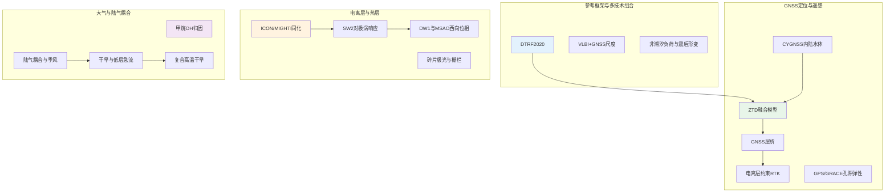
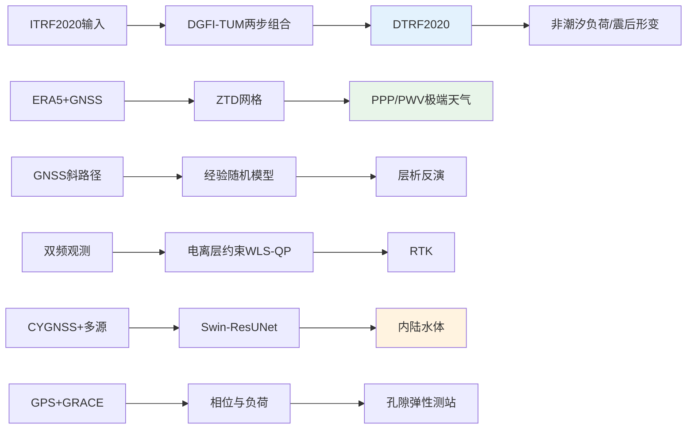
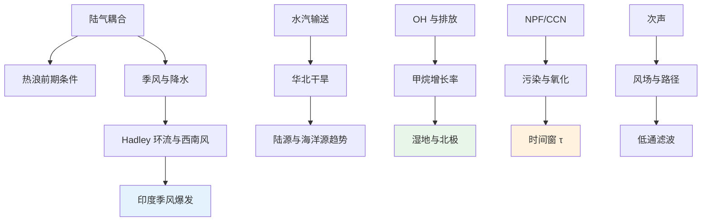
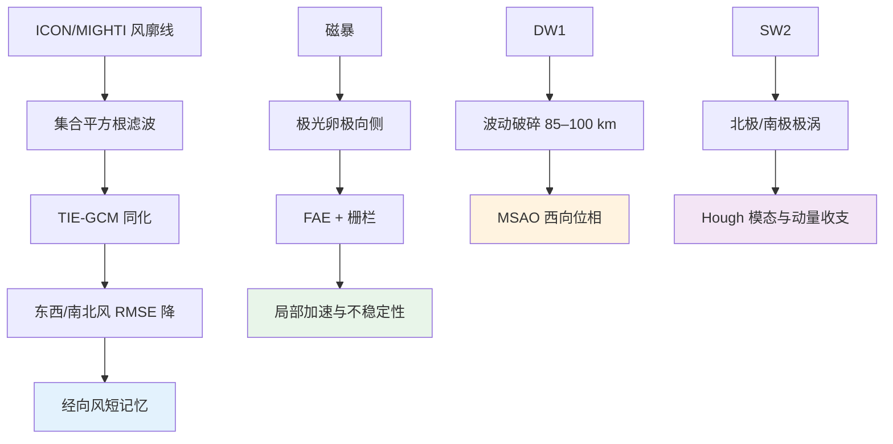
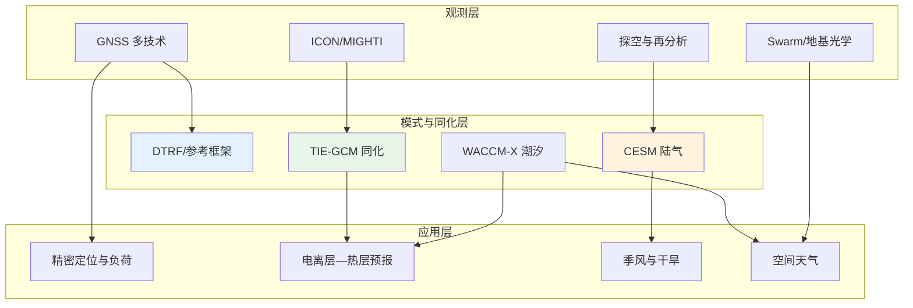

2026年2月1日至8日，*Journal of Geodesy*、*GPS Solutions*、*Remote Sensing*、*Geophysical Research Letters*、*Journal of Geophysical Research: Atmospheres*、*Atmospheric Chemistry and Physics*、*Science* 等期刊发表了多篇与GNSS、大气及电离层相关的研究工作。本期论文在参考框架实现、对流层与电离层约束定位、GNSS-R内陆水体检测、热层风场同化、中高层大气潮汐机制以及陆气耦合与季风干旱等方面形成清晰的技术主线。下文从本期研究印记图入手，分方向归纳技术路线与重要结论，并给出交叉学科网络与近期研究特色变化。

## 一、本期研究印记图

本期收录的论文在时间上集中于2026年2月上旬，空间上覆盖从地基GNSS、星载GNSS-R到热层/电离层卫星探测，主题上可归纳为参考框架与多技术组合、对流层/电离层约束下的定位与遥感、热层-电离层数据同化与动力学、以及陆气耦合与季风干旱机制。参考框架方面，DGFI-TUM的DTRF2020作为ITRS 2020的一种实现，首次在长期框架中由VLBI与GNSS联合确定尺度，并系统引入非潮汐负荷改正与震后形变建模，为高精度大地测量与地球动力学应用提供一致基准。GNSS应用方面，融合ERA5与GNSS原始观测的天顶对流层延迟网格模型服务于极端天气下的PPP与PWV预报优化；GNSS层析的随机模型改进与电离层约束的RTK加权最小二乘二次规划分别从观测权与约束形式两方面提升精度与收敛速度；CYGNSS与多源数据融合的Swin-ResUNet架构将内陆水体检测推进到0.01°空间分辨率与7天时间分辨率；GPS与GRACE(FO)相位信息则用于识别受孔隙弹性形变影响的测站。电离层与热层方面，ICON/MIGHTI热层风廓线通过集合平方根滤波同化进入TIE-GCM，东西向与南北向风场RMSE降低约45%–50%，并揭示经向风预报技巧的快速衰减与高频率同化需求；磁暴期间极光卵极向侧碎片状极光与栅栏结构的联合观测为电离层局部加速与多种等离子体不稳定性提供了新证据；中高层大气中迁移性太阳半日潮对北极与南极平流层极涡强度的响应、以及迁移性日潮在驱动 mesospheric semiannual oscillation（MSAO）西向位相中的作用，则凸显了全大气高分辨率模式在揭示多尺度波动动力学方面的价值。大气科学方面，Science 发表的甲烷增长归因表明2020–2021年OH自由基下降及随后恢复可解释约83%的甲烷增长率年际变化；陆气耦合对降水与季风环流的影响、印度夏季风爆发推迟与区域Hadley环流减弱、阿拉伯海低层急流变干变弱与印度西部季风干旱的放大、华北农牧交错带上游水汽输送减弱与干旱、以及复合高温干旱事件中蒸散对中对流层增暖的贡献等研究，共同勾勒出陆气反馈与大气环流在干旱与季风变异中的核心作用。

下图概括了本期论文在参考框架、GNSS应用、电离层-热层与大气科学四个板块之间的关联与数据流。

上述印记图表明，本期研究在参考框架精细化、对流层/电离层联合约束、热层数据同化与陆气耦合机制四个方向上形成可辨识的技术脉络，为下文分方向专题画像与交叉学科网络提供总览。

## 二、GNSS方向：参考框架、对流层与电离层约束及GNSS-R应用

本期GNSS方向论文围绕国际地球参考系统实现、对流层延迟建模、GNSS层析随机模型、电离层约束RTK、星载GNSS-R内陆水体检测以及GPS/GRACE相位信息在孔隙弹性形变识别中的应用展开。参考框架方面，DTRF2020在保持与ITRF2020相同输入数据的前提下，通过DGFI-TUM两步组合法实现GNSS、SLR、VLBI与DORIS的累积法方程组合，并在尺度确定、非潮汐负荷与震后形变建模上取得明确进展。对流层与定位方面，融合ERA5与GNSS原始观测的ZTD网格模型旨在增强极端天气下的PPP与PWV预报；GNSS层析则通过经验随机模型改进提升反演精度；电离层约束的加权最小二乘二次规划用于实现快速高精度RTK。遥感应用方面，基于CYGNSS与多源数据（SMAP、FABDEM、MODIS、GSWE）的Swin-ResUNet学生-教师框架将内陆水体检测的空间与时间分辨率提升至0.01°与7天，并改善空间连续性与结构完整性。地球动力学应用方面，利用GPS与GRACE(FO)相位信息可识别受孔隙弹性形变影响的测站，为负荷与水文解释提供依据。

**表1：GNSS方向代表性研究的技术路线与特点**

| 研究主题 | 技术路线 | 技术特点 | 重要结论 |
|---------|---------|---------|---------|
| DTRF2020 ITRS实现 | 两步组合、VLBI+GNSS尺度、非潮汐负荷与震后形变 | 首例长期ITRS尺度由VLBI与GNSS联合确定 | 与ITRF2020位置差异可达3.1 mm，速率0.13 mm/yr；非潮汐负荷使绝大多数站高程RMS降低 |
| 融合ZTD网格模型 | ERA5与GNSS原始观测融合 | 面向极端天气PPP与PWV预报 | 增强PPP与PWV预报在极端天气下的表现 |
| GNSS层析精度提升 | 经验随机模型 | 改进观测权与反演稳定性 | 提升层析反演精度 |
| 电离层约束RTK | 加权最小二乘二次规划 | 电离层约束与快速收敛 | 实现快速高精度RTK定位 |
| CYGNSS内陆水体检测 | Swin-ResUNet + 多源融合 | 0.01°、7天分辨率；学生-教师框架 | F1达0.914，mIoU 0.880，改善空间连续性与细节恢复 |
| GPS/GRACE相位与孔隙弹性 | 相位信息与GRACE(FO)联合 | 识别受孔隙弹性形变影响的测站 | 为负荷与水文解释提供测站筛选依据 |

### 2.1 专题画像：DTRF2020——DGFI-TUM的ITRS 2020实现

**（1）技术路线：两步组合与多技术输入**

Manuela Seitz 等（2026）在 *Journal of Geodesy* 上发表了 DGFI-TUM 的国际地球参考系统 2020 实现 DTRF2020。该实现采用与 ITRF2020 相同的输入数据，通过 DGFI-TUM 两步组合方法，将 GNSS、SLR、VLBI 与 DORIS 四种技术的累积法方程进行组合。第一步形成单技术解，第二步在法方程层面进行多技术组合，并引入三项创新：首次在长期 ITRS 实现中由 VLBI 与 GNSS 联合确定尺度；系统应用来自大气、海洋与水文模型的非潮汐负荷改正；采用对数与指数函数对震后形变进行建模。除 SINEX 与 EOP 文件外，DTRF2020 还提供非潮汐负荷约化、震后形变模型、残差与平移时间序列，用于计算瞬时站坐标。

**（2）技术特点：尺度联合确定与负荷与形变建模**

文献指出，非潮汐负荷改正使 99% 的 GNSS 站高程 RMS 降低，并显著减弱平移与尺度中的周年信号。与 ITRF2020 相比，GNSS、VLBI、SLR 的转换差异在位置上可达 3.1 mm、在速率上可达 0.13 mm/yr，DORIS 则分别低于 4.6 mm 与 0.27 mm/yr。高程速率与基于 GIA 与 CMR 的模型一致，区域差异在 ±3 mm/yr 以内。该实现为高精度大地测量与地球动力学应用提供了与 ITRF2020 可比的另一套一致参考框架产品。

**（3）重要结论**

**该研究的重要结论是：** DTRF2020 在保持与 ITRF2020 相同输入数据的前提下，通过 VLBI 与 GNSS 联合尺度、非潮汐负荷改正与震后形变建模，显著改善了站坐标特别是高程的周年信号与长期一致性，与 ITRF2020 的差异在毫米与亚毫米/年量级，可为全球与区域参考框架应用提供可靠选择。

### 2.2 专题画像：融合ERA5与GNSS原始观测的ZTD网格模型及其在PPP与PWV预报中的应用

**（1）技术路线：再分析与GNSS观测融合**

Fangxin Hu 等（2026）在 *GPS Solutions* 上提出一种融合 ZTD 网格模型，该模型利用 ERA5 再分析数据与 GNSS 原始观测，旨在增强极端天气条件下的精密单点定位（PPP）并优化可降水量（PWV）预报。技术路径上，将 ERA5 提供的格网对流层信息与测站 GNSS 观测进行融合，构建空间连续的 ZTD 场，并用于 PPP 的对流层约束或改正，以及 PWV 的预报或同化。

**（2）技术特点：面向极端天气的稳健性**

在强降水、快速水汽变化等极端天气下，仅依赖模型或仅依赖单站 GNSS 的 ZTD 往往存在系统性偏差或空间代表性不足。融合方案通过结合再分析的大气状态与 GNSS 的局地观测，可在一定程度上缓解上述问题，提高 PPP 收敛速度与 PWV 预报的可用性，对灾害天气下的导航与气象应用具有明确价值。

**（3）重要结论**

**该研究的重要结论是：** 基于 ERA5 与 GNSS 原始观测的融合 ZTD 网格模型能够改善极端天气条件下的 PPP 性能与 PWV 预报效果，为高精度定位与气象应用提供了可业务化的对流层约束方案。

### 2.3 专题画像：基于经验随机模型提升GNSS层析精度

**（1）技术路线：随机模型设计与层析反演**

Pedro Mateus 等（2026）在 *GPS Solutions* 中针对 GNSS 层析反演中的观测权与随机模型开展研究，提出一种经验随机模型以提升层析精度。GNSS 层析将斜路径延迟或折射率作为观测值，在离散化网格上反演大气折射率或水汽分布，其解算质量强烈依赖于观测权的设定。研究通过经验方式刻画观测误差的空间或时间相关性及方差，改进权矩阵的构造，从而改善反演稳定性与精度。

**（2）技术特点：观测权与反演稳定性**

层析反演通常面临病态与观测几何不均等问题，合理的随机模型能够抑制噪声放大并更合理地在观测与先验之间分配权重。该工作将经验随机模型引入 GNSS 层析流程，在不改变基本反演算法的前提下，通过改进协方差结构提升解的可靠性，对业务化水汽层析具有参考价值。

**（3）重要结论**

**该研究的重要结论是：** 采用经验随机模型的 GNSS 层析能够提高反演精度与稳定性，为对流层三维水汽场的高分辨率估计提供了方法支撑。

### 2.4 专题画像：电离层约束的加权最小二乘二次规划实现快速高精度GNSS RTK

**（1）技术路线：电离层约束与二次规划**

Xiaolong Mi 等（2026）在 *Journal of Geodesy* 中提出一种基于电离层约束的加权最小二乘二次规划（WLS-QP）方法，用于实现快速且高精度的 GNSS 实时动态定位（RTK）。方法在双频观测的基础上，将电离层延迟或电离层约束以不等式或等式形式纳入估计框架，通过二次规划求解带约束的加权最小二乘问题，在保证整周模糊度与基线解算精度的同时缩短收敛时间。

**（2）技术特点：约束形式与收敛速度**

传统 RTK 依赖双差消除或参数化电离层，在长基线或电离层活跃期往往收敛较慢。引入电离层约束（如来自电离层模型或先验信息的上下界或等式约束）可将解空间限制在物理合理范围内，从而加速模糊度固定与定位收敛。加权最小二乘与二次规划的联合使用，使算法能够同时处理观测权与约束，适合实时或近实时应用。

**（3）重要结论**

**该研究的重要结论是：** 电离层约束的 WLS-QP 方法能够实现快速、高精度的 GNSS RTK 定位，在电离层活动较强或基线较长时仍能保持较好的收敛性与精度，为高精度实时定位提供了新算法选项。

### 2.5 专题画像：基于Swin-ResUNet与CYGNSS的多源内陆水体检测

**（1）技术路线：学生-教师框架与多源数据融合**

Lilong Liu 等（2026）在 *Remote Sensing* 中提出一种基于 Swin-ResUNet 混合架构与 CYGNSS 数据的双分支内陆水体检测模型（STRUE）。模型将 Swin Transformer 与 ResNet 嵌入 U-Net 增强的学生-教师框架，并融合 CYGNSS、SMAP、FABDEM、MODIS 与 GSWE 等多源数据。学生网络在教师网络提供的伪标签与多源输入下进行训练，以兼顾高时空分辨率与较强泛化能力，并缓解短期 CYGNSS 数据空间冗余不足对单独检测精度的限制。

**（2）技术特点：分辨率与性能指标**

研究实现了 0.01° 空间分辨率与 7 天时间分辨率的内陆水体检测，在性能上达到 F1 0.914、mIoU 0.880、MCC 0.873、Recall 0.963。与现有方法与模型相比，在空间连续性、结构完整性与细节恢复方面表现更优，并减轻了云遮挡、空间不连贯与高估等常见问题，拓展了星载 GNSS-R 在内陆水体监测中的应用潜力。

**（3）重要结论**

**该研究的重要结论是：** 基于 Swin-ResUNet 与多源融合的 STRUE 模型显著提升了 CYGNSS 内陆水体检测的时空分辨率与精度，在 F1、mIoU 等指标上优于传统方法，并改善了空间连续性与结构完整性，为星载 GNSS-R 水文应用提供了可行方案。

### 2.6 专题画像：GPS与GRACE(FO)相位信息在孔隙弹性形变影响测站识别中的应用

**（1）技术路线：相位信息与负荷解算联合**

Fei Lin 等（2026）在 *Journal of Geodesy* 中探讨了利用 GPS 与 GRACE(FO) 相位信息识别受孔隙弹性形变影响的 GPS 测站的方法与含义。地下水、地表水与冰雪负荷变化会引发地壳孔隙弹性响应，导致测站位移。研究通过比较 GPS 观测相位与 GRACE(FO) 反演的负荷位移（或负荷模型预测位移）的相位关系，识别哪些测站的时序更符合孔隙弹性主导的负荷响应，从而为剔除或单独解释这类测站、以及改进负荷与水文反演提供依据。

**（2）技术特点：负荷与水文解释**

将相位信息（而不仅是幅度）纳入比较，能够更好地区分孔隙弹性响应与其它形变源（如构造、仪器漂移）。该工作为大规模 GPS 网中筛选受孔隙弹性形变显著影响的测站提供了思路，对陆地水文学、地下水与地表负荷研究具有应用价值。

**（3）重要结论**

**该研究的重要结论是：** 结合 GPS 与 GRACE(FO) 相位信息可以更有效地识别受孔隙弹性形变影响的测站，为负荷解释与水文应用中的测站筛选与质量控制提供方法支撑。

## 三、大气方向：陆气耦合、季风干旱与大气成分

本期大气方向论文涵盖新粒子形成与云凝结核转化、陆气相互作用对热浪与季风的影响、干旱与低层急流动力学、甲烷增长率归因、次声传播的大气滤波、ENSO 与 Hadley 环流、海冰同化、中高层潮汐与对流层极端事件等多类主题。陆气耦合方面，印度—恒河平原的局地陆气相互作用在大尺度下沉背景下为湿润与干燥热浪提供了前期条件；中国高健康风险复合高温干旱事件在暖季早、晚两阶段的驱动机制存在明显差异，分别与西北地区地表加热与水分亏缺、以及长江中下游持续热积累及大尺度环流调整相联系；华北农牧交错带干旱与上游水汽输送减弱及陆气反馈的耦合作用密切相关；GLACE-水文学实验则系统量化了陆气耦合对降水与季风环流的调制。季风与干旱方面，阿拉伯海北部低层大气变干与低层急流减弱在过去 72 年中放大了印度西部季风干旱；区域 Hadley 环流减弱通过阿拉伯海上空西南风水汽输送减弱推迟印度夏季风爆发。大气成分与辐射方面，Science 发表的甲烷增长归因表明 2020–2021 年 OH 自由基下降及随后恢复可解释约 83% 的甲烷增长率年际变化；长三角山顶观测揭示了污染条件下 NPF 向 CCN 转化的氧化驱动加速；气溶胶光学中椭球状尘粒对短波消光的增强效应在气候模型中的量化仍存在不确定性。此外，对流层风对局地次声的低通滤波、ENSO 与跨海盆 Hadley 环流调整、复合高温干旱事件中蒸散对中对流层增暖的贡献、海冰厚度同化对北极海冰预测的技巧、以及中高层大气潮汐与 mesospheric inversion layers（MIL）等研究，共同构成了从边界层到平流层—中间层—低热层的多尺度大气图像。

**表2：大气方向代表性研究的技术路线与特点**

| 研究主题 | 技术路线 | 技术特点 | 重要结论 |
|---------|---------|---------|---------|
| 污染大气下NPF向CCN转化加速 | 山顶观测 + MALTE_BOX 模拟 | 氨参与硫酸团簇稳定、硝酸维持增长 | 污染条件下 CCN 增强因子更高，转化时间窗缩短约 17% |
| 印度—恒河平原湿润/干燥热浪 | 欧拉温度分解 + 前期因子 | 局地 diabatic/adiabatic 主导 | 前期降水、夜间低云与地表湿度区分湿润热浪；反气旋与感热通量主导干燥热浪 |
| 中国高健康风险复合高温干旱 | 健康风险指数 + ERA5 + 滞后非线性模型 | 早/晚暖季驱动路径分离 | 早暖季西北以地表加热与水分亏缺为主；晚暖季长江中下游以热积累与大尺度环流为主 |
| 阿拉伯海低层急流变干与印度季风干旱 | 72 年低层急流统计 + 干湿极端 | 饱和亏缺增 17%、风速降 5% | 急流核心变干变弱，干极端增 50%，湿极端增 40%，持续时间与强度分别增 6% 与 12% |
| 华北农牧交错带干旱与上游水汽 | 水汽追踪模型 + 源区趋势 | 陆源降水占 67.60% | 高纬与高原源增加、海洋源减少；干旱期东亚与南亚—印度洋水汽流入减少触发降水亏缺 |
| 2020 年代初甲烷增长归因 | 多大气反演 + 观测/模型 OH 场 | OH 与湿地/内陆水排放分解 | OH 下降与恢复解释约 83% 增长率年际变化；北热带湿地与北极排放变化为主 |
| 次声局地传播的风驱动低通滤波 | 可控爆炸 + 31 站密集台网 | 上风与下风路径周期分叉 | 对流层风在无显著逆温时可造成方位依赖的低通滤波 |
| GLACE-水文学与陆气耦合 | CESM 耦合/非耦合 + 水汽收支与 MSE | Webster-Yang 季风指数与 MSE 廓线 | 季风区降水与垂直运动增强；中对流层水汽与稳定性变化为关键 |

### 3.1 专题画像：污染大气下氧化驱动的新粒子形成向云凝结核转化加速

**（1）技术路线：山顶观测与 MALTE_BOX 模拟**

Weibin Zhu 等（2026）在 *Atmospheric Chemistry and Physics* 上基于 2024 年春季长三角东南部山顶背景站观测，系统研究了污染与清洁气团下新粒子形成（NPF）的成核与增长动力学，并量化了 NPF 对云凝结核（CCN）的贡献。观测到 8 次 NPF 事件，其中 3 次为污染条件（NPF-P）、5 次为清洁条件（NPF-C）。通过成核率与增长率的统计、硫酸与氨浓度的关联、以及 MALTE_BOX 理论模拟，揭示了氨参与硫酸团簇稳定在污染条件下增强成核的作用；并引入“时间窗（τ）”量化 NPF 到 CCN 的转化时长，比较了污染与清洁条件下的差异。

**（2）技术特点：污染与清洁对比及硝酸在增长中的作用**

NPF-P 事件的平均形成率（J2.5）与增长率（GR）均显著高于 NPF-C，且污染条件下 CCN 增强因子（EFCCN）更高（1.6 vs. 0.7），NPF 到 CCN 的转化时间窗缩短约 17%（τ = 16.4 h vs. 19.8 h）。硝酸在维持较快粒子增长、缩短 τ 与增强 CCN 生产中起重要作用，该过程最终可通过潜在云滴数浓度影响云微物理。结果表明污染气团在边界层顶通过增强大气氧化能力提高了 CCN 生产的效率与速度。

**（3）重要结论**

**该研究的重要结论是：** 污染条件下 NPF 向 CCN 的转化在效率与速度上均高于清洁条件，氧化能力增强与硝酸维持的快速增长共同缩短了转化时间窗，对边界层顶云凝结核与云微物理的评估具有重要含义。

### 3.2 专题画像：印度—恒河平原大尺度下沉下局地陆气相互作用对湿润与干燥热浪的前期调制

**（1）技术路线：欧拉温度分解与前期陆气条件**

Manali Saha 等（2026）在 *Geophysical Research Letters* 中针对印度—恒河平原（IGP）季风前热浪增多，分析了 10 次热浪事件前的大尺度反气旋与局地陆气条件，以判断大尺度下沉是否足以形成湿润与干燥两类热浪。采用欧拉温度分解，将水平热平流（远程）与 diabatic、adiabatic（局地）过程的贡献进行分离，并提取热浪发生前的前期因子（降水、低云、地表湿度、感热通量等）。

**（2）技术特点：湿润与干燥热浪的区分**

结果表明，对大尺度下沉下的两类热浪而言，水平热平流贡献均较小，局地 diabatic 与 adiabatic 过程占主导。湿润热浪的前期条件以季风前降水、夜间低层云与地表湿度为主，形成有利于高湿高温的环境；干燥热浪则与反气旋条件、高感热通量、缺乏水汽平流与无云条件相关。该研究突出了局地陆气相互作用在热浪触发与类型区分中的作用，并指出监测这些前期因子对改进热浪早期预警与响应的重要性。

**（3）重要结论**

**该研究的重要结论是：** 在 IGP 大尺度下沉背景下，湿润与干燥热浪的形成主要由局地陆气过程主导；前期降水、低云与地表湿度有利于湿润热浪，而反气旋、感热与缺水汽平流有利于干燥热浪，可为热浪监测与预警提供物理依据。

### 3.3 专题画像：中国早、晚暖季高健康风险复合高温干旱事件的分歧机制

**（1）技术路线：健康风险指数、急救调度与 ERA5 机制诊断**

Haoxin Yao 等（2026）在 *Journal of Climate* 中整合温度—湿度健康风险指数、急救调度记录与分布滞后非线性模型，得到高健康风险复合高温干旱事件（HHR-CHDEs）的温湿度阈值，并利用 ERA5 再分析分析早、晚暖季中国 HHR-CHDEs 的主导模态与物理机制。高健康风险暴露下，男性、老年及创伤或酒精中毒相关急救需求更高。早暖季与晚暖季的驱动路径存在明显分歧。

**（2）技术特点：早暖季西北与晚暖季长江中下游的环流与贡献**

早暖季 HHR-CHDEs 集中在西北，由增强的地表加热（贡献约 51%）与加剧的水分亏缺（约 37%）共同驱动，背后是东欧上游 Rossby 波源与西北太平洋海温异常的协同，促成准静止高压异常、阻挡天气尺度扰动并强化区域热—干反馈。晚暖季 HHR-CHDEs 集中在长江中下游，以持续热积累（约 65%）为主、干旱贡献次之（约 25%），由北大西洋上游 Rossby 波能量与副热带西北太平洋海温增暖的下游增强所驱动的大尺度环流异常，引起 Walker 与 Hadley 环流调整、下沉与季风水汽输送抑制，维持对健康构成威胁的干热大气。研究揭示了季节与区域差异的远程强迫路径，并指出将大尺度诊断纳入气候—健康早期预警系统的价值。

**（3）重要结论**

**该研究的重要结论是：** 中国高健康风险复合高温干旱事件在早暖季以西北地表加热与水分亏缺为主、晚暖季以长江中下游热积累与大尺度环流为主，季节与区域驱动路径分歧明显，将大尺度环流诊断纳入气候—健康预警可提升应对效果。

### 3.4 专题画像：阿拉伯海北部低层大气变干对印度西部季风干旱的放大

**（1）技术路线：72 年低层急流统计与干湿极端**

Gauranshi Raj Singh 等（2026）在 *Journal of Geophysical Research: Atmospheres* 中基于 1951–2022 年共 72 年数据，分析印度夏季风（ISM）期间阿拉伯海北部低层急流（LLJ）核心的湿度与风速变化，及其与干、湿极端及季风干旱的关系。印度约 60% 作物面积仍依赖降水，弱季风与季风期干旱发生概率密切相关。研究量化了 LLJ 核心饱和亏缺与风速的长期趋势，及其与干、湿极端发生与持续时间和强度的关系。

**（2）技术特点：急流变干变弱与极端事件增强**

过去 72 年中，LLJ 核心变干（饱和亏缺增加约 17%）且变弱（风速减少约 5%）。核心风速（饱和亏缺）与干（湿）极端的发生呈密切依赖（75%–80%），最大相关出现在约 2 天滞后。由 LLJ 核心低层大气动力学驱动的干极端增加约 50%、湿极端增加约 40%，且干（湿）极端的持续时间（强度）分别增强约 6%（12%）。这类条件构成季风干旱的强前兆。

**（3）重要结论**

**该研究的重要结论是：** 阿拉伯海北部 LLJ 核心在过去 72 年中变干变弱，驱动干湿极端增强并延长/加剧持续时间与强度，显著放大印度西部季风干旱风险，对季风与农业水资源管理具有明确指示意义。

### 3.5 专题画像：华北农牧交错带干旱与上游水汽输送减弱

**（1）技术路线：水汽追踪模型与源区趋势**

Xuejin Wang 等（2026）在 *Geophysical Research Letters* 中利用水汽追踪模型量化华北农牧交错带（APENC）降水的 moisture 来源及其趋势，并揭示异常上游水汽输送与干旱的机制联系。APENC 生态恢复与粮食安全在变暖下日益脆弱，水分供应变化如何驱动干旱仍不完全清楚。研究将降水追溯至陆源与海洋源，统计 2000–2023 年源区变化，并在近期干旱事件中分析关键源区水汽流入的减少与局地湿度下降的耦合作用。

**（2）技术特点：陆源主导与干旱期关键源区流入减少**

陆源 moisture 占 APENC 降水的 67.60%。2000–2023 年，来自高纬欧亚与青藏高原的源区贡献增加，而海洋源贡献显著减少。在近期干旱事件中，关键陆源区（尤其是东亚与南亚—印度洋）水汽流入的减少是触发 APENC 降水亏缺的主要原因；水汽流入减弱与局地湿度下降共同放大水分稀缺并维持干旱强度。结果表明远程输送与陆气反馈在 APENC 干旱中的耦合作用，为半干旱水文气候风险理解提供了新证据。

**（3）重要结论**

**该研究的重要结论是：** 华北农牧交错带降水以陆源为主，近年干旱主要由关键陆源区水汽流入减少触发，并与局地湿度下降耦合放大干旱严重程度，远程输送与陆气反馈的耦合作用显著。

### 3.6 专题画像：2020 年代初大气甲烷增长激增的归因

**（1）技术路线：多大气反演与 OH 及排放分解**

P. Ciais 等（2026）在 *Science* 上利用多种大气反演、结合观测与模型给出的羟基自由基（OH）场以及大气甲烷观测，对 2019 年后甲烷增长率激增进行归因。大气甲烷增长率在 2019 年后上升，2020 年达 16.2 ppb/年峰值，2023 年降至 8.6 ppb/年。研究在给定 OH 场（观测与模型两类）与甲烷数据的约束下，将增长率年际变化分解为 OH 变化与排放变化（湿地与内陆水等）的贡献。

**（2）技术特点：OH 主导年际变化与排放空间分布**

2020–2021 年 OH 下降、2022–2023 年恢复，可解释约 83% 的甲烷增长率年际变化；其余由湿地与内陆水排放解释，排放量在 2019 至 2020–2022 年间增加约 +8.6±2.6 Tg CH4/年，2022 至 2023 年间减少约 −9.9±3.3 Tg CH4/年。2019–2023 年排放变化主要发生在北热带非洲与亚洲湿地，南美湿地排放下降、北极排放自 2019 年后增加。该研究为理解 2020 年代初甲烷增长激增的化学与排放驱动提供了定量依据。

**（3）重要结论**

**该研究的重要结论是：** 2020–2021 年 OH 下降及随后恢复可解释约 83% 的甲烷增长率年际变化，湿地与内陆水排放的变化在空间上以北热带与北极为主，为全球甲烷收支与减排政策提供了关键科学依据。

### 3.7 专题画像：对流层风对局地次声的低通滤波观测证据

**（1）技术路线：可控爆炸与密集台网**

Elizabeth A. Silber 等（2026）在 *Geophysical Research Letters* 中报告了 2024 年 5 月与 10 月两次、每次 10 吨 TNT 当量可控地表化学爆炸的次声观测，由 23 km 内 31 个单传感器台站组成的密集台网记录。尽管源相同，两次观测到的波场差异显著：10 月信号呈现近单峰的周期—距离关系，5 月则在周期与波速上表现出明显的方位分叉。下风路径大体保留 10 月观测到的短周期基线，上风路径则因风驱动的低通滤波呈现系统性的更长周期。

**（2）技术特点：方位依赖滤波与无显著逆温**

该研究首次在局地范围内提供对流层风对次声施加方位依赖低通滤波的直接观测证据，且在不依赖观测到的温度逆温的条件下。表明大气结构可在仅数公里距离上即改变低频声波的谱特征，对次声监测与反演中的传播建模具有重要含义。

**（3）重要结论**

**该研究的重要结论是：** 对流层风可在局地范围施加方位依赖的次声低通滤波，且无需显著温度逆温；大气结构对低频声波谱特征的影响在短距离内即可显现，为次声传播与监测建模提供了观测依据。

### 3.8 专题画像：GLACE-水文学实验中陆气耦合对降水与季风环流的影响

**（1）技术路线：CESM 耦合/非耦合与 MSE 廓线**

Chia-Wei Lan 等（2026）在 *Journal of Climate* 中利用社区地球系统模型（CESM）比较耦合与非耦合模拟，研究陆气相互作用对降水与季风环流的影响。通过水汽收支与湿静力能（MSE）廓线分析识别机制，并将 MSE 廓线与 Webster-Yang 季风指数结合，形成评估陆气耦合如何调制季风动力学的新框架。耦合模拟在多数陆地区域产生更高温度与更少降水，而季风区因垂直运动增强与季风环流加强降水增加。

**（2）技术特点：中对流层水汽与稳定性**

结果表明，中对流层水汽增加与大气稳定性变化是增强垂直运动与降水的关键；水平水汽平流加强与印度次大陆上动力分量的增强共同起作用。理解这些反馈对改进对季风变率高度敏感区域的气候模拟至关重要，对水资源与农业生产力具有重要影响。

**（3）重要结论**

**该研究的重要结论是：** 陆气耦合在季风区通过增强垂直运动与季风环流增加降水，中对流层水汽与稳定性变化是关键因子；MSE 廓线与 Webster-Yang 指数结合可为季风动力学调制提供评估框架，对气候模拟与水资源管理具有应用价值。

## 四、电离层方向：热层风场同化、极光卵极向侧现象与MLT潮汐

本期电离层与热层相关论文集中在热层中性风同化、极光卵极向侧碎片状极光与栅栏结构、以及中高层大气迁移性潮汐对平流层极涡与 MSAO 的响应。热层风场同化方面，ICON/MIGHTI 热层风廓线通过集合平方根滤波同化进入 TIE-GCM，东西向与南北向风 RMSE 降低约 45%–50%；经向风分析场在空间结构与跨赤道流上改进显著，但预报技巧衰减较快，凸显热层风的高度动态性与高频率同化需求。电离层—极光方面，2025 年 1 月磁暴期间在极光卵极向侧观测到碎片状极光样辐射（FAEs）与栅栏结构的同时出现，地基光学与 Swarm 原位数据表明 FAEs 可能由电离层局部电子加速而非磁层沉降主导，形态多样性暗示多种等离子体不稳定性参与。中高层潮汐方面，迁移性日潮（DW1）的破碎与非线性在 80–100 km 驱动 MSAO 三月分点附近西向位相；迁移性太阳半日潮（SW2）对北极与南极平流层极涡强度的响应存在半球差异，Hough 模态与动量收支分析表明背景中性风变化较平流层臭氧加热更为关键。GNSS 与电离层交叉方面，电离层约束的 RTK 已在 GNSS 方向专题画像中详述，其约束形式对电离层活跃期的快速固定具有直接应用价值。

**表3：电离层方向代表性研究的技术路线与特点**

| 研究主题 | 技术路线 | 技术特点 | 重要结论 |
|---------|---------|---------|---------|
| ICON/MIGHTI 风廓线同化进 TIE-GCM | 集合平方根滤波 + 动态 QC | 东西/南北风 RMSE 降 45%–50% | 经向风预报技巧快速衰减，需高频率同化 |
| 极光卵极向侧 FAE 与栅栏 | 地基光学 + Swarm 原位 | 磁暴期间同时出现、形态多样 | FAE 可能为电离层局部加速，多种不稳定性参与 |
| DW1 驱动 MSAO 西向位相 | HR WACCM-X、波动破碎与非线性 | 85–100 km 破碎主导；80–85 km 展宽与非线性 | 高分辨率全大气模式揭示多尺度波动动力学 |
| SW2 对北极/南极极涡响应 | SD-WACCM-X、Hough 模态与动量收支 | 北极冬 50%、南极春 34% 变率关联 | HM 变率主要由背景风变化引起，臭氧加热贡献有限 |
| 电离层约束 RTK | 见 GNSS 方向 2.4 | 快速高精度 RTK | 电离层活跃期收敛与固定改善 |

### 4.1 专题画像：ICON/MIGHTI 热层风廓线同化进耦合热层—电离层模式

**（1）技术路线：集合平方根滤波与质量控制**

Meng Zhang 等（2026）在 *Remote Sensing* 中将电离层连接探测器（ICON）上 MIGHTI 仪器获取的热层中性风廓线同化进热层—电离层—电动力学通用环流模型（TIE-GCM），采用基于集合平方根滤波的同化框架。热层中性风的精确刻画对理解电离层—热层系统的动力相互作用至关重要，而数值模式常因外强迫不确定与直接风观测稀少而产生偏差。研究针对真实观测同化的挑战，实施了基于集合离散度的动态阈值背景检验质量控制（QC），并将分析结果与未同化的独立观测及自由运行控制试验进行比较。

**（2）技术特点：东西向与经向风的不同记忆与预报技巧**

同化使热层风场精度显著提高，东西向与南北向分量 RMSE 均降低约 45%–50%。东西向风表现出有效的偏差消除与持续的预报技巧，反映模式对大尺度平均流具有较强的记忆。经向风方面，同化在空间结构与跨赤道流上改进突出，但该分量的预报技巧衰减较快，呈现“短记忆”特征，体现了热层风的高度动态性，并说明需要高频率同化周期。系统约需 8 小时 spin-up 达到统计稳定。结果表明 ICON/MIGHTI 数据同化不仅能减小数值偏差，还能改善瞬时热层风分布的表征，为电离层—热层复杂相互作用的建模与理解提供高保真数据基础。

**（3）重要结论**

**该研究的重要结论是：** 将 ICON/MIGHTI 热层风廓线同化进 TIE-GCM 可显著降低东西向与南北向风 RMSE（约 45%–50%），经向风预报技巧快速衰减凸显高频率同化需求，为热层—电离层系统的高保真建模与预报提供了同化方案与诊断依据。

### 4.2 专题画像：极光卵极向侧碎片状极光样辐射与栅栏结构观测

**（1）技术路线：地基高灵敏度光学与 Swarm 原位**

Sota Nanjo 等（2026）在 *Annales Geophysicae* 中分析了 2025 年 1 月 1 日磁暴期间在斯堪的纳维亚北部观测到的碎片状极光样辐射（FAEs）与栅栏结构。FAE 与栅栏此前分别在极盖与极光下缘亚极区有过报道，本研究首次在极光纬度、极光卵极向侧边缘同时观测到两者。分析基于地基高灵敏度光学观测与 Swarm 卫星原位测量。

**（2）技术特点：形态与磁场对齐及可能机制**

地基相机显示，部分 FAE 的走向与图像平面内模式化的局地磁场方向一致，并在多个经度上同时出现。FAE 似乎跟随红色极光运动，暗示背景电场结构与电子密度空间梯度可能影响其形成。与以往研究一致，FAE 的生成被认为源于电离层内电子的局地加速而非磁层电子沉降。尽管生成机制尚未完全厘清，该事件中观测到的形态多样性表明 FAE 与栅栏结构的形成可能涉及多种等离子体不稳定性。

**（3）重要结论**

**该研究的重要结论是：** 在极光卵极向侧边缘同时观测到 FAE 与栅栏结构，FAE 可能由电离层局部电子加速产生，形态多样性暗示多种等离子体不稳定性参与，为极区电离层—磁层耦合与不规则结构研究提供了新的观测案例。

### 4.3 专题画像：迁移性日潮在驱动 MSAO 三月分点西向位相中的作用

**（1）技术路线：高分辨率全大气模式与波动破碎**

Christopher S. Krier 等（2026）在 *Geophysical Research Letters* 中利用带热层—电离层扩展的高分辨率（HR）全大气社区气候模式（WACCM），研究了热带纬向平均纬向风中的 mesospheric semiannual oscillation（MSAO）在三月分点附近的强西向位相。此前认为迁移性日潮（DW1）参与该位相的启动，因 DW1 在此时段达峰且卫星观测显示其发生波动破碎。HR WACCM 成功模拟出 MSAO 的强西向位相，而较粗分辨率版本则不能。研究表明，约 85–100 km 处 DW1 的波动破碎是西向加速的主导机制；约 80–85 km 处则由日潮展宽与 DW1 非线性贡献西向加速。

**（2）技术特点：多尺度波动与高分辨率显式重力波**

结果展示了 HR 全大气建模在显式解析小尺度重力波、揭示多尺度波动动力学方面的效用，对理解 MSAO 与日潮的耦合及中间层环流变异具有重要价值。

**（3）重要结论**

**该研究的重要结论是：** DW1 在 85–100 km 的波动破碎是 MSAO 三月分点西向位相的主导西向加速机制，80–85 km 则由日潮展宽与 DW1 非线性负责；高分辨率全大气模式可显式解析小尺度重力波并揭示多尺度波动动力学。

### 4.4 专题画像：迁移性太阳半日潮对北极与南极平流层极涡的响应

**（1）技术路线：SD-WACCM-X 与 Hough 模态及动量收支**

Sunil Kumar 等（2026）在 *Journal of Geophysical Research: Atmospheres* 中利用指定动力学全大气社区气候模式热层—电离层扩展（SD-WACCM-X），研究中间层与低热层（MLT）中迁移性太阳半日潮（SW2）对北极与南极平流层极涡（SPV）强度的响应。SW2 对两个极涡均有显著响应，但南极影响较弱。北半球冬季约 50% 的 SW2 变率与北极 SPV 强度相关，南半球春季约 34% 与南极 SPV 相关。经典潮汐理论 Hough 模态（HM）分析表明，SW2 的 HM 与北极 SPV 存在清晰关系，以第一反称 (2,3) HM 变化最著；仅第二对称 (2,4) HM 对南极 SPV 有显著响应。这些 HM 差异源于平流层与 MLT 的动力变化。平流层臭氧在北极 SPV 弱态下对 (2,2) HM 仅贡献约 6%–10%，在南极 SPV 变率下无显著影响；HM 变率主要由北极与南极 SPV 强弱态下背景中性风的变化引起，而非平流层臭氧加热变化。此外，对 SW2 各 HM 的纬向动量收支分析表明，经典项（科氏力 + 气压梯度强迫）随北极与南极 SPV 强度的变化最大，其次为平流项。

**（2）技术特点：半球差异与动力主导**

北极与南极 SPV 对 SW2 的影响强度与涉及的 HM 不同，反映了平流层—MLT 动力耦合的半球不对称性；臭氧加热的贡献有限，动力过程占主导，为理解 MLT 潮汐对平流层变率的响应提供了机制细节。

**（3）重要结论**

**该研究的重要结论是：** SW2 对北极与南极平流层极涡均有显著响应但南极较弱，Hough 模态变率主要由背景中性风变化引起、平流层臭氧加热贡献有限，纬向动量收支中经典项随极涡强度变化最大。

### 4.5 专题画像：电离层约束 RTK（与 GNSS 方向衔接）

电离层约束的加权最小二乘二次规划 RTK 已在第二节 2.4 中完整画像。该方法通过将电离层延迟或约束纳入估计框架，在电离层活跃或长基线场景下实现快速高精度 RTK，与电离层方向在“观测—约束—定位”链上直接衔接，此处不再重复技术路线与结论。

## 五、交叉学科网络与创新链

GNSS、大气与电离层研究在本期论文中呈现出清晰的交叉联系。参考框架（DTRF2020）为 GNSS 与多技术组合提供一致基准，并依赖非潮汐大气、海洋与水文负荷建模，与大气与地表质量迁移相联系。GNSS 对流层延迟（ZTD/PWV）与层析直接服务大气水汽与极端天气应用；电离层约束 RTK 则同时属于 GNSS 定位与电离层建模/约束的应用。星载 GNSS-R（CYGNSS）与多源遥感融合用于内陆水体检测，拓展了 GNSS 在地球系统监测中的角色。热层风场同化（ICON/MIGHTI + TIE-GCM）将卫星遥感与电离层—热层数值模式结合，改善上层大气 specification 与预报；中高层潮汐（DW1/SW2）与 MSAO、极涡的响应则连接平流层动力与 MLT/电离层变率。陆气耦合与季风干旱研究虽以大气与气候为主，但其对降水与水循环的刻画与 GNSS 水汽、水文负荷及地表形变解释形成潜在交叉。下图概括了观测、模式与应用层之间的数据流与依赖关系。

创新链方面，从基础观测与参考框架（DTRF2020、多技术组合）到对流层/电离层建模与约束（ZTD 融合、层析随机模型、电离层约束 RTK），再到星载 GNSS-R 与多源融合应用（内陆水体），构成 GNSS 从基准到应用的链条；热层风同化与 MLT 潮汐机制研究则构成电离层—热层从观测到模式改进再到空间天气理解的链条；陆气耦合与季风干旱研究则形成从陆面—大气过程到气候与水文应用的链条。三条链条通过共享观测（如 GNSS 水汽与负荷）、共享模式成分（如大气负荷对参考框架、潮汐对电离层）以及共同应用场景（如极端天气与空间天气）相互衔接。

## 六、近期研究特色变化

与近期数周相比，本期论文在以下方面呈现可辨识的特色。参考框架方面，DTRF2020 的正式发表标志着 ITRS 2020 多中心实现中的又一重要产品进入业务与科研应用，VLBI 与 GNSS 联合尺度及非潮汐负荷与震后形变的系统处理将成为后续框架比较与地球动力学应用的常规输入。GNSS 应用方面，极端天气下的 ZTD 融合与 PWV 预报、GNSS 层析随机模型与电离层约束 RTK 继续强化“对流层—电离层”联合约束与“观测—先验”平衡的主题；CYGNSS 与多源数据的学生—教师框架将内陆水体检测推向更高时空分辨率与更好泛化，与前期以土壤湿度、海面风等为主的 GNSS-R 应用形成互补。电离层—热层方面，ICON/MIGHTI 同化进入 TIE-GCM 并给出经向风“短记忆”的定量结果，推动了热层数据同化从 OSSE 向真实观测应用的过渡；极光卵极向侧 FAE 与栅栏的同时观测丰富了磁暴期间高纬电离层不规则结构的形态与机制认识；MLT 潮汐对极涡与 MSAO 的响应则延续了“平流层—MLT—电离层”垂直耦合的研究主线。大气科学方面，Science 甲烷归因将 2020 年代初增长率激增主要归因于 OH 年际变化，为全球甲烷收支与减排评估提供了关键约束；陆气耦合与季风干旱的多篇工作（印度—恒河平原热浪、中国复合高温干旱、阿拉伯海 LLJ、华北水汽、印度季风爆发、GLACE）在区域与季节尺度上进一步细化了陆气反馈与环流对干旱与季风的影响，与气候—健康与水资源管理的需求衔接更紧。整体上，本期在参考框架精细化、多源融合与同化、以及陆气耦合与极端事件机制等方向上形成集中产出，与当前国际计划（如 GGOS、COST 等）及气候服务对干旱与季风预测的需求相一致。

## 参考文献

1. Seitz, M., Bloßfeld, M., Glomsda, M., Angermann, D., Rudenko, S., Zeitlhöfler, J., & Seitz, F. (2026). DTRF2020: The ITRS 2020 realization of DGFI-TUM. *Journal of Geodesy*. https://doi.org/10.1007/s00190-026-02032-1  
2. Hu, F., Wei, P., Sha, Z., Ye, S., Xia, P., Zhao, L., & Luo, J. (2026). A fusion ZTD grid model utilizing ERA5 and GNSS raw observations for enhancing PPP and optimizing PWV forecasts under extreme weather conditions. *GPS Solutions*. https://doi.org/10.1007/s10291-026-02028-6  
3. Mateus, P., Zhang, M., Catalão, J., & Miranda, P. M. A. (2026). Enhancing the accuracy of GNSS tomography with an empirical stochastic model. *GPS Solutions*. https://doi.org/10.1007/s10291-026-02031-x  
4. Mi, X., Chen, X., Odolinski, R., Wang, Y., Chen, W., & Yuan, Y. (2026). Fast and precise GNSS RTK positioning with ionosphere-constrained weighted least squares quadratic programming. *Journal of Geodesy*. https://doi.org/10.1007/s00190-025-02026-5  
5. Liu, L., Yuan, T., Chen, F., & Zhang, H. (2026). A Novel Inland Water Body Detection Model Using Swin-ResUNet Hybrid Architecture with CYGNSS. *Remote Sensing*, 18(3), 484. https://doi.org/10.3390/rs18030484  
6. Lin, F., Sun, Y., Tangdamrongsub, N., Zheng, S., & Zhang, B. (2026). Implications of phase information from GPS and GRACE(FO) for identifying GPS stations influenced by poroelastic deformation. *Journal of Geodesy*. https://doi.org/10.1007/s00190-026-02031-2  
7. Zhu, W., Shang, S., Wang, J., Wu, Y., Deng, Z., Ran, L., Kuang, Y., Tang, G., Huang, X., Pan, X., *et al.* (2026). Oxidation-driven acceleration of NPF-to-CCN conversion under polluted atmosphere: evidence from mountain-top observations in Yangtze River Delta. *Atmospheric Chemistry and Physics*, 26, 1947–1966. https://doi.org/10.5194/acp-26-1947-2026  
8. Saha, M., Dixit, V., & Karthikeyan, L. (2026). Local Land‐Atmosphere Interactions Precondition Moist and Dry Heatwaves Under Large‐Scale Subsidence Over the Indo‐Gangetic Plains. *Geophysical Research Letters*. https://doi.org/10.1029/2025gl118998  
9. Yao, H., Zhao, L., Shi, W., Shen, X., Wang, J., Li, Q., Deng, X., & Huang, C. (2026). Divergent mechanisms of high health-risk compound hot and dry events across China's early and late warm seasons. *Journal of Climate*. https://doi.org/10.1175/jcli-d-25-0366.1  
10. Singh, G. R., Dhanya, C. T., & Chakravorty, A. (2026). Drying of Northern Arabian Sea's Lower Atmosphere Amplifies the Monsoon Droughts Over the Western Front of India. *Journal of Geophysical Research: Atmospheres*. https://doi.org/10.1029/2025jd044745  
11. Wang, X., Wu, J., Zhang, B., Zhang, Z., Tian, J., Cheng, Y., & He, C. (2026). Reduced Upwind Moisture Transport Contributes to Drought in the Agro‐Pastoral Ecotone of Northern China. *Geophysical Research Letters*. https://doi.org/10.1029/2025gl119587  
12. Ciais, P., Zhu, Y., Cai, Y., Lan, X., Michel, S. E., Zheng, B., Zhao, Y., Hauglustaine, D. A., Lin, X., Zhang, Y., *et al.* (2026). Why methane surged in the atmosphere during the early 2020s. *Science*. https://doi.org/10.1126/science.adx8262  
13. Silber, E. A., Bowman, D. C., Egan, S., Burkett, L., Fleigle, M., Kim, K., Newton, T., Schaible, L. P., Sonnenfeld, R., Wynn, N., *et al.* (2026). Observational Evidence for Wind‐Driven Low‐Pass Filtering of Infrasound at Short Range. *Geophysical Research Letters*. https://doi.org/10.1029/2025gl120042  
14. Lan, C.-W., Kumar, S., & Lo, M.-H. (2026). The GLACE-Hydrology Experiment: Effects of Land–Atmosphere Coupling on Precipitation Change and Monsoonal Circulations. *Journal of Climate*. https://doi.org/10.1175/jcli-d-25-0275.1  
15. Zhang, M., Hu, X., Zhang, Y., Yan, Z., Liang, H., Yang, J., Xiao, C., & Tu, C. (2026). Assimilation of ICON/MIGHTI Wind Profiles into a Coupled Thermosphere/Ionosphere Model Using Ensemble Square Root Filter. *Remote Sensing*, 18(3), 500. https://doi.org/10.3390/rs18030500  
16. Nanjo, S., Herlingshaw, K., Sergienko, T., Cessateur, G., Partamies, N., Johnsen, M. G., Hosokawa, K., Lamy, H., Ogawa, Y., Kero, A., *et al.* (2026). Observations of fragmented aurora-like emissions and picket fence on the poleward edge of the auroral oval. *Annales Geophysicae*, 44, 63–78. https://doi.org/10.5194/angeo-44-63-2026  
17. Krier, C. S., Liu, H., & Liu, G. (2026). Role of the Diurnal Tide in Driving the Westward Phase of the Mesospheric Semiannual Oscillation Around March Equinox. *Geophysical Research Letters*. https://doi.org/10.1029/2025gl120218  
18. Kumar, S., Oberheide, J., & Lu, X. (2026). Response of the Migrating Solar Semidiurnal Tide to Arctic and Antarctic Stratospheric Polar Vortices: A Comprehensive Study. *Journal of Geophysical Research: Atmospheres*. https://doi.org/10.1029/2025jd045307
