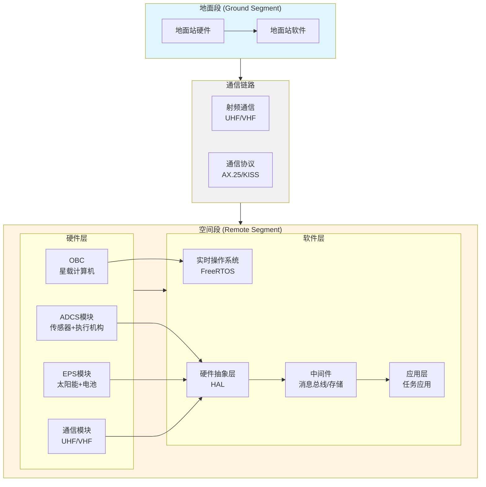
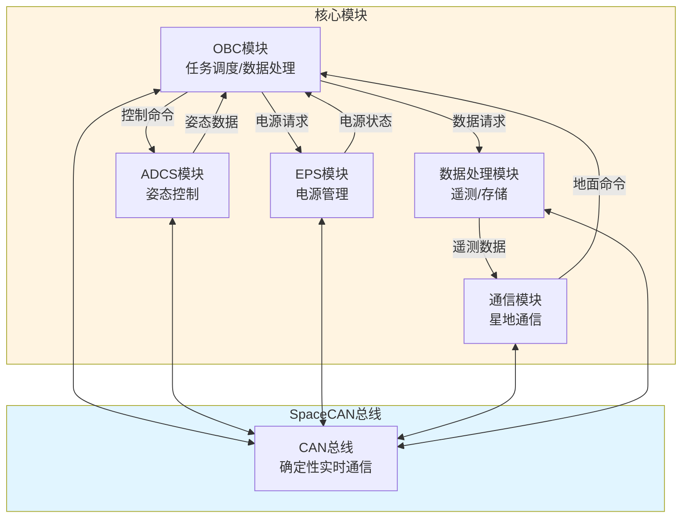
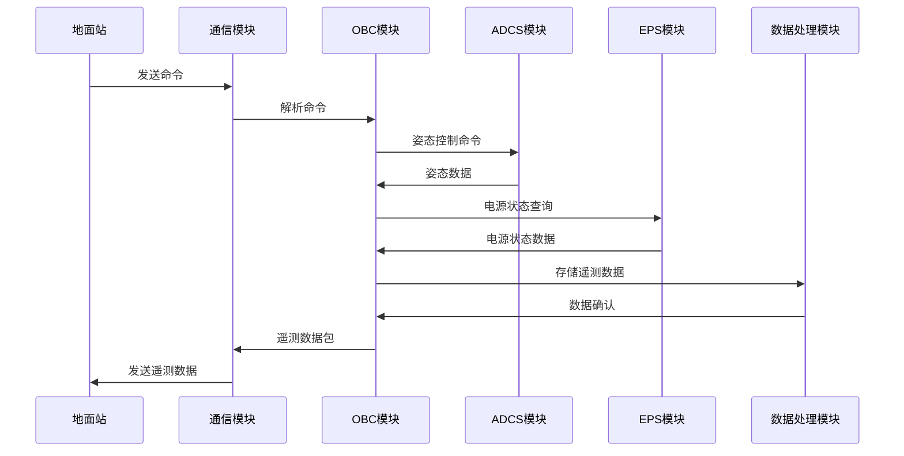

LibreCube是一个面向1U-12U CubeSat（立方星）的开源空间探索生态系统，旨在通过模块化、标准化和完全开源的设计理念，降低卫星系统开发门槛，同时保持专业级的性能和可靠性。本项目构建了完整的端到端开源框架，包括空间段（Remote Segment）的星载硬件与软件模块、地面段（Ground Segment）的地面站与控制系统，以及标准化的通信协议栈。LibreCube的核心技术架构包含五大功能子系统：姿态确定与控制系统（ADCS）、通信管理系统、电源管理系统（EPS）、任务调度系统以及数据处理管道。系统采用SpaceCAN总线协议实现星上节点间的确定性实时通信，遵循Board Specification标准确保模块间的硬件互操作性，并通过模块化的纳米服务架构实现软件组件的灵活配置与扩展。LibreCube严格遵循国际标准，包括ISO 17770（CubeSat标准）、ISO 26869（小型辅助航天器标准）、CubeSat Design Specification（CDS）以及CCSDS（空间数据系统咨询委员会）协议体系，确保了与现有空间系统的兼容性和互操作性。在应用层面，LibreCube适用于教育科研、商业遥感、深空探测以及新技术验证等多种场景，显著降低了CubeSat项目的开发成本（从传统卫星的数百万美元降至5-10万美元）和开发周期（从5-10年缩短至1-2年）。通过开源生态的构建，LibreCube促进了空间技术的民主化，为大学科研团队、商业公司以及国际合作伙伴提供了统一的技术平台，推动了微纳卫星技术的快速发展和创新应用。

### 术语对照表

| 英文术语 | 中文术语 | 说明 |
|---|---|---|
| CubeSat | 立方星 | 标准化的纳米卫星平台 |
| ADCS | 姿态确定与控制系统 | Attitude Determination and Control System |
| EPS | 电源管理系统 | Electrical Power System |
| OBC | 星载计算机 | On-Board Computer |
| SpaceCAN | SpaceCAN总线 | 基于CAN总线的星上通信协议 |
| Board Specification | 板级规范 | 硬件接口标准 |
| HAL | 硬件抽象层 | Hardware Abstraction Layer |
| RTOS | 实时操作系统 | Real-Time Operating System |
| MPPT | 最大功率点跟踪 | Maximum Power Point Tracking |
| HIL | 硬件在环测试 | Hardware-In-the-Loop |
| CCSDS | 空间数据系统咨询委员会 | Consultative Committee for Space Data Systems |
| CDS | CubeSat设计规范 | CubeSat Design Specification |
| Remote Segment | 空间段 | 星载硬件与软件系统 |
| Ground Segment | 地面段 | 地面站与控制系统 |


## 1. 引言

### 1.1 CubeSat标准演进与国际规范体系

CubeSat（立方星）标准起源于1999年，由美国加州州立理工大学（Cal Poly）和斯坦福大学联合提出，旨在为大学和研究机构提供一种低成本、标准化的卫星平台。CubeSat的基本单位定义为1U，即一个10 cm × 10 cm × 11.35 cm的立方体，质量不超过1.33 kg。通过组合多个1U单元，可以构建2U、3U、6U、12U等不同规格的卫星平台，以满足不同任务需求。

自CubeSat标准提出以来，该技术在全球范围内得到了快速发展。根据统计数据，截至2021年5月，全球已成功发射超过3000枚CubeSat，其中2900多颗成功部署在轨。2017年，全球共发射500 kg以下小卫星310颗，占当年入轨航天器总数的70.5%，其中0-10 kg的微纳卫星达到276颗，成为增长最快的细分市场。这一发展趋势表明，CubeSat已成为现代空间探索和商业航天领域的重要组成部分。

为了规范CubeSat的设计、制造、测试和运行，国际标准化组织（ISO）制定了一系列相关标准：

- **ISO 17770** 定义了CubeSat的基本规格、接口标准和设计规范，确保不同制造商生产的CubeSat模块具有良好的互操作性。

- **ISO 26869** 针对小型辅助航天器（Small Auxiliary Spacecraft）的标准，涵盖了设计、发射、验证和运行四个方面的技术要求。

- **CubeSat Design Specification (CDS)** 由Cal Poly维护的官方设计规范，详细规定了CubeSat的机械接口、电气接口、通信协议等技术细节，目前最新版本为CDS v13.0。

- **CCSDS（Consultative Committee for Space Data Systems）协议体系** 国际空间数据系统咨询委员会制定的空间通信和数据传输标准，LibreCube遵循CCSDS协议以确保与现有空间系统的兼容性。

这些国际标准的建立，为CubeSat技术的标准化和产业化发展奠定了坚实基础，也为开源空间硬件项目如LibreCube提供了技术规范依据。

### 1.2 开源空间硬件的工程意义

传统卫星系统的开发具有成本高、周期长、技术门槛高等特点。一颗传统卫星的研制成本通常在数千万至数亿美元，开发周期长达5-10年，且需要大型专业团队和丰富的航天工程经验。这种高门槛限制了空间技术的创新和普及，使得空间探索成为少数大型机构和国家才能参与的领域。

开源空间硬件（Open Source Space Hardware）的出现，为改变这一现状提供了新的路径。通过开源硬件和软件的设计理念，开源空间项目具有以下显著优势：

**成本优势**：CubeSat项目的开发成本通常在5-10万美元量级，相比传统卫星降低了2-3个数量级。这一成本优势主要来源于：使用商业现货（COTS）器件替代昂贵的宇航级器件；采用标准化模块减少定制开发成本；开源软件和硬件设计降低授权费用。

**开发周期缩短**：CubeSat项目从设计到发射的周期通常为1-2年，相比传统卫星的5-10年大幅缩短。快速开发周期使得新技术能够更快地在轨验证，加速了空间技术的迭代和创新。

**技术民主化**：开源空间硬件降低了空间技术的进入门槛，使得大学科研团队、初创公司甚至个人爱好者都能够参与空间探索活动。这种技术民主化促进了空间知识的传播和人才培养，为航天事业的可持续发展提供了重要支撑。

**教育价值**：开源空间硬件为航天工程教育提供了理想的实践平台。学生可以通过参与CubeSat项目，获得从设计、制造、测试到在轨运行的完整工程经验，这对于培养新一代航天工程师具有重要意义。

**国际合作**：开源标准促进了国际间的技术合作和知识共享。不同国家和机构可以基于统一的开源平台开展合作项目，共同推动空间技术的发展。

### 1.3 LibreCube的战略定位

LibreCube项目正是在上述背景下应运而生的。作为一个完全开源的空间探索生态系统，LibreCube致力于构建一个模块化、标准化、可扩展的CubeSat开发平台，连接学术研究与商业应用，推动微纳卫星技术的普及和创新。

LibreCube的战略定位体现在以下几个方面：

**技术桥梁作用**：LibreCube通过提供完整的端到端开源框架，连接了学术研究中的创新想法与商业应用中的实际需求。研究人员可以基于LibreCube平台快速验证新技术，而商业公司则可以在此基础上开发面向市场的产品和服务。

**模块化生态系统构建**：LibreCube不仅仅是一个软件平台或硬件套件，而是一个完整的生态系统。通过定义标准化的接口和协议，LibreCube使得不同开发者可以独立开发兼容的模块，这些模块可以灵活组合，形成满足不同任务需求的卫星系统。

**标准推动者**：LibreCube严格遵循国际标准，同时也在推动新标准的建立。通过开源社区的协作，LibreCube项目为CubeSat领域的标准化进程做出了贡献，促进了行业内的技术统一和互操作性。

**创新加速器**：通过降低开发门槛和缩短开发周期，LibreCube加速了空间技术的创新。新的控制算法、传感器技术、通信协议等可以更快地在LibreCube平台上验证，从而推动整个行业的技术进步。

**国际合作平台**：LibreCube的开源特性使其成为国际合作的理想平台。不同国家的团队可以基于统一的LibreCube标准开展合作项目，共享技术成果，共同解决空间探索中的挑战。

本报告旨在系统介绍LibreCube项目的技术架构、核心功能、关键技术、应用场景以及开发实践，为航空航天领域的专业技术人员、系统工程师和科研人员提供全面的技术参考。报告结构如下：第二章介绍LibreCube项目的概述和核心原则；第三章详细阐述五大核心功能模块的技术特点；第四章深入解析关键技术，包括SpaceCAN协议、Board Specification标准、软件基线架构等；第五章分析LibreCube的应用场景；第六章介绍开发实践指南；第七章总结技术优势与创新点；第八章阐述标准符合性与工程化要求；第九章展望发展前景；第十章总结主要结论。


## 2. 项目概述

### 2.1 三大核心原则

LibreCube项目的设计和发展遵循三大核心原则，这些原则不仅体现了项目的技术理念，也反映了开源空间硬件的核心价值观。

#### 2.1.1 开源（Open Source）

LibreCube采用完全开源的设计理念，所有硬件设计文件、软件源代码、技术文档和测试数据均以开源许可证发布。开源原则的具体体现包括：

**硬件开源**：所有电路板设计文件（如KiCad格式的原理图和PCB布局）均公开可用，开发者可以自由查看、修改和重新分发。这确保了硬件设计的透明性和可审计性，使得任何人都可以验证设计的正确性和安全性。

**软件开源**：所有软件代码（包括固件、驱动、应用层代码）均以开源许可证发布，支持开发者自由使用、修改和分发。开源软件使得开发者可以深入理解系统工作原理，根据需求进行定制和优化。

**文档开源**：技术文档、用户手册、API参考等均以开放格式发布，支持社区贡献和改进。完整的文档体系降低了学习门槛，使得新开发者能够快速上手。

**知识共享**：通过开源社区，LibreCube促进了空间技术知识的共享和传播。开发者可以学习他人的设计思路，借鉴最佳实践，避免重复造轮子。

开源原则不仅降低了使用成本（无需支付授权费用），更重要的是促进了技术创新和知识积累，为整个行业的发展做出了贡献。

#### 2.1.2 标准（Standards）

LibreCube严格遵循国际标准和行业规范，确保与现有空间系统的兼容性和互操作性。标准遵循的具体体现包括：

**国际标准遵循**：
- **ISO 17770** CubeSat基本规格和接口标准
- **ISO 26869** 小型辅助航天器设计、发射、验证和运行标准
- **CCSDS协议** 空间数据系统咨询委员会制定的通信和数据传输标准
- **CubeSat Design Specification (CDS)** 官方CubeSat设计规范

**行业标准遵循**：
- **SpaceCAN协议** LibreCube定义的星上总线通信标准，基于CAN总线协议，针对空间应用进行了优化
- **Board Specification** LibreCube定义的板级硬件接口标准，确保不同模块间的机械和电气兼容性

**接口标准化** LibreCube定义了标准化的硬件接口（连接器、引脚定义、电气特性）和软件接口（API、消息格式、协议栈），使得不同开发者开发的模块可以无缝集成。

标准遵循确保了LibreCube系统的可靠性、可维护性和可扩展性，也为国际合作和知识共享提供了技术基础。

#### 2.1.3 模块化（Modularity）

LibreCube采用模块化设计理念，将复杂的卫星系统分解为多个功能独立、接口标准的模块。模块化设计的优势包括：

**功能解耦**：每个模块负责特定的功能（如姿态控制、电源管理、通信等），模块间通过标准接口通信，降低了系统复杂度。

**灵活配置**：开发者可以根据任务需求选择所需的模块，灵活组合形成满足特定需求的卫星系统。例如，对于简单的教育任务，可能只需要基本的OBC（星载计算机）和通信模块；而对于复杂的科学任务，可能需要完整的ADCS、EPS、数据处理等所有模块。

**独立开发**：不同模块可以由不同团队独立开发和维护，提高了开发效率和代码质量。模块的独立性也使得故障隔离和系统调试更加容易。

**易于扩展**：新功能可以通过添加新模块实现，而不需要修改现有模块。这种扩展性使得LibreCube能够适应不断变化的任务需求和技术发展。

**代码复用**：标准化的模块接口使得模块可以在不同项目间复用，提高了开发效率和代码质量。

模块化设计是LibreCube实现"即插即用"理念的技术基础，也是降低开发门槛、加速创新的关键因素。

### 2.2 生态系统架构

LibreCube生态系统采用分层架构设计，从下至上包括硬件层、驱动层、中间件层和应用层。整个生态系统可以分为三个主要部分：空间段（Remote Segment）、地面段（Ground Segment）和通信协议栈。

#### 2.2.1 Remote Segment（空间段）

空间段是运行在卫星上的硬件和软件系统，包括：

**硬件模块**：
- **OBC（On-Board Computer，星载计算机）** 系统的核心处理单元，负责任务调度、数据处理和系统管理
- **ADCS模块** 姿态确定与控制模块，包括传感器（星敏感器、陀螺仪、磁强计）和执行机构（磁力矩器、反作用飞轮）
- **EPS模块** 电源管理模块，包括太阳能板管理、电池管理和负载分配
- **通信模块** 星地通信模块，支持UHF/VHF频段的无线电通信
- **传感器模块** 各种科学载荷和传感器接口模块

**软件系统**：
- **实时操作系统** 提供任务调度、内存管理、中断处理等基础服务
- **设备驱动** 硬件抽象层（HAL），提供统一的硬件访问接口
- **中间件** 消息总线、数据存储、任务管理等系统服务
- **应用层** 任务特定的应用软件，如姿态控制算法、数据处理程序等

空间段的设计充分考虑了空间环境的特殊要求，包括抗辐射设计、温度适应性、功耗优化等。

#### 2.2.2 Ground Segment（地面段）

地面段是运行在地面的控制系统，包括：

**地面站硬件**：
- **天线系统** 用于接收和发送无线电信号
- **射频前端** 信号放大、滤波、频率转换等
- **数据采集设备** 接收和处理卫星遥测数据

**地面站软件**：
- **通信协议栈** 实现与卫星的通信协议（如AX.25、KISS协议）
- **数据处理系统** 遥测数据解析、存储、分析和可视化
- **任务规划系统** 制定和上传任务计划
- **监控系统** 实时监控卫星状态，异常检测和报警

地面段的设计支持多星管理，可以同时监控和管理多颗卫星，支持星座任务。

#### 2.2.3 Communication Protocols（通信协议）

LibreCube定义了完整的通信协议栈，包括：

**星上通信**：
- **SpaceCAN协议** 基于CAN总线的星上节点间通信协议，提供确定性实时通信能力
- **消息格式** 标准化的消息格式，支持命令、遥测、事件等多种消息类型

**星地通信**：
- **AX.25协议** 业余无线电通信协议，广泛用于CubeSat的星地通信
- **KISS协议** 用于串口通信的简单协议，连接地面站软件和硬件
- **数据分包** 支持大数据的分包传输和重组

**安全机制**：
- **数据加密** 可选的AES-256加密，保护敏感数据
- **错误检测** CRC校验确保数据完整性
- **认证机制** 防止未授权访问

### 2.3 技术栈概览

LibreCube的技术栈涵盖了从硬件到软件的完整技术链条：

#### 2.3.1 硬件支持

**处理器架构**：
- **ARM Cortex-M系列** 如STM32F4系列，广泛应用于CubeSat的OBC和各类功能模块
- **RISC-V架构** 新兴的开源指令集架构，提供更好的可定制性和成本优势

**外设接口**：
- **I2C总线** 用于连接传感器和执行机构
- **SPI总线** 用于高速数据传输
- **UART** 用于调试和通信
- **CAN总线** 用于SpaceCAN协议实现

**存储系统**：
- **Flash存储器** 程序存储和数据存储
- **EEPROM** 配置参数存储
- **SD卡接口** 大容量数据存储

#### 2.3.2 软件框架

**实时操作系统**：
- 基于FreeRTOS或类似RTOS，提供实时任务调度能力
- 支持优先级抢占式调度，确保关键任务的实时性

**模块化架构**：
- **纳米服务（Nano-services）架构** 每个功能模块作为独立的服务运行
- **消息驱动** 模块间通过消息总线进行通信，实现松耦合设计
- **硬件抽象层（HAL）** 统一的硬件访问接口，便于移植和测试

**开发框架**：
- **CMake构建系统** 跨平台的构建系统，支持多目标平台
- **单元测试框架** 支持自动化测试
- **调试工具** 集成GDB调试器，支持远程调试

#### 2.3.3 开发工具

**编译工具链**：
- **GCC ARM交叉编译器** 用于ARM架构的代码编译
- **RISC-V工具链** 用于RISC-V架构的代码编译

**调试工具**：
- **OpenOCD** 开源的片上调试器，支持多种调试接口
- **J-Link/ST-Link** 商业调试器，提供高性能调试能力
- **GDB** GNU调试器，支持源码级调试

**仿真工具**：
- **42 Simulator** CubeSat仿真器，支持硬件在环测试
- **COSMOS** NASA开发的地面站软件，支持端到端测试

**版本控制**：
- **Git** 分布式版本控制系统
- **GitLab** 代码托管和协作平台

LibreCube的技术栈设计充分考虑了CubeSat的资源约束（有限的计算能力、存储空间和功耗），在保证功能完整性的同时，优化了资源使用效率。

#### 2.3.4 系统架构图

LibreCube生态系统采用分层架构设计，下图展示了系统的整体架构：




## 3. 核心功能模块详解

LibreCube的核心功能通过五大子系统实现，每个子系统都是独立的功能模块，通过标准接口与其他模块通信。这种模块化设计使得系统具有良好的可扩展性和可维护性。

### 3.1 姿态确定与控制系统（ADCS）

姿态确定与控制系统（Attitude Determination and Control System, ADCS）是CubeSat实现姿态稳定和指向控制的关键子系统。LibreCube的ADCS模块提供了完整的姿态确定和控制功能。

#### 3.1.1 传感器融合

ADCS系统通过融合多种传感器的数据来确定卫星的姿态。LibreCube支持以下传感器：

**星敏感器（Star Tracker）**：通过识别恒星位置来确定卫星的三轴姿态，具有最高的精度（通常可达角秒级）。星敏感器适用于需要高精度指向的任务，如对地观测、天文观测等。

**陀螺仪（Gyroscope）**：测量卫星的角速度，提供高频率的姿态变化信息。陀螺仪数据通过积分可以得到姿态变化，但存在漂移误差，需要定期校正。

**磁强计（Magnetometer）**：测量地球磁场方向，可以确定卫星相对于地磁场的姿态。磁强计成本低、功耗小，但精度相对较低，且在高纬度地区精度会下降。

**太阳敏感器（Sun Sensor）**：检测太阳方向，提供姿态参考。太阳敏感器简单可靠，但只能提供二维姿态信息。

LibreCube的ADCS模块采用扩展卡尔曼滤波（Extended Kalman Filter, EKF）或多传感器融合算法，将不同传感器的数据融合，得到最优的姿态估计。融合算法考虑了各传感器的精度特性、更新频率和可靠性，动态调整各传感器数据的权重。

#### 3.1.2 控制算法

LibreCube的ADCS模块实现了多种控制算法，适用于不同的任务需求：

**B-dot控制算法**：基于磁场的控制算法，通过测量磁场变化率（B-dot）来控制磁力矩器，实现姿态稳定。B-dot算法简单可靠，适用于不需要精确指向的任务，如技术验证任务。控制律可表示为：

$$\boldsymbol{\mu} = -\gamma \dot{\boldsymbol{\beta}}$$

其中，μ（mu）为磁力矩器产生的磁矩矢量，γ（gamma）为控制增益系数，β点（beta dot）为地磁场变化率矢量。

**PID控制算法**：经典的比例-积分-微分控制算法，适用于需要精确指向的任务。PID控制器根据姿态误差计算控制输出：

$$u(t) = K_p e(t) + K_i \int_0^t e(\tau) d\tau + K_d \frac{de(t)}{dt}$$

其中，e(t)为姿态误差，Kp、Ki、Kd分别为比例、积分、微分增益。

**滑模控制（Sliding Mode Control）**：鲁棒控制算法，对系统参数变化和外部扰动具有较强的鲁棒性。滑模控制通过设计滑模面，使系统状态在有限时间内到达滑模面，并在滑模面上滑动到平衡点。

**自适应控制**：能够根据系统特性自动调整控制参数，适应不同的工作条件和任务需求。

#### 3.1.3 执行机构

ADCS系统通过执行机构产生控制力矩，实现姿态调整：

**磁力矩器（Magnetorquer）**：通过电流产生磁场，与地磁场相互作用产生控制力矩。磁力矩器功耗低、可靠性高，但控制能力有限，且只能产生垂直于地磁场方向的力矩。磁力矩器通常由三个正交的线圈组成，可以产生任意方向的磁矩。

**反作用飞轮（Reaction Wheel）**：通过改变飞轮转速产生控制力矩，具有较高的控制精度和响应速度。反作用飞轮需要定期卸载（通过磁力矩器），以防止飞轮饱和。

**动量轮（Momentum Wheel）**：与反作用飞轮类似，但通常以恒定速度旋转，通过改变转速产生控制力矩。

LibreCube的ADCS模块支持多种执行机构的组合使用，例如磁力矩器与反作用飞轮的组合，可以在保证控制精度的同时降低功耗。

#### 3.1.4 实时性能

ADCS系统对实时性要求较高，LibreCube的ADCS模块设计满足以下性能指标：

- **控制周期** 20 ms（50 Hz），确保姿态控制的及时响应
- **截止时间** 5 ms，保证控制命令在规定时间内完成
- **任务优先级** 最高优先级（优先级10），确保姿态控制任务不被其他任务抢占
- **确定性** 控制算法具有确定性执行时间，满足实时系统要求

### 3.2 通信管理系统

通信管理系统负责卫星与地面站之间的数据交换，是卫星任务执行的关键环节。LibreCube的通信管理系统提供了完整的通信协议栈和链路管理功能。

#### 3.2.1 协议栈

LibreCube的通信协议栈采用分层设计，包括：

**物理层**：
- **UHF/VHF频段** 通常使用430-440 MHz（UHF）或144-146 MHz（VHF）频段，这些频段是业余无线电和CubeSat常用的频段
- **调制方式** 支持AFSK（音频频移键控）、FSK（频移键控）等调制方式
- **数据速率** 通常为1200 bps或9600 bps，可根据链路质量自适应调整

**数据链路层**：
- **AX.25协议** 业余无线电分组交换协议，广泛用于CubeSat通信。AX.25提供帧同步、错误检测、流量控制等功能
- **KISS协议** Keep It Simple, Stupid协议，用于串口通信，连接地面站软件和硬件

**网络层**：
- **数据分包** 支持大数据的分包传输，每个数据包包含序号、校验和等信息
- **自动重传** 检测到错误时自动请求重传，确保数据完整性

**应用层**：
- **命令解析** 解析地面站发送的命令，执行相应操作
- **遥测打包** 将传感器数据打包成遥测帧，发送到地面站
- **文件传输** 支持大文件的传输，如科学数据、图像等

#### 3.2.2 SpaceCAN总线

SpaceCAN是LibreCube定义的星上总线通信协议，基于CAN（Controller Area Network）总线，针对空间应用进行了优化。SpaceCAN提供以下特性：

**确定性实时通信**：CAN总线采用优先级仲裁机制，高优先级消息可以优先传输，确保关键数据的实时性。

**可靠性保证**：CAN总线具有内置的错误检测和错误恢复机制，包括CRC校验、错误帧检测等，确保数据传输的可靠性。

**多主架构**：支持多个节点同时发送消息，通过优先级仲裁避免冲突。

**低开销**：CAN总线协议开销小，适合资源受限的CubeSat系统。

SpaceCAN协议定义了标准化的消息格式，包括消息ID、数据长度、数据内容等字段。消息ID用于标识消息类型和优先级，高优先级消息具有较小的ID值。

#### 3.2.3 安全机制

LibreCube的通信系统提供了多层次的安全机制：

**数据加密**：可选的AES-256加密，保护敏感数据（如控制命令、科学数据）不被未授权访问。加密密钥通过安全通道传输和更新。

**认证机制**：地面站发送的命令需要经过认证，防止未授权控制。认证机制可以采用数字签名或共享密钥等方式。

**错误检测**：CRC（循环冗余校验）确保数据完整性，检测传输错误。

**访问控制**：可以设置不同的访问权限，限制某些命令的执行，防止误操作。

#### 3.2.4 链路管理

通信系统需要管理通信链路，确保通信的可靠性：

**频率补偿**：由于多普勒效应，卫星与地面站之间的通信频率会发生变化。通信系统需要根据卫星轨道和位置计算频率偏移，进行频率补偿。

**链路质量监测**：监测信号强度、误码率等链路质量指标，评估通信质量。

**自适应速率**：根据链路质量自动调整数据速率，在链路质量好时使用高速率，链路质量差时降低速率以保证可靠性。

**通信窗口规划**：根据卫星轨道和地面站位置，规划通信窗口，确保在可见时间内完成数据传输。

### 3.3 电源管理系统（EPS）

电源管理系统（Electrical Power System, EPS）负责管理卫星的能源，包括太阳能板发电、电池储能和负载供电。EPS是卫星系统的基础，其可靠性直接影响整个系统的运行。

#### 3.3.1 太阳能板管理

CubeSat通常采用太阳能板作为主要能源来源。LibreCube的EPS模块提供以下功能：

**MPPT（Maximum Power Point Tracking，最大功率点跟踪）**：太阳能板的输出功率随负载阻抗变化，MPPT算法通过动态调整负载阻抗，使太阳能板始终工作在最大功率点，最大化能量收集效率。

MPPT算法可以采用扰动观察法（Perturb and Observe, P&O）或增量电导法（Incremental Conductance）。扰动观察法通过周期性改变工作点，观察功率变化方向，逐步逼近最大功率点。增量电导法通过比较电导的变化率，直接计算最大功率点。

**太阳能板监控**：监测太阳能板的电压、电流、功率等参数，评估发电状态。当太阳能板出现故障（如遮挡、损坏）时，及时报警。

**多板管理**：对于多块太阳能板的系统，EPS模块可以独立管理每块太阳能板，实现最优的能量收集。

#### 3.3.2 电池管理

电池是卫星的能量存储设备，EPS模块需要确保电池的安全和高效使用：

**充放电控制**：根据电池状态和负载需求，控制电池的充放电。充电时采用恒流-恒压（CC-CV）充电策略，先以恒定电流充电，达到设定电压后转为恒压充电。

**电池健康监测**：监测电池的电压、电流、温度、容量等参数，评估电池健康状态。当电池出现异常（如过压、欠压、过温）时，采取保护措施。

**充放电平衡**：对于多节电池串联的系统，需要实现充放电平衡，确保各节电池电压一致，防止电池损坏。

**深度放电保护**：防止电池过度放电，当电池电压低于阈值时，切断负载，保护电池。

#### 3.3.3 负载管理

EPS模块需要为各个负载模块提供稳定的电源：

**多路输出**：提供多路独立的电源输出，每路输出可以独立开关和控制。

**电压调节**：通过DC-DC转换器，将电池电压转换为各负载所需的电压（如3.3V、5V等）。

**过流保护**：监测各路的电流，当电流超过阈值时，切断该路输出，防止损坏。

**功耗管理**：根据任务需求和能源状态，动态调整各负载的功耗，优化能源使用。例如，在能源充足时，可以增加通信功率，提高数据传输速率；在能源不足时，可以降低非关键负载的功耗，优先保证关键系统运行。

**负载优先级**：定义负载优先级，在能源不足时，优先保证高优先级负载（如OBC、通信系统）的供电，可以关闭低优先级负载（如非关键传感器）。

### 3.4 任务调度系统

任务调度系统是卫星软件的核心，负责管理各个任务的执行，确保系统按时完成各项功能。LibreCube的任务调度系统采用实时操作系统（RTOS），提供确定性的任务调度能力。

#### 3.4.1 时间触发调度

时间触发调度（Time-Triggered Scheduling）按照预定的时间表执行任务，具有确定性和可预测性：

**周期性任务**：定义周期性执行的任务，如ADCS控制任务（20ms周期）、遥测采集任务（1000ms周期）等。调度器按照设定的周期，准时启动任务执行。

**时间表管理**：维护全局时间表，记录所有任务的执行时间。时间表可以静态配置，也可以根据任务需求动态调整。

**时间同步**：确保系统时间准确，可以通过GPS或其他时间源进行时间同步。

时间触发调度适用于对实时性要求高的任务，如姿态控制、数据采集等。

#### 3.4.2 事件驱动机制

事件驱动机制（Event-Driven Mechanism）响应外部事件或内部事件，执行相应的处理：

**中断处理**：响应硬件中断（如传感器数据就绪、通信数据到达等），执行中断服务程序。

**消息队列**：任务间通过消息队列通信，当消息到达时，唤醒等待的任务进行处理。

**条件变量**：任务可以等待特定条件满足，条件满足时自动唤醒。

事件驱动机制适用于响应不确定事件的任务，如命令处理、异常处理等。

#### 3.4.3 容错设计

任务调度系统需要具备容错能力，确保系统在异常情况下仍能正常运行：

**看门狗监测（Watchdog）**：监测系统运行状态，当系统出现死锁或异常时，自动重启系统。看门狗定时器需要定期喂狗，如果超时未喂狗，说明系统异常，触发重启。

**心跳机制**：各个任务定期发送心跳信号，表明任务正常运行。如果某个任务长时间未发送心跳，调度器可以判定任务异常，采取恢复措施。

**任务监控**：监控任务的执行时间、资源使用等，当任务异常（如执行时间过长、内存泄漏）时，采取相应措施。

**故障恢复**：当检测到故障时，自动执行恢复流程，如重启任务、切换到备份系统等。

**优先级继承**：防止优先级反转问题，当高优先级任务等待低优先级任务持有的资源时，临时提升低优先级任务的优先级。

### 3.5 数据处理管道

数据处理管道负责采集、存储、处理和传输卫星的各种数据，包括遥测数据、科学数据、图像数据等。

#### 3.5.1 遥测采集

遥测数据是反映卫星状态的重要信息，包括：

**传感器数据**：温度、电压、电流、姿态角、位置等传感器数据

**系统状态**：任务执行状态、错误日志、资源使用情况等

**载荷数据**：科学载荷产生的数据，如相机图像、光谱数据等

数据处理管道定期采集这些数据，进行预处理（如单位转换、数据校验），然后存储或传输。

#### 3.5.2 存储管理

卫星的存储系统需要高效管理有限存储空间：

**循环缓冲**：采用循环缓冲区存储数据，当缓冲区满时，覆盖最旧的数据。循环缓冲适用于存储最新的遥测数据，确保始终保存最新的状态信息。

**文件系统**：对于需要长期保存的数据（如科学数据、图像），采用文件系统管理。文件系统支持文件的创建、删除、读写等操作。

**坏块处理**：Flash存储器可能出现坏块，存储管理系统需要检测坏块，避免使用坏块存储数据。

**数据压缩**：对数据进行压缩，减少存储空间占用。压缩算法需要考虑计算复杂度，避免过度消耗CPU资源。

**数据优先级**：根据数据的重要性，设置不同的存储优先级。高优先级数据（如关键遥测、科学数据）优先存储，低优先级数据（如调试日志）可以在空间不足时删除。

#### 3.5.3 下行处理

下行处理负责将数据打包并传输到地面站：

**数据分包**：将大数据分割成多个数据包，每个数据包包含序号、校验和等信息，支持在接收端重组。

**优先级队列**：根据数据的重要性，设置不同的传输优先级。高优先级数据（如紧急遥测、关键科学数据）优先传输，低优先级数据（如历史数据）可以延迟传输。

**传输确认**：地面站收到数据包后发送确认，卫星根据确认信息决定是否需要重传。

**传输调度**：根据通信窗口和链路质量，调度数据传输，确保重要数据及时传输。

**数据加密**：对敏感数据进行加密，保护数据安全。

数据处理管道设计充分考虑了CubeSat的资源约束，在保证功能完整性的同时，优化了存储和传输效率。

#### 3.6 模块关系图

LibreCube的五大核心子系统通过SpaceCAN总线和消息总线进行通信，下图展示了模块间的关系：



#### 3.7 数据流图

下图展示了LibreCube系统中的典型数据流：




## 4. 关键技术深度解析

### 4.1 SpaceCAN通信协议

SpaceCAN是LibreCube定义的核心通信协议，基于CAN（Controller Area Network）总线，针对CubeSat的空间应用环境进行了优化设计。SpaceCAN协议提供了确定性实时通信能力，是LibreCube模块化架构的基础。

#### 4.1.1 协议栈设计

SpaceCAN协议采用分层设计，包括物理层、数据链路层和应用层：

**物理层**：
- **电气特性** 采用差分信号传输，CAN_H和CAN_L两条信号线，提供良好的抗干扰能力
- **传输速率** 支持125 kbps、250 kbps、500 kbps、1 Mbps等多种速率，可根据系统需求选择
- **终端电阻** 总线两端需要120Ω终端电阻，匹配总线阻抗，减少信号反射
- **总线拓扑** 支持总线型拓扑，所有节点连接到同一条总线上

**数据链路层**：
- **帧格式** 采用标准CAN 2.0B扩展帧格式，支持29位标识符，提供足够的地址空间
- **仲裁机制** 采用非破坏性位仲裁，标识符值越小优先级越高，高优先级消息可以优先传输
- **错误检测** 内置CRC校验、位填充、帧格式检查等多重错误检测机制
- **错误恢复** 自动错误恢复机制，包括错误帧发送、错误计数器管理、总线关闭保护等

**应用层**：
- **消息类型** 定义标准化的消息类型，包括命令消息、遥测消息、事件消息、数据消息等
- **消息格式** 标准化的消息格式，包括消息ID、数据长度、数据内容等字段
- **服务接口** 提供标准化的API接口，简化应用层开发

#### 4.1.2 可靠性机制

SpaceCAN协议提供了多层次的可靠性保证：

**错误检测**：
- **CRC校验** 15位CRC校验码，检测传输错误
- **位填充** 采用位填充机制，确保总线同步
- **帧格式检查** 检查帧格式的正确性，检测格式错误

**错误恢复**：
- **自动重传** 检测到错误时，发送节点自动重传消息
- **错误计数器** 每个节点维护发送错误计数器和接收错误计数器，根据错误情况调整节点状态
- **总线关闭保护** 当错误计数器超过阈值时，节点进入总线关闭状态，停止发送消息，防止干扰总线

**冗余设计**：
- **双总线** 可以配置双CAN总线，提供冗余通信路径
- **消息确认** 应用层可以实现消息确认机制，确保消息被正确接收

#### 4.1.3 实时性保证

SpaceCAN协议通过以下机制保证实时性：

**优先级仲裁**：高优先级消息可以立即获得总线访问权，无需等待低优先级消息传输完成。优先级由消息ID决定，ID值越小优先级越高。

**确定性延迟**：CAN总线的传输延迟是确定性的，可以根据总线负载和消息优先级计算最大延迟时间。对于最高优先级的消息，延迟时间可以保证在几个位时间内。

**时间触发**：可以结合时间触发机制，在预定时间发送关键消息，进一步保证实时性。

**带宽管理**：通过合理分配消息ID和优先级，可以保证关键消息的带宽需求。

#### 4.1.4 网络拓扑

SpaceCAN支持多种网络拓扑：

**总线型拓扑**：所有节点连接到同一条总线上，这是最常用的拓扑结构。总线型拓扑简单可靠，但总线长度和节点数量受到限制。

**星型拓扑**：通过CAN集线器（Hub）连接多个节点，形成星型拓扑。星型拓扑可以扩展总线长度和节点数量，但需要额外的集线器设备。

**混合拓扑**：结合总线型和星型拓扑，形成混合拓扑，满足复杂系统的需求。

### 4.2 Board Specification标准

Board Specification是LibreCube定义的板级硬件接口标准，确保不同模块间的机械和电气兼容性。该标准是LibreCube模块化设计的基础。

#### 4.2.1 硬件接口规范

Board Specification定义了标准化的硬件接口：

**连接器规范**：
- **连接器类型** 定义标准连接器类型和规格，如板对板连接器、线缆连接器等
- **引脚定义** 详细定义每个引脚的功能，包括电源引脚、地引脚、信号引脚等
- **引脚排列** 规定引脚的物理排列方式，确保不同模块可以正确连接

**电气接口**：
- **电源规范** 定义标准电源电压等级（如3.3V、5V、12V等）和电流容量
- **信号电平** 定义数字信号的电平标准（如3.3V CMOS、5V TTL等）
- **接口协议** 定义标准接口协议（如I2C、SPI、UART、CAN等）的电气特性

**机械接口**：
- **板尺寸** 定义标准板尺寸，符合CubeSat的1U、2U等规格
- **安装方式** 规定板的安装方式和固定点位置
- **连接器位置** 规定连接器的位置和方向，确保模块可以正确对接

#### 4.2.2 电气特性

Board Specification详细规定了电气特性：

**电源分配**：
- **主电源** 定义主电源的电压等级和功率分配
- **备用电源** 定义备用电源的配置和使用方式
- **电源保护** 规定过压保护、过流保护等保护措施

**信号完整性**：
- **阻抗匹配** 规定信号线的阻抗要求，确保信号完整性
- **信号完整性** 规定信号上升时间、下降时间等参数
- **EMC要求** 规定电磁兼容性要求，减少电磁干扰

**接地系统**：
- **地平面设计** 规定地平面的设计要求和连接方式
- **接地策略** 定义数字地、模拟地、电源地等的分离和连接策略

#### 4.2.3 机械接口

Board Specification规定了机械接口要求：

**尺寸约束**：
- **板厚度** 规定PCB板的厚度范围
- **元件高度** 规定元件的高度限制，确保符合CubeSat的尺寸要求
- **连接器高度** 规定连接器的高度限制

**安装要求**：
- **固定点** 规定固定点的位置和数量
- **安装方式** 规定安装方式（如螺丝固定、卡扣固定等）
- **热设计** 规定热设计要求，确保模块的散热

**环境适应性**：
- **温度范围** 规定工作温度范围和存储温度范围
- **振动要求** 规定振动环境下的可靠性要求
- **辐射要求** 规定空间辐射环境下的可靠性要求

#### 4.2.4 模块互操作性

Board Specification确保模块间的互操作性：

**接口兼容性**：标准化的接口定义确保不同厂商生产的模块可以互相连接和使用。

**协议兼容性**：标准化的通信协议确保模块间可以正确通信。

**机械兼容性**：标准化的机械接口确保模块可以正确安装和固定。

**电气兼容性**：标准化的电气特性确保模块间可以安全可靠地连接。

### 4.3 软件基线架构

LibreCube的软件基线架构采用模块化设计，基于实时操作系统（RTOS），提供完整的系统服务和应用框架。

#### 4.3.1 模块化设计

软件架构采用模块化设计理念：

**纳米服务架构**：每个功能模块作为独立的服务运行，通过消息总线进行通信。这种架构实现了功能的解耦，提高了系统的可维护性和可扩展性。

**服务接口**：每个服务提供标准化的接口，包括初始化接口、运行接口、停止接口等。接口定义清晰，便于开发和测试。

**依赖管理**：明确定义服务间的依赖关系，支持依赖注入和动态加载。

**配置管理**：支持通过配置文件灵活配置系统，包括服务启用/禁用、参数设置等。

#### 4.3.2 消息驱动

系统采用消息驱动的通信机制：

**消息总线**：提供统一的消息总线，所有服务通过消息总线进行通信。消息总线负责消息的路由、分发和管理。

**消息格式**：定义标准化的消息格式，包括消息类型、消息ID、数据内容等字段。消息格式支持扩展，可以添加自定义字段。

**发布-订阅模式**：支持发布-订阅模式，服务可以订阅感兴趣的消息类型，当消息发布时自动接收。

**消息队列**：为每个服务维护消息队列，确保消息不会丢失。消息队列支持优先级，高优先级消息优先处理。

#### 4.3.3 硬件抽象层（HAL）

HAL层提供统一的硬件访问接口：

**设备驱动**：为各种硬件设备提供标准化的驱动接口，包括传感器驱动、执行机构驱动、通信设备驱动等。

**接口抽象**：抽象硬件接口的细节，上层应用无需关心硬件的具体实现，只需调用标准接口。

**平台适配**：支持不同硬件平台的适配，通过HAL层实现代码的可移植性。

**模拟支持**：HAL层支持硬件模拟，可以在没有实际硬件的情况下进行软件开发和测试。

#### 4.3.4 实时操作系统

系统基于实时操作系统（RTOS）构建：

**任务调度**：提供优先级抢占式任务调度，支持多优先级任务。调度器保证高优先级任务可以及时执行。

**时间管理**：提供精确的时间管理功能，包括系统时钟、定时器、延时等。

**同步机制**：提供信号量、互斥锁、事件组等同步机制，支持任务间的同步和通信。

**内存管理**：提供静态内存分配和动态内存分配两种方式。静态分配保证确定性，动态分配提供灵活性。

**中断管理**：提供中断管理功能，包括中断注册、中断处理、中断嵌套等。

### 4.4 开发框架与工具链

LibreCube提供完整的开发框架和工具链，支持从开发到测试的完整流程。

#### 4.4.1 编译系统

采用CMake构建系统：

**跨平台支持**：CMake支持Windows、Linux、macOS等多种平台，确保代码可以在不同平台上编译。

**多目标支持**：支持编译多个目标平台（如ARM Cortex-M、RISC-V等），通过配置选择目标平台。

**依赖管理**：支持外部依赖的管理，包括库的查找、链接等。

**构建选项**：支持多种构建选项，如Debug/Release模式、优化选项等。

#### 4.4.2 调试工具

提供完整的调试工具链：

**OpenOCD**：开源的片上调试器，支持多种调试接口（如JTAG、SWD等）。OpenOCD可以与GDB配合使用，提供源码级调试。

**J-Link/ST-Link**：商业调试器，提供高性能调试能力。支持实时调试、断点设置、变量监视等功能。

**GDB**：GNU调试器，支持源码级调试、断点设置、单步执行、变量查看等功能。

**日志系统**：提供日志系统，支持不同级别的日志输出，便于问题诊断。

#### 4.4.3 测试框架

提供完整的测试框架：

**单元测试**：支持单元测试框架，可以对单个模块进行独立测试。测试框架支持测试用例的编写、执行和结果报告。

**集成测试**：支持集成测试，可以测试多个模块的协同工作。集成测试可以在模拟环境中进行，也可以在真实硬件上进行。

**硬件在环测试（HIL）**：支持硬件在环测试，可以在真实硬件上测试软件功能。HIL测试可以自动化执行，提高测试效率。

**覆盖率分析**：支持代码覆盖率分析，可以评估测试的完整性。

#### 4.4.4 仿真工具

提供仿真工具支持：

**42 Simulator**：CubeSat仿真器，可以模拟卫星的运行环境，包括轨道动力学、空间环境等。42 Simulator支持硬件在环测试，可以与真实硬件配合使用。

**COSMOS**：NASA开发的地面站软件，支持端到端测试。COSMOS可以模拟地面站的功能，与卫星进行通信测试。

**模型仿真**：支持数学模型仿真，可以仿真控制算法、通信协议等的性能。

仿真工具的使用可以大大降低开发成本，提高开发效率，减少实际测试的风险。


## 5. 应用场景分析

LibreCube作为一个通用的CubeSat开发平台，适用于多种应用场景。本章节详细分析LibreCube在教育、商业、深空探测和新技术验证等领域的应用。

### 5.1 教育应用

教育应用是LibreCube最重要的应用领域之一，为航天工程教育提供了理想的实践平台。

#### 5.1.1 大学卫星设计课程

LibreCube为大学卫星设计课程提供了完整的教学平台：

**理论教学**：学生可以学习卫星系统设计、姿态控制、电源管理、通信系统等理论知识，理解卫星系统的整体架构和工作原理。

**实践操作**：学生可以动手组装和测试LibreCube模块，获得实际的工程经验。从硬件组装到软件编程，从地面测试到在轨运行，学生可以参与完整的卫星项目生命周期。

**项目驱动**：通过实际项目驱动学习，学生可以更好地理解理论知识，提高学习兴趣和效果。项目可以是简单的技术验证任务，也可以是复杂的科学任务。

**团队协作**：卫星项目需要多人协作完成，学生可以在项目中学习团队协作、项目管理等软技能。

#### 5.1.2 学生工程实践平台

LibreCube为学生提供了理想的工程实践平台：

**低成本**：相比传统卫星项目，LibreCube项目的成本大大降低，使得更多学生可以参与。学生可以通过众筹、学校资助等方式获得项目资金。

**快速迭代**：LibreCube的模块化设计使得项目可以快速迭代，学生可以在短时间内完成多个版本的设计和测试，积累丰富的工程经验。

**开源学习**：开源的设计和代码使得学生可以深入学习系统的工作原理，理解设计的思路和实现的方法。

**成果展示**：学生可以将项目成果展示给潜在雇主或研究生院，证明自己的工程能力。

#### 5.1.3 科研项目技术验证

LibreCube可以作为科研项目的技术验证平台：

**新技术验证**：研究人员可以在LibreCube平台上验证新的控制算法、通信协议、传感器技术等，快速验证技术的可行性。

**概念验证**：在投入大量资源开发完整系统之前，可以先在LibreCube平台上进行概念验证，降低项目风险。

**数据采集**：LibreCube可以搭载科学载荷，进行数据采集和分析，支持科学研究。

**国际合作**：基于LibreCube的统一平台，不同国家的科研团队可以更容易地开展合作项目。

### 5.2 商业应用

LibreCube在商业领域具有广阔的应用前景，特别是在对地观测、通信和遥感服务等领域。

#### 5.2.1 对地观测

对地观测是CubeSat的重要应用领域，LibreCube为对地观测任务提供了完整的平台：

**海洋监测**：搭载光学相机或合成孔径雷达（SAR），可以监测海洋环境、船舶动态、海洋污染等。LibreCube的低成本使得可以部署多颗卫星形成星座，提高观测频率和覆盖范围。

**大气研究**：搭载大气传感器，可以监测大气成分、温度、湿度等参数，支持气象预报和气候研究。

**农业监测**：搭载多光谱相机，可以监测农作物生长状况、土壤湿度等，支持精准农业。

**城市监测**：可以监测城市发展、交通状况、环境质量等，支持智慧城市建设。

#### 5.2.2 通信星座

LibreCube可以用于构建低成本的通信星座：

**物联网通信**：为物联网设备提供低成本的卫星通信服务，支持全球覆盖的物联网应用。

**应急通信**：在自然灾害等紧急情况下，提供应急通信服务，支持救援工作。

**偏远地区通信**：为偏远地区提供通信服务，缩小数字鸿沟。

**数据中继**：作为数据中继节点，为其他卫星或地面设备提供数据传输服务。

#### 5.2.3 遥感服务

LibreCube可以提供低成本的遥感服务：

**商业遥感**：为商业客户提供遥感数据服务，如土地利用监测、资源勘探等。

**环境监测**：监测环境变化，如森林砍伐、冰川融化、海平面上升等，支持环境保护。

**灾害监测**：监测自然灾害，如地震、洪水、火灾等，支持灾害预警和救援。

**安全监测**：监测关键基础设施的安全状况，如电力设施、交通设施等。

### 5.3 深空探测

深空探测是CubeSat技术的新兴应用领域，LibreCube为深空探测任务提供了技术基础。

#### 5.3.1 小行星探测

小行星探测是CubeSat深空探测的重要应用：

**JAXA隼鸟-2号MASCOT案例**：日本JAXA的隼鸟-2号探测器携带了6U CubeSat MASCOT（Mobile Asteroid Surface Scout），成功在小行星表面进行了科学探测。MASCOT展示了CubeSat在深空探测中的潜力。

**小行星采样**：CubeSat可以搭载采样设备，从小行星表面采集样本，为小行星研究提供重要数据。

**小行星成像**：搭载高分辨率相机，可以对小行星进行详细成像，研究小行星的表面特征和结构。

**小行星编队飞行**：多颗CubeSat可以编队飞行，从不同角度观测小行星，获得更全面的数据。

#### 5.3.2 月球探测

月球探测是CubeSat的另一个重要应用领域：

**月球水资源探测**：搭载光谱仪等设备，可以探测月球表面的水资源分布，支持未来的月球基地建设。

**月球环境监测**：监测月球表面的辐射环境、温度变化等，为未来的载人登月任务提供数据支持。

**月球通信中继**：作为月球通信中继节点，为月球表面的探测器提供与地球的通信服务。

**月球科学实验**：搭载科学实验设备，在月球表面进行科学实验，如生物学实验、材料科学实验等。

#### 5.3.3 深空辐射研究

深空辐射研究是CubeSat的重要科学应用：

**辐射环境监测**：搭载辐射探测器，监测深空辐射环境，研究辐射对航天器和宇航员的影响。

**辐射防护技术验证**：验证新的辐射防护技术，为未来的深空任务提供技术支撑。

**空间天气研究**：监测太阳活动、宇宙射线等空间天气现象，支持空间天气预报。

### 5.4 新技术验证

LibreCube为新技术验证提供了理想的平台，可以在真实的空间环境中验证新技术的可行性。

#### 5.4.1 新型推进系统测试

推进系统是卫星的关键技术，LibreCube可以用于验证新型推进技术：

**电推进系统**：验证离子推进、霍尔推进等电推进技术，这些技术具有高比冲、低推力的特点，适合CubeSat使用。

**冷气推进**：验证冷气推进系统，这种系统简单可靠，适合小型卫星使用。

**太阳帆推进**：验证太阳帆推进技术，利用太阳光压提供推力，无需燃料。

**推进系统集成**：验证推进系统与姿态控制系统的集成，确保系统协同工作。

#### 5.4.2 先进传感器验证

LibreCube可以用于验证先进的传感器技术：

**新型姿态传感器**：验证新型星敏感器、陀螺仪等姿态传感器，提高姿态确定精度。

**科学载荷**：验证新型科学载荷，如高分辨率相机、光谱仪、磁强计等。

**传感器融合**：验证多传感器融合算法，提高系统性能。

**传感器小型化**：验证传感器的小型化技术，减少体积和重量。

#### 5.4.3 通信技术试验

LibreCube可以用于验证新的通信技术：

**高频通信**：验证Ka波段、X波段等高频通信技术，提高数据传输速率。

**激光通信**：验证激光通信技术，实现高速数据传输。

**软件定义无线电**：验证软件定义无线电（SDR）技术，提高通信系统的灵活性。

**多址接入技术**：验证新的多址接入技术，提高通信系统的容量。

LibreCube的模块化设计和开源特性使得新技术验证更加便捷和经济，为空间技术的创新提供了重要支撑。


## 6. 开发实践指南

本章节详细介绍LibreCube的开发环境搭建、应用开发流程以及系统集成与测试方法，为开发者提供实用的开发指导。

### 6.1 开发环境搭建

#### 6.1.1 工具链安装

LibreCube的开发需要安装以下工具链：

**GCC ARM交叉编译器**：
```bash
# Ubuntu/Debian系统
sudo apt-get update
sudo apt-get install gcc-arm-none-eabi

# 验证安装
arm-none-eabi-gcc --version
```

**CMake构建系统**：
```bash
# Ubuntu/Debian系统
sudo apt-get install cmake

# 验证安装
cmake --version
```

**Git版本控制**：
```bash
# Ubuntu/Debian系统
sudo apt-get install git

# 配置Git
git config --global user.name "Your Name"
git config --global user.email "your.email@example.com"
```

**Python开发环境**（用于工具脚本）：
```bash
# Ubuntu/Debian系统
sudo apt-get install python3 python3-pip

# 安装LibreCube工具
pip3 install librecube-tools
```

#### 6.1.2 依赖管理

LibreCube使用Git Submodule管理外部依赖：

**克隆仓库**：
```bash
git clone https://gitlab.com/librecube/librecube-software.git
cd librecube-software

# 初始化子模块
git submodule update --init --recursive
```

**更新依赖**：
```bash
# 更新所有子模块到最新版本
git submodule update --remote --recursive
```

**添加新依赖**：
```bash
# 添加新的子模块
git submodule add https://example.com/library.git libs/library
git submodule update --init --recursive
```

#### 6.1.3 开发板配置

LibreCube支持多种开发板，以STM32F4 Discovery为例：

**硬件连接**：
- 使用USB线连接开发板到计算机
- 确保开发板供电正常
- 检查调试接口连接（SWD或JTAG）

**驱动安装**：
- ST-Link驱动通常随开发板提供，或从ST官网下载
- Linux系统通常自动识别ST-Link设备

**验证连接**：
```bash
# 使用OpenOCD验证连接
openocd -f interface/stlink.cfg -f target/stm32f4x.cfg
```

### 6.2 应用开发流程

#### 6.2.1 创建应用模块

创建新的应用模块需要遵循LibreCube的项目结构：

**项目结构**：
```
my_application/
├── CMakeLists.txt          # 构建配置
├── src/
│   ├── main.c              # 主程序
│   └── app_module.c        # 应用模块代码
├── include/
│   └── app_module.h        # 头文件
└── tests/
    └── test_app_module.c   # 单元测试
```

**CMakeLists.txt示例**：
```cmake
cmake_minimum_required(VERSION 3.10)
project(my_application)

# 包含LibreCube基础配置
include(${LIBRECUBE_ROOT}/cmake/librecube.cmake)

# 添加源文件
add_executable(my_app
    src/main.c
    src/app_module.c
)

# 链接库
target_link_libraries(my_app
    librecube_core
    librecube_hal
)

# 设置目标平台
set_target_platform(my_app STM32F4)
```

#### 6.2.2 定义消息接口

应用模块通过消息接口与其他模块通信：

**消息定义**（在头文件中）：
```c
// 消息类型定义
#define MSG_TYPE_MY_COMMAND    0x100
#define MSG_TYPE_MY_TELEMETRY  0x101

// 消息结构定义
typedef struct {
    uint8_t command_id;
    uint8_t parameter1;
    uint16_t parameter2;
} my_command_msg_t;

typedef struct {
    float sensor_value;
    uint32_t timestamp;
} my_telemetry_msg_t;
```

**消息发送**：
```c
#include "librecube_message.h"

// 发送命令消息
my_command_msg_t cmd_msg = {
    .command_id = 1,
    .parameter1 = 10,
    .parameter2 = 100
};
librecube_send_message(MSG_TYPE_MY_COMMAND, &cmd_msg, sizeof(cmd_msg));

// 发送遥测消息
my_telemetry_msg_t tm_msg = {
    .sensor_value = 3.14,
    .timestamp = librecube_get_time()
};
librecube_send_message(MSG_TYPE_MY_TELEMETRY, &tm_msg, sizeof(tm_msg));
```

**消息接收**：
```c
// 订阅消息
librecube_subscribe_message(MSG_TYPE_MY_COMMAND, my_command_handler);

// 消息处理函数
void my_command_handler(uint16_t msg_type, void* msg_data, size_t msg_size) {
    if (msg_type == MSG_TYPE_MY_COMMAND) {
        my_command_msg_t* cmd = (my_command_msg_t*)msg_data;
        // 处理命令
        process_command(cmd);
    }
}
```

#### 6.2.3 实现业务逻辑

应用模块的业务逻辑实现：

**初始化**：
```c
int app_module_init(void) {
    // 初始化硬件
    if (hal_sensor_init() != HAL_OK) {
        return -1;
    }
    
    // 订阅消息
    librecube_subscribe_message(MSG_TYPE_MY_COMMAND, my_command_handler);
    
    // 创建任务
    librecube_create_task(app_main_task, "app_main", 512, 5);
    
    return 0;
}
```

**主任务**：
```c
void app_main_task(void* params) {
    while (1) {
        // 读取传感器数据
        float sensor_value = hal_sensor_read();
        
        // 发送遥测数据
        my_telemetry_msg_t tm_msg = {
            .sensor_value = sensor_value,
            .timestamp = librecube_get_time()
        };
        librecube_send_message(MSG_TYPE_MY_TELEMETRY, &tm_msg, sizeof(tm_msg));
        
        // 延时
        librecube_delay_ms(1000);
    }
}
```

#### 6.2.4 HAL驱动开发

硬件抽象层（HAL）驱动开发：

**驱动接口定义**：
```c
// hal_sensor.h
typedef enum {
    HAL_SENSOR_OK = 0,
    HAL_SENSOR_ERROR = -1
} hal_sensor_status_t;

hal_sensor_status_t hal_sensor_init(void);
float hal_sensor_read(void);
```

**驱动实现**：
```c
// hal_sensor.c
#include "hal_sensor.h"
#include "stm32f4xx_hal.h"

static I2C_HandleTypeDef hi2c1;

hal_sensor_status_t hal_sensor_init(void) {
    // 初始化I2C接口
    hi2c1.Instance = I2C1;
    hi2c1.Init.ClockSpeed = 100000;
    hi2c1.Init.DutyCycle = I2C_DUTYCYCLE_2;
    hi2c1.Init.OwnAddress1 = 0;
    hi2c1.Init.AddressingMode = I2C_ADDRESSINGMODE_7BIT;
    
    if (HAL_I2C_Init(&hi2c1) != HAL_OK) {
        return HAL_SENSOR_ERROR;
    }
    
    return HAL_SENSOR_OK;
}

float hal_sensor_read(void) {
    uint8_t data[2];
    
    // 读取传感器数据
    if (HAL_I2C_Master_Receive(&hi2c1, 0x48, data, 2, 1000) != HAL_OK) {
        return 0.0f;
    }
    
    // 转换为浮点数
    int16_t raw_value = (data[0] << 8) | data[1];
    return raw_value * 0.01f;  // 假设转换系数为0.01
}
```

### 6.3 系统集成与测试

#### 6.3.1 单元测试

单元测试用于验证单个模块的功能：

**测试框架**：
```c
#include "unity.h"  // Unity测试框架

void setUp(void) {
    // 测试前初始化
}

void tearDown(void) {
    // 测试后清理
}

void test_sensor_read(void) {
    // 初始化传感器
    TEST_ASSERT_EQUAL(HAL_SENSOR_OK, hal_sensor_init());
    
    // 读取数据
    float value = hal_sensor_read();
    TEST_ASSERT_FLOAT_WITHIN(0.1f, 0.0f, value);
}

int main(void) {
    UNITY_BEGIN();
    RUN_TEST(test_sensor_read);
    return UNITY_END();
}
```

**运行测试**：
```bash
# 编译测试
cmake -B build -DTEST=ON
cmake --build build

# 运行测试
./build/test_app_module
```

#### 6.3.2 硬件在环测试（HIL）

硬件在环测试在真实硬件上验证软件功能：

**测试配置**：
```python
# test_hil.py
import librecube_tools

# 连接硬件
board = librecube_tools.connect_board("stm32f4")

# 加载固件
board.load_firmware("build/my_app.elf")

# 运行测试
board.run_test("test_sensor")
board.run_test("test_communication")

# 获取测试结果
results = board.get_test_results()
print(results)
```

**自动化测试**：
```bash
# 运行HIL测试
python3 test_hil.py
```

#### 6.3.3 系统仿真

使用42 Simulator进行系统仿真：

**仿真配置**：
```yaml
# simulator_config.yaml
satellite:
  name: "MyCubeSat"
  orbit:
    altitude: 400  # km
    inclination: 51.6  # degrees
  
modules:
  - name: "OBC"
    type: "librecube_obc"
  - name: "ADCS"
    type: "librecube_adcs"
  - name: "EPS"
    type: "librecube_eps"
```

**运行仿真**：
```bash
# 启动仿真器
42_simulator simulator_config.yaml

# 在另一个终端运行应用
./build/my_app
```

#### 6.3.4 地面站验证

使用COSMOS地面站进行端到端验证：

**地面站配置**：
```ruby
# cosmos_config.rb
require 'cosmos'

INTERFACE_TARGET = "UHF"
INTERFACE_TYPE = "UART"
INTERFACE_PARAMS = {
  "port" => "/dev/ttyUSB0",
  "baud" => 9600
}
```

**通信测试**：
```ruby
# 连接卫星
cmd("UHF CONNECT")

# 发送命令
cmd("MY_APP COMMAND with ID 1 PARAM1 10 PARAM2 100")

# 接收遥测
tm = tlm("MY_APP TELEMETRY")
puts "Sensor Value: #{tm['SENSOR_VALUE']}"
```

通过完整的开发流程，开发者可以高效地开发、测试和验证LibreCube应用，确保系统的可靠性和性能。


## 7. 技术优势与创新点

本章节详细分析LibreCube相比传统CubeSat开发方式的技术优势，以及模块化设计和开源生态带来的创新价值。

### 7.1 相比传统CubeSat开发方式的优势

LibreCube通过模块化、标准化和开源的设计理念，在多个方面相比传统CubeSat开发方式具有显著优势。

#### 7.1.1 开发周期缩短

传统CubeSat开发方式通常需要从零开始设计硬件和软件，开发周期长。LibreCube通过以下方式缩短开发周期：

**模块化复用**：LibreCube提供了完整的模块化组件，开发者无需从零开始设计，只需选择合适的模块进行集成。这大大减少了设计和开发时间。

**标准化接口**：标准化的接口设计使得模块可以快速集成，减少了接口适配和调试时间。

**成熟框架**：LibreCube提供了成熟的软件框架和开发工具，开发者可以专注于应用层开发，无需关心底层实现细节。

**快速迭代**：模块化设计使得系统可以快速迭代，新功能可以通过添加新模块实现，无需修改现有模块。

根据实际项目经验，使用LibreCube可以将CubeSat项目的开发周期从传统的2-3年缩短至1-2年，甚至更短。

#### 7.1.2 学习曲线降低

传统CubeSat开发需要深入理解卫星系统的各个方面，学习曲线陡峭。LibreCube通过以下方式降低学习曲线：

**框架集成**：LibreCube提供了完整的开发框架，开发者无需深入了解底层实现，只需学习框架的使用方法即可开始开发。

**文档完善**：LibreCube提供了完善的文档和教程，包括用户手册、API参考、开发指南等，降低了学习门槛。

**示例代码**：LibreCube提供了丰富的示例代码，开发者可以参考示例快速上手。

**社区支持**：开源社区提供了技术支持和经验分享，开发者可以快速获得帮助。

**模块化学习**：模块化设计使得开发者可以分模块学习，逐步掌握系统知识，降低了学习难度。

#### 7.1.3 可靠性提升

LibreCube通过标准化设计提高了系统可靠性：

**标准化设计**：遵循国际标准和最佳实践，减少了设计错误和系统故障的风险。

**成熟组件**：LibreCube的模块经过充分测试和验证，具有较高的可靠性。

**容错机制**：系统内置了容错机制，如看门狗、心跳监测等，提高了系统的鲁棒性。

**测试框架**：完善的测试框架支持单元测试、集成测试、硬件在环测试等，确保系统质量。

**代码审查**：开源社区的代码审查机制可以发现和修复潜在问题，提高代码质量。

#### 7.1.4 成本降低

LibreCube通过开源和模块化设计显著降低了开发成本：

**开源免费**：LibreCube完全开源，无需支付授权费用，大大降低了软件成本。

**硬件复用**：标准化的硬件设计使得硬件可以批量生产，降低硬件成本。

**开发工具免费**：开发工具链完全开源免费，无需购买商业工具。

**减少定制开发**：模块化设计减少了定制开发的需求，降低了开发成本。

**知识共享**：开源社区的知识共享减少了重复开发，提高了开发效率。

根据估算，使用LibreCube可以将CubeSat项目的开发成本降低30-50%。

### 7.2 模块化设计的优势

模块化设计是LibreCube的核心创新之一，带来了多方面的优势。

#### 7.2.1 组件可插拔

LibreCube的模块化设计使得组件可以灵活插拔：

**灵活配置**：开发者可以根据任务需求选择所需的模块，灵活配置系统。例如，简单的教育任务可能只需要基本的OBC和通信模块，而复杂的科学任务可能需要完整的ADCS、EPS、数据处理等所有模块。

**易于升级**：模块可以独立升级，新版本的模块可以直接替换旧版本，无需修改其他模块。

**故障隔离**：模块的独立性使得故障可以隔离，单个模块的故障不会影响整个系统。

**快速原型**：模块化设计使得可以快速构建原型系统，验证概念和功能。

#### 7.2.2 接口标准化

标准化的接口设计带来了以下优势：

**易于扩展**：新功能可以通过添加新模块实现，只需遵循标准接口即可无缝集成。

**第三方支持**：标准化的接口使得第三方开发者可以开发兼容的模块，扩展系统功能。

**跨平台支持**：标准化的接口使得模块可以在不同硬件平台上使用，提高了代码的可移植性。

**互操作性**：不同开发者开发的模块可以互相使用，提高了系统的互操作性。

#### 7.2.3 代码复用

模块化设计促进了代码复用：

**模块复用**：成熟的模块可以在不同项目中复用，减少重复开发。

**功能复用**：通用功能可以封装成模块，在多个项目中复用。

**知识积累**：模块的复用促进了知识的积累和传承，提高了整体开发水平。

**质量提升**：复用的模块经过多次使用和优化，具有较高的质量和可靠性。

### 7.3 开源生态的价值

开源生态是LibreCube的重要价值所在，带来了多方面的好处。

#### 7.3.1 社区支持

开源社区为LibreCube提供了强大的支持：

**技术交流**：开发者可以在社区中交流技术问题，分享经验和最佳实践。

**问题解决**：遇到问题时，可以在社区中寻求帮助，通常能够快速获得解决方案。

**功能建议**：社区成员可以提出功能建议和改进意见，推动项目发展。

**代码贡献**：开发者可以贡献代码，改进和扩展LibreCube的功能。

#### 7.3.2 知识共享

开源促进了知识的共享和传播：

**设计公开**：硬件和软件设计完全公开，任何人都可以学习和参考。

**代码学习**：开发者可以通过阅读源代码学习系统设计和实现方法。

**文档共享**：技术文档和教程在社区中共享，降低了学习门槛。

**经验传承**：项目经验和最佳实践在社区中传承，避免了重复探索。

#### 7.3.3 国际合作

开源促进了国际合作：

**统一平台**：LibreCube为国际合作提供了统一的技术平台，不同国家的团队可以基于同一平台开展合作。

**标准统一**：开源标准促进了国际间的技术统一，减少了兼容性问题。

**资源共享**：开源资源可以在国际间共享，提高了资源利用效率。

**共同发展**：国际合作促进了LibreCube的共同发展，推动了整个行业的技术进步。

LibreCube的技术优势和创新点使其成为CubeSat开发的重要选择，为空间技术的民主化和普及做出了重要贡献。


## 8. 标准符合性与工程化

LibreCube严格遵循国际标准和工程化最佳实践，确保系统的可靠性、可维护性和可扩展性。本章节详细阐述LibreCube的标准符合性和工程化要求。

### 8.1 国际标准遵循

LibreCube遵循多个国际标准，确保与现有空间系统的兼容性和互操作性。

#### 8.1.1 ISO 17770：CubeSat标准

ISO 17770定义了CubeSat的基本规格和接口标准，LibreCube严格遵循该标准：

**尺寸规范**：LibreCube的硬件模块符合ISO 17770定义的CubeSat尺寸规范，包括1U、2U、3U、6U、12U等规格。

**接口标准**：LibreCube的机械接口和电气接口遵循ISO 17770的标准定义，确保不同制造商生产的模块可以互相兼容。

**质量要求**：LibreCube的设计考虑了ISO 17770的质量要求，包括结构强度、热设计、EMC要求等。

**测试标准**：LibreCube的测试流程遵循ISO 17770的测试标准，确保系统满足质量要求。

#### 8.1.2 ISO 26869：小型辅助航天器标准

ISO 26869针对小型辅助航天器（Small Auxiliary Spacecraft）的标准，LibreCube遵循该标准的以下方面：

**设计标准**：LibreCube的设计遵循ISO 26869的设计标准，包括系统设计、接口设计、可靠性设计等。

**发射标准**：LibreCube的硬件设计考虑了ISO 26869的发射要求，包括振动环境、冲击环境、热环境等。

**验证标准**：LibreCube的验证流程遵循ISO 26869的验证标准，包括功能验证、性能验证、环境试验等。

**运行标准**：LibreCube的运行管理遵循ISO 26869的运行标准，包括任务规划、状态监控、故障处理等。

#### 8.1.3 CCSDS：空间数据系统标准

CCSDS（Consultative Committee for Space Data Systems）是国际空间数据系统咨询委员会制定的标准，LibreCube遵循以下CCSDS标准：

**通信协议**：LibreCube的通信协议遵循CCSDS的通信协议标准，确保与现有空间系统的兼容性。

**数据格式**：LibreCube的数据格式遵循CCSDS的数据格式标准，包括遥测数据格式、命令数据格式等。

**文件传输**：LibreCube的文件传输协议遵循CCSDS的文件传输标准，支持可靠的文件传输。

**时间同步**：LibreCube的时间同步机制遵循CCSDS的时间标准，确保时间同步的准确性。

#### 8.1.4 CubeSat Design Specification

CubeSat Design Specification (CDS)是由Cal Poly维护的官方设计规范，LibreCube遵循CDS的以下方面：

**机械接口**：LibreCube的机械接口遵循CDS的机械接口规范，包括连接器类型、安装方式等。

**电气接口**：LibreCube的电气接口遵循CDS的电气接口规范，包括电源分配、信号定义等。

**通信协议**：LibreCube的通信协议遵循CDS的通信协议规范，确保与标准CubeSat的兼容性。

**测试要求**：LibreCube的测试要求遵循CDS的测试规范，确保系统满足标准要求。

### 8.2 可靠性设计

LibreCube在系统设计中充分考虑了可靠性要求，采用了多种可靠性设计方法。

#### 8.2.1 容错机制

LibreCube实现了多层次的容错机制：

**看门狗监测**：系统级看门狗监测系统运行状态，当系统出现死锁或异常时，自动重启系统。看门狗定时器需要定期喂狗，如果超时未喂狗，说明系统异常，触发重启。

**心跳机制**：各个任务定期发送心跳信号，表明任务正常运行。如果某个任务长时间未发送心跳，调度器可以判定任务异常，采取恢复措施。

**任务监控**：监控任务的执行时间、资源使用等，当任务异常（如执行时间过长、内存泄漏）时，采取相应措施。

**故障恢复**：当检测到故障时，自动执行恢复流程，如重启任务、切换到备份系统等。

#### 8.2.2 错误处理

LibreCube实现了完善的错误处理机制：

**异常检测**：系统可以检测各种异常情况，如硬件故障、软件错误、通信异常等。

**错误分类**：根据错误的严重程度和类型，对错误进行分类处理。严重错误需要立即处理，一般错误可以记录后继续运行。

**错误记录**：所有错误都会被记录，包括错误类型、发生时间、错误位置等信息，便于问题诊断和系统改进。

**错误恢复**：根据错误类型，采取相应的恢复措施，如重试操作、切换到备用系统、重启模块等。

#### 8.2.3 数据完整性

LibreCube通过多种机制保证数据完整性：

**CRC校验**：所有数据传输都使用CRC校验，确保数据在传输过程中不被损坏。

**数据备份**：关键数据会进行备份，防止数据丢失。

**数据验证**：数据在使用前会进行验证，确保数据的有效性和完整性。

**加密保护**：敏感数据会进行加密，防止数据被篡改或泄露。

通过遵循国际标准和工程化最佳实践，LibreCube确保了系统的可靠性、可维护性和可扩展性，为CubeSat项目的成功提供了重要保障。


## 9. 发展现状与展望

### 9.1 当前版本状态

LibreCube项目目前处于活跃开发阶段，核心模块已经基本完成：

**核心模块完成度**：
- OBC（星载计算机）模块 已完成基础功能，支持多种处理器平台
- ADCS模块 已完成传感器融合和控制算法实现
- 通信模块 已完成AX.25协议栈和SpaceCAN总线实现
- EPS模块 已完成MPPT和电池管理功能
- 任务调度系统 已完成实时任务调度和容错机制

**软件基线**：LibreCube软件基线基于FreeRTOS实时操作系统，提供了完整的系统服务和应用框架。软件架构采用模块化设计，支持灵活的配置和扩展。

**硬件支持**：目前主要支持ARM Cortex-M系列处理器（如STM32F4），RISC-V架构支持正在开发中。

**文档完善度**：项目文档包括用户手册、API参考、开发指南等，基本完善。社区正在持续改进文档质量。

**社区活跃度**：LibreCube拥有活跃的开源社区，包括开发者、用户、贡献者等。社区通过GitLab平台进行协作，定期发布更新和修复。

### 9.2 技术发展趋势

LibreCube的技术发展呈现以下趋势：

**性能优化方向**：
- **计算性能提升** 支持更高性能的处理器平台，如ARM Cortex-M7、RISC-V等，提高系统计算能力
- **功耗优化** 优化系统功耗，延长卫星在轨运行时间
- **存储容量扩展** 支持更大容量的存储设备，满足大数据存储需求

**新功能规划**：
- **人工智能集成** 集成机器学习算法，实现星上智能处理，减少数据传输量
- **高级控制算法** 实现更先进的控制算法，如自适应控制、鲁棒控制等
- **多星协同** 支持多星协同工作，实现星座任务

**硬件平台扩展**：
- **RISC-V支持** 完善RISC-V架构支持，提供更多硬件平台选择
- **新型传感器** 支持更多类型的传感器，扩展应用领域
- **新型执行机构** 支持新型执行机构，如电推进系统、太阳帆等

**软件框架改进**：
- **开发工具优化** 改进开发工具，提高开发效率
- **测试框架完善** 完善测试框架，提高测试覆盖率
- **仿真工具增强** 增强仿真工具功能，支持更复杂的仿真场景

## 10. 结论

### 10.1 主要结论总结

LibreCube作为一个完全开源的空间探索生态系统，通过模块化、标准化和开源的设计理念，为CubeSat开发提供了完整的技术平台。本报告系统梳理了LibreCube项目的技术架构、核心功能、关键技术、应用场景以及开发实践，得出以下主要结论：

第一，LibreCube通过三大核心原则（开源、标准、模块化）构建了完整的CubeSat开发生态系统。开源原则降低了使用成本，促进了知识共享和技术创新；标准遵循确保了系统的兼容性和互操作性；模块化设计实现了功能的解耦和灵活配置，大大提高了开发效率和系统可维护性。

第二，LibreCube的核心技术架构包含五大功能子系统：姿态确定与控制系统（ADCS）、通信管理系统、电源管理系统（EPS）、任务调度系统以及数据处理管道。每个子系统都是独立的功能模块，通过标准接口与其他模块通信，实现了系统的模块化和可扩展性。

第三，SpaceCAN通信协议和Board Specification标准是LibreCube模块化设计的技术基础。SpaceCAN协议提供了确定性实时通信能力，Board Specification确保了模块间的硬件互操作性。这两个标准使得不同开发者开发的模块可以无缝集成，实现了真正的"即插即用"。

第四，LibreCube严格遵循国际标准，包括ISO 17770（CubeSat标准）、ISO 26869（小型辅助航天器标准）、CCSDS（空间数据系统标准）以及CubeSat Design Specification（CDS）。标准遵循确保了LibreCube系统与现有空间系统的兼容性，也为国际合作提供了技术基础。

相比传统CubeSat开发方式，LibreCube具有显著优势：开发周期从2-3年缩短至1-2年；学习曲线大幅降低；系统可靠性提升；开发成本降低30-50%。这些优势使得LibreCube成为CubeSat开发的重要选择。

### 10.2 应用前景展望

LibreCube的应用前景广阔。

随着航天工程教育的普及，LibreCube在教育市场的应用将不断增长。越来越多的大学和科研机构将采用LibreCube作为教学和实践平台。随着商业航天的快速发展，LibreCube在商业应用中的潜力巨大。低成本、快速开发的特性使得LibreCube成为商业CubeSat项目的理想选择。

LibreCube作为开源空间探索生态系统的重要代表，通过模块化、标准化和开源的设计理念，为CubeSat技术的发展做出了重要贡献。随着技术的不断发展和应用的不断扩展，LibreCube将在空间探索领域发挥越来越重要的作用，推动空间技术的民主化和普及，为人类的空间探索事业做出更大贡献。


## 参考文献

1. California Polytechnic State University. (2014). *CubeSat design specification (CDS), revision 13*. California Polytechnic State University.
2. International Organization for Standardization. (2017). *ISO 17770: Space systems — Cube satellites*. ISO.
3. International Organization for Standardization. (2019). *ISO 26869: Space systems — Small auxiliary spacecraft*. ISO.
4. Consultative Committee for Space Data Systems. (2017). *CCSDS 131.0-B-3: TM space data link protocol*. CCSDS.
5. Consultative Committee for Space Data Systems. (2015). *CCSDS 232.0-B-3: TC space data link protocol*. CCSDS.
6. Heidt, H., Puig-Suari, J., Moore, A. S., Nakasuka, S., & Twiggs, R. J. (2000). CubeSat: A new generation of picosatellite for education and industry low-cost space experimentation. *Proceedings of the 14th Annual AIAA/USU Conference on Small Satellites*, SSC00-V-5.
7. Swartwout, M. (2013). The first one hundred CubeSats: A statistical look. *Journal of Small Satellites*, *2*(2), 213-233.
8. Woellert, K., Ehrenfreund, P., Ricco, A. J., & Hertzfeld, H. (2011). CubeSats: Cost-effective science and technology platforms for emerging and developing nations. *Advances in Space Research*, *47*(4), 663-684. https://doi.org/10.1016/j.asr.2010.10.009
9. LibreCube Project. (2024). *LibreCube documentation*. Retrieved from https://librecube.gitlab.io/
10. LibreCube Project. (2024). *LibreCube GitLab repository*. Retrieved from https://gitlab.com/librecube
11. National Aeronautics and Space Administration. (2017). *CubeSat 101: Basic concepts and processes for first-time CubeSat developers*. NASA.
12. European Space Agency. (2020). *CubeSat standards*. ESA.
13. Bouwmeester, J., & Guo, J. (2010). Survey of worldwide pico- and nanosatellite missions, distributions and subsystem technology. *Acta Astronautica*, *67*(7-8), 854-862. https://doi.org/10.1016/j.actaastro.2010.06.004
14. Poghosyan, A., & Golkar, A. (2017). CubeSat evolution: Analyzing CubeSat capabilities for conducting science missions. *Progress in Aerospace Sciences*, *88*, 59-83. https://doi.org/10.1016/j.paerosci.2016.11.002
15. Cappelletti, C., Battistini, S., & Malphrus, B. K. (Eds.). (2020). *CubeSat handbook: From mission design to operations*. Academic Press.
16. Straub, J. (2015). In search of technology readiness level (TRL) 10. *Aerospace Science and Technology*, *46*, 312-320. https://doi.org/10.1016/j.ast.2015.07.007
17. Springmann, J. C., & Sloboda, A. J. (2015). The attitude determination system of the RAX satellite. *Acta Astronautica*, *107*, 87-98. https://doi.org/10.1016/j.actaastro.2014.11.002
18. Lemmer, K. (2017). Propulsion for CubeSats. *Acta Astronautica*, *134*, 231-243. https://doi.org/10.1016/j.actaastro.2017.01.048
19. Selva, D., & Krejci, D. (2012). A survey and assessment of the capabilities of CubeSats for Earth observation. *Acta Astronautica*, *74*, 50-68. https://doi.org/10.1016/j.actaastro.2011.12.014
20. Fortescue, P., Swinerd, G., & Stark, J. (Eds.). (2011). *Spacecraft systems engineering* (4th ed.). John Wiley & Sons.
21. Sidi, M. J. (2000). *Spacecraft dynamics and control: A practical engineering approach*. Cambridge University Press.
22. Wertz, J. R., Everett, D. F., & Puschell, J. J. (Eds.). (2011). *Space mission engineering: The new SMAD*. Microcosm Press.
23. Consultative Committee for Space Data Systems. (2020). *CCSDS 133.0-B-2: Space packet protocol*. CCSDS.
24. Consultative Committee for Space Data Systems. (2019). *CCSDS 850.0-G-3: Spacecraft onboard interface services—XML specification for electronic data sheets*. CCSDS.
25. International Organization for Standardization. (2014). *ISO 14200: Space systems — Space environment (natural and artificial) — Process for determining solar irradiances*. ISO.
26. 南京航空航天大学. (2018). 蓬勃发展中的小卫星国际标准. *南京航空航天大学学报*, *50*(3), 289-295.
27. ScilogyHunter. (2024, January 15). 开源卫星软件平台LibreCube技术深度解析. *CSDN博客*. Retrieved from https://blog.csdn.net/ScilogyHunter/article/details/150394371
28. Wikipedia contributors. (2024, January 1). CubeSat. In *Wikipedia, The Free Encyclopedia*. Retrieved from https://zh.wikipedia.org/wiki/%E7%AB%8B%E6%96%B9%E8%A1%9B%E6%98%9F
29. Twiggs, R. J., & Puig-Suari, J. (2011). CubeSat development for educational purposes. *Acta Astronautica*, *68*(7-8), 1310-1314. https://doi.org/10.1016/j.actaastro.2010.10.006
30. Bandyopadhyay, S., Foust, R., Subramanian, G. P., Chung, S. J., & Hadaegh, F. Y. (2016). Review of formation flying and constellation missions using nanosatellites. *Journal of Spacecraft and Rockets*, *53*(3), 567-578. https://doi.org/10.2514/1.A33291
31. Lappas, V., & Kostopoulos, V. (2011). Survey of small satellite programs and technologies. *Progress in Aerospace Sciences*, *47*(7), 522-575. https://doi.org/10.1016/j.paerosci.2011.07.001
32. National Aeronautics and Space Administration. (2020). *Small spacecraft technology state of the art*. NASA Technical Publication 2020-5002784.
33. European Space Agency. (2019). *ESA CubeSat systems engineering handbook*. ESA.
34. Consultative Committee for Space Data Systems. (2018). *CCSDS 121.0-B-3: Lossless data compression*. CCSDS.
35. International Organization for Standardization. (2018). *ISO 14620: Space systems — Safety requirements*. ISO.


**报告完成日期**：2026年2月

**报告作者**：根据LibreCube官方文档和技术资料整理编写
