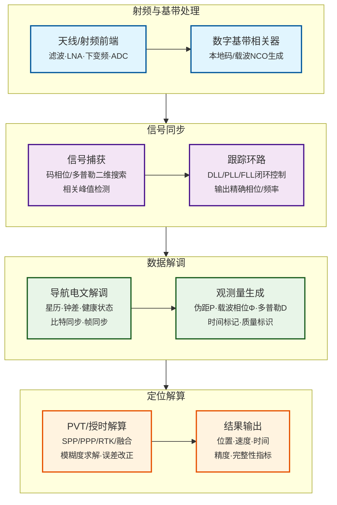
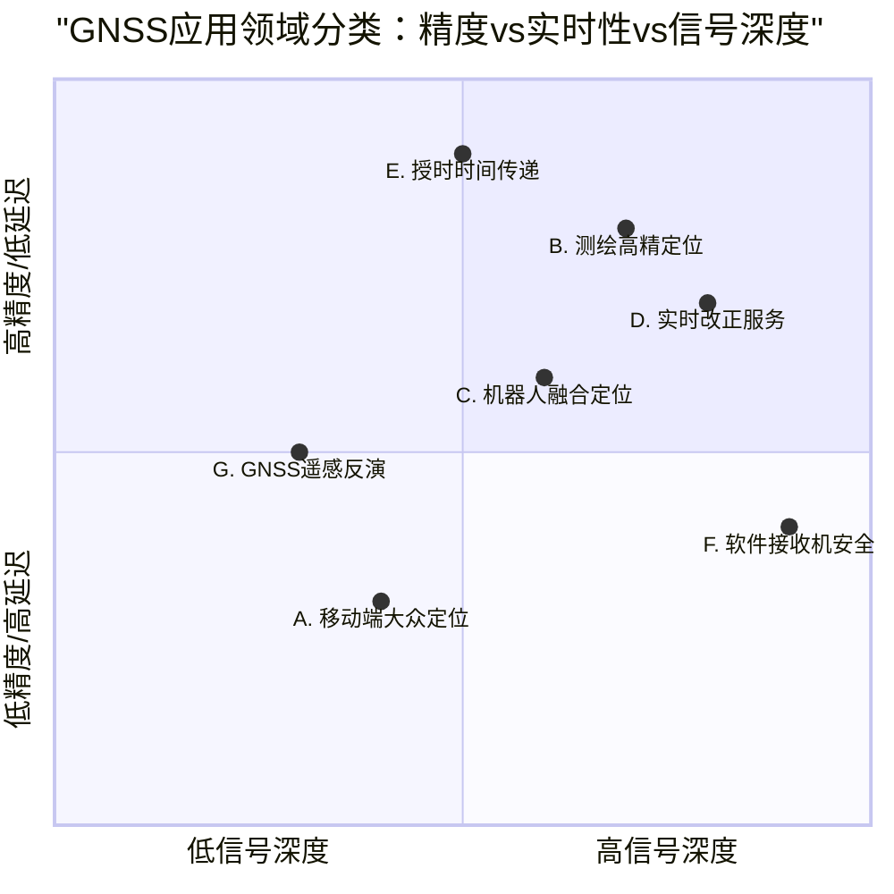
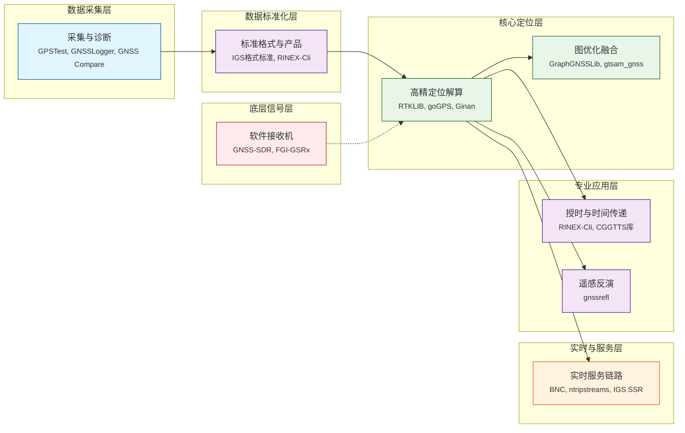
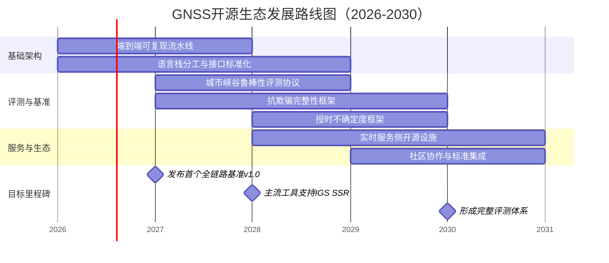

> 开源GNSS软件正在从传统的后处理定位工具演变为覆盖移动端原始观测量、实时改正服务、图优化多传感器融合、软件定义接收机与遥感反演的全栈体系。本文基于awesome-gnss项目目录（Barbeau, n.d.-b），构建"接收机算法链条-领域画像-开源工具映射"的综述框架，提出未来开源生态在鲁棒城市定位、实时SSR/PPP-RTK、抗欺骗完整性、可复现基准数据与端到端可测试流水线等方面的关键缺口。

全球导航卫星系统（GNSS）开源软件生态正经历从封闭专有解决方案向开放、可复现、社区驱动的范式转变。本文以接收机信号处理链（射频前端→基带相关→捕获跟踪→观测量生成→PVT解算）为技术主线，系统梳理了开源GNSS软件在七个关键应用领域的进展：**移动端原始观测量与大众定位**、**测绘与高精定位（PPP/RTK）**、**机器人/自动驾驶融合定位**、**实时数据流与改正服务**、**授时与时间传递**、**软件接收机与抗干扰安全**、**GNSS遥感与反演**。基于awesome-gnss项目索引中超过80个开源工具的分析，本文提出了"算法层级-应用领域-开源工具"三维分类框架，并识别出当前生态的五个关键缺口：（1）端到端可复现流水线与基准数据集；（2）城市峡谷场景的鲁棒性评测协议；（3）实时PPP-RTK/SSR服务侧开源基础设施；（4）抗欺骗/抗干扰与完整性闭环评测框架；（5）授时校准与不确定度传播的开源实现。研究表明，GNSS开源生态的未来发展需要在Python（数据处理/实验编排）、C++（实时低延迟解算）、Rust（协议/格式处理）之间形成明确的技术栈分工，同时推动IGS标准格式（RINEX 4.02、实时SSR）与开源实现的深度集成。

**关键词**：GNSS；开源软件；接收机；伪距；载波相位；PPP；RTK；因子图；软件定义接收机；实时改正服务；授时；遥感反演

## 1 引言：从"黑盒接收机"到"可复现算法栈"

传统GNSS接收机长期作为"黑盒"存在，用户仅能获取最终的位置、速度、时间（PVT）输出，难以访问原始观测量、跟踪环路状态或中间处理结果。这一局面自2016年起发生根本性转变：**Android 7.0（Nougat）引入原始GNSS测量API**，允许应用层直接获取伪距、载波相位、多普勒等底层观测量；**iOS 14**随后提供类似支持。移动端原始观测量的开放，催生了GPSTest、GNSSLogger、GNSS Compare等开源诊断工具，形成了从信号采集到可视化分析的完整工具链。

与此同时，**国际GNSS服务（IGS）持续推动数据格式与产品的标准化**，RINEX格式从2.11演进至4.02，实时状态空间表示（SSR）标准定义了多GNSS轨道、钟差、偏差、电离层等改正数的开放传输协议。标准化格式成为算法可复现的"共同语言"，使得基于RINEX/SP3/CLK/IONEX数据的后处理定位（PPP/RTK）得以在开源社区中实现。

开源GNSS软件生态沿技术演进路径自然分化：**上游**关注信号处理本身（软件接收机、抗干扰/抗欺骗）；**中游**聚焦观测量解算（PPP/RTK、融合定位）；**下游**面向特定应用（移动端诊断、实时服务、授时、遥感）。然而，现有综述多按工具类型（Android应用、桌面工具、库）分类，缺乏以**接收机原理为主线**的技术统一视角，难以评估不同开源项目在算法链条中的位置及其对最终定位性能的贡献。

本文贡献如下：
1. 以接收机信号处理链为技术主线，构建"算法层级-应用领域-开源工具"三维分类框架；
2. 系统分析七个应用领域的开源进展，绘制"领域画像"（精度等级、实时性、原始信号深度、鲁棒/安全性、可复现基准）；
3. 基于awesome-gnss项目索引，映射80余个开源工具至算法层级与应用领域；
4. 识别当前生态的关键缺口，提出未来3–5年开源优先研究方向。

## 2 GNSS接收机原理：从信号到PVT的算法链条

### 2.1 信号处理流水线（硬件前端 → 基带 → 观测量）

GNSS接收机将天线接收的射频信号转换为位置、速度、时间解算结果，其典型处理链如图1所示。

**射频前端**完成信号放大、下变频与模数转换，输出中频（IF）或基带数字采样。**基带相关器**生成本地伪随机码与载波副本，与输入信号进行相关运算。**捕获**模块在二维码相位-多普勒空间搜索卫星信号，实现粗同步。**跟踪环路**（延迟锁定环DLL、锁相环PLL、锁频环FLL）维持信号同步，输出精确的码相位、载波相位与多普勒测量。**导航电文解调**提取星历、钟差、健康状态等数据。**观测量生成**模块将跟踪结果转换为伪距、载波相位（以周或米计）与多普勒。**PVT解算**基于观测方程求解接收机状态（位置、速度、钟差），可采用单点定位（SPP）、精密单点定位（PPP）、实时动态定位（RTK）或与其他传感器（IMU、视觉、LiDAR）融合。

### 2.2 伪距、载波相位与多普勒观测方程

GNSS基本观测量包括伪距、载波相位与多普勒。其统一观测方程为：

$$
P^{(s)} = \rho^{(s)} + c(\delta t_r - \delta t_s) + T^{(s)} + I^{(s)} + d^{(s)}_{\text{rel}} + b^{(s)}_{\text{hw}} + \varepsilon_P
$$

$$
\Phi^{(s)} = \rho^{(s)} + c(\delta t_r - \delta t_s) + T^{(s)} - I^{(s)} + \lambda N^{(s)} + b^{(s)}_{\Phi} + \varepsilon_{\Phi}
$$

式中：P^(s) 为伪距（单位：米）；Φ^(s) 为载波相位（单位：米）；ρ^(s) 为卫星与接收机间的几何距离；c 为光速；δt_r 为接收机钟差；δt_s 为卫星钟差；T^(s) 为对流层延迟；I^(s) 为电离层延迟（伪距与载波相位符号相反）；λ 为载波波长；N^(s) 为整周模糊度（整数）；d^(s)_rel 为相对论效应改正；b^(s)_hw 为硬件延迟（伪距）；b^(s)_Φ 为相位偏差；ε_P、ε_Φ 为观测噪声。

多普勒观测 D^(s) 反映卫星与接收机间的相对径向速度，用于测速与周跳检测。

### 2.3 定位解算的最小观测需求

标准单点定位未知量至少包含三维位置 (x, y, z) 与接收机钟差 δt_r，因此通常需要至少四颗卫星的观测才能解算。差分定位（RTK）通过站间或星间差分消除或削弱公共误差（卫星钟差、电离层、对流层），但引入双差模糊度整数求解问题。精密单点定位（PPP）采用精密轨道与钟差产品，通过无电离层组合或未校准相位延迟（UPD）技术实现模糊度固定（PPP-AR）。

## 3 应用领域分类框架：领域画像与评价维度

为系统评估开源GNSS工具，本文提出**领域画像**概念，包含五个评价维度：

1. **精度等级**：从米级（大众定位）到毫米级（大地测量）；
2. **实时性**：后处理、近实时（秒级）、实时（毫秒级）；
3. **原始信号深度**：仅PVT输出、原始观测量、基带采样（IQ/IF）；
4. **鲁棒/安全性**：城市峡谷性能、抗多路径、抗干扰/抗欺骗能力；
5. **可复现基准**：标准数据集、评测协议、不确定度量化。

基于GNSS技术谱系，划分七个应用领域（表1）。

**表1 GNSS应用领域分类及其领域画像**

| 领域 | 精度等级 | 实时性 | 原始信号深度 | 鲁棒/安全性 | 可复现基准 |
|------|----------|--------|--------------|--------------|------------|
| **A. 移动端原始观测量与大众定位** | 米级→分米级 | 实时 | 原始观测量 | 天线/多路径限制 | 手机数据集（Google Smartphone Decimeter Challenge） |
| **B. 测绘与高精定位（PPP/RTK）** | 厘米级→毫米级 | 后处理→实时 | 原始观测量/RINEX | 依赖改正产品质量 | IGS产品、基准站数据 |
| **C. 机器人/自动驾驶融合定位** | 分米级→厘米级 | 实时 | 原始观测量/融合状态 | 城市峡谷鲁棒性 | UrbanNav等融合数据集 |
| **D. 实时数据流与改正服务** | 厘米级（PPP-RTK） | 实时（毫秒级） | RTCM/SSR流 | 链路延迟/可用性 | NTRIP caster、SSR播发测试 |
| **E. 授时与时间传递** | 纳秒级 | 后处理→实时 | RINEX/CGGTTS | 硬件延迟标定 | 共视/全视算法、CGGTTS V2E |
| **F. 软件接收机与抗干扰安全** | 可变 | 实时 | 基带采样（IQ/IF） | 抗干扰/抗欺骗 | 干扰/欺骗数据集、完整性框架 |
| **G. GNSS遥感与反演** | 厘米级（反演参量） | 后处理 | SNR/反射几何 | 多路径建模 | 反射计数据集（水位、雪深、土壤湿度） |

*图2：GNSS七大应用领域在信号深度与精度/实时性二维空间中的分布。x轴表示原始信号深度（从PVT输出到基带采样），y轴综合反映精度等级与实时性要求。*

## 4 领域进展与开源工具映射

### 4.1 领域A：移动端原始观测量与大众定位

**领域画像**：精度从米级走向分米级，主要受限于手机天线增益、多路径与非视距（NLOS）传播，优势在于海量设备覆盖与场景多样性。

**开源工具链**：
- **GPSTest**（Barbeau, n.d.）— 支持多星座/双频能力展示，记录NMEA、原始观测量、导航电文日志，与Google GPS Measurement Tools兼容。
- **GNSSLogger**（Google, n.d.）— Google官方原始观测量记录工具，提供可视化分析桌面软件。
- **GNSS Compare**（TheGalfins, n.d.）— 支持从原始观测量计算位置，提供GPS/Galileo双频（Beta）处理。

**技术挑战**：手机硬件差异（天线设计、时钟稳定性）、非标称环境（城市峡谷、室内）、功耗约束。

**开源缺口**：统一原始观测量数据模型、可插拔误差项（钟漂、硬件延迟、NLOS分类）、公开基准数据集（如Google Smartphone Decimeter Challenge）的端到端处理流水线。

### 4.2 领域B：测绘与高精定位（PPP/RTK）

**领域画像**：厘米级精度依赖载波相位与模糊度固定；实时化需要高稳定数据链（NTRIP）与改正产品（SSR/PPP-RTK）。

**代表开源项目**：
- **RTKLIB**（Takasu, n.d.）— 最广泛使用的开源GNSS定位库，支持SPP、PPP、RTK/网络RTK，提供命令行工具与图形界面。
- **goGPS**（goGPS-Project, n.d.）— 面向低成本接收机的定位处理方案，提供Java与MATLAB实现，常用于学术对比。
- **Ginan**（Geoscience Australia, n.d.）— 澳大利亚地球科学署开发，专注于实时PPP-RTK处理与产品生成。
- **pygnsslab**（PyGnssLab, n.d.）— 模块化Python工具集，包含RINEX读取、PPP/PPP-AR引擎、实时流支持。

**标准与产品依赖**：精密定位强依赖IGS产品（SP3精密轨道、钟差、IONEX电离层图）及其实时SSR标准。IGS实时服务（RTS）提供多GNSS轨道、钟差、偏差、电离层格网改正。

**开源缺口**：多GNSS多频一致性处理、实时SSR/PPP-RTK全链路实现、区域电离层/对流层/多路径场景的基准评测、与融合定位框架（如因子图）的接口标准化。

### 4.3 领域C：机器人/自动驾驶融合定位

**领域画像**：城市峡谷场景中GNSS单独工作不可靠，必须与IMU、LiDAR、视觉、地图等多传感器融合；因子图优化成为主流表述框架。

**代表开源项目**：
- **GraphGNSSLib**（Wen, n.d.）— 基于因子图优化的GNSS定位与RTK库，面向融合系统接口友好。
- **gtsam-gnss**（Taroz, n.d.-a）— 基于GTSAM的GNSS因子与MATLAB封装，用于GNSS/IMU融合。
- **gsdc2023**（Taroz, n.d.-b）— Google Smartphone Decimeter Challenge 2023获胜方案，实现GNSS/IMU因子图优化。

**基准数据集**：**UrbanNav**（IPNL-POLYU, n.d.）提供亚洲城市峡谷（东京、香港）的多传感器原始数据（GNSS RINEX、IMU、视觉、LiDAR）与高精度真值，是推动该领域可复现研究的关键资源。

**开源缺口**：统一鲁棒性评测协议（NLOS/多路径标签、遮挡统计）、紧耦合/深耦合架构的开源实现、多传感器时空标定工具链。

### 4.4 领域D：实时数据流与改正服务

**领域画像**：NTRIP协议与SSR标准将"算法"推向"服务"，实时性能取决于数据流延迟、断链恢复、协议兼容性与可观测性监控。

**代表开源项目**：
- **BKG Ntrip Client (BNC)**（BKG, n.d.）— 多流NTRIP客户端，支持实时PPP解算，是实时GNSS生态的重要节点。
- **ntripstreams**（Stenseng, n.d.）— Python Ntrip协议接口，用于GNSS仪器、caster与用户间数据流转发。
- **IGS SSR标准**（IGS, n.d.）— 定义实时轨道、钟差、偏差、电离层等改正数的开放格式，推动多GNSS实时应用。

**开源缺口**：SSR ingest服务、caster/订阅系统、端到端链路监控、回放与故障注入测试框架。适合采用**Python服务编排** + **C++/Rust高吞吐流处理**的混合技术栈。

### 4.5 领域E：授时与时间传递

**领域画像**：目标从"定位"转为"时间"；评价指标为纳秒级稳定度与校准可追溯性。

**方法学基础**：共视（Common-View）GNSS时间传递通过两地同时观测同一卫星消除共模误差，精度可达纳秒量级。

**标准与格式**：国际计量局（BIPM）推荐的**CGGTTS V2E**格式用于多星座时间传递结果交换。

**开源工具映射**：
- **RINEX-Cli**（Georust, n.d.）— 集成teqc、Anubis、gLAB功能，支持CGGTTS格式生成。
- **CGGTTS Rust库**（Bres, n.d.）— 提供CGGTTS文件解析与跟踪调度。

**开源缺口**：端到端可校准链路（硬件延迟标定流程）、共视/全视解算器、与IGS产品耦合的误差分解、实验元数据与不确定度预算的标准化记录。

### 4.6 领域F：软件接收机与抗干扰/抗欺骗

**领域画像**：研究重点从"已有观测量解算"前移到"观测量生成"，通过可控基带实现算法可重复性与安全性测试。

**代表开源项目**：
- **GNSS-SDR**（GNSS-SDR Project, n.d.）— 开源软件定义接收机，支持Linux/Mac/Windows，提供完整捕获、跟踪、解算流水线。
- **FGI-GSRx**（NLSFI, n.d.）— 芬兰大地测量研究所开发的MATLAB软件接收机，用于抗干扰与鲁棒PNT算法研究。

**开源缺口**：公开干扰/欺骗数据集、统一基带信号质量指标、完整性告警与定位解算的闭环评测框架。

### 4.7 领域G：GNSS遥感与反演

**领域画像**：利用反射信号或多路径效应，将GNSS转为"机会信号遥感器"，反演水位、土壤湿度、雪深等环境参数。

**代表开源项目**：
- **gnssrefl**（Larson, n.d.）— Python开源工具，支持GNSS干涉反射计（GNSS-IR）分析，用于水位、土壤湿度、雪深估计。

**开源缺口**：反演不确定度量化、多源约束（潮位计、气象站）融合、前向物理模型（反射几何、电磁散射近似）的深度集成。

## 5 算法层级与开源工具统一视图

表2将"从信号到应用"的关键算法层级与awesome-gnss条目对齐，形成统一技术视图。

**表2 算法层级、典型输入输出与代表开源项目**

| 算法/系统层级 | 典型输入 | 典型输出 | 代表开源项目（awesome-gnss） | 领域画像关键词 |
|---------------|----------|----------|------------------------------|----------------|
| **采集与诊断** | NMEA / Raw-meas / Nav msg | 日志、质量指标 | GPSTest、GNSSLogger、GNSS Compare | 开放接口、规模化 |
| **标准格式与产品** | RINEX/SP3/CLK/IONEX | 统一数据对象 | IGS格式标准、RINEX-Cli | 互操作、可复现 |
| **高精定位解算** | RINEX/RTCM/SSR | PPP/RTK轨迹 | RTKLIB、goGPS、Ginan | 厘米级、工程化 |
| **图优化融合** | GNSS+IMU(+LiDAR/视觉) | 鲁棒轨迹/状态 | GraphGNSSLib、gtsam_gnss | 城市峡谷、鲁棒性 |
| **实时服务链路** | NTRIP/SSR streams | 实时改正/PVT | BNC、ntripstreams、IGS SSR | 时延、可用性 |
| **软件接收机** | IQ/IF采样 | 观测量/PVT | GNSS-SDR、FGI-GSRx | 可控基带、算法研究 |
| **授时与时间传递** | RINEX/CGGTTS | 纳秒级时差 | RINEX-Cli、CGGTTS库 | 校准、不确定度 |
| **遥感反演** | SNR/反射几何 | 水位/雪深等 | gnssrefl | 环境参数、物理解释 |

*图3：GNSS开源算法层级架构图，展示从数据采集到专业应用的八层技术栈及其代表开源工具。实线箭头表示主要数据流，虚线箭头表示软件接收机为定位解算提供底层信号支持。*

## 6 未来开源优先研究方向

基于上述分析，本文提出未来3–5年GNSS开源生态的六个优先研究方向。

### 6.1 端到端可复现流水线与基准数据

构建从原始信号（IQ/IF）→观测量→定位/授时/反演的**全链路可复现流水线**，配套数据版本、参数配置、随机种子与误差预算。IGS对格式（RINEX 4.02）与实时标准（SSR）的推进为此提供了制度基础。开源实现应深度集成IGS标准，提供**容器化部署**（Docker）与**工作流引擎**（Nextflow/Snakemake）支持。

### 6.2 城市峡谷鲁棒性评测协议

针对移动端与自动驾驶场景，建立统一的城市峡谷评测协议。需扩展UrbanNav等数据集，涵盖更多城市形态、建筑材质、动态遮挡类型，并定义**鲁棒性评分**（定位漂移、失锁恢复时间、NLOS检测准确率）。开源工具应提供标准评测脚本与可视化报告生成。

### 6.3 实时PPP-RTK/SSR服务侧开源

当前开源生态缺少**服务侧基础设施**：SSR ingest、caster/订阅系统、链路监控、回放与故障注入测试。建议采用**微服务架构**，Python实现业务逻辑与API，C++/Rust实现高吞吐流处理与协议栈，提供**云原生部署**（Kubernetes）方案。

### 6.4 抗欺骗/抗干扰与完整性框架

将软件接收机（可控基带）与定位解算闭环，形成"检测—缓解—告警"的**完整性评测框架**。需创建公开干扰/欺骗数据集，定义**基带信号质量指标**（载噪比、相关峰形态、多路径误差），并集成至GNSS-SDR/FGI-GSRx等平台。

### 6.5 授时开源校准与不确定度框架

实现端到端可追溯的时间传递链路，包括硬件延迟标定流程、共视/全视解算器、与IGS产品耦合的误差分解。开源工具应输出**CGGTTS V2E格式**，并提供**不确定度传播**分析，对齐NIST/BIPM方法学要求。

### 6.6 语言与性能栈的分工清晰化

- **Python**：数据处理、实验编排、评测与可视化（如gnssrefl、pygnsslab、gnss_lib_py）。
- **C++**：实时低延迟解算、软件接收机基带、图优化核心（性能与生态成熟度决定）。
- **Rust**：协议/格式处理、高可靠数据管道（内存安全优势，如RINEX/SP3解析库）。

鼓励跨语言接口（PyO3、cxx）与**模块化设计**，避免单一代码库的"大泥球"架构。

*图4：GNSS开源生态2026-2030年发展路线图，展示六个优先研究方向在时间轴上的分布与关键里程碑。*

## 7 结论

开源GNSS软件生态正从"后处理定位工具"演进为覆盖**移动端原始观测量、实时服务、融合鲁棒性、软件接收机、安全完整性、授时标准与遥感反演**的全栈体系。本文以接收机原理为主线，构建了"算法层级-应用领域-开源工具"三维分类框架，系统分析了七个领域的进展与缺口。

未来生态发展的关键在于：**以可复现基准推动研究可比性**，**以服务侧开源填补实时化短板**，**以完整性框架提升安全性**，**以语言栈分工优化开发效率**。awesome-gnss提供了宝贵的入口索引，但将其转化为"学术报告"需要统一的技术视角与批判性评估。

GNSS开源不仅关乎工具可用性，更是推动**透明研究、教育普及与技术民主化**的重要力量。随着IGS标准持续演进与社区贡献不断积累，开源生态有望在下一个五年内，成为GNSS技术创新与标准化进程中不可或缺的一环。

## 参考文献

1. Barbeau, S. (n.d.). *GPSTest*. GitHub. https://github.com/barbeau/gpstest
2. Barbeau, S. (n.d.). *awesome-gnss*. GitHub. https://github.com/barbeau/awesome-gnss
3. BIPM. (2015). *Common GNSS Generic Time Transfer Standard Version 2E (CGGTTS V2E)*. https://www.bipm.org/en/committees/cc/cctf/20-2015/resolution-4
4. BKG. (n.d.). *BKG Ntrip Client (BNC)*. Bundesamt für Kartographie und Geodäsie. https://igs.bkg.bund.de/ntrip/bnc
5. Bres, G. W. (n.d.). *CGGTTS Rust library*. GitHub. https://github.com/gwbres/cggtts
6. Georust. (n.d.). *RINEX-Cli*. GitHub. https://github.com/georust/rinex
7. Geoscience Australia. (n.d.). *Ginan*. GitHub. https://github.com/GeoscienceAustralia/ginan
8. GNSS-SDR Project. (n.d.). *GNSS-SDR*. GitHub. https://github.com/gnss-sdr/gnss-sdr
9. goGPS-Project. (n.d.). *goGPS*. GitHub. https://github.com/goGPS-Project
10. Google. (n.d.). *GPS Measurement Tools*. GitHub. https://github.com/google/gps-measurement-tools
11. IGS. (n.d.). *IGS Formats and Standards*. International GNSS Service. https://igs.org/formats-and-standards/
12. IPNL-POLYU. (n.d.). *UrbanNav Dataset*. GitHub. https://github.com/IPNL-POLYU/UrbanNavDataset
13. Kaggle. (2023). *Google Smartphone Decimeter Challenge*. https://www.kaggle.com/competitions/smartphone-decimeter-2023
14. Larson, K. M. (n.d.). *gnssrefl*. GitHub. https://github.com/kristinemlarson/gnssrefl
15. NLSFI. (n.d.). *FGI-GSRx*. GitHub. https://github.com/nlsfi/FGI-GSRx
16. PyGnssLab. (n.d.). *pygnsslab*. GitHub. https://github.com/PyGnssLab/pygnsslab
17. Stenseng, A. (n.d.). *ntripstreams*. GitHub. https://github.com/stenseng/ntripstreams
18. Takasu, T. (n.d.). *RTKLIB*. GitHub. https://github.com/tomojitakasu/RTKLIB
19. Taroz, T. (n.d.). *gtsam_gnss*. GitHub. https://github.com/taroz/gtsam_gnss
20. Taroz, T. (n.d.). *gsdc2023*. GitHub. https://github.com/taroz/gsdc2023
21. TheGalfins. (n.d.). *GNSS Compare*. GitHub. https://github.com/TheGalfins/GNSS_Compare
22. Wen, W. (n.d.). *GraphGNSSLib*. GitHub. https://github.com/weisongwen/GraphGNSSLib

*（注：本文引用项目均来自awesome-gnss清单，详细条目见参考文献2。）*