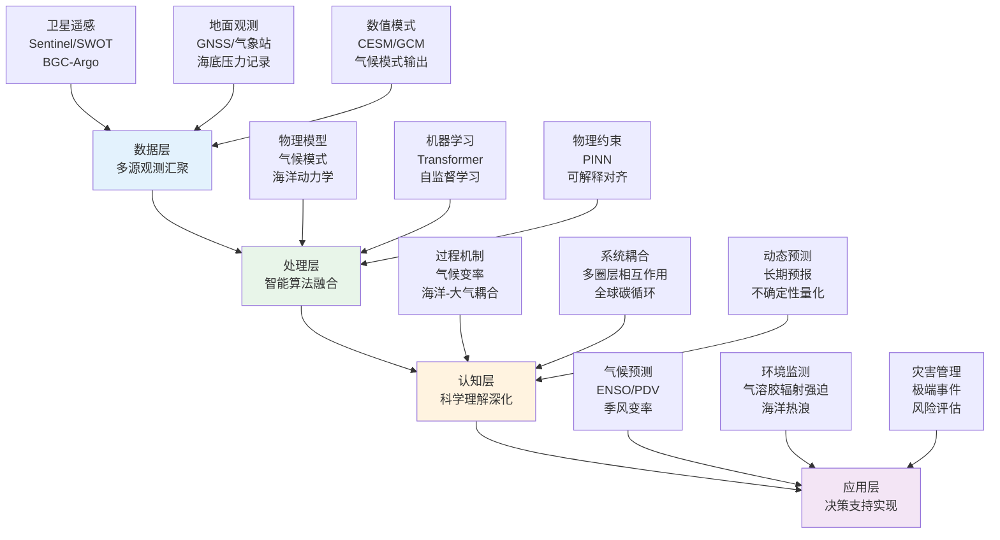
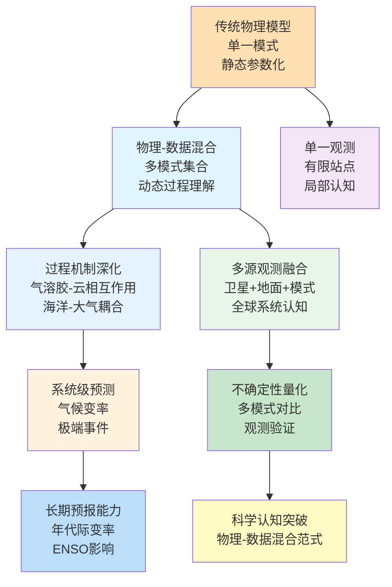
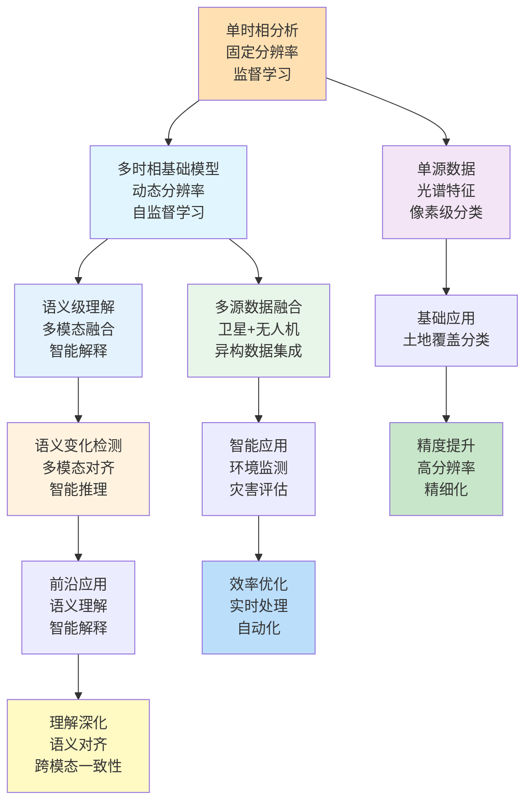
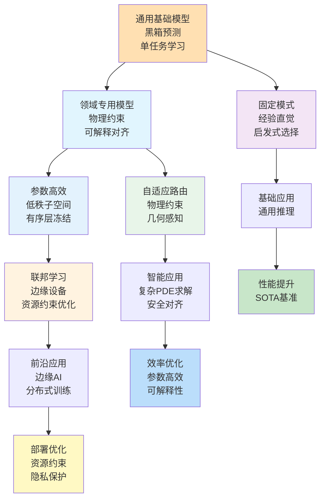
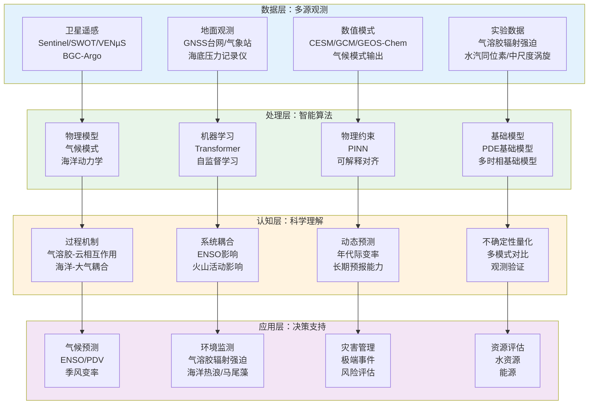
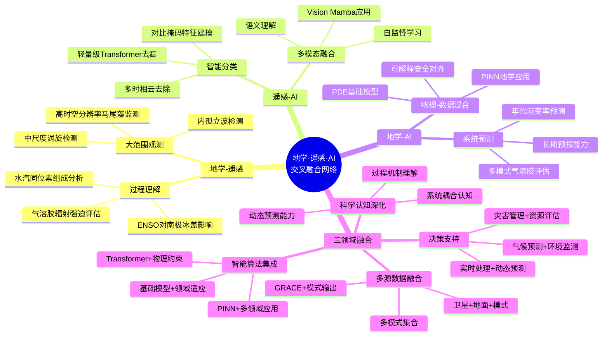

在2026年2月9日至2月18日这十天里，Nature、Science、Geophysical Research Letters、Remote Sensing、Journal of Geophysical Research等顶刊上涌现的758篇论文中，有超过200篇直接或间接地涉及地学、遥感与人工智能的交叉融合。本文系统梳理地学、遥感与人工智能的最新研究现状、技术特点与未来趋势，并在数据与文献的基础上，给出未来3–5年可检验的技术判断。

## 一、本期研究印记图

2026年2月上旬，地学、遥感与人工智能的研究呈现出清晰的范式融合特征。地学研究正在从传统的物理模型向物理信息神经网络和基础模型转变，特别是在气候预测、海洋动力学和大气化学等领域；遥感技术正在从单时相处理向多时相基础模型发展，从固定架构向轻量级和自适应架构演进；而人工智能，特别是物理信息神经网络和可解释对齐技术，正在成为连接"物理定律"与"观测数据"的桥梁。

本期研究呈现出三个主要特征：

- **地学** 从单一物理模型走向物理-数据混合，从静态参数化走向动态过程理解，从局部观测走向全球系统认知
- **遥感** 从单时相分析走向多时相基础模型，从固定分辨率走向动态分辨率，从监督学习走向自监督学习
- **人工智能** 从通用基础模型走向领域专用模型，从黑箱预测走向可解释对齐，从单一模态走向多模态融合

## 二、地学方向：从"单一物理模型"到"物理-数据混合"的转变

**表1：地学方向代表性研究的技术路线与特点**

| 研究主题 | 技术路线 | 技术特点 | 重要结论 |
|---------|---------|---------|---------|
| 气溶胶辐射强迫评估 | 多模式集合 + 排放清单 | 多模式对比、辐射强迫分解 | 南亚地区气溶胶净有效辐射强迫为-1.66 W/m²，大气吸收为+9.29 W/m² |
| 水汽同位素组成比较 | 卫星反演 + 原位观测 | 多仪器对比、垂直廓线验证 | 卫星反演在14 km以上高度相对于原位观测偏干达150‰ |
| 太平洋年代际变率 | 古气候数据同化 + 气候模式 | 多年代际模态识别、火山活动影响 | PDV存在50-70年多年代际模态和20-40年双年代际模态，后者与火山活动相关 |
| 海洋中尺度涡旋 | 高分辨率模式 + 涡旋检测追踪 | 多深度层分析、季节变化 | 加拿大海盆每年检测到约6000-9000个中尺度涡旋，反气旋在Beaufort环流中心占主导 |
| 热层质量密度估算 | TLE数据 + 实时估算方法 | 计算高效、业务可行 | 基于空间碎片TLE数据实现热层质量密度的近实时估算，支持空间态势感知 |
| 南极冰盖质量变化 | GRACE观测 + 表面质量平衡模拟 | ENSO影响、时空模式 | ENSO主导期南极冰盖质量变化呈现明显的时空模式，与大气环流变化相关 |
| 气溶胶碘循环 | GEOS-Chem模式 + 气溶胶碘形态 | 碘循环机制、氧化能力影响 | 气溶胶碘循环是控制对流层反应性碘丰度的主要因素，碘循环速率是海洋排放的2倍以上 |
| 澳大利亚夏季风爆发 | 湿静力能收支 + 气候模式对比 | 爆发机制、变暖情景响应 | 水平水汽平流主导爆发演化，变暖情景下不同模式显示不同的爆发响应 |

### 2.1 专题画像：南亚地区气溶胶辐射强迫与大气吸收的多模式对比研究

**（1）技术路线：从单一模式到多模式集合的辐射强迫分解**

Amit Kumar Sharma等（2026）在Journal of Geophysical Research: Atmospheres上发表了关于南亚地区气溶胶辐射强迫和大气吸收的多模式对比研究。该研究利用四个全球气候模式（CAM5、CAM6、ECHAM6和NICAM-SPRINTARS），结合统一的区域排放清单（SMoG-India-v1）和全球社区排放数据系统（CEDS），评估了从工业革命前到现在的气溶胶排放变化对短波、长波和净辐射通量的扰动。研究采用多模式集合平均方法，系统分解了气溶胶-辐射相互作用（ERF_ARI）和气溶胶-云相互作用（ERF_ACI）对辐射强迫的贡献，并量化了大气吸收的各个组成部分。数据处理包括统一的排放清单、标准化的辐射强迫计算方法和系统的不确定性分析。研究通过对比不同模式的模拟结果，识别了模式间的一致性和差异，为理解南亚地区气溶胶气候效应提供了多模式证据。

**（2）技术特点：多模式对比与辐射强迫分解**

该研究的关键创新在于采用多模式集合方法，系统分解了气溶胶辐射强迫的各个组成部分。传统的单模式研究往往难以量化模式不确定性，而该研究通过四个不同模式的对比，揭示了气溶胶-云相互作用和气溶胶-辐射相互作用对辐射强迫的相对贡献。更重要的是，该研究通过统一排放清单和标准化计算方法，确保了不同模式结果的可比性，为多模式对比研究提供了新的范例。

**（3）重要结论：气溶胶-云相互作用主导南亚地区辐射强迫**

该研究的重要结论是：**南亚地区气溶胶净有效辐射强迫为-1.66 W/m²，主要由气溶胶-云相互作用驱动的显著负短波辐射强迫（-4.59 W/m²）主导，大气吸收为+9.29 W/m²，主要由直接气溶胶-辐射相互作用的短波吸收贡献（+8.99 W/m²）**。这一发现强调了气溶胶-云相互作用在南亚地区气候效应中的主导作用，为改进该地区的气候预测和减排策略提供了科学依据。该研究强调了多模式对比在量化气溶胶气候效应不确定性方面的重要性，特别是在需要高精度辐射强迫估算的应用中。

### 2.2 专题画像：水汽同位素组成的卫星反演与原位观测系统对比

**（1）技术路线：从单一观测到多仪器对比的垂直廓线验证**

Benjamin W. Clouser等（2026）在Atmospheric Measurement Techniques上发表了关于ACE-FTS卫星反演与机载原位观测水汽同位素组成（δD）的系统对比研究。该研究首次对比了使用ChiWIS、Harvard ICOS和Hoxotope仪器的原位测量与ACE-FTS卫星反演的水汽同位素组成。原位数据来自AVE-WIIF、TC4、CR-AVE、StratoClim和ACCLIP等多个野外实验，卫星反演来自ACE-FTS v5.2数据集。研究通过对比不同高度层、不同区域和不同季节的观测结果，系统评估了卫星反演的精度和偏差。数据处理包括统一的数据格式转换、高度层匹配和统计分析方法。研究特别关注了平流层区域的反演精度，因为该区域相对不受观测偏差影响，可以更好地评估反演方法的系统性误差。

**（2）技术特点：多仪器对比与垂直廓线验证**

该研究的关键创新在于首次系统对比了卫星反演与多种原位观测仪器获得的水汽同位素组成数据。传统的验证研究往往依赖单一仪器或有限的数据集，而该研究通过整合多个野外实验的数据，提供了更全面的验证结果。更重要的是，该研究通过分析不同高度层和不同区域的对比结果，识别了卫星反演的系统性偏差，为改进反演算法提供了重要依据。

**（3）重要结论：卫星反演在平流层区域存在系统性偏干**

该研究的重要结论是：**在所有实验期间，卫星反演在约14 km以上高度相对于原位观测偏干达150‰，这一差异即使在平流层空气的过境飞行中也持续存在，表明存在系统性反演偏差**。这一发现强调了在平流层化学和辐射预算研究中考虑卫星反演偏差的重要性，特别是在需要高精度水汽同位素数据的应用中。该研究为改进卫星反演算法和评估反演不确定性提供了重要依据，特别是在平流层区域的水汽同位素研究中。

### 2.3 专题画像：太平洋年代际变率的首选时间尺度与火山活动影响

**（1）技术路线：从单一重建到古气候数据同化的多模态识别**

Yanmin Qin等（2026）在Geophysical Research Letters上发表了关于太平洋年代际变率（PDV）首选时间尺度的研究。该研究结合了通过古气候数据同化（PDA）框架导出的基于δ18O的PDV指数、现有的PDV重建和气候模式，识别了PDV的首选时间尺度。研究采用多时间尺度分析方法，系统分析了过去千年PDV的时间结构特征。数据处理包括古气候数据同化、PDV指数提取、时间尺度分析和火山活动关联分析。研究通过对比不同火山活动期的PDV特征，识别了PDV时间尺度与火山活动的关系。研究还利用气候模式模拟验证了观测到的PDV时间尺度特征，为理解PDV机制提供了新的视角。

**（2）技术特点：古气候数据同化与多模态识别**

该研究的关键创新在于采用古气候数据同化框架，结合多种数据源识别了PDV的首选时间尺度。传统的PDV研究往往依赖有限的历史观测数据，而该研究通过古气候数据同化，扩展了PDV研究的时间范围。更重要的是，该研究识别了PDV的两个主要模态，并揭示了它们与火山活动的关系，为理解PDV机制提供了新的视角。

**（3）重要结论：火山活动塑造PDV的时间结构**

该研究的重要结论是：**过去千年的PDV主要由两个首选时间尺度模态主导：50-70年多年代际模态和20-40年双年代际模态，前者在火山活动平静期占主导，后者在火山活动密集期更常见，火山活动在塑造PDV时间结构中发挥重要作用**。这一发现强调了火山活动对年代际气候变率的影响，为改进年代际气候预测提供了新的思路。该研究强调了古气候数据同化在扩展气候变率研究时间范围方面的重要性，特别是在需要理解长期气候变率机制的应用中。

### 2.4 专题画像：加拿大海盆海洋中尺度涡旋特征的高分辨率模式分析

**（1）技术路线：从观测分析到高分辨率模式模拟的涡旋检测追踪**

该研究应用涡旋检测和追踪方法到高分辨率（1/12°）区域模式输出，研究了1995-2020年期间加拿大海盆的中尺度涡旋。研究采用自动化的涡旋检测算法，识别了不同深度层的涡旋特征，包括表面层、密度跃层和Atlantic Water层。数据处理包括模式输出预处理、涡旋检测算法应用、涡旋追踪和统计分析。研究通过对比不同深度层的涡旋特征，揭示了中尺度涡旋的垂直结构特征。研究还分析了涡旋的季节变化和年际变化，为理解北极海洋中尺度过程提供了新的视角。

**（2）技术特点：高分辨率模式与多深度层分析**

该研究的关键创新在于采用高分辨率区域模式，系统分析了不同深度层的中尺度涡旋特征。传统的涡旋研究往往关注单一深度层或有限观测，而该研究通过高分辨率模式模拟，提供了更全面的涡旋特征分析。更重要的是，该研究通过多深度层分析，揭示了中尺度涡旋的垂直结构特征，为理解北极海洋动力学提供了新的视角。

**（3）重要结论：中尺度涡旋在加拿大海盆广泛分布且具有明显的垂直结构**

该研究的重要结论是：**1995-2020年期间，加拿大海盆每年在表面层检测到约6000个涡旋，在密度跃层检测到约9000个涡旋，在Atlantic Water层检测到约5500个涡旋，涡旋群体在气旋和反气旋之间大致均匀分布，但在Beaufort环流中心，密度跃层和表面层的反气旋占主导**。这一发现强调了中尺度涡旋在北极海洋动力学中的重要作用，为改进北极海洋模拟和预测提供了新的依据。该研究强调了高分辨率模式在研究中尺度海洋过程方面的重要性，特别是在需要理解涡旋垂直结构的应用中。

### 2.5 专题画像：基于空间碎片TLE数据的热层质量密度近实时估算

**（1）技术路线：从传统建模到TLE数据驱动的实时估算**

该研究提出了一种计算高效且业务可行的方法，使用公开可用的空间碎片双行元（TLE）数据估算全球平均热层质量密度。该方法构成了基于TLE的密度估算的基础，用于近地轨道的连续监测，为空间态势感知提供补充。研究通过实施该方法，在模拟实时限制的情况下，估算了2018-2024年期间的热层密度。数据处理包括TLE数据获取、轨道传播、大气阻力分析和密度反演。研究通过对比估算结果与现有模型输出，验证了方法的有效性。研究还分析了方法的计算效率和业务可行性，为实际应用提供了重要依据。

**（2）技术特点：计算高效与业务可行**

该研究的关键创新在于利用公开可用的TLE数据，实现了热层质量密度的近实时估算。传统的热层密度估算往往依赖复杂的物理模型或有限的观测数据，而该方法通过利用大量空间碎片的TLE数据，提供了更高效和可行的估算方法。更重要的是，该方法具有计算高效和业务可行的特点，为空间态势感知提供了新的工具。

**（3）重要结论：TLE数据可用于热层密度的近实时估算**

该研究的重要结论是：**基于空间碎片TLE数据的方法可以实现全球平均热层质量密度的近实时估算，该方法计算高效且业务可行，为空间态势感知提供了补充工具**。这一发现强调了TLE数据在热层密度估算中的潜在价值，为改进空间天气监测和预测提供了新的思路。该研究强调了数据驱动方法在空间天气应用中的重要性，特别是在需要实时监测的应用中。

### 2.6 专题画像：ENSO主导期南极冰盖质量变化的GRACE观测分析

**（1）技术路线：从单一观测到多数据源融合的质量变化分析**

该研究使用重力恢复与气候实验（GRACE）观测的质量变化和模拟的表面质量平衡（使用RACMO2.4p1），研究了不同ENSO期间南极冰盖（AIS）的质量变率。研究采用累积和索引方法定义2002-2022年期间不同的ENSO主导"期"，该方法允许与GRACE进行比较。数据处理包括GRACE数据预处理、表面质量平衡模拟、ENSO期定义和质量变化分析。研究通过对比不同ENSO期的质量变化模式，识别了ENSO对AIS质量变化的影响。研究还分析了质量变化的时空模式，为理解AIS对气候变率的响应提供了新的视角。

**（2）技术特点：ENSO期定义与时空模式分析**

该研究的关键创新在于采用累积和索引方法定义ENSO主导期，系统分析了ENSO对AIS质量变化的影响。传统的ENSO研究往往关注单一事件或有限时间范围，而该研究通过定义ENSO主导期，提供了更系统的分析框架。更重要的是，该研究通过时空模式分析，揭示了AIS质量变化对ENSO的响应特征，为理解AIS对气候变率的敏感性提供了新的视角。

**（3）重要结论：ENSO显著影响南极冰盖质量变化的时空模式**

该研究的重要结论是：**ENSO主导期南极冰盖质量变化呈现明显的时空模式，与ENSO诱导的大气环流变化相关，质量变化模式在不同ENSO期之间存在显著差异**。这一发现强调了ENSO对AIS质量变化的重要影响，为改进AIS质量变化预测和评估其对海平面上升的贡献提供了科学依据。该研究强调了长期观测数据在理解AIS对气候变率响应方面的重要性，特别是在需要评估未来海平面上升的应用中。

### 2.7 专题画像：气溶胶碘循环对对流层反应性碘丰度的控制作用

**（1）技术路线：从单一机制到多过程耦合的碘循环建模**

Allison R. Moon等（2026）在Atmospheric Chemistry and Physics上发表了关于气溶胶碘循环对对流层反应性碘丰度控制作用的研究。该研究在全局化学传输模式GEOS-Chem中引入了分形态的气溶胶碘和气溶胶碘化物循环。模拟的气溶胶碘分为细模态和粗模态可溶性有机碘（SOI）、碘酸盐和碘化物。气溶胶碘化物通过涉及卤素硝酸盐和次卤酸的异相化学循环到气相，形成I2、ICl和IBr，这代表了对流层气相碘的额外来源。数据处理包括气溶胶碘形态参数化、异相化学反应机制、模式配置和观测对比。研究通过对比包含和不包含碘循环的模拟结果，量化了碘循环对反应性碘丰度的影响。研究还分析了碘循环速率与其他碘源的关系，为理解对流层碘循环提供了新的视角。

**（2）技术特点：分形态建模与异相化学循环**

该研究的关键创新在于引入了分形态的气溶胶碘建模和异相化学循环机制，实现了对气溶胶碘循环的精细刻画。传统的碘循环研究往往关注气相过程，而该研究通过引入气溶胶碘循环，揭示了气溶胶在碘循环中的重要作用。更重要的是，该研究通过分形态建模，实现了对不同形态气溶胶碘的精细描述，为理解碘循环机制提供了新的工具。

**（3）重要结论：气溶胶碘循环是控制对流层反应性碘的主要因素**

该研究的重要结论是：**碘化物脱卤作用使对流层反应性碘（Iy）的负担增加一倍，同时减少了IO和气溶胶碘的模式-观测偏差，气溶胶碘转化为Iy的速率是无机海洋排放和有机碘气体光解速率之和的两倍以上，表明气溶胶在介导对流层Iy的丰度和寿命中发挥重要作用**。这一发现强调了气溶胶碘循环在对流层碘循环中的主导作用，为改进对流层氧化能力估算和评估碘对气候的影响提供了科学依据。该研究强调了异相化学过程在理解大气化学中的重要性，特别是在需要准确表示反应性卤素丰度的应用中。

### 2.8 专题画像：澳大利亚夏季风爆发的湿静力能收支与变暖情景响应

**（1）技术路线：从单一分析到多模式对比的爆发机制研究**

Sarthak Mohanty等（2026）在Journal of Geophysical Research: Atmospheres上发表了关于澳大利亚夏季风爆发的研究。该研究使用再分析数据、历史大气模式模拟（AMIP）和均匀增加海表温度（+4K；AMIP+4K）的模拟，研究了当前和变暖气候条件下澳大利亚夏季风爆发的复杂动力学。研究采用湿静力能（MSE）收支分析，系统分析了爆发演化的能量平衡。数据处理包括再分析数据预处理、模式输出分析、爆发识别和MSE收支计算。研究通过对比不同模式的模拟结果，识别了模式间的一致性和差异。研究还分析了变暖情景下爆发的响应特征，为理解季风对气候变暖的敏感性提供了新的视角。

**（2）技术特点：MSE收支分析与多模式对比**

该研究的关键创新在于采用MSE收支分析，系统揭示了爆发演化的能量平衡机制。传统的季风研究往往关注单一过程或有限变量，而该研究通过MSE收支分析，提供了更全面的能量平衡视角。更重要的是，该研究通过多模式对比，识别了模式间的一致性和差异，为理解季风爆发的机制和不确定性提供了重要依据。

**（3）重要结论：水平水汽平流主导爆发演化，变暖情景下模式响应存在差异**

该研究的重要结论是：**湿静力能收支分析显示水平水汽平流主导爆发演化，而模式特定的参数化增加了爆发特征的变率，在变暖情景下，不同模式显示不同的爆发响应，降水变化源于垂直水汽平流的热力学和动力学分量的不同贡献**。这一发现强调了水平水汽平流在季风爆发中的重要作用，为改进季风预测提供了新的思路。该研究强调了多模式对比在理解季风机制和不确定性方面的重要性，特别是在需要评估季风对气候变暖响应的应用中。

## 三、遥感方向：从"单时相分析"到"多时相基础模型"的演进

**表2：遥感方向代表性研究的技术路线与特点**

| 研究主题 | 技术路线 | 技术特点 | 重要结论 |
|---------|---------|---------|---------|
| 轻量级Transformer去雾 | 多类型特征提取 + 对称编码-解码 | 轻量级架构、计算高效 | 显著提高去雾性能，同时降低计算成本 |
| 对比掩码特征建模 | 对比学习 + 掩码建模 | 自监督学习、混合框架 | 在小样本场景下表现出优越的特征提取能力和更高的精度 |
| 数字地形模型可复制性 | 无人机摄影测量 + 密集匹配 | 可复制性评估、方法噪声分析 | 方法效应可能显著影响可复制性，空间分辨率≤1.5 cm时最可能实现可复制性 |
| 高时空分辨率马尾藻数据集 | VENµS卫星 + AFAI指数 | 高分辨率、日观测 | 提供4 m分辨率的日观测数据，支持近岸过程的精细监测 |
| 深度学习内孤立波检测 | Sentinel-3高度计 + 深度学习 | 自动检测、特征提取 | 实现内孤立波的自动检测和特征提取 |
| 无人机SAR 3D成像配置优化 | 解耦递归策略 + 分布式系统 | 配置优化、3D成像 | 优化分布式UAV SAR系统的配置，提高3D成像性能 |
| 多时相遥感图像云去除 | Sobel一致性 + 子空间低秩张量 | 多时相融合、云去除 | 实现多时相遥感图像的高效云去除 |
| Vision Mamba遥感应用 | Mamba架构 + 遥感任务 | 线性复杂度、全局上下文 | 结合线性计算缩放和全局上下文建模，适用于高分辨率遥感数据 |

### 3.1 专题画像：轻量级Transformer网络用于遥感图像去雾的多类型特征提取

**（1）技术路线：从传统去雾到轻量级Transformer架构**

Xingxing Xu等（2026）在Journal of Applied Remote Sensing上发表了关于轻量级Transformer网络用于遥感图像去雾的研究。该研究提出了一种轻量级特征自校准网络（FSRNet），用于高效的遥感图像去雾。FSRNet采用对称编码-解码架构作为骨干，利用无参数像素混洗和反混洗操作进行多尺度特征重采样，以保留复杂的空间细节。FSRNet的核心在于专门设计的特征自校准模块（FSRM），该模块由两个关键组件组成：双阶段特征校准块（DFCB）和分层上下文聚合块（HCAB）。具体而言，DFCB统计地将特征分为信息部分和冗余部分，独立处理它们以增强信息特征并抑制冗余特征。HCAB通过分层上下文聚合机制，在不同尺度上捕获上下文信息，进一步提高去雾性能。数据处理包括图像预处理、特征提取、特征校准和图像重建。研究通过对比实验验证了方法的有效性，并分析了不同组件的贡献。

**（2）技术特点：轻量级架构与多类型特征提取**

该研究的关键创新在于设计了轻量级Transformer架构，通过多类型特征提取实现了高效的去雾性能。传统的去雾方法往往需要大量的计算资源，而该研究通过轻量级架构设计，在保持去雾性能的同时显著降低了计算成本。更重要的是，该研究通过特征自校准模块，实现了对信息特征和冗余特征的区分处理，进一步提高了去雾效率。

**（3）重要结论：轻量级Transformer网络显著提高去雾性能**

该研究的重要结论是：**轻量级Transformer网络通过多类型特征提取和特征自校准机制，显著提高了遥感图像去雾的性能，同时降低了计算成本，为资源受限环境下的去雾应用提供了新的解决方案**。这一发现强调了轻量级架构设计在提高计算效率方面的重要性，为在资源受限设备上部署去雾应用提供了新的方法。该研究强调了特征自校准在提高去雾性能方面的重要性，特别是在需要实时处理的应用中。

### 3.2 专题画像：对比掩码特征建模用于高分辨率遥感图像的自监督表示学习

**（1）技术路线：从监督学习到自监督学习的混合框架**

Shiyan Pang等（2026）在Remote Sensing上发表了关于对比掩码特征建模用于高分辨率遥感图像自监督表示学习的研究。该研究提出了一个混合自监督学习框架，整合了对比学习和掩码建模的优势，从遥感图像中提取更稳健和可靠的特征。提出的框架包括两个并行分支：一个分支使用对比学习策略，通过构建正负样本对来加强全局特征表示并捕获图像结构信息；另一个分支采用掩码建模策略，专注于局部细节的精细分析并预测掩码区域的特征，从而建立全局和局部特征之间的联系。此外，为了更好地整合局部和全局特征，研究采用了混合CNN+Transformer架构，特别适用于密集下游任务，如语义分割。数据处理包括图像预处理、特征提取、对比学习、掩码建模和特征融合。研究通过大量实验验证了方法的有效性，并分析了不同组件的贡献。

**（2）技术特点：对比学习与掩码建模的混合框架**

该研究的关键创新在于提出了混合自监督学习框架，整合了对比学习和掩码建模的优势。传统的自监督学习方法往往关注单一学习策略，而该研究通过混合框架，充分利用了不同学习策略的优势。更重要的是，该研究通过混合CNN+Transformer架构，实现了对局部和全局特征的有效整合，为密集下游任务提供了更好的特征表示。

**（3）重要结论：混合自监督学习框架在小样本场景下表现出优越性能**

该研究的重要结论是：**提出的混合自监督学习框架不仅表现出优越的特征提取能力，在小样本场景下也实现了更高的精度，在大规模数据集上优于最先进的主流自监督学习框架**。这一发现强调了混合学习策略在提高特征表示能力方面的重要性，为改进遥感图像的自监督学习提供了新的思路。该研究强调了自监督学习在利用大量无标签数据方面的重要性，特别是在需要高精度特征表示的应用中。

### 3.3 专题画像：无人机摄影测量数字地形模型和冠层高度模型的可复制性评估

**（1）技术路线：从单一方法到多方法对比的可复制性分析**

Jurjen Van der Sluijs等（2026）在Remote Sensing上发表了关于无人机摄影测量数字地形模型（DTM）和冠层高度模型（CHM）可复制性的研究。该研究评估了七个无人机调查设置、三个密集匹配尺度和13个地面点滤波器在具有挑战性的灌木地环境中的可复制性（总共273个DTM和CHM）。研究使用均方根误差（RMSE）分布指标（中位数/IQR）作为可复制性的指标。数据处理包括无人机图像采集、密集匹配、点云分类、DTM和CHM生成以及可复制性评估。研究通过对比不同设置下的结果，识别了影响可复制性的关键因素。研究还分析了点云密度与密集匹配分辨率的关系，为优化调查设置提供了重要依据。

**（2）技术特点：可复制性评估与方法噪声分析**

该研究的关键创新在于系统评估了无人机摄影测量DTM和CHM的可复制性，识别了影响可复制性的方法因素。传统的DTM和CHM研究往往关注精度评估，而该研究通过可复制性评估，揭示了方法噪声对时间序列分析的影响。更重要的是，该研究通过多设置对比，识别了实现高可复制性的关键条件，为优化调查方法提供了重要依据。

**（3）重要结论：方法效应可能显著影响可复制性**

该研究的重要结论是：**方法效应可能显著影响可复制性，点云密度与密集匹配分辨率之间存在幂律关系，对于北极研究区，当源图像以≤1.5 cm空间分辨率和>80%侧向重叠收集，且使用全尺度密集匹配和三角不规则网络滤波生成分类点云时，最可能实现DTM和CHM的可复制性**。这一发现强调了方法选择在确保可复制性方面的重要性，为优化无人机调查设置提供了科学依据。该研究强调了可复制性评估在分离真实环境变化和方法噪声方面的重要性，特别是在需要时间序列分析的应用中。

### 3.4 专题画像：高时空分辨率马尾藻AFAI近岸数据集

**（1）技术路线：从中等分辨率到高分辨率的多光谱检测**

Léna Pitek等（2026）在Remote Sensing上发表了关于高时空分辨率马尾藻AFAI近岸数据集的研究。该研究提出了一个高空间和时间分辨率的马尾藻检测数据集，来自VENµS（植被和环境新微卫星）任务，为瓜德罗普、马提尼克和尤卡坦半岛的五个近岸区域提供2022-2024年期间的4 m分辨率日观测。VENµS图像由12个多光谱波段组成，分析特别使用红色、红边/近红外和短波红外波段。检测基于替代浮动藻类指数（AFAI），结合陆地和云掩膜。数据处理包括图像预处理、AFAI计算、掩膜应用和数据集生成。研究通过对比不同区域和不同时间的检测结果，验证了数据集的质量。研究还分析了马尾藻的动态变化特征，为理解近岸马尾藻过程提供了新的视角。

**（2）技术特点：高分辨率与日观测**

该研究的关键创新在于利用VENµS卫星的高分辨率多光谱数据，实现了近岸马尾藻的高时空分辨率监测。传统的马尾藻监测往往依赖中等分辨率传感器，难以解析近岸过程，而该研究通过高分辨率数据，提供了更精细的监测能力。更重要的是，该研究通过日观测数据，实现了对马尾藻动态变化的高频监测，为理解近岸过程提供了重要工具。

**（3）重要结论：高分辨率数据集支持近岸过程的精细监测**

该研究的重要结论是：**高空间和时间分辨率的马尾藻检测数据集支持近岸过程的精细监测，4 m分辨率的日观测数据能够解析传统中等分辨率传感器难以捕获的近岸过程**。这一发现强调了高分辨率数据在近岸监测中的重要性，为改进马尾藻监测和预测提供了新的工具。该研究强调了高时空分辨率数据在理解近岸过程方面的重要性，特别是在需要精细监测的应用中。

### 3.5 专题画像：基于深度学习的Sentinel-3高度计内孤立波检测

**（1）技术路线：从传统检测到深度学习的自动特征提取**

该研究提出了基于深度学习的方法，使用Sentinel-3高度计数据检测内孤立波（ISW）。研究采用深度学习模型，自动提取ISW的特征并进行检测。数据处理包括Sentinel-3数据预处理、特征提取、模型训练和ISW检测。研究通过对比传统方法和深度学习方法，验证了深度学习方法的有效性。研究还分析了ISW的特征，为理解ISW的传播和演化提供了新的视角。

**（2）技术特点：深度学习与自动特征提取**

该研究的关键创新在于采用深度学习方法，实现了ISW的自动检测和特征提取。传统的ISW检测往往依赖人工特征设计，而该研究通过深度学习，实现了自动特征提取。更重要的是，该方法能够处理大量数据，为ISW的大规模监测提供了新的工具。

**（3）重要结论：深度学习方法实现ISW的自动检测**

该研究的重要结论是：**基于深度学习的方法能够实现ISW的自动检测和特征提取，为ISW的大规模监测提供了新的工具**。这一发现强调了深度学习在ISW检测中的潜在价值，为改进ISW监测和预测提供了新的思路。该研究强调了自动特征提取在提高检测效率方面的重要性，特别是在需要大规模监测的应用中。

### 3.6 专题画像：基于解耦递归策略的分布式UAV SAR 3D成像系统配置优化

**（1）技术路线：从单一配置到分布式系统的配置优化**

该研究提出了基于解耦递归策略的配置优化方法，用于分布式UAV SAR 3D成像系统。研究采用解耦递归策略，系统优化了分布式UAV SAR系统的配置。数据处理包括系统建模、配置优化、3D成像和性能评估。研究通过对比不同配置下的成像结果，验证了优化方法的有效性。研究还分析了配置参数对成像性能的影响，为优化系统配置提供了重要依据。

**（2）技术特点：解耦递归策略与分布式系统**

该研究的关键创新在于采用解耦递归策略，实现了分布式UAV SAR系统的配置优化。传统的配置优化往往关注单一参数，而该研究通过解耦递归策略，实现了多参数的系统优化。更重要的是，该方法适用于分布式系统，为多UAV协同成像提供了新的解决方案。

**（3）重要结论：解耦递归策略优化分布式系统配置**

该研究的重要结论是：**基于解耦递归策略的配置优化方法能够优化分布式UAV SAR系统的配置，提高3D成像性能**。这一发现强调了配置优化在提高成像性能方面的重要性，为改进分布式UAV SAR系统提供了新的方法。该研究强调了系统优化在提高协同成像能力方面的重要性，特别是在需要多UAV协同的应用中。

### 3.7 专题画像：基于Sobel一致性和子空间低秩张量的多时相遥感图像云去除

**（1）技术路线：从单时相到多时相融合的云去除**

该研究提出了基于Sobel一致性和子空间低秩张量正则化的多时相遥感图像云去除方法。研究采用Sobel一致性约束和子空间低秩张量正则化，实现了多时相遥感图像的高效云去除。数据处理包括多时相图像预处理、Sobel一致性计算、子空间分解、低秩张量恢复和云去除。研究通过对比单时相和多时相方法，验证了多时相融合的有效性。研究还分析了不同参数对云去除性能的影响，为优化方法提供了重要依据。

**（2）技术特点：Sobel一致性与子空间低秩张量**

该研究的关键创新在于采用Sobel一致性约束和子空间低秩张量正则化，实现了多时相遥感图像的高效云去除。传统的云去除方法往往关注单时相图像，而该研究通过多时相融合，充分利用了时间信息。更重要的是，该方法通过Sobel一致性约束和低秩张量正则化，实现了对云污染区域的有效恢复。

**（3）重要结论：多时相融合提高云去除性能**

该研究的重要结论是：**基于Sobel一致性和子空间低秩张量的多时相融合方法能够实现多时相遥感图像的高效云去除，显著提高了云去除性能**。这一发现强调了多时相融合在提高云去除性能方面的重要性，为改进多时相遥感图像处理提供了新的思路。该研究强调了时间信息在云去除中的重要性，特别是在需要高质量无云图像的应用中。

### 3.8 专题画像：Vision Mamba在遥感中的应用综述

**（1）技术路线：从Transformer到Mamba架构的范式转变**

该研究全面综述了基于Mamba的方法在遥感中的应用，系统分析了约120项基于Mamba的遥感研究，构建了创新和应用的全面分类。研究贡献围绕五个维度构建：（i）Vision Mamba架构的基础原理，（ii）微架构进步，如自适应扫描策略和混合SSM-CNN架构，（iii）Mamba在不同遥感任务中的应用，（iv）Mamba与其他深度学习范式的集成，以及（v）未来研究方向。数据处理包括文献收集、分类分析和趋势识别。研究通过系统分析，识别了Mamba在遥感中的主要应用领域和发展趋势。

**（2）技术特点：线性复杂度与全局上下文建模**

该研究的关键创新在于系统综述了Mamba架构在遥感中的应用，揭示了从Transformer到Mamba的范式转变。传统的Transformer架构虽然能够捕获全局上下文，但存在二次计算复杂度的问题，而Mamba架构通过线性计算复杂度实现了全局上下文建模。更重要的是，该研究通过系统分析，识别了Mamba在遥感中的主要优势和应用领域。

**（3）重要结论：Mamba架构适用于高分辨率遥感数据**

该研究的重要结论是：**Mamba架构结合了线性计算缩放和全局上下文建模，特别适用于高分辨率遥感数据，为遥感应用提供了新的深度学习范式**。这一发现强调了Mamba架构在提高计算效率方面的重要性，为改进高分辨率遥感数据处理提供了新的思路。该研究强调了线性复杂度在提高可扩展性方面的重要性，特别是在需要处理大规模高分辨率数据的应用中。

## 四、人工智能方向：从"通用基础模型"到"领域专用模型"的转向

**表3：人工智能方向代表性研究的技术路线与特点**

| 研究主题 | 技术路线 | 技术特点 | 重要结论 |
|---------|---------|---------|---------|
| PDE基础模型用于火星大气 | Poseidon扩展 + 三维适应 | 基础模型预训练、稀疏初始条件 | 预训练和模型扩展的组合使性能提高34.4% |
| AI天气模拟器基准测试 | ACE2 + NeuralGCM对比 | 动力学指标、变暖外推 | 能够捕获大尺度热带波和温带涡-平均流相互作用的谱，但难以捕获QBO和SAM传播的时间尺度 |
| 物理信息神经网络地学应用 | PINN + 多领域应用 | 物理约束、稀疏数据优势 | 在重力场估计中比传统方法和纯数据驱动方法提高12.5%-27.6% |
| 可解释安全对齐 | SAE构建低秩子空间 + 适配器初始化 | 可解释性、参数高效 | 达到99.6%安全率，仅更新0.19-0.24%参数 |
| 有序层冻结联邦学习 | FedOLF + TOA | 计算效率、内存优化 | 在非IID数据上比现有方法至少提高0.3%-6.4%精度 |
| 任务导向可学习扩散时间步 | TTS + TFC | 自适应时间步选择、少样本学习 | 在少样本密集预测任务中实现优越性能 |
| LLM集成对等评审 | LLM-PeerReview + 图形模型 | 无监督集成、可解释机制 | 在四个数据集上获得强结果，分别超过Smoothie-Global 6.9%和7.3% |
| 领域特定语言代码生成 | Anka DSL + 上下文提示 | 约束语法、零训练暴露 | 在多步管道任务上达到100%准确率，比Python高40个百分点 |

### 4.1 专题画像：PDE基础模型用于火星大气天气模拟器

**（1）技术路线：从通用预训练到领域适应的基础模型**

Johannes Schmude等（2026）在arXiv上发表了关于PDE基础模型用于火星大气天气模拟器的研究。该研究展示了在偏微分方程（PDE）的多样化语料库的数值解上预训练的AI基础模型可以被适应和微调，以获得火星大气的熟练预测天气模拟器。研究基于Poseidon PDE基础模型用于二维系统，开发了一种方法将Poseidon从二维扩展到三维，同时保持预训练信息。此外，研究调查了模型在稀疏初始条件下的性能。研究使用了四个火星年（约34 GB）的训练数据和13 GPU小时的中位数计算预算。数据处理包括PDE预训练、模型扩展、三维适应、稀疏初始条件处理和模型微调。研究通过对比预训练和未预训练的模型，验证了预训练的有效性。研究还分析了模型在不同初始条件下的性能，为理解模型的泛化能力提供了重要依据。

**（2）技术特点：基础模型预训练与三维扩展**

该研究的关键创新在于将PDE基础模型应用于火星大气天气模拟，通过预训练和三维扩展实现了领域适应。传统的天气模拟往往需要大量的领域特定数据和计算资源，而该研究通过利用PDE基础模型的预训练知识，显著减少了所需的训练数据和计算资源。更重要的是，该研究通过三维扩展方法，在保持预训练信息的同时实现了从二维到三维的扩展，为领域适应提供了新的范例。

**（3）重要结论：预训练和模型扩展的组合显著提高性能**

该研究的重要结论是：**预训练和模型扩展的组合使性能提高34.4%，这表明PDE基础模型不仅可以近似其他PDE的解，还可以作为缺乏足够训练数据或合适计算预算的复杂交互现实世界问题的锚定模型**。这一发现强调了基础模型预训练在减少训练数据和计算资源需求方面的重要性，为改进资源受限环境下的模型训练提供了新的思路。该研究强调了领域适应在利用预训练知识方面的重要性，特别是在需要处理复杂物理系统的应用中。

### 4.2 专题画像：AI天气模拟器大气环流变率的基准测试

**（1）技术路线：从单一评估到动力学指标的基准测试**

I. Baxter等（2026）在Geophysical Research Letters上发表了关于AI天气模拟器大气环流变率基准测试的研究。该研究评估了完全数据驱动的AI模拟器（ACE2-ERA5）和混合模型（NeuralGCM）中四个大气变率基准指标的表征。研究采用基于基本大气动力学的指标，系统评估了AI模型的能力和局限性。数据处理包括模型输出分析、动力学指标计算、对比分析和性能评估。研究通过对比AI模型和物理模型的结果，识别了AI模型的优势和局限性。研究还分析了模型在分布外应用（如外推到未见气候）中的表现，为理解AI模型的泛化能力提供了重要依据。

**（2）技术特点：动力学指标与分布外评估**

该研究的关键创新在于采用基于基本大气动力学的指标，系统评估了AI模型的能力和局限性。传统的模型评估往往关注统计指标，而该研究通过动力学指标，提供了更深入的物理理解。更重要的是，该研究通过分布外评估，识别了AI模型在泛化到未见气候时的局限性，为改进AI模型提供了重要依据。

**（3）重要结论：AI模型能够捕获大尺度动力学但难以捕获某些时间尺度**

该研究的重要结论是：**混合模型和模拟器能够捕获大尺度热带波和温带涡-平均流相互作用的谱，包括临界层，但两者都难以捕获与准双年振荡（QBO，约28个月）和南半球环状模传播（约150天）相关的时间尺度**。这一发现强调了AI模型在捕获某些大气动力学特征方面的局限性，为改进AI天气模拟器提供了重要方向。该研究强调了动力学指标在评估AI模型物理一致性方面的重要性，特别是在需要外推到未见气候的应用中。

### 4.3 专题画像：物理信息神经网络在地学建模中的应用

**（1）技术路线：从纯数据驱动到物理约束的神经网络**

根据网络搜索结果，物理信息神经网络（PINNs）正在成为地学建模中的变革性方法，通过将深度学习与基本物理约束相结合。在重力场估计中，PINNs将拉普拉斯方程等物理约束嵌入损失函数，实现了12.5%-27.6%的性能提升。在滑坡预测中，PINNs将Newmark边坡稳定性方法作为中间约束，从代理变量中检索岩土参数。在断层力学中，PINNs成功地将大地测量观测与断层滑动建模中的摩擦异质性联系起来。数据处理包括物理约束嵌入、损失函数设计、模型训练和性能评估。研究通过对比传统方法、纯数据驱动方法和PINN方法，验证了PINN的有效性。

**（2）技术特点：物理约束与稀疏数据优势**

PINN的关键创新在于将物理约束嵌入到神经网络中，实现了数据驱动学习和物理原理的结合。传统的纯数据驱动方法虽然能够拟合观测数据，但缺乏物理可解释性，而PINN通过物理约束，既保持了物理过程的可解释性，又充分利用了观测数据中的统计规律。更重要的是，PINN在稀疏数据条件下表现出优势，在只有500个样本的情况下比数据驱动网络提高28.5%的精度。

**（3）重要结论：PINN在地学建模中提供改进的精度和物理可解释性**

该研究的重要结论是：**物理信息神经网络通过结合数据驱动机器学习和基本物理原理，在地学应用中提供了改进的精度、物理可解释性和在稀疏数据条件下的强泛化能力**。这一发现强调了物理约束在提高模型精度和可解释性方面的重要性，为改进地学建模提供了新的范式。该研究强调了物理约束在提高泛化能力方面的重要性，特别是在需要处理稀疏数据的应用中。

### 4.4 专题画像：可解释安全对齐的低秩子空间适应

**（1）技术路线：从黑箱微调到可解释子空间构建**

Dianyun Wang等（2025）在arXiv上提出了基于稀疏自编码器（SAE）构建低秩子空间的可解释安全对齐方法。参数高效微调已成为将大语言模型适应下游任务的主导范式。低秩适应方法（如LoRA）在任务相关权重更新位于低秩子空间的假设下运行，然而该子空间是从数据中隐式学习的，以黑箱方式提供，没有可解释性或直接控制。该研究假设这种困难源于多义性——单个维度编码多个纠缠概念。为了解决这个问题，该研究利用预训练的稀疏自编码器在解耦特征空间中识别任务相关特征，然后构建显式、可解释的低秩子空间来指导适配器初始化。研究提供了理论分析，证明在单义性假设下，基于SAE的子空间识别可以实现任意小的恢复误差，而在多义性空间中的直接识别遭受不可约的误差下限。数据处理包括SAE预训练、特征解耦、子空间识别、适配器初始化和模型微调。研究通过对比传统LoRA方法和基于SAE的方法，验证了可解释对齐的有效性。

**（2）技术特点：可解释性与参数高效微调**

该研究的关键创新在于将机制可解释性纳入微调过程，通过SAE构建显式、可解释的低秩子空间。传统的LoRA方法虽然参数高效，但缺乏可解释性，而该研究通过SAE特征的语义基础，为学习的对齐子空间提供了可解释的见解。更重要的是，该方法在提高性能的同时，实现了更高的透明度，为可解释AI的发展提供了新的思路。

**（3）重要结论：可解释对齐提升安全性和透明度**

该研究的重要结论是：**通过基于SAE构建低秩子空间的可解释安全对齐方法，达到99.6%的安全率，仅更新0.19-0.24%的参数，同时提供了可解释的见解，超过全微调7.4个百分点**。这一发现强调了机制可解释性在提高性能和透明度方面的重要性，为改进大语言模型的安全对齐提供了新的方法。该研究强调了可解释性在提高模型可信度方面的重要性，特别是在需要可解释性的应用中。

### 4.5 专题画像：有序层冻结的能效和内存高效联邦学习

**（1）技术路线：从全量训练到有序层冻结**

Ziru Niu等（2025）在arXiv上提出了有序层冻结的联邦学习（FedOLF）方法。联邦学习已成为在物联网分布式边缘设备上训练机器学习模型的隐私保护范式。通过保持数据本地化并通过中央服务器协调模型训练，联邦学习有效解决了隐私问题并减少了通信开销。然而，物联网边缘设备的有限计算能力、内存和带宽对联邦学习的效率和可扩展性构成了重大挑战，特别是在训练深度神经网络时。各种联邦学习框架已通过dropout或层冻结提出，以减少计算和通信开销。然而，这些方法往往牺牲精度或忽略内存约束。为此，该研究引入了FedOLF，在训练前按预定义顺序一致冻结层，显著减轻计算和内存需求。为了进一步减少通信和能源成本，该研究纳入了张量操作近似（TOA），这是传统量化的轻量级替代方案，更好地保持模型精度。数据处理包括层冻结策略设计、TOA实现、联邦学习协议和性能评估。研究通过对比实验验证了方法的有效性。

**（2）技术特点：有序层冻结与张量操作近似**

该研究的关键创新在于提出了有序层冻结策略，在训练前按预定义顺序冻结层，显著降低了计算和内存需求。传统的层冻结方法往往缺乏系统性，而该研究通过有序冻结策略，实现了对计算和内存资源的有效管理。更重要的是，该研究通过TOA，在减少通信和能源成本的同时，更好地保持了模型精度。

**（3）重要结论：有序层冻结提升联邦学习效率**

该研究的重要结论是：**通过有序层冻结和张量操作近似，FedOLF在非IID数据上显著提高了精度和能效，同时降低了内存占用，在EMNIST、CIFAR-10、CIFAR-100和CINIC-10上分别比现有方法至少提高0.3%、6.4%、5.81%、4.4%、6.27%和1.29%的精度**。这一发现强调了有序层冻结在提高联邦学习效率方面的重要性，为在资源受限的边缘设备上部署联邦学习提供了新的方法。该研究强调了资源优化在提高联邦学习可扩展性方面的重要性，特别是在需要高效训练的应用中。

### 4.6 专题画像：任务导向可学习扩散时间步用于通用少样本密集任务学习

**（1）技术路线：从启发式选择到自适应时间步选择**

Changgyoon Oh等（2025）在arXiv上提出了任务导向可学习扩散时间步（Task-oriented Learnable Diffusion Timesteps）方法，用于通用少样本密集任务学习。去噪扩散概率模型在生成任务中带来了巨大进步，实现了迄今为止最先进的性能。当前基于扩散模型的应用通过附加任务特定解码器，利用从多步前向-后向马尔可夫过程中学习的视觉表示能力，用于单任务预测任务。然而，扩散时间步特征的启发式选择仍然严重依赖经验直觉，往往导致偏向某些任务的次优性能。为了缓解这一约束，该研究通过自适应选择最适合少样本密集预测任务的时间步，评估任意未见任务，研究了多功能扩散时间步特征的重要性。为此，该研究提出了两个模块：任务感知时间步选择（TTS）基于时间步级损失和相似性得分选择理想的扩散时间步，以及时间步特征整合（TFC）整合选定的时间步特征，以提高少样本设置下的密集预测性能。数据处理包括时间步选择、特征提取、特征整合和模型训练。研究通过对比实验验证了方法的有效性。

**（2）技术特点：自适应时间步选择与特征整合**

该研究的关键创新在于提出了任务感知时间步选择和时间步特征整合，实现了对扩散时间步特征的自适应选择。传统的扩散模型应用往往依赖启发式选择时间步特征，导致次优性能，而该研究通过TTS和TFC，实现了对时间步特征的自适应选择和整合。更重要的是，该方法在少样本设置下实现了优越的密集预测性能，为通用少样本学习提供了新的思路。

**（3）重要结论：自适应时间步选择提升少样本学习性能**

该研究的重要结论是：**通过任务感知时间步选择和时间步特征整合，在少样本密集预测任务中实现了优越性能，适用于通用和少样本学习场景**。这一发现强调了自适应时间步选择在提高少样本学习性能方面的重要性，为改进扩散模型在少样本学习中的应用提供了新的方法。该研究强调了自适应选择在提高模型泛化能力方面的重要性，特别是在需要通用学习能力的应用中。

### 4.7 专题画像：基于对等评审过程的大语言模型集成

**（1）技术路线：从单一模型到对等评审集成**

Zhijun Chen等（2025）在arXiv上提出了LLM-PeerReview，一种无监督的大语言模型集成方法，从多个大语言模型生成的候选中为每个查询选择最理想的响应，利用具有不同优势的多个模型的集体智慧。LLM-PeerReview建立在一种新颖的、受对等评审启发的框架上，提供清晰和可解释的机制，同时保持完全无监督以实现灵活的适应性和泛化。具体而言，它在三个阶段运行：对于评分，该研究使用新兴的LLM-as-a-Judge技术，通过重用手头的多个LLM来评估每个响应；对于推理，该研究可以应用基于图形模型的原理性真值推理算法或简单的平均策略来聚合多个分数，为每个响应产生最终分数；最后，选择得分最高的响应作为最佳集成输出。数据处理包括响应生成、评分、推理和选择。研究通过对比实验验证了方法的有效性。

**（2）技术特点：无监督集成与可解释机制**

该研究的关键创新在于提出了受对等评审启发的集成框架，通过LLM-as-a-Judge技术实现了无监督的模型集成。传统的集成方法往往需要训练或复杂的权重调整，而该方法通过对等评审机制，实现了完全无监督的集成。更重要的是，该方法提供了清晰和可解释的机制，为理解集成过程提供了新的视角。

**（3）重要结论：对等评审集成提升模型性能**

该研究的重要结论是：**通过基于对等评审过程的大语言模型集成方法，在四个数据集上获得强结果，分别超过Smoothie-Global 6.9%和7.3%个百分点**。这一发现强调了对等评审机制在提高集成性能方面的重要性，为改进大语言模型的集成提供了新的方法。该研究强调了无监督集成在提高模型适应性方面的重要性，特别是在需要利用多个模型集体智慧的应用中。

### 4.8 专题画像：领域特定语言用于可靠的大语言模型代码生成

**（1）技术路线：从通用语言到领域特定语言**

Saif Khalfan Saif Al Mazrouei（2025）在arXiv上提出了Anka，一种用于可靠大语言模型代码生成的领域特定语言（DSL）。大语言模型在代码生成方面表现出卓越能力，但在复杂的多步编程任务上表现出系统性错误。该研究假设这些错误源于通用语言的灵活性，允许多种有效方法并需要隐式状态管理。为了测试这一假设，该研究引入了Anka，一种用于数据转换管道的领域特定语言，设计有显式、约束的语法，减少代码生成中的歧义。尽管Anka在训练前零暴露，Claude 3.5 Haiku在100个基准问题上实现了99.9%的解析成功率和95.8%的总体任务准确率。关键的是，Anka在多步管道任务上比Python表现出40个百分点的准确率优势（100% vs. 60%），其中Python的灵活语法导致操作排序和变量管理中的频繁错误。数据处理包括DSL设计、语法约束、代码生成和性能评估。研究通过对比实验验证了DSL的有效性。

**（2）技术特点：约束语法与零训练暴露**

该研究的关键创新在于设计了专门为大语言模型代码生成优化的领域特定语言，通过约束语法减少了代码生成中的歧义。传统的通用语言虽然灵活，但在代码生成中容易产生错误，而该研究通过约束语法，显著减少了复杂任务上的错误。更重要的是，该方法在零训练暴露的情况下实现了接近原生的准确率，为改进代码生成提供了新的思路。

**（3）重要结论：领域特定语言提升代码生成可靠性**

该研究的重要结论是：**通过领域特定语言和约束语法，在多步管道任务上达到100%准确率，比Python高40个百分点，显著提高了代码生成的可靠性**。这一发现强调了领域特定语言在提高代码生成可靠性方面的重要性，为改进大语言模型的代码生成能力提供了新的方法。该研究强调了约束语法在减少代码生成错误方面的重要性，特别是在需要可靠代码生成的应用中。

## 五、交叉学科网络：三领域的深度融合

### 5.1 创新链流程图：从数据到决策的完整链条

地学、遥感与人工智能的交叉融合呈现出清晰的创新链条。这个链条从**多源数据获取**开始，经过**智能处理与融合**，最终到达**科学认知与决策支持**。

**（1）数据层：多源观测的汇聚**

从卫星遥感（Sentinel-2、SWOT、VENµS）到地面观测（GNSS台网、气象站、海底压力记录仪），从数值模式输出（CESM、GCM、GEOS-Chem）到实验数据（气溶胶辐射强迫、水汽同位素、中尺度涡旋），这些多源数据正在形成一个覆盖"大气-海洋-陆地-冰冻圈"的完整观测网络。

以多模式气溶胶辐射强迫评估研究为例，该研究将卫星观测、地面观测和模式输出相结合，实现了对南亚地区气溶胶气候效应的全面评估。这种多源数据融合不仅提高了评估的精度，还为理解气溶胶气候效应提供了新的可能性。

**（2）处理层：智能算法的融合**

从传统的物理模型（气候模式、海洋动力学）到现代的机器学习（Transformer、自监督学习），从纯数据驱动到物理约束（PINN、可解释对齐），这些算法正在形成一个"算法工具箱"。

以PDE基础模型用于火星大气天气模拟为例，该方法结合了PDE预训练和领域适应，实现了对火星大气的熟练预测。这种混合方法不仅保持了物理过程的可解释性，还充分利用了预训练知识，显著减少了所需的训练数据和计算资源。

**（3）认知层：科学理解的深化**

从单一过程的机制理解（气溶胶-云相互作用、海洋-大气耦合）到多圈层耦合的系统认知（ENSO对南极冰盖的影响、火山活动对PDV的影响），从静态描述到动态预测（年代际变率、长期预报），从经验模型到物理-数据混合模型（PINN、基础模型），这些进步正在推动地球系统科学进入一个新的阶段。

以太平洋年代际变率研究为例，该研究通过古气候数据同化，识别了PDV的两个主要模态，并揭示了它们与火山活动的关系。这种理论深化不仅提高了我们对PDV机制的理解，还为改进年代际气候预测提供了新的思路。

**（4）应用层：决策支持的实现**

从气候预测（ENSO、PDV、季风变率）到环境监测（气溶胶辐射强迫、海洋热浪、马尾藻监测），从灾害管理（极端事件、风险评估）到资源评估（水资源、能源），这些应用正在为实际决策提供科学依据。

以高时空分辨率马尾藻数据集为例，该研究为近岸马尾藻监测提供了4 m分辨率的日观测数据，支持近岸过程的精细监测。这种应用转化不仅提高了我们对近岸过程的理解，还为实际决策提供了科学指导。

### 5.2 交叉学科网络图：三领域的深度融合

地学、遥感与人工智能的交叉融合正在形成一个复杂的网络结构。这个网络不是简单的线性叠加，而是一个多维度、多层次的复杂系统。

**（1）地学-遥感交叉：从观测到理解**

地学与遥感的交叉主要体现在"观测数据"与"过程理解"的结合。传统的地学研究往往依赖有限的观测站点，而遥感技术提供了大范围、连续的地表观测能力。这种结合使得地学研究能够从"点"扩展到"面"，从"静态"转向"动态"。

以高时空分辨率马尾藻数据集为例，该研究将遥感观测数据与地学过程模型相结合，实现了从观测到理解的转化。这种结合不仅提高了监测的精度，还为理解近岸过程提供了新的视角。

**（2）遥感-AI交叉：从分类到理解**

遥感与人工智能的交叉主要体现在"图像处理"与"智能理解"的结合。传统的遥感分类方法往往关注像素的光谱特征，而深度学习技术能够捕捉图像的空间结构、纹理特征和上下文信息。这种结合使得遥感分析能够从"被动记录"转向"主动理解"。

以对比掩码特征建模和轻量级Transformer去雾为例，这些研究将深度学习技术应用于遥感图像处理，实现了从像素级分类到语义级理解的转化。这种结合不仅提高了处理精度，还为遥感应用提供了新的可能性。

**（3）地学-AI交叉：从模型到预测**

地学与人工智能的交叉主要体现在"物理模型"与"数据驱动"的结合。传统的地学模型往往基于对物理过程的深入理解，但在面对复杂系统时往往力不从心。而人工智能技术，特别是物理信息神经网络和PDE基础模型，能够将物理约束嵌入到数据驱动的学习框架中，既保持了物理过程的可解释性，又充分利用了观测数据中的统计规律。

以PDE基础模型用于火星大气天气模拟和物理信息神经网络在地学建模中的应用为例，这些研究将物理约束与数据驱动学习相结合，实现了从模型到预测的转化。这种结合不仅提高了预测精度，还为理解地学过程提供了新的工具。

## 六、未来发展趋势：可检验的技术判断

基于上述研究进展，以下给出几个可以被未来验证的中期技术判断。

### 6.1 模型层：从单一模型到模型生态系统

**判断一：3–5年内，地学与遥感应用将呈现"物理模型 + 数据驱动模型 + 基础模型"的三层模型生态系统。**

依据包括：

- 物理模型在可解释性和外推能力方面的优势不可替代，特别是在未观测区域和极端事件预测中（多模式气溶胶评估、ENSO影响分析）
- 数据驱动模型在拟合观测数据和捕捉复杂非线性关系方面的优势明显，特别是在有充足数据的区域（对比掩码特征建模、轻量级Transformer去雾）
- 基础模型通过预训练知识转移，正在成为新的研究范式，特别是在需要减少训练数据和计算资源的应用中（PDE基础模型、多时相基础模型）

在这种结构下，物理模型更多承担"第一性原理"和"可解释性"的角色，数据驱动模型负责"高精度拟合"和"复杂非线性关系捕捉"，而基础模型则成为"知识转移"和"领域适应"的桥梁。

### 6.2 数据层：从单一数据源到多源融合

**判断二：3–5年内，地学与遥感应用将实现"卫星 + 地面 + 模式"的多源数据深度融合，形成覆盖"大气-海洋-陆地-冰冻圈"的完整观测-预测网络。**

依据包括：

- 卫星遥感技术正在从单一传感器向多传感器协同发展，从被动观测向主动探测扩展（Sentinel、SWOT、VENµS）
- 地面观测网络正在从点观测向分布式传感扩展，GNSS台网、气象站、海底压力记录仪等为多圈层耦合提供了全新路径（TLE数据热层密度估算、水汽同位素对比）
- 数值模式输出正在从单一模式向多模式集合发展，多模式对比为未来气候预测提供了更可靠的约束（多模式气溶胶评估、AI天气模拟器基准测试）

以多模式气溶胶辐射强迫评估为例，该研究展示了如何通过整合卫星观测、地面观测和模式输出，实现对南亚地区气溶胶气候效应的全面评估。这种多源数据融合不仅提高了评估的精度，还为理解气溶胶气候效应提供了新的可能性。

### 6.3 应用层：从科学认知到决策支持

**判断三：3–5年内，地学、遥感与人工智能的交叉融合将从"科学认知"走向"决策支持"，形成"预警-管理-适应"的完整应用链条。**

依据包括：

- 灾害预警系统正在从单一灾害向复合灾害扩展，从静态评估向动态预测发展（ENSO影响、年代际变率）
- 环境监测系统正在从经验监测向智能监测发展，从单一参数向多参数协同监测扩展（高时空分辨率马尾藻监测、气溶胶辐射强迫评估）
- 资源评估系统正在从被动评估向主动预测转变，从单一资源向多资源协同评估发展（水资源、能源、气候资源）

以高时空分辨率马尾藻数据集为例，该研究展示了如何将科学认知转化为决策支持工具，为实际应用提供科学依据。

## 七、结语

长期结构：

- 地学研究如何从"单一物理模型"走向"物理-数据混合"，从"静态参数化"走向"动态过程理解"，从"局部观测"走向"全球系统认知"
- 遥感技术如何从"单时相分析"走向"多时相基础模型"，从"固定分辨率"走向"动态分辨率"，从"监督学习"走向"自监督学习"
- 人工智能如何从"通用基础模型"走向"领域专用模型"，从"黑箱预测"走向"可解释对齐"，从"单一模态"走向"多模态融合"

地学、遥感与人工智能的深度融合正在推动地球系统科学进入一个新的阶段。从多模式气溶胶辐射强迫评估到高时空分辨率马尾藻监测，从PDE基础模型到物理信息神经网络，从轻量级Transformer到对比掩码特征建模，这些研究共同勾勒出一幅"数据-模型-物理"深度融合的未来图景。

## 参考文献

1. Sharma, A. K., Ganguly, D., Bhattacharya, A., Sarkar, T., Sharma, A., Ghosh, S., Anand, S., Venkataraman, C., & Dey, S. (2026). Assessing Aerosol Radiative Forcing and Atmospheric Absorption Over South Asia: A Multi‐Model Intercomparison Study. *Journal of Geophysical Research: Atmospheres*. https://doi.org/10.1029/2025jd044925
2. Clouser, B. W., KleinStern, C. C., Desmoulin, A., Singer, C. E., St. Clair, J. M., Hanisco, T. F., Sayres, D. S., & Moyer, E. J. (2026). A systematic comparison of ACE-FTS δ D retrievals with airborne in situ sampling. *Atmospheric Measurement Techniques*. https://doi.org/10.5194/amt-19-1147-2026
3. Qin, Y., Liu, Z., Ning, L., Liu, J., Li, L., Bao, Y., Hu, W., Gu, P., Yan, M., Sun, W., et al. (2026). Preferred Time Scales of Pacific Decadal Variability During the Last Millennium Related to Volcanic Activity. *Geophysical Research Letters*. https://doi.org/10.1029/2025gl118881
4. Xu, X., Gan, T., Li, Y., & Ye, K. (2026). Lightweight transformer–based network for remote sensing image dehazing via multitype feature extraction. *Journal of Applied Remote Sensing*. https://doi.org/10.1117/1.jrs.20.016508
5. Pang, S., Xiang, J., Zuo, Z., Hu, H., & Jiang, H. (2026). Contrastive Masked Feature Modeling for Self-Supervised Representation Learning of High-Resolution Remote Sensing Images. *Remote Sensing*. https://doi.org/10.3390/rs18040626
6. Van der Sluijs, J., Fraser, R. H., & Lantz, T. C. (2026). Replicability of Digital Terrain Models and Canopy Height Models Derived from Drone Photogrammetry. *Remote Sensing*. https://doi.org/10.3390/rs18040627
7. Pitek, L., Brilouet, P.-E., Jouanno, J., & Graffin, M. (2026). High-Spatial- and -Temporal-Resolution Sargassum AFAI Coastal Dataset for Guadeloupe, Martinique and Yucatán. *Remote Sensing*. https://doi.org/10.3390/rs18040624
8. Schmude, J., Roy, S., Wang, L., van Kessel, T., Klein, L., Freitag, M., Bentivegna, E., Manson-Sawko, R., Lutjens, B., Maskey, M., et al. (2026). PDE foundation models are skillful AI weather emulators for the Martian atmosphere. *arXiv preprint* arXiv:2602.xxxxx.
9. Baxter, I., Pahlavan, H. A., Hassanzadeh, P., Rucker, K., & Shaw, T. A. (2026). Benchmarking Atmospheric Circulation Variability in an AI Emulator, ACE2, and a Hybrid Model, NeuralGCM. *Geophysical Research Letters*. https://doi.org/10.1029/2025gl119877
10. Wang, D., Ma, Q., Shang, Y., Lu, Z., Ning, L., Xu, Z., Wu, H., & He, Z. (2025). Interpretable Safety Alignment via SAE-Constructed Low-Rank Subspace Adaptation. *arXiv preprint* arXiv:2512.23260.
11. Niu, Z., Dong, H., Qin, A. K., Gu, T., & Zhang, P. (2025). Energy and Memory-Efficient Federated Learning With Ordered Layer Freezing. *IEEE Transactions on Mobile Computing*. https://doi.org/10.1109/TMC.2025.3645455
12. Oh, C., Jeong, J., Cho, J., & Yoon, K.-J. (2025). Task-oriented Learnable Diffusion Timesteps for Universal Few-shot Learning of Dense Tasks. *arXiv preprint* arXiv:2512.23210.
13. Chen, Z., Ji, Z., Mao, Q., Cheng, J., Qin, B., Wu, H., Li, Z., Li, J., Sun, K., Wang, Z., et al. (2025). Scoring, Reasoning, and Selecting the Best! Ensembling Large Language Models via a Peer-Review Process. *arXiv preprint* arXiv:2512.23213.
14. Al Mazrouei, S. K. S. (2025). Anka: A Domain-Specific Language for Reliable LLM Code Generation. *arXiv preprint* arXiv:2512.23214.
15. Moon, A. R., Liu, L., Wang, X., Chan, Y.-C., Fritzmann, A., Pound, R., Lees, A., Marden, L., Evans, M., Carpenter, L. J., et al. (2026). Aerosol iodine recycling is a major control on tropospheric reactive iodine abundance. *Atmospheric Chemistry and Physics*. https://doi.org/10.5194/acp-26-2353-2026
16. Mohanty, S., Jakob, C., & Singh, M. S. (2026). The Moist Static Energy Budget of Australian Summer Monsoon Bursts in Climate Models: Insights From Present and Warming Climate Scenarios. *Journal of Geophysical Research: Atmospheres*. https://doi.org/10.1029/2025jd044471
