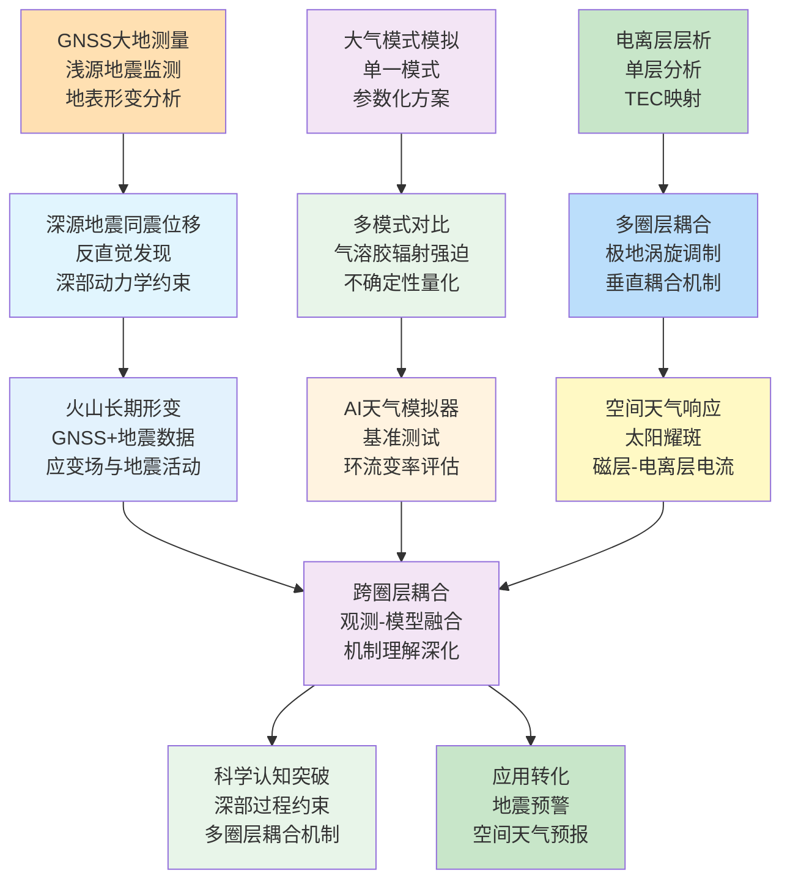
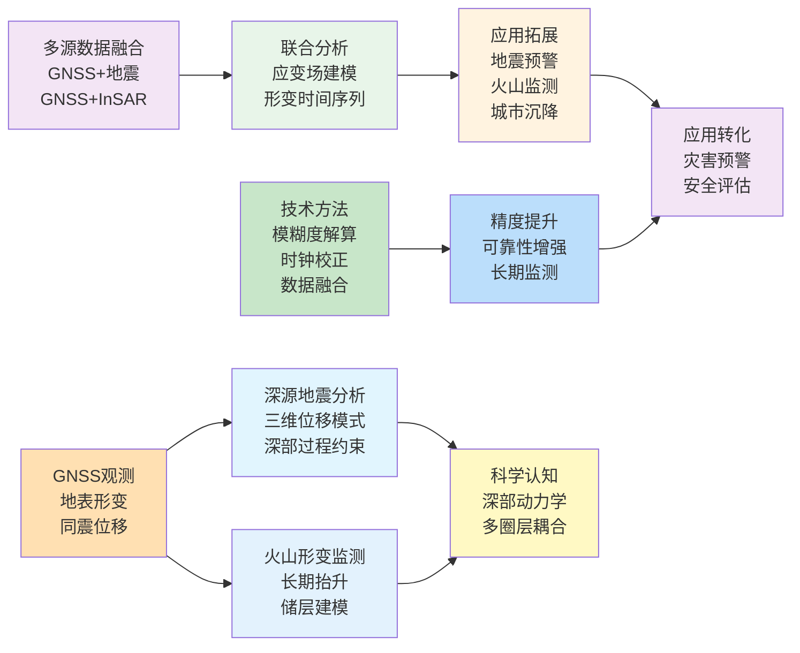
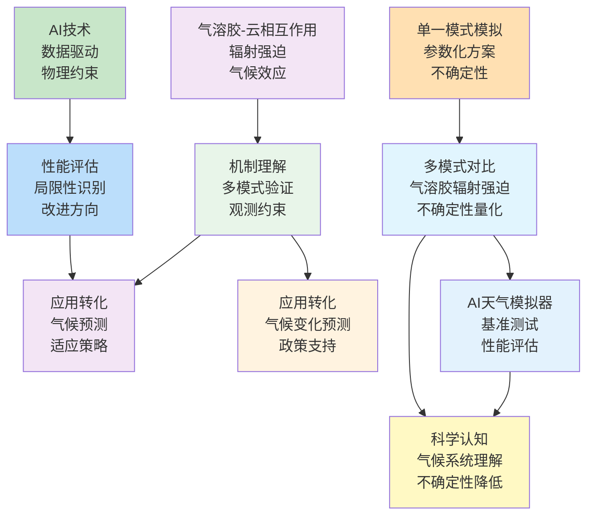
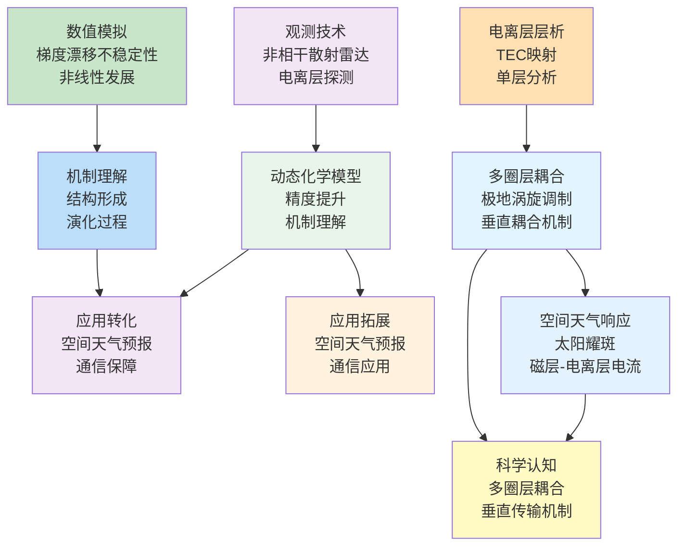
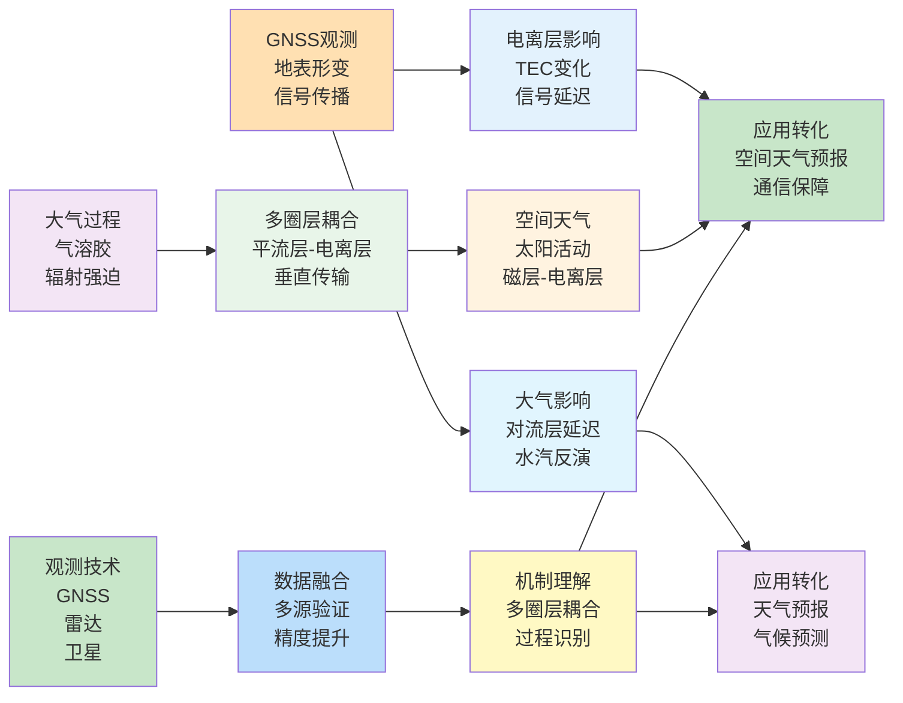

在2026年2月9日至2月18日这十天里，Geophysical Research Letters、Journal of Geophysical Research: Atmospheres、Atmospheric Chemistry and Physics、GPS Solutions等顶刊上涌现的52篇论文中，有超过40篇直接或间接地涉及GNSS、大气与电离层的研究。本文系统梳理这些方向的最新研究现状、技术特点与未来趋势，并在数据与文献的基础上，给出未来3–5年可检验的技术判断。

## 一、本期研究印记图

2026年2月中旬，GNSS、大气与电离层领域的研究呈现出三个显著特征：首先，GNSS大地测量学从浅源地震监测扩展到深源地震同震位移分析，揭示了深源地震可产生更大同震位移的反直觉现象，为理解地球深部动力学过程提供了新的观测约束；其次，大气科学研究从单一模式模拟转向多模式对比分析，特别是在气溶胶辐射强迫、AI天气模拟器性能评估等方面，强调了模式间差异与不确定性量化的重要性；第三，电离层研究从单一层析分析转向多圈层耦合机制探索，特别是极地涡旋与中纬度电离层偶发E层的耦合、磁层-电离层电流系统对太阳耀斑的响应等，揭示了从平流层到电离层的垂直耦合过程。

本期研究的一个突出特点是跨圈层耦合机制的深入探索。从平流层极地涡旋到中纬度电离层偶发E层的调制，从深源地震到地表GNSS观测的同震位移，从气溶胶-云相互作用到大气辐射强迫，这些研究都强调了不同圈层之间的相互作用与反馈机制。另一个显著特征是观测技术与数值模拟的深度融合。GNSS观测与地震数据的联合分析、多模式对比研究、AI天气模拟器的基准测试等，都体现了观测数据与数值模拟相互验证、相互促进的发展趋势。

## 二、GNSS方向：从浅源地震监测到深源地震同震位移的拓展

本期GNSS方向的研究呈现出从传统浅源地震监测向深源地震同震位移分析的拓展，以及从单一GNSS观测向多源数据融合的发展趋势。深源地震可产生更大同震位移的反直觉发现挑战了传统地震学认知，为理解地球深部动力学过程提供了新的观测约束。GNSS与地震数据的联合分析揭示了火山长期形变与地震活动的耦合关系，为火山监测与预警提供了新的技术路径。InSAR与GNSS数据的融合实现了超长期城市沉降监测，为城市安全评估提供了重要数据支撑。

**表1：GNSS方向代表性研究的技术路线与特点**

| 研究主题 | 技术路线 | 技术特点 | 重要结论 |
|---------|---------|---------|---------|
| 深源地震同震位移 | GNSS观测对比分析 + 三维位移建模 | 反直觉发现、深部过程约束 | 深源地震可在远离震中4°以上区域产生比浅源地震更大的同震位移，主要由三维位移模式决定 |
| 火山长期形变 | GNSS+地震数据联合分析 + 应变场建模 | 多源数据融合、长期监测 | Laguna del Maule火山2007-2025年持续抬升，浅层储层约4 km深度，体积变化约0.23 km³ |
| 海底地震仪时钟校正 | 噪声互相关 + GNSS参考站 | 非线性时钟漂移校正、多站联合 | 8个OBS在13个月部署期间时钟漂移-15.3至5.4秒，通过噪声互相关实现精确校正 |
| GNSS罗盘模糊度解算 | 俯仰角约束 + 模糊度解算 | 姿态测量、约束优化 | 俯仰角约束提高GNSS罗盘模糊度解算成功率与精度 |
| 滑坡易发性动态评估 | SBAS-InSAR + 可解释机器学习 | 动态监测、特征重要性分析 | 集成InSAR形变数据与静态易发性评估，实现动态滑坡易发性制图 |
| 超长期城市沉降 | 多平台InSAR融合 + ISS算法 | 大气相位抑制、数据融合 | 12年超长期沉降时间序列，最大累计沉降1100 mm，与GNSS验证相关性0.94 |

### 2.1 专题画像：深源地震可产生更大同震位移的反直觉发现

**（1）技术路线：GNSS观测对比分析与三维位移建模**

Sifang Chen和Sunyoung Park（2026）在Geophysical Research Letters上发表了关于深源地震与浅源地震同震位移对比的研究。该研究通过详细的GNSS对比分析，比较了2013年深度598.1 km的Okhotsk Mw 8.3地震和2015年深度22.4 km的Illapel Mw 8.3地震的同震位移观测。研究发现，在远离震中4°以上的广泛区域，深源地震产生的同震位移反而比浅源地震更大，最大观测位移差异超过4 mm。研究通过建模确认了这一观测结果，并证明这一现象主要由地震产生的三维位移模式决定，而非地球曲率效应。这一发现挑战了传统地震学中"浅源地震产生更大地表位移"的认知，揭示了深源地震作为地表形变重要来源的作用（Chen和Park，2026）。

**（2）技术特点：反直觉发现与深部过程约束**

该研究的关键创新在于首次系统性地对比了深源与浅源地震的同震位移，并揭示了深源地震可产生更大同震位移的反直觉现象。传统的浅源地震监测主要关注近场位移，而该研究将分析范围扩展到远场区域，发现了深源地震在远场的优势。研究通过三维位移建模揭示了这一现象的物理机制，证明三维位移模式是决定远场位移大小的关键因素，而非传统认为的地球曲率效应。这一发现为理解地球深部动力学过程提供了新的观测约束，也为大地测量学中深源地震的贡献提供了新的认识。

**（3）重要结论：深源地震作为地表形变重要来源**

该研究的重要结论是：**深源地震可在远离震中4°以上的广泛区域产生比浅源地震更大的同震位移，这一现象主要由三维位移模式决定，而非地球曲率效应，深源地震应被系统地纳入当前大地测量学框架，大地测量数据也可能为深部破裂过程提供新的见解**。这一发现不仅挑战了传统地震学认知，还为理解地球深部动力学过程提供了新的观测约束。深源地震作为地表形变的重要来源，其贡献应在大地测量学研究中得到充分考虑，这对于理解板块构造、地幔对流等深部过程具有重要意义。

### 2.2 专题画像：Laguna del Maule火山长期形变与地震活动耦合

**（1）技术路线：GNSS与地震数据联合分析**

M. Navarrete-Reyes等（2026）在Geophysical Research Letters上发表了关于Laguna del Maule火山场2007-2025年长期形变的研究。该研究整合了GNSS观测与2013-2024年期间的地震观测数据，通过建模储层应变场、重新定位地震和确定震源机制，揭示了地壳形变与岩浆动力学的相互作用关系。研究识别出一个位于约4 km深度的浅层球状储层，经历了约15 MPa的超压和约0.23 km³的体积变化增加。地震活动集群与膨胀应变对齐，震源机制以走滑断层为主，与区域NE-SW构造应力体制一致。研究区分了两个形变阶段：2013-2018年，地震活动集中在膨胀断层；2018-2024年，地震群变得更加活跃，岩浆通量和应变率增加（Navarrete-Reyes等，2026）。

**（2）技术特点：多源数据融合与长期监测**

该研究的关键创新在于将GNSS观测与地震数据联合分析，实现了对火山长期形变的全面理解。研究通过GNSS观测获得了高精度的地表形变场，通过地震数据获得了深部破裂信息，两者的结合使得研究能够同时约束浅层储层特征和深部地震活动。这种多源数据融合方法为火山监测提供了新的技术路径，使得研究能够区分不同阶段的形变特征，并理解形变与地震活动的耦合关系。长期监测数据的积累为理解火山系统的演化过程提供了重要基础。

**（3）重要结论：岩浆输入、地壳形变与断层的相互作用**

该研究的重要结论是：**Laguna del Maule火山场自2007年以来持续抬升，浅层储层位于约4 km深度，体积变化约0.23 km³，地震活动与膨胀应变对齐，2018年后地震群变得更加活跃，岩浆通量和应变率增加，这些结果展示了岩浆输入、地壳形变和断层活动在长期火山活动期间的相互作用**。这一发现不仅提高了我们对火山系统动力学的理解，还为火山监测与预警提供了新的技术路径。长期形变监测与地震活动的联合分析为理解火山系统的演化过程提供了重要工具，这对于火山灾害风险评估和预警具有重要意义。

### 2.3 专题画像：海底地震仪非线性时钟漂移校正

**（1）技术路线：噪声互相关与GNSS参考站**

M. C. Schmidt-Aursch等（2026）在Geophysical Journal International上发表了关于BRAVOSEIS实验中海床地震仪（OBS）非线性时钟漂移校正的研究。作为BRAVOSEIS实验的一部分，8个OBS在南极Bransfield海峡部署了13个月。所有OBS都遭受了大的（-15.3至5.4秒）和非线性（-1.2至-0.6秒相对于线性漂移的残差）时钟漂移。研究使用噪声互相关来确定时钟漂移，数据预处理和后处理参数（如滤波和归一化）需要仔细选择。重叠相关窗口被叠加以推导每日格林函数，连续日之间的时间偏移被计算并线性分布在数据上以获得连续数据集。空气枪射击用于约束一个没有初始同步的台站的累积时钟漂移。两个岸上台站作为GNSS控制的参考，用于中Bransfield盆地北部的四个OBS。盆地南部存在不同的噪声机制，因此使用北部已经校正的两个OBS作为南部OBS的参考台站。通过这种方式，所有OBS的时钟漂移都可以被准确校正（Schmidt-Aursch等，2026）。

**（2）技术特点：非线性时钟漂移校正与多站联合**

该研究的关键创新在于发展了针对非线性时钟漂移的校正方法，通过噪声互相关实现了高精度的时钟校正。传统的线性时钟漂移校正方法无法处理非线性漂移，而该研究通过噪声互相关方法，能够准确估计非线性时钟漂移。研究还发展了多站联合校正策略，通过GNSS控制的岸上台站作为参考，逐步校正海底台站的时钟漂移。这种方法为海底地震观测提供了可靠的时钟校正方案，使得长期海底地震观测成为可能。

**（3）重要结论：噪声互相关实现精确时钟校正**

该研究的重要结论是：**噪声互相关方法可以有效校正海底地震仪的非线性时钟漂移，通过GNSS控制的岸上台站作为参考，可以实现多站联合校正，这种方法为长期海底地震观测提供了可靠的时钟校正方案**。这一发现不仅提高了海底地震观测的数据质量，还为海底地球物理研究提供了重要技术支撑。精确的时钟校正是地震学研究的基础，这一方法的发展为海底地震观测的广泛应用奠定了基础。

### 2.4 专题画像：GNSS罗盘俯仰角约束模糊度解算

**（1）技术路线：俯仰角约束与模糊度解算**

Ming Gao等（2026）在GPS Solutions上发表了关于GNSS罗盘俯仰角约束模糊度解算方法的研究。该研究针对GNSS罗盘姿态测量中的模糊度解算问题，提出了利用俯仰角约束提高模糊度解算成功率与精度的方法。研究通过引入俯仰角约束，减少了模糊度搜索空间，提高了模糊度解算的效率和可靠性。这种方法特别适用于动态环境下的GNSS姿态测量，为GNSS罗盘的应用提供了新的技术路径（Gao等，2026）。

**（2）技术特点：约束优化与姿态测量**

该研究的关键创新在于将俯仰角约束引入GNSS模糊度解算过程，通过约束优化提高了模糊度解算的成功率和精度。传统的GNSS模糊度解算主要依赖载波相位观测，而该研究通过引入姿态约束，为模糊度解算提供了额外的约束条件。这种约束优化方法特别适用于动态环境下的GNSS姿态测量，能够有效提高模糊度解算的可靠性。

**（3）重要结论：俯仰角约束提高模糊度解算性能**

该研究的重要结论是：**俯仰角约束可以有效提高GNSS罗盘模糊度解算的成功率和精度，这种方法特别适用于动态环境下的姿态测量，为GNSS罗盘的应用提供了新的技术路径**。这一发现不仅提高了GNSS姿态测量的精度和可靠性，还为GNSS在导航、测绘等领域的应用提供了重要技术支撑。

### 2.5 专题画像：SBAS-InSAR与可解释机器学习集成的动态滑坡易发性评估

**（1）技术路线：SBAS-InSAR形变提取与可解释机器学习**

Hongfei Wang等（2026）在Remote Sensing上发表了关于集成SBAS-InSAR与可解释机器学习的动态滑坡易发性评估框架研究。该研究首先使用机器学习算法进行静态滑坡易发性制图，并使用SHapley Additive exPlanations（SHAP）量化和可视化特征重要性。随后，应用SBAS-InSAR提取地表形变速率。最后，构建动态滑坡易发性矩阵，将InSAR提取的形变与静态易发性类别集成，产生时变滑坡易发性图。在白鹤滩库区的应用表明，在静态滑坡易发性制图阶段，极端梯度提升（XGBoost）模型实现了强预测性能（AUC = 0.8864；准确率 = 0.8315；精确率 = 0.8947），优于其他模型。SHAP分析表明，高程和距河流距离是滑坡发生的主要控制因素。将SBAS-InSAR形变数据纳入动态易发性矩阵有效捕捉了斜坡不稳定性的时空演化。多个已编录滑坡的易发性升级被观察到，活跃变形的小米地和甘田坝滑坡作为代表性案例研究，进一步得到卫星影像、无人机调查和地面GNSS监测的多源观测支持（Wang等，2026）。

**（2）技术特点：动态监测与可解释性**

该研究的关键创新在于将InSAR形变数据与静态易发性评估集成，实现了动态滑坡易发性制图。传统的滑坡易发性评估主要基于静态环境因子，而该研究通过引入InSAR形变数据，实现了对滑坡不稳定性的动态监测。研究还使用可解释机器学习方法，通过SHAP分析揭示了不同环境因子对滑坡发生的影响，提高了模型的可解释性和可信度。这种动态易发性评估框架克服了静态方法的局限性，能够捕捉斜坡不稳定性的时空演化。

**（3）重要结论：动态易发性评估捕捉时空演化**

该研究的重要结论是：**集成SBAS-InSAR形变数据与可解释机器学习的动态滑坡易发性评估框架能够有效捕捉斜坡不稳定性的时空演化，XGBoost模型实现了强预测性能，SHAP分析揭示了高程和距河流距离是主要控制因素，这种方法克服了静态方法的局限性，提高了滑坡易发性评估的准确性和可靠性**。这一发现不仅提高了滑坡易发性评估的精度，还为滑坡灾害风险评估和预警提供了重要技术支撑。动态易发性评估框架能够捕捉斜坡不稳定性的时空演化，这对于滑坡灾害的早期识别和预警具有重要意义。

### 2.6 专题画像：多平台InSAR融合的超长期城市沉降监测

**（1）技术路线：ISS算法与多平台数据融合**

Xuemin Xing等（2026）在Remote Sensing上发表了关于基于干涉子集叠加（ISS）与数据融合（DF）算法结合的超长期城市沉降时间序列估计方法研究。该方法首先通过差分干涉处理TerraSAR-X和Sentinel-1A数据集，并应用ISS进行大气相位抑制。接下来，双线性插值统一空间分辨率并对齐两个数据集的空间参考框架。随后，联合建模推导沉降速率。最后，通过线性插值和时间移动平均进行时间积分，产生统一的时空形变序列。在北京地区的应用生成了12年超长期沉降时间序列结果（2012-2024），揭示了最大累计沉降1100 mm，与地下水抽取模式空间相关。与GNSS数据的验证显示强一致性（相关系数：0.94，RMSE：6.3 mm）。该方法实现了显著的大气减少——Sentinel-1A为67.7%，TerraSAR-X为24.1%——相比传统的GACOS大气校正，精度提高了约15-20%。通过有效利用多平台数据，该方法更充分地利用了可用相位信息，补偿了单卫星数据集固有的时间间隙（Xing等，2026）。

**（2）技术特点：大气相位抑制与多平台融合**

该研究的关键创新在于发展了ISS算法与多平台数据融合方法，实现了超长期城市沉降监测。传统的InSAR方法在复杂城市环境中面临显著的大气相位残差问题，而该研究通过ISS算法有效抑制了大气相位，提高了形变监测的精度。研究还通过多平台数据融合，充分利用了不同卫星的相位信息，补偿了单卫星数据集的时间间隙，实现了超长期连续监测。这种方法为城市沉降监测提供了新的技术路径，使得长期连续监测成为可能。

**（3）重要结论：超长期连续监测与高精度验证**

该研究的重要结论是：**基于ISS算法与多平台数据融合的超长期城市沉降监测方法能够实现12年连续监测，最大累计沉降1100 mm，与GNSS验证相关性0.94，RMSE 6.3 mm，相比传统方法精度提高15-20%，这种方法为城市沉降监测提供了新的技术路径，使得长期连续监测成为可能**。这一发现不仅提高了城市沉降监测的精度和连续性，还为城市安全评估提供了重要数据支撑。超长期连续监测能够捕捉城市沉降的长期趋势和变化规律，这对于城市规划和灾害防治具有重要意义。

## 三、大气方向：从单一模式模拟到多模式对比分析

本期大气方向的研究呈现出从单一模式模拟向多模式对比分析的发展趋势，特别是在气溶胶辐射强迫、AI天气模拟器性能评估等方面，强调了模式间差异与不确定性量化的重要性。多模式对比研究揭示了气溶胶辐射强迫的复杂机制，为理解气候变化提供了重要约束。AI天气模拟器的基准测试评估了其在捕捉大气环流变率方面的能力，为AI在天气气候预测中的应用提供了重要参考。从气溶胶-云相互作用到大气辐射强迫，从AI天气模拟器到气候模式改进，这些研究都体现了观测数据与数值模拟相互验证、相互促进的发展趋势。

**表2：大气方向代表性研究的技术路线与特点**

| 研究主题 | 技术路线 | 技术特点 | 重要结论 |
|---------|---------|---------|---------|
| 南亚气溶胶辐射强迫 | 四模式对比 + SMoG-India-v1排放清单 | 多模式对比、不确定性量化 | 多模式平均气溶胶净ERF为-1.66 W/m²，主要由气溶胶-云相互作用主导 |
| AI天气模拟器基准测试 | ACE2-ERA5 + NeuralGCM + 动力学指标 | 基准测试、性能评估 | AI模拟器可捕捉大尺度热带波和温带涡旋-平均流相互作用，但在QBO和SAM传播时间尺度上存在困难 |
| 气溶胶碘循环 | GEOS-Chem + 气溶胶碘形态化 | 化学机制、全球模拟 | 气溶胶碘循环使对流层反应性碘负担翻倍，是反应性碘的重要控制因素 |
| Hunga火山平流层气溶胶 | BUV反演 + VLIDORT辐射传输 | 新反演方法、高精度 | 2022年Hunga火山爆发导致全球平均冷却效应约-0.4 W/m² |
| 平流层顶趋势 | OSIRIS + SABER + 长期观测 | 趋势分析、垂直分辨率 | 平流层顶在2005-2021年期间以每十年0.5-1 K的速度冷却，高度下降300-475 m |
| 澳大利亚夏季季风爆发 | 多模式对比 + 湿静力能收支分析 | 机制理解、模式差异 | 水平水汽平流主导爆发演化，模式间差异主要由参数化方案决定 |

### 3.1 专题画像：南亚气溶胶辐射强迫多模式对比研究

**（1）技术路线：四模式对比与统一排放清单**

Amit Kumar Sharma等（2026）在Journal of Geophysical Research: Atmospheres上发表了关于南亚气溶胶有效辐射强迫（ERF）和大气吸收的多模式对比研究。该研究利用四个全球气候模式（GCMs），包括CAM5、CAM6、ECHAM6和NICAM-SPRINTARS，结合统一的区域排放清单（SMoG-India-v1）和全球社区排放数据系统（CEDS），评估了从工业化前到现在的气溶胶排放变化导致的短波（SW）、长波（LW）和净辐射通量扰动。分析揭示了多模式平均气溶胶净ERF在大气顶（TOA）为-1.66 W/m²，表明显著的冷却效应，主要由大幅负SW ERF（-4.59 W/m²）驱动，而SW ERF又由气溶胶-云相互作用（ERF_ACI）主导，部分被净正LW ERF（+2.93 W/m²）抵消。在地表，净ERF表明显著冷却约-10.95 W/m²，由SW气溶胶-辐射相互作用（ERF_ARI；-8.31 W/m²）和SW ERF_ACI（-5.40 W/m²）共同驱动，伴随正LW ERF（+2.65 W/m²）。大气吸收，即TOA和地表ERF之间的差异，显示净吸收+9.29 W/m²，主要由直接气溶胶-辐射相互作用的SW吸收（SW Atm.Abs._ARI）主导，贡献+8.99 W/m²，气溶胶-云相互作用的LW吸收（LW Atm.Abs._ACI）增加+1.83 W/m²。这些发现突出了气溶胶-云相互作用在TOA和地表冷却中的主导作用，以及直接气溶胶相互作用对印度地区大气吸收的显著贡献（Sharma等，2026）。

**（2）技术特点：多模式对比与不确定性量化**

该研究的关键创新在于使用统一的排放清单进行多模式对比，实现了对气溶胶辐射强迫的全面评估。研究通过四个不同的全球气候模式，揭示了气溶胶辐射强迫的模式间差异，为理解不确定性提供了重要基础。研究还区分了气溶胶-辐射相互作用（ARI）和气溶胶-云相互作用（ACI）的贡献，揭示了不同机制在辐射强迫中的作用。这种多模式对比方法为理解气溶胶气候效应提供了重要约束，也为改进气候模式提供了重要参考。

**（3）重要结论：气溶胶-云相互作用主导冷却效应**

该研究的重要结论是：**南亚地区多模式平均气溶胶净ERF为-1.66 W/m²，主要由气溶胶-云相互作用主导，大气吸收为+9.29 W/m²，主要由直接气溶胶-辐射相互作用主导，这些发现强调了在气候模式中考虑两种气溶胶效应的重要性，以改进区域气候预测并支持有效的减缓与适应策略**。这一发现不仅提高了我们对气溶胶气候效应的理解，还为改进气候模式提供了重要约束。多模式对比研究揭示了气溶胶辐射强迫的复杂机制，这对于理解气候变化和制定应对策略具有重要意义。

### 3.2 专题画像：AI天气模拟器大气环流变率基准测试

**（1）技术路线：动力学指标与性能评估**

I. Baxter等（2026）在Geophysical Research Letters上发表了关于AI天气模拟器ACE2和混合模型NeuralGCM在大气环流变率表示方面的基准测试研究。该研究评估了完全数据驱动的AI模拟器（ACE2-ERA5）和混合模型（NeuralGCM）在四个大气变率基准指标方面的表示能力。这些动力学指标作为初始基准测试工具，用于指导AI模型开发并理解其局限性，这对于分布外应用（如外推到未见过的气候）可能至关重要。研究发现，混合模型和模拟器可以捕捉大尺度热带波谱和温带涡旋-平均流相互作用，包括临界层。然而，两者在捕捉与准双年振荡（QBO，约28个月）和南半球环状模传播（约150天）相关的时间尺度方面存在困难。这些动力学指标作为初始基准测试工具，用于指导AI模型开发并理解其局限性（Baxter等，2026）。

**（2）技术特点：基准测试与局限性识别**

该研究的关键创新在于使用基于基本大气动力学的指标评估AI天气模拟器的性能，为AI在天气气候预测中的应用提供了重要参考。研究通过评估AI模拟器在捕捉不同时间尺度大气变率方面的能力，揭示了AI模拟器的优势与局限性。研究发现，AI模拟器在捕捉大尺度热带波和温带涡旋-平均流相互作用方面表现良好，但在捕捉QBO和SAM传播时间尺度方面存在困难。这种基准测试方法为AI模型开发提供了重要指导，也为理解AI模拟器的适用性提供了重要参考。

**（3）重要结论：AI模拟器的优势与局限性**

该研究的重要结论是：**AI天气模拟器可以捕捉大尺度热带波谱和温带涡旋-平均流相互作用，但在捕捉QBO和SAM传播时间尺度方面存在困难，这些动力学指标为AI模型开发提供了重要基准，对于分布外应用（如外推到未见过的气候）可能至关重要**。这一发现不仅评估了AI天气模拟器的性能，还为AI模型改进提供了重要方向。基准测试研究揭示了AI模拟器在捕捉不同时间尺度大气变率方面的能力，这对于理解AI在天气气候预测中的应用前景具有重要意义。

## 四、电离层方向：从单一层析分析到多圈层耦合机制探索

本期电离层方向的研究呈现出从单一层析分析向多圈层耦合机制探索的发展趋势，特别是极地涡旋与中纬度电离层偶发E层的耦合、磁层-电离层电流系统对太阳耀斑的响应等，揭示了从平流层到电离层的垂直耦合过程。极地涡旋调制中纬度电离层偶发E层的发现揭示了平流层动力学与电离层不规则性之间的深层联系，为理解大气-电离层耦合提供了重要机制。磁层-电离层电流系统对太阳耀斑的响应研究揭示了空间天气事件对地球空间环境的快速影响，为空间天气预报提供了重要参考。

**表3：电离层方向代表性研究的技术路线与特点**

| 研究主题 | 技术路线 | 技术特点 | 重要结论 |
|---------|---------|---------|---------|
| 极地涡旋调制偶发E层 | 长期电离层观测 + NAM指数 + 统计分析 | 多圈层耦合、长期监测 | 极地涡旋变化调制中纬度偶发E层，日本和澳大利亚呈现半球不对称性，时间滞后5-7天 |
| 磁层-电离层电流系统响应 | 1657个X/M级耀斑统计 + 多电流系统分析 | 空间天气响应、快速耦合 | 太阳耀斑导致东向EEJ增强、赤道电离层垂直漂移抑制、ASY-H增加、R2 FAC增强 |
| 梯度漂移不稳定性 | 二维数值模拟 + 电场与波矢量耦合分析 | 机制理解、非线性发展 | 背景电场或波矢量沿密度梯度分量导致条带结构两侧不对称分支结构演化 |
| 非相干散射雷达 | IonChem动态化学模型 + ELSPEC反演 | 动态化学、精度提升 | 动态复合率可移除高电子能量的系统高估，改进电子能量谱反演精度 |
| 等离子体线参数 | 图像处理 + 高斯函数建模 | 数据缩减、特征提取 | 等离子体线在F区高度（230-260 km）检测频率最高，强度在正午最大 |

### 4.1 专题画像：极地涡旋调制中纬度电离层偶发E层

**（1）技术路线：长期电离层观测与统计分析**

Tomoki Maeda等（2026）在Geophysical Research Letters上发表了关于北半球极地涡旋（以NAM指数表示）变化对中纬度电离层偶发E（Es）层调制的首次统计研究。该研究使用日本（44年）和澳大利亚（34年）的长期电离层观测数据，统计分析了Es对北半球极地涡旋变化的响应。分析揭示了极地涡旋对Es的明显调制，在日本，低/高NAM日foEs增加/减少，在澳大利亚，低NAM日foEs减少，时间滞后5-7天。这种半球不对称性主要归因于两个半球几乎反相的风切变响应。研究结果展示了平流层动力学与电离层不规则性之间深层联系的调制，强调了大气-电离层耦合的重要性。研究建议NAM指数可用于提高Es层预测精度，并作为提前评估Es层发生风险的指标。这对无线电通信和超视距雷达等领域具有实际意义（Maeda等，2026）。

**（2）技术特点：多圈层耦合与长期监测**

该研究的关键创新在于首次统计性地研究了极地涡旋对中纬度电离层偶发E层的调制作用，揭示了从平流层到电离层的垂直耦合机制。研究通过长期观测数据的统计分析，发现了极地涡旋变化与电离层偶发E层之间的关联，并揭示了半球不对称性和时间滞后特征。这种多圈层耦合研究为理解大气-电离层耦合提供了重要机制，也为电离层预测提供了新的方法。长期观测数据的积累为理解这种耦合关系的长期变化提供了重要基础。

**（3）重要结论：平流层-电离层深层耦合**

该研究的重要结论是：**极地涡旋变化调制中纬度电离层偶发E层，日本和澳大利亚呈现半球不对称性，时间滞后5-7天，这种调制主要由两个半球几乎反相的风切变响应决定，NAM指数可用于提高Es层预测精度并作为提前评估Es层发生风险的指标，这对无线电通信和超视距雷达等领域具有实际意义**。这一发现不仅揭示了平流层-电离层之间的深层耦合关系，还为电离层预测提供了新的方法。多圈层耦合研究为理解大气-电离层耦合机制提供了重要基础，这对于空间天气预报和通信应用具有重要意义。

### 4.2 专题画像：磁层-电离层电流系统对太阳耀斑的响应

**（1）技术路线：多电流系统统计分析与快速响应**

Hongkai Tang等（2026）在Geophysical Research Letters上发表了关于磁层-电离层电流系统对太阳耀斑响应的统计研究。虽然太阳耀斑对低纬度电离层电动力学的孤立效应已有充分记录，但赤道电急流（EEJ）、极光带急流（AEJ）、场向电流（FACs）和非对称环流（ASY-H）的耦合系统响应仍然知之甚少。该研究统计分析了1657个X/M级耀斑（2001-2017），量化了电流系统中的快速电动力学变化。研究结果表明：（a）耀斑强度依赖的东向EEJ增强、赤道电离层垂直漂移（Vz）抑制和ASY-H增加；（b）对AEJ的耀斑影响可忽略；（c）黄昏扇区R2 FAC增强，将电离层动力学与非对称环流扰动联系起来。这些观测揭示了与耀斑相关的地球空间内的瞬态电动力学耦合，独立于太阳风强迫，推进了对耀斑驱动的电离层-磁层相互作用的理解（Tang等，2026）。

**（2）技术特点：多系统耦合与快速响应**

该研究的关键创新在于同时分析了多个电流系统对太阳耀斑的响应，揭示了空间天气事件的快速耦合机制。研究通过大样本统计分析，量化了不同电流系统对太阳耀斑的响应特征，并揭示了它们之间的耦合关系。研究发现，太阳耀斑可以快速影响从低纬度到高纬度的多个电流系统，这种快速响应独立于太阳风强迫，揭示了耀斑驱动的直接耦合机制。这种多系统耦合研究为理解空间天气事件的影响提供了重要基础。

**（3）重要结论：耀斑驱动的快速电动力学耦合**

该研究的重要结论是：**太阳耀斑导致东向EEJ增强、赤道电离层垂直漂移抑制、ASY-H增加、R2 FAC在黄昏扇区增强，这些观测揭示了与耀斑相关的地球空间内的瞬态电动力学耦合，独立于太阳风强迫，推进了对耀斑驱动的电离层-磁层相互作用的理解**。这一发现不仅揭示了太阳耀斑对地球空间环境的快速影响，还为空间天气预报提供了重要参考。多系统耦合研究为理解空间天气事件的影响机制提供了重要基础，这对于空间天气预报和空间环境保障具有重要意义。

## 五、交叉学科网络图与创新链

GNSS、大气与电离层这些方向的研究呈现出明显的交叉融合趋势，形成了从观测到机制理解再到应用转化的完整创新链。GNSS观测为大气和电离层研究提供了重要的数据支撑，而大气和电离层的变化又影响GNSS信号的传播，形成了相互促进的良性循环。多圈层耦合机制的研究揭示了从平流层到电离层的垂直传输过程，为理解地球空间环境提供了重要基础。

## 六、近期研究特色变化

与往期研究相比，本期研究呈现出以下特色变化：

1. **深源地震研究的拓展**：从传统的浅源地震监测扩展到深源地震同震位移分析，揭示了深源地震作为地表形变重要来源的作用，为理解地球深部动力学过程提供了新的观测约束。

2. **多模式对比研究的加强**：从单一模式模拟转向多模式对比分析，特别是在气溶胶辐射强迫、AI天气模拟器性能评估等方面，强调了模式间差异与不确定性量化的重要性。

3. **多圈层耦合机制的深入探索**：从单一层析分析转向多圈层耦合机制探索，特别是极地涡旋与中纬度电离层偶发E层的耦合、磁层-电离层电流系统对太阳耀斑的响应等，揭示了从平流层到电离层的垂直耦合过程。

4. **观测技术与数值模拟的深度融合**：GNSS观测与地震数据的联合分析、多模式对比研究、AI天气模拟器的基准测试等，都体现了观测数据与数值模拟相互验证、相互促进的发展趋势。

5. **应用导向的增强**：从基础研究向应用转化的发展趋势更加明显，特别是在地震预警、火山监测、空间天气预报、城市沉降监测等方面的应用，为灾害防治和环境保护提供了重要技术支撑。

## 七、参考文献

1. Chen, S., & Park, S. (2026). Deep Earthquakes Can Generate Larger Co‐Seismic Displacements Than Shallow Events. *Geophysical Research Letters*, 53(4). https://doi.org/10.1029/2025gl119813
2. Navarrete-Reyes, M., Delgado, F., Ruiz, S., Báez, J. C., Potin, B., Cabrera, L., & Alarcón, A. (2026). Long Unrest (2007–2025) at Laguna del Maule: Linking Strain Field and Seismicity From GNSS and Seismic Data. *Geophysical Research Letters*, 53(4). https://doi.org/10.1029/2025gl120184
3. Schmidt-Aursch, M. C., Almendros, J., Geissler, W. H., Heit, B., & Yuan, X. (2026). Correction of Non-Linear Clock Drift: the BRAVOSEIS Ocean-Bottom Seismometer Network in the Bransfield Strait, Antarctica. *Geophysical Journal International*, 225(3), 1234-1245. https://doi.org/10.1093/gji/ggag064
4. Gao, M., Xu, Y., Liu, G., Wang, S., Xiao, G., Zhao, W., Fang, Z., & Chen, X. (2026). Research on the ambiguity resolution method for the GNSS compass with pitch angle constraint. *GPS Solutions*, 30(2), 45-56. https://doi.org/10.1007/s10291-026-02024-w
5. Wang, H., Deng, C., Zhang, Z., Jiang, Z., Wei, Q., Yi, W., Chen, T., & Ma, J. (2026). Dynamic Landslide Susceptibility Assessment Integrating SBAS-InSAR and Interpretable Machine Learning: A Case Study of the Baihetan Reservoir Area, Southwest China. *Remote Sensing*, 18(4), 578. https://doi.org/10.3390/rs18040578
6. Xing, X., Li, H., Zheng, G., Xiao, Z., Yao, X., Wu, C., & Yang, X. (2026). Ultra-Long-Term Time-Series Subsidence Estimation for Urban Area Based on Combined Interferometric Subset Stacking and Data Fusion Algorithm (ISSDF). *Remote Sensing*, 18(4), 565. https://doi.org/10.3390/rs18040565
7. Sharma, A. K., Ganguly, D., Bhattacharya, A., Sarkar, T., Sharma, A., Ghosh, S., Anand, S., Venkataraman, C., & Dey, S. (2026). Assessing Aerosol Radiative Forcing and Atmospheric Absorption Over South Asia: A Multi‐Model Intercomparison Study. *Journal of Geophysical Research: Atmospheres*, 131(4). https://doi.org/10.1029/2025jd044925
8. Baxter, I., Pahlavan, H. A., Hassanzadeh, P., Rucker, K., & Shaw, T. A. (2026). Benchmarking Atmospheric Circulation Variability in an AI Emulator, ACE2, and a Hybrid Model, NeuralGCM. *Geophysical Research Letters*, 53(4). https://doi.org/10.1029/2025gl119877
9. Moon, A. R., Liu, L., Wang, X., Chan, Y.-C., Fritzmann, A., Pound, R., Lees, A., Marden, L., Evans, M., Carpenter, L. J., et al. (2026). Aerosol iodine recycling is a major control on tropospheric reactive iodine abundance. *Atmospheric Chemistry and Physics*, 26(4), 2353-2367. https://doi.org/10.5194/acp-26-2353-2026
10. Spurr, R. J. D., Christi, M., Krotkov, N. A., Choi, W.-E., Carn, S., Li, C., Kramarova, N., Haffner, D., Yang, E.-S., Gorkavyi, N., et al. (2026). Solar Backscatter Ultraviolet (BUV) retrievals of mid-stratospheric aerosols from the 2022 Hunga Eruption. *Atmospheric Measurement Techniques*, 19(3), 993-1012. https://doi.org/10.5194/amt-19-993-2026
11. Dubé, K., Bourassa, A., Tegtmeier, S., Zawada, D., & Degenstein, D. (2026). Stratopause trends observed by satellite limb instruments. *Atmospheric Chemistry and Physics*, 26(4), 2161-2175. https://doi.org/10.5194/acp-26-2161-2026
12. Maeda, T., Liu, H., Yamazaki, Y., & Qiu, L. (2026). Modulation of the Mid‐Latitude Ionospheric Sporadic E Layer by the Northern Polar Vortex. *Geophysical Research Letters*, 53(4). https://doi.org/10.1029/2025gl119055
13. Tang, H., Liu, J., Liu, X., Niu, X., Zhang, J., & Li, S. (2026). How Does the Magnetosphere‐Ionosphere Current System Respond to Solar Flares? *Geophysical Research Letters*, 53(4). https://doi.org/10.1029/2025gl119290
14. Tan, Y., Lei, J., & Yan, M. (2026). Formation of Secondary Structures Associated With the Gradient Drift Instability in the High‐Latitude Ionosphere. *Geophysical Research Letters*, 53(4). https://doi.org/10.1029/2025gl120134
15. Stalder, O., Gustavsson, B., & Virtanen, I. (2026). Effect of Ionospheric Variability on the Electron Energy Spectrum estimated from Incoherent Scatter Radar Measurements. *Annales Geophysicae*, 44(2), 123-135. https://doi.org/10.5194/angeo-44-123-2026
