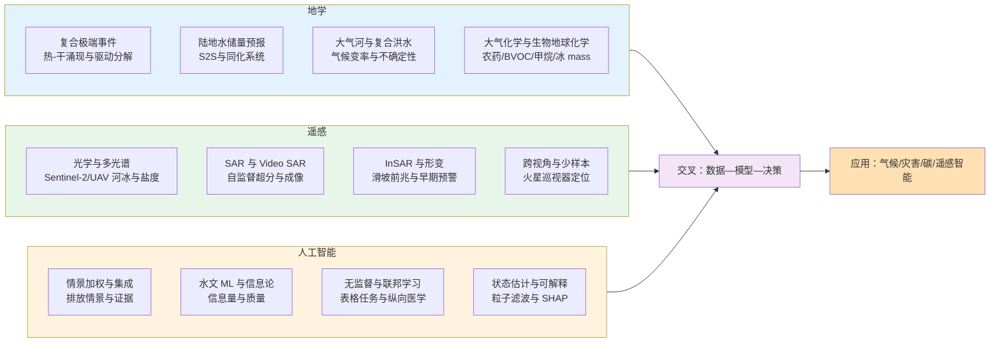
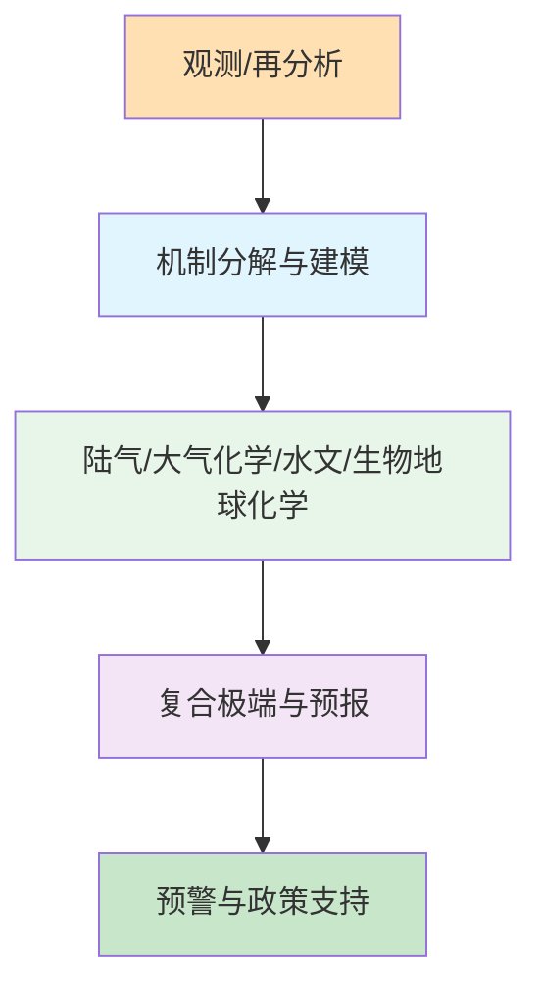
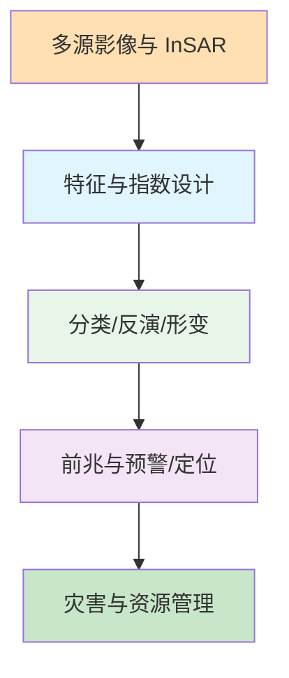
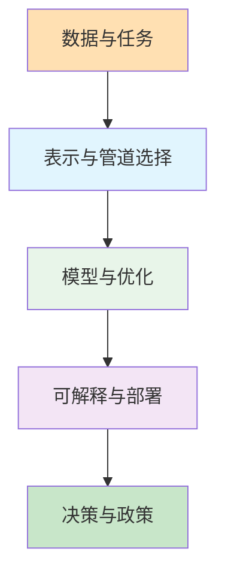
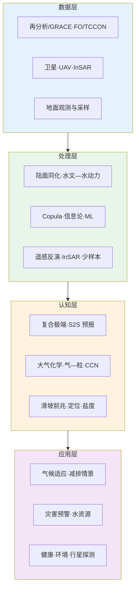

2026年2月18日至24日，Nature、Science、Nature Climate Change、Geophysical Research Letters、Remote Sensing、Hydrology and Earth System Sciences、Atmospheric Chemistry and Physics 等期刊与预印本平台收录的论文中，有大量工作涉及地学、遥感与人工智能的交叉。本文在通读本期论文目录与代表性摘要的基础上，结合领域背景与近期文献，归纳上述方向的研究现状、技术路线与重要结论，并给出可检验的未来趋势判断。

## 一、本期研究印记图

近期地学研究突出欧洲热—干复合极端事件的时空涌现与驱动分解、次季节至季节尺度陆地水储量预报技能、大气河触发的复合洪水与气候变化不确定性、以及农药气—粒分配与青藏高原沙尘/降水垂直结构等；遥感方向则延续多源融合与智能解译主线，从Sentinel-2河冰精细分类、Video SAR自监督超分、UAV多光谱土壤盐度反演、到InSAR滑坡前兆与火星巡视器少样本跨视角定位均有进展；人工智能方向在排放情景加权框架、水文机器学习信息量与质量敏感性、自动化无监督表格任务、去噪粒子滤波与联邦纵向医学报告生成等方面形成热点。本期论文在方法上共同体现“观测/模式—数据驱动—机制解释”的链条，在应用上指向气候适应、灾害预警、碳与水资源管理与智能遥感。

## 二、地学方向

本期地学论文在技术路线上普遍结合再分析或观测数据、物理/化学机制与统计或机器学习方法，在复合极端事件、陆地水储量预报、大气河与复合洪水、大气化学与气溶胶—云凝结核、以及水文与生物地球化学等方面形成清晰主线。技术特点包括：双变量 copula 与边际/依赖分解对复合事件概率涌现的量化、GRACE/FO 与陆面同化系统对 S2S 预报技能的评估、大气河与前期积雪/土壤饱和对复合洪水的触发机制、农药气—粒分配与吸收机制、以及青藏高原沙尘与降水垂直结构的多源观测约束。

**表1：地学方向代表性研究的技术路线与特点**

| 研究主题 | 技术路线 | 技术特点 | 重要结论 |
|---------|---------|---------|---------|
| 欧洲热—干复合事件时空涌现 | ERA5 + 双变量 copula + ToE/PoE | 边际与依赖分解、涌现时间与时段 | 五类区域对比显示边际主导为主，依赖分量对涌现检测仍必要；无依赖会高估或低估 ToE 逾 20 年 |
| S2S 陆地水储量预报技能 | FLDAS + GRACE/FO +  tercile ROC | 双陆面模式、初始场与降水变率敏感性 | CLSM 因再分析初始场与年际变率表征更优，在 1–6 月提前期超过 50% 区域 ROC>0.6；错误持续性会降低技能 |
| 冰下河道流量预报系统 | Delft-FEWS + HOOPLA + HEC-RAS 冰水力学 | 水文—水动力耦合、集合预报 | 冰下流量被低估，与“观测”不确定性和模型状态有关；水力学 RMSE 0.1–0.5 m，受冰厚不确定性影响 |
| 华北平原大气农药气—粒分配 | 同步气/颗粒物采样 + log Kp 与吸收模型 | 温度与湿度对分配的影响 | 颗粒相占大气农药质量 93.4%；吸收为主导机制；log Kp 随温度升高，与理化性质、湿度与相态有关 |
| 大气河触发的复合洪水 | CanRCM4 大集合 + AR 与 ROS/SEF 识别 | 气候变率与人为强迫分离 | AR 是复合内陆洪水的主要驱动；内部气候变率对未来 CIF 频率与强度不确定性贡献显著 |
| TCCON 柱平均 CO2 年增长率 | 12 站 TCCON + MM/FF/DLM 三种方法 | 极夜缺数下 DLM 最稳健 | 区域增长率约 2.33–2.40 ppm/yr；2015–2016 ENSO 使增长率增约 1.7 ppm/yr；2020 年 30–40°N 降约 0.4 ppm/yr |
| 水文 ML 预测精度与信息量/质量 | 信息论（边际/传递熵）+ 三种 ML + 机理模型输出 | 信息量与质量双因子 | 精度依赖训练数据的信息量与质量；天气+校准机理输出可最有效提升精度，体现理论驱动对数据驱动的支撑 |
| 青藏高原沙尘输送日/季变化 | 卫星+再分析+地基 + CATS 激光雷达沙尘质量 | 多源一致性与垂直通量 | 高原南北两侧存在持久沙尘输送带，春季为峰；塔克拉玛干回流垂直变化与量级被量化 |
| α-蒎烯臭氧解 SOA/CCN 过程级模拟 | PyCHAM 近显式化学 + 粒径/成分/κ/CCN | 与观测对比与敏感性 | 中等过饱和度下 κ 与 CCN 与观测一致；低过饱和高估、高过饱和低估；PSD 与 κ 的准确表征对 CCN 预测关键 |
| 拉普捷夫海甲烷循环的生物标志物 | 沉积物 C30 藿烯 δ13C + 16S rRNA | 时间积分的好氧甲烷氧化信号 | 陆架区普遍存在增强甲烷循环，外陆架最强；中陆架也检出低 δ13C，修正了此前“低循环”认识 |
| 排放情景集合加权框架 | 多维加权（相关性/质量/多样性）+ IPCC 情景库 | 机会集合的形式化 | 降低过度代表模型/研究的支配，净零排放里程碑与原报告不同；为“机会集合”评估提供可复现工具 |

### 2.1 专题画像：欧洲热—干复合事件时空涌现与驱动分解

**（1）技术路线**

Schmutz 等（2026）使用 1950–2023 年 ERA5 再分析，研究欧洲与北非热—干复合事件概率的历史变化。两个核心问题是：这些事件概率在何时何地从自然变率中涌现（ToE），以及涌现时段（PoE）的空间范围；驱动涌现的是边际分布变化还是依赖结构变化。研究采用双变量 copula 对信号建模，将复合事件概率变化分解为边际贡献与依赖贡献，并聚焦依赖分量对信号涌现的影响。在五个对比鲜明的区域深入分析。数据处理包括 ERA5 热与干指标提取、copula 拟合、ToE/PoE 定义与分解计算。

**（2）技术特点**

研究将“涌现时间”与“涌现时段”区分，PoE 支持更细的信号分析；copula 分解明确量化边际与依赖对复合概率变化的贡献；结果表明依赖分量虽常非主贡献者，但对正确检测涌现必不可少，忽略依赖会导致 ToE 与 PoE 时长的高估或低估（可超过 20 年）。

**（3）重要结论**

**该研究的重要结论是：欧洲热—干复合事件概率的涌现存在清晰空间格局；部分区域复合事件频率增加主要由边际变化驱动，另一些区域则因干旱指数变化而概率下降；依赖分量 rarely 是 PoE 的主贡献者，但若不考虑依赖，ToE 日期与 PoE 持续时间可能被高估或低估逾 20 年。** 影响与意义在于：为复合极端事件的检测与归因提供了可操作的分解框架，对气候适应与灾害风险评估具有直接价值；强调在评估复合事件时同时考虑边际与依赖变化的必要性。（Schmutz et al., 2026; Natural Hazards and Earth System Sciences.）

### 2.2 专题画像：次季节至季节陆地水储量预报技能（FEWS NET FLDAS）

**（1）技术路线**

Li 等（2026）评估非洲上空 Famine Early Warning Systems Network 陆面数据同化系统（FLDAS）产生的次季节至季节（S2S）陆地水储量（TWS）预报。FLDAS 包含 Noah-MP 与 NASA Catchment Land Surface Model（CLSM）两个陆面模式，均模拟地下水等 TWS 分量。使用 GRACE 及其后续任务（GRACE/FO）观测作为参照，评估 1–6 月提前期的 tercile 预报技能（如 ROC 分数）及与 GRACE/FO 的相关性。重点分析初始条件、年际变率表征与降水强迫对技能的影响，以及错误持续性（如人为趋势与降水变率误表征）对技能的负面影响。

**（2）技术特点**

CLSM 基于再分析的初始场更准确捕捉 GRACE/FO 年际变率（域平均 TWS 相关 0.72 vs Noah-MP 0.56），并产生更强的 TWS 时间变率与持续性，使优质初始场在预报提前期内延续；TWS 为长记忆过程，年际变率准确表征对 S2S 预报至关重要；两模式对降水年际变率高度敏感，由年际变率较低的降水预报驱动时技能更高。

**（3）重要结论**

**该研究的重要结论是：CLSM 在多数提前期与区域上优于 Noah-MP，在 1–6 月提前期上超过 50% 研究域的 tercile 预报 ROC 超过 0.6，且与 GRACE/FO 相关性更强；CLSM 的优越性主要归因于再分析初始场对年际变率的更好刻画；不准确的持续性（如人为趋势与降水变率误表征）会降低预报技能。** 影响与意义在于：为 S2S 水文预报与饥荒早期预警系统的改进提供了明确的模式与数据需求；强调初始条件与降水强迫质量对 TWS 预报的双重约束。（Li et al., 2026; Hydrology and Earth System Sciences.）

### 2.3 专题画像：冰下河道流量预报系统（Chaudière River, Delft-FEWS）

**（1）技术路线**

Usman 等（2026）在 Delft-FEWS 平台上为加拿大魁北克 Chaudière 河开发并评估基于水文—水动力耦合的冰下流量与水位预报系统。系统集成区域集合预报（REPS）、多模型水文框架 HOOPLA 与一维稳态/非稳态 HEC-RAS 河冰水力学模型，产出流量与水位的集合预报，并允许对流量时间序列与冰属性等动态参数进行灵活调整。使用 2020–2023 年选取的冬季事件，以“完美预报”为参照，用 RMSE 与 PBias 评估耦合方案表现；分析冰下流量低估的可能原因（观测估计与模型状态的不确定性）及水力学误差与冰厚估计的关系。

**（2）技术特点**

冷区河道流量估计受动态河冰影响，传统开放水体率定曲线失效；耦合水文—水力学可在业务预警平台中实现冰下流量与水位预报；水文模块系统性低估冰下流量，与冰下流量“观测”本身的不确定性及模型状态不确定性一致；水力学模块 RMSE 约 0.1–0.5 m，较大误差可归因于某站冰厚估计的不确定性。

**（3）重要结论**

**该研究的重要结论是：基于 Delft-FEWS 的耦合水文—水动力河冰预报系统能够产出冰下流量与水位集合预报；水文模块对冰下流量存在系统性低估，水力学模块 RMSE 在 0.1–0.5 m 之间，冰厚估计不确定性是水力学误差的重要来源。** 影响与意义在于：为寒区全年流量预报与防洪预警提供了可复现的框架；指出冰下流量观测与冰厚估计的改进对提升预报精度的重要性。（Usman et al., 2026; Geoscientific Model Development.）

### 2.4 专题画像：华北平原大气农药气—粒分配

**（1）技术路线**

Guo 等（2026）在华北平原曲周县同步采集 14 对气态与颗粒相样品，观测 19 种农药在两相的浓度，计算颗粒相占比与 log Kp；分析温度、相对湿度与颗粒相态对分配的影响；采用气—粒分配模型区分吸收与吸附机制。结果表明颗粒相浓度（2025.76±1048.83 pg m−3）显著高于气态（143.38±146.31 pg m−3），占大气农药总质量 93.4%；戊唑醇、吡唑醚菌酯与多菌灵在颗粒相中浓度最高，嘧霉胺、吡蚜酮与吡虫啉在气态中为主；log Kp 随温度升高，模型模拟表明吸收是主要分配机制。

**（2）技术特点**

首次在华北平原系统刻画农药气—粒分配及主导机制；温度与湿度通过农药理化性质、颗粒相态与使用方式共同影响分配；吸收机制表明农药进入颗粒相有机膜内部，对传输与健康风险评估有含义。

**（3）重要结论**

**该研究的重要结论是：华北平原大气农药质量以颗粒相为主（93.4%）；气—粒分配以吸收为主导机制；log Kp 随温度升高，可能与理化性质、相对湿度、颗粒相态及使用方式共同作用有关。** 影响与意义在于：为农药大气传输、沉降与人体暴露评估提供机制与参数依据；对区域农药使用与大气污染协同管控具有参考价值。（Guo et al., 2026; Atmospheric Chemistry and Physics.）

### 2.5 专题画像：大气河触发的复合洪水与气候变化

**（1）技术路线**

Grgas-Svirac 等（2026）使用 CanRCM4 大集合模拟，量化北美西海岸大气河（AR）对复合内陆洪水（CIF）的贡献，重点考虑雨落雪（ROS）与饱和过剩径流（SEF），并区分人为气候变化与内部气候变率的影响。分析 AR 驱动 CIF 事件的频率与季节特征，以及 AR 与前期积雪和土壤湿度的相互作用；评估未来 CIF 频率与强度的不确定性来源。

**（2）技术特点**

AR 是 CIF 的主要触发因子，通过促进 ROS 与 SEF 加剧洪水风险；前期积雪与土壤湿度条件塑造 AR 驱动 CIF 的季节与强度；内部气候变率对未来 CIF 频率与强度不确定性贡献显著，增加了预测与减灾的难度。

**（3）重要结论**

**该研究的重要结论是：大气河是北美西海岸复合内陆洪水的主要驱动，与前期积雪和土壤湿度共同塑造 CIF 的季节与强度；内部气候变率对未来 CIF 频率与强度的不确定性贡献显著，需将 AR 相关洪水风险纳入防洪策略与基础设施设计以适应气候变化。** 影响与意义在于：为沿海地区防洪与气候适应提供科学依据；强调在预估中同时考虑强迫与变率的必要性。（Grgas-Svirac et al., 2026; Natural Hazards and Earth System Sciences.）

### 2.6 专题画像：TCCON 柱平均 CO2 年增长率

**（1）技术路线**

Mostafavi Pak 等（2026）利用 Total Carbon Column Observing Network（TCCON）12 个站点的长期数据，计算柱平均干空气 CO2 摩尔分数（XCO2）的年增长率，覆盖北极、北半球中纬两带（40–50°N、30–40°N）与南半球。比较三种计算方法：月均法（MM）、傅里叶拟合残差（FF）与动态线性模型（DLM），并针对 Eureka 极夜缺数评估各方法稳健性；与 Mauna Loa 原位观测及 CAMS 再分析对比。分析 2015–2016 ENSO 与 2020 年 COVID-19 减排对增长率的影响，以及增长率与 ENSO 强度的相关关系。

**（2）技术特点**

XCO2 提供整柱平均视角，与近地面原位观测互补；在极夜等缺数条件下 DLM 表现最稳健；区域平均增长率约 2.33–2.40 ppm yr−1；ENSO 与 COVID-19 减排在部分区域有清晰信号。

**（3）重要结论**

**该研究的重要结论是：TCCON 区域平均 CO2 年增长率约 2.33–2.40 ppm yr−1；2015–2016 ENSO 使增长率增加约 1.7 ppm yr−1；2020 年 30–40°N 区域增长率下降约 0.4 ppm yr−1，其他区域无显著下降；增长率与 ENSO 强度在南半球与 Mauna Loa 显著相关，在北半球中高纬不显著。** 影响与意义在于：为评估减排与碳循环对大气 CO2 的长期约束提供多方法、多区域证据；DLM 为缺数条件下的增长率估计提供了可靠选项。（Mostafavi Pak et al., 2026; Biogeosciences.）

### 2.7 专题画像：水文机器学习预测精度与信息量/质量

**（1）技术路线**

Jeung 等（2026）用 Shannon 信息论（边际熵与传递熵）量化训练数据中的信息量，结合三种机器学习模型与四个流域，预测径流、泥沙、总氮与总磷负荷。通过逐步加入气象数据、未校准与已校准机理模型输出，增加训练数据的信息量；以机理模型输出的精度统计量作为信息质量的代理，分析信息量与质量对水文 ML 预测精度的联合影响。

**（2）技术特点**

水文 ML 精度依赖训练数据的信息量与质量；使用天气数据与已校准机理模型输出可最有效地提升精度；理论驱动方法通过提供高质量系统信息支撑数据驱动建模，体现了“理论—数据”双驱动的优势。

**（3）重要结论**

**该研究的重要结论是：水文机器学习预测精度同时依赖训练数据的信息量与质量；在信息利用效率上，仅用气象数据与已校准机理模型输出即可显著提升精度；综合使用各类训练数据时精度最优。** 影响与意义在于：为水文 ML 的数据需求与机理—数据融合提供了定量依据；对无资料流域与数据稀缺区域的建模策略具有指导意义。（Jeung et al., 2026; Hydrology and Earth System Sciences.）

### 2.8 专题画像：排放情景“机会集合”的加权框架

**（1）技术路线**

Beath 等（2026）借鉴气候科学中的集合分析概念，提出对排放情景“机会集合”（ensembles of opportunity）进行多维加权的框架，考虑相关性、质量与多样性。以最新 IPCC 情景库为例，演示加权后对净零排放里程碑等统计量的影响；将原本非结构化、偶然性的情景集合转化为可复现、形式化的证据评估工具。

**（2）技术特点**

机会集合常被 IPCC、各国气候委员会等广泛使用，但缺乏统一的加权与代表性评估；该框架可降低过度代表模型/研究的支配，净零里程碑与原报告存在差异；为政策与学术讨论中的情景选择与解释提供透明方法。

**（3）重要结论**

**该研究的重要结论是：针对排放情景机会集合的多维加权框架可形式化原本 ad hoc 的决策，减少高代表度模型/研究的支配，并使净零排放里程碑等统计量发生可解释的变化。** 影响与意义在于：为气候减缓与适应政策所依赖的情景证据提供更严谨的评估工具；对 IPCC 与各国气候评估中的情景使用具有方法论参考价值。（Beath et al., 2026; Nature Climate Change.）

## 三、遥感方向

本期遥感论文在技术路线上涵盖光学与多光谱（Sentinel-2 河冰分类、UAV 城市绿地与土壤盐度）、SAR 与 Video SAR（自监督超分）、InSAR（滑坡形变与前兆）、以及少样本跨视角定位（火星巡视器）。技术特点包括：多时相采样与 3D 形态重建对城市绿地降温效应的可迁移建模、多光谱指数与 stacking 集成对滨海土壤盐度的可解释反演、InSAR 相干与包裹相位作为位移时间序列的替代前兆标记、以及少样本范式与跨视角特征对火星定位的支撑。

**表2：遥感方向代表性研究的技术路线与特点**

| 研究主题 | 技术路线 | 技术特点 | 重要结论 |
|---------|---------|---------|---------|
| 城市绿地降温效应可迁移框架 | 多时相采样 + 3D 形态重建 + 贝叶斯网络 | 2D/3D 结构与通风、气象 | 多时相采样增强降温信号稳定性；“双赢”配置为面积大、形状较规则、通风中等 |
| Sentinel-2 河冰精细分类 | 多波段+NDSI/NDFSI + SVM | 并置冰/固结冰/开放水体 | 总体精度 94.91%；2023–2024 冬并置冰 45–55%、固结冰 30–40%、开放水 9–19% |
| Video SAR 自监督超分 | 低分辨序列+单张高分辨模糊阴影 + CNN | 无高分辨真值训练 | 在两种 Video SAR 真实数据上表现良好，泛化能力强 |
| UAV 多光谱滨海土壤盐度反演 | 光谱指数 + VIP/MultiSURF/PSO-SFLA + Stacking | TabPFN+SVM+Ridge + XGBoost 元学习器，SHAP 可解释 | 测试集 R2=0.754，SRMSE=0.310，RPD=1.941；PSO-SFLA+Stacking 最优 |
| InSAR 滑坡前兆（Achoma） | 相干与包裹相位替代位移时间序列 | 重力结构形成与行为转折 | 失稳前 5 年相干显示重力结构，前 3 月行为转折；包裹相位可量化静默与运动交替 |
| 火星巡视器少样本跨视角定位 | MarsCVFP + MCVN + 模板匹配 | 隐式跨视角特征、多尺度特征金字塔 | 85 单元+20 全景站点上优于传统与代表学习方法，成功率>82%，精度优于 4 像素 |
| 大气冰质量观测与模式进展 | CloudSat 反演对比 + 机器学习热红外产品 + GCM/风暴解析 | 冻结水路径一致性 | 反演间差异大，总体均值不确定性或达 30%；GCM 仍低估；风暴解析模式改进明显但热带对流等仍有偏差 |

### 3.1 专题画像：城市绿地降温效应可迁移建模框架

**（1）技术路线**

Lyu 等（2026）提出可迁移的建模—优化框架：多时相采样策略、多模态 3D 环境重建与贝叶斯优化。从绿地内部 2D/3D 结构、周边建筑通风与背景气象等方面量化降温影响因素，融合地面观测、多光谱 UAV 与 Sentinel-2；采用广义加性混合效应模型探索降温相关模式，再用贝叶斯网络识别优化配置。结果表明多时相采样增强降温信号稳定性并减少邻近绿地与水体的空间干扰；时间变化主要由平均气温与最大风速驱动，空间变异由绿地面积、形状指数与周边通风驱动；“双赢”（降温强度与范围）出现在面积较大、形状较规则、通风中等的绿地。

**（2）技术特点**

将 3D 形态与通风纳入绿地降温评估，提升可迁移性；多时相采样降低单时相偶然性；贝叶斯网络给出可操作的优化配置，支持气候适应性绿地与城市通风规划。

**（3）重要结论**

**该研究的重要结论是：多时相采样增强降温信号稳定性；降温的时空变异分别由气象与绿地内部特征及周边通风主导；“双赢”配置为面积大、形状较规则、通风中等。** 影响与意义在于：为基于模型的绿地与城市通风规划提供可迁移框架，适用于热脆弱环境。（Lyu et al., 2026; Remote Sensing.）

### 3.2 专题画像：Sentinel-2 河冰类型精细分类

**（1）技术路线**

Leng 等（2026）以黄河内蒙古段冬季河冰形成与特征分析为起点，采用支持向量机（SVM）为分类器，结合多波段光谱特征与 NDSI、NDFSI 等多光谱融合指数，利用高分辨率 Sentinel-2 影像对并置冰、固结冰与开放水体进行分类。在 2023–2024 年冬季，并置冰比例由 45% 增至 55%，固结冰 30% 至 40%，开放水 9% 至 19%。该分类方法为河冰监测与防凌决策提供快速解译支持。

**（2）技术特点**

针对复杂河冰动力学，遥感是当前最有效的大范围监测手段；多波段与融合指数结合 SVM 达到 94.91% 总体精度；结果可直接支撑流域防凌与水资源管理决策。

**（3）重要结论**

**该研究的重要结论是：基于 Sentinel-2 与 SVM 的河冰分类总体精度达 94.91%；2023–2024 年冬季黄河内蒙古段并置冰、固结冰与开放水体比例发生明显变化。** 影响与意义在于：为长河段河冰与开放水体的快速识别与防凌决策提供技术与数据支撑。（Leng et al., 2026; Remote Sensing.）

### 3.3 专题画像：Video SAR 自监督超分成像

**（1）技术路线**

Huang 等（2026）将微波 Video SAR 成像表述为图像超分重建任务：输入为低分辨率高帧率序列及对应的一张高分辨率但阴影模糊的图像，输出为阴影清晰的高分辨率序列。设计纯卷积超分网络，采用自监督训练，无需高分辨率清晰阴影序列作为真值，便于实际应用。在两种不同 Video SAR 系统的真实数据上验证，表现良好且泛化能力强。

**（2）技术特点**

微波 Video SAR 可避免太赫兹波段的大气衰减，但分辨率与帧率受限；利用动态阴影等时序信息通过超分恢复清晰阴影，有利于运动目标检测；自监督设定降低对成对真值的依赖，利于工程部署。

**（3）重要结论**

**该研究的重要结论是：基于自监督超分框架可在微波 Video SAR 上实现高帧率、高分辨率成像，阴影清晰化效果良好，且在两种系统真实数据上具有说服力的泛化能力。** 影响与意义在于：为微波 Video SAR 动态场景监测提供实用化成像方案，无需昂贵太赫兹系统与成对真值。（Huang et al., 2026; Remote Sensing.）

### 3.4 专题画像：UAV 多光谱滨海土壤盐度反演与可解释 Stacking

**（1）技术路线**

Hu 等（2026）在黄河三角洲国家级自然保护区实验区利用 UAV 多光谱影像与同步土壤盐度样点，构建多种光谱指数，采用 VIP、MultiSURF 与 PSO-SFLA 进行特征选择，建立以 TabPFN、SVM 与 Ridge 为基学习器、XGBoost 为元学习器的 Stacking 土壤盐度反演模型；用 SHAP 评估可解释性，用 R2、SRMSE、RPD 评估预测性能。PSO-SFLA + Stacking 在测试集上 R2=0.754，SRMSE=0.310，RPD=1.941，优于其他配置；反演盐度空间分布与实地调查高度一致。

**（2）技术特点**

Stacking 集成与智能特征选择（尤其 PSO-SFLA）显著提升反演精度；SHAP 提供因子贡献的可解释性；UAV 多光谱为滨海盐渍化监测提供高时空分辨率、可业务化的技术路径。

**（3）重要结论**

**该研究的重要结论是：基于 Stacking 与 PSO-SFLA 特征选择的 UAV 多光谱土壤盐度反演在测试集上达到 R2=0.754、RPD=1.941，盐度分布图与实地调查高度一致。** 影响与意义在于：为滨海湿地盐渍化监测与治理提供准确、可解释的遥感反演方法。（Hu et al., 2026; Remote Sensing.）

### 3.5 专题画像：InSAR 滑坡前兆（Achoma, Peru）

**（1）技术路线**

Dini 等（2026）以秘鲁 Achoma 滑坡为例，表明在位移时间序列因解缠困难而不可靠时，仍可从 InSAR 信号中提取前兆。除位移时间序列外，分析干涉相干与包裹相位：相干揭示失稳前约 5 年重力结构形成，以及失稳前约 3 个月行为转折；基于包裹相位的标记可量化静默与运动交替，且运动在失稳前 2 年愈发频繁。结果凸显在无法可靠解缠时，利用替代 InSAR 标记进行变形过程与渐进破坏分析、并在大范围内检测滑坡前兆的潜力，为干预与防灾争取提前时间。

**（2）技术特点**

将 InSAR 价值从“位移时间序列”扩展到相干与包裹相位等替代标记；前兆时间尺度从数月到数年，为早期预警与风险管理提供依据；方法可推广至大范围滑坡筛查与前兆识别。

**（3）重要结论**

**该研究的重要结论是：InSAR 相干与包裹相位可替代位移时间序列揭示 Achoma 滑坡变形过程与前兆；相干显示失稳前 5 年重力结构形成、前 3 月行为转折；包裹相位可量化静默与运动交替，运动在失稳前 2 年更频繁。** 影响与意义在于：为 InSAR 滑坡早期预警与大面积前兆检测提供了不依赖可靠解缠的新思路。（Dini et al., 2026; Natural Hazards and Earth System Sciences.）

### 3.6 专题画像：火星巡视器少样本跨视角定位（MarsCVFP）

**（1）技术路线**

Kou 等（2026）提出两阶段定位框架：Mars 跨视角少样本训练范式（MarsCVFP）、在 MarsCVFP 下训练的跨视角特征网络（MCVN）与鲁棒模板匹配。MarsCVFP 利用隐式跨视角特征作为监督信号，不依赖大量高精度位置级标注与显式场景目标；MCVN 通过多尺度特征金字塔与特征交互模块在弱纹理、非结构化火星表面提取判别性细粒度特征。在祝融号 85 个单元规划站点与 20 个全景站点上验证，在沙丘、基岩、撞击坑与平坦地形上均优于传统与代表学习方法，定位成功率>82%，精度优于 4 像素，即便先验位置不确定性达 40 m×40 m。

**（2）技术特点**

少样本与隐式跨视角监督降低对大量标注与显式目标的依赖；多尺度特征与交互模块适应火星表面弱纹理与非结构场景；为行星巡视器自主导航与科学目标规划提供高精度定位能力。

**（3）重要结论**

**该研究的重要结论是：基于 MarsCVFP 与 MCVN 的框架在祝融号多类地形上定位成功率>82%、精度优于 4 像素，在 40 m×40 m 先验不确定性下仍保持稳定。** 影响与意义在于：为火星及类似行星巡视器的自主导航与任务规划提供可用的跨视角定位方案。（Kou et al., 2026; Remote Sensing.）

### 3.7 专题画像：大气冰质量观测与模式进展

**（1）技术路线**

Eriksson 等（2026）以冻结水路径（FWP）为一致量，对比 CloudSat 三种反演、被动热红外机器学习产品与全球环流/风暴解析模式。评估反演间差异、与模式的一致性，以及风暴解析模式在总冰质量、区域与年循环上的改进与剩余问题（如热带深对流空间结构、云冰/雪/霰相对量）。

**（2）技术特点**

即便同源 CloudSat 输入，不同反演仍存在显著差异，总体均值不确定性或达 30%；机器学习热红外产品扩展了时空覆盖但局地精度低于雷达反演；GCM 仍系统性低估 FWP；风暴解析模式改进明显，但对对流结构与相态分配仍有偏差。

**（3）重要结论**

**该研究的重要结论是：大气冰质量估计存在可观不确定性（反演间差异与可能共同偏差）；GCM 仍低估冻结水路径；风暴解析模式在总冰质量与部分时空结构上更接近观测，但热带对流与相态分配仍待改进。** 影响与意义在于：为云—气候反馈与模式发展提供观测与不确定性基准。（Eriksson et al., 2026; Atmospheric Chemistry and Physics.）

### 3.8 专题画像：青藏高原沙尘输送日季变化（多源观测）

**（1）技术路线**

Xu 等（2026）结合卫星、再分析与地基观测，给出青藏高原周边沙尘输送的时空特征。基于 CATS 激光雷达发展沙尘质量浓度新方法，与多产品在时空上一致；揭示高原南北两侧持久沙尘输送带、春季为峰；估算不同来源、季节与高度的沙尘通量；分析塔克拉玛干沙尘回流的垂直变化与量级；给出三小时间隔、高原周边四段的垂直分辨率沙尘通量日变化特征。

**（2）技术特点**

多源一致性与 CATS 沙尘质量方法拓展了卫星视角下的沙尘气候学；垂直与日/季分辨率为区域气候与空气质量研究提供约束。

**（3）重要结论**

**该研究的重要结论是：高原南北两侧存在持久沙尘输送带，春季最强；不同来源、季节与高度的沙尘通量被量化；塔克拉玛干回流垂直结构得到分析；三小时、四段垂直沙尘通量日变化被给出。** 影响与意义在于：从卫星视角深化了对高原周边沙尘气候学的理解。（Xu et al., 2026; Atmospheric Chemistry and Physics.）

## 四、人工智能方向

本期人工智能论文在技术路线上涵盖排放情景加权与证据评估、水文 ML 与信息论、无监督表格任务（LOTUS）、去噪粒子滤波、紧凑时空网络（NEXUS 空气质量）、LLM 与联邦学习（PaReGTA、FedTAR）、以及技能路由与可解释推荐等。技术特点包括：多维加权形式化“机会集合”的使用、信息量/质量对水文 ML 精度的双因子作用、最优传输与无标签数据集相似性用于管道推荐、单步目标与马尔可夫性在粒子滤波中的利用、以及联邦时序适应与元学习在纵向医学报告中的应用。

**表3：人工智能方向代表性研究的技术路线与特点**

| 研究主题 | 技术路线 | 技术特点 | 重要结论 |
|---------|---------|---------|---------|
| 排放情景集合加权 | 相关性/质量/多样性多维加权 + IPCC 库 | 机会集合形式化 | 降低过度代表支配，净零里程碑与原报告不同 |
| 水文 ML 与信息量/质量 | 边际/传递熵 + 多源训练数据 | 理论驱动提升数据驱动 | 信息量与质量共同决定精度；校准机理输出最有效 |
| LOTUS 无监督表格任务 | 最优传输 + 无标签分布相似性 | 异常检测与聚类管道推荐 | 在分布相似的数据集上推荐表现良好的管道 |
| 去噪粒子滤波 | 单步去噪得分匹配 + 动力学模型 | 马尔可夫性、可组合性 | 与端到端基线相当，可融入先验与外部传感器 |
| NEXUS 空气质量预报 | 补丁嵌入 + 低秩 + 自适应融合 | 高分辨率时空、极少参数 | CO/NO/SO2 的 R2>0.91–0.95，参数远少于 SCINet 等 |
| PaReGTA LLM EHR 编码 | 纵向事件→模板文本 + 对比微调 + 时序池化 | 显式时间、数据受限友好 | 在偏头痛分类上优于稀疏基线，可解释表示偏移 |
| FedTAR 纵向医学报告 | 联邦时序适应 + 人口学 LoRA + 时间残差聚合 | MAML 元学习时间策略 | 语言与时间一致性、跨站点泛化优于基线 |
| SkillOrchestra 技能路由 | 技能学习 + 能力/成本建模 + 性能—成本权衡 | 细粒度路由、可解释 | 优于 SoTA RL 编排器，学习成本大幅降低 |

### 4.1 专题画像：排放情景机会集合的加权框架

**（1）技术路线**

Beath 等（2026）借鉴物理气候科学与集合分析中的概念，提出对排放情景“机会集合”进行灵活、多维加权的思路，考虑相关性、质量与多样性。以最新 IPCC 情景数据库为例进行演示：加权后减少被过度代表的模型与研究的支配，净零排放里程碑等统计量与原先报告有所不同。框架将原本非结构化、偶然性的情景证据形式化，为识别减排路径与气候目标提供可复现工具。

**（2）技术特点**

IPCC 与各国气候委员会广泛使用情景集合，但多属“机会集合”；该框架将相关性、质量与多样性显式纳入，使隐含的加权决策透明化；有助于更公平地利用现有情景证据并评估其代表性。

**（3）重要结论**

**该研究的重要结论是：针对排放情景机会集合的多维加权可减少高代表度模型/研究的支配，并使净零排放里程碑等统计量发生可解释变化；框架将原本 ad hoc 的决策形式化。** 影响与意义在于：为气候减缓与适应政策所依赖的情景证据提供更严谨、可复现的评估方法。（Beath et al., 2026; Nature Climate Change.）

### 4.2 专题画像：水文 ML 预测精度对信息量与质量的敏感性

**（1）技术路线**

Jeung 等（2026）用 Shannon 信息论（边际熵与传递熵）量化训练数据中的信息量，结合三种 ML 模型与四个流域，预测径流、泥沙、总氮与总磷负荷。通过逐步加入气象数据、未校准与已校准机理模型输出增加信息量；以机理模型输出的精度统计量作为信息质量代理。结果表明 ML 预测精度同时依赖信息量与质量；仅用气象数据与已校准机理输出即可在信息利用效率上显著提升精度；理论驱动方法通过提供高质量系统信息支撑数据驱动建模。

**（2）技术特点**

首次在水文 ML 中系统量化“信息量”与“质量”对精度的联合影响；校准机理模型输出作为训练输入可高效提升表现，体现理论—数据双驱动；对无资料流域与数据稀缺区域的数据策略有直接启示。

**（3）重要结论**

**该研究的重要结论是：水文 ML 预测精度依赖训练数据的信息量与质量；在信息利用效率上，气象数据与已校准机理模型输出可最有效提升精度。** 影响与意义在于：为水文 ML 的数据需求与机理—数据融合提供定量依据。（Jeung et al., 2026; Hydrology and Earth System Sciences.）

### 4.3 专题画像：LOTUS 无监督表格任务自动管道选择

**（1）技术路线**

Singh 等（2026）提出 LOTUS（Learning to Learn with Optimal Transport for Unsupervised Scenarios），基于最优传输距离度量无标签表格数据集之间的分布相似性，为异常检测与聚类推荐在相似分布上表现良好的 ML 管道。直觉是：若某管道在既往相似分布的数据集上表现好，则在新数据集上也可能表现好。在异常检测与聚类两个无监督下游任务上对比强基线，表明 LOTUS 是面向多无监督任务管道选择的有前景的一步。

**（2）技术特点**

无需标签即可利用分布相似性进行管道推荐；最优传输提供可解释的分布距离；统一方法同时服务异常检测与聚类，利于自动化与可复现性。

**（3）重要结论**

**该研究的重要结论是：LOTUS 基于最优传输的分布相似性，可为异常检测与聚类推荐表现良好的 ML 管道，在多无监督任务上优于强基线。** 影响与意义在于：为无监督表格任务的自动化管道选择与 AutoML 提供新思路。（Singh et al., 2026; Machine Learning.）

### 4.4 专题画像：去噪粒子滤波（单步目标与可组合性）

**（1）技术路线**

Röstel 与 Bäuml（2026）提出在粒子滤波中通过单步目标学习测量模型，充分利用机器人系统的马尔可夫性。测量模型由去噪得分匹配隐式学习；推断时，学习到的去噪器与（可学习的）动力学模型一起，每步近似求解贝叶斯滤波方程，将预测状态导向由观测约束的数据流形。在仿真中的挑战性机器人状态估计任务上，与调优的端到端基线相当，同时保留经典滤波的可组合性，便于融入先验与外部传感器模型而无需重训。

**（2）技术特点**

单步目标避免长序列展开，训练更高效；马尔可夫性得到显式利用；可组合性便于融入领域知识与多传感器，适合机器人与安全关键应用。

**（3）重要结论**

**该研究的重要结论是：基于单步去噪得分匹配的粒子滤波在挑战性状态估计任务上与端到端基线相当，并具有可组合性，便于融入先验与外部传感器。** 影响与意义在于：为学习型状态估计提供可解释、可组合的滤波范式。（Röstel & Bäuml, 2026; arXiv cs.RO.）

### 4.5 专题画像：NEXUS 紧凑网络（德里 NCR 空气质量）

**（1）技术路线**

Kumar 与 Maheshwari（2026）提出 NEXUS（Neural Extraction and Unified Spatiotemporal）紧凑架构，用于德里国家首都区 16 网格、四年（2018–2021）大气数据的 CO、NO、SO2 预报。架构包含补丁嵌入、低秩投影与自适应融合，参数量仅 18,748，远少于 SCINet、Autoformer、FEDformer。R2 超过 0.94（CO）、0.91（NO）、0.95（SO2）；分析日变化与季节变化、气象阈值与风场对扩散的影响及空间异质性；消融实验验证各组件作用。NEXUS 在保持极高预测性能的同时实现计算高效，适合实时空气质量监测部署。

**（2）技术特点**

极少参数下达到高 R2，体现紧凑时空建模的有效性；对冬季逆温与农业焚烧等驱动因子的分析具有气象—化学可解释性；适合资源受限与实时场景。

**（3）重要结论**

**该研究的重要结论是：NEXUS 在极少参数下对 CO/NO/SO2 达到 R2>0.91–0.95，优于多种大参数量基线，并支持实时部署。** 影响与意义在于：为城市空气质量预报与监测提供高效、可解释的神经架构。（Kumar & Maheshwari, 2026; arXiv cs.LG.）

### 4.6 专题画像：PaReGTA LLM 电子病历编码与时间信息

**（1）技术路线**

Yoon 等（2026）提出 PaReGTA：将纵向 EHR 事件转为带显式时间信息的就诊级模板文本，通过轻量对比微调得到就诊嵌入，再用混合时序池化（近期与全局信息就诊）聚合成患者表示。因基于预训练 LLM，在数据有限队列中仍可表现良好；模型无关，可随 EHR 专用句子嵌入模型升级。引入 PaReGTA-RSS（Representation Shift Score）量化临床定义因子的重要性。在 All of Us 约 3.9 万偏头痛患者上，PaReGTA 在偏头痛类型分类上优于稀疏基线，而深度序列模型在该队列中不稳定。

**（2）技术特点**

显式时间编码与混合池化保留纵向信息；预训练 LLM 降低对大规模标注的依赖；RSS 提供可解释的因子重要性，支持临床解释。

**（3）重要结论**

**该研究的重要结论是：PaReGTA 在偏头痛分类上优于稀疏基线并能捕捉时间信息，在数据有限且深度序列模型不稳定时仍稳健；RSS 可量化临床因子对表示的影响。** 影响与意义在于：为纵向 EHR 的编码与可解释预测提供轻量、可迁移方案。（Yoon et al., 2026; arXiv cs.LG.）

### 4.7 专题画像：FedTAR 联邦纵向医学报告生成

**（1）技术路线**

Zhu 等（2026）提出联邦时序适应（FTA）设定与 FedTAR 框架：显式考虑客户数据随时间的演化。FedTAR 结合人口学驱动的个性化（由人口学嵌入生成轻量 LoRA 适配器）与时间感知的全局聚合；不同就诊的更新由元学习（一阶 MAML）的时间策略加权。在 J-MID（约 1M 检查）与 MIMIC-CXR 上，FedTAR 在语言准确性、时间一致性与跨站点泛化上一致优于基线，建立隐私保护下联邦纵向建模的稳健范式。

**（2）技术特点**

将联邦学习从“静态客户分布”扩展到时间演化与患者异质性；时间残差聚合与元学习时间策略显式建模纵向动态；在保护隐私前提下支持多中心纵向医学报告生成与泛化。

**（3）重要结论**

**该研究的重要结论是：FedTAR 在联邦纵向医学报告生成上在语言、时间一致性与跨站点泛化上优于基线，成为隐私保护下纵向建模的稳健范式。** 影响与意义在于：为多中心纵向医学 AI 与报告生成提供兼顾隐私与时序建模的框架。（Zhu et al., 2026; arXiv cs.CV.）

### 4.8 专题画像：SkillOrchestra 技能感知编排

**（1）技术路线**

Wang 等（2026）提出 SkillOrchestra：不直接端到端学习路由策略，而是从执行经验中学习细粒度技能，并建模各智能体在这些技能下的能力与成本。部署时，编排器推断当前交互的技能需求，在显式性能—成本权衡下选择最合适的智能体。在十个基准上 SkillOrchestra 优于 SoTA RL 编排器（最高约 22.5%），且学习成本较 Router-R1 与 ToolOrchestra 分别降低约 700 倍与 300 倍；显式技能建模带来可扩展、可解释与样本高效的编排，为数据密集的 RL 编排提供原则性替代。

**（2）技术特点**

细粒度技能与能力/成本建模避免输入级粗粒度路由与 RL 编排的高成本与路由塌缩；性能—成本权衡可解释且易于调控；适合复合 AI 系统与多智能体协作。

**（3）重要结论**

**该研究的重要结论是：SkillOrchestra 通过显式技能建模在多个基准上优于 SoTA RL 编排器并大幅降低学习成本，提供可扩展、可解释与样本高效的编排方案。** 影响与意义在于：为复合 AI 与多智能体系统的编排提供原则性、可解释的替代路径。（Wang et al., 2026; arXiv cs.AI.）

## 五、交叉学科网络与创新链

地学、遥感与人工智能的交叉融合呈现“数据—模型—决策”链条：多源观测与再分析支撑复合极端事件、陆地水储量与大气化学等机制研究；遥感提供从河冰、土壤盐度、InSAR 形变到火星定位的多样化空间信息；人工智能在情景加权、水文 ML、无监督管道选择、粒子滤波、紧凑时空预报、EHR 编码与联邦纵向报告、以及技能编排等方面支撑可复现、可解释与可部署的决策支持。下图概括数据层、处理层、认知层与应用层的衔接关系。

## 六、未来发展趋势

- **复合极端与 S2S**：边际与依赖分解、ToE/PoE 及陆面同化—GRACE/FO 校验将更广泛用于复合事件检测与次季节至季节水文预报，驱动对初始条件与降水强迫质量的持续改进。
- **遥感智能**：Sentinel-2/UAV 多光谱与 InSAR 替代标记（相干、包裹相位）将在河冰、盐渍化与滑坡前兆等业务中得到深化；少样本跨视角定位范式将向更多行星与地面场景扩展。
- **AI 与证据**：排放情景加权、水文 ML 信息量/质量、无监督管道选择与联邦纵向建模将强化“证据—模型—决策”的透明与可复现性；技能级编排与可解释状态估计将促进复合 AI 与机器人的可信部署。

## 七、结语

本期地学、遥感与人工智能的研究共同体现了从观测与再分析到机制分解与建模、再到预报与决策支持的链条。复合极端事件时空涌现、S2S 陆地水储量预报、大气河与复合洪水、农药气—粒分配与 TCCON 碳增长率等地学工作，与 Sentinel-2 河冰、Video SAR 超分、UAV 盐度、InSAR 滑坡前兆及火星少样本定位等遥感工作，以及排放情景加权、水文 ML 信息论、LOTUS、去噪粒子滤波、NEXUS、PaReGTA、FedTAR 与 SkillOrchestra 等人工智能工作，共同勾勒出数据—模型—决策深度融合的图景，为气候适应、灾害预警、碳与水资源管理及智能遥感提供科学依据与技术支撑。

## 参考文献

1. Schmutz, J., Vrac, M., François, B., & Bulut, B. (2026). Spatial structures of emerging hot and dry compound events over Europe from 1950 to 2023. *Natural Hazards and Earth System Sciences*. https://doi.org/10.5194/nhess-26-881-2026  
2. Li, B., Hazra, A., McNally, A., Slinski, K., Shukla, S., & Anderson, W. (2026). Skills in sub-seasonal to seasonal terrestrial water storage forecasting: insights from the FEWS NET land data assimilation system. *Hydrology and Earth System Sciences*. https://doi.org/10.5194/hess-30-1097-2026  
3. Usman, K. R., Alvarado Montero, R., Ghobrial, T., Anctil, F., & van Loenen, A. (2026). Development of an under-ice river discharge forecasting system in Delft-FEWS for the Chaudière River based on a coupled hydrological-hydrodynamic modelling approach. *Geoscientific Model Development*. https://doi.org/10.5194/gmd-19-1559-2026  
4. Guo, L., Shi, S., Li, Y., Brüggemann, M., Zhao, M., Mu, H., Figueiredo, D. M., Wu, J., & Wang, K. (2026). Gas-particle partitioning of pesticides in the atmosphere of the North China Plain. *Atmospheric Chemistry and Physics*. https://doi.org/10.5194/acp-26-2797-2026  
5. Grgas-Svirac, A. V., Fereshtehpour, M., Najafi, M. R., Cannon, A. J., & Shirkhani, H. (2026). Atmospheric Rivers as Triggers of Compound Flooding: quantifying Extreme Joint Events in Western North America Under Climate Change. *Natural Hazards and Earth System Sciences*. https://doi.org/10.5194/nhess-26-901-2026  
6. Mostafavi Pak, N., Hachmeister, J., Rettinger, M., Buschmann, M., Deutscher, N. M., Griffith, D. W. T., et al. (2026). Annual growth rates of column-averaged CO2 inferred from Total Carbon Column Observing Network (TCCON). *Biogeosciences*. https://doi.org/10.5194/bg-23-1477-2026  
7. Jeung, M., Her, Y., Baek, S.-S., & Yoon, K. (2026). Sensitivity of hydrological machine learning prediction accuracy to information quantity and quality. *Hydrology and Earth System Sciences*. https://doi.org/10.5194/hess-30-1077-2026  
8. Beath, H., Smith, C., Kikstra, J. S., Dekker, M. M., Gidden, M. J., & Rogelj, J. (2026). A weighting framework to improve the use of emissions scenario ensembles of opportunity. *Nature Climate Change*. https://doi.org/10.1038/s41558-026-02565-5  
9. Lyu, R., Zhou, L., Guo, Z., Sun, Q., Gao, H., & Wang, X. (2026). A Transferable Modeling Framework for Improving the Cooling Effect of Urban Green Space: Multi-Temporal Sampling, 3D Morphological Reconstruction and Bayesian Network. *Remote Sensing*. https://doi.org/10.3390/rs18050669  
10. Leng, Y., Li, C., Lu, P., Hao, X., Li, X., Akmalov, S., Fu, X., Hu, S., & Zheng, Y. (2026). Detailed Classification of River Ice Types Using Sentinel-2 Imagery: A Case Study of the Inner Mongolia Reach of Yellow River. *Remote Sensing*. https://doi.org/10.3390/rs18050672  
11. Huang, X., Zhang, Y., Zhong, C., Ding, J., & Wen, L. (2026). Video SAR Enhanced Imaging Using a Self-Supervised Super-Resolution Reconstruction Network. *Remote Sensing*. https://doi.org/10.3390/rs18050670  
12. Hu, X., Han, D., Qin, Q., Que, Y., Wang, H., Feng, D., Chen, R., Duan, J., Li, Y., & Li, F. (2026). Coastal Soil Salinity Inversion Using UAV Multispectral Imagery and an Interpretable Stacking Algorithm. *Remote Sensing*. https://doi.org/10.3390/rs18050671  
13. Dini, B., Lacroix, P., & Doin, M.-P. (2026). Beyond and beneath displacement time series: towards InSAR-based early warnings and deformation analysis of the Achoma landslide, Peru. *Natural Hazards and Earth System Sciences*. https://doi.org/10.5194/nhess-26-863-2026  
14. Kou, Y., Wan, W., Di, K., Liu, Z., Peng, M., Wang, Y., Xie, B., Wang, B., & Liu, W. (2026). Cross-View Localization Based on Few-Shot Learning for Mars Rover via MarsCVFP Guidance. *Remote Sensing*. https://doi.org/10.3390/rs18040668  
15. Eriksson, P., Baró Pérez, A., Müller, N., Hallborn, H., May, E., Brath, M., Buehler, S. A., & Ickes, L. (2026). Advancements and continued challenges in observations and global modelling of atmospheric ice mass. *Atmospheric Chemistry and Physics*. https://doi.org/10.5194/acp-26-2741-2026  
16. Xu, X., Xiong, Z., Gong, J., Zhang, H., Zhao, T., & He, Q. (2026). Diurnal and Seasonal Variations of Dust Transport around the Tibetan Plateau: Insights from Multi-Source Observations. *Atmospheric Chemistry and Physics*. https://doi.org/10.5194/acp-26-2721-2026  
17. Singh, P., Gijsbers, P., Gok Yildirim, E. C., Yildirim, M. O., & Vanschoren, J. (2026). Automated Machine Learning for Unsupervised Tabular Tasks. *Machine Learning*. https://doi.org/10.1007/s10994-025-06984-x  
18. Röstel, L., & Bäuml, B. (2026). Denoising Particle Filters: Learning State Estimation with Single-Step Objectives. *arXiv* cs.RO.  
19. Kumar, R., & Maheshwari, A. (2026). NEXUS: A compact neural architecture for high-resolution spatiotemporal air quality forecasting in Delhi National Capital Region. *arXiv* cs.LG.  
20. Yoon, K., Mao, L., Chong, C., Schwedt, T. J., Chiang, C.-C., & Li, J. (2026). PaReGTA: An LLM-based EHR Data Encoding Approach to Capture Temporal Information. *arXiv* cs.LG.  
21. Zhu, H., Togo, R., Ogawa, T., Hirata, K., Tang, M., Yoshimura, T., et al. (2026). Personalized Longitudinal Medical Report Generation via Temporally-Aware Federated Adaptation. *arXiv* cs.CV.  
22. Wang, J., Ming, Y., Ke, Z., Joty, S., Albarghouthi, A., & Sala, F. (2026). SkillOrchestra: Learning to Route Agents via Skill Transfer. *arXiv* cs.AI.
