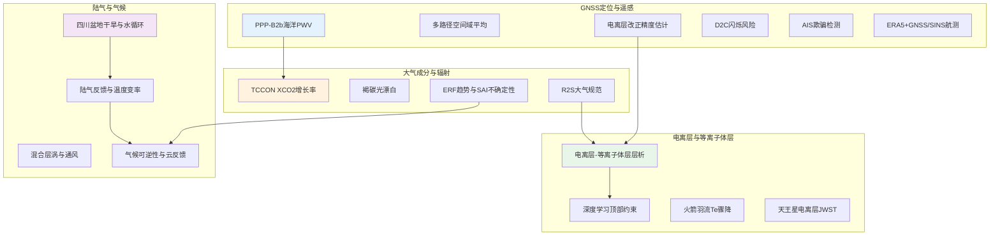
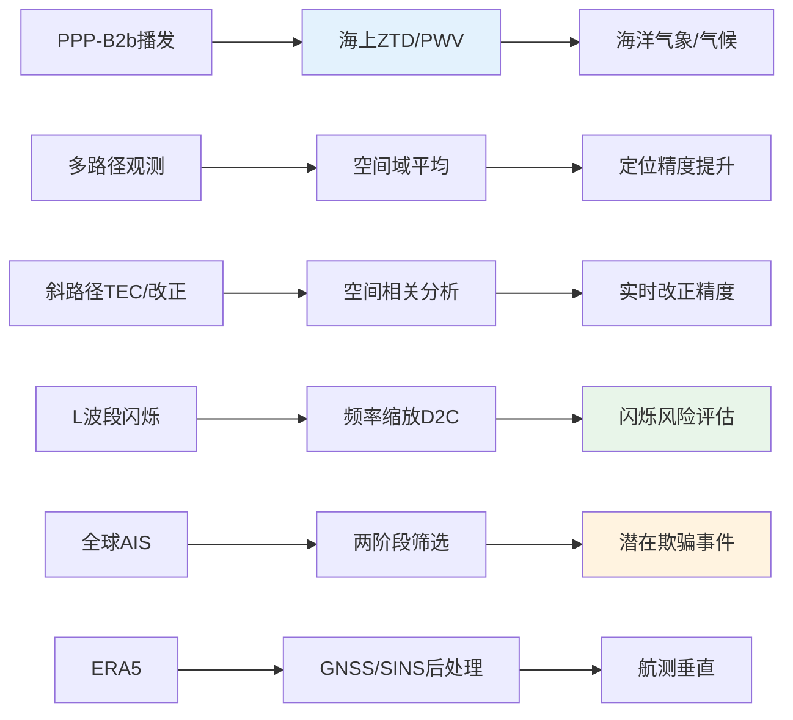
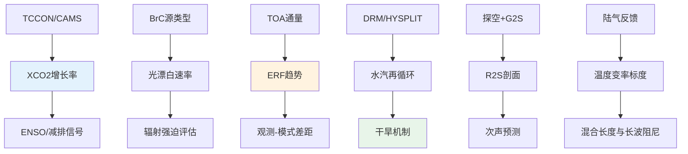
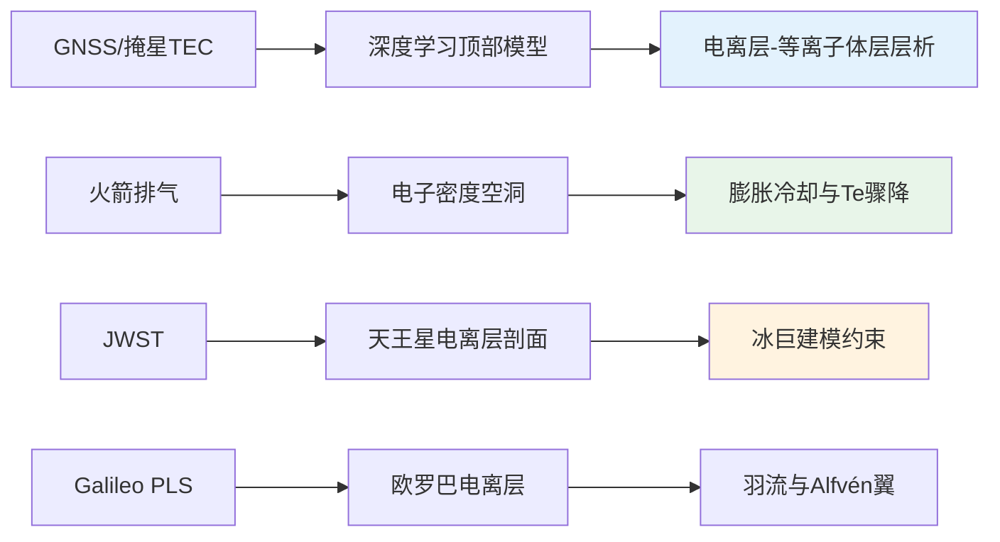
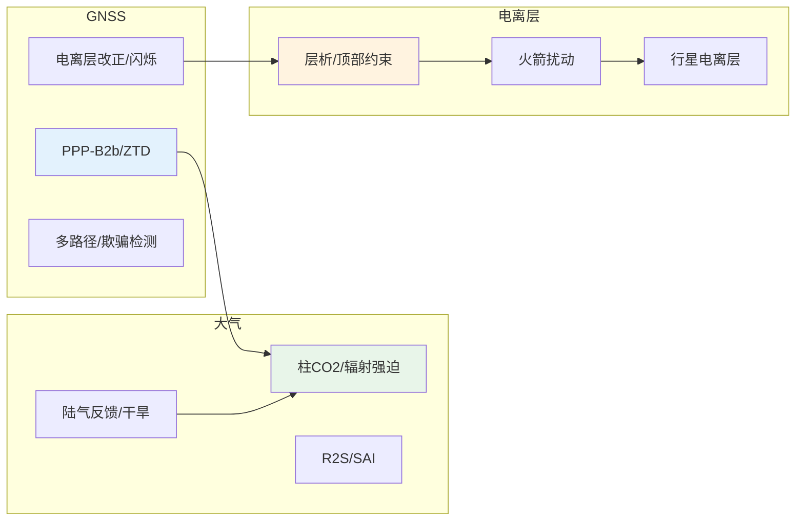

2026年2月18日至24日，*Journal of Geodesy*、*GPS Solutions*、*Geophysical Research Letters*、*Journal of Geophysical Research: Atmospheres*、*Atmospheric Chemistry and Physics*、*Biogeosciences*、*Geoscientific Model Development* 等期刊发表了多篇与GNSS、大气及电离层相关的工作。本期论文在海洋与低成本GNSS可降水量感知、电离层增强与闪烁风险、GNSS/SINS与ERA5融合航测垂直精度、大气柱CO2年增长率与辐射强迫、陆气反馈与干旱机制、大气规范与气溶胶微物理等方面形成清晰主线。下文从本期研究印记图入手，分方向归纳技术路线与重要结论，并给出交叉学科网络与近期研究特色变化。

## 一、本期研究印记图

本期收录论文在时间上集中于2026年2月中下旬，空间上覆盖从海洋与山地GNSS、星载与地基电离层探测到大气柱与陆面过程，主题上可归纳为四类：GNSS定位与遥感应用、电离层与等离子体层及人为扰动、大气成分与辐射强迫、陆气耦合与气候可逆性。GNSS应用方面，北斗三号PPP-B2b与低成本设备结合实现实时海洋PWV感知，为无地面网络海域大气水汽监测提供途径；GNSS多路径通过空间域平均抑制提升定位精度；基于空间相关分析的电离层改正精度实时估计服务于增强系统；L波段GNSS闪烁经频率缩放至直连蜂窝（D2C）频段，用于评估D2C链路闪烁风险；AIS位置报告的两阶段异常检测（运动学与数据质量筛选、多船空间聚类）可识别潜在大规模GNSS欺骗事件；ERA5与GNSS/SINS后处理融合改善机载测量垂直精度。电离层方面，深度学习约束的顶部离子层模型与电离层–等离子体层联合层析提升F2峰与斜TEC反演精度；三亚非相干散射雷达揭示火箭发射造成的电离层电子密度空洞内电子温度骤降及膨胀冷却与热平衡破坏机制；JWST获得天王星电离层温度与密度垂直结构，为冰巨电离层与磁层建模提供约束。大气科学方面，TCCON柱平均CO2年增长率用月度均值、傅里叶拟合残差与动态线性模型三种方法计算，极夜缺数下DLM最稳健，区域增长率约2.33–2.40 ppm/yr，2015–2016 ENSO与2020减排信号可辨；褐碳光漂白速率呈现明显源依赖性（aq-BrC > p-BrC > b-BrC），影响全球辐射强迫评估；2010年以来TOA辐射不平衡加剧，有效辐射强迫趋势约1.0 W m⁻²/十年，短波贡献突出；四川盆地夏季干旱与大气水循环的关联由外源水汽输送亏缺与后期土壤湿度耗竭下的局地再循环崩溃共同驱动；Radiosonde-to-Space（R2S）将探空与G2S合并为地面至150 km连续剖面，改善次声传播预测；平流层气溶胶注入（SAI）效率与影响的不确定性强烈依赖气溶胶微物理方案（模态与截面模型差异显著）。陆气与气候方面，中纬度冬季地表温度变率的新标度框架将陆气反馈纳入混合长度概念；混合层涡参数化与海洋通风、ENSO引起的海洋热含量再分配在变暖下的变化、南大西洋热储存与AMOC的关系、地表温度可逆性与云辐射反馈等研究共同刻画陆气与海气耦合在年代际尺度上的作用。

下图概括了本期论文在GNSS应用、电离层与等离子体层、大气成分与辐射、陆气与气候四个板块之间的关联与数据流。

上述印记图表明，本期研究在海洋与地基GNSS大气探测、电离层增强与闪烁风险、大气柱与辐射强迫及陆气反馈四个方向上形成可辨识的技术脉络，为下文分方向专题画像与交叉学科网络提供总览。

## 二、GNSS方向：海洋PWV、多路径抑制、电离层增强与欺骗检测

本期GNSS方向论文围绕北斗三号PPP-B2b与低成本设备的海上实时PWV感知、GNSS多路径空间域平均、增强系统电离层改正精度实时估计、D2C频段电离层闪烁风险评估、AIS辅助潜在GNSS欺骗事件检测、山地GNSS高程测定中大地水准面与数据处理对误差预算的贡献、以及ERA5与GNSS/SINS后处理融合提升机载垂直精度展开。海洋与大气应用方面，PPP-B2b无需地面通信即可在海上获得精密轨道与钟差改正，结合低成本接收机实现实时ZTD/PWV估计，为海洋气象与气候研究提供可操作方案。定位与增强方面，多路径通过空间域平均抑制可提升定位精度；基于空间相关分析的电离层改正精度实时估计有助于增强系统完好性与收敛。新兴应用方面，将L波段GNSS闪烁按频率缩放至D2C低波段与N255/N256等频段，并与F7/C2掩星闪烁对比，可刻画D2C链路闪烁的时空特征与频段依赖性；AIS两阶段筛选（运动学与质量过滤、多船空间聚类）可在全球尺度上识别潜在欺骗事件的地理与时间模式，但AIS本身不能作为欺骗的确定性归因依据。

**表1：GNSS方向代表性研究的技术路线与特点**

| 研究主题 | 技术路线 | 技术特点 | 重要结论 |
|---------|---------|---------|---------|
| 海洋实时PWV | BeiDou-3 PPP-B2b + 低成本GNSS | 无地面网、实时ZTD/PWV | 海上实时可降水量感知可行，支撑海洋气象与气候应用 |
| 多路径抑制 | 空间域平均 | 提升定位精度 | 空间域平均可有效抑制多路径，改善定位精度 |
| 电离层改正精度估计 | 空间相关分析 | 实时、增强系统 | 基于空间相关的实时估计可服务增强完好性与收敛 |
| D2C闪烁风险 | L波段GNSS闪烁频率缩放 + F7/C2 | 多频段、地基与星基 | 低波段闪烁发生率约为N255/N256两倍以上，高D2C频段更稳健 |
| AIS欺骗检测 | 两阶段筛选 + 多船聚类 | 全球AIS流、候选事件 | 波罗的海、黑海、摩尔曼斯克等多地出现潜在欺骗模式；AIS仅作证据之一 |
| 山地高程 | 大地水准面 + 数据处理 | 误差预算分解 | 大地水准面与数据处理共同贡献高程误差预算 |
| 航测垂直精度 | ERA5 + GNSS/SINS 后处理 | 融合气象与惯导 | ERA5增强后处理可改善机载测量垂直精度 |
| GPS钟稳定度 | 短时观测表征 | 钟差与稳定性 | 短时观测可表征GPS卫星钟稳定度 |

### 2.1 专题画像：北斗三号PPP-B2b与低成本GNSS的海洋实时PWV感知

**（1）技术路线：PPP-B2b服务与海上ZTD/PWV估计**

Hongxing Zhang等（2026）在 *Journal of Geodesy* 上发表了利用北斗三号PPP-B2b与低成本GNSS设备实现海上实时可降水量（PWV）感知的研究。PPP-B2b通过B2b信号播发轨道与钟差改正，无需地面通信即可在海上实现精密单点定位，进而由对流层延迟估计得到天顶对流层延迟（ZTD）并转换为PWV。研究采用低成本GNSS接收机，在海洋或近海场景下评估实时ZTD/PWV的精度与可用性，并讨论大地水准面与气象转换模型对误差预算的影响。该技术路线将星基增强与地基气象应用结合，为远海与无地面网区域的水汽监测提供了可行路径。

**（2）技术特点：无地面网与低成本**

该研究的创新点在于将PPP-B2b的“无地面网”特性与低成本接收机结合，使海洋PWV感知在成本与覆盖范围上更具可操作性。文献与行业评估表明，BDS-3 PPP-B2b在静态与动态场景下均可达到分米级定位与可靠ZTD估计，适用于海洋气象、气候与数值预报同化等应用。研究突出了在海上缺乏连续地面参考网条件下，星基改正对维持定位与大气参数估计精度的作用。

**（3）重要结论：海洋实时PWV感知的可行性与应用价值**

**该研究的重要结论是：在北斗三号PPP-B2b服务与低成本GNSS设备支持下，海上实时PWV感知在技术上是可行的，可为海洋与近海大气水汽监测、气象预报与气候研究提供业务化数据源；其应用价值在于填补无地面网海域的水汽观测空白，并可与再分析及卫星大气产品相互校验。** 这一结论对海洋气象观测网设计、GNSS气象在航海与科考中的应用具有直接参考意义。

### 2.2 专题画像：GNSS多路径空间域平均与定位精度提升

**（1）技术路线：空间域平均与多路径抑制**

Yumiao Tian等（2026）在 *GPS Solutions* 上发表了通过空间域平均抑制GNSS多路径以提升定位精度的研究。多路径误差与测站周边反射体几何及天线增益有关，传统方法多从时间域或观测域处理。该研究从空间域出发，利用多路径在空间上的相关性或可分离性，通过适当的空间平均或空间滤波降低多路径对定位解的贡献，并在不同环境下评估对单点定位或相对定位精度的影响。

**（2）技术特点：空间域处理与精度增益**

与仅依赖时间域滤波或天线设计的方法相比，空间域平均将多路径视为空间结构的信号，通过平均或滤波削弱其影响而不完全依赖长时观测平滑。该方法在反射复杂场景（如城市、码头）下具有潜在优势，可与天线、测站选址及其他数据处理策略联合使用。

**（3）重要结论：空间域平均对多路径抑制与定位精度的贡献**

**该研究的重要结论是：GNSS多路径可通过空间域平均得到有效抑制，从而提升定位精度；该方法为复杂反射环境下的GNSS定位与高精度应用提供了新的处理思路，可与现有多路径模型或滤波方法互补。** 对测绘、形变监测与智能交通等依赖GNSS精度的领域具有应用参考价值。

### 2.3 专题画像：基于空间相关分析的电离层改正精度实时估计

**（1）技术路线：空间相关分析与增强系统**

Mingxian Hu等（2026）在 *GPS Solutions* 上发表了面向GNSS增强系统的、基于空间相关分析的电离层改正精度实时估计方法。区域或星基增强系统播发电离层改正信息，用户端需评估该改正的置信度或精度以用于完好性及加权。研究利用电离层延迟在空间上的相关性，通过邻近测站或格网残差建立空间相关模型，实时估计当前用户位置处电离层改正的精度或不确定性，并用于加权最小二乘或完好性计算。

**（2）技术特点：实时性与空间结构利用**

电离层延迟具有明显的空间梯度与日变特征，单纯时间序列难以在未收敛前给出可靠精度。通过空间相关分析，在测站或格网密度足够的区域可更快地估计局部改正精度，有利于缩短收敛时间并提高增强系统在电离层活跃期的可用性。

**（3）重要结论：电离层改正精度的实时空间估计与增强应用**

**该研究的重要结论是：基于空间相关分析可在增强系统中实时估计电离层改正精度，为电离层约束下的定位收敛与完好性提供支撑；该方法有助于提升增强系统在电离层扰动期间的可用性与可靠性。** 对星基增强（如PPP-B2b）与区域增强系统的算法设计具有参考意义。

### 2.4 专题画像：直连蜂窝通信电离层闪烁风险评估中的频率缩放GNSS观测

**（1）技术路线：L波段GNSS闪烁频率缩放与D2C频段对比**

Abdollah Masoud Darya与Muhammad Mubasshir Shaikh（2026）在 arXiv (eess.SP) 上发表了利用频率缩放GNSS闪烁观测评估直连蜂窝（D2C）卫星通信电离层闪烁风险的研究。D2C系统在低波段及3GPP N255、N256等频段工作，而地基闪烁监测多为L波段GNSS。研究将GNSS L波段幅度闪烁观测按频率关系缩放至D2C相关频段，并结合FORMOSAT-7/COSMIC-2（F7/C2）掩星闪烁（在无地基台站区域可替代），分析闪烁的时空特征与发生率。以阿联酋沙迦五年地基GNSS与两年F7/C2数据为例，对应太阳周期25上升段，对比地基与星基结果并讨论日变化、方位依赖与频段差异。

**（2）技术特点：频段缩放与地基–星基结合**

电离层幅度闪烁具有明显的频率依赖性，低频更易出现强闪烁。将L波段观测缩放至D2C低波段与N255/N256，可直接估计这些频段上的闪烁发生率和强度分布，为链路预算与抗闪烁设计提供依据。F7/C2掩星提供空间覆盖，弥补地基台站稀疏区，二者结合可形成全球或区域闪烁气候学。

**（3）重要结论：D2C频段闪烁特征与系统设计启示**

**该研究的重要结论是：地基与星基观测均显示约20–22时地方时的闪烁峰值，分点期更明显，发生率随太阳活动增强；低波段闪烁发生率约为N255/N256的两倍以上，表明较高D2C频段对电离层闪烁更具稳健性；GNSS闪烁观测可用于刻画和预判D2C链路受闪烁影响的程度，支撑D2C系统设计与闪烁缓解策略。** 对低轨通信星座的频段选择与空间天气服务具有应用价值。

### 2.5 专题画像：SeaSpoofFinder——基于AIS的潜在GNSS欺骗事件检测

**（1）技术路线：全球AIS流与两阶段异常检测**

Jón Winkel等（2026）在 arXiv (eess.SP) 上发表了利用海事自动识别系统（AIS）位置报告推断大规模GNSS欺骗活动的研究，并给出数据处理框架 SeaSpoofFinder。第一阶段采用运动学与数据质量过滤器识别不可信的位置跳变；第二阶段仅保留多船在空间上呈现一致“源–目标”聚类的事件，以降低单船异常（如回港跳变、数据缺失）造成的虚警。最终潜在欺骗事件（FPSE）在波罗的海、黑海、摩尔曼斯克、莫斯科及海法附近等区域呈现重复出现的空间与时间模式，影响范围可覆盖较大海区。

**（2）技术特点：多船聚类与证据限度**

单船位置跳变可能来自欺骗、接收机故障或AIS输入错误；多船在相近时间、空间上呈现一致的异常聚类，则更可能对应区域性欺骗或同一欺骗源。框架强调AIS仅能提供“潜在欺骗”的证据，不能单独作为确定性归因依据，需结合其他手段（如GNSS原始观测量、其他传感器）进行综合判断。

**（3）重要结论：AIS在大规模潜在欺骗识别中的作用与局限**

**该研究的重要结论是：基于AIS的监测可在全球尺度上提供潜在GNSS欺骗活动的有用证据，两阶段筛选（运动学/质量过滤与多船空间聚类）有助于识别重复发生的异常模式并抑制部分非欺骗类异常；同时，仅凭AIS不足以对欺骗进行确定性归因，密集交通区仍存在回港跳变与数据缺口等可通过启发式过滤的伪迹。** 对海事安全与PNT完好性监测具有参考意义。

### 2.6 专题画像：山地GNSS高程测定中大地水准面与数据处理的误差预算

**（1）技术路线：误差预算分解与山地场景**

Dariusz Strugarek等（2026）在 *GPS Solutions* 上发表了山地环境下基于GNSS的高程测定中，大地水准面模型与数据处理技术对总体误差预算的贡献研究。GNSS提供椭球高，转为正常高需大地水准面高；山地地形与重力场复杂，大地水准面精度及GNSS观测与处理策略（如对流层、多路径、解算模式）共同影响高程精度。研究通过系统比对不同大地水准面产品与不同数据处理方案，量化各因素对高程误差的贡献，为山地测绘与地质灾害监测中的GNSS高程应用提供依据。

**（2）技术特点：山地与误差分解**

山地环境下对流层延迟、多路径与大地水准面误差均较突出，误差预算分解有助于明确改进重点（如选用更高分辨率大地水准面、改进对流层建模或观测几何）。

**（3）重要结论：大地水准面与数据处理对山地GNSS高程的联合影响**

**该研究的重要结论是：山地GNSS高程精度受大地水准面模型与数据处理技术的共同影响，误差预算分解表明二者均为重要贡献源；合理选择大地水准面产品与处理策略可显著改善高程成果，对山区测绘与形变监测具有实际意义。** 为GNSS高程应用规范与作业设计提供参考。

### 2.7 专题画像：ERA5增强的GNSS/SINS后处理与机载测量垂直精度

**（1）技术路线：ERA5与GNSS/SINS融合后处理**

Xiaohong Zhang等（2026）在 *GPS Solutions* 上发表了利用ERA5再分析气象场增强GNSS/SINS后处理以改善机载测量垂直精度的研究。机载GNSS/SINS在起飞、降落与机动阶段垂直通道误差较大，对流层延迟与气象参数的不确定性会进一步影响高程解。研究将ERA5提供的温压湿等场引入后处理，改进对流层延迟估计或约束，从而提升垂直方向定位精度，并在航测任务中评估对点云或DSM高程精度的影响。

**（2）技术特点：气象约束与后处理**

相比仅用标准对流层模型，引入ERA5可在空间与时间上提供更一致的气象约束，减少对流层误差对垂直分量的影响，特别在低高度角与长基线场景下效果更明显。

**（3）重要结论：ERA5对机载GNSS/SINS垂直精度的改善**

**该研究的重要结论是：ERA5增强的GNSS/SINS后处理可有效改善机载测量的垂直定位精度，为航空摄影测量与激光雷达等对高程敏感的机载应用提供更可靠的高程基准。** 对航测生产与高精度DEM/DSM生产具有应用价值。

### 2.8 专题画像：短时观测表征GPS卫星钟稳定度

**（1）技术路线：短时观测与钟差/稳定度估计**

Weiwei Cheng等（2026）在 *GPS Solutions* 上发表了利用短时观测表征GPS卫星钟稳定度的研究。卫星钟的艾伦方差或时域稳定度通常需要较长连续观测；在监测、校准或快速评估场景下，希望用较短弧段得到有代表性的稳定度指标。研究基于短时GNSS观测反演钟差或钟速，并推导或拟合稳定度参数，讨论弧段长度、采样间隔与几何对估计结果的影响，并与长弧段或官方产品对比验证。

**（2）技术特点：短弧与实用化**

短弧表征可服务于星座健康监测、快速质量评估和接收机/时间比对中的钟差预测，对PNT服务保障与时间传递应用具有实用意义。

**（3）重要结论：短时观测对GPS卫星钟稳定度表征的可行性**

**该研究的重要结论是：在适当弧段与采样下，短时GNSS观测可用于表征GPS卫星钟稳定度，为钟差预测与星座健康监测提供简便手段；结果与长弧段或官方产品的一致性取决于弧段长度与观测质量。** 对时间频率与PNT监测应用具有参考价值。

## 三、大气方向：柱CO2增长率、褐碳光漂白、辐射强迫与陆气反馈

本期大气方向论文涵盖大气成分与辐射、陆气耦合与气候可逆性、大气规范与气溶胶等多条主线。大气成分与辐射方面，TCCON柱平均CO2（XCO2）年增长率用月度均值、傅里叶拟合残差与动态线性模型（DLM）三种方法计算，极夜缺数下DLM最稳健，区域增长率约2.33–2.40 ppm/yr，2015–2016 ENSO与2020减排在部分区域可辨；褐碳光漂白速率呈现明显源依赖性（aq-BrC > p-BrC > b-BrC），分子机制差异影响全球辐射强迫评估；2010年以来TOA辐射不平衡加剧，有效辐射强迫趋势约1.0 W m⁻²/十年，短波贡献突出且北半球中纬度海洋增强明显；平流层气溶胶注入（SAI）效率与影响强烈依赖气溶胶微物理方案（模态与截面模型差异大）。陆气与干旱方面，四川盆地夏季干旱与大气水循环的关联由外源水汽亏缺与后期土壤湿度耗竭下的局地再循环崩溃共同驱动；中纬度冬季地表温度变率的新标度框架将陆气反馈纳入混合长度；青藏高原春季土壤湿度对华东夏季降水的遥相关、南大西洋热储存与AMOC、地表温度可逆性与云辐射反馈等研究共同刻画陆气与海气耦合。大气规范与探测方面，Radiosonde-to-Space（R2S）将探空与G2S合并为地面至150 km连续剖面，改善次声传播预测；热带气旋下近地层比湿的卫星估计采用神经网络筛选与低频微波通道，改善焓通量估计。

**表2：大气方向代表性研究的技术路线与特点**

| 研究主题 | 技术路线 | 技术特点 | 重要结论 |
|---------|---------|---------|---------|
| TCCON XCO2年增长率 | MM/FF/DLM + CAMS对比 | 极夜缺数下DLM最稳健 | 区域增长率约2.33–2.40 ppm/yr，ENSO与2020减排可辨 |
| 褐碳光漂白 | aq-BrC/b-BrC/p-BrC 对比 | 源依赖与分子机制 | 光漂白速率源依赖显著，影响BrC全球辐射强迫评估 |
| ERF趋势（2010以来） | TOA通量分解与反馈参数 | 观测与模式差异扩大 | ERF趋势约1.0 W m⁻²/十年，短波主导 |
| 四川盆地夏季干旱 | DRM + HYSPLIT 水汽追踪 | 外源亏缺与局地再循环崩溃 | 干旱由外源水汽减少与后期土壤湿度耗竭共同驱动 |
| R2S大气规范 | 探空 + G2S 合并 | 地面–150 km 连续剖面 | 直接低层观测可改变次声到达预测 |
| 陆气反馈与温度变率 | 新标度框架 + 混合长度 | 长波阻尼主导 | 陆气反馈嵌入混合长度，环流与陆面扰动下长波阻尼主导 |
| SAI效率不确定性 | MAM4 vs CARMA | 微物理方案敏感性 | SAI效率与影响强烈依赖气溶胶微物理方案 |
| GA8GL9配置 | 统一模式 + JULES | 对流记忆与陆面改进 | 预报与气候性能提升，GA8为GC4大气陆面分量 |

### 3.1 专题画像：TCCON柱平均CO2年增长率与缺数稳健性

**（1）技术路线：三种增长率算法与CAMS对比**

Nasrin Mostafavi Pak等（2026）在 *Biogeosciences* 上发表了基于TCCON 12站长期数据计算柱平均干空气CO2摩尔分数（XCO2）年增长率的研究，并比较月度均值（MM）、傅里叶拟合残差（FF）与动态线性模型（DLM）三种方法，重点考察极夜缺数较多的Eureka站。同时用CAMS再分析评估与TCCON的一致性及各方法对缺数的稳健性。区域涵盖北极、北半球两个中纬带（40–50°N、30–40°N）与南半球，与Mauna Loa地面观测对比。

**（2）技术特点：柱浓度与缺数稳健性**

XCO2反映整柱平均，与近地面浓度互补；极夜与缺测会削弱时间序列的连续性。DLM在缺数下表现最稳健，适合高纬与不完整序列的增长率估计。CAMS与TCCON的对比为再分析与地基遥感的一致性提供参考。

**（3）重要结论：区域增长率、ENSO与2020减排信号**

**该研究的重要结论是：2010年或更早至2024年区域平均CO2年增长率约2.33–2.40 ppm/yr；2015–2016 ENSO期间增长率可增加约1.7 ppm/yr；2020年减排在30–40°N表现为约0.4 ppm/yr的下降，其他区域未发现显著下降；增长率与ENSO强度的相关在南半球与Mauna Loa显著，在北半球中高纬不显著；DLM在缺数下最稳健，适合极夜与不完整序列。** 对碳循环监测与减排效果评估具有应用价值。

### 3.2 专题画像：褐碳光漂白速率的源依赖与分子机制

**（1）技术路线：三类BrC光漂白对比与分子机制**

Yanting Qiu等（2026）在 *Atmospheric Chemistry and Physics* 上发表了实验室合成二次褐碳（aq-BrC）、生物质燃烧褐碳（b-BrC）与 ambient PM2.5 褐碳（p-BrC）的光漂白速率对比研究，并从分子尺度解释不同来源BrC光漂白行为的差异。光漂白速率常数 kBrC 表现为 aq-BrC > p-BrC > b-BrC，即 b-BrC 在大气中光吸收能力更稳定。aq-BrC 的快速光漂白由 2-IC 与甲基乙二醛寡聚体的链状结构及OH氧化主导；b-BrC 则受木质素衍生物的高共轭结构影响，对OH氧化较稳定。

**（2）技术特点：源依赖与辐射强迫含义**

BrC全球辐射效应不确定性大，光漂白是重要环节；不同来源BrC的寿命与光吸收衰减差异会直接影响辐射强迫估计。该研究为BrC源解析与辐射强迫评估中考虑源差异提供了定量与机制依据。

**（3）重要结论：源依赖光漂白与BrC辐射强迫评估**

**该研究的重要结论是：褐碳光漂白速率具有明显源依赖性，b-BrC最稳定、aq-BrC最快；分子机制上分别由木质素衍生物共轭结构与2-IC/甲基乙二醛寡聚体OH氧化主导；在评估BrC全球辐射强迫时需考虑来源差异。** 对气溶胶辐射与气候效应研究具有参考意义。

### 3.3 专题画像：2010年以来有效辐射强迫趋势与观测–模式差距

**（1）技术路线：TOA通量分解与反馈参数**

S. Yukimoto等（2026）在 *Geophysical Research Letters* 上发表了2010年以来地球大气顶辐射不平衡加剧背景下有效辐射强迫（ERF）趋势的估计。研究将TOA通量变化分解为强迫与响应分量，使用由观测与模拟年际变率及CO2强迫响应得到的反馈参数。2010–2024年净与短波通量的ERF趋势约1.0 W m⁻²/十年，高于2001–2024年且明显大于当前模式预估；该差距在不同气候敏感度与强迫情景下仍存在，对反馈假设敏感性有限；短波贡献最大，空间上北半球中纬度海洋增强尤为明显。结果提示观测与模式差距可能在扩大，但内部变率的贡献不能完全排除。

**（2）技术特点：观测约束与趋势分解**

卫星TOA辐射观测显示近年不平衡加强，分解为ERF趋势与反馈响应有助于理解驱动因子；与模式对比可揭示模式在强迫或反馈上的系统性偏差。

**（3）重要结论：ERF趋势与观测–模式差距**

**该研究的重要结论是：2010–2024年ERF趋势约1.0 W m⁻²/十年，短波主导且北半球中纬度海洋区增强明显；该趋势高于当前先进模式预估，观测与模式差距可能扩大，内部变率贡献尚不能完全排除。** 对气候敏感度与强迫评估具有重要科学意义。

### 3.4 专题画像：四川盆地夏季干旱与大气水循环

**（1）技术路线：DRM与HYSPLIT水汽追踪**

Debing Kong等（2026）在 *Journal of Geophysical Research: Atmospheres* 上发表了1979–2022年四川盆地（SCB）夏季干旱与大气水循环特征及机制的研究，采用动态再循环模型（DRM）与HYSPLIT轨迹模型。6–8月气候平均降水再循环比约12.92%–13.04%，表明SCB依赖外源水汽输送；多数干旱与外源水汽输送亏缺有关；在最强干旱后期（如2006年与2022年8月），干旱由前期外源减少演变为“内部水汽耗竭”型，极端土壤湿度耗竭加强陆气耦合并导致局地再循环崩溃。水汽追踪表明外源亏缺型干旱与海洋来流减少有关，内部亏缺型则在海源充足情况下陆面贡献减少、降水转化效率低。西太副高与中纬西风等大尺度环流通过调节水汽输送与降水效率起作用，陆气耦合进一步放大异常。

**（2）技术特点：外源与内部水汽机制区分**

区分“外源亏缺”与“内部再循环崩溃”有助于理解干旱发展阶段与可预报性；陆气耦合在干旱加剧阶段的作用为季节预报与抗旱策略提供机制依据。

**（3）重要结论：干旱阶段与陆气耦合**

**该研究的重要结论是：四川盆地夏季干旱多数与外源水汽输送亏缺有关，最强干旱后期可转为内部水汽耗竭型，由极端土壤湿度耗竭与局地再循环崩溃驱动；大尺度环流与陆气耦合共同塑造干旱异常；结果可为干旱预测与气候变暖下的干旱风险评估提供依据。** 对区域气候与水文预报具有应用价值。

### 3.5 专题画像：Radiosonde-to-Space（R2S）大气规范与次声传播

**（1）技术路线：探空与G2S合并为连续剖面**

Loring P. Schaible与Elizabeth A. Silber（2026）在 *Geophysical Research Letters* 上发表了Radiosonde-to-Space（R2S）大气规范，将探空直接观测的低层大气与NRL Ground-to-Space（G2S）中高层剖面合并，形成从地面至150 km的连续规范。次声传播具有不对称性与时间依赖性，准确的大气规范对预测信号到达时间与位置至关重要。研究对比了Albuquerque逾6000组G2S–R2S对，并对代表性差异端点做传播模拟。G2S多数能复现R2S预测的到达，但存在重要例外，会影响实际事件解释；结果表明在引入直接低层观测后，预测可发生改变，支持将实时探空更广泛地纳入全球大气规范。

**（2）技术特点：低层观测与次声预测**

G2S提供全球覆盖但低层依赖气候或再分析；探空提供局地实时低层温压风。R2S兼顾二者，可改善次声路径与到达预测，对核验与禁核监测等应用具有价值。

**（3）重要结论：直接低层观测对次声预测的改进**

**该研究的重要结论是：R2S将探空与G2S合并为地面至150 km连续剖面；在部分情况下R2S与G2S的差异会改变次声到达预测并影响事件解释；将实时探空纳入全球大气规范可提升次声预测能力。** 对次声监测与大气规范建设具有参考意义。

### 3.6 专题画像：中纬度冬季地表温度变率与陆气反馈

**（1）技术路线：温度变率标度框架与混合长度**

Kezhou Lu等（2026）在 *Geophysical Research Letters* 上发表了将陆气反馈纳入中纬度冬季地表温度变率的新标度框架研究。以往多将冬季近地表温度变率归因于对流层大尺度平流，陆面影响假定较小；但将模式环流向观测 nudging 后，北半球陆地上冬季温度方差的改善有限，表明陆气相互作用值得考虑。新框架将局地陆气反馈纳入温度变率标度，并与混合长度方法（将温度变率与经向温度梯度和气块位移相联系）比较，指出陆气反馈实际已嵌入混合长度中，此前未被明确联系。通过扰动环流、陆面或二者的数值实验评估陆气反馈作用，发现当环流与陆面同时扰动时，长波辐射阻尼对温度变率响应的贡献超过经向温度梯度。

**（2）技术特点：陆气反馈与长波阻尼**

冬季陆面通过长波辐射与土壤热容量等影响近地层温度变率；明确其在标度框架中的角色有助于改进天气与次季节预报中对极端温度的表征。

**（3）重要结论：陆气反馈与长波阻尼在温度变率中的主导作用**

**该研究的重要结论是：中纬度冬季地表温度变率除大尺度平流外还受陆气反馈影响；新标度框架表明陆气反馈嵌入混合长度概念；环流与陆面同时扰动时长波辐射阻尼主导温度变率响应。** 对天气与气候模式改进具有理论价值。

### 3.7 专题画像：平流层气溶胶注入效率与微物理方案不确定性

**（1）技术路线：MAM4与CARMA SAI实验对比**

Simone Tilmes等（2026）在 *Atmospheric Chemistry and Physics* 上发表了平流层气溶胶注入（SAI）实验中，气溶胶微物理方案复杂度对SAI效率与影响不确定性的研究。使用同一地球系统模型框架，仅改变气溶胶微物理方案：模态模型（MAM4）与截面模型（CARMA），比较不同注入位置（点源与区域）、注入量（5与25 Tg S yr⁻¹）与物质（SO2与积累态硫酸（AM-H2SO4））。结果表明，使用模态模型时SAI辐射效率可能被高估，尤其在较高注入率下，并对平流层臭氧等影响有连锁反应；MAM4产生更大气溶胶负荷且粒径依赖的沉降较弱，CARMA则负荷较小、更多质量进入大粒子且高注入率下辐射效率下降。提示更精细的截面模型对准确评估SAI效能与副作用有必要。

**（2）技术特点：微物理方案与SAI评估**

SAI作为潜在气候干预手段，其效率与副作用的评估高度依赖气溶胶微物理；模态与截面方案在粒径分布与沉降上的差异直接导致负荷与辐射效率差异。

**（3）重要结论：微物理方案对SAI效率与影响的关键作用**

**该研究的重要结论是：SAI效率与影响的不确定性强烈依赖气溶胶微物理方案；模态方案可能高估辐射效率，截面方案在高注入率下显示效率递减；准确评估SAI效能与气候影响需采用更精细的微物理方案。** 对气候干预科学与政策讨论具有重要参考价值。

### 3.8 专题画像：Met Office GA8GL9与对流–陆面改进

**（1）技术路线：统一模式与JULES陆面**

Martin Willett等（2026）在 *Geoscientific Model Development* 上发表了英国气象局全球大气8.0与JULES全球陆面9.0（GA8GL9）科学配置，用于天气与气候尺度。GA8GL9在GA7GL7基础上，整合气候分支（GA7.1GL7.1，CMIP6提交）与NWP分支（GA7.2GL8.1，2019–2022业务）的改动，并包含对流、云与陆面等多方面发展：如预报性夹卷带来的对流记忆与降水改进、对流增量时间平滑改善对流–动力耦合、新霰化参数化增加过冷水并减轻南大洋偏差、陆面改进使近地面预报改善并取消NWP中聚合地表 tile 等。数值稳定性与伪迹也有所改善。GA8GL9在NWP与气候测试中相对GA7GL7误差减小、结构改进，气候态尤其是大气顶出射短波辐射改善；GA8GL9为GC4的大气与陆面分量，GC4自2022年5月起作为业务全球NWP模式。

**（2）技术特点：对流记忆与陆面–大气耦合**

对流记忆与时间平滑减少对流间歇对动力的不利影响；陆面改进直接提升近地面场与陆气耦合表现，对极端温度与降水预报有重要意义。

**（3）重要结论：GA8GL9对预报与气候性能的提升**

**该研究的重要结论是：GA8GL9通过对流、云与陆面等多项改进，在NWP与气候评估中均优于GA7GL7，大气顶短波辐射等气候态改善明显；该配置为当前业务全球NWP与未来气候应用提供统一物理基础。** 对天气与气候模式发展具有标杆意义。

## 四、电离层方向：电离层–等离子体层层析、火箭羽流与行星电离层

本期电离层方向论文涵盖地基电离层–等离子体层联合层析、火箭发射引起的电离层扰动与行星电离层探测。电离层与等离子体层层析方面，深度学习约束的顶部离子层模型与联合层析可同时反演电离层与等离子体层电子密度，改善F2峰与斜TEC精度，并更好刻画顶部及等离子体层结构。人为扰动方面，三亚非相干散射雷达高精度观测揭示了火箭排气触发的电离层电子密度空洞内此前被忽视的电子温度骤降：白天事件中电子温度在约5.5分钟内骤降约650 K，随后升高约1000 K并在约1小时内恢复，多波束显示冷却沿火箭轨迹局地分布且比密度空洞更窄，离子温度升高约550 K；夜间则电子与离子温度分别下降约450 K与150 K，无随后电子温度升高。分析表明扰动来自排气注入后的初始膨胀冷却与随后空洞形成对热平衡的破坏。行星电离层方面，JWST对天王星的观测首次给出电离层温度、体密度与总发射的垂直剖面，温度在3000–4000 km达峰，密度在约1000 km达峰且低于一维模型预测；两个亮发射区与极光区对应，190–240°W存在发射与密度亏损，可能与磁层拓扑有关；Galileo E12飞越欧罗巴的PLS数据不支持此前推测的水羽遭遇，等离子体密度与早期PWS解释一致，欧罗巴电离层呈高度不对称与不均匀，Alfvén翼比预期更紧凑。

**表3：电离层方向代表性研究的技术路线与特点**

| 研究主题 | 技术路线 | 技术特点 | 重要结论 |
|---------|---------|---------|---------|
| 电离层–等离子体层层析 | 深度学习顶部约束 + 联合反演 | 同时反演电离层与等离子体层 | 显著改善NmF2与STEC精度，顶部及等离子体层结构更合理 |
| 火箭羽流Te骤降 | 三亚ISR多波束 | 膨胀冷却与热平衡破坏 | 空洞内电子温度先骤降后升高（白天），夜间仅降温 |
| 天王星电离层 | JWST NIRSpec | 温度与密度垂直剖面 | 首例垂直剖面，密度低于1-D模型，存在发射亏损区 |
| 欧罗巴E12飞越 | Galileo PLS | 等离子体密度与电离层 | 不支持羽流遭遇，电离层不对称，Alfvén翼更紧凑 |

### 4.1 专题画像：深度学习约束的电离层与等离子体层同时层析

**（1）技术路线：顶部约束与联合反演**

Changzhi Zhai等（2026）在 *GPS Solutions* 上发表了电离层与等离子体层同时层析，并采用深度学习顶部模型作为约束的研究。电离层与等离子体层电子密度量级与时空变化差异大，传统层析难以同时稳定反演。研究利用深度学习建立的顶部离子层–等离子体层模型（基于历史探测与物理模型）作为先验或约束，在GNSS与掩星TEC观测基础上联合反演电离层与等离子体层电子密度，并评估对F2峰参数（如NmF2）、斜TEC及高高度（如1000 km以上）结构的改进。相关方法在文献中已显示相对传统ICSIRT等方案可显著降低NmF2与STEC的RMSE并更好匹配电离层探针与卫星观测。

**（2）技术特点：顶部约束与跨区一致性**

顶部与等离子体层缺乏充足直射GNSS射线，深度学习模型提供空间与时间上的软约束，使联合反演在保持电离层精度的同时改善顶部及等离子体层结构，并增强与掩星及卫星探测的一致性。

**（3）重要结论：联合层析与深度学习约束的精度与结构改进**

**该研究的重要结论是：在深度学习顶部模型约束下，电离层与等离子体层同时层析可显著改善F2峰与斜TEC反演精度，并得到更合理的顶部及等离子体层结构；该方法为空间天气与通信应用提供更可靠的电离层–等离子体层产品。** 对GNSS定位、通信与空间天气业务具有应用价值。

### 4.2 专题画像：火箭发射引起的电离层空洞内电子温度骤降

**（1）技术路线：三亚ISR多波束与事件分析**

Linxuan Zhao等（2026）在 *Geophysical Research Letters* 上发表了利用三亚非相干散射雷达高精度观测发现火箭发射触发的电离层电子密度空洞内电子温度（Te）骤降的研究。以往观测多关注空洞与Te升高；本研究报道了白天与夜间各一例事件。白天：Te在约5.5分钟内骤降约650 K，随后升高约1000 K并在约1小时内逐渐恢复；多波束显示冷却沿火箭轨迹局地分布，宽度小于伴随的密度空洞；离子温度升高约550 K。夜间：电子与离子温度分别下降约450 K与150 K，无随后Te升高。分析表明，扰动来自排气注入后的初始膨胀冷却与随后空洞形成对电离层热平衡的破坏。

**（2）技术特点：膨胀冷却与热平衡破坏**

排气注入造成局地膨胀与成分变化，先引起冷却；空洞形成后改变了局地加热与冷却平衡，导致Te先降后升（白天）或持续降温（夜间）。多波束可区分沿轨迹的局地效应与空洞尺度。

**（3）重要结论：空洞内Te骤降的机制与观测意义**

**该研究的重要结论是：火箭发射触发的电离层空洞内存在此前被忽视的电子温度骤降，由膨胀冷却与空洞形成对热平衡的破坏共同导致；多波束观测表明冷却沿轨迹局地且窄于密度空洞；结果对理解人为扰动电离层热力学与空间交通管理具有意义。** 对电离层扰动物理与航天环境监测具有参考价值。

### 4.3 专题画像：JWST揭示天王星电离层垂直结构

**（1）技术路线：JWST NIRSpec与垂直剖面**

Paola I. Tiranti等（2026）在 *Geophysical Research Letters* 上发表了JWST 2025年1月19日对天王星近一整自转的NIRSpec观测，首次给出天王星电离层温度、体密度与总发射的垂直剖面。温度在3000–4000 km达峰，各经度一致；密度在约1000 km达峰，峰值约(4.45±0.12)×10⁴ cm⁻³，低于一维模型预测。在50–110°W与220–290°W存在两个亮发射区，与极光区对应；190–240°W存在明显发射与密度亏损，可能与木星电离层暗区类似的磁层拓扑有关。结果还支持天王星上层大气长期冷却趋势（426±2 K），为冰巨电离层与磁层建模提供关键约束。

**（2）技术特点：冰巨电离层与磁层–电离层耦合**

天王星电离层观测稀缺，JWST提供首例垂直剖面，对理解冰巨大气、电离层与磁层耦合及与木星/土星对比具有重要科学价值。

**（3）重要结论：天王星电离层垂直结构与建模约束**

**该研究的重要结论是：JWST首次给出天王星电离层温度与密度的垂直结构，密度低于一维模型预测，存在与极光对应的亮区及可能与磁层拓扑相关的亏损区；结果确认上层大气长期冷却趋势，为冰巨电离层与磁层建模提供关键约束。** 对行星科学具有重要贡献。

### 4.4 专题画像：Galileo E12飞越欧罗巴的PLS观测与羽流解释

**（1）技术路线：E12 PLS高分辨率矩与速度分布**

William R. Paterson与Glyn A. Collinson（2026）在 *Geophysical Research Letters* 上发表了伽利略探测器最近距离飞越欧罗巴（E12）时等离子体仪器（PLS）的高分辨率（约18 s）矩与速度分布。此前PWS的短暂爆发曾被推测为水羽遭遇导致的等离子体密度尖峰（约2100 cm⁻³）；E12的PLS校准数据此前未发表。本研究给出的PLS密度在最近距离附近与Kurth等对PWS密度的原始解释一致，不支持羽流遭遇解释。PLS还显示欧罗巴附近电离层高度不对称与不均匀；欧罗巴的Alfvén翼比现有模型预期更紧凑，意味着电流强于模型预测。

**（2）技术特点：羽流与电离层–磁层耦合**

欧罗巴羽流存在与否对理解其地下海洋与宜居性至关重要；PLS与PWS的交叉验证澄清了E12事件的物理解释，并约束欧罗巴电离层与Alfvén翼结构。

**（3）重要结论：E12不支持羽流遭遇及电离层与Alfvén翼特征**

**该研究的重要结论是：E12飞越的PLS密度与PWS原始解释一致，不支持水羽遭遇；欧罗巴电离层呈高度不对称与不均匀，Alfvén翼较模型更紧凑、电流更强。** 对欧罗巴探测与木星系科学具有重要参考价值。

## 五、交叉学科网络图与创新链

GNSS、大气与电离层在本期形成清晰的交叉与创新链：GNSS提供定位与对流层/电离层观测，支撑海洋PWV、增强系统与闪烁风险应用；大气柱浓度与辐射强迫研究依赖地基遥感（如TCCON）与再分析，并与陆气反馈、气候可逆性相连；电离层–等离子体层层析与火箭扰动、行星电离层探测共享“垂直结构–动力学–外源扰动”主线。观测–模式–应用链条在海洋气象、空间天气与气候评估中贯通。

## 六、近期研究特色变化

与往期相比，本期呈现以下变化与延续：

1. **海洋与无地面网GNSS应用突出**：北斗三号PPP-B2b与低成本设备结合实现海上实时PWV，填补无地面网海域水汽观测空白，与前期陆地/区域GNSS气象形成互补。

2. **电离层应用向通信与人为扰动拓展**：L波段GNSS闪烁经频率缩放用于D2C链路闪烁风险评估；三亚ISR揭示火箭羽流在电离层空洞内引起的Te骤降，人为扰动热力学得到更完整刻画。

3. **大气辐射强迫与模式差距受关注**：2010年以来ERF趋势的观测估计与模式差距、SAI效率对微物理方案的敏感性、褐碳光漂白源依赖等，共同指向辐射强迫与气候干预评估中的不确定性来源。

4. **陆气耦合与干旱机制细化**：四川盆地夏季干旱的外源水汽亏缺与局地再循环崩溃两阶段、中纬度冬季温度变率的陆气反馈与长波阻尼、青藏高原春季土壤湿度对华东降水的遥相关等，陆气反馈在季节与次季节尺度上的作用得到加强。

5. **大气规范与探测手段融合**：R2S将探空与G2S合并为地面–150 km连续剖面，改善次声预测；热带气旋下卫星比湿估计引入神经网络筛选与低频通道，提升焓通量估计。观测–规范–模式的一体化需求更加明显。

## 七、参考文献

1. Zhang, H., Yuan, Y., Li, L., Li, W., Huang, W., Chai, Y., & Ren, D. (2026). Real-time oceanic PWV sensing using BeiDou-3 PPP-B2b and low-cost GNSS devices. *Journal of Geodesy*. https://doi.org/10.1007/s00190-026-02039-8
2. Tian, Y., Liang, Y., Zhang, Q., Zhou, L., Sun, X., & Wen, Z. (2026). GNSS multipath mitigation via spatial domain averaging for enhanced positioning precision. *GPS Solutions*. https://doi.org/10.1007/s10291-026-02042-8
3. Hu, M., Zuo, Y., & Yao, Y. (2026). Real-time estimation method for ionospheric correction accuracy in GNSS augmentation based on spatial correlation analysis. *GPS Solutions*. https://doi.org/10.1007/s10291-026-02040-w
4. Darya, A. M., & Shaikh, M. M. (2026). Assessing Ionospheric Scintillation Risk for Direct-to-Cellular Communications using Frequency-Scaled GNSS Observations. *arXiv eess.SP*, 2602.17143.
5. Winkel, J., Willems, T., O'Driscoll, C., & Fernandez-Hernandez, I. (2026). SeaSpoofFinder – Potential GNSS Spoofing Event Detection Using AIS. *arXiv eess.SP*, 2602.16257.
6. Strugarek, D., Trojanowicz, M., Mikoś, M., Gałdyn, F., Nowak, A., Kur, T., Smolak, K., & Sośnica, K. (2026). Height determination based on GNSS measurements in the mountainous area: contribution of the geoid model and data processing technique to the overall error budget. *GPS Solutions*. https://doi.org/10.1007/s10291-026-02043-7
7. Zhang, X., Cai, Q., Zhu, F., & Chen, X. (2026). Exploiting ERA5-augmented GNSS/SINS post-processing methodology to improve vertical positioning accuracy for airborne surveying. *GPS Solutions*. https://doi.org/10.1007/s10291-026-02034-8
8. Cheng, W., Nie, G., & Zhu, J. (2026). Characterizing GPS satellite clock stabilities with short-term observations. *GPS Solutions*. https://doi.org/10.1007/s10291-026-02037-5
9. Mostafavi Pak, N., Hachmeister, J., Rettinger, M., et al. (2026). Annual growth rates of column-averaged CO2 inferred from Total Carbon Column Observing Network (TCCON). *Biogeosciences*, 23, 1477–1493. https://doi.org/10.5194/bg-23-1477-2026
10. Qiu, Y., Qiu, T., Liu, Y., et al. (2026). Understanding divergent brown carbon photobleaching rates from molecular perspective. *Atmospheric Chemistry and Physics*, 26, 2785–2799. https://doi.org/10.5194/acp-26-2785-2026
11. Yukimoto, S., Kawai, H., Oshima, N., & Deushi, M. (2026). Emerging Effective Radiative Forcing in the Radiative Imbalance Since 2010. *Geophysical Research Letters*. https://doi.org/10.1029/2025gl119913
12. Kong, D., He, Y., Yu, H., et al. (2026). Summer Drought Dynamics in the Sichuan Basin of China Driven by the Atmospheric Water Cycle. *Journal of Geophysical Research: Atmospheres*. https://doi.org/10.1029/2025jd045146
13. Schaible, L. P., & Silber, E. A. (2026). Radiosonde‐to‐Space (R2S) Atmospheric Specifications: Bridging Observations and Models for Infrasound Propagation. *Geophysical Research Letters*. https://doi.org/10.1029/2025gl120188
14. Lu, K., Chen, G., Ge, B., Fu, R., Ma, W., & Wang, H. (2026). The Role of Land‐Atmosphere Feedbacks in Midlatitude Wintertime Surface Temperature Variability. *Geophysical Research Letters*. https://doi.org/10.1029/2025gl120713
15. Tilmes, S., Visioni, D., Quaglia, I., et al. (2026). Uncertainties of SAI efficiency and impacts depending on the complexity of the aerosol microphysical model. *Atmospheric Chemistry and Physics*, 26, 2649–2665. https://doi.org/10.5194/acp-26-2649-2026
16. Willett, M., Brooks, M., Bushell, A., et al. (2026). The Met Office Unified Model Global Atmosphere 8.0 and JULES Global Land 9.0 configurations. *Geoscientific Model Development*, 19, 1473–1502. https://doi.org/10.5194/gmd-19-1473-2026
17. Zhai, C., Yao, Y., Kong, J., Chen, Y., Liang, W., & Tang, S. (2026). Ionosphere and plasmasphere simultaneous tomography constrained by a deep learning topside model. *GPS Solutions*. https://doi.org/10.1007/s10291-026-02038-4
18. Zhao, L., Ding, F., Yue, X., et al. (2026). An Abrupt Decrease in Electron Temperature Inside the Ionospheric Density Holes During the Launches of Carrier Rockets. *Geophysical Research Letters*. https://doi.org/10.1029/2025gl119866
19. Tiranti, P. I., Melin, H., Moore, L., et al. (2026). JWST Discovers the Vertical Structure of Uranus' Ionosphere. *Geophysical Research Letters*. https://doi.org/10.1029/2025gl119304
20. Paterson, W. R., & Collinson, G. A. (2026). Galileo PLS Plasma Observations During the E12 Europa Flyby Refuting an Encounter With a Cryovolcanic Plume. *Geophysical Research Letters*. https://doi.org/10.1029/2025gl118475
