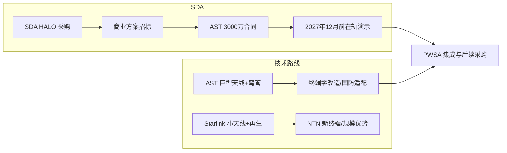
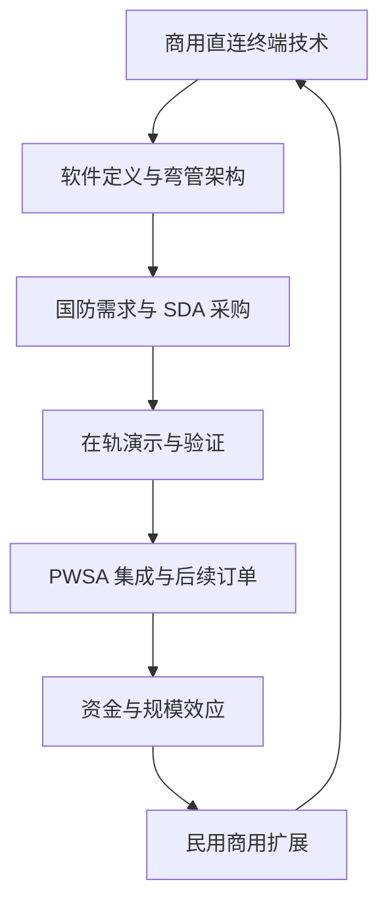

## 引言与背景

2026 年 2 月，美国太空发展局（Space Development Agency, SDA）宣布在 HALO（Hybrid Acquisition for Proliferated Low Earth Orbit）计划框架下，向 AST SpaceMobile 授予价值 3000 万美元的原型合同，用于基于蓝鸟（BlueBird）商业星座的战术卫星通信（TACSATCOM）在轨演示。该合同是 SDA HALO 欧罗巴轨道 2（Europa Track 2）商业方案的首批订单之一，标志着商业直连终端（direct-to-device）技术正式进入美国国防采购验证流程。Simply Wall St 于同日发布投资者视角的解读，将合同与公司 10.75 亿美元可转债融资、2028 年营收与盈利目标一并讨论，形成“叙事—估值—风险”的投资分析框架。本报告以该报道与既有中文技术综述为双源，先对英文原文做忠实译介，再在数据与方法、结果与分析、讨论与对比及中国情境下进行独立技术评估与政策解读。

## 原文译介

### 要点梳理

原文为 Simply Wall St 针对 AST SpaceMobile（纳斯达克代码 ASTS）获 SDA 合同后的投资者解读，结构大致为：（1）主标题与导语，引出投资者如何应对 ASTS 赢得国防卫星通信合同；（2）**AST SpaceMobile 投资叙事回顾**，指出持有 ASTS 需相信其直连设备网络能从研发阶段扩展为可运营的全球服务，由运营商与政府需求共同支撑；新签 3000 万美元 SDA HALO 合同强化短期国防机遇并验证蓝鸟技术，但主要催化剂仍是星座部署成功，最大风险仍是资本密集型建设中的执行与成本控制；近期 10.75 亿美元可转债延长了发射与频谱落地资金储备并重塑资本结构，同时伴随潜在股权稀释；文末指出公司 2028 年叙事目标为 21 亿美元营收与 21 亿美元盈利，需 385.7% 年化营收增速及约 24 亿美元盈利增长（从当前约 -3.038 亿美元）。（3）**多元视角下的分析**，称部分最保守分析师假设 AST SpaceMobile 到 2029 年可达约 19 亿美元营收与 17 亿美元盈利，与公司自身 2028 年目标、新 SDA 合同及卫星部署时间风险相比，显示观点分歧显著，建议投资者在决策前比较多种叙事。（4）**自主决策与拓展阅读**，提醒勿盲目跟风、应基于数据形成独立判断，并附免责声明与站内推广。正文中配有一张 ASTS 一年股价走势图（图1），用于支撑估值与风险讨论。

### 逐段翻译

**投资者如何应对 AST SpaceMobile（ASTS）赢得国防卫星通信领域的 SDA 合同**

（原文此处为站内量子计算主题推广，与 ASTS/SDA 无直接关系，略。）

**AST SpaceMobile 投资叙事回顾**

要持有 AST SpaceMobile，你需要相信其直连设备网络能够在移动运营商与政府需求的支撑下，从研发阶段扩展为可实际运营的全球服务。这份新的 3000 万美元 SDA HALO 合同强化了近期的国防机遇，并验证了其蓝鸟技术，但主要催化剂仍然是星座的成功部署，而最大的风险依然是在资本密集型建设过程中的执行与成本控制。

在此背景下，近期 10.75 亿美元可转债融资很重要，因为它延长了卫星发射与频谱铺开的资金储备周期，并重塑了资本结构。当前 AST SpaceMobile 单星投入超过 2100 万美元，这笔融资有助于其推进 SDA 项目与商用服务激活，同时通过潜在稀释将部分风险从债权人转移至股东。

然而在这项高调国防订单背后，投资者还应注意到：AST SpaceMobile 的叙事预期到 2028 年实现 21 亿美元营收与 21 亿美元盈利。这要求 385.7% 的年化营收增速，以及盈利从当前的约 -3.038 亿美元增加约 24 亿美元。

**多元视角下的分析**

部分最保守的分析师此前已假设 AST SpaceMobile 到 2029 年可达约 19 亿美元营收与 17 亿美元盈利；但与新签的 SDA 合同以及卫星部署时间相关风险相比，这些预测显示出观点差异之大，以及为何在决定自己所信之前，你或许需要比较多种叙事。

**自主决策**

不要只跟行情走，要深入数据并建立真正属于自己的判断。

**寻找新视角**

（原文此处为“今日精选机会”等站内推广及免责声明。）Simply Wall St 的免责声明指出：本文为一般性评论，基于历史数据与分析师预测、采用客观方法提供评论，不构成投资建议，不构成买卖任何股票之推荐，未考虑读者目标或财务状况；分析可能未纳入最新价格敏感的公司公告或定性信息，Simply Wall St 对文中提及股票无持仓。

图1 为 ASTS 一年股价走势图（来源：Simply Wall St），展示当前股价 US$82.36、公允价值 US$71.51（约 15.2% 高估）及一年涨幅 202.35%（低点 55.12 美元），支撑文中关于公允价值与下行风险的讨论。

## 数据与方法

### 数据来源与业务场景

**合同与计划**  
SDA HALO Europa Track 2 商业方案于 2026 年 2 月授予 AST SpaceMobile USA（公司旗下国防与政府业务主体）一份固定总价其他交易（OT）协议，金额 3000 万美元，用于在轨演示战术卫星通信能力，演示计划于 2027 年 12 月前完成。AST SpaceMobile 于 2024 年 10 月入选 HALO 首批 19 家池内企业之一；本次为该公司首份 SDA 主合同。

**技术与星座**  
蓝鸟星座为低轨（LEO）商业星座，采用软件定义的“弯管”（bent-pipe）架构，支持快速信号重配置；演示目标包括与现役战术电台集成、向未改装的政府终端提供高带宽数据传输（公开资料称单用户峰值可达约 120 Mbps）、以及利用 LEO 实现低时延。AST 官方资料显示，下一代蓝鸟单星配备近 223 平方米（约 2400 平方英尺）相控阵天线，为当前 LEO 商业通信阵列中最大之一；单星成本公开报道约超 2100 万美元，2026 年计划发射 45–60 颗，商用服务预计同年启动。

**融资与估值**  
2026 年 2 月公司完成 10.75 亿美元可转债融资；Simply Wall St 报道中引用公允价值约 71.51 美元、当前股价 82.36 美元（溢价约 15.2%）、一年涨幅约 202.35%，以及保守分析师对 2029 年营收与盈利的较低假设，用于对比公司自身 2028 年目标。

### 方法与模型构建

为评估合同与投资叙事的影响，本报告采用以下分析框架：（1）**合同—能力—资本链**：将 SDA 合同视为“需求信号—技术验证—资金可得性”链条中的一环，考察其对短期叙事与长期执行风险的约束；（2）**技术路线对比**：将 AST 的“巨型相控阵 + 透明转发、终端零改造”与 SpaceX 星链直连终端（小型天线 + 数字再生、遵循 3GPP NTN）进行多维度对比，用于讨论国防与商用场景的适用性；（3）**增长与风险约束**：用公司披露的 2028 年营收/盈利目标及所需年化增速，与保守分析师情景、资本支出规模（如 168 颗星座总成本量级）做数量级对照，不构成财务预测，仅作可行性讨论。

## 结果与分析

**合同与叙事**  
SDA 3000 万美元 HALO 合同直接强化了 AST SpaceMobile 的国防叙事，并为其蓝鸟在轨能力提供官方验证场景；结合 10.75 亿美元可转债，公司短期资金储备与“SDA 演示 + 商用激活”的双线推进能力得到增强。报道与公开信息一致表明，主要催化剂仍为星座部署进度，最大风险仍为执行与成本控制。

**股价与估值**  
报道引用当前股价 82.36 美元、公允价值 71.51 美元、一年涨幅 202.35%；若以公允价值为参照，当前价格存在约 15.2% 溢价。保守分析师对 2029 年营收与盈利的估计低于公司 2028 年目标，反映出对部署节奏与商业化节奏的分歧。

**增长目标的数量级**  
公司叙事中 2028 年 21 亿美元营收与 21 亿美元盈利，对应约 385.7% 年化营收增速及从约 -3.038 亿美元盈利提升约 24 亿美元。在资本密集型星座建设与尚未规模化的直连终端市场背景下，该增速处于全球科技行业中较高水平，实现与否高度依赖发射节奏、在轨表现与军民订单落地。

## 讨论与对比

**技术可行性**  
蓝鸟的软件定义弯管架构使卫星可通过软件重配置适配不同终端与协议，无需更换星上硬件，适合“螺旋式开发、快速验证”的国防采购模式。低轨带来的低时延（公开资料中 LEO 可至数十毫秒量级，传统高轨军用卫星常为数百毫秒）与现役战术电台直连能力，契合战术通信对时延与终端兼容性的需求。另一方面，单星成本高、依赖重型火箭与批量产能，星座规模化速度慢于采用小型卫星与批量发射的路线，在商用侧面临更大资本与执行压力。

**与 Starlink 直连终端路线的对比**  
当前全球卫星直连终端赛道存在两条代表性路线，对比如下。

| 维度 | AST SpaceMobile | Starlink DTC |
|:---|:---|:---|
| 技术路线 | 巨型相控阵天线与透明转发，模拟地面基站信号 | 小型天线与数字再生，遵循 3GPP NTN 标准 |
| 终端兼容性 | 支持存量设备（民用手机与军用战术电台），无需改造成本 | 仅支持适配 NTN 标准的新设备，军方需更换终端 |
| 单星能力 | 高容量，支持视频与宽带，适配国防实战需求 | 初期以短信与语音为主，难以满足战术宽带需求 |
| 成本与规模 | 单星成本超 2100 万美元，需重型火箭，星座规模化较慢 | 单星成本低，可批量发射，已部署 650+ 颗 |

在国防场景下 AST 的“终端无改造成本”构成差异化优势；在商用规模与资本效率上则面临更高挑战。

**资本与风险**  
10.75 亿美元可转债延长了资金储备，但可转股后存在股权稀释风险，部分风险从债权人转向股东。2026 年计划发射 45–60 颗，仅发射相关成本即达数亿至近十亿美元量级；若以 168 颗规模粗算，总资本需求可达数十亿美元量级，后续仍可能依赖再融资，资本压力长期存在。

以下流程图概括 SDA 合同在“需求—验证—资本”链中的位置，以及 AST 与星链两条技术路线在终端与规模维度的差异。

以下示意图概括商业卫星通信技术在军民两端的协同关系与验证闭环。

## 中国情境下的分析与评估

**政策与监管**  
中国在卫星互联网与低轨星座领域已有国家规划与频管框架，商业航天与军民融合被列为重点方向。软件定义卫星在国内同样处于从验证向规模应用过渡阶段；中国航天科技集团 2024 年公开资料显示，软件定义卫星可使研制周期缩短约 30%、成本下降约 25%，与美军“借力商业、快速验证”的逻辑在技术经济层面有可比性。国内“天智一号”等平台采用软件定义架构，与 AST、欧洲 OneSat、星链二代等在“单星多任务、全生命周期低成本、功能迭代”上方向一致。中国情境下，若引入或借鉴类似直连终端与国防验证模式，需在频谱划分、终端入网、与现有移动网络协同以及国家安全审查等方面进行制度配套。

**产业与技术生态**  
国内已有商业卫星通信与测运控企业，以及面向手机直连的试验与标准参与（含 3GPP NTN）。AST 路线强调“太空端极致工程、地面端零改造”，与“小型天线 + NTN 新终端”路线形成互补；国内产业可在标准参与、终端芯片与模组、以及自有星座的软件定义与弯管/再生架构选型上，结合国防与民用需求做差异化布局，避免单一技术路径依赖。

**风险与机遇**  
从国家空间基础设施安全与关键技术自主可控角度，直连终端与低轨战术通信能力具有战略价值；商业航天军民融合可降低专用军用星座的研制周期与成本压力，但需在采购流程、数据安全与供应链可控性上做好制度设计。数字鸿沟治理与偏远地区覆盖与直连终端应用场景一致，国内可结合乡村振兴与应急通信需求，在合规前提下探索民用示范与军民协同项目。

## 结论与建议

SDA 向 AST SpaceMobile 授予的 3000 万美元 HALO 合同，在需求端确认了商业直连终端与战术通信结合的价值，在供给端为蓝鸟星座的软件定义弯管架构提供了官方验证场景；结合 10.75 亿美元可转债，公司短期叙事与资金储备得到增强，但主要催化剂仍为星座部署与成本控制，长期投资价值仍取决于执行结果。公司 2028 年营收与盈利目标所对应的增速极高，保守分析师将相当规模的营收与盈利推迟至 2029 年且数值更低，反映出市场对执行与商业化节奏的分歧；投资者在参考公允价值与多情景叙事时，需自行权衡利好兑现程度与后续催化剂（发射进度、国防演示、民用订单）的落地情况。

对工程与产业读者而言，可关注软件定义卫星在军民两端的迭代路径、弯管与再生架构在终端兼容性与规模成本上的取舍，以及 SDA/PWSA 对商业星座的持续采购节奏。对政策与规划读者而言，可结合本国频谱与航天规划，评估直连终端与低轨战术通信的示范与采购模式，并在标准、安全与供应链方面提前布局。对投资决策，本报告不构成任何买卖建议，请以官方披露与专业顾问意见为准。

## 参考文献

1. Simply Wall St. (2026). How Investors May Respond To AST SpaceMobile (ASTS) Winning SDA Deal For Defense Satellite Communications. https://simplywall.st/stocks/us/telecom/nasdaq-asts/ast-spacemobile/news/how-investors-may-respond-to-ast-spacemobile-asts-winning-sd (访问日期：2026-02-26).
2. Space Development Agency. (2026). SDA Makes HALO Europa Award. https://www.sda.mil/sda-makes-halo-europa-award/ (访问日期：2026-02-26).
3. SatNews. (2026). SDA Awards $30 Million to AST SpaceMobile for Direct-to-Device Tactical SATCOM. https://news.satnews.com/2026/02/23/sda-awards-30-million-to-ast-spacemobile-for-direct-to-device-tactical-satcom/ (访问日期：2026-02-26).
4. AST SpaceMobile. (2026). How It Works / Next-Generation BlueBird. https://ast-science.com/how-it-works/; https://ast-science.com/spacemobile-network/next-gen-bluebird/ (访问日期：2026-02-26).
5. Nasdaq. (2026). AST SpaceMobile secures initial contract with Space Development Agency. https://www.nasdaq.com/articles/ast-spacemobile-secures-initial-contract-space-development-agency (访问日期：2026-02-26).
6. The Defense Post. (2026). AST SpaceMobile Bags $30M SDA Deal for Tactical SATCOM Demo. https://thedefensepost.com/2026/02/24/us-tactical-satcom-demo/ (访问日期：2026-02-26).
