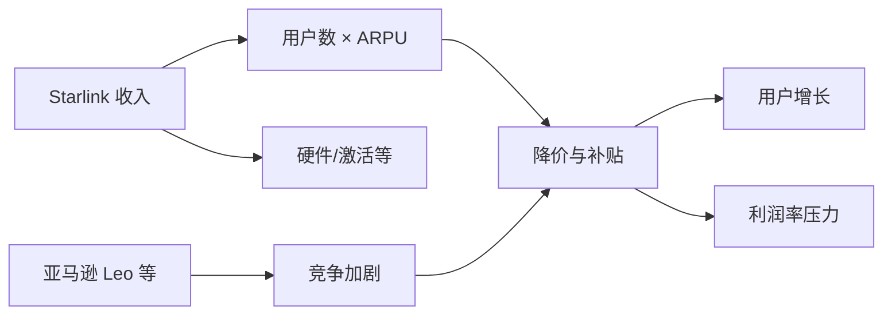

埃隆·马斯克近期将 SpaceX 与 xAI 合并，并多次强调“太空 AI 数据中心”等叙事，为预期中的 2026 年夏季巨型 IPO（估值或超 1.25 万亿美元）造势。然而，从收入与现金流贡献看，SpaceX 体系内真正的营收支柱是 Starlink 卫星互联网业务，而非尚未实现完全可重复使用的火箭发射或尚在烧钱的 xAI/Grok。Starlink 自 2020 年商用以来，已快速超越火箭发射成为 SpaceX 最大收入来源，其用户规模、定价策略与利润率假设正受到摩根士丹利等机构与媒体的持续审视；同时，亚马逊将 Project Kuiper 更名为 Amazon Leo 并计划 2026 年在美英法等国商用，苹果通过 Globalstar 等合作涉足卫星直连手机，谷歌系 Aalyria 获融资，低轨宽带与“手机+卫星”的竞争格局正在重塑。本报告基于 Michael Parekh 在 Substack 专栏“AI: Reset to Zero”的文章及 The Information 等报道，对原文进行逐段译介，并在数据与方法、结果分析、讨论对比及中国情境下展开独立技术评估与政策含义分析。

## 原文译介

### 要点梳理

原文以“苹果与亚马逊 Leo 成为关键潜在玩家”为副题，主线包括：（1）马斯克近期围绕“太空 AI 数据中心”与 SpaceX/xAI 合并的叙事，以及预期 2026 年 6 月前后巨型 IPO 的背景；（2）Starlink 作为 SpaceX 营收与现金流核心的地位，及其在技术上的成就（数千颗低轨卫星、低成本火箭、小型地面终端）与运营现实（卫星衰减需持续补网、与 T-Mobile 等电信商既合作又竞争、定价从高端下探）；（3）火箭完全可重复使用的目标尚未实现，马斯克在 Joe Rogan 播客中承认“尚未达成完全可重复使用”，但 Starship 是首款设计上可实现快速完全复用的火箭，并强调完全复用可将入轨成本降低一两个数量级；（4）The Information 报道的要点——Starlink 在美国大幅降价、在印度与非洲等潜力市场受阻、加大客服与实体店投入；收入不及摩根士丹利此前假设（2025 年约 160 亿美元 vs 预期约 190 亿美元），用户数超预期（如 2025 年末约 920 万，2026 年初达 1000 万）但单用户收入（ARPU）承压；（5）亚马逊 Leo 即将在美国等地商用，亚马逊依托 Prime 与 AWS 关系推动消费者与企业市场；苹果与 Globalstar 合作推进卫星 SOS，作者认为苹果未来 36–48 个月内可能加大合作或并购；谷歌系 Aalyria 获 1 亿美元融资、估值 13 亿美元；结论为无论 SpaceX/xAI 今夏以 IPO 或其他形式交易，低轨宽带与手机接入的“轨道之舞”才刚开场。

### 逐段翻译

作者指出，其近期已多次撰文讨论埃隆·马斯克如何为“太空 AI 数据中心”叙事造势，并与其新近重组的 SpaceX/xAI 相关联，指向一场可能规模巨大的 IPO。此前还有企业资金在 fiduciary 口袋之间腾挪的“壳游戏”。

尤其是作为预期 6 月、规模或超 1.25 万亿美元的巨型 IPO 的预演，时间上恰逢其生日前后。

而尽管当前对其前景的讨论多集中在太空 AI 数据中心以及 xAI/Grok 大模型业务的 AI 算力需求上，真正值得关注的业务是 SpaceX 旗下的 Starlink。

Starlink 是马斯克毋庸置疑的天才创新——部署了由数千颗低轨卫星组成的星座，不仅面向城市与电信有线、寡头垄断的互联现实，更提供高速互联网接入。

从窄带到宽带的连接能力，支撑了自 PC 以来的每一轮技术浪潮：互联网、云、社交、移动，到当前的 AI 技术浪潮。

从技术上讲，Starlink 是人类 ingenuity 的杰作，也是埃隆·马斯克在战术与战略上非凡执行力的体现。

这是在多数风投与政府项目都会却步的财务压力下完成的：用 SpaceX 成本快速下降的火箭发射数千颗小型低轨卫星，再通过地面不断缩小尺寸的接收器传输，形成一场“宇宙接力赛”，把互联网连接任务交给从乡村等地搜寻信号的小型接收器。

此外，数百颗卫星会逐渐脱轨并在大气中烧毁，因此每年都需要持续发射大量新卫星补网。这使马斯克的 Starlink 已占全球在轨活跃卫星约三分之二，且仍在增长，即使用户会干扰地面天文观测。

然后将卫星服务向主流用户销售：每月数百美元的订阅费，以及数百美元的前期费用购买小型碟形卫星接收器，用户需将接收器正确架设在屋顶、移动居所甚至商用飞机上。

很多时候还通过 T-Mobile 等电信商销售——这些电信商本身也与 Starlink 竞争。正如在 AI 其他领域一样，这是一种“亦敌亦友”关系；电信商的核心业务是在城市与农村向主流用户销售无线与有线互联网接入，大部分市场在城市化地区。

鉴于上述现实，Starlink 的订阅制商业模式仍对投资者有吸引力，但在预期 6 月“巨型 AI 上市”之前，紧迫性与挑战都在加大。

The Information 在《SpaceX 的 Starlink 在亚马逊威胁逼近之际抢占市场》一文中做了详尽梳理，开篇即给出要点：

“SpaceX 近期在美国大幅下调了 Starlink 价格。”

“Starlink 在印度、非洲等潜力巨大的市场面临障碍。”

“SpaceX 正在客户服务与实体店上投入更多。”

与其标题中抓眼球的、目前仅部分可重复使用的火箭（由 spectacular 机械臂接住返回的一级）相比，SpaceX 真正的收入主力其实是 Starlink。

“自 2020 年推出以来，SpaceX 的 Starlink 卫星互联网服务已迅速超越其火箭发射业务，成为其最大收入来源，投资者希望其在未来几年成为重要的现金流贡献者。”

SpaceX 的完全可重复使用是真正目标，马斯克本人在近期 Joe Rogan 播客中强调了其经济杠杆意义。

“然而，‘完全可重复使用’至今仍未实现。SpaceX 创始人、CEO 兼首席技术官埃隆·马斯克对播客主 Joe Rogan 表示：‘可以公平地说，我们尚未成功实现完全可重复使用，但我们终于有了一款在设计上可以实现完全可重复使用的火箭。我认为我们明年会实现。这是件大事。’”

“马斯克进一步详述了研制‘完全可重复使用’火箭系统所面临的挑战——从世界最早一批火箭以来就一直困扰航天业——称‘我们在这里是在 pushing 物理极限，要造出迄今无人（包括我们）成功的完全可重复使用入轨火箭……Starship 是第一次出现这样一种设计：完全且快速可重复使用在实际上是可能的……’”

“在解释这对太空运输将产生的巨大影响时，马斯克补充说，‘之所以是大事，是因为完全可重复使用会把进入太空的成本降低一百倍，甚至超过一百倍，可能达到一千倍。’（粗体为原文所加）”

“马斯克详述了上一代太空发射与探索有多烧钱，将其比作每次飞行后丢弃整架飞机、飞行员与乘客跳伞抵达目的地，再换一架全新飞机返航，如此往复。”

“马斯克还称，‘SpaceX 的 Falcon 火箭是至少基本可重复使用的唯一一款。你们见过 Falcon 着陆。我们已完成超过 500 次 Falcon 9 着陆……今年我们仅靠 Falcon 9 就可能向轨道交付大约 2200 到 2500 吨。’”

上述关于火箭可重复使用经济学的整段内容，凸显了 SpaceX 在实现 Heinlein 科幻式的月球卫星弹射发射工厂愿景和/或最终火星计划之前所面临的技术挑战——后者目前同样被普遍认为承诺过高。

值得“grok”（深入理解）的是现实与愿望叙事之间的差距（grok 也是罗伯特·海因莱因科幻中的用语）。

然而，正如科技界常见的那样，当周密计划遇上地面竞争现实的第一记重拳，计划就得调整（套用迈克·泰森的话）：

“但近期为维持用户增长所做的努力，已日益使 Starlink 变成与销售互联网接入的大众市场电信公司竞争的对手，而非 SpaceX CEO 埃隆·马斯克最初设想的高端服务。Starlink 大幅下调硬件与订阅价格以刺激用户增长，同时可能压缩利润。”

“该公司去年在美国推出每月 50 美元的低价档，并在某些情况下免费赠送制造成本高达每台约 600 美元的互联网终端（据两名了解该数字的前 SpaceX 员工）。在欧洲，据另外两名前员工称，Starlink 在遭遇低于预期的需求后更早开始降价。”

而正如酷科技常见的那样，竞争者如蚂蚁扑向诱人食物般涌入：

“本轮降价之际，Starlink 的首个潜在劲敌亚马逊 Leo 正筹备于今年晚些时候在美国及部分其他国家推出服务。同时，Starlink 还在加大投入改善其简陋的客户服务并开设首批实体店。”

“尽管 Starlink 用户增长很快，他们正在疯狂降价以维持增长，”空间顾问 TMF Associates 的 Tim Farrar 表示。“他们已拿下了住在偏远地区的用户，但现在不得不开始与 AT&T、康卡斯特竞争。这需要把价格压得更低。”

在可能成为史上最大 IPO 之一的今年 6 月（除非马斯克先以反向并购方式将 SpaceX/xAI 并入特斯拉）之前，这一切显然具有紧迫性：

“在 SpaceX 可能于今夏进行的首次公开发行之前，Starlink 的现金流潜力应是投资者的一大关注点。在公司与 xAI 合并后尤其如此——xAI 每月烧钱约 10 亿美元。马斯克还在宣扬在太空建数据中心、在月球建卫星工厂等烧钱计划。”

“分析师曾预期 Starlink 将在未来几年越来越成为公司整体自由现金流的重要驱动力，且 Starlink 的利润率最终将远超 SpaceX 的发射业务。但支撑早期预期的一些假设正日益存疑。”

过去几年，Starlink 作为公开市场 IPO 亮点的前景已有所减弱：

“在 2024 年一份在 SpaceX 投资者中广泛流传的报告中，摩根士丹利分析师在假设中预计，2024 年和 2025 年 SpaceX 每年从每位 Starlink 用户获得超过 2000 美元——即每月超过 170 美元——且不含硬件或激活费。（摩根士丹利历来是马斯克青睐的投行，也是近年开始为私募市场公司提供研报的银行之一。）”

“该报告中，摩根士丹利还预计 SpaceX 2025 年总收入将达 190 亿美元，主要由 Starlink 用户数增长驱动，该行预测用户数将达 600 万。而 Starlink 去年末实际拥有 920 万用户，高于预测，但 SpaceX 收入不及预期，约 160 亿美元。Starlink 称本月已突破 1000 万用户。”

竞争对手则摩拳擦掌，如亚马逊新更名的 Leo：

“据一位接近亚马逊的人士称，亚马逊内部领导层过去几个月一直在密切关注 Starlink 面向消费者的降价，并将其解读为在亚马逊 Leo 推出前抢占份额的策略。”

“该人士称，亚马逊计划利用其庞大的 Prime 会员及其他客户基础销售消费者订阅，并依托现有 AWS 与企业和政府的关系推动企业销售并在全球范围内便利当地许可审批。”

Starlink 的计划与前景自五年多前推出以来已发生巨大变化：

“SpaceX 最初将 Starlink 设想为高端服务——马斯克曾对员工表示网速必须足以支持严肃的在线游戏——定价可显著高于传统有线宽带。2020 年在美国推出时，月费为 99 美元，另加数百美元购买硬件。”

“但在推动采用与尽可能高效利用 Starlink 基础设施之间取得平衡，是一项复杂的全球性工作。”

再次将 Starlink 大量迷你卫星的“宇宙芭蕾”与卫星不断上下场的流体动态记在心里是有益的：

“Starlink 通过数千颗在轨卫星环绕地球、向客户下行传输互联网服务而工作。这意味着当某颗卫星飞越不销售订阅的地区时，SpaceX 等于在白白浪费容量。”

即便 Starlink 足迹已遍及全球，在各国与监管‘红线’丛林中做营销仍是独一档的任务：

“在尽可能多的国家扩张一直是 SpaceX 高层的优先事项。这需要争取当地监管机构，有时还要应对强势电信公司的阻力才能落地。公司已在超过 150 个国家提供 Starlink。”

“但据三名了解相关工作的前员工称，SpaceX 在若干潜力巨大的市场争取监管批准的难度比最初预期更大。”

“其中包括印度。SpaceX 2021 年开始接受 Starlink 预购后，政府很快勒令在获得运营许可前停止接单并退还已收款项。Starlink 至今未在印度推出。SpaceX 也尚未在埃及、埃塞俄比亚、南非等非洲主要国家推出。”

很多时候，需求相对预期显得平淡：

“在 Starlink 已落地的美国以外部分地区，初期需求低于预期。据其中一名前员工称，SpaceX 高层最初认为进入欧洲等新市场时需保持定价一致，否则某些市场的客户会看到别处不同价格而感到被宰。”

“但据另外两名前员工称，Starlink 在欧洲增长乏力——其 2021 年开始在欧洲推出——部分原因在于欧洲消费者普遍习惯的互联网价格低于美国。2022 年公司开始在欧洲多国降价，先从法国将月费降至 50 欧元（当时约 50 美元）。”

在较好市场调价并未扭转局面：

“同年，SpaceX 在美国提高了 Starlink 价格，2022 年提至 110 美元、2023 年 120 美元。但最近又掉头，在美国推出网速较慢的‘lite’套餐，低至每月 50 美元，并在部分产能过剩地区提供更深的折扣。”

“在硬件方面，SpaceX 目前在美国将标准住宅终端售价定为 349 美元，低于 2023 年推出时的 599 美元，并在用户特别稀疏的某些地区频繁提供更深折扣或免费终端。”

竞争对手则在制定自己的计划与定价：

“亚马逊尚未公布硬件或订阅价格。但该公司过去不惧对 Alexa 等硬件进行补贴，并将卫星互联网野心描述为让全球更多地方接入网络，从而提振其电商与娱乐业务。”

这意味着 Starlink 在仍具一定时间窗口优势时加速抢占市场：

“Starlink 正在赶在亚马逊之前加速市场渗透，”研究与投资机构 Quilty Space 的 Chris Quilty 表示。“但我不认为市场充分意识到亚马逊上线后格局将如何变化。亚马逊将是一股颠覆力量。”除降价外，SpaceX 为壮大 Starlink 并留住客户还在其他策略上做出调整。在 Starlink 大部分历史中，它直接向消费者销售，主要通过自家网站且几乎不做营销，成本相对较低。但最近公司加大了在营销与渠道上的投入。

该文值得通读以获取大量细节与图表；原文配图之一如图1所示。

作者认为，文中未提及的另一个可能在未来几年进入市场的玩家是苹果。

苹果近期一直在密切研究与卫星直连手机提供商 Globalstar 等的合作，甚至向该公司投资 10 亿美元。目前仍属小规模试验，主要为全球逾 20 亿部 iPhone 提供“紧急 SOS”类能力。但显然他们在为在这一领域更大动作蓄势。

作者虽不预期苹果会自建卫星星座，但不排除未来 36 至 48 个月内出现更大规模的合作和/或并购。

随着 soon 数以万计乃至数十万颗小型卫星布满天空，全球数十亿智能手机的互联网接入方式正在迅速改变。这将改变当今电信商靠提供全球互联网接入谋生的方式。

谷歌也参与其中：2022 年从谷歌剥离的 Aalyria 刚以 13 亿美元估值融资 1 亿美元。

苹果与谷歌尤其在此有核心利益，因其主导全球的 iPhone 与 Android 智能手机平台。

因此，无论 SpaceX/xAI 今年晚些时候在这轮 AI 技术浪潮中以 IPO 或其他交易形式表现如何，这场轨道之舞才刚开场。

会有新玩家很快入场。敬请关注。

（注：此处讨论仅供信息参考，任何时候均不构成投资建议。感谢参与。）

## 数据与方法

### 数据来源与业务场景

本报告所依据的事实底稿来自：（1）Michael Parekh 在 Substack 专栏“AI: Reset to Zero”发布的文章《AI: Elon Musk SpaceX/xAI IPO's Starlink pitch realities. RTZ #1007》，原文 URL 为 https://michaelparekh.substack.com/p/ai-elon-musk-spacexxai-ipos-starlink；（2）The Information 报道《SpaceX's Starlink Makes Land Grab as Amazon Threat Looms》中的定价、用户数、收入与战略描述；（3）摩根士丹利 2024 年流传于 SpaceX 投资者中的预测假设（ARPU、总收入、用户数）与后续实际数据的对比；（4）公开报道中亚马逊 Leo（原 Project Kuiper）的商用时间表、苹果与 Globalstar 合作、Aalyria 融资等。补充数据来自 Quilty Space、Reuters、SpaceNews 等对 2025–2026 年 Starlink 收入与用户预测及中国低轨星座进展的报道。

### 方法与模型构建

为评估 Starlink 在 IPO 叙事下的可持续性，本报告采用以下分析框架：（1）收入与单位经济——将“总收入 = 用户数 × ARPU + 硬件与激活等”拆解，对照机构假设与实际披露（如 2025 年收入约 160 亿美元、用户约 920 万至 1000 万），推断 ARPU 下行压力；（2）竞争与替代——识别亚马逊 Leo、传统电信（AT&T、康卡斯特）、以及苹果/谷歌在卫星直连与生态上的潜在影响；（3）监管与地理覆盖——将印度、非洲部分国家等作为“高潜力但未落地或受阻”市场，与已落地市场的定价与需求表现对比；（4）火箭与星座成本——将“完全可重复使用”视为未实现状态，Starship 为未来成本下降的假设前提，不纳入当前 Starlink 现金流评估。下文结果与分析、讨论与对比及中国情境均在此框架下展开。

## 结果与分析

根据原文与补充信源，可归纳如下结果。

Starlink 已是 SpaceX 最大收入来源，但总收入低于摩根士丹利 2025 年约 190 亿美元的预测，实际约 160 亿美元；用户数则高于该行预测（约 920 万至 1000 万）。由此可推知单用户收入（ARPU）明显低于报告假设的“每年超过 2000 美元（约 170 美元/月）”。这与 The Information 及作者所述“大幅降价、免费或补贴终端”一致。

在美国，Starlink 从早期 99 美元/月、后升至 110–120 美元/月，再推出 50 美元/月“lite”档及区域折扣；终端从 599 美元降至 349 美元并在部分区域免费或深度折扣。在欧洲，需求不及预期后率先降价（如法国 50 欧元/月）。在印度与埃及、埃塞俄比亚、南非等非洲国家，Starlink 尚未商用或受阻于监管。

亚马逊 Leo（原 Kuiper）计划 2026 年在美、加、英、法、德等国商用，并依托 Prime 与 AWS 关系拓展消费者与企业市场；苹果通过 Globalstar 投资与卫星 SOS 试水；Aalyria 获 1 亿美元融资、估值 13 亿美元。Starlink 在加大客服与实体店、与 T-Mobile 等“亦敌亦友”渠道合作的同时，正以降价与补贴抢占在亚马逊 Leo 全面铺开前的份额。

火箭完全可重复使用尚未实现；马斯克公开表示 Starship 是首款设计上可实现完全且快速复用的火箭，并称完全复用可将入轨成本降低一两个数量级。当前 Starlink 的现金流与估值叙事仍主要依赖现有 Falcon 发射成本与星座运维，而非 Starship 或“太空数据中心”等远期故事。

上图概括了 Starlink 收入结构与其降价、用户增长、利润率压力及外部竞争之间的逻辑关系；在 ARPU 下行与竞争加剧叠加下，早期高 ARPU、高利润的假设需下调。

## 讨论与对比

**技术可行性。** Starlink 在轨卫星数量与覆盖、终端小型化与成本控制已得到商业验证；制约在于（1）卫星寿命与脱轨导致的持续补网成本；（2）频谱与监管在不同国家的审批节奏；（3）在城市化程度高、地面宽带充足的市场，LEO 宽带更多是补充而非替代，价格必须与地面宽带竞争，从而压制 ARPU。完全可重复使用若实现，将显著降低发射成本，但时间与工程不确定性大，不宜作为短期估值核心。

**与亚马逊 Leo、地面电信的对比。** 亚马逊 Leo 在美欧等地的商用时间表（如 2026 年）与 Starlink 形成直接竞争；亚马逊可借助 Prime 与 AWS 交叉销售与政企关系，在获照与定价上具有不同策略空间。地面电信（AT&T、康卡斯特、T-Mobile 等）在人口密集区具备成本与覆盖优势；Starlink 的差异化主要在农村、海上、航空及新兴市场未覆盖区，在这些区域与低价策略结合才能维持用户增长，但会进一步拉低 ARPU。文献与行业报告普遍指出，LEO 宽带在“未覆盖/ underserved”市场具有社会与商业价值，但单位经济高度依赖定价与监管落地速度。

**敏感性。** 若印度等大市场在未来 24–36 个月内开放并采用中低定价，用户数可能显著上升但 ARPU 仍将承压；若亚马逊 Leo 推迟或执行不力，Starlink 的时间窗口会延长，有利于在发达市场巩固份额后再应对价格战。xAI 合并后每月约 10 亿美元烧钱，加大了 Starlink 需贡献正现金流的紧迫性，也使得“太空数据中心”等叙事更多属于长期愿景而非当前估值锚点。

## 中国情境下的分析与评估

根据公开政策与产业信息，中国正在推进国家主导与商业并行的低轨宽带星座建设，与 Starlink、Amazon Leo 形成不同轨道的竞争与互补关系。

**政策与监管。** 中国低轨卫星互联网纳入国家空间基础设施与“新基建”范畴，频率与轨道资源由主管部门统筹；外资主导的 Starlink 在中国大陆境内未获运营许可，短期内难以直接落地。国内星座（如国网 Guowang、上海斯派克等）在“一带一路”与海外市场寻求合作与出口，与 Starlink、Kuiper 在第三国市场存在竞争。工信、广电及天文观测相关规范对低轨星座的频谱使用与光污染等有约束，国内外星座均需在合规前提下部署。

**产业与技术生态。** 中国已形成航天科技、航天科工及商业航天公司在发射、卫星制造与运营上的分工；国网等星座规划规模达万余颗，与 Starlink、Kuiper 在轨规模量级接近。国内手机厂商与运营商在卫星通信上的试点（如北斗短报文、卫星 SOS 等）与苹果–Globalstar、谷歌–Aalyria 等路径存在差异，但“手机+卫星”的全球趋势将推动国内在标准、芯片与终端上的跟进。根据公开报道，中国 2024 年低轨卫星发射数量创纪录，上海斯派克等企业在巴西等国推进合作，与 Amazon Leo、Telesat 等在国际市场存在直接竞争。

**风险与机遇。** 从国家空间基础设施安全与关键技术自主可控角度，发展本土低轨宽带与卫星通信能力具有战略意义；从数字鸿沟与偏远地区覆盖看，LEO 宽带与地面 5G/光纤互补可提升普遍服务。机遇包括：国内产业链在星箭、终端与运营上的规模化与成本下降；海外市场（尤其“一带一路”与监管相对开放国家）的出口与合作。风险包括：轨道与频谱的国际协调压力；与 Starlink、Leo 等在国际市场的价格与份额竞争；以及天文观测、碎片与可持续性等全球共同关切。中国情境下，Starlink 本身不直接参与境内市场，但全球 LEO 格局演变将影响国内星座的国际化策略与合作伙伴选择。

## 结论与建议

Starlink 是 SpaceX 当前收入与现金流的核心，其技术成就与商业落地已获验证，但在预期 2026 年夏季 SpaceX/xAI 巨型 IPO 的叙事下，早期高 ARPU、高利润的假设已因大幅降价、补贴终端及印度与非洲等潜力市场受阻而承压；收入低于摩根士丹利 2025 年预测而用户数超预期，印证了“以价换量”的现状。亚马逊 Leo 即将在美欧等地商用，苹果与谷歌通过卫星直连与生态从侧翼切入，竞争格局正在重塑。

对工程与产品团队，建议将 Starlink 的可持续性评估建立在当前 ARPU 与补网成本的基础上，并针对亚马逊 Leo 上线后的价格与份额压力做情景规划。对政策制定者，建议在鼓励本国低轨宽带与卫星通信发展的同时，统筹频谱、轨道与天文观测等国际规则，并关注数字鸿沟与普遍服务目标。对投资者，建议在 IPO 或合并交易中区分“当前现金流贡献（Starlink）”与“长期叙事（完全可重复使用、太空数据中心、xAI）”，对后者采用更长的时间跨度和更高的不确定性折价。

无论 SpaceX/xAI 今夏以何种形式登陆资本市场，低轨宽带与“手机+卫星”的轨道之舞才刚开场；Starlink 的现实是这一舞池中的核心变量之一。

## 参考文献

1. Parekh, M. (2026). AI: Elon Musk SpaceX/xAI IPO's Starlink pitch realities. RTZ #1007. *AI: Reset to Zero*. https://michaelparekh.substack.com/p/ai-elon-musk-spacexxai-ipos-starlink
2. The Information. (2026). SpaceX's Starlink makes land grab as Amazon threat looms. https://www.theinformation.com/articles/spacexs-starlink-makes-land-grab-amazon-threat-looms
3. Reuters. (2025, February 24). Musk's Starlink races with Chinese rivals to dominate satellite internet. https://www.reuters.com/technology/musks-starlink-races-with-chinese-rivals-dominate-satellite-internet-2025-02-24/
4. SpaceNews. (2025, July). China adds new satellites to Guowang constellation, eyes accelerated launch rate. https://spacenews.com/china-adds-new-satellites-to-guowang-constellation-eyes-accelerated-launch-rate/
5. Rayal, F. (2025, May 19). China's LEO megaconstellations: Closing the gap in the global space race. https://frankrayal.com/2025/05/19/chinas-leo-megaconstellations-closing-the-gap-in-the-global-space-race/
6. Quilty Space. (2025). *Starlink financial & strategic analysis 2025 1H*. https://www.quiltyspace.com/product-page/starlink-financial-strategic-analysis-2025-1h
7. Aviation Week. (2025). Amazon rebrands Project Kuiper to “Amazon Leo”. https://aviationweek.com/space/satellites/amazon-rebrands-project-kuiper-amazon-leo
8. Parameter. (2026). Amazon sets 2026 launch date for Kuiper satellite internet rollout. https://parameter.io/amazon-sets-2026-launch-date-for-kuiper-satellite-internet-rollout/
9. SpaceConnect Online. (2025). Next year Musk predicts full reusability rocket imminent. https://www.spaceconnectonline.com.au/launch/6815-next-year-musk-predicts-full-reusability-rocket-imminent
10. Electrek. (2026, January 28). Tesla invests $2 billion in Elon Musk xAI cash furnace. https://electrek.co/2026/01/28/tesla-invests-2-billion-in-elon-musk-xai-cash-furnace/
11. Wall Street Journal. (2026). Why Elon Musk is racing to take SpaceX public. https://www.wsj.com/tech/why-elon-musk-is-racing-to-take-spacex-public-38f3de9b
