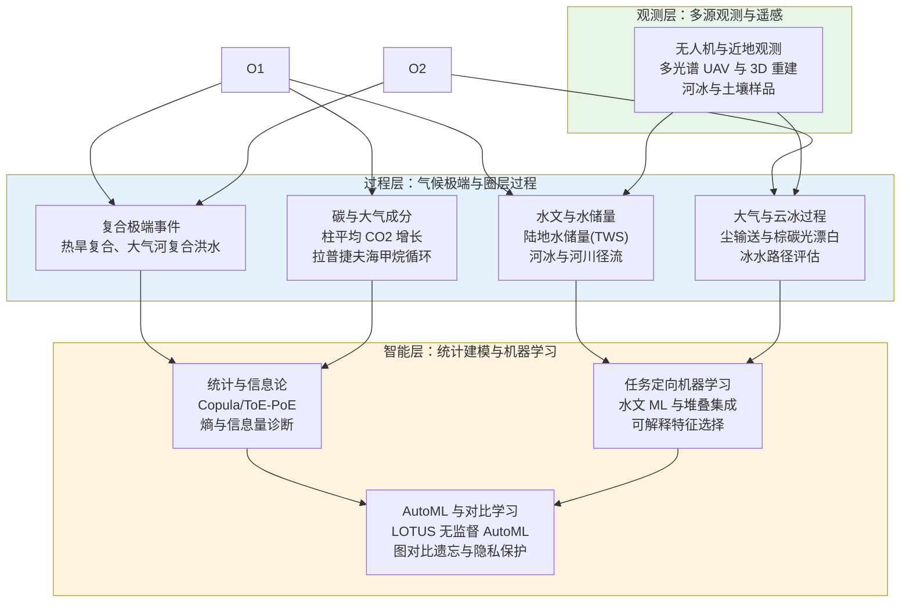
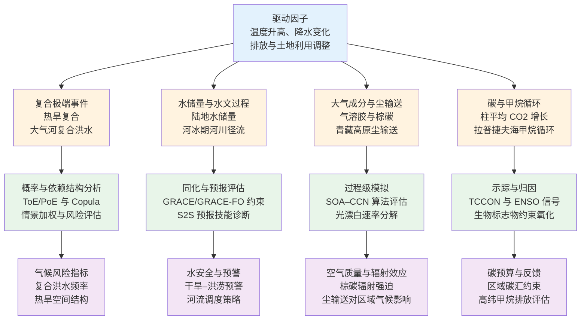
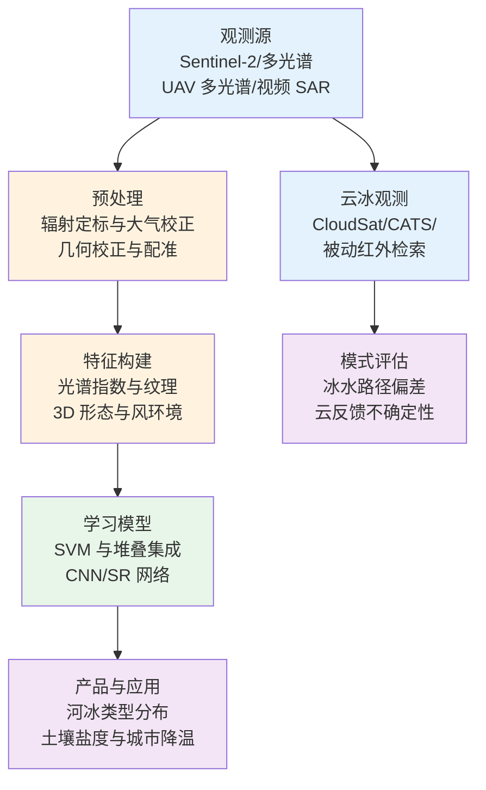
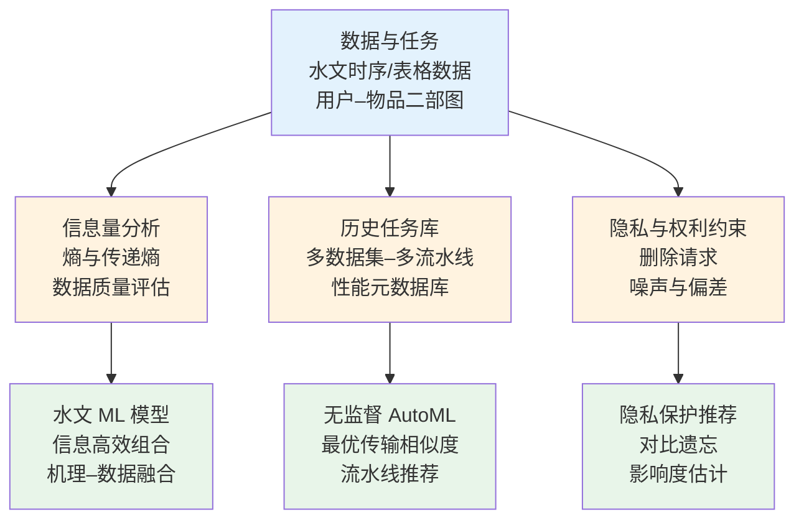
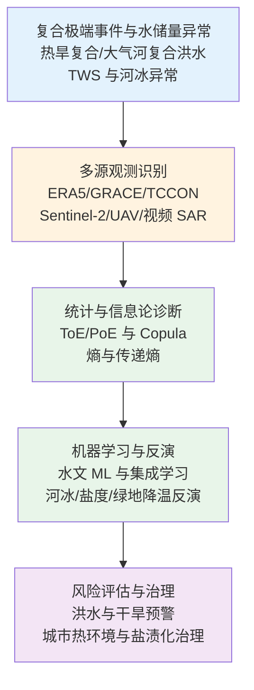
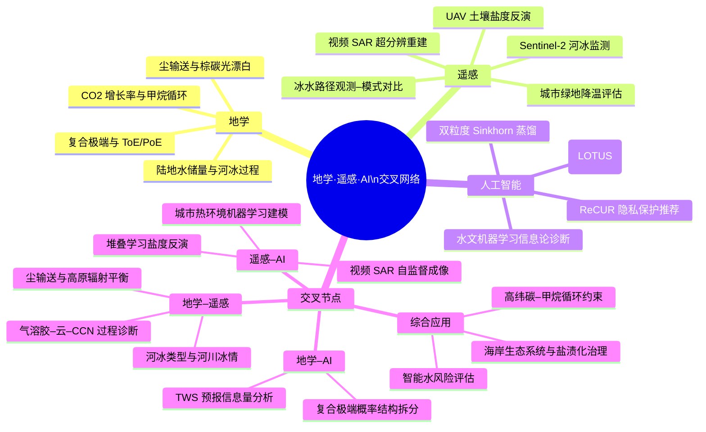

在 2026-02-24 至 2026-03-03 这一时间窗口内，Nature、Nature Climate Change、Nature Geoscience、Nature Reviews Earth & Environment、Atmospheric Chemistry and Physics、Hydrology and Earth System Sciences、Remote Sensing、Biogeosciences、GPS Solutions、Solid Earth 与 Machine Learning 等期刊集中刊发了一系列围绕极端气候事件、水文与碳循环、冰冻圈与尘暴过程、遥感智能反演，以及 AutoML 与长尾噪声学习等主题的工作。结合本期论文目录与 2024–2026 年间关于地学与遥感基础模型、气候极端与复合事件诊断的综述性研究，可以观察到一个日益清晰的格局：在地学研究中，气候极端、陆面水储量与甲烷循环等问题正通过再分析资料、卫星反演与多模型集合实现更精细的归因与预测；在遥感领域，视频 SAR、无人机多源 3D 重建与可解释集成学习显著增强了对河冰、土壤盐渍化及城市热环境的刻画能力；在人工智能方向，面向无监督任务的 AutoML、信息量定量诊断的水文机器学习以及隐私保护推荐算法，为构建稳定、可泛化的地学 AI 工具提供了新的方法论基础。

## 一、本期研究印记图：复合极端、水循环与智能观测的三层结构

本期论文集中体现了地表过程、观测手段与智能方法三类要素之间的紧密耦合。

在地表过程层面，关于欧洲热旱复合事件、北美大气河引发的复合内陆洪水、青藏高原周缘尘输送日变化、东部高原降水滴谱垂直结构以及拉普捷夫海甲烷循环等研究，强调了利用长时段再分析与多源观测识别“出离自然变率”的信号，并通过概率与信息论框架拆分边缘分布变化与依赖结构变化的贡献。在水循环与碳循环方面，FEWS NET 土地数据同化系统的亚季节至季节陆地水储量预报评估、TCCON 观测约束的柱平均 CO₂ 年增长率估算，以及增强岩石风化负排放技术不确定性评估，共同指向基于观测–模式互证的定量风险表述。

在观测与遥感层面，Sentinel-2 河冰类型精细分类、无人机多光谱影像联合堆叠学习反演海岸带土壤盐度、视频 SAR 自监督超分辨重建以及多时相、3D 形态重建支撑的城市绿地降温效应评估，体现出高时空分辨率观测与可解释机器学习的深度结合。与此同时，CloudSat、CATS 等卫星产品与机载/地基观测共同支撑的大气冰水路径评估，系统梳理了冰水路径观测与全球模式模拟中的进展与难点。

在人工智能方法方向，面向无监督表格任务的 LOTUS 框架、利用信息熵衡量训练数据量与信息质量的水文机器学习评估，以及针对长尾噪声标签的 Sinkhorn 蒸馏与隐私保护推荐的对比“遗忘”方法，反映出当前机器学习社区正在从“单任务性能”走向“跨任务自动建模、信息利用效率与数据权利保护”的综合指标。

可以用一幅“过程–观测–智能”的印记图刻画上述结构关系。

在此基础上，下面分别围绕地学、遥感与人工智能三个研究方向，选取具有代表性的论文群体，构建“技术路线–技术特点–重要结论”三维度的专题画像，并在交叉学科部分通过网络图与创新链流程图总结多学科耦合关系。

## 二、地学方向：复合极端、水储量与气溶胶–云–气候过程

本期地学相关论文主要集中在四类主题：一是极端复合事件与风险诊断，包括利用 1950–2023 年 ERA5 再分析识别欧洲–北非热旱复合事件概率“出离自然变率”的时空结构，以及基于 CanRCM4 大集合模拟定量大气河驱动的复合内陆洪水在气候变暖中的贡献；二是陆地水储量与水文预报，例如 FEWS NET 土地数据同化系统在非洲开展的亚季节至季节陆地水储量预报技能评估，以及在河冰条件下通过 Delft-FEWS 耦合水文–水动力模型改进加拿大河流径流预报；三是大气成分与气溶胶过程，包括华北平原农药气–粒分配机制、青藏高原周缘尘输送日季节变化、二次有机气溶胶对云凝结核的贡献以及棕碳光漂白的源依赖性；四是碳循环与甲烷过程，如 TCCON 柱平均 CO₂ 年增长率诊断 ENSO 与 COVID‑19 排放扰动，以及拉普捷夫海货架沉积物生物标志物记录的甲烷氧化增强。

综合这些工作，可以抽象出“驱动因子–过程诊断–影响评估”的过程链：气候强迫与人类活动改变温度、降水与气溶胶排放格局，在再分析、观测与模式中表现为极端复合事件、水储量异常和尘/气溶胶输送路径变化；信息论、Copula 及集合模拟则将这些异常结构拆分为边缘分布变化、依赖结构变化与内部变率贡献；最终，结果被映射到水风险、空气质量与碳收支的定量指标上。

下文选取若干具有代表性的研究，对其技术路线、技术特点及重要结论进行专题化刻画。

### 2.1 专题画像：欧洲–北非热旱复合事件的时空结构与驱动分解  （Schmutz et al., 2026, NHESS）

**（1）技术路线：ToE/PoE 与 Copula 框架下的复合事件诊断**

该研究基于 1950–2023 年 ERA5 再分析资料，将高温与干旱指标联合构造为双变量复合事件，并通过时间与时间段出离点（time of emergence, ToE；periods of emergence, PoE）量化热旱复合事件概率何时、在哪些区域系统性超出历史自然变率。技术路线首先采用经验分布函数刻画高温与干旱边缘分布的长期演变，然后利用二元 Copula 建模依赖结构，从而将复合概率变化拆分为边缘变化与相关结构变化两部分。通过在欧洲和北非选取五个具有代表性的区域，研究比较了不同 Copula 家族对依赖结构的拟合效果，并检验在忽略相关结构变化时 ToE/PoE 估计的偏差。

**（2）技术特点：边缘分布与依赖结构贡献的定量分解**

相较于仅通过单变量阈值统计极端事件频次的传统方法，该工作在技术上实现了复合事件频率变化分量的明确归因：一方面采用 Copula 结构参数的时间演变表征依赖结构变化，另一方面在保持 Copula 不变的情况下替换边缘分布，分别计算由边缘与依赖结构变化单独导致的复合概率变化。这一“结构分解”框架使得研究者能够识别出某些区域中热旱复合事件增加主要源于温度分布重排，而另一些区域则主要由水分亏缺指标的变化驱动。同时，引入 PoE 概念后，不仅可以识别单一时间点的出离，还可以刻画持续时间与间歇性出离的时段。

**（3）重要结论：依赖结构虽少为主导，却是识别信号出离不可或缺的组成部分**

该研究的重要结论是：**在欧洲–北非大部分区域，热旱复合事件概率的增加主要由高温与干旱边缘分布的变化驱动，但依赖结构的变化对于确定 ToE 与 PoE 时刻仍然至关重要，忽略热–旱相关结构变化会导致 ToE 与 PoE 的估计在部分区域偏差超过 20 年，既可能高估也可能低估风险出离时间**。这一结论表明，在极端复合事件风险评估中，仅基于单变量变化或简单相关系数会显著低估结构性不确定度，对于基础设施规划与适应策略制定，需要在 Copula 及信息论框架下开展更系统的复合事件诊断。

### 2.2 专题画像：FEWS NET 土地数据同化系统的陆地水储量 S2S 预报技能  （Li et al., 2026, HESS）

**（1）技术路线：GRACE/GRACE-FO 约束下的多模式集合评估**

该研究利用 FEWS NET 土地数据同化系统（FLDAS）生成的亚季节至季节陆地水储量（TWS）预报，对比 GRACE 与 GRACE-FO 反演结果，系统评估了非洲地区 1–6 个月预报提前期上的 TWS 预报技能。技术路线包括：在陆面模式层面引入 Noah-MP 与 NASA Catchment Land Surface Model（CLSM）两套物理不同的模拟框架，利用再分析驱动与降水预报驱动分别产生集合预报；随后通过 ROC 得分、相关系数与概率评分衡量 tercile 预报技能，并使用信息论指标分析不同降水预报集合在信息量与信息质量上的差异；最后，将模式 TWS 序列通过变换映射到 GRACE/GRACE-FO 可观测的空间–时间尺度，以保证可比性。

**（2）技术特点：初始条件与降水驱动信息量的系统拆分**

研究的一大技术特点是明确区分初始 TWS 条件与降水驱动不确定度对预报技能的贡献。通过对比再分析驱动与季节预报驱动情景，作者发现 CLSM 由于在再分析约束下更好地再现了 GRACE 观测中的年际变率，其初始条件在 1–6 个月提前期上具有更强的“记忆”效应；同时，通过对不同降水预报集合进行信息熵与传递熵分析，表明降水序列的年际方差幅度与空间相关结构对 TWS 预报信息量具有决定性作用。

**（3）重要结论：准确刻画 TWS 年际变率与降水变率是提升 S2S 预报技能的关键**

该研究的重要结论是：**在非洲地区的陆地水储量亚季节至季节预报中，能够重现 GRACE/GRACE-FO 所揭示的年际变率结构的陆面模式（如 CLSM），在 1–6 个月提前期上显著优于未进行再分析约束的方案；同时，预报驱动降水的年际变率幅度与空间结构直接决定 TWS 预报技能，过强或过弱的降水变率都会损害技能**。这一结论提示，针对干旱易发区的水资源预警系统，应优先投资于改善再分析–观测一体化的初始条件与适度约束方差的降水集合预报，而不仅仅是提高单一模式的空间分辨率。

### 2.3 专题画像：青藏高原周缘尘输送日季节变化与多源观测融合  （Xu et al., 2026, ACP）

**（1）技术路线：CATS 激光雷达反演与多产品对比的尘通量估算**

该研究聚焦青藏高原周缘尘输送的时空特征，利用 CATS 激光雷达反演的尘质量浓度与多套再分析资料、卫星产品和地基观测进行对比，构建南、北侧尘输送带的三维结构。技术路线包括：提出一种基于 CATS 反演参数的新型尘质量浓度检索方法，并通过与多产品进行空间–时间一致性检验；在此基础上，沿不同方位与高度层积分估算输送至高原的尘通量与回流通量；最后，以 3 小时分辨率刻画不同剖面上的日变化特征，识别白天与夜间输送机制差异。

**（2）技术特点：多源观测的一致性检验与三维尘输送带刻画**

与仅依赖单一卫星或模式产品的研究相比，该工作通过系统对比 CATS、再分析和其他卫星产品，在空间平均、时间序列和剖面结构三个层面评估尘质量浓度的一致性，从而为尘通量估算提供误差边界。此外，以南、北侧两条稳定尘输送带为骨架，研究对不同季节的通量来源区、高度分布与回流路径进行了详细分析，揭示了春季尘输送高峰与沙漠源区边界层–自由对流层耦合的关系。

**（3）重要结论：稳定尘输送带和显著日变化共同塑造高原尘气候环境**

该研究的重要结论是：**青藏高原南、北缘存在稳定的尘输送带，春季通量峰值最为显著，且在垂直结构上呈现“上游高、下游低”的分层特征；日变化分析表明，尘通量在不同剖面上表现出明显的三小时尺度波动，反映出边界层发展、山谷风与高原涡旋的综合影响**。这一结论加深了对高原尘气候学的认识，也为评估尘输送对辐射收支与冰雪消融的长期影响提供了三维过程基础。

### 2.4 专题画像：柱平均 CO₂ 年增长率与 ENSO、COVID‑19 排放扰动  （Mostafavi Pak et al., 2026, Biogeosciences）

**（1）技术路线：TCCON 多站点观测与多方法增长率估算**

该研究利用 12 个 TCCON 站点 2010 年以来的柱平均 CO₂（XCO₂）观测，针对极地夜缺测等问题设计了三种年增长率估算方法（Monthly Mean、Fourier Fit 残差、Dynamic Linear Model），并与 Mauna Loa 地面观测和 CAMS 再分析产品对比。技术路线在于：首先对不同方法在存在数据缺测条件下的鲁棒性进行敏感性分析，识别在高纬站点和中纬度站点的最优方法；随后在区域尺度上综合各站点增长率序列，分析 ENSO 事件与 2020 年排放下降事件的信号；最后利用相关分析量化 ENSO 指数与增长率之间的区域相关性。

**（2）技术特点：面对缺测的增长率估算与再分析一致性检验**

与传统依赖规则时间序列的增长率估算不同，该工作重点解决高纬站点长期极夜造成的大量数据缺口问题，通过 DLM 方法在时间序列模型中显式表示趋势、季节性与噪声，显著提高了缺测条件下的稳健性。与此同时，将 TCCON 导出的增长率与 CAMS 再分析产品进行对比，有助于检验再分析在长时间尺度上对观测信号的再现能力，并识别区域性差异。

**（3）重要结论：ENSO 信号清晰，可检测的 COVID‑19 排放下降仅在部分纬带出现**

该研究的重要结论是：**在 2010–2024 年期间，TCCON 导出的柱平均 CO₂ 年增长率在南半球与 Mauna Loa 站点上与 ENSO 指数存在显著正相关，2015–2016 年强 El Niño 对增长率的正向扰动可达 1.7 ppm yr⁻¹；而 2020 年与 COVID‑19 相关的排放下降仅在 30–40°N 纬带表现为约 0.4 ppm yr⁻¹ 的显著下降，在其他区域并未显著脱离年际噪声范围**。这一结论表明，在当前观测与天然变率背景下，短期排放下降对大气 CO₂ 增长率的可检测性具有强区域依赖性，强调了长期稳定观测的重要性。

## 三、遥感方向：河冰监测、城市热环境与土壤盐渍化反演

本期遥感相关论文集中反映出河冰与河川冰情监测、城市与海岸环境精细制图以及大气冰水路径评估三类应用需求与方法创新。一方面，基于 Sentinel‑2 的黄河内蒙古河段河冰类型精细分类工作表明，高分辨率光学影像结合多谱段指数可以显著提升对镶嵌冰、稳定冰与开阔水面的分辨能力；另一方面，利用无人机多光谱影像与堆叠学习的海岸土壤盐度反演，以及多时相多源数据支撑的城市绿地降温效应评估，展示了近地观测与卫星融合的潜力。此外，视频 SAR 自监督超分辨重建与大气冰水路径观测–模式对比研究，则从雷达成像与三维云冰质量估算两个角度推动遥感观测走向更高的时空分辨率与物理一致性。

### 3.1 专题画像：黄河内蒙古河段河冰类型 Sentinel‑2 精细分类  （Leng et al., 2026, Remote Sensing）

**（1）技术路线：多谱段指数与 SVM 结合的河冰类型判别**

该研究针对黄河内蒙古河段冬季同时存在镶嵌冰、稳定冰与开阔水面的复杂冰情格局，构建了基于 Sentinel‑2 高分辨率光学影像的河冰类型分类流程。技术路线包括：首先在 2023–2024 年冬季采集多景 Sentinel‑2 影像，利用标准反射率产品进行大气与辐射校正；随后计算归一化差异雪指数（NDSI）、归一化差异冻结面指数（NDFSI）等多种多谱段指数，并与原始多光谱反射率一起作为特征向量输入支持向量机分类器；最后通过实测河冰调查与高分辨率参考影像验证分类精度，并分析整个河段上不同冰类型面积比例的时间演变。

**（2）技术特点：面向河冰场景优化的光谱指数组合与特征工程**

与传统基于单一冰雪指数的简化判别不同，该工作针对河道冰–水混合场景，系统探索了对不同冰类型光谱差异更敏感的指数组合，并通过特征选择优化输入维度。在模型层面，SVM 提供了在中等样本规模下较为稳健的决策边界，而多谱段指数与反射率联合特征则有效提升了对细窄开阔水带和镶嵌冰边缘的识别能力。研究结果表明，整体分类准确率达到约 95%，在复杂河段同样保持稳定。

**（3）重要结论：高分辨率光学遥感可为河冰防灾提供可靠基础信息**

该研究的重要结论是：**利用 Sentinel‑2 高分辨率光学影像，结合针对河冰场景优化的多谱段指数和 SVM 分类器，可以在流域尺度上可靠地区分镶嵌冰、稳定冰与开阔水面，分类准确率接近 95%，并揭示 2023–2024 年冬季不同冰类型面积比例在整个河段上的系统变化**。这一结论说明，高分辨率光学遥感在河冰风险评估与防凌调度中具有重要应用潜力，可为水利部门提供快速、一致的冰情信息。

### 3.2 专题画像：城市绿地降温效应的多时相 3D 重建与贝叶斯网络分析  （Lyu et al., 2026, Remote Sensing）

**（1）技术路线：多时相采样、3D 形态重建与广义加性–贝叶斯联合建模**

该研究针对城市绿地降温效应评估中存在的样本不足与内部结构刻画不充分问题，提出了一个可转移的建模–优化框架。技术路线包括：通过多时相地面观测、无人机多光谱影像与 Sentinel‑2 影像融合，量化绿地内部二维与三维结构、周边建筑通风条件及背景气象变量；随后构建广义加性混合模型刻画降温强度与范围对这些因子的响应曲线，并在此基础上使用贝叶斯网络识别最优配置组合；最后在多个城市绿地样本上进行交叉验证以检验模型可转移性。

**（2）技术特点：内部结构–周边通风–背景气象的综合刻画**

与仅基于地表温度与简单土地覆盖信息的经验模型不同，该研究在特征构建阶段显式考虑了绿地内部面积与形状指数、树冠高度与孔隙结构，以及建筑高度与街谷通风条件，并通过多时相采样降低邻近水体与其他绿地干扰。广义加性模型为非线性关系提供了灵活表征，而贝叶斯网络则用于探索“面积–形状–通风–背景气象”之间的联合最优配置，从而给出具有可操作性的规划建议。

**（3）重要结论：中等通风、规则形状与较大面积的绿地最有利于降温强度与范围兼顾**

该研究的重要结论是：**在研究城市中，绿地降温强度与影响范围在面积较大、形状较规则且周边通风条件适中的配置下同时达到较优水平；时间变化主要受平均气温与最大风速驱动，而空间差异则与绿地面积、形状指数及通风条件耦合相关**。这一结果表明，城市气候适应型绿地规划需要在通风廊道建设与绿地形态设计之间取得平衡，避免过高或过低的通风削弱局地降温效应。

### 3.3 专题画像：无人机多光谱与可解释堆叠学习反演海岸土壤盐度  （Hu et al., 2026, Remote Sensing）

**（1）技术路线：多指数特征选择与 TabPFN–SVM–Ridge 堆叠集成**

该研究在黄河三角洲国家级自然保护区内利用无人机多光谱影像与同步采集的土壤样本开展土壤盐度反演。技术路线首先从多光谱影像构建一系列光谱指数，并采用 VIP、MultiSURF 与 PSO‑SFLA 等特征选择方法识别最具信息量的指数组合；随后以 TabPFN、支持向量机与岭回归作为基学习器，通过堆叠框架构建最终预测模型；最后使用 SHAP 值分析模型可解释性，并通过决定系数、标准化均方根误差与性能偏差比等指标评估性能。

**（2）技术特点：特征选择–堆叠集成–可解释性的统一考虑**

与仅采用单一机器学习模型或简单特征选择的研究相比，该工作在特征工程与模型集成两个层面均进行了系统优化。多算法特征选择保证了输入特征对盐度空间差异的敏感性，而堆叠框架则利用不同模型的互补性提升预测精度。通过 SHAP 分析，研究识别出对盐度预测贡献最大的指数组合，为后续在其他区域复用提供了透明依据。

**（3）重要结论：堆叠学习与优化特征选择可以显著提升海岸盐度监测精度**

该研究的重要结论是：**在 PSO‑SFLA 优化特征选择的基础上，TabPFN–SVM–Ridge 堆叠集成模型在测试集上取得 R²≈0.75、SRMSE≈0.31、RPD≈1.94 的性能，生成的盐度空间分布与地面调查高度一致，说明无人机多光谱加堆叠学习为海岸带土壤盐渍化监测提供了一条准确且可解释的技术路径**。这一结论对黄河三角洲等生态脆弱区的土壤修复与管理具有直接应用价值。

### 3.4 专题画像：视频 SAR 自监督超分辨重建与动态阴影增强  （Huang et al., 2026, Remote Sensing）

**（1）技术路线：以动态阴影为约束的自监督超分辨网络**

该研究针对微波视频 SAR 在高帧率成像下分辨率受限的问题，将视频 SAR 成像视为低分辨率序列到高分辨率序列的图像超分辨问题。技术路线采用纯卷积神经网络构建超分辨重建框架，以低分辨率高帧率序列和对应的高分辨率但阴影模糊帧为输入，输出阴影清晰的高分辨率序列。网络在自监督设置下训练，无需真实高分辨率“无模糊”序列作为标签，从而降低了数据采集成本。

**（2）技术特点：利用动态阴影信息增强移动目标可检测性**

视频 SAR 的一个关键优势在于能利用连续帧间的动态阴影信息识别移动目标。该工作通过在损失函数中显式强调阴影区域的重建质量，使网络在保留背景纹理的同时强化车辆等移动目标的阴影特征，从而提高检测与识别性能。实测数据表明，该方法在两套实际视频 SAR 系统数据上均取得良好泛化。

**（3）重要结论：自监督超分辨重建为微波视频 SAR 提供现实可行的高分辨率成像方案**

该研究的重要结论是：**在无需高分辨率无模糊序列作为真值的情况下，基于卷积网络的自监督超分辨重建可以显著提升微波视频 SAR 序列的空间分辨率与阴影清晰度，从而在保持高帧率的同时提高动态场景监测能力，为交通监测和战场态势感知等应用提供了工程可行的成像方案**。这一结果表明，自监督学习在雷达成像等训练样本难以获取的领域具有广阔前景。

## 四、人工智能方向：水文机器学习信息量、无监督 AutoML 与隐私保护推荐

本期与人工智能方法论直接相关的研究主要涉及三类问题：一是水文机器学习中训练数据量与信息质量对预测精度的影响，通过香农熵与传递熵定量评估不同数据源（天气、未经/经校准机理模型输出）对流量与营养盐负荷预测的贡献；二是无监督表格任务的 AutoML 框架 LOTUS，通过最优传输度量不同数据集间的分布相似度，从而为新任务推荐历史上表现良好的模型流水线；三是面向隐私保护推荐的对比“遗忘”方法 ReCUR，在二部图推荐场景中通过影响度评估和对比学习实现局部遗忘与性能保持。

### 4.1 专题画像：水文机器学习中信息量与预测精度的关系  （Jeung et al., 2026, HESS）

**（1）技术路线：香农熵与传递熵刻画训练数据的信息量**

该研究在四个流域上构建流量、泥沙、总氮与总磷负荷的机器学习预测模型，系统评估天气数据、未经校准机理模型输出与经校准机理模型输出三类数据在信息量与预测精度上的贡献。技术路线利用香农熵刻画各数据源的边际信息量，并通过传递熵评估不同数据源对目标变量的因果信息贡献；随后使用多种机器学习模型在逐步增加数据类型的情形下评估预测性能变化，从而建立“信息量–精度”曲线。

**（2）技术特点：信息量视角下的机理–数据融合评估**

与仅比较“有无某类数据”对精度影响的传统做法不同，该工作在信息论框架下分别量化了不同数据源的信息量与冗余程度，从而解释为何在某些场景中增加额外数据并未显著提升甚至降低预测精度。研究表明，经校准机理模型输出在信息量与可靠性上均优于未经校准输出，与天气数据联合使用时可在较少信息冗余的前提下显著改善预测。

**（3）重要结论：信息质量与信息量共同决定水文 ML 的效率与上限**

该研究的重要结论是：**水文机器学习预测精度不仅随训练数据量增加而提高，更依赖于数据源本身的信息质量与冗余度；在多数情况下，仅使用天气数据与经校准机理模型输出即可在信息利用效率与预测精度之间取得最佳平衡，而简单叠加未经校准输出会带来高冗余且收益有限**。这一结论为水文与环境领域构建“信息足够但不过度”的观测–模拟–机器学习联合系统提供了量化依据。

### 4.2 专题画像：无监督表格任务的 AutoML 框架 LOTUS  （Singh et al., 2026, Machine Learning）

**（1）技术路线：基于最优传输距离的任务相似度与流水线推荐**

LOTUS（Learning to Learn with Optimal Transport for Unsupervised Scenarios）针对无监督表格任务（如聚类与异常检测）缺乏性能度量与模型选择依据的问题，构建了一个在元学习层面运行的 AutoML 框架。技术路线首先在大量历史数据集上评估不同无监督管线（预处理–特征构造–算法）的表现，并构建“数据集–流水线–性能”的元数据库；随后定义基于最优传输的分布相似度度量，在新数据集到达时通过比较其与历史数据集的距离选择候选优胜管线；最后以统一方法在聚类与异常检测两类任务上推荐模型，而无需针对任务类型分别设计算法。

**（2）技术特点：任务无关的统一模型选择机制**

传统 AutoML 框架多针对监督任务，且通常需要明确的目标指标与标签信息。LOTUS 的技术特点在于通过分布相似度规避了对标签的依赖，并在统一框架下同时处理聚类与异常检测两类任务。最优传输距离对全局分布形状敏感，使得推荐机制能够捕捉到数据集间在维度数、尺度与相关结构上的差异，从而提高跨任务迁移的可靠性。

**（3）重要结论：基于分布相似度的元学习为无监督场景提供可行的 AutoML 路径**

该研究的重要结论是：**在多数据集对比实验中，LOTUS 在无监督聚类与异常检测任务上的性能普遍优于强基线方法，说明通过最优传输度量数据分布相似度并利用历史任务经验进行流水线推荐，是解决无监督任务模型选择问题的一条有效途径**。这一结论对遥感、地球物理反演等标签稀缺场景中的自动建模具有直接启示。

### 4.3 专题画像：长尾噪声标签场景下的双粒度 Sinkhorn 蒸馏  （Hong et al., 2026, Machine Learning）

**（1）技术路线：样本级与类别级 Sinkhorn 蒸馏的联合约束**

该研究面向长尾分布且存在噪声标签的监督学习任务，提出了双粒度 Sinkhorn 蒸馏框架，将样本级与类别级分布对齐结合起来。技术路线通过 Sinkhorn 距离在特征空间对学生模型与教师模型的输出分布进行匹配，一方面在样本级约束局部分布，另一方面在类别级调节类别间的全局权重，从而在长尾与噪声条件下稳定蒸馏过程。

**（2）技术特点：显式考虑长尾与噪声双重约束的知识蒸馏**

传统知识蒸馏多依赖交叉熵与 KL 散度，对长尾类别与错误标签较为敏感。双粒度 Sinkhorn 蒸馏通过在最优传输框架下对齐分布，使得蒸馏过程对异常样本更具鲁棒性，并在类别级引入了重加权机制，从而缓解尾部类别在噪声掩盖下的性能退化。

**（3）重要结论：双粒度蒸馏显著改善长尾噪声场景下的泛化性能**

该研究的重要结论是：**在多个含噪长尾基准数据集上，双粒度 Sinkhorn 蒸馏在总体精度和尾部类别表现上均优于现有蒸馏方法与重加权策略，表明在长尾噪声场景下同时从样本级与类别级对齐分布，是提升模型泛化与公平性的有效途径**。这一思想对遥感分类与地表覆盖制图等天然长尾问题具有直接借鉴意义。

### 4.4 专题画像：隐私保护推荐中的对比“遗忘”框架 ReCUR  （Yang & Li, 2026, Machine Learning）

**（1）技术路线：二部图对比学习与影响度估计驱动的遗忘机制**

ReCUR 旨在在用户或物品请求“被遗忘”的条件下，仍保持推荐系统整体性能。技术路线首先构建用户–物品二部图的对比表示学习框架，在学习嵌入时引入可解释的影响度估计，衡量特定交互对模型参数的贡献；随后在处理遗忘请求时，通过影响度引导对比学习过程“反向更新”，从而在不完全重训的前提下近似去除被遗忘样本的影响。

**（2）技术特点：局部遗忘与全局性能之间的平衡**

与简单删除记录或全模型重训不同，ReCUR 在局部遗忘与全局推荐质量之间寻求平衡。一方面，影响度估计使得模型能够更有针对性地调整受影响的参数子空间；另一方面，对比学习保持了剩余样本的结构信息，避免遗忘过程在图上造成大范围扰动。

**（3）重要结论：在可接受成本下实现近似个体遗忘是推荐系统走向合规的重要方向**

该研究的重要结论是：**在多个推荐基准上，ReCUR 能够在只对模型进行有限次增量更新的前提下，实现接近全量重训的个体遗忘效果，同时保持推荐性能几乎不变，为在现实系统中满足“被遗忘权”提供了工程可行的技术方案**。这一思路对未来涉及用户隐私和数据主权的地学与遥感在线服务平台同样具有启发意义。

## 五、交叉学科网络与创新链流程图

### 5.1 创新链：从复合极端诊断到智能化水风险管理

综合本期研究，可以构建一条“复合极端诊断–多源观测–统计/机器学习方法–风险评估与治理”的创新链：极端复合事件与水储量异常通过再分析与卫星观测被识别出来，Copula 与信息论框架将其结构特征量化为概率与信息量指标，水文机器学习与遥感反演则在流域与城市尺度上提供高分辨率场信息，最终为洪水、干旱与盐渍化治理提供可操作的指标体系。

### 5.2 交叉学科网络：地学、遥感与 AI 的耦合关系

从网络视角看，地学、遥感与 AI 之间在本期论文中形成多条双向耦合通路：极端复合事件诊断与碳循环研究依赖高质量再分析与卫星观测，而河冰、土壤盐度和城市绿地等遥感任务则在模型设计与性能评估中大量借鉴水文与陆面过程知识；水文机器学习信息量诊断和无监督 AutoML 框架则为遥感长时间序列与多任务表格数据建模提供方法论支撑。

## 六、近期研究特色与未来发展趋势

结合本期论文与近年来相关文献，可以概括出若干具有可检验性的中期趋势判断。

**第一，极端复合事件研究将系统引入结构性概率与信息量指标。** 以热旱复合与大气河驱动复合洪水为代表的研究表明，边缘分布变化与依赖结构变化对复合概率的贡献具有显著区域差异，在未来 3–5 年内，Copula、ToE/PoE 与信息论方法预计将成为极端风险评估的常规工具，与情景加权框架结合后，有望为国家与区域层面的基础设施适应规划提供更加定量的依据。

**第二，水储量与河冰过程的预报将更加依赖多源观测与机制–数据融合。** FEWS NET TWS 预报评估与河冰期 Delft‑FEWS 耦合建模结果共同表明，再分析约束的初始条件与经校准机理模型输出在信息质量上具有显著优势。未来的水文预报系统，很可能在 GRACE/GRACE‑FO、GNSS 水汽、UAV 与河道观测的联合约束下，以“信息量–成本”折中为目标进行观测网络与模型体系设计。

**第三，遥感应用将持续沿着“高时空分辨率 + 可解释机器学习”的方向演进。** Sentinel‑2 河冰监测、UAV 盐度反演与城市绿地降温评估表明，引入 3D 形态、风环境与可解释特征选择，可显著提高模型可信度与可推广性。结合 2024–2026 年关于遥感基础模型与多模态 Earth foundation model 的综述，可以预期未来遥感系统将以少数多模态基础模型为核心，再叠加任务定向的可解释轻量化头部网络。

**第四，AI 方法论将从“任务性能”走向“信息效率、隐私与合规”的多目标权衡。** 水文机器学习信息量诊断、LOTUS 无监督 AutoML 与 ReCUR 隐私保护推荐共同指向一个趋势：在标签有限、数据权利与合规约束增强的背景下，衡量“每一单位信息的边际价值”与“在满足遗忘与隐私要求前提下的性能保持”将成为重要评价维度。未来面向地学与遥感的 AI 系统，将需要在性能、物理一致性、信息效率与数据伦理之间寻求新的平衡点。

## 七、结语

总体来看，本期论文在极端复合事件、水储量与碳循环诊断、河冰与海岸环境精细制图以及机器学习方法论等方面，勾勒出一幅“结构化风险–多源观测–智能建模”逐步收敛的图景：地学研究通过结构性概率与信息量指标更清晰地刻画风险源头，遥感观测以更高时空分辨率与更强可解释性支撑过程监测，人工智能方法则在数据高效利用与隐私保护框架下探索新的建模范式。随着 GRACE‑FO 后续任务、TCCON 等长期观测网络以及多模态遥感基础模型的进一步发展，可以预期，未来若干年内地球系统风险评估与智能水资源管理将从“事后诊断”逐步迈向“可检验的前瞻性设计”阶段。

## 参考文献

1. Schmutz, J., Vrac, M., François, B., & Bulut, B. (2026). Spatial structures of emerging hot and dry compound events over Europe from 1950 to 2023. *Natural Hazards and Earth System Sciences*, 26, 881–904. https://doi.org/10.5194/nhess-26-881-2026
2. Li, B., Hazra, A., McNally, A., Slinski, K., Shukla, S., & Anderson, W. (2026). Skills in sub-seasonal to seasonal terrestrial water storage forecasting: Insights from the FEWS NET land data assimilation system. *Hydrology and Earth System Sciences*, 30, 1097–1120. https://doi.org/10.5194/hess-30-1097-2026
3. Usman, K. R., Alvarado Montero, R., Ghobrial, T., Anctil, F., & van Loenen, A. (2026). Development of an under-ice river discharge forecasting system in Delft-FEWS for the Chaudière River based on a coupled hydrological-hydrodynamic modelling approach. *Geoscientific Model Development*, 19, 1559–1583. https://doi.org/10.5194/gmd-19-1559-2026
4. Guo, L., Shi, S., Li, Y., Brüggemann, M., Zhao, M., Mu, H., Figueiredo, D. M., Wu, J., & Wang, K. (2026). Gas-particle partitioning of pesticides in the atmosphere of the North China Plain. *Atmospheric Chemistry and Physics*, 26, 2797–2819. https://doi.org/10.5194/acp-26-2797-2026
5. Grgas-Svirac, A. V., Fereshtehpour, M., Najafi, M. R., Cannon, A. J., & Shirkhani, H. (2026). Atmospheric rivers as triggers of compound flooding: Quantifying extreme joint events in western North America under climate change. *Natural Hazards and Earth System Sciences*, 26, 901–924. https://doi.org/10.5194/nhess-26-901-2026
6. Mostafavi Pak, N., Hachmeister, J., Rettinger, M., Buschmann, M., Deutscher, N. M., Griffith, D. W. T., Iraci, L. T., Lan, X., McGee, E., Morino, I., *et al.* (2026). Annual growth rates of column-averaged CO₂ inferred from the Total Carbon Column Observing Network (TCCON). *Biogeosciences*, 23, 1477–1503. https://doi.org/10.5194/bg-23-1477-2026
7. Jeung, M., Her, Y., Baek, S.-S., & Yoon, K. (2026). Sensitivity of hydrological machine learning prediction accuracy to information quantity and quality. *Hydrology and Earth System Sciences*, 30, 1077–1096. https://doi.org/10.5194/hess-30-1077-2026
8. Dey, B., Sjøgren, T. D., Khare, P., Gkatzelis, G. I., Wu, Y., Vasireddy, S., Schultz, M., Knohl, A., Rinnan, R., & Hohaus, T. (2026). Multi-stress interaction effects on BVOC emission fingerprints from oak and beech: A cross-investigation using machine learning and positive matrix factorization. *Biogeosciences*, 23, 1423–1452. https://doi.org/10.5194/bg-23-1423-2026
9. Beath, H., Smith, C., Kikstra, J. S., Dekker, M. M., Gidden, M. J., & Rogelj, J. (2026). A weighting framework to improve the use of emissions scenario ensembles of opportunity. *Nature Climate Change*, 16, 1–10. https://doi.org/10.1038/s41558-026-02565-5
10. Xu, X., Xiong, Z., Gong, J., Zhang, H., Zhao, T., & He, Q. (2026). Diurnal and seasonal variations of dust transport around the Tibetan Plateau: Insights from multi-source observations. *Atmospheric Chemistry and Physics*, 26, 2721–2740. https://doi.org/10.5194/acp-26-2721-2026
11. Song, Z., Zhang, C., Shen, H., Ma, H., Pullinen, I., & Zhao, D. (2026). Process-level simulation of chemical composition, size distribution and cloud condensation nuclei of secondary organic aerosol from α‑pinene ozonolysis. *Atmospheric Chemistry and Physics*, 26, 2769–2796. https://doi.org/10.5194/acp-26-2769-2026
12. Dong, P., Jiang, X., Zhao, X., Dong, Y., Zheng, J., Hu, C., Gao, G., Liu, L., Li, S., & Bu, L. (2026). Vertical profiles of raindrop size distribution parameters of summer rainfall in the eastern Tibetan Plateau: Retrieval method and characteristics. *Atmospheric Measurement Techniques*, 19, 1407–1429. https://doi.org/10.5194/amt-19-1407-2026
13. Leng, Y., Li, C., Lu, P., Hao, X., Li, X., Akmalov, S., Fu, X., Hu, S., & Zheng, Y. (2026). Detailed classification of river ice types using Sentinel‑2 imagery: A case study of the Inner Mongolia reach of Yellow River. *Remote Sensing*, 18(5), 672. https://doi.org/10.3390/rs18050672
14. Lyu, R., Zhou, L., Guo, Z., Sun, Q., Gao, H., & Wang, X. (2026). A transferable modeling framework for improving the cooling effect of urban green space: Multi-temporal sampling, 3D morphological reconstruction and Bayesian network. *Remote Sensing*, 18(5), 669. https://doi.org/10.3390/rs18050669
15. Hu, X., Han, D., Qin, Q., Que, Y., Wang, H., Feng, D., Chen, R., Duan, J., Li, Y., & Li, F. (2026). Coastal soil salinity inversion using UAV multispectral imagery and an interpretable stacking algorithm. *Remote Sensing*, 18(5), 671. https://doi.org/10.3390/rs18050671
16. Huang, X., Zhang, Y., Zhong, C., Ding, J., & Wen, L. (2026). Video SAR enhanced imaging using a self-supervised super-resolution reconstruction network. *Remote Sensing*, 18(5), 670. https://doi.org/10.3390/rs18050670
17. Eriksson, A., Wild, B., Hong, W.-L., Holmstrand, H., Nascimento, F. J. A., Bonaglia, S., Kosmach, D., Semiletov, I., Shakhova, N., & Gustafsson, Ö. (2026). Enhanced methane cycling across the Laptev Sea signaled by time-integrated biomarkers of aerobic methane oxidation. *Biogeosciences*, 23, 1459–1484. https://doi.org/10.5194/bg-23-1459-2026
18. Strugarek, D., Trojanowicz, M., Mikoś, M., Gałdyn, F., Nowak, A., Kur, T., Smolak, K., & Sośnica, K. (2026). Height determination based on GNSS measurements in the mountainous area: Contribution of the geoid model and data processing technique to the overall error budget. *GPS Solutions*. https://doi.org/10.1007/s10291-026-02043-7
19. Singh, P., Gijsbers, P., Gok Yildirim, E. C., Yildirim, M. O., & Vanschoren, J. (2026). Automated machine learning for unsupervised tabular tasks. *Machine Learning*. https://doi.org/10.1007/s10994-025-06984-x
20. Hong, F., Huang, Y., Zhao, Z., Zhou, Z., Yao, J., Li, D., Zhang, Y., & Wang, Y. (2026). Dual-granularity Sinkhorn distillation for enhanced learning from long-tailed noisy data. *Machine Learning*. https://doi.org/10.1007/s10994-025-06987-8
21. Yang, T.-H., & Li, C.-T. (2026). ReCUR: Bipartite graph contrastive unlearning with influence estimation for privacy-preserved recommendation. *Machine Learning*. https://doi.org/10.1007/s10994-025-06979-8

