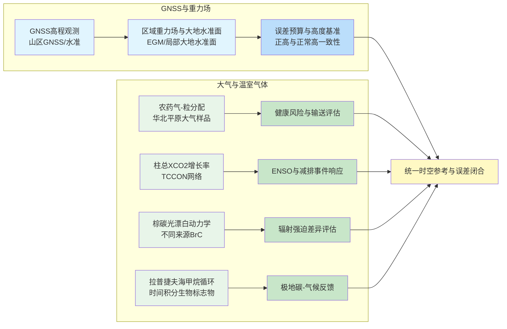
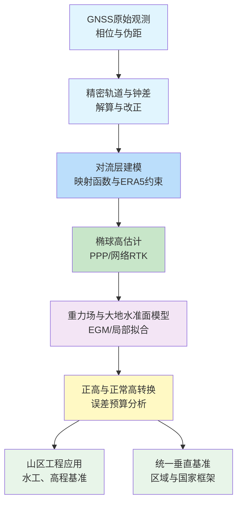
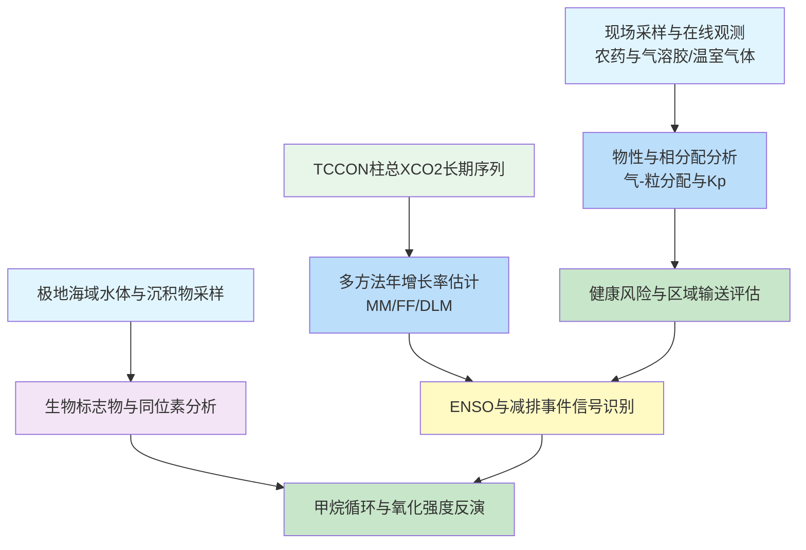
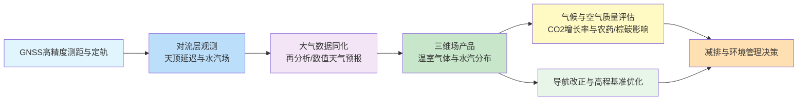

在2026年2月24日至3月3日这一时间段内，顶级与特色期刊在GNSS和大气方向上集中发布了若干具有代表性的研究成果。一方面，GNSS高程确定在地形起伏剧烈山区的误差来源、重力场模型与处理策略的贡献被系统量化；另一方面，大气方向围绕农药气溶胶分配、棕碳光漂白、柱总CO2长期增长率以及极地海域甲烷循环给出新的观测与机理约束。下文基于近一周论文目录及相关权威文献，对上述方向的研究现状与未来趋势进行结构化梳理。

## 一、本期研究印记图：多圈层一体化观测与误差闭合的强化

从本期论文整体来看，可以提炼出几个清晰的信号。GNSS方向上，高程确定研究不再局限于单一解算策略或单一误差源，而是围绕重力场模型、准大地水准面精度、天顶对流层延迟建模与解算策略构建完整误差预算框架；大气方向中，柱总XCO2的长期增长率监测与极地甲烷循环特征，与区域性农药污染和棕碳辐射强迫一起，构成了自对流层到平流层的温室气体与气溶胶综合约束。

这种从地表到大气层、多要素、多传感器一体化的观测体系，可以用下图进行抽象刻画。

该图突出显示了本期研究在GNSS和大气各自层面的共同特征：一是重视误差源分解与定量化，二是强调长期连续观测对气候信号与人为干扰识别的重要性，三是通过数据同化和机器学习将观测与模型紧密耦合。下面分别从这几方面展开。

## 二、GNSS方向：山区高程确定与高精度大地水准面的误差链条

### 2.1 方向综述与技术结构

近期GNSS方向的代表性工作集中在两个层面：一是山区环境下GNSS测高与重力场模型的协同应用，二是结合惯导、气象再分析和多源重力信息实现垂向分量精度的系统提升。GPS Solutions 等期刊的最新论文表明，在高坡度、高起伏区域，仅依赖全球大地水准面模型或传统GNSS/水准组合，很难在工程上稳定实现厘米级正高，必须通过局部重力测量、局地准大地水准面拟合与改进的GNSS解算策略来构建闭合的高度基准。

从方法论演进来看，GNSS高程确定正由单一解算与经验改正，转向显式的误差预算分析。研究系统评估了重力场模型阶数截断、地形改正、准大地水准面内插方法、对流层映射函数和天顶延迟估计等因素对高程结果的贡献，并提出在山区采用多模型比较与本地校准相结合的策略，以降低系统性偏差。与此同时，结合ERA5等再分析产品对天顶延迟进行约束，以及使用组合GNSS/惯导后处理框架，可在飞行测量等场景显著压缩垂向误差。

下图给出了当前GNSS高程确定方向的简化技术结构。

在该结构下，山区高程确定的研究重点转向两个问题：其一是在复杂地形条件下提高重力场与大地水准面模型的可靠性，其二是通过联合解算与误差传播分析，明确各子系统对最终高程结果的贡献。

### 2.2 专题画像：山区GNSS高程确定中各误差源的定量贡献

#### （1）技术路线

Strugarek 等发表于 GPS Solutions 的最新工作针对山区环境下GNSS高程确定的整体误差预算进行了系统分析。研究在多条山地剖面上布设GNSS控制点，通过联合GNSS/水准实测高程与不同精度等级的重力场与大地水准面模型，构建了一套从椭球高到正高的全链路评价框架。技术路线包括高精度GNSS静态解算、严密大地水准面内插、地形改正与重力扰动处理，以及对流层延迟与多路径误差的统一考虑。在此基础上，研究分别考察了不同处理策略（如单历元与时段平均、不同映射函数和对流层约束）以及不同重力场模型组合对最终高程结果的影响。

#### （2）技术特点

该研究的突出特点在于，将传统上分散讨论的误差源纳入统一的定量框架。通过在山区区域内选取高差显著的剖面，并对比不同大地水准面模型与局部拟合结果，研究给出了重力场模型误差、内插方法和测量噪声在整体高程误差中的相对权重。结果显示，在坡度较大、地形起伏剧烈的区域，全球大地水准面模型带来的系统偏差可达到数厘米量级，而适当增加局地重力点、采用分区拟合方法，可将该项误差压缩到厘米级以下。同时，当对流层延迟利用再分析资料进行约束时，GNSS解算中天顶延迟参数的不确定度显著降低，有利于抑制垂向分量的随机误差。

#### （3）重要结论

该研究的重要结论是：**山区环境下GNSS高程确定的总体误差主要由大地水准面模型与对流层建模共同决定，通过局地重力加密与再分析约束可以将高程精度稳定控制在厘米级范围内，为水工工程、高精度水准网加密和统一垂直基准建设提供了可操作的技术路线**。这一结论在工程应用层面明确了重力场与GNSS解算协同优化的优先顺序，也为后续在高山峡谷地区设计高程基准维护方案提供了量化依据。

## 三、大气方向：从局地污染输送到全球柱总温室气体与极地甲烷循环

### 3.1 方向综述与代表性技术路径

本期大气方向的工作分布在农药气溶胶分配、柱总CO2增长率分析、棕碳光漂白机理以及极地海域甲烷循环等若干子主题。Atmospheric Chemistry and Physics 报道的华北平原大气农药研究表明，农药在气相与颗粒相之间的分配不仅依赖化合物自身物性参数，还受粒子相态、相对湿度与使用时序共同控制；另一篇关于棕碳光漂白的论文则从分子结构层面解释了不同来源BrC的光化学老化速率差异。Biogeosciences 相关工作一方面利用TCCON网络分析了2010—2024年全球各区域柱总XCO2的年增长率及其对ENSO与疫情减排事件的响应，另一方面通过时间积分生物标志物刻画了拉普捷夫海甲烷循环的空间格局与长期强度。

总体上，大气方向呈现出从单点观测向网络化、从单一组分向多气体耦合、从短期实验向多年序列与再分析产品集成的趋势。下图概括了代表性研究的技术路线。

在该框架下，本期大气方向的代表性论文共同指向一个趋势，即通过高精度观测与多源数据融合加强对温室气体与短寿命气候强迫因子的约束，为碳预算核算和健康风险评估提供更坚实的物理基础。

### 3.2 专题画像：华北平原大气农药气-粒分配及其机制

#### （1）技术路线

Guo 等人在 Atmospheric Chemistry and Physics 发表的研究针对华北平原大气中19种农药的气相与颗粒相分配特征开展了系统观测。研究在典型农业县域布设采样点，通过同步采集气相和颗粒物样品，并采用高分辨质谱分析各类农药质量浓度，结合温度、相对湿度和颗粒物组成信息，计算了各物质的气-粒分配系数。进一步利用多参数回归与分配模型，探讨了农药物性、环境条件与颗粒物相态对分配行为的影响。

#### （2）技术特点

该研究的技术优势在于，将农药分配行为从传统的经验Kp—物性关系拓展到考虑颗粒物有机相膜结构和环境湿度耦合效应。结果显示，本期观测中颗粒相农药质量占总量的比例可达九成以上，且温度升高并不简单地导致颗粒相比例下降，而是通过改变颗粒相态与吸收行为引起更复杂的响应。模型模拟表明，吸收过程是主导的分配机制，大气农药主要被吸收进入颗粒物有机相内部。

#### （3）重要结论

该研究的重要结论是：**华北平原大气中多数农药在颗粒相高度富集，其气-粒分配行为由化合物物性、颗粒物有机相结构与环境湿度共同控制，吸收过程是主导机制，这一结果对区域健康风险评估和跨区域输送模式设定具有直接约束作用**。这一结论意味着，在进行农药大气迁移模拟时，需要引入更精细的气-粒分配参数化，而不能仅依赖简单的温度与蒸汽压关系。

### 3.3 专题画像：TCCON网络约束下的柱总CO2年增长率及特殊事件响应

#### （1）技术路线

Mostafavi Pak 等人在 Biogeosciences 发表的工作基于12个TCCON站点2010—2024年的柱总XCO2观测序列，系统分析了不同纬度带的年增长率及其对ENSO和疫情减排的响应。研究分别采用月平均法、傅里叶拟合法和动态线性模型三种方法估计年增长率，并将结果与Mauna Loa近地面浓度数据以及CAMS再分析产品进行对比，以评估方法对数据缺测的鲁棒性和区域差异。

#### （2）技术特点

该研究在方法上的特点是，将三种常用趋势估计方法置于统一框架下比较，并显式引入动态线性模型以提升对数据缺测与噪声的适应能力。结果表明，在极地站点由于极夜导致严重数据缺口时，动态线性模型在恢复年际信号方面明显优于其他方法。区域平均结果显示，全球各区域柱总XCO2年增长率大致处于2.33–2.40 ppm yr⁻¹之间，与近地面观测保持一致。

#### （3）重要结论

该研究的重要结论是：**柱总XCO2长期增长率在不同纬度带间保持高度一致，2015–2016年强ENSO事件导致的增长率异常高达约1.7 ppm yr⁻¹，而2020年疫情期间仅在北半球中纬度30–40度带观测到约0.4 ppm yr⁻¹的减弱信号，这表明短期人为减排对大气柱总CO2增长率的可检测影响具有明显区域差异**。这一结论强化了长期高质量柱总观测在评估减排政策成效和识别气候事件影响方面的独特作用。

### 3.4 专题画像：极地拉普捷夫海甲烷循环的时间积分生物标志物指示

#### （1）技术路线

Eriksson 等人在 Biogeosciences 报道的研究利用拉普捷夫海架区表层沉积物中C30 hopanoid 类生物标志物及其碳同位素组成，反演了区域内长期的有氧甲烷氧化强度与甲烷循环格局。研究结合16S rRNA 微生物群落分析，以多种hopenes与hopanols的δ13C特征识别甲烷氧化菌的来源与代谢途径，并与水体甲烷浓度观测进行对比。

#### （2）技术特点

该研究的技术特点在于使用时间积分性质的生物标志物，将高度时空变率的水体甲烷浓度转化为沉积物尺度上的长期平均信号，从而克服稀疏观测与风暴混合导致的短期数据不稳定问题。结果显示，整个拉普捷夫海架区δ13C-C30 hopenes普遍偏轻，表明普遍存在较强的有氧甲烷氧化，且在外陆架区域最为显著。

#### （3）重要结论

该研究的重要结论是：**拉普捷夫海架区存在广泛而持续的甲烷循环和有氧氧化过程，外陆架区域的甲烷氧化信号最为强烈，中陆架和河口附近区域则表现出源—汇混合的复杂格局，这一发现为评估北极近海甲烷排放对大气甲烷负荷的长期贡献提供了关键证据**。该结果说明，即便水体观测在时间上高度离散，沉积物生物标志物仍可用于恢复甲烷循环的长期空间结构。

## 四、GNSS—大气交叉的创新链与未来趋势

综合本期及近年的研究，可以看到GNSS与大气研究之间存在清晰的技术耦合链条：GNSS提供高精度的时空基准，同时也作为对流层状态探测载体；大气的精细观测和再分析产品则反过来影响GNSS测量的误差建模与改正。下图给出了简化的创新链流程。

可以预期，在未来3–5年内，这一创新链将沿两个方向深化。一是GNSS高度基准与大气再分析和数值预报产品将被更紧密地集成到统一的时空参考框架中，实现从地表到对流层顶的多圈层一体化误差闭合；二是利用长期柱总XCO2序列和极地甲烷循环指标，构建更具可验证性的气候与环境风险评估体系。

## 六、近期研究特色与发展展望

从近期工作看，GNSS与大气相关研究呈现出以下几个值得关注的趋势。

- **误差预算与不确定度刻画更加细致**  
  在GNSS高程确定、电离层同化和温室气体趋势分析中，研究普遍强调对系统误差和随机误差的分解，并通过贝叶斯框架、动态线性模型和多源对比给出量化的不确定度范围。

- **多源观测与模型耦合日益紧密**  
  柱总XCO2与近地面浓度、再分析产品的综合使用，拉普捷夫海甲烷循环中水体观测与沉积物标志物的结合，以及电离层中GNSS、掩星与经验模型的融合，体现出从单源数据向多源一体化的明显转变。

- **机器学习方法逐步嵌入物理框架**  
  无论是电离层参数预测还是大气成分反演，最新研究普遍采用在物理约束下进行残差建模的思路，使数据驱动方法既能捕捉复杂非线性，又不损害物理一致性。

未来研究可围绕以下方向展开：在GNSS领域，继续推进山区与极区的重力场加密与本地大地水准面拟合，并将对流层与电离层改正纳入统一误差预算框架；在大气与温室气体监测方面，结合机载与星载高光谱观测，构建多尺度、多时间分辨率的甲烷与CO2观测网络；在电离层方向，进一步发展将层次贝叶斯方法与深度学习结合的同化框架，以更好地支撑全球导航系统的抗扰性评估与空间天气服务。

## 七、参考文献

1. Guo, L., Shi, S., Li, Y., Brüggemann, M., Zhao, M., Mu, H., Figueiredo, D. M., Wu, J., & Wang, K. (2026). Gas-particle partitioning of pesticides in the atmosphere of the North China Plain. *Atmospheric Chemistry and Physics*, 26, 2797–2815. https://doi.org/10.5194/acp-26-2797-2026  
2. Mostafavi Pak, N., Hachmeister, J., Rettinger, M., Buschmann, M., Deutscher, N. M., Griffith, D. W. T., Iraci, L. T., Lan, X., McGee, E., Morino, I., et al. (2026). Annual growth rates of column-averaged CO2 inferred from the Total Carbon Column Observing Network (TCCON). *Biogeosciences*, 23, 1477–1502. https://doi.org/10.5194/bg-23-1477-2026  
3. Qiu, Y., Qiu, T., Liu, Y., Gu, Y., Man, R., Liang, D., Zong, T., Wu, Z., & Hu, M. (2026). Understanding divergent brown carbon photobleaching rates from molecular perspective. *Atmospheric Chemistry and Physics*, 26, 2785–2805. https://doi.org/10.5194/acp-26-2785-2026  
4. Eriksson, A., Wild, B., Hong, W.-L., Holmstrand, H., Nascimento, F. J. A., Bonaglia, S., Kosmach, D., Semiletov, I., Shakhova, N., & Gustafsson, Ö. (2026). Enhanced methane cycling across the Laptev Sea signaled by time-integrated biomarkers of aerobic methane oxidation. *Biogeosciences*, 23, 1459–1483. https://doi.org/10.5194/bg-23-1459-2026  
5. Strugarek, D., Trojanowicz, M., Mikoś, M., Gałdyn, F., Nowak, A., Kur, T., Smolak, K., & Sośnica, K. (2026). Height determination based on GNSS measurements in the mountainous area: Contribution of the geoid model and data processing technique to the overall error budget. *GPS Solutions*. https://doi.org/10.1007/s10291-026-02043-7  

